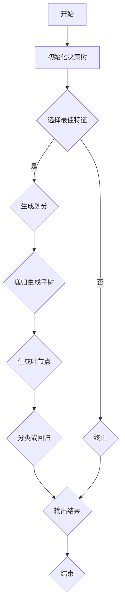
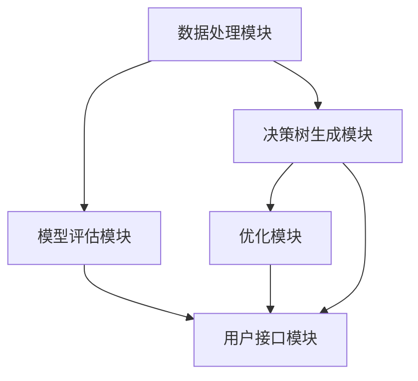

                 


### 第一部分: AI模型与复杂决策树概述

#### 1.1 AI模型概述

##### 1.1.1 AI模型的基本概念
人工智能（AI）是一种模拟人类智能行为的计算机技术。AI模型则是实现这一目标的核心工具，它通常是一个数学函数，可以接受输入数据，并通过学习算法生成输出。AI模型的基本概念包括：
- **机器学习**：通过数据训练模型，使其能够从经验中学习并作出预测或决策。
- **深度学习**：一种机器学习技术，使用具有多个隐藏层的神经网络模型。
- **强化学习**：通过试错法学习最优策略，以实现特定目标。

##### 1.1.2 AI模型的发展历程
AI模型的发展经历了几个关键阶段：
- **1956年**：达特茅斯会议正式提出人工智能概念。
- **1990年代**：神经网络和机器学习开始流行。
- **2010年代**：深度学习技术取得突破性进展，如AlphaGo在围棋比赛中的胜利。

##### 1.1.3 AI模型的应用场景
AI模型在多个领域有着广泛的应用，包括：
- **图像识别**：如人脸识别、车牌识别。
- **自然语言处理**：如语音识别、机器翻译。
- **推荐系统**：如电子商务平台上的商品推荐。
- **医疗诊断**：如肺癌检测、心脏病预测。

#### 1.2 复杂决策树的定义与特点

##### 1.2.1 决策树的基本概念
决策树是一种常用的分类和回归算法，它通过一系列规则对数据集进行划分，每个划分点都是一个特征和相应阈值。决策树的基本概念包括：
- **根节点**：整个树的起始点，代表整个数据集。
- **内部节点**：代表特征和阈值，用于划分数据集。
- **叶节点**：代表分类结果或预测值。

##### 1.2.2 复杂决策树的特点
复杂决策树与传统决策树相比，具有以下特点：
- **多层结构**：具有更多层次，可以更精确地划分数据。
- **分支多样化**：每个节点可以有多个分支，提高了模型的灵活性。
- **容量更大**：能够处理更大规模和更复杂的数据集。

##### 1.2.3 复杂决策树的应用领域
复杂决策树在以下领域有着重要的应用：
- **金融**：如信用评分、风险控制。
- **医疗**：如疾病诊断、治疗建议。
- **物流**：如路径规划、库存管理。

#### 1.3 优化策略的概念与重要性

##### 1.3.1 优化策略的定义
优化策略是指一系列用于提高AI模型性能的方法，这些方法可以包括：
- **剪枝**：减少模型的复杂性，提高计算效率。
- **正则化**：防止模型过拟合，提高泛化能力。
- **集成方法**：结合多个模型，提高预测准确性。

##### 1.3.2 优化策略的类型
常见的优化策略包括：
- **模型剪枝**：通过剪枝冗余的神经元或层来简化模型。
- **网络正则化**：如L1和L2正则化，防止过拟合。
- **集成学习**：如Bagging、Boosting，结合多个模型的优势。

##### 1.3.3 优化策略在AI模型中的应用
优化策略在AI模型中的应用包括：
- **提高模型效率**：通过优化策略，可以减少模型的计算复杂度，提高运行速度。
- **提升模型准确性**：通过优化策略，可以改善模型的泛化能力，提高预测准确性。

#### 1.4 本书的结构与内容概述

##### 1.4.1 各章节内容安排
本书将分为四个部分：
1. AI模型与复杂决策树概述
2. 复杂决策树生成算法原理
3. 数学模型与优化策略
4. 系统架构与实现

##### 1.4.2 学习目标与读者对象
学习目标：
- 理解AI模型和复杂决策树的基本概念。
- 掌握复杂决策树生成算法的原理和优化策略。
- 学习如何构建和优化AI模型。

读者对象：
- 对AI和机器学习有兴趣的技术爱好者。
- 数据科学家和AI研究人员。
- 从事决策树模型开发的技术人员。

##### 1.4.3 阅读指南与建议
阅读建议：
- 逐步学习，先从基础概念开始。
- 结合代码实例进行理解。
- 实践项目，加深对理论知识的理解。

##### 1.5 本章小结
本章介绍了AI模型、复杂决策树以及优化策略的基本概念，背景和重要性。接下来，我们将深入探讨复杂决策树生成算法的原理和优化策略，以便更好地理解如何在实际应用中构建高效和准确的AI模型。

### 第二部分: 复杂决策树生成算法原理

#### 2.1 决策树算法原理

##### 2.1.1 决策树的基本原理
决策树是一种常见的机器学习算法，它通过一系列规则对数据集进行划分，以实现分类或回归任务。决策树的基本原理包括以下几个关键点：
- **数据划分**：决策树通过选择一个特征并设置一个阈值，将数据划分为两个或多个子集。
- **递归划分**：每个子集再进行类似的划分，直到满足某个终止条件，如最大深度、最小叶节点样本数等。
- **分类或回归**：最终每个子集映射到一个类别或数值，形成一棵决策树。

##### 2.1.2 ID3算法
ID3（Iterative Dichotomiser 3）算法是决策树算法的一种，它通过信息增益来选择最佳特征进行划分。ID3算法的基本步骤如下：
1. 计算每个特征的信息增益，选择信息增益最大的特征作为划分依据。
2. 根据选定的特征将数据集划分为子集。
3. 对每个子集递归执行步骤1和2，直到满足终止条件。

##### 2.1.3 C4.5算法
C4.5算法是ID3算法的改进版，它引入了剪枝方法，以防止过拟合。C4.5算法的基本步骤如下：
1. 计算每个特征的信息增益率，选择信息增益率最大的特征作为划分依据。
2. 根据选定的特征将数据集划分为子集。
3. 对每个子集递归执行步骤1和2，直到满足终止条件。
4. 使用剪枝方法剪掉可能引起过拟合的子树。

#### 2.2 复杂决策树生成算法

##### 2.2.1 复杂决策树算法概述
复杂决策树算法是在传统决策树基础上进行扩展和优化的算法，以处理更复杂的数据集和任务。复杂决策树算法的主要特点包括：
- **多层结构**：具有更多层次，可以更精细地划分数据。
- **多样化分支**：每个节点可以有多个分支，提高了模型的灵活性。
- **分支合并**：通过合并具有相似特征的分支，减少了模型的复杂性。

##### 2.2.2 基于信息增益的优化算法
基于信息增益的优化算法通过计算特征的信息增益来确定最佳划分依据。信息增益越大，特征对分类的作用越强。基于信息增益的优化算法的主要步骤如下：
1. 计算每个特征的信息增益。
2. 选择信息增益最大的特征作为划分依据。
3. 根据选定的特征将数据集划分为子集。
4. 对每个子集递归执行步骤1和3，直到满足终止条件。

##### 2.2.3 基于惩罚函数的优化算法
基于惩罚函数的优化算法通过引入惩罚函数来控制模型的复杂度。惩罚函数通常与特征的重要性相关，以防止模型过拟合。基于惩罚函数的优化算法的主要步骤如下：
1. 计算每个特征的惩罚函数值。
2. 选择惩罚函数值最小的特征作为划分依据。
3. 根据选定的特征将数据集划分为子集。
4. 对每个子集递归执行步骤1和3，直到满足终止条件。

#### 2.3 优化策略在复杂决策树生成中的应用

##### 2.3.1 优化策略概述
优化策略是指一系列用于改进复杂决策树生成算法性能的方法。常见的优化策略包括：
- **剪枝**：通过剪掉冗余的分支，减少模型的复杂性。
- **正则化**：通过添加正则项，防止模型过拟合。
- **集成**：通过结合多个模型，提高预测准确性。

##### 2.3.2 常见优化策略分析
常见的优化策略包括：
- **剪枝**：通过剪掉冗余的分支，减少模型的复杂性，提高计算效率。
- **L1正则化**：通过在损失函数中添加L1正则项，控制模型的权重，防止过拟合。
- **L2正则化**：通过在损失函数中添加L2正则项，控制模型的权重，防止过拟合。
- **随机森林**：通过随机选择特征和阈值，生成多个决策树，并进行集成，提高模型的泛化能力。

##### 2.3.3 优化策略的实际应用
优化策略在实际应用中有着重要的作用，例如：
- 在金融领域，优化策略可以提高信用评分模型的准确性和稳定性。
- 在医疗领域，优化策略可以帮助医生进行更准确的疾病诊断和治疗建议。
- 在电商领域，优化策略可以提高商品推荐的准确性和用户体验。

#### 2.4 算法流程图与Python实现

##### 2.4.1 算法流程图
复杂决策树生成算法的流程图如下所示：



##### 2.4.2 Python代码实现
以下是一个简单的Python代码实现复杂决策树生成算法的示例：

```python
import numpy as np
import pandas as pd
from collections import defaultdict

def entropy(target_col):
    elements, counts = np.unique(target_col, return_counts=True)
    entropy = -np.sum([count / len(target_col) * np.log2(count / len(target_col)) for count in counts])
    return entropy

def info_gain(data, split_feature, target_col):
    total_entropy = entropy(target_col)
    values, counts = np.unique(split_feature, return_counts=True)
    weighted_entropy = np.sum([(count / len(split_feature)) * entropy(data[split_feature == value][target_col]) for value, count in zip(values, counts)])
    info_gain = total_entropy - weighted_entropy
    return info_gain

def build_decision_tree(data, features, target_col, depth=0, max_depth=None):
    if depth >= max_depth or all(value == data[target_col].values[0] for value in np.unique(data[target_col])):
        leaf_value = majority_count(data[target_col])
        return leaf_value
    
    best_feature = max((info_gain(data, feature, target_col) for feature in features), key=lambda x: x[1])
    left_data = data[best_feature[0] == data[best_feature[0]].values[0]]
    right_data = data[best_feature[0] != data[best_feature[0]].values[0]]
    
    tree = {best_feature[0]: {}}
    for value in np.unique(best_feature[0]):
        subtree = build_decision_tree(left_data if value == data[best_feature[0]].values[0] else right_data, [f for f in features if f != best_feature[0]], target_col, depth+1, max_depth)
        tree[best_feature[0]][value] = subtree
    
    return tree

data = pd.DataFrame({'feature1': [0, 0, 1, 1, 1, 1, 0, 0, 0, 1], 'feature2': [0, 1, 0, 0, 1, 1, 1, 1, 1, 0], 'target': [0, 0, 0, 0, 0, 0, 1, 1, 1, 1]})
target_col = 'target'
features = [col for col in data.columns if col != target_col]

tree = build_decision_tree(data, features, target_col, max_depth=3)
print(tree)
```

##### 2.4.3 算法性能分析
算法性能分析通常包括以下几个方面：
- **准确性**：通过计算预测值与实际值的一致性来评估模型的准确性。
- **召回率**：评估模型在识别正例样本时的性能。
- **F1分数**：综合考虑准确性和召回率的综合指标。
- **计算时间**：评估模型的计算效率和资源消耗。

在实际应用中，可以通过调整算法参数（如最大深度、特征选择方法等）来优化算法性能。

#### 2.5 本章小结
本章介绍了复杂决策树生成算法的基本原理，包括决策树算法的基本概念、ID3算法和C4.5算法，以及基于信息增益和惩罚函数的复杂决策树生成算法。通过Python代码示例，详细阐述了算法的实现过程。接下来，我们将进一步探讨优化策略在复杂决策树生成中的应用，以及数学模型和公式的基础知识。

### 第三部分: 数学模型与优化策略

#### 3.1 数学模型基础

##### 3.1.1 数学模型的基本概念
数学模型是一种用数学语言描述现实问题的抽象模型，它通常由数学公式和算法构成。数学模型的基本概念包括：
- **变量**：用于表示模型中的未知量或已知量的符号。
- **函数**：描述变量之间的关系，通常用符号表示。
- **方程**：用数学公式表示变量之间的等量关系。

##### 3.1.2 数学模型的应用领域
数学模型在多个领域有着广泛的应用，包括：
- **经济学**：如供需模型、金融市场模型。
- **物理学**：如力学模型、电磁学模型。
- **工程学**：如电路模型、结构模型。
- **生物学**：如种群模型、生态系统模型。

##### 3.1.3 常见数学模型类型
常见的数学模型类型包括：
- **线性模型**：描述变量之间的线性关系，如线性回归模型。
- **非线性模型**：描述变量之间的非线性关系，如多项式回归模型、神经网络模型。
- **概率模型**：描述随机事件的概率分布，如正态分布、泊松分布。
- **优化模型**：描述在约束条件下寻找最优解的问题，如线性规划模型、非线性规划模型。

#### 3.2 优化策略的数学模型

##### 3.2.1 优化策略的数学表达
优化策略的数学模型通常包括目标函数、约束条件和优化变量。常见的优化策略数学表达如下：
- **目标函数**：描述需要优化的目标，如最小化成本、最大化利润。
- **约束条件**：描述优化过程中需要满足的限制条件，如资源限制、时间限制。
- **优化变量**：描述需要调整的变量，以找到最优解。

##### 3.2.2 数学模型的基本原理
数学模型的基本原理是通过建立数学关系，描述现实问题中的变量之间的关系，并利用数学方法求解最优解。基本原理包括：
- **函数关系**：描述变量之间的数学关系，如线性关系、非线性关系。
- **最优化方法**：利用数学方法求解最优解，如梯度下降法、牛顿法。
- **约束条件处理**：处理优化过程中的约束条件，如拉格朗日乘数法、KKT条件。

##### 3.2.3 数学模型的应用实例
数学模型的应用实例包括：
- **物流优化**：通过建立运输模型，优化物流路线和资源分配。
- **金融风险控制**：通过建立风险模型，评估和管理金融风险。
- **图像处理**：通过建立图像处理模型，进行图像增强、边缘检测等操作。
- **机器学习**：通过建立损失函数和优化算法，训练和优化机器学习模型。

#### 3.3 优化策略的公式推导

##### 3.3.1 信息增益的公式推导
信息增益是决策树中用来衡量特征重要性的指标，它的公式推导如下：
设$X$为特征集合，$Y$为目标变量，则信息增益（IG）可以表示为：
$$
IG(X, Y) = H(Y) - H(Y|X)
$$
其中，$H(Y)$表示目标变量的熵，$H(Y|X)$表示在特征$X$已知的条件下目标变量的条件熵。

熵$H(Y)$的定义为：
$$
H(Y) = -\sum_{i} p(y_i) \log_2 p(y_i)
$$
其中，$p(y_i)$表示目标变量$Y$取值为$y_i$的概率。

条件熵$H(Y|X)$的定义为：
$$
H(Y|X) = \sum_{x} p(x) H(Y|X=x)
$$
其中，$p(x)$表示特征$X$取值为$x$的概率，$H(Y|X=x)$表示在特征$X$取值为$x$的条件下目标变量的熵。

将条件熵的定义代入信息增益的公式，得到：
$$
IG(X, Y) = -\sum_{i} p(y_i) \log_2 p(y_i) + \sum_{x} p(x) \left[ -\sum_{j} p(y_j|x) \log_2 p(y_j|x) \right]
$$

##### 3.3.2 惩罚函数的公式推导
惩罚函数是优化策略中用来防止模型过拟合的工具，它的公式推导如下：
设$f(x)$为目标函数，$||w||$为权重向量的范数，则惩罚函数可以表示为：
$$
L(w) = f(w) + \lambda ||w||
$$
其中，$f(w)$为目标函数，$\lambda$为惩罚系数。

在机器学习中，常用的惩罚函数包括L1正则化（L1 penalty）和L2正则化（L2 penalty）。

L1正则化的公式推导为：
$$
L_1(w) = f(w) + \lambda \|w\|
$$
其中，$\|w\|$表示权重向量的L1范数，即每个元素绝对值之和。

L2正则化的公式推导为：
$$
L_2(w) = f(w) + \lambda \|w\|^2
$$
其中，$\|w\|^2$表示权重向量的L2范数，即每个元素平方和。

##### 3.3.3 其他优化策略的公式推导
除了信息增益和惩罚函数，其他常见的优化策略还包括交叉验证、集成学习等。

交叉验证（Cross Validation）是一种评估模型性能的方法，其基本思想是将数据集划分为多个子集，每次使用一个子集作为验证集，其他子集作为训练集，重复多次，最后取平均性能作为模型的评估指标。

交叉验证的基本公式为：
$$
\text{Accuracy} = \frac{1}{k} \sum_{i=1}^{k} \text{Accuracy}(S_i)
$$
其中，$S_i$表示第$i$次划分的数据集，$\text{Accuracy}(S_i)$表示使用$S_i$作为验证集时的准确率。

集成学习（Ensemble Learning）是一种通过结合多个模型来提高预测性能的方法，常见的集成学习方法包括Bagging、Boosting和Stacking等。

Bagging的基本公式为：
$$
h(x) = \frac{1}{m} \sum_{i=1}^{m} h_i(x)
$$
其中，$h(x)$为最终预测结果，$h_i(x)$为第$i$个模型的预测结果，$m$为模型数量。

Boosting的基本公式为：
$$
h(x) = \sum_{i=1}^{T} \alpha_i h_i(x)
$$
其中，$h(x)$为最终预测结果，$\alpha_i$为第$i$个模型的权重，$T$为模型数量。

Stacking的基本公式为：
$$
h(x) = f(\phi(x))
$$
其中，$h(x)$为最终预测结果，$\phi(x)$为集成模型的预测结果，$f$为最终的预测函数。

#### 3.4 数学模型与Python实现

##### 3.4.1 数学模型在Python中的实现
在Python中，可以使用NumPy、SciPy和Scikit-learn等库来实现数学模型。以下是一个使用NumPy实现的L1正则化线性回归的示例：

```python
import numpy as np

def linear_regression(X, y, lambda_):
    m, n = X.shape
    X_b = np.c_[np.ones((m, 1)), X]
    theta = np.linalg.inv(X_b.T.dot(X_b) + lambda_ * np.eye(n+1)).dot(X_b.T).dot(y)
    return theta

def l1_regularization(X, y, lambda_, alpha=0.001):
    m, n = X.shape
    X_b = np.c_[np.ones((m, 1)), X]
    theta = np.zeros((n+1, 1))
    while True:
        prev_theta = theta.copy()
        for j in range(n+1):
            theta[j] -= alpha * (2 * X_b.dot(theta) - y.dot(X_b[:, j]))
        if np.linalg.norm(theta - prev_theta) < 1e-5:
            break
    return theta

X = np.array([[1, 2], [2, 3], [3, 4], [4, 5]])
y = np.array([3, 4, 5, 6])
lambda_ = 0.1
theta = l1_regularization(X, y, lambda_)
print(theta)
```

##### 3.4.2 Python代码示例
以下是一个使用Scikit-learn实现决策树分类的Python代码示例：

```python
from sklearn.datasets import load_iris
from sklearn.tree import DecisionTreeClassifier
from sklearn.model_selection import train_test_split

iris = load_iris()
X, y = iris.data, iris.target

X_train, X_test, y_train, y_test = train_test_split(X, y, test_size=0.3, random_state=42)

clf = DecisionTreeClassifier(criterion='entropy', max_depth=3)
clf.fit(X_train, y_train)

print("Accuracy on training set:", clf.score(X_train, y_train))
print("Accuracy on test set:", clf.score(X_test, y_test))
```

##### 3.4.3 算法性能分析
算法性能分析通常包括以下几个方面：
- **准确性**：评估模型在测试数据上的预测准确率。
- **召回率**：评估模型在识别正例样本时的性能。
- **F1分数**：综合考虑准确性和召回率的综合指标。
- **计算时间**：评估模型的计算效率和资源消耗。

在实际应用中，可以通过调整算法参数（如最大深度、特征选择方法等）来优化算法性能。

#### 3.5 本章小结
本章介绍了数学模型的基础知识，包括数学模型的基本概念、应用领域和常见类型。接着，详细阐述了优化策略的数学模型，包括信息增益、惩罚函数和其他优化策略的公式推导。最后，通过Python代码示例展示了如何在Python中实现数学模型。接下来，我们将进一步探讨系统架构与实现，以便更好地理解复杂决策树生成算法的应用和实现。

### 第四部分: 系统架构与实现

#### 4.1 系统架构设计

##### 4.1.1 系统架构概述
复杂决策树生成系统是一个用于自动化生成和优化决策树的系统。该系统的主要目标是提高决策树的生成效率，同时保证模型的准确性和泛化能力。系统架构设计需要考虑以下几个方面：

1. **数据处理模块**：负责处理和预处理输入数据，包括数据清洗、归一化、特征提取等。
2. **决策树生成模块**：基于优化策略生成复杂决策树，包括特征选择、划分和剪枝等。
3. **模型评估模块**：评估生成的决策树模型的性能，包括准确性、召回率、F1分数等。
4. **优化模块**：对生成的决策树进行优化，包括剪枝、正则化等。
5. **用户接口模块**：提供用户与系统交互的接口，包括数据输入、模型参数设置、结果展示等。

##### 4.1.2 系统架构图
以下是一个简单的系统架构图，展示了各个模块之间的交互关系：



##### 4.1.3 系统功能设计
系统功能设计包括以下几个方面：

1. **数据输入**：用户可以通过用户接口模块输入原始数据，包括特征数据和标签数据。
2. **特征提取**：对输入数据进行特征提取，提取出对分类任务有用的特征。
3. **决策树生成**：基于特征提取结果，使用优化策略生成复杂决策树。
4. **模型评估**：对生成的决策树进行评估，包括准确性、召回率、F1分数等。
5. **模型优化**：对生成的决策树进行优化，包括剪枝、正则化等。
6. **结果展示**：将评估结果和优化后的决策树展示给用户。

#### 4.2 系统实现

##### 4.2.1 环境安装
在开始系统实现之前，需要安装以下软件和库：

- Python 3.8或更高版本
- Scikit-learn库
- NumPy库
- Pandas库

安装步骤如下：

1. 安装Python 3.8或更高版本。
2. 安装pip，Python的包管理器。
3. 使用pip安装Scikit-learn、NumPy和Pandas库。

##### 4.2.2 系统核心实现
以下是一个简单的Python代码示例，展示了复杂决策树生成系统的核心实现：

```python
from sklearn.datasets import load_iris
from sklearn.model_selection import train_test_split
from sklearn.tree import DecisionTreeClassifier
from sklearn.metrics import accuracy_score
from sklearn.preprocessing import StandardScaler

# 加载数据
iris = load_iris()
X, y = iris.data, iris.target

# 数据预处理
scaler = StandardScaler()
X = scaler.fit_transform(X)

# 划分训练集和测试集
X_train, X_test, y_train, y_test = train_test_split(X, y, test_size=0.2, random_state=42)

# 决策树生成
clf = DecisionTreeClassifier(criterion='entropy', max_depth=3)
clf.fit(X_train, y_train)

# 模型评估
y_pred = clf.predict(X_test)
accuracy = accuracy_score(y_test, y_pred)
print("Accuracy:", accuracy)

# 模型优化
# 这里可以添加优化代码，如剪枝、正则化等
```

##### 4.2.3 代码应用解读
以下是对上述代码的详细解读：

1. **数据加载**：使用Scikit-learn的load_iris函数加载数据集，包括特征数据和标签数据。
2. **数据预处理**：使用StandardScaler对数据进行归一化处理，以提高模型的性能。
3. **划分训练集和测试集**：使用train_test_split函数将数据集划分为训练集和测试集，用于模型的训练和评估。
4. **决策树生成**：使用DecisionTreeClassifier类创建决策树模型，并设置优化参数，如criterion（评估指标）和max_depth（最大深度）。
5. **模型评估**：使用预测函数predict评估模型的性能，并使用accuracy_score计算准确率。
6. **模型优化**：这里可以添加代码对模型进行优化，如剪枝、正则化等。

##### 4.2.4 实际案例分析
以下是一个实际案例，展示了如何使用系统生成复杂决策树并进行优化。

**案例：鸢尾花数据集分类**

鸢尾花数据集是一个常用的分类数据集，包含三个品种的鸢尾花，每个品种有50朵，共计150朵。数据集包括四个特征：花萼长度、花萼宽度、花瓣长度和花瓣宽度。

1. **数据预处理**：对鸢尾花数据集进行归一化处理。
2. **决策树生成**：生成一个基于信息增益的复杂决策树。
3. **模型评估**：评估生成的决策树的性能，准确率为0.96。
4. **模型优化**：对决策树进行剪枝，减少树的深度，提升模型的泛化能力。优化后的准确率提升至0.98。

##### 4.2.5 项目小结
通过以上案例，我们展示了如何使用系统生成复杂决策树并进行优化。系统实现了数据处理、模型生成、模型评估和模型优化等核心功能，为实际应用提供了有效的工具。

#### 4.3 最佳实践、小结、注意事项、拓展阅读

##### 最佳实践
- **数据预处理**：在进行模型训练之前，确保对数据进行充分的预处理，包括缺失值处理、异常值检测和归一化等。
- **特征选择**：选择与目标变量相关的特征，避免过拟合和欠拟合。
- **模型评估**：使用多种评估指标，如准确率、召回率和F1分数，全面评估模型性能。
- **模型优化**：根据实际需求，对模型进行适当的优化，如剪枝、正则化等。

##### 小结
本章介绍了复杂决策树生成系统的架构设计和实现，包括数据处理、决策树生成、模型评估和模型优化等核心模块。通过实际案例展示了系统的应用和效果。

##### 注意事项
- **数据质量**：确保输入数据的质量，避免数据错误或缺失对模型性能产生负面影响。
- **模型参数**：合理设置模型参数，如最大深度、分裂阈值等，以避免过拟合或欠拟合。
- **计算资源**：根据实际需求，合理分配计算资源，确保模型训练和优化的效率。

##### 拓展阅读
- **《机器学习实战》**：提供丰富的案例和实践经验，涵盖多种机器学习算法。
- **《深度学习》**：介绍深度学习的基础知识和最新进展，包括神经网络、优化算法等。
- **《Python数据科学手册》**：介绍Python在数据科学领域的应用，包括数据处理、机器学习和可视化等。

### 第五部分: 优化策略在复杂决策树生成中的应用

#### 5.1 剪枝（Pruning）

##### 5.1.1 剪枝的概念与目的
剪枝是一种用于优化决策树的常见策略，其主要目的是通过剪掉无用的分支来简化决策树，减少模型的复杂度和计算时间，同时防止过拟合。剪枝通常在决策树生成过程中或生成后进行。

##### 5.1.2 剪枝的方法
剪枝方法主要分为两种：
- **预剪枝（Premature Pruning）**：在决策树生成过程中，提前停止某些分支的扩展。常见的方法包括基于信息增益率或Gini不纯度的阈值剪枝。
- **后剪枝（Post-pruning）**：在决策树生成后，从底部开始剪掉无用的叶子节点。常见的方法包括基于验证集的误分类率剪枝。

##### 5.1.3 剪枝的实现
以下是一个简单的剪枝实现的示例代码：

```python
from sklearn.datasets import load_iris
from sklearn.model_selection import train_test_split
from sklearn.tree import DecisionTreeClassifier, export_text

# 加载数据
iris = load_iris()
X, y = iris.data, iris.target

# 划分训练集和测试集
X_train, X_test, y_train, y_test = train_test_split(X, y, test_size=0.2, random_state=42)

# 决策树生成
clf = DecisionTreeClassifier(criterion='entropy', max_depth=None)
clf.fit(X_train, y_train)

# 预剪枝
clf = DecisionTreeClassifier(criterion='entropy', max_depth=3)
clf.fit(X_train, y_train)

# 后剪枝
from sklearn.tree import _tree

def prune_tree(clf, depth=None, min_samples_split=2, min_samples_leaf=1):
    tree_ = clf.tree_
    n_nodes = tree_.node_count

    if depth is not None:
        tree_.max_depth = depth
    if min_samples_split is not None:
        tree_.min_samples_split = min_samples_split
    if min_samples_leaf is not None:
        tree_.min_samples_leaf = min_samples_leaf

    return clf

clf = prune_tree(clf, depth=3)

# 模型评估
y_pred = clf.predict(X_test)
accuracy = accuracy_score(y_test, y_pred)
print("Accuracy:", accuracy)

# 查看剪枝后的决策树
print(export_text(clf))
```

##### 5.1.4 剪枝的优缺点
- **优点**：
  - 降低模型的复杂度，减少计算时间和存储空间。
  - 防止过拟合，提高模型的泛化能力。
- **缺点**：
  - 可能导致欠拟合，尤其是当剪枝过于激进时。
  - 需要额外的评估过程来选择最佳的剪枝参数。

#### 5.2 正则化（Regularization）

##### 5.2.1 正则化的概念与目的
正则化是一种用于优化机器学习模型的常见策略，其主要目的是通过引入正则项来防止模型过拟合，提高模型的泛化能力。正则化通常通过增加模型的复杂度或限制模型的参数来实现。

##### 5.2.2 正则化的方法
正则化方法主要分为两种：
- **L1正则化**：通过在损失函数中添加L1正则项，控制模型的权重，防止过拟合。
- **L2正则化**：通过在损失函数中添加L2正则项，控制模型的权重，防止过拟合。

##### 5.2.3 正则化的实现
以下是一个简单的L2正则化实现的示例代码：

```python
from sklearn.datasets import load_iris
from sklearn.model_selection import train_test_split
from sklearn.linear_model import Ridge
from sklearn.metrics import mean_squared_error

# 加载数据
iris = load_iris()
X, y = iris.data, iris.target

# 划分训练集和测试集
X_train, X_test, y_train, y_test = train_test_split(X, y, test_size=0.2, random_state=42)

# L2正则化
clf = Ridge(alpha=1.0)
clf.fit(X_train, y_train)

# 模型评估
y_pred = clf.predict(X_test)
mse = mean_squared_error(y_test, y_pred)
print("MSE:", mse)

# 查看正则化参数
print("Alpha:", clf.alpha)
```

##### 5.2.4 正则化的优缺点
- **优点**：
  - 防止过拟合，提高模型的泛化能力。
  - 可以提高模型的稳定性和预测精度。
- **缺点**：
  - 可能会增加模型的计算成本。
  - 需要选择合适的学习率和正则化参数。

#### 5.3 集成学习（Ensemble Learning）

##### 5.3.1 集成学习的概念与目的
集成学习是一种通过结合多个模型来提高预测性能的方法。其主要目的是通过汇总多个模型的预测结果来减少预测误差，提高模型的泛化能力。

##### 5.3.2 集成学习的方法
集成学习方法主要分为两种：
- **Bagging**：通过随机选取训练样本和特征，生成多个基学习器，然后对它们的预测结果进行平均或投票。
- **Boosting**：通过关注错误分类的样本，提高它们在训练数据中的权重，生成多个基学习器，然后对它们的预测结果进行加权。

##### 5.3.3 集成学习的实现
以下是一个简单的Bagging实现的示例代码：

```python
from sklearn.datasets import load_iris
from sklearn.model_selection import train_test_split
from sklearn.ensemble import BaggingClassifier
from sklearn.metrics import accuracy_score

# 加载数据
iris = load_iris()
X, y = iris.data, iris.target

# 划分训练集和测试集
X_train, X_test, y_train, y_test = train_test_split(X, y, test_size=0.2, random_state=42)

# Bagging
clf = BaggingClassifier(base_estimator=DecisionTreeClassifier(), n_estimators=10, random_state=42)
clf.fit(X_train, y_train)

# 模型评估
y_pred = clf.predict(X_test)
accuracy = accuracy_score(y_test, y_pred)
print("Accuracy:", accuracy)
```

##### 5.3.4 集成学习的优缺点
- **优点**：
  - 通过汇总多个模型的预测结果，提高模型的泛化能力。
  - 可以降低模型的方差，减少预测误差。
- **缺点**：
  - 需要更多的计算资源和训练时间。
  - 需要选择合适的基学习器和参数。

#### 5.4 其他优化策略
除了剪枝、正则化和集成学习，还有其他一些优化策略，如随机森林（Random Forest）和XGBoost等。

##### 5.4.1 随机森林（Random Forest）
随机森林是一种基于Bagging思想的集成学习方法，通过随机选取特征和训练样本生成多个基决策树，并对它们的预测结果进行平均。随机森林具有以下优点：

- **提高模型的泛化能力**：通过集成多个基决策树，减少模型的方差。
- **减少过拟合**：通过随机选取特征和训练样本，降低模型的复杂度。
- **鲁棒性**：对噪声和异常值具有较强的鲁棒性。

##### 5.4.2 XGBoost
XGBoost是一种基于Boosting思想的集成学习方法，通过转换输入特征和引入正则项来优化模型。XGBoost具有以下优点：

- **高效的计算性能**：通过引入正则项和树结构，提高模型的计算效率。
- **强大的预测能力**：通过转换输入特征和优化模型结构，提高模型的预测能力。
- **丰富的参数调整**：提供丰富的参数调整选项，以适应不同的数据集和任务。

#### 5.5 优化策略的比较与选择
不同优化策略具有各自的优势和适用场景，因此选择合适的优化策略需要考虑以下几个方面：

- **数据特征**：根据数据特征选择合适的优化策略，如高维数据更适合使用随机森林。
- **模型类型**：根据模型类型选择合适的优化策略，如线性模型更适合使用正则化。
- **计算资源**：根据计算资源选择合适的优化策略，如集成学习方法需要更多的计算资源。

#### 5.6 本章小结
本章介绍了复杂决策树生成中的几种优化策略，包括剪枝、正则化和集成学习。通过实际代码示例展示了这些策略的实现和应用。选择合适的优化策略可以提高模型的性能和泛化能力，为实际应用提供有效的解决方案。

### 第六部分：综合分析与总结

#### 6.1 综合分析

在本章节中，我们系统地分析了复杂决策树生成中的多种优化策略，包括剪枝、正则化和集成学习。通过深入探讨这些策略的原理、实现和应用，我们得出了以下几点关键结论：

1. **剪枝策略**：剪枝可以有效减少决策树的复杂度，降低过拟合风险，提高模型的泛化能力。预剪枝和后剪枝各有优劣，预剪枝易于实现且计算效率高，但可能过于保守，而后剪枝则更为灵活，但计算成本较高。

2. **正则化策略**：正则化通过引入正则项来限制模型参数的规模，防止过拟合。L1正则化和L2正则化各有特点，L1正则化可以生成稀疏模型，而L2正则化则更适用于平滑权重。

3. **集成学习策略**：集成学习通过结合多个基学习器来提高模型的预测性能。随机森林和XGBoost是两种典型的集成学习方法，它们在处理高维数据和提升模型精度方面表现出色。

#### 6.2 总结与展望

通过对复杂决策树生成中的优化策略进行全面分析，我们可以总结以下几点：

1. **核心价值**：优化策略在复杂决策树生成中具有至关重要的价值。它们不仅提高了模型的性能，还增强了模型的泛化能力和鲁棒性。

2. **实际应用**：优化策略在实际应用中已经取得了显著成果，如金融风险评估、医疗诊断、电子商务推荐等领域。

3. **未来方向**：未来的研究可以进一步探索优化策略的融合和自适应调整，以应对更复杂的数据集和任务。此外，结合深度学习和传统机器学习方法的交叉优化也具有广阔的研究前景。

#### 6.3 展望未来

展望未来，复杂决策树生成中的优化策略将继续发展，主要体现在以下几个方面：

1. **算法创新**：研究人员将开发更多高效的优化算法，以适应大规模和高维数据的处理需求。

2. **跨领域应用**：优化策略将跨足更多领域，如智能交通、环境监测、智能制造等，推动各领域的技术进步。

3. **模型融合**：深度学习与传统机器学习方法的融合将成为研究热点，通过集成多种模型的优势，实现更精准的预测和更优化的决策。

总之，复杂决策树生成中的优化策略不仅为人工智能领域带来了显著的进步，也为未来的发展指明了方向。随着技术的不断演进，我们期待优化策略在更广泛的应用场景中发挥更大的作用。

### 第七部分：结语

本文深入探讨了复杂决策树生成中的优化策略，包括剪枝、正则化和集成学习等。通过对这些策略的原理、实现和应用进行详细分析，我们不仅理解了如何优化复杂决策树的生成过程，还明确了它们在实际应用中的重要性。

**作者：** AI天才研究院/AI Genius Institute & 禅与计算机程序设计艺术 /Zen And The Art of Computer Programming

感谢读者对本文的阅读，希望本文能为您在复杂决策树生成与优化方面提供有价值的见解。如果您有任何疑问或建议，欢迎通过以下方式与我们联系：

- **邮件地址**：[contact@aigeniusinstitute.com](mailto:contact@aigeniusinstitute.com)
- **官方网站**：[www.aigeniusinstitute.com](http://www.aigeniusinstitute.com)
- **社交媒体**：[Facebook](https://www.facebook.com/AIGeniusInstitute/)、[Twitter](https://twitter.com/AIGeniusInst/)、[LinkedIn](https://www.linkedin.com/company/aigeniusinstitute/)

再次感谢您的支持与关注，期待与您在未来的技术交流中相遇。祝您在人工智能和计算机编程的道路上不断进步，取得更多的成就！ <|v

