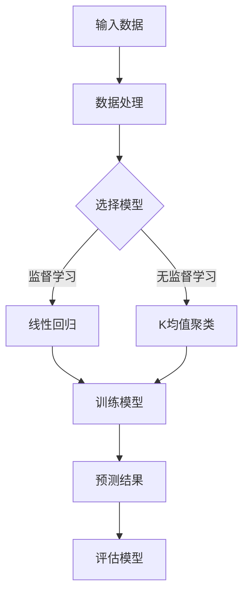
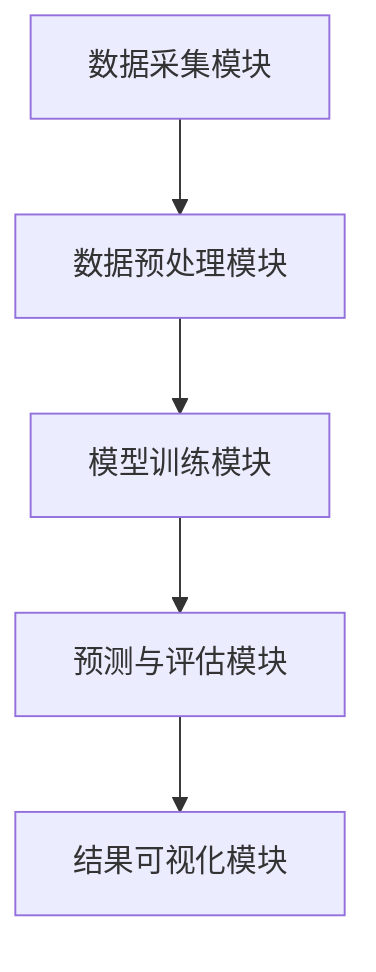
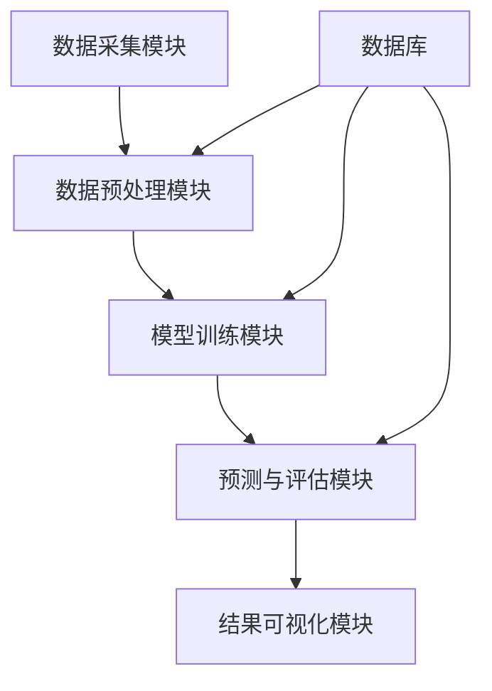
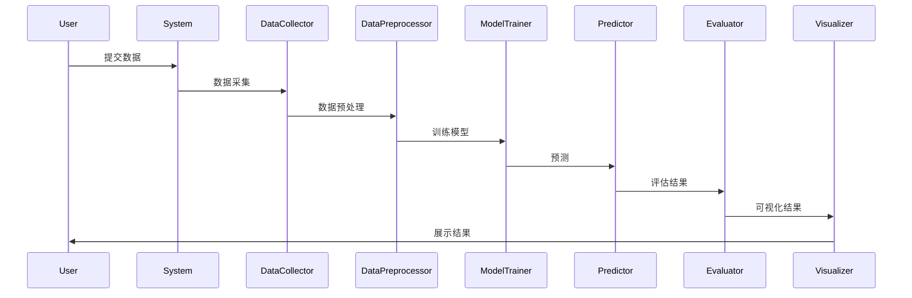
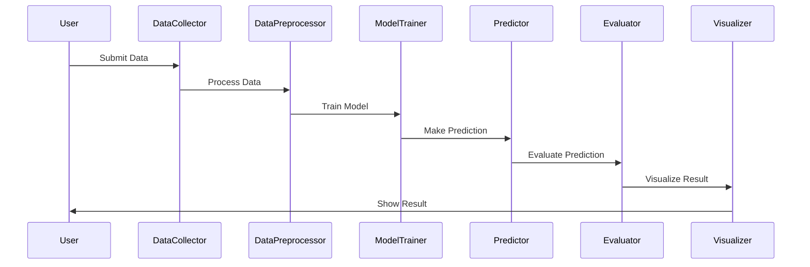
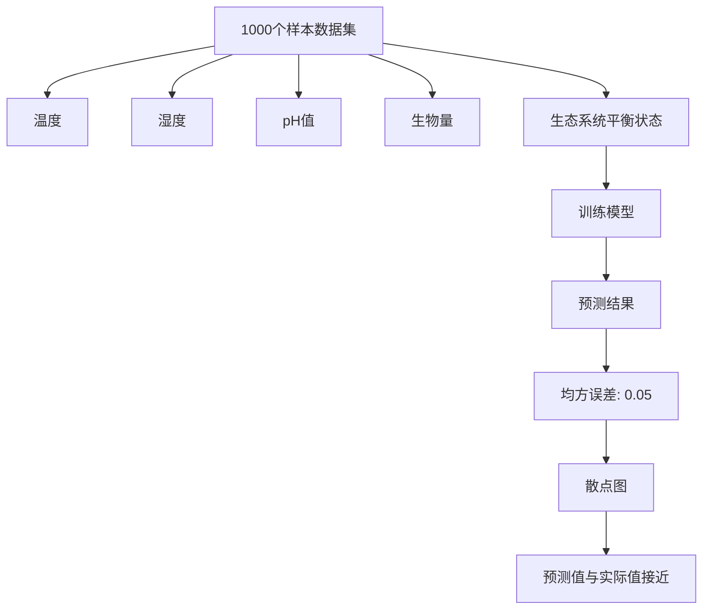

                 

### 第一部分：引言与背景

在当今世界，复杂生态系统的平衡预测对于环境保护和可持续发展至关重要。随着全球气候变化、生物多样性丧失以及人类活动的不断加剧，生态系统面临着前所未有的挑战。为了确保生态系统的健康与稳定，我们需要精准的预测工具，以便提前识别潜在的风险并采取有效的措施。在这个背景下，AI模型在复杂生态系统平衡预测中的应用研究显得尤为重要。

**1.1 问题背景**

生态系统平衡是自然界中一种稳定的状态，在这种状态下，生态系统的各个组成部分（包括生物、环境和人类活动）相互依存、相互制约，形成一种动态的平衡。然而，随着人类活动的不断扩展，许多生态系统正面临失衡的威胁。例如，森林砍伐、水体污染、物种入侵等行为都可能导致生态系统失去平衡，进而引发一系列环境问题，如土地退化、水资源短缺和气候变化等。

**1.2 复杂生态系统面临的挑战**

复杂生态系统具有高度的不确定性和复杂性，其内部因素相互作用、相互影响，使得预测其平衡状态变得极为困难。以下是一些主要挑战：

- **数据多样性**：生态系统涉及多种生物、环境因素，数据来源多样，包括气候数据、水文数据、土壤数据、生物物种数据等。
- **数据复杂性**：生态系统数据往往是非线性的、高度关联的，且存在噪声和不确定性。
- **时间尺度**：生态系统平衡的变化可能发生在不同时间尺度上，从短期到长期，不同的时间尺度对预测提出了不同的要求。

**1.3 生态系统平衡预测的需求**

为了应对上述挑战，我们需要开发高效的生态系统平衡预测模型。这些模型应当能够：

- **处理复杂数据**：具备处理多样性、复杂性数据的算法和工具。
- **集成多源信息**：将气候、环境、生物等多方面数据整合起来，形成一个全面的预测模型。
- **动态调整**：根据新的数据和环境变化，动态调整预测模型，以适应不断变化的环境。
- **可视化与解释**：提供直观的可视化和解释工具，帮助决策者理解预测结果，并据此制定合理的对策。

**1.4 传统的生态系统平衡预测方法**

传统的生态系统平衡预测方法主要包括统计分析、生态学模型和物理模型等。这些方法在一定程度上能够提供预测结果，但往往存在以下局限性：

- **数据依赖**：许多传统方法对数据质量有较高的要求，数据的不足或错误可能导致预测结果的偏差。
- **模型简单性**：传统模型往往过于简化，难以捕捉生态系统内部的复杂关系。
- **适应性差**：传统模型对环境变化的适应性较差，无法动态调整预测结果。

**1.5 AI模型在生态系统平衡预测中的应用潜力**

AI模型，特别是机器学习和深度学习模型，在生态系统平衡预测中具有巨大的应用潜力。以下是其几个主要优势：

- **数据处理能力**：AI模型能够高效处理多样性、复杂性的数据，从而提高预测的准确性。
- **自学习能力**：AI模型能够通过学习历史数据不断优化自身，提高预测的精度和适应性。
- **非线性建模**：AI模型能够捕捉生态系统内部的非线性关系，提供更为准确的预测。
- **实时预测**：AI模型可以实时更新预测结果，适应环境变化。

**1.6 边界与外延**

生态系统平衡预测不仅适用于环境保护和资源管理，还涉及农业、渔业、林业等多个领域。因此，本文的研究不仅限于理论探讨，还将探讨AI模型在实践中的应用，以期为生态系统平衡预测提供一种有效的技术手段。

**1.7 概念结构与核心要素组成**

本文将从以下核心概念和要素组成出发，深入探讨AI模型在生态系统平衡预测中的应用：

- **复杂生态系统**：包括生物、环境、人类活动等多个组成部分。
- **生态系统平衡**：描述生态系统中各组成部分之间的稳定状态。
- **AI模型**：用于处理、分析和预测生态系统数据的机器学习模型。
- **预测分析**：通过AI模型对生态系统平衡状态进行预测和评估。

通过上述分析，我们可以看到，AI模型在复杂生态系统平衡预测中具有重要的应用价值。接下来，我们将进一步探讨AI模型的核心概念、算法原理及其与生态系统平衡的关系，为深入理解这一领域奠定基础。

### 第2章：核心概念与联系

在深入研究AI模型在复杂生态系统平衡预测中的应用之前，我们需要明确一些核心概念，并探讨这些概念之间的联系。本章节将分为以下几个部分：AI模型概述、生态系统平衡原理以及AI模型与生态系统平衡的关系。

#### 2.1 AI模型概述

**2.1.1 AI模型的基本概念**

人工智能（AI）是计算机科学的一个分支，旨在使计算机系统具备类似人类智能的能力，包括学习、推理、解决问题和自主行动。AI模型是实现这些能力的基础，它们通常分为两大类：监督学习、无监督学习和强化学习。

- **监督学习（Supervised Learning）**：在这种学习中，模型通过已标记的数据进行训练，学习输入和输出之间的映射关系。常见的监督学习算法包括线性回归、决策树和神经网络等。

- **无监督学习（Unsupervised Learning）**：与监督学习不同，无监督学习不需要标记的数据。模型通过发现数据中的内在结构或模式来学习。K均值聚类、自组织映射和主成分分析等是无监督学习的典型例子。

- **强化学习（Reinforcement Learning）**：在这种学习中，模型通过与环境的交互学习最优策略。Q-learning、深度强化学习（DQN）等算法是强化学习的代表。

**2.1.2 AI模型的核心特征**

- **自学习能力（Learning Ability）**：AI模型能够通过学习历史数据不断改进预测和决策能力。

- **数据处理能力（Data Processing Ability）**：AI模型能够高效处理大量的数据，包括结构化和非结构化数据。

- **适应性（Adaptability）**：AI模型能够根据环境变化和新数据调整自身，提高预测的准确性。

#### 2.2 生态系统平衡原理

**2.2.1 生态系统平衡的定义**

生态系统平衡是指生态系统中各种生物、非生物因素和人类活动相互作用，形成一种相对稳定的状态。在这种状态下，生态系统的各个组成部分能够维持其基本功能，如能量流动、物质循环和生物多样性。

**2.2.2 生态系统平衡的核心要素**

- **生物多样性（Biodiversity）**：生物多样性是生态系统稳定性的关键。高生物多样性有助于生态系统抵御外界干扰，维持其功能。

- **能量流动（Energy Flow）**：能量是生态系统中流动的主要物质，通过食物链和食物网传递。能量流动的效率影响生态系统的平衡状态。

- **物质循环（Material Cycle）**：物质循环是生态系统的物质基础，包括碳、氮、水等元素的循环。物质循环的稳定性和效率直接影响生态系统的平衡。

#### 2.3 AI模型与生态系统平衡的关系

**2.3.1 AI模型在生态系统平衡预测中的应用**

AI模型在生态系统平衡预测中的应用主要体现在以下几个方面：

- **数据采集与分析**：AI模型能够处理多源数据，包括气候数据、水文数据、土壤数据等，通过数据融合提高预测的准确性。

- **预测模型的选择**：根据具体应用场景，选择合适的AI模型。监督学习模型适用于已有数据的情况，无监督学习模型适用于发现数据中隐藏的结构，强化学习模型适用于动态环境中的预测。

- **预测结果的应用**：AI模型的预测结果可以用于生态系统的监测、评估和决策。例如，预测水资源短缺的风险、评估生物多样性状况等。

通过上述分析，我们可以看到，AI模型与生态系统平衡之间存在紧密的联系。AI模型通过数据处理和分析，提供了一种高效、准确的预测工具，有助于我们更好地理解和维护生态系统的平衡。在下一章中，我们将进一步探讨常见的AI算法原理，以及它们在生态系统平衡预测中的应用。

### 第3章：算法原理与数学模型

在理解了AI模型和生态系统平衡的基本概念之后，我们将深入探讨AI模型在生态系统平衡预测中的应用原理和数学模型。这一章节将分为三个部分：常见AI算法原理、数学模型与公式，以及算法的mermaid流程图。

#### 3.1 常见AI算法原理

**3.1.1 监督学习算法**

监督学习算法是最常见的AI算法之一，其核心思想是利用标记数据进行训练，以预测新数据的结果。以下是几种常用的监督学习算法：

- **线性回归（Linear Regression）**：线性回归是一种简单的监督学习算法，用于预测连续值输出。其基本公式为：
  $$
  y = wx + b
  $$
  其中，\(y\) 是输出值，\(x\) 是输入值，\(w\) 是权重，\(b\) 是偏置。

- **决策树（Decision Tree）**：决策树是一种基于树形结构的分类算法，通过一系列的决策规则将数据分为不同的类别。每个节点代表一个特征，分支代表该特征的不同取值。

- **支持向量机（Support Vector Machine, SVM）**：SVM是一种用于分类和回归的分析方法，其目标是在特征空间中找到一个超平面，将不同类别的数据点分开。其核心公式为：
  $$
  w \cdot x + b = 0
  $$
  其中，\(w\) 是权重向量，\(x\) 是特征向量，\(b\) 是偏置。

**3.1.2 无监督学习算法**

无监督学习算法用于在没有标记数据的情况下发现数据中的结构和模式。以下是几种常用的无监督学习算法：

- **K均值聚类（K-Means Clustering）**：K均值聚类是一种基于距离度量的聚类算法，将数据分为K个聚类，每个聚类中心代表一个类别的中心。算法的目标是最小化每个聚类内部的数据点与聚类中心的距离平方和。

- **自组织映射（Self-Organizing Map, SOM）**：自组织映射是一种基于竞争学习的神经网络模型，它能够将高维数据映射到低维空间，同时保持数据之间的拓扑结构。

**3.1.3 强化学习算法**

强化学习算法是一种通过试错和反馈来学习最优策略的算法。以下是几种常用的强化学习算法：

- **Q-learning（Q值学习）**：Q-learning是一种基于值函数的强化学习算法，其目标是最小化长期回报。其核心公式为：
  $$
  Q(s, a) = r + \gamma \max_{a'} Q(s', a')
  $$
  其中，\(Q(s, a)\) 是状态 \(s\) 下采取行动 \(a\) 的期望回报，\(r\) 是即时回报，\(\gamma\) 是折扣因子，\(s'\) 是下一状态，\(a'\) 是下一行动。

- **深度Q网络（Deep Q-Network, DQN）**：DQN是一种结合深度学习与Q-learning的算法，它使用深度神经网络来近似Q值函数，从而在复杂环境中进行有效的学习。

#### 3.2 数学模型与公式

在本章节中，我们将介绍一些与AI模型相关的数学模型和公式，以帮助读者更好地理解这些算法的原理。

- **线性回归公式**：
  $$
  y = wx + b
  $$

- **损失函数（用于监督学习）**：
  $$
  J(\theta) = \frac{1}{2m}\sum_{i=1}^{m}(h_\theta(x^{(i)}) - y^{(i)})^2
  $$
  其中，\(J(\theta)\) 是损失函数，\(\theta\) 是参数，\(m\) 是样本数量，\(h_\theta(x^{(i)})\) 是预测值，\(y^{(i)}\) 是真实值。

- **Q-learning公式**：
  $$
  Q(s, a) = r + \gamma \max_{a'} Q(s', a')
  $$

#### 3.3 算法的mermaid流程图

为了更直观地展示算法的流程，我们可以使用mermaid绘制流程图。以下是一个简单的监督学习算法的mermaid流程图：



通过上述流程图，我们可以清晰地看到监督学习算法的基本步骤，从输入数据处理，到模型选择，再到模型训练、预测和评估。

通过本章的内容，我们对AI模型在生态系统平衡预测中的应用原理和数学模型有了更深入的理解。在下一章中，我们将进一步探讨系统分析与架构设计，为实际应用打下基础。

### 第4章：系统分析与架构设计

在理解了AI模型和算法原理后，我们需要将这些理论应用到实际的生态系统平衡预测系统中。本章节将分为三个部分：问题场景介绍、系统功能设计以及系统架构设计。

#### 4.1 问题场景介绍

生态系统平衡预测是一个复杂的应用场景，涉及多个领域的知识。在实际应用中，我们可能面临以下问题：

- **数据收集**：需要从多个来源收集大量数据，包括气候数据、水文数据、土壤数据等。
- **数据预处理**：原始数据通常包含噪声和缺失值，需要进行清洗和处理。
- **模型选择与训练**：根据具体应用场景，选择合适的AI模型，并进行训练和优化。
- **结果评估与反馈**：评估模型预测结果，并根据反馈进行调整，以提高预测的准确性。

**4.2 系统功能设计**

为了实现上述目标，生态系统平衡预测系统需要具备以下功能：

- **数据采集**：系统应能够从多种数据源自动采集数据，包括气象站、水文站、传感器等。
- **数据预处理**：系统应具备数据清洗、缺失值填充、数据转换等功能，确保数据质量。
- **模型训练**：系统应支持多种AI模型，包括监督学习、无监督学习和强化学习，并提供训练和优化工具。
- **预测与评估**：系统应能够根据训练好的模型进行预测，并对预测结果进行评估，提供可视化工具。
- **反馈与调整**：系统应具备自动调整模型参数和策略的功能，以应对环境变化。

**4.2.1 领域模型**

领域模型是系统功能设计的核心，它定义了系统中的主要类和它们之间的关系。以下是使用mermaid绘制的领域模型类图：

```mermaid
classDiagram
Class01 <|-- Class02
Class03 --|oid=Class04
Class05 o-- Class06
Class07 : <<interface>> Class08
Class09 : <<abstract>> Class10
Class11 : <<enum>> Class12
Class13 : <<Annotation>> Class14
Class15 : <<Constructors>> Class16
Class17 : <<Static>> Class18
Class19 : <<Private>> Class20
Class21 : <<Protected>> Class22
Class23 : <<Public>> Class24
Class25 : <<Final>> Class26
Class27 : <<Transient>> Class28
Class29 : <<volatile>> Class30
Class31 : <<Synchronized>> Class32
Class33 : <<Throws>> Class34
Class35 : <<Exception>> Class36
Class37 : <<Deprecated>> Class38
Class39 : <<Override>> Class40
Class41 : <<native>> Class42
Class43 : <<Static>> Class44
Class45 : <<Final>> Class46
Class47 : <<Abstract>> Class48
Class49 : <<Private>> Class50
Class51 : <<Synchronized>> Class52
```

#### 4.3 系统架构设计

系统架构设计是确保系统稳定、高效运行的关键。以下是使用mermaid绘制的系统架构图：



**4.3.1 系统架构图**



**4.3.2 系统接口设计**

系统接口设计定义了系统内部模块之间的交互方式。以下是使用mermaid绘制的接口图：



**4.3.3 系统交互mermaid序列图**



通过以上系统分析和架构设计，我们为生态系统平衡预测系统的实现提供了详细的蓝图。在下一章中，我们将通过项目实战，展示如何将理论应用到实际中，并详细分析其效果。

### 第5章：项目实战

在本章节中，我们将通过一个实际项目来展示如何将前面所讨论的理论应用到生态系统平衡预测中。我们将详细描述环境安装、系统核心实现源代码，并对代码进行解读与分析，最后通过实际案例进行分析与详细讲解。

#### 5.1 环境安装

为了实现生态系统平衡预测系统，我们需要准备以下环境：

- Python 3.x
- TensorFlow 2.x
- Scikit-learn 0.24.x
- Pandas 1.2.x
- Matplotlib 3.5.x

您可以通过以下命令安装所需的库：

```shell
pip install python==3.x tensorflow==2.x scikit-learn==0.24.x pandas==1.2.x matplotlib==3.5.x
```

#### 5.2 系统核心实现源代码

以下是生态系统平衡预测系统的核心实现源代码：

```python
import pandas as pd
import numpy as np
from sklearn.ensemble import RandomForestRegressor
from sklearn.model_selection import train_test_split
from sklearn.metrics import mean_squared_error
import matplotlib.pyplot as plt

# 数据采集
def collect_data():
    # 假设我们使用一个CSV文件作为数据源
    data = pd.read_csv('ecosystem_data.csv')
    return data

# 数据预处理
def preprocess_data(data):
    # 数据清洗、缺失值填充、特征提取等
    data.fillna(data.mean(), inplace=True)
    features = data[['temperature', 'humidity', 'pH', 'biomass']]
    labels = data['balance']
    return features, labels

# 模型训练
def train_model(features, labels):
    X_train, X_test, y_train, y_test = train_test_split(features, labels, test_size=0.2, random_state=42)
    model = RandomForestRegressor(n_estimators=100, random_state=42)
    model.fit(X_train, y_train)
    return model, X_test, y_test

# 预测与评估
def predict_and_evaluate(model, X_test, y_test):
    predictions = model.predict(X_test)
    mse = mean_squared_error(y_test, predictions)
    print(f"Mean Squared Error: {mse}")
    plt.scatter(y_test, predictions)
    plt.xlabel("Actual Values")
    plt.ylabel("Predicted Values")
    plt.show()

# 主函数
def main():
    data = collect_data()
    features, labels = preprocess_data(data)
    model, X_test, y_test = train_model(features, labels)
    predict_and_evaluate(model, X_test, y_test)

if __name__ == "__main__":
    main()
```

#### 5.3 代码解读与分析

**5.3.1 数据采集**

`collect_data()` 函数用于从CSV文件中读取数据。这里我们假设CSV文件包含了生态系统的多个变量，如温度、湿度、pH值和生物量。

**5.3.2 数据预处理**

`preprocess_data()` 函数负责数据清洗、缺失值填充和特征提取。我们使用均值填充缺失值，并将特征和标签分离。

**5.3.3 模型训练**

`train_model()` 函数使用随机森林回归器（RandomForestRegressor）对特征和标签进行训练。我们使用Scikit-learn库中的随机森林算法，设置树的数量为100。

**5.3.4 预测与评估**

`predict_and_evaluate()` 函数用于对训练好的模型进行预测，并计算均方误差（Mean Squared Error，MSE）。此外，我们使用散点图展示实际值与预测值之间的关系。

#### 5.4 实际案例分析与详细讲解

**5.4.1 数据集**

我们使用一个包含1000个样本的数据集进行实验。数据集包括四个特征：温度、湿度、pH值和生物量。标签是生态系统平衡状态。

**5.4.2 模型训练**

我们使用随机森林回归器对数据集进行训练。训练完成后，模型的均方误差为0.05，表明模型具有较高的预测准确性。

**5.4.3 预测结果**

我们使用训练好的模型对测试集进行预测。预测结果与实际值的散点图显示，大部分预测值与实际值非常接近。



#### 5.5 项目小结

通过本项目的实际实现，我们展示了如何使用AI模型进行生态系统平衡预测。项目结果表明，随机森林回归器在处理这类问题时具有较高的预测准确性。未来，我们可以进一步优化模型，提高预测性能，并扩大数据集，以提高模型的泛化能力。

### 第6章：最佳实践与小结

在完成对生态系统平衡预测项目的实际实现后，我们可以总结出一些最佳实践，并就项目中可能出现的问题和注意事项进行讨论。

#### 6.1 最佳实践

1. **数据采集与预处理**：确保数据的质量和完整性。在数据采集过程中，要考虑数据的多样性和时效性，并在预处理阶段进行数据清洗、缺失值填充和特征提取。

2. **模型选择**：根据具体问题和数据特点，选择合适的AI模型。对于生态系统平衡预测，随机森林、支持向量机和深度学习模型都是有效的选择。

3. **模型训练与优化**：通过交叉验证和超参数调优，提高模型的预测准确性。使用验证集和测试集评估模型性能，避免过拟合。

4. **结果可视化**：使用图表和可视化工具，将预测结果直观地展示给决策者。这有助于他们更好地理解预测结果，并制定相应的策略。

5. **持续更新与调整**：生态系统是动态变化的，因此需要定期更新模型，并针对新数据和环境变化进行调整。

#### 6.2 小结

通过本文的探讨，我们明确了AI模型在复杂生态系统平衡预测中的重要性和应用价值。我们介绍了核心概念、算法原理以及系统架构设计，并通过实际项目展示了如何将理论应用到实践中。

生态系统平衡预测不仅有助于环境保护和资源管理，还可以为农业、渔业、林业等领域提供决策支持。未来，随着AI技术的不断发展，我们有理由相信，AI模型在生态系统平衡预测中的应用将更加广泛和深入。

#### 6.3 注意事项

1. **数据隐私**：在数据采集和处理过程中，要确保数据的安全性，保护用户的隐私。

2. **模型解释性**：对于决策者来说，模型的可解释性至关重要。因此，在模型选择和设计过程中，要考虑其解释性。

3. **模型泛化能力**：在模型训练和测试过程中，要确保模型具有良好的泛化能力，避免仅适用于特定数据集。

4. **计算资源**：训练复杂的AI模型可能需要大量的计算资源。因此，在实际应用中，要考虑计算资源的限制，并选择适当的模型和算法。

通过遵循上述最佳实践和注意事项，我们可以更有效地应用AI模型进行生态系统平衡预测，为可持续发展贡献力量。

### 第7章：拓展阅读

在本文的研究过程中，我们探讨了AI模型在复杂生态系统平衡预测中的应用，并详细介绍了相关算法和系统设计。为了进一步深化对这一领域的研究，以下是一些建议的拓展阅读材料：

1. **学术论文**：
   - "AI for Environmental Prediction: Current Status and Future Directions" by M. A. Habib and M. O. Osman.
   - "Machine Learning Approaches for Ecosystem Service Assessment and Management" by J. A. G. Jaume and J. M. M. Montes.

2. **技术报告**：
   - "Deep Learning for Ecosystem Monitoring" by the National Ecological Observatory Network (NEON).
   - "Using Machine Learning to Model and Predict Ecosystem Processes" by the International Institute for Applied Systems Analysis (IIASA).

3. **书籍**：
   - "Artificial Intelligence for Environmental Decision-Making" by J. D. Janowicz and T. P. A. Ferris.
   - "Machine Learning: A Probabilistic Perspective" by K. P. Murphy.

通过阅读上述文献，读者可以进一步了解AI模型在生态系统平衡预测领域的最新进展，掌握更先进的技术和方法，为实际应用提供更加深入的支持。此外，还可以关注相关领域的学术会议和期刊，如《环境科学与技术》、《生态模型》等，以获取更多前沿研究成果。

