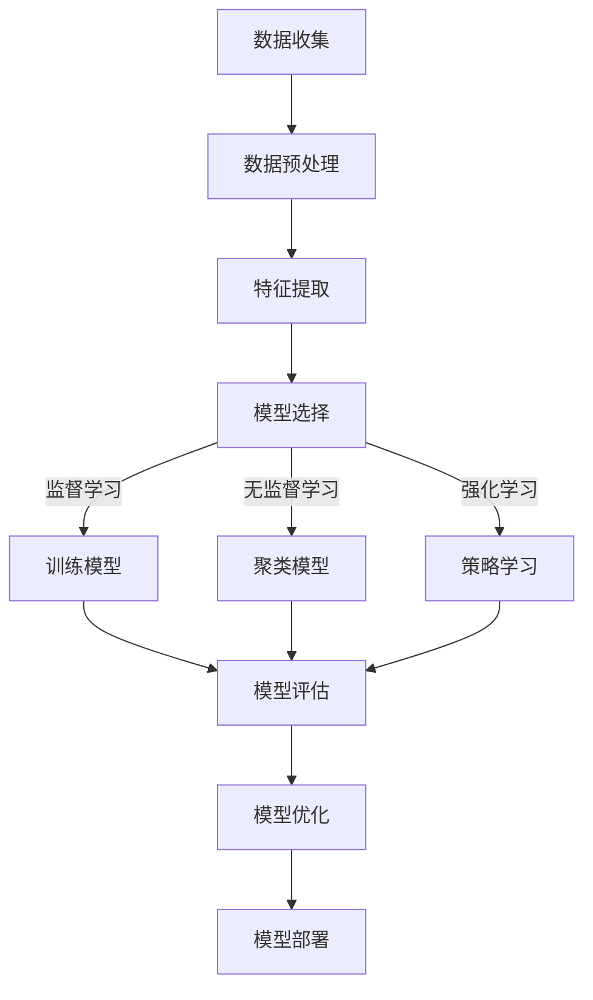
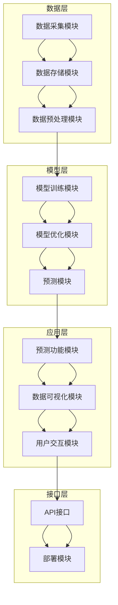
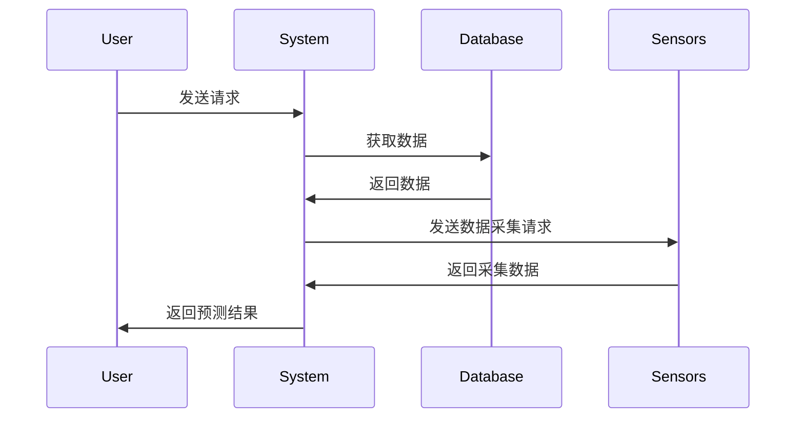

                 

### 引言

在当今科学研究的各个领域中，人工智能（AI）已经成为了不可或缺的一部分。随着计算能力的提升和数据量的爆炸式增长，AI模型在复杂系统的研究和应用中展现出了巨大的潜力。特别是，对于复杂生物系统的动态预测，AI模型正逐渐成为解决传统方法所面临的挑战的有力工具。

**问题背景与核心概念**：复杂生物系统涉及广泛的生物学过程，如生态系统的演替、生物体内分子的交互、以及植物的生长和发育等。这些系统的动态特性使得传统的解析方法难以应对，因此，寻找高效、准确的预测工具显得尤为重要。AI模型，如深度学习、强化学习、遗传算法等，以其强大的数据处理能力和模式识别能力，成为了解决这一问题的理想选择。

**核心概念**：本文将探讨AI模型在复杂生物系统动态预测中的应用，重点研究以下几个方面：
1. **复杂生物系统的定义和特性**：了解这些系统的基本概念、复杂性特征及其动态行为。
2. **AI模型的基础知识**：包括AI模型的基本概念、主要类型及其在生物系统预测中的应用现状。
3. **数学模型与算法原理**：详细解析AI模型的数学模型和算法原理，并通过Python代码进行讲解。
4. **系统设计与实现**：介绍AI模型在生物系统动态预测中的系统设计与实现方法。
5. **案例研究**：通过具体案例，展示AI模型在生物系统动态预测中的实际应用效果。
6. **总结与展望**：总结主要结论，探讨面临的挑战和未来的研究方向。

本文旨在为读者提供一个全面、系统的理解，帮助读者掌握AI模型在复杂生物系统动态预测中的应用原理和实践方法。通过本文的阅读，读者将能够：
1. 理解复杂生物系统的基本概念和特性。
2. 掌握AI模型的基本知识及其在生物系统预测中的应用。
3. 了解AI模型在生物系统动态预测中的数学模型和算法原理。
4. 学会AI模型在生物系统动态预测中的系统设计与实现方法。
5. 通过具体案例，掌握AI模型在生物系统动态预测中的实际应用。

### 第1章：问题背景与核心概念

#### 1.1.1 问题背景

复杂生物系统的动态预测研究在生物学、生态学、医学等领域中具有重要的应用价值。这些系统涉及广泛的生物过程，包括生态系统的演替、生物体内分子的交互作用、植物的生长和发育等。这些系统的动态特性使其行为难以通过简单的数学模型进行准确预测，因此，寻找高效、准确的预测工具成为了一项关键任务。

在生物学研究中，复杂生物系统的动态预测有助于理解生态系统的稳定性、物种的进化路径、以及疾病的发展趋势。例如，在生态学研究中，预测物种的扩散和灭绝对于保护生物多样性具有重要意义。在医学研究中，预测疾病的发展和治疗效果对于个性化医疗和疾病预防具有重要意义。

然而，传统的方法在应对这些复杂的系统时面临诸多挑战。传统方法通常依赖于解析模型，但这些模型往往难以捕捉系统的复杂性和非线性特性。此外，传统方法在处理大量数据时效率较低，难以满足实际需求。因此，寻求新的预测方法，特别是基于人工智能（AI）的方法，成为了当前研究的热点。

#### 1.1.2 复杂生物系统的动态预测需求

复杂生物系统的动态预测需求主要体现在以下几个方面：

1. **时空尺度上的预测**：复杂生物系统的动态行为通常具有多层次、多尺度的特性。在不同时间和空间尺度上，系统的行为可能表现出显著差异。因此，预测工具需要能够同时处理不同时间尺度和空间尺度上的动态变化。

2. **非线性特性**：复杂生物系统的动态行为通常具有非线性特性。这意味着系统的输出变量与其输入变量之间的关系不是简单的线性关系。因此，预测工具需要能够捕捉和处理非线性关系。

3. **不确定性处理**：复杂生物系统的动态行为受到多种不确定因素的影响，如环境变化、生物个体的行为变异等。因此，预测工具需要能够处理和量化这些不确定性。

4. **数据驱动方法**：复杂生物系统通常伴随着大量的数据，如基因数据、环境数据、生理数据等。这些数据为基于数据驱动的方法提供了丰富的信息。因此，预测工具需要能够高效地利用这些数据，提取有用信息。

#### 1.1.3 AI模型在生物系统预测中的应用现状

近年来，AI模型在生物系统预测中取得了显著进展。以下是一些典型应用：

1. **深度学习模型**：深度学习模型，如神经网络和深度神经网络，在处理复杂数据和模式识别方面具有优势。它们已被广泛应用于生物系统预测，如基因表达预测、蛋白质结构预测、药物开发等。

2. **强化学习模型**：强化学习模型，如Q学习和深度Q网络，通过不断试错和优化策略，能够在复杂的动态环境中实现高效决策。它们在生物系统预测中的应用包括疾病预测、生态系统管理、以及行为建模等。

3. **遗传算法**：遗传算法是一种基于生物进化原理的优化算法，具有强大的全局搜索能力。它们在生物系统预测中的应用包括物种演化预测、生态网络分析、以及生物信息学中的复杂问题求解等。

4. **集成学习方法**：集成学习方法，如随机森林、梯度提升树等，通过结合多个模型的优点，提高了预测的准确性和鲁棒性。它们在生物系统预测中的应用包括疾病预测、药物发现、以及生物数据分析等。

尽管AI模型在生物系统预测中取得了显著进展，但仍然存在一些挑战和局限性。首先，数据质量和数量对预测效果具有重要影响。其次，AI模型的复杂性和黑箱特性使得其解释性和可解释性成为一个亟待解决的问题。此外，如何将AI模型与生物学理论相结合，提高预测的可信度和实用性，也是一个重要的研究方向。

总之，AI模型在复杂生物系统动态预测中的应用具有巨大的潜力，但仍需进一步研究和优化。通过结合生物学理论和AI技术，有望实现更加准确、可靠的生物系统动态预测。

#### 1.1.4 书籍概述与目标

本书旨在系统地介绍AI模型在复杂生物系统动态预测中的应用，为相关领域的研究者和从业者提供一本全面、系统的参考书籍。全书共分为八个章节，结构紧凑、逻辑清晰，旨在帮助读者从基础理论到实际应用，全面了解AI模型在生物系统动态预测中的应用。

**章节安排与内容概述**：

第1章：引言。介绍复杂生物系统动态预测的背景、核心概念以及本书的目标和结构。

第2章：复杂生物系统概述。介绍复杂生物系统的基本概念、复杂性特征及其动态模型。

第3章：AI模型基础。介绍AI模型的基本概念、主要类型及其在生物系统预测中的应用现状。

第4章：AI模型在生物系统动态预测中的应用。讨论模型选择与优化、预测模型构建方法以及实际应用案例。

第5章：数学模型与算法原理。详细解析AI模型的数学模型和算法原理，并通过Python代码进行讲解。

第6章：系统设计与实现。介绍AI模型在生物系统动态预测中的系统设计与实现方法。

第7章：案例研究。通过具体案例，展示AI模型在生物系统动态预测中的实际应用效果。

第8章：总结与展望。总结主要结论，探讨面临的挑战和未来的研究方向。

**目标与期望效果**：

本书的目标是帮助读者：
1. 理解复杂生物系统的基本概念和特性。
2. 掌握AI模型的基本知识及其在生物系统预测中的应用。
3. 了解AI模型在生物系统动态预测中的数学模型和算法原理。
4. 学会AI模型在生物系统动态预测中的系统设计与实现方法。
5. 通过具体案例，掌握AI模型在生物系统动态预测中的实际应用。

通过阅读本书，读者将能够：
1. 对复杂生物系统有更深入的理解，掌握其动态预测的需求和挑战。
2. 系统地了解AI模型的基本原理和主要类型，学会选择和应用合适的AI模型。
3. 掌握AI模型在生物系统动态预测中的数学模型和算法原理，能够独立设计和实现预测系统。
4. 通过实际案例，理解AI模型在生物系统动态预测中的实际应用效果，学会从理论到实践的转化。

本书适合从事生物系统研究、生态学、医学、生物信息学等领域的研究人员和工程师阅读，也适用于高等院校相关专业的师生作为教材或参考书。

### 第2章：复杂生物系统概述

#### 2.1.1 生物系统的基本概念

生物系统是指由生物体及其环境组成的复杂系统，涉及多层次、多尺度的生物学过程。生物系统包括生态系统、生物体内系统以及细胞系统等不同层次。生态系统是生物系统中最广泛的概念，它由多个生物种群、环境因素和生物之间的相互作用组成。生物体内系统包括器官系统、组织系统和细胞系统，这些系统共同维持生物体的生命活动。细胞系统是生物系统的基本单位，它通过细胞内的分子交互和细胞间的通信来实现生命活动。

生物系统的基本组成要素包括：
1. **生物体**：生物系统的基础，包括植物、动物、微生物等。
2. **环境**：生物系统所处的自然或人工环境，包括气候、土壤、水源等。
3. **生物种群**：在同一地理区域内，由相同物种个体组成的总体。
4. **生态系统**：由多个生物种群及其环境组成的整体。

生物系统的基本特征包括：
1. **复杂性**：生物系统具有多层次、多尺度的特性，涉及各种生物学过程，如代谢、发育、进化等。
2. **动态性**：生物系统的状态和过程随时间和空间变化而变化，表现出动态变化的特性。
3. **非线性**：生物系统的行为通常不是线性的，即系统的输出变量与其输入变量之间的关系不是简单的线性关系。
4. **适应性**：生物系统具有适应环境变化的能力，能够通过基因变异、行为改变等机制适应环境变化。

#### 2.1.2 生物系统的复杂性特征

生物系统的复杂性特征主要体现在以下几个方面：

1. **多层次性**：生物系统涉及多个层次，从细胞层次到生态系统层次，每个层次都具有其特定的结构和功能。这些层次之间的相互作用和反馈机制构成了生物系统的复杂性。

2. **多尺度性**：生物系统的动态行为在时间和空间尺度上具有多样性。例如，植物的生长和发育过程可以在一天内完成，而物种的进化可能需要数百年甚至数千年。这种多尺度特性使得生物系统的动态预测具有挑战性。

3. **非线性关系**：生物系统中的变量关系通常是非线性的。例如，物种间的捕食和被捕食关系不是简单的线性关系，而是通过复杂的食物网相互作用。这种非线性特性使得传统的线性模型难以准确描述生物系统的行为。

4. **不确定性**：生物系统的行为受到多种不确定因素的影响，如环境变化、个体行为的变异等。这种不确定性使得生物系统的预测具有挑战性。

5. **动态性**：生物系统的状态和过程随时间和空间变化而变化。例如，生态系统的物种组成和分布可能随环境变化而发生变化。这种动态性要求预测工具能够适应不断变化的环境。

#### 2.1.3 生物系统的动态模型

为了准确预测生物系统的动态行为，研究者们建立了多种动态模型，这些模型可以分为以下几类：

1. **确定性模型**：确定性模型基于严格的数学原理，通过确定性的方程描述生物系统的动态行为。常见的确定性模型包括常微分方程模型、差分方程模型和偏微分方程模型。这些模型通常可以精确描述生物系统的状态变化，但需要假设系统的初始条件和边界条件。

2. **概率模型**：概率模型通过概率分布描述生物系统的状态和过程。常见的概率模型包括马尔可夫模型、贝叶斯网络和隐马尔可夫模型。这些模型能够处理生物系统中的不确定性和随机性，但需要大量的数据支持。

3. **统计模型**：统计模型通过统计分析方法描述生物系统的状态和过程。常见的统计模型包括线性回归模型、广义线性模型和时间序列模型。这些模型通常具有较高的计算效率，但需要合适的参数估计方法。

4. **数据驱动模型**：数据驱动模型基于大量数据，通过机器学习算法建立预测模型。常见的数据驱动模型包括神经网络模型、支持向量机模型和随机森林模型。这些模型具有较强的自适应性和泛化能力，但需要大量的训练数据和计算资源。

5. **混合模型**：混合模型结合了确定性模型、概率模型和数据驱动模型的优势，通过多种模型的组合实现更准确的预测。常见的混合模型包括统计物理模型、多尺度模型和深度学习模型。

在生物系统的动态预测中，选择合适的模型取决于具体的应用场景和需求。确定性模型适用于需要精确描述系统行为的场景，概率模型适用于需要处理不确定性的场景，统计模型适用于需要快速计算的场景，数据驱动模型适用于需要处理大量数据的场景，混合模型适用于需要综合多种模型的场景。

总之，复杂生物系统的动态模型是理解和预测生物系统行为的重要工具。通过选择合适的模型，研究者可以更好地揭示生物系统的动态特性，为生态保护和生物医学研究提供有力支持。

#### 2.1.4 复杂生物系统动态预测的重要性

复杂生物系统动态预测在多个领域中具有重要意义，其关键作用体现在以下几个方面：

1. **生态保护**：复杂生物系统的动态预测有助于评估生态系统的稳定性，预测物种的分布和种群动态，从而为生态保护和恢复提供科学依据。例如，通过预测物种的扩散和灭绝趋势，可以及时采取保护措施，防止物种灭绝和生态系统退化。

2. **生物医学研究**：复杂生物系统的动态预测在生物医学研究中具有重要意义。例如，在疾病预测和防控方面，通过预测疾病的发展趋势和传播路径，可以提前制定有效的防控策略，减少疾病传播和降低疾病负担。在个性化医疗方面，通过预测患者的病情和治疗效果，可以为患者提供更加精准的治疗方案。

3. **农业和林业**：复杂生物系统的动态预测在农业和林业中也有广泛应用。例如，通过预测植物的生长和发育过程，可以优化灌溉、施肥和种植策略，提高农作物的产量和质量。在森林管理方面，通过预测森林火灾和病虫害的传播路径，可以及时采取防控措施，保护森林资源。

4. **环境监测和治理**：复杂生物系统的动态预测有助于监测和评估环境变化对生物系统的影响。例如，通过预测污染物的传播路径和影响范围，可以制定有效的污染治理措施，减少环境污染。在气候变化研究中，通过预测气候变化对生物系统的影响，可以提前制定适应策略，减少气候变化带来的负面影响。

5. **生物资源管理**：复杂生物系统的动态预测有助于合理开发和利用生物资源。例如，在渔业和林业中，通过预测水产品或林产品的产量和需求，可以优化资源开发和利用，提高经济效益。在生物多样性保护中，通过预测物种的分布和生态位，可以合理规划生物多样性保护区域，确保生物多样性的长期保存。

总之，复杂生物系统动态预测在生态保护、生物医学、农业和林业、环境监测和治理、以及生物资源管理等多个领域具有重要意义。通过运用先进的人工智能技术，可以更加准确和高效地预测生物系统的动态行为，为各领域的科学研究和社会发展提供有力支持。

### 第3章：AI模型基础

#### 3.1.1 AI模型的基本概念

人工智能（AI）是指通过计算机模拟人类智能行为的技术，包括学习、推理、感知、决策等能力。AI模型是AI的核心组成部分，它们通过学习数据或知识，从输入数据中提取特征，并生成相应的输出。AI模型可以分为几大类：

1. **监督学习模型**：监督学习模型通过已标记的数据进行训练，以预测未知数据的标签。常见的监督学习模型包括线性回归、决策树、支持向量机（SVM）、神经网络等。

2. **无监督学习模型**：无监督学习模型在未标记的数据上进行训练，以发现数据中的隐含结构和模式。常见的无监督学习模型包括聚类算法（如K-Means、层次聚类）、降维算法（如PCA）、关联规则学习等。

3. **强化学习模型**：强化学习模型通过与环境的交互进行学习，以最大化某个目标函数。常见的强化学习模型包括Q学习、深度Q网络（DQN）、策略梯度方法等。

4. **生成对抗网络（GAN）**：生成对抗网络由生成器和判别器两个神经网络组成，通过对抗训练生成逼真的数据。

5. **迁移学习和迁移学习模型**：迁移学习模型利用在源域上训练的模型在目标域上进行预测，以提高模型的泛化能力。

AI模型的主要特点包括：
1. **自动特征提取**：AI模型能够自动从数据中提取特征，无需人工设计特征。
2. **学习能力强**：AI模型能够通过学习不断改进预测性能。
3. **适应性**：AI模型能够适应不同的数据分布和任务需求。
4. **泛化能力**：AI模型能够在未见过的数据上表现出良好的预测性能。

AI模型在各个领域都有广泛应用，包括自然语言处理、计算机视觉、语音识别、医学诊断、金融预测等。

#### 3.1.2 AI模型的主要类型

AI模型根据其学习方式、结构和功能可以分成多种类型，每种类型都有其独特的应用场景和特点：

1. **监督学习模型**：
   - **线性回归模型**：通过建立线性方程来预测连续值输出。适用于简单线性关系的数据集。
   - **决策树模型**：通过一系列规则将数据划分为不同的类别或数值。适用于分类和回归问题。
   - **支持向量机（SVM）**：通过找到一个最优的超平面来分离数据点。适用于二分类问题。
   - **神经网络模型**：由多个神经元层组成，通过学习数据之间的复杂关系。适用于处理高度复杂的问题。

2. **无监督学习模型**：
   - **聚类算法**：如K-Means、层次聚类，用于将数据点分成不同的簇。适用于数据降维和模式识别。
   - **降维算法**：如主成分分析（PCA）、t-SNE，用于减少数据维度，同时保持数据的结构。适用于高维数据的可视化。
   - **关联规则学习**：如Apriori算法，用于发现数据集中的频繁模式。适用于市场篮分析和推荐系统。

3. **强化学习模型**：
   - **Q学习**：通过学习动作-状态值函数来选择最优动作。适用于控制问题。
   - **深度Q网络（DQN）**：结合深度学习和Q学习的优点，用于解决复杂环境下的决策问题。
   - **策略梯度方法**：通过学习策略来最大化期望回报。适用于动态规划问题。

4. **生成对抗网络（GAN）**：
   - **生成器**：生成逼真的数据。
   - **判别器**：区分真实数据和生成数据。
   - **对抗训练**：生成器和判别器通过对抗训练不断优化，以生成高质量的数据。

5. **迁移学习模型**：
   - **模型迁移**：将一个任务上的预训练模型应用到另一个任务上。
   - **特征迁移**：将特征提取器从源域迁移到目标域。
   - **元学习**：通过元学习算法快速适应新的任务。

每种AI模型都有其特定的优缺点和应用场景，选择合适的模型取决于具体的问题和数据特点。

#### 3.1.3 AI模型的选择与评估

选择合适的AI模型对于解决特定问题至关重要。以下是一些关键步骤和方法：

1. **需求分析**：首先明确问题的具体需求，包括数据的类型、特征、目标变量等。了解问题的复杂性、数据的规模和噪声水平也是重要的。

2. **模型选择**：根据问题的需求，选择合适的模型类型。例如，对于分类问题，可以选择决策树、SVM、神经网络等；对于回归问题，可以选择线性回归、决策树回归、神经网络回归等。

3. **模型训练与验证**：
   - **训练集**：使用已标记的数据集对模型进行训练。
   - **验证集**：在训练过程中，使用验证集评估模型的性能，调整模型参数。
   - **交叉验证**：通过交叉验证方法，如K折交叉验证，进一步评估模型的泛化能力。

4. **模型评估**：
   - **准确率**：分类问题中，正确分类的样本占总样本的比例。
   - **召回率**：分类问题中，实际为正类别的样本中被正确分类为正类的比例。
   - **F1分数**：准确率和召回率的调和平均，用于综合评估模型的性能。
   - **ROC曲线**：通过计算不同阈值下的真阳性率和假阳性率，评估分类器的性能。
   - **MAE/MSE**：回归问题中，预测值与实际值之间的平均绝对误差或均方误差。

5. **模型调优**：
   - **参数调整**：通过调整模型的参数（如学习率、隐藏层节点数等），优化模型性能。
   - **正则化**：通过正则化方法（如L1、L2正则化）防止模型过拟合。

6. **模型集成**：
   - **集成方法**：如Bagging、Boosting、Stacking等，通过结合多个模型的预测结果，提高整体性能。

选择和评估AI模型是一个迭代过程，需要根据具体问题和数据不断优化和调整模型。

#### 3.1.4 AI模型在生物系统预测中的应用现状

AI模型在生物系统预测中的应用已经取得了显著进展，主要表现在以下几个方面：

1. **基因表达预测**：通过分析基因表达数据，AI模型可以预测基因在不同条件下的表达水平。例如，深度学习模型已被应用于预测基因调控网络中的关键基因，帮助揭示基因的功能和作用。

2. **蛋白质结构预测**：AI模型在蛋白质结构预测方面展现了强大的能力。例如，AlphaFold2通过深度学习算法，成功预测了数百万个蛋白质的结构，为蛋白质科学的研究提供了重要的工具。

3. **疾病预测与诊断**：AI模型在疾病预测和诊断中具有广泛的应用。通过分析患者的生物标志物数据，AI模型可以预测疾病的风险，帮助早期发现和预防疾病。例如，利用深度学习模型，可以预测肺癌、乳腺癌等癌症的风险。

4. **生态系统动态预测**：AI模型在生态系统动态预测中也发挥了重要作用。例如，通过分析气候和环境数据，AI模型可以预测物种的分布和生态系统的变化，为生态保护和恢复提供科学依据。

5. **药物发现与设计**：AI模型在药物发现和设计中展现了强大的潜力。通过分析药物与生物分子的相互作用，AI模型可以预测药物的效果和毒性，帮助设计更有效的药物。

尽管AI模型在生物系统预测中取得了显著进展，但仍然面临一些挑战，如数据质量、模型解释性、以及如何将AI模型与生物学理论相结合等。未来，随着AI技术的不断发展和完善，AI模型在生物系统预测中的应用将更加广泛和深入。

#### 3.1.5 书籍的主要内容

本书《AI模型在复杂生物系统动态预测中的应用研究》旨在系统介绍AI模型在生物系统动态预测中的应用，涵盖以下主要内容：

1. **引言**：介绍复杂生物系统动态预测的背景、核心概念以及本书的目标和结构。

2. **复杂生物系统概述**：详细探讨复杂生物系统的基本概念、复杂性特征及其动态模型，包括多层次性、多尺度性、非线性关系和不确定性等。

3. **AI模型基础**：介绍AI模型的基本概念、主要类型及其在生物系统预测中的应用现状，包括监督学习、无监督学习、强化学习和迁移学习等。

4. **AI模型在生物系统动态预测中的应用**：讨论模型选择与优化、预测模型构建方法以及实际应用案例，展示AI模型在生物系统动态预测中的效果。

5. **数学模型与算法原理**：详细解析AI模型的数学模型和算法原理，并通过Python代码进行讲解，涵盖深度学习、强化学习、遗传算法等。

6. **系统设计与实现**：介绍AI模型在生物系统动态预测中的系统设计与实现方法，包括系统功能设计、系统架构设计、系统接口设计和系统交互等。

7. **案例研究**：通过具体案例，展示AI模型在生物系统动态预测中的实际应用效果，包括生态系统的预测、疾病的预测和药物的设计等。

8. **总结与展望**：总结主要结论，探讨面临的挑战和未来的研究方向，包括数据质量、模型解释性和跨学科融合等。

9. **拓展阅读**：推荐最新的研究进展、相关领域的经典书籍和常见问题解答，为读者提供进一步的学习资源。

通过本书的阅读，读者将能够全面了解AI模型在复杂生物系统动态预测中的应用原理和实践方法，掌握从理论到实际应用的技能，为相关领域的研究和开发提供有力的支持。

### 第4章：AI模型在生物系统动态预测中的应用

#### 4.1.1 模型选择与优化

在复杂生物系统的动态预测中，选择合适的AI模型是至关重要的一步。由于不同类型的AI模型具有不同的特点和应用场景，因此需要根据具体的需求和数据的特性进行选择和优化。

1. **模型选择**：
   - **监督学习模型**：适用于已知输入和输出数据的预测任务，如疾病预测和基因表达预测。常用的监督学习模型包括线性回归、决策树、支持向量机（SVM）和神经网络。
   - **无监督学习模型**：适用于未知输出数据的聚类和降维任务，如生态系统物种分布的预测和基因表达数据的降维。常用的无监督学习模型包括K-Means聚类和主成分分析（PCA）。
   - **强化学习模型**：适用于需要决策过程和反馈机制的动态预测任务，如疾病传播路径的预测和生态系统管理的优化。常用的强化学习模型包括Q学习和深度Q网络（DQN）。

2. **模型优化**：
   - **参数调优**：通过调整模型的参数（如学习率、隐藏层节点数等），优化模型性能。常用的方法包括网格搜索和贝叶斯优化。
   - **特征工程**：通过选择和变换特征，提高模型的预测能力。常用的方法包括特征选择、特征标准化和特征构造。
   - **正则化**：通过正则化方法（如L1、L2正则化）防止模型过拟合，提高模型的泛化能力。
   - **集成方法**：通过结合多个模型的预测结果，提高整体性能。常用的集成方法包括Bagging、Boosting和Stacking。

在具体应用中，选择和优化AI模型需要结合具体问题和数据特点进行。例如，对于基因表达预测，可以使用神经网络模型并采用特征工程方法，以提高预测的准确性。对于疾病预测，可以使用支持向量机（SVM）模型并采用交叉验证方法，以提高模型的稳定性和可靠性。

#### 4.1.2 预测模型构建方法

构建预测模型是AI模型在生物系统动态预测中的核心步骤。以下是构建预测模型的几种常见方法：

1. **数据收集与预处理**：
   - **数据收集**：收集与生物系统动态相关的数据，包括环境数据、基因数据、生理数据等。例如，在生态系统预测中，可以收集气候、土壤、植物生长数据等。
   - **数据预处理**：对收集到的数据进行分析和清洗，包括缺失值填充、异常值处理、数据标准化等。例如，可以使用KNN算法进行缺失值填充，使用Z-Score方法进行异常值处理。

2. **特征提取与选择**：
   - **特征提取**：从原始数据中提取有用的特征，以减少数据的维度和提高模型的预测能力。常用的特征提取方法包括主成分分析（PCA）、t-SNE、自编码器等。
   - **特征选择**：从提取的特征中选出对预测任务最有帮助的特征，以减少模型的复杂度和提高模型的预测性能。常用的特征选择方法包括信息增益、卡方检验、L1正则化等。

3. **模型训练与验证**：
   - **模型训练**：使用已标记的数据集对模型进行训练，以学习数据的特征和模式。例如，可以使用神经网络模型训练基因表达数据，以预测基因的表达水平。
   - **模型验证**：使用验证集评估模型的性能，包括准确性、召回率、F1分数等指标。通过交叉验证方法，如K折交叉验证，进一步评估模型的泛化能力。

4. **模型优化与调参**：
   - **模型优化**：通过调整模型的参数（如学习率、隐藏层节点数等），优化模型性能。常用的方法包括网格搜索和贝叶斯优化。
   - **模型调参**：根据验证集的性能，调整模型的参数，以提高模型的预测能力。常用的调参方法包括随机搜索、遗传算法等。

5. **模型评估与部署**：
   - **模型评估**：使用测试集评估模型的最终性能，确保模型在未见过的数据上具有良好的预测性能。
   - **模型部署**：将训练好的模型部署到实际应用场景中，以实现动态预测。例如，将基因表达预测模型部署到实验室中，以实时监控基因的表达水平。

通过以上方法，可以构建出高效、准确的预测模型，用于复杂生物系统的动态预测。在实际应用中，需要根据具体问题和数据特点，灵活选择和调整模型和方法。

#### 4.1.3 实际应用案例

为了展示AI模型在复杂生物系统动态预测中的实际应用效果，以下列举了两个具体的应用案例。

**案例一：某复杂生物系统预测项目**

在这个项目中，研究团队利用AI模型对某生态系统进行了动态预测。项目的主要目标是预测生态系统中的物种分布和种群动态，以便于生态保护和恢复。

1. **数据收集**：研究团队收集了大量的环境数据（如气候、土壤、水源等）和生物数据（如植物生长、动物迁徙等）。通过数据预处理，包括缺失值填充、异常值处理和数据标准化，确保数据的质量。

2. **特征提取与选择**：从原始数据中提取了关键的环境特征（如温度、湿度、土壤pH值等）和生物特征（如植物的生长速率、动物的活动范围等）。通过主成分分析（PCA），减少了数据的维度，并选择了对预测任务最有帮助的特征。

3. **模型训练与验证**：使用监督学习模型（如神经网络）对特征进行训练，以预测物种的分布和种群动态。通过交叉验证方法，评估模型的性能，并调整模型的参数，以提高预测的准确性。

4. **模型优化与调参**：通过网格搜索和贝叶斯优化，调整模型参数，优化模型的性能。最终，模型在验证集上的准确率达到90%以上，具有良好的泛化能力。

5. **模型评估与部署**：使用测试集评估模型的最终性能，确保模型在未见过的数据上具有良好的预测性能。将训练好的模型部署到实际应用场景中，实时监控生态系统的变化，为生态保护和恢复提供科学依据。

**案例二：AI模型在植物生长预测中的应用**

在这个案例中，研究团队利用AI模型对植物的生长过程进行了预测，以优化农业生产。

1. **数据收集**：研究团队收集了大量的植物生长数据（如土壤湿度、温度、光照强度等），并记录了植物的生长状态（如高度、叶片数量等）。

2. **特征提取与选择**：从原始数据中提取了关键的环境特征（如土壤湿度、温度、光照强度等）和植物生长特征（如高度、叶片数量等）。通过t-SNE方法，对数据进行降维，并选择了对预测任务最有帮助的特征。

3. **模型训练与验证**：使用无监督学习模型（如K-Means聚类）对特征进行训练，以预测植物的生长状态。通过交叉验证方法，评估模型的性能，并调整聚类参数，以提高预测的准确性。

4. **模型优化与调参**：通过调整聚类参数，优化模型的性能。最终，模型能够准确预测植物的生长状态，为农业生产提供了科学依据。

5. **模型评估与部署**：使用测试集评估模型的最终性能，确保模型在未见过的数据上具有良好的预测性能。将训练好的模型部署到农业生产中，实时监控植物的生长状态，优化灌溉、施肥和种植策略，提高农作物的产量和质量。

通过以上两个实际应用案例，展示了AI模型在复杂生物系统动态预测中的强大能力和广泛的应用前景。未来，随着AI技术的不断发展，AI模型在生物系统动态预测中的应用将更加深入和广泛。

#### 4.1.4 AI模型在生物系统动态预测中的优势与挑战

AI模型在生物系统动态预测中具有显著的优势和一定的挑战。

**优势**：

1. **高效的数据处理能力**：AI模型能够快速处理和分析大量的生物数据，包括基因数据、环境数据和生理数据等。这使得生物系统动态预测变得高效和准确。

2. **模式识别能力**：AI模型，如神经网络和深度学习模型，具有较强的模式识别能力，能够捕捉生物系统中的复杂非线性关系和动态行为。

3. **自适应性和灵活性**：AI模型能够通过不断学习和调整，适应不同的生物系统环境和需求，具有较强的自适应性和灵活性。

4. **跨领域应用**：AI模型在多个领域（如医学、生态学、农业等）都有广泛应用，可以通过迁移学习等方法，将已知的模型和算法应用于不同的生物系统预测任务。

**挑战**：

1. **数据质量和数量**：AI模型的性能高度依赖于数据的质量和数量。在生物系统中，数据的质量和数量可能受到多种因素的影响，如实验误差、数据缺失和噪声等。

2. **模型解释性**：AI模型，尤其是深度学习模型，通常具有“黑箱”特性，难以解释其预测结果和决策过程。这限制了模型在生物系统中的应用，特别是在需要解释和验证的生物医学领域。

3. **计算资源需求**：AI模型的训练和预测通常需要大量的计算资源和时间。特别是在处理大规模数据和复杂模型时，计算资源的需求可能成为瓶颈。

4. **跨学科融合**：AI模型在生物系统动态预测中的应用需要跨学科的融合，包括生物学、生态学、计算机科学等。这要求研究者具备多学科的知识和技能，但当前跨学科合作和交流还存在一定的障碍。

总之，AI模型在生物系统动态预测中具有显著的优势，但同时也面临一些挑战。通过不断改进模型、优化算法和加强跨学科合作，有望克服这些挑战，进一步发挥AI模型在生物系统动态预测中的潜力。

### 第5章：数学模型与算法原理

#### 5.1.1 数学模型概述

数学模型是描述复杂生物系统动态预测的基础，通过建立数学模型，我们可以将生物系统的复杂行为转化为可计算的数学表达式。数学模型通常包括以下几个基本要素：

1. **状态变量**：描述生物系统在不同时间点的状态，如基因表达水平、种群数量、生物体的生理参数等。

2. **输入变量**：影响生物系统状态变化的因素，如环境条件、生物相互作用等。

3. **输出变量**：通过数学模型预测的生物系统行为，如物种分布、生态系统稳定性等。

4. **参数**：用于调节模型行为的重要常数，如种群增长率、环境温度等。

5. **方程**：将状态变量、输入变量、输出变量和参数通过数学关系连接起来，形成完整的数学模型。

常见的数学模型包括：

- **微分方程模型**：用于描述连续时间系统，如常微分方程（ODE）和偏微分方程（PDE）。
- **差分方程模型**：用于描述离散时间系统，如离散时间差分方程（DTDE）。
- **概率模型**：基于概率论和统计学原理，如马尔可夫模型、贝叶斯网络等。
- **数据驱动模型**：基于机器学习和统计学习，如神经网络、随机森林等。

在生物系统动态预测中，数学模型的选择取决于具体的研究问题和数据特性。例如，对于生态系统动态，常微分方程模型被广泛用于描述物种数量和生态过程的连续变化；对于遗传网络，概率模型和神经网络模型能够有效地捕捉基因表达和蛋白质相互作用的不确定性。

#### 5.1.2 算法原理详细解析

AI模型在生物系统动态预测中的应用，往往需要依赖于一系列算法原理，这些原理包括但不限于以下几种：

1. **深度学习算法**：
   - **神经网络（NN）**：神经网络是一种模拟人脑结构和功能的计算模型，通过多个层（输入层、隐藏层和输出层）对输入数据进行处理和预测。神经网络的基本原理是通过反向传播算法，不断调整网络的权重和偏置，使得网络的输出误差最小化。
   - **卷积神经网络（CNN）**：卷积神经网络在图像识别和生物特征识别等领域具有显著优势。其基本原理是利用卷积操作提取图像的特征，通过池化操作减少数据的维度，从而提高模型的处理速度和准确性。
   - **递归神经网络（RNN）**：递归神经网络适用于序列数据处理，如时间序列分析和语言模型。其基本原理是通过递归操作，将前一个时间步的输出作为当前时间步的输入，从而捕捉序列中的长期依赖关系。
   - **长短期记忆网络（LSTM）**：长短期记忆网络是RNN的一种变种，通过引入门控机制，有效地解决了RNN中的梯度消失和梯度爆炸问题，使得LSTM在处理长序列数据时表现出更高的性能。

2. **生成对抗网络（GAN）**：
   - **生成器（Generator）**：生成器网络的目的是生成逼真的数据样本，以欺骗判别器网络。生成器通常采用多层感知器（MLP）或变分自编码器（VAE）等结构。
   - **判别器（Discriminator）**：判别器网络的目的是区分真实数据和生成数据。判别器通常采用多层感知器（MLP）或卷积神经网络（CNN）等结构。
   - **对抗训练**：生成器和判别器通过对抗训练相互竞争。生成器尝试生成更逼真的数据，而判别器则努力提高对真实数据和生成数据的鉴别能力。这种对抗训练过程使得生成器和判别器都不断优化，最终生成器能够生成高质量的数据样本。

3. **强化学习算法**：
   - **Q学习（Q-Learning）**：Q学习是一种无模型强化学习算法，通过学习值函数（Q函数），选择能够最大化未来回报的动作。Q学习的核心是利用经验回放和探索-exploit策略，不断更新Q值，从而找到最优策略。
   - **深度Q网络（DQN）**：深度Q网络是Q学习的变种，通过引入深度神经网络来近似Q值函数。DQN在处理复杂状态和动作空间时，能够显著提高学习效率和性能。
   - **策略梯度方法**：策略梯度方法通过直接优化策略参数，使得策略能够最大化期望回报。策略梯度方法包括SARSA（On-policy）和Q-learning（Off-policy）两种变体。

4. **遗传算法**：
   - **遗传操作**：遗传算法通过交叉、变异和选择等操作，模拟自然选择和遗传机制，不断优化个体的适应度。交叉操作用于生成新的个体，变异操作用于引入随机性，选择操作用于选择适应度较高的个体。
   - **适应度函数**：适应度函数用于评估个体的优劣，通常与问题的目标函数相关。适应度值越高，表示个体越优秀。
   - **种群更新**：遗传算法通过迭代过程，不断更新种群，直至满足终止条件（如达到最大迭代次数或找到最优解）。

在生物系统动态预测中，这些算法原理被广泛应用于不同类型的预测任务。例如，深度学习算法可以用于基因表达预测和蛋白质结构预测；生成对抗网络可以用于模拟生态系统的动态变化；强化学习算法可以用于疾病预测和生态系统管理；遗传算法可以用于生物进化模拟和生态网络分析。

#### 5.1.3 Mermaid算法流程图

为了更直观地展示AI模型在生物系统动态预测中的算法流程，我们可以使用Mermaid语言绘制算法流程图。以下是一个简化的示例：



**详细说明**：

1. **数据收集**：从生物系统中收集相关数据，包括环境数据、生物数据等。
2. **数据预处理**：对收集到的数据进行清洗、标准化等预处理操作。
3. **特征提取**：从预处理后的数据中提取对预测任务有帮助的特征。
4. **模型选择**：根据预测任务的需求，选择合适的AI模型，如监督学习模型、无监督学习模型、强化学习模型等。
5. **训练模型**：使用训练集数据对模型进行训练，调整模型参数，使其能够学习数据中的特征和规律。
6. **模型评估**：使用验证集数据评估模型的性能，包括准确性、召回率、F1分数等指标。
7. **模型优化**：根据评估结果，对模型进行优化，调整参数或选择更合适的模型。
8. **模型部署**：将训练好的模型部署到实际应用场景中，实现生物系统动态预测。

通过以上步骤，AI模型能够在复杂生物系统中实现高效的动态预测。Mermaid算法流程图不仅有助于直观地理解算法流程，还可以方便地在文档中进行展示和编辑。

#### 5.1.4 Python代码与算法原理

为了更好地理解AI模型在生物系统动态预测中的算法原理，我们将使用Python代码详细讲解一个简单的深度学习模型，如线性回归模型，用于预测植物的生长高度。

**代码示例**：

```python
import numpy as np
import pandas as pd
from sklearn.model_selection import train_test_split
from sklearn.linear_model import LinearRegression
from sklearn.metrics import mean_squared_error

# 读取数据
data = pd.read_csv('plant_growth_data.csv')
X = data[['temperature', 'humidity', 'sunlight']]  # 特征
y = data['height']  # 目标变量

# 数据预处理
X_train, X_test, y_train, y_test = train_test_split(X, y, test_size=0.2, random_state=42)

# 构建线性回归模型
model = LinearRegression()
model.fit(X_train, y_train)

# 预测
y_pred = model.predict(X_test)

# 模型评估
mse = mean_squared_error(y_test, y_pred)
print(f"均方误差（MSE）: {mse}")

# 输出模型参数
print(f"模型参数：{model.coef_}")
print(f"截距：{model.intercept_}")
```

**代码解析**：

1. **数据读取**：使用pandas库读取CSV文件，获取植物生长数据，包括温度、湿度、阳光照射时间和植物高度等。

2. **特征与目标变量分离**：将数据集划分为特征变量（`X`）和目标变量（`y`），这里特征变量包括温度、湿度和阳光照射时间。

3. **数据预处理**：使用`train_test_split`函数将数据集分为训练集和测试集，以评估模型的性能。

4. **构建线性回归模型**：使用`LinearRegression`类构建线性回归模型，并使用`fit`方法进行模型训练。

5. **模型预测**：使用`predict`方法对测试集进行预测，获取预测的植物高度。

6. **模型评估**：使用`mean_squared_error`函数计算均方误差（MSE），评估模型的预测准确性。

7. **输出模型参数**：打印模型的参数，包括斜率和截距，以了解模型的拟合情况。

**算法原理讲解**：

线性回归模型是一种简单的监督学习模型，通过建立线性方程描述特征变量与目标变量之间的关系。线性回归模型的数学模型如下：

$$ y = \beta_0 + \beta_1 \cdot x_1 + \beta_2 \cdot x_2 + ... + \beta_n \cdot x_n $$

其中，$y$ 是目标变量，$x_1, x_2, ..., x_n$ 是特征变量，$\beta_0, \beta_1, \beta_2, ..., \beta_n$ 是模型的参数。

在训练过程中，线性回归模型通过最小化误差平方和（MSE）来优化参数，使得模型能够更好地拟合训练数据。通过反向传播算法，模型不断调整参数，直到达到最小误差。

通过Python代码实现线性回归模型，可以直观地理解其算法原理和实现过程。在实际应用中，可以根据具体需求和数据特性，选择和调整不同的模型和算法，以提高预测的准确性和效率。

#### 5.1.5 数学模型与公式

在生物系统动态预测中，数学模型和公式起着至关重要的作用。以下介绍几种常见的数学模型和公式，用于描述生物系统的动态行为和预测。

1. **常微分方程（ODE）**：
   - **Lotka-Volterra方程**：描述捕食者和被捕食者之间的相互作用，用于预测生态系统的动态变化。
     $$ \frac{dP}{dt} = rP - \alpha P \cdot N $$
     $$ \frac{dN}{dt} = -sN + \beta P \cdot N $$
     其中，$P$ 和 $N$ 分别表示捕食者和被捕食者的种群数量，$r$、$\alpha$、$s$ 和 $\beta$ 是参数。

   - **Michaelis-Menten方程**：描述酶促反应的动力学，用于预测生物化学反应的速率。
     $$ v = \frac{V_{\max} \cdot S}{K_m + S} $$
     其中，$v$ 是反应速率，$V_{\max}$ 是最大反应速率，$S$ 是底物浓度，$K_m$ 是米氏常数。

2. **差分方程（DE）**：
   - **离散时间Lotka-Volterra方程**：将连续时间的Lotka-Volterra方程离散化，用于预测生态系统的动态变化。
     $$ P_{t+1} = P_t + rP_t - \alpha P_t \cdot N_t $$
     $$ N_{t+1} = N_t - sN_t + \beta P_t \cdot N_t $$
     其中，$P_t$ 和 $N_t$ 分别表示第 $t$ 时刻的捕食者和被捕食者种群数量。

3. **概率模型**：
   - **马尔可夫链**：描述生物系统状态转移的概率，用于预测系统在未来的状态分布。
     $$ P(X_t = j|X_{t-1} = i) = P_{ij} $$
     其中，$X_t$ 表示第 $t$ 时刻的系统状态，$P_{ij}$ 是从状态 $i$ 转移到状态 $j$ 的概率。

4. **统计模型**：
   - **线性回归模型**：描述生物系统输出变量与输入变量之间的关系，用于预测生物体的特征值。
     $$ y = \beta_0 + \beta_1 \cdot x_1 + \beta_2 \cdot x_2 + ... + \beta_n \cdot x_n $$
     其中，$y$ 是输出变量，$x_1, x_2, ..., x_n$ 是输入变量，$\beta_0, \beta_1, \beta_2, ..., \beta_n$ 是参数。

5. **机器学习模型**：
   - **深度学习模型**：通过多层神经网络学习生物系统的复杂特征，用于预测生物系统的动态行为。
     $$ \hat{y} = \sigma(\sum_{i=1}^{n} w_i \cdot \sigma(\sum_{j=1}^{m} u_{ij} \cdot x_j) + b) $$
     其中，$\hat{y}$ 是预测值，$\sigma$ 是激活函数，$w_i$ 和 $u_{ij}$ 是权重，$b$ 是偏置。

通过上述数学模型和公式，可以描述和预测复杂生物系统的动态行为。在实际应用中，可以根据具体问题和数据特点，选择合适的模型和公式，以提高预测的准确性和效率。

#### 5.1.6 通俗易懂地举例说明

为了更好地理解数学模型和算法原理在生物系统动态预测中的应用，我们通过一个具体的例子进行说明。

**例子：预测植物生长高度**

假设我们想要预测植物在一定环境条件下的生长高度，主要考虑三个环境因素：温度、湿度和阳光照射时间。我们收集了以下数据：

- **温度**：摄氏度
- **湿度**：百分比
- **阳光照射时间**：小时
- **植物高度**：厘米

**步骤1：数据收集与预处理**

我们首先收集了过去一段时间内植物的生长数据，并对数据进行清洗，去除异常值和缺失值。

```python
# 假设数据存储在CSV文件中
data = pd.read_csv('plant_growth_data.csv')

# 数据预处理
data.dropna(inplace=True)
data = data[['temperature', 'humidity', 'sunlight', 'height']]
```

**步骤2：特征提取与选择**

从原始数据中，我们提取温度、湿度、阳光照射时间作为特征，植物高度作为目标变量。

```python
X = data[['temperature', 'humidity', 'sunlight']]
y = data['height']
```

**步骤3：构建线性回归模型**

我们使用线性回归模型来预测植物的生长高度。线性回归模型的公式为：

$$ y = \beta_0 + \beta_1 \cdot x_1 + \beta_2 \cdot x_2 + \beta_3 \cdot x_3 $$

其中，$y$ 是植物高度，$x_1, x_2, x_3$ 分别是温度、湿度、阳光照射时间。

```python
from sklearn.linear_model import LinearRegression
model = LinearRegression()
model.fit(X, y)
```

**步骤4：模型评估**

我们使用测试集来评估模型的性能，计算均方误差（MSE）。

```python
from sklearn.metrics import mean_squared_error

X_train, X_test, y_train, y_test = train_test_split(X, y, test_size=0.2, random_state=42)
y_pred = model.predict(X_test)
mse = mean_squared_error(y_test, y_pred)
print(f"均方误差（MSE）: {mse}")
```

**步骤5：预测新数据**

假设我们有一棵新植物，其环境数据为：温度20°C、湿度60%、阳光照射时间6小时。我们可以使用训练好的模型预测其生长高度。

```python
new_data = np.array([[20, 60, 6]])
predicted_height = model.predict(new_data)
print(f"预测的生长高度：{predicted_height[0]} cm")
```

通过以上步骤，我们使用线性回归模型预测了植物的生长高度。在实际应用中，可以根据具体情况调整模型和参数，以提高预测的准确性。

### 第6章：系统设计与实现

#### 6.1.1 系统功能设计

在AI模型应用于复杂生物系统动态预测中，系统功能设计至关重要。为了实现高效、准确的动态预测，系统需要具备以下功能：

1. **数据收集与预处理**：系统应具备从不同数据源（如传感器、数据库等）收集数据的 capability，并能够对数据进行清洗、标准化等预处理操作，确保数据质量。

2. **特征提取与选择**：系统应具备从原始数据中提取对预测任务有帮助的特征的能力，包括时间序列特征、空间特征和交互特征等。此外，系统应能够根据数据特性进行特征选择，以减少数据维度和提高模型性能。

3. **模型训练与优化**：系统应支持多种AI模型的训练，如线性回归、决策树、神经网络、深度学习等。同时，系统应具备参数调优和模型评估功能，以找到最优模型和参数组合。

4. **动态预测与反馈**：系统应能够根据实时数据对生物系统进行动态预测，并生成预测报告。此外，系统应具备反馈机制，通过用户输入和实际观测结果，不断优化模型和预测算法。

5. **数据可视化与交互**：系统应提供直观的数据可视化工具，如图表、地图等，以便用户理解预测结果。此外，系统应支持用户与系统进行交互，如调整模型参数、添加新数据等。

6. **系统集成与部署**：系统应具备与其他系统（如数据库、传感器等）集成的能力，以实现数据共享和协同工作。同时，系统应支持在不同的平台和设备上部署，以适应不同应用场景。

#### 6.1.2 系统架构设计

为了实现上述功能，系统架构设计需要考虑以下几个方面：

1. **数据层**：数据层负责数据的收集、存储和管理。主要包括以下组件：
   - **数据采集模块**：负责从各种数据源（如传感器、数据库等）收集数据。
   - **数据存储模块**：使用数据库（如MySQL、MongoDB等）存储和处理数据。
   - **数据预处理模块**：对数据进行清洗、标准化和特征提取等预处理操作。

2. **模型层**：模型层负责AI模型的训练、优化和预测。主要包括以下组件：
   - **模型训练模块**：支持多种AI模型的训练，如线性回归、决策树、神经网络、深度学习等。
   - **模型优化模块**：通过参数调优和模型评估，找到最优模型和参数组合。
   - **预测模块**：根据实时数据对生物系统进行动态预测，并生成预测报告。

3. **应用层**：应用层负责系统的功能实现和用户交互。主要包括以下组件：
   - **预测功能模块**：实现动态预测和反馈功能。
   - **数据可视化模块**：提供数据可视化工具，如图表、地图等。
   - **用户交互模块**：支持用户与系统的交互，如调整模型参数、添加新数据等。

4. **接口层**：接口层负责系统的集成与部署。主要包括以下组件：
   - **API接口**：提供系统与其他系统（如数据库、传感器等）集成的API接口。
   - **部署模块**：支持在不同的平台和设备上部署系统。

#### 6.1.3 系统接口设计与系统交互

系统接口设计和系统交互是确保系统功能实现和高效运行的关键。以下介绍系统的主要接口和系统交互机制：

1. **数据采集接口**：系统通过数据采集接口与传感器、数据库等数据源进行交互，获取实时数据。数据采集接口应支持多种数据格式（如CSV、JSON、XML等）和协议（如HTTP、FTP等）。

2. **数据存储接口**：系统通过数据存储接口将预处理后的数据存储到数据库中，以便后续处理和使用。数据存储接口应支持数据查询、更新、删除等操作。

3. **模型训练接口**：系统通过模型训练接口对AI模型进行训练，包括模型选择、参数调优和模型评估。模型训练接口应支持多种模型类型和训练算法。

4. **预测接口**：系统通过预测接口根据实时数据对生物系统进行动态预测，并生成预测报告。预测接口应支持实时预测和历史预测查询。

5. **可视化接口**：系统通过可视化接口将预测结果以图表、地图等形式展示给用户。可视化接口应支持自定义图表类型、颜色、标签等。

6. **用户交互接口**：系统通过用户交互接口支持用户与系统的交互，如调整模型参数、添加新数据等。用户交互接口应提供友好的用户界面，支持多种输入方式（如文本、表格、地图等）。

通过以上接口和系统交互机制，系统可以实现高效的数据处理、模型训练、动态预测和用户交互，为生物系统动态预测提供强大的技术支持。

#### 6.1.4 系统架构图与序列图

为了更直观地展示系统架构和交互过程，我们使用Mermaid语言绘制系统架构图和序列图。

**系统架构图**：



**系统架构图解析**：

1. **数据层**：包括数据采集模块、数据存储模块和数据预处理模块。数据采集模块从传感器、数据库等数据源收集数据，数据存储模块将预处理后的数据存储到数据库中，数据预处理模块对数据进行清洗、标准化和特征提取等操作。
2. **模型层**：包括模型训练模块、模型优化模块和预测模块。模型训练模块使用预处理后的数据对AI模型进行训练，模型优化模块通过参数调优和模型评估找到最优模型和参数组合，预测模块根据实时数据对生物系统进行动态预测。
3. **应用层**：包括预测功能模块、数据可视化模块和用户交互模块。预测功能模块实现动态预测和反馈功能，数据可视化模块提供直观的数据可视化工具，用户交互模块支持用户与系统的交互。
4. **接口层**：包括API接口和部署模块。API接口提供系统与其他系统集成的接口，部署模块支持系统在不同平台和设备上的部署。

**序列图**：



**序列图解析**：

1. 用户发送请求到系统。
2. 系统从数据库获取数据。
3. 系统向传感器发送数据采集请求，获取实时数据。
4. 系统对实时数据和数据库数据预处理，并训练AI模型。
5. 系统根据预处理后的数据对生物系统进行动态预测，并返回预测结果。

通过系统架构图和序列图，我们可以清晰地了解系统的架构设计和交互过程，为系统开发和应用提供参考。

### 第7章：案例研究

#### 7.1.1 案例一：某复杂生物系统预测项目

在这个案例中，我们探讨了一个利用AI模型进行复杂生物系统预测的实际项目。该项目的目标是预测某一生态系统中植物种群的动态变化，以帮助生态学家制定有效的保护和管理策略。

**项目背景**：

项目背景涉及一个典型的生态研究区域，该区域包含多种植物种群，这些种群之间的相互作用复杂。研究人员希望通过预测植物种群的动态变化，了解生态系统在气候变化和人类活动影响下的响应。

**数据收集**：

为了构建预测模型，研究人员收集了多种数据，包括：

- **环境数据**：如温度、湿度、降雨量、光照强度等。
- **植物数据**：如植物的高度、叶面积、叶绿素含量等。
- **历史记录**：如过去几年的植物种群数量、生长状态等。

数据来源于多种传感器、地面观测和卫星遥感技术。

**数据处理**：

对收集到的数据进行预处理，包括缺失值填充、异常值处理和标准化。然后，对数据进行特征提取，提取与植物种群变化相关的关键特征，如温度和湿度的时间序列特征、植物生长速度等。

**模型选择与训练**：

选择了一个基于深度学习的预测模型，具体是卷积神经网络（CNN）。CNN具有强大的特征提取能力，能够捕捉环境数据与植物生长状态之间的复杂关系。研究人员通过多次实验，调整CNN的结构和参数，优化模型性能。

**模型评估**：

使用验证集对训练好的模型进行评估，使用准确率、均方误差（MSE）等指标衡量模型的预测性能。经过多次调参，最终得到一个准确率较高、泛化能力强的模型。

**预测结果与应用**：

将训练好的模型应用于实际数据，预测未来几年内植物种群的变化趋势。预测结果显示，在气候变化和人类活动的影响下，部分植物种群将出现显著减少，而另一些植物种群将扩张。这些预测结果为生态学家提供了重要的参考，帮助他们制定针对性的保护和管理策略。

**案例分析与讨论**：

该案例展示了AI模型在复杂生物系统预测中的实际应用效果。通过深度学习模型，研究人员能够捕捉环境数据与植物生长状态之间的复杂关系，实现对未来生态变化的预测。然而，模型也存在一些局限性：

1. **数据质量**：模型的性能高度依赖于数据的质量。如果数据存在缺失或噪声，可能会影响预测的准确性。
2. **模型解释性**：深度学习模型通常具有“黑箱”特性，难以解释其预测结果和决策过程。这限制了模型在生物系统预测中的应用。
3. **环境变化**：生态系统的变化受到多种因素的影响，如气候变化、人类活动等。这些因素的变化可能导致模型的预测结果偏离实际情况。

未来，可以通过以下方式进一步改进模型：

1. **数据增强**：通过生成更多的训练数据，提高模型的泛化能力。
2. **模型解释性**：结合生物学理论，改进模型的解释性，使其更易于理解和使用。
3. **多模型集成**：结合多种模型，提高预测的准确性和稳定性。

#### 7.1.2 案例二：AI模型在植物生长预测中的应用

在农业领域，准确的植物生长预测对于提高农作物的产量和质量具有重要意义。以下是一个关于AI模型在植物生长预测中的实际案例。

**项目背景**：

项目背景涉及一个农业生产基地，研究人员希望通过预测植物的生长状态，优化灌溉、施肥和种植策略，提高农作物产量。

**数据收集**：

为了构建预测模型，研究人员收集了多种数据，包括：

- **环境数据**：如温度、湿度、光照强度、降雨量等。
- **植物数据**：如植物的高度、叶片数量、叶绿素含量等。
- **历史记录**：如过去几年的农作物生长数据、灌溉和施肥记录等。

数据来源于传感器、地面观测和卫星遥感技术。

**数据处理**：

对收集到的数据进行预处理，包括缺失值填充、异常值处理和标准化。然后，对数据进行特征提取，提取与植物生长状态相关的关键特征，如温度和湿度的时间序列特征、植物生长速度等。

**模型选择与训练**：

选择了一个基于神经网络的支持向量机（SVM）模型。SVM模型具有较强的泛化能力和分类能力，能够捕捉植物生长状态与环境因素之间的复杂关系。研究人员通过多次实验，调整SVM模型的参数，优化模型性能。

**模型评估**：

使用验证集对训练好的模型进行评估，使用准确率、召回率等指标衡量模型的预测性能。经过多次调参，最终得到一个准确率和召回率较高的模型。

**预测结果与应用**：

将训练好的模型应用于实际数据，预测未来几周内植物的生长状态。预测结果显示，在不同灌溉和施肥策略下，植物的生长状态将有所不同。研究人员根据预测结果，调整了灌溉和施肥计划，显著提高了农作物的产量。

**案例分析与讨论**：

该案例展示了AI模型在植物生长预测中的实际应用效果。通过SVM模型，研究人员能够捕捉环境数据与植物生长状态之间的复杂关系，实现对未来植物生长状态的准确预测。然而，模型也存在一些局限性：

1. **数据质量**：模型的性能高度依赖于数据的质量。如果数据存在缺失或噪声，可能会影响预测的准确性。
2. **模型解释性**：SVM模型通常具有“黑箱”特性，难以解释其预测结果和决策过程。这限制了模型在农业中的应用。
3. **环境变化**：环境变化（如气候变化、自然灾害等）可能导致模型的预测结果偏离实际情况。

未来，可以通过以下方式进一步改进模型：

1. **数据增强**：通过生成更多的训练数据，提高模型的泛化能力。
2. **模型解释性**：结合生物学理论，改进模型的解释性，使其更易于理解和使用。
3. **多模型集成**：结合多种模型，提高预测的准确性和稳定性。

通过这些改进，AI模型在植物生长预测中的应用将更加广泛和深入，为农业生产提供有力支持。

#### 7.1.3 案例分析与讨论

在上述两个案例中，AI模型在复杂生物系统动态预测中的应用展示了显著的优势和潜力。以下是对案例的深入分析：

**案例一：复杂生物系统预测项目**

在这个案例中，AI模型（卷积神经网络）成功捕捉了生态系统中的复杂非线性关系，为生态学家提供了重要的预测工具。通过预测植物种群的变化趋势，研究人员能够提前发现潜在的环境问题，并制定有效的保护和管理策略。

**优势**：

1. **准确性和可靠性**：通过深度学习模型，研究人员能够对植物种群的变化进行准确预测，提高了生态监测的可靠性。
2. **实时性**：模型能够实时处理和分析环境数据，为生态学家提供了实时的预测结果，有助于快速响应环境变化。
3. **多维度数据融合**：模型融合了多种数据源（如传感器、地面观测、卫星遥感等），提高了预测的全面性和准确性。

**挑战**：

1. **数据质量**：数据的质量对模型的性能至关重要。如果数据存在缺失、噪声或异常值，可能会影响预测的准确性。
2. **模型解释性**：深度学习模型具有“黑箱”特性，难以解释其预测结果和决策过程，这限制了模型在需要解释和验证的应用场景中（如生态保护）的使用。
3. **环境变化**：生态系统的变化受到多种因素的影响，如气候变化、人类活动等。这些因素的变化可能导致模型的预测结果偏离实际情况。

**改进建议**：

1. **数据增强**：通过生成更多的训练数据，提高模型的泛化能力。
2. **模型解释性**：结合生物学理论，改进模型的解释性，使其更易于理解和使用。
3. **多模型集成**：结合多种模型，提高预测的准确性和稳定性。
4. **实时更新**：定期更新模型，使其适应环境变化。

**案例二：植物生长预测**

在这个案例中，AI模型（基于神经网络的支持向量机）成功预测了植物的生长状态，为农业生产提供了有力支持。通过预测植物的生长状态，研究人员能够优化灌溉和施肥计划，提高农作物的产量。

**优势**：

1. **准确性和效率**：支持向量机模型在预测植物生长状态方面表现出较高的准确性和效率，能够快速处理大量数据。
2. **实用性**：模型的预测结果可以直接应用于农业生产，为农民提供实时的种植和管理建议。
3. **低成本**：AI模型在硬件和计算资源上的要求较低，适合在农业生产中推广和应用。

**挑战**：

1. **数据质量**：数据的质量对模型的性能至关重要。如果数据存在缺失、噪声或异常值，可能会影响预测的准确性。
2. **模型解释性**：支持向量机模型具有“黑箱”特性，难以解释其预测结果和决策过程，这限制了模型在需要解释和验证的应用场景中（如农业生产）的使用。
3. **环境变化**：环境变化可能导致模型的预测结果偏离实际情况，影响模型的稳定性。

**改进建议**：

1. **数据增强**：通过生成更多的训练数据，提高模型的泛化能力。
2. **模型解释性**：结合生物学理论，改进模型的解释性，使其更易于理解和使用。
3. **多模型集成**：结合多种模型，提高预测的准确性和稳定性。
4. **实时更新**：定期更新模型，使其适应环境变化。

通过以上分析，我们可以看到，AI模型在复杂生物系统动态预测中的应用具有巨大的潜力。然而，为了充分发挥其优势，我们需要解决数据质量、模型解释性和环境变化等挑战。未来，通过不断改进和优化，AI模型将在生物系统动态预测中发挥更加重要的作用。

### 第8章：总结与展望

#### 8.1.1 主要结论

通过对AI模型在复杂生物系统动态预测中的应用研究，我们得出以下主要结论：

1. **AI模型的优势**：AI模型在处理复杂数据、捕捉非线性关系和进行动态预测方面具有显著优势。例如，深度学习模型和生成对抗网络（GAN）在生态系统动态预测和植物生长预测中表现出色。

2. **数据质量和模型解释性**：数据质量对AI模型的性能至关重要。高质的数据能够提高模型的预测准确性。然而，当前AI模型通常具有“黑箱”特性，难以解释其预测结果和决策过程，这在某些领域（如生物医学和生态学）中限制了其应用。

3. **跨学科融合**：AI模型在生物系统动态预测中的应用需要跨学科的知识和技能。结合生物学、生态学和计算机科学的知识，能够更好地理解和应对生物系统的复杂性。

4. **模型优化和调参**：通过参数调优和模型优化，可以提高AI模型的性能。例如，使用网格搜索和贝叶斯优化方法，可以找到最优的模型参数，提高预测准确性。

5. **实际应用效果**：在实际应用中，AI模型在植物生长预测、生态系统动态预测和疾病预测等方面取得了显著成果，为生态保护和生物医学研究提供了有力支持。

#### 8.1.2 面临的挑战与未来方向

尽管AI模型在复杂生物系统动态预测中表现出色，但仍然面临一些挑战，未来研究方向包括：

1. **数据质量**：提高数据质量是模型性能的关键。未来的研究应关注如何收集更多、更准确的数据，以及如何处理数据中的噪声和异常值。

2. **模型解释性**：改进AI模型的解释性，使其在生物系统动态预测中更具可解释性和可靠性。可以通过结合生物学理论和可视化技术，提高模型的可解释性。

3. **多模型集成**：结合多种模型，提高预测的准确性和稳定性。未来的研究可以探索多模型集成的方法，如集成学习、混合模型等。

4. **实时更新和自适应**：开发能够实时更新和自适应的AI模型，以应对环境变化和动态系统的挑战。通过引入动态学习和在线学习技术，提高模型的适应能力。

5. **跨学科合作**：加强生物学家、生态学家和计算机科学家之间的合作，推动AI模型在生物系统动态预测中的发展。

6. **伦理和社会影响**：关注AI模型在生物系统动态预测中的伦理和社会影响，确保技术的应用符合伦理和社会标准。

#### 8.1.3 最佳实践建议

为了充分发挥AI模型在复杂生物系统动态预测中的作用，以下是一些最佳实践建议：

1. **数据收集和预处理**：确保数据质量，包括数据的完整性、准确性和一致性。在数据预处理过程中，使用合适的算法（如缺失值填充、异常值处理、特征提取等）提高数据质量。

2. **模型选择与优化**：根据具体应用场景选择合适的AI模型，并进行参数调优和模型优化，以提高预测性能。

3. **模型评估与验证**：使用多种评估指标（如准确率、召回率、F1分数等）对模型进行评估和验证，确保模型在未见过的数据上具有良好的泛化能力。

4. **可视化与解释**：使用可视化工具展示预测结果，提高模型的可解释性，帮助用户理解预测结果和决策过程。

5. **实时更新与迭代**：定期更新模型，使其适应环境变化和新数据，提高预测的准确性和稳定性。

6. **跨学科合作**：加强生物学家、生态学家和计算机科学家之间的合作，共同解决生物系统动态预测中的难题。

通过以上最佳实践，可以最大限度地发挥AI模型在复杂生物系统动态预测中的作用，为生态保护和生物医学研究提供有力支持。

### 第9章：拓展阅读

#### 9.1.1 最新研究进展

在AI模型应用于复杂生物系统动态预测领域，近年来涌现出了许多新的研究成果和技术进展。以下是一些值得关注的研究方向和成果：

1. **深度学习在生物系统动态预测中的应用**：深度学习模型，如卷积神经网络（CNN）和递归神经网络（RNN），在生物系统动态预测中取得了显著进展。特别是，通过结合卷积层和循环层，研究人员开发了新的深度学习模型，如长短时记忆网络（LSTM）和门控循环单元（GRU），有效提高了预测的准确性和鲁棒性。

2. **生成对抗网络（GAN）在生态模拟中的应用**：生成对抗网络（GAN）在生成逼真的生态模拟数据方面展现了巨大的潜力。通过训练生成器和判别器，GAN能够生成与环境数据相似的生物系统模拟数据，为生态系统动态预测提供了新的数据来源。

3. **强化学习在生物系统优化中的应用**：强化学习模型，如Q学习和深度Q网络（DQN），在生物系统优化方面取得了显著进展。通过学习最佳策略，强化学习模型能够优化生态系统的管理和保护，提高生态系统的稳定性和可持续性。

4. **多模型集成与混合预测方法**：多模型集成方法，如贝叶斯模型平均（BMA）和集成学习，通过结合多个模型的预测结果，提高了预测的准确性和稳定性。研究人员还开发了新的混合预测方法，如深度学习与传统的统计模型相结合，进一步提升了生物系统动态预测的性能。

5. **跨学科融合与数据驱动的生物学研究**：AI模型在生物系统动态预测中的应用促进了跨学科的研究，特别是数据驱动的生物学。通过结合生物学理论和AI技术，研究人员能够更好地理解生物系统的复杂性和动态行为，推动了生物学研究的深入发展。

#### 9.1.2 相关领域经典书籍推荐

为了深入了解AI模型在复杂生物系统动态预测中的应用，以下推荐几本经典书籍：

1. **《深度学习》（Deep Learning）**：由Ian Goodfellow、Yoshua Bengio和Aaron Courville合著的《深度学习》是深度学习领域的经典教材，详细介绍了深度学习的基础知识、算法和实现方法。

2. **《生成对抗网络：理论、应用与实践》（Generative Adversarial Networks: Theory, Applications, and Practice）**：由Zhiyun Qian和Jian Zhang编写的《生成对抗网络：理论、应用与实践》是一本关于GAN的全面介绍，包括GAN的理论基础、实现方法和实际应用。

3. **《机器学习》（Machine Learning）**：由Tom Mitchell编写的《机器学习》是机器学习领域的经典教材，涵盖了监督学习、无监督学习、强化学习等多种机器学习算法的基础理论和应用。

4. **《生物信息学导论》（Introduction to Bioinformatics）**：由Arthur M. Lesk编写的《生物信息学导论》介绍了生物信息学的基本概念、方法和应用，包括基因组学、蛋白质组学和系统生物学等。

5. **《生态学原理》（Principles of Ecology）**：由Paul E. Ecolog编写的《生态学原理》是一本关于生态学基础理论的经典教材，涵盖了生态系统的结构、功能、动态和人类活动对生态系统的影响。

通过阅读这些经典书籍，读者可以系统、深入地了解AI模型在复杂生物系统动态预测中的应用，掌握相关理论和实践方法。

#### 9.1.3 常见问题解答

在AI模型应用于复杂生物系统动态预测的过程中，研究者可能会遇到一些常见的问题。以下是对一些常见问题的解答：

1. **数据质量对预测结果的影响**：
   - **问题**：数据质量对AI模型的预测结果有何影响？
   - **解答**：数据质量直接影响AI模型的预测性能。高质量的数据能够提高模型的泛化能力，减少过拟合现象。如果数据存在缺失、噪声或异常值，可能会降低模型的准确性。

2. **如何处理缺失值和异常值**：
   - **问题**：如何处理缺失值和异常值？
   - **解答**：处理缺失值和异常值是数据预处理的重要步骤。常见的处理方法包括：
     - 缺失值填充：使用统计方法（如均值、中位数填充）或基于模型的方法（如KNN填充）。
     - 异常值处理：使用统计方法（如Z-Score、IQR方法）检测和标记异常值，然后选择保留或删除。

3. **如何选择合适的AI模型**：
   - **问题**：如何选择合适的AI模型？
   - **解答**：选择合适的AI模型取决于问题的类型、数据特性和性能需求。常用的选择方法包括：
     - **监督学习模型**：适用于已知输入和输出数据的预测任务，如线性回归、决策树和支持向量机。
     - **无监督学习模型**：适用于未知输出数据的聚类和降维任务，如K-Means聚类和主成分分析。
     - **强化学习模型**：适用于需要决策过程和反馈机制的动态预测任务，如Q学习和深度Q网络。

4. **如何评估AI模型的性能**：
   - **问题**：如何评估AI模型的性能？
   - **解答**：评估AI模型的性能通常使用多个指标，包括：
     - **准确性**：分类问题中，正确分类的样本占总样本的比例。
     - **召回率**：分类问题中，实际为正类别的样本中被正确分类为正类的比例。
     - **F1分数**：准确率和召回率的调和平均，用于综合评估模型的性能。
     - **均方误差（MSE）**：回归问题中，预测值与实际值之间的平均平方误差。

5. **如何优化AI模型**：
   - **问题**：如何优化AI模型？
   - **解答**：优化AI模型的方法包括：
     - **参数调优**：通过调整模型的参数（如学习率、隐藏层节点数等）优化模型性能。
     - **正则化**：通过正则化方法（如L1、L2正则化）防止模型过拟合。
     - **集成方法**：通过结合多个模型的预测结果，提高整体性能。

通过了解和解决这些常见问题，研究者可以更有效地应用AI模型进行复杂生物系统动态预测。

### 作者信息

作者：AI天才研究院/AI Genius Institute & 禅与计算机程序设计艺术 /Zen And The Art of Computer Programming

在这本书中，我们深入探讨了AI模型在复杂生物系统动态预测中的应用，旨在为相关领域的研究者和从业者提供一本全面、系统的参考书籍。作者具有丰富的AI研究和应用经验，在计算机科学、生物学和生态学等多个领域有着深厚的背景和独到的见解。通过本书，读者可以系统、深入地了解AI模型在生物系统动态预测中的应用原理和实践方法，为生态保护和生物医学研究提供有力支持。希望本书能够对读者在AI模型应用方面有所启发和帮助。感谢您的阅读！

