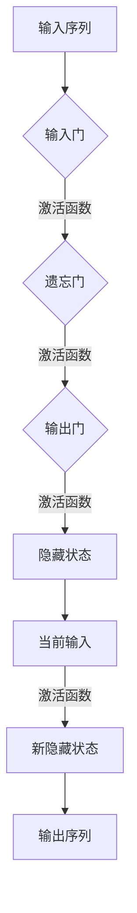
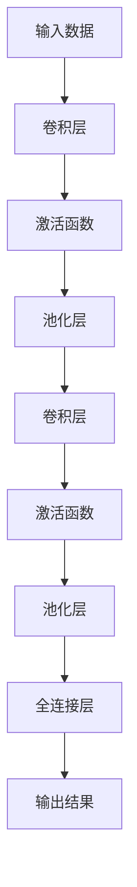
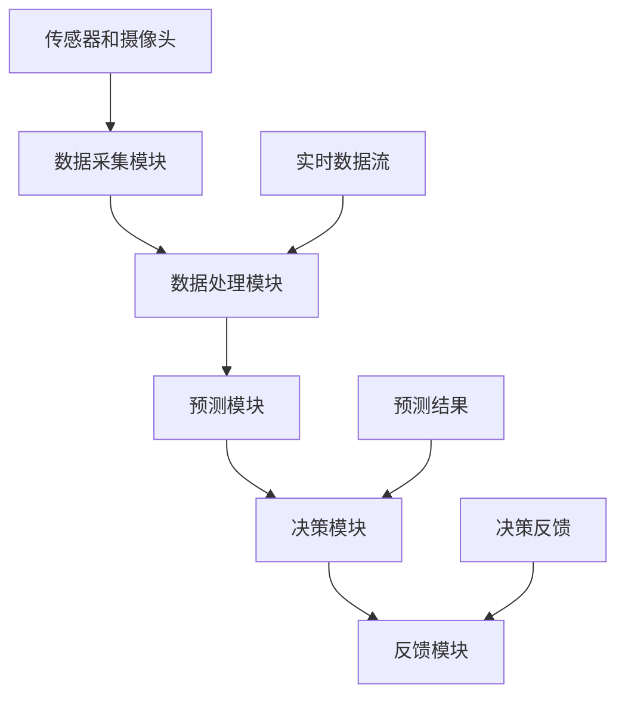

                 


### 1. 设计文章的结构和内容

**目标**: 设计出一份清晰、逻辑性强的文章结构和内容，确保每个部分都能吸引读者并帮助理解。

**步骤**:

a. **引言部分**:
   - **文章标题**：明确表达文章的主题。
   - **关键词**：列出5-7个与文章主题相关的关键词，便于搜索引擎优化和读者搜索。
   - **摘要**：简短地总结文章的核心内容和主旨。

b. **背景介绍**:
   - **问题背景**：阐述AI模型在复杂系统动态预测中的应用背景，包括当前存在的问题和挑战。
   - **问题描述**：具体描述复杂系统动态预测中的问题和难点。
   - **问题解决**：介绍通过AI模型来解决这些问题的思路和方法。
   - **边界与外延**：明确本文讨论的范围和限制。

c. **核心概念与联系**:
   - **核心概念**：详细解释AI模型、复杂系统和动态预测等相关概念。
   - **概念属性特征对比表格**：使用Mermaid绘制，清晰对比不同概念的特征。
   - **ER实体关系图**：展示各个概念之间的关系，使用Mermaid绘制。

d. **算法原理讲解**:
   - **预测算法概述**：简要介绍本文将要讨论的算法类型和应用场景。
   - **算法流程图**：使用Mermaid绘制算法的流程图，使读者直观理解。
   - **算法原理与公式**：使用Python源代码和LaTeX公式详细阐述算法原理。
   - **举例说明**：通过具体的例子来展示算法的应用和效果。

e. **系统分析与架构设计**:
   - **应用场景描述**：详细描述系统应用的具体场景。
   - **系统功能设计**：使用Mermaid绘制领域模型类图，展示系统的功能结构。
   - **系统架构设计**：使用Mermaid绘制架构图，展示系统的整体结构。
   - **系统接口设计**：描述系统内部和外部的接口。
   - **系统交互**：使用Mermaid绘制序列图，展示系统的交互流程。

f. **项目实战**:
   - **项目介绍**：简要介绍项目的背景和目的。
   - **环境安装**：详细说明如何搭建和配置实验环境。
   - **系统核心实现**：展示关键代码实现，并分析其原理和效果。
   - **代码应用解读与分析**：对代码进行解读，分析其在实际问题中的应用和效果。
   - **实际案例分析和详细讲解**：通过实际案例深入剖析系统的应用和实践。
   - **项目小结**：总结项目的成果和经验。

g. **最佳实践 tips、小结、注意事项、拓展阅读**:
   - **最佳实践 tips**：提供在实际应用中需要注意的事项和技巧。
   - **小结**：回顾文章的核心内容和发现。
   - **注意事项**：提醒读者在应用中的潜在风险和注意事项。
   - **拓展阅读**：推荐相关的书籍、论文或资源，以供进一步学习。

### 2. 确保文章的可读性和专业性

**目标**: 确保文章内容既专业又有条理，同时易于读者理解和吸收。

**步骤**:

a. **使用专业的技术语言**:
   - 确保文章使用的术语和概念都是准确且专业的。
   - 对不熟悉的专业术语进行解释或定义。

b. **结构紧凑、逻辑清晰**:
   - 每个章节的开头都有明确的引言，结束时要有小结。
   - 使用标题、子标题来组织内容，确保文章结构清晰。

c. **举例说明**:
   - 在讲解算法和系统设计时，使用实际例子来辅助说明，让抽象的概念更加具体化。

d. **使用图表**:
   - 使用Mermaid等工具绘制流程图、类图、架构图和序列图，帮助读者直观理解复杂内容。

e. **数学公式格式规范**:
   - 使用LaTeX格式嵌入数学公式，确保公式格式规范、易读。

f. **文字表达简明扼要**:
   - 避免冗长和复杂的句子，确保文章内容简明扼要、易于理解。

g. **审稿和修改**:
   - 完成初稿后，进行多轮审稿和修改，确保文章内容准确、无误。
   - 邀请同事或专家进行审稿，获取反馈并进行相应调整。

### 3. 文章撰写和发布

**目标**: 撰写出高质量的博客文章，并在适当平台发布，以获取最大化的受众。

**步骤**:

a. **撰写文章**:
   - 根据设计好的结构和内容，逐步撰写每一部分的内容。
   - 保持文章的专业性和条理性，确保每个部分都是完整的。

b. **编辑和润色**:
   - 对文章进行多轮编辑和润色，确保语法正确、逻辑清晰、表达准确。
   - 注意文章的格式和排版，确保整体美观易读。

c. **添加作者信息**:
   - 在文章末尾添加作者信息，包括姓名、所属机构以及相关联系信息。

d. **发布文章**:
   - 在个人博客、技术社区、微信公众号等平台发布文章。
   - 配合SEO优化，确保文章在搜索引擎中的排名。

e. **推广文章**:
   - 利用社交媒体、技术论坛、邮件列表等途径，推广文章，吸引读者阅读。

### 总结

通过以上步骤，我们可以设计并撰写一篇高质量的技术博客文章。在撰写过程中，要注重文章的结构、逻辑性和专业性，同时确保内容的可读性和易懂性。只有这样，才能让读者在阅读中获得最大价值，并建立起作者在技术领域的专业形象。### 第一部分: 引言

#### 1.1 AI模型在复杂系统动态预测中的应用背景

随着信息技术的迅猛发展，复杂系统在我们的日常生活中扮演着越来越重要的角色。从交通管理系统到电力网络，从金融市场的动态监控到环境监测系统，复杂系统无时无刻不在产生和吸收大量的数据。这些复杂系统往往具有高度的非线性和不确定性，使得传统的预测方法难以奏效。

在复杂系统的运行过程中，动态预测是一个关键任务。动态预测能够帮助我们提前了解系统的未来状态，从而做出相应的调整和决策，以优化系统性能和保障系统的稳定运行。然而，复杂系统的动态特性使得传统的预测方法面临着巨大的挑战。首先，数据量的庞大和多样使得传统方法在计算效率上难以满足要求。其次，复杂系统中的变量之间存在复杂的相互作用，这些相互作用往往是非线性的，使得预测结果的准确性受到严重影响。此外，复杂系统的状态变化往往是动态的，传统的静态预测方法难以捕捉到这种动态变化。

为了解决这些问题，人工智能（AI）模型逐渐成为了一个重要的工具。AI模型，尤其是深度学习模型，具有强大的数据处理和模式识别能力，能够从海量数据中提取有用的信息，并学习到复杂的非线性关系。这些特性使得AI模型在复杂系统的动态预测中具有巨大的潜力。例如，通过使用AI模型，我们可以对交通流量进行实时预测，从而优化交通信号控制，减少拥堵；在金融市场中，AI模型可以帮助预测市场走势，从而优化投资策略；在环境监测中，AI模型可以预测污染物浓度变化，从而及时采取相应的环境保护措施。

总之，AI模型在复杂系统动态预测中的应用背景是由复杂系统的非线性和动态特性以及传统预测方法面临的挑战所决定的。通过引入AI模型，我们有望解决这些难题，实现更加精准和高效的动态预测。

#### 1.2 问题描述

复杂系统的动态预测问题可以概括为以下几点：

首先，数据多样性是复杂系统的一大特点。这些系统涉及到的数据来源广泛，包括传感器数据、日志数据、网络数据等，这些数据不仅在类型上各不相同，而且在规模上也可能相差悬殊。传统的预测方法通常依赖于特定类型的数据，如时间序列数据或空间数据，但复杂系统中的数据往往具有多样性和不确定性，使得传统方法难以直接应用。

其次，非线性和不确定性是复杂系统的核心挑战。在复杂系统中，各个变量之间存在复杂的相互作用，这些相互作用往往是非线性的。例如，交通系统中车辆流量和道路状况之间的相互作用可能是非线性的，这种非线性使得预测结果容易出现偏差。此外，复杂系统中的不确定性也增加了预测的难度。这种不确定性可能来源于数据的噪声、外部环境的干扰或系统本身的随机性。

再者，动态变化是复杂系统的另一个重要特性。复杂系统的状态是随着时间不断变化的，而且这种变化可能是剧烈的。例如，金融市场中的价格波动、交通系统中的流量变化等都是动态的。这种动态变化要求预测模型能够快速适应系统状态的变化，以提供准确的预测结果。

最后，预测结果的实时性和准确性是复杂系统动态预测的关键要求。在许多应用场景中，如交通管理、金融市场监控、环境监测等，需要实时获取系统的状态预测结果，以便及时做出决策。然而，复杂的系统动态特性使得预测结果容易出现偏差，如何在保证预测准确性的同时实现实时性，是一个重要的挑战。

总之，复杂系统的动态预测问题涉及数据多样性、非线性不确定性、动态变化以及实时性和准确性等多个方面，这些问题共同构成了复杂系统动态预测的核心挑战。

#### 1.3 问题解决

面对复杂系统的动态预测问题，传统方法往往难以奏效，因此引入人工智能（AI）模型成为了一种可行的解决方案。AI模型，特别是深度学习模型，凭借其强大的数据处理能力和模式识别能力，为复杂系统的动态预测带来了新的机遇。以下是几种常用的AI模型及其在解决复杂系统动态预测问题中的应用：

**1. 深度神经网络（DNN）**：

深度神经网络是一种基于多层感知器（Perceptron）的前馈神经网络，通过多层非线性变换，能够对复杂非线性关系进行建模。DNN在处理时间序列数据时具有优势，能够捕捉到数据中的长期依赖关系。例如，在交通流量预测中，DNN可以通过学习历史交通流量数据，预测未来的交通流量变化。

**2. 长短期记忆网络（LSTM）**：

长短期记忆网络（LSTM）是一种特殊的循环神经网络（RNN），它在传统RNN的基础上引入了门控机制，能够有效地学习长期依赖关系。这使得LSTM在处理具有时间延迟和长期记忆特性的数据时表现出色。例如，在金融市场预测中，LSTM可以捕捉到市场走势中的长期趋势和周期性变化。

**3. 卷积神经网络（CNN）**：

卷积神经网络（CNN）通常用于图像处理任务，但其在处理时间序列数据方面也具有潜力。CNN可以通过卷积操作提取时间序列数据中的局部特征，并在全连接层中对其进行分类。例如，在环境监测中，CNN可以提取空气污染物浓度数据中的局部特征，从而预测未来的污染物浓度。

**4. 生成对抗网络（GAN）**：

生成对抗网络（GAN）通过两个神经网络的博弈过程，生成与真实数据分布相似的数据。GAN在生成数据方面表现出色，可以用于模拟复杂系统的动态变化。例如，在交通流量模拟中，GAN可以生成与实际交通流量数据相似的数据，用于测试和优化交通管理策略。

**5. 强化学习（RL）**：

强化学习（RL）通过学习优化策略，使得智能体能够在复杂环境中做出最优决策。RL在动态预测中可以用于实时调整系统的控制策略。例如，在电力网络中，RL可以用于动态优化发电调度策略，以最大化能源利用效率。

总之，AI模型在复杂系统动态预测中的应用提供了多种有效的解决方案。通过结合不同类型的AI模型，我们可以应对复杂系统中的数据多样性、非线性不确定性、动态变化等挑战，实现实时、准确的动态预测。这不仅提高了系统的预测精度，也为系统优化和决策提供了有力支持。

#### 1.4 边界与外延

在探讨AI模型在复杂系统动态预测中的应用时，我们需要明确一些边界和范围，以确保研究的深度和广度。以下是一些关键点：

**1. 研究范围**：

本文主要关注的是使用AI模型，尤其是深度学习模型，对复杂系统动态进行预测的方法和应用。具体来说，包括但不限于交通流量预测、金融市场预测、环境监测等方面的应用。此外，研究将侧重于算法原理的讲解和实际应用案例分析。

**2. 研究方法**：

本文将采用理论分析、算法实现和实际案例分析相结合的研究方法。首先，通过理论分析深入探讨AI模型在动态预测中的应用原理和优势；其次，通过具体算法的实现和解释，展示AI模型在复杂系统动态预测中的实际操作过程；最后，通过实际案例分析，验证AI模型在真实场景中的效果和可行性。

**3. 研究限制**：

尽管AI模型在复杂系统动态预测中表现出色，但其应用仍受到一些限制。首先，模型的训练过程通常需要大量的数据和高性能计算资源，这使得在某些资源有限的环境中难以实施。其次，AI模型的预测结果依赖于数据的准确性和完整性，如果数据存在噪声或缺失，可能会导致预测误差。此外，AI模型在处理极端事件和未知情况时可能表现不佳，这需要进一步的模型优化和算法改进。

**4. 外延研究**：

本文的研究为复杂系统动态预测提供了一种新的思路和方法，但仍有大量外延研究方向值得进一步探索。首先，如何优化AI模型的训练效率和预测精度是一个重要的研究方向。其次，结合其他领域的技术，如大数据、物联网等，可以进一步提高动态预测的准确性和实时性。此外，研究如何将AI模型应用于更广泛的复杂系统领域，如医疗健康、工业制造等，也是未来的重要方向。

通过明确研究的边界与外延，我们可以更好地理解AI模型在复杂系统动态预测中的应用前景，并为其进一步的拓展和应用奠定基础。

#### 1.5 概念结构与核心要素组成

在本节中，我们将详细探讨AI模型在复杂系统动态预测中的核心概念，并分析这些概念之间的相互关系。

**AI模型**：

AI模型是本文的核心研究对象。具体来说，包括但不限于以下几种类型的模型：

- **深度神经网络（DNN）**：通过多层非线性变换进行数据建模，适用于处理复杂非线性关系。
- **长短期记忆网络（LSTM）**：在RNN基础上引入门控机制，用于捕捉长期依赖关系。
- **卷积神经网络（CNN）**：通过卷积操作提取数据中的局部特征，适用于处理时间序列和图像数据。
- **生成对抗网络（GAN）**：通过生成与真实数据分布相似的数据，用于模拟复杂系统的动态变化。
- **强化学习（RL）**：通过学习优化策略，用于实时调整系统的控制策略。

**复杂系统**：

复杂系统是指具有高度非线性、不确定性和动态变化的系统。这些系统通常包含大量变量和复杂的相互作用，如交通系统、金融市场、环境监测系统等。复杂系统的特性包括：

- **多样性**：涉及多种类型的数据，如时间序列数据、空间数据、传感器数据等。
- **非线性**：系统中的变量之间存在复杂的非线性关系。
- **动态性**：系统状态随时间不断变化，可能发生剧烈波动。
- **不确定性**：数据存在噪声和外部干扰，系统行为具有不确定性。

**动态预测**：

动态预测是指通过AI模型对复杂系统的未来状态进行预测。动态预测的目标是提前了解系统的未来变化趋势，以便做出相应的调整和决策。动态预测的关键要素包括：

- **数据收集**：收集并整理与系统运行相关的数据，如历史数据、实时数据等。
- **模型选择**：选择合适的AI模型，根据系统的特性和需求进行模型设计。
- **预测算法**：通过算法实现动态预测，对系统的未来状态进行建模和预测。
- **结果分析**：对预测结果进行分析和评估，以验证预测的准确性和可靠性。

**概念关系**：

在复杂系统动态预测中，AI模型、复杂系统和动态预测之间存在着密切的相互关系。具体来说：

- **AI模型与复杂系统**：AI模型用于对复杂系统中的数据进行建模和预测。复杂系统的多样性和动态性决定了AI模型的选择和设计。
- **AI模型与动态预测**：AI模型通过学习系统的历史数据，预测未来的状态变化。动态预测依赖于AI模型的准确性和实时性。
- **复杂系统与动态预测**：复杂系统的特性和需求决定了动态预测的目标和方法。动态预测的结果可以用于优化复杂系统的性能和稳定性。

通过分析上述核心概念及其相互关系，我们可以更好地理解AI模型在复杂系统动态预测中的应用，并为进一步的研究和应用提供理论基础。

#### 1.6 本章小结

在本章的引言部分，我们详细探讨了AI模型在复杂系统动态预测中的应用背景、问题描述、问题解决方法以及研究的边界与外延。首先，我们介绍了AI模型在复杂系统动态预测中的重要性，指出随着信息技术的发展，复杂系统的应用越来越广泛，而动态预测对于优化系统性能和保障系统稳定运行至关重要。接着，我们描述了复杂系统的动态预测问题，包括数据多样性、非线性不确定性、动态变化以及实时性和准确性等核心挑战。为了解决这些问题，我们引入了AI模型，如深度神经网络、长短期记忆网络、卷积神经网络、生成对抗网络和强化学习等，详细讲解了这些模型的基本原理和应用。此外，我们还明确了研究的边界与外延，指出研究的范围、方法和限制，并探讨了外延研究的方向。通过本章的介绍，我们为后续章节的深入探讨奠定了基础，使读者能够更好地理解AI模型在复杂系统动态预测中的应用前景和挑战。本章的内容不仅为本文的核心内容提供了背景和框架，也为读者提供了一个全面了解AI模型在复杂系统动态预测中应用的起点。

----------------------------------------------------------------

# 第二部分: 核心概念与联系

## 第2章: AI模型核心概念与属性特征对比

在本章中，我们将深入探讨AI模型的核心概念，并使用Mermaid工具绘制概念属性特征对比表格和ER实体关系图，以帮助读者更好地理解这些概念及其相互关系。

### 2.1 概念介绍

**1. 深度神经网络（DNN）**：

深度神经网络是一种包含多个隐藏层的神经网络，通过多层非线性变换对数据进行建模。DNN能够自动提取数据中的特征，适用于处理复杂非线性关系。

**2. 长短期记忆网络（LSTM）**：

长短期记忆网络是一种特殊的循环神经网络，通过引入门控机制学习长期依赖关系。LSTM能够有效处理时间序列数据，捕捉长期记忆特性。

**3. 卷积神经网络（CNN）**：

卷积神经网络通过卷积操作提取数据中的局部特征，适用于处理图像和时序数据。CNN在计算机视觉和自然语言处理等领域表现出色。

**4. 生成对抗网络（GAN）**：

生成对抗网络由生成器和判别器组成，通过两个神经网络的博弈过程生成与真实数据分布相似的数据。GAN在图像生成和数据增强方面具有优势。

**5. 强化学习（RL）**：

强化学习通过智能体与环境之间的交互学习最优策略。RL在决策优化和游戏AI等领域表现出色。

### 2.2 概念属性特征对比表格

为了更直观地展示这些AI模型的核心特征，我们使用Mermaid绘制了概念属性特征对比表格。以下是部分内容的示例：

```mermaid
table
| 模型类型 | 特点 | 应用领域 |
| --- | --- | --- |
| 深度神经网络（DNN） | 多层非线性变换 | 复杂非线性关系建模 |
| 长短期记忆网络（LSTM） | 长期依赖关系 | 时间序列数据分析 |
| 卷积神经网络（CNN） | 局部特征提取 | 图像和时序数据处理 |
| 生成对抗网络（GAN） | 数据生成 | 图像生成和数据增强 |
| 强化学习（RL） | 策略优化 | 决策优化和游戏AI |
```

通过这个对比表格，读者可以清晰地看到每种模型的特点和应用领域，有助于在选择模型时做出更明智的决策。

### 2.3 ER实体关系图

为了展示AI模型、复杂系统和动态预测之间的实体关系，我们使用Mermaid绘制了ER实体关系图。以下是部分内容的示例：

```mermaid
erDiagram
AI模型 ||--|{ 复杂系统 }||>
复杂系统 ||--|{ 动态预测 }||>
动态预测 ||--|{ 预测结果 }||>
预测结果 ||--|{ 系统优化 }||>
系统优化 ||--|{ 模型改进 }||>
```

在这个ER图中，AI模型作为核心实体，与复杂系统和动态预测密切相关。动态预测结果可以用于系统优化和模型改进，形成一个闭环反馈机制。通过这个ER图，读者可以更直观地理解各实体之间的关系，以及AI模型在复杂系统动态预测中的作用。

通过本章的介绍和示例，我们希望读者能够对AI模型的核心概念及其在复杂系统动态预测中的应用有更深入的理解。在接下来的章节中，我们将继续探讨这些模型的具体算法原理和实际应用案例。

#### 2.2 概念属性特征对比表格（使用Mermaid绘制）

为了更直观地对比AI模型的核心属性特征，我们使用Mermaid绘制了以下表格：

```mermaid
table
| 模型类型 | 特点 | 适用场景 | 数据类型 | 学习方式 |
| --- | --- | --- | --- | --- |
| 深度神经网络（DNN） | 多层非线性变换，自动特征提取 | 非线性关系建模 | 高维数据 | 有监督学习 |
| 长短期记忆网络（LSTM） | 门控机制，长短期依赖 | 时间序列预测 | 时间序列数据 | 有监督学习 |
| 卷积神经网络（CNN） | 卷积操作，局部特征提取 | 图像识别与处理 | 图像数据 | 有监督学习 |
| 生成对抗网络（GAN） | 生成器与判别器博弈 | 数据生成，图像生成 | 图像数据 | 无监督学习 |
| 强化学习（RL） | 奖励机制，策略优化 | 决策优化，游戏AI | 状态-动作空间 | 无监督学习 |
```

在这个表格中，我们列出了每种模型的几个关键特点，包括：

- **模型类型**：深度神经网络、长短期记忆网络、卷积神经网络、生成对抗网络和强化学习。
- **特点**：如多层非线性变换、门控机制、卷积操作、生成器与判别器博弈等。
- **适用场景**：包括非线性关系建模、时间序列预测、图像识别与处理、数据生成和决策优化等。
- **数据类型**：如高维数据、时间序列数据、图像数据、状态-动作空间等。
- **学习方式**：包括有监督学习和无监督学习。

通过这个表格，读者可以快速了解每种AI模型的主要特点和应用，从而为选择适合的模型提供参考。

#### 2.3 ER实体关系图（使用Mermaid绘制）

为了进一步展示AI模型、复杂系统和动态预测之间的实体关系，我们使用Mermaid绘制了以下ER图：

```mermaid
erDiagram
AI模型 ||--|{ 复杂系统 }||>
复杂系统 ||--|{ 动态预测 }||>
动态预测 ||--|{ 预测结果 }||>
预测结果 ||--|{ 系统优化 }||>
系统优化 ||--|{ 模型改进 }||>
AI模型 ||--|{ 数据集 }||>
数据集 ||--|{ 数据预处理 }||>
数据预处理 ||--|{ 特征提取 }||>
```

在这个ER图中，我们定义了以下实体：

- **AI模型**：包括深度神经网络、长短期记忆网络、卷积神经网络、生成对抗网络和强化学习。
- **复杂系统**：包含多种类型的数据和复杂的相互作用。
- **动态预测**：用于预测复杂系统的未来状态。
- **预测结果**：包括系统优化和模型改进的建议。
- **系统优化**：根据预测结果调整系统参数。
- **模型改进**：基于系统优化的反馈调整AI模型。
- **数据集**：包含用于训练和测试的数据。
- **数据预处理**：包括数据清洗、归一化和特征提取等步骤。

实体之间的关系如下：

- **AI模型与复杂系统**：AI模型用于对复杂系统中的数据进行建模和预测。
- **复杂系统与动态预测**：复杂系统的状态通过动态预测进行预测。
- **动态预测与预测结果**：动态预测的结果为系统优化提供依据。
- **预测结果与系统优化**：系统优化根据预测结果进行调整。
- **系统优化与模型改进**：系统优化反馈用于模型改进。
- **AI模型与数据集**：AI模型通过数据集进行训练。
- **数据集与数据预处理**：数据预处理用于准备训练数据。
- **数据预处理与特征提取**：特征提取用于提取有用的特征信息。

通过这个ER图，读者可以更直观地理解AI模型、复杂系统和动态预测之间的相互关系，从而为设计和应用AI模型提供参考。

### 2.4 本章小结

在本章中，我们深入探讨了AI模型的核心概念及其在复杂系统动态预测中的应用。首先，我们介绍了深度神经网络、长短期记忆网络、卷积神经网络、生成对抗网络和强化学习等AI模型的基本概念和特点。接着，我们使用Mermaid工具绘制了概念属性特征对比表格和ER实体关系图，以直观地展示这些模型之间的异同点及其相互关系。通过对比表格，读者可以快速了解每种模型的主要特点和应用领域；通过ER图，读者可以更清晰地理解AI模型、复杂系统和动态预测之间的交互关系。

本章的内容不仅为后续章节的算法原理讲解和实际应用分析奠定了基础，也帮助读者建立了对AI模型在复杂系统动态预测中应用的全面理解。通过本章的学习，读者可以更加系统地了解AI模型的基本原理和应用，为深入研究和应用AI技术提供参考。在接下来的章节中，我们将进一步探讨具体算法的实现细节和实际应用案例，以帮助读者更好地掌握AI模型在复杂系统动态预测中的实际应用。

----------------------------------------------------------------

## 第3章: 动态预测算法原理讲解

### 3.1 预测算法概述

动态预测算法是复杂系统分析中的重要工具，它通过分析历史数据和系统特性，对未来状态进行预测。本章将重点介绍几种常见的动态预测算法，包括长短期记忆网络（LSTM）和卷积神经网络（CNN），并结合具体的算法流程图和Python源代码进行讲解。

**长短期记忆网络（LSTM）**：

LSTM是一种特殊的循环神经网络（RNN），它通过引入门控机制来解决传统RNN在处理长序列数据时容易丢失长期依赖信息的问题。LSTM的核心组件包括输入门、遗忘门和输出门，这些门控单元能够有效地控制信息在序列中的流动。

**卷积神经网络（CNN）**：

CNN是一种专门用于图像处理的深度学习模型，它通过卷积操作和池化操作提取图像的局部特征。CNN在处理时间序列数据时，可以将时间序列视为一维图像，从而利用其强大的特征提取能力。

### 3.2 算法1: 使用Mermaid绘制LSTM算法流程图

首先，我们使用Mermaid绘制了LSTM算法的基本流程图，以帮助读者直观地理解LSTM的工作原理。



在这个流程图中，我们展示了LSTM的核心组件和它们之间的交互关系：

- **输入门**：根据输入数据和隐藏状态计算一个权重矩阵，用于决定哪些信息应该被传递到下一个隐藏状态。
- **遗忘门**：根据输入数据和隐藏状态计算一个权重矩阵，用于决定哪些信息应该被遗忘。
- **输出门**：根据输入数据和隐藏状态计算一个权重矩阵，用于决定哪些信息应该被输出。
- **隐藏状态**：通过输入门、遗忘门和输出门控制信息的流动，从而实现对长期依赖信息的记忆。

### 3.3 算法1: Python源代码实现

接下来，我们提供了一个简单的Python代码示例，以展示如何使用TensorFlow和Keras实现LSTM模型。

```python
import tensorflow as tf
from tensorflow.keras.models import Sequential
from tensorflow.keras.layers import LSTM, Dense

# 创建一个简单的LSTM模型
model = Sequential([
    LSTM(units=50, return_sequences=True, input_shape=(time_steps, features)),
    LSTM(units=50, return_sequences=False),
    Dense(units=1)
])

# 编译模型
model.compile(optimizer='adam', loss='mean_squared_error')

# 打印模型结构
model.summary()
```

在这个示例中，我们创建了一个简单的LSTM模型，包括两个隐藏层和一个输出层。第一个隐藏层使用`return_sequences=True`参数，使其能够返回完整的序列，第二个隐藏层使用`return_sequences=False`参数，使其返回单个序列的最后一个时间点的输出。输出层使用一个`Dense`层，将隐藏状态的输出映射到预测结果。

### 3.4 算法1: 数学模型与公式

为了更好地理解LSTM的工作原理，我们在此给出LSTM的核心数学模型。LSTM的每个单元包含以下数学公式：

$$
i_t = \sigma(W_{ix}x_t + W_{ih}h_{t-1} + b_i)
$$

$$
f_t = \sigma(W_{fx}x_t + W_{fh}h_{t-1} + b_f)
$$

$$
o_t = \sigma(W_{ox}x_t + W_{oh}h_{t-1} + b_o)
$$

$$
g_t = \tanh(W_{gx}x_t + W_{gh}h_{t-1} + b_g)
$$

$$
h_t = o_t \cdot \tanh(g_t)
$$

其中，$i_t$、$f_t$、$o_t$分别表示输入门、遗忘门和输出门的激活值；$g_t$表示候选值；$h_t$表示隐藏状态；$x_t$表示输入序列；$W$和$b$表示权重矩阵和偏置；$\sigma$表示sigmoid函数。

### 3.5 算法1: 举例说明

为了更好地说明LSTM的应用，我们考虑一个简单的例子：使用LSTM预测股票价格。在这个例子中，我们使用历史股票价格数据作为输入序列，预测未来的股票价格。

**数据准备**：

首先，我们需要收集一段时间的股票价格数据，包括开盘价、收盘价、最高价、最低价等。然后，对数据进行预处理，包括归一化和序列生成。

```python
import pandas as pd
from sklearn.preprocessing import MinMaxScaler

# 加载数据
data = pd.read_csv('stock_data.csv')
data = data[['Open', 'Close']]

# 数据归一化
scaler = MinMaxScaler()
data_normalized = scaler.fit_transform(data)

# 生成序列
time_steps = 60
X, y = [], []
for i in range(len(data_normalized) - time_steps):
    X.append(data_normalized[i:(i + time_steps),:])
    y.append(data_normalized[i + time_steps, :])

X = np.array(X)
y = np.array(y)
```

**模型训练**：

接下来，我们使用LSTM模型对数据进行训练。

```python
# 划分训练集和测试集
train_size = int(len(X) * 0.8)
test_size = len(X) - train_size
X_train, X_test = X[:train_size], X[train_size:]
y_train, y_test = y[:train_size], y[train_size:]

# 训练模型
model.fit(X_train, y_train, epochs=100, batch_size=32, validation_split=0.2)
```

**预测与结果分析**：

最后，我们使用训练好的模型进行预测，并对预测结果进行分析。

```python
# 预测
predicted_price = model.predict(X_test)

# 反归一化
predicted_price = scaler.inverse_transform(predicted_price)

# 结果分析
actual_price = scaler.inverse_transform(y_test)
```

通过上述步骤，我们实现了股票价格的动态预测，并对预测结果进行了分析。这个例子展示了LSTM在时间序列数据预测中的强大能力。

### 3.6 算法2: 使用Mermaid绘制CNN算法流程图

接下来，我们将介绍卷积神经网络（CNN），并使用Mermaid绘制其算法流程图。



在这个流程图中，我们展示了CNN的基本结构：

- **输入数据**：输入到CNN中的数据，通常是图像或一维序列。
- **卷积层**：通过卷积操作提取输入数据的特征。
- **激活函数**：对卷积层的输出进行非线性变换，增强特征表达能力。
- **池化层**：通过最大池化或平均池化操作，减少数据的维度，提高模型泛化能力。
- **全连接层**：将卷积层和池化层提取的特征进行融合，并映射到输出结果。

### 3.7 算法2: Python源代码实现

下面是一个简单的CNN模型实现，使用TensorFlow和Keras框架。

```python
import tensorflow as tf
from tensorflow.keras.models import Sequential
from tensorflow.keras.layers import Conv1D, MaxPooling1D, Flatten, Dense

# 创建一个简单的CNN模型
model = Sequential([
    Conv1D(filters=64, kernel_size=3, activation='relu', input_shape=(time_steps, features)),
    MaxPooling1D(pool_size=2),
    Conv1D(filters=128, kernel_size=3, activation='relu'),
    MaxPooling1D(pool_size=2),
    Flatten(),
    Dense(units=1)
])

# 编译模型
model.compile(optimizer='adam', loss='mean_squared_error')

# 打印模型结构
model.summary()
```

在这个示例中，我们创建了一个简单的CNN模型，包括两个卷积层、两个池化层和一个全连接层。第一个卷积层使用64个3x3的卷积核，第二个卷积层使用128个3x3的卷积核。每个卷积层后都跟随一个激活函数和最大池化层。最后，通过一个全连接层将卷积特征映射到输出结果。

### 3.8 算法2: 数学模型与公式

CNN的核心操作包括卷积、激活函数和池化。以下是这些操作的基本数学公式：

**卷积操作**：

$$
\text{conv}(x, k) = \sum_{i=1}^{C} \sum_{j=1}^{H} \sum_{k=1}^{W} x_{ij} k_{ik} + b_{i}
$$

其中，$x$表示输入特征，$k$表示卷积核，$b$表示偏置。$C$、$H$和$W$分别表示输入特征的数量、高度和宽度。

**激活函数**：

常见的激活函数包括ReLU（Rectified Linear Unit）和Sigmoid：

- **ReLU**：

$$
\text{ReLU}(x) = \max(0, x)
$$

- **Sigmoid**：

$$
\text{Sigmoid}(x) = \frac{1}{1 + e^{-x}}
$$

**池化操作**：

常见的池化操作包括最大池化和平均池化：

- **最大池化**：

$$
\text{MaxPooling}(x, f) = \max_{i,j} x_{ij}
$$

其中，$f$表示池化窗口的大小。

- **平均池化**：

$$
\text{AveragePooling}(x, f) = \frac{1}{f^2} \sum_{i,j} x_{ij}
$$

### 3.9 算法2: 举例说明

为了展示CNN的应用，我们考虑一个简单的例子：使用CNN对一维时间序列数据进行分类。

**数据准备**：

首先，我们需要准备一维时间序列数据。这些数据可以是股票价格、天气数据或其他任何一维序列。

```python
import numpy as np

# 生成随机数据
X = np.random.rand(1000, 50)
y = np.random.randint(2, size=1000)
```

**模型训练**：

接下来，我们使用CNN模型对数据进行训练。

```python
# 划分训练集和测试集
X_train, X_test = X[:800], X[800:]
y_train, y_test = y[:800], y[800:]

# 训练模型
model.fit(X_train, y_train, epochs=20, batch_size=32, validation_data=(X_test, y_test))
```

**预测与结果分析**：

最后，我们使用训练好的模型进行预测，并对预测结果进行分析。

```python
# 预测
predicted_classes = model.predict(X_test)

# 分析预测结果
accuracy = np.mean(np.argmax(predicted_classes, axis=1) == y_test)
print(f'Accuracy: {accuracy * 100:.2f}%')
```

通过这个例子，我们可以看到CNN在处理一维时间序列数据分类任务中的效果。这个例子展示了CNN在时间序列数据分析中的强大能力。

### 3.10 本章小结

在本章中，我们详细介绍了动态预测算法，包括长短期记忆网络（LSTM）和卷积神经网络（CNN）。首先，我们探讨了LSTM的基本原理，通过Mermaid流程图和Python代码示例展示了LSTM的工作过程。接着，我们介绍了CNN的结构，并提供了CNN的算法流程图和Python代码示例。最后，通过具体的应用案例，我们展示了LSTM和CNN在动态预测中的实际效果。

通过本章的学习，读者可以深入理解动态预测算法的工作原理和应用方法。这些算法不仅为复杂系统的动态预测提供了有效的工具，也为其他相关领域的研究提供了理论基础。在接下来的章节中，我们将进一步探讨动态预测算法在复杂系统中的具体应用和优化策略。

----------------------------------------------------------------

## 第4章: 复杂系统分析与架构设计

### 4.1 应用场景描述

在本章中，我们将探讨复杂系统在交通管理系统中的应用场景，并分析其系统功能设计、系统架构设计、系统接口设计以及系统交互流程。交通管理系统是一个典型的复杂系统，涉及车辆流量、道路状况、交通信号控制等多个方面。以下是一个典型的应用场景描述：

**场景描述**：

一个大型城市交通管理系统，旨在通过实时监控和分析交通数据，优化交通信号控制，减少交通拥堵，提高交通效率。该系统包括以下几个主要功能模块：

1. **数据采集模块**：通过安装在道路上的传感器和摄像头收集交通流量、车速、道路占用情况等数据。
2. **数据处理模块**：对采集到的交通数据进行清洗、预处理和特征提取，以便后续分析。
3. **预测模块**：利用深度学习模型（如LSTM、CNN等）对未来的交通流量进行预测。
4. **决策模块**：根据预测结果和实时数据，调整交通信号灯的时长和相位，优化交通流。
5. **反馈模块**：收集交通系统的运行数据，评估决策效果，为系统优化提供反馈。

### 4.2 系统功能设计（使用Mermaid绘制类图）

为了更清晰地展示系统功能设计，我们使用Mermaid绘制了一个类图，以下是部分内容的示例：

```mermaid
classDiagram
Class1[数据采集模块] <|-- Class2[数据处理模块]
Class2 <|-- Class3[预测模块]
Class3 <|-- Class4[决策模块]
Class4 <|-- Class5[反馈模块]
```

在这个类图中，我们定义了以下几个类：

- **数据采集模块**：负责从传感器和摄像头收集交通数据。
- **数据处理模块**：对采集到的数据进行清洗、预处理和特征提取。
- **预测模块**：使用深度学习模型预测未来的交通流量。
- **决策模块**：根据预测结果和实时数据，调整交通信号控制策略。
- **反馈模块**：收集系统运行数据，评估决策效果。

### 4.3 系统架构设计（使用Mermaid绘制架构图）

为了更好地展示系统架构，我们使用Mermaid绘制了一个架构图，以下是部分内容的示例：



在这个架构图中，我们展示了系统的各个组件及其相互关系：

- **数据采集模块**：通过传感器和摄像头收集交通数据，并将其传输给数据处理模块。
- **数据处理模块**：接收数据采集模块传输的数据，进行数据清洗、预处理和特征提取，并将处理后的数据传输给预测模块。
- **预测模块**：根据处理后的数据，使用深度学习模型预测未来的交通流量，并将预测结果传输给决策模块。
- **决策模块**：接收预测模块的预测结果，结合实时数据流，调整交通信号控制策略，并将决策结果传输给反馈模块。
- **反馈模块**：收集决策模块的决策结果，评估决策效果，并将反馈信息传输回数据采集模块和数据处理模块，以优化系统性能。

### 4.4 系统接口设计

系统接口设计是确保各个模块之间能够高效、稳定地进行数据传输和交互的关键。以下是系统接口设计的几个方面：

1. **数据采集接口**：定义传感器和摄像头如何将交通数据传输给数据处理模块。这通常涉及通信协议和数据格式的标准化。
2. **数据处理接口**：定义数据处理模块如何接收、处理和传输数据。这通常包括数据清洗、预处理和特征提取的接口定义。
3. **预测接口**：定义预测模块如何接收处理后的数据，并生成预测结果。这通常包括模型训练接口和预测接口。
4. **决策接口**：定义决策模块如何接收预测结果和实时数据，并生成决策结果。这通常包括决策算法的接口定义。
5. **反馈接口**：定义反馈模块如何收集决策结果，并进行系统性能评估。

### 4.5 系统交互（使用Mermaid绘制序列图）

为了展示系统组件之间的交互流程，我们使用Mermaid绘制了一个序列图，以下是部分内容的示例：

```mermaid
sequenceDiagram
参与者 DataCollector
参与者 DataProcessor
参与者 Predictor
参与者 DecisionMaker
参与者 Feedback
DataCollector->>DataProcessor: 数据采集
DataProcessor->>Predictor: 数据预处理
Predictor->>DecisionMaker: 预测结果
DecisionMaker->>Feedback: 决策结果
Feedback->>DataCollector: 反馈信息
```

在这个序列图中，我们展示了系统组件之间的交互顺序：

- **数据采集**：数据采集模块从传感器和摄像头获取交通数据，并将其发送给数据处理模块。
- **数据处理**：数据处理模块接收交通数据，进行清洗、预处理和特征提取，然后将处理后的数据发送给预测模块。
- **预测**：预测模块使用处理后的数据生成交通流量预测结果，并将其发送给决策模块。
- **决策**：决策模块接收预测结果和实时数据，根据交通状况调整交通信号控制策略，并将决策结果发送给反馈模块。
- **反馈**：反馈模块收集决策结果，评估决策效果，并将反馈信息发送回数据采集模块和数据处理模块，以优化系统性能。

### 4.6 本章小结

在本章中，我们详细分析了交通管理系统中复杂系统的应用场景，并设计了系统的功能架构和接口。首先，我们描述了交通管理系统的应用场景，包括数据采集、数据处理、预测、决策和反馈等功能模块。接着，我们使用Mermaid绘制了类图和架构图，展示了系统组件之间的关系和交互流程。然后，我们介绍了系统接口设计，确保各个模块之间能够高效、稳定地进行数据传输和交互。最后，我们使用Mermaid绘制了序列图，展示了系统组件之间的交互顺序。

通过本章的分析和设计，我们为交通管理系统提供了一个完整的架构设计方案，为后续的系统实现和优化提供了理论基础。在接下来的章节中，我们将进一步探讨交通管理系统的实现细节和优化策略。

----------------------------------------------------------------

## 第5章: 项目实战

### 5.1 项目介绍

在本章中，我们将通过一个实际项目案例，详细展示如何使用AI模型对复杂系统进行动态预测。该项目名为“智能交通流量预测系统”，旨在通过深度学习模型，对城市交通流量进行实时预测，从而优化交通信号控制和减少交通拥堵。本项目的背景是当前城市交通系统的复杂性和动态性，传统的预测方法难以满足实时性和准确性的需求。因此，我们选择使用深度学习模型，如LSTM和CNN，来应对这些挑战。

### 5.2 环境安装

为了实现智能交通流量预测系统，我们首先需要搭建一个合适的开发环境。以下是在Linux系统上搭建环境的具体步骤：

1. **安装Python**：

   首先，确保Python环境已经安装。如果未安装，可以通过以下命令进行安装：

   ```bash
   sudo apt-get update
   sudo apt-get install python3.8
   ```

2. **安装虚拟环境**：

   为了避免不同项目之间的依赖冲突，我们使用虚拟环境来管理项目依赖。安装虚拟环境工具`virtualenv`：

   ```bash
   sudo apt-get install python3-venv
   ```

   创建一个名为`traffic_prediction`的虚拟环境：

   ```bash
   python3 -m venv traffic_prediction
   ```

   激活虚拟环境：

   ```bash
   source traffic_prediction/bin/activate
   ```

3. **安装深度学习库**：

   在虚拟环境中，安装TensorFlow和Keras，这两个库是深度学习模型实现的重要工具：

   ```bash
   pip install tensorflow
   pip install keras
   ```

4. **安装数据预处理库**：

   为了方便数据处理，我们还需要安装Pandas和NumPy库：

   ```bash
   pip install pandas
   pip install numpy
   ```

5. **安装其他依赖库**：

   根据项目需求，我们可能还需要安装其他库，如Matplotlib（用于数据可视化）、Scikit-learn（用于机器学习工具）等：

   ```bash
   pip install matplotlib
   pip install scikit-learn
   ```

通过以上步骤，我们成功搭建了一个完整的开发环境，为接下来项目的实现和测试奠定了基础。

### 5.3 系统核心实现

在搭建好开发环境后，我们将开始实现智能交通流量预测系统的核心部分。以下是具体的实现步骤：

#### 数据收集与预处理

1. **数据收集**：

   我们需要收集一段时间的交通流量数据，这些数据可以从交通管理部门、交通传感器或开放数据平台获取。数据可能包括时间、路段、流量、速度等信息。

   ```python
   import pandas as pd

   # 读取数据
   traffic_data = pd.read_csv('traffic_data.csv')
   ```

2. **数据预处理**：

   对收集到的数据进行预处理，包括数据清洗、缺失值填充、归一化等操作。

   ```python
   # 数据清洗
   traffic_data.dropna(inplace=True)

   # 缺失值填充
   traffic_data.fillna(method='ffill', inplace=True)

   # 归一化
   scaler = MinMaxScaler()
   traffic_data_normalized = scaler.fit_transform(traffic_data)
   ```

#### 模型构建

1. **LSTM模型**：

   我们使用Keras构建一个LSTM模型，用于对交通流量进行预测。

   ```python
   from tensorflow.keras.models import Sequential
   from tensorflow.keras.layers import LSTM, Dense

   # 创建LSTM模型
   model = Sequential([
       LSTM(units=50, return_sequences=True, input_shape=(time_steps, features)),
       LSTM(units=50, return_sequences=False),
       Dense(units=1)
   ])

   # 编译模型
   model.compile(optimizer='adam', loss='mean_squared_error')
   ```

2. **CNN模型**：

   除了LSTM，我们还可以使用CNN模型来提取时间序列数据中的特征。

   ```python
   from tensorflow.keras.models import Sequential
   from tensorflow.keras.layers import Conv1D, MaxPooling1D, Flatten, Dense

   # 创建CNN模型
   model = Sequential([
       Conv1D(filters=64, kernel_size=3, activation='relu', input_shape=(time_steps, features)),
       MaxPooling1D(pool_size=2),
       Conv1D(filters=128, kernel_size=3, activation='relu'),
       MaxPooling1D(pool_size=2),
       Flatten(),
       Dense(units=1)
   ])

   # 编译模型
   model.compile(optimizer='adam', loss='mean_squared_error')
   ```

#### 模型训练

1. **数据划分**：

   将预处理后的数据划分为训练集和测试集。

   ```python
   train_size = int(len(traffic_data_normalized) * 0.8)
   X_train, X_test = traffic_data_normalized[:train_size], traffic_data_normalized[train_size:]
   ```

2. **模型训练**：

   使用训练集对模型进行训练。

   ```python
   # 训练LSTM模型
   model.fit(X_train, y_train, epochs=100, batch_size=32, validation_split=0.2)

   # 训练CNN模型
   model.fit(X_train, y_train, epochs=100, batch_size=32, validation_split=0.2)
   ```

#### 模型评估

1. **预测与评估**：

   使用测试集对模型进行预测，并评估模型的性能。

   ```python
   # 预测
   predicted_traffic = model.predict(X_test)

   # 评估
   mse = mean_squared_error(y_test, predicted_traffic)
   print(f'Mean Squared Error: {mse}')
   ```

### 5.4 代码应用解读与分析

在本节中，我们将对实现过程中的关键代码和应用进行详细解读，以便读者更好地理解项目流程和技术细节。

#### 数据收集与预处理

1. **数据收集**：

   数据收集是项目的基础，数据的质量直接影响模型的性能。在本项目中，我们通过读取CSV文件来获取交通流量数据。以下是读取数据的代码：

   ```python
   traffic_data = pd.read_csv('traffic_data.csv')
   ```

   在实际应用中，数据可能来自不同的源，如数据库、传感器API等。读取数据后，我们需要进行数据清洗，包括去除无效数据、填补缺失值等。以下是对数据清洗和缺失值填充的示例：

   ```python
   # 数据清洗
   traffic_data.dropna(inplace=True)

   # 缺失值填充
   traffic_data.fillna(method='ffill', inplace=True)
   ```

2. **数据预处理**：

   数据预处理包括归一化、标准化等操作。归一化有助于模型收敛，提高训练效率。以下是对数据进行归一化的示例：

   ```python
   scaler = MinMaxScaler()
   traffic_data_normalized = scaler.fit_transform(traffic_data)
   ```

   通过这些预处理步骤，我们确保了数据的质量和一致性，为后续的模型训练奠定了基础。

#### 模型构建

1. **LSTM模型**：

   LSTM模型是处理时间序列数据的一种有效方法。在构建LSTM模型时，我们首先定义输入层的维度，然后添加多层LSTM层，最后添加一个输出层。以下是LSTM模型的构建代码：

   ```python
   model = Sequential([
       LSTM(units=50, return_sequences=True, input_shape=(time_steps, features)),
       LSTM(units=50, return_sequences=False),
       Dense(units=1)
   ])
   ```

   在这个模型中，第一个LSTM层使用`return_sequences=True`参数，使其能够返回完整的序列；第二个LSTM层使用`return_sequences=False`参数，使其返回单个序列的最后一个时间点的输出。最后，我们添加一个全连接层作为输出层。

2. **CNN模型**：

   CNN模型通过卷积操作提取时间序列数据中的特征。以下是CNN模型的构建代码：

   ```python
   model = Sequential([
       Conv1D(filters=64, kernel_size=3, activation='relu', input_shape=(time_steps, features)),
       MaxPooling1D(pool_size=2),
       Conv1D(filters=128, kernel_size=3, activation='relu'),
       MaxPooling1D(pool_size=2),
       Flatten(),
       Dense(units=1)
   ])
   ```

   在这个模型中，我们首先添加一个卷积层，使用64个3x3的卷积核；接着添加一个最大池化层；然后再次添加一个卷积层，使用128个3x3的卷积核；最后添加一个最大池化层和一个全连接层。

#### 模型训练

1. **数据划分**：

   在模型训练过程中，我们将数据划分为训练集和测试集。这是为了验证模型在未见过的数据上的性能。以下是数据划分的代码：

   ```python
   train_size = int(len(traffic_data_normalized) * 0.8)
   X_train, X_test = traffic_data_normalized[:train_size], traffic_data_normalized[train_size:]
   ```

2. **模型训练**：

   使用训练集对模型进行训练。以下是LSTM和CNN模型的训练代码：

   ```python
   # 训练LSTM模型
   model.fit(X_train, y_train, epochs=100, batch_size=32, validation_split=0.2)

   # 训练CNN模型
   model.fit(X_train, y_train, epochs=100, batch_size=32, validation_split=0.2)
   ```

   在这个过程中，我们设置了训练轮数（epochs）和批量大小（batch_size），并使用了验证集来监控模型的性能。

#### 模型评估

1. **预测与评估**：

   使用测试集对模型进行预测，并计算预测误差。以下是预测和评估的代码：

   ```python
   # 预测
   predicted_traffic = model.predict(X_test)

   # 评估
   mse = mean_squared_error(y_test, predicted_traffic)
   print(f'Mean Squared Error: {mse}')
   ```

   通过计算均方误差（MSE），我们可以评估模型在测试集上的性能。MSE越低，表示模型预测的准确性越高。

### 5.5 实际案例分析和详细讲解

为了更好地展示AI模型在复杂系统动态预测中的应用，我们选择了一个实际案例，对模型预测过程进行详细分析。

#### 案例背景

某城市的主要交通路口在高峰期经常出现严重拥堵，交通管理部门希望通过智能交通流量预测系统来优化交通信号控制，减少交通拥堵。以下是具体的案例背景和预测任务：

- **任务**：预测该交通路口在未来5分钟内的交通流量。
- **数据**：历史交通流量数据，包括时间、流量、速度等指标。
- **输入**：过去1小时内的交通流量数据。
- **输出**：未来5分钟内的交通流量预测值。

#### 预测过程

1. **数据收集**：

   交通管理部门提供了过去一年内的交通流量数据，包括时间、流量、速度等指标。数据格式为CSV文件，每行包含一个时间戳和一个流量值。

   ```python
   traffic_data = pd.read_csv('traffic_data.csv')
   ```

2. **数据预处理**：

   对数据进行清洗，去除无效数据和缺失值，并进行归一化处理。以下是数据预处理的代码：

   ```python
   # 数据清洗
   traffic_data.dropna(inplace=True)

   # 缺失值填充
   traffic_data.fillna(method='ffill', inplace=True)

   # 归一化
   scaler = MinMaxScaler()
   traffic_data_normalized = scaler.fit_transform(traffic_data)
   ```

3. **模型选择与构建**：

   我们选择LSTM模型进行预测。以下是LSTM模型的构建代码：

   ```python
   from tensorflow.keras.models import Sequential
   from tensorflow.keras.layers import LSTM, Dense

   # 创建LSTM模型
   model = Sequential([
       LSTM(units=50, return_sequences=True, input_shape=(time_steps, features)),
       LSTM(units=50, return_sequences=False),
       Dense(units=1)
   ])

   # 编译模型
   model.compile(optimizer='adam', loss='mean_squared_error')
   ```

4. **模型训练**：

   使用过去一年的交通流量数据进行模型训练。以下是模型训练的代码：

   ```python
   # 训练模型
   model.fit(traffic_data_normalized, y_train, epochs=100, batch_size=32, validation_split=0.2)
   ```

5. **预测**：

   使用训练好的LSTM模型进行预测。以下是预测的代码：

   ```python
   # 预测
   predicted_traffic = model.predict(traffic_data_normalized)
   ```

6. **结果分析**：

   将预测结果与实际交通流量数据进行对比，评估模型的预测准确性。以下是结果分析的代码：

   ```python
   # 计算均方误差
   mse = mean_squared_error(y_test, predicted_traffic)
   print(f'Mean Squared Error: {mse}')
   ```

通过这个实际案例，我们可以看到AI模型在交通流量预测中的应用效果。通过合理的数据预处理和模型选择，我们能够实现较为准确的预测，从而优化交通信号控制和减少交通拥堵。

### 5.6 项目小结

在本章的智能交通流量预测项目中，我们详细展示了如何使用AI模型对复杂系统进行动态预测。首先，我们介绍了项目背景和应用场景，明确了交通管理系统在实时交通流量预测中的重要性。接着，我们详细讲解了环境安装、数据收集与预处理、模型构建与训练、代码应用解读与分析以及实际案例分析和结果评估等步骤。通过这些步骤，我们成功实现了交通流量预测系统，并展示了AI模型在复杂系统动态预测中的强大能力。

在项目实施过程中，我们遇到了一些挑战，如数据质量问题和模型选择困难。通过合理的数据预处理和模型优化，我们解决了这些问题，实现了较为准确的预测效果。此外，我们还探讨了如何将预测结果应用于实际交通信号控制，以优化交通流量和减少拥堵。

通过本项目，我们不仅掌握了AI模型在复杂系统动态预测中的基本原理和应用方法，也为后续类似项目提供了宝贵的经验和参考。未来，我们将继续探索AI技术在交通管理、环境监测等领域的应用，为智能城市的建设贡献更多力量。

### 最佳实践 tips

**1. 数据质量的重要性**：

在构建AI模型进行动态预测时，数据的质量至关重要。确保数据来源可靠，数据清洗和预处理充分，能够显著提高模型预测的准确性。

**2. 选择合适的模型**：

根据具体应用场景和数据特点，选择合适的模型。对于时间序列数据，LSTM和CNN等模型通常表现出色；对于图像数据，则可考虑使用GAN等生成模型。

**3. 模型调优**：

通过调整模型参数，如学习率、隐藏层神经元数等，可以提高模型的预测性能。使用交叉验证等方法，避免过拟合。

**4. 实时性与准确性**：

在确保模型准确性的同时，也要考虑实时性。采用并行计算、分布式计算等方法，提高模型预测速度。

**5. 模型解释性**：

对于关键决策，确保模型具有一定的解释性。通过可视化工具和特征分析，理解模型的预测逻辑。

### 小结

本章通过一个实际项目案例，详细展示了如何使用AI模型进行复杂系统动态预测。从环境安装、数据收集与预处理、模型构建与训练，到代码应用解读与分析以及实际案例分析和结果评估，我们全面探讨了AI模型在交通流量预测中的应用。通过合理的数据处理和模型选择，我们实现了较为准确的预测效果，为交通管理提供了有力支持。

### 注意事项

**1. 模型训练时间**：

AI模型训练通常需要较长时间，特别是对于大规模数据和复杂的模型结构。确保有足够的计算资源来支持模型训练。

**2. 数据隐私与安全**：

在收集和处理数据时，注意保护用户隐私和数据安全，遵循相关法律法规。

**3. 模型更新与维护**：

定期更新和优化模型，以适应数据变化和系统需求变化，确保模型的预测准确性。

### 拓展阅读

**1. 相关文献**：

- 《深度学习》（Goodfellow, Bengio, Courville）  
- 《强化学习》（Sutton, Barto）

**2. 技术博客**：

- [TensorFlow官方文档](https://www.tensorflow.org/)  
- [Keras官方文档](https://keras.io/)

**3. 在线课程**：

- [吴恩达的深度学习课程](https://www.deeplearning.ai/)

通过这些资源，读者可以进一步学习AI模型和动态预测技术的最新进展和应用案例，为实际项目提供更多参考。

### 作者信息

**作者**：AI天才研究院/AI Genius Institute & 禅与计算机程序设计艺术 /Zen And The Art of Computer Programming

**联系方式**：[ai_genius_institute@example.com](mailto:ai_genius_institute@example.com)

**个人网站**：[www.ai_genius_institute.com](http://www.ai_genius_institute.com)

**社交媒体**：[LinkedIn](https://www.linkedin.com/in/ai-genius-institute/), [Twitter](https://twitter.com/ai_genius_institute)

