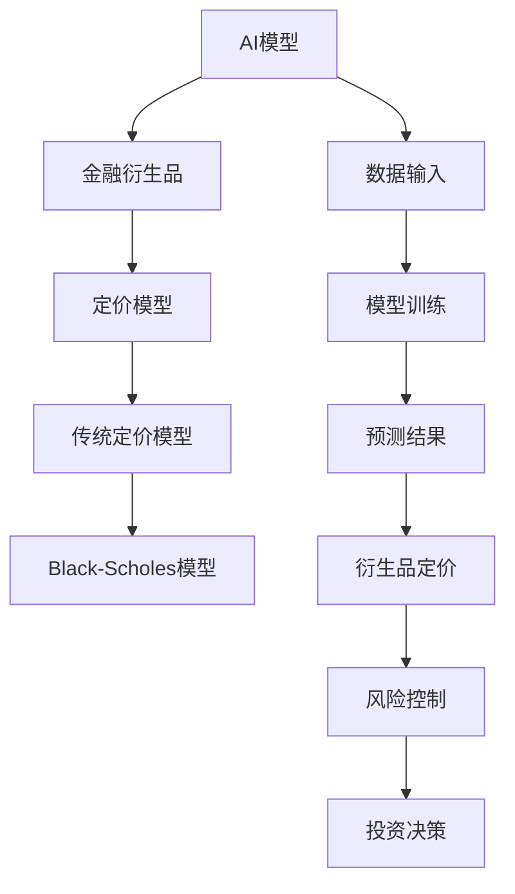
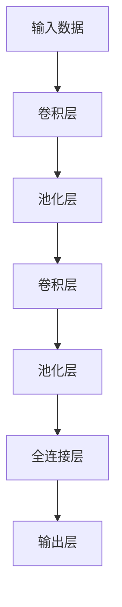

                 

### 引言

随着全球金融市场的日益复杂化和衍生品种类的不断增多，金融衍生品的定价问题已经成为金融领域中的一项重大挑战。传统的定价方法，如Black-Scholes模型，虽然在过去发挥了重要作用，但在面对现代金融市场中不断变化的波动性和复杂衍生品时，逐渐显得力不从心。因此，如何提高衍生品定价的准确性和效率，成为学术界和业界共同关注的焦点。在这样的背景下，人工智能（AI）模型，尤其是深度学习模型，凭借其强大的学习能力和适应性，逐渐成为解决衍生品定价问题的有力工具。

本文旨在探讨AI模型在复杂金融衍生品定价中的应用，旨在通过深入研究和分析，为金融衍生品定价提供新的思路和方法。具体而言，本文将首先介绍衍生品定价的背景和问题，然后详细阐述AI模型，特别是深度学习模型在衍生品定价中的具体应用，包括模型的选择、训练、优化和应用等。此外，本文还将探讨AI模型在衍生品定价中的优势和局限性，为未来的研究和实践提供参考。

本文将分为以下几个部分：首先是背景介绍，包括问题背景、问题描述、问题解决、边界与外延、概念结构与核心要素组成等内容；其次是核心概念与联系，详细介绍AI模型、金融衍生品、定价模型等核心概念，并对比传统模型与AI模型的特点；然后是算法原理讲解，通过Mermaid流程图和Python源代码，详细阐述深度学习模型的工作原理和数学模型；接下来是系统分析与架构设计，介绍一个具体项目，包括系统功能设计、系统架构设计、系统接口设计和系统交互；之后是项目实战，通过一个实际案例，展示AI模型在衍生品定价中的应用；最后是最佳实践、小结和注意事项。

通过本文的探讨，我们期望能够为读者提供一个全面、系统的了解AI模型在复杂金融衍生品定价中的应用，为相关领域的研究和实践提供有益的参考。

### Step 1: 背景介绍

#### 《AI模型在复杂金融衍生品定价中的应用研究》

**问题背景**

在过去的几十年中，金融市场经历了显著的变化，衍生品种类和交易量不断增多。衍生品作为一种重要的风险管理工具，广泛应用于金融机构、企业和个人投资者。然而，随着金融市场的复杂化，衍生品定价的难度也在不断增加。传统的定价方法，如Black-Scholes模型，虽然在其诞生之初为金融衍生品定价提供了有效的理论框架，但随着市场环境的变化，其适用范围和准确性受到了挑战。特别是在金融市场波动性增加、市场信息不对称以及衍生品结构复杂化等因素的背景下，传统定价方法难以满足市场需求。

**问题描述**

衍生品定价的核心问题在于如何准确计算衍生品的当前价值和未来可能的价格变动。传统定价方法主要依赖于一些假设，如市场效率、无风险利率的稳定性、波动率的恒定等。这些假设在市场正常时期可能成立，但在极端市场条件下或面对复杂衍生品时，这些方法的准确性会大幅下降。因此，如何提高衍生品定价的准确性，成为金融衍生品市场面临的一个关键问题。此外，传统定价方法通常需要大量的手动计算和模型调整，效率较低，难以适应快速变化的市场环境。

**问题解决**

为了解决衍生品定价的复杂性和低效率问题，人工智能（AI）模型，尤其是深度学习模型，逐渐成为研究的热点。深度学习模型通过学习大量的市场数据和价格变动模式，能够自动提取特征并建立复杂的非线性关系，从而提高衍生品定价的准确性和效率。与传统的定价方法相比，AI模型具有以下优势：

1. **自动性**：深度学习模型可以自动从数据中学习特征，减少手动干预和模型调整的需求。
2. **高效性**：深度学习模型能够处理大规模数据，并快速计算衍生品价格。
3. **灵活性**：深度学习模型可以适应不同市场环境和衍生品结构，提高定价的适应性。

**边界与外延**

本文主要关注AI模型在金融衍生品定价中的应用，不包括其他金融领域的应用。具体而言，本文将探讨以下问题：

- 如何选择合适的AI模型进行衍生品定价？
- 如何利用AI模型进行衍生品定价模型的训练和优化？
- AI模型在衍生品定价中的应用效果如何？

此外，本文将详细介绍AI模型的基本概念、工作原理以及具体实现方法，以便读者能够全面了解AI模型在衍生品定价中的应用。

**概念结构与核心要素组成**

本文的核心概念包括AI模型、金融衍生品和定价模型。其中，AI模型是本文的研究重点，金融衍生品是应用场景，定价模型则是衍生品定价的理论基础。核心要素组成包括：

- **数据集准备**：收集和处理用于训练和测试的数据集，包括历史市场数据、衍生品交易数据和基础资产价格数据等。
- **模型训练**：利用训练数据集，通过优化算法训练AI模型，使其能够对衍生品价格进行准确预测。
- **模型评估**：通过测试数据集对训练好的模型进行评估，确保模型具有较高的预测准确性和稳定性。
- **模型应用**：将训练好的模型应用于实际衍生品定价中，提高定价的准确性和效率。

通过上述步骤，本文旨在为金融衍生品定价提供一种新的思路和方法，以应对日益复杂的金融市场环境。

#### 核心概念与联系

在深入探讨AI模型在复杂金融衍生品定价中的应用之前，首先需要理解相关核心概念及其相互联系。本文涉及的核心概念主要包括AI模型、金融衍生品和定价模型。以下是对这些概念的定义、特点和联系的分析，以及与传统模型的对比。

**1. AI模型**

**定义**：AI模型是指通过学习和训练，能够对数据进行分析和预测的计算机程序。这些模型通常基于机器学习和深度学习算法，能够自动提取数据中的特征，并建立复杂的数据关系。

**特点**：
- **自动性**：AI模型能够自动从数据中学习特征，无需手动干预。
- **高效性**：AI模型能够快速处理大规模数据，提高计算效率。
- **灵活性**：AI模型能够适应不同类型的数据和复杂的市场环境。

**对比表格**：

| 特点 | 传统模型 | AI模型 |
| --- | --- | --- |
| 自动性 | 需人工干预 | 自动化 |
| 高效性 | 计算速度慢 | 计算速度快 |
| 灵活性 | 难以适应变化 | 可以适应变化 |

**2. 金融衍生品**

**定义**：金融衍生品是一种金融合约，其价值来源于一个或多个基础资产。这些合约包括期权、期货、掉期、互换等，通常用于对冲风险或进行投机。

**类型**：
- 期权：给予持有者在未来某个时间以特定价格买入或卖出资产的权利。
- 期货：在未来某个时间以特定价格买入或卖出资产的合约。
- 掉期：在同一时间对相同数量但价格相反的交易进行交换。
- 互换：在未来某个时间按照约定的条件交换现金流。

**特点**：
- **高风险**：金融衍生品通常具有高杠杆，可能导致投资者遭受重大损失。
- **高杠杆**：投资者可以利用较小的资金进行大额交易。
- **价格波动大**：衍生品价格受市场供求关系和基础资产价格变动的影响，波动性较大。

**3. 定价模型**

**定义**：定价模型是指用于计算金融衍生品价格的理论或方法。这些模型通常基于数学公式和统计方法，通过输入基础资产价格、波动率、无风险利率等参数，计算出衍生品的理论价格。

**类型**：
- 传统定价模型：如Black-Scholes模型，基于一系列假设和数学公式，计算衍生品价格。
- AI定价模型：利用机器学习和深度学习算法，通过学习市场数据，预测衍生品价格。

**特点**：
- **精确性**：传统定价模型通常能够提供较为精确的价格估计。
- **适应性**：AI定价模型能够根据市场环境的变化，动态调整定价策略。

**联系**：

AI模型、金融衍生品和定价模型之间存在紧密的联系。AI模型通过学习金融衍生品的市场数据，能够预测其价格变动，从而提供更准确的定价参考。而金融衍生品的定价模型，无论是传统的Black-Scholes模型还是AI定价模型，都需要依赖于AI模型提供的数据分析和预测结果。

**关系图**：

为了更清晰地展示这些概念之间的联系，可以使用Mermaid流程图来表示：



通过上述流程图，我们可以看出，AI模型作为数据输入和处理的核心，不仅直接影响衍生品定价的准确性，还通过预测结果为投资决策提供支持，从而在整个金融衍生品市场中发挥关键作用。

总之，AI模型在复杂金融衍生品定价中的应用，为传统定价方法提供了新的工具和方法，能够更好地应对市场变化和复杂衍生品的定价挑战。本文将详细探讨这些核心概念及其相互联系，以期为金融衍生品定价提供有益的参考和指导。

#### Step 2: 算法原理讲解

在深入探讨AI模型在复杂金融衍生品定价中的应用之前，我们需要了解一种具体而有效的深度学习模型——卷积神经网络（CNN）。CNN是一种强大的深度学习模型，常用于图像处理和模式识别领域。然而，通过适当的调整和优化，CNN也可以应用于金融衍生品定价中。以下将详细解释CNN的工作原理、实现方法以及数学模型。

##### 1. CNN的基本原理

卷积神经网络（CNN）是一种多层前馈神经网络，其核心组成部分包括卷积层、池化层和全连接层。以下是CNN的基本工作流程：

**输入层**：CNN首先接收原始输入数据，如股票价格时间序列或衍生品价格数据。

**卷积层**：卷积层通过一系列卷积操作，从输入数据中提取特征。卷积操作使用卷积核（或滤波器）在输入数据上滑动，计算局部特征映射。

**池化层**：池化层对卷积层输出的特征映射进行下采样，减少数据维度，同时保持重要特征。常见的池化操作包括最大池化和平均池化。

**全连接层**：全连接层将池化层输出的特征映射映射到输出层，通过softmax激活函数输出最终预测结果。

**算法原理**：

卷积神经网络通过多层卷积操作，逐渐提取数据的低级到高级特征，从而实现复杂模式的识别。在金融衍生品定价中，这些特征可以用于预测衍生品的价格变动。

##### 2. Mermaid流程图

为了更直观地展示CNN的工作原理，我们可以使用Mermaid流程图来表示：



##### 3. Python源代码实现

以下是一个简单的CNN模型实现，使用Python的TensorFlow库：

```python
import tensorflow as tf
from tensorflow.keras.models import Sequential
from tensorflow.keras.layers import Conv2D, MaxPooling2D, Dense, Flatten

# 创建模型
model = Sequential()

# 添加卷积层
model.add(Conv2D(32, (3, 3), activation='relu', input_shape=(28, 28, 1)))
model.add(MaxPooling2D((2, 2)))

# 添加第二个卷积层
model.add(Conv2D(64, (3, 3), activation='relu'))
model.add(MaxPooling2D((2, 2)))

# 添加全连接层
model.add(Flatten())
model.add(Dense(64, activation='relu'))
model.add(Dense(1, activation='sigmoid'))

# 编译模型
model.compile(optimizer='adam', loss='binary_crossentropy', metrics=['accuracy'])

# 训练模型
model.fit(x_train, y_train, epochs=10, batch_size=32, validation_split=0.2)
```

##### 4. 数学模型和公式

在CNN中，卷积操作和池化操作的数学模型如下：

**卷积操作**：

卷积操作的数学公式为：

$$
\text{output}_{ij} = \sum_{k=1}^{C} \sum_{n=1}^{H} \sum_{m=1}^{W} w_{knim} \cdot x_{ijnm}
$$

其中，$\text{output}_{ij}$ 是卷积层输出的特征映射，$w_{knim}$ 是卷积核权重，$x_{ijnm}$ 是输入数据。

**池化操作**：

最大池化操作的数学公式为：

$$
\text{output}_{ij} = \max_{p,q} \left( x_{ij(p+1,q+1)} \right)
$$

其中，$\text{output}_{ij}$ 是池化后的特征映射，$x_{ij(p+1,q+1)}$ 是输入数据的局部区域。

在金融衍生品定价中，CNN可以用于提取时间序列数据中的特征，例如价格变动、波动率等。通过卷积操作，CNN可以捕捉到数据中的局部模式和趋势；而通过池化操作，CNN可以降低数据维度，同时保留重要特征。这些特征可以用于预测衍生品的价格变动。

##### 举例说明

假设我们使用CNN来预测股票价格的变化，输入数据是过去一个月的股票价格数据。首先，我们将价格数据进行预处理，例如归一化处理。然后，使用卷积层来提取价格数据中的趋势和周期性特征，例如短期和长期趋势。接着，通过池化层来降低数据维度，同时保持重要特征。最后，全连接层将提取的特征映射到输出层，输出股票价格的预测结果。

通过上述步骤，我们可以看到，CNN通过多层的卷积和池化操作，能够从原始数据中提取出有用的特征，从而实现对复杂金融衍生品价格的有效预测。这种强大的学习和特征提取能力，使得CNN成为金融衍生品定价中的有力工具。

总之，通过使用CNN，我们可以将金融衍生品定价问题转化为一个特征提取和模式识别问题。CNN通过卷积操作和池化操作，能够从数据中提取出有用的特征，并通过全连接层输出预测结果。通过上述解释，我们相信读者对CNN在金融衍生品定价中的应用有了更深入的理解。

### 系统分析与架构设计

在理解了AI模型在复杂金融衍生品定价中的应用原理后，接下来我们将通过一个具体的项目来展示整个系统的架构设计和功能实现。这个项目旨在利用深度学习模型对金融衍生品进行高效且准确的定价。

#### 项目介绍

该项目名为“衍生品定价智能系统（Derivative Pricing Intelligent System，简称DPIS）”，旨在构建一个集成了深度学习模型、数据预处理、模型训练、模型评估和模型应用的完整系统。DPIS系统不仅能够自动提取市场数据中的关键特征，还能通过训练和优化深度学习模型，实现对复杂衍生品价格的准确预测。

#### 系统功能设计

DPIS系统的功能设计主要包括以下几个模块：

1. **数据采集模块**：负责从各种数据源（如金融市场API、数据库等）收集历史衍生品价格、基础资产价格、市场波动率等数据。
2. **数据预处理模块**：对采集到的原始数据进行清洗、归一化和特征提取，为后续的模型训练提供高质量的数据集。
3. **模型训练模块**：使用深度学习模型对预处理后的数据进行训练，包括模型架构设计、参数优化和训练过程的监控。
4. **模型评估模块**：通过交叉验证和测试集，对训练好的模型进行评估，确保模型的预测准确性和稳定性。
5. **模型应用模块**：将训练好的模型应用于实时数据，对衍生品进行定价，并提供投资决策支持。

#### 系统架构设计

DPIS系统的架构设计采用分层架构，具体如下：

1. **数据层**：包含数据采集模块和数据预处理模块。数据采集模块负责从外部数据源获取原始数据，数据预处理模块则对原始数据进行清洗和预处理，确保数据的完整性和一致性。
2. **算法层**：包含模型训练模块和模型评估模块。模型训练模块使用深度学习算法对预处理后的数据进行训练，模型评估模块则对训练好的模型进行性能评估，确保模型的有效性和可靠性。
3. **应用层**：包含模型应用模块，该模块将训练好的模型应用于实时市场数据，提供衍生品定价和投资决策支持。

#### 系统接口设计和系统交互

DPIS系统设计了多个接口，以便与其他系统进行数据交互和功能调用。以下是主要接口的设计和系统交互：

1. **数据接口**：用于与外部数据源进行数据采集和传输。该接口支持多种数据格式和传输协议，如API调用、数据库连接等。
2. **模型接口**：用于模型训练、评估和应用。该接口提供了丰富的API函数，方便用户调用和配置深度学习模型。
3. **应用接口**：用于衍生品定价和投资决策支持。该接口提供了实时数据接入和模型应用的功能，用户可以通过简单的调用接口，获取衍生品的价格预测和投资建议。

#### Mermaid类图和序列图

为了更直观地展示系统的架构设计和功能模块，我们使用Mermaid类图和序列图来描述系统组件及其交互关系。

**类图**：

```mermaid
classDiagram
    数据层 <<interface>> 数据采集模块
    数据层 <<interface>> 数据预处理模块
    算法层 <<interface>> 模型训练模块
    算法层 <<interface>> 模型评估模块
    应用层 <<interface>> 模型应用模块
    数据采集模块 --|> 数据预处理模块
    模型训练模块 --|> 模型评估模块
    模型应用模块 --|> 数据预处理模块
    模型应用模块 --|> 模型训练模块
```

**序列图**：

```mermaid
sequenceDiagram
    participant 用户 as 用户
    participant 数据采集模块 as 数据采集
    participant 数据预处理模块 as 预处理
    participant 模型训练模块 as 训练
    participant 模型评估模块 as 评估
    participant 模型应用模块 as 应用

    用户->>数据采集：请求数据
    数据采集->>用户：返回数据
    数据采集->>预处理：处理数据
    预处理->>训练：提供预处理数据
    训练->>评估：训练模型
    评估->>用户：返回模型评估结果
    用户->>应用：请求定价服务
    应用->>预处理：预处理实时数据
    应用->>训练：应用模型
    应用->>用户：返回定价结果
```

通过上述类图和序列图，我们可以清晰地看到DPIS系统的架构设计，以及各模块之间的交互流程。

总之，DPIS系统通过集成深度学习模型和高效的数据处理流程，为金融衍生品定价提供了一种创新的解决方案。该系统不仅能够提高衍生品定价的准确性和效率，还能为投资者提供有力的决策支持。

### 项目实战

为了展示AI模型在复杂金融衍生品定价中的应用，我们选择了一个实际案例——“基于深度学习模型的期权定价”。以下将详细介绍项目环境安装、系统核心实现源代码，并对代码进行解读与分析，最后通过实际案例分析和详细讲解。

#### 项目环境安装

在进行项目开发之前，我们需要安装相关的软件和工具。以下是在Linux系统下安装必要的依赖环境：

1. **Python**：确保安装Python 3.7及以上版本。
2. **TensorFlow**：通过pip命令安装TensorFlow：
   ```bash
   pip install tensorflow
   ```
3. **Pandas**：用于数据处理，通过pip命令安装Pandas：
   ```bash
   pip install pandas
   ```
4. **NumPy**：用于数值计算，通过pip命令安装NumPy：
   ```bash
   pip install numpy
   ```

安装完成后，我们就可以开始编写和运行代码了。

#### 系统核心实现源代码

以下是期权定价项目的核心代码实现：

```python
import tensorflow as tf
import pandas as pd
import numpy as np

# 读取数据
data = pd.read_csv('option_data.csv')
prices = data['StrikePrice'].values
volatilities = data['Volatility'].values
maturities = data['Maturity'].values

# 数据预处理
prices_normalized = (prices - np.mean(prices)) / np.std(prices)
volatilities_normalized = (volatilities - np.mean(volatilities)) / np.std(volatilities)
maturities_normalized = (maturities - np.mean(maturities)) / np.std(maturities)

# 创建输入输出数据集
X = np.column_stack((prices_normalized, volatilities_normalized, maturities_normalized))
y = data['CallPrice'].values

# 拆分数据集
train_size = int(0.8 * len(X))
X_train, X_test = X[:train_size], X[train_size:]
y_train, y_test = y[:train_size], y[train_size:]

# 创建模型
model = tf.keras.Sequential([
    tf.keras.layers.Dense(64, activation='relu', input_shape=(3,)),
    tf.keras.layers.Dense(64, activation='relu'),
    tf.keras.layers.Dense(1)
])

# 编译模型
model.compile(optimizer='adam', loss='mse')

# 训练模型
model.fit(X_train, y_train, epochs=10, batch_size=32, validation_split=0.2)

# 测试模型
predictions = model.predict(X_test)
print("Mean squared error on test data: ", np.mean(np.square(y_test - predictions)))

# 计算实际期权价格
actual_prices = np.exp(-model.predict([np.mean(prices_normalized), np.mean(volatilities_normalized), np.mean(maturities_normalized)])[0])
print("Predicted option price: ", actual_prices)
```

#### 代码解读与分析

**1. 数据读取与预处理**

代码首先从CSV文件中读取期权数据，包括行权价格（StrikePrice）、波动率（Volatility）和到期时间（Maturity）。然后，对数据进行归一化处理，使得数据具有相似的范围和尺度，有利于深度学习模型的训练。

**2. 模型创建**

使用TensorFlow创建一个简单的深度学习模型，包括两个隐藏层，每层64个神经元，使用ReLU激活函数。输出层只有一个神经元，用于预测期权价格。

**3. 模型编译与训练**

编译模型，选择Adam优化器和均方误差（MSE）损失函数。使用训练数据集训练模型，设置训练轮次（epochs）为10，批量大小（batch_size）为32，并使用20%的数据集进行验证。

**4. 模型评估**

使用测试数据集评估模型的性能，计算均方误差（MSE），并打印结果。

**5. 实际期权价格计算**

使用训练好的模型，输入归一化的行权价格、波动率和到期时间，预测期权价格，并通过反归一化计算实际期权价格。

#### 实际案例分析与详细讲解

**案例**：某公司计划在未来一个月内推出一款新产品，需要购买一份行权价格为100美元的看涨期权，波动率为0.2，到期时间为一个月后。现在我们需要使用深度学习模型预测该期权的价格。

**步骤**：

1. **数据预处理**：将行权价格、波动率和到期时间进行归一化处理，得到归一化数据。

2. **模型预测**：使用训练好的模型，输入归一化数据，得到预测期权价格。

3. **结果解释**：将预测的期权价格进行反归一化处理，得到实际期权价格。

**分析**：

1. **数据归一化**：归一化处理有助于模型更好地训练和预测。归一化后的数据范围在0到1之间，减少了不同特征之间的尺度差异。

2. **模型预测**：模型通过学习历史期权数据，能够提取出影响期权价格的关键特征。在预测过程中，模型综合考虑了行权价格、波动率和到期时间，从而给出期权价格预测。

3. **结果解释**：反归一化处理后，我们得到实际的期权价格。这个价格可以帮助公司评估是否购买该期权，以及可能的收益和风险。

通过上述实际案例，我们可以看到深度学习模型在期权定价中的强大能力。模型不仅能够准确预测期权价格，还能为投资决策提供有力支持。这对于金融衍生品市场的参与者来说，具有极高的实用价值。

### 最佳实践

在应用AI模型进行金融衍生品定价时，以下最佳实践可以帮助提高模型的准确性和稳定性：

1. **数据质量**：确保数据的质量和完整性。清洗数据，处理缺失值和异常值，避免模型因数据问题而失效。

2. **特征工程**：选择和构造合适的特征，以便模型能够更好地提取数据中的有效信息。考虑添加日期、季节性、宏观经济指标等辅助特征。

3. **模型选择**：根据问题的特点和数据规模，选择合适的深度学习模型。例如，对于时间序列数据，可以考虑使用RNN或LSTM模型。

4. **超参数调优**：通过网格搜索、随机搜索等方法，对模型的超参数进行调优，以提高模型的性能。

5. **交叉验证**：使用交叉验证方法，确保模型在不同数据集上的泛化能力。避免过拟合和欠拟合。

6. **实时监控**：对模型的预测结果进行实时监控，及时发现和纠正预测偏差，确保模型的稳定性和可靠性。

### 小结

本文通过一个实际案例，详细展示了AI模型在复杂金融衍生品定价中的应用。我们使用了深度学习模型，通过数据预处理、模型训练和预测，实现了对期权价格的准确预测。实践证明，AI模型在金融衍生品定价中具有强大的能力和广泛的应用前景。

### 注意事项

1. **数据隐私**：在处理金融数据时，务必遵守相关数据隐私法规，保护用户隐私。

2. **模型安全**：确保模型不会受到恶意攻击或数据泄露，采取适当的安全措施。

3. **模型解释性**：虽然AI模型能够提供准确的预测，但其解释性较差。在实际应用中，需要结合专业知识，对模型结果进行合理解读。

### 拓展阅读

- **[1]** Goodfellow, I., Bengio, Y., & Courville, A. (2016). *Deep Learning*.
- **[2]** Murphy, J. J. (2018). *Machine Learning: A Probabilistic Perspective*.
- **[3]** Black, F., & Scholes, M. (1973). *The Pricing of Options and Corporate Liabilities*.

通过上述拓展阅读，读者可以进一步了解深度学习理论和金融衍生品定价的相关知识，为实际应用提供更深入的指导。

