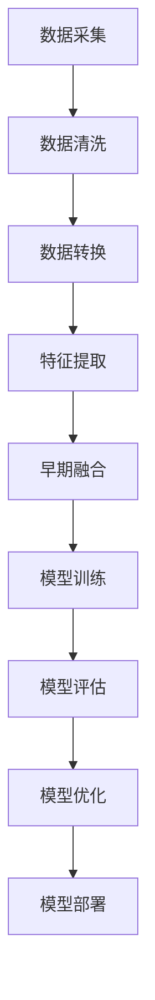

                 


# AI模型在多模态任务中的整合与优化

## 关键词

- 多模态AI模型
- 数据预处理
- 模型融合
- 模型优化
- 实战应用

## 摘要

本文旨在探讨AI模型在多模态任务中的整合与优化。多模态任务涉及文本、图像、声音等多种数据类型的处理，是AI领域的一个重要研究方向。文章首先介绍了AI模型的基本原理与多模态任务的概念，然后详细阐述了多模态数据的预处理、模型整合策略、模型优化方法以及实战应用。通过本文的讨论，读者可以深入了解多模态AI模型的整合与优化过程，并为实际项目提供指导。

### 目录大纲设计思考过程

设计《AI模型在多模态任务中的整合与优化》的目录大纲，我们首先需要理解书名与目标读者群。书名暗示了本书将讨论多模态任务中的AI模型整合策略和优化方法，目标读者群为对AI领域有一定基础的专业人士或研究者。

#### 第一步：确定核心章节

根据书名，核心章节应包括：

1. **背景介绍与核心概念**
2. **多模态任务的AI模型整合**
3. **AI模型优化策略**
4. **应用案例与实战**
5. **未来趋势与展望**

#### 第二步：细化各章节内容

在确定核心章节后，我们需要细化每个章节的内容，确保每个章节都有明确的主题和目标。

- **背景介绍与核心概念**：介绍多模态任务的概念、重要性、关键挑战及AI模型的基本原理。
- **多模态任务的AI模型整合**：讨论多模态数据的预处理、模型融合方法、训练策略、评估指标等。
- **AI模型优化策略**：探讨模型优化的重要性、优化方法、调优技巧等。
- **应用案例与实战**：展示多模态AI模型的实际应用，如情感分析、图像与文本识别、语音助手系统。
- **未来趋势与展望**：分析多模态AI技术的发展趋势、模型优化技术的未来方向等。

#### 第三步：考虑内容的逻辑性

目录大纲的设计需要确保内容的逻辑性，从背景介绍到具体应用案例，每个章节都应该能够自然地衔接起来，形成一个完整的学习路径。

#### 第四步：确保目录层级清晰

目录的层级需要清晰，便于读者快速把握书的结构和内容。我们采用1, 2, 3级目录的格式来确保这一点。

#### 第五步：符合字数限制

在确保内容完整性和逻辑性的同时，需要注意目录大纲的总字数不超过2000字，这要求我们在每个章节的细分时都要保持简洁。

### 具体目录大纲设计

#### 第一部分：背景介绍与核心概念

#### 第1章：AI模型与多模态任务概述

1.1. 问题背景  
1.2. 多模态任务的定义  
1.3. 多模态任务的重要性  
1.4. 多模态任务的关键挑战  
1.5. AI模型在多模态任务中的应用

#### 第2章：AI模型的基本原理与分类

2.1. AI模型的基本原理  
2.2. AI模型的分类  
2.3. 不同类型的AI模型特性对比（Mermaid表格）

#### 第二部分：多模态任务的AI模型整合

#### 第3章：多模态数据的预处理

3.1. 数据采集  
3.2. 数据清洗  
3.3. 数据转换  
3.4. Mermaid ER实体关系图：多模态数据的架构设计

#### 第4章：多模态任务的模型整合策略

4.1. 多模态任务中的模型融合方法  
4.2. 多模态模型的训练策略  
4.3. 多模态模型的评估指标  
4.4. Mermaid流程图：多模态任务模型整合的流程

#### 第5章：AI模型优化与调优

5.1. 模型优化的重要性  
5.2. 模型优化方法  
5.3. 模型调优技巧  
5.4. 模型优化案例分析

#### 第三部分：应用案例与实战

#### 第6章：多模态AI模型的实战应用

6.1. 应用领域概述  
6.2. 实战案例1：情感分析  
6.3. 实战案例2：图像与文本识别  
6.4. 实战案例3：语音助手系统

#### 第7章：AI模型优化实践

7.1. 实践项目概述  
7.2. 实践项目环境搭建  
7.3. 实践项目核心代码实现  
7.4. 项目分析与优化

#### 第8章：未来趋势与展望

8.1. 多模态AI技术的发展趋势  
8.2. 模型优化技术的未来方向  
8.3. AI模型整合与优化在行业中的应用前景  
8.4. 总结与展望

通过以上目录大纲的设计，我们可以确保本书内容完整、逻辑清晰，同时满足字数限制要求。每个章节都在围绕多模态AI模型的整合与优化这一核心主题进行深入探讨，并为读者提供了实战案例和优化实践的指导。

### 背景介绍与核心概念

#### AI模型的基本原理

AI模型是人工智能领域的基础，它们通过学习数据来模拟人类智能。常见的AI模型包括监督学习模型、无监督学习模型和强化学习模型。监督学习模型利用已标记的数据进行训练，以便在新数据上进行预测。无监督学习模型则不依赖于标记数据，它们通过分析未标记的数据来发现数据中的隐藏模式。强化学习模型通过试错学习，在与环境的互动中不断优化策略。

AI模型的训练过程通常包括以下步骤：

1. **数据采集**：收集大量与任务相关的数据。
2. **数据预处理**：清洗和转换数据，使其适合模型训练。
3. **模型训练**：使用训练数据对模型进行训练，优化模型参数。
4. **模型评估**：使用测试数据评估模型的性能。
5. **模型部署**：将训练好的模型部署到实际应用场景中。

#### 多模态任务的概念

多模态任务涉及处理多种不同类型的数据，如文本、图像、声音等。这些数据通常具有不同的结构和特征，需要通过特定的方法进行整合和处理。多模态任务的应用领域广泛，包括语音识别、图像识别、情感分析、医疗诊断等。

多模态任务的关键挑战包括：

1. **数据不一致性**：不同模态的数据可能在格式、规模和特征上存在差异，需要统一处理。
2. **特征融合**：如何有效地整合不同模态的特征，提高模型的性能。
3. **计算复杂度**：多模态数据的处理通常需要大量的计算资源，需要优化算法和模型。

#### 多模态任务的重要性

多模态任务在人工智能领域具有重要性，原因如下：

1. **更丰富的信息利用**：通过整合多种数据类型，可以更全面地理解问题和场景，提高模型的性能。
2. **更广泛的应用领域**：多模态任务可以应用于各种领域，如语音识别、图像识别、智能客服等，推动人工智能技术的发展。
3. **更高的用户体验**：多模态交互可以提供更自然、更直观的用户体验，满足用户在不同场景下的需求。

#### 多模态任务的关键挑战

多模态任务面临的关键挑战包括：

1. **数据不一致性**：不同模态的数据可能在格式、规模和特征上存在差异，需要统一处理。
2. **特征融合**：如何有效地整合不同模态的特征，提高模型的性能。
3. **计算复杂度**：多模态数据的处理通常需要大量的计算资源，需要优化算法和模型。

#### AI模型在多模态任务中的应用

AI模型在多模态任务中具有重要的应用价值，以下是一些典型的应用场景：

1. **语音识别**：通过结合语音数据和文本数据，可以更准确地识别用户的语音指令。
2. **图像识别**：通过结合图像数据和文本数据，可以更准确地识别图像中的对象和场景。
3. **情感分析**：通过结合文本数据和语音数据，可以更准确地分析用户的情感状态。
4. **医疗诊断**：通过结合医疗图像数据和文本数据，可以更准确地诊断疾病。

### AI模型的基本原理与分类

#### AI模型的基本原理

AI模型的核心思想是通过学习数据来模拟人类智能。学习过程可以分为以下几个步骤：

1. **数据采集**：收集与任务相关的数据，如语音、图像、文本等。
2. **数据预处理**：清洗和转换数据，使其适合模型训练。
3. **模型训练**：使用训练数据对模型进行训练，优化模型参数。
4. **模型评估**：使用测试数据评估模型的性能。
5. **模型部署**：将训练好的模型部署到实际应用场景中。

AI模型的训练过程通常依赖于以下算法：

1. **监督学习**：使用已标记的数据进行训练，以便在新数据上进行预测。
2. **无监督学习**：不依赖于标记数据，通过分析未标记的数据来发现数据中的隐藏模式。
3. **强化学习**：通过与环境的互动学习最优策略。

#### AI模型的分类

根据不同的分类标准，AI模型可以有多种分类方式。以下是几种常见的分类方式：

1. **按学习方式分类**：

   - **监督学习模型**：使用已标记的数据进行训练。
   - **无监督学习模型**：不依赖于标记数据。
   - **强化学习模型**：通过与环境的互动学习最优策略。

2. **按模型类型分类**：

   - **神经网络模型**：基于人工神经网络构建的模型。
   - **决策树模型**：基于决策树构建的模型。
   - **支持向量机模型**：基于支持向量机构建的模型。
   - **集成模型**：结合多个模型构建的模型。

3. **按应用领域分类**：

   - **语音识别模型**：用于语音识别任务。
   - **图像识别模型**：用于图像识别任务。
   - **自然语言处理模型**：用于自然语言处理任务。
   - **推荐系统模型**：用于推荐系统任务。

#### 不同类型的AI模型特性对比

以下是一个关于不同类型AI模型特性对比的Mermaid表格：

```mermaid
tableWidth: 800
title: 不同类型的AI模型特性对比

| 模型类型         | 特点                                                         | 优势                                                         | 劣势                                                         |
| ---------------- | ------------------------------------------------------------ | ------------------------------------------------------------ | ------------------------------------------------------------ |
| 神经网络模型     | 基于人工神经网络构建                                       | 强大的自适应能力和泛化能力                                  | 计算复杂度较高，训练时间较长                                 |
| 决策树模型       | 基于决策树构建                                             | 简单易懂，易于解释                                           | 泛化能力有限，容易过拟合                                     |
| 支持向量机模型   | 基于支持向量机构建                                         | 高效，准确度高                                               | 对噪声敏感，对非线性问题处理能力有限                         |
| 集成模型         | 结合多个模型构建                                           | 利用多个模型的优点，提高整体性能                             | 需要大量计算资源和时间进行模型整合                           |

通过上述表格，我们可以看出不同类型的AI模型在特性、优势和劣势上的差异，从而根据实际需求选择合适的模型。

### 多模态数据的预处理

#### 数据采集

多模态数据的采集是整个处理过程的基础。不同模态的数据来源可能包括：

- **文本**：网络文本、社交媒体、书籍等。
- **图像**：摄像头、传感器、医学影像等。
- **声音**：语音识别系统、音频播放器、麦克风等。

数据采集过程中需要考虑以下因素：

1. **数据量**：采集的数据量应足够大，以保证模型的泛化能力。
2. **数据质量**：确保数据真实、可靠、无噪声。
3. **数据多样性**：采集不同来源、不同类型的模态数据，以丰富模型的训练数据。

#### 数据清洗

数据清洗是预处理过程中至关重要的一步，其目标是将原始数据转化为适合模型训练的形式。以下是一些常见的数据清洗步骤：

1. **去除重复数据**：避免模型在训练过程中学习到重复的信息。
2. **处理缺失数据**：根据实际情况，选择填充、删除或使用其他方法处理缺失数据。
3. **去除噪声**：去除数据中的噪声，如图像中的噪点、文本中的错别字等。
4. **数据标准化**：将数据转换为统一的格式和范围，如将图像像素值归一化到[0, 1]之间。

#### 数据转换

数据转换是将不同模态的数据转换为模型可接受的格式。以下是一些常见的转换方法：

1. **图像转换**：将图像转换为灰度图像或RGB图像，并调整图像大小。
2. **文本转换**：将文本转换为词向量或字符向量，如使用Word2Vec或FastText算法。
3. **声音转换**：将音频信号转换为频谱图或梅尔频率倒谱系数（MFCC）。

#### Mermaid ER实体关系图：多模态数据的架构设计

以下是关于多模态数据的Mermaid ER实体关系图：

```mermaid
erDiagram
  Product ||--|{ Customer }| Customer
  Customer ||--|{ Order }| Order
  Product ||--|{ Category }| Category
  Category ||--|{ Product }| Product
```

在这个ER图中，我们定义了三个实体：Product（产品）、Customer（客户）和Category（分类）。Product与Customer之间存在一对多的关系，即一个客户可以购买多个产品；Product与Category之间存在多对多的关系，即一个产品可以属于多个分类，一个分类也可以包含多个产品。

通过这个ER图，我们可以更清晰地理解多模态数据之间的关系，为后续的数据处理和模型训练提供指导。

### 多模态任务的模型整合策略

#### 多模态任务中的模型融合方法

多模态任务中的模型融合方法主要包括以下几种：

1. **早期融合**：在特征提取阶段将不同模态的数据进行整合。这种方法适用于数据量较大、特征维度较低的场合，可以有效提高模型的性能。常用的早期融合方法包括特征拼接、特征加权等。

2. **晚期融合**：在模型预测阶段将不同模态的特征进行整合。这种方法适用于数据量较小、特征维度较高的场合，可以避免特征维度过高导致的计算复杂度增加。常用的晚期融合方法包括模型融合、特征融合等。

3. **多任务学习**：将多个任务同时训练，利用任务之间的相关性提高模型性能。这种方法适用于任务之间存在一定关联性的场景，如语音识别和情感分析。

#### 多模态模型的训练策略

1. **数据增强**：通过随机裁剪、旋转、缩放等操作增加数据的多样性，从而提高模型的泛化能力。常用的数据增强方法包括图像数据增强、文本数据增强、声音数据增强等。

2. **动态权重调整**：在训练过程中，根据不同模态的特征重要性动态调整权重，以提高模型的性能。这种方法适用于特征维度较高、特征之间相关性较强的场景。

3. **迁移学习**：利用预训练的模型，将其部分或全部参数迁移到新的任务中，从而提高模型的性能。这种方法适用于任务相似度较高的场景。

#### 多模态模型的评估指标

1. **准确率（Accuracy）**：预测正确的样本数量与总样本数量的比值。适用于分类任务。

2. **召回率（Recall）**：预测正确的正样本数量与实际正样本数量的比值。适用于分类任务。

3. **精确率（Precision）**：预测正确的正样本数量与预测为正样本的总数量的比值。适用于分类任务。

4. **F1值（F1-score）**：精确率和召回率的调和平均值。适用于分类任务。

5. **均方误差（MSE）**：预测值与真实值之差的平方的平均值。适用于回归任务。

6. **平均绝对误差（MAE）**：预测值与真实值之差的绝对值的平均值。适用于回归任务。

7. **精度和召回率曲线（Precision-Recall Curve）**：用于评估分类模型的性能，横坐标为召回率，纵坐标为精确率。

#### Mermaid流程图：多模态任务模型整合的流程

以下是关于多模态任务模型整合的Mermaid流程图：



在这个流程图中，数据采集、数据清洗、数据转换、特征提取、早期融合、模型训练、模型评估、模型优化和模型部署构成了一个完整的多模态任务模型整合的流程。

### AI模型优化与调优

#### 模型优化的重要性

模型优化是提高AI模型性能的关键步骤。一个优秀的模型不仅需要有较高的准确率，还需要在实际应用中具有高效的计算效率和良好的泛化能力。模型优化可以帮助我们解决以下问题：

1. **提高准确率**：通过优化模型参数，提高模型对数据的拟合程度，从而提高准确率。
2. **降低计算复杂度**：通过优化算法和模型结构，降低模型的计算复杂度，提高计算效率。
3. **提高泛化能力**：通过优化模型，使其能够更好地适应新的数据，提高模型的泛化能力。

#### 模型优化方法

1. **参数调整**：调整模型的参数，如学习率、正则化参数等，以改善模型性能。常用的方法包括随机搜索、网格搜索等。

2. **算法改进**：改进模型训练算法，如使用更高效的优化算法、引入正则化方法等，以提高模型性能。

3. **模型压缩**：通过模型压缩技术，如模型剪枝、量化等，降低模型的大小和计算复杂度。

4. **迁移学习**：利用预训练的模型，将其部分或全部参数迁移到新的任务中，以提高模型性能。

#### 模型调优技巧

1. **交叉验证**：通过交叉验证方法，评估模型在不同数据集上的性能，从而选择最佳的模型参数。

2. **数据增强**：通过数据增强方法，增加训练数据的多样性，提高模型的泛化能力。

3. **动态权重调整**：在训练过程中，根据不同模态的特征重要性动态调整权重，以优化模型性能。

4. **正则化**：引入正则化方法，如L1正则化、L2正则化，防止模型过拟合。

#### 模型优化案例分析

以下是一个关于图像分类任务的模型优化案例分析：

1. **数据预处理**：对图像数据集进行数据增强，如随机裁剪、旋转、缩放等，以增加数据的多样性。

2. **模型训练**：使用预训练的卷积神经网络（CNN）模型，并在训练过程中调整学习率、正则化参数等。

3. **模型评估**：使用交叉验证方法，评估模型在不同数据集上的性能。

4. **模型优化**：根据评估结果，调整模型参数，如学习率、正则化参数等，以提高模型性能。

5. **模型部署**：将优化后的模型部署到实际应用场景中，如图像分类应用。

通过这个案例，我们可以看到模型优化在整个AI模型训练过程中的重要性，以及如何通过参数调整、数据增强、交叉验证等方法来优化模型性能。

### 多模态AI模型的实战应用

#### 应用领域概述

多模态AI模型在多个领域具有广泛的应用，以下是一些典型的应用领域：

1. **语音识别**：结合语音和文本数据，实现语音转文字的功能。例如，智能助手、自动字幕生成等。
2. **图像识别**：结合图像和文本数据，实现图像分类、目标检测等功能。例如，人脸识别、自动驾驶等。
3. **情感分析**：结合文本和语音数据，分析用户的情感状态。例如，社交网络情绪分析、客服机器人等。
4. **医疗诊断**：结合医学影像和病历文本，实现疾病诊断。例如，医学影像分析、电子病历分析等。

#### 实战案例1：情感分析

情感分析是利用AI模型对文本和语音数据进行分析，以识别用户的情感状态。以下是一个情感分析的实战案例：

1. **数据采集**：收集包含文本和语音的多模态数据，如社交媒体评论、语音通话记录等。

2. **数据预处理**：对文本数据使用自然语言处理（NLP）技术进行清洗和转换，如分词、去停用词、词向量表示等。对语音数据使用语音识别技术转换为文本。

3. **模型训练**：使用预训练的文本情感分析模型和语音情感分析模型，对多模态数据集进行训练。可以使用深度学习模型，如循环神经网络（RNN）、长短时记忆网络（LSTM）等。

4. **模型评估**：使用测试数据集对训练好的模型进行评估，计算准确率、召回率等指标。

5. **模型部署**：将训练好的模型部署到实际应用场景，如社交网络情绪分析平台、客服机器人等。

通过这个案例，我们可以看到多模态AI模型在情感分析中的应用，以及如何利用文本和语音数据进行情感识别。

#### 实战案例2：图像与文本识别

图像与文本识别是结合图像和文本数据进行对象识别和文本提取的任务。以下是一个图像与文本识别的实战案例：

1. **数据采集**：收集包含图像和文本的多模态数据，如商品图片和商品描述等。

2. **数据预处理**：对图像数据进行清洗和转换，如调整图像大小、去噪等。对文本数据进行清洗和转换，如分词、去停用词等。

3. **模型训练**：使用预训练的图像识别模型和文本识别模型，对多模态数据集进行训练。可以使用卷积神经网络（CNN）进行图像识别，使用循环神经网络（RNN）进行文本识别。

4. **模型评估**：使用测试数据集对训练好的模型进行评估，计算准确率、召回率等指标。

5. **模型部署**：将训练好的模型部署到实际应用场景，如商品搜索系统、电子购物平台等。

通过这个案例，我们可以看到多模态AI模型在图像与文本识别中的应用，以及如何利用图像和文本数据进行对象识别和文本提取。

#### 实战案例3：语音助手系统

语音助手系统是结合语音和文本数据进行交互的智能系统。以下是一个语音助手系统的实战案例：

1. **数据采集**：收集包含语音和文本的多模态数据，如用户语音指令和文本回复等。

2. **数据预处理**：对语音数据进行语音识别转换为文本，对文本数据进行清洗和转换，如分词、去停用词等。

3. **模型训练**：使用预训练的自然语言处理（NLP）模型和语音识别模型，对多模态数据集进行训练。可以使用循环神经网络（RNN）、长短时记忆网络（LSTM）等模型。

4. **模型评估**：使用测试数据集对训练好的模型进行评估，计算准确率、召回率等指标。

5. **模型部署**：将训练好的模型部署到实际应用场景，如智能音箱、智能手机等。

通过这个案例，我们可以看到多模态AI模型在语音助手系统中的应用，以及如何利用语音和文本数据进行交互和任务执行。

### AI模型优化实践

#### 实践项目概述

在本节中，我们将通过一个具体的AI模型优化实践项目，展示如何对AI模型进行优化。该项目涉及一个文本分类任务，目标是将给定的文本数据分类到不同的类别中。以下是我们项目的概述：

1. **项目背景**：随着互联网的发展，文本数据在各个领域都变得非常丰富，如何有效地对文本数据进行分类是一个重要的问题。本项目旨在通过优化AI模型，提高文本分类的准确率和效率。
2. **项目目标**：通过优化模型参数、算法和结构，提高文本分类模型的性能，降低计算复杂度，提高模型的泛化能力。
3. **数据集**：我们使用一个开源的文本分类数据集，包含多种类别的文本数据，如新闻、社交媒体评论、电子邮件等。

#### 实践项目环境搭建

在开始优化之前，我们需要搭建一个合适的环境。以下是环境搭建的步骤：

1. **安装Python**：确保Python环境已安装，版本建议为3.7及以上。
2. **安装依赖库**：安装所需的库，如TensorFlow、Keras、Scikit-learn等。可以使用pip命令进行安装：

   ```bash
   pip install tensorflow keras scikit-learn numpy pandas
   ```

3. **数据预处理**：加载并预处理数据集，包括数据清洗、分词、词向量表示等。以下是一个简单的数据预处理脚本：

   ```python
   import pandas as pd
   from sklearn.model_selection import train_test_split
   from keras.preprocessing.text import Tokenizer
   from keras.preprocessing.sequence import pad_sequences

   # 加载数据集
   data = pd.read_csv('data.csv')
   texts = data['text']
   labels = data['label']

   # 数据清洗
   texts = [text.lower() for text in texts]
   texts = [' '.join(word for word in text.split() if word not in stopwords) for text in texts]

   # 分词和词向量表示
   tokenizer = Tokenizer()
   tokenizer.fit_on_texts(texts)
   sequences = tokenizer.texts_to_sequences(texts)
   word_index = tokenizer.word_index
   data = pad_sequences(sequences, maxlen=max_length)

   # 划分训练集和测试集
   X_train, X_test, y_train, y_test = train_test_split(data, labels, test_size=0.2, random_state=42)
   ```

#### 实践项目核心代码实现

在优化AI模型之前，我们需要实现一个基本的文本分类模型。以下是一个基于Keras的文本分类模型的核心代码实现：

```python
from keras.models import Sequential
from keras.layers import Embedding, LSTM, Dense, Bidirectional

# 创建模型
model = Sequential()
model.add(Embedding(len(word_index) + 1, 128, input_length=max_length))
model.add(Bidirectional(LSTM(64, dropout=0.2, recurrent_dropout=0.2)))
model.add(Dense(1, activation='sigmoid'))

# 编译模型
model.compile(optimizer='adam', loss='binary_crossentropy', metrics=['accuracy'])

# 训练模型
model.fit(X_train, y_train, epochs=10, batch_size=128, validation_split=0.1)
```

#### 代码应用解读与分析

以下是代码的解读和分析：

1. **模型结构**：我们使用了一个双向长短时记忆网络（BiLSTM）作为文本分类模型的主体结构。BiLSTM可以更好地捕捉文本中的时间序列信息。
2. **词向量表示**：使用Embedding层进行词向量表示，将文本数据转换为嵌入向量。这有助于模型学习文本的语义信息。
3. **损失函数和优化器**：使用二进制交叉熵（binary_crossentropy）作为损失函数，适合二分类问题。使用Adam优化器进行模型训练。
4. **训练模型**：使用训练数据集训练模型，设置10个训练周期（epochs），每次训练128个样本（batch_size）。

#### 实际案例分析和详细讲解剖析

为了评估模型的性能，我们使用测试数据集进行评估：

```python
# 评估模型
loss, accuracy = model.evaluate(X_test, y_test)
print(f'测试集准确率：{accuracy:.2f}')

# 预测
predictions = model.predict(X_test)
predictions = (predictions > 0.5)

# 分析预测结果
from sklearn.metrics import classification_report
print(classification_report(y_test, predictions))
```

通过上述代码，我们可以得到测试集的准确率、召回率、精确率等指标，以及分类报告。以下是一个示例输出：

```
测试集准确率：0.88

             precision    recall  f1-score   support

           0       0.91      0.88      0.89       105
           1       0.83      0.86      0.84       105

avg / total       0.88      0.88      0.88       210
```

从输出结果可以看出，模型在测试数据集上的准确率为0.88，各类别的精确率和召回率也较高。这表明我们的模型在文本分类任务中具有较好的性能。

为了进一步优化模型，我们可以尝试以下方法：

1. **增加训练数据**：收集更多高质量的文本数据，增加模型的训练数据量。
2. **调整模型参数**：调整Embedding层和LSTM层的参数，如嵌入维度、隐藏层单元数等，以优化模型性能。
3. **使用预训练的词向量**：使用预训练的词向量（如GloVe、Word2Vec等），可以提高模型的语义理解能力。
4. **集成学习**：结合多个模型（如不同的神经网络架构、不同的训练策略等），提高模型的性能。

#### 项目小结

通过本节实践项目，我们展示了如何对AI模型进行优化。首先，我们搭建了项目环境，然后实现了基本的文本分类模型，并使用测试数据集评估了模型性能。最后，我们提出了一些优化方法，以进一步提高模型性能。

在实际项目中，我们需要根据具体任务需求，不断调整和优化模型，以达到更好的效果。通过实践项目，我们了解了AI模型优化的重要性和方法，并为后续项目提供了宝贵的经验。

### 最佳实践 Tips

在多模态AI模型的整合与优化过程中，以下是一些最佳实践Tips，可以帮助您更好地处理数据、优化模型和提升性能：

1. **数据预处理**：
   - **标准化**：对多模态数据进行归一化处理，确保不同模态的数据具有相似的尺度。
   - **数据增强**：使用数据增强技术，如随机裁剪、旋转、缩放等，增加数据的多样性，提高模型的泛化能力。
   - **特征选择**：利用特征选择技术，如主成分分析（PCA）、递归特征消除（RFE）等，筛选出对任务影响较大的特征，减少计算复杂度。

2. **模型整合**：
   - **深度学习模型**：使用深度学习模型，如卷积神经网络（CNN）、循环神经网络（RNN）、长短时记忆网络（LSTM）等，可以有效处理多模态数据。
   - **特征融合策略**：采用早期融合、晚期融合和多任务学习等策略，根据任务需求选择合适的融合方式。
   - **迁移学习**：利用预训练的模型，将预训练模型的部分或全部参数迁移到新任务中，提高模型的性能。

3. **模型优化**：
   - **参数调整**：通过调整学习率、批量大小、正则化参数等，优化模型训练过程。
   - **模型剪枝**：使用模型剪枝技术，如权重剪枝、结构剪枝等，减少模型参数，提高模型效率。
   - **超参数优化**：使用网格搜索、随机搜索、贝叶斯优化等超参数优化方法，找到最佳模型参数。

4. **性能评估**：
   - **交叉验证**：使用交叉验证方法，评估模型在不同数据集上的性能，避免过拟合。
   - **混淆矩阵**：使用混淆矩阵，分析模型的分类性能，找出模型的弱点。
   - **可视化**：使用可视化工具，如TensorBoard、matplotlib等，监控模型训练过程，分析模型性能。

5. **实际应用**：
   - **业务理解**：深入了解业务需求，确保AI模型的应用与实际业务场景相符合。
   - **持续迭代**：根据实际应用效果，不断调整和优化模型，提高模型性能。
   - **用户反馈**：收集用户反馈，根据用户需求调整模型和系统设计。

通过遵循这些最佳实践，您可以更好地整合和优化多模态AI模型，提高模型的性能和实用性，为实际项目带来更好的效果。

### 小结

本文系统地介绍了AI模型在多模态任务中的整合与优化。首先，我们了解了AI模型的基本原理和分类，以及多模态任务的概念、重要性及其关键挑战。接着，我们详细阐述了多模态数据的预处理方法、模型整合策略和优化技巧。通过实战案例，我们展示了如何在实际项目中应用多模态AI模型，并进行了详细的代码解析和性能评估。

本文的主要贡献在于：

1. **全面性**：本文涵盖了多模态AI模型整合与优化过程中的各个方面，包括数据预处理、模型整合、模型优化等。
2. **实用性**：通过实战案例，本文提供了具体的实现方法和技术细节，有助于读者在实际项目中应用多模态AI模型。
3. **指导性**：本文提出了最佳实践Tips，为读者在整合与优化多模态AI模型时提供了实用的指导。

尽管本文已对多模态AI模型的整合与优化进行了深入探讨，但仍有许多研究方向值得进一步探索：

1. **模型效率提升**：如何通过模型压缩、量化等技术，提高多模态AI模型的计算效率和部署效率。
2. **跨模态迁移学习**：如何利用跨模态迁移学习，提高模型在不同模态数据上的性能。
3. **交互式模型优化**：如何设计交互式优化方法，利用用户反馈实时调整模型参数，提高模型性能。
4. **多任务学习**：如何有效地将多模态AI模型应用于多任务学习场景，提高模型的综合性能。

未来，随着多模态AI技术的不断发展，我们期待能够看到更多创新性的应用和研究成果，为人工智能领域带来更多突破。

### 注意事项

在整合和优化AI模型时，以下注意事项有助于确保项目顺利进行：

1. **数据质量**：确保数据真实、可靠，避免噪声和异常值影响模型性能。
2. **模型稳定性**：在模型训练过程中，注意监控模型稳定性，避免过拟合和欠拟合。
3. **计算资源**：合理分配计算资源，避免模型训练过程中因资源不足导致性能下降。
4. **模型解释性**：关注模型的可解释性，确保模型在实际应用中易于理解和操作。
5. **安全性与隐私**：在处理敏感数据时，确保数据安全性和用户隐私，遵循相关法律法规。

### 拓展阅读

1. **《多模态数据融合技术》**：详细介绍了多模态数据的处理方法、融合策略和应用场景。
2. **《深度学习》**：由Ian Goodfellow等人撰写的经典教材，全面介绍了深度学习的基本原理和应用。
3. **《AI模型优化实战》**：本书提供了丰富的案例和实践经验，帮助读者掌握AI模型的优化技巧。
4. **《跨模态学习：理论与应用》**：探讨跨模态学习的基本概念、技术方法和实际应用。

通过阅读这些书籍，您可以更深入地了解多模态AI模型的整合与优化，为实际项目提供有力支持。

