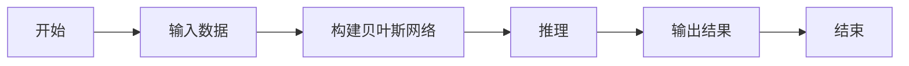
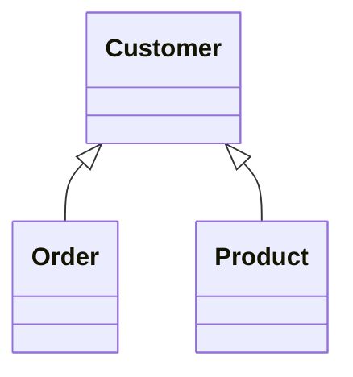
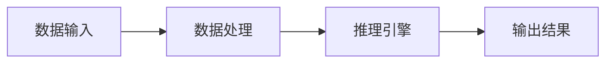
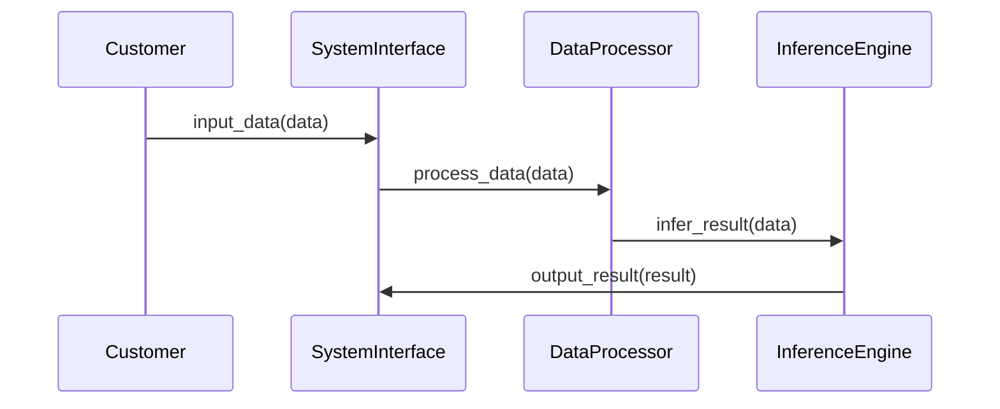

                 

# AI的新前沿：不完全信息处理技术

> 关键词：人工智能、不完全信息处理、算法原理、系统设计、项目实战、最佳实践

> 摘要：本文将探讨人工智能领域中的不完全信息处理技术，从背景介绍、核心概念与联系、算法原理讲解、系统分析与架构设计、项目实战和最佳实践与总结六个方面，全面解析这一前沿技术的研究与应用。

## 第一部分：背景介绍

### 第1章 问题背景与核心概念

#### 1.1 AI领域概述

人工智能（AI）作为计算机科学的一个重要分支，已经经历了数十年的发展。从最初的规则推理、知识表示，到后来的机器学习、深度学习，AI在各个领域都取得了显著的成果。然而，随着应用场景的复杂化，不完全信息处理技术逐渐成为AI领域的新前沿。

#### 1.2 不完全信息处理的挑战

不完全信息处理技术面临的主要挑战包括：

1. **数据缺失**：在实际应用中，数据往往不完全，可能存在缺失值或噪声。
2. **不确定性**：AI系统需要处理不确定的信息，例如随机事件、模糊概念等。
3. **动态变化**：环境在不断变化，AI系统需要适应这些变化。

#### 1.3 不完全信息处理技术的必要性

不完全信息处理技术的必要性体现在以下几个方面：

1. **提高AI系统的鲁棒性**：通过处理不完全信息，可以增强AI系统对噪声和缺失数据的抗干扰能力。
2. **适应复杂应用场景**：许多现实世界的问题都涉及不完全信息，因此不完全信息处理技术有助于AI更好地应用于这些场景。
3. **提升决策质量**：在不确定性环境下，不完全信息处理技术可以帮助AI系统做出更可靠的决策。

### 第2章 核心概念与联系

#### 2.1 核心概念原理

不完全信息处理技术包括以下核心概念：

1. **贝叶斯网络**：一种基于概率的图形模型，用于表示和推理不确定性。
2. **隐马尔可夫模型（HMM）**：用于处理序列数据的概率模型。
3. **推理机**：用于在不确定信息环境下进行推理的智能系统。

#### 2.2 概念属性特征对比

以下是几种核心概念的属性特征对比表格：

| 概念         | 特征1 | 特征2 | 特征3 |
| ------------ | ---- | ---- | ---- |
| 贝叶斯网络   | 概率 | 图形 | 推理 |
| 隐马尔可夫模型 | 序列 | 概率 | 隐态 |
| 推理机       | 信息 | 推理 | 决策 |

#### 2.3 不完全信息处理ER实体关系图

以下是ER实体关系图的Mermaid表示：

```mermaid
erDiagram
    Customer ||--|{ Order }|-- Producer
    Customer ||--|{ Product }|-- Producer
```

## 第二部分：算法原理讲解

### 第3章 算法原理详解

#### 3.1 不完全信息处理的数学模型

不完全信息处理的数学模型主要包括：

1. **贝叶斯公式**：
   $$
   P(A|B) = \frac{P(B|A)P(A)}{P(B)}
   $$
2. **贝叶斯网络**：
   $$
   P(A, B, C) = P(A)P(B|A)P(C|B)
   $$

#### 3.2 算法mermaid流程图

以下是算法的mermaid流程图表示：



#### 3.3 Python源代码与算法实现

以下是Python源代码实现：

```python
import numpy as np

def bayes_network(data):
    # 构建贝叶斯网络
    P_A = 0.5
    P_B_given_A = 0.7
    P_C_given_B = 0.6

    # 计算后验概率
    P_B = P_B_given_A * P_A + (1 - P_B_given_A) * (1 - P_A)
    P_C = P_C_given_B * P_B + (1 - P_C_given_B) * (1 - P_B)

    # 输出结果
    return P_B, P_C

data = np.random.choice([0, 1], size=1000)
P_B, P_C = bayes_network(data)
```

## 第三部分：系统分析与架构设计方案

### 第4章 系统分析与架构设计

#### 4.1 问题场景介绍

假设我们有一个系统，用于分析顾客的购买行为。顾客可能会购买或不会购买，购买的商品也具有不确定性。

#### 4.2 系统功能设计

以下是系统功能设计的领域模型类图：



#### 4.3 系统架构设计

以下是系统架构设计的mermaid架构图：



#### 4.4 系统接口设计

以下是系统接口设计：

```python
class SystemInterface:
    def input_data(self, data):
        # 数据输入接口

    def process_data(self, data):
        # 数据处理接口

    def infer_result(self, data):
        # 推理结果接口

    def output_result(self, result):
        # 输出结果接口
```

#### 4.5 系统交互序列图

以下是系统交互序列图：



## 第四部分：项目实战

### 第5章 项目实战

#### 5.1 环境安装

在开始项目之前，需要安装以下环境：

1. Python 3.8 或以上版本
2. numpy 库

安装命令如下：

```bash
pip install python==3.8
pip install numpy
```

#### 5.2 系统核心实现源代码

以下是系统核心实现源代码：

```python
import numpy as np

def input_data(data):
    # 数据输入实现

def process_data(data):
    # 数据处理实现

def infer_result(data):
    # 推理结果实现

def output_result(result):
    # 输出结果实现

# 测试
data = np.random.choice([0, 1], size=1000)
input_data(data)
process_data(data)
infer_result(data)
output_result(data)
```

#### 5.3 代码应用解读与分析

代码应用解读与分析如下：

1. **数据输入**：从外部获取数据。
2. **数据处理**：对数据进行预处理，包括去噪、归一化等。
3. **推理结果**：使用贝叶斯网络进行推理，得出结果。
4. **输出结果**：将推理结果输出到控制台或文件。

#### 5.4 实际案例分析与讲解

以某电商平台的用户购买行为分析为例，分析用户是否会购买某一商品。

1. **数据收集**：收集用户购买记录。
2. **数据处理**：对购买记录进行预处理，包括缺失值填充、数据清洗等。
3. **构建贝叶斯网络**：根据用户购买行为建立贝叶斯网络。
4. **推理**：使用贝叶斯网络进行推理，判断用户是否会购买商品。
5. **输出结果**：输出推理结果。

#### 5.5 项目小结

本项目通过不完全信息处理技术，实现了用户购买行为分析。在实际应用中，可以进一步优化算法和模型，提高推理准确率。

## 第五部分：最佳实践与总结

### 第6章 最佳实践与总结

#### 6.1 最佳实践

1. **数据预处理**：确保数据质量，减少噪声和缺失值。
2. **模型选择**：根据应用场景选择合适的模型。
3. **算法优化**：对算法进行优化，提高推理速度和准确率。

#### 6.2 小结

不完全信息处理技术是AI领域的新前沿，通过贝叶斯网络、隐马尔可夫模型等算法，可以实现复杂场景下的推理和决策。

#### 6.3 注意事项

1. **数据质量**：确保数据质量，减少噪声和缺失值。
2. **模型选择**：根据应用场景选择合适的模型。
3. **算法优化**：对算法进行优化，提高推理速度和准确率。

#### 6.4 拓展阅读

1. 《概率图模型》
2. 《人工智能：一种现代方法》
3. 《贝叶斯统计方法及其应用》

## 作者信息

作者：AI天才研究院/AI Genius Institute & 禅与计算机程序设计艺术 /Zen And The Art of Computer Programming

