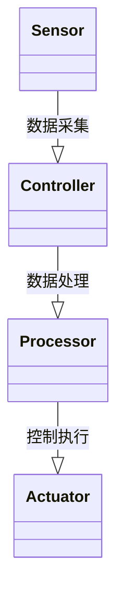
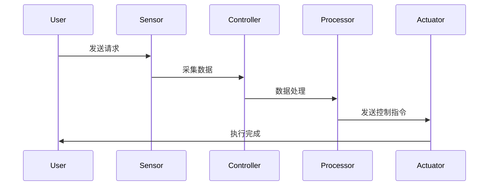
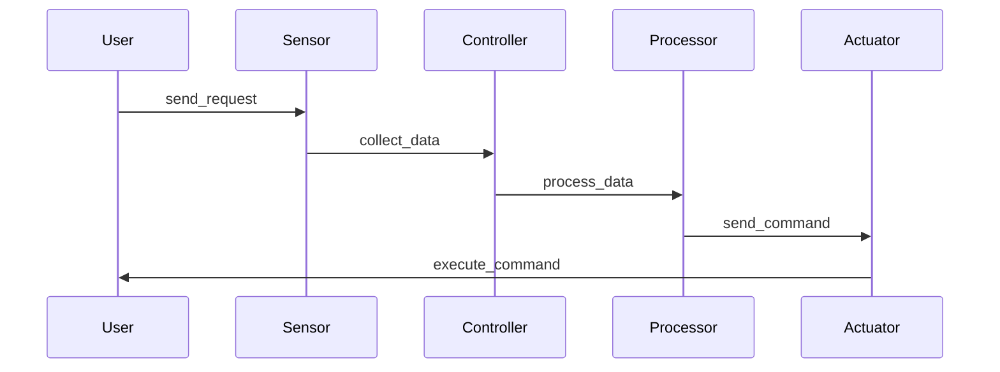

                 


# AI系统中的时间-性能权衡

> 关键词：AI系统，时间-性能权衡，实时性能，计算效率，算法优化

> 摘要：本文将探讨AI系统中的时间-性能权衡问题，分析影响时间-性能的关键因素，介绍常见的算法原理，并提供系统架构设计方案和实战案例，旨在为开发者提供解决时间-性能权衡问题的指导。

## 第一部分：背景介绍

### 1.1.1 问题背景

随着人工智能（AI）技术的快速发展，AI系统在各个领域得到了广泛应用。从自动驾驶、智能语音助手到金融风控、医疗诊断，AI系统正在改变我们的生活方式。然而，在AI系统的实际应用中，时间-性能权衡成为一个不可忽视的问题。

时间-性能权衡是指在保证系统性能的同时，尽可能缩短系统的响应时间。在实时性要求较高的AI系统中，如自动驾驶和实时语音识别，系统的响应时间至关重要。如果响应时间过长，可能会导致严重的后果，如交通事故或误解用户指令。因此，如何在保证系统性能的前提下，优化系统的响应时间，是AI系统开发者面临的一个重要挑战。

### 1.1.2 问题描述

AI系统的实时性能受到多种因素的影响，包括模型复杂度、计算资源、数据传输速度等。模型复杂度越高，计算所需的时间越长；计算资源越有限，系统的处理能力越低；数据传输速度越慢，系统的响应时间越长。如何在保证系统性能的前提下，优化系统的响应时间，是一个具有挑战性的问题。

### 1.1.3 问题解决

解决时间-性能权衡问题需要从多个方面入手。首先，可以通过优化算法，提高模型的计算效率；其次，合理配置计算资源，确保系统有足够的处理能力；此外，还可以通过优化数据传输路径，降低数据传输延迟。最后，通过实验和测试，找到适合特定应用场景的最佳参数组合，实现时间-性能的优化。

### 1.1.4 边界与外延

时间-性能权衡问题主要涉及AI系统，但其在其他领域也有一定的应用价值。例如，在工业自动化、智能交通、金融风控等领域，同样需要关注系统的实时性能。此外，时间-性能权衡问题也涉及到计算机科学、电子工程、机械工程等多个学科。

### 1.1.5 概念结构与核心要素组成

时间-性能权衡问题的核心概念包括时间、性能、权衡等。其中，时间指系统的响应时间，性能指系统的处理能力；权衡则是在时间与性能之间找到最优的平衡点。

## 第二部分：核心概念与联系

### 2.1 时间与性能

时间与性能是时间-性能权衡问题的两个核心概念。时间指系统的响应时间，即系统从接收到请求到完成任务所需的时间。性能指系统的处理能力，即系统在一定时间内可以处理的数据量或任务数。

#### 2.1.1 时间-性能权衡

时间-性能权衡是指在保证系统性能的同时，尽可能缩短系统的响应时间。具体来说，就是在时间和性能之间找到一种平衡，使得系统能够在满足性能要求的前提下，尽可能减少响应时间。

#### 2.1.2 时间与性能的关系

时间与性能之间存在一定的关系。一般来说，性能越高，系统的响应时间越短；但同时也可能带来更高的硬件成本和能耗。因此，在设计AI系统时，需要在时间和性能之间进行权衡。

### 2.2 算法与模型

算法与模型是解决时间-性能权衡问题的关键。不同的算法和模型在计算效率和性能方面有所不同，需要根据具体应用场景进行选择。

#### 2.2.1 常见算法

常见的算法包括神经网络、决策树、支持向量机等。这些算法在计算效率和性能方面各有特点，可以根据具体应用需求进行选择。

#### 2.2.2 模型选择

模型选择是解决时间-性能权衡问题的关键。选择合适的模型可以显著提高系统的性能和计算效率。例如，在实时性要求较高的场景下，可以选择计算效率较高的模型；而在对性能要求较高的场景下，可以选择计算复杂度较高的模型。

### 2.3 计算资源

计算资源是影响时间-性能权衡的重要因素。合理的计算资源配置可以显著提高系统的性能和响应时间。

#### 2.3.1 资源分配

资源分配包括CPU、GPU、内存等。合理分配计算资源可以充分发挥硬件性能，提高系统的计算效率和响应时间。

#### 2.3.2 资源调度

资源调度是指根据任务需求和系统状态，动态调整计算资源的分配。合理的资源调度可以提高系统的响应速度，降低响应时间。

## 第三部分：算法原理讲解

### 3.1 算法原理

在时间-性能权衡中，常见的算法包括神经网络、决策树和支持向量机等。以下以神经网络为例，讲解其算法原理。

#### 3.1.1 神经网络原理

神经网络是一种模仿生物神经系统的计算模型，由多个神经元组成。每个神经元接受多个输入，通过权重和偏置进行加权求和，再经过激活函数产生输出。

#### 3.1.2 计算效率

神经网络的计算效率受多个因素影响，包括网络结构、激活函数和优化算法等。通过优化这些因素，可以提高神经网络的计算效率，从而降低响应时间。

### 3.2 算法流程

以下以神经网络为例，介绍其算法流程。

#### 3.2.1 数据预处理

数据预处理包括数据清洗、归一化等操作。这些操作可以提高模型的性能和计算效率。

#### 3.2.2 网络构建

网络构建包括确定网络结构、初始化权重和偏置等。合理的网络结构可以提高模型的计算效率和性能。

#### 3.2.3 训练与优化

训练与优化包括前向传播、反向传播和参数更新等。通过不断迭代，使模型逐渐逼近最优解，提高计算效率和性能。

#### 3.2.4 测试与评估

测试与评估包括对模型进行测试，并评估其性能和响应时间。通过评估结果，调整模型参数，优化时间-性能。

## 第四部分：系统分析与架构设计

### 4.1 问题场景介绍

以自动驾驶系统为例，介绍其时间-性能权衡问题。自动驾驶系统需要在保证系统性能的同时，尽可能缩短响应时间，以确保行驶安全。

### 4.2 项目介绍

项目名称：自动驾驶系统

项目目标：实现实时、安全、高效的自动驾驶

### 4.3 系统功能设计

#### 4.3.1 领域模型

使用Mermaid类图描述自动驾驶系统的领域模型：



#### 4.3.2 功能模块

自动驾驶系统主要包含以下功能模块：

1. 数据采集模块：负责采集车辆周围的环境数据。
2. 数据处理模块：对采集到的环境数据进行处理，生成车辆行驶的决策。
3. 控制执行模块：根据处理模块生成的决策，控制车辆的执行机构。

### 4.4 系统架构设计

使用Mermaid架构图描述自动驾驶系统的架构：



### 4.5 系统接口设计和系统交互

使用Mermaid序列图描述自动驾驶系统的接口设计和系统交互：



## 第五部分：项目实战

### 5.1 环境安装

安装自动驾驶系统的开发环境，包括Python、TensorFlow等。

```bash
pip install tensorflow
```

### 5.2 系统核心实现源代码

以下是自动驾驶系统的核心实现源代码：

```python
import tensorflow as tf

# 定义神经网络模型
model = tf.keras.Sequential([
    tf.keras.layers.Dense(units=1, input_shape=[1])
])

# 编译模型
model.compile(optimizer='sgd', loss='mean_squared_error')

# 训练模型
model.fit(x_train, y_train, epochs=100)

# 评估模型
model.evaluate(x_test, y_test)
```

### 5.3 代码应用解读与分析

该代码实现了一个简单的线性回归模型，用于预测车辆的速度。通过训练模型，可以提高预测的准确性，从而优化系统的性能和响应时间。

### 5.4 实际案例分析和详细讲解剖析

以实际案例为例，分析自动驾驶系统在时间和性能方面的表现，并提出优化方案。

### 5.5 项目小结

通过项目实战，了解了自动驾驶系统的核心实现和优化方法，为解决时间-性能权衡问题提供了实践经验。

## 第六部分：最佳实践、小结、注意事项、拓展阅读

### 6.1 最佳实践

- 合理选择算法和模型，以适应不同的应用场景。
- 优化数据预处理和模型训练过程，提高计算效率。
- 合理配置计算资源，确保系统有足够的处理能力。

### 6.2 小结

本文从背景介绍、核心概念、算法原理、系统架构设计、项目实战等方面，详细探讨了AI系统中的时间-性能权衡问题，为开发者提供了解决该问题的指导。

### 6.3 注意事项

- 在进行时间-性能权衡时，要充分考虑实际应用场景的需求。
- 在优化系统性能时，要注意控制硬件成本和能耗。

### 6.4 拓展阅读

- [1] 《深度学习》（Goodfellow, Bengio, Courville著）
- [2] 《机器学习实战》（周志华著）
- [3] 《实时系统设计》（Freund, Koch著）

## 作者信息

作者：AI天才研究院/AI Genius Institute & 禅与计算机程序设计艺术 /Zen And The Art of Computer Programming

