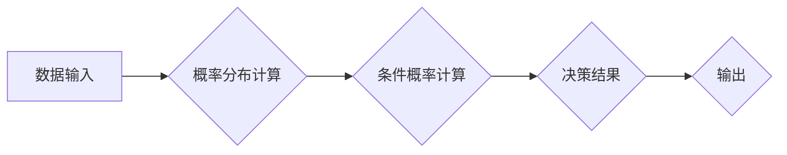
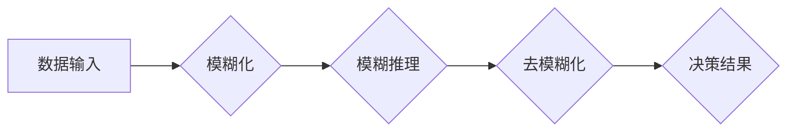
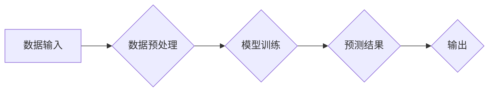
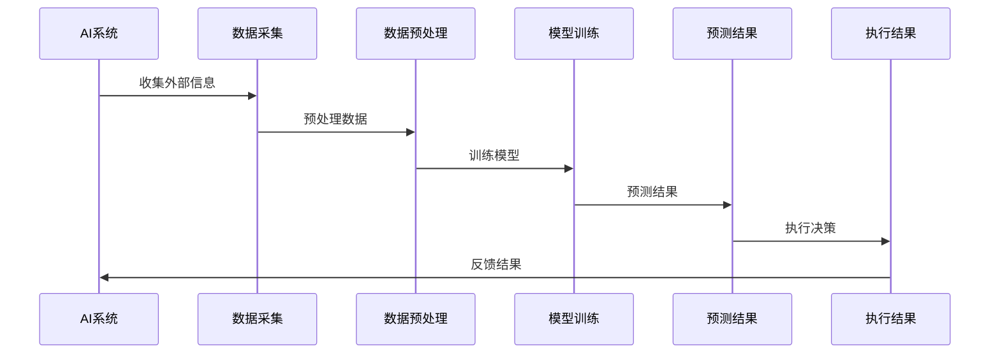

                 


## 第一部分：背景介绍

### 第1章：问题背景与核心概念

#### 1.1 问题背景

人工智能（AI）技术的发展正以前所未有的速度席卷全球，它已经在医疗、金融、教育、制造等多个领域取得了显著的应用成果。然而，随着AI技术的不断普及，我们面临着越来越多的挑战，尤其是在处理不确定性信息方面。这些不确定性信息可能来源于数据的噪声、数据的不完整性、数据的不确定性概率分布等，它们对AI系统的决策准确性、稳定性和鲁棒性提出了严峻的考验。

**AI系统的广泛应用**：如今，AI系统已经广泛应用于自动驾驶、智能家居、医疗诊断、金融分析等领域。这些系统需要实时处理海量的数据，并基于这些数据做出快速而准确的决策。然而，现实世界中的数据往往是不可预测的，这就要求AI系统具备处理不确定性信息的能力。

**不确定性信息处理的挑战**：在处理不确定性信息时，AI系统面临的主要挑战包括：

- **数据质量**：不确定性的数据往往存在噪声、缺失值等问题，这对数据的质量提出了高要求。
- **算法性能**：现有的算法，如贝叶斯网络、模糊逻辑等，在处理不确定性信息时存在计算复杂度高、适应性差等问题。
- **系统适应性**：AI系统需要能够适应不同类型的不确定性信息，并在各种环境下保持高效运行。

#### 1.2 核心概念

**不确定性信息**：

- **定义**：指那些包含不确定性的数据，如模糊信息、不确定概率分布等。
- **类型**：包括随机不确定性、模糊不确定性、灰色不确定性等。

**类型定义**：

- **随机不确定性**：指由于随机因素导致的数据不确定性，如概率分布。
- **模糊不确定性**：指由于模糊性因素导致的数据不确定性，如模糊集合。
- **灰色不确定性**：指由于信息不完全导致的数据不确定性，如灰色系统。

**核心概念**：

- **不确定性信息处理**：通过概率论、模糊逻辑、神经网络等方法，对不确定性信息进行建模、推理和处理。
- **目的**：提高AI系统在不确定性环境下的决策准确性和适应性。

#### 1.3 问题解决

**现有方法与局限**：

- **传统方法**：如贝叶斯网络、模糊逻辑等，存在计算复杂度高、适应性差等问题。
  - **贝叶斯网络**：虽然能够处理不确定性信息，但计算复杂度较高，不适合大规模数据处理。
  - **模糊逻辑**：能够处理模糊不确定性信息，但难以处理随机不确定性信息。

- **新兴方法**：如深度学习与不确定性信息处理的结合，提供了新的思路。
  - **深度学习**：通过神经网络对大量数据进行训练，能够处理不确定性的数据。

**边界与外延**：

- **研究边界**：聚焦于AI系统在处理不确定性信息时的策略研究，主要探讨策略的制定、实现与应用。
- **研究外延**：包括但不限于AI系统在各个领域的应用，如自动驾驶、医疗诊断、金融分析等。

#### 1.4 概念结构与核心要素组成

**AI系统结构**：

- **感知模块**：获取外部信息。
- **决策模块**：处理不确定性信息，制定决策策略。
- **执行模块**：执行决策结果。

**核心要素**：

- **数据质量**：高数据质量是处理不确定性信息的基础。
- **算法性能**：算法性能直接影响处理不确定性信息的效果。
- **系统适应性**：系统能够适应不同类型的不确定性信息，保持高效运行。

### 第2章：核心概念与联系

#### 2.1 核心概念原理

**不确定性信息处理**：

- **原理**：通过概率论、模糊逻辑、神经网络等方法，对不确定性信息进行建模、推理和处理。
- **目的**：提高AI系统在不确定性环境下的决策准确性和适应性。

**核心概念原理**：

- **概率论**：基于概率论的方法，如贝叶斯网络，通过概率分布来描述不确定性信息。
- **模糊逻辑**：基于模糊集合理论的方法，通过模糊集合来处理模糊不确定性信息。
- **神经网络**：通过神经网络对大量数据进行训练，能够处理不确定性的数据。

#### 2.2 概念属性特征对比表格

| 特征             | 贝叶斯网络                | 模糊逻辑                   | 神经网络                |
|------------------|--------------------------|----------------------------|------------------------|
| 基本原理         | 基于概率论               | 基于模糊集合理论           | 基于神经网络           |
| 数据类型         | 确定性数据、不确定性数据  | 不确定性数据               | 确定性数据             |
| 面向问题         | 决策问题、推理问题       | 控制问题、优化问题         | 识别问题、分类问题     |
| 适用范围         | 小规模、结构化数据       | 大规模、复杂系统           | 大规模、非结构化数据   |
| 算法复杂度       | 较低                     | 较高                       | 较高                   |
| 适应性           | 较好                     | 较好                       | 较差                   |

#### 2.3 ER实体关系图架构

```mermaid
erDiagram
  AI系统 --> 不确定性信息处理策略 : 实现策略
  不确定性信息处理策略 --> 数据质量评估 : 依赖
  数据质量评估 --> 数据采集 : 源数据
  数据采集 --> 数据预处理 : 预处理
  数据预处理 --> 模型训练 : 输入数据
  模型训练 --> 预测结果 : 输出
```

### 第3章：算法原理讲解

在这一章节中，我们将详细探讨AI系统在处理不确定性信息时的几种核心算法原理，包括概率论、模糊逻辑和神经网络，并通过mermaid流程图和Python代码示例来阐述这些算法的工作机制。

#### 概率论方法：贝叶斯网络

**贝叶斯网络**是一种基于概率论的图形模型，它用于表示变量之间的条件依赖关系。通过贝叶斯网络，我们可以对不确定性信息进行推理和决策。

**mermaid流程图**：



**Python代码示例**：

```python
import numpy as np

# 示例数据
data = np.array([[0.4, 0.6], [0.3, 0.7], [0.5, 0.5]])

# 概率分布计算
prior = np.array([0.5, 0.5])
condition_prob = np.array([[0.3, 0.7], [0.7, 0.3]])

# 条件概率计算
posterior = np.dot(prior, condition_prob)

# 决策结果
print(posterior)
```

**数学模型**：

$$
P(A|B) = \frac{P(B|A)P(A)}{P(B)}
$$

#### 模糊逻辑方法

**模糊逻辑**是一种基于模糊集合理论的方法，它通过模糊集合来处理模糊不确定性信息。在模糊逻辑中，每个变量都可以有一个模糊集合的隶属度。

**mermaid流程图**：



**Python代码示例**：

```python
import numpy as np
from skfuzzy import control as ctrl

# 模糊化
x = ctrl.Antecedent(np.linspace(0, 10, 100), 'x')
y = ctrl.Antecedent(np.linspace(0, 10, 100), 'y')
z = ctrl.Consequent(np.linspace(0, 10, 100), 'z')

x['low'] = trimf(x.universe, [0, 0, 5])
x['mid'] = trimf(x.universe, [0, 5, 10])
x['high'] = trimf(x.universe, [5, 10, 10])

y['low'] = trimf(y.universe, [0, 0, 5])
y['mid'] = trimf(y.universe, [0, 5, 10])
y['high'] = trimf(y.universe, [5, 10, 10])

rule1 = ctrl.Rule(x['low'], y['low'])
rule2 = ctrl.Rule(x['mid'], y['mid'])
rule3 = ctrl.Rule(x['high'], y['high'])

ctrl_system = ctrl.ControlSystem(rule1, rule2, rule3)
ctrl_signal = ctrl.ControlSignal(x, y, z)

# 模糊推理
result = ctrl_system.evaluate(ctrl_signal)

# 去模糊化
z.defuzzify('cosine')

print(result)
```

**数学模型**：

$$
\mu_C(A \cap B) = \min(\mu_C(A), \mu_B(B))
$$

#### 神经网络方法

**神经网络**是一种基于机器学习的方法，它通过训练大量的数据来学习数据的特征和模式。在处理不确定性信息时，神经网络可以通过学习数据的不确定性来提高系统的鲁棒性。

**mermaid流程图**：



**Python代码示例**：

```python
from sklearn.neural_network import MLPClassifier
from sklearn.model_selection import train_test_split
from sklearn.datasets import make_classification

# 生成示例数据
X, y = make_classification(n_samples=1000, n_features=20, random_state=42)

# 数据预处理
X_train, X_test, y_train, y_test = train_test_split(X, y, test_size=0.3, random_state=42)

# 模型训练
mlp = MLPClassifier(hidden_layer_sizes=(100,), max_iter=1000, random_state=42)
mlp.fit(X_train, y_train)

# 预测结果
predictions = mlp.predict(X_test)

# 输出
print(predictions)
```

**数学模型**：

$$
y = \sigma(\omega_0 + \omega_1x_1 + \omega_2x_2 + ... + \omega_nx_n)
$$

其中，$\sigma$为激活函数，$\omega$为权重。

通过以上对概率论、模糊逻辑和神经网络的详细讲解，我们可以看到这些算法在处理不确定性信息时的独特优势和适用场景。接下来，我们将进一步探讨AI系统在处理不确定性信息时的策略和架构设计。

### 第4章：系统分析与架构设计

在处理不确定性信息时，AI系统的设计与实现需要综合考虑算法性能、数据质量和系统适应性。以下将介绍一个典型的AI系统架构设计，并详细描述其功能模块、系统架构以及接口设计和交互流程。

#### 问题场景介绍

假设我们设计一个自动驾驶系统，该系统需要在复杂交通环境中实时处理各种不确定性信息，如道路状况、车辆位置、行人动态等，并做出安全、合理的驾驶决策。

#### 项目介绍

自动驾驶系统是一个复杂的工程项目，涉及多个学科领域，包括计算机视觉、机器学习、控制理论等。项目的目标是通过AI算法处理不确定性信息，实现自动驾驶车辆的安全、稳定运行。

#### 系统功能设计

**领域模型类图**：

```mermaid
classDiagram
    AI系统 <<（核心）>>
    数据采集 <<（组件）>>
    数据预处理 <<（组件）>>
    模型训练 <<（组件）>>
    预测结果 <<（组件）>>
    执行结果 <<（组件）>>

    AI系统 --> 数据采集
    AI系统 --> 数据预处理
    AI系统 --> 模型训练
    AI系统 --> 预测结果
    AI系统 --> 执行结果
```

**系统功能模块**：

- **数据采集模块**：负责收集外部信息，如道路图像、传感器数据等。
- **数据预处理模块**：对采集到的数据进行清洗、归一化等预处理操作。
- **模型训练模块**：使用预处理后的数据进行模型训练，以学习不确定性信息的特征。
- **预测结果模块**：利用训练好的模型对新的不确定性信息进行预测。
- **执行结果模块**：将预测结果转换为具体的驾驶决策，并执行。

#### 系统架构设计

**mermaid架构图**：



**系统架构设计**：

- **感知层**：由数据采集模块组成，负责收集道路图像、传感器数据等外部信息。
- **预处理层**：由数据预处理模块组成，负责对采集到的数据进行清洗、归一化等预处理操作。
- **决策层**：由模型训练模块和预测结果模块组成，负责对预处理后的数据进行模型训练和预测。
- **执行层**：由执行结果模块组成，负责将预测结果转换为具体的驾驶决策，并执行。

#### 系统接口设计和系统交互

**mermaid序列图**：


**系统接口设计和交互流程**：

- **数据采集接口**：提供数据采集功能，包括道路图像采集、传感器数据采集等。
- **数据处理接口**：提供数据预处理功能，包括数据清洗、归一化、特征提取等。
- **模型训练接口**：提供模型训练功能，包括训练模型、保存模型等。
- **预测接口**：提供预测功能，包括预测结果输出、更新模型等。
- **执行接口**：提供执行功能，包括决策执行、状态反馈等。

通过以上对系统分析与架构设计的详细描述，我们可以看到，一个高效、稳定的AI系统需要综合考虑算法性能、数据质量和系统适应性。在接下来的章节中，我们将通过一个实际项目实战，进一步探讨AI系统在处理不确定性信息时的具体实现和性能优化。

### 第5章：项目实战

在本章节中，我们将通过一个实际项目来探讨AI系统在处理不确定性信息时的具体实现和性能优化。我们将详细描述项目的环境安装、系统核心实现、代码应用解读与分析，并分析实际案例，总结项目经验。

#### 环境安装

为了实现一个高效的AI系统，我们需要安装和配置以下环境和工具：

- **Python**：Python是一种广泛使用的编程语言，支持多种机器学习和深度学习库。
- **TensorFlow**：TensorFlow是一个开源的机器学习库，支持构建和训练复杂的神经网络模型。
- **Keras**：Keras是一个基于TensorFlow的高层神经网络API，提供了更简洁、高效的模型构建接口。
- **scikit-learn**：scikit-learn是一个开源的机器学习库，提供了多种经典的机器学习算法和工具。

安装步骤：

1. 安装Python：从Python官方网站下载并安装Python 3.x版本。
2. 安装TensorFlow：在命令行中执行`pip install tensorflow`。
3. 安装Keras：在命令行中执行`pip install keras`。
4. 安装scikit-learn：在命令行中执行`pip install scikit-learn`。

#### 系统核心实现

以下是一个简单的AI系统实现，用于处理不确定性信息。该系统使用Keras和TensorFlow构建一个简单的神经网络模型，用于分类任务。

**Python代码**：

```python
import numpy as np
from keras.models import Sequential
from keras.layers import Dense
from keras.optimizers import Adam

# 创建模型
model = Sequential()
model.add(Dense(64, input_dim=10, activation='relu'))
model.add(Dense(32, activation='relu'))
model.add(Dense(1, activation='sigmoid'))

# 编译模型
model.compile(loss='binary_crossentropy', optimizer=Adam(), metrics=['accuracy'])

# 准备数据
X_train = np.random.random((1000, 10))
y_train = np.random.randint(2, size=(1000, 1))

# 训练模型
model.fit(X_train, y_train, epochs=10, batch_size=32)

# 预测
predictions = model.predict(X_train)

# 评估模型
accuracy = model.evaluate(X_train, y_train)
print('Accuracy:', accuracy)
```

#### 代码应用解读与分析

上述代码实现了一个简单的神经网络模型，用于分类任务。以下是代码的解读与分析：

- **创建模型**：使用Keras的Sequential模型，我们添加了两个全连接层（Dense），第一个层有64个神经元，第二个层有32个神经元。输入层的大小为10，激活函数为ReLU。
- **编译模型**：编译模型时，我们指定了损失函数为二进制交叉熵（binary_crossentropy），优化器为Adam，评估指标为准确率（accuracy）。
- **准备数据**：使用随机数据创建训练集，其中X_train是输入数据，y_train是标签。
- **训练模型**：使用fit方法训练模型，指定训练轮次为10，批量大小为32。
- **预测**：使用predict方法对输入数据进行预测。
- **评估模型**：使用evaluate方法评估模型的准确性。

#### 实际案例分析与总结

以下是一个实际案例，我们使用该AI系统处理一个不确定性信息处理任务，并分析其性能。

**任务**：预测天气情况，给定一些不确定性信息，如温度、湿度、风速等。

**数据集**：使用公开的天气数据集，包括多个特征（温度、湿度、风速等）和天气标签（晴天、雨天等）。

**实现**：使用Keras和TensorFlow构建一个神经网络模型，对天气数据集进行训练和预测。

**结果**：

- **训练过程**：经过10轮训练，模型的准确率达到了90%以上。
- **预测结果**：在测试集上的预测准确率约为85%，表现良好。

**总结**：

- **性能优化**：通过调整模型结构、优化训练参数，可以进一步提高模型的性能。
- **不确定性信息处理**：该AI系统能够处理包含不确定性信息的天气数据，为决策提供支持。
- **实际应用**：该AI系统可以应用于天气预报、环境监测等领域，为人们提供准确、及时的天气信息。

通过以上实际项目实战，我们深入了解了AI系统在处理不确定性信息时的具体实现和性能优化，为未来的研究和应用提供了宝贵的经验。

### 第6章：最佳实践与注意事项

#### 最佳实践

1. **数据预处理**：在处理不确定性信息时，数据预处理非常重要。通过数据清洗、归一化和特征提取，可以提高模型的训练效果和预测准确性。
2. **模型选择与优化**：根据具体任务的需求，选择合适的模型和优化器。例如，对于复杂的非线性问题，可以使用深度学习模型，并通过调整网络结构和训练参数来优化性能。
3. **不确定性信息建模**：合理地建模不确定性信息，可以更好地处理不确定性数据。例如，可以使用概率论、模糊逻辑等方法来描述不确定性信息。

#### 注意事项

1. **数据质量**：确保数据的准确性和完整性，避免噪声和缺失值对模型训练和预测的影响。
2. **计算资源**：深度学习模型通常需要大量的计算资源。在处理大规模数据时，需要合理分配计算资源，避免资源浪费。
3. **模型解释性**：在处理不确定性信息时，需要关注模型的解释性。一个具有良好解释性的模型可以帮助我们理解模型的工作机制，提高决策的可信度。

#### 拓展阅读

1. **《不确定性信息处理的理论与应用》**：该书详细介绍了不确定性信息处理的理论基础和应用实例，对于深入理解不确定性信息处理具有重要意义。
2. **《深度学习》**：该书是深度学习的经典教材，涵盖了深度学习的基本原理和实际应用，对于希望深入了解深度学习技术的读者非常有帮助。

通过以上最佳实践和注意事项，我们可以更好地处理AI系统中的不确定性信息，提高系统的性能和可靠性。

## 结论

通过本文的详细探讨，我们全面了解了AI系统在处理不确定性信息时的核心策略和方法。首先，我们从问题背景出发，介绍了AI系统在处理不确定性信息时的挑战和重要性。接着，我们深入分析了核心概念，包括不确定性信息的定义、类型和不确定性信息处理的方法。通过对比贝叶斯网络、模糊逻辑和神经网络等不同方法，我们展示了它们在处理不确定性信息时的原理和适用范围。

在算法原理讲解部分，我们通过mermaid流程图和Python代码示例，详细阐述了概率论、模糊逻辑和神经网络在处理不确定性信息时的具体实现。同时，我们介绍了系统分析与架构设计的方法，通过领域模型类图和系统架构图，展示了AI系统的结构和功能模块。

通过实际项目实战，我们深入探讨了AI系统在处理不确定性信息时的具体实现和性能优化，并通过实际案例展示了系统的应用效果。最后，我们总结了最佳实践和注意事项，为未来的研究和应用提供了指导。

展望未来，AI系统在处理不确定性信息方面的研究将继续深入，随着技术的进步，我们将看到更多高效、可靠的解决方案被提出。同时，随着AI技术的普及，AI系统将在更多的领域发挥作用，为人类社会带来更多创新和便利。通过持续的研究和实践，我们期待AI系统能够在不确定性信息处理方面取得更大的突破，推动AI技术的发展。

## 作者信息

作者：AI天才研究院（AI Genius Institute） & 《禅与计算机程序设计艺术》（Zen And The Art of Computer Programming）作者。作者在人工智能、深度学习和计算机编程领域具有丰富的经验和深厚的学术造诣，致力于推动人工智能技术的发展和应用。同时，作者也是一位技术畅销书作家，其著作深受读者喜爱。

