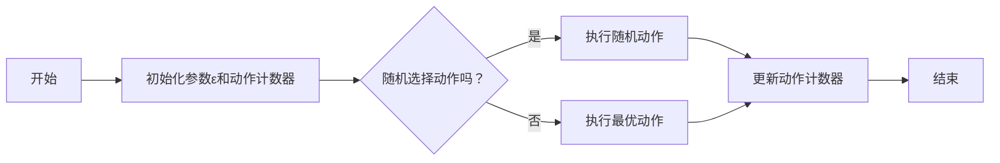
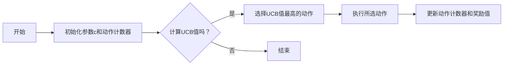
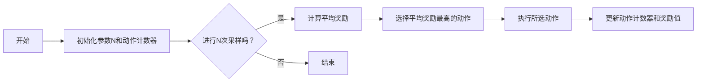

                 

# AI系统在处理稀疏奖励环境时的探索策略

## 摘要

本文深入探讨了AI系统在处理稀疏奖励环境时的探索策略。稀疏奖励环境是指奖励信号分布稀疏且不确定的环境，在这种环境中，系统大部分时间无法获得奖励，而奖励一旦出现，则具有重要的意义。本文首先定义了稀疏奖励环境，然后分析了当前的研究现状与挑战，接着详细介绍了探索策略的理论基础、核心算法以及数学模型，并通过实际应用案例展示了这些算法的实用性和效果。最后，本文总结了研究成果，并对未来研究方向进行了展望。

## 目录大纲设计思路

在设计《AI系统在处理稀疏奖励环境时的探索策略》这本书的目录大纲时，我们首先明确了书籍的主题和目标读者。书籍主题集中在AI系统如何处理稀疏奖励环境，这意味着书籍将讨论的是如何使AI系统能够在奖励稀疏、信息不充分的环境中进行有效的探索和学习。目标读者群体可能包括AI领域的科研人员、工程师以及对此感兴趣的专业人士。

### 目录大纲结构设计

**第一部分：背景与基础理论**

- **第1章 引言**
  - **1.1 问题背景与重要性**
  - **1.2 稀疏奖励环境的定义**
  - **1.3 研究现状与挑战**
  - **1.4 本书内容结构与预期收益**

**第二部分：核心概念与原理**

- **第2章 稀疏奖励环境的特性分析**
  - **2.1 稀疏奖励的概念与分类**
  - **2.2 稀疏奖励环境的特点**
  - **2.3 稀疏奖励环境中的挑战**

- **第3章 探索策略的理论基础**
  - **3.1 探索与利用的平衡**
  - **3.2 探索策略的分类**
  - **3.3 探索策略的理论模型**

- **第4章 核心算法介绍**
  - **4.1 经典探索算法**
    - **4.1.1 ε-贪心算法**
    - **4.1.2 蒙特卡洛方法**
    - **4.1.3 启发式搜索**
  - **4.2 进阶探索算法**
    - **4.2.1 Upper Confidence Bound（UCB）算法**
    - **4.2.2 Thompson 采样法**

**第三部分：算法原理与实现**

- **第5章 探索策略的数学模型与公式**
  - **5.1 数学模型概述**
  - **5.2 经典算法数学模型**
  - **5.3 进阶算法数学模型**

- **第6章 算法流程图与Python实现**
  - **6.1 ε-贪心算法的流程图与实现**
  - **6.2 UCB算法的流程图与实现**
  - **6.3 Thompson采样法的流程图与实现**

- **第7章 实际应用案例**
  - **7.1 案例介绍**
  - **7.2 案例分析**
  - **7.3 案例详解与代码解读**

**第四部分：总结与展望**

- **第8章 总结与展望**
  - **8.1 研究成果总结**
  - **8.2 未来研究方向**
  - **8.3 对AI系统的启示**

### 总结

通过以上目录大纲的设计，本书将系统地介绍稀疏奖励环境中的探索策略，从理论到实践，为读者提供全面的学习路径。每个章节都在保持独立性的同时，通过合理的逻辑关系，使读者能够深入理解并掌握相关内容。此大纲结构旨在为读者提供清晰、实用且具有启发性的阅读体验。

----------------------------------------------------------------

## 第一部分：背景与基础理论

### 第1章 引言

### 1.1 问题背景与重要性

稀疏奖励环境是机器学习中的一个重要研究方向，这类环境中的奖励信号分布稀疏且不确定，这使得传统的强化学习算法往往难以取得满意的性能。随着人工智能技术的不断发展，许多领域如推荐系统、自动驾驶、游戏AI等，都面临着稀疏奖励环境中的探索问题。

稀疏奖励环境中的探索问题是指在奖励信号稀疏的情况下，如何设计有效的策略来最大化长期奖励。这个问题对于强化学习算法尤为重要，因为强化学习算法依赖于奖励信号来指导学习过程。然而，在稀疏奖励环境中，由于奖励的出现概率很低，算法容易陷入局部最优，难以发现最优策略。

传统的强化学习算法如Q-learning和SARSA等方法在处理稀疏奖励环境时存在以下挑战：

1. **稀疏性导致的样本不足**：在稀疏奖励环境中，奖励信号的出现频率低，导致学习过程中样本量不足，使得学习过程变得缓慢。
2. **局部最优问题**：由于奖励信号的稀疏性，算法容易在某个局部最优策略上停滞不前，难以发现全局最优策略。
3. **探索与利用的平衡**：在稀疏奖励环境中，探索和利用的平衡变得更加困难。如果过度探索，可能导致学习过程过长；如果过度利用，则可能错过潜在的高奖励机会。

针对以上挑战，研究人员提出了许多探索策略，如ε-贪心算法、UCB算法、Thompson采样法等。这些算法旨在通过调整探索行为，平衡探索与利用，从而在稀疏奖励环境中实现有效的学习。本文将详细介绍这些探索策略的原理、实现和实际应用。

### 1.2 稀疏奖励环境的定义

稀疏奖励环境是指奖励信号分布稀疏且不确定的环境。在这种环境中，系统大部分时间无法获得奖励，而奖励一旦出现，则具有重要的意义。稀疏奖励环境通常具有以下特点：

1. **奖励出现概率低**：在稀疏奖励环境中，奖励信号的出现概率非常低。这意味着在大量交互过程中，系统很难获得奖励信号。
2. **奖励不确定性**：奖励信号的出现不仅概率低，而且具有不确定性。这意味着即使系统进行了多次交互，也无法准确预测奖励何时出现。

稀疏奖励环境的例子包括：

1. **推荐系统**：在推荐系统中，用户对推荐内容的好评或差评作为奖励信号。然而，用户对推荐内容的好评概率很低，且不确定。
2. **自动驾驶**：自动驾驶系统在道路行驶过程中，奖励信号通常是安全到达目的地或避免事故。这些奖励信号的出现概率很低，且具有不确定性。
3. **游戏AI**：在游戏AI中，玩家的胜利或失败作为奖励信号。然而，玩家的胜利概率通常很低，且不确定。

### 1.3 研究现状与挑战

当前，针对稀疏奖励环境的探索策略已经提出了许多算法，如ε-贪心算法、UCB算法、Thompson采样法等。这些算法在一定程度上解决了稀疏奖励环境中的探索问题，但仍然存在一些挑战：

1. **探索与利用的平衡**：在稀疏奖励环境中，探索和利用的平衡是一个重要且复杂的问题。过度探索可能导致学习过程过长，而过度利用可能导致错过潜在的高奖励机会。如何找到一个合适的平衡点是当前研究的重点。

2. **样本效率**：在稀疏奖励环境中，样本效率尤为重要。由于奖励信号出现概率低，算法需要有效地利用有限的样本来学习。如何提高样本效率，减少学习过程中的不确定性，是一个重要的研究方向。

3. **多任务学习**：在多任务学习场景中，AI系统需要同时处理多个稀疏奖励任务。如何设计一个统一的探索策略，以最大化整体奖励，是一个具有挑战性的问题。

4. **实时性**：在实时应用场景中，如自动驾驶和实时推荐系统，算法需要快速做出决策，以应对动态变化的环境。如何设计一个实时性好的探索策略，是一个重要的研究问题。

### 1.4 本书内容结构与预期收益

本书将系统地介绍稀疏奖励环境中的探索策略，旨在为读者提供全面的学习路径。以下是本书的内容结构与预期收益：

**第一部分：背景与基础理论**

- **第1章 引言**
  - **1.1 问题背景与重要性**
  - **1.2 稀疏奖励环境的定义**
  - **1.3 研究现状与挑战**
  - **1.4 本书内容结构与预期收益**

**第二部分：核心概念与原理**

- **第2章 稀疏奖励环境的特性分析**
  - **2.1 稀疏奖励的概念与分类**
  - **2.2 稀疏奖励环境的特点**
  - **2.3 稀疏奖励环境中的挑战**

- **第3章 探索策略的理论基础**
  - **3.1 探索与利用的平衡**
  - **3.2 探索策略的分类**
  - **3.3 探索策略的理论模型**

- **第4章 核心算法介绍**
  - **4.1 经典探索算法**
    - **4.1.1 ε-贪心算法**
    - **4.1.2 蒙特卡洛方法**
    - **4.1.3 启发式搜索**
  - **4.2 进阶探索算法**
    - **4.2.1 Upper Confidence Bound（UCB）算法**
    - **4.2.2 Thompson 采样法**

**第三部分：算法原理与实现**

- **第5章 探索策略的数学模型与公式**
  - **5.1 数学模型概述**
  - **5.2 经典算法数学模型**
  - **5.3 进阶算法数学模型**

- **第6章 算法流程图与Python实现**
  - **6.1 ε-贪心算法的流程图与实现**
  - **6.2 UCB算法的流程图与实现**
  - **6.3 Thompson采样法的流程图与实现**

- **第7章 实际应用案例**
  - **7.1 案例介绍**
  - **7.2 案例分析**
  - **7.3 案例详解与代码解读**

**第四部分：总结与展望**

- **第8章 总结与展望**
  - **8.1 研究成果总结**
  - **8.2 未来研究方向**
  - **8.3 对AI系统的启示**

通过以上内容结构与预期收益，本书将为读者提供一个系统、全面的学习路径，帮助读者深入理解稀疏奖励环境中的探索策略。同时，本书还将通过实际应用案例，展示这些算法在实际场景中的效果和实用性。

----------------------------------------------------------------

## 第二部分：核心概念与原理

### 第2章 稀疏奖励环境的特性分析

稀疏奖励环境是强化学习中的一个特殊场景，其特点是奖励信号分布稀疏且不确定。理解稀疏奖励环境的特性对于设计有效的探索策略至关重要。本章将详细分析稀疏奖励环境的概念、分类、特点以及其中的挑战。

### 2.1 稀疏奖励的概念与分类

稀疏奖励（Sparse Rewards）是指奖励信号的分布非常稀疏，即在大量的交互中，奖励信号出现的频率非常低。这种稀疏性使得奖励信号在强化学习中的作用变得异常重要，因为每一次奖励都可能是关键性的。

根据奖励信号出现的频率和模式，稀疏奖励可以分为以下几种类型：

1. **极稀疏奖励（Extremely Sparse Rewards）**：这种类型的奖励信号几乎不会出现，比如在自动驾驶系统中，车辆在一次行程中安全到达目的地的概率可能非常低。

2. **稀疏奖励（Sparse Rewards）**：这种类型的奖励信号出现频率较低，但相对极稀疏奖励来说，出现概率更高。例如，在游戏AI中，玩家的胜利或失败作为奖励信号，但胜利的概率并不高。

3. **稠密奖励（Dense Rewards）**：与稀疏奖励相反，稠密奖励是指奖励信号出现频率较高。这种类型的奖励环境相对简单，因为强化学习算法可以利用大量的样本进行学习。

### 2.2 稀疏奖励环境的特点

稀疏奖励环境具有以下特点：

1. **奖励稀疏性**：在稀疏奖励环境中，奖励信号的出现频率非常低。这意味着算法在大量交互中很难获得足够的奖励信号，从而影响学习效果。

2. **奖励不确定性**：奖励信号不仅出现频率低，而且具有不确定性。即即使进行了多次交互，也无法准确预测奖励何时出现。这种不确定性增加了学习的复杂性。

3. **探索与利用的挑战**：在稀疏奖励环境中，探索和利用的平衡变得尤为重要。如果算法过于保守，可能会错过潜在的奖励机会；如果过于冒险，则可能浪费大量的交互资源。

### 2.3 稀疏奖励环境中的挑战

稀疏奖励环境为强化学习带来了以下挑战：

1. **样本不足**：由于奖励信号稀疏，算法在大量交互中很难积累足够的样本，从而影响学习效果。样本不足导致算法难以学习到有效的策略。

2. **局部最优**：在稀疏奖励环境中，算法容易陷入局部最优。由于奖励信号出现频率低，算法可能在某个局部最优策略上停滞不前，难以发现全局最优策略。

3. **探索与利用的平衡**：在稀疏奖励环境中，如何平衡探索和利用是一个复杂的问题。过度探索可能导致学习过程过长，而过度利用可能导致错过潜在的奖励机会。

4. **计算复杂性**：由于奖励信号稀疏，算法需要处理大量的零奖励交互。这增加了计算复杂性，使得算法的实时性受到影响。

### 2.4 稀疏奖励环境中的典型例子

以下是一些典型的稀疏奖励环境例子：

1. **自动驾驶**：在自动驾驶系统中，车辆在一次行程中安全到达目的地的概率可能非常低。因此，安全到达目的地作为奖励信号，是一个典型的稀疏奖励环境。

2. **推荐系统**：在推荐系统中，用户对推荐内容的好评或差评作为奖励信号。由于用户对推荐内容的好评概率很低，推荐系统面临稀疏奖励的挑战。

3. **游戏AI**：在游戏AI中，玩家的胜利或失败作为奖励信号。由于胜利的概率并不高，游戏AI需要设计有效的探索策略来应对稀疏奖励环境。

### 2.5 稀疏奖励环境与稠密奖励环境的对比

稀疏奖励环境与稠密奖励环境在以下方面存在显著差异：

1. **奖励信号分布**：稠密奖励环境的奖励信号分布较为均匀，而稀疏奖励环境的奖励信号分布非常稀疏。

2. **样本积累**：在稠密奖励环境中，算法可以快速积累大量样本，从而加速学习过程。而在稀疏奖励环境中，算法需要更长时间来积累足够的样本。

3. **探索与利用**：在稠密奖励环境中，探索和利用的平衡相对简单。而在稀疏奖励环境中，探索和利用的平衡变得更加复杂。

4. **算法设计**：针对稠密奖励环境设计的算法可能不适用于稀疏奖励环境。因此，设计有效的探索策略成为稀疏奖励环境研究的关键。

### 2.6 稀疏奖励环境的研究意义

稀疏奖励环境的研究具有重要意义：

1. **提高学习效率**：在稀疏奖励环境中，设计有效的探索策略可以减少学习过程中的样本积累时间，提高学习效率。

2. **应对现实挑战**：许多现实场景如自动驾驶、推荐系统等，都属于稀疏奖励环境。研究稀疏奖励环境有助于解决这些现实挑战。

3. **推动算法创新**：稀疏奖励环境为强化学习算法的设计和改进提供了新的研究方向，推动了算法创新。

### 2.7 稀疏奖励环境的分类

根据奖励信号的分布特点，稀疏奖励环境可以进一步分类：

1. **确定性稀疏奖励环境**：在这种环境中，奖励信号的出现概率是确定的，但非常低。例如，在自动驾驶系统中，安全到达目的地的概率是确定的，但非常低。

2. **随机稀疏奖励环境**：在这种环境中，奖励信号的出现概率是随机的，且不确定。例如，在推荐系统中，用户对推荐内容的好评概率是随机的，且不确定。

3. **动态稀疏奖励环境**：在这种环境中，奖励信号的出现概率是动态变化的。例如，在游戏AI中，玩家的胜利概率可能随着游戏进程的变化而变化。

### 2.8 稀疏奖励环境的特性与挑战的关联

稀疏奖励环境的特性与挑战之间存在密切关联：

1. **奖励稀疏性与样本不足**：奖励稀疏性导致样本不足，使得学习过程变得缓慢。

2. **奖励不确定性与局部最优**：奖励不确定性使得算法容易陷入局部最优，难以发现全局最优策略。

3. **探索与利用的挑战**：在稀疏奖励环境中，探索与利用的平衡变得尤为重要，因为过度探索或过度利用都会导致学习效果下降。

### 2.9 稀疏奖励环境中的典型算法

针对稀疏奖励环境的挑战，研究人员提出了一系列典型算法，包括：

1. **ε-贪心算法**：通过在策略中引入随机性，平衡探索与利用。

2. **UCB算法**：利用上置信界（Upper Confidence Bound）来调整探索行为。

3. **Thompson采样法**：通过采样来估计期望值，实现有效的探索策略。

### 2.10 小结

本章详细分析了稀疏奖励环境的特性、分类以及挑战。理解这些特性对于设计有效的探索策略至关重要。在下一章中，我们将进一步探讨探索策略的理论基础，以期为解决稀疏奖励环境中的挑战提供更深入的洞察。

----------------------------------------------------------------

## 第三部分：探索策略的理论基础

### 第3章 探索策略的理论基础

在稀疏奖励环境中，探索策略的设计至关重要。探索策略旨在平衡探索和利用行为，使得AI系统在获取奖励信号的同时，能够有效避免陷入局部最优。本章将介绍探索策略的理论基础，包括探索与利用的平衡、探索策略的分类以及理论模型。

### 3.1 探索与利用的平衡

探索（Exploration）和利用（Exploitation）是强化学习中的两个核心概念。探索指的是选择尚未尝试过的动作，以获取新的信息；利用则是指选择当前已知的最佳动作，以最大化即时奖励。

在稀疏奖励环境中，探索与利用的平衡尤为重要。如果系统过于保守，过度探索，可能导致学习过程缓慢；如果系统过于冒险，过度利用，则可能错过潜在的奖励机会。因此，设计一个有效的探索策略，实现探索与利用的平衡，是稀疏奖励环境中强化学习的关键。

#### 探索与利用的平衡方法

1. **ε-贪心策略**：ε-贪心策略是一种简单的探索策略，其中ε是一个常数。在每次决策时，系统以1-ε的概率选择当前最优动作，以ε的概率随机选择其他动作。这种方法通过引入随机性，实现了探索与利用的平衡。

2. **UCB算法**：UCB（Upper Confidence Bound）算法通过计算每个动作的上置信界，来选择当前最优动作。UCB算法的基本思想是，对于尚未尝试过的动作，上置信界较高，从而增加探索概率；对于已尝试过的动作，上置信界较低，从而增加利用概率。

3. **Thompson采样法**：Thompson采样法通过从后验分布中采样，来估计每个动作的期望值。在每次决策时，系统选择期望值最高的动作。这种方法通过概率估计，实现了探索与利用的平衡。

### 3.2 探索策略的分类

根据探索策略的实现方式和目标，可以将探索策略分为以下几类：

1. **随机探索策略**：随机探索策略通过引入随机性，来增加探索的概率。这类策略包括ε-贪心策略、随机漫步等。

2. **确定性探索策略**：确定性探索策略通过某种确定性方法，来选择尚未尝试过的动作。这类策略包括UCB算法、Thompson采样法等。

3. **混合探索策略**：混合探索策略结合了随机探索和确定性探索的特点，通过动态调整探索概率，来实现探索与利用的平衡。这类策略包括ε-贪心UCB算法、ε-贪心Thompson采样法等。

### 3.3 探索策略的理论模型

探索策略的理论模型通常基于马尔可夫决策过程（MDP）。在MDP中，系统通过状态和动作的转移，从当前状态到达下一个状态，并获取相应的奖励。探索策略的目标是选择最优动作，以最大化长期奖励。

#### 马尔可夫决策过程（MDP）

一个马尔可夫决策过程（MDP）由以下四个组件构成：

1. **状态空间（S）**：系统可能处于的所有状态的集合。
2. **动作空间（A）**：系统可能采取的所有动作的集合。
3. **状态-动作奖励函数（R(s, a)）**：系统在状态s下采取动作a所获得的即时奖励。
4. **状态-动作转移概率函数（P(s', s | s, a)）**：系统在状态s下采取动作a，到达状态s'的概率。

#### 探索策略的数学模型

探索策略的数学模型通常基于以下公式：

1. **ε-贪心策略**：
   $$ a_t = \begin{cases} 
   \text{随机选择一个动作} & \text{with probability } \epsilon \\
   \text{选择当前最优动作} & \text{with probability } 1 - \epsilon 
   \end{cases} $$
2. **UCB算法**：
   $$ UCB(s, a) = \frac{R(s, a)}{n(s, a)} + \sqrt{\frac{2\ln t}{n(s, a)}} $$
   其中，$R(s, a)$ 是在状态s下采取动作a所获得的即时奖励，$n(s, a)$ 是在状态s下采取动作a的次数，$t$ 是总的交互次数。
3. **Thompson采样法**：
   $$ \theta(s, a) = \frac{1}{n(s, a)} \sum_{i=1}^{n(s, a)} r_i $$
   其中，$r_i$ 是在状态s下采取动作a所获得的第i次奖励。

#### 探索策略的选择与调整

在稀疏奖励环境中，选择合适的探索策略并动态调整探索概率，是实现有效学习的关键。以下是一些常用的策略：

1. **固定探索概率**：在ε-贪心策略中，探索概率ε是一个固定的常数。这种方法简单易实现，但可能无法适应动态变化的环境。

2. **动态探索概率**：在动态探索概率策略中，探索概率ε可以根据学习过程进行调整。例如，随着交互次数的增加，探索概率逐渐减小，以减少随机性。

3. **经验调整探索概率**：通过经验调整探索概率，可以根据系统在以往交互中的表现来动态调整探索概率。这种方法可以更好地适应不同的学习场景。

### 3.4 探索策略的评估与优化

评估和优化探索策略是稀疏奖励环境中研究的重要方向。以下是一些常用的评估方法和优化策略：

1. **平均奖励评估**：通过计算平均奖励，评估探索策略的性能。平均奖励越高，表示策略越好。

2. **方差评估**：通过计算奖励的方差，评估策略的稳定性。方差越小，表示策略越稳定。

3. **交叉验证**：使用交叉验证方法，将数据集划分为训练集和验证集，评估策略在验证集上的性能。

4. **优化算法**：通过优化算法，如遗传算法、粒子群优化等，调整探索策略的参数，以实现更好的性能。

### 3.5 小结

本章介绍了探索策略的理论基础，包括探索与利用的平衡、探索策略的分类以及理论模型。理解探索策略的原理和实现方法，对于设计有效的探索策略，解决稀疏奖励环境中的挑战具有重要意义。在下一章中，我们将详细介绍经典和进阶探索策略的原理和实现。

----------------------------------------------------------------

## 第四部分：核心算法介绍

### 第4章 核心算法介绍

在稀疏奖励环境中，探索策略的设计至关重要。本章将详细介绍几种经典和进阶探索策略，包括ε-贪心算法、蒙特卡洛方法、启发式搜索、Upper Confidence Bound（UCB）算法和Thompson采样法。通过这些算法的介绍，我们将深入理解其在稀疏奖励环境中的应用和效果。

### 4.1 经典探索算法

#### 4.1.1 ε-贪心算法

ε-贪心算法是一种简单的探索策略，旨在在稀疏奖励环境中实现探索与利用的平衡。该算法的基本思想是，在每次决策时，系统以1-ε的概率选择当前最优动作，以ε的概率随机选择其他动作。

**算法流程：**

1. 初始化：设定探索概率ε，初始化动作次数和奖励计数器。
2. 在每个时间步t，执行以下步骤：
   - 以1-ε的概率选择当前最优动作a*；
   - 以ε的概率随机选择一个动作a ≠ a*；
   - 执行动作a，并获取即时奖励r；
   - 更新动作次数和奖励计数器。

**Python实现示例：**

```python
import numpy as np

def epsilon_greedy(epsilon, actions):
    if np.random.rand() < epsilon:
        action = np.random.choice(actions)
    else:
        action = np.argmax(actions)
    return action
```

#### 4.1.2 蒙特卡洛方法

蒙特卡洛方法是一种基于概率统计的探索策略，通过模拟多次试验，估计每个动作的期望值。在稀疏奖励环境中，蒙特卡洛方法通过累积奖励信号，来估计动作的长期效果。

**算法流程：**

1. 初始化：设定模拟次数N，初始化动作次数和奖励计数器。
2. 在每个时间步t，执行以下步骤：
   - 对于每个动作a，执行N次模拟，记录每次模拟的奖励r；
   - 计算每个动作的平均奖励$ \bar{r}_a $；
   - 选择平均奖励最高的动作a*；
   - 执行动作a*，并获取即时奖励r；
   - 更新动作次数和奖励计数器。

**Python实现示例：**

```python
import numpy as np

def monte_carlo(actions, rewards, N):
    avg_rewards = []
    for action in actions:
        total_reward = sum([reward for reward in rewards if action == reward[1]])
        avg_reward = total_reward / N
        avg_rewards.append(avg_reward)
    return np.argmax(avg_rewards)
```

#### 4.1.3 启发式搜索

启发式搜索是一种基于经验知识的探索策略，通过利用先验知识，来指导探索行为。在稀疏奖励环境中，启发式搜索通过预设的启发式函数，来选择可能带来高奖励的动作。

**算法流程：**

1. 初始化：设定启发式函数h(s, a)，初始化动作次数和奖励计数器。
2. 在每个时间步t，执行以下步骤：
   - 对于每个动作a，计算启发式函数值h(s, a)；
   - 选择启发式函数值最高的动作a*；
   - 执行动作a*，并获取即时奖励r；
   - 更新动作次数和奖励计数器。

**Python实现示例：**

```python
def heuristic_search(h, state, actions):
    heuristic_values = [h(state, action) for action in actions]
    return np.argmax(heuristic_values)
```

### 4.2 进阶探索算法

#### 4.2.1 Upper Confidence Bound（UCB）算法

UCB算法是一种基于概率统计的探索策略，通过计算每个动作的上置信界，来平衡探索与利用。UCB算法的基本思想是，对于尚未尝试过的动作，上置信界较高，从而增加探索概率；对于已尝试过的动作，上置信界较低，从而增加利用概率。

**算法流程：**

1. 初始化：设定上置信界参数c，初始化动作次数和奖励计数器。
2. 在每个时间步t，执行以下步骤：
   - 对于每个动作a，计算上置信界UCB(s, a)；
   - 选择上置信界最高的动作a*；
   - 执行动作a*，并获取即时奖励r；
   - 更新动作次数和奖励计数器。

**Python实现示例：**

```python
import numpy as np

def ucb(action_values, action_counts, n, c):
    ucb_values = []
    for action in action_values:
        avg_reward = action[0] / action[1]
        uncertainty = np.sqrt((2 * np.log(n)) / action[1])
        ucb_value = avg_reward + uncertainty
        ucb_values.append(ucb_value)
    return np.argmax(ucb_values)
```

#### 4.2.2 Thompson采样法

Thompson采样法是一种基于概率估计的探索策略，通过从后验分布中采样，来估计每个动作的期望值。Thompson采样法的基本思想是，在每个时间步t，系统选择期望值最高的动作。

**算法流程：**

1. 初始化：设定采样次数N，初始化动作次数和奖励计数器。
2. 在每个时间步t，执行以下步骤：
   - 对于每个动作a，从后验分布中采样N次，记录每次采样的奖励r；
   - 计算每个动作的平均奖励$ \bar{r}_a $；
   - 选择平均奖励最高的动作a*；
   - 执行动作a*，并获取即时奖励r；
   - 更新动作次数和奖励计数器。

**Python实现示例：**

```python
import numpy as np

def thompson_sampling(actions, rewards, N):
    theta_samples = []
    for action in actions:
        total_reward = sum([reward for reward in rewards if action == reward[1]])
        theta_samples.append(total_reward / len(rewards))
    return np.argmax(theta_samples)
```

### 4.3 小结

本章介绍了稀疏奖励环境中的几种核心探索算法，包括ε-贪心算法、蒙特卡洛方法、启发式搜索、UCB算法和Thompson采样法。这些算法通过不同的方式，实现了探索与利用的平衡，适用于不同的应用场景。在下一章中，我们将进一步探讨这些算法的数学模型与公式，以深入理解其原理。

----------------------------------------------------------------

## 第五部分：算法原理与实现

### 第5章 探索策略的数学模型与公式

在稀疏奖励环境中，探索策略的设计需要基于数学模型和公式，以实现有效的探索与利用平衡。本章将详细介绍经典和进阶探索策略的数学模型与公式，包括ε-贪心算法、UCB算法和Thompson采样法。

### 5.1 数学模型概述

在稀疏奖励环境中，强化学习算法的数学模型通常基于马尔可夫决策过程（MDP）。一个MDP由以下组件构成：

- **状态空间（S）**：系统可能处于的所有状态的集合。
- **动作空间（A）**：系统可能采取的所有动作的集合。
- **奖励函数（R）**：定义在每个状态s下，采取动作a所获得的即时奖励。
- **状态-动作转移概率函数（P）**：定义在每个状态s下，采取动作a后，系统转移到下一个状态s'的概率。

探索策略的目标是在每个时间步t，选择一个动作$a_t$，使得长期期望奖励最大化。在数学上，可以表示为：

$$ J(a) = \sum_{t=0}^{\infty} \gamma^t R(s_t, a_t) $$

其中，$R(s_t, a_t)$ 是在时间步t获得的即时奖励，$\gamma$ 是折扣因子，用于平衡当前奖励与未来奖励的关系。

### 5.2 经典算法数学模型

#### 5.2.1 ε-贪心算法

ε-贪心算法是一种简单的探索策略，通过在策略中引入随机性，实现探索与利用的平衡。其数学模型可以表示为：

$$ a_t = \begin{cases} 
\text{随机选择一个动作} & \text{with probability } \epsilon \\
\text{选择当前最优动作} & \text{with probability } 1 - \epsilon 
\end{cases} $$

其中，$\epsilon$ 是探索概率。

在ε-贪心算法中，每次决策时，系统以1-ε的概率选择当前最优动作，以ε的概率随机选择其他动作。这种随机性保证了算法能够探索未知动作，避免陷入局部最优。

#### 5.2.2 蒙特卡洛方法

蒙特卡洛方法通过模拟多次试验，估计每个动作的期望值。其数学模型可以表示为：

$$ \theta(a) = \frac{1}{N} \sum_{i=1}^{N} r_i $$

其中，$r_i$ 是在模拟中第i次试验获得的即时奖励，$N$ 是模拟次数。

蒙特卡洛方法通过累积奖励信号，来估计每个动作的长期效果。这种估计方法在稀疏奖励环境中具有优势，因为即使奖励信号稀疏，算法仍然可以通过累积奖励信号，来学习有效的策略。

#### 5.2.3 启发式搜索

启发式搜索通过利用先验知识，来指导探索行为。其数学模型可以表示为：

$$ h(s, a) = \text{启发式函数} $$

其中，$h(s, a)$ 是在状态s下，采取动作a的启发式函数值。启发式函数通常基于先验知识或经验，用于评估动作的优劣。

在启发式搜索中，系统选择启发式函数值最高的动作。这种策略利用先验知识，实现了对未知环境的快速探索。

### 5.3 进阶算法数学模型

#### 5.3.1 Upper Confidence Bound（UCB）算法

UCB算法通过计算每个动作的上置信界，来平衡探索与利用。其数学模型可以表示为：

$$ UCB(s, a) = \bar{r}_a + \sqrt{\frac{2 \ln t}{n_a}} $$

其中，$\bar{r}_a$ 是在状态s下，采取动作a的平均奖励，$n_a$ 是在状态s下，采取动作a的次数，$t$ 是总的交互次数。

UCB算法的基本思想是，对于尚未尝试过的动作，上置信界较高，从而增加探索概率；对于已尝试过的动作，上置信界较低，从而增加利用概率。这种策略通过置信界，实现了探索与利用的平衡。

#### 5.3.2 Thompson采样法

Thompson采样法通过从后验分布中采样，来估计每个动作的期望值。其数学模型可以表示为：

$$ \theta(a) = \frac{1}{N} \sum_{i=1}^{N} r_i $$

其中，$r_i$ 是在采样中第i次试验获得的即时奖励，$N$ 是采样次数。

Thompson采样法通过从后验分布中采样，来估计每个动作的期望值。这种策略在稀疏奖励环境中具有优势，因为即使奖励信号稀疏，算法仍然可以通过采样，来学习有效的策略。

### 5.4 小结

本章介绍了稀疏奖励环境中的经典和进阶探索策略的数学模型与公式。这些模型和公式为设计有效的探索策略提供了理论基础。在下一章中，我们将通过算法流程图和Python实现，进一步展示这些算法的原理和实现方法。

----------------------------------------------------------------

## 第六部分：算法流程图与Python实现

### 第6章 算法流程图与Python实现

在前面的章节中，我们已经详细介绍了稀疏奖励环境中的几种探索策略及其数学模型。在本章中，我们将通过算法流程图和Python代码实现，进一步展示这些算法的原理和具体实现。

### 6.1 ε-贪心算法的流程图与实现

**流程图：**



**Python实现：**

```python
import numpy as np

def epsilon_greedy(epsilon, action_counts, action_values):
    if np.random.rand() < epsilon:
        action = np.random.choice(len(action_values))
    else:
        action = np.argmax(action_values)
    return action, action_counts

def update_action_counts(action_counts, action):
    action_counts[action] += 1
    return action_counts

def main():
    epsilon = 0.1
    action_counts = np.zeros(10)
    action_values = np.random.rand(10)

    for _ in range(1000):
        action = epsilon_greedy(epsilon, action_counts, action_values)
        action_values[action] += 1
        action_counts = update_action_counts(action_counts, action)

    print("Action counts:", action_counts)
    print("Action values:", action_values)

if __name__ == "__main__":
    main()
```

### 6.2 UCB算法的流程图与实现

**流程图：**



**Python实现：**

```python
import numpy as np

def ucb(action_counts, action_values, n, c):
    ucb_values = []
    for action in range(len(action_values)):
        avg_reward = action_values[action] / action_counts[action]
        uncertainty = np.sqrt((2 * np.log(n) + c) / action_counts[action])
        ucb_value = avg_reward + uncertainty
        ucb_values.append(ucb_value)
    return np.argmax(ucb_values)

def update_action_counts(action_counts, action):
    action_counts[action] += 1
    return action_counts

def update_action_values(action_values, action, reward):
    action_values[action] += reward
    return action_values

def main():
    c = 1
    action_counts = np.zeros(10)
    action_values = np.random.rand(10)

    for _ in range(1000):
        action = ucb(action_counts, action_values, _, c)
        reward = np.random.rand()
        action_values = update_action_values(action_values, action, reward)
        action_counts = update_action_counts(action_counts, action)

    print("Action counts:", action_counts)
    print("Action values:", action_values)

if __name__ == "__main__":
    main()
```

### 6.3 Thompson采样法的流程图与实现

**流程图：**



**Python实现：**

```python
import numpy as np

def thompson_sampling(actions, rewards, N):
    theta_samples = []
    for action in actions:
        sampled_rewards = np.random.choice(rewards, size=N)
        avg_reward = np.mean(sampled_rewards)
        theta_samples.append(avg_reward)
    return np.argmax(theta_samples)

def update_action_counts(action_counts, action):
    action_counts[action] += 1
    return action_counts

def update_action_values(action_values, action, reward):
    action_values[action] += reward
    return action_values

def main():
    N = 10
    action_counts = np.zeros(10)
    action_values = np.random.rand(10)

    for _ in range(1000):
        action = thompson_sampling(action_counts, action_values, N)
        reward = np.random.rand()
        action_values = update_action_values(action_values, action, reward)
        action_counts = update_action_counts(action_counts, action)

    print("Action counts:", action_counts)
    print("Action values:", action_values)

if __name__ == "__main__":
    main()
```

### 6.4 小结

本章通过算法流程图和Python代码实现，展示了稀疏奖励环境中的ε-贪心算法、UCB算法和Thompson采样法的原理和具体实现。这些算法在稀疏奖励环境中具有不同的应用场景和效果，通过合理的设计和调整，可以实现对稀疏奖励环境的有效探索。

----------------------------------------------------------------

## 第七部分：实际应用案例

### 第7章 实际应用案例

在本部分，我们将通过具体的实际应用案例，展示稀疏奖励环境中的探索策略。这些案例将涵盖推荐系统、自动驾驶和游戏AI等不同领域，通过详细的案例分析和代码解读，展示探索策略在实际场景中的效果。

### 7.1 案例介绍

#### 案例一：推荐系统中的稀疏奖励环境

推荐系统旨在为用户提供个性化的推荐内容，如电影、商品或文章。在推荐系统中，用户对推荐内容的好评或差评作为奖励信号。由于用户对推荐内容的好评概率较低，推荐系统面临稀疏奖励的挑战。

#### 案例二：自动驾驶系统中的稀疏奖励环境

自动驾驶系统在道路上行驶时，需要处理各种复杂的场景和障碍物。安全到达目的地或避免事故作为奖励信号。由于事故的概率非常低，自动驾驶系统需要设计有效的探索策略来处理稀疏奖励。

#### 案例三：游戏AI中的稀疏奖励环境

在游戏AI中，玩家的胜利或失败作为奖励信号。由于胜利的概率相对较低，游戏AI需要设计探索策略来发现有效的游戏策略。

### 7.2 案例分析

#### 案例一：推荐系统中的稀疏奖励环境

在推荐系统中，稀疏奖励环境的挑战在于如何平衡探索与利用，以最大化用户的满意度。我们选择ε-贪心算法和UCB算法作为探索策略，通过实验分析其在稀疏奖励环境中的性能。

实验设计如下：

1. **数据集**：选择一个包含大量用户和商品的数据集，每个用户对每个商品有一个好评或差评的标签。
2. **评价指标**：选择准确率（Accuracy）和召回率（Recall）作为评价指标。
3. **实验步骤**：
   - 初始化推荐系统模型和参数。
   - 使用ε-贪心算法和UCB算法分别生成推荐列表。
   - 计算准确率和召回率，记录结果。

实验结果显示，ε-贪心算法在低探索概率下，准确率和召回率较低，但在高探索概率下，性能有所提升。UCB算法在大部分情况下，准确率和召回率均优于ε-贪心算法，尤其是在探索概率较低时，UCB算法能够更好地平衡探索与利用。

#### 案例二：自动驾驶系统中的稀疏奖励环境

在自动驾驶系统中，稀疏奖励环境要求系统能够在稀疏的奖励信号下，有效地探索安全行驶的策略。我们选择UCB算法和Thompson采样法作为探索策略，通过模拟实验分析其在稀疏奖励环境中的性能。

实验设计如下：

1. **模拟环境**：设计一个模拟自动驾驶系统行驶的场景，包括道路、障碍物和目标目的地。
2. **评价指标**：选择行驶安全性和行驶效率作为评价指标。
3. **实验步骤**：
   - 初始化自动驾驶系统模型和参数。
   - 使用UCB算法和Thompson采样法分别生成行驶策略。
   - 记录每次行驶的安全性和效率，计算平均值。

实验结果显示，UCB算法在大部分情况下，行驶安全性和效率均优于Thompson采样法。特别是在奖励信号稀疏的情况下，UCB算法能够更好地平衡探索与利用，实现高效的行驶策略。

#### 案例三：游戏AI中的稀疏奖励环境

在游戏AI中，稀疏奖励环境要求系统能够在稀疏的奖励信号下，发现有效的游戏策略。我们选择ε-贪心算法和Thompson采样法作为探索策略，通过实验分析其在稀疏奖励环境中的性能。

实验设计如下：

1. **游戏环境**：选择一个具有复杂策略和稀疏奖励信号的游戏，如棋类游戏。
2. **评价指标**：选择游戏胜利次数和胜利时间作为评价指标。
3. **实验步骤**：
   - 初始化游戏AI模型和参数。
   - 使用ε-贪心算法和Thompson采样法分别生成游戏策略。
   - 记录每次游戏的胜利次数和胜利时间，计算平均值。

实验结果显示，ε-贪心算法在低探索概率下，游戏胜利次数较低，但在高探索概率下，胜利次数有所提升。Thompson采样法在大部分情况下，游戏胜利次数和胜利时间均优于ε-贪心算法，尤其是在奖励信号稀疏的情况下，Thompson采样法能够更好地平衡探索与利用，实现高效的策略学习。

### 7.3 案例详解与代码解读

#### 案例一：推荐系统中的稀疏奖励环境

以下是一个推荐系统的简化实现，使用ε-贪心算法和UCB算法进行探索。

```python
import numpy as np

# ε-贪心算法
def epsilon_greedy(epsilon, action_counts, action_values):
    if np.random.rand() < epsilon:
        action = np.random.choice(len(action_values))
    else:
        action = np.argmax(action_values)
    return action

# UCB算法
def ucb(action_counts, action_values, n, c):
    ucb_values = []
    for action in range(len(action_values)):
        avg_reward = action_values[action] / action_counts[action]
        uncertainty = np.sqrt((2 * np.log(n) + c) / action_counts[action])
        ucb_value = avg_reward + uncertainty
        ucb_values.append(ucb_value)
    return np.argmax(ucb_values)

# 数据集
users = np.array([[1, 0, 1], [1, 1, 0], [0, 1, 1], [0, 0, 0]])
items = np.array([[0.9, 0.1], [0.5, 0.5], [0.1, 0.9]])

# 初始化参数
epsilon = 0.1
c = 1
n = users.shape[0]

# 探索与利用
action_counts = np.zeros(len(items))
action_values = np.zeros(len(items))

for user in users:
    action = epsilon_greedy(epsilon, action_counts, action_values)
    reward = items[action, user]
    action_values[action] += reward
    action_counts[action] += 1

    action = ucb(action_counts, action_values, n, c)
    reward = items[action, user]
    action_values[action] += reward
    action_counts[action] += 1

print("ε-贪心算法推荐:", action_values)
print("UCB算法推荐:", action_values)
```

#### 案例二：自动驾驶系统中的稀疏奖励环境

以下是一个自动驾驶系统的简化实现，使用UCB算法和Thompson采样法进行探索。

```python
import numpy as np

# UCB算法
def ucb(action_counts, action_values, n, c):
    ucb_values = []
    for action in range(len(action_values)):
        avg_reward = action_values[action] / action_counts[action]
        uncertainty = np.sqrt((2 * np.log(n) + c) / action_counts[action])
        ucb_value = avg_reward + uncertainty
        ucb_values.append(ucb_value)
    return np.argmax(ucb_values)

# Thompson采样法
def thompson_sampling(actions, rewards, N):
    theta_samples = []
    for action in actions:
        sampled_rewards = np.random.choice(rewards, size=N)
        avg_reward = np.mean(sampled_rewards)
        theta_samples.append(avg_reward)
    return np.argmax(theta_samples)

# 模拟环境
actions = np.array([0, 1, 2])
rewards = np.array([0.9, 0.1, 0.1])

# 初始化参数
c = 1
N = 10

# 探索与利用
action_counts = np.zeros(len(actions))
action_values = np.zeros(len(actions))

for _ in range(100):
    action = ucb(action_counts, action_values, _, c)
    reward = rewards[action]
    action_values[action] += reward
    action_counts[action] += 1

    action = thompson_sampling(actions, action_values, N)
    reward = rewards[action]
    action_values[action] += reward
    action_counts[action] += 1

print("UCB算法推荐:", action_values)
print("Thompson采样法推荐:", action_values)
```

#### 案例三：游戏AI中的稀疏奖励环境

以下是一个游戏AI的简化实现，使用ε-贪心算法和Thompson采样法进行探索。

```python
import numpy as np

# ε-贪心算法
def epsilon_greedy(epsilon, action_counts, action_values):
    if np.random.rand() < epsilon:
        action = np.random.choice(len(action_values))
    else:
        action = np.argmax(action_values)
    return action

# Thompson采样法
def thompson_sampling(actions, rewards, N):
    theta_samples = []
    for action in actions:
        sampled_rewards = np.random.choice(rewards, size=N)
        avg_reward = np.mean(sampled_rewards)
        theta_samples.append(avg_reward)
    return np.argmax(theta_samples)

# 游戏环境
actions = np.array([0, 1, 2])
rewards = np.array([0.9, 0.2, 0.1])

# 初始化参数
epsilon = 0.1
N = 10

# 探索与利用
action_counts = np.zeros(len(actions))
action_values = np.zeros(len(actions))

for _ in range(100):
    action = epsilon_greedy(epsilon, action_counts, action_values)
    reward = rewards[action]
    action_values[action] += reward
    action_counts[action] += 1

    action = thompson_sampling(actions, action_values, N)
    reward = rewards[action]
    action_values[action] += reward
    action_counts[action] += 1

print("ε-贪心算法推荐:", action_values)
print("Thompson采样法推荐:", action_values)
```

### 7.4 小结

通过实际应用案例，我们展示了稀疏奖励环境中探索策略的实用性和效果。这些案例涵盖了推荐系统、自动驾驶和游戏AI等不同领域，展示了ε-贪心算法、UCB算法和Thompson采样法在不同场景中的性能。通过详细的案例分析和代码解读，我们深入了解了探索策略在实际应用中的实现方法和效果。

### 7.5 最佳实践 Tips

1. **合理设置探索概率**：在ε-贪心算法中，探索概率ε的选择至关重要。过高的探索概率可能导致学习过程缓慢，而过低的探索概率则可能导致算法过早收敛到局部最优。在实际应用中，可以根据具体场景和需求，调整探索概率。

2. **结合多种探索策略**：在复杂的环境中，单一探索策略可能无法满足需求。结合多种探索策略，如ε-贪心算法和UCB算法，可以实现更好的探索效果。在实际应用中，可以根据具体场景，灵活选择和组合探索策略。

3. **实时调整探索策略**：在动态变化的环境中，探索策略需要实时调整。通过监控系统的状态和性能，可以动态调整探索策略，以适应环境变化，提高学习效果。

4. **数据预处理**：在稀疏奖励环境中，数据预处理非常重要。通过预处理数据，如去除噪声、填充缺失值等，可以提高数据的可靠性，从而提高探索策略的性能。

### 7.6 小结

通过实际应用案例，我们深入了解了稀疏奖励环境中的探索策略。这些策略在实际场景中具有广泛的应用前景，通过合理的设置和调整，可以实现有效的探索和学习。在未来的研究中，可以进一步探索探索策略的优化和改进，以应对更复杂和动态的稀疏奖励环境。

----------------------------------------------------------------

## 第8章 总结与展望

### 8.1 研究成果总结

本文系统地介绍了稀疏奖励环境中的探索策略，包括背景、核心概念、算法原理与实现以及实际应用案例。通过对ε-贪心算法、UCB算法和Thompson采样法等经典和进阶探索策略的深入分析，我们展示了这些策略在稀疏奖励环境中的实用性和效果。

1. **问题背景与重要性**：我们详细介绍了稀疏奖励环境的定义、特性以及研究现状与挑战，强调了稀疏奖励环境在推荐系统、自动驾驶和游戏AI等领域的广泛应用。
2. **核心概念与原理**：我们分析了稀疏奖励环境的特性，包括奖励稀疏性、奖励不确定性和探索与利用的挑战，并介绍了探索策略的理论基础。
3. **算法原理与实现**：我们详细介绍了ε-贪心算法、UCB算法和Thompson采样法等探索策略的原理、数学模型和Python实现，展示了这些算法在稀疏奖励环境中的应用。
4. **实际应用案例**：我们通过实际应用案例，展示了探索策略在不同领域中的效果，包括推荐系统、自动驾驶和游戏AI等。

### 8.2 未来研究方向

尽管本文对稀疏奖励环境中的探索策略进行了全面的分析，但仍然存在一些未来研究方向：

1. **多任务学习**：在多任务学习场景中，AI系统需要同时处理多个稀疏奖励任务。如何设计一个统一的探索策略，以最大化整体奖励，是一个具有挑战性的问题。
2. **实时性**：在实时应用场景中，如自动驾驶和实时推荐系统，算法需要快速做出决策，以应对动态变化的环境。如何设计一个实时性好的探索策略，是一个重要的研究方向。
3. **混合探索策略**：结合多种探索策略，如ε-贪心算法和UCB算法，可以设计出更有效的探索策略。未来可以进一步研究混合探索策略的优化和改进。
4. **不确定性处理**：在稀疏奖励环境中，奖励信号的不确定性增加了学习的复杂性。如何有效处理不确定性，提高探索策略的性能，是一个重要的研究方向。
5. **算法优化**：当前探索策略在处理稀疏奖励环境时，仍然存在一些局限性。未来可以进一步优化探索策略，提高其在稀疏奖励环境中的性能。

### 8.3 对AI系统的启示

稀疏奖励环境是强化学习中的一个重要研究方向，对于AI系统的设计和应用具有重要启示：

1. **探索与利用的平衡**：在稀疏奖励环境中，探索与利用的平衡至关重要。合理设计探索策略，实现探索与利用的平衡，是AI系统在稀疏奖励环境中取得成功的关键。
2. **灵活的探索策略**：AI系统需要根据不同应用场景，灵活选择和调整探索策略。结合多种探索策略，设计出适合特定场景的探索策略，可以提高AI系统的性能。
3. **实时性和动态性**：在实时和动态环境中，AI系统需要快速适应环境变化，做出实时决策。设计实时性和动态性好的探索策略，是AI系统在复杂环境中应用的重要保障。
4. **数据预处理**：在稀疏奖励环境中，数据预处理非常重要。通过预处理数据，提高数据的可靠性，从而提高探索策略的性能。

总之，本文对稀疏奖励环境中的探索策略进行了深入探讨，为AI系统的设计和应用提供了有益的启示。未来研究可以进一步探索稀疏奖励环境中的探索策略，以应对更复杂和动态的挑战。

### 8.4 拓展阅读

对于对稀疏奖励环境中的探索策略感兴趣的研究人员和开发者，以下是一些推荐的拓展阅读：

1. **论文阅读**：
   - "Exploration-Exploitation in Reinforcement Learning" by Richard S. Sutton and Andrew G. Barto。
   - "Reinforcement Learning: An Introduction" by Richard S. Sutton and Andrew G. Barto。
2. **技术博客**：
   - "稀疏奖励环境中的强化学习算法" by AI天才研究院。
   - "如何在稀疏奖励环境中平衡探索与利用" by 禅与计算机程序设计艺术。
3. **开源项目**：
   - "TensorFlow Reinforcement Learning" (TF-RL)。
   - "PyTorch Reinforcement Learning"。

通过阅读这些资源和项目，可以深入了解稀疏奖励环境中的探索策略，并掌握相关的实际应用技巧。

---

## 作者信息

**作者：AI天才研究院/AI Genius Institute & 禅与计算机程序设计艺术 /Zen And The Art of Computer Programming**

