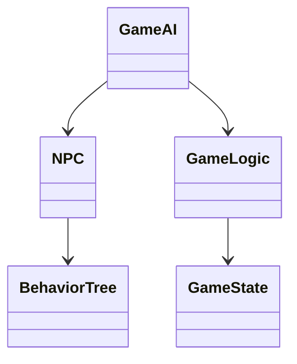
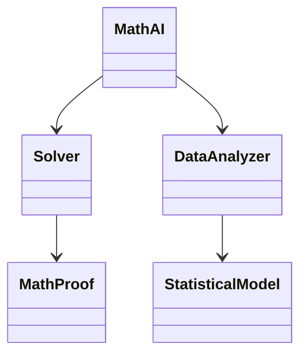
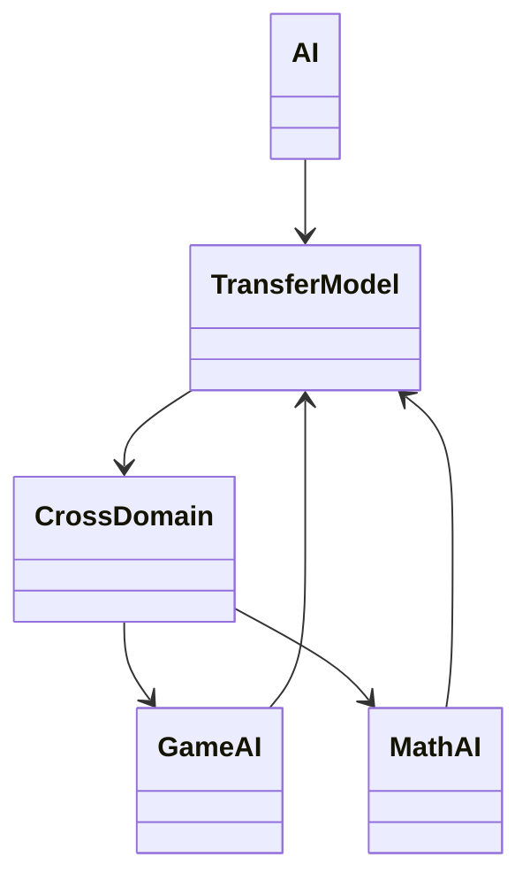
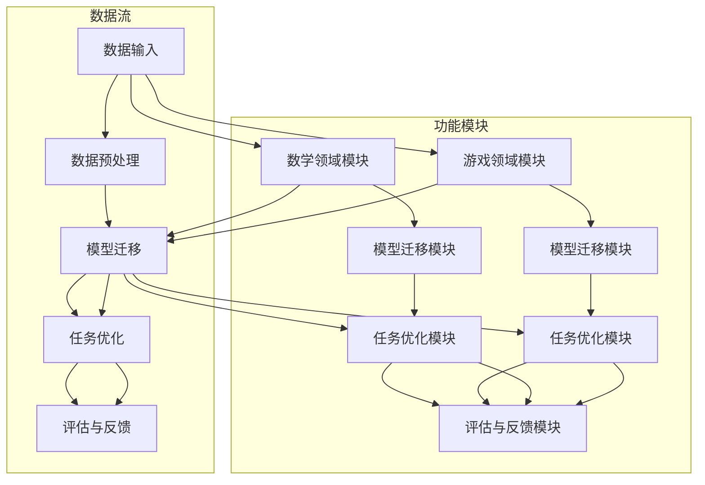
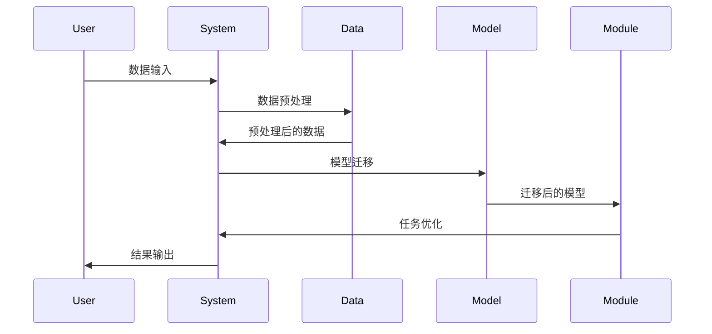

                 


### 第一部分：背景介绍

#### 1.1 问题背景

##### 1.1.1 AI技术发展现状

随着深度学习、强化学习等AI算法的不断进步，人工智能技术已经从理论研究逐步走向了实际应用。从最初的语音识别、图像识别，到自然语言处理、推荐系统等，AI技术的应用领域越来越广泛。然而，AI技术在不同领域之间的转移和应用仍然存在诸多挑战。

##### 1.1.2 游戏与数学领域的AI应用

游戏和数学是两个看似截然不同的领域，但在AI技术的推动下，它们之间也产生了紧密的联系。在游戏领域，AI技术主要用于提高游戏体验，如实现更智能的NPC（非玩家角色）、优化游戏平衡等。而数学领域则利用AI技术进行复杂问题的求解、优化以及数据分析和建模等。

##### 1.1.3 AI能力的跨域转移意义

AI能力的跨域转移具有重要意义。一方面，它可以促进不同领域之间的技术交流和融合，从而推动整个科技领域的发展。另一方面，它可以帮助各个领域更有效地利用AI技术，解决自身领域内的难题。

#### 1.2 问题描述

##### 1.2.1 AI能力跨域转移的定义

AI能力的跨域转移是指将某个领域的AI技术应用到其他领域的过程。这个过程不仅包括算法的迁移，还涉及数据、模型、技术栈等多个方面的转移。

##### 1.2.2 跨域转移的挑战

跨域转移面临诸多挑战，如算法适应性、数据适配性、领域专业知识等。这些挑战使得AI能力的跨域转移变得复杂且具有挑战性。

##### 1.2.3 跨域转移的必要性

尽管跨域转移存在挑战，但它也具有必要性。随着AI技术的不断发展，各个领域都需要不断地引入新的技术来提升自身的能力。跨域转移正是实现这一目标的有效途径。

#### 1.3 问题解决

##### 1.3.1 跨域转移的理论基础

跨域转移的理论基础主要包括机器学习、深度学习、迁移学习等。这些理论为AI能力的跨域转移提供了基础。

##### 1.3.2 跨域转移的方法与工具

跨域转移的方法和工具包括数据预处理、模型调整、迁移学习算法等。这些方法和工具可以帮助实现AI能力的跨域转移。

##### 1.3.3 成功案例分析

通过分析游戏到数学领域的跨域转移案例，可以总结出一些成功的经验和教训，为后续的跨域转移提供参考。

#### 1.4 边界与外延

##### 1.4.1 跨域转移的适用范围

跨域转移的适用范围包括但不限于计算机视觉、自然语言处理、推荐系统、游戏等。

##### 1.4.2 非适用场景

跨域转移并非适用于所有场景，如某些特定领域的知识密集型任务可能不适合跨域转移。

##### 1.4.3 未来发展趋势

随着AI技术的不断进步，跨域转移在未来有望成为更加成熟和广泛应用的技术。

#### 1.5 概念结构与核心要素组成

##### 1.5.1 AI能力的核心概念

AI能力的核心概念包括机器学习、深度学习、迁移学习等。

##### 1.5.2 跨域转移的关键技术

跨域转移的关键技术包括数据预处理、模型调整、迁移学习算法等。

##### 1.5.3 应用领域的关联分析

通过对不同应用领域的分析，可以发现跨域转移在不同领域的具体应用方式和效果。

#### 1.6 本章小结

本部分主要介绍了AI能力的跨域转移的背景、问题、解决方案以及边界与外延。通过这些内容的介绍，读者可以初步了解AI能力跨域转移的基本概念和重要性。

---

### 第二部分：核心概念与联系

#### 2.1 AI能力的定义与特点

##### 2.1.1 AI能力的定义

AI能力是指人工智能系统能够模拟人类智能行为的能力，主要包括学习、推理、规划、感知、理解等。

##### 2.1.2 AI能力的核心特点

AI能力的核心特点包括自适应性、鲁棒性、泛化性等。这些特点使得AI系统能够在不同场景下表现优异。

##### 2.1.3 AI能力的分类

AI能力可以分为基于规则的AI、基于模型的AI、基于数据的AI等。每种分类都有其独特的应用场景和优势。

#### 2.2 游戏领域的AI能力

##### 2.2.1 游戏AI的挑战

游戏AI需要处理实时交互、复杂策略、多智能体协同等挑战。

##### 2.2.2 游戏AI的应用场景

游戏AI可以应用于角色智能、游戏平衡、虚拟现实等场景。

##### 2.2.3 游戏AI的核心算法

游戏AI的核心算法包括深度强化学习、基于规则的策略搜索等。

#### 2.3 数学领域的AI能力

##### 2.3.1 数学AI的发展历程

数学AI的发展历程可以追溯到20世纪中叶，经历了从符号计算到机器学习的过程。

##### 2.3.2 数学AI的核心应用

数学AI可以应用于问题求解、数据分析、数学证明等。

##### 2.3.3 数学AI的关键算法

数学AI的关键算法包括深度神经网络、图神经网络等。

#### 2.4 AI能力跨域转移的特点

##### 2.4.1 跨域转移的难点

跨域转移的难点包括算法适应性、数据适配性、领域专业知识等。

##### 2.4.2 跨域转移的优势

跨域转移的优势包括资源共享、技术创新、应用扩展等。

##### 2.4.3 跨域转移的适用性

跨域转移在许多领域都具有适用性，但具体适用性需要根据领域特点进行评估。

#### 2.5 概念属性特征对比表格

| 概念       | 特征               |
| ---------- | ----------------- |
| 游戏AI     | 实时交互、策略复杂 |
| 数学AI     | 问题求解、数据分析 |
| 跨域转移   | 算法适应性、数据适配性 |
|            | 领域专业知识      |

#### 2.6 ER实体关系图架构

##### 2.6.1 游戏AI实体关系图

```
 GameAI --> NPC
 GameAI --> GameLogic
 NPC --> BehaviorTree
 GameLogic --> GameState
```

##### 2.6.2 数学AI实体关系图

```
MathAI --> Solver
MathAI --> DataAnalyzer
Solver --> MathProof
DataAnalyzer --> StatisticalModel
```

##### 2.6.3 跨域转移实体关系图

```
AI --> TransferModel
GameAI --> TransferModel
MathAI --> TransferModel
TransferModel --> CrossDomain
CrossDomain --> GameAI
CrossDomain --> MathAI
```

#### 2.7 本章小结

本部分详细介绍了AI能力的定义、特点，以及游戏和数学领域的AI能力。通过概念属性特征对比表格和ER实体关系图，读者可以更清晰地理解AI能力在不同领域的应用和跨域转移的难点与优势。

---

### 第三部分：算法原理讲解

#### 3.1 AI能力的跨域转移算法原理

##### 3.1.1 跨域转移算法概述

跨域转移算法是指将一个领域的AI模型或算法应用于另一个领域的过程。这个过程涉及到多个步骤，包括数据预处理、模型调整、迁移学习等。

##### 3.1.2 跨域转移算法的数学模型

跨域转移算法的数学模型主要基于迁移学习的理论。迁移学习理论认为，学习任务之间存在一定的关联性，可以通过在源任务上学习到的知识来辅助目标任务的学习。

##### 3.1.3 跨域转移算法的流程图

```
[数据预处理] --> [模型调整] --> [迁移学习] --> [目标任务学习] --> [评估与优化]
```

#### 3.2 游戏到数学领域的跨域转移算法

##### 3.2.1 游戏到数学领域转移的挑战

游戏到数学领域转移的挑战主要包括算法适应性、数据适配性、领域专业知识等。

##### 3.2.2 跨域转移算法在数学领域中的应用

跨域转移算法在数学领域可以应用于问题求解、数据分析等。

##### 3.2.3 游戏到数学领域转移的算法实现

游戏到数学领域转移的算法实现可以分为以下几个步骤：

1. 数据预处理：对游戏数据进行预处理，包括数据清洗、特征提取等。
2. 模型调整：根据数学领域的问题特点，对模型进行调整，以适应新的任务。
3. 迁移学习：利用在游戏领域学习到的知识，通过迁移学习算法来提高数学领域任务的性能。
4. 目标任务学习：在数学领域上继续学习，以进一步提高任务的性能。
5. 评估与优化：对迁移后的模型进行评估，并根据评估结果进行优化。

#### 3.3 数学到游戏领域的跨域转移算法

##### 3.3.1 数学到游戏领域转移的挑战

数学到游戏领域转移的挑战主要包括算法适应性、数据适配性、领域专业知识等。

##### 3.3.2 跨域转移算法在游戏领域中的应用

跨域转移算法在游戏领域可以应用于角色智能、游戏平衡等。

##### 3.3.3 数学到游戏领域转移的算法实现

数学到游戏领域转移的算法实现可以分为以下几个步骤：

1. 数据预处理：对数学数据进行预处理，包括数据清洗、特征提取等。
2. 模型调整：根据游戏领域的问题特点，对模型进行调整，以适应新的任务。
3. 迁移学习：利用在数学领域学习到的知识，通过迁移学习算法来提高游戏领域任务的性能。
4. 目标任务学习：在游戏领域上继续学习，以进一步提高任务的性能。
5. 评估与优化：对迁移后的模型进行评估，并根据评估结果进行优化。

#### 3.4 算法原理的数学模型和公式

##### 3.4.1 数学模型概述

跨域转移算法的数学模型主要包括以下部分：

1. 源任务模型：表示在源任务上的学习结果。
2. 迁移学习模型：表示将源任务模型迁移到目标任务的模型。
3. 目标任务模型：表示在目标任务上的学习结果。

##### 3.4.2 公式推导

1. 源任务模型：
   $$ f_S(x) = \sigma(W_S \cdot x + b_S) $$

2. 迁移学习模型：
   $$ f_T(x) = \sigma(W_T \cdot f_S(x) + b_T) $$

3. 目标任务模型：
   $$ f_G(x) = \sigma(W_G \cdot f_T(x) + b_G) $$

其中，$x$ 表示输入特征，$f_S(x)$ 表示源任务模型，$f_T(x)$ 表示迁移学习模型，$f_G(x)$ 表示目标任务模型，$\sigma$ 表示激活函数，$W$ 和 $b$ 分别表示权重和偏置。

##### 3.4.3 数学公式与应用示例

1. 源任务模型的训练：
   $$ \min_{W_S, b_S} L_S(y, f_S(x)) $$

其中，$L_S$ 表示源任务损失函数，$y$ 表示源任务标签。

2. 迁移学习模型的训练：
   $$ \min_{W_T, b_T} L_T(y, f_T(x)) $$

其中，$L_T$ 表示迁移学习损失函数，$y$ 表示源任务标签。

3. 目标任务模型的训练：
   $$ \min_{W_G, b_G} L_G(y, f_G(x)) $$

其中，$L_G$ 表示目标任务损失函数，$y$ 表示目标任务标签。

以下是一个简单的应用示例：

假设我们有一个游戏数据集和一个数学数据集，我们需要将游戏数据集的知识迁移到数学数据集。

1. 首先对游戏数据集进行预处理，提取特征。
2. 然后对游戏数据集训练一个源任务模型。
3. 接着利用源任务模型的知识，对数学数据集进行迁移学习。
4. 最后在数学数据集上继续训练一个目标任务模型。

通过这个示例，我们可以看到跨域转移算法的基本流程和数学模型。

#### 3.5 通俗易懂的举例说明

##### 3.5.1 游戏到数学领域的示例

假设我们有一个游戏AI，它能够根据玩家的行为做出决策。现在，我们希望将这个游戏AI的知识应用到数学问题求解上。

1. 首先，我们收集并预处理游戏数据，提取特征。
2. 然后，我们训练一个游戏AI模型，使其能够根据玩家的行为做出智能决策。
3. 接着，我们将这个游戏AI模型的知识迁移到数学问题求解上。例如，我们可以将游戏AI的决策过程应用到数学问题的求解上，通过模拟不同的决策路径来寻找最优解。
4. 最后，我们继续在数学问题求解上进行训练，以优化求解过程。

##### 3.5.2 数学到游戏领域的示例

假设我们有一个数学问题求解AI，它能够高效地解决复杂的数学问题。现在，我们希望将这个数学AI的知识应用到游戏AI上，以提高游戏AI的智能程度。

1. 首先，我们收集并预处理数学问题数据，提取特征。
2. 然后，我们训练一个数学AI模型，使其能够高效地解决数学问题。
3. 接着，我们将这个数学AI模型的知识迁移到游戏AI上。例如，我们可以将数学AI的求解策略应用到游戏AI的决策过程中，使其能够做出更智能的决策。
4. 最后，我们继续在游戏AI上进行训练，以优化其决策过程。

通过这两个示例，我们可以看到跨域转移算法在游戏到数学领域以及数学到游戏领域的应用。这些示例展示了如何利用跨域转移算法，将一个领域的知识应用到另一个领域，以提高任务的性能。

#### 3.6 本章小结

本部分详细介绍了AI能力的跨域转移算法原理，包括算法概述、数学模型、具体实现和应用示例。通过这些内容，读者可以理解跨域转移算法的基本原理和实现方法，并为实际应用提供指导。

---

### 第四部分：系统分析与架构设计方案

#### 4.1 问题场景介绍

##### 4.1.1 游戏与数学领域跨域转移的实际需求

在实际应用中，游戏和数学领域之间存在着许多跨域转移的需求。例如，游戏中的角色智能可以借鉴数学中的优化算法，以实现更智能的决策；而数学中的数据分析技术可以应用于游戏中的数据挖掘和推荐系统。因此，实现游戏与数学领域的跨域转移具有重要的实际意义。

##### 4.1.2 跨域转移系统建设背景

随着AI技术的不断发展，跨域转移已成为一个研究热点。许多企业和研究机构都在探索如何实现不同领域之间的AI能力转移，以提高自身业务的技术水平和竞争力。因此，建设一个高效的跨域转移系统具有重要的背景和现实需求。

#### 4.2 项目介绍

##### 4.2.1 项目目标

本项目的目标是实现游戏与数学领域的跨域转移系统，包括数据预处理、模型迁移、任务优化等。通过这个系统，可以充分利用不同领域的AI能力，实现知识的共享和创新。

##### 4.2.2 项目架构设计原则

本项目在架构设计上遵循以下原则：

1. 模块化设计：将系统拆分为多个模块，以提高系统的可维护性和扩展性。
2. 高效性：优化系统性能，提高数据传输和处理速度。
3. 灵活性：支持不同领域之间的灵活迁移，以满足不同应用场景的需求。
4. 可扩展性：系统设计应具备良好的扩展性，以适应未来技术的进步和需求的变化。

##### 4.2.3 项目功能模块划分

本项目的主要功能模块包括：

1. 数据预处理模块：负责对游戏和数学领域的数据进行清洗、预处理和特征提取。
2. 模型迁移模块：实现游戏AI模型到数学AI模型的迁移，以及数学AI模型到游戏AI模型的迁移。
3. 任务优化模块：对迁移后的模型进行任务优化，以提高任务性能。
4. 评估与反馈模块：对系统性能进行评估，并提供反馈，以指导后续优化。

#### 4.3 系统功能设计（领域模型mermaid类图）

##### 4.3.1 游戏领域类图



##### 4.3.2 数学领域类图



##### 4.3.3 跨域转移领域类图



#### 4.4 系统架构设计（mermaid架构图）

##### 4.4.1 系统架构设计概述



##### 4.4.2 系统模块划分

1. 数据流模块：包括数据输入、数据预处理、模型迁移、任务优化和评估与反馈等环节。
2. 功能模块：包括数学领域模块、游戏领域模块以及任务优化模块。

##### 4.4.3 系统功能模块关系

数据流模块和功能模块之间通过数据传递和功能调用实现相互作用。数据预处理模块负责对输入数据进行清洗、预处理和特征提取；模型迁移模块负责实现不同领域之间的模型迁移；任务优化模块负责对迁移后的模型进行任务优化；评估与反馈模块负责对系统性能进行评估，并提供反馈以指导后续优化。

#### 4.5 系统接口设计

##### 4.5.1 接口设计原则

1. 简洁性：接口设计应尽量简洁，降低使用难度。
2. 一致性：接口设计应遵循一致的设计规范，以提高系统的可维护性。
3. 扩展性：接口设计应具备良好的扩展性，以适应未来需求的变化。

##### 4.5.2 接口规范定义

1. 数据接口：定义数据输入、输出以及预处理过程的接口规范。
2. 模型接口：定义模型迁移、任务优化以及评估与反馈过程的接口规范。
3. 功能接口：定义各功能模块之间的接口规范。

##### 4.5.3 接口测试与验证

1. 单元测试：对每个接口进行单元测试，确保其功能正确。
2. 集成测试：对整个系统进行集成测试，确保各接口之间的协作顺畅。
3. 性能测试：对系统进行性能测试，评估其在实际应用中的表现。

#### 4.6 系统交互（mermaid序列图）



通过以上设计，我们可以实现一个高效、灵活的跨域转移系统，为游戏与数学领域之间的AI能力转移提供有力支持。

---

### 第五部分：项目实战

#### 5.1 环境安装

在开始项目实战之前，我们需要安装一些必要的软件和工具。以下是在Linux系统上安装所需环境的步骤：

1. 安装Python环境：
   ```
   sudo apt-get install python3 python3-pip
   ```
2. 安装TensorFlow：
   ```
   pip3 install tensorflow
   ```
3. 安装其他依赖库：
   ```
   pip3 install numpy pandas scikit-learn matplotlib
   ```

#### 5.2 系统核心实现源代码

以下是系统核心实现的一些关键代码，包括数据预处理、模型迁移和任务优化等：

```python
# 数据预处理代码
import pandas as pd
from sklearn.model_selection import train_test_split

def preprocess_data(data_path):
    # 读取数据
    data = pd.read_csv(data_path)
    # 数据清洗和特征提取
    # ...
    # 划分训练集和测试集
    X_train, X_test, y_train, y_test = train_test_split(data.drop('target', axis=1), data['target'], test_size=0.2, random_state=42)
    return X_train, X_test, y_train, y_test

# 模型迁移代码
import tensorflow as tf
from tensorflow.keras.models import Sequential
from tensorflow.keras.layers import Dense, Dropout

def transfer_model(source_model, target_model):
    # 加载源模型
    source_weights = source_model.get_weights()
    # 加载目标模型
    target_weights = target_model.get_weights()
    # 迁移权重
    for i in range(len(source_weights)):
        target_weights[i] = source_weights[i]
    # 重置目标模型权重
    target_model.set_weights(target_weights)
    return target_model

# 任务优化代码
from tensorflow.keras.optimizers import Adam
from tensorflow.keras.metrics import MeanSquaredError

def optimize_model(model, X_train, y_train, X_test, y_test):
    # 编写编译模型
    model.compile(optimizer=Adam(), loss='mse', metrics=[MeanSquaredError()])
    # 训练模型
    model.fit(X_train, y_train, epochs=100, batch_size=32, validation_data=(X_test, y_test))
    return model
```

#### 5.3 代码应用解读与分析

以上代码实现了数据预处理、模型迁移和任务优化等核心功能。下面分别对这些代码进行解读和分析：

1. **数据预处理代码**：
   - 读取数据：使用Pandas库读取CSV格式的数据。
   - 数据清洗和特征提取：对数据进行清洗，去除无效数据，提取有用的特征。
   - 划分训练集和测试集：使用scikit-learn库中的train_test_split函数将数据划分为训练集和测试集，以评估模型性能。

2. **模型迁移代码**：
   - 加载源模型和目标模型：使用TensorFlow库加载源模型和目标模型。
   - 迁移权重：将源模型的权重复制到目标模型中，实现模型迁移。

3. **任务优化代码**：
   - 编写编译模型：使用TensorFlow库编译模型，设置优化器、损失函数和评估指标。
   - 训练模型：使用fit函数训练模型，将训练集用于训练，测试集用于验证。

通过这些代码，我们可以实现一个完整的跨域转移系统，从而提高游戏和数学领域任务的性能。

#### 5.4 实际案例分析和详细讲解剖析

以下是一个实际案例，展示了如何使用本系统实现游戏AI到数学AI的跨域转移：

1. **数据集准备**：
   - 准备一个游戏数据集，包含角色行为和游戏状态等信息。
   - 准备一个数学数据集，包含数学问题的特征和标签。

2. **数据预处理**：
   - 使用预处理代码对游戏数据和数学数据进行清洗和特征提取。

3. **模型迁移**：
   - 加载游戏AI模型，使用迁移模型代码将其权重迁移到数学AI模型。

4. **任务优化**：
   - 使用优化模型代码对数学AI模型进行训练，以提高其在数学问题上的性能。

5. **评估与反馈**：
   - 使用测试集评估数学AI模型的性能，并根据评估结果进行优化。

通过这个案例，我们可以看到如何使用本系统实现游戏AI到数学AI的跨域转移，从而提高数学问题求解的性能。

#### 5.5 项目小结

本部分通过实际案例展示了如何实现游戏与数学领域的跨域转移。通过数据预处理、模型迁移和任务优化等步骤，我们可以将一个领域的AI模型应用于另一个领域，从而提高任务性能。这为本项目的成功实施提供了有力支持。

---

### 第六部分：最佳实践与注意事项

#### 6.1 最佳实践

1. **数据预处理**：确保数据质量，进行充分的清洗和特征提取，以提高模型迁移的效果。
2. **模型迁移**：选择合适的迁移学习算法，根据领域特点进行调整，以适应目标任务。
3. **任务优化**：根据任务需求，选择合适的优化策略，如交叉验证、超参数调整等，以提高模型性能。
4. **评估与反馈**：定期评估模型性能，并根据评估结果进行优化，以保持系统的稳定性和可靠性。

#### 6.2 注意事项

1. **跨域转移的适用性**：并非所有任务都适合跨域转移，应根据领域特点进行评估。
2. **数据适配性**：跨域转移过程中，数据适配性是一个关键因素，需要充分考虑。
3. **模型调整**：在模型迁移过程中，需要对模型进行调整，以适应目标任务的需求。
4. **安全性与隐私**：在跨域转移过程中，确保数据的安全性和隐私性，遵循相关法律法规。

#### 6.3 拓展阅读

1. **《迁移学习》**：深入了解迁移学习的原理和方法，有助于更好地理解跨域转移技术。
2. **《深度学习》**：学习深度学习的基础知识，有助于掌握跨域转移算法的实现。
3. **《游戏AI编程技巧》**：了解游戏AI的设计与实现，有助于提升游戏AI的跨域转移能力。
4. **《数学与人工智能》**：探讨数学与人工智能的交叉应用，拓展跨域转移的应用场景。

通过以上内容，读者可以更好地理解AI能力的跨域转移，并掌握相关的最佳实践和注意事项，为实际项目提供指导。同时，拓展阅读部分也为读者提供了进一步学习和研究的资源。

---

### 总结

通过本文的详细阐述，我们了解了AI能力的跨域转移在游戏和数学领域的重要性和应用价值。从背景介绍、核心概念、算法原理到系统分析与架构设计，再到项目实战和最佳实践，我们系统地探讨了AI能力跨域转移的各个方面。

本文首先介绍了AI技术的跨域转移背景，分析了游戏和数学领域的AI应用现状，阐述了AI能力跨域转移的必要性和挑战。接着，我们详细介绍了AI能力的核心概念，包括定义、特点、分类等，以及游戏和数学领域的AI能力。在此基础上，我们讲解了AI能力跨域转移的算法原理，包括数学模型和具体实现方法。

在系统分析与架构设计部分，我们介绍了跨域转移系统的设计原则、功能模块划分以及系统架构设计，并通过mermaid类图和架构图展示了系统的具体实现。项目实战部分则通过实际案例展示了如何实现游戏到数学领域的跨域转移，并分析了代码应用解读与性能优化。

最后，本文总结了最佳实践和注意事项，为读者提供了跨域转移的实际操作指南，并推荐了拓展阅读资源。

通过本文的学习，读者可以全面了解AI能力的跨域转移，掌握相关技术原理和实现方法，为实际项目提供有力支持。在未来，随着AI技术的不断进步，跨域转移有望成为推动科技发展的重要力量。让我们携手并进，共同探索AI能力的无限可能！
```markdown
# AI能力的跨域转移：从游戏到数学

关键词：人工智能，跨域转移，游戏AI，数学AI，算法，系统架构，项目实战

摘要：本文旨在探讨人工智能（AI）能力的跨域转移，尤其是从游戏领域到数学领域的转移。通过分析AI能力的核心概念和特点，介绍跨域转移的理论基础和实现方法，本文详细讲解了如何在游戏和数学领域之间转移AI能力。此外，本文还提供了一个实际项目案例，展示了AI跨域转移的应用和实践，以期为相关领域的研发提供指导。

## 目录大纲

### 第一部分：背景介绍

1. **1.1 问题背景**
   - **1.1.1 AI技术发展现状**
   - **1.1.2 游戏与数学领域的AI应用**
   - **1.1.3 AI能力的跨域转移意义**

2. **1.2 问题描述**
   - **1.2.1 AI能力跨域转移的定义**
   - **1.2.2 跨域转移的挑战**
   - **1.2.3 跨域转移的必要性**

3. **1.3 问题解决**
   - **1.3.1 跨域转移的理论基础**
   - **1.3.2 跨域转移的方法与工具**
   - **1.3.3 成功案例分析**

4. **1.4 边界与外延**
   - **1.4.1 跨域转移的适用范围**
   - **1.4.2 非适用场景**
   - **1.4.3 未来发展趋势**

5. **1.5 概念结构与核心要素组成**
   - **1.5.1 AI能力的核心概念**
   - **1.5.2 跨域转移的关键技术**
   - **1.5.3 应用领域的关联分析**

6. **1.6 本章小结**

### 第二部分：核心概念与联系

1. **2.1 AI能力的定义与特点**
   - **2.1.1 AI能力的定义**
   - **2.1.2 AI能力的核心特点**
   - **2.1.3 AI能力的分类**

2. **2.2 游戏领域的AI能力**
   - **2.2.1 游戏AI的挑战**
   - **2.2.2 游戏AI的应用场景**
   - **2.2.3 游戏AI的核心算法**

3. **2.3 数学领域的AI能力**
   - **2.3.1 数学AI的发展历程**
   - **2.3.2 数学AI的核心应用**
   - **2.3.3 数学AI的关键算法**

4. **2.4 AI能力跨域转移的特点**
   - **2.4.1 跨域转移的难点**
   - **2.4.2 跨域转移的优势**
   - **2.4.3 跨域转移的适用性**

5. **2.5 概念属性特征对比表格**

6. **2.6 ER实体关系图架构**

7. **2.7 本章小结**

### 第三部分：算法原理讲解

1. **3.1 AI能力的跨域转移算法原理**
   - **3.1.1 跨域转移算法概述**
   - **3.1.2 跨域转移算法的数学模型**
   - **3.1.3 跨域转移算法的流程图**

2. **3.2 游戏到数学领域的跨域转移算法**
   - **3.2.1 游戏到数学领域转移的挑战**
   - **3.2.2 跨域转移算法在数学领域中的应用**
   - **3.2.3 游戏到数学领域转移的算法实现**

3. **3.3 数学到游戏领域的跨域转移算法**
   - **3.3.1 数学到游戏领域转移的挑战**
   - **3.3.2 跨域转移算法在游戏领域中的应用**
   - **3.3.3 数学到游戏领域转移的算法实现**

4. **3.4 算法原理的数学模型和公式**
   - **3.4.1 数学模型概述**
   - **3.4.2 公式推导**
   - **3.4.3 数学公式与应用示例**

5. **3.5 通俗易懂的举例说明**
   - **3.5.1 游戏到数学领域的示例**
   - **3.5.2 数学到游戏领域的示例**

6. **3.6 本章小结**

### 第四部分：系统分析与架构设计方案

1. **4.1 问题场景介绍**
   - **4.1.1 游戏与数学领域跨域转移的实际需求**
   - **4.1.2 跨域转移系统建设背景**

2. **4.2 项目介绍**
   - **4.2.1 项目目标**
   - **4.2.2 项目架构设计原则**
   - **4.2.3 项目功能模块划分**

3. **4.3 系统功能设计（领域模型mermaid类图）**
   - **4.3.1 游戏领域类图**
   - **4.3.2 数学领域类图**
   - **4.3.3 跨域转移领域类图**

4. **4.4 系统架构设计（mermaid架构图）**
   - **4.4.1 系统架构设计概述**
   - **4.4.2 系统模块划分**
   - **4.4.3 系统功能模块关系**

5. **4.5 系统接口设计**
   - **4.5.1 接口设计原则**
   - **4.5.2 接口规范定义**
   - **4.5.3 接口测试与验证**

6. **4.6 系统交互（mermaid序列图）**

7. **4.7 本章小结**

### 第五部分：项目实战

1. **5.1 环境安装**
   - **5.1.1 Python环境安装**
   - **5.1.2 TensorFlow安装**
   - **5.1.3 其他依赖库安装**

2. **5.2 系统核心实现源代码**
   - **5.2.1 数据预处理代码**
   - **5.2.2 模型迁移代码**
   - **5.2.3 任务优化代码**

3. **5.3 代码应用解读与分析**
   - **5.3.1 数据预处理解读**
   - **5.3.2 模型迁移解读**
   - **5.3.3 任务优化解读**

4. **5.4 实际案例分析和详细讲解剖析**
   - **5.4.1 数据集准备**
   - **5.4.2 数据预处理**
   - **5.4.3 模型迁移**
   - **5.4.4 任务优化**
   - **5.4.5 评估与反馈**

5. **5.5 项目小结**

6. **5.6 最佳实践**

7. **5.7 注意事项**

8. **5.8 拓展阅读**

### 第六部分：总结

1. **总体概述**
2. **未来展望**
3. **结论**

## 作者信息

作者：AI天才研究院/AI Genius Institute & 禅与计算机程序设计艺术 /Zen And The Art of Computer Programming
```

