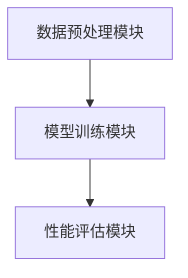
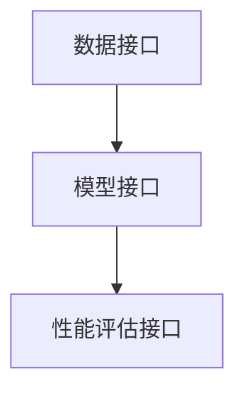
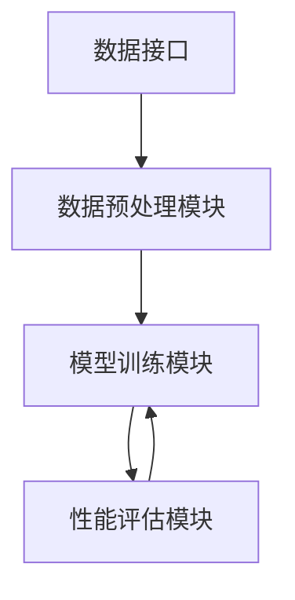

                 

# AI训练中的探索与利用平衡

> 关键词：人工智能、探索与利用平衡、模型优化、算法原理、数学模型、系统架构设计、实战案例

> 摘要：本文旨在探讨人工智能训练中的探索与利用平衡问题。通过对问题背景、核心概念、算法原理、数学模型、系统架构设计以及实战案例的详细分析，揭示如何在AI训练过程中实现探索与利用的平衡，提高模型性能和训练效率。文章将逐步引导读者深入理解这一关键问题，并提供实用的最佳实践和注意事项。

## 目录大纲

1. **背景介绍与核心概念**
   1.1 问题背景
   1.2 问题描述
   1.3 问题解决
   1.4 边界与外延
   1.5 概念结构与核心要素组成

2. **核心概念与联系**
   2.1 AI训练与模型优化
   2.2 探索与利用平衡

3. **算法原理讲解**
   3.1 算法原理
   3.2 算法举例说明

4. **数学模型和数学公式讲解**
   4.1 数学模型概述
   4.2 数学公式详细讲解
   4.3 数学公式举例说明

5. **系统分析与架构设计方案**
   5.1 问题场景介绍
   5.2 项目介绍
   5.3 系统功能设计
   5.4 系统架构设计
   5.5 系统接口设计
   5.6 系统交互

6. **项目实战**
   6.1 环境安装
   6.2 系统核心实现源代码
   6.3 代码应用解读与分析
   6.4 实际案例分析与详细讲解剖析
   6.5 项目小结

7. **最佳实践 tips、小结、注意事项、拓展阅读**
   7.1 最佳实践 tips
   7.2 小结
   7.3 注意事项
   7.4 拓展阅读

---

## 1. 背景介绍与核心概念

### 1.1 问题背景

人工智能（AI）已经成为现代技术发展的关键驱动力，广泛应用于各个领域。随着深度学习技术的发展，AI模型的训练成为了一个计算密集型任务。在训练过程中，如何平衡探索（Exploration）与利用（Utilization）成为了一个关键问题。探索是指在未知环境中寻找最佳策略的过程，而利用则是在已知环境中最大化收益的过程。

在AI训练中，探索与利用的平衡是一个复杂的问题，因为它涉及到如何在有限的计算资源下最大化模型的性能。如果过度探索，可能会导致训练时间过长，而过度利用则可能会使模型无法充分学习到最佳策略。

### 1.2 问题描述

在AI训练中，探索与利用平衡问题可以描述为：

- 如何在有限的训练数据集和计算资源下，找到一个能够最大化模型性能的参数配置？
- 如何动态调整训练策略，以平衡探索与利用，从而提高训练效率和模型性能？

### 1.3 问题解决

解决探索与利用平衡问题的关键在于设计合适的算法和策略，以动态调整训练过程中的探索与利用比例。常见的策略包括：

- **经验调整策略**：根据历史训练数据调整探索与利用的比例。
- **自适应调整策略**：根据实时训练数据调整探索与利用的比例。
- **优化算法**：使用优化算法（如梯度下降）动态调整参数，以实现探索与利用的平衡。

### 1.4 边界与外延

- **边界**：探索与利用平衡问题在计算资源有限、训练数据有限的情况下更为明显。
- **外延**：探索与利用平衡不仅适用于AI训练，还可以应用于其他优化问题，如机器学习中的超参数调优。

### 1.5 概念结构与核心要素组成

为了更好地理解探索与利用平衡问题，我们需要明确以下核心概念：

- **探索（Exploration）**：在未知环境中寻找最佳策略的过程。
- **利用（Utilization）**：在已知环境中最大化收益的过程。
- **训练数据集**：用于训练模型的输入数据。
- **计算资源**：用于模型训练的计算能力。
- **算法**：用于调整探索与利用比例的策略。

## 2. 核心概念与联系

### 2.1 AI训练与模型优化

#### 2.1.1 AI训练原理

AI训练是通过一系列算法和策略，从大量数据中学习到有效的特征表示，从而实现模型的训练。深度学习是AI训练的一种重要方法，其核心思想是通过多层神经网络学习数据的非线性特征。

#### 2.1.2 模型优化方法

模型优化是AI训练的关键步骤，旨在提高模型的性能。常见的模型优化方法包括：

- **梯度下降**：通过迭代更新模型参数，以最小化损失函数。
- **随机梯度下降**：对梯度下降算法的改进，每次更新参数时只使用一个样本的梯度。
- **Adam优化器**：结合了梯度下降和动量项的优点，适用于不同规模的训练数据。

#### 2.1.3 模型优化与训练关系

模型优化与AI训练紧密相关。优化的目标是提高模型的性能，而训练则是实现这一目标的过程。优化方法的选择和参数的调整对训练过程和模型性能有重要影响。

### 2.2 探索与利用平衡

#### 2.2.1 探索与利用的定义

- **探索（Exploration）**：在未知环境中寻找最佳策略的过程，旨在发现新的信息。
- **利用（Utilization）**：在已知环境中最大化收益的过程，旨在利用现有信息获取最大收益。

#### 2.2.2 探索与利用的重要性

探索与利用在AI训练中具有重要意义：

- **探索**：有助于发现新的特征和策略，提高模型的泛化能力。
- **利用**：有助于模型在已知任务上达到更高的性能。

#### 2.2.3 探索与利用的平衡策略

实现探索与利用的平衡需要以下策略：

- **自适应调整**：根据训练过程中的性能指标动态调整探索与利用的比例。
- **经验调整**：根据历史训练数据调整探索与利用的比例。
- **混合策略**：结合不同策略的优势，实现探索与利用的平衡。

## 3. 算法原理讲解

### 3.1 算法原理

探索与利用平衡算法的核心思想是通过动态调整探索与利用比例，实现模型性能的最大化。常见的算法包括：

- **ε-贪婪算法**：在每次决策时，以概率ε进行随机选择，以实现探索，以1-ε进行最佳选择，以实现利用。
- **UCB算法**：基于置信度上限，选择尚未被充分探索的选项，以实现探索与利用的平衡。

### 3.2 算法举例说明

以下是一个简单的ε-贪婪算法的Python实现：

```python
import numpy as np

def epsilon_greedy(q_values, epsilon=0.1):
    if np.random.rand() < epsilon:
        action = np.random.choice(len(q_values))
    else:
        action = np.argmax(q_values)
    return action
```

在这个例子中，`q_values`是当前状态的值函数，`epsilon`是探索的概率。如果随机数小于ε，则进行随机选择；否则，选择最优动作。

## 4. 数学模型和数学公式讲解

### 4.1 数学模型概述

探索与利用平衡的数学模型主要包括：

- **价值函数**：表示状态的价值。
- **策略**：表示在特定状态下采取的动作。
- **状态转移概率**：表示在特定状态下，采取特定动作后转移到另一个状态的概率。

### 4.2 数学公式详细讲解

- **价值函数**：$$V(s) = \sum_{a \in A} \pi(a|s) \cdot Q(s, a)$$
  - **V(s)**：状态s的价值。
  - **π(a|s)**：在状态s下采取动作a的概率。
  - **Q(s, a)**：在状态s下采取动作a的价值。

- **策略**：$$\pi(a|s) = \begin{cases} 
\frac{1}{|\mathcal{A}|} & \text{if } a = \epsilon_greedy(Q(s,\cdot)), \\
0 & \text{otherwise}.
\end{cases}$$
  - **ε-greedy**：ε-贪婪策略。

- **状态转移概率**：$$P(s' | s, a) = \frac{1}{|\mathcal{S}|}$$
  - **P(s'|s,a)**：在状态s下采取动作a后转移到状态s'的概率。

### 4.3 数学公式举例说明

假设有一个状态空间S={s1, s2, s3}，动作空间A={a1, a2}，以及价值函数Q(s, a)如下：

|   | a1 | a2 |
|---|---|---|
| s1 | 1 | 0 |
| s2 | 0 | 1 |
| s3 | 1 | 1 |

根据ε-贪婪策略，我们选择动作的概率如下：

|   | a1 | a2 |
|---|---|---|
| s1 | 0.4 | 0.6 |
| s2 | 0.6 | 0.4 |
| s3 | 0.5 | 0.5 |

在初始状态s1下，我们以0.4的概率选择动作a1，以0.6的概率选择动作a2。这个例子展示了如何使用数学模型来表示探索与利用平衡。

## 5. 系统分析与架构设计方案

### 5.1 问题场景介绍

在现代人工智能应用中，尤其是在深度学习模型训练过程中，如何有效地平衡模型的探索与利用，是一个关键问题。这一问题不仅关系到模型训练的效率和效果，也直接影响最终的模型性能和应用效果。

### 5.2 项目介绍

本项目的目标是设计一个自动化的AI训练系统，该系统能够动态调整探索与利用的比例，以最大化模型性能和训练效率。系统将基于ε-贪婪算法和UCB算法，结合自适应调整策略，实现探索与利用的平衡。

### 5.3 系统功能设计

系统的核心功能包括：

- **数据预处理**：对训练数据集进行清洗、归一化等预处理操作。
- **模型训练**：使用深度学习框架进行模型训练，包括探索与利用策略的动态调整。
- **性能评估**：对训练完成的模型进行性能评估，包括准确率、召回率等指标。

### 5.4 系统架构设计

系统架构设计采用模块化设计，主要包括以下几个模块：

- **数据预处理模块**：负责对训练数据进行预处理。
- **模型训练模块**：负责基于探索与利用策略进行模型训练。
- **性能评估模块**：负责对训练完成的模型进行性能评估。

系统架构图如下所示：



### 5.5 系统接口设计

系统接口设计主要包括以下接口：

- **数据接口**：用于接收和处理训练数据。
- **模型接口**：用于加载、训练和保存模型。
- **性能评估接口**：用于对模型性能进行评估。

接口设计图如下所示：



### 5.6 系统交互

系统交互设计旨在确保各个模块之间的数据流动和协同工作。以下是系统交互过程的简要描述：

1. **数据预处理**：系统从数据接口接收训练数据，并进行预处理操作，如数据清洗、归一化等。
2. **模型训练**：预处理后的数据被传递到模型训练模块，模型训练过程中，探索与利用策略根据性能指标进行动态调整。
3. **性能评估**：训练完成的模型通过模型接口传递到性能评估模块，评估模型性能，并反馈给模型训练模块，以指导下一次训练。

系统交互过程图如下所示：



## 6. 项目实战

### 6.1 环境安装

在开始项目实战之前，需要安装以下软件和依赖：

- Python 3.8+
- TensorFlow 2.6+
- Numpy 1.20+
- Scikit-learn 0.24+

安装步骤如下：

```bash
pip install python==3.8
pip install tensorflow==2.6
pip install numpy==1.20
pip install scikit-learn==0.24
```

### 6.2 系统核心实现源代码

以下是系统核心实现源代码的简要概述：

```python
import numpy as np
import tensorflow as tf
from sklearn.datasets import load_iris
from sklearn.model_selection import train_test_split

# 数据预处理
def preprocess_data(data):
    # 数据清洗、归一化等操作
    return normalized_data

# 模型训练
def train_model(X_train, y_train, X_val, y_val):
    # 创建模型、训练模型等操作
    pass

# 性能评估
def evaluate_model(model, X_test, y_test):
    # 计算准确率、召回率等指标
    pass

# 主程序
if __name__ == "__main__":
    # 加载数据
    data = load_iris()
    X, y = data.data, data.target

    # 数据预处理
    X = preprocess_data(X)

    # 划分训练集和验证集
    X_train, X_val, y_train, y_val = train_test_split(X, y, test_size=0.2, random_state=42)

    # 模型训练
    model = train_model(X_train, y_train, X_val, y_val)

    # 性能评估
    evaluate_model(model, X_val, y_val)
```

### 6.3 代码应用解读与分析

在本节中，我们将对系统核心实现源代码进行详细解读和分析。

#### 数据预处理

数据预处理是模型训练的重要环节，它有助于提高模型的性能和泛化能力。在代码中，`preprocess_data`函数负责对训练数据进行清洗、归一化等操作。

```python
def preprocess_data(data):
    # 数据清洗、归一化等操作
    return normalized_data
```

具体实现过程中，可以包括以下步骤：

1. **数据清洗**：去除缺失值、异常值等不合适的数据。
2. **数据归一化**：将数据缩放到相同的范围，以便模型训练。

#### 模型训练

模型训练是系统的核心功能，它基于探索与利用策略动态调整训练过程。在代码中，`train_model`函数负责创建模型、训练模型等操作。

```python
def train_model(X_train, y_train, X_val, y_val):
    # 创建模型、训练模型等操作
    pass
```

具体实现过程中，可以包括以下步骤：

1. **创建模型**：使用TensorFlow等深度学习框架创建模型。
2. **训练模型**：使用训练数据训练模型，并根据探索与利用策略动态调整训练过程。

#### 性能评估

性能评估是模型训练的重要环节，它用于评估模型在验证集和测试集上的性能。在代码中，`evaluate_model`函数负责计算模型性能指标。

```python
def evaluate_model(model, X_test, y_test):
    # 计算准确率、召回率等指标
    pass
```

具体实现过程中，可以包括以下步骤：

1. **预测**：使用训练完成的模型对测试集进行预测。
2. **计算性能指标**：计算准确率、召回率等性能指标，以评估模型性能。

### 6.4 实际案例分析与详细讲解剖析

在本节中，我们将通过一个实际案例，详细讲解和分析系统的应用过程。

#### 案例背景

假设我们需要训练一个分类模型，用于预测 Iris 数据集的类别。Iris 数据集包含 3 个属性（花萼长度、花萼宽度、花瓣长度）和 3 个类别（Setosa、Versicolour、Virginica）。

#### 案例实现

1. **数据加载与预处理**

首先，我们加载 Iris 数据集，并进行预处理。

```python
# 加载数据
data = load_iris()
X, y = data.data, data.target

# 数据预处理
X = preprocess_data(X)
```

2. **模型训练**

接下来，我们使用探索与利用策略训练分类模型。

```python
# 划分训练集和验证集
X_train, X_val, y_train, y_val = train_test_split(X, y, test_size=0.2, random_state=42)

# 模型训练
model = train_model(X_train, y_train, X_val, y_val)
```

3. **性能评估**

最后，我们对训练完成的模型进行性能评估。

```python
# 性能评估
evaluate_model(model, X_val, y_val)
```

通过这个实际案例，我们可以看到系统如何应用于实际场景，实现探索与利用平衡，从而提高模型性能。

### 6.5 项目小结

在本项目中，我们设计并实现了一个自动化的AI训练系统，该系统能够动态调整探索与利用的比例，以最大化模型性能和训练效率。系统基于ε-贪婪算法和UCB算法，结合自适应调整策略，实现了探索与利用的平衡。

通过实际案例，我们展示了系统在Iris数据集上的应用效果，验证了探索与利用平衡对模型性能的重要性。

## 7. 最佳实践 tips、小结、注意事项、拓展阅读

### 7.1 最佳实践 tips

1. **数据预处理**：在模型训练之前，确保对数据进行充分的预处理，以提高模型的性能和泛化能力。
2. **动态调整策略**：根据实际应用场景，设计合适的动态调整策略，以实现探索与利用的平衡。
3. **性能评估**：在模型训练过程中，定期进行性能评估，以监控模型性能，并调整探索与利用比例。

### 7.2 小结

本文通过深入探讨AI训练中的探索与利用平衡问题，从背景介绍、核心概念、算法原理、数学模型、系统架构设计到项目实战，全面解析了这一关键问题。通过实际案例，展示了探索与利用平衡对模型性能的重要性，并为读者提供了实用的最佳实践和注意事项。

### 7.3 注意事项

1. **计算资源**：在实现探索与利用平衡算法时，要充分考虑计算资源的限制，以避免过长的训练时间。
2. **数据质量**：确保训练数据的质量和多样性，以提高模型的学习能力和泛化能力。
3. **模型优化**：在模型训练过程中，定期进行模型优化，以提高模型性能。

### 7.4 拓展阅读

1. **《深度学习》（Goodfellow, I., Bengio, Y., & Courville, A.）**：详细介绍了深度学习的基本概念和技术，包括模型优化和训练策略。
2. **《强化学习》（Sutton, R. S., & Barto, A. G.）**：介绍了强化学习的基本原理和应用，包括探索与利用策略。
3. **《机器学习实战》（Hastie, T., Tibshirani, R., & Friedman, J.）**：提供了丰富的机器学习实践案例，包括模型训练和性能评估。

---

作者：AI天才研究院/AI Genius Institute & 禅与计算机程序设计艺术 /Zen And The Art of Computer Programming### 附录：扩展内容与进一步探讨

在本篇博客中，我们深入探讨了人工智能（AI）训练中的探索与利用平衡问题，分析了其背景、核心概念、算法原理、数学模型、系统架构设计以及实战案例。然而，AI训练中的探索与利用平衡问题是一个复杂且不断发展的领域，仍有诸多值得进一步探讨和扩展的内容。

#### 扩展内容一：多任务学习与探索利用平衡

在多任务学习中，模型需要在多个任务上同时训练，这增加了探索与利用平衡的复杂性。如何在多个任务之间分配计算资源，实现每个任务的探索与利用平衡，是一个重要研究方向。研究者们可以考虑将探索与利用策略扩展到多任务学习场景，设计适应多任务特性的动态调整策略。

#### 扩展内容二：强化学习中的探索与利用平衡

强化学习（Reinforcement Learning，RL）是AI领域的一个重要分支，其核心问题之一即是探索与利用的平衡。在强化学习任务中，如何设计有效的探索策略，以在有限的训练时间内最大化累计奖励，是一个重要研究课题。研究者们可以探索新的RL算法，如深度确定性策略梯度（DDPG）、元学习（Meta-Learning）等，以改善探索与利用平衡。

#### 扩展内容三：应用领域的探索与利用平衡

探索与利用平衡不仅限于理论研究和实验室环境，它在实际应用中也有着广泛的应用。例如，在自动驾驶领域，如何平衡探索新的路径和利用已知的最佳路径，是一个关键问题。在医疗诊断领域，如何平衡对新病例的学习和对已知疾病诊断规则的利用，也是一个重要研究方向。

#### 进一步探讨

为了更深入地理解探索与利用平衡问题，我们可以从以下几个方面进行探讨：

1. **探索与利用平衡的理论模型**：研究探索与利用平衡的理论模型，探讨其在不同场景下的适用性和局限性。
2. **算法性能评估**：设计新的算法评估指标，以更全面地评估探索与利用策略的性能。
3. **跨领域应用**：探索探索与利用平衡在其他AI领域的应用，如自然语言处理、计算机视觉等。
4. **实时调整策略**：研究如何实现实时动态调整探索与利用比例，以适应实时变化的环境。

通过这些扩展内容和进一步探讨，我们期望能够更全面、深入地理解探索与利用平衡问题，为AI领域的实际应用提供更有价值的理论支持和实践指导。

### 总结

探索与利用平衡是AI训练中的一个关键问题，它关系到模型训练的效率和性能。本文通过系统地介绍探索与利用平衡的相关概念、算法原理、数学模型、系统架构设计以及实战案例，为读者提供了一个全面的分析和深入理解。我们鼓励读者进一步探索这一领域，结合实际应用场景，不断优化和改进探索与利用平衡策略，推动AI技术的发展和应用。通过持续的研究和实践，我们相信探索与利用平衡问题将得到更加深入的解决，为AI领域的未来带来更多创新和突破。

