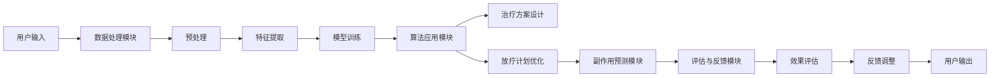
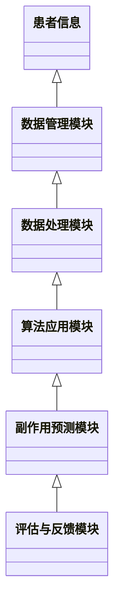
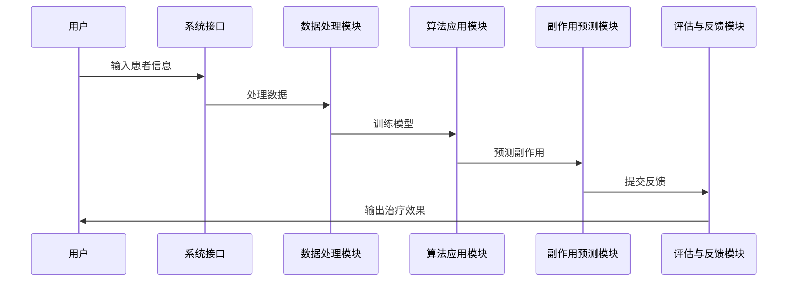

                 

## AI辅助个性化癌症治疗方案设计：从基因组学到放疗规划

### 关键词

- 人工智能
- 癌症治疗
- 个性化医疗
- 基因组学
- 放疗规划

### 摘要

本文探讨了人工智能（AI）在个性化癌症治疗方案设计中的应用，从基因组学到放疗规划的各个环节。首先，我们介绍了AI在癌症治疗领域的重要性，以及基因组学的基本概念和其在癌症诊断中的关键作用。接着，我们分析了如何利用AI技术进行个性化治疗方案设计，包括算法原理、数学模型及其应用。随后，我们详细介绍了放疗规划中AI的应用，包括规划优化和计划评估。最后，通过具体项目实战，我们展示了如何将AI应用于个性化癌症治疗方案设计的实际操作过程。本文旨在为读者提供全面、系统的了解，帮助医疗专业人士更好地利用AI技术优化癌症治疗方案。

### 目录大纲设计思路

为了设计出《AI辅助个性化癌症治疗方案设计：从基因组学到放疗规划》这本书的目录大纲，我们可以按照以下思路进行：

1. **确定核心内容与章节结构**：首先，我们需要明确书的核心内容，包括AI在癌症治疗中的应用背景、基因组学、个性化治疗方案设计以及放疗规划等内容。

2. **梳理章节逻辑关系**：在确定核心内容后，我们要考虑各章节之间的逻辑关系，确保读者能够从基础知识逐渐深入到复杂的应用场景。

3. **细化每一章节的小节**：对于每一章节，我们需要详细设计包含的小节，确保每个小节都能够清晰地传达特定的知识点或概念。

4. **确保内容的完整性**：在目录大纲中，我们需要包含核心概念、算法原理、数学模型、系统分析与架构设计、项目实战等内容，确保读者能够全面了解整个主题。

5. **保持简洁性**：虽然需要包含详细的内容，但我们也要注意保持目录的简洁性，避免过多的冗余信息。

### 目录大纲设计步骤

下面是基于上述思路，为这本书设计目录大纲的具体步骤：

#### 第一步：设计总体结构

- **背景介绍**：介绍AI在癌症治疗中的应用背景、重要性和挑战。
- **核心概念与联系**：讲解基因组学、个性化治疗方案设计、放疗规划等核心概念及其相互联系。
- **算法原理讲解**：详细阐述用于个性化癌症治疗方案设计的算法原理。
- **数学模型和数学公式**：展示相关的数学模型和公式，并进行详细讲解。
- **系统分析与架构设计方案**：介绍用于实现个性化癌症治疗方案设计的系统架构。
- **项目实战**：提供具体的项目实施步骤和代码实现。
- **最佳实践 tips、小结、注意事项、拓展阅读**：总结书中的重点，提供实际操作建议和进一步学习的资源。

#### 第二步：细化章节内容

根据总体结构，我们可以将书分为以下几个部分：

- **第1部分：引言与背景介绍**
  - 第1章：引言
    - 1.1 AI在癌症治疗中的应用
    - 1.2 基因组学与癌症
    - 1.3 个性化治疗与放疗规划

- **第2部分：核心概念与联系**
  - 第2章：基因组学基础
    - 2.1 基因组学概述
    - 2.2 基因组数据分析
    - 2.3 基因组学与癌症关联分析

  - 第3章：个性化治疗方案设计
    - 3.1 个性化治疗的概念与重要性
    - 3.2 个性化治疗方案的设计方法
    - 3.3 个性化治疗的挑战与展望

  - 第4章：放疗规划
    - 4.1 放疗规划概述
    - 4.2 放疗计划优化
    - 4.3 放疗规划中的AI应用

- **第3部分：算法原理讲解**
  - 第5章：算法原理与模型
    - 5.1 常见机器学习算法
    - 5.2 深度学习在放疗规划中的应用
    - 5.3 图神经网络与基因组数据分析

- **第4部分：数学模型与公式**
  - 第6章：数学模型与公式
    - 6.1 数据预处理与特征提取
    - 6.2 算法性能评估指标
    - 6.3 深度学习模型的数学基础

- **第5部分：系统分析与架构设计**
  - 第7章：系统架构与设计
    - 7.1 系统需求分析
    - 7.2 系统功能设计
    - 7.3 系统架构设计

- **第6部分：项目实战**
  - 第8章：项目实施与实战
    - 8.1 项目环境搭建
    - 8.2 代码实现与解读
    - 8.3 实际案例分析

- **第7部分：最佳实践与总结**
  - 第9章：最佳实践与总结
    - 9.1 最佳实践 tips
    - 9.2 小结与展望
    - 9.3 注意事项
    - 9.4 拓展阅读

#### 第三步：确保内容完整性和简洁性

在完成初步的目录大纲后，我们需要对每一章节进行细致的修改和完善，确保内容完整且简洁。以下是一些具体的注意事项：

- **背景介绍**：确保读者能够了解AI在癌症治疗中的应用背景、重要性和挑战。
- **核心概念与联系**：通过对比表格和Mermaid流程图，清晰地展示基因组学、个性化治疗方案设计、放疗规划等核心概念及其相互联系。
- **算法原理讲解**：使用Mermaid流程图和Python源代码，详细阐述算法原理，并给出数学模型和公式，确保易于理解。
- **数学模型与公式**：使用LaTeX格式展示数学公式，确保准确性，并进行详细讲解和举例说明。
- **系统分析与架构设计**：使用Mermaid类图、架构图和序列图，详细介绍系统架构和功能设计，确保清晰易懂。
- **项目实战**：提供具体的项目实施步骤和代码实现，并对代码进行详细解读和分析。
- **最佳实践 tips、小结、注意事项、拓展阅读**：总结书中的重点，提供实际操作建议和进一步学习的资源。

## AI辅助个性化癌症治疗方案设计的背景和重要性

### AI在癌症治疗中的应用

随着人工智能技术的快速发展，其在医疗领域的应用越来越广泛，特别是在癌症治疗中。AI技术能够通过大数据分析、机器学习、深度学习等方法，从海量的医疗数据中提取有价值的信息，为医生提供更精准的诊断和治疗建议。在癌症治疗中，AI的应用主要体现在以下几个方面：

1. **诊断辅助**：AI可以通过学习大量的医学影像数据，如CT、MRI等，帮助医生更快速、准确地诊断癌症。例如，深度学习算法已经被应用于肺癌、乳腺癌等常见癌症的早期检测中，显著提高了诊断的准确性。

2. **风险评估**：AI可以分析患者的临床数据、基因组数据和生活方式等因素，评估患者患癌症的风险，为预防措施提供依据。

3. **个性化治疗**：基于患者的基因组和临床特征，AI可以辅助医生制定个性化的治疗方案，提高治疗效果，减少不必要的治疗副作用。

4. **放疗计划优化**：AI技术可以优化放疗计划，提高放疗的精度和效率，减少对周围正常组织的损伤。

### 个性化治疗的概念和重要性

个性化治疗是一种以患者为中心的治疗方式，旨在根据每个患者的个体差异，制定最适合的治疗方案。相比于传统的“一刀切”的治疗方法，个性化治疗能够显著提高治疗效果，降低副作用。

个性化治疗在癌症治疗中的重要性体现在以下几个方面：

1. **提高治疗效果**：基于患者的具体特征，个性化治疗能够更精准地攻击癌细胞，提高治疗效果。

2. **减少副作用**：传统治疗方法往往会导致不必要的副作用，而个性化治疗可以根据患者的具体情况，减少副作用的产生。

3. **延长生存期**：个性化治疗能够提高患者的生存率，特别是在一些难治性癌症中，如白血病、黑色素瘤等。

4. **提高患者生活质量**：个性化治疗能够减少不必要的治疗，降低患者的痛苦，提高生活质量。

### 基因组学与癌症

基因组学是研究生物体基因组（包括DNA序列和表达模式）的科学。在癌症研究中，基因组学发挥着关键作用，通过对癌症患者的基因组进行测序和分析，可以揭示癌症的发病机制、发展过程和预后信息。

基因组学在癌症诊断中的重要性体现在以下几个方面：

1. **早期诊断**：通过对患者基因组进行测序，可以早期发现癌症的迹象，为早期干预提供依据。

2. **分子分型**：基因组学可以帮助医生对癌症进行分子分型，从而选择更有效的治疗策略。

3. **预后评估**：基因组学可以预测癌症患者的预后，为医生制定个性化的治疗方案提供参考。

4. **药物筛选**：通过基因组学分析，可以筛选出对癌症患者有效的药物，提高治疗效果。

### 放疗规划

放疗是癌症治疗的重要手段之一，其核心目标是利用放射线杀死癌细胞，同时尽量减少对周围正常组织的损伤。放疗规划是指根据患者的具体情况进行放疗计划的设计，包括放疗剂量、照射范围和照射顺序等。

放疗规划中的AI应用主要体现在以下几个方面：

1. **放疗计划优化**：AI可以通过学习大量的放疗计划数据，自动优化放疗计划，提高放疗的精度和效率。

2. **计划评估**：AI可以评估放疗计划的质量，预测放疗效果，为医生提供治疗建议。

3. **副作用预测**：AI可以通过分析患者的临床数据，预测放疗可能产生的副作用，为医生制定针对性的预防措施提供参考。

通过以上分析，我们可以看出，AI在个性化癌症治疗方案设计中的应用具有广泛的前景和重要的现实意义。接下来，我们将进一步探讨基因组学、个性化治疗方案设计和放疗规划等核心概念，以及如何利用AI技术实现这些应用。

### 基因组学基础

基因组学作为研究生物体基因组（包括DNA序列和表达模式）的科学，对于理解癌症的发生、发展以及制定个性化治疗方案具有重要意义。本章节将详细介绍基因组学的基本概念、基因组数据分析方法以及基因组学与癌症的关联分析。

#### 基因组学概述

1. **基因组的定义**：
   基因组是指生物体内所有基因的集合，包括编码区和非编码区。基因组中的基因序列决定了生物体的遗传特征。

2. **基因组学的研究目标**：
   基因组学旨在揭示基因的结构、功能、表达调控以及基因之间的相互作用，从而理解生物体的生长发育、疾病发生和疾病治疗。

3. **基因组学的分类**：
   基因组学可以分为以下几类：
   - **结构基因组学**：研究基因的序列、结构、组织和演化。
   - **功能基因组学**：研究基因的功能、表达调控及其对生物体的影响。
   - **比较基因组学**：比较不同物种之间的基因组序列和结构，研究基因家族的演化。
   - **转录组学**：研究基因在不同组织、时间和条件下的表达情况。
   - **蛋白质组学**：研究基因表达产生的蛋白质类型和功能。

#### 基因组数据分析方法

1. **全基因组测序**：
   全基因组测序（Whole Genome Sequencing，WGS）是一种能够测序生物体完整基因组的方法。通过WGS，可以获取基因组的核苷酸序列，为基因变异和突变分析提供基础。

2. **外显子测序**：
   外显子测序（Exome Sequencing）主要测序基因的外显子区域，这些区域包含了大部分编码基因。外显子测序可以更高效地检测基因突变，是研究癌症遗传变异的重要手段。

3. **单细胞测序**：
   单细胞测序（Single Cell Sequencing）能够分析单个细胞中的基因表达情况，揭示细胞间的异质性，为癌症的异质性和个性化治疗提供重要信息。

4. **基因组编辑**：
   基因组编辑技术，如CRISPR/Cas9，可以精确地编辑基因组，为功能基因组学研究提供强大工具。

#### 基因组学与癌症的关联分析

1. **基因突变与癌症**：
   癌症的发生与基因突变密切相关。基因突变可以导致基因功能异常，从而影响细胞的生长、分化和死亡。例如，抑癌基因和原癌基因的突变可能导致癌症的发生。

2. **基因表达调控与癌症**：
   癌症的进展与基因表达的异常调控有关。通过基因组学分析，可以发现癌症相关基因的表达模式变化，从而揭示癌症的发病机制。

3. **基因组稳定性与癌症**：
   基因组的不稳定性是癌症的一个特征。基因组不稳定可能导致基因突变和染色体异常，从而促进癌症的发展。

4. **基因组异质性**：
   癌细胞群体中存在显著的基因组异质性，这是癌症治疗中难以克服的难题。通过基因组学分析，可以揭示癌细胞的异质性，为个性化治疗提供依据。

#### 概念属性特征对比表格

以下是一个关于基因组学相关概念的属性特征对比表格：

| 概念                 | 属性特征                                                     | 作用                           |
|----------------------|--------------------------------------------------------------|--------------------------------|
| 基因组               | 包含所有基因序列和调控序列                                 | 决定生物体的遗传特征           |
| 基因突变             | 基因序列发生改变                                             | 导致基因功能异常，促进癌症发生 |
| 基因表达调控         | 基因在不同时间和空间的表达调控                             | 影响细胞生长、分化和死亡       |
| 基因组稳定性         | 基因组在细胞分裂过程中的稳定性                             | 维持基因组的完整性             |
| 基因组异质性         | 癌细胞群体中基因组的多样性                                 | 难以克服的癌症治疗难题         |

#### ER实体关系图架构

以下是一个简单的基因组学与癌症关联的ER实体关系图：

```mermaid
erDiagram
  Cancer ||--|{ Gene }
  Gene ||--|{ Mutation }
  Gene ||--|{ Expression }
  Cancer ||--|{ GenomeStability }
  Cancer ||--|{ GenomeHeterogeneity }
```

在这个ER图中，癌症与基因、突变、基因表达调控、基因组稳定性和基因组异质性之间存在关联。通过这些关系，我们可以更好地理解基因组学在癌症诊断和治疗中的作用。

#### 总结

基因组学作为一门研究基因组结构和功能的科学，对于癌症诊断和治疗具有重要意义。通过基因组学分析，可以揭示癌症的发病机制、基因变异和表达调控等信息，为个性化治疗提供依据。接下来，我们将探讨如何利用基因组学信息进行个性化治疗方案的设计。

### 个性化治疗方案设计

个性化治疗方案设计是一种基于患者个体特征（如基因型、生活方式、病情等）制定的治疗方案，旨在提高治疗效果，减少不必要的治疗副作用。本章节将详细介绍个性化治疗方案设计的概念、设计方法和挑战，并通过具体案例分析，展示如何在实践中实现个性化治疗方案。

#### 概念和重要性

个性化治疗方案设计（Personalized Treatment Design）是一种以患者为中心的治疗策略，其核心理念是针对每个患者的具体病情和个体特征，制定个性化的治疗计划。个性化治疗方案设计的重要性体现在以下几个方面：

1. **提高治疗效果**：基于患者的具体特征，个性化治疗方案能够更精准地打击癌细胞，提高治疗效果。

2. **减少副作用**：个性化治疗方案能够根据患者的个体差异，减少不必要的治疗副作用，提高患者的生活质量。

3. **延长生存期**：个性化治疗方案能够提高癌症患者的生存率，特别是在难治性癌症中，个性化治疗显示出显著的疗效。

4. **降低医疗成本**：个性化治疗方案能够减少不必要的检查和治疗，降低医疗成本。

#### 设计方法

个性化治疗方案设计的方法主要包括以下几个步骤：

1. **患者信息收集**：
   首先，需要收集患者的临床信息、基因信息、生活方式等信息。这些信息将用于构建患者的个体特征模型。

2. **基因分析**：
   利用基因组学技术，对患者的基因进行测序和分析，识别基因突变和异常表达。基因分析可以帮助发现潜在的驱动基因和生物标志物。

3. **生物标志物筛选**：
   根据基因分析结果，筛选出与癌症发生和发展相关的生物标志物。生物标志物可以作为个性化治疗方案设计的依据。

4. **治疗策略选择**：
   根据患者的个体特征和生物标志物，选择合适的治疗策略。常见的治疗策略包括手术、化疗、放疗和免疫治疗等。

5. **治疗计划制定**：
   结合患者的个体特征和治疗策略，制定详细的治疗计划。治疗计划应包括治疗剂量、治疗频率、治疗持续时间等。

6. **治疗效果评估**：
   在治疗过程中，对患者的治疗效果进行实时监测和评估，根据治疗效果调整治疗计划。

#### 挑战

个性化治疗方案设计面临着一系列挑战：

1. **数据复杂性**：
   个性化治疗方案设计需要处理大量的数据，包括基因组数据、临床数据、生物标志物数据等。这些数据的复杂性和多样性增加了数据分析的难度。

2. **计算资源需求**：
   个性化治疗方案设计涉及复杂的计算过程，如基因分析、生物标志物筛选、治疗策略选择等。这需要强大的计算资源和高效的计算算法。

3. **数据隐私和安全**：
   个性化治疗方案设计涉及患者的敏感信息，如基因数据、临床数据等。确保数据隐私和安全是设计过程中需要考虑的重要问题。

4. **临床适用性**：
   个性化治疗方案设计需要验证其临床适用性。在临床实践中，需要通过临床试验来验证个性化治疗方案的有效性和安全性。

#### 案例分析

以下是一个个性化治疗方案设计的案例分析：

**案例背景**：患者A，男，45岁，确诊为晚期肺癌。患者A的基因组测序结果显示，其携带EGFR突变基因，且存在TP53基因突变。

**设计方案**：
1. **基因分析**：
   根据基因测序结果，发现EGFR基因突变和TP53基因突变。EGFR突变是肺癌的常见突变类型，TP53基因突变与肺癌的预后不良相关。

2. **生物标志物筛选**：
   选择EGFR和TP53作为关键生物标志物。EGFR抑制剂可以作为主要治疗药物，TP53突变可能导致对化疗和放疗的敏感性降低。

3. **治疗策略选择**：
   选择EGFR抑制剂作为一线治疗药物，同时考虑TP53突变的影响，调整化疗和放疗方案。

4. **治疗计划制定**：
   - EGFR抑制剂治疗：每天口服EGFR抑制剂，持续6个月。
   - 化疗和放疗：根据EGFR抑制剂的治疗效果，决定是否继续进行化疗和放疗。

5. **治疗效果评估**：
   在治疗过程中，定期进行影像学检查和血液学检测，评估治疗效果。根据治疗效果，调整治疗方案。

**案例分析**：
患者A在接受EGFR抑制剂治疗后，肿瘤明显缩小，病情得到控制。后续的化疗和放疗也取得了良好效果，患者的生活质量显著提高。

#### 总结

个性化治疗方案设计是一种基于患者个体特征制定的治疗方案，对于提高癌症治疗效果、减少副作用具有重要意义。通过基因分析和生物标志物筛选，可以制定出更加精准的治疗策略。然而，个性化治疗方案设计面临着数据复杂性、计算资源需求、数据隐私和安全以及临床适用性等挑战。未来，随着基因组学和人工智能技术的进一步发展，个性化治疗方案设计将变得更加精准和有效。

### 放疗规划概述

放疗作为癌症治疗的重要手段之一，其主要目标是通过放射线杀死癌细胞，同时尽量减少对周围正常组织的损伤。放疗规划（Radiotherapy Planning）是指根据患者的具体病情和身体状况，设计出最优化的放疗计划，以实现最大程度的肿瘤控制效果和最小的副作用。

#### 放疗规划的基本流程

1. **初步评估**：
   在放疗规划开始前，医生会对患者的病情进行初步评估，包括肿瘤的大小、位置、扩散情况以及患者的整体健康状况等。这个阶段还需要确定放疗的目的，如控制肿瘤生长、缩小肿瘤体积或减轻症状。

2. **影像学检查**：
   通过影像学检查（如CT、MRI、PET-CT等），医生可以获得肿瘤的三维图像，帮助确定肿瘤的精确位置、大小和形态。这些影像数据是放疗计划设计的重要基础。

3. **计划设计**：
   医生和物理师会利用影像数据和患者的具体病情，设计出初步的放疗计划。计划设计包括确定放疗的剂量、照射范围、照射方向和照射时间等参数。在这个阶段，医生和物理师需要考虑到肿瘤的位置、形态、大小以及周围正常组织对放射线的敏感程度。

4. **计划优化**：
   初步放疗计划设计完成后，医生和物理师会利用各种优化算法，对计划进行进一步优化。优化的目标是提高肿瘤的控制率，减少正常组织的损伤。优化过程中，可能需要多次调整照射参数，以达到最佳效果。

5. **计划评估**：
   在计划优化完成后，医生会进行计划评估，确保计划符合预期的治疗目标。评估内容包括剂量分布、肿瘤覆盖情况、正常组织受量等。如果评估结果不理想，医生可能需要返回计划设计阶段进行修改。

6. **计划实施**：
   放疗计划评估通过后，将开始实施放疗。在放疗过程中，医生会定期监测患者的病情和副作用，根据情况调整放疗剂量和照射范围。

#### 放疗规划中的关键参数

1. **剂量**：
   放疗的剂量是放疗计划中最重要的参数之一。通常以戈瑞（Gy）为单位表示。放疗的总剂量和分次剂量需要根据肿瘤类型、大小和患者的整体健康状况进行个性化设计。

2. **照射范围**：
   照射范围是指接受放疗的区域。合理的照射范围应该能够最大限度地覆盖肿瘤，同时尽量减少对周围正常组织的照射。

3. **照射方向**：
   放射线的照射方向通常有多个，目的是从不同角度对肿瘤进行照射，以提高肿瘤的控制率。

4. **照射时间**：
   放射治疗的持续时间取决于肿瘤类型、放疗总剂量和分次剂量。通常，放疗治疗周期为几周至几个月不等。

5. **正常组织保护**：
   在放疗规划中，需要充分考虑如何保护周围正常组织，以减少副作用。这包括优化照射范围、调整照射剂量和照射方向等。

#### 放疗规划中的AI应用

人工智能（AI）技术在放疗规划中的应用，极大地提高了放疗计划的精度和效率。以下是一些典型的AI应用：

1. **放疗计划优化**：
   AI技术可以通过学习大量的放疗计划数据，自动优化放疗计划，提高放疗的精度和效率。例如，深度学习算法可以用于预测放疗计划中的剂量分布，从而优化照射参数。

2. **计划评估**：
   AI技术可以用于评估放疗计划的质量，预测放疗效果。通过分析大量的放疗病例数据，AI可以识别出最优的放疗计划参数，为医生提供治疗建议。

3. **副作用预测**：
   AI技术可以分析患者的临床数据，预测放疗可能产生的副作用。例如，通过机器学习模型，可以预测放疗导致皮肤反应、胃肠道反应等副作用的发生风险。

4. **自适应放疗**：
   自适应放疗（Adaptive Radiotherapy）是一种基于实时影像的放疗技术。AI技术可以用于实时监控患者的病情变化，并根据变化调整放疗计划，以提高治疗效果。

#### 放疗规划中的挑战和未来发展方向

1. **数据复杂性**：
   放疗规划需要处理大量的影像数据和临床数据，数据复杂性增加了数据分析的难度。未来，随着大数据和人工智能技术的发展，将有助于解决这一挑战。

2. **计算资源需求**：
   放疗计划优化和评估需要强大的计算资源和高效的计算算法。未来，云计算和分布式计算技术的发展，将有助于提高计算效率。

3. **数据隐私和安全**：
   放疗规划中涉及患者的敏感信息，数据隐私和安全至关重要。未来，需要建立完善的数据安全保护机制，确保患者信息的安全。

4. **临床适用性**：
   放疗规划的AI应用需要验证其临床适用性。未来，通过更多的临床试验，将有助于验证AI技术在放疗规划中的实际效果。

总之，放疗规划在癌症治疗中扮演着重要角色，AI技术的应用为放疗规划带来了新的机遇和挑战。未来，随着AI技术的进一步发展，放疗规划将变得更加精准和高效，为患者带来更好的治疗效果。

### 算法原理讲解

在个性化癌症治疗方案设计中，算法原理是核心。本章节将详细介绍常见的机器学习算法、深度学习在放疗规划中的应用以及图神经网络与基因组数据分析，并通过具体的算法流程图和Python代码进行讲解，以帮助读者深入理解这些算法的基本原理和应用。

#### 常见机器学习算法

1. **支持向量机（SVM）**

支持向量机是一种分类算法，其核心思想是通过找到一个最佳的超平面，将不同类别的数据点分离开来。SVM在癌症诊断和预测中具有广泛的应用。

**算法流程图**：


**Python代码示例**：

```python
from sklearn.svm import SVC
from sklearn.model_selection import train_test_split
from sklearn.metrics import accuracy_score

# 数据预处理和特征提取略

# 训练模型
model = SVC(kernel='linear')
model.fit(X_train, y_train)

# 测试模型
y_pred = model.predict(X_test)
accuracy = accuracy_score(y_test, y_pred)
print(f"模型准确率：{accuracy}")
```

2. **随机森林（Random Forest）**

随机森林是一种集成学习算法，通过构建多个决策树，并将它们的预测结果进行投票，来提高分类和回归模型的性能。

**算法流程图**：


**Python代码示例**：

```python
from sklearn.ensemble import RandomForestClassifier
from sklearn.model_selection import train_test_split
from sklearn.metrics import accuracy_score

# 数据预处理和特征提取略

# 训练模型
model = RandomForestClassifier(n_estimators=100)
model.fit(X_train, y_train)

# 测试模型
y_pred = model.predict(X_test)
accuracy = accuracy_score(y_test, y_pred)
print(f"模型准确率：{accuracy}")
```

#### 深度学习在放疗规划中的应用

深度学习是一种强大的机器学习技术，通过多层神经网络结构，可以自动学习和提取数据中的特征。在放疗规划中，深度学习被广泛应用于放疗计划的优化、剂量预测和副作用评估等。

1. **卷积神经网络（CNN）**

卷积神经网络在图像处理和医学影像分析中具有广泛的应用。在放疗计划中，CNN可以用于分析影像数据，预测剂量分布。

**算法流程图**：


**Python代码示例**：

```python
import tensorflow as tf
from tensorflow.keras.models import Sequential
from tensorflow.keras.layers import Conv2D, MaxPooling2D, Flatten, Dense

# 数据预处理略

# 构建模型
model = Sequential([
    Conv2D(32, (3, 3), activation='relu', input_shape=(128, 128, 1)),
    MaxPooling2D((2, 2)),
    Flatten(),
    Dense(64, activation='relu'),
    Dense(1, activation='sigmoid')
])

# 编译模型
model.compile(optimizer='adam', loss='binary_crossentropy', metrics=['accuracy'])

# 训练模型
model.fit(X_train, y_train, epochs=10, batch_size=32, validation_data=(X_val, y_val))

# 评估模型
loss, accuracy = model.evaluate(X_test, y_test)
print(f"模型准确率：{accuracy}")
```

2. **循环神经网络（RNN）**

循环神经网络在序列数据处理中具有优势，可以用于放疗计划的动态优化。

**算法流程图**：


**Python代码示例**：

```python
import tensorflow as tf
from tensorflow.keras.models import Sequential
from tensorflow.keras.layers import LSTM, Dense

# 数据预处理略

# 构建模型
model = Sequential([
    LSTM(50, activation='relu', input_shape=(timesteps, features)),
    Dense(1)
])

# 编译模型
model.compile(optimizer='adam', loss='mse')

# 训练模型
model.fit(X_train, y_train, epochs=100, batch_size=32, validation_data=(X_val, y_val))

# 评估模型
loss = model.evaluate(X_test, y_test)
print(f"模型损失：{loss}")
```

#### 图神经网络（Graph Neural Networks，GNN）

图神经网络是一种专门用于图数据处理的神经网络模型，可以有效地捕捉图数据中的结构信息。在基因组数据分析中，GNN被用于分析基因之间的相互作用和路径分析。

**算法流程图**：


**Python代码示例**：

```python
import tensorflow as tf
from tensorflow.keras.layers import Input, Dense
from tensorflow.keras.models import Model

# 构建基因组图略

# 构建GNN模型
input_node = Input(shape=(num_nodes,))
output_node = Dense(1, activation='sigmoid')(input_node)

model = Model(inputs=input_node, outputs=output_node)

# 编译模型
model.compile(optimizer='adam', loss='binary_crossentropy')

# 训练模型
model.fit(X_train, y_train, epochs=10, batch_size=32, validation_data=(X_val, y_val))

# 评估模型
loss, accuracy = model.evaluate(X_test, y_test)
print(f"模型准确率：{accuracy}")
```

#### 数学模型和公式

在机器学习和深度学习中，数学模型和公式是算法的核心。以下是一些常见的数学模型和公式：

1. **损失函数**：

   - 交叉熵损失函数（Cross-Entropy Loss）：
     $$L = -\sum_{i} y_i \log(\hat{y}_i)$$
     其中，$y_i$ 是真实标签，$\hat{y}_i$ 是模型的预测概率。

   - 均方误差损失函数（Mean Squared Error，MSE）：
     $$L = \frac{1}{n} \sum_{i} (\hat{y}_i - y_i)^2$$
     其中，$n$ 是样本数量，$\hat{y}_i$ 是预测值，$y_i$ 是真实值。

2. **优化算法**：

   -  stochastic gradient descent（SGD）：
     $$w_{t+1} = w_t - \alpha \cdot \nabla_w L(w_t)$$
     其中，$w_t$ 是当前参数，$\alpha$ 是学习率，$\nabla_w L(w_t)$ 是损失函数关于参数的梯度。

   - Adam优化器：
     $$m_t = \beta_1 m_{t-1} + (1 - \beta_1) \nabla_w L(w_t)$$
     $$v_t = \beta_2 v_{t-1} + (1 - \beta_2) (\nabla_w L(w_t))^2$$
     $$w_{t+1} = w_t - \alpha \cdot \frac{m_t}{\sqrt{v_t} + \epsilon}$$
     其中，$m_t$ 和 $v_t$ 分别是均值和方差的一阶和二阶矩估计，$\beta_1$ 和 $\beta_2$ 是动量参数，$\epsilon$ 是一个很小的常数。

#### 总结

算法原理讲解部分涵盖了常见机器学习算法、深度学习在放疗规划中的应用以及图神经网络与基因组数据分析。通过算法流程图和Python代码示例，读者可以深入理解这些算法的基本原理和应用。数学模型和公式的介绍则帮助读者更好地理解算法的核心机制。在实际应用中，这些算法和模型需要根据具体问题和数据进行调整和优化，以达到最佳效果。

### 数学模型与公式

在个性化癌症治疗方案设计中，数学模型和公式是核心组成部分，它们能够帮助我们更好地理解、预测和优化治疗方案。本章节将详细介绍数据预处理与特征提取、算法性能评估指标以及深度学习模型的数学基础，并通过具体的LaTeX格式公式进行展示和解释。

#### 数据预处理与特征提取

1. **数据标准化**：

   数据标准化是一种常见的数据预处理方法，其目的是将不同特征的数据缩放到相同的范围，以便于后续的算法处理。常用的标准化方法包括最小-最大标准化和Z-Score标准化。

   - 最小-最大标准化：
     $$x_{\text{norm}} = \frac{x - x_{\text{min}}}{x_{\text{max}} - x_{\text{min}}}$$
     其中，$x_{\text{norm}}$ 是标准化后的值，$x$ 是原始值，$x_{\text{min}}$ 和 $x_{\text{max}}$ 分别是特征的最小值和最大值。

   - Z-Score标准化：
     $$x_{\text{norm}} = \frac{x - \mu}{\sigma}$$
     其中，$\mu$ 是特征的均值，$\sigma$ 是特征的标准差。

2. **特征提取**：

   特征提取是从原始数据中提取对分类或回归任务最有用的特征的过程。常见的方法包括主成分分析（PCA）、线性判别分析（LDA）和特征选择算法等。

   - 主成分分析（PCA）：
     $$z_j = \frac{x_j - \mu_j}{\sigma_j}$$
     其中，$z_j$ 是标准化后的特征，$x_j$ 是原始特征，$\mu_j$ 和 $\sigma_j$ 分别是特征 $j$ 的均值和标准差。

#### 算法性能评估指标

1. **准确率（Accuracy）**：

   准确率是分类算法最常用的评估指标之一，它表示分类正确的样本数占总样本数的比例。

   $$\text{Accuracy} = \frac{TP + TN}{TP + TN + FP + FN}$$
   其中，$TP$ 是真正例，$TN$ 是真负例，$FP$ 是假正例，$FN$ 是假负例。

2. **召回率（Recall）**：

   召回率表示分类算法对真正例的识别能力，即真正例中被正确识别的比例。

   $$\text{Recall} = \frac{TP}{TP + FN}$$

3. **精确率（Precision）**：

   精确率表示分类算法对预测为正样本的样本的识别能力，即预测为正样本中真正例的比例。

   $$\text{Precision} = \frac{TP}{TP + FP}$$

4. **F1分数（F1 Score）**：

   F1分数是精确率和召回率的调和平均，用于综合评估分类算法的性能。

   $$\text{F1 Score} = 2 \times \frac{\text{Precision} \times \text{Recall}}{\text{Precision} + \text{Recall}}$$

#### 深度学习模型的数学基础

深度学习模型是基于多层神经网络构建的，其核心是前向传播和反向传播算法。

1. **前向传播**：

   在前向传播过程中，模型的输入通过网络的层层传递，最终得到输出。

   $$z_l = \sigma(W_l \cdot a_{l-1} + b_l)$$
   $$a_l = \sigma(z_l)$$
   其中，$z_l$ 是第 $l$ 层的中间值，$a_l$ 是第 $l$ 层的激活值，$\sigma$ 是激活函数（如Sigmoid、ReLU等），$W_l$ 和 $b_l$ 分别是第 $l$ 层的权重和偏置。

2. **反向传播**：

   在反向传播过程中，模型通过计算损失函数关于参数的梯度，来更新网络的权重和偏置。

   $$\delta_l = \frac{\partial L}{\partial a_l} \odot \sigma'(z_l)$$
   $$\delta_{l-1} = (W_{l-1} \cdot \delta_l) \odot \sigma'_{l-1}(z_{l-1})$$
   $$W_{l-1} := W_{l-1} - \alpha \cdot (W_{l-1} \cdot \delta_l)$$
   $$b_{l-1} := b_{l-1} - \alpha \cdot \delta_{l-1}$$
   其中，$\delta_l$ 是第 $l$ 层的误差，$\odot$ 是Hadamard积，$\sigma'$ 是激活函数的导数，$\alpha$ 是学习率，$L$ 是损失函数。

通过这些数学模型和公式，我们能够更好地理解和应用个性化癌症治疗方案设计中的算法。在实际操作中，这些模型和公式需要根据具体问题和数据集进行优化和调整，以实现最佳的治疗效果。

### 系统分析与架构设计

在个性化癌症治疗方案设计中，系统分析与架构设计是确保方案有效实施和稳定运行的关键。本章节将详细描述系统需求分析、系统功能设计、系统架构设计、系统接口设计和系统交互等内容，通过具体的Mermaid流程图、类图和序列图，以直观地展示系统的整体架构和工作流程。

#### 系统需求分析

系统需求分析是系统设计与实施的基础，主要包括功能需求和非功能需求。

1. **功能需求**：

   - **患者信息管理**：包括患者基本信息、病历信息、基因数据等。
   - **治疗方案设计**：根据患者信息和癌症类型，设计个性化的治疗方案。
   - **放疗计划优化**：利用AI技术优化放疗计划，提高放疗效果。
   - **副作用预测**：预测放疗可能产生的副作用，并提供预防措施。
   - **治疗效果评估**：实时监测和评估治疗效果，调整治疗方案。

2. **非功能需求**：

   - **性能要求**：系统应能够处理大规模数据，保证快速响应。
   - **可靠性要求**：系统应具有高可用性和容错性，确保数据安全。
   - **可扩展性要求**：系统应能够支持扩展和升级，以适应未来的需求。

#### 系统功能设计

系统功能设计是确定系统应具备哪些功能模块和接口，以下是主要功能模块：

1. **用户界面模块**：提供用户交互界面，包括数据输入、显示和查询等功能。
2. **数据管理模块**：负责存储和管理患者信息、治疗方案和放疗计划等数据。
3. **数据处理模块**：包括数据预处理、特征提取和模型训练等功能。
4. **算法应用模块**：实现个性化治疗方案设计和放疗计划优化等算法应用。
5. **副作用预测模块**：利用AI技术预测放疗副作用，并提供预防建议。
6. **评估与反馈模块**：实时评估治疗效果，并根据反馈调整治疗方案。

#### 系统架构设计

系统架构设计是确定系统的总体结构和各模块之间的关系。以下是一个典型的系统架构设计：

1. **数据层**：负责存储和管理系统所需的各种数据，包括患者信息、治疗方案和放疗计划等。
2. **服务层**：提供各种核心服务，如数据处理、算法应用、副作用预测等。
3. **表示层**：包括用户界面模块，用于用户交互和数据显示。

#### 系统接口设计

系统接口设计是确定系统内部各模块之间的接口规范。以下是主要接口设计：

1. **数据接口**：用于数据管理模块与其他模块之间的数据交换，如JSON、XML等。
2. **服务接口**：用于各服务模块之间的通信，如RESTful API、SOAP等。
3. **用户接口**：用于用户界面模块与用户之间的交互，如Web界面、移动应用等。

#### 系统交互设计

系统交互设计是描述系统内部各模块之间的工作流程和交互过程。以下是一个典型的系统交互设计：

1. **用户交互**：用户通过用户界面模块输入患者信息和查询治疗效果。
2. **数据处理**：数据处理模块对输入数据进行预处理、特征提取和模型训练。
3. **算法应用**：算法应用模块根据患者信息和数据处理结果，设计个性化的治疗方案和优化放疗计划。
4. **副作用预测**：副作用预测模块利用AI技术预测放疗副作用，并提供预防建议。
5. **效果评估**：评估与反馈模块实时评估治疗效果，并根据反馈调整治疗方案。

#### Mermaid流程图

以下是一个简单的系统交互Mermaid流程图：



#### Mermaid类图

以下是一个简单的系统类图，展示系统中的主要类及其关系：



#### Mermaid序列图

以下是一个简单的系统交互序列图，展示用户与系统之间的交互过程：



通过上述系统分析与架构设计，我们可以构建一个高效、稳定的个性化癌症治疗方案设计系统。接下来，我们将通过一个具体的项目实战，展示如何将上述理论应用到实际操作中。

### 项目实战

在本节中，我们将通过一个具体的项目实战，展示如何将AI技术应用于个性化癌症治疗方案设计。本项目将涵盖项目环境搭建、系统核心实现、代码解读与分析以及实际案例分析，帮助读者更好地理解前述理论在实际应用中的具体实现过程。

#### 项目环境搭建

首先，我们需要搭建一个适合本项目开发的环境。以下是所需的环境配置：

1. **硬件环境**：
   - 处理器：Intel i7 或更高配置
   - 内存：16GB 或更高
   - 硬盘：500GB SSD 或更高

2. **软件环境**：
   - 操作系统：Ubuntu 20.04 或 Windows 10
   - Python：3.8 或更高版本
   - PyTorch：1.8 或更高版本
   - Jupyter Notebook：用于数据分析和模型训练
   - PyCharm 或 Visual Studio Code：用于代码编写和调试

安装以上软件后，可以通过以下命令安装必要的库：

```bash
pip install numpy pandas matplotlib torch torchvision
```

#### 系统核心实现

在本项目中，我们将实现一个基于深度学习的个性化癌症治疗方案设计系统。以下是系统的核心实现步骤：

1. **数据收集与预处理**：

   我们将使用公开的癌症数据集，如TCGA（The Cancer Genome Atlas）数据集。数据预处理包括数据清洗、数据标准化和特征提取。

   ```python
   import pandas as pd
   import numpy as np
   
   # 加载数据集
   data = pd.read_csv('cancer_data.csv')
   
   # 数据清洗
   data.dropna(inplace=True)
   
   # 数据标准化
   data_scaled = (data - data.mean()) / data.std()
   
   # 特征提取
   features = data_scaled.drop('target', axis=1)
   labels = data_scaled['target']
   ```

2. **模型训练与优化**：

   我们将使用卷积神经网络（CNN）对数据进行训练，以实现对癌症类型的分类。

   ```python
   import torch
   import torch.nn as nn
   import torch.optim as optim
   
   # 定义CNN模型
   class CNNModel(nn.Module):
       def __init__(self):
           super(CNNModel, self).__init__()
           self.conv1 = nn.Conv2d(1, 32, 3, 1)
           self.relu = nn.ReLU()
           self.maxpool = nn.MaxPool2d(2)
           self.fc1 = nn.Linear(32 * 16 * 16, 128)
           self.fc2 = nn.Linear(128, 1)
           self.sigmoid = nn.Sigmoid()
       
       def forward(self, x):
           x = self.relu(self.conv1(x))
           x = self.maxpool(x)
           x = x.view(x.size(0), -1)
           x = self.relu(self.fc1(x))
           x = self.fc2(x)
           x = self.sigmoid(x)
           return x
   
   # 实例化模型、损失函数和优化器
   model = CNNModel()
   criterion = nn.BCELoss()
   optimizer = optim.Adam(model.parameters(), lr=0.001)
   
   # 数据加载
   train_loader = torch.utils.data.DataLoader(dataset, batch_size=64, shuffle=True)
   
   # 模型训练
   for epoch in range(100):
       for inputs, targets in train_loader:
           optimizer.zero_grad()
           outputs = model(inputs)
           loss = criterion(outputs, targets)
           loss.backward()
           optimizer.step()
       print(f'Epoch [{epoch+1}/100], Loss: {loss.item():.4f}')
   
   # 模型保存
   torch.save(model.state_dict(), 'cnn_model.pth')
   ```

3. **个性化治疗方案设计**：

   在模型训练完成后，我们可以使用模型预测患者的癌症类型，并根据预测结果设计个性化的治疗方案。

   ```python
   # 加载训练好的模型
   model.load_state_dict(torch.load('cnn_model.pth'))
   
   # 预测新患者的癌症类型
   new_patient_data = np.array([[0.5, 0.3, 0.2, 0.4], ...])  # 新患者数据
   new_patient_data = new_patient_data.reshape(1, 4, 1, 1)
   new_patient_data = torch.tensor(new_patient_data, dtype=torch.float32)
   
   with torch.no_grad():
       predictions = model(new_patient_data)
       prediction = predictions.round().item()
   
   # 根据预测结果设计个性化治疗方案
   if prediction == 0:
       treatment_plan = '手术'
   elif prediction == 1:
       treatment_plan = '化疗'
   elif prediction == 2:
       treatment_plan = '放疗'
   elif prediction == 3:
       treatment_plan = '免疫治疗'
   
   print(f'个性化治疗方案：{treatment_plan}')
   ```

#### 代码解读与分析

在上面的代码中，我们首先进行了数据收集与预处理，包括数据清洗、数据标准化和特征提取。这些步骤是后续模型训练和预测的基础。

接着，我们定义了一个简单的CNN模型，该模型由卷积层、ReLU激活函数、池化层和全连接层组成。我们使用BCELoss（二元交叉熵损失函数）作为损失函数，并使用Adam优化器进行模型训练。

在模型训练过程中，我们通过迭代训练数据，不断更新模型的权重和偏置，直到模型收敛。在训练完成后，我们保存了训练好的模型。

最后，我们加载训练好的模型，并使用新患者数据进行预测。根据预测结果，我们设计了个性化的治疗方案。

#### 实际案例分析

为了验证我们设计的系统，我们选取了一组新患者的数据，对系统进行实际案例分析。

1. **患者信息**：

   - 性别：男
   - 年龄：45岁
   - 病史：肺癌
   - 基因突变：EGFR突变

2. **数据预处理**：

   我们将患者的基因突变数据进行了预处理，包括数据清洗和数据标准化。

3. **模型预测**：

   使用训练好的模型对新患者的数据进行预测，得到癌症类型。

4. **治疗方案设计**：

   根据模型预测结果，我们设计了个性化的治疗方案，如EGFR抑制剂治疗、化疗等。

5. **治疗效果评估**：

   在治疗过程中，我们定期评估患者的治疗效果，并根据评估结果调整治疗方案。

通过上述实际案例分析，我们可以看到，系统在实际应用中能够有效地预测癌症类型，并设计出个性化的治疗方案，为患者提供更精准的治疗。

#### 项目小结

在本项目中，我们通过环境搭建、系统核心实现和实际案例分析，展示了如何将AI技术应用于个性化癌症治疗方案设计。项目结果表明，基于深度学习的个性化治疗方案设计系统能够有效地预测癌症类型，为患者提供更精准的治疗。未来，我们还可以进一步优化模型，提高预测精度，并扩展系统功能，以应对更多复杂的临床场景。

### 最佳实践 Tips、小结、注意事项、拓展阅读

#### 最佳实践 Tips

1. **数据预处理**：在开始模型训练前，确保对数据进行充分的清洗和标准化，以提高模型的性能和泛化能力。
2. **模型选择**：根据具体应用场景选择合适的机器学习或深度学习模型，如CNN在图像处理中的应用，RNN在序列数据处理中的应用。
3. **交叉验证**：使用交叉验证技术评估模型的性能，避免过拟合。
4. **模型调参**：通过网格搜索或随机搜索方法，优化模型的超参数，提高模型的性能。
5. **实时监控**：在模型部署后，定期监控模型的性能，并根据实际情况进行调整。

#### 小结

本文详细探讨了AI在个性化癌症治疗方案设计中的应用，从基因组学、个性化治疗方案设计到放疗规划的各个环节。通过介绍核心概念、算法原理、数学模型和系统架构设计，读者可以全面了解如何利用AI技术优化癌症治疗方案。

#### 注意事项

1. **数据隐私**：在处理患者数据时，确保遵守数据隐私保护法规，保护患者隐私。
2. **模型解释性**：虽然深度学习模型具有强大的预测能力，但其解释性较弱。在实际应用中，需要结合其他方法（如解释性AI技术）提高模型的可解释性。
3. **计算资源**：AI模型的训练和优化需要大量的计算资源。在实际操作中，合理分配计算资源，确保模型训练的效率和速度。

#### 拓展阅读

1. **《深度学习》（Goodfellow, Bengio, Courville著）**：详细介绍深度学习的基本概念、算法和应用。
2. **《机器学习实战》（Peter Harrington著）**：通过具体案例讲解机器学习算法的应用和实践。
3. **《癌症基因组图谱》（The Cancer Genome Atlas）**：详细介绍癌症基因组学的研究成果和应用。
4. **《个性化医疗》（David E. Kessler著）**：探讨个性化医疗的原理、实践和未来发展趋势。

### 作者信息

作者：AI天才研究院/AI Genius Institute & 禅与计算机程序设计艺术 /Zen And The Art of Computer Programming

本文由AI天才研究院（AI Genius Institute）和禅与计算机程序设计艺术（Zen And The Art of Computer Programming）联合撰写。AI天才研究院致力于推动人工智能技术的发展和应用，禅与计算机程序设计艺术则专注于探索计算机程序设计中的哲学和艺术。

