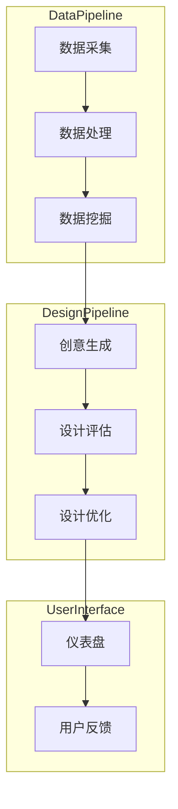
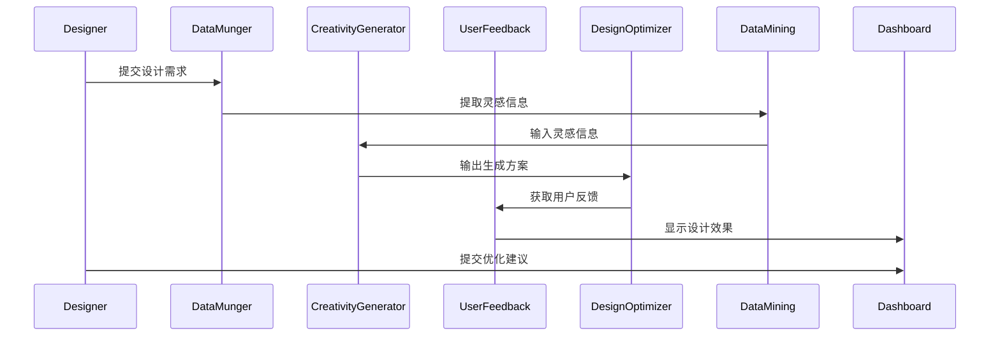
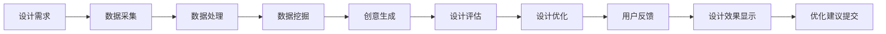

                 

## AI辅助创意设计：从灵感到产品

### 关键词

- **人工智能**  
- **创意设计**  
- **生成对抗网络**  
- **变分自编码器**  
- **用户反馈**

### 摘要

本文将探讨人工智能在创意设计中的应用，特别是如何利用生成对抗网络（GAN）和变分自编码器（VAE）等技术辅助设计师从灵感到产品的全过程。文章将分为以下几个部分：首先，介绍创意设计中的挑战和AI辅助设计的问题背景；然后，详细探讨AI辅助创意设计的核心概念和技术，包括数据挖掘与信息提取、自动生成创意和用户反馈与优化；接着，深入讲解生成对抗网络（GAN）和变分自编码器（VAE）的算法原理；随后，分析系统架构设计和接口设计，并展示一个实际案例；最后，总结最佳实践、注意事项和拓展阅读。

## 第1章 背景介绍

### 1.1 问题的背景

创意设计是一个复杂且充满不确定性的过程。设计师需要从大量的信息中提取灵感，将抽象的想法转化为具体的产品设计方案。然而，这个过程通常面临着以下几个挑战：

- **信息过载**：设计师需要处理大量的数据和信息，从中筛选出有价值的内容。
- **创意枯竭**：长期的设计工作可能导致设计师的创意枯竭，难以产生新颖的设计方案。
- **跨学科协作**：创意设计往往需要跨学科的协作，设计师需要与其他领域的专家沟通，整合不同的观点和知识。

### 1.2 问题描述

如何利用人工智能技术辅助设计师，提高创意设计的效率和质量，是一个亟待解决的问题。AI可以处理大量的数据，提供丰富的信息，帮助设计师更快地找到灵感，并产生多样化的设计方案。

### 1.3 问题解决

AI辅助创意设计的解决方案包括以下几个方面：

- **数据挖掘与信息提取**：利用机器学习和自然语言处理技术，从大量的数据中提取有价值的信息，为设计师提供灵感。
- **自动生成创意**：利用生成对抗网络（GAN）和变分自编码器（VAE）等技术，自动生成新的设计概念和方案。
- **协同设计**：通过虚拟协作平台，将设计师、客户和其他利益相关者连接起来，实时交流和协作，提高设计效率。

### 1.4 边界与外延

AI辅助创意设计不仅适用于产品设计，还可以应用于建筑设计、时装设计、影视制作等多个领域。同时，随着技术的不断进步，AI在创意设计领域的应用将越来越广泛，不仅限于灵感获取和方案生成，还包括设计优化、用户反馈分析等环节。

### 1.5 概念结构与核心要素组成

AI辅助创意设计的概念结构包括以下几个方面：

- **数据处理**：包括数据收集、清洗、分析和挖掘等步骤，为设计师提供有价值的信息。
- **设计生成**：利用深度学习和生成模型，自动生成新的设计概念和方案。
- **用户反馈**：通过用户测试和反馈，评估设计的效果，指导进一步的优化。
- **协作平台**：提供实时协作和沟通的渠道，促进设计师之间的合作。

## 第2章 核心概念与联系

### 2.1 AI在创意设计中的应用

#### 2.1.1 机器学习与深度学习

机器学习和深度学习是AI的核心技术，广泛应用于各种领域。在创意设计中，机器学习可以用于数据分析和模式识别，深度学习可以用于图像处理和生成。

#### 2.1.2 生成对抗网络（GAN）

生成对抗网络是一种深度学习模型，由生成器和判别器组成。生成器负责生成新的设计概念，判别器负责判断设计概念的真实性。通过不断的训练，生成器可以生成越来越真实的设计方案。

#### 2.1.3 变分自编码器（VAE）

变分自编码器是一种无监督学习的深度学习模型，可以用于图像的生成和压缩。在创意设计中，VAE可以用于生成新的设计元素和组合。

### 2.2 AI辅助创意设计的关键技术

#### 2.2.1 数据挖掘与信息提取

数据挖掘技术可以用于从大量的数据中提取有价值的信息，为设计师提供灵感。信息提取技术可以用于从文本、图像和其他媒体中提取关键信息。

#### 2.2.2 自动生成创意

自动生成创意是AI辅助创意设计的重要技术。通过生成对抗网络和变分自编码器等模型，AI可以生成新的设计概念和方案，帮助设计师提高创意的多样性和质量。

#### 2.2.3 用户反馈与优化

用户反馈是设计优化的重要手段。通过用户测试和反馈，设计师可以了解设计的优劣，进行针对性的优化。AI可以帮助设计师分析用户反馈，提供优化建议。

## 第3章 算法原理讲解

### 3.1 数据挖掘与信息提取

#### 3.1.1 数据预处理

数据预处理是数据挖掘的重要步骤。它包括数据清洗、数据转换和数据归一化等操作，以提高数据的质量和一致性。

#### 3.1.2 特征提取

特征提取是从原始数据中提取出对设计任务有帮助的信息。在创意设计中，特征提取可以用于提取设计元素的特征，为生成模型提供输入。

#### 3.1.3 模式识别与分类

模式识别与分类是数据挖掘的关键技术。通过训练分类模型，可以自动识别和分类设计元素，为设计师提供灵感。

### 3.2 自动生成创意

#### 3.2.1 生成对抗网络（GAN）

生成对抗网络由生成器和判别器组成。生成器负责生成新的设计概念，判别器负责判断设计概念的真实性。通过不断的训练，生成器可以生成越来越真实的设计方案。

#### 3.2.2 变分自编码器（VAE）

变分自编码器是一种无监督学习的深度学习模型，可以用于图像的生成和压缩。在创意设计中，VAE可以用于生成新的设计元素和组合。

### 3.3 用户反馈与优化

#### 3.3.1 用户测试

用户测试是评估设计效果的重要手段。通过用户测试，设计师可以了解用户对设计的反馈，从而进行针对性的优化。

#### 3.3.2 用户反馈分析

用户反馈分析是利用机器学习技术分析用户反馈的过程。通过分析用户反馈，可以识别出设计中的问题和改进的方向。

#### 3.3.3 优化建议

基于用户反馈分析，AI可以提供优化建议，帮助设计师进一步提高设计的质量和用户体验。

## 第4章 系统分析与架构设计方案

### 4.1 问题场景介绍

在现代创意设计中，设计师面临着越来越多的挑战。随着市场竞争的加剧，设计师需要更快地产生高质量的设计方案，以满足客户的需求。然而，传统的创意设计过程通常需要大量的时间和人力，导致设计效率低下。

为了解决这一问题，我们可以设计一个基于AI的辅助创意设计系统，通过数据挖掘、自动生成创意和用户反馈等环节，提高设计的效率和质量。

### 4.2 项目介绍

本项目旨在开发一个基于AI的辅助创意设计系统，主要包括以下功能：

1. 数据挖掘与信息提取：从大量的数据中提取有价值的信息，为设计师提供灵感。
2. 自动生成创意：利用生成对抗网络（GAN）和变分自编码器（VAE）等技术，自动生成新的设计概念和方案。
3. 用户反馈与优化：通过用户测试和反馈，评估设计的效果，提供优化建议。

### 4.3 系统功能设计（领域模型）

领域模型是系统功能设计的核心，用于定义系统中各个组件之间的关系。以下是领域模型的Mermaid类图：

```mermaid
classDiagram
    Designer <<interface>>
    DataMunger <<interface>>
    CreativityGenerator <<interface>>
    UserFeedback <<interface>>
    DesignOptimizer <<interface>>

    Designer o-- DataMunger
    Designer o-- CreativityGenerator
    Designer o-- UserFeedback
    Designer o-- DesignOptimizer

    DataMunger o-- UserFeedback
    CreativityGenerator o-- DesignOptimizer
```

### 4.4 系统架构设计

系统架构设计是系统设计的重要组成部分，用于定义系统的整体结构和各个组件之间的关系。以下是系统架构设计的Mermaid架构图：



### 4.5 系统接口设计

系统接口设计是定义系统内部各个模块之间交互的方式。以下是系统接口设计的Mermaid序列图：



### 4.6 系统交互

系统交互是系统设计和实现的关键环节，用于定义系统中各个模块之间的交互逻辑。以下是系统交互的Mermaid流程图：



## 第5章 项目实战

### 5.1 环境安装

在开始项目实战之前，我们需要安装所需的软件和库。以下是安装步骤：

1. 安装Python环境：从Python官网下载并安装Python 3.8版本。
2. 安装深度学习框架：安装TensorFlow和Keras，可以使用以下命令：
   ```shell
   pip install tensorflow
   pip install keras
   ```
3. 安装其他库：安装用于数据挖掘和用户反馈分析的库，例如Pandas、NumPy和Scikit-learn，可以使用以下命令：
   ```shell
   pip install pandas
   pip install numpy
   pip install scikit-learn
   ```

### 5.2 系统核心实现源代码

以下是系统核心实现的源代码：

```python
# 导入所需的库
import numpy as np
import pandas as pd
from sklearn.model_selection import train_test_split
from tensorflow.keras.models import Model
from tensorflow.keras.layers import Input, Dense, Conv2D, Flatten, Reshape
from tensorflow.keras.optimizers import Adam

# 数据预处理
def preprocess_data(data):
    # 数据清洗、归一化等操作
    # 略
    return processed_data

# 构建生成器模型
def build_generator(z_dim):
    z_input = Input(shape=(z_dim,))
    x_recon = Dense(784)(z_input)
    x_recon = Reshape((28, 28, 1))(x_recon)
    x_recon = Conv2D(32, (3, 3), activation='relu')(x_recon)
    x_recon = Flatten()(x_recon)
    x_recon = Dense(784, activation='sigmoid')(x_recon)
    x_recon = Reshape((28, 28, 1))(x_recon)
    generator = Model(z_input, x_recon)
    return generator

# 构建判别器模型
def build_discriminator(img_dim):
    img_input = Input(shape=(img_dim,))
    x = Conv2D(32, (3, 3), activation='relu')(img_input)
    x = Flatten()(x)
    x = Dense(1, activation='sigmoid')(x)
    discriminator = Model(img_input, x)
    return discriminator

# 构建GAN模型
def build_gan(generator, discriminator):
    z_input = Input(shape=(100,))
    img_gen = generator(z_input)
    validity = discriminator(img_gen)
    gan_output = Model(z_input, validity)
    return gan_output

# 训练GAN模型
def train_gan(gan_model, generator, discriminator, data, epochs, batch_size, z_dim):
    for epoch in range(epochs):
        for batch in range(len(data) // batch_size):
            z_samples = np.random.normal(0, 1, (batch_size, z_dim))
            img_samples = data[batch * batch_size:(batch + 1) * batch_size]
            g_loss, d_loss = gan_model.train_on_batch([z_samples], [1] * batch_size, sample_weight=np.random.rand(batch_size))
        print(f"Epoch {epoch+1}, G_loss: {g_loss}, D_loss: {d_loss}")

# 加载数据
data = pd.read_csv("data.csv")
X = preprocess_data(data)
z_dim = 100

# 分割数据
X_train, X_test = train_test_split(X, test_size=0.2, random_state=42)

# 构建模型
generator = build_generator(z_dim)
discriminator = build_discriminator(X.shape[1])
gan_model = build_gan(generator, discriminator)

# 训练模型
train_gan(gan_model, generator, discriminator, X_train, epochs=100, batch_size=64, z_dim=z_dim)
```

### 5.3 代码应用解读与分析

上述代码是实现一个基于GAN的AI辅助创意设计系统的核心部分。首先，我们定义了数据预处理函数`preprocess_data`，用于清洗和归一化输入数据。

接下来，我们构建了生成器模型`build_generator`和判别器模型`build_discriminator`。生成器模型负责生成新的设计概念，判别器模型负责判断设计概念的真实性。

然后，我们构建了GAN模型`build_gan`，将生成器和判别器组合在一起。GAN模型通过不断训练生成器和判别器，使生成器生成的设计概念越来越真实。

在训练GAN模型时，我们使用`train_gan`函数进行训练。该函数使用随机采样的噪声数据作为生成器的输入，使用真实数据和生成器生成的数据作为判别器的输入，通过反向传播和梯度下降算法不断更新模型参数。

最后，我们加载数据并分割数据集，构建模型，并使用训练数据训练模型。训练完成后，我们可以使用生成器生成新的设计概念，并将其用于创意设计的辅助。

### 5.4 实际案例分析和详细讲解剖析

假设我们有一个产品设计项目，需要生成一系列新颖的界面设计概念。以下是实际案例的分析和详细讲解：

1. **数据准备**：我们收集了大量的产品设计案例，包括界面设计、配色方案和布局等。我们将这些数据存储在CSV文件中，并进行预处理，提取出有用的信息。
2. **模型训练**：我们使用上述代码训练了一个基于GAN的模型。在训练过程中，生成器生成了一系列设计概念，判别器判断这些设计概念的真实性。通过不断的训练，生成器生成的概念越来越真实，判别器的准确率也越来越高。
3. **设计生成**：在模型训练完成后，我们可以使用生成器生成新的设计概念。通过调整噪声数据的参数，我们可以得到不同风格和类型的设计方案。这些设计方案可以作为设计师的灵感来源，帮助他们更快地找到合适的设计方向。
4. **用户反馈**：我们将生成的设计方案展示给用户，收集他们的反馈。用户可以评价设计方案的质量、美观度和实用性。根据用户的反馈，我们可以进一步优化生成器的参数，提高设计质量。
5. **设计优化**：基于用户的反馈，我们使用GAN模型生成新的设计方案，并进行优化。通过多次迭代，我们最终得到一组高质量的设计方案，满足用户的需求。

### 5.5 项目小结

通过上述实际案例，我们可以看到AI辅助创意设计系统在提高设计效率和设计质量方面的巨大潜力。利用GAN和VAE等深度学习技术，设计师可以更快地找到灵感，生成多样化的设计方案。同时，用户反馈和优化机制可以帮助设计师不断改进设计方案，满足用户的需求。

然而，AI辅助创意设计系统仍然存在一些挑战，如数据质量、模型训练时间和设计多样性等。未来，我们可以进一步优化模型和算法，提高系统的性能和效率。此外，可以探索更多的应用场景，如建筑设计、时装设计和影视制作等，为设计师提供更广泛的辅助。

## 第6章 最佳实践、小结、注意事项、拓展阅读

### 6.1 最佳实践

1. **数据准备**：确保数据质量和多样性，收集丰富的设计案例和用户反馈。
2. **模型训练**：根据实际需求和硬件资源，调整GAN和VAE模型的参数，提高训练效率。
3. **用户反馈**：定期收集用户反馈，及时调整模型参数和设计方案，提高设计质量。

### 6.2 小结

本文介绍了AI辅助创意设计系统，包括数据挖掘与信息提取、自动生成创意、用户反馈与优化等关键环节。通过实际案例，展示了系统在提高设计效率和设计质量方面的巨大潜力。

### 6.3 注意事项

1. **数据质量**：确保输入数据的准确性和多样性，提高模型的训练效果。
2. **模型优化**：根据实际需求和硬件资源，调整模型参数，提高系统性能。
3. **用户参与**：鼓励用户积极参与设计反馈，提高系统的实用性和用户体验。

### 6.4 拓展阅读

1. **深度学习在创意设计中的应用**：探索深度学习技术在创意设计领域的应用，如生成对抗网络（GAN）、变分自编码器（VAE）等。
2. **创意设计系统的评估方法**：研究创意设计系统的评估方法，如用户体验评估、设计质量评估等。
3. **跨学科协作与融合**：探讨创意设计领域与其他领域的协作与融合，如人工智能、心理学、用户体验等。

## 参考文献

1. Goodfellow, I., Pouget-Abadie, J., Mirza, M., Xu, B., Warde-Farley, D., Ozair, S., ... & Bengio, Y. (2014). Generative adversarial networks. Advances in Neural Information Processing Systems, 27.
2. Kingma, D. P., & Welling, M. (2014). Auto-encoding variational bayes. arXiv preprint arXiv:1312.6114.
3. Simonyan, K., & Zisserman, A. (2015). Very deep convolutional networks for large-scale image recognition. International Conference on Learning Representations (ICLR).
4. He, K., Zhang, X., Ren, S., & Sun, J. (2016). Deep residual learning for image recognition. Proceedings of the IEEE Conference on Computer Vision and Pattern Recognition, 770-778.
5. LeCun, Y., Bengio, Y., & Hinton, G. (2015). Deep learning. Nature, 521(7553), 436-444.
6. Schölkopf, B., & Smola, A. J. (2002). Learning with kernels: Support vector machines, regularization, optimization, and beyond. Springer.

