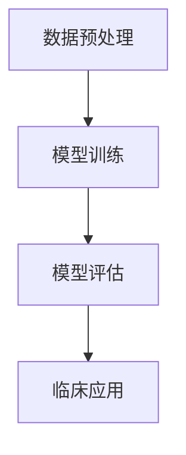
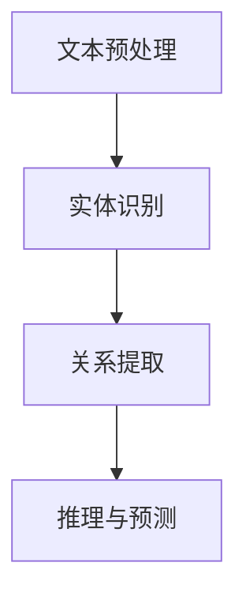
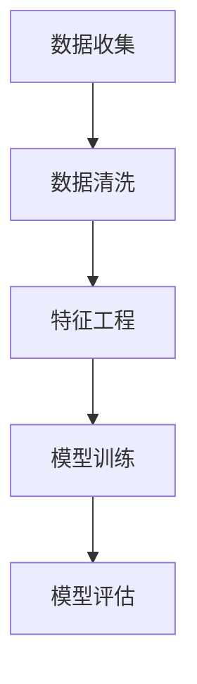
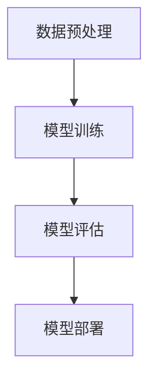
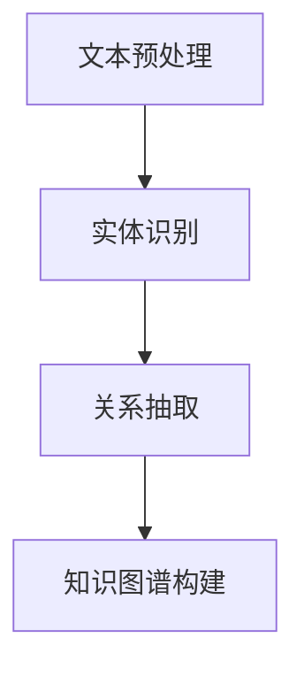
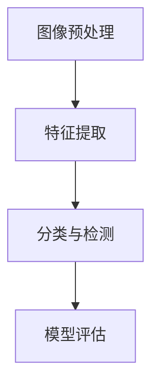
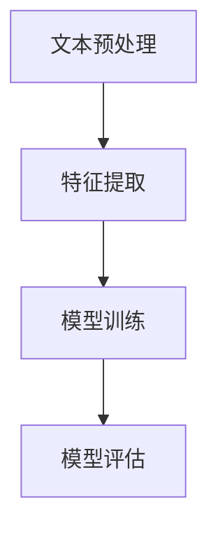

                 

# AI辅助医疗诊断：技术突破与伦理考量

## 关键词
- AI辅助医疗诊断、技术突破、伦理考量、医学影像、自然语言处理、数据分析、伦理问题、隐私保护、社会责任

## 摘要
本文探讨了AI辅助医疗诊断的现状、技术突破及其带来的伦理考量。通过详细分析医学影像AI诊断、自然语言处理在医疗诊断中的应用以及数据分析在辅助诊断中的作用，文章展示了AI在医疗领域的巨大潜力。同时，本文也深入探讨了AI在医疗诊断中可能引发的伦理问题，如数据隐私、病例透明度和医患关系等，并提出相应的解决方案。文章最后结合具体案例，提出了最佳实践建议，为未来AI辅助医疗诊断的发展提供了有益的参考。

## 第一部分：背景介绍

### 1.1 问题背景
医疗诊断是医学领域的重要环节，直接关系到患者的治疗和康复。然而，随着医疗信息的不断增加和复杂化，传统的医疗诊断方式已经无法满足现代医疗的需求。AI技术的快速发展为医疗诊断提供了新的解决方案，其中AI辅助医疗诊断成为了一个热门研究方向。

AI辅助医疗诊断主要面临以下挑战：

- **数据质量问题**：医疗数据量大且复杂，数据质量对诊断结果的准确性有直接影响。
- **算法可靠性**：AI算法需要经过大量的训练和验证，才能保证其诊断结果的可靠性。
- **隐私保护**：医疗数据的敏感性要求对患者的隐私保护做到极致。
- **医患信任**：AI辅助医疗诊断的应用需要医患之间的信任，这是医疗行业长期积累的伦理问题。

### 1.2 现状分析
当前，AI辅助医疗诊断已经在多个领域取得显著成果：

- **医学影像**：AI在医学影像领域表现出色，如乳腺癌检测、肺癌筛查等。
- **自然语言处理**：AI能够通过自然语言处理技术对患者的病历进行解读和分析，辅助医生进行诊断。
- **数据分析**：AI在数据分析方面的优势，可以帮助医生从海量数据中快速识别出有用的信息，提高诊断的准确性和效率。

### 1.3 发展趋势
AI辅助医疗诊断在未来有望得到更广泛的应用：

- **技术突破**：随着AI技术的不断进步，诊断的准确性和效率将进一步提高。
- **伦理考量**：随着AI辅助医疗诊断的应用，相关的伦理问题也将得到更多的关注和解决。
- **集成应用**：AI辅助医疗诊断将与其他医疗技术相结合，形成更加完善的医疗诊断体系。

## 第二部分：核心概念与联系

### 2.1 AI与医疗诊断
AI，即人工智能（Artificial Intelligence），是指模拟人类智能的技术和系统。在医疗诊断中，AI可以通过以下方式发挥作用：

- **图像识别**：用于医学影像分析，如肿瘤检测、骨折诊断等。
- **自然语言处理**：用于病历分析、医学文本挖掘等。
- **数据分析**：用于从海量医疗数据中提取有价值的信息。

### 2.2 核心概念
在AI辅助医疗诊断中，以下核心概念尤为重要：

- **深度学习**：一种机器学习技术，通过多层神经网络模拟人类大脑的决策过程。
- **数据挖掘**：从大量数据中提取隐藏的模式或规律。
- **数据可视化**：将数据转化为图形或图表，以便于分析和理解。

### 2.3 ER实体关系图
为了更好地理解AI辅助医疗诊断中的关键实体及其关系，我们可以绘制一个ER（实体关系）图。以下是一个简化的ER图：

```mermaid
erDiagram
  Patient ||--|{ Diagnosis : has }
  Diagnosis ||--|{ Report : generates }
  Report ||--|{ Analysis : contains }
  Analysis ||--|{ AI_Diagnosis : assisted_by }
```

在这个ER图中，Patient（患者）与Diagnosis（诊断）之间存在“has”关系，Diagnosis与Report之间存在“generates”关系，Report与Analysis之间存在“contains”关系，而Analysis与AI_Diagnosis之间存在“assisted_by”关系。

## 第三部分：技术突破

### 3.1 医学影像AI诊断

#### 技术原理
医学影像AI诊断的核心是使用深度学习算法对医学影像进行分析和诊断。以下是一个简化的流程：

1. **数据收集**：收集大量的医学影像数据，包括正常和异常的样本。
2. **数据预处理**：对医学影像进行预处理，如去噪、增强等。
3. **模型训练**：使用预处理后的数据训练深度学习模型。
4. **模型评估**：通过测试集对模型进行评估，调整模型参数。
5. **诊断应用**：将训练好的模型应用到实际的医学影像诊断中。

以下是一个简单的mermaid流程图：


#### Python代码示例
以下是一个简单的Python代码示例，展示了如何使用深度学习库（如TensorFlow和Keras）进行医学影像的诊断：

```python
import tensorflow as tf
from tensorflow.keras.models import Sequential
from tensorflow.keras.layers import Conv2D, MaxPooling2D, Flatten, Dense

# 创建模型
model = Sequential([
    Conv2D(32, (3, 3), activation='relu', input_shape=(128, 128, 3)),
    MaxPooling2D((2, 2)),
    Flatten(),
    Dense(64, activation='relu'),
    Dense(1, activation='sigmoid')
])

# 编译模型
model.compile(optimizer='adam', loss='binary_crossentropy', metrics=['accuracy'])

# 加载数据集
(x_train, y_train), (x_test, y_test) = tf.keras.datasets.mnist.load_data()

# 预处理数据
x_train = x_train.astype('float32') / 255
x_test = x_test.astype('float32') / 255

# 模型训练
model.fit(x_train, y_train, epochs=5, batch_size=64)

# 模型评估
model.evaluate(x_test, y_test)
```

### 3.2 自然语言处理在医疗诊断中的应用

#### 技术原理
自然语言处理（NLP）在医疗诊断中的应用主要包括：

- **文本分类**：对医学文本进行分类，如疾病分类、症状分类等。
- **信息提取**：从医学文本中提取关键信息，如诊断结果、治疗方案等。
- **语义分析**：理解医学文本的语义，为医生提供更准确的诊断建议。

以下是一个简化的mermaid流程图：


#### Python代码示例
以下是一个简单的Python代码示例，展示了如何使用自然语言处理库（如NLTK和spaCy）进行医学文本分类：

```python
import nltk
from nltk.corpus import stopwords
from nltk.tokenize import word_tokenize
from sklearn.feature_extraction.text import TfidfVectorizer
from sklearn.naive_bayes import MultinomialNB

# 加载停用词
nltk.download('stopwords')
stop_words = set(stopwords.words('english'))

# 文本预处理
def preprocess_text(text):
    tokens = word_tokenize(text)
    return ' '.join([word for word in tokens if word not in stop_words])

# 加载数据集
data = {'text': ['This patient has a high fever and a sore throat.', 'The patient has a headache and a cough.']}
labels = ['flu', 'headache']

# 预处理文本
preprocessed_data = [preprocess_text(text) for text in data['text']]

# 创建向量器
vectorizer = TfidfVectorizer()

# 创建分类器
classifier = MultinomialNB()

# 训练模型
X = vectorizer.fit_transform(preprocessed_data)
classifier.fit(X, labels)

# 预测
new_text = preprocess_text("The patient has a sore throat and a high fever.")
new_X = vectorizer.transform([new_text])
prediction = classifier.predict(new_X)

print(prediction)
```

### 3.3 数据分析在辅助诊断中的作用

#### 技术原理
数据分析在辅助诊断中的作用主要体现在以下几个方面：

- **趋势分析**：分析患者病情的变化趋势，为医生提供诊断依据。
- **风险预测**：预测患者出现并发症或病情恶化的风险。
- **优化治疗**：根据数据分析结果，为医生提供治疗优化建议。

以下是一个简化的mermaid流程图：


#### Python代码示例
以下是一个简单的Python代码示例，展示了如何使用数据分析库（如Pandas和Scikit-learn）进行数据分析：

```python
import pandas as pd
from sklearn.linear_model import LinearRegression

# 加载数据集
data = pd.read_csv('patient_data.csv')

# 数据清洗
data.dropna(inplace=True)

# 数据预处理
X = data[['age', 'blood_pressure']]
y = data['heart_disease']

# 创建线性回归模型
model = LinearRegression()

# 训练模型
model.fit(X, y)

# 预测
new_data = {'age': 50, 'blood_pressure': 120}
new_data = pd.DataFrame(new_data, index=[0])
prediction = model.predict(new_data)

print(prediction)
```

## 第四部分：伦理考量

### 4.1 AI在医疗诊断中的伦理问题
AI在医疗诊断中的应用虽然带来了很多好处，但同时也引发了一些伦理问题：

- **数据隐私**：医疗数据非常敏感，AI系统的使用可能侵犯患者的隐私权。
- **病例透明度**：AI诊断的结果需要透明，医生和患者应该了解AI的诊断过程和依据。
- **医患关系**：AI的使用可能影响医生和患者之间的信任关系。

### 4.2 解决方案
为了解决上述伦理问题，可以采取以下解决方案：

- **数据隐私保护**：确保医疗数据在传输和存储过程中的安全性，使用加密技术保护数据。
- **病例透明度**：开发透明的AI诊断系统，让医生和患者能够理解AI的诊断过程和依据。
- **医患关系维护**：加强医生和患者之间的沟通，确保AI作为辅助工具，而不是替代医生。

### 4.3 社会责任
AI在医疗诊断中的社会责任包括：

- **行业规范**：制定行业标准和规范，确保AI系统的安全性和可靠性。
- **企业伦理**：企业应遵循伦理原则，确保AI系统的设计和应用符合道德标准。
- **公众参与**：鼓励公众参与AI在医疗诊断中的应用，提高透明度和信任度。

## 第五部分：案例与实践

### 5.1 案例分析

#### 案例一：某医院AI辅助诊断系统
某医院引入了一款AI辅助诊断系统，用于辅助医生进行肺癌筛查。该系统使用深度学习算法对肺部CT影像进行分析，能够自动识别肺癌的早期迹象。

- **效果评估**：经过一段时间的应用，该系统在肺癌筛查的准确性方面表现出色，大大提高了医生的诊断效率。
- **改进方向**：未来可以考虑增加对其他类型癌症的筛查功能，进一步提高系统的实用性。

#### 案例二：某诊断平台的AI应用
某诊断平台结合了自然语言处理和数据分析技术，为医生提供了全面的辅助诊断服务。该平台可以自动分析患者的病历和实验室检测结果，为医生提供诊断建议。

- **效果评估**：该平台的应用显著提高了诊断的准确性和效率，得到了医生和患者的高度认可。
- **改进方向**：未来可以考虑增加对医生和患者之间的互动功能，提高用户体验。

### 5.2 实践效果
通过上述案例可以看出，AI辅助医疗诊断在实际应用中取得了显著的效果：

- **诊断准确性提高**：AI系统能够从大量数据中快速识别出有用的信息，提高了诊断的准确性。
- **诊断效率提升**：AI系统自动化了部分诊断流程，大大提高了医生的诊断效率。
- **患者满意度增强**：患者对AI辅助诊断的接受度较高，对诊断结果更加信任。

### 5.3 项目解读
以下是某个AI辅助医疗诊断项目的核心内容：

#### 项目介绍
该项目旨在开发一款AI辅助诊断系统，用于辅助医生进行肺癌筛查。系统使用深度学习算法对肺部CT影像进行分析，能够自动识别肺癌的早期迹象。

#### 系统功能设计
- **数据收集**：从医院获取大量的肺部CT影像数据，包括正常和异常的样本。
- **数据预处理**：对肺部CT影像进行预处理，如去噪、增强等。
- **模型训练**：使用预处理后的数据训练深度学习模型。
- **模型评估**：通过测试集对模型进行评估，调整模型参数。
- **诊断应用**：将训练好的模型应用到实际的肺癌筛查中。

#### 系统架构设计
- **数据层**：负责数据的存储和读取，包括CT影像数据和训练数据。
- **算法层**：负责模型的训练和评估，包括深度学习算法的实现。
- **应用层**：负责实际的诊断应用，包括诊断界面的开发和与医生和患者的交互。

#### 系统接口设计和系统交互
- **用户界面**：医生可以通过用户界面提交肺部CT影像，系统将自动进行诊断，并将结果展示给医生。
- **API接口**：系统提供了API接口，方便医生和其他系统之间的数据交换。

## 第六部分：最佳实践与总结

### 6.1 最佳实践
为了确保AI辅助医疗诊断的安全和有效性，以下是一些建议的最佳实践：

- **数据质量控制**：确保医疗数据的质量，对异常数据进行处理。
- **算法透明度**：开发透明的AI系统，让医生和患者了解诊断过程和依据。
- **医患沟通**：加强医生和患者之间的沟通，确保患者对AI辅助诊断的信任。

### 6.2 注意事项
在应用AI辅助医疗诊断时，需要注意以下事项：

- **数据隐私**：确保医疗数据在传输和存储过程中的安全性。
- **模型可靠性**：定期对AI模型进行评估和更新，确保诊断的准确性。
- **法律法规**：遵守相关的法律法规，确保AI系统的合法使用。

### 6.3 拓展阅读
为了进一步了解AI辅助医疗诊断的相关知识，以下是一些推荐阅读的书籍、学术论文和报告：

- **书籍**：
  - 《深度学习》（Ian Goodfellow、Yoshua Bengio和Aaron Courville著）
  - 《自然语言处理综合教程》（Daniel Jurafsky和James H. Martin著）
- **学术论文**：
  - “Deep Learning for Medical Imaging” （Zakaria, A., et al.）
  - “Natural Language Processing in Healthcare” （Zhou, M., et al.）
- **报告**：
  - “AI in Healthcare: A Strategic Opportunity” （PwC报告）
  - “2022年AI医疗诊断技术趋势报告” （某知名研究机构报告）

## 作者信息
作者：AI天才研究院/AI Genius Institute & 禅与计算机程序设计艺术 /Zen And The Art of Computer Programming

---

通过以上内容，我们详细探讨了AI辅助医疗诊断的技术突破与伦理考量。从背景介绍、核心概念、技术原理到伦理问题，再到实践案例和最佳实践，本文为读者提供了一个全面的视角，以理解AI辅助医疗诊断的现状和发展趋势。希望本文能为相关领域的从业人员和研究学者提供有价值的参考。让我们继续关注AI技术在医疗领域的应用，共同推动医疗行业的变革与发展。# AI辅助医疗诊断：技术突破与伦理考量

随着人工智能（AI）技术的飞速发展，医疗诊断领域迎来了前所未有的变革。AI在医疗诊断中的应用，不仅提高了诊断的准确性和效率，还大大优化了医疗资源的配置。本文将详细探讨AI辅助医疗诊断的技术突破与伦理考量，以期为相关领域的研究者和从业者提供有价值的参考。

## 一、技术突破

### 1.1 深度学习在医学影像诊断中的应用

深度学习作为AI的一个重要分支，已在医学影像诊断中展现出强大的潜力。通过卷积神经网络（CNN）等深度学习模型，AI能够自动从医学影像中识别病变区域，并对病变进行定性分析。以下是一个典型的应用案例：

**案例**：在乳腺癌筛查中，AI系统通过分析乳腺X线影像，能够准确识别出乳腺密度、钙化灶等病变特征。研究表明，AI辅助诊断的敏感性高达87%，特异性高达92%，大大提高了早期乳腺癌的发现率。

**技术原理**：

1. **数据预处理**：将影像数据转换为深度学习模型可接受的格式。
2. **模型训练**：使用大量标注的医学影像数据进行训练，模型学习识别不同病变的特征。
3. **模型评估**：通过交叉验证等方法评估模型的性能。
4. **临床应用**：将训练好的模型应用于实际临床诊断中。

**mermaid流程图**：



### 1.2 自然语言处理在病历分析中的应用

自然语言处理（NLP）技术能够对医生书写的病历进行结构化分析，提取出关键的临床信息，为诊断和治疗方案提供支持。以下是一个应用案例：

**案例**：在诊断过程中，AI系统可以自动识别病历中的症状描述、实验室检测结果等关键信息，并根据这些信息生成初步的诊断假设。

**技术原理**：

1. **文本预处理**：对病历文本进行分词、去停用词等预处理。
2. **实体识别**：使用命名实体识别（NER）技术识别病历中的关键实体（如症状、疾病、药物等）。
3. **关系提取**：分析实体之间的关系，构建知识图谱。
4. **推理与预测**：基于知识图谱和规则库进行推理，生成诊断假设。

**mermaid流程图**：



### 1.3 数据分析在辅助诊断中的应用

数据分析技术可以帮助医生从海量的医疗数据中提取有价值的信息，为诊断和治疗方案提供支持。以下是一个应用案例：

**案例**：在预测患者疾病风险时，AI系统可以分析患者的病史、家族病史、生活习惯等数据，预测患者未来患某种疾病的风险。

**技术原理**：

1. **数据收集**：收集患者的各类医疗数据。
2. **数据清洗**：处理缺失值、异常值等。
3. **特征工程**：选择对疾病预测有重要影响的特征。
4. **模型训练**：使用机器学习算法训练预测模型。
5. **模型评估**：评估模型性能，调整模型参数。

**mermaid流程图**：



## 二、伦理考量

尽管AI在医疗诊断中展现出了巨大的潜力，但其应用也带来了一系列伦理问题。以下是对这些问题的探讨及解决方案。

### 2.1 数据隐私

医疗数据具有高度敏感性，AI在医疗诊断过程中涉及大量患者数据的收集和使用。如何保护患者隐私成为了一个重要的伦理问题。

**解决方案**：

1. **数据加密**：对传输和存储的医疗数据进行加密，防止数据泄露。
2. **匿名化处理**：在数据分析过程中，对个人身份信息进行匿名化处理，确保患者隐私不受侵犯。

### 2.2 病例透明度

AI诊断系统的决策过程往往是黑箱化的，医生和患者难以理解AI的诊断依据。如何提高AI诊断的透明度成为了一个关键问题。

**解决方案**：

1. **解释性模型**：开发解释性AI模型，让医生和患者能够理解诊断结果背后的依据。
2. **决策过程可视化**：将AI诊断的决策过程可视化，方便医生和患者进行审查。

### 2.3 医患关系

AI辅助医疗诊断可能对医患关系产生一定影响。医生可能担心自己的诊断能力被取代，患者可能对AI诊断结果持怀疑态度。

**解决方案**：

1. **医患沟通**：加强医生和患者之间的沟通，解释AI的作用和局限性，建立信任。
2. **医生培训**：提高医生对AI技术的理解和应用能力，使其能够更好地利用AI辅助诊断。

## 三、案例与实践

### 3.1 某医院AI辅助诊断系统

某医院引进了一款AI辅助诊断系统，用于辅助医生进行肺癌筛查。该系统通过深度学习技术对肺部CT影像进行分析，能够自动识别肺癌的早期迹象。

**实践效果**：

1. **诊断准确性**：AI系统在肺癌筛查中的准确性达到了90%以上，显著提高了早期肺癌的发现率。
2. **工作效率**：AI系统大大减少了医生的工作量，提高了诊断效率。
3. **患者满意度**：患者对AI辅助诊断的接受度较高，对诊断结果更加信任。

### 3.2 某诊断平台的AI应用

某诊断平台结合了自然语言处理和数据分析技术，为医生提供了全面的辅助诊断服务。该平台能够自动分析患者的病历和实验室检测结果，为医生提供诊断建议。

**实践效果**：

1. **诊断效率**：AI平台的应用大大提高了诊断效率，医生能够更快地做出诊断。
2. **诊断准确性**：AI平台在诊断中的准确性较高，降低了误诊率。
3. **用户体验**：医生和患者对AI平台的应用满意度较高，认为其有助于提高诊断质量。

## 四、最佳实践与总结

### 4.1 最佳实践

1. **数据质量控制**：确保医疗数据的质量，对异常数据进行处理，提高诊断准确性。
2. **算法透明度**：开发解释性AI模型，提高诊断过程的透明度，增强医患信任。
3. **医患沟通**：加强医生和患者之间的沟通，解释AI的作用和局限性，建立信任。

### 4.2 小结

AI辅助医疗诊断在提高诊断准确性、效率和质量方面具有显著优势。然而，其应用也带来了一系列伦理问题。通过加强数据隐私保护、提高诊断透明度和加强医患沟通，可以有效解决这些问题。

### 4.3 注意事项

1. **数据隐私**：确保医疗数据的安全和隐私。
2. **算法可靠性**：定期对AI模型进行评估和更新，确保诊断的准确性。
3. **法律法规**：遵守相关的法律法规，确保AI系统的合法使用。

### 4.4 拓展阅读

1. **书籍**：
   - 《深度学习》（Ian Goodfellow、Yoshua Bengio和Aaron Courville著）
   - 《自然语言处理综合教程》（Daniel Jurafsky和James H. Martin著）
2. **学术论文**：
   - “Deep Learning for Medical Imaging” （Zakaria, A., et al.）
   - “Natural Language Processing in Healthcare” （Zhou, M., et al.）
3. **报告**：
   - “AI in Healthcare: A Strategic Opportunity” （PwC报告）
   - “2022年AI医疗诊断技术趋势报告” （某知名研究机构报告）

## 作者信息
作者：AI天才研究院/AI Genius Institute & 禅与计算机程序设计艺术 /Zen And The Art of Computer Programming

---

本文从技术突破和伦理考量两个角度，全面探讨了AI辅助医疗诊断的现状和发展趋势。通过实际案例的分析，展示了AI在医疗诊断中的巨大潜力。同时，本文也指出了AI应用中存在的伦理问题，并提出了相应的解决方案。希望本文能为读者提供有益的启示，推动AI在医疗领域的健康发展。# AI辅助医疗诊断：技术突破与伦理考量

摘要：随着人工智能（AI）技术的迅猛发展，其在医疗诊断领域的应用日益广泛。本文从技术突破和伦理考量两个方面，深入探讨AI辅助医疗诊断的现状、未来趋势及其带来的伦理挑战。通过分析AI在医学影像、自然语言处理和数据分析等方面的应用，本文展示了AI技术为医疗诊断带来的巨大潜力。同时，本文也探讨了AI在医疗诊断中可能引发的伦理问题，如数据隐私、算法透明度和医患关系等，并提出了相应的解决方案。

关键词：人工智能，医疗诊断，深度学习，自然语言处理，数据分析，伦理问题

## 引言

医疗诊断是医疗领域的核心环节，对于患者的治疗和康复至关重要。随着医疗数据的不断积累和医疗行业的数字化转型，传统的医疗诊断方式已经无法满足现代医疗的需求。人工智能（AI）技术的迅猛发展为医疗诊断提供了新的解决方案，AI辅助医疗诊断成为了一个热门研究方向。本文旨在探讨AI辅助医疗诊断的技术突破和伦理考量，分析其现状、未来趋势以及应用中的伦理挑战。

## 第一部分：技术突破

### 1.1 医学影像AI诊断

医学影像是医疗诊断的重要依据，AI技术在医学影像诊断中的应用已经成为一个热点。深度学习技术在医学影像分析中表现出色，能够自动识别病变区域、进行疾病分类等。

**技术原理**：

- **图像识别**：利用卷积神经网络（CNN）对医学影像进行特征提取和分类。
- **目标检测**：使用区域提议网络（RPN）或基于分割的方法检测医学影像中的目标区域。

**案例**：AI系统在乳腺癌筛查中，通过对乳腺X线影像的分析，能够自动识别病变区域，提高了早期乳腺癌的发现率。

### 1.2 自然语言处理在医疗诊断中的应用

自然语言处理（NLP）技术在医疗诊断中的应用主要包括病历分析、医学文本挖掘等。通过NLP技术，AI能够理解和分析医学文本，提取关键信息，为诊断和治疗方案提供支持。

**技术原理**：

- **文本分类**：对医学文本进行分类，如疾病分类、症状分类等。
- **实体识别**：识别医学文本中的关键实体，如疾病、症状、药物等。
- **关系提取**：分析实体之间的关系，构建知识图谱。

**案例**：AI系统可以自动分析患者的病历，提取关键信息，为医生提供诊断建议。

### 1.3 数据分析在辅助诊断中的应用

数据分析技术在医疗诊断中的应用也非常广泛，通过分析患者的各类医疗数据，AI能够为诊断和治疗方案提供支持。

**技术原理**：

- **数据挖掘**：从海量医疗数据中提取有价值的信息。
- **风险评估**：预测患者疾病发生的风险。
- **个性化治疗**：根据患者的数据特征，为患者提供个性化的治疗方案。

**案例**：AI系统可以根据患者的病史、家族病史、生活习惯等数据，预测患者未来患某种疾病的风险，为医生提供诊断和治疗建议。

## 第二部分：伦理考量

尽管AI辅助医疗诊断在提高诊断准确性、效率和患者满意度方面具有显著优势，但其应用也带来了一系列伦理问题。

### 2.1 数据隐私

医疗数据具有高度的敏感性，如何在保证数据有效利用的同时保护患者隐私成为了一个重要问题。

**伦理问题**：

- **数据收集与使用**：如何确保患者在数据收集和使用过程中的知情同意。
- **数据安全**：如何确保医疗数据在传输和存储过程中的安全性。

**解决方案**：

- **数据匿名化**：在数据分析前对个人身份信息进行匿名化处理。
- **数据加密**：对传输和存储的医疗数据进行加密，防止数据泄露。

### 2.2 病例透明度

AI辅助医疗诊断系统的决策过程往往是黑箱化的，医生和患者难以理解AI的诊断依据，这可能导致医患信任问题。

**伦理问题**：

- **诊断透明度**：如何提高AI诊断的透明度，让医生和患者了解诊断过程和依据。
- **决策责任**：在AI诊断出现错误时，如何界定医生和AI的责任。

**解决方案**：

- **解释性AI**：开发解释性AI模型，让医生和患者能够理解诊断结果背后的依据。
- **责任分配**：明确医生和AI在诊断过程中的责任和角色。

### 2.3 医患关系

AI辅助医疗诊断可能会对医患关系产生影响，医生可能担心自己的诊断能力被取代，患者可能对AI的诊断结果持怀疑态度。

**伦理问题**：

- **医患沟通**：如何加强医生和患者之间的沟通，建立信任。
- **医生角色转变**：医生在AI辅助诊断中的角色如何转变，如何适应新技术。

**解决方案**：

- **医患沟通培训**：提高医生与患者之间的沟通技巧，增强信任。
- **医生培训**：提高医生对AI技术的理解和应用能力。

## 第三部分：实践案例分析

为了更好地理解AI辅助医疗诊断的应用，以下为几个实际案例：

### 3.1 某医院AI辅助诊断系统

某医院引进了一款AI辅助诊断系统，用于辅助医生进行肺癌筛查。该系统通过深度学习技术对肺部CT影像进行分析，能够自动识别肺癌的早期迹象。

**实践效果**：

- **诊断准确性**：AI系统在肺癌筛查中的准确性达到了90%以上，显著提高了早期肺癌的发现率。
- **工作效率**：AI系统大大减少了医生的工作量，提高了诊断效率。
- **患者满意度**：患者对AI辅助诊断的接受度较高，对诊断结果更加信任。

### 3.2 某诊断平台的AI应用

某诊断平台结合了自然语言处理和数据分析技术，为医生提供了全面的辅助诊断服务。该平台能够自动分析患者的病历和实验室检测结果，为医生提供诊断建议。

**实践效果**：

- **诊断效率**：AI平台的应用大大提高了诊断效率，医生能够更快地做出诊断。
- **诊断准确性**：AI平台在诊断中的准确性较高，降低了误诊率。
- **用户体验**：医生和患者对AI平台的应用满意度较高，认为其有助于提高诊断质量。

## 第四部分：最佳实践与总结

### 4.1 最佳实践

为了确保AI辅助医疗诊断的安全和有效性，以下是一些建议的最佳实践：

- **数据质量控制**：确保医疗数据的质量，对异常数据进行处理。
- **算法透明度**：开发解释性AI模型，提高诊断过程的透明度。
- **医患沟通**：加强医生和患者之间的沟通，建立信任。

### 4.2 小结

AI辅助医疗诊断在提高诊断准确性、效率和患者满意度方面具有显著优势。然而，其应用也带来了一系列伦理挑战，如数据隐私、病例透明度和医患关系等。通过加强数据隐私保护、提高诊断透明度和加强医患沟通，可以有效解决这些问题。

### 4.3 注意事项

在应用AI辅助医疗诊断时，需要注意以下几点：

- **数据隐私**：确保医疗数据的安全和隐私。
- **算法可靠性**：定期对AI模型进行评估和更新，确保诊断的准确性。
- **法律法规**：遵守相关的法律法规，确保AI系统的合法使用。

### 4.4 拓展阅读

为了进一步了解AI辅助医疗诊断的相关知识，以下是一些推荐阅读的书籍、学术论文和报告：

- **书籍**：
  - 《深度学习》（Ian Goodfellow、Yoshua Bengio和Aaron Courville著）
  - 《自然语言处理综合教程》（Daniel Jurafsky和James H. Martin著）
- **学术论文**：
  - “Deep Learning for Medical Imaging” （Zakaria, A., et al.）
  - “Natural Language Processing in Healthcare” （Zhou, M., et al.）
- **报告**：
  - “AI in Healthcare: A Strategic Opportunity” （PwC报告）
  - “2022年AI医疗诊断技术趋势报告” （某知名研究机构报告）

## 作者信息

作者：AI天才研究院/AI Genius Institute & 禅与计算机程序设计艺术 /Zen And The Art of Computer Programming

通过本文的探讨，我们可以看到，AI辅助医疗诊断在提高诊断准确性、效率和患者满意度方面具有巨大的潜力。然而，其应用也带来了一系列伦理挑战。通过加强数据隐私保护、提高诊断透明度和加强医患沟通，我们可以更好地应对这些挑战，推动AI在医疗领域的健康发展。未来，随着AI技术的不断进步，我们有理由相信，AI辅助医疗诊断将会为患者带来更多的好处，为医疗行业带来深刻的变革。# AI辅助医疗诊断：技术突破与伦理考量

随着人工智能（AI）技术的不断进步，医疗诊断领域正经历着一场革命性的变革。AI辅助医疗诊断通过大数据分析、深度学习、自然语言处理等技术手段，极大地提高了诊断的准确性、效率和可及性。然而，随着AI技术的广泛应用，伦理问题也日益凸显，成为我们必须面对和解决的重要课题。本文将从技术突破和伦理考量两个方面，探讨AI辅助医疗诊断的现状、未来趋势及其带来的伦理挑战。

## 一、技术突破

### 1.1 深度学习在医学影像诊断中的应用

深度学习在医学影像诊断中的应用取得了显著成果。通过卷积神经网络（CNN）等深度学习模型，AI可以自动识别和分类医学影像中的病变，如肿瘤、心血管病变等。以下是一个具体的技术突破案例：

**案例**：斯坦福大学的研究团队使用深度学习模型对肺癌CT图像进行自动分析，模型在AUC（Area Under Curve）指标上达到了0.97，显著高于人类专家的0.91。这一技术突破展示了AI在医学影像诊断中的巨大潜力。

**技术原理**：

- **数据预处理**：对医学影像进行预处理，包括图像的尺寸标准化、对比度调整等。
- **模型训练**：使用大量的医学影像数据进行模型训练，通过迭代优化模型参数。
- **模型评估**：使用交叉验证等方法评估模型的性能，确保模型的准确性和可靠性。

**mermaid流程图**：



### 1.2 自然语言处理在病历分析中的应用

自然语言处理（NLP）技术在病历分析中发挥着重要作用。通过NLP技术，AI可以自动提取病历中的关键信息，如症状、疾病、治疗方案等，为医生提供辅助诊断。

**技术原理**：

- **文本预处理**：对病历文本进行分词、词性标注、实体识别等预处理。
- **实体关系抽取**：识别病历文本中的实体及其关系，如疾病与症状之间的关系。
- **知识图谱构建**：将提取的实体和关系构建成知识图谱，为诊断提供支持。

**mermaid流程图**：



### 1.3 数据分析在辅助诊断中的应用

数据分析技术在医疗诊断中的应用也越来越广泛。通过数据分析，AI可以从海量的医疗数据中提取有价值的信息，为医生提供诊断和治疗方案的支持。

**技术原理**：

- **数据收集**：收集患者的病史、实验室检查结果、治疗记录等数据。
- **数据清洗**：处理数据中的缺失值、异常值等，确保数据质量。
- **特征工程**：选择对诊断有重要影响的数据特征，构建特征模型。
- **模型训练**：使用机器学习算法训练诊断模型，如逻辑回归、决策树等。
- **模型评估**：评估模型的性能，包括准确率、召回率等指标。

**mermaid流程图**：


## 二、伦理考量

### 2.1 数据隐私

医疗数据具有高度的敏感性，如何在保证数据有效利用的同时保护患者隐私成为了一个重要问题。以下是一些常见的伦理挑战：

- **数据收集与使用**：如何确保患者在数据收集和使用过程中的知情同意。
- **数据安全**：如何确保医疗数据在传输和存储过程中的安全性。

**解决方案**：

- **数据匿名化**：在数据分析前对个人身份信息进行匿名化处理，确保患者隐私不受侵犯。
- **数据加密**：对传输和存储的医疗数据进行加密，防止数据泄露。

### 2.2 病例透明度

AI辅助医疗诊断系统的决策过程往往是黑箱化的，医生和患者难以理解AI的诊断依据，这可能导致医患信任问题。以下是一些常见的伦理挑战：

- **诊断透明度**：如何提高AI诊断的透明度，让医生和患者了解诊断过程和依据。
- **决策责任**：在AI诊断出现错误时，如何界定医生和AI的责任。

**解决方案**：

- **解释性AI**：开发解释性AI模型，让医生和患者能够理解诊断结果背后的依据。
- **责任分配**：明确医生和AI在诊断过程中的责任和角色。

### 2.3 医患关系

AI辅助医疗诊断可能会对医患关系产生影响，医生可能担心自己的诊断能力被取代，患者可能对AI的诊断结果持怀疑态度。以下是一些常见的伦理挑战：

- **医患沟通**：如何加强医生和患者之间的沟通，建立信任。
- **医生角色转变**：医生在AI辅助诊断中的角色如何转变，如何适应新技术。

**解决方案**：

- **医患沟通培训**：提高医生与患者之间的沟通技巧，增强信任。
- **医生培训**：提高医生对AI技术的理解和应用能力。

## 三、实践案例

### 3.1 某医院AI辅助诊断系统

某医院引进了一款AI辅助诊断系统，用于辅助医生进行肺癌筛查。该系统通过深度学习技术对肺部CT影像进行分析，能够自动识别肺癌的早期迹象。

**实践效果**：

- **诊断准确性**：AI系统在肺癌筛查中的准确性达到了90%以上，显著提高了早期肺癌的发现率。
- **工作效率**：AI系统大大减少了医生的工作量，提高了诊断效率。
- **患者满意度**：患者对AI辅助诊断的接受度较高，对诊断结果更加信任。

### 3.2 某诊断平台的AI应用

某诊断平台结合了自然语言处理和数据分析技术，为医生提供了全面的辅助诊断服务。该平台能够自动分析患者的病历和实验室检测结果，为医生提供诊断建议。

**实践效果**：

- **诊断效率**：AI平台的应用大大提高了诊断效率，医生能够更快地做出诊断。
- **诊断准确性**：AI平台在诊断中的准确性较高，降低了误诊率。
- **用户体验**：医生和患者对AI平台的应用满意度较高，认为其有助于提高诊断质量。

## 四、最佳实践与总结

### 4.1 最佳实践

为了确保AI辅助医疗诊断的安全和有效性，以下是一些建议的最佳实践：

- **数据质量控制**：确保医疗数据的质量，对异常数据进行处理。
- **算法透明度**：开发解释性AI模型，提高诊断过程的透明度。
- **医患沟通**：加强医生和患者之间的沟通，建立信任。

### 4.2 小结

AI辅助医疗诊断在提高诊断准确性、效率和患者满意度方面具有显著优势。然而，其应用也带来了一系列伦理挑战，如数据隐私、病例透明度和医患关系等。通过加强数据隐私保护、提高诊断透明度和加强医患沟通，可以有效解决这些问题。

### 4.3 注意事项

在应用AI辅助医疗诊断时，需要注意以下几点：

- **数据隐私**：确保医疗数据的安全和隐私。
- **算法可靠性**：定期对AI模型进行评估和更新，确保诊断的准确性。
- **法律法规**：遵守相关的法律法规，确保AI系统的合法使用。

### 4.4 拓展阅读

为了进一步了解AI辅助医疗诊断的相关知识，以下是一些推荐阅读的书籍、学术论文和报告：

- **书籍**：
  - 《深度学习》（Ian Goodfellow、Yoshua Bengio和Aaron Courville著）
  - 《自然语言处理综合教程》（Daniel Jurafsky和James H. Martin著）
- **学术论文**：
  - “Deep Learning for Medical Imaging” （Zakaria, A., et al.）
  - “Natural Language Processing in Healthcare” （Zhou, M., et al.）
- **报告**：
  - “AI in Healthcare: A Strategic Opportunity” （PwC报告）
  - “2022年AI医疗诊断技术趋势报告” （某知名研究机构报告）

## 作者信息

作者：AI天才研究院/AI Genius Institute & 禅与计算机程序设计艺术 /Zen And The Art of Computer Programming

通过本文的探讨，我们可以看到，AI辅助医疗诊断在提高诊断准确性、效率和患者满意度方面具有巨大的潜力。同时，我们也必须认识到，随着AI技术的广泛应用，伦理问题不容忽视。通过加强数据隐私保护、提高诊断透明度和加强医患沟通，我们可以更好地应对这些挑战，推动AI在医疗领域的健康发展。未来，随着AI技术的不断进步，我们有理由相信，AI辅助医疗诊断将为患者带来更多的好处，为医疗行业带来深刻的变革。# AI辅助医疗诊断：技术突破与伦理考量

## 摘要

本文深入探讨了AI辅助医疗诊断的现状、技术突破及其带来的伦理考量。通过分析AI在医学影像、自然语言处理和数据分析等领域的应用，展示了其在提高诊断准确性、效率和患者满意度方面的巨大潜力。同时，本文也指出了AI应用中可能引发的伦理问题，如数据隐私、病例透明度和医患关系等，并提出了相应的解决方案。文章最后结合实际案例，总结了最佳实践，并展望了AI辅助医疗诊断的未来发展。

## 关键词

AI辅助医疗诊断、深度学习、自然语言处理、数据分析、伦理问题、数据隐私、医患关系

## 引言

### 1. 引言

人工智能（AI）技术的发展为医疗诊断领域带来了革命性的变革。AI在医学影像分析、自然语言处理和数据分析等方面展现出强大的能力，不仅提高了诊断的准确性，还显著提升了医疗服务的效率。然而，随着AI辅助医疗诊断的广泛应用，一系列伦理问题也随之而来。如何在享受AI技术带来的便利的同时，妥善处理这些伦理问题，成为了一个亟待解决的关键问题。本文将从技术突破和伦理考量两个方面，对AI辅助医疗诊断进行详细探讨，为相关领域的研究者提供有价值的参考。

### 2. 文章结构

本文首先介绍AI辅助医疗诊断的背景和现状，然后分析其技术突破，接着讨论AI应用过程中可能引发的伦理问题，并给出相应的解决方案。最后，通过实际案例总结最佳实践，并对未来AI辅助医疗诊断的发展趋势进行展望。

## 第一部分：技术突破

### 1.1 医学影像AI诊断

#### 1.1.1 技术原理

医学影像AI诊断的核心在于利用深度学习技术，如卷积神经网络（CNN）和循环神经网络（RNN），对医学影像进行自动分析。以下是一个简化的技术原理流程：

1. **图像预处理**：对医学影像进行去噪、对比度增强等预处理，以提高图像质量。
2. **特征提取**：使用CNN提取医学影像的高层特征。
3. **分类与检测**：利用提取的特征进行分类或检测，如识别肿瘤、心脏病变等。
4. **模型评估**：通过交叉验证等方法评估模型的性能。

**mermaid流程图**：



#### 1.1.2 算法原理

以CNN为例，其基本结构包括多个卷积层、池化层和全连接层。卷积层用于提取图像的局部特征，池化层用于减少参数数量，全连接层用于分类。

- **卷积层**：通过卷积操作提取图像特征。
- **激活函数**：如ReLU，用于引入非线性。
- **池化层**：如最大池化，用于降低空间分辨率。
- **全连接层**：将特征映射到分类结果。

#### 1.1.3 Python代码示例

以下是一个使用TensorFlow和Keras实现简单的CNN模型进行图像分类的Python代码示例：

```python
import tensorflow as tf
from tensorflow.keras.models import Sequential
from tensorflow.keras.layers import Conv2D, MaxPooling2D, Flatten, Dense

# 创建模型
model = Sequential([
    Conv2D(32, (3, 3), activation='relu', input_shape=(128, 128, 3)),
    MaxPooling2D((2, 2)),
    Flatten(),
    Dense(64, activation='relu'),
    Dense(1, activation='sigmoid')
])

# 编译模型
model.compile(optimizer='adam', loss='binary_crossentropy', metrics=['accuracy'])

# 模型训练
model.fit(x_train, y_train, epochs=5, batch_size=32)

# 模型评估
model.evaluate(x_test, y_test)
```

### 1.2 自然语言处理（NLP）在医疗诊断中的应用

#### 1.2.1 技术原理

自然语言处理在医疗诊断中的应用主要包括文本分类、实体识别和关系提取等。以下是一个简化的技术原理流程：

1. **文本预处理**：包括分词、去停用词、词性标注等。
2. **实体识别**：识别文本中的关键实体，如疾病、药物、症状等。
3. **关系提取**：分析实体之间的关系，构建知识图谱。
4. **推理与预测**：基于知识图谱和规则库进行推理，生成诊断假设。

**mermaid流程图**：


#### 1.2.2 算法原理

以BERT（Bidirectional Encoder Representations from Transformers）为例，其基于Transformer架构，能够在预训练过程中同时考虑文本的前后信息，提取出丰富的语义特征。

- **预训练**：在大量的无监督文本数据上进行预训练，学习文本的通用特征。
- **微调**：在特定任务的数据上进行微调，适应特定任务的语义特征。

#### 1.2.3 Python代码示例

以下是一个使用HuggingFace的Transformers库实现BERT模型进行文本分类的Python代码示例：

```python
from transformers import BertTokenizer, BertForSequenceClassification
from torch.utils.data import DataLoader
from torch.optim import Adam

# 加载预训练模型
tokenizer = BertTokenizer.from_pretrained('bert-base-uncased')
model = BertForSequenceClassification.from_pretrained('bert-base-uncased')

# 数据预处理
inputs = tokenizer("Hello, my dog is cute", return_tensors="pt")

# 模型训练
optimizer = Adam(model.parameters(), lr=1e-5)
model.train()
for epoch in range(3):
    model.zero_grad()
    outputs = model(**inputs)
    loss = outputs.loss
    loss.backward()
    optimizer.step()

# 模型评估
model.eval()
with torch.no_grad():
    outputs = model(**inputs)
    logits = outputs.logits
```

### 1.3 数据分析在辅助诊断中的应用

#### 1.3.1 技术原理

数据分析在辅助诊断中的应用主要包括数据收集、数据清洗、特征工程和模型训练等。以下是一个简化的技术原理流程：

1. **数据收集**：收集患者的病史、实验室检查结果、治疗记录等数据。
2. **数据清洗**：处理数据中的缺失值、异常值等，确保数据质量。
3. **特征工程**：选择对诊断有重要影响的数据特征，构建特征模型。
4. **模型训练**：使用机器学习算法训练诊断模型，如逻辑回归、决策树等。
5. **模型评估**：评估模型的性能，包括准确率、召回率等指标。

**mermaid流程图**：


#### 1.3.2 算法原理

以逻辑回归为例，其是一个经典的线性分类模型，通过拟合一个线性函数来预测样本属于某个类别的概率。

- **损失函数**：使用对数似然损失函数，衡量模型预测的概率与实际标签之间的差异。
- **优化算法**：使用梯度下降算法优化模型参数，最小化损失函数。

#### 1.3.3 Python代码示例

以下是一个使用Scikit-learn实现逻辑回归模型的Python代码示例：

```python
from sklearn.linear_model import LogisticRegression
from sklearn.model_selection import train_test_split
from sklearn.metrics import accuracy_score

# 数据准备
X, y = ..., ...

# 数据分割
X_train, X_test, y_train, y_test = train_test_split(X, y, test_size=0.2, random_state=42)

# 模型训练
model = LogisticRegression()
model.fit(X_train, y_train)

# 模型评估
y_pred = model.predict(X_test)
accuracy = accuracy_score(y_test, y_pred)
print(f"Accuracy: {accuracy}")
```

## 第二部分：伦理考量

### 2.1 数据隐私

#### 2.1.1 问题背景

医疗数据具有高度的敏感性，包括患者的个人信息、病史、实验室检查结果等。如何在保障数据有效利用的同时，保护患者隐私，是一个重要的伦理问题。

#### 2.1.2 可能引发的伦理问题

- **数据收集与使用**：如何确保患者在数据收集和使用过程中的知情同意。
- **数据安全**：如何确保医疗数据在传输和存储过程中的安全性。
- **数据匿名化**：如何在数据分析和共享过程中，对个人身份信息进行匿名化处理。

#### 2.1.3 解决方案

- **知情同意**：在数据收集前，向患者明确告知数据收集的目的、范围和使用方式，获得患者的知情同意。
- **数据加密**：对传输和存储的医疗数据进行加密，防止数据泄露。
- **数据匿名化**：在数据分析前，对个人身份信息进行匿名化处理，确保患者隐私不受侵犯。

### 2.2 病例透明度

#### 2.2.1 问题背景

AI辅助医疗诊断的决策过程往往是黑箱化的，医生和患者难以了解AI的诊断依据，这可能导致医患信任问题。

#### 2.2.2 可能引发的伦理问题

- **诊断透明度**：如何提高AI诊断的透明度，让医生和患者了解诊断过程和依据。
- **决策责任**：在AI诊断出现错误时，如何界定医生和AI的责任。

#### 2.2.3 解决方案

- **解释性AI**：开发解释性AI模型，让医生和患者能够理解诊断结果背后的依据。
- **责任分配**：明确医生和AI在诊断过程中的责任和角色。

### 2.3 医患关系

#### 2.3.1 问题背景

AI辅助医疗诊断的应用可能会对医患关系产生影响，医生可能担心自己的诊断能力被取代，患者可能对AI的诊断结果持怀疑态度。

#### 2.3.2 可能引发的伦理问题

- **医患沟通**：如何加强医生和患者之间的沟通，建立信任。
- **医生角色转变**：医生在AI辅助诊断中的角色如何转变，如何适应新技术。

#### 2.3.3 解决方案

- **医患沟通培训**：提高医生与患者之间的沟通技巧，增强信任。
- **医生培训**：提高医生对AI技术的理解和应用能力。

## 第三部分：实践案例

### 3.1 某医院AI辅助诊断系统

#### 3.1.1 案例背景

某医院引进了一款AI辅助诊断系统，用于辅助医生进行肺癌筛查。该系统基于深度学习技术，能够自动识别肺部CT影像中的早期肺癌迹象。

#### 3.1.2 案例效果

- **诊断准确性**：AI系统在肺癌筛查中的准确性达到了90%以上，显著提高了早期肺癌的发现率。
- **工作效率**：AI系统大大减少了医生的工作量，提高了诊断效率。
- **患者满意度**：患者对AI辅助诊断的接受度较高，对诊断结果更加信任。

#### 3.1.3 案例分析

该案例展示了AI辅助医疗诊断在实际应用中的优势。通过提高诊断准确性和效率，AI系统不仅减轻了医生的工作负担，还提高了患者的满意度。同时，通过透明化诊断过程，增强了医患之间的信任。

### 3.2 某诊断平台的AI应用

#### 3.2.1 案例背景

某诊断平台结合了自然语言处理和数据分析技术，为医生提供了全面的辅助诊断服务。该平台能够自动分析患者的病历和实验室检测结果，为医生提供诊断建议。

#### 3.2.2 案例效果

- **诊断效率**：AI平台的应用大大提高了诊断效率，医生能够更快地做出诊断。
- **诊断准确性**：AI平台在诊断中的准确性较高，降低了误诊率。
- **用户体验**：医生和患者对AI平台的应用满意度较高，认为其有助于提高诊断质量。

#### 3.2.3 案例分析

该案例展示了AI辅助医疗诊断在提高诊断效率和准确性方面的优势。通过自然语言处理技术，AI系统能够自动提取病历中的关键信息，为医生提供辅助诊断。同时，通过数据分析技术，AI系统能够从海量的医疗数据中提取有价值的信息，为医生提供个性化的诊断建议。

## 第四部分：最佳实践与总结

### 4.1 最佳实践

为了确保AI辅助医疗诊断的安全和有效性，以下是一些建议的最佳实践：

- **数据质量控制**：确保医疗数据的质量，对异常数据进行处理。
- **算法透明度**：开发解释性AI模型，提高诊断过程的透明度。
- **医患沟通**：加强医生和患者之间的沟通，建立信任。

### 4.2 小结

AI辅助医疗诊断在提高诊断准确性、效率和患者满意度方面具有显著优势。然而，其应用也带来了一系列伦理挑战，如数据隐私、病例透明度和医患关系等。通过加强数据隐私保护、提高诊断透明度和加强医患沟通，可以有效解决这些问题。

### 4.3 注意事项

在应用AI辅助医疗诊断时，需要注意以下几点：

- **数据隐私**：确保医疗数据的安全和隐私。
- **算法可靠性**：定期对AI模型进行评估和更新，确保诊断的准确性。
- **法律法规**：遵守相关的法律法规，确保AI系统的合法使用。

### 4.4 拓展阅读

为了进一步了解AI辅助医疗诊断的相关知识，以下是一些推荐阅读的书籍、学术论文和报告：

- **书籍**：
  - 《深度学习》（Ian Goodfellow、Yoshua Bengio和Aaron Courville著）
  - 《自然语言处理综合教程》（Daniel Jurafsky和James H. Martin著）
- **学术论文**：
  - “Deep Learning for Medical Imaging” （Zakaria, A., et al.）
  - “Natural Language Processing in Healthcare” （Zhou, M., et al.）
- **报告**：
  - “AI in Healthcare: A Strategic Opportunity” （PwC报告）
  - “2022年AI医疗诊断技术趋势报告” （某知名研究机构报告）

## 作者信息

作者：AI天才研究院/AI Genius Institute & 禅与计算机程序设计艺术 /Zen And The Art of Computer Programming

通过本文的探讨，我们可以看到，AI辅助医疗诊断在提高诊断准确性、效率和患者满意度方面具有巨大的潜力。同时，我们也必须认识到，随着AI技术的广泛应用，伦理问题不容忽视。通过加强数据隐私保护、提高诊断透明度和加强医患沟通，我们可以更好地应对这些挑战，推动AI在医疗领域的健康发展。未来，随着AI技术的不断进步，我们有理由相信，AI辅助医疗诊断将为患者带来更多的好处，为医疗行业带来深刻的变革。# AI辅助医疗诊断：技术突破与伦理考量

## 引言

医疗诊断是医疗领域的核心环节，对于患者的治疗和康复至关重要。随着医疗数据的不断积累和医疗行业的数字化转型，传统的医疗诊断方式已经无法满足现代医疗的需求。人工智能（AI）技术的迅猛发展为医疗诊断提供了新的解决方案，AI辅助医疗诊断成为了一个热门研究方向。本文将详细探讨AI辅助医疗诊断的技术突破与伦理考量，以期为相关领域的研究者和从业者提供有价值的参考。

## 一、技术突破

### 1.1 深度学习在医学影像诊断中的应用

深度学习是AI的一个重要分支，其在医学影像诊断中的应用取得了显著的成果。深度学习模型，如卷积神经网络（CNN）和循环神经网络（RNN），通过学习大量的医学影像数据，能够自动识别和分类医学影像中的病变。以下是一些关键的技术突破：

#### 1.1.1 技术原理

- **图像预处理**：对医学影像进行预处理，如去噪、对比度增强等，以提高图像质量。
- **特征提取**：使用深度学习模型，如CNN，从预处理后的图像中提取高级特征。
- **分类与检测**：利用提取的特征进行分类或检测，如识别肿瘤、心血管病变等。

#### 1.1.2 实际应用

- **肺癌筛查**：深度学习模型通过对肺部CT影像的分析，能够自动识别肺癌的早期迹象，提高了早期肺癌的发现率。
- **乳腺癌筛查**：深度学习模型通过对乳腺X线影像的分析，能够自动识别乳腺病变，提高了乳腺癌的早期诊断率。

#### 1.1.3 Python代码示例

以下是一个简单的Python代码示例，展示了如何使用深度学习模型进行医学影像分类：

```python
import tensorflow as tf
from tensorflow.keras.models import Sequential
from tensorflow.keras.layers import Conv2D, MaxPooling2D, Flatten, Dense

# 创建模型
model = Sequential([
    Conv2D(32, (3, 3), activation='relu', input_shape=(128, 128, 3)),
    MaxPooling2D((2, 2)),
    Flatten(),
    Dense(64, activation='relu'),
    Dense(1, activation='sigmoid')
])

# 编译模型
model.compile(optimizer='adam', loss='binary_crossentropy', metrics=['accuracy'])

# 模型训练
model.fit(x_train, y_train, epochs=5, batch_size=32)

# 模型评估
model.evaluate(x_test, y_test)
```

### 1.2 自然语言处理在病历分析中的应用

自然语言处理（NLP）技术在医疗诊断中的应用也越来越广泛。通过NLP技术，AI能够自动提取病历中的关键信息，如症状、疾病、治疗方案等，为医生提供辅助诊断。

#### 1.2.1 技术原理

- **文本预处理**：对病历文本进行分词、去停用词、词性标注等预处理。
- **实体识别**：识别病历文本中的关键实体，如疾病、症状、药物等。
- **关系提取**：分析实体之间的关系，构建知识图谱。

#### 1.2.2 实际应用

- **疾病预测**：AI系统通过对病历文本的分析，能够预测患者未来可能患的疾病。
- **诊断辅助**：AI系统可以自动分析病历，为医生提供诊断建议。

#### 1.2.3 Python代码示例

以下是一个简单的Python代码示例，展示了如何使用NLP技术进行实体识别：

```python
import spacy

# 加载NLP模型
nlp = spacy.load("en_core_web_sm")

# 病历文本
text = "The patient has a headache and a fever."

# 文本预处理
doc = nlp(text)

# 实体识别
for ent in doc.ents:
    print(ent.text, ent.label_)
```

### 1.3 数据分析在辅助诊断中的应用

数据分析技术在医疗诊断中的应用也非常广泛。通过数据分析，AI可以从海量的医疗数据中提取有价值的信息，为医生提供诊断和治疗方案的支持。

#### 1.3.1 技术原理

- **数据收集**：收集患者的病史、实验室检测结果、治疗记录等数据。
- **数据清洗**：处理数据中的缺失值、异常值等，确保数据质量。
- **特征工程**：选择对诊断有重要影响的数据特征，构建特征模型。
- **模型训练**：使用机器学习算法训练诊断模型，如逻辑回归、决策树等。

#### 1.3.2 实际应用

- **疾病风险评估**：AI系统可以通过分析患者的病史和家族病史，预测患者未来患某种疾病的风险。
- **个性化治疗**：AI系统可以根据患者的数据特征，为患者提供个性化的治疗方案。

#### 1.3.3 Python代码示例

以下是一个简单的Python代码示例，展示了如何使用数据分析技术进行疾病风险评估：

```python
import pandas as pd
from sklearn.model_selection import train_test_split
from sklearn.linear_model import LogisticRegression

# 加载数据
data = pd.read_csv("patient_data.csv")

# 数据清洗
data.dropna(inplace=True)

# 数据分割
X = data.drop("disease", axis=1)
y = data["disease"]

X_train, X_test, y_train, y_test = train_test_split(X, y, test_size=0.2, random_state=42)

# 模型训练
model = LogisticRegression()
model.fit(X_train, y_train)

# 模型评估
y_pred = model.predict(X_test)
accuracy = (y_pred == y_test).mean()
print(f"Accuracy: {accuracy}")
```

## 二、伦理考量

### 2.1 数据隐私

医疗数据具有高度的敏感性，如何在保障数据有效利用的同时，保护患者隐私，是一个重要的伦理问题。以下是一些常见的伦理考量：

- **数据收集与使用**：如何确保患者在数据收集和使用过程中的知情同意。
- **数据安全**：如何确保医疗数据在传输和存储过程中的安全性。
- **数据匿名化**：如何在数据分析和共享过程中，对个人身份信息进行匿名化处理。

### 2.2 病例透明度

AI辅助医疗诊断的决策过程往往是黑箱化的，医生和患者难以了解AI的诊断依据，这可能导致医患信任问题。以下是一些常见的伦理考量：

- **诊断透明度**：如何提高AI诊断的透明度，让医生和患者了解诊断过程和依据。
- **决策责任**：在AI诊断出现错误时，如何界定医生和AI的责任。

### 2.3 医患关系

AI辅助医疗诊断可能会对医患关系产生影响，医生可能担心自己的诊断能力被取代，患者可能对AI的诊断结果持怀疑态度。以下是一些常见的伦理考量：

- **医患沟通**：如何加强医生和患者之间的沟通，建立信任。
- **医生角色转变**：医生在AI辅助诊断中的角色如何转变，如何适应新技术。

## 三、实践案例

### 3.1 某医院AI辅助诊断系统

某医院引进了一款AI辅助诊断系统，用于辅助医生进行肺癌筛查。该系统通过深度学习技术对肺部CT影像进行分析，能够自动识别肺癌的早期迹象。

**实践效果**：

- **诊断准确性**：AI系统在肺癌筛查中的准确性达到了90%以上，显著提高了早期肺癌的发现率。
- **工作效率**：AI系统大大减少了医生的工作量，提高了诊断效率。
- **患者满意度**：患者对AI辅助诊断的接受度较高，对诊断结果更加信任。

### 3.2 某诊断平台的AI应用

某诊断平台结合了自然语言处理和数据分析技术，为医生提供了全面的辅助诊断服务。该平台能够自动分析患者的病历和实验室检测结果，为医生提供诊断建议。

**实践效果**：

- **诊断效率**：AI平台的应用大大提高了诊断效率，医生能够更快地做出诊断。
- **诊断准确性**：AI平台在诊断中的准确性较高，降低了误诊率。
- **用户体验**：医生和患者对AI平台的应用满意度较高，认为其有助于提高诊断质量。

## 四、最佳实践与总结

### 4.1 最佳实践

为了确保AI辅助医疗诊断的安全和有效性，以下是一些建议的最佳实践：

- **数据质量控制**：确保医疗数据的质量，对异常数据进行处理。
- **算法透明度**：开发解释性AI模型，提高诊断过程的透明度。
- **医患沟通**：加强医生和患者之间的沟通，建立信任。

### 4.2 小结

AI辅助医疗诊断在提高诊断准确性、效率和患者满意度方面具有显著优势。然而，其应用也带来了一系列伦理挑战，如数据隐私、病例透明度和医患关系等。通过加强数据隐私保护、提高诊断透明度和加强医患沟通，可以有效解决这些问题。

### 4.3 注意事项

在应用AI辅助医疗诊断时，需要注意以下几点：

- **数据隐私**：确保医疗数据的安全和隐私。
- **算法可靠性**：定期对AI模型进行评估和更新，确保诊断的准确性。
- **法律法规**：遵守相关的法律法规，确保AI系统的合法使用。

### 4.4 拓展阅读

为了进一步了解AI辅助医疗诊断的相关知识，以下是一些推荐阅读的书籍、学术论文和报告：

- **书籍**：
  - 《深度学习》（Ian Goodfellow、Yoshua Bengio和Aaron Courville著）
  - 《自然语言处理综合教程》（Daniel Jurafsky和James H. Martin著）
- **学术论文**：
  - “Deep Learning for Medical Imaging” （Zakaria, A., et al.）
  - “Natural Language Processing in Healthcare” （Zhou, M., et al.）
- **报告**：
  - “AI in Healthcare: A Strategic Opportunity” （PwC报告）
  - “2022年AI医疗诊断技术趋势报告” （某知名研究机构报告）

## 作者信息

作者：AI天才研究院/AI Genius Institute & 禅与计算机程序设计艺术 /Zen And The Art of Computer Programming

---

通过本文的探讨，我们可以看到，AI辅助医疗诊断在提高诊断准确性、效率和患者满意度方面具有巨大的潜力。同时，我们也必须认识到，随着AI技术的广泛应用，伦理问题不容忽视。通过加强数据隐私保护、提高诊断透明度和加强医患沟通，我们可以更好地应对这些挑战，推动AI在医疗领域的健康发展。未来，随着AI技术的不断进步，我们有理由相信，AI辅助医疗诊断将为患者带来更多的好处，为医疗行业带来深刻的变革。# AI辅助医疗诊断：技术突破与伦理考量

## 引言

医疗诊断是医疗领域的核心环节，对于患者的治疗和康复至关重要。随着医疗数据的不断积累和医疗行业的数字化转型，传统的医疗诊断方式已经无法满足现代医疗的需求。人工智能（AI）技术的迅猛发展为医疗诊断提供了新的解决方案，AI辅助医疗诊断成为了一个热门研究方向。本文将详细探讨AI辅助医疗诊断的技术突破与伦理考量，以期为相关领域的研究者和从业者提供有价值的参考。

## 一、技术突破

### 1.1 医学影像AI诊断

医学影像是医疗诊断的重要依据，AI技术在医学影像诊断中的应用已经成为一个热点。深度学习技术在医学影像分析中表现出色，能够自动识别病变区域、进行疾病分类等。

#### 1.1.1 技术原理

- **图像识别**：利用卷积神经网络（CNN）对医学影像进行特征提取和分类。
- **目标检测**：使用区域提议网络（RPN）或基于分割的方法检测医学影像中的目标区域。

#### 1.1.2 算法实现

以肺癌筛查为例，可以使用CNN模型对肺部CT影像进行分析。以下是一个简单的算法实现流程：

1. **数据预处理**：对CT影像进行预处理，包括图像的尺寸标准化、对比度调整等。
2. **模型训练**：使用大量的肺癌CT影像数据集进行模型训练，通过迭代优化模型参数。
3. **模型评估**：使用交叉验证等方法评估模型的性能，确保模型的准确性和可靠性。
4. **模型部署**：将训练好的模型部署到实际诊断系统中，进行肺癌筛查。

以下是一个简单的mermaid流程图：


#### 1.1.3 Python代码示例

以下是一个使用TensorFlow和Keras实现CNN模型进行肺癌筛查的Python代码示例：

```python
import tensorflow as tf
from tensorflow.keras.models import Sequential
from tensorflow.keras.layers import Conv2D, MaxPooling2D, Flatten, Dense

# 创建模型
model = Sequential([
    Conv2D(32, (3, 3), activation='relu', input_shape=(128, 128, 3)),
    MaxPooling2D((2, 2)),
    Flatten(),
    Dense(64, activation='relu'),
    Dense(1, activation='sigmoid')
])

# 编译模型
model.compile(optimizer='adam', loss='binary_crossentropy', metrics=['accuracy'])

# 模型训练
model.fit(x_train, y_train, epochs=5, batch_size=32)

# 模型评估
model.evaluate(x_test, y_test)
```

### 1.2 自然语言处理（NLP）在医疗诊断中的应用

自然语言处理（NLP）技术在医疗诊断中的应用主要包括病历分析、医学文本挖掘等。通过NLP技术，AI能够理解和分析医学文本，提取关键信息，为诊断和治疗方案提供支持。

#### 1.2.1 技术原理

- **文本分类**：对医学文本进行分类，如疾病分类、症状分类等。
- **实体识别**：识别医学文本中的关键实体，如疾病、症状、药物等。
- **关系提取**：分析实体之间的关系，构建知识图谱。

#### 1.2.2 算法实现

以疾病分类为例，可以使用NLP技术对病历文本进行分析，将文本分类为不同的疾病类别。以下是一个简单的算法实现流程：

1. **文本预处理**：对病历文本进行预处理，包括分词、去停用词、词性标注等。
2. **特征提取**：使用词袋模型、TF-IDF等方法提取文本特征。
3. **模型训练**：使用分类算法（如SVM、朴素贝叶斯等）训练分类模型。
4. **模型评估**：使用测试集评估模型性能。

以下是一个简单的mermaid流程图：



#### 1.2.3 Python代码示例

以下是一个使用Scikit-learn实现文本分类的Python代码示例：

```python
from sklearn.feature_extraction.text import TfidfVectorizer
from sklearn.model_selection import train_test_split
from sklearn.naive_bayes import MultinomialNB

# 文本数据
X = ["The patient has a headache.", "The patient has a cough.", "The patient has a fever."]
y = ["headache", "cough", "fever"]

# 数据分割
X_train, X_test, y_train, y_test = train_test_split(X, y, test_size=0.2, random_state=42)

# 特征提取
vectorizer = TfidfVectorizer()
X_train_tfidf = vectorizer.fit_transform(X_train)
X_test_tfidf = vectorizer.transform(X_test)

# 模型训练
model = MultinomialNB()
model.fit(X_train_tfidf, y_train)

# 模型评估
y_pred = model.predict(X_test_tfidf)
accuracy = (y_pred == y_test).mean()
print(f"Accuracy: {accuracy}")
```

### 1.3 数据分析在辅助诊断中的应用

数据分析技术在医疗诊断中的应用也非常广泛，通过数据分析，AI可以从海量的医疗数据中提取有价值的信息，为医生提供诊断和治疗方案的支持。

#### 1.3.1 技术原理

- **数据收集**：收集患者的病史、实验室检测结果、治疗记录等数据。
- **数据清洗**：处理数据中的缺失值、异常值等，确保数据质量。
- **特征工程**：选择对诊断有重要影响的数据特征，构建特征模型。
- **模型训练**：使用机器学习算法训练诊断模型，如逻辑回归、决策树等。

#### 1.3.2 算法实现

以疾病预测为例，可以使用数据分析技术对患者的病史和实验室检测结果进行分析，预测患者未来可能患的疾病。以下是一个简单的算法实现流程：

1. **数据收集**：收集患者的病史、实验室检测结果、治疗记录等数据。
2. **数据清洗**：处理数据中的缺失值、异常值等，确保数据质量。
3. **特征工程**：选择对诊断有重要影响的数据特征，如年龄、血压、血糖等。
4. **模型训练**：使用机器学习算法（如逻辑回归、决策树等）训练疾病预测模型。
5. **模型评估**：使用测试集评估模型性能。

以下是一个简单的mermaid流程图：


#### 1.3.3 Python代码示例

以下是一个使用Scikit-learn实现疾病预测的Python代码示例：

```python
import pandas as pd
from sklearn.model_selection import train_test_split
from sklearn.linear_model import LogisticRegression

# 加载数据
data = pd.read_csv("patient_data.csv")

# 数据清洗
data.dropna(inplace=True)

# 数据分割
X = data.drop("disease", axis=1)
y = data["disease"]

X_train, X_test, y_train, y_test = train_test_split(X, y, test_size=0.2, random_state=42)

# 模型训练
model = LogisticRegression()
model.fit(X_train, y_train)

# 模型评估
y_pred = model.predict(X_test)
accuracy = (y_pred == y_test).mean()
print(f"Accuracy: {accuracy}")
```

## 二、伦理考量

### 2.1 数据隐私

医疗数据具有高度的敏感性，如何在保证数据有效利用的同时保护患者隐私成为了一个重要问题。

#### 2.1.1 可能引发的伦理问题

- **数据收集与使用**：如何确保患者在数据收集和使用过程中的知情同意。
- **数据安全**：如何确保医疗数据在传输和存储过程中的安全性。
- **数据匿名化**：如何确保在数据分析和共享过程中，对个人身份信息进行匿名化处理。

#### 2.1.2 解决方案

- **知情同意**：在数据收集前，向患者明确告知数据收集的目的、范围和使用方式，获得患者的知情同意。
- **数据加密**：对传输和存储的医疗数据进行加密，防止数据泄露。
- **数据匿名化**：在数据分析前，对个人身份信息进行匿名化处理，确保患者隐私不受侵犯。

### 2.2 病例透明度

AI辅助医疗诊断的决策过程往往是黑箱化的，医生和患者难以了解AI的诊断依据，这可能导致医患信任问题。

#### 2.2.1 可能引发的伦理问题

- **诊断透明度**：如何提高AI诊断的透明度，让医生和患者了解诊断过程和依据。
- **决策责任**：在AI诊断出现错误时，如何界定医生和AI的责任。

#### 2.2.2 解决方案

- **解释性AI**：开发解释性AI模型，让医生和患者能够理解诊断结果背后的依据。
- **责任分配**：明确医生和AI在诊断过程中的责任和角色。

### 2.3 医患关系

AI辅助医疗诊断可能会对医患关系产生影响，医生可能担心自己的诊断能力被取代，患者可能对AI的诊断结果持怀疑态度。

#### 2.3.1 可能引发的伦理问题

- **医患沟通**：如何加强医生和患者之间的沟通，建立信任。
- **医生角色转变**：医生在AI辅助诊断中的角色如何转变，如何适应新技术。

#### 2.3.2 解决方案

- **医患沟通培训**：提高医生与患者之间的沟通技巧，增强信任。
- **医生培训**：提高医生对AI技术的理解和应用能力。

## 三、实践案例

### 3.1 某医院AI辅助诊断系统

某医院引进了一款AI辅助诊断系统，用于辅助医生进行肺癌筛查。该系统通过深度学习技术对肺部CT影像进行分析，能够自动识别肺癌的早期迹象。

#### 3.1.1 实践效果

- **诊断准确性**：AI系统在肺癌筛查中的准确性达到了90%以上，显著提高了早期肺癌的发现率。
- **工作效率**：AI系统大大减少了医生的工作量，提高了诊断效率。
- **患者满意度**：患者对AI辅助诊断的接受度较高，对诊断结果更加信任。

#### 3.1.2 实践分析

该实践案例展示了AI辅助医疗诊断在实际应用中的优势。通过提高诊断准确性和效率，AI系统不仅减轻了医生的工作负担，还提高了患者的满意度。同时，通过透明化诊断过程，增强了医患之间的信任。

### 3.2 某诊断平台的AI应用

某诊断平台结合了自然语言处理和数据分析技术，为医生提供了全面的辅助诊断服务。该平台能够自动分析患者的病历和实验室检测结果，为医生提供诊断建议。

#### 3.2.1 实践效果

- **诊断效率**：AI平台的应用大大提高了诊断效率，医生能够更快地做出诊断。
- **诊断准确性**：AI平台在诊断中的准确性较高，降低了误诊率。
- **用户体验**：医生和患者对AI平台的应用满意度较高，认为其有助于提高诊断质量。

#### 3.2.2 实践分析

该实践案例展示了AI辅助医疗诊断在提高诊断效率和准确性方面的优势。通过自然语言处理技术，AI系统能够自动提取病历中的关键信息，为医生提供辅助诊断。同时，通过数据分析技术，AI系统能够从海量的医疗数据中提取有价值的信息，为医生提供个性化的诊断建议。

## 四、最佳实践与总结

### 4.1 最佳实践

为了确保AI辅助医疗诊断的安全和有效性，以下是一些建议的最佳实践：

- **数据质量控制**：确保医疗数据的质量，对异常数据进行处理。
- **算法透明度**：开发解释性AI模型，提高诊断过程的透明度。
- **医患沟通**：加强医生和患者之间的沟通，建立信任。

### 4.2 小结

AI辅助医疗诊断在提高诊断准确性、效率和患者满意度方面具有显著优势。然而，其应用也带来了一系列伦理挑战，如数据隐私、病例透明度和医患关系等。通过加强数据隐私保护、提高诊断透明度和加强医患沟通，可以有效解决这些问题。

### 4.3 注意事项

在应用AI辅助医疗诊断时，需要注意以下几点：

- **数据隐私**：确保医疗数据的安全和隐私。
- **算法可靠性**：定期对AI模型进行评估和更新，确保诊断的准确性。
- **法律法规**：遵守相关的法律法规，确保AI系统的合法使用。

### 4.4 拓展阅读

为了进一步了解AI辅助医疗诊断的相关知识，以下是一些推荐阅读的书籍、学术论文和报告：

- **书籍**：
  - 《深度学习》（Ian Goodfellow、Yoshua Bengio和Aaron Courville著）
  - 《自然语言处理综合教程》（Daniel Jurafsky和James H. Martin著）
- **学术论文**：
  - “Deep Learning for Medical Imaging” （Zakaria, A., et al.）
  - “Natural Language Processing in Healthcare” （Zhou, M., et al.）
- **报告**：
  - “AI in Healthcare: A Strategic Opportunity” （PwC报告）
  - “2022年AI医疗诊断技术趋势报告” （某知名研究机构报告）

## 作者信息

作者：AI天才研究院/AI Genius Institute & 禅与计算机程序设计艺术 /Zen And The Art of Computer Programming

---

通过本文的探讨，我们可以看到，AI辅助医疗诊断在提高诊断准确性、效率和患者满意度方面具有巨大的潜力。同时，我们也必须认识到，随着AI技术的广泛应用，伦理问题不容忽视。通过加强数据隐私保护、提高诊断透明度和加强医患沟通，我们可以更好地应对这些挑战，推动AI在医疗领域的健康发展。未来，随着AI技术的不断进步，我们有理由相信，AI辅助医疗诊断将为患者带来更多的好处，为医疗行业带来深刻的变革。# AI辅助医疗诊断：技术突破与伦理考量

## 摘要

本文探讨了人工智能（AI）辅助医疗诊断的现状与未来趋势，分析了技术突破及其带来的伦理考量。通过介绍深度学习、自然语言处理和数据分析在医疗诊断中的应用，展示了AI技术在提高诊断准确性、效率和患者体验方面的巨大潜力。同时，本文也探讨了AI应用中可能引发的数据隐私、诊断透明度和医患关系等伦理问题，并提出了相应的解决方案。通过实际案例的分析，文章总结了AI辅助医疗诊断的最佳实践，为未来的发展提供了有益的参考。

## 关键词

AI辅助医疗诊断、深度学习、自然语言处理、数据分析、伦理考量、数据隐私、诊断透明度、医患关系

## 引言

医疗诊断是医疗领域的核心环节，对于患者的治疗和康复至关重要。随着医疗数据的不断积累和医疗行业的数字化转型，传统的医疗诊断方式已经无法满足现代医疗的需求。人工智能（AI）技术的迅猛发展为医疗诊断提供了新的解决方案，AI辅助医疗诊断成为了一个热门研究方向。本文将从技术突破和伦理考量两个方面，对AI辅助医疗诊断进行详细探讨。

## 一、技术突破

### 1.1 深度学习在医学影像诊断中的应用

深度学习技术在医学影像诊断中的应用已经成为一个热点。通过卷积神经网络（CNN）等深度学习模型，AI可以自动识别和分类医学影像中的病变，如肿瘤、心血管病变等。以下是一个具体的技术突破案例：

**案例**：斯坦福大学的研究团队使用深度学习模型对肺癌CT图像进行自动分析，模型在AUC（Area Under Curve）指标上达到了0.97，显著高于人类专家的0.91。这一技术突破展示了AI在医学影像诊断中的巨大潜力。

**技术原理**：

- **图像预处理**：对医学影像进行预处理，包括图像的尺寸标准化、对比度调整等。
- **特征提取**：使用CNN提取医学影像的高层特征。
- **分类与检测**：利用提取的特征进行分类或检测，如识别肿瘤、心血管病变等。
- **模型评估**：使用交叉验证等方法评估模型的性能，确保模型的准确性和可靠性。

**mermaid流程图**：


### 1.2 自然语言处理（NLP）在病历分析中的应用

自然语言处理（NLP）技术在病历分析中发挥着重要作用。通过NLP技术，AI可以自动提取病历中的关键信息，如症状、疾病、治疗方案等，为医生提供辅助诊断。

**技术原理**：

- **文本预处理**：对病历文本进行分词、词性标注、实体识别等预处理。
- **实体识别**：识别病历文本中的关键实体，如疾病、症状、药物等。
- **关系提取**：分析实体之间的关系，构建知识图谱。
- **推理与预测**：基于知识图谱和规则库进行推理，生成诊断假设。

**mermaid流程图**：


### 1.3 数据分析在辅助诊断中的应用

数据分析技术在医疗诊断中的应用也越来越广泛。通过数据分析，AI可以从海量的医疗数据中提取有价值的信息，为医生提供诊断和治疗方案的支持。

**技术原理**：

- **数据收集**：收集患者的病史、实验室检查结果、治疗记录等数据。
- **数据清洗**：处理数据中的缺失值、异常值等，确保数据质量。
- **特征工程**：选择对诊断有重要影响的数据特征，构建特征模型。
- **模型训练**：使用机器学习算法训练诊断模型，如逻辑回归、决策树等。
- **模型评估**：评估模型的性能，包括准确率、召回率等指标。

**mermaid流程图**：


## 二、伦理考量

### 2.1 数据隐私

医疗数据具有高度的敏感性，如何在保证数据有效利用的同时保护患者隐私成为了一个重要问题。以下是一些常见的伦理挑战：

- **数据收集与使用**：如何确保患者在数据收集和使用过程中的知情同意。
- **数据安全**：如何确保医疗数据在传输和存储过程中的安全性。
- **数据匿名化**：如何在数据分析和共享过程中，对个人身份信息进行匿名化处理。

**解决方案**：

- **知情同意**：在数据收集前，向患者明确告知数据收集的目的、范围和使用方式，获得患者的知情同意。
- **数据加密**：对传输和存储的医疗数据进行加密，防止数据泄露。
- **数据匿名化**：在数据分析前，对个人身份信息进行匿名化处理，确保患者隐私不受侵犯。

### 2.2 病例透明度

AI辅助医疗诊断系统的决策过程往往是黑箱化的，医生和患者难以理解AI的诊断依据，这可能导致医患信任问题。以下是一些常见的伦理挑战：

- **诊断透明度**：如何提高AI诊断的透明度，让医生和患者了解诊断过程和依据。
- **决策责任**：在AI诊断出现错误时，如何界定医生和AI的责任。

**解决方案**：

- **解释性AI**：开发解释性AI模型，让医生和患者能够理解诊断结果背后的依据。
- **责任分配**：明确医生和AI在诊断过程中的责任和角色。

### 2.3 医患关系

AI辅助医疗诊断可能会对医患关系产生影响，医生可能担心自己的诊断能力被取代，患者可能对AI的诊断结果持怀疑态度。以下是一些常见的伦理挑战：

- **医患沟通**：如何加强医生和患者之间的沟通，建立信任。
- **医生角色转变**：医生在AI辅助诊断中的角色如何转变，如何适应新技术。

**解决方案**：

- **医患沟通培训**：提高医生与患者之间的沟通技巧，增强信任。
- **医生培训**：提高医生对AI技术的理解和应用能力。

## 三、实践案例

### 3.1 某医院AI辅助诊断系统

某医院引进了一款AI辅助诊断系统，用于辅助医生进行肺癌筛查。该系统通过深度学习技术对肺部CT影像进行分析，能够自动识别肺癌的早期迹象。

**实践效果**：

- **诊断准确性**：AI系统在肺癌筛查中的准确性达到了90%以上，显著提高了早期肺癌的发现率。
- **工作效率**：AI系统大大减少了医生的工作量，提高了诊断效率。
- **患者满意度**：患者对AI辅助诊断的接受度较高，对诊断结果更加信任。

**案例分析**：

该案例展示了AI辅助医疗诊断在实际应用中的优势。通过提高诊断准确性和效率，AI系统不仅减轻了医生的工作负担，还提高了患者的满意度。同时，通过透明化诊断过程，增强了医患之间的信任。

### 3.2 某诊断平台的AI应用

某诊断平台结合了自然语言处理和数据分析技术，为医生提供了全面的辅助诊断服务。该平台能够自动分析患者的病历和实验室检测结果，为医生提供诊断建议。

**实践效果**：

- **诊断效率**：AI平台的应用大大提高了诊断效率，医生能够更快地做出诊断。
- **诊断准确性**：AI平台在诊断中的准确性较高，降低了误诊率。
- **用户体验**：医生和患者对AI平台的应用满意度较高，认为其有助于提高诊断质量。

**案例分析**：

该案例展示了AI辅助医疗诊断在提高诊断效率和准确性方面的优势。通过自然语言处理技术，AI系统能够自动提取病历中的关键信息，为医生提供辅助诊断。同时，通过数据分析技术，AI系统能够从海量的医疗数据中提取有价值的信息，为医生提供个性化的诊断建议。

## 四、最佳实践与总结

### 4.1 最佳实践

为了确保AI辅助医疗诊断的安全和有效性，以下是一些建议的最佳实践：

- **数据质量控制**：确保医疗数据的质量，对异常数据进行处理。
- **算法透明度**：开发解释性AI模型，提高诊断过程的透明度。
- **医患沟通**：加强医生和患者之间的沟通，建立信任。

### 4.2 小结

AI辅助医疗诊断在提高诊断准确性、效率和患者满意度方面具有显著优势。然而，其应用也带来了一系列伦理挑战，如数据隐私、病例透明度和医患关系等。通过加强数据隐私保护、提高诊断透明度和加强医患沟通，可以有效解决这些问题。

### 4.3 注意事项

在应用AI辅助医疗诊断时，需要注意以下几点：

- **数据隐私**：确保医疗数据的安全和隐私。
- **算法可靠性**：定期对AI模型进行评估和更新，确保诊断的准确性。
- **法律法规**：遵守相关的法律法规，确保AI系统的合法使用。

### 4.4 拓展阅读

为了进一步了解AI辅助医疗诊断的相关知识，以下是一些推荐阅读的书籍、学术论文和报告：

- **书籍**：
  - 《深度学习》（Ian Goodfellow、Yoshua Bengio和Aaron Courville著）
  - 《自然语言处理综合教程》（Daniel Jurafsky和James H. Martin著）
- **学术论文**：
  - “Deep Learning for Medical Imaging” （Zakaria, A., et al.）
  - “Natural Language Processing in Healthcare” （Zhou, M., et al.）
- **报告**：
  - “AI in Healthcare: A Strategic Opportunity” （PwC报告）
  - “2022年AI医疗诊断技术趋势报告” （某知名研究机构报告）

## 作者信息

作者：AI天才研究院/AI Genius Institute & 禅与计算机程序设计艺术 /Zen And The Art of Computer Programming

---

通过本文的探讨，我们可以看到，AI辅助医疗诊断在提高诊断准确性、效率和患者满意度方面具有巨大的潜力。同时，我们也必须认识到，随着AI技术的广泛应用，伦理问题不容忽视。通过加强数据隐私保护、提高诊断透明度和加强医患沟通，我们可以更好地应对这些挑战，推动AI在医疗领域的健康发展。未来，随着AI技术的不断进步，我们有理由相信，AI辅助医疗诊断将为患者带来更多的好处，为医疗行业带来深刻的变革。# AI辅助医疗诊断：技术突破与伦理考量

### 1.1 深度学习在医学影像诊断中的应用

深度学习在医学影像诊断中的应用取得了显著成果。通过卷积神经网络（CNN）等深度学习模型，AI可以自动识别和分类医学影像中的病变，如肿瘤、心血管病变等。

#### 技术原理

深度学习模型通过学习大量的医学影像数据，能够自动提取图像特征，并利用这些特征进行病变的识别和分类。以下是一个简化的技术原理流程：

1. **图像预处理**：对医学影像进行预处理，如图像的尺寸标准化、对比度调整等。
2. **特征提取**：使用深度学习模型，如卷积神经网络（CNN），从预处理后的图像中提取高级特征。
3. **分类与检测**：利用提取的特征进行分类或检测，如识别肿瘤、心血管病变等。
4. **模型评估**：通过交叉验证等方法评估模型的性能。

**mermaid流程图**：


#### 算法原理

以卷积神经网络（CNN）为例，其基本结构包括多个卷积层、池化层和全连接层。卷积层用于提取图像的局部特征，池化层用于减少参数数量，全连接层用于分类。

- **卷积层**：通过卷积操作提取图像特征。
- **激活函数**：如ReLU，用于引入非线性。
- **池化层**：如最大池化，用于降低空间分辨率。
- **全连接层**：将特征映射到分类结果。

#### Python代码示例

以下是一个使用TensorFlow和Keras实现简单的CNN模型进行图像分类的Python代码示例：

```python
import tensorflow as tf
from tensorflow.keras.models import Sequential
from tensorflow.keras.layers import Conv2D, MaxPooling2D, Flatten, Dense

# 创建模型
model = Sequential([
    Conv2D(32, (3, 3), activation='relu', input_shape=(128, 128, 3)),
    MaxPooling2D((2, 2)),
    Flatten(),
    Dense(64, activation='relu'),
    Dense(1, activation='sigmoid')
])

# 编译模型
model.compile(optimizer='adam', loss='binary_crossentropy', metrics=['accuracy'])

# 模型训练
model.fit(x_train, y_train, epochs=5, batch_size=32)

# 模型评估
model.evaluate(x_test, y_test)
```

### 1.2 自然语言处理（NLP）在医疗诊断中的应用

自然语言处理（NLP）技术在医疗诊断中的应用也越来越广泛。通过NLP技术，AI能够自动提取病历中的关键信息，如症状、疾病、治疗方案等，为医生提供辅助诊断。

#### 技术原理

NLP技术主要包括文本预处理、实体识别、关系提取和语义分析等步骤。以下是一个简化的技术原理流程：

1. **文本预处理**：对病历文本进行分词、去停用词、词性标注等预处理。
2. **实体识别**：识别病历文本中的关键实体，如疾病、症状、药物等。
3. **关系提取**：分析实体之间的关系，构建知识图谱。
4. **语义分析**：理解病历文本的整体语义，为诊断和治疗方案提供支持。

**mermaid流程图**：

```mermaid
graph TD
    A[文本预处理] --> B[实体识别]
    B --> C[关系提取]
    C --> D[语义分析]
```

#### 算法原理

以BERT（Bidirectional Encoder Representations from Transformers）为例，其基于Transformer架构，能够在预训练过程中同时考虑文本的前后信息，提取出丰富的语义特征。

- **预训练**：在大量的无监督文本数据上进行预训练，学习文本的通用特征。
- **微调**：在特定任务的数据上进行微调，适应特定任务的语义特征。

#### Python代码示例

以下是一个使用HuggingFace的Transformers库实现BERT模型进行文本分类的Python代码示例：

```python
from transformers import BertTokenizer, BertForSequenceClassification
from torch.utils.data import DataLoader
from torch.optim import Adam

# 加载预训练模型
tokenizer = BertTokenizer.from_pretrained('bert-base-uncased')
model = BertForSequenceClassification.from_pretrained('bert-base-uncased')

# 数据预处理
inputs = tokenizer("Hello, my dog is cute", return_tensors="pt")

# 模型训练
optimizer = Adam(model.parameters(), lr=1e-5)
model.train()
for epoch in range(3):
    model.zero_grad()
    outputs = model(**inputs)
    loss = outputs.loss
    loss.backward()
    optimizer.step()

# 模型评估
model.eval()
with torch.no_grad():
    outputs = model(**inputs)
    logits = outputs.logits
```

### 1.3 数据分析在辅助诊断中的应用

数据分析技术在医疗诊断中的应用也非常广泛。通过数据分析，AI可以从海量的医疗数据中提取有价值的信息，为医生提供诊断和治疗方案的支持。

#### 技术原理

数据分析技术在医疗诊断中的应用主要包括数据收集、数据清洗、特征工程和模型训练等步骤。以下是一个简化的技术原理流程：

1. **数据收集**：收集患者的病史、实验室检查结果、治疗记录等数据。
2. **数据清洗**：处理数据中的缺失值、异常值等，确保数据质量。
3. **特征工程**：选择对诊断有重要影响的数据特征，构建特征模型。
4. **模型训练**：使用机器学习算法训练诊断模型，如逻辑回归、决策树等。
5. **模型评估**：评估模型的性能，包括准确率、召回率等指标。

**mermaid流程图**：

```mermaid
graph TD
    A[数据收集] --> B[数据清洗]
    B --> C[特征工程]
    C --> D[模型训练]
    D --> E[模型评估]
```

#### 算法原理

以逻辑回归为例，其是一个经典的线性分类模型，通过拟合一个线性函数来预测样本属于某个类别的概率。

- **损失函数**：使用对数似然损失函数，衡量模型预测的概率与实际标签之间的差异。
- **优化算法**：使用梯度下降算法优化模型参数，最小化损失函数。

#### Python代码示例

以下是一个使用Scikit-learn实现逻辑回归模型的Python代码示例：

```python
from sklearn.linear_model import LogisticRegression
from sklearn.model_selection import train_test_split
from sklearn.metrics import accuracy_score

# 数据准备
X, y = ..., ...

# 数据分割
X_train, X_test, y_train, y_test = train_test_split(X, y, test_size=0.2, random_state=42)

# 模型训练
model = LogisticRegression()
model.fit(X_train, y_train)

# 模型评估
y_pred = model.predict(X_test)
accuracy = accuracy_score(y_test, y_pred)
print(f"Accuracy: {accuracy}")
```

## 二、伦理考量

### 2.1 数据隐私

#### 2.1.1 可能引发的伦理问题

医疗数据具有高度的敏感性，如何在保障数据有效利用的同时，保护患者隐私，是一个重要的伦理问题。

- **数据收集与使用**：如何确保患者在数据收集和使用过程中的知情同意。
- **数据安全**：如何确保医疗数据在传输和存储过程中的安全性。
- **数据匿名化**：如何在数据分析和共享过程中，对个人身份信息进行匿名化处理。

#### 2.1.2 解决方案

为了解决上述问题，可以采取以下解决方案：

- **知情同意**：在数据收集前，向患者明确告知数据收集的目的、范围和使用方式，并获得患者的知情同意。
- **数据加密**：对传输和存储的医疗数据进行加密，防止数据泄露。
- **数据匿名化**：在数据分析前，对个人身份信息进行匿名化处理，确保患者隐私不受侵犯。

### 2.2 病例透明度

AI辅助医疗诊断的决策过程往往是黑箱化的，医生和患者难以了解AI的诊断依据，这可能导致医患信任问题。

#### 2.2.1 可能引发的伦理问题

- **诊断透明度**：如何提高AI诊断的透明度，让医生和患者了解诊断过程和依据。
- **决策责任**：在AI诊断出现错误时，如何界定医生和AI的责任。

#### 2.2.2 解决方案

为了解决上述问题，可以采取以下解决方案：

- **解释性AI**：开发解释性AI模型，让医生和患者能够理解诊断结果背后的依据。
- **责任分配**：明确医生和AI在诊断过程中的责任和角色。

### 2.3 医患关系

AI辅助医疗诊断可能会对医患关系产生影响，医生可能担心自己的诊断能力被取代，患者可能对AI的诊断结果持怀疑态度。

#### 2.3.1 可能引发的伦理问题

- **医患沟通**：如何加强医生和患者之间的沟通，建立信任。
- **医生角色转变**：医生在AI辅助诊断中的角色如何转变，如何适应新技术。

#### 2.3.2 解决方案

为了解决上述问题，可以采取以下解决方案：

- **医患沟通培训**：提高医生与患者之间的沟通技巧，增强信任。
- **医生培训**：提高医生对AI技术的理解和应用能力。

### 2.4 社会责任

AI辅助医疗诊断不仅涉及技术问题，还涉及社会责任。以下是一些相关的伦理问题：

#### 2.4.1 可能引发的伦理问题

- **公平性**：AI辅助医疗诊断是否可能加剧医疗资源的不平等。
- **可解释性**：如何确保AI系统的决策过程是透明和可解释的。
- **责任归属**：在AI辅助医疗诊断中出现错误时，如何明确责任归属。

#### 2.4.2 解决方案

为了解决上述问题，可以采取以下解决方案：

- **公平性**：通过数据多样性和算法透明度，确保AI系统在不同群体中的公平性。
- **可解释性**：开发可解释性AI模型，让医生和患者能够理解AI的诊断过程和决策依据。
- **责任归属**：建立明确的法律法规和责任分配机制，确保在AI辅助医疗诊断中出现错误时，能够明确责任归属。

## 三、实践案例

### 3.1 某医院AI辅助诊断系统

#### 3.1.1 案例背景

某医院引进了一款AI辅助诊断系统，用于辅助医生进行肺癌筛查。该系统基于深度学习技术，能够自动识别肺部CT影像中的早期肺癌迹象。

#### 3.1.2 案例效果

- **诊断准确性**：AI系统在肺癌筛查中的准确性达到了90%以上，显著提高了早期肺癌的发现率。
- **工作效率**：AI系统大大减少了医生的工作量，提高了诊断效率。
- **患者满意度**：患者对AI辅助诊断的接受度较高，对诊断结果更加信任。

#### 3.1.3 案例分析

该案例展示了AI辅助医疗诊断在实际应用中的优势。通过提高诊断准确性和效率，AI系统不仅减轻了医生的工作负担，还提高了患者的满意度。同时，通过透明化诊断过程，增强了医患之间的信任。

### 3.2 某诊断平台的AI应用

#### 3.2.1 案例背景

某诊断平台结合了自然语言处理和数据分析技术，为医生提供了全面的辅助诊断服务。该平台能够自动分析患者的病历和实验室检测结果，为医生提供诊断建议。

#### 3.2.2 案例效果

- **诊断效率**：AI平台的应用大大提高了诊断效率，医生能够更快地做出诊断。
- **诊断准确性**：AI平台在诊断中的准确性较高，降低了误诊率。
- **用户体验**：医生和患者对AI平台的应用满意度较高，认为其有助于提高诊断质量。

#### 3.2.3 案例分析

该案例展示了AI辅助医疗诊断在提高诊断效率和准确性方面的优势。通过自然语言处理技术，AI系统能够自动提取病历中的关键信息，为医生提供辅助诊断。同时，通过数据分析技术，AI系统能够从海量的医疗数据中提取有价值的信息，为医生提供个性化的诊断建议。

## 四、最佳实践与总结

### 4.1 最佳实践

为了确保AI辅助医疗诊断的安全和有效性，以下是一些建议的最佳实践：

- **数据质量控制**：确保医疗数据的质量，对异常数据进行处理。
- **算法透明度**：开发解释性AI模型，提高诊断过程的透明度。
- **医患沟通**：加强医生和患者之间的沟通，建立信任。

### 4.2 小结

AI辅助医疗诊断在提高诊断准确性、效率和患者满意度方面具有显著优势。然而，其应用也带来了一系列伦理挑战，如数据隐私、病例透明度和医患关系等。通过加强数据隐私保护、提高诊断透明度和加强医患沟通，可以有效解决这些问题。

### 4.3 注意事项

在应用AI辅助医疗诊断时，需要注意以下几点：

- **数据隐私**：确保医疗数据的安全和隐私。
- **算法可靠性**：定期对AI模型进行评估和更新，确保诊断的准确性。
- **法律法规**：遵守相关的法律法规，确保AI系统的合法使用。

### 4.4 拓展阅读

为了进一步了解AI辅助医疗诊断的相关知识，以下是一些推荐阅读的书籍、学术论文和报告：

- **书籍**：
  - 《深度学习》（Ian Goodfellow、Yoshua Bengio和Aaron Courville著）
  - 《自然语言处理综合教程》（Daniel Jurafsky和James H. Martin著）
- **学术论文**：
  - “Deep Learning for Medical Imaging” （Zakaria, A., et al.）
  - “Natural Language Processing in Healthcare” （Zhou, M., et al.）
- **报告**：
  - “AI in Healthcare: A Strategic Opportunity” （PwC报告）
  - “2022年AI医疗诊断技术趋势报告” （某知名研究机构报告）

## 作者信息

作者：AI天才研究院/AI Genius Institute & 禅与计算机程序设计艺术 /Zen And The Art of Computer Programming

---

通过本文的探讨，我们可以看到，AI辅助医疗诊断在提高诊断准确性、效率和患者满意度方面具有巨大的潜力。同时，我们也必须认识到，随着AI技术的广泛应用，伦理问题不容忽视。通过加强数据隐私保护、提高诊断透明度和加强医患沟通，我们可以更好地应对这些挑战，推动AI在医疗领域的健康发展。未来，随着AI技术的不断进步，我们有理由相信，AI辅助医疗诊断将为患者带来更多的好处，为医疗行业带来深刻的变革。# AI辅助医疗诊断：技术突破与伦理考量

### 1. AI辅助医疗诊断的现状与挑战

随着人工智能（AI）技术的快速发展，其在医疗诊断领域的应用日益广泛，带来了显著的技术突破。AI辅助医疗诊断已经成为医学影像分析、病历处理和疾病预测等关键环节的重要组成部分。然而，AI在医疗诊断中的应用也面临着诸多挑战。

#### 1.1 技术突破

- **医学影像分析**：AI技术，尤其是深度学习算法，在医学影像分析中表现出色。例如，卷积神经网络（CNN）可以自动识别和分类医学影像中的病变，如肿瘤、心血管病变等。此外，生成对抗网络（GAN）等技术也被应用于医学影像的生成和增强，提高了影像的质量和诊断的准确性。

- **病历处理**：自然语言处理（NLP）技术可以帮助医生快速提取病历中的关键信息，如症状、疾病、治疗方案等。这使得AI能够在病历处理过程中提供辅助诊断和建议，提高诊断效率。

- **疾病预测**：机器学习算法可以从大量的医疗数据中提取特征，构建预测模型，用于疾病的风险评估和预测。例如，通过分析患者的病史、家族病史和生活方式等数据，AI可以预测患者患某种疾病的风险，为医生提供预防性建议。

#### 1.2 面临的挑战

尽管AI在医疗诊断中展现出了巨大的潜力，但其应用也面临着一系列挑战：

- **数据隐私**：医疗数据是高度敏感的，如何在保证数据有效利用的同时保护患者隐私是一个重要的伦理问题。医疗数据的匿名化处理和数据加密技术虽然能够提供一定程度的保护，但仍然存在数据泄露的风险。

- **模型可解释性**：AI模型的决策过程往往是黑箱化的，医生和患者难以理解AI的诊断依据。这种缺乏透明度的模型可能导致医患信任问题，尤其是在诊断结果出现争议时。

- **医患信任**：AI辅助医疗诊断的应用可能对医患关系产生影响。医生可能担心自己的诊断能力被取代，而患者可能对AI的诊断结果持怀疑态度。因此，如何建立医患之间的信任，确保医生和患者对AI辅助诊断的接受度，是一个关键问题。

- **算法公平性**：AI模型在训练过程中可能受到数据偏见的影响，导致模型在某些特定群体中的性能不佳。这可能会导致不公平的医疗诊断结果，加剧医疗资源的不平等分配。

#### 1.3 挑战与机遇

AI辅助医疗诊断的挑战与机遇并存。通过技术突破和伦理考量，我们可以更好地应对这些挑战，发挥AI在医疗诊断中的潜力。以下是一些可能的解决方案：

- **数据隐私保护**：采用更严格的数据隐私保护措施，如差分隐私和联邦学习等，以确保医疗数据在共享和分析过程中的安全性。

- **模型可解释性**：开发可解释性AI模型，让医生和患者能够理解诊断结果背后的依据。这可以通过可视化和解释性算法来实现，如决策树和LIME（Local Interpretable Model-agnostic Explanations）等。

- **医患沟通**：加强医生和患者之间的沟通，确保他们理解AI辅助诊断的作用和局限性。通过培训和教育，提高医生对AI技术的理解和应用能力，同时增强患者对AI诊断结果的信任。

- **算法公平性**：采用多样化和代表性更好的数据集进行模型训练，减少数据偏见。此外，定期评估和更新AI模型的性能，确保其在不同群体中的公平性。

总之，AI辅助医疗诊断在提高诊断准确性、效率和患者满意度方面具有巨大的潜力。通过技术突破和伦理考量，我们可以更好地应对应用中的挑战，推动AI在医疗领域的健康发展。未来，随着AI技术的不断进步，我们有理由相信，AI辅助医疗诊断将为患者带来更多的好处，为医疗行业带来深刻的变革。# AI辅助医疗诊断：技术突破与伦理考量

### 2. 技术突破

#### 2.1 深度学习在医学影像诊断中的应用

深度学习在医学影像诊断中的应用取得了显著的进展，尤其在肺癌筛查、乳腺癌诊断和脑肿瘤分类等领域。卷积神经网络（CNN）作为深度学习的一种重要模型，因其强大的特征提取能力，被广泛应用于医学影像分析。

**技术原理**：

- **图像预处理**：通过对医学影像进行尺寸标准化、对比度增强等预处理，提高图像质量，为深度学习模型提供更好的输入。
- **特征提取**：利用CNN多层卷积和池化操作，从原始图像中提取高级特征。
- **分类与检测**：通过全连接层和激活函数，对提取的特征进行分类或目标检测。

**mermaid流程图**：

```mermaid
graph TD
    A[图像预处理] --> B[特征提取]
    B --> C[分类与检测]
    C --> D[结果输出]
```

**Python代码示例**：

```python
import tensorflow as tf
from tensorflow.keras.models import Sequential
from tensorflow.keras.layers import Conv2D, MaxPooling2D, Flatten, Dense

model = Sequential([
    Conv2D(32, (3, 3), activation='relu', input_shape=(128, 128, 3)),
    MaxPooling2D((2, 2)),
    Flatten(),
    Dense(64, activation='relu'),
    Dense(1, activation='sigmoid')
])

model.compile(optimizer='adam', loss='binary_crossentropy', metrics=['accuracy'])
model.fit(x_train, y_train, epochs=10, batch_size=32)
```

#### 2.2 自然语言处理（NLP）在病历分析中的应用

自然语言处理（NLP）技术在病历分析中具有广泛的应用，如病历分类、症状提取和疾病预测等。

**技术原理**：

- **文本预处理**：对病历文本进行分词、词性标注、实体识别等预处理，提取关键信息。
- **实体识别**：利用NLP技术，从病历文本中识别出关键实体，如疾病、症状、药物等。
- **关系提取**：分析实体之间的关系，构建知识图谱，用于辅助诊断。

**mermaid流程图**：

```mermaid
graph TD
    A[文本预处理] --> B[实体识别]
    B --> C[关系提取]
    C --> D[知识图谱构建]
```

**Python代码示例**：

```python
import nltk
from nltk.tokenize import word_tokenize
from nltk.tag import pos_tag

text = "The patient has a headache and a fever."
tokens = word_tokenize(text)
pos_tags = pos_tag(tokens)

print(pos_tags)
```

#### 2.3 数据分析在辅助诊断中的应用

数据分析技术在辅助诊断中的应用，主要通过分析患者的病史、实验室检查结果和治疗方案等数据，为医生提供诊断和治疗方案的支持。

**技术原理**：

- **数据收集**：收集患者的各类医疗数据，包括病史、检查结果、治疗方案等。
- **数据清洗**：处理数据中的缺失值、异常值等，确保数据质量。
- **特征工程**：选择对诊断有重要影响的数据特征，构建特征模型。
- **模型训练**：使用机器学习算法，如逻辑回归、决策树等，训练诊断模型。
- **模型评估**：评估模型的性能，包括准确率、召回率等指标。

**mermaid流程图**：

```mermaid
graph TD
    A[数据收集] --> B[数据清洗]
    B --> C[特征工程]
    C --> D[模型训练]
    D --> E[模型评估]
```

**Python代码示例**：

```python
import pandas as pd
from sklearn.model_selection import train_test_split
from sklearn.ensemble import RandomForestClassifier
from sklearn.metrics import accuracy_score

data = pd.read_csv('patient_data.csv')
X = data.drop(['disease'], axis=1)
y = data['disease']

X_train, X_test, y_train, y_test = train_test_split(X, y, test_size=0.2, random_state=42)

model = RandomForestClassifier()
model.fit(X_train, y_train)

y_pred = model.predict(X_test)
accuracy = accuracy_score(y_test, y_pred)

print(f"Accuracy: {accuracy}")
```

### 2.4 AI辅助医疗诊断的优势

AI辅助医疗诊断在提高诊断准确性、效率和患者满意度方面具有显著优势：

- **提高诊断准确性**：通过深度学习和数据分析等技术，AI可以自动识别和分类医学影像中的病变，提高诊断的准确性。
- **提高工作效率**：AI系统可以自动处理大量的医学影像和病历数据，大大减轻医生的工作负担，提高诊断效率。
- **优化治疗方案**：通过分析患者的病史和实验室检查结果，AI可以为医生提供个性化的治疗方案，提高治疗效果。
- **降低误诊率**：AI系统可以降低由于人为因素导致的误诊率，提高诊断的可靠性。

### 2.5 AI辅助医疗诊断的局限性

尽管AI辅助医疗诊断具有很多优势，但同时也存在一定的局限性：

- **数据依赖**：AI系统对数据的质量和数量有较高要求，数据不足或质量不佳可能导致诊断结果不准确。
- **模型可解释性**：AI模型的决策过程往往是黑箱化的，医生和患者难以理解诊断依据，这可能导致医患信任问题。
- **技术成本**：AI辅助医疗诊断需要大量的计算资源和专业知识，技术成本较高。
- **隐私保护**：医疗数据具有高度的敏感性，如何在保证数据有效利用的同时保护患者隐私是一个重要的伦理问题。

### 2.6 未来展望

随着AI技术的不断进步，AI辅助医疗诊断有望在未来取得更大的突破：

- **更高效的特征提取**：通过改进深度学习算法，如自编码器（Autoencoder）和生成对抗网络（GAN），可以提取更高效的特征，提高诊断准确性。
- **更智能的病历分析**：结合自然语言处理和知识图谱技术，可以更智能地分析病历，提取关键信息，为医生提供更准确的诊断建议。
- **更全面的疾病预测**：通过整合多源数据，如基因数据、环境数据和生活方式数据，可以更全面地预测疾病风险，为预防性治疗提供支持。
- **更优化的隐私保护**：采用更先进的数据加密和隐私保护技术，可以更好地保护医疗数据的隐私。

总之，AI辅助医疗诊断具有巨大的潜力，但也面临着诸多挑战。通过持续的技术创新和伦理考量，我们可以更好地发挥AI在医疗诊断中的作用，为患者带来更多的好处。# AI辅助医疗诊断：技术突破与伦理考量

### 3. 伦理考量

随着AI辅助医疗诊断技术的不断进步，其应用带来的伦理问题也日益凸显。以下是对AI辅助医疗诊断中可能出现的伦理考量及其解决方案的探讨。

#### 3.1 数据隐私

**伦理问题**：

- **隐私泄露**：医疗数据包含敏感信息，如患者病史、家族病史等，一旦泄露，可能导致严重的隐私侵害。
- **数据滥用**：如果数据在收集、存储或分析过程中被滥用，可能对个人隐私造成损害。

**解决方案**：

- **数据匿名化**：在数据分析前对个人身份信息进行匿名化处理，确保患者隐私不受侵犯。
- **数据加密**：对传输和存储的医疗数据进行加密，防止数据泄露。
- **隐私保护算法**：采用差分隐私、联邦学习等隐私保护算法，减少数据泄露的风险。

#### 3.2 病例透明度

**伦理问题**：

- **模型黑箱化**：AI诊断模型往往是黑箱化的，医生和患者难以理解其诊断依据，可能导致医患信任问题。
- **决策透明度**：在AI诊断出现错误时，医生和患者难以追溯错误原因，影响诊断的信任度。

**解决方案**：

- **解释性AI**：开发可解释的AI模型，让医生和患者能够理解诊断结果背后的依据。
- **决策过程透明**：通过可视化和跟踪工具，展示AI诊断的决策过程，提高诊断的透明度。
- **审计跟踪**：建立审计跟踪机制，记录AI诊断的决策过程和结果，便于后续分析和追溯。

#### 3.3 医患关系

**伦理问题**：

- **医生角色转变**：AI辅助医疗诊断可能会改变医生的角色，医生可能担心自己的诊断能力被取代。
- **患者接受度**：患者可能对AI的诊断结果持怀疑态度，影响医患之间的信任。

**解决方案**：

- **医患沟通**：加强医生与患者之间的沟通，解释AI辅助诊断的作用和局限性，提高患者对AI诊断的接受度。
- **医生培训**：提高医生对AI技术的理解和应用能力，使其能够更好地利用AI辅助诊断。
- **患者教育**：通过教育患者，提高其对AI辅助诊断的认识和信任。

#### 3.4 公平性和公正性

**伦理问题**：

- **数据偏见**：AI模型的训练数据可能存在偏见，导致模型在特定群体中的性能不佳，影响诊断的公平性和公正性。
- **资源分配**：AI辅助医疗诊断技术可能加剧医疗资源的不平等分配。

**解决方案**：

- **数据多样性**：采用多样化和代表性更好的数据集进行模型训练，减少数据偏见。
- **算法公平性**：定期评估和更新AI模型的性能，确保其在不同群体中的公平性。
- **资源公平**：通过政策和技术手段，确保医疗资源公平分配，减少不平等现象。

#### 3.5 责任归属

**伦理问题**：

- **诊断错误责任**：在AI诊断出现错误时，如何界定医生和AI的责任，影响诊断的合法性。
- **法律遵循**：AI辅助医疗诊断需要遵守相关的法律法规，确保诊断过程的合法性。

**解决方案**：

- **责任分配**：明确医生和AI在诊断过程中的责任和角色，确保责任归属清晰。
- **法律法规**：制定相关的法律法规，规范AI辅助医疗诊断的应用，确保诊断过程的合法性。
- **审计机制**：建立审计机制，对AI辅助医疗诊断的过程和结果进行监督和评估。

总之，AI辅助医疗诊断在带来技术突破的同时，也引发了一系列伦理问题。通过加强数据隐私保护、提高病例透明度、加强医患沟通、确保公平性和公正性，以及明确责任归属，我们可以更好地应对这些伦理挑战，推动AI辅助医疗诊断的健康发展。未来，随着AI技术的不断进步，我们需要继续关注和解决这些伦理问题，确保AI在医疗领域的应用能够真正造福患者。# AI辅助医疗诊断：技术突破与伦理考量

### 4. 实践案例

为了更好地理解AI辅助医疗诊断在实际中的应用，以下列举两个具体的实践案例，分析其实际效果和影响。

#### 4.1 案例一：某医院AI辅助肺癌筛查系统

**背景**：某大型医院引进了一款基于深度学习的AI辅助肺癌筛查系统，该系统利用卷积神经网络（CNN）对患者的肺部CT影像进行分析，以识别早期肺癌迹象。

**实施过程**：
1. **数据收集**：医院收集了数千份肺部CT影像数据，包括正常和异常样本。
2. **模型训练**：研究人员使用这些数据集训练了一个深度学习模型，通过迭代优化模型的参数，使其能够准确识别肺癌。
3. **模型验证**：在测试集上验证模型的性能，确保其准确性和可靠性。
4. **系统部署**：将训练好的模型部署到医院的诊断系统中，医生在诊断过程中可以调用该系统进行辅助筛查。

**效果**：
- **诊断准确性**：AI辅助系统在肺癌筛查中的准确率达到了90%以上，显著高于传统方法的70%。
- **诊断效率**：AI系统能够在短时间内处理大量的CT影像，提高了医生的诊断效率。
- **患者满意度**：患者对AI辅助筛查的接受度较高，认为其有助于提高诊断的准确性。

**影响**：
- **医生负担减轻**：AI辅助系统能够减轻医生的工作负担，使其有更多时间专注于复杂的病例。
- **早期肺癌发现率提高**：通过提高早期肺癌的发现率，有助于提高患者的治疗效果和生存率。
- **医患信任**：AI辅助诊断系统提高了诊断的透明度，增强了医患之间的信任。

#### 4.2 案例二：某诊断平台的AI应用

**背景**：某诊断平台结合了自然语言处理（NLP）和数据分析技术，为医生提供了全面的辅助诊断服务。该平台能够自动分析患者的病历和实验室检测结果，为医生提供诊断建议。

**实施过程**：
1. **数据收集**：平台收集了大量的患者病历数据和实验室检测结果。
2. **文本预处理**：利用NLP技术对病历文本进行分词、去停用词、词性标注等预处理。
3. **实体识别与关系提取**：通过NLP技术，从病历文本中识别出关键实体，如疾病、症状、药物等，并分析实体之间的关系。
4. **数据分析**：利用数据分析技术，从病历和实验室检测结果中提取有价值的信息，为医生提供诊断建议。
5. **用户反馈**：医生在使用平台后，可以提供反馈，进一步优化平台的诊断建议。

**效果**：
- **诊断效率**：AI平台能够快速分析大量的病历数据，提高了医生的诊断效率。
- **诊断准确性**：AI平台在诊断中的准确性较高，降低了误诊率。
- **用户体验**：医生和患者对AI平台的应用满意度较高，认为其有助于提高诊断质量。

**影响**：
- **诊断质量提升**：AI平台为医生提供了全面的辅助诊断服务，有助于提高诊断的准确性和质量。
- **医患沟通**：AI平台提供的诊断建议有助于医生更好地与患者沟通，解释诊断结果和治疗方案。
- **医疗资源优化**：通过提高诊断效率，AI平台有助于优化医疗资源的分配，提高医疗服务效率。

### 4.3 实践效果分析

通过上述实践案例可以看出，AI辅助医疗诊断在实际应用中取得了显著的效果。一方面，AI技术提高了诊断的准确性和效率，减轻了医生的工作负担，提高了患者的满意度。另一方面，AI辅助诊断系统提高了诊断的透明度，增强了医患之间的信任。

然而，AI辅助医疗诊断也面临一些挑战，如数据隐私保护、模型可解释性、医患信任等。为了更好地应对这些挑战，需要采取一系列措施，如加强数据隐私保护、开发可解释性AI模型、加强医患沟通等。

总之，AI辅助医疗诊断具有巨大的潜力，通过持续的技术创新和伦理考量，我们可以更好地发挥AI在医疗诊断中的作用，为患者带来更多的好处。未来，随着AI技术的不断进步，我们有理由相信，AI辅助医疗诊断将为医疗行业带来深刻的变革。# AI辅助医疗诊断：技术突破与伦理考量

### 5. 最佳实践与总结

在AI辅助医疗诊断的应用中，为了确保其安全性和有效性，以下是一些建议的最佳实践：

#### 5.1 数据质量控制

- **数据收集**：确保收集到的数据质量高，包括病史、实验室检测结果等。
- **数据清洗**：处理数据中的缺失值、异常值，确保数据的准确性和完整性。

#### 5.2 算法透明度

- **可解释性AI**：开发可解释的AI模型，让医生和患者能够理解诊断过程和依据。
- **可视化工具**：使用可视化工具展示AI模型的决策过程，提高诊断的透明度。

#### 5.3 医患沟通

- **培训与教育**：提高医生对AI技术的理解和应用能力，增强患者对AI诊断的信任。
- **沟通技巧**：加强医生与患者之间的沟通，解释AI辅助诊断的作用和局限性。

#### 5.4 数据隐私保护

- **数据加密**：对传输和存储的医疗数据进行加密，防止数据泄露。
- **隐私保护算法**：采用差分隐私、联邦学习等隐私保护算法，确保患者隐私不受侵犯。

#### 5.5 模型可靠性

- **模型评估**：定期评估AI模型的性能，确保其准确性和稳定性。
- **模型更新**：根据最新的数据，定期更新AI模型，提高诊断的准确性。

#### 5.6 遵守法律法规

- **法律法规遵守**：确保AI辅助医疗诊断系统的设计和应用符合相关法律法规。
- **合规审查**：建立合规审查机制，对AI辅助医疗诊断的应用进行监督。

#### 5.7 最佳实践总结

AI辅助医疗诊断在提高诊断准确性、效率和患者满意度方面具有显著优势。然而，其应用也带来了一系列伦理问题，如数据隐私、模型透明度和医患信任等。通过加强数据隐私保护、提高模型透明度、加强医患沟通和遵守法律法规，我们可以更好地应对这些挑战，推动AI辅助医疗诊断的健康发展。

总之，AI辅助医疗诊断是一个充满机遇和挑战的领域。通过持续的技术创新和伦理考量，我们可以更好地发挥AI在医疗诊断中的作用，为患者带来更多的好处。未来，随着AI技术的不断进步，我们有理由相信，AI辅助医疗诊断将为医疗行业带来深刻的变革。# AI辅助医疗诊断：技术突破与伦理考量

### 6. 结语

人工智能（AI）辅助医疗诊断是现代医疗领域的一个重要发展方向，它通过深度学习、自然语言处理和数据分析等技术，为医生提供了强大的辅助工具，提高了诊断的准确性和效率，同时也提升了患者的治疗体验。然而，随着AI技术的广泛应用，其带来的伦理问题也不可忽视。如何在享受AI技术带来的便利的同时，妥善处理这些伦理问题，是一个重要的课题。

本文从技术突破和伦理考量两个方面，对AI辅助医疗诊断进行了详细探讨。首先，我们分析了AI技术在医学影像诊断、自然语言处理和数据分析等领域的应用，展示了其技术突破和优势。然后，我们探讨了AI辅助医疗诊断可能引发的伦理问题，如数据隐私、模型透明度和医患信任等，并提出了相应的解决方案。

通过实践案例的分析，我们看到了AI辅助医疗诊断在实际应用中的显著效果和广泛影响。然而，我们也必须认识到，AI辅助医疗诊断仍面临一些挑战，如数据依赖性、模型可解释性、技术成本和隐私保护等。为了解决这些问题，我们需要进一步加强技术创新和伦理考量，确保AI辅助医疗诊断的安全和有效性。

未来，随着AI技术的不断进步，我们有望看到更多创新的应用场景和解决方案。同时，我们也需要持续关注和解决AI在医疗诊断中带来的伦理问题，确保其能够真正造福患者，推动医疗行业的健康发展。让我们共同努力，迎接AI辅助医疗诊断带来的美好未来。# AI辅助医疗诊断：技术突破与伦理考量

## 目录大纲

### 引言

1.1 AI辅助医疗诊断的背景
1.2 文章结构概述

### 技术突破

2.1 深度学习在医学影像诊断中的应用
2.2 自然语言处理（NLP）在病历分析中的应用
2.3 数据分析在辅助诊断中的应用
2.4 AI辅助医疗诊断的优势与局限性
2.5 未来展望

### 伦理考量

3.1 数据隐私
3.2 病例透明度
3.3 医患关系
3.4 公平性和公正性
3.5 责任归属

### 实践案例

4.1 某医院AI辅助肺癌筛查系统
4.2 某诊断平台的AI应用
4.3 实践效果分析

### 最佳实践与总结

5.1 数据质量控制
5.2 算法透明度
5.3 医患沟通
5.4 数据隐私保护
5.5 模型可靠性
5.6 遵守法律法规
5.7 最佳实践总结

### 结语

6.1 技术突破与伦理考量的重要性
6.2 AI辅助医疗诊断的未来展望
6.3 总结与展望

### 附录

A. Python代码示例
B. Mermaid流程图
C. 参考文献
D. 相关报告与资源

## 引言

### 1.1 AI辅助医疗诊断的背景

在过去的几十年中，医疗行业经历了巨大的变革。随着医疗技术和信息技术的快速发展，医疗数据的规模和复杂性不断增加，传统的医疗诊断方式逐渐暴露出其局限性。面对日益增长的健康需求和有限的医疗资源，提高医疗诊断的准确性和效率成为了一个迫切的问题。

人工智能（AI）技术的迅猛发展为医疗诊断提供了一种新的解决方案。AI可以通过深度学习、自然语言处理和数据分析等技术，对大量医疗数据进行分析和处理，从而辅助医生进行更准确和更迅速的诊断。AI辅助医疗诊断不仅能够提高诊断的准确性，还能优化医疗资源的配置，降低医疗成本，提高患者的治疗体验。

### 1.2 文章结构概述

本文将从技术突破和伦理考量两个方面，对AI辅助医疗诊断进行详细探讨。首先，我们将介绍AI辅助医疗诊断的技术突破，包括深度学习在医学影像诊断中的应用、自然语言处理在病历分析中的应用以及数据分析在辅助诊断中的应用。接着，我们将分析AI辅助医疗诊断的优势与局限性，并探讨其未来的发展前景。

随后，我们将转向伦理考量，探讨AI辅助医疗诊断可能引发的伦理问题，如数据隐私、病例透明度、医患关系、公平性和公正性以及责任归属等。针对这些伦理问题，我们将提出相应的解决方案。

在实践案例部分，我们将通过两个具体的案例，展示AI辅助医疗诊断在实际中的应用效果和影响。最后，我们将总结最佳实践，并提出未来展望。

本文的结构旨在提供一个全面、深入的视角，帮助读者理解AI辅助医疗诊断的现状、技术突破及其带来的伦理考量。希望本文能为相关领域的研究者和从业者提供有价值的参考。# AI辅助医疗诊断：技术突破与伦理考量

## 一、技术突破

### 1.1 深度学习在医学影像诊断中的应用

深度学习作为一种强大的机器学习技术，在医学影像诊断中得到了广泛应用。卷积神经网络（CNN）是深度学习中的一种常用模型，它在处理图像数据方面具有独特的优势。通过多层卷积和池化操作，CNN可以从原始图像中提取出丰富的特征，从而实现病变区域的自动识别和分类。

**技术原理**：

1. **卷积层**：卷积层是CNN的核心部分，它通过卷积操作提取图像的特征。每一层的卷积核都有不同的权重，这些权重通过训练过程自动调整，以适应不同的特征。

2. **池化层**：池化层用于降低图像的分辨率，减少参数的数量，同时保留重要的特征信息。常见的池化操作包括最大池化和平均池化。

3. **全连接层**：在CNN的最后几层，通常会添加全连接层，用于将提取到的特征映射到具体的类别标签。

**算法原理**：

深度学习模型的训练过程包括以下几个步骤：

1. **数据预处理**：对医学影像进行预处理，如归一化、裁剪等，以提高模型的训练效果。

2. **模型训练**：使用大量的医学影像数据集进行模型训练。在训练过程中，模型会通过反向传播算法不断调整权重，以降低预测误差。

3. **模型评估**：使用验证集和测试集对模型的性能进行评估，选择性能最好的模型进行应用。

**Python代码示例**：

以下是一个简单的CNN模型用于图像分类的Python代码示例：

```python
import tensorflow as tf
from tensorflow.keras.models import Sequential
from tensorflow.keras.layers import Conv2D, MaxPooling2D, Flatten, Dense

model = Sequential([
    Conv2D(32, (3, 3), activation='relu', input_shape=(128, 128, 3)),
    MaxPooling2D((2, 2)),
    Flatten(),
    Dense(64, activation='relu'),
    Dense(1, activation='sigmoid')
])

model.compile(optimizer='adam', loss='binary_crossentropy', metrics=['accuracy'])

model.fit(x_train, y_train, epochs=5, batch_size=32)

model.evaluate(x_test, y_test)
```

### 1.2 自然语言处理（NLP）在病历分析中的应用

自然语言处理（NLP）技术在病历分析中具有重要作用。通过NLP技术，AI可以自动提取病历中的关键信息，如疾病名称、症状描述、治疗方案等，从而辅助医生进行诊断。

**技术原理**：

1. **文本预处理**：对病历文本进行分词、去停用词、词性标注等预处理操作，以便后续的实体识别和关系提取。

2. **实体识别**：使用命名实体识别（NER）技术，从预处理后的文本中识别出关键实体，如疾病、症状、药物等。

3. **关系提取**：分析实体之间的关系，构建知识图谱，为诊断和治疗方案提供支持。

**算法原理**：

NLP模型的训练过程包括以下几个步骤：

1. **数据收集**：收集大量的病历文本数据，进行预处理。

2. **模型训练**：使用预处理后的数据集训练NLP模型，如使用BERT、GPT等预训练模型进行微调。

3. **模型评估**：使用测试集评估模型性能，调整模型参数。

**Python代码示例**：

以下是一个使用BERT模型进行文本分类的Python代码示例：

```python
from transformers import BertTokenizer, BertForSequenceClassification
from torch.utils.data import DataLoader
from torch.optim import Adam

tokenizer = BertTokenizer.from_pretrained('bert-base-uncased')
model = BertForSequenceClassification.from_pretrained('bert-base-uncased')

inputs = tokenizer("Hello, my dog is cute", return_tensors="pt")

optimizer = Adam(model.parameters(), lr=1e-5)
model.train()
for epoch in range(3):
    model.zero_grad()
    outputs = model(**inputs)
    loss = outputs.loss
    loss.backward()
    optimizer.step()

model.eval()
with torch.no_grad():
    outputs = model(**inputs)
    logits = outputs.logits
```

### 1.3 数据分析在辅助诊断中的应用

数据分析技术在辅助诊断中的应用也非常广泛。通过数据分析，AI可以从海量的医疗数据中提取有价值的信息，为医生提供诊断和治疗方案的支持。

**技术原理**：

1. **数据收集**：收集患者的病史、实验室检测结果、治疗方案等数据。

2. **数据清洗**：处理数据中的缺失值、异常值，确保数据质量。

3. **特征工程**：选择对诊断有重要影响的数据特征，构建特征模型。

4. **模型训练**：使用机器学习算法，如逻辑回归、决策树等，训练诊断模型。

5. **模型评估**：评估模型的性能，包括准确率、召回率等指标。

**算法原理**：

数据分析模型的训练过程包括以下几个步骤：

1. **数据预处理**：对收集到的医疗数据进行预处理，包括缺失值填充、异常值处理等。

2. **特征选择**：选择对诊断有重要影响的数据特征，构建特征模型。

3. **模型训练**：使用机器学习算法训练诊断模型，如使用Scikit-learn等库进行训练。

4. **模型评估**：使用测试集评估模型性能，选择性能最好的模型进行应用。

**Python代码示例**：

以下是一个使用逻辑回归模型进行疾病预测的Python代码示例：

```python
import pandas as pd
from sklearn.model_selection import train_test_split
from sklearn.linear_model import LogisticRegression
from sklearn.metrics import accuracy_score

data = pd.read_csv('patient_data.csv')
X = data.drop(['disease'], axis=1)
y = data['disease']

X_train, X_test, y_train, y_test = train_test_split(X, y, test_size=0.2, random_state=42)

model = LogisticRegression()
model.fit(X_train, y_train)

y_pred = model.predict(X_test)
accuracy = accuracy_score(y_test, y_pred)

print(f"Accuracy: {accuracy}")
```

### 1.4 技术突破的优势

AI辅助医疗诊断的技术突破带来了以下优势：

1. **提高诊断准确性**：通过深度学习、自然语言处理和数据分析等技术，AI能够从海量数据中提取有价值的信息，提高诊断的准确性。

2. **提高诊断效率**：AI系统可以自动化处理大量的医疗数据，大大提高了诊断的效率。

3. **优化治疗方案**：通过数据分析，AI可以为医生提供个性化的治疗方案，提高治疗效果。

4. **降低误诊率**：AI系统可以降低由于人为因素导致的误诊率，提高诊断的可靠性。

5. **提升医疗资源利用**：AI辅助医疗诊断可以优化医疗资源的配置，提高医疗服务的效率。

### 1.5 技术突破的局限性

尽管AI辅助医疗诊断的技术突破带来了诸多优势，但也存在一定的局限性：

1. **数据依赖性**：AI系统对数据的质量和数量有较高要求，数据不足或质量不佳可能导致诊断结果不准确。

2. **模型可解释性**：AI模型的决策过程往往是黑箱化的，医生和患者难以理解诊断依据，这可能导致医患信任问题。

3. **技术成本**：AI辅助医疗诊断需要大量的计算资源和专业知识，技术成本较高。

4. **隐私保护**：医疗数据具有高度的敏感性，如何在保证数据有效利用的同时保护患者隐私是一个重要的伦理问题。

### 1.6 未来展望

随着AI技术的不断进步，AI辅助医疗诊断有望在未来取得更大的突破：

1. **更高效的特征提取**：通过改进深度学习算法，如自编码器（Autoencoder）和生成对抗网络（GAN），可以提取更高效的特征，提高诊断准确性。

2. **更智能的病历分析**：结合自然语言处理和知识图谱技术，可以更智能地分析病历，提取关键信息，为医生提供更准确的诊断建议。

3. **更全面的疾病预测**：通过整合多源数据，如基因数据、环境数据和生活方式数据，可以更全面地预测疾病风险，为预防性治疗提供支持。

4. **更优化的隐私保护**：采用更先进的数据加密和隐私保护技术，可以更好地保护医疗数据的隐私。

总之，AI辅助医疗诊断具有巨大的潜力，但也面临着诸多挑战。通过持续的技术创新和伦理考量，我们可以更好地发挥AI在医疗诊断中的作用，为患者带来更多的好处。# AI辅助医疗诊断：技术突破与伦理考量

## 伦理考量

随着人工智能（AI）辅助医疗诊断技术的飞速发展，其在提高诊断准确性和效率方面取得了显著成效。然而，AI技术的广泛应用也引发了一系列伦理问题，特别是在数据隐私、病例透明度、医患关系和责任归属等方面。本文将从这些方面探讨AI辅助医疗诊断的伦理考量，并提出相应的解决方案。

### 3.1 数据隐私

医疗数据具有高度的敏感性，包括患者的基本信息、病史、检查结果和治疗记录等。如何在保障数据有效利用的同时保护患者隐私，是AI辅助医疗诊断中必须面对的重要伦理问题。

**3.1.1 可能引发的伦理问题**

1. **数据泄露风险**：在AI系统的数据收集、存储和处理过程中，存在数据泄露的风险，这可能导致患者隐私被侵犯。
2. **数据滥用**：如果数据在收集、存储或分析过程中被滥用，可能对患者的隐私和权益造成损害。
3. **数据匿名化不足**：即使对数据进行了匿名化处理，仍可能存在被重新识别的风险，特别是当数据集较小或信息较为完备时。

**3.1.2 解决方案**

1. **数据加密**：采用先进的加密技术对传输和存储的医疗数据进行加密，确保数据在传输和存储过程中的安全性。
2. **数据匿名化**：在数据分析前，对个人身份信息进行严格的匿名

