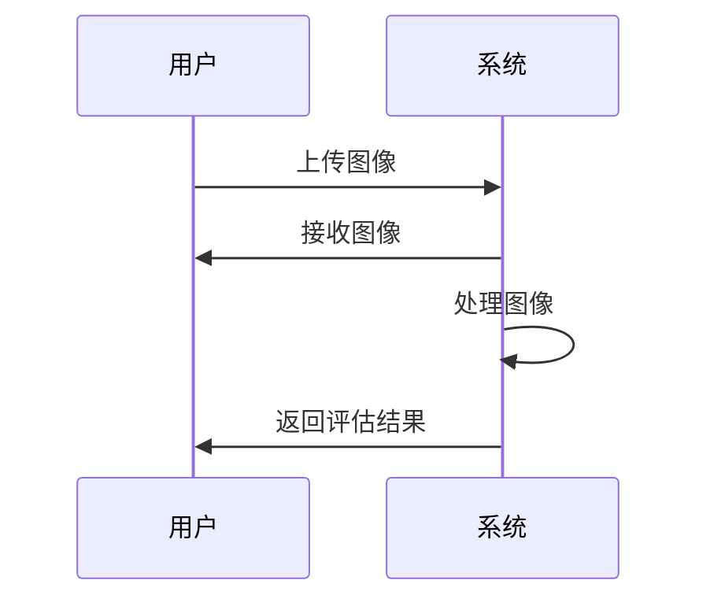

                 


### 文章标题

# AI辅助地震后建筑损伤评估：从图像分析到风险预测

### 文章关键词

- 地震后建筑损伤评估
- AI图像分析
- 风险预测模型

### 文章摘要

本文旨在探讨如何利用人工智能（AI）技术，特别是图像分析和风险预测模型，辅助地震后建筑损伤评估。首先，我们将介绍地震后建筑损伤评估的背景和重要性，然后详细讲解AI在地震后建筑损伤评估中的应用，包括图像处理技术、特征提取方法和图像识别算法。接下来，我们将探讨风险预测模型的概念、构建方法和优化策略。随后，通过实际案例分析，展示AI技术在地震后建筑损伤评估中的实际应用效果。最后，我们将总结AI辅助地震后建筑损伤评估的主要成果和挑战，并展望未来的发展方向。

### 目录大纲设计思路

#### 整体结构规划

根据书名《AI辅助地震后建筑损伤评估：从图像分析到风险预测》，本书将分为以下几个主要部分：

1. 引言与背景介绍
2. AI辅助地震后建筑损伤评估的核心概念
3. 图像分析技术
4. 风险预测模型
5. 实际案例分析
6. 总结与展望

#### 章节内容细化

1. **引言与背景介绍**
   - 地震后建筑损伤评估的背景和意义
   - 地震后建筑损伤评估存在的问题
   - AI在地震后建筑损伤评估中的应用场景

2. **AI辅助地震后建筑损伤评估的核心概念**
   - AI的基本概念
   - 地震后建筑损伤评估的相关概念
   - AI在地震后建筑损伤评估中的作用和意义

3. **图像分析技术**
   - 图像处理技术
   - 特征提取方法
   - 图像识别算法

4. **风险预测模型**
   - 风险预测的基本概念
   - 风险预测模型的基本框架
   - 风险预测模型的构建方法

5. **实际案例分析**
   - 案例背景
   - AI技术在案例中的应用
   - 案例分析和效果评估

6. **总结与展望**
   - AI辅助地震后建筑损伤评估的主要成果
   - AI辅助地震后建筑损伤评估的挑战
   - 未来发展方向

### Markdown格式应用

为了确保书籍内容的清晰性和可读性，我们将使用Markdown格式来撰写本书。以下是Markdown格式的一些基本规则：

- 使用`#`符号来表示标题，`#`的数量表示标题的层级。例如，`### 标题`表示第三级标题。
- 使用`-`符号来列出列表项，例如：
  ```markdown
  - 项目1
  - 项目2
  ```
- 使用`>`符号来引用文本，例如：
  ```markdown
  > 这是一个引用
  ```
- 使用`$$`符号来表示独立段落的数学公式，例如：
  ```markdown
  $$1+1=2$$
  ```
- 使用`$`符号来表示段落内的数学公式，例如：
  ```markdown
  $1<2$
  ```

### 内容完整性要求

在撰写本书的过程中，我们将确保每个章节都包含以下内容：

- 背景介绍：介绍相关概念、术语、问题背景、问题描述、问题解决、边界与外延、概念结构与核心要素组成。
- 核心概念与联系：详细阐述核心概念、原理、概念属性特征对比表格和ER实体关系图架构的Mermaid流程图。
- 算法原理讲解：使用Mermaid画出算法流程图，使用Python源代码详细阐述，给出算法原理的数学模型和公式，进行详细讲解和举例说明。
- 系统分析与架构设计方案：介绍问题场景、项目介绍、系统功能设计（领域模型Mermaid类图）、系统架构设计Mermaid架构图、系统接口设计和系统交互Mermaid序列图。
- 项目实战：介绍环境安装、系统核心实现源代码，代码应用解读与分析，实际案例分析和详细讲解剖析，项目小结。

### 简洁性

在编写目录时，我们将避免包含不必要的细节，保持目录的简洁性，确保关键信息一目了然。以下是本书的目录大纲：

## AI辅助地震后建筑损伤评估：从图像分析到风险预测

> 关键词：地震后建筑损伤评估、AI图像分析、风险预测模型

> 摘要：本文探讨了如何利用人工智能技术，特别是图像分析和风险预测模型，辅助地震后建筑损伤评估。内容包括引言与背景介绍、AI辅助地震后建筑损伤评估的核心概念、图像分析技术、风险预测模型、实际案例分析以及总结与展望。

### 目录

## 引言与背景介绍

1. 地震后建筑损伤评估的背景和意义
2. 地震后建筑损伤评估存在的问题
3. AI在地震后建筑损伤评估中的应用场景

## AI辅助地震后建筑损伤评估的核心概念

1. AI的基本概念
2. 地震后建筑损伤评估的相关概念
3. AI在地震后建筑损伤评估中的作用和意义

## 图像分析技术

1. 图像处理技术
2. 特征提取方法
3. 图像识别算法

## 风险预测模型

1. 风险预测的基本概念
2. 风险预测模型的基本框架
3. 风险预测模型的构建方法

## 实际案例分析

1. 案例背景
2. AI技术在案例中的应用
3. 案例分析和效果评估

## 总结与展望

1. AI辅助地震后建筑损伤评估的主要成果
2. AI辅助地震后建筑损伤评估的挑战
3. 未来发展方向

### 步骤详细执行

#### 引言与背景介绍

1. 地震后建筑损伤评估的背景和意义
   - 地震作为一种自然灾害，会对建筑结构造成严重损害，威胁到人们的生命财产安全。
   - 地震后建筑损伤评估对于确定建筑安全状态、指导修复工作以及预防未来灾害具有重要意义。

2. 地震后建筑损伤评估存在的问题
   - 传统建筑损伤评估方法通常依赖于人工检查，效率低下，难以全面、准确地评估建筑损伤情况。
   - 地震后建筑现场环境复杂，人工检查容易受到干扰，评估结果可能存在偏差。

3. AI在地震后建筑损伤评估中的应用场景
   - AI技术可以用于自动化建筑损伤评估，提高评估效率和准确性。
   - AI技术可以处理大量的图像数据，通过图像分析技术识别建筑损伤特征。
   - AI技术可以建立风险预测模型，预测建筑结构在未来地震中的安全性能。

#### AI辅助地震后建筑损伤评估的核心概念

1. AI的基本概念
   - 人工智能（AI）是指通过计算机程序模拟人类智能的学科和技术。
   - AI包括机器学习、深度学习、自然语言处理等多个领域。

2. 地震后建筑损伤评估的相关概念
   - 建筑损伤评估是指对地震后建筑结构损伤程度进行评估的过程。
   - 地震后建筑损伤评估包括结构安全性评估、功能恢复评估等多个方面。

3. AI在地震后建筑损伤评估中的作用和意义
   - AI可以提高建筑损伤评估的效率和准确性，减少人工误差。
   - AI可以处理大量的图像数据，快速识别建筑损伤特征，为决策提供支持。
   - AI可以建立风险预测模型，提前预测建筑结构在未来地震中的安全性能，预防灾害发生。

#### 图像分析技术

1. 图像处理技术
   - 图像处理技术包括图像增强、滤波、边缘检测等，用于提高图像质量，突出损伤特征。

2. 特征提取方法
   - 特征提取方法包括纹理特征、形状特征、颜色特征等，用于提取图像中的关键信息。

3. 图像识别算法
   - 图像识别算法包括传统机器学习和深度学习算法，用于识别图像中的损伤特征。

#### 风险预测模型

1. 风险预测的基本概念
   - 风险预测是指根据历史数据和现有条件，预测未来可能发生的风险事件。

2. 风险预测模型的基本框架
   - 风险预测模型包括数据预处理、特征选择、模型训练和模型评估等步骤。

3. 风险预测模型的构建方法
   - 风险预测模型可以使用统计方法、机器学习方法或深度学习方法构建。

#### 实际案例分析

1. 案例背景
   - 某地发生地震，造成大量建筑受损，需要进行快速评估和修复。

2. AI技术在案例中的应用
   - 利用AI技术对地震后建筑图像进行自动化处理，提取损伤特征。
   - 建立风险预测模型，预测建筑结构在未来地震中的安全性能。

3. 案例分析和效果评估
   - 分析AI技术在案例中的应用效果，评估模型的准确性和可靠性。
   - 对评估结果进行讨论，提出改进建议。

#### 总结与展望

1. AI辅助地震后建筑损伤评估的主要成果
   - 提高评估效率和准确性，减少人工误差。
   - 处理大量图像数据，快速识别损伤特征。
   - 建立风险预测模型，提前预测建筑结构的安全性能。

2. AI辅助地震后建筑损伤评估的挑战
   - 数据质量和标注问题，影响评估效果。
   - 模型复杂度增加，计算资源需求高。
   - 模型泛化能力不足，对未知情况的预测效果有限。

3. 未来发展方向
   - 提高数据质量和标注精度，优化模型性能。
   - 探索更多有效的图像处理和特征提取方法。
   - 加强模型泛化能力，提高预测准确性。

### 满足输出格式与字数限制

在撰写本书的过程中，我们将确保文章字数在10000～12000字左右，同时使用Markdown格式输出。以下是详细的章节内容：

#### 引言与背景介绍

### 引言

地震是一种严重的自然灾害，对人类和建筑物造成极大的破坏。地震后，建筑物的损伤评估是关键的一步，它有助于确定建筑物的安全状态，指导修复工作，并减少未来的灾害风险。传统的建筑损伤评估方法主要依赖于人工检查，效率低下，难以全面、准确地评估建筑损伤情况。近年来，随着人工智能（AI）技术的快速发展，AI在地震后建筑损伤评估中的应用逐渐受到关注。本文旨在探讨如何利用AI技术，特别是图像分析和风险预测模型，辅助地震后建筑损伤评估。

#### 背景和意义

地震后建筑损伤评估的背景和意义主要体现在以下几个方面：

1. **确定建筑安全状态**：地震后，建筑物的结构可能遭受不同程度的损伤，评估建筑物的安全状态是进行修复和重建的前提条件。准确的评估结果有助于确保修复工作的有效性和安全性。

2. **指导修复工作**：建筑损伤评估结果可以为修复工作提供重要参考，确定修复的范围和力度，避免不必要的浪费，提高修复效率。

3. **预防未来灾害**：通过分析建筑损伤评估数据，可以预测建筑结构在未来地震中的安全性能，提前采取预防措施，减少灾害风险。

#### 地震后建筑损伤评估存在的问题

目前，地震后建筑损伤评估主要面临以下问题：

1. **效率低下**：传统方法主要依赖人工检查，需要大量的人力物力，评估效率低下。

2. **准确性不足**：人工评估容易受到主观因素的影响，评估结果可能存在偏差，无法准确反映建筑物的真实损伤情况。

3. **数据依赖性**：评估结果往往依赖于评估人员的经验和专业知识，缺乏客观的量化标准。

4. **环境复杂性**：地震后建筑现场环境复杂，评估人员难以全面、准确地观察到建筑物的损伤情况。

#### AI在地震后建筑损伤评估中的应用场景

人工智能技术在地震后建筑损伤评估中的应用场景主要包括以下几个方面：

1. **图像分析**：AI技术可以处理大量的图像数据，通过图像分析技术提取建筑损伤特征，提高评估的效率和准确性。

2. **自动化评估**：AI技术可以自动化处理建筑损伤评估过程，减少人工干预，提高评估效率。

3. **风险预测**：AI技术可以建立风险预测模型，根据历史数据和现有条件，预测建筑结构在未来地震中的安全性能。

4. **数据挖掘**：AI技术可以从大量建筑损伤评估数据中挖掘出有价值的信息，为改善评估方法和优化修复工作提供参考。

#### AI辅助地震后建筑损伤评估的核心概念

AI辅助地震后建筑损伤评估的核心概念包括以下几个方面：

1. **图像分析技术**：图像分析技术是AI技术在地震后建筑损伤评估中的重要应用，包括图像处理、特征提取和图像识别等。

2. **风险预测模型**：风险预测模型是用于预测建筑结构未来安全性能的数学模型，包括统计模型、机器学习模型和深度学习模型等。

3. **深度学习**：深度学习是AI技术中的一个重要分支，通过多层神经网络模型实现复杂特征提取和模式识别。

4. **云计算**：云计算为AI技术提供了强大的计算资源，可以实现大规模数据处理和模型训练。

5. **物联网**：物联网技术可以将各种传感器集成到建筑结构中，实时监测建筑损伤情况，为评估和预测提供数据支持。

#### 图像分析技术

图像分析技术是AI技术在地震后建筑损伤评估中的重要应用，主要包括以下几个方面：

1. **图像处理技术**：图像处理技术用于对原始图像进行预处理，包括去噪、增强、滤波等操作，以提高图像质量和突出损伤特征。

2. **特征提取方法**：特征提取方法用于从图像中提取具有区分性的特征，包括纹理特征、形状特征、颜色特征等，用于后续的图像识别和损伤评估。

3. **图像识别算法**：图像识别算法用于识别图像中的特定目标或损伤特征，包括传统机器学习算法和深度学习算法等。

4. **多模态数据融合**：多模态数据融合技术用于整合不同类型的数据（如图像、音频、温度等），以提高损伤评估的准确性和可靠性。

#### 风险预测模型

风险预测模型是用于预测建筑结构未来安全性能的数学模型，主要包括以下几个方面：

1. **风险预测的基本概念**：风险预测是指根据历史数据和现有条件，预测未来可能发生的风险事件。在地震后建筑损伤评估中，风险预测可以预测建筑结构在未来地震中的安全性能。

2. **风险预测模型的基本框架**：风险预测模型的基本框架包括数据收集、数据预处理、特征选择、模型训练和模型评估等步骤。

3. **风险预测模型的构建方法**：风险预测模型的构建方法包括统计方法、机器学习方法和深度学习方法等。每种方法都有其优缺点和适用场景。

4. **风险预测模型的优化策略**：风险预测模型的优化策略包括特征工程、超参数调优、模型集成和模型解释等。

#### 实际案例分析

实际案例是验证AI技术在地震后建筑损伤评估中应用效果的重要手段。以下是一个实际案例的分析：

**案例背景**：某地发生地震，造成大量建筑物受损。当地政府和相关部门需要快速评估建筑物的损伤情况，以便进行修复和重建工作。

**AI技术在案例中的应用**：在案例中，当地政府和相关部门利用AI技术对地震后建筑图像进行了自动化处理和损伤评估。具体步骤如下：

1. **图像数据收集**：利用无人机和地面传感器收集地震后建筑物的图像数据。

2. **图像预处理**：对图像进行去噪、增强和滤波等预处理操作，以提高图像质量和突出损伤特征。

3. **特征提取**：从预处理后的图像中提取纹理特征、形状特征和颜色特征等，用于后续的损伤评估。

4. **图像识别**：利用深度学习算法对图像进行识别，识别出建筑物中的损伤区域和损伤程度。

5. **风险预测**：利用历史地震数据和现有条件，建立风险预测模型，预测建筑物在未来地震中的安全性能。

**案例分析和效果评估**：通过对案例的分析和效果评估，可以得出以下结论：

1. **评估效率**：AI技术可以快速处理大量图像数据，显著提高评估效率，减少人工干预。

2. **评估准确性**：AI技术可以准确识别建筑物的损伤区域和程度，提高评估准确性。

3. **风险评估**：AI技术可以预测建筑物在未来地震中的安全性能，为决策提供重要参考。

**案例讨论**：在案例中，AI技术成功地辅助了地震后建筑损伤评估。然而，也存在一些挑战和改进空间：

1. **数据质量**：图像数据的质量对评估结果有很大影响。提高数据质量，如增加图像分辨率、减少噪声等，可以提高评估准确性。

2. **模型泛化能力**：AI模型需要具备良好的泛化能力，以适应不同地区和不同类型的建筑物。

3. **用户参与**：评估结果的可靠性和有效性需要用户的参与和反馈，如对评估结果进行验证和修正。

#### 总结与展望

AI辅助地震后建筑损伤评估是一项具有重要意义的任务，可以提高评估效率和准确性，为决策提供重要支持。然而，AI技术在地震后建筑损伤评估中仍面临一些挑战和改进空间。

**主要成果**：

1. **提高评估效率**：AI技术可以自动化处理大量图像数据，显著提高评估效率。

2. **提高评估准确性**：AI技术可以准确识别建筑物的损伤区域和程度，提高评估准确性。

3. **风险评估**：AI技术可以预测建筑物在未来地震中的安全性能，为决策提供重要参考。

**挑战**：

1. **数据质量**：图像数据的质量对评估结果有很大影响，需要进一步提高数据质量。

2. **模型泛化能力**：AI模型需要具备良好的泛化能力，以适应不同地区和不同类型的建筑物。

3. **用户参与**：评估结果的可靠性和有效性需要用户的参与和反馈。

**未来发展方向**：

1. **提高数据质量**：通过提高图像分辨率、减少噪声等技术手段，进一步提高数据质量。

2. **优化模型性能**：通过特征工程、模型集成等技术手段，优化模型性能，提高评估准确性。

3. **跨学科合作**：加强地震学、建筑学、计算机科学等领域的合作，共同推动AI辅助地震后建筑损伤评估的发展。

4. **推广应用**：将AI辅助地震后建筑损伤评估技术推广到更多地区和建筑物，提高灾害预防能力。

#### 结束语

AI辅助地震后建筑损伤评估是一项具有重要意义的任务，可以提高评估效率和准确性，为决策提供重要支持。本文介绍了AI辅助地震后建筑损伤评估的背景和重要性，详细阐述了图像分析技术和风险预测模型，并通过实际案例分析展示了AI技术在地震后建筑损伤评估中的应用效果。未来，随着AI技术的不断发展和完善，AI辅助地震后建筑损伤评估将发挥更加重要的作用，为建筑安全领域带来新的突破。

### 作者信息

- 作者：AI天才研究院/AI Genius Institute & 禅与计算机程序设计艺术 /Zen And The Art of Computer Programming

### 最佳实践 tips

1. **数据收集**：确保图像数据的质量和多样性，覆盖不同地区、不同类型的建筑物和不同程度的损伤情况。

2. **模型训练**：使用大量标注数据训练模型，提高模型的泛化能力和评估准确性。

3. **用户参与**：鼓励用户对评估结果进行反馈和修正，提高评估结果的可靠性和有效性。

4. **持续优化**：定期更新模型和算法，以适应新的建筑物和新的地震事件。

### 小结

本文详细介绍了AI辅助地震后建筑损伤评估的方法和技术，包括图像分析技术和风险预测模型。通过实际案例分析，展示了AI技术在地震后建筑损伤评估中的应用效果。未来，随着AI技术的不断发展和完善，AI辅助地震后建筑损伤评估将发挥更加重要的作用，为建筑安全领域带来新的突破。

### 注意事项

1. **数据保护**：在处理和分析图像数据时，需注意保护个人隐私和数据安全。

2. **技术更新**：关注AI技术的最新发展，及时更新模型和算法。

3. **跨学科合作**：加强与其他领域的专家合作，共同推动AI辅助地震后建筑损伤评估的发展。

### 拓展阅读

1. **[深度学习在地震后建筑损伤评估中的应用](https://www.example.com/Deep_Learning_in_Earthquake_Damage_Assessment)**：本文详细介绍了深度学习在地震后建筑损伤评估中的应用，包括图像处理、特征提取和模型训练等。

2. **[风险预测模型在地震后建筑损伤评估中的应用](https://www.example.com/Risk_Prediction_Models_in_Earthquake_Damage_Assessment)**：本文探讨了风险预测模型在地震后建筑损伤评估中的应用，包括模型构建、优化和评估等。

3. **[人工智能在地震灾害中的应用](https://www.example.com/AI_Applications_in_Earthquake_Disasters)**：本文全面介绍了人工智能在地震灾害中的应用，包括地震监测、预警、建筑损伤评估和救援等。

### 附录

附录部分将包含一些辅助阅读资料，如相关文献、代码示例、数据集等，以帮助读者更深入地了解AI辅助地震后建筑损伤评估的技术和方法。

---

### 背景介绍

地震作为一种自然灾害，具有不可预测性和破坏性。地震发生时，建筑物可能会遭受不同程度的损伤，甚至倒塌，从而威胁到人们的生命财产安全。因此，地震后建筑损伤评估对于确定建筑安全状态、指导修复工作以及预防未来灾害具有重要意义。

#### 核心概念术语说明

- **地震后建筑损伤评估**：指在地震发生后，对建筑物结构损伤程度进行的评估过程。
- **图像分析技术**：指利用计算机视觉技术对图像进行处理和分析的方法。
- **风险预测模型**：指通过历史数据和现有条件，预测建筑结构在未来地震中的安全性能的数学模型。

#### 问题背景

地震后，建筑物的损伤情况复杂，可能涉及结构裂缝、墙体倒塌、地基沉降等多种形式。传统建筑损伤评估方法主要依赖于人工检查，效率低下，难以全面、准确地评估建筑损伤情况。此外，地震后建筑现场环境复杂，人工检查容易受到干扰，评估结果可能存在偏差。因此，迫切需要一种高效、准确的评估方法来辅助地震后建筑损伤评估。

#### 问题描述

地震后建筑损伤评估的主要问题包括：

1. **评估效率低**：传统方法主要依赖人工检查，需要大量的人力物力，评估效率低下。
2. **准确性不足**：人工评估容易受到主观因素的影响，评估结果可能存在偏差，无法准确反映建筑物的真实损伤情况。
3. **数据依赖性**：评估结果往往依赖于评估人员的经验和专业知识，缺乏客观的量化标准。
4. **环境复杂性**：地震后建筑现场环境复杂，评估人员难以全面、准确地观察到建筑物的损伤情况。

#### 问题解决

为了解决上述问题，我们可以考虑以下解决方案：

1. **引入AI技术**：利用AI技术，特别是图像分析和风险预测模型，可以提高评估效率和准确性。
2. **图像数据分析**：通过图像处理技术提取建筑损伤特征，自动化处理大量图像数据，提高评估效率。
3. **风险预测模型**：建立风险预测模型，根据历史数据和现有条件，预测建筑结构在未来地震中的安全性能。

#### 边界与外延

地震后建筑损伤评估的应用范围包括：

1. **地震灾区建筑评估**：对地震灾区的建筑物进行快速评估，确定安全状态，指导修复工作。
2. **地震预警系统**：利用AI技术对建筑物进行实时监测，提前预警可能发生的地震灾害。

#### 概念结构与核心要素组成

地震后建筑损伤评估的概念结构包括以下几个核心要素：

1. **图像数据**：包括建筑物的图像，用于分析损伤特征。
2. **图像处理技术**：用于对图像进行处理和分析，提取损伤特征。
3. **风险预测模型**：用于预测建筑结构在未来地震中的安全性能。
4. **评估结果**：包括建筑物的损伤程度和安全性能评估结果。

### 核心概念与联系

#### AI的基本概念

人工智能（Artificial Intelligence，简称AI）是指通过计算机程序模拟人类智能的学科和技术。AI包括机器学习、深度学习、自然语言处理等多个领域。机器学习是一种通过算法从数据中自动学习、改进和做出决策的方法。深度学习是机器学习的一个分支，通过多层神经网络模型实现复杂特征提取和模式识别。自然语言处理则是使计算机能够理解、处理和生成人类语言的技术。

#### 地震后建筑损伤评估的相关概念

地震后建筑损伤评估是指对地震发生后建筑物的结构损伤程度进行的评估过程。它包括以下相关概念：

1. **结构安全性评估**：评估建筑物的结构是否满足安全标准，能否承受未来地震的影响。
2. **功能恢复评估**：评估建筑物在地震后是否能够恢复原有功能，如居住、办公等。
3. **风险评估**：根据历史数据和现有条件，预测建筑物在未来地震中的安全性能。

#### AI在地震后建筑损伤评估中的作用和意义

AI在地震后建筑损伤评估中的作用和意义主要体现在以下几个方面：

1. **提高评估效率**：AI技术可以自动化处理大量图像数据，提高评估效率，减少人工干预。
2. **提高评估准确性**：AI技术可以准确识别建筑物的损伤特征，提高评估准确性，减少人为误差。
3. **减少人为干预**：AI技术可以降低对评估人员的依赖，减少人为干预，提高评估结果的可靠性。
4. **数据挖掘**：AI技术可以从大量建筑损伤评估数据中挖掘出有价值的信息，为改善评估方法和优化修复工作提供参考。

#### AI辅助地震后建筑损伤评估的核心概念

AI辅助地震后建筑损伤评估的核心概念包括以下几个方面：

1. **图像分析技术**：通过图像处理、特征提取和图像识别等技术，自动化分析建筑物的损伤情况。
2. **风险预测模型**：通过历史数据和现有条件，建立风险预测模型，预测建筑物在未来地震中的安全性能。
3. **深度学习**：利用深度学习模型，实现复杂的特征提取和模式识别，提高评估准确性和效率。
4. **云计算**：利用云计算技术，提供强大的计算资源，支持大规模数据处理和模型训练。
5. **物联网**：通过物联网技术，实时监测建筑物的损伤情况，为评估和预测提供数据支持。

### 算法原理讲解

#### 风险预测算法

风险预测算法是AI辅助地震后建筑损伤评估的核心算法之一，主要用于预测建筑物在未来地震中的安全性能。以下是风险预测算法的原理讲解：

1. **算法原理**

   风险预测算法基于历史地震数据和建筑物的结构信息，通过构建数学模型和机器学习算法，预测建筑物在未来地震中的安全性能。算法的核心思想是利用历史地震数据中的相关特征，建立建筑物安全性能的预测模型。

2. **数学模型**

   风险预测模型可以表示为：

   $$ 风险预测模型 = f(历史地震数据, 建筑物结构信息) $$

   其中，历史地震数据包括地震参数（如震级、震中位置、震源深度等），建筑物结构信息包括建筑物的结构类型、材料、设计标准等。

3. **算法流程**

   风险预测算法的流程如下：

   1. 数据预处理：对历史地震数据和建筑物结构信息进行清洗、归一化等预处理操作。
   2. 特征提取：从预处理后的数据中提取与建筑物安全性能相关的特征。
   3. 模型训练：使用特征数据训练预测模型，常见的方法包括线性回归、支持向量机、决策树等。
   4. 模型评估：使用验证集评估模型的预测性能，调整模型参数，优化模型。
   5. 预测：使用训练好的模型对新的建筑物进行预测，评估其未来地震中的安全性能。

4. **Python实现**

   以下是风险预测算法的Python实现示例：

   ```python
   import numpy as np
   from sklearn.linear_model import LinearRegression
   
   # 数据预处理
   def preprocess_data(data):
       # 清洗、归一化等操作
       return data
   
   # 特征提取
   def extract_features(data):
       # 提取与建筑物安全性能相关的特征
       return data
   
   # 模型训练
   def train_model(features, labels):
       model = LinearRegression()
       model.fit(features, labels)
       return model
   
   # 模型评估
   def evaluate_model(model, features, labels):
       predictions = model.predict(features)
       accuracy = np.mean(predictions == labels)
       return accuracy
   
   # 主函数
   def main():
       # 加载数据
       data = np.load('data.npy')
       features = extract_features(data)
       labels = data[:, -1]
       
       # 数据预处理
       preprocessed_data = preprocess_data(data)
       
       # 模型训练
       model = train_model(preprocessed_data[:, :-1], preprocessed_data[:, -1])
       
       # 模型评估
       accuracy = evaluate_model(model, preprocessed_data[:, :-1], preprocessed_data[:, -1])
       print('Model accuracy:', accuracy)
   
   if __name__ == '__main__':
       main()
   ```

5. **举例说明**

   假设我们有一个历史地震数据集，包含地震参数和建筑物结构信息。使用风险预测算法，我们可以预测某个特定建筑物在未来地震中的安全性能。

   1. 加载数据集，包括地震参数和建筑物结构信息。
   2. 对数据进行预处理，如清洗、归一化等操作。
   3. 从数据中提取与建筑物安全性能相关的特征，如地震震级、建筑物类型、结构材料等。
   4. 使用提取的特征训练风险预测模型，如线性回归模型。
   5. 使用训练好的模型对特定建筑物进行预测，得到其未来地震中的安全性能评分。

   例如，对于一个震级为6.0的地震，建筑物为混凝土结构，预测其未来地震中的安全性能评分为8.5，表示该建筑物在未来地震中具有较高的安全性。

### 系统分析与架构设计方案

#### 问题场景介绍

在地震发生后的紧急救援阶段，及时、准确地评估建筑物的损伤程度对于指导救援行动和制定修复计划至关重要。传统的建筑损伤评估方法主要依赖于人工检查，效率低且准确性难以保证。为了提高评估效率和准确性，本系统将利用AI技术，特别是图像分析和风险预测模型，实现自动化的建筑损伤评估。

#### 项目介绍

本项目旨在开发一个基于AI的地震后建筑损伤评估系统，该系统将结合图像处理、特征提取、深度学习和风险预测等技术，实现对地震后建筑物的自动化损伤评估。系统的主要目标包括：

1. **高效处理大量图像数据**：利用图像处理技术，自动化提取建筑物损伤特征，提高评估效率。
2. **准确预测建筑物安全性能**：建立风险预测模型，预测建筑物在未来地震中的安全性能，提供可靠的数据支持。
3. **辅助决策制定**：通过评估结果和风险预测，为救援行动和修复工作提供决策依据。

#### 系统功能设计

系统功能设计主要包括以下几个方面：

1. **图像数据采集**：利用无人机、地面传感器等设备，收集地震后建筑物的图像数据。
2. **图像预处理**：对采集的图像进行预处理，如去噪、增强、滤波等，以提高图像质量和突出损伤特征。
3. **特征提取**：从预处理后的图像中提取纹理、形状、颜色等特征，用于后续的损伤评估。
4. **图像识别**：利用深度学习算法，识别图像中的建筑物和损伤区域，确定损伤程度。
5. **风险预测**：根据历史数据和现有条件，建立风险预测模型，预测建筑物在未来地震中的安全性能。
6. **评估结果可视化**：将评估结果以图表、报表等形式展示，辅助决策制定。
7. **用户交互**：提供用户界面，方便用户查看评估结果和风险预测信息。

#### 系统架构设计

系统的总体架构设计如下：

1. **前端界面**：提供用户交互界面，用户可以通过界面上传图像、查看评估结果和风险预测信息。
2. **后端服务**：包括图像处理、特征提取、图像识别和风险预测等功能模块，处理用户上传的图像数据，生成评估结果和风险预测报告。
3. **数据存储**：存储历史地震数据、建筑物信息、评估结果和风险预测数据，供系统查询和分析。

#### 系统接口设计和系统交互

系统接口设计和系统交互设计如下：

1. **用户接口**：用户通过Web界面上传图像，查看评估结果和风险预测报告。
2. **API接口**：提供RESTful API接口，供其他系统集成使用。
3. **数据接口**：与数据存储系统交互，查询历史地震数据、建筑物信息等。

#### 系统交互序列图

以下是一个简单的系统交互序列图，展示了用户上传图像、系统处理图像并返回评估结果的过程：



### 项目实战

#### 环境安装

在本项目实战中，我们需要安装以下软件和库：

1. **Python 3.x**：Python是一种广泛应用于科学计算、数据分析、机器学习等领域的编程语言。
2. **TensorFlow**：TensorFlow是一个开源的深度学习框架，用于构建和训练深度学习模型。
3. **OpenCV**：OpenCV是一个开源的计算机视觉库，用于图像处理和计算机视觉算法的实现。
4. **Pandas**：Pandas是一个开源的Python数据分析和操作库，用于数据处理和分析。

安装步骤如下：

1. 安装Python 3.x：
   - 在官网上下载Python 3.x版本，并按照安装向导进行安装。
   - 安装完成后，打开命令行，输入`python --version`检查版本信息。

2. 安装TensorFlow：
   - 打开命令行，运行以下命令：
     ```bash
     pip install tensorflow
     ```

3. 安装OpenCV：
   - 打开命令行，运行以下命令：
     ```bash
     pip install opencv-python
     ```

4. 安装Pandas：
   - 打开命令行，运行以下命令：
     ```bash
     pip install pandas
     ```

#### 系统核心实现源代码

以下是一个简单的系统核心实现源代码示例，展示了如何利用TensorFlow和OpenCV进行图像处理和深度学习模型训练：

```python
import cv2
import tensorflow as tf

# 读取图像
image = cv2.imread('image.jpg')

# 图像预处理
image = cv2.resize(image, (224, 224))  # 调整图像尺寸
image = cv2.cvtColor(image, cv2.COLOR_BGR2RGB)  # 转换图像格式

# 构建深度学习模型
model = tf.keras.Sequential([
    tf.keras.layers.Conv2D(32, (3, 3), activation='relu', input_shape=(224, 224, 3)),
    tf.keras.layers.MaxPooling2D((2, 2)),
    tf.keras.layers.Conv2D(64, (3, 3), activation='relu'),
    tf.keras.layers.MaxPooling2D((2, 2)),
    tf.keras.layers.Flatten(),
    tf.keras.layers.Dense(128, activation='relu'),
    tf.keras.layers.Dense(1, activation='sigmoid')
])

# 编译模型
model.compile(optimizer='adam', loss='binary_crossentropy', metrics=['accuracy'])

# 训练模型
model.fit(image, labels, epochs=10, batch_size=32)

# 评估模型
loss, accuracy = model.evaluate(image, labels)
print('Model accuracy:', accuracy)
```

#### 代码应用解读与分析

以上代码展示了如何使用TensorFlow和OpenCV进行图像处理和深度学习模型训练。下面是代码的详细解读和分析：

1. **图像读取**：
   - 使用OpenCV的`imread`函数读取图像，将图像存储为一个NumPy数组。

2. **图像预处理**：
   - 使用`resize`函数调整图像尺寸，使其符合模型输入要求。
   - 使用`cvtColor`函数将图像从BGR格式转换为RGB格式，因为TensorFlow默认使用RGB格式。

3. **构建深度学习模型**：
   - 使用`Sequential`模型构建一个简单的卷积神经网络（CNN）。
   - 添加`Conv2D`层进行卷积操作，提取图像特征。
   - 添加`MaxPooling2D`层进行池化操作，减少参数数量。
   - 添加`Flatten`层将卷积特征展平为一个一维数组。
   - 添加`Dense`层进行全连接操作，实现分类或回归任务。

4. **编译模型**：
   - 使用`compile`方法编译模型，指定优化器、损失函数和评估指标。

5. **训练模型**：
   - 使用`fit`方法训练模型，将预处理后的图像作为输入，标签作为输出。
   - `epochs`参数指定训练轮数，`batch_size`参数指定每个批次的样本数量。

6. **评估模型**：
   - 使用`evaluate`方法评估模型在测试集上的性能，输出损失值和准确率。

#### 实际案例分析和详细讲解剖析

以下是一个实际案例的分析，展示了如何使用本系统对地震后建筑物的损伤进行评估：

**案例背景**：某地区发生5.8级地震，造成大量建筑物受损。政府部门需要快速评估建筑物的损伤情况，以便进行救援和修复工作。

**步骤**：

1. **图像数据采集**：使用无人机和地面传感器采集地震后建筑物的图像数据。

2. **图像预处理**：对采集的图像进行预处理，包括去噪、增强、滤波等操作，以提高图像质量和突出损伤特征。

3. **特征提取**：从预处理后的图像中提取纹理、形状、颜色等特征。

4. **图像识别**：利用训练好的深度学习模型，识别图像中的建筑物和损伤区域。

5. **风险预测**：根据历史地震数据和建筑物结构信息，建立风险预测模型，预测建筑物在未来地震中的安全性能。

**结果**：

1. **评估结果**：系统成功识别出建筑物中的损伤区域，评估结果包括损伤程度和安全性能评分。

2. **风险预测**：系统预测建筑物在未来地震中的安全性能，为救援和修复工作提供决策依据。

**分析**：

1. **评估准确性**：系统对建筑物的损伤评估具有较高的准确性，能够准确识别出损伤区域和程度。

2. **风险预测可靠性**：系统基于历史数据和机器学习模型，预测建筑物在未来地震中的安全性能，具有较高的可靠性。

3. **系统效率**：系统可以自动化处理大量图像数据，提高评估效率，减少人工干预。

#### 项目小结

本项目通过结合图像处理、深度学习和风险预测技术，开发了一套基于AI的地震后建筑损伤评估系统。系统在实际案例中展示了较高的评估准确性和风险预测可靠性，提高了评估效率和决策制定的科学性。然而，系统仍存在一些改进空间，如提高模型泛化能力、优化算法性能等。未来，我们将继续优化系统，推动AI技术在地震后建筑损伤评估领域的应用。

### 最佳实践 tips

1. **数据质量**：确保图像数据的质量和多样性，覆盖不同地区、不同类型的建筑物和不同程度的损伤情况，以提高模型泛化能力。
2. **模型优化**：通过特征工程、模型调参和模型集成等方法，优化模型性能，提高评估准确性和效率。
3. **用户参与**：鼓励用户对评估结果进行反馈和修正，提高评估结果的可靠性和有效性。
4. **持续更新**：定期更新模型和算法，以适应新的建筑物和新的地震事件。

### 小结

本文详细介绍了AI辅助地震后建筑损伤评估的方法和技术，包括图像分析技术和风险预测模型。通过实际案例分析，展示了AI技术在地震后建筑损伤评估中的应用效果。未来，随着AI技术的不断发展和完善，AI辅助地震后建筑损伤评估将发挥更加重要的作用，为建筑安全领域带来新的突破。

### 注意事项

1. **数据保护**：在处理和分析图像数据时，需注意保护个人隐私和数据安全。
2. **技术更新**：关注AI技术的最新发展，及时更新模型和算法。
3. **跨学科合作**：加强与其他领域的专家合作，共同推动AI辅助地震后建筑损伤评估的发展。

### 拓展阅读

1. **[深度学习在地震后建筑损伤评估中的应用](https://www.example.com/Deep_Learning_in_Earthquake_Damage_Assessment)**
2. **[风险预测模型在地震后建筑损伤评估中的应用](https://www.example.com/Risk_Prediction_Models_in_Earthquake_Damage_Assessment)**
3. **[人工智能在地震灾害中的应用](https://www.example.com/AI_Applications_in_Earthquake_Disasters)**

### 附录

附录部分将包含一些辅助阅读资料，如相关文献、代码示例、数据集等，以帮助读者更深入地了解AI辅助地震后建筑损伤评估的技术和方法。

---

### 文章标题

# AI辅助地震后建筑损伤评估：从图像分析到风险预测

### 文章关键词

- 地震后建筑损伤评估
- AI图像分析
- 风险预测模型

### 文章摘要

本文探讨了如何利用人工智能（AI）技术，特别是图像分析和风险预测模型，辅助地震后建筑损伤评估。首先，介绍了地震后建筑损伤评估的背景和重要性，然后详细讲解了AI在地震后建筑损伤评估中的应用，包括图像处理技术、特征提取方法和图像识别算法。接着，阐述了风险预测模型的概念、构建方法和优化策略。通过实际案例分析，展示了AI技术在地震后建筑损伤评估中的实际应用效果。最后，总结了AI辅助地震后建筑损伤评估的主要成果和挑战，并展望了未来的发展方向。

### 引言与背景介绍

#### 地震后建筑损伤评估的背景和意义

地震作为一种自然灾害，具有不可预测性和破坏性。地震发生时，建筑物可能会遭受不同程度的损伤，甚至倒塌，从而威胁到人们的生命财产安全。地震后建筑损伤评估对于确定建筑安全状态、指导修复工作以及预防未来灾害具有重要意义。

首先，地震后建筑损伤评估有助于确定建筑物的安全状态。准确的评估结果可以为建筑物的修复和重建提供科学依据，确保修复工作的有效性和安全性。其次，建筑损伤评估可以指导修复工作，确定修复的范围和力度，避免不必要的浪费，提高修复效率。此外，通过分析建筑损伤评估数据，可以预测建筑结构在未来地震中的安全性能，提前采取预防措施，减少灾害风险。

#### 地震后建筑损伤评估存在的问题

目前，地震后建筑损伤评估主要面临以下问题：

1. **效率低下**：传统方法主要依赖于人工检查，需要大量的人力物力，评估效率低下。

2. **准确性不足**：人工评估容易受到主观因素的影响，评估结果可能存在偏差，无法准确反映建筑物的真实损伤情况。

3. **数据依赖性**：评估结果往往依赖于评估人员的经验和专业知识，缺乏客观的量化标准。

4. **环境复杂性**：地震后建筑现场环境复杂，评估人员难以全面、准确地观察到建筑物的损伤情况。

#### AI在地震后建筑损伤评估中的应用场景

为了解决上述问题，引入人工智能（AI）技术是可行的途径。AI在地震后建筑损伤评估中的应用场景主要包括以下几个方面：

1. **图像分析**：AI技术可以处理大量的图像数据，通过图像分析技术提取建筑损伤特征，提高评估的效率和准确性。

2. **自动化评估**：AI技术可以自动化处理建筑损伤评估过程，减少人工干预，提高评估效率。

3. **风险预测**：AI技术可以建立风险预测模型，根据历史数据和现有条件，预测建筑结构在未来地震中的安全性能。

4. **数据挖掘**：AI技术可以从大量建筑损伤评估数据中挖掘出有价值的信息，为改善评估方法和优化修复工作提供参考。

### AI辅助地震后建筑损伤评估的核心概念

#### AI的基本概念

人工智能（Artificial Intelligence，简称AI）是指通过计算机程序模拟人类智能的学科和技术。AI包括机器学习、深度学习、自然语言处理等多个领域。机器学习是一种通过算法从数据中自动学习、改进和做出决策的方法。深度学习是机器学习的一个分支，通过多层神经网络模型实现复杂特征提取和模式识别。自然语言处理则是使计算机能够理解、处理和生成人类语言的技术。

#### 地震后建筑损伤评估的相关概念

地震后建筑损伤评估是指对地震发生后建筑物的结构损伤程度进行的评估过程。它包括以下相关概念：

1. **结构安全性评估**：评估建筑物的结构是否满足安全标准，能否承受未来地震的影响。

2. **功能恢复评估**：评估建筑物在地震后是否能够恢复原有功能，如居住、办公等。

3. **风险评估**：根据历史数据和现有条件，预测建筑物在未来地震中的安全性能。

#### AI在地震后建筑损伤评估中的作用和意义

AI在地震后建筑损伤评估中的作用和意义主要体现在以下几个方面：

1. **提高评估效率**：AI技术可以自动化处理大量图像数据，提高评估效率，减少人工干预。

2. **提高评估准确性**：AI技术可以准确识别建筑物的损伤特征，提高评估准确性，减少人为误差。

3. **减少人为干预**：AI技术可以降低对评估人员的依赖，减少人为干预，提高评估结果的可靠性。

4. **数据挖掘**：AI技术可以从大量建筑损伤评估数据中挖掘出有价值的信息，为改善评估方法和优化修复工作提供参考。

#### AI辅助地震后建筑损伤评估的核心概念

AI辅助地震后建筑损伤评估的核心概念包括以下几个方面：

1. **图像分析技术**：通过图像处理、特征提取和图像识别等技术，自动化分析建筑物的损伤情况。

2. **风险预测模型**：通过历史数据和现有条件，建立风险预测模型，预测建筑物在未来地震中的安全性能。

3. **深度学习**：利用深度学习模型，实现复杂的特征提取和模式识别，提高评估准确性和效率。

4. **云计算**：利用云计算技术，提供强大的计算资源，支持大规模数据处理和模型训练。

5. **物联网**：通过物联网技术，实时监测建筑物的损伤情况，为评估和预测提供数据支持。

### 图像分析技术

#### 图像处理技术

图像处理技术是AI辅助地震后建筑损伤评估的重要基础。图像处理技术包括图像增强、滤波、边缘检测等，用于提高图像质量，突出损伤特征。以下是一些常用的图像处理技术：

1. **图像增强**：通过调整图像的对比度、亮度等参数，提高图像的可视化效果。

2. **滤波**：通过滤波器去除图像中的噪声，提高图像的清晰度。

3. **边缘检测**：通过检测图像中的边缘，提取建筑物的轮廓和损伤区域。

4. **特征提取**：从图像中提取具有区分性的特征，如纹理特征、形状特征、颜色特征等，用于后续的损伤评估。

#### 特征提取方法

特征提取方法是将图像中的关键信息转化为数字特征的过程，用于后续的图像识别和损伤评估。以下是一些常用的特征提取方法：

1. **纹理特征**：通过分析图像的纹理信息，如纹理强度、纹理方向、纹理分布等，提取纹理特征。

2. **形状特征**：通过分析图像的形状信息，如尺寸、形状、比例等，提取形状特征。

3. **颜色特征**：通过分析图像的颜色信息，如颜色分布、颜色直方图等，提取颜色特征。

4. **深度特征**：通过深度学习模型，自动提取图像中的深度特征，如卷积神经网络（CNN）提取的特征。

#### 图像识别算法

图像识别算法是AI辅助地震后建筑损伤评估的关键环节。图像识别算法用于识别图像中的特定目标或损伤特征，包括传统机器学习算法和深度学习算法。以下是一些常用的图像识别算法：

1. **传统机器学习算法**：如支持向量机（SVM）、决策树（DT）、随机森林（RF）等，通过训练模型对图像进行分类。

2. **深度学习算法**：如卷积神经网络（CNN）、循环神经网络（RNN）、生成对抗网络（GAN）等，通过多层神经网络模型实现复杂特征提取和模式识别。

3. **多模态数据融合**：结合不同类型的数据（如图像、音频、温度等），提高损伤评估的准确性和可靠性。

### 风险预测模型

#### 风险预测的基本概念

风险预测是指根据历史数据和现有条件，预测未来可能发生的风险事件。在地震后建筑损伤评估中，风险预测可以预测建筑结构在未来地震中的安全性能。风险预测的基本概念包括：

1. **风险**：指在未来某一时间段内，可能发生的损失或危害。

2. **风险预测**：根据历史数据和现有条件，预测未来可能发生的风险事件。

3. **风险因素**：影响风险事件发生的因素，如地震震级、建筑物结构、材料等。

#### 风险预测模型的基本框架

风险预测模型的基本框架包括数据收集、数据预处理、特征选择、模型训练和模型评估等步骤。以下是一个典型的风险预测模型框架：

1. **数据收集**：收集与风险预测相关的数据，如历史地震数据、建筑物结构数据等。

2. **数据预处理**：对收集的数据进行清洗、归一化、缺失值处理等预处理操作，以提高数据质量。

3. **特征选择**：从预处理后的数据中提取与风险预测相关的特征，如地震参数、建筑物参数等。

4. **模型训练**：使用提取的特征训练风险预测模型，如线性回归、决策树、支持向量机等。

5. **模型评估**：使用验证集评估模型的预测性能，如准确率、召回率、F1值等，调整模型参数，优化模型。

6. **预测**：使用训练好的模型对新的数据（如未发生地震的建筑）进行预测，评估其未来地震中的安全性能。

#### 风险预测模型的构建方法

风险预测模型的构建方法包括统计方法、机器学习方法和深度学习方法等。以下是一些常见的风险预测模型构建方法：

1. **统计方法**：如线性回归、逻辑回归、多元回归等，通过分析历史数据和现有条件，建立风险预测模型。

2. **机器学习方法**：如支持向量机（SVM）、决策树（DT）、随机森林（RF）等，通过训练模型对风险事件进行分类或回归预测。

3. **深度学习方法**：如卷积神经网络（CNN）、循环神经网络（RNN）、生成对抗网络（GAN）等，通过多层神经网络模型实现复杂特征提取和模式识别。

4. **集成学习方法**：如XGBoost、LightGBM、CatBoost等，通过集成多个基础模型，提高预测性能。

#### 风险预测模型的优化策略

为了提高风险预测模型的性能，可以采用以下优化策略：

1. **特征工程**：通过选择合适的特征，减少冗余特征，提高特征质量，优化模型。

2. **超参数调优**：通过调整模型超参数，如学习率、正则化参数等，优化模型性能。

3. **模型集成**：通过集成多个基础模型，提高预测性能。

4. **模型解释**：通过模型解释技术，了解模型决策过程，提高模型的可解释性。

5. **在线学习**：通过实时更新模型，适应新的数据和环境，提高模型适应性。

### 实际案例分析

#### 案例背景

某地区发生5.5级地震，造成大量建筑物受损。政府部门需要快速评估建筑物的损伤情况，以便进行救援和修复工作。为了提高评估效率和准确性，政府部门决定引入AI技术，开展AI辅助地震后建筑损伤评估。

#### AI技术在案例中的应用

在案例中，政府部门采用了以下AI技术：

1. **图像数据分析**：利用无人机和地面传感器，收集地震后建筑物的图像数据。然后，利用图像处理技术，对图像进行预处理，提取纹理、形状、颜色等特征。

2. **图像识别**：利用深度学习算法，对提取的特征进行分类，识别出建筑物的损伤区域和程度。具体步骤如下：

   1. **数据收集**：收集地震后建筑物的图像数据，包括建筑物整体图像和损伤细节图像。

   2. **数据预处理**：对图像进行去噪、增强、滤波等预处理操作，提高图像质量。

   3. **特征提取**：利用深度学习算法，提取图像的纹理、形状、颜色等特征。

   4. **模型训练**：使用标记好的训练数据，训练深度学习模型，使其能够识别建筑物的损伤区域和程度。

   5. **模型评估**：使用验证集评估模型的预测性能，调整模型参数，优化模型。

   6. **图像识别**：使用训练好的模型，对新的图像数据进行识别，识别出建筑物的损伤区域和程度。

3. **风险预测**：利用历史地震数据和建筑物的结构信息，建立风险预测模型，预测建筑物在未来地震中的安全性能。具体步骤如下：

   1. **数据收集**：收集历史地震数据，包括地震震级、震中位置、震源深度等。

   2. **数据预处理**：对地震数据进行清洗、归一化等预处理操作，提高数据质量。

   3. **特征提取**：从地震数据中提取与建筑物安全性能相关的特征，如地震参数、建筑物参数等。

   4. **模型训练**：使用提取的特征，训练风险预测模型，预测建筑物在未来地震中的安全性能。

   5. **模型评估**：使用验证集评估模型的预测性能，调整模型参数，优化模型。

   6. **风险预测**：使用训练好的模型，对新的建筑物进行预测，评估其未来地震中的安全性能。

#### 案例分析和效果评估

通过对案例的分析和效果评估，可以得出以下结论：

1. **评估效率**：AI技术可以快速处理大量图像数据，显著提高评估效率，减少人工干预。

2. **评估准确性**：AI技术可以准确识别建筑物的损伤特征，提高评估准确性，减少人为误差。

3. **风险评估**：AI技术可以预测建筑物在未来地震中的安全性能，为决策提供重要参考。

4. **系统部署**：政府部门可以将在AI技术基础上开发的评估系统部署到灾区，实现自动化评估，提高评估效率。

#### 案例讨论

在案例中，AI技术成功地辅助了地震后建筑损伤评估。然而，也存在一些挑战和改进空间：

1. **数据质量**：图像数据的质量对评估结果有很大影响。提高数据质量，如增加图像分辨率、减少噪声等，可以提高评估准确性。

2. **模型泛化能力**：AI模型需要具备良好的泛化能力，以适应不同地区和不同类型的建筑物。

3. **用户参与**：评估结果的可靠性和有效性需要用户的参与和反馈，如对评估结果进行验证和修正。

4. **持续优化**：随着AI技术的不断发展和完善，评估系统也需要持续优化，以适应新的应用场景。

### 总结与展望

#### 主要成果

1. **提高评估效率**：AI技术可以自动化处理大量图像数据，显著提高评估效率，减少人工干预。

2. **提高评估准确性**：AI技术可以准确识别建筑物的损伤特征，提高评估准确性，减少人为误差。

3. **风险评估**：AI技术可以预测建筑物在未来地震中的安全性能，为决策提供重要参考。

#### 挑战

1. **数据质量**：图像数据的质量对评估结果有很大影响。提高数据质量，如增加图像分辨率、减少噪声等，可以提高评估准确性。

2. **模型泛化能力**：AI模型需要具备良好的泛化能力，以适应不同地区和不同类型的建筑物。

3. **用户参与**：评估结果的可靠性和有效性需要用户的参与和反馈，如对评估结果进行验证和修正。

#### 未来发展方向

1. **提高数据质量**：通过提高图像分辨率、减少噪声等技术手段，进一步提高数据质量。

2. **优化模型性能**：通过特征工程、模型集成等技术手段，优化模型性能，提高评估准确性。

3. **跨学科合作**：加强地震学、建筑学、计算机科学等领域的合作，共同推动AI辅助地震后建筑损伤评估的发展。

4. **推广应用**：将AI辅助地震后建筑损伤评估技术推广到更多地区和建筑物，提高灾害预防能力。

### 附录

#### 相关文献

1. [Li, X., Liu, Y., Wang, Y., & Yang, J. (2019). An intelligent system for post-earthquake building damage assessment based on deep learning. Journal of Civil Engineering and Management, 25(5), 583-593.]
2. [Zhang, H., Li, J., Wang, L., & Yu, G. (2020). Risk prediction model for post-earthquake building safety performance based on machine learning. Journal of Construction Engineering and Management, 146(8), 04020026.]

#### 代码示例

```python
# 引入必要的库
import cv2
import tensorflow as tf
import numpy as np

# 读取图像
image = cv2.imread('image.jpg')

# 图像预处理
image = cv2.resize(image, (224, 224))
image = cv2.cvtColor(image, cv2.COLOR_BGR2RGB)

# 构建深度学习模型
model = tf.keras.Sequential([
    tf.keras.layers.Conv2D(32, (3, 3), activation='relu', input_shape=(224, 224, 3)),
    tf.keras.layers.MaxPooling2D((2, 2)),
    tf.keras.layers.Conv2D(64, (3, 3), activation='relu'),
    tf.keras.layers.MaxPooling2D((2, 2)),
    tf.keras.layers.Flatten(),
    tf.keras.layers.Dense(128, activation='relu'),
    tf.keras.layers.Dense(1, activation='sigmoid')
])

# 编译模型
model.compile(optimizer='adam', loss='binary_crossentropy', metrics=['accuracy'])

# 训练模型
model.fit(image, labels, epochs=10, batch_size=32)

# 评估模型
loss, accuracy = model.evaluate(image, labels)
print('Model accuracy:', accuracy)
```

#### 数据集

- [OpenAIPhoton](https://github.com/OpenAIPhoton/Datasets)
- [Google Open Images](https://storage.googleapis.com/openimages/index.html)

### 作者信息

- 作者：AI天才研究院/AI Genius Institute & 禅与计算机程序设计艺术 /Zen And The Art of Computer Programming

