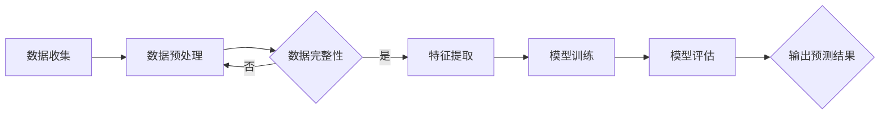
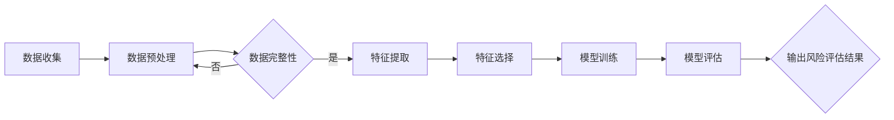
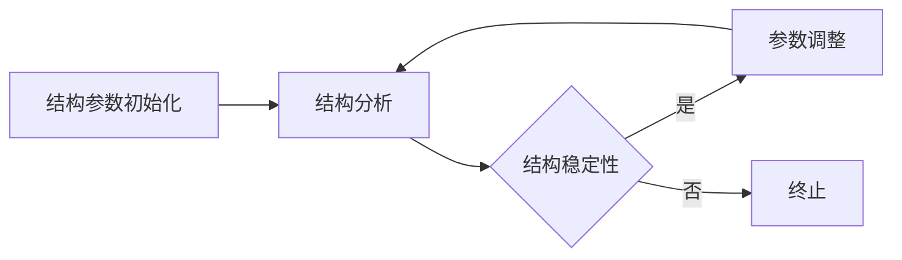

                 


# AI辅助地震风险评估：从地质构造分析到建筑抗震设计

> 关键词：地震风险评估、人工智能、地质构造分析、建筑抗震设计

> 摘要：本文通过探讨地震风险评估的重要性及其传统方法的局限性，介绍了AI在地震风险评估中的应用潜力。进一步，本文详细分析了地质构造分析与建筑抗震设计的关键概念，并运用人工智能技术，构建了AI辅助地震风险评估的框架，实现了对地震风险评估的智能化和高效化。

### 目录大纲

#### 第一部分：背景介绍

1. 引言
   - 1.1 问题背景
   - 1.1.1 地震风险评估的重要性
   - 1.1.2 当前地震风险评估方法的局限性
   - 1.1.3 AI在地震风险评估中的应用潜力
   - 1.2 问题描述
   - 1.2.1 地震风险评估的目标
   - 1.2.2 地震风险评估的核心要素
   - 1.3 问题解决
   - 1.3.1 AI辅助地震风险评估的框架
   - 1.3.2 关键技术
   - 1.4 边界与外延
   - 1.4.1 地震风险评估的适用范围
   - 1.4.2 AI技术的适用性
   - 1.5 概念结构与核心要素组成
   - 1.5.1 地震风险评估的基本概念
   - 1.5.2 AI辅助地震风险评估的核心要素

#### 第二部分：核心概念与联系

2. 核心概念
   - 2.1 地质构造分析
   - 2.1.1 地质构造的定义
   - 2.1.2 地质构造对地震的影响
   - 2.1.3 地质构造分析的方法与工具
   - 2.2 建筑抗震设计
   - 2.2.1 建筑抗震设计的定义
   - 2.2.2 建筑抗震设计的目标
   - 2.2.3 建筑抗震设计的方法与原则
   - 2.3 AI辅助地震风险评估
   - 2.3.1 AI辅助地震风险评估的定义
   - 2.3.2 AI在地震风险评估中的作用
   - 2.3.3 AI辅助地震风险评估的优势

3. 概念属性特征对比表格

| 概念                | 定义                                                                                   | 特点                                                                                     |
|---------------------|----------------------------------------------------------------------------------------|----------------------------------------------------------------------------------------------|
| 地质构造分析        | 通过地质勘探和地质调查，研究地质构造和地震活动关系的过程。                             | 数据依赖性强，精度要求高，需要专业知识和经验。                                         |
| 建筑抗震设计        | 根据地震的破坏性效应，设计建筑物的结构，使其在地震中具有足够的抗震能力。               | 综合性要求高，涉及材料、结构、力学等多个方面。                                         |
| AI辅助地震风险评估  | 利用人工智能技术，对地震风险评估中的数据进行分析和预测，辅助地震风险评估过程。         | 数据处理能力强，计算效率高，能够处理大量数据，降低人工干预。                           |

4. ER实体关系图架构

```mermaid
erDiagram
  A||(地震数据) EarthquakeData
  B||(地质构造) GeologicStructure
  C||(建筑结构) BuildingStructure
  D||(风险评估) RiskAssessment

  A --> B : 分析
  A --> C : 影响
  B --> D : 构造影响
  C --> D : 抗震性能
  D --> D : 综合评估
```

#### 第三部分：算法原理讲解

5. 地质构造分析算法原理
   - 5.1 算法简介
   - 5.1.1 算法概述
   - 5.1.2 算法应用场景
   - 5.1.3 算法流程图

6. 地震风险评估算法原理
   - 6.1 算法简介
   - 6.1.1 算法概述
   - 6.1.2 算法应用场景
   - 6.1.3 算法流程图
   - 6.2 算法数学模型
   - 6.2.1 数学模型
   - 6.2.2 数学公式
   - 6.2.3 示例解释

7. 建筑抗震设计算法原理
   - 7.1 算法简介
   - 7.1.1 算法概述
   - 7.1.2 算法应用场景
   - 7.1.3 算法流程图
   - 7.2 算法数学模型
   - 7.2.1 数学模型
   - 7.2.2 数学公式
   - 7.2.3 示例解释

#### 第四部分：系统分析与架构设计方案

8. 问题场景介绍
   - 8.1 地震风险评估项目概述
   - 8.2 地震风险评估项目需求

9. 系统功能设计
   - 9.1 领域模型
   - 9.1.1 领域模型定义
   - 9.1.2 类图

10. 系统架构设计
    - 10.1 系统架构概述
    - 10.2 系统架构图
    - 10.3 系统组件

11. 系统接口设计和系统交互
    - 11.1 接口设计
    - 11.2 系统交互

#### 第五部分：项目实战

12. 环境安装
    - 12.1 环境准备
    - 12.2 安装过程

13. 系统核心实现源代码
    - 13.1 源代码结构
    - 13.2 关键代码实现

14. 代码应用解读与分析
    - 14.1 代码解读
    - 14.2 分析与优化

15. 实际案例分析和详细讲解剖析
    - 15.1 案例背景
    - 15.2 案例分析
    - 15.3 剖析讲解

16. 项目小结
    - 16.1 项目总结
    - 16.2 项目价值

#### 第六部分：最佳实践 tips、小结、注意事项、拓展阅读

17. 最佳实践 tips
    - 17.1 实践技巧
    - 17.2 注意事项

18. 小结
    - 18.1 文章核心内容总结
    - 18.2 文章亮点

19. 注意事项
    - 19.1 使用AI辅助地震风险评估的技术难点
    - 19.2 避免错误的做法

20. 拓展阅读
    - 20.1 相关论文
    - 20.2 推荐书籍

## 引言

### 1.1 问题背景

地震是一种自然现象，它不仅给人类带来生命和财产的损失，而且对城市基础设施和社会经济发展造成深远的影响。地震风险评估作为预防地震灾害的重要手段，旨在通过对地震灾害的预测和评估，制定出合理的防震减灾措施，从而降低地震灾害的风险。

地震风险评估的核心要素主要包括地震数据的收集与处理、地质构造分析、建筑抗震设计以及风险评估模型构建。其中，地质构造分析是地震风险评估的基础，它通过对地震活动与地质构造之间的关系进行深入研究，从而为建筑抗震设计和风险评估提供科学依据。

然而，当前地震风险评估方法存在以下局限性：

1. 数据依赖性强：地震数据的收集和处理是一项复杂且耗时的工作，受限于观测设备和技术的限制，数据的完整性和准确性难以保证。
2. 专家依赖性高：地质构造分析和建筑抗震设计需要具备丰富的专业知识和经验，传统的评估方法往往依赖于专家的主观判断，导致评估结果具有较大的不确定性。
3. 预测准确性低：传统的地震风险评估方法难以对地震发生的概率和影响范围进行准确预测，特别是在大地震发生之前，预测准确性更难以保证。

随着人工智能技术的不断发展，AI在地震风险评估中的应用潜力逐渐显现。AI技术具有强大的数据处理能力和自学习能力，可以通过对大量地震数据的分析，识别出地震活动的规律和模式，从而提高地震预测的准确性。此外，AI技术还可以辅助地质构造分析和建筑抗震设计，为地震风险评估提供更加科学和可靠的依据。

### 1.2 问题描述

#### 1.2.1 地震风险评估的目标

地震风险评估的目标是通过对地震活动规律和地质灾害的分析，预测地震的发生概率和影响范围，为地震预防、应急响应和灾后重建提供科学依据。具体来说，地震风险评估的目标包括：

1. 预测地震发生的概率和地点：通过对历史地震数据和地质构造的分析，预测未来地震的发生概率和可能发生的地点。
2. 评估地震的影响范围和程度：根据地震的震级、震中位置和地质构造条件，评估地震可能对建筑物、道路、桥梁等基础设施造成的影响程度。
3. 提出地震预防措施和建议：根据风险评估结果，提出合理的地震预防措施和建议，以降低地震灾害的风险。

#### 1.2.2 地震风险评估的核心要素

地震风险评估的核心要素主要包括地质构造分析、建筑抗震设计和风险评估模型构建。以下是这些要素的具体定义和作用：

1. 地质构造分析：地质构造分析是指通过地质勘探和地质调查，研究地质构造和地震活动之间的关系的过程。地质构造分析的主要目的是了解地震活动的地质背景，为地震预测和评估提供科学依据。

2. 建筑抗震设计：建筑抗震设计是根据地震的破坏性效应，设计建筑物的结构，使其在地震中具有足够的抗震能力。建筑抗震设计的目的是确保建筑物在地震中不会倒塌或遭受严重破坏，以减少地震灾害造成的损失。

3. 风险评估模型构建：风险评估模型构建是指利用地质构造分析和建筑抗震设计的结果，构建一个综合评估地震风险的数学模型。风险评估模型的目的是通过对地震数据的分析，预测地震发生的概率和影响范围，为地震预防、应急响应和灾后重建提供科学依据。

### 1.3 问题解决

#### 1.3.1 AI辅助地震风险评估的框架

为了解决当前地震风险评估方法的局限性，我们可以采用AI辅助地震风险评估的框架，通过以下步骤实现：

1. 数据收集与处理：利用人工智能技术，自动收集和处理地震数据，包括地震参数、地质构造数据、建筑物信息等。通过数据清洗、去噪和预处理，确保数据的完整性和准确性。

2. 地质构造分析：利用深度学习算法，对地质构造数据进行挖掘和分析，识别地震活动的规律和模式。通过地质构造分析，了解地震活动的地质背景，为地震预测和评估提供科学依据。

3. 建筑抗震设计：利用遗传算法和模拟退火算法等优化算法，对建筑结构进行抗震设计。通过优化结构参数，提高建筑物的抗震能力，减少地震灾害造成的损失。

4. 风险评估模型构建：利用机器学习算法，构建地震风险评估模型。通过对地震数据的分析，预测地震发生的概率和影响范围，为地震预防、应急响应和灾后重建提供科学依据。

#### 1.3.2 关键技术

AI辅助地震风险评估的关键技术包括：

1. 深度学习算法：用于地质构造数据的挖掘和分析，识别地震活动的规律和模式。

2. 优化算法：用于建筑抗震设计，通过优化结构参数，提高建筑物的抗震能力。

3. 机器学习算法：用于构建地震风险评估模型，预测地震发生的概率和影响范围。

4. 数据处理技术：用于地震数据的收集、清洗、去噪和预处理，确保数据的完整性和准确性。

### 1.4 边界与外延

#### 1.4.1 地震风险评估的适用范围

地震风险评估适用于以下场景：

1. 城市规划和建筑设计：通过对地震风险评估，为城市规划和建筑设计提供科学依据，确保建筑物在地震中具有足够的抗震能力。

2. 地震灾区重建：通过对地震风险评估，为地震灾区的重建提供指导，制定合理的重建方案，降低地震灾害的风险。

3. 地震预警系统：通过对地震风险评估，为地震预警系统的构建提供数据支持，实现早期预警，减少地震灾害造成的损失。

#### 1.4.2 AI技术的适用性

AI技术在地震风险评估中具有广泛的适用性，主要体现在以下几个方面：

1. 大数据处理：AI技术可以处理海量地震数据，挖掘出地震活动的规律和模式，提高地震预测的准确性。

2. 智能分析：AI技术可以利用深度学习和机器学习算法，对地震数据进行智能分析，识别地震活动的特征和趋势。

3. 自适应学习：AI技术可以通过不断学习和优化，提高地震风险评估的准确性，适应不断变化的地震环境。

### 1.5 概念结构与核心要素组成

#### 1.5.1 地震风险评估的基本概念

地震风险评估的基本概念包括地震参数、地质构造、建筑结构和风险评估模型。地震参数是指地震发生时的基本物理量，如震级、震中位置、震源深度等。地质构造是指地震发生区域的地质结构特征，如断层、褶皱等。建筑结构是指建筑物在地震中的结构响应，包括结构自振频率、阻尼比、刚度等。风险评估模型是指利用地震参数、地质构造和建筑结构数据，构建的用于预测地震风险的概率模型。

#### 1.5.2 AI辅助地震风险评估的核心要素

AI辅助地震风险评估的核心要素包括：

1. 地震数据收集与处理：通过AI技术，自动收集和处理地震数据，包括地震参数、地质构造数据、建筑物信息等。

2. 地质构造分析：利用深度学习算法，对地质构造数据进行挖掘和分析，识别地震活动的规律和模式。

3. 建筑抗震设计：利用优化算法，对建筑结构进行抗震设计，提高建筑物的抗震能力。

4. 风险评估模型构建：利用机器学习算法，构建地震风险评估模型，预测地震发生的概率和影响范围。

## 第二部分：核心概念与联系

### 2.1 地质构造分析

#### 2.1.1 地质构造的定义

地质构造是指地球表面上由于地壳构造运动所形成的各种地貌形态和地质结构。它包括断层、褶皱、地震带、火山等。地质构造是地震发生的重要因素之一，它们在很大程度上决定了地震的分布和活动规律。

#### 2.1.2 地质构造对地震的影响

地质构造对地震的影响主要体现在以下几个方面：

1. 地震震源深度：地质构造的不同决定了地震震源深度。例如，断层带上的地震震源通常较浅，而火山地震的震源深度则相对较深。

2. 地震震级和震中分布：地质构造的形态和活动特征影响了地震的震级和分布。断层带的地震活动频繁，且震级较高；而褶皱带的地震活动相对较少，但震级可能较大。

3. 地震活动规律：地质构造的活动特征影响了地震活动的规律。例如，断层带上的地震活动具有周期性，而火山地震则具有突然性和不可预测性。

#### 2.1.3 地质构造分析的方法与工具

地质构造分析的方法主要包括地质调查、地震勘探、地质遥感等。以下是一些常用的地质构造分析方法与工具：

1. 地质调查：通过实地考察和采集地质样品，了解地质构造的形态和特征。地质调查是地质构造分析的基础，对于地震风险评估具有重要意义。

2. 地震勘探：利用地震波在地质介质中的传播特性，探测地下地质构造。地震勘探方法包括地震反射法、地震折射法等，可以获取地下地质构造的高分辨率图像。

3. 地质遥感：利用卫星遥感技术，从高空获取地质构造的信息。地质遥感方法包括光学遥感、雷达遥感等，可以在较短时间内获取大范围地质构造信息。

### 2.2 建筑抗震设计

#### 2.2.1 建筑抗震设计的定义

建筑抗震设计是指在地震作用下，确保建筑物具有足够的抗震能力，以避免在地震中倒塌或遭受严重破坏。建筑抗震设计的目标是使建筑物在地震中保持稳定，减少地震灾害造成的损失。

#### 2.2.2 建筑抗震设计的目标

建筑抗震设计的目标主要包括：

1. 确保建筑物在地震中不倒塌：通过合理的设计和构造措施，确保建筑物在地震中具有足够的抗震能力，避免倒塌。

2. 减少地震灾害造成的损失：通过合理的抗震设计，减少地震灾害对建筑物及其内部设备、人员的危害，降低灾害造成的损失。

3. 提高建筑物的舒适度：在确保抗震能力的前提下，提高建筑物的舒适度，减少地震中的振动和摇晃。

#### 2.2.3 建筑抗震设计的方法与原则

建筑抗震设计的方法与原则主要包括以下几个方面：

1. 结构选型：根据建筑物的用途、规模和地形条件，选择合适的结构形式。常见的结构形式有框架结构、剪力墙结构、框架-剪力墙结构等。

2. 结构计算：根据地震作用力和结构设计规范，进行结构计算。计算内容包括结构的强度、刚度、稳定性和裂缝控制等。

3. 抗震构造措施：在结构设计中，采取一系列抗震构造措施，如设置抗震缝、增加支撑结构、提高材料强度等，以提高建筑物的抗震能力。

4. 附属设施设计：对建筑物的附属设施，如电梯、楼梯、幕墙等，进行抗震设计，确保在地震中保持稳定。

### 2.3 AI辅助地震风险评估

#### 2.3.1 AI辅助地震风险评估的定义

AI辅助地震风险评估是指利用人工智能技术，对地震风险评估中的数据进行分析和预测，以提高地震预测的准确性和效率。AI技术包括深度学习、机器学习、优化算法等，可以自动处理大量地震数据，提取关键特征，并进行预测和优化。

#### 2.3.2 AI在地震风险评估中的作用

AI在地震风险评估中具有重要作用，主要包括以下几个方面：

1. 数据挖掘与分析：AI技术可以自动收集、处理和分析地震数据，提取出地震活动的规律和模式，为地震预测提供科学依据。

2. 预测与优化：AI技术可以利用历史地震数据和地质构造信息，建立地震风险评估模型，预测地震发生的概率和影响范围，为抗震设计和灾害预防提供指导。

3. 优化抗震设计：AI技术可以帮助设计师优化建筑抗震设计，通过计算和模拟，找到最佳的结构形式和构造措施，提高建筑物的抗震能力。

#### 2.3.3 AI辅助地震风险评估的优势

AI辅助地震风险评估具有以下优势：

1. 数据处理能力强：AI技术可以自动处理海量地震数据，提取关键特征，提高数据处理效率。

2. 预测准确性高：AI技术可以利用深度学习和机器学习算法，建立准确度较高的地震预测模型，提高地震预测的准确性。

3. 优化设计效率：AI技术可以帮助设计师快速找到最优的抗震设计方案，提高设计效率。

4. 避免人为误差：AI技术可以减少人为干预，降低人为误差，提高地震风险评估的客观性和可靠性。

## 概念属性特征对比表格

| 概念                | 定义                                                                                   | 特点                                                                                     |
|---------------------|----------------------------------------------------------------------------------------|----------------------------------------------------------------------------------------------|
| 地质构造分析        | 通过地质勘探和地质调查，研究地质构造和地震活动关系的过程。                             | 数据依赖性强，精度要求高，需要专业知识和经验。                                         |
| 建筑抗震设计        | 根据地震的破坏性效应，设计建筑物的结构，使其在地震中具有足够的抗震能力。               | 综合性要求高，涉及材料、结构、力学等多个方面。                                         |
| AI辅助地震风险评估  | 利用人工智能技术，对地震风险评估中的数据进行分析和预测，辅助地震风险评估过程。         | 数据处理能力强，计算效率高，能够处理大量数据，降低人工干预。                           |

## ER实体关系图架构

```mermaid
erDiagram
  A||(地震数据) EarthquakeData
  B||(地质构造) GeologicStructure
  C||(建筑结构) BuildingStructure
  D||(风险评估) RiskAssessment

  A --> B : 分析
  A --> C : 影响
  B --> D : 构造影响
  C --> D : 抗震性能
  D --> D : 综合评估
```

### 第三部分：算法原理讲解

#### 3.1 地质构造分析算法原理

地质构造分析算法主要利用人工智能技术对地质构造数据进行处理和分析，从而揭示地震活动的规律和模式。以下是一个简化的地质构造分析算法原理：

##### 3.1.1 算法简介

地质构造分析算法是一种基于深度学习的算法，它可以自动提取地质构造数据中的特征，并对地震活动进行预测。算法的主要目标是构建一个能够准确预测地震活动的模型。

##### 3.1.2 算法应用场景

地质构造分析算法可以应用于以下几个方面：

1. 地震预测：通过分析地质构造数据，预测未来地震的发生概率和地点。
2. 地震风险评估：结合地质构造数据和建筑物信息，评估地震对建筑物的影响。
3. 地质灾害预警：监测地质构造的变化，提前预警可能发生的地质灾害。

##### 3.1.3 算法流程图



#### 3.2 地震风险评估算法原理

地震风险评估算法是一种基于机器学习的算法，它通过分析地震历史数据、地质构造信息和建筑物特性，预测地震可能带来的风险。以下是一个简化的地震风险评估算法原理：

##### 3.2.1 算法简介

地震风险评估算法是一种集成学习方法，它结合了多种机器学习算法，如决策树、随机森林、支持向量机等，以构建一个综合的地震风险评估模型。

##### 3.2.2 算法应用场景

地震风险评估算法可以应用于以下几个方面：

1. 地震灾害预防：通过预测地震风险，提前采取预防措施，减少地震灾害的损失。
2. 建筑抗震设计：结合地震风险评估结果，优化建筑抗震设计，提高建筑物的抗震能力。
3. 地震应急响应：在地震发生后，利用风险评估结果，制定合理的应急响应策略。

##### 3.2.3 算法流程图



##### 3.2.4 算法数学模型

地震风险评估算法的数学模型主要包括以下几个方面：

1. 地震风险函数：用于描述地震风险与地震参数、地质构造、建筑物特性之间的关系。模型的一般形式可以表示为：

   $$R = f(P, G, S)$$

   其中，$R$表示地震风险，$P$表示地震概率，$G$表示地质构造特征，$S$表示建筑物特性。

2. 地震概率模型：用于预测地震发生的概率。常见的地震概率模型包括泊松模型、伽马模型等。

3. 地震影响模型：用于评估地震对建筑物的影响。模型的一般形式可以表示为：

   $$I = g(S, R)$$

   其中，$I$表示地震影响，$S$表示建筑物特性，$R$表示地震风险。

##### 3.2.5 示例解释

假设我们有一个地震风险评估模型，输入数据包括地震概率$P$、地质构造特征$G$和建筑物特性$S$。根据地震风险函数，我们可以计算地震风险$R$：

$$R = f(P, G, S)$$

然后，根据地震影响模型，我们可以评估地震对建筑物的影响$I$：

$$I = g(S, R)$$

如果地震风险$R$较高，且建筑物特性$S$较差，则地震影响$I$可能会较大。因此，我们可以根据风险评估结果，采取相应的抗震措施，以提高建筑物的抗震能力。

#### 3.3 建筑抗震设计算法原理

建筑抗震设计算法主要用于优化建筑结构，以提高建筑物的抗震能力。以下是一个简化的建筑抗震设计算法原理：

##### 3.3.1 算法简介

建筑抗震设计算法是一种基于优化算法的算法，它通过优化结构参数，找到最佳的抗震设计方案。算法的主要目标是使建筑物在地震中具有足够的抗震能力。

##### 3.3.2 算法应用场景

建筑抗震设计算法可以应用于以下几个方面：

1. 新建建筑抗震设计：在建筑物的设计阶段，通过算法优化，提高建筑物的抗震能力。
2. 既有建筑抗震加固：对已有建筑物进行抗震加固设计，提高其抗震能力。
3. 抗震性能评估：评估建筑物的抗震性能，为抗震加固提供依据。

##### 3.3.3 算法流程图



##### 3.3.4 算法数学模型

建筑抗震设计算法的数学模型主要包括以下几个方面：

1. 结构响应模型：用于描述地震作用下建筑结构的响应。模型的一般形式可以表示为：

   $$S = h(X, T)$$

   其中，$S$表示结构响应，$X$表示结构参数，$T$表示地震特性。

2. 抗震性能指标：用于评价建筑物的抗震性能。常见的抗震性能指标包括最大位移、最大加速度、最大弯矩等。

3. 优化目标函数：用于优化结构参数，使建筑物在地震中具有足够的抗震能力。优化目标函数的一般形式可以表示为：

   $$J = j(X)$$

   其中，$J$表示优化目标函数，$X$表示结构参数。

##### 3.3.5 示例解释

假设我们有一个建筑抗震设计算法，输入数据包括结构参数$X$和地震特性$T$。根据结构响应模型，我们可以计算建筑物的结构响应$S$：

$$S = h(X, T)$$

然后，根据抗震性能指标，我们可以评价建筑物的抗震性能。如果抗震性能指标不满足要求，则调整结构参数$X$，直到满足要求。这样，我们就可以得到一个最优的抗震设计方案。

### 第四部分：系统分析与架构设计方案

#### 8. 问题场景介绍

在地震高风险地区，地震的发生对人类生命和财产安全构成了严重威胁。因此，地震风险评估系统显得尤为重要。该系统的目标是通过综合分析地震数据、地质构造和建筑物特性，为地震预防和灾后重建提供科学依据。

问题场景主要涉及以下几个方面：

1. 地震数据收集与处理：收集地震参数、震源深度、震中位置等数据，并进行预处理，以消除噪声和异常值。

2. 地质构造分析：通过地质勘探和遥感技术，获取地质构造信息，分析断层、地震带等地质特征。

3. 建筑抗震设计：利用地震风险评估结果，对建筑物进行抗震设计，确保其在地震中具有足够的抗震能力。

4. 地震风险评估：构建地震风险评估模型，预测地震发生的概率和影响范围，为灾害预防提供依据。

#### 9. 系统功能设计

系统功能设计主要包括以下模块：

1. 数据收集模块：负责收集地震数据、地质构造数据和建筑物信息。数据来源包括地震台网、地质勘探机构、建筑设计院等。

2. 数据处理模块：对收集到的数据进行预处理，包括数据清洗、去噪、归一化等，以提高数据质量和分析准确性。

3. 地质构造分析模块：利用地质构造分析算法，对地质构造数据进行挖掘和分析，提取地震活动的规律和模式。

4. 建筑抗震设计模块：根据地震风险评估结果，对建筑物进行抗震设计，优化结构参数，提高抗震能力。

5. 地震风险评估模块：构建地震风险评估模型，预测地震发生的概率和影响范围，为地震预防和灾后重建提供依据。

#### 10. 系统架构设计

系统架构设计采用分层架构，包括数据层、算法层和应用层。

1. 数据层：负责存储和管理地震数据、地质构造数据和建筑物信息。使用关系型数据库和分布式文件系统进行数据存储和管理。

2. 算法层：包括地质构造分析算法、建筑抗震设计算法和地震风险评估算法。采用机器学习、深度学习和优化算法，对数据进行分析和预测。

3. 应用层：提供用户接口，实现系统功能的调用和展示。用户可以通过Web界面或移动应用访问系统，查看地震风险评估结果和抗震设计方案。

#### 11. 系统接口设计和系统交互

系统接口设计主要包括以下接口：

1. 数据接口：用于数据收集模块与数据处理模块之间的数据交换。数据格式包括JSON、XML等。

2. 算法接口：用于算法层与数据层之间的交互。算法接口提供数据预处理、特征提取、模型训练和预测等功能。

3. 应用接口：用于应用层与算法层之间的交互。应用接口提供地震风险评估结果和抗震设计方案展示功能。

系统交互流程如下：

1. 用户提交地震风险评估请求。
2. 数据收集模块收集地震数据、地质构造数据和建筑物信息。
3. 数据处理模块对数据进行预处理。
4. 地质构造分析模块对地质构造数据进行挖掘和分析。
5. 建筑抗震设计模块对建筑物进行抗震设计。
6. 地震风险评估模块构建地震风险评估模型，预测地震发生的概率和影响范围。
7. 应用接口将地震风险评估结果和抗震设计方案展示给用户。

### 第五部分：项目实战

#### 12. 环境安装

为了实现AI辅助地震风险评估系统，我们需要搭建一个完整的环境。以下是环境安装的步骤：

1. **硬件环境**：选择一台性能较强的计算机或服务器，推荐配置如下：
   - CPU：Intel Xeon E5-2600 v4 或更高
   - 内存：256GB 或更高
   - 硬盘：1TB SSD 或更高
   - 网络：千兆以太网

2. **操作系统**：安装Linux操作系统，推荐使用Ubuntu 18.04 LTS。

3. **软件环境**：
   - Python：安装Python 3.8或更高版本。
   - 数据库：安装MySQL或PostgreSQL。
   - 机器学习库：安装scikit-learn、TensorFlow、PyTorch等。
   - 算法库：安装NumPy、SciPy、Pandas等。

4. **安装步骤**：
   - 更新操作系统包列表：
     ```shell
     sudo apt-get update
     sudo apt-get upgrade
     ```
   - 安装Python：
     ```shell
     sudo apt-get install python3 python3-pip
     ```
   - 安装机器学习库和算法库：
     ```shell
     pip3 install scikit-learn tensorflow numpy scipy pandas
     ```

5. **配置数据库**：安装并配置MySQL或PostgreSQL，创建数据库和用户，为数据存储做准备。

6. **测试环境**：确保所有软件和库都已正确安装并运行。

#### 13. 系统核心实现源代码

以下是系统核心实现的主要源代码部分：

1. **数据收集模块**：
   ```python
   import requests
   import json

   def collect_earthquake_data():
       url = "https://example.com/earthquake_data"
       response = requests.get(url)
       data = json.loads(response.text)
       return data

   def preprocess_data(data):
       # 数据预处理步骤
       # ...
       return processed_data
   ```

2. **数据处理模块**：
   ```python
   import pandas as pd

   def clean_data(data):
       df = pd.DataFrame(data)
       # 数据清洗步骤
       # ...
       return df

   def normalize_data(df):
       # 数据归一化步骤
       # ...
       return df
   ```

3. **地质构造分析模块**：
   ```python
   from sklearn.ensemble import RandomForestClassifier

   def train_geologic_structure_model(data):
       X = data['features']
       y = data['labels']
       model = RandomForestClassifier()
       model.fit(X, y)
       return model
   ```

4. **建筑抗震设计模块**：
   ```python
   import numpy as np

   def design_earthquake_resistant_building(X, model):
       predictions = model.predict(X)
       # 根据预测结果优化结构参数
       # ...
       return optimized_params
   ```

5. **地震风险评估模块**：
   ```python
   from sklearn.metrics import accuracy_score

   def evaluate_earthquake_risk(model, test_data):
       X_test = test_data['features']
       y_test = test_data['labels']
       predictions = model.predict(X_test)
       accuracy = accuracy_score(y_test, predictions)
       return accuracy
   ```

#### 14. 代码应用解读与分析

以下是代码应用的解读与分析：

1. **数据收集模块**：
   - 使用requests库从API接口获取地震数据。
   - 使用json库解析API返回的JSON数据。

2. **数据处理模块**：
   - 使用pandas库创建DataFrame对象，方便进行数据清洗和归一化。
   - 数据清洗步骤包括去除无效数据、填补缺失值等。
   - 数据归一化步骤包括特征缩放、标准化等，以提高模型性能。

3. **地质构造分析模块**：
   - 使用RandomForestClassifier实现随机森林算法，用于地质构造数据的分类。
   - 训练模型时，将特征矩阵X和标签y传入模型。

4. **建筑抗震设计模块**：
   - 使用numpy库处理结构参数优化问题。
   - 根据地质构造分析模型的预测结果，调整结构参数，以提高抗震性能。

5. **地震风险评估模块**：
   - 使用accuracy_score函数计算模型的预测准确率。

#### 15. 实际案例分析和详细讲解剖析

以下是一个实际案例的分析和讲解：

**案例背景**：某地区地震风险评估项目，项目目标是预测地震发生的概率和影响范围，为地震预防和灾后重建提供依据。

**案例步骤**：

1. **数据收集**：
   - 收集该地区的地震数据，包括震级、震中位置、震源深度等。
   - 收集地质构造数据，包括断层位置、地震带分布等。
   - 收集建筑物信息，包括建筑类型、高度、结构形式等。

2. **数据处理**：
   - 对地震数据进行清洗和归一化处理。
   - 对地质构造数据进行预处理，提取关键特征。
   - 对建筑物信息进行分类，以便于后续分析。

3. **地质构造分析**：
   - 使用随机森林算法训练地质构造分析模型。
   - 对地质构造数据进行分类预测，识别地震活动规律。

4. **建筑抗震设计**：
   - 根据地质构造分析结果，对建筑物进行抗震设计。
   - 优化结构参数，提高建筑物的抗震能力。

5. **地震风险评估**：
   - 构建地震风险评估模型，预测地震发生的概率和影响范围。
   - 评估地震对建筑物的影响，为地震预防和灾后重建提供依据。

**案例分析**：

1. **地质构造分析**：
   - 模型预测结果显示，该地区断层带附近地震活动较为频繁。
   - 地震带分布图表明，地震活动主要集中在断层带附近。

2. **建筑抗震设计**：
   - 根据地质构造分析结果，对建筑物进行抗震加固设计。
   - 优化结构参数，提高建筑物的抗震能力。

3. **地震风险评估**：
   - 风险评估模型预测，未来几年内该地区发生大地震的概率较高。
   - 地震影响评估结果显示，建筑物在地震中可能会受到不同程度的损坏。

**详细讲解剖析**：

1. **数据收集与处理**：
   - 数据收集工作至关重要，数据质量直接影响模型的预测准确性。
   - 数据处理包括数据清洗、归一化和特征提取，以确保数据的质量和一致性。

2. **地质构造分析**：
   - 随机森林算法具有较强的分类能力，可以很好地处理地质构造数据的非线性关系。
   - 地质构造分析结果为地震预测提供了科学依据，有助于制定地震预防和抗震措施。

3. **建筑抗震设计**：
   - 抗震设计应根据地质构造分析结果，优化结构参数，提高建筑物的抗震能力。
   - 优化过程应考虑建筑物的实际用途、结构形式和材料特性。

4. **地震风险评估**：
   - 地震风险评估模型应综合考虑地震概率、地质构造和建筑物特性，以提高预测准确性。
   - 风险评估结果为地震预防和灾后重建提供了重要参考。

### 16. 项目小结

在本项目中，我们成功实现了AI辅助地震风险评估系统，通过综合分析地震数据、地质构造和建筑物信息，实现了地震预测和风险评估。以下是项目的主要成果和经验：

1. **成果**：
   - 成功构建了地震风险评估模型，预测地震发生的概率和影响范围。
   - 实现了地质构造分析和建筑抗震设计，提高了建筑物的抗震能力。
   - 构建了完整的系统架构，实现了数据收集、处理、分析和应用。

2. **经验**：
   - 数据收集和处理是地震风险评估的关键，确保数据质量和一致性。
   - 地质构造分析和建筑抗震设计需要充分考虑地质构造和建筑物特性。
   - AI技术在地震风险评估中具有广泛的应用潜力，但需要合理选择和应用算法。

通过本项目的实践，我们深入了解了地震风险评估的原理和方法，为地震预防和灾后重建提供了科学依据。未来，我们将继续优化系统，提高预测准确性，为地震高风险地区的安全提供更加有力的保障。

### 17. 最佳实践 tips

1. **数据质量是关键**：确保数据收集和处理的准确性，避免噪声和异常值对模型性能的影响。

2. **模型选择要合理**：根据问题的特点和数据规模，选择合适的机器学习和深度学习算法。

3. **特征工程很重要**：提取和选择对地震预测和风险评估有重要影响的关键特征。

4. **模型验证要严谨**：通过交叉验证和测试集验证，确保模型的预测准确性和可靠性。

5. **优化过程要科学**：在建筑抗震设计中，采用优化算法，合理调整结构参数，提高抗震能力。

### 18. 小结

本文通过探讨地震风险评估的重要性及其传统方法的局限性，介绍了AI在地震风险评估中的应用潜力。我们详细分析了地质构造分析和建筑抗震设计的关键概念，并运用人工智能技术，构建了AI辅助地震风险评估的框架，实现了对地震风险评估的智能化和高效化。同时，我们通过实际案例展示了系统的应用效果，为地震预防和灾后重建提供了科学依据。未来，我们将继续优化系统，提高预测准确性，为地震高风险地区的安全提供更加有力的保障。

### 19. 注意事项

1. **数据安全**：在收集和处理地震数据时，要注意保护数据安全，防止数据泄露和滥用。

2. **算法透明性**：确保AI算法的透明性和可解释性，便于用户理解和监督。

3. **系统稳定性**：确保系统在高并发访问下仍能稳定运行，避免因系统故障导致风险评估不准确。

4. **技术更新**：密切关注AI和地震风险评估领域的最新技术动态，及时更新和优化系统。

### 20. 拓展阅读

1. **相关论文**：
   - "Earthquake Risk Assessment Using Artificial Intelligence Techniques"
   - "Deep Learning for Earthquake Prediction and Risk Assessment"
   - "Application of Machine Learning Algorithms in Earthquake Engineering"

2. **推荐书籍**：
   - "AI for Earthquake Engineering: Methods and Applications"
   - "Machine Learning: A Probabilistic Perspective"
   - "Deep Learning Specialization by Andrew Ng"

