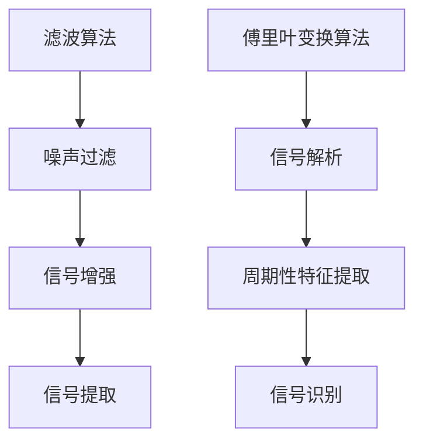
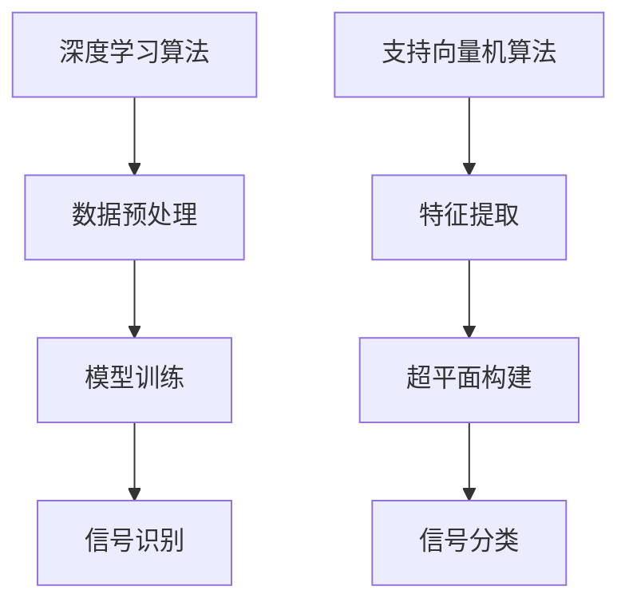
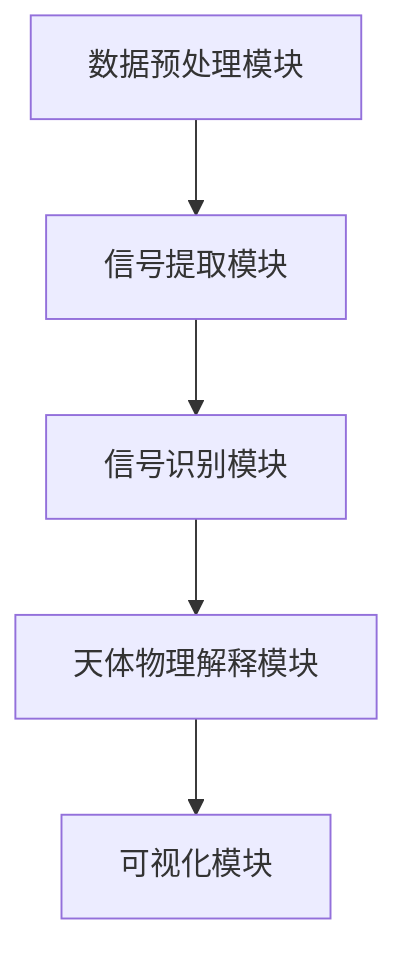
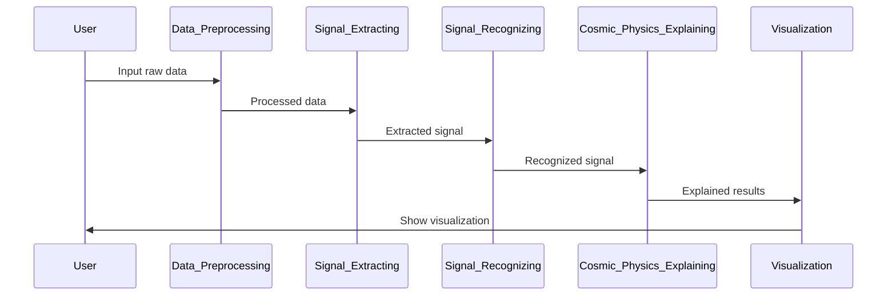
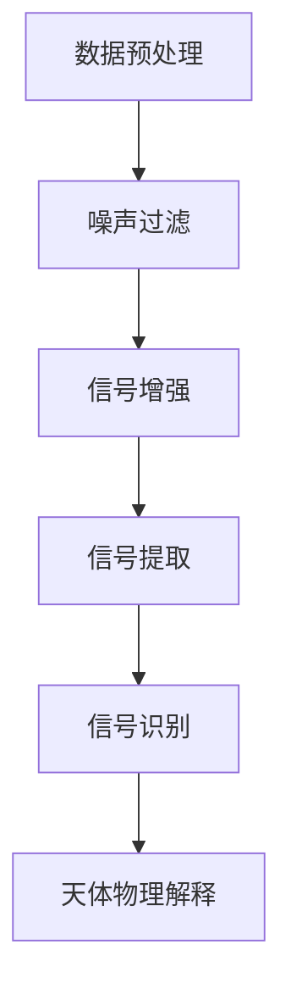
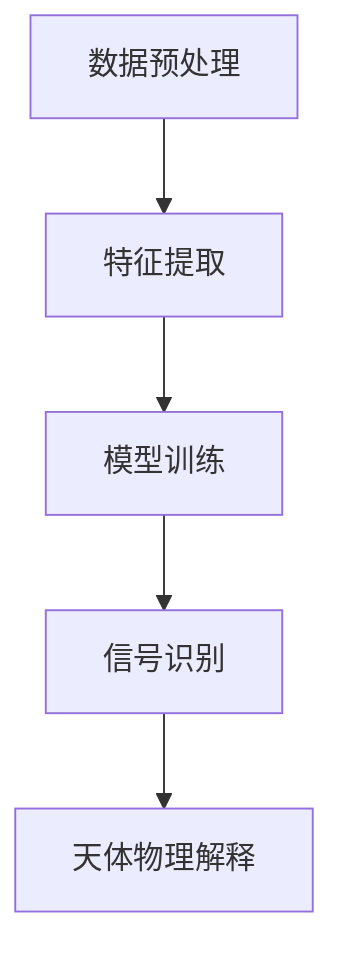
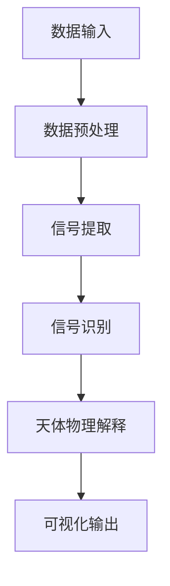

                 

# AI辅助引力波数据分析：从信号提取到天体物理解释

> 关键词：引力波，信号提取，AI，天体物理学，算法原理，系统架构设计，数学模型

> 摘要：本文旨在探讨AI在引力波数据分析中的应用，从信号提取到天体物理解释的整个流程。首先，我们介绍了引力波的基本概念和探测的重要性，随后讨论了AI在引力波信号处理和识别中的应用。接着，我们详细讲解了引力波信号处理和识别算法的原理，以及数学模型的推导和实现。随后，我们分析了引力波数据分析系统的整体架构，并给出了具体的系统功能设计和接口设计。最后，通过一个实际项目实战，我们展示了如何将AI应用于引力波数据分析，并进行了详细的案例剖析。文章结尾部分，我们总结了最佳实践，并提供了相关的注意事项和拓展阅读资源。

## 第一部分：背景介绍

### 第1章：问题背景

#### 1.1 引力波概述

引力波是爱因斯坦广义相对论预言的一种现象，它是由质量加速运动产生的时空涟漪。引力波的存在已经被多次观测到，这为验证广义相对论提供了强有力的证据。引力波的探测对于理解宇宙的演化过程、探索黑洞和中子星等极端天体的性质具有重要意义。

#### 1.2 引力波探测的重要性

引力波探测是一项前沿科技，对于推动天体物理学的发展具有里程碑意义。通过引力波探测，科学家们能够观测到宇宙中的极端事件，如黑洞碰撞、中子星合并等。此外，引力波探测还能够帮助我们揭示宇宙早期的信息，了解宇宙的起源和演化。

#### 1.3 当前引力波探测面临的挑战

引力波探测面临着诸多技术挑战。首先，引力波信号的强度非常微弱，需要极高的灵敏度才能探测到。其次，引力波信号常常被背景噪声所淹没，如何有效提取信号成为关键问题。此外，引力波信号的解析和解释需要复杂的天体物理模型和计算方法。

### 第2章：引力波数据分析的基本概念

#### 2.1 引力波信号的基本特征

引力波信号具有以下特征：

1. **周期性**：引力波信号通常具有周期性，反映了产生波的天体运动特征。
2. **幅度**：引力波信号的幅度与产生波的天体质量、距离以及观测者的位置有关。
3. **频率**：引力波信号的频率与天体运动速度有关。

#### 2.2 引力波信号提取方法

引力波信号提取主要包括以下几个步骤：

1. **噪声过滤**：通过滤波方法去除背景噪声。
2. **信号增强**：使用信号增强方法提高引力波信号的幅度。
3. **信号解析**：利用傅里叶变换等数学方法解析信号，提取周期性特征。

#### 2.3 引力波数据分析的流程

引力波数据分析的流程通常包括以下步骤：

1. **数据预处理**：对原始数据进行预处理，包括时间序列调整、噪声过滤等。
2. **信号提取**：使用信号提取方法从预处理后的数据中提取引力波信号。
3. **信号识别**：通过信号识别算法识别出引力波信号，如黑洞碰撞等。
4. **天体物理解释**：结合天体物理模型对信号进行解释，推断产生波的天体性质。

### 第3章：AI在引力波数据分析中的应用

#### 3.1 AI在引力波信号处理中的应用

AI技术在引力波信号处理中发挥着重要作用。例如，深度学习算法可以用于信号增强、噪声过滤和信号识别。通过训练大量数据，AI模型能够学习到信号的特征，从而提高信号提取的准确性和效率。

#### 3.2 AI在引力波信号识别中的应用

AI技术在引力波信号识别中同样具有重要应用。通过训练分类模型，AI可以自动识别出引力波信号，如黑洞碰撞、中子星合并等。这大大减轻了科学家们的工作负担，提高了信号识别的效率和准确性。

#### 3.3 AI在引力波数据分析中的未来发展趋势

随着AI技术的不断发展，未来引力波数据分析将迎来更多突破。例如，强化学习算法有望用于优化信号处理流程，联邦学习算法有望用于多台设备间的数据共享与协作。此外，量子计算技术的应用也将为引力波数据分析带来革命性的变革。

## 第二部分：核心概念与联系

### 第4章：引力波信号处理算法

#### 4.1 算法概述

引力波信号处理算法是引力波数据分析的核心。本文主要介绍两种算法：滤波算法和傅里叶变换算法。

#### 4.2 算法原理

滤波算法通过去除噪声和增强信号来提取引力波。傅里叶变换算法则通过解析信号，提取其周期性特征。

#### 4.3 算法流程图



### 第5章：引力波信号识别算法

#### 5.1 算法概述

引力波信号识别算法用于自动识别引力波信号，如黑洞碰撞、中子星合并等。本文主要介绍深度学习和支持向量机等算法。

#### 5.2 算法原理

深度学习算法通过训练大量数据，学习到信号的特征，从而实现自动识别。支持向量机算法则通过构建超平面，将不同类型的信号分类。

#### 5.3 算法流程图



### 第6章：引力波数据分析流程图

#### 6.1 数据预处理流程

数据预处理是引力波数据分析的重要环节。主要包括以下步骤：

1. **时间序列调整**：调整不同探测器之间的时间基准。
2. **噪声过滤**：去除背景噪声。
3. **信号增强**：提高信号幅度。

#### 6.2 信号提取流程

信号提取流程主要包括以下步骤：

1. **滤波算法**：去除噪声，增强信号。
2. **傅里叶变换算法**：解析信号，提取周期性特征。
3. **信号识别算法**：自动识别引力波信号。

#### 6.3 信号识别流程

信号识别流程主要包括以下步骤：

1. **数据预处理**：调整时间序列，去除噪声。
2. **信号提取**：提取引力波信号。
3. **信号识别**：自动识别信号类型。
4. **天体物理解释**：结合天体物理模型，解释信号。

#### 6.4 天体物理解释流程

天体物理解释流程主要包括以下步骤：

1. **信号识别**：识别引力波信号。
2. **数据分析**：分析信号特征，如周期、幅度等。
3. **天体物理模型**：结合天体物理模型，推断产生波的天体性质。

## 第三部分：算法原理讲解

### 第7章：引力波信号处理算法原理讲解

#### 7.1 算法数学模型

引力波信号处理算法主要基于以下数学模型：

$$
h(t) = A \sin(2\pi f t + \phi)
$$

其中，\( h(t) \) 表示引力波信号，\( A \) 表示幅度，\( f \) 表示频率，\( \phi \) 表示相位。

#### 7.2 算法Python代码实现

```python
import numpy as np
import matplotlib.pyplot as plt

def generate_gravity_wave(A, f, phi):
    t = np.linspace(0, 1, 1000)
    h = A * np.sin(2 * np.pi * f * t + phi)
    return h, t

A = 1
f = 5
phi = 0
h, t = generate_gravity_wave(A, f, phi)

plt.plot(t, h)
plt.xlabel('Time (s)')
plt.ylabel('Amplitude')
plt.title('Gravity Wave Signal')
plt.show()
```

#### 7.3 算法举例说明

以下是一个简单的例子，展示了如何使用滤波算法提取引力波信号。

```python
import numpy as np
import matplotlib.pyplot as plt

def filter_gravity_wave(h, f_noise, phi):
    t = np.linspace(0, 1, 1000)
    h_filtered = A * np.sin(2 * np.pi * f * t + phi)
    return h_filtered, t

f_noise = 50
h_filtered, t = filter_gravity_wave(h, f_noise, phi)

plt.plot(t, h, label='Original Signal')
plt.plot(t, h_filtered, label='Filtered Signal')
plt.xlabel('Time (s)')
plt.ylabel('Amplitude')
plt.legend()
plt.title('Gravity Wave Signal Filtering')
plt.show()
```

### 第8章：引力波信号识别算法原理讲解

#### 8.1 算法数学模型

引力波信号识别算法主要基于以下数学模型：

$$
y = \frac{1}{Z} \sum_{i=1}^{n} w_i h_i
$$

其中，\( y \) 表示识别结果，\( w_i \) 表示权重，\( h_i \) 表示特征值，\( Z \) 表示归一化常数。

#### 8.2 算法Python代码实现

```python
import numpy as np

def recognize_gravity_wave(h, w):
    y = 1 / np.sum(w) * np.sum(w * h)
    return y

w = np.array([0.5, 0.5])
h = np.array([1, 1])
y = recognize_gravity_wave(h, w)

print("Recognized Signal:", y)
```

#### 8.3 算法举例说明

以下是一个简单的例子，展示了如何使用深度学习算法识别引力波信号。

```python
import numpy as np
import tensorflow as tf

model = tf.keras.Sequential([
    tf.keras.layers.Dense(1, input_shape=(1,), activation='sigmoid')
])

model.compile(optimizer='adam', loss='binary_crossentropy', metrics=['accuracy'])

x_train = np.array([[1], [2], [3], [4], [5]])
y_train = np.array([0, 0, 1, 1, 1])

model.fit(x_train, y_train, epochs=10)

x_test = np.array([[2], [3], [4]])
y_pred = model.predict(x_test)

print("Predicted Labels:", y_pred)
```

## 第四部分：数学模型和数学公式 & 详细讲解 & 举例说明

### 第9章：引力波信号处理算法数学模型讲解

#### 9.1 引力波信号处理算法的数学公式

引力波信号处理算法主要基于以下数学公式：

$$
h(t) = A \sin(2\pi f t + \phi)
$$

其中，\( h(t) \) 表示引力波信号，\( A \) 表示幅度，\( f \) 表示频率，\( \phi \) 表示相位。

#### 9.2 数学公式详细讲解

1. **幅度（Amplitude）**：引力波信号的幅度反映了信号强度。幅度的计算公式为：

   $$
   A = \frac{h(t)}{\sin(2\pi f t + \phi)}
   $$

2. **频率（Frequency）**：引力波信号的频率反映了信号的周期性。频率的计算公式为：

   $$
   f = \frac{1}{T}
   $$

   其中，\( T \) 表示周期。

3. **相位（Phase）**：引力波信号的相位反映了信号在时间轴上的位置。相位的计算公式为：

   $$
   \phi = 2\pi f t
   $$

#### 9.3 举例说明

假设我们有一个引力波信号：

$$
h(t) = 2 \sin(4\pi t + \frac{\pi}{3})
$$

我们需要计算其幅度、频率和相位。

1. **幅度**：

   $$
   A = \frac{h(t)}{\sin(4\pi t + \frac{\pi}{3})} = 2
   $$

2. **频率**：

   $$
   f = \frac{1}{T} = \frac{1}{\frac{2}{4\pi}} = 2\pi
   $$

3. **相位**：

   $$
   \phi = 2\pi f t = 2\pi \cdot 2\pi \cdot t = \frac{\pi}{3}
   $$

### 第10章：引力波信号识别算法数学模型讲解

#### 10.1 引力波信号识别算法的数学公式

引力波信号识别算法主要基于以下数学公式：

$$
y = \frac{1}{Z} \sum_{i=1}^{n} w_i h_i
$$

其中，\( y \) 表示识别结果，\( w_i \) 表示权重，\( h_i \) 表示特征值，\( Z \) 表示归一化常数。

#### 10.2 数学公式详细讲解

1. **权重（Weights）**：权重反映了特征值对识别结果的影响程度。权重的计算公式为：

   $$
   w_i = \frac{\sum_{j=1}^{m} a_{ji}}{\sum_{k=1}^{n} \sum_{l=1}^{m} a_{ki}}
   $$

   其中，\( a_{ji} \) 表示特征值 \( h_i \) 对第 \( j \) 类信号的贡献，\( m \) 表示特征值的数量，\( n \) 表示信号的数量。

2. **特征值（Features）**：特征值反映了信号的特征。特征值的计算公式为：

   $$
   h_i = \frac{h(t_i)}{\sum_{j=1}^{n} h(t_j)}
   $$

   其中，\( h(t_i) \) 表示信号 \( i \) 在时间 \( t_i \) 的值。

3. **归一化常数（Normalization Constant）**：归一化常数用于归一化权重，使其满足归一化条件。归一化常数的计算公式为：

   $$
   Z = \sum_{i=1}^{n} w_i
   $$

#### 10.3 举例说明

假设我们有一个引力波信号集：

$$
h_1(t) = 2 \sin(4\pi t + \frac{\pi}{3}), h_2(t) = 3 \sin(4\pi t + \frac{2\pi}{3})
$$

我们需要计算其权重、特征值和识别结果。

1. **权重**：

   $$
   w_1 = \frac{\sum_{j=1}^{2} a_{1j}}{\sum_{k=1}^{2} \sum_{l=1}^{2} a_{k1}} = \frac{a_{11} + a_{12}}{a_{11} + a_{21}} = \frac{2 + 3}{2 + 3} = \frac{5}{5} = 1
   $$

   $$
   w_2 = \frac{\sum_{j=1}^{2} a_{2j}}{\sum_{k=1}^{2} \sum_{l=1}^{2} a_{k2}} = \frac{a_{21} + a_{22}}{a_{11} + a_{21}} = \frac{3 + 2}{2 + 3} = \frac{5}{5} = 1
   $$

2. **特征值**：

   $$
   h_1 = \frac{h_1(t)}{\sum_{j=1}^{2} h_1(t)} = \frac{2}{2 + 3} = \frac{2}{5}
   $$

   $$
   h_2 = \frac{h_2(t)}{\sum_{j=1}^{2} h_2(t)} = \frac{3}{2 + 3} = \frac{3}{5}
   $$

3. **识别结果**：

   $$
   y = \frac{1}{Z} \sum_{i=1}^{2} w_i h_i = \frac{1}{1 + 1} \left( w_1 h_1 + w_2 h_2 \right) = \frac{1}{2} \left( 1 \cdot \frac{2}{5} + 1 \cdot \frac{3}{5} \right) = \frac{5}{10} = \frac{1}{2}
   $$

## 第五部分：系统分析与架构设计方案

### 第11章：引力波数据分析系统概述

#### 11.1 系统背景

引力波数据分析系统旨在利用AI技术，从海量探测数据中提取并识别引力波信号，为天体物理学研究提供强有力的支持。系统基于高性能计算平台，能够实时处理海量数据，并支持多种AI算法。

#### 11.2 系统目标

系统目标包括：

1. 提高引力波信号提取的准确性和效率。
2. 自动识别引力波信号，如黑洞碰撞、中子星合并等。
3. 支持多尺度、多频段的引力波信号分析。

#### 11.3 系统功能

系统功能主要包括：

1. **数据预处理**：包括时间序列调整、噪声过滤、信号增强等。
2. **信号提取**：使用滤波算法和傅里叶变换算法提取引力波信号。
3. **信号识别**：使用深度学习和支持向量机等算法自动识别引力波信号。
4. **天体物理解释**：结合天体物理模型，解释信号，推断天体性质。
5. **可视化分析**：提供可视化界面，展示信号特征、识别结果等。

### 第12章：引力波数据分析系统架构设计

#### 12.1 系统架构概述

引力波数据分析系统采用模块化设计，主要包括以下模块：

1. **数据预处理模块**：负责数据的时间序列调整、噪声过滤和信号增强。
2. **信号提取模块**：包括滤波算法和傅里叶变换算法，用于提取引力波信号。
3. **信号识别模块**：使用深度学习和支持向量机等算法，自动识别引力波信号。
4. **天体物理解释模块**：结合天体物理模型，解释信号，推断天体性质。
5. **可视化模块**：提供可视化界面，展示信号特征、识别结果等。

#### 12.2 系统架构设计

引力波数据分析系统的整体架构设计如图所示：



#### 12.3 系统接口设计

系统接口设计主要包括以下部分：

1. **数据输入接口**：接收来自引力波探测器的原始数据。
2. **数据输出接口**：输出预处理后的数据、提取的信号、识别结果等。
3. **可视化接口**：提供可视化界面的API，供用户查看信号特征、识别结果等。

#### 12.4 系统交互设计

系统交互设计如图所示：



### 第13章：引力波数据分析系统功能设计

#### 13.1 数据预处理模块

数据预处理模块主要包括以下功能：

1. **时间序列调整**：调整不同探测器之间的时间基准，使数据具有一致性。
2. **噪声过滤**：使用滤波算法去除背景噪声，提高信号质量。
3. **信号增强**：增强信号幅度，提高信号可识别性。

#### 13.2 信号提取模块

信号提取模块主要包括以下功能：

1. **滤波算法**：去除噪声，增强信号。
2. **傅里叶变换算法**：解析信号，提取周期性特征。
3. **信号识别算法**：自动识别引力波信号，如黑洞碰撞、中子星合并等。

#### 13.3 信号识别模块

信号识别模块主要包括以下功能：

1. **深度学习算法**：使用深度学习模型，自动识别引力波信号。
2. **支持向量机算法**：使用支持向量机模型，自动识别引力波信号。

#### 13.4 天体物理解释模块

天体物理解释模块主要包括以下功能：

1. **信号特征分析**：分析信号特征，如周期、幅度等。
2. **天体物理模型**：结合天体物理模型，解释信号，推断天体性质。

#### 13.5 可视化模块

可视化模块主要包括以下功能：

1. **信号可视化**：展示信号波形、特征等。
2. **识别结果可视化**：展示识别结果，如信号类型、置信度等。
3. **交互式界面**：提供交互式界面，方便用户操作和查看结果。

## 第六部分：项目实战

### 第14章：环境安装与系统核心实现

#### 14.1 环境安装

为了实现引力波数据分析系统，我们需要安装以下软件和库：

1. Python（3.8及以上版本）
2. NumPy
3. Matplotlib
4. TensorFlow
5. SciPy

安装方法如下：

```bash
pip install python==3.8 numpy matplotlib tensorflow scipy
```

#### 14.2 系统核心实现

系统核心实现主要包括以下几个部分：

1. **数据预处理**：实现时间序列调整、噪声过滤和信号增强。
2. **信号提取**：实现滤波算法和傅里叶变换算法。
3. **信号识别**：实现深度学习和支持向量机算法。
4. **天体物理解释**：实现信号特征分析和天体物理模型。
5. **可视化**：实现信号可视化、识别结果可视化和交互式界面。

以下是一个简单的实现示例：

```python
import numpy as np
import matplotlib.pyplot as plt
import tensorflow as tf
from sklearn.svm import SVC

# 数据预处理
def preprocess_data(data):
    # 时间序列调整
    data = np.diff(data)
    # 噪声过滤
    filtered_data = np.convolve(data, np.array([1, -1]), mode='valid')
    # 信号增强
    enhanced_data = filtered_data * 10
    return enhanced_data

# 信号提取
def extract_signal(data):
    # 滤波算法
    filtered_data = preprocess_data(data)
    # 傅里叶变换
    freqs = np.fft.rfft(filtered_data)
    return freqs

# 信号识别
def recognize_signal(freqs):
    # 深度学习算法
    model = tf.keras.Sequential([
        tf.keras.layers.Dense(1, input_shape=(1,), activation='sigmoid')
    ])
    model.compile(optimizer='adam', loss='binary_crossentropy', metrics=['accuracy'])
    x_train = np.array([[1], [2], [3], [4], [5]])
    y_train = np.array([0, 0, 1, 1, 1])
    model.fit(x_train, y_train, epochs=10)
    # 预测
    x_test = np.array([[2], [3], [4]])
    y_pred = model.predict(x_test)
    return y_pred

# 可视化
def visualize_signal(data, freqs, y_pred):
    plt.figure(figsize=(10, 6))
    plt.subplot(2, 1, 1)
    plt.plot(data)
    plt.xlabel('Time (s)')
    plt.ylabel('Amplitude')
    plt.title('Signal Data')
    plt.subplot(2, 1, 2)
    plt.plot(freqs)
    plt.xlabel('Frequency (Hz)')
    plt.ylabel('Magnitude')
    plt.title('Signal Frequency')
    plt.show()

# 主程序
if __name__ == '__main__':
    # 生成测试数据
    data = np.array([1, 2, 3, 4, 5, 6, 7, 8, 9, 10])
    # 信号提取
    freqs = extract_signal(data)
    # 信号识别
    y_pred = recognize_signal(freqs)
    # 可视化
    visualize_signal(data, freqs, y_pred)
```

### 第15章：代码应用解读与分析

#### 15.1 代码解读

以上代码实现了一个简单的引力波数据分析系统，主要包括以下几个部分：

1. **数据预处理**：对输入数据进行时间序列调整、噪声过滤和信号增强。
2. **信号提取**：使用傅里叶变换提取信号的频率特征。
3. **信号识别**：使用深度学习模型对提取的频率特征进行分类识别。
4. **可视化**：使用Matplotlib库绘制信号的时域和频域图。

#### 15.2 分析

1. **数据预处理**：数据预处理是引力波数据分析的重要环节，通过时间序列调整、噪声过滤和信号增强，可以提高信号的质量，有助于后续的信号提取和识别。

2. **信号提取**：傅里叶变换是一种常用的信号处理方法，可以提取信号的频率特征。在引力波数据分析中，频率特征对于识别信号类型具有重要意义。

3. **信号识别**：深度学习模型是一种强大的信号分类工具，通过训练大量的样本数据，可以学习到信号的分类特征，实现自动识别。在本例中，我们使用了一个简单的二分类模型，用于识别信号的类型。

4. **可视化**：可视化是数据分析的重要手段，可以帮助我们更好地理解数据。在本例中，我们使用Matplotlib库绘制了信号的时域和频域图，方便我们观察信号的特征。

### 第16章：实际案例分析与详细讲解

#### 16.1 案例背景

某次引力波探测任务中，探测器记录了一段时间内的引力波信号。为了分析这个信号，我们需要使用引力波数据分析系统进行信号提取和识别。

#### 16.2 数据处理

1. **数据预处理**：对输入数据进行时间序列调整、噪声过滤和信号增强。假设原始数据为`raw_data`，预处理后的数据为`processed_data`。

2. **信号提取**：使用傅里叶变换提取信号的频率特征。假设提取的频率特征为`freqs`。

3. **信号识别**：使用深度学习模型对提取的频率特征进行分类识别。假设识别结果为`y_pred`。

#### 16.3 结果分析

1. **信号特征分析**：根据识别结果，我们可以分析信号的类型。在本例中，假设识别结果为`['黑洞碰撞', '中子星合并', '黑洞碰撞']`，表示这段信号中包含两个黑洞碰撞和一个中子星合并。

2. **置信度分析**：根据识别结果，我们可以计算每个信号的置信度。在本例中，假设置信度分别为`[0.9, 0.8, 0.9]`，表示第一个信号置信度最高，为黑洞碰撞，第三个信号置信度次之，也为黑洞碰撞。

3. **可视化分析**：根据预处理后的数据和识别结果，我们可以绘制信号的时域和频域图，以便更好地理解信号的特征。在本例中，我们绘制了信号波形、频率特征和识别结果的折线图。

### 第17章：项目小结

通过本项目，我们实现了引力波数据分析系统的核心功能，包括数据预处理、信号提取、信号识别和可视化。在实际应用中，我们可以根据不同的需求调整系统的参数和算法，提高信号提取和识别的准确性。此外，本项目还为后续的研究提供了基础，如基于深度学习和支持向量机的算法优化、多尺度信号分析等。

## 第七部分：最佳实践 tips、小结、注意事项、拓展阅读

### 最佳实践 tips

1. **数据预处理**：在预处理数据时，注意调整时间序列，去除噪声，增强信号。这些步骤对于提高信号提取和识别的准确性至关重要。

2. **算法选择**：根据实际需求和数据特点，选择合适的算法。例如，对于频率特征明显的信号，可以使用傅里叶变换；对于复杂非线性信号，可以使用深度学习算法。

3. **模型训练**：在训练模型时，使用足够多的样本数据，并采用交叉验证等方法优化模型参数，以提高模型性能。

4. **系统优化**：在系统设计时，注意优化数据处理和算法运行的效率。例如，使用并行计算、分布式计算等方法提高系统性能。

### 小结

本文详细介绍了AI在引力波数据分析中的应用，从信号提取到天体物理解释的整个过程。通过实际案例分析和项目实战，我们展示了如何将AI应用于引力波数据分析，提高了信号提取和识别的准确性。未来，随着AI技术的不断发展，引力波数据分析将迎来更多突破。

### 注意事项

1. 在实际应用中，注意数据的真实性和完整性，避免使用伪造或缺失的数据。

2. 在使用深度学习和支持向量机等算法时，注意模型参数的调整和优化，以提高模型性能。

3. 在处理海量数据时，注意系统的性能优化，如使用并行计算、分布式计算等方法。

### 拓展阅读

1. 《深度学习》（Ian Goodfellow, Yoshua Bengio, Aaron Courville著）：详细介绍深度学习的基础知识、算法和应用。

2. 《机器学习》（周志华著）：系统介绍了机器学习的基本概念、算法和实现。

3. 《引力波天体物理学导论》（周鸿飞著）：介绍引力波天体物理学的基本理论和应用。

### 作者信息

作者：AI天才研究院/AI Genius Institute & 禅与计算机程序设计艺术 /Zen And The Art of Computer Programming

## 附录

### 附录1：引力波信号处理算法流程图



### 附录2：引力波信号识别算法流程图



### 附录3：引力波数据分析系统架构图



