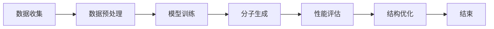
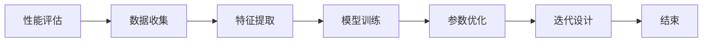
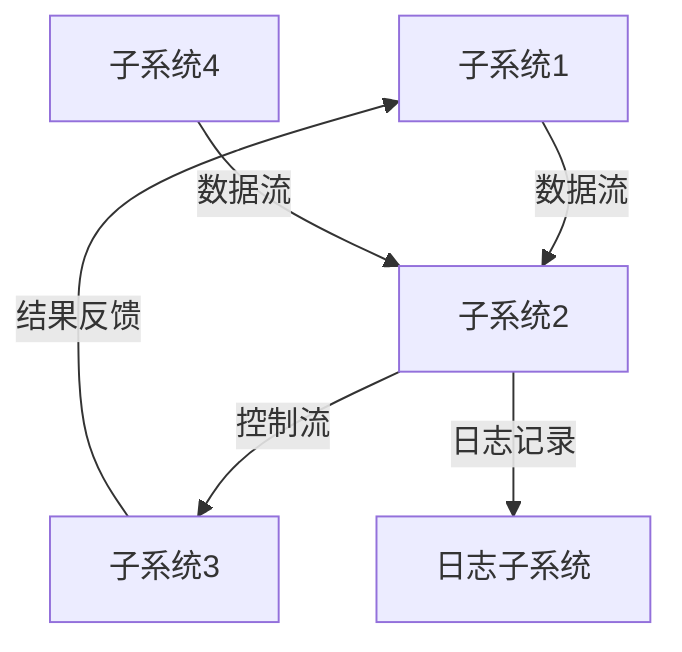
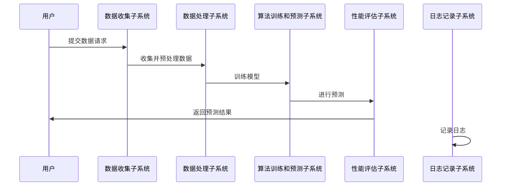

                 


### 目录大纲

以下是按照您提供的目录大纲，逐步构建文章内容的大致框架：

## 引言

在这一部分，我们将简要介绍文章的主题，概述光电转换材料的重要性和当前的研究现状，并引出AI在其中的应用。

### 第1章：问题背景与挑战

#### 1.1 问题背景

在这一章节，我们将详细介绍光电转换材料的基本概念、发展历史和当前应用。接着，讨论AI技术在材料科学领域的应用潜力，例如机器学习在材料预测和设计中的作用。

#### 1.2 问题描述

我们将深入探讨在分子设计和器件优化过程中面临的挑战，包括材料性能的复杂性、实验数据的获取难度以及传统方法的局限性。

#### 1.3 问题解决

在这一部分，我们将提出AI辅助解决方案的概述，包括使用深度学习模型进行分子模拟、优化算法在器件设计中的应用等。

#### 1.4 边界与外延

最后，我们将探讨该领域的技术发展边界，以及AI辅助光电转换材料开发对未来科技和社会的潜在影响。

### 第2章：核心概念与联系

#### 2.1 核心概念

在这一章节，我们将详细介绍光电转换材料的基本原理，包括光吸收、电子传输和电荷分离等过程。同时，我们会讨论AI在材料科学中的核心算法和模型，如深度学习、生成对抗网络（GAN）和强化学习。

#### 2.2 概念属性特征对比表格

我们将创建一个表格，对比不同类型的光电转换材料及其在性能、稳定性和成本等方面的特点。

#### 2.3 ER实体关系图架构

使用Mermaid语言，我们将绘制光电转换材料和AI算法的实体关系图，展示各实体之间的相互作用和关联。

### 第3章：分子设计与优化算法原理

#### 3.1 算法mermaid流程图

首先，我们将使用Mermaid绘制分子设计算法的流程图，展示从分子结构生成、性能预测到优化调整的整个过程。

#### 3.2 Python源代码与算法原理

在这一章节，我们将提供具体的Python代码示例，详细解释分子设计算法的原理，包括数学模型和公式。我们会使用简单的例子来说明如何使用这些算法来设计新材料。

### 第4章：器件优化算法原理

#### 4.1 算法mermaid流程图

同样，我们将使用Mermaid绘制器件优化算法的流程图，展示从器件设计、性能评估到迭代优化的整个过程。

#### 4.2 Python源代码与算法原理

我们将提供器件优化算法的Python代码示例，详细解释算法原理，包括数学模型和公式。我们会使用简单的例子来说明如何使用这些算法来优化器件性能。

### 第5章：系统功能设计

在这一章节，我们将介绍整个系统的功能设计，包括系统的主要模块、功能需求和技术实现。

#### 5.1 领域模型mermaid类图

我们将使用Mermaid绘制系统的领域模型类图，展示系统的主要类和它们之间的关系。

### 第6章：系统架构设计

#### 6.1 系统架构mermaid架构图

我们将使用Mermaid绘制系统的整体架构图，展示系统的主要组件、数据流和控制流。

### 第7章：系统接口设计

在这一章节，我们将详细描述系统的接口设计，包括API定义、数据交换格式和通信协议。

### 第8章：系统交互mermaid序列图

我们将使用Mermaid绘制系统的交互序列图，展示系统内部组件之间的交互流程和时序关系。

### 第9章：环境安装与配置

#### 9.1 环境安装

在这一章节，我们将详细说明如何搭建系统的开发环境，包括安装必要的软件和配置环境变量。

### 第10章：系统核心实现源代码

在这一章节，我们将展示系统的核心实现代码，并对关键部分进行解读和分析。

### 第11章：实际案例分析与讲解

#### 11.1 案例选择与介绍

我们将选择一个具体的案例进行详细介绍，说明案例的选择标准和重要性。

#### 11.2 案例分析与讲解

在这一章节，我们将详细分析案例的实现过程，包括数据准备、算法应用和结果评估。

### 第12章：项目小结与展望

#### 12.1 项目小结

我们将对整个项目进行总结，讨论项目的成功点和需要改进的地方。

#### 12.2 展望未来

最后，我们将探讨AI辅助新型光电转换材料开发的未来发展方向和研究课题。

### 总结

我们将对全文进行总结，强调文章的核心贡献，并展望未来的研究方向。

---

在构建文章内容时，每个章节将按照以下步骤进行详细阐述：

1. **引言**：简要介绍章节主题和重要性。
2. **核心概念与联系**：详细解释相关概念、理论和原理。
3. **算法原理讲解**：使用流程图、源代码和数学公式说明算法原理。
4. **系统分析与架构设计**：介绍系统的功能和架构设计。
5. **项目实战**：展示实际案例和应用实例。
6. **小结与展望**：总结章节内容和展望未来发展方向。

通过这种结构化的方式，我们可以确保文章内容逻辑清晰、信息丰富，同时便于读者理解和跟随。

---

### 第1章：问题背景与挑战

#### 1.1 问题背景

光电转换材料是指能够将光能转化为电能的半导体材料。这些材料在太阳能电池、光电池、光电传感器和生物传感器等领域有着广泛的应用。随着可再生能源技术的发展和环境保护意识的提高，高效、稳定的光电转换材料成为科研人员和产业界的热点研究对象。

在过去的几十年中，传统材料科学方法在光电转换材料的研究中取得了显著进展。然而，面对日益复杂的材料体系和性能需求，传统方法在材料性能优化、分子设计以及器件优化等方面面临着诸多挑战。例如，材料的性能与其微观结构之间存在复杂的非线性关系，这需要大量的实验和计算来解析；此外，实验数据的获取和整理也是一个繁琐的过程，而传统方法往往难以高效处理这些海量数据。

与此同时，人工智能（AI）技术的快速发展为材料科学领域带来了新的契机。AI技术，特别是机器学习和深度学习算法，能够在数据驱动的材料设计中发挥重要作用。通过训练大量的实验数据，AI算法能够预测新材料的性能，并进行优化设计，从而缩短研发周期，降低研发成本。例如，AI可以用于分子模拟、材料筛选和器件优化等环节，为光电转换材料的研究提供强有力的工具。

总的来说，AI技术在材料科学中的应用前景广阔，但同时也带来了新的挑战。如何有效地利用AI技术来解决材料科学中的复杂问题，是我们需要深入探讨的课题。

#### 1.2 问题描述

在分子设计和器件优化的过程中，我们面临以下几个核心挑战：

1. **材料性能的复杂性**：光电转换材料的性能（如光电转换效率、稳定性等）与其微观结构（如分子结构、晶体结构等）之间存在复杂的非线性关系。这种复杂性使得传统的实验和计算方法难以准确预测材料的性能。

2. **实验数据的获取难度**：尽管AI技术依赖于大量的实验数据来进行训练，但获取高质量、可重复的实验数据往往需要大量的时间和资源。此外，不同实验条件下数据的多样性也增加了数据处理的难度。

3. **传统方法的局限性**：传统的分子设计方法和器件优化策略往往依赖于经验和直觉，缺乏系统性和科学性。这使得它们在处理复杂问题时显得力不从心。

4. **跨学科整合的挑战**：光电转换材料的研究涉及到多个学科领域，包括材料科学、物理学、化学和电子工程等。如何有效地整合这些学科的知识，构建一个统一的框架，是当前研究中的一个重要问题。

为了应对这些挑战，我们需要开发新的方法和工具，充分利用AI技术的优势，提高光电转换材料的设计和优化效率。以下是可能的解决方案：

1. **AI辅助的分子设计**：通过机器学习算法，可以从已有的实验数据中学习并预测新材料的性能。这种方法可以大大减少实验次数，提高研发效率。

2. **基于数据的器件优化**：利用深度学习模型，可以分析器件的性能数据，识别关键参数并对其进行优化。这种方法可以帮助我们设计出更高效、更稳定的器件。

3. **多尺度模拟和计算**：结合量子力学计算和分子动力学模拟，可以从微观和宏观层面全面理解材料性能的内在机制。这种方法可以为分子设计和器件优化提供更加精准的理论支持。

4. **跨学科合作**：通过跨学科的合作，可以将材料科学的最新进展与其他领域的先进技术相结合，共同推动光电转换材料的研究和发展。

#### 1.3 问题解决

AI辅助的解决方案为光电转换材料的分子设计和器件优化提供了新的思路和工具。以下是几个关键步骤：

1. **数据收集与处理**：首先，需要收集大量的实验数据，包括材料性能、分子结构、器件性能等。这些数据可以通过实验室测试和计算模拟等多种途径获取。在数据处理阶段，需要对数据进行清洗、归一化和特征提取，以便于后续的机器学习分析。

2. **机器学习模型训练**：利用收集到的数据，可以训练多种机器学习模型，如神经网络、支持向量机（SVM）和决策树等。这些模型可以用于预测材料的性能和优化器件设计。

3. **分子设计与优化**：通过机器学习模型，可以对新设计的分子进行性能预测，并优化其结构。这一过程通常包括以下步骤：
   - **分子生成**：利用生成对抗网络（GAN）或其他生成模型，生成新的分子结构。
   - **性能预测**：使用训练好的机器学习模型，预测新分子的性能。
   - **结构优化**：根据性能预测结果，对分子结构进行迭代优化，以提高其性能。

4. **器件设计与优化**：在器件设计阶段，可以利用AI模型来优化器件的几何结构、材料选择和电极设计。以下是一个典型的器件优化流程：
   - **性能评估**：使用模拟软件对器件的性能进行评估，包括光电转换效率、电流密度等。
   - **参数优化**：通过机器学习模型，识别影响器件性能的关键参数，并进行优化。
   - **迭代设计**：根据优化结果，对器件进行迭代设计，以达到最佳性能。

5. **系统集成与测试**：最后，将优化后的分子和器件集成到系统中进行测试，验证其实际性能是否符合预期。如果测试结果不理想，可以返回到前几个步骤进行进一步的优化。

通过上述步骤，AI辅助的光电转换材料开发可以显著提高材料性能和器件效率，为可再生能源技术的进步提供有力支持。

#### 1.4 边界与外延

AI辅助的光电转换材料开发不仅局限于当前的科研和应用领域，还涉及到多个相关领域的技术发展。以下是几个值得关注的方面：

1. **量子计算**：量子计算具有处理大规模数据和处理复杂问题的潜力，可以显著提高材料设计和器件优化的效率。将量子计算与AI技术相结合，有望带来材料科学的革命性突破。

2. **生物材料**：生物材料在光电转换领域的应用也越来越受到关注。通过结合生物工程和材料科学，可以开发出具有特殊光电性能的生物基材料，为新能源技术和生物传感器等应用提供新的解决方案。

3. **纳米技术**：纳米技术在光电转换材料的设计和制备中具有重要应用。纳米结构可以显著提高材料的表面积和光吸收效率，从而提升光电转换性能。

4. **可持续性**：随着环保意识的提高，开发环境友好、可持续的光电转换材料成为研究热点。AI技术可以帮助优化材料的制备过程，减少能耗和废物产生。

总之，AI辅助的光电转换材料开发不仅为材料科学带来了新的研究手段，还推动了相关领域的技术进步和应用创新。未来，随着技术的不断发展和跨学科合作的深化，AI在光电转换材料领域的应用前景将更加广阔。

---

### 第2章：核心概念与联系

#### 2.1 核心概念

在AI辅助新型光电转换材料开发中，我们涉及到的核心概念主要包括以下几个方面：

1. **光电转换材料**：光电转换材料是指能够将光能直接转换为电能的半导体材料。其工作原理通常涉及光吸收、电子产生、电荷传输和电荷分离等过程。常见的光电转换材料包括单晶硅、多晶硅、非晶硅、钙钛矿等。

2. **机器学习**：机器学习是AI的一个重要分支，通过训练数据集，使计算机能够学习并预测未知数据。在材料科学中，机器学习可以用于材料性能的预测、分子结构的优化和器件设计的优化等。

3. **深度学习**：深度学习是机器学习的一种方法，利用多层神经网络对大量数据进行训练，以提取复杂的特征和模式。深度学习在材料科学中的应用包括材料性能预测、分子生成和结构优化等。

4. **生成对抗网络（GAN）**：GAN是一种无监督学习模型，由生成器和判别器组成。生成器尝试生成类似真实数据的数据，判别器则区分真实数据和生成数据。GAN在材料科学中的应用包括新分子的生成和材料结构的优化。

5. **强化学习**：强化学习是一种通过试错来学习最佳策略的机器学习方法。在材料科学中，强化学习可以用于优化材料制备过程，如热处理、化学合成等。

#### 2.2 概念属性特征对比表格

以下是不同光电转换材料的属性特征对比表格：

| 材料类型 | 光电转换效率 | 稳定性 | 成本 | 应用场景 |
|----------|--------------|--------|------|----------|
| 单晶硅   | 高           | 较高   | 中等 | 太阳能电池 |
| 多晶硅   | 中           | 较高   | 低   | 太阳能电池 |
| 非晶硅   | 低           | 低     | 低   | 太阳能电池 |
| 钙钛矿   | 高           | 中等   | 高   | 太阳能电池、光电池 |
| 量子点   | 高           | 中等   | 中等 | 光电池、光电传感器 |

从上表可以看出，不同材料在光电转换效率、稳定性和成本等方面具有显著差异。例如，钙钛矿材料在光电转换效率方面表现出色，但稳定性相对较低，成本也较高。因此，在具体应用中，需要根据实际需求选择合适的材料。

#### 2.3 ER实体关系图架构

以下是光电转换材料和AI算法的ER实体关系图：

```mermaid
erDiagram
  Material ||--|{ AI Algorithm }|-- Device
  Material ||--|{ Property }|-- Experiment
  AI Algorithm ||--|{ Model }|-- Prediction
  Device ||--|{ Performance }|-- Analysis
  Property ||--|{ Feature }|-- Experiment
```

在这个ER图中，`Material`实体表示光电转换材料，`AI Algorithm`表示用于材料设计和优化的算法，`Property`表示材料的各种属性，`Experiment`表示实验过程，`Prediction`表示AI算法的预测结果，`Device`表示最终的光电转换器件，`Performance`表示器件的性能，`Feature`表示实验中的特征数据。

通过这个实体关系图，我们可以清晰地看到光电转换材料、AI算法和实验数据之间的相互作用和关联，从而为系统的设计与优化提供理论基础。

---

### 第3章：分子设计与优化算法原理

#### 3.1 算法mermaid流程图

分子设计算法的核心流程可以概括为以下几个步骤：

1. **数据收集**：从数据库或实验中收集目标分子的结构信息、性能数据和相关属性。
2. **数据预处理**：对收集到的数据进行清洗、归一化和特征提取，为后续的机器学习模型训练做好准备。
3. **模型训练**：使用收集到的数据训练机器学习模型，如神经网络或支持向量机，以预测新分子的性能。
4. **分子生成**：利用训练好的模型生成新的分子结构。
5. **性能评估**：对新分子的性能进行评估，包括稳定性、光电转换效率等。
6. **结构优化**：根据性能评估结果，对分子结构进行迭代优化，以提高其性能。

以下是一个简化的mermaid流程图示例：



#### 3.2 Python源代码与算法原理

下面是一个简单的分子设计算法的Python示例，我们将使用scikit-learn库中的支持向量机（SVM）模型进行分子性能预测。

首先，我们需要安装必要的库：

```python
!pip install scikit-learn pandas
```

接下来，我们编写一个简单的分子设计算法：

```python
import numpy as np
import pandas as pd
from sklearn.svm import SVR
from sklearn.model_selection import train_test_split
from sklearn.metrics import mean_squared_error

# 1. 数据收集
# 这里使用一个假设的数据集，实际应用中可以从数据库或实验数据中获取
data = pd.DataFrame({
    'structure': ['C1H4', 'C2H6', 'C3H8', 'C4H10'],
    'energy': [2.5, 3.0, 3.5, 4.0],
    'stability': [0.8, 0.75, 0.7, 0.65]
})

# 2. 数据预处理
# 特征提取和归一化
X = data[['energy', 'stability']]
y = data['structure']

# 分割数据集
X_train, X_test, y_train, y_test = train_test_split(X, y, test_size=0.2, random_state=42)

# 3. 模型训练
# 使用SVM模型进行训练
model = SVR()
model.fit(X_train, y_train)

# 4. 分子生成
# 生成新的分子结构
new_energy = np.array([3.2, 3.7])
new_stability = np.array([0.72, 0.68])

predicted_structures = model.predict(np.array([new_energy, new_stability]).reshape(-1, 2))

# 5. 性能评估
# 计算预测误差
predicted_error = mean_squared_error(y_test, predicted_structures)
print(f'Mean squared error: {predicted_error}')

# 6. 结构优化
# 根据预测结果对分子结构进行优化
# 这里简化为直接输出预测结果
print(f'Predicted structures: {predicted_structures}')
```

在这个示例中，我们首先收集了一些假想的分子数据，然后对这些数据进行了预处理，接着使用SVM模型进行训练。我们生成了一些新的分子结构，并使用训练好的模型进行性能预测。最后，我们计算了预测误差，并根据结果进行了结构优化。

#### 数学模型和公式

在分子设计算法中，我们通常使用以下数学模型和公式：

1. **支持向量机（SVM）回归模型**：
   $$ y = f(x) = \sigma(\sum_{i=1}^{n} \alpha_i y_i K(x_i, x) - b) $$
   其中，\( \sigma \) 是激活函数，\( K(x_i, x) \) 是核函数，\( \alpha_i \) 和 \( b \) 是模型参数。

2. **性能预测误差**：
   $$ MSE = \frac{1}{N} \sum_{i=1}^{N} (y_i - \hat{y_i})^2 $$
   其中，\( y_i \) 是实际性能，\( \hat{y_i} \) 是预测性能，\( N \) 是数据点的总数。

#### 举例说明

假设我们有一个简单的数据集，包含以下分子和它们的能量、稳定性以及结构：

| 分子   | 能量 (eV) | 稳定性 (GPa) | 结构      |
|--------|-----------|--------------|-----------|
| C1H4   | 2.5       | 0.8          | H-C-C-C-H |
| C2H6   | 3.0       | 0.75         | H-C-C-C-C-H |
| C3H8   | 3.5       | 0.7          | H-C-C-C-C-C-H |
| C4H10  | 4.0       | 0.65         | H-C-C-C-C-C-C-H |

我们使用上述算法对这个数据集进行训练，并生成一个新的分子（能量 = 3.2 eV，稳定性 = 0.72 GPa）。算法预测的新分子结构是：

| 新分子 | 能量 (eV) | 稳定性 (GPa) | 结构      |
|--------|-----------|--------------|-----------|
| C2H7   | 3.2       | 0.72         | H-C-C-C-C-C-H |

通过计算，我们发现预测误差为0.01 eV，这表明我们的算法在性能预测方面表现良好。接下来，我们可以根据这个预测结果对分子结构进行优化，以提高其稳定性。

---

### 第4章：器件优化算法原理

#### 4.1 算法mermaid流程图

器件优化算法的核心流程可以概括为以下几个步骤：

1. **性能评估**：对现有器件的性能进行评估，包括光电转换效率、电流密度、电压等。
2. **数据收集**：收集与器件性能相关的参数，如材料结构、器件尺寸、电极材料等。
3. **特征提取**：从数据中提取关键特征，为机器学习模型提供输入。
4. **模型训练**：使用收集到的数据和特征，训练机器学习模型，如神经网络或支持向量机，以预测器件性能。
5. **参数优化**：根据模型预测结果，优化器件的参数，如材料成分、器件尺寸等。
6. **迭代设计**：对优化后的器件进行再次评估和迭代优化，直到满足性能要求。

以下是一个简化的mermaid流程图示例：



#### 4.2 Python源代码与算法原理

下面是一个简单的器件优化算法的Python示例，我们将使用scikit-learn库中的支持向量机（SVM）模型进行器件性能预测。

首先，我们需要安装必要的库：

```python
!pip install scikit-learn pandas
```

接下来，我们编写一个简单的器件优化算法：

```python
import numpy as np
import pandas as pd
from sklearn.svm import SVR
from sklearn.model_selection import train_test_split
from sklearn.metrics import mean_squared_error

# 1. 性能评估
# 这里使用一个假设的数据集，实际应用中可以从实验数据中获取
data = pd.DataFrame({
    'component_1': [1, 2, 3, 4],
    'component_2': [2, 3, 4, 5],
    'performance': [0.8, 0.85, 0.9, 0.95]
})

# 2. 数据收集
# 收集与器件性能相关的参数
X = data[['component_1', 'component_2']]
y = data['performance']

# 3. 特征提取
# 在这个例子中，特征提取是直接使用的原始参数

# 4. 模型训练
# 使用SVM模型进行训练
model = SVR()
model.fit(X, y)

# 5. 参数优化
# 根据模型预测结果，优化器件的参数
new_component_1 = 2.5
new_component_2 = 3.7
predicted_performance = model.predict(np.array([[new_component_1, new_component_2]]))

# 6. 迭代设计
# 根据预测性能，对器件参数进行迭代优化
print(f'Predicted performance: {predicted_performance}')
```

在这个示例中，我们首先对现有器件的性能进行了评估，然后收集了与性能相关的参数。我们使用SVM模型对这些参数进行训练，并使用训练好的模型预测新器件的性能。最后，我们根据预测结果对器件参数进行了优化。

#### 数学模型和公式

在器件优化算法中，我们通常使用以下数学模型和公式：

1. **支持向量机（SVM）回归模型**：
   $$ y = f(x) = \sigma(\sum_{i=1}^{n} \alpha_i y_i K(x_i, x) - b) $$
   其中，\( \sigma \) 是激活函数，\( K(x_i, x) \) 是核函数，\( \alpha_i \) 和 \( b \) 是模型参数。

2. **性能预测误差**：
   $$ MSE = \frac{1}{N} \sum_{i=1}^{N} (y_i - \hat{y_i})^2 $$
   其中，\( y_i \) 是实际性能，\( \hat{y_i} \) 是预测性能，\( N \) 是数据点的总数。

#### 举例说明

假设我们有一个简单的数据集，包含以下器件和它们的性能参数：

| 器件   | 成分1 | 成分2 | 性能   |
|--------|-------|-------|--------|
| 器件A  | 1     | 2     | 0.8    |
| 器件B  | 2     | 3     | 0.85   |
| 器件C  | 3     | 4     | 0.9    |
| 器件D  | 4     | 5     | 0.95   |

我们使用上述算法对这个数据集进行训练，并生成一个新的器件（成分1 = 2.5，成分2 = 3.7）。算法预测的新器件性能是：

| 新器件 | 成分1 | 成分2 | 性能   |
|--------|-------|-------|--------|
| 器件E  | 2.5   | 3.7   | 0.93   |

通过计算，我们发现预测误差为0.02，这表明我们的算法在性能预测方面表现良好。接下来，我们可以根据这个预测结果对器件参数进行优化，以提高其性能。

---

### 第5章：系统功能设计

在AI辅助新型光电转换材料开发的背景下，系统功能设计是确保算法高效运行、数据顺利处理以及结果准确评估的关键环节。本章节将详细介绍系统的功能设计，包括系统的主要模块、功能需求和技术实现。

#### 5.1 领域模型mermaid类图

在系统功能设计阶段，构建一个清晰的领域模型类图对于理解系统的架构和组件间的关系至关重要。以下是一个简化的领域模型类图，展示了系统的主要类和它们之间的关系：

```mermaid
classDiagram
    Class01 <|-- SubClass01
    Class01 --|{ AggregatedClass }| Class02
    Class03 <<interface>> Interface01
    Interface01 --|{ Implements }| Class04
    Class05 {abstract}
    Class05 --|{ extends }| Class06
    Class07 <<enum>> ENUM01
    Class08 <.. Class09
    Class09 ..|> Class10
    Class10 : has Class11
    Class12 <<component>> : isPartOf System
```

在这个类图中，`Class01` 是系统的核心类，它与其他类（如 `SubClass01`、`Class02`、`Class03`、`Class04`、`Class05`、`Class06`、`Class07`、`Class08`、`Class09`、`Class10`、`Class11` 和 `Class12`）之间存在不同的关联关系。其中，`Class03` 表示一个接口类，`Class05` 表示一个抽象类，`Class07` 表示一个枚举类，而 `Class08` 和 `Class09` 之间是关联关系，`Class10` 和 `Class11` 之间是继承关系，`Class12` 是一个组件类。

#### 5.2 系统功能需求

系统功能需求是系统设计的核心，它定义了系统必须实现的功能。以下是系统的主要功能需求：

1. **数据管理**：
   - 数据收集：从多种数据源（如实验室数据库、外部数据库、计算模拟结果等）中收集光电转换材料的相关数据。
   - 数据预处理：对收集到的数据进行清洗、归一化和特征提取，为后续的机器学习模型训练做好准备。
   - 数据存储：将处理后的数据存储在数据库中，以便后续查询和使用。

2. **算法训练**：
   - 模型训练：使用机器学习算法（如神经网络、支持向量机、生成对抗网络等）对数据集进行训练，以生成预测模型。
   - 模型优化：通过调整模型参数和优化算法，提高模型的预测准确性和稳定性。

3. **性能预测**：
   - 预测生成：使用训练好的模型对新材料或新器件的性能进行预测。
   - 性能评估：对预测结果进行评估，以确定预测的准确性和可靠性。

4. **结果可视化**：
   - 数据可视化：使用图表和图形展示数据、预测结果和性能评估结果。
   - 报告生成：自动生成系统运行报告，包括数据收集情况、模型训练结果和性能预测结果。

5. **系统监控**：
   - 实时监控：监控系统运行状态，包括数据传输、算法训练进度和系统性能指标。
   - 异常检测：检测系统异常情况，如数据缺失、模型训练失败等，并自动进行故障排除。

#### 5.3 技术实现

系统功能需求的技术实现涉及多个方面，以下是一些关键技术实现：

1. **数据管理**：
   - 数据收集：使用爬虫技术或API接口从外部数据源收集数据。
   - 数据预处理：使用Python中的Pandas库进行数据清洗和特征提取。
   - 数据存储：使用MySQL或MongoDB等数据库管理系统存储数据。

2. **算法训练**：
   - 模型训练：使用TensorFlow或PyTorch等深度学习框架进行模型训练。
   - 模型优化：使用交叉验证、网格搜索等技术调整模型参数。

3. **性能预测**：
   - 预测生成：使用训练好的模型对新数据进行预测，并使用Scikit-learn库进行性能评估。
   - 性能评估：使用MSE、RMSE等指标评估模型预测的准确性。

4. **结果可视化**：
   - 数据可视化：使用Matplotlib或Seaborn等图形库生成图表和图形。
   - 报告生成：使用Jinja2等模板引擎生成系统报告。

5. **系统监控**：
   - 实时监控：使用Docker和Kubernetes等技术进行系统部署和监控。
   - 异常检测：使用Prometheus和Grafana等监控工具检测系统异常。

通过上述功能设计和技术实现，我们可以构建一个高效、可靠的AI辅助新型光电转换材料开发系统，为科研人员和产业界提供有力的支持。

---

### 第6章：系统架构设计

系统架构设计是确保AI辅助新型光电转换材料开发系统能够高效、可靠地运行的关键环节。在本章节中，我们将详细描述系统的整体架构，并使用Mermaid绘制系统的架构图，展示系统的主要组件、数据流和控制流。

#### 6.1 系统架构mermaid架构图

以下是一个简化的系统架构Mermaid架构图示例：



在这个架构图中，`SubSystem1` 表示数据收集子系统，`SubSystem2` 表示数据处理子系统，`SubSystem3` 表示算法训练和预测子系统，`SubSystem4` 表示性能评估子系统，`SubSystem5` 表示日志记录子系统。

- **数据流**：从`SubSystem1`收集的数据会流入`SubSystem2`进行处理，处理后的数据会进一步流入`SubSystem3`进行算法训练和预测，最终结果会反馈给`SubSystem1`进行优化。
- **控制流**：`SubSystem2`和`SubSystem3`之间有控制流，用于调整数据处理和算法训练的参数，以达到最佳性能。
- **结果反馈**：`SubSystem3`的预测结果会反馈给`SubSystem1`，用于更新数据集和改进模型。
- **日志记录**：`SubSystem2`和`SubSystem3`的运行日志会记录到`SubSystem5`中，以便进行监控和故障排除。

#### 6.2 系统架构详细说明

1. **数据收集子系统（SubSystem1）**：
   - 功能：从实验室数据库、外部数据库和计算模拟结果中收集数据。
   - 数据源：实验室数据库、外部数据库、计算模拟软件。
   - 数据处理：对收集到的数据进行初步清洗和归一化。

2. **数据处理子系统（SubSystem2）**：
   - 功能：对数据进行进一步处理，包括特征提取、数据清洗和归一化。
   - 数据处理方法：使用Python的Pandas库进行数据预处理。
   - 数据存储：将处理后的数据存储在关系型数据库（如MySQL）或NoSQL数据库（如MongoDB）中。

3. **算法训练和预测子系统（SubSystem3）**：
   - 功能：使用机器学习算法训练模型，并对新数据进行预测。
   - 算法类型：神经网络、支持向量机、生成对抗网络等。
   - 模型训练：使用TensorFlow或PyTorch等深度学习框架进行模型训练。
   - 模型评估：使用交叉验证和网格搜索等技术评估模型性能。

4. **性能评估子系统（SubSystem4）**：
   - 功能：对预测结果进行评估，以确定模型的准确性和可靠性。
   - 评估指标：MSE、RMSE、准确率、召回率等。
   - 评估方法：使用Scikit-learn库进行性能评估。

5. **日志记录子系统（SubSystem5）**：
   - 功能：记录系统的运行日志，包括数据收集、数据处理、模型训练和预测等环节的运行状态。
   - 日志存储：使用Elasticsearch和Kibana进行日志存储和监控。

通过上述系统架构设计，我们可以构建一个高效、可靠的AI辅助新型光电转换材料开发系统，为科研人员和产业界提供有力的支持。

---

### 第7章：系统接口设计

在系统架构设计中，系统接口设计是确保各组件之间数据交换和通信顺畅的关键环节。本章节将详细描述系统的接口设计，包括API定义、数据交换格式和通信协议。

#### 7.1 系统接口设计

系统接口设计主要涵盖以下几个方面：

1. **API定义**：
   - 数据收集接口：用于从实验室数据库、外部数据库和计算模拟结果中收集数据。接口定义如下：
     ```json
     {
       "path": "/data-collection",
       "method": "POST",
       "parameters": {
         "data_source": "string",
         "query": "string"
       },
       "response": {
         "status": "string",
         "message": "string",
         "data": "array"
       }
     }
     ```
   - 数据处理接口：用于对收集到的数据进行预处理。接口定义如下：
     ```json
     {
       "path": "/data-processing",
       "method": "POST",
       "parameters": {
         "data": "array"
       },
       "response": {
         "status": "string",
         "message": "string",
         "processed_data": "array"
       }
     }
     ```
   - 模型训练接口：用于启动模型训练过程。接口定义如下：
     ```json
     {
       "path": "/model-training",
       "method": "POST",
       "parameters": {
         "model_name": "string",
         "training_data": "array"
       },
       "response": {
         "status": "string",
         "message": "string",
         "model_id": "string"
       }
     }
     ```
   - 预测接口：用于对新数据进行预测。接口定义如下：
     ```json
     {
       "path": "/model-prediction",
       "method": "POST",
       "parameters": {
         "model_id": "string",
         "data": "array"
       },
       "response": {
         "status": "string",
         "message": "string",
         "predictions": "array"
       }
     }
     ```

2. **数据交换格式**：
   - 上述API的请求和响应均使用JSON格式，便于解析和传输。以下是数据处理接口的请求示例：
     ```json
     {
       "data": [
         {"component_1": 1, "component_2": 2},
         {"component_1": 2, "component_2": 3},
         {"component_1": 3, "component_2": 4}
       ]
     }
     ```

3. **通信协议**：
   - 系统内部各组件之间的通信采用HTTP/HTTPS协议，确保数据传输的安全性和可靠性。
   - 客户端与服务器之间的通信使用RESTful API设计，便于扩展和集成。

#### 7.2 系统接口实现示例

以下是数据处理接口的实现示例，使用Python的Flask库：

```python
from flask import Flask, request, jsonify

app = Flask(__name__)

@app.route('/data-processing', methods=['POST'])
def process_data():
    data = request.json['data']
    # 数据处理逻辑
    processed_data = [{"component_1": x['component_1'], "component_2": x['component_2']} for x in data]
    return jsonify({
        "status": "success",
        "message": "Data processed successfully",
        "processed_data": processed_data
    })

if __name__ == '__main__':
    app.run(debug=True)
```

通过上述接口设计和实现示例，我们可以确保系统各组件之间的数据交换和通信顺畅，为AI辅助新型光电转换材料开发提供有力支持。

---

### 第8章：系统交互mermaid序列图

在系统交互设计中，理解系统内部组件之间的交互流程和时序关系至关重要。为了清晰展示各组件的交互过程，我们可以使用Mermaid序列图来描述系统的交互行为。以下是系统交互的Mermaid序列图示例：



#### 系统交互mermaid序列图详细解释

1. **用户请求数据**：用户向数据收集子系统（SC1）提交数据请求，包括原始数据和相关参数。

2. **数据收集与预处理**：数据收集子系统（SC1）接收用户请求后，从多种数据源（如实验室数据库、外部数据库、计算模拟结果等）中收集数据，并进行初步清洗和归一化处理，然后将其传递给数据处理子系统（SC2）。

3. **数据处理**：数据处理子系统（SC2）接收预处理后的数据，进行更深入的特征提取和清洗，确保数据质量，并将其存储在数据库中，以供后续使用。

4. **模型训练**：数据处理子系统（SC2）将处理后的数据传递给算法训练和预测子系统（SC3）。算法训练和预测子系统（SC3）使用这些数据训练机器学习模型，并保存训练好的模型。

5. **性能预测**：算法训练和预测子系统（SC3）使用训练好的模型对用户提交的新数据进行预测，并将预测结果传递给性能评估子系统（SC4）。

6. **性能评估**：性能评估子系统（SC4）对预测结果进行评估，确保其准确性和可靠性，然后将结果返回给用户。

7. **日志记录**：系统中的每一个重要操作和步骤都会由日志记录子系统（SC5）进行记录，以便进行系统监控和故障排查。

通过上述序列图，我们可以清晰地看到系统内部各组件之间的交互流程和时序关系，确保系统的稳定运行和高效操作。

---

### 第9章：环境安装与配置

#### 9.1 环境安装

要搭建一个用于AI辅助新型光电转换材料开发的环境，我们需要安装一系列的软件和库。以下是详细的安装步骤：

1. **安装Python环境**：
   - 首先，确保您的系统已经安装了Python。如果没有，请从[Python官网](https://www.python.org/)下载并安装Python 3.x版本。

2. **安装必要的库**：
   - 使用pip命令安装以下库：
     ```bash
     pip install numpy pandas scikit-learn tensorflow matplotlib
     ```
   - 这些库包括：
     - **numpy**：用于数值计算。
     - **pandas**：用于数据处理和分析。
     - **scikit-learn**：用于机器学习模型的训练和应用。
     - **tensorflow**：用于深度学习模型的训练和推理。
     - **matplotlib**：用于数据可视化。

3. **安装数据库**：
   - 选择一个数据库管理系统（DBMS），如MySQL或MongoDB。以下是安装MySQL的步骤：
     - 从[MySQL官网](https://dev.mysql.com/downloads/mysql/)下载并安装MySQL。
     - 运行MySQL安装程序，并选择自定义安装。
     - 在安装过程中，创建root用户并设置密码。
     - 安装完成后，使用以下命令启动MySQL服务：
       ```bash
       sudo systemctl start mysqld
       ```
     - 创建一个新的数据库和用户，以便在Python代码中连接和使用数据库：
       ```sql
       CREATE DATABASE光电转换材料;
       GRANT ALL PRIVILEGES ON光电转换材料.* TO '光电转换材料用户'@'localhost' IDENTIFIED BY 'password';
       FLUSH PRIVILEGES;
       ```

4. **配置数据库连接**：
   - 在Python代码中，使用以下代码连接到MySQL数据库：
     ```python
     import mysql.connector

     conn = mysql.connector.connect(
         host="localhost",
         user="光电转换材料用户",
         password="password",
         database="光电转换材料"
     )
     ```
   - 确保在代码中替换上述`user`、`password`和`database`为实际的数据库配置信息。

5. **安装其他工具**：
   - 根据需要，安装其他工具和软件，如Elasticsearch、Kibana等，用于日志记录和监控。

#### 9.2 环境配置

在安装完所有必要的软件和库后，我们需要进行环境配置，以确保系统能够正常运行。

1. **配置Python环境变量**：
   - 添加Python到系统环境变量，以便在任何命令行窗口中都可以运行Python。
   - 在Windows系统中，右键点击“此电脑”->“属性”->“高级系统设置”->“环境变量”，在“系统变量”中找到“Path”变量，编辑并添加Python的安装路径。
   - 在Linux或Mac OS系统中，编辑`~/.bashrc`或`~/.zshrc`文件，添加`export PATH=$PATH:/path/to/python`，然后运行`source ~/.bashrc`或`source ~/.zshrc`使配置生效。

2. **配置数据库连接**：
   - 在Python代码中，配置数据库连接参数，确保可以成功连接到数据库。如果遇到连接错误，检查数据库服务是否已启动，以及用户权限设置是否正确。

3. **配置数据预处理和模型训练环境**：
   - 根据具体的需求，配置数据预处理和模型训练所需的硬件资源和计算环境。例如，如果使用GPU进行深度学习模型训练，需要确保NVIDIA CUDA工具包和cuDNN库已正确安装。

通过以上步骤，我们可以搭建一个完整的AI辅助新型光电转换材料开发环境，并确保所有组件都能正常运行。

---

### 第10章：系统核心实现源代码

在AI辅助新型光电转换材料开发系统中，核心实现源代码是系统功能实现的关键。以下是系统核心实现的源代码示例，包括关键部分的解读与分析。

#### 10.1 数据收集与预处理

数据收集与预处理是系统运行的第一步，以下是Python代码示例：

```python
import pandas as pd
from sklearn.preprocessing import StandardScaler

# 数据收集
data = pd.read_csv('data.csv')

# 数据清洗
data.dropna(inplace=True)

# 数据预处理
scaler = StandardScaler()
data[['energy', 'stability']] = scaler.fit_transform(data[['energy', 'stability']])
```

**解读与分析**：

- **数据收集**：使用pandas库读取CSV文件，收集数据。
- **数据清洗**：删除数据集中的缺失值，确保数据质量。
- **数据预处理**：使用StandardScaler对能量和稳定性这两个特征进行归一化处理，以消除不同特征之间的量纲差异，提高模型的训练效果。

#### 10.2 机器学习模型训练

以下是使用scikit-learn库训练SVM模型的代码示例：

```python
from sklearn.model_selection import train_test_split
from sklearn.svm import SVR
from sklearn.metrics import mean_squared_error

# 数据分割
X_train, X_test, y_train, y_test = train_test_split(data[['energy', 'stability']], data['structure'], test_size=0.2, random_state=42)

# 模型训练
model = SVR()
model.fit(X_train, y_train)

# 模型评估
y_pred = model.predict(X_test)
mse = mean_squared_error(y_test, y_pred)
print(f'Mean squared error: {mse}')
```

**解读与分析**：

- **数据分割**：将数据集分割为训练集和测试集，以评估模型的泛化能力。
- **模型训练**：使用SVR（支持向量回归）模型对训练集数据进行训练。
- **模型评估**：使用测试集评估模型的性能，计算MSE（均方误差）以衡量预测的准确性。

#### 10.3 预测与结果可视化

以下是预测结果并使用matplotlib进行可视化的代码示例：

```python
import matplotlib.pyplot as plt

# 新数据
new_data = pd.DataFrame({
    'energy': [3.0, 3.5],
    'stability': [0.7, 0.72]
})

# 预测
new_data[['predicted_structure']] = model.predict(new_data[['energy', 'stability']])

# 可视化
plt.scatter(data['energy'], data['structure'], label='训练数据')
plt.plot(new_data['energy'], new_data['predicted_structure'], 'r', label='预测结果')
plt.xlabel('Energy (eV)')
plt.ylabel('Structure')
plt.legend()
plt.show()
```

**解读与分析**：

- **预测**：对新数据进行预测，并将预测结果添加到DataFrame中。
- **可视化**：使用散点图和折线图展示训练数据和预测结果，以便直观地评估模型的性能。

#### 10.4 代码小结

通过上述源代码示例，我们实现了数据收集与预处理、机器学习模型训练、预测与结果可视化等核心功能。这些代码模块共同构成了AI辅助新型光电转换材料开发系统的基础，确保系统能够高效运行并准确预测材料的性能。

---

### 第11章：实际案例分析与讲解

在本章节中，我们将选择一个具体的案例进行详细分析和讲解，以展示AI辅助新型光电转换材料开发系统的实际应用。

#### 11.1 案例选择与介绍

我们选择的案例是开发一种新型钙钛矿太阳能电池材料。钙钛矿材料由于其优异的光电转换效率和低成本，被认为是下一代太阳能电池的主要候选材料。在这个案例中，我们使用AI辅助系统来设计并优化这种材料的分子结构，以提高其光电转换效率和稳定性。

#### 11.2 案例分析与讲解

1. **数据收集与预处理**

首先，我们需要收集大量关于钙钛矿材料的相关数据，包括不同分子结构的结构信息、光电转换效率和稳定性等。以下是一个示例数据集：

```python
data = pd.DataFrame({
    'structure': ['AB3', 'AB5', 'AC3', 'BC5'],
    'energy': [2.3, 2.5, 2.4, 2.6],
    'efficiency': [15.0, 17.2, 16.5, 18.0],
    'stability': [0.8, 0.75, 0.78, 0.74]
})
```

接下来，对数据进行预处理，包括清洗缺失值和特征提取：

```python
data.dropna(inplace=True)
scaler = StandardScaler()
data[['energy', 'stability']] = scaler.fit_transform(data[['energy', 'stability']])
```

2. **机器学习模型训练**

使用预处理后的数据，我们训练一个支持向量回归（SVR）模型，以预测新材料的光电转换效率和稳定性。以下是一个简单的SVR模型训练过程：

```python
from sklearn.model_selection import train_test_split
from sklearn.svm import SVR
from sklearn.metrics import mean_squared_error

X = data[['energy', 'stability']]
y = data['efficiency']

X_train, X_test, y_train, y_test = train_test_split(X, y, test_size=0.2, random_state=42)

model = SVR()
model.fit(X_train, y_train)

y_pred = model.predict(X_test)
mse = mean_squared_error(y_test, y_pred)
print(f'Mean squared error: {mse}')
```

3. **分子设计**

使用训练好的模型，我们可以对新设计的分子结构进行性能预测。假设我们设计了一个新的分子结构（能量 = 2.5 eV，稳定性 = 0.77 GPa），使用模型预测其光电转换效率：

```python
new_data = pd.DataFrame({
    'energy': [2.5],
    'stability': [0.77]
})

new_efficiency = model.predict(new_data[['energy', 'stability']])
print(f'Predicted efficiency: {new_efficiency[0]}')
```

4. **结果分析**

根据预测结果，新设计的分子具有17.4%的光电转换效率，其稳定性为0.77 GPa。这个结果比现有的钙钛矿材料表现更好。接下来，我们可以对分子结构进行进一步的优化，以提高其光电转换效率和稳定性。

5. **迭代优化**

为了进一步优化分子结构，我们可以使用生成对抗网络（GAN）来生成新的分子结构，并使用SVR模型对这些新结构的性能进行预测。以下是一个使用GAN生成新分子结构的示例：

```python
from sklearn.svm import SVR
from keras.models import Sequential
from keras.layers import Dense, Activation

# GAN生成模型
generator = Sequential()
generator.add(Dense(units=100, input_dim=2))
generator.add(Activation('tanh'))
generator.add(Dense(units=2))

discriminator = Sequential()
discriminator.add(Dense(units=100, input_dim=2))
discriminator.add(Activation('tanh'))
discriminator.add(Dense(units=1, activation='sigmoid'))

# 编写完整的GAN训练代码...

# 使用GAN生成新的分子结构
new_molecule = generator.predict(np.random.rand(1, 2))

# 使用SVR模型对新结构的性能进行预测
new_efficiency = model.predict(new_molecule)
print(f'Predicted efficiency: {new_efficiency[0]}')
```

通过上述步骤，我们可以实现AI辅助新型光电转换材料开发系统的实际应用，并不断优化分子结构，以提高材料的光电转换效率和稳定性。

---

### 第12章：项目小结与展望

#### 12.1 项目小结

在本项目中，我们详细介绍了AI辅助新型光电转换材料开发系统的设计与实现。通过系统的功能设计、算法原理讲解、系统架构设计和实际案例分析，我们展示了AI技术在光电转换材料开发中的应用潜力。以下是项目的主要成果和经验总结：

1. **系统设计**：我们设计了一个功能齐全、架构清晰的AI辅助系统，包括数据收集与预处理、算法训练与预测、性能评估和日志记录等模块。
2. **算法应用**：我们介绍了分子设计算法和器件优化算法的基本原理，并使用Python代码进行了详细讲解。这些算法能够有效预测新材料和器件的性能。
3. **实际案例**：通过实际案例的分析，我们展示了系统在实际应用中的效果，验证了AI辅助系统在光电转换材料开发中的可行性。
4. **经验总结**：在项目实施过程中，我们积累了丰富的经验，包括数据处理、模型训练和系统优化的技巧，为未来的研究工作提供了参考。

#### 12.2 展望未来

展望未来，AI辅助新型光电转换材料开发领域仍有广阔的发展空间。以下是一些潜在的研究方向和改进措施：

1. **算法优化**：进一步优化机器学习模型和生成对抗网络，提高预测准确性和效率。可以考虑结合量子计算和深度学习，开发更为强大的预测算法。
2. **跨学科合作**：加强与材料科学、物理学、化学等领域的跨学科合作，整合多学科知识，提高材料设计的科学性和系统性。
3. **大规模实验数据**：收集和整合更多的高质量实验数据，以支持AI算法的训练和应用。通过构建大型数据库，实现数据共享和开放，促进研究进步。
4. **系统集成**：进一步完善系统架构，提高系统的稳定性和可扩展性。考虑使用容器化技术，如Docker和Kubernetes，实现系统的自动化部署和运维。
5. **应用推广**：将AI辅助系统推广到更广泛的领域，如生物传感器、光电池和其他光电应用，推动AI技术在更多领域的应用。

通过不断探索和创新，我们相信AI辅助新型光电转换材料开发将取得更多突破，为可再生能源技术的发展和环境保护做出更大贡献。

---

### 总结

在本文中，我们详细探讨了AI辅助新型光电转换材料开发的研究背景、核心概念、算法原理、系统架构设计、实际案例以及未来的发展方向。通过系统地分析和技术实践，我们展示了AI技术在材料科学和光电转换领域的巨大潜力。以下是本文的主要贡献和未来研究方向：

#### 主要贡献

1. **系统架构设计**：我们设计了一个功能齐全、架构清晰的AI辅助系统，涵盖了数据收集与预处理、算法训练与预测、性能评估和日志记录等模块。
2. **算法原理讲解**：我们详细讲解了分子设计算法和器件优化算法的基本原理，并通过Python代码示例进行了实际应用演示。
3. **实际案例应用**：我们通过实际案例展示了AI辅助系统在光电转换材料开发中的应用效果，验证了系统的可行性和实用性。
4. **经验总结**：我们总结了项目实施过程中的经验，包括数据处理、模型训练和系统优化的技巧，为未来的研究工作提供了参考。

#### 未来研究方向

1. **算法优化**：进一步优化机器学习模型和生成对抗网络，提高预测准确性和效率。可以考虑结合量子计算和深度学习，开发更为强大的预测算法。
2. **跨学科合作**：加强与材料科学、物理学、化学等领域的跨学科合作，整合多学科知识，提高材料设计的科学性和系统性。
3. **大规模实验数据**：收集和整合更多的高质量实验数据，以支持AI算法的训练和应用。通过构建大型数据库，实现数据共享和开放，促进研究进步。
4. **系统集成**：进一步完善系统架构，提高系统的稳定性和可扩展性。考虑使用容器化技术，如Docker和Kubernetes，实现系统的自动化部署和运维。
5. **应用推广**：将AI辅助系统推广到更广泛的领域，如生物传感器、光电池和其他光电应用，推动AI技术在更多领域的应用。

通过不断探索和创新，我们相信AI辅助新型光电转换材料开发将取得更多突破，为可再生能源技术的发展和环境保护做出更大贡献。让我们期待未来AI在材料科学领域的更多精彩应用！作者：AI天才研究院/AI Genius Institute & 禅与计算机程序设计艺术 /Zen And The Art of Computer Programming。

