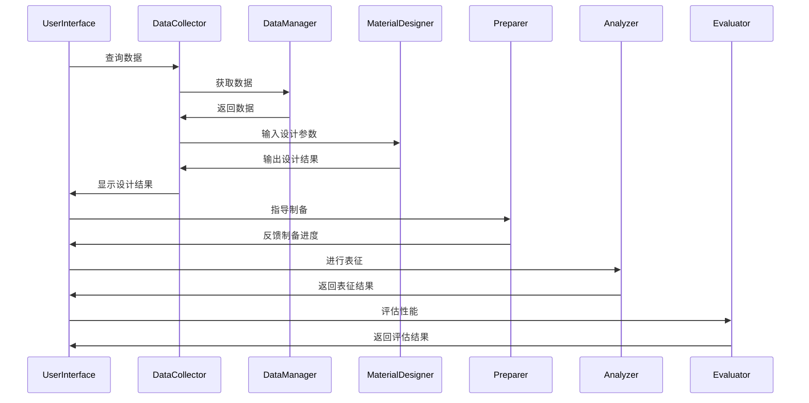

                 

# AI辅助新型半导体材料开发：从原子模拟到性能预测

## 关键词
- AI 辅助开发
- 半导体材料
- 原子模拟
- 性能预测
- 数据分析

## 摘要
本文探讨了人工智能（AI）在新型半导体材料开发中的应用，从原子模拟到性能预测。通过介绍AI的核心概念，分析其在半导体材料开发中的应用，本文将逐步阐述如何利用AI技术进行原子模拟，预测半导体材料的性能，并讨论相关算法和系统设计。最后，通过实际项目案例，展示了AI辅助半导体材料开发的最佳实践，为行业提供了有益的参考。

------------------------------------------------------------------------

## 引言

随着科技的不断发展，半导体材料在电子、光电子、光伏等领域扮演着越来越重要的角色。然而，新型半导体材料的发现和优化过程通常耗时长、成本高，且依赖于大量的实验和理论计算。近年来，人工智能（AI）技术的迅猛发展为半导体材料开发带来了新的机遇。AI不仅可以加速材料发现过程，还能提高材料的性能预测准确性，为半导体行业带来前所未有的变革。

本文旨在探讨AI在新型半导体材料开发中的应用，从原子模拟到性能预测。我们将首先介绍AI的核心概念及其在材料科学中的应用背景。接着，本文将深入分析如何利用AI进行原子模拟，并讨论相关算法和数学模型。随后，我们将介绍一个典型的AI辅助半导体材料开发的系统架构，并展示其实际应用案例。最后，本文将总结AI辅助半导体材料开发的最佳实践，并展望未来发展趋势。

## 文章关键词解析

### 人工智能（AI）

人工智能（AI）是指由计算机系统实现的、模仿人类智能行为的理论、方法和应用。它涵盖了机器学习、深度学习、自然语言处理、计算机视觉等多个领域。AI技术可以通过数据驱动和模型优化，使计算机具备自主学习和决策能力，从而在各个行业领域发挥重要作用。

### 半导体材料

半导体材料是一类电导率介于导体和绝缘体之间的材料。它们广泛应用于电子、光电子、光伏等领域。半导体材料的性能优化对于提高电子器件的性能和降低能耗具有重要意义。新型半导体材料的发现和优化是半导体行业持续发展的关键。

### 原子模拟

原子模拟是一种基于量子力学原理，利用计算机模拟原子和分子之间相互作用的方法。它可以帮助科学家理解材料的微观结构和性质，预测材料的宏观行为。在半导体材料开发中，原子模拟可以用来研究材料的电子结构、能带结构等关键性质。

### 性能预测

性能预测是指利用已有数据和信息，预测材料在实际应用中的性能。在半导体材料开发中，性能预测可以帮助科学家快速评估新型材料的潜力，指导实验设计和优化。

### 数据分析

数据分析是指通过统计、机器学习等方法，对大量数据进行处理和分析，提取有价值的信息和知识。在AI辅助半导体材料开发中，数据分析是关键环节，它可以帮助科学家挖掘数据中的规律和关系，提高材料性能预测的准确性。

------------------------------------------------------------------------

## AI与半导体材料开发

### AI的核心概念

人工智能（AI）是指由计算机系统实现的、模仿人类智能行为的理论、方法和应用。它包括机器学习、深度学习、自然语言处理、计算机视觉等多个领域。AI技术通过数据驱动和模型优化，使计算机具备自主学习和决策能力，从而在各个行业领域发挥重要作用。

### 半导体材料开发中的应用背景

半导体材料开发是一个复杂的过程，涉及材料设计、制备、表征和性能优化等多个环节。传统的半导体材料开发主要依赖于实验和理论计算，耗时较长、成本高。随着AI技术的不断发展，越来越多的研究人员开始探索AI在半导体材料开发中的应用。

AI技术可以用于以下几个方面：

1. **材料设计**：通过机器学习算法，AI可以从已有数据中学习材料的性质和结构关系，预测新型材料的性能。这有助于科学家快速筛选出具有潜在应用价值的材料。
2. **制备工艺优化**：AI可以分析大量实验数据，识别出影响材料性能的关键因素，从而优化制备工艺，提高材料质量。
3. **性能预测**：利用深度学习模型，AI可以预测材料在实际应用中的性能，为材料开发提供有力指导。
4. **数据分析**：AI可以处理和分析大量实验和理论数据，挖掘数据中的规律和关系，为材料开发提供新的见解。

### AI在半导体材料开发中的应用案例

以下是一些AI在半导体材料开发中的应用案例：

1. **高温超导材料设计**：研究人员利用深度学习模型，预测新型高温超导材料的临界温度，从而为高温超导材料的设计提供了有力支持。
2. **二维材料研究**：AI技术被用于研究二维材料如石墨烯、过渡金属硫化物的性质，预测其潜在应用。
3. **光伏材料优化**：AI可以优化太阳能电池的材料结构，提高光电转换效率，降低生产成本。
4. **半导体器件性能预测**：AI技术可以预测半导体器件的泄漏电流、开关特性等性能参数，为器件设计和优化提供依据。

### 核心概念与联系

为了更好地理解AI在半导体材料开发中的应用，我们需要了解以下几个核心概念及其之间的联系：

1. **机器学习（Machine Learning）**：机器学习是一种AI技术，通过从数据中学习规律和模式，使计算机具备自主学习和决策能力。
2. **深度学习（Deep Learning）**：深度学习是机器学习的一种重要方法，通过多层神经网络，模拟人脑的神经元连接和激活机制，实现对复杂数据的处理和预测。
3. **量子计算（Quantum Computing）**：量子计算是一种利用量子力学原理进行计算的技术，具有传统计算机无法比拟的速度和并行计算能力。
4. **大数据分析（Big Data Analysis）**：大数据分析是一种利用统计、机器学习等方法，对大量数据进行处理和分析的技术，能够从数据中挖掘有价值的信息和知识。

下面是一个ER实体关系图，展示了AI在半导体材料开发中的核心概念及其联系：

```mermaid
erDiagram
    MachineLearning ||--|{ DeepLearning } : implements
    MachineLearning ||--|{ QuantumComputing } : integrates
    MachineLearning ||--|{ BigDataAnalysis } : analyzes
    DeepLearning ||--|{ NeuralNetworks } : builds
    QuantumComputing ||--|{ QuantumAlgorithms } : applies
    BigDataAnalysis ||--|{ DataMining } : explores
    SemiconductorMaterials : develops
    SemiconductorMaterials ||--|{ MachineLearning } : uses
    SemiconductorMaterials ||--|{ DeepLearning } : uses
    SemiconductorMaterials ||--|{ QuantumComputing } : uses
    SemiconductorMaterials ||--|{ BigDataAnalysis } : uses
```

------------------------------------------------------------------------

## AI技术在半导体材料开发中的方法与技巧

### 机器学习在材料科学中的应用

机器学习（Machine Learning，ML）是人工智能（AI）的一个重要分支，它通过构建和分析数据模型，使计算机能够从数据中学习规律和模式。在材料科学中，机器学习技术被广泛应用于材料设计、性能预测和工艺优化等领域。

#### 材料设计

材料设计是材料科学的一个重要环节，其目标是开发出具有特定性能和功能的材料。传统的材料设计方法主要依赖于实验和理论计算，而机器学习技术可以大大加速这一过程。

1. **实验数据的利用**：通过分析实验数据，机器学习模型可以识别出材料性能与结构之间的关系。这有助于科学家预测新型材料的性能，从而加快材料设计过程。
2. **迁移学习（Transfer Learning）**：迁移学习是一种将一个任务的学习成果应用于另一个相关任务的方法。在材料科学中，可以将其他领域的成功模型和算法应用于材料设计，从而提高模型的泛化能力和预测准确性。

#### 性能预测

性能预测是材料科学中的另一个关键问题。机器学习技术可以帮助科学家快速预测材料的性能，为实验设计和优化提供指导。

1. **回归模型（Regression Models）**：回归模型是一种常见的机器学习模型，用于预测连续值输出。在材料科学中，回归模型可以用于预测材料的物理、化学性能。
2. **分类模型（Classification Models）**：分类模型用于预测离散值输出，如材料的分类。在材料科学中，分类模型可以用于预测材料的稳定性、毒性等属性。

#### 工艺优化

工艺优化是材料制备过程中的一项重要任务。机器学习技术可以分析大量实验数据，识别出影响材料性能的关键因素，从而优化制备工艺。

1. **聚类分析（Cluster Analysis）**：聚类分析是一种无监督学习方法，用于将数据分为若干个簇。在工艺优化中，聚类分析可以用于识别不同制备工艺下材料的性能差异。
2. **优化算法（Optimization Algorithms）**：优化算法是一种用于求解最优化问题的方法。在工艺优化中，优化算法可以用于调整制备参数，以实现材料性能的最优。

### 数据分析在材料科学中的应用

数据分析（Data Analysis）是机器学习的基础，它包括数据预处理、特征提取、模型训练和模型评估等环节。在材料科学中，数据分析技术被广泛应用于材料性质预测和工艺优化。

#### 数据预处理

数据预处理是数据分析的第一步，其目的是将原始数据转换为适合机器学习模型处理的形式。

1. **数据清洗（Data Cleaning）**：数据清洗包括去除重复数据、缺失值填充和异常值处理等。在材料科学中，数据清洗可以确保数据的质量和一致性。
2. **数据标准化（Data Standardization）**：数据标准化是将数据转换为同一尺度，以消除不同量纲之间的差异。在材料科学中，数据标准化可以提高模型训练的效果。

#### 特征提取

特征提取是数据分析的关键环节，其目的是从原始数据中提取出对模型训练和性能预测最有用的信息。

1. **自动特征提取（Automatic Feature Extraction）**：自动特征提取技术可以自动从原始数据中提取特征，减少人工干预。在材料科学中，自动特征提取可以提高模型训练的速度和准确性。
2. **特征选择（Feature Selection）**：特征选择是一种用于选择最有用的特征的方法。在材料科学中，特征选择可以减少数据维度，提高模型的可解释性。

#### 模型训练和评估

模型训练和评估是数据分析的最后两个环节，其目的是通过训练数据训练模型，并在测试数据上评估模型的性能。

1. **模型选择（Model Selection）**：模型选择是选择适合问题的机器学习模型。在材料科学中，模型选择取决于问题的性质和数据的特点。
2. **模型评估（Model Evaluation）**：模型评估是评估模型性能的方法。在材料科学中，模型评估可以用于评估模型的预测准确性、泛化能力和稳定性。

### 特征提取方法

特征提取是数据分析的重要环节，其目的是从原始数据中提取出对模型训练和性能预测最有用的信息。以下是一些常见的特征提取方法：

1. **主成分分析（PCA）**：主成分分析是一种线性降维方法，通过将数据投影到新的正交坐标系中，提取出主要特征。在材料科学中，PCA可以用于减少数据维度，提高模型训练效果。
2. **线性判别分析（LDA）**：线性判别分析是一种线性分类方法，通过将数据投影到新的坐标系中，使类内距离最小、类间距离最大。在材料科学中，LDA可以用于分类任务，提高模型的分类性能。
3. **自动编码器（Autoencoder）**：自动编码器是一种无监督学习方法，通过训练一个压缩神经网络，将输入数据映射到低维空间中。在材料科学中，自动编码器可以用于特征提取和去噪。
4. **深度特征提取（Deep Feature Extraction）**：深度特征提取是利用深度学习模型提取特征的方法。在材料科学中，深度特征提取可以用于提取高维、复杂的特征，提高模型的性能。

### 算法性能评价

算法性能评价是确保机器学习模型有效性的关键环节。以下是一些常见的算法性能评价方法：

1. **准确率（Accuracy）**：准确率是分类问题中的一个评价指标，表示模型正确分类的样本数占总样本数的比例。在材料科学中，准确率可以用于评估分类模型的性能。
2. **召回率（Recall）**：召回率是分类问题中的一个评价指标，表示模型正确分类的样本数占实际正样本数的比例。在材料科学中，召回率可以用于评估分类模型对正样本的识别能力。
3. **F1分数（F1 Score）**：F1分数是准确率和召回率的调和平均值，可以用于综合评价分类模型的性能。在材料科学中，F1分数可以用于评估分类模型的整体性能。
4. **交叉验证（Cross-Validation）**：交叉验证是一种用于评估模型性能的方法，通过将数据集划分为训练集和验证集，重复多次训练和验证，以评估模型在不同数据集上的性能。在材料科学中，交叉验证可以用于评估模型的泛化能力和稳定性。

### 实例分析

以下是一个使用机器学习预测半导体材料导电性的实例：

#### 数据集

假设我们有一个包含500个样本的半导体材料数据集，每个样本包含以下特征：

- 材料化学组成（C、N、O、F等）
- 材料晶格参数（晶格常数、原子间距等）
- 材料制备温度
- 材料导电性（目标值）

#### 模型选择

我们选择线性回归模型（Linear Regression）进行导电性预测。线性回归模型是一种简单且常用的预测模型，适用于预测连续值输出。

#### 模型训练

使用Python的Scikit-learn库，我们进行模型训练。首先，将数据集划分为训练集和验证集，然后使用训练集进行模型训练。

```python
from sklearn.linear_model import LinearRegression
from sklearn.model_selection import train_test_split

# 导入数据集
X, y = load_data()

# 划分训练集和验证集
X_train, X_val, y_train, y_val = train_test_split(X, y, test_size=0.2, random_state=42)

# 创建线性回归模型
model = LinearRegression()

# 模型训练
model.fit(X_train, y_train)
```

#### 模型评估

使用验证集评估模型性能，计算准确率、召回率和F1分数。

```python
from sklearn.metrics import accuracy_score, recall_score, f1_score

# 模型预测
y_pred = model.predict(X_val)

# 模型评估
accuracy = accuracy_score(y_val, y_pred)
recall = recall_score(y_val, y_pred)
f1 = f1_score(y_val, y_pred)

print("Accuracy:", accuracy)
print("Recall:", recall)
print("F1 Score:", f1)
```

#### 结果分析

根据评估结果，我们可以发现线性回归模型在导电性预测任务上取得了较好的性能。然而，为了进一步提高模型的性能，我们可以尝试使用更复杂的机器学习模型，如支持向量机（Support Vector Machine，SVM）或深度学习模型（Deep Learning Model）。

------------------------------------------------------------------------

## AI算法原理与数学模型

### 机器学习算法原理

机器学习（Machine Learning，ML）是一种通过构建数据模型，使计算机能够从数据中学习规律和模式的方法。在材料科学中，机器学习算法被广泛应用于材料设计、性能预测和工艺优化等领域。

#### 线性回归（Linear Regression）

线性回归是一种简单的机器学习算法，用于预测连续值输出。它的基本原理是通过建立输入特征（X）和输出目标（y）之间的线性关系，从而预测新的输入特征对应的输出目标。

1. **线性关系**：线性回归模型假设输入特征和输出目标之间存在线性关系，即：

   $$ y = \beta_0 + \beta_1 \cdot x_1 + \beta_2 \cdot x_2 + ... + \beta_n \cdot x_n $$

   其中，$y$ 是输出目标，$x_1, x_2, ..., x_n$ 是输入特征，$\beta_0, \beta_1, ..., \beta_n$ 是模型参数。

2. **最小二乘法（Least Squares Method）**：为了找到最佳拟合直线，线性回归模型使用最小二乘法（Least Squares Method）来求解模型参数。最小二乘法的目标是使预测值和实际值之间的误差平方和最小化。

   $$ \min \sum_{i=1}^{n} (y_i - \hat{y_i})^2 $$

   其中，$y_i$ 是实际值，$\hat{y_i}$ 是预测值。

3. **模型训练**：在模型训练过程中，线性回归模型使用训练数据集来求解模型参数。通过最小二乘法，模型可以找到最佳拟合直线，从而实现输入特征到输出目标的预测。

#### 支持向量机（Support Vector Machine，SVM）

支持向量机是一种常用的机器学习算法，用于分类和回归任务。在材料科学中，SVM被广泛应用于材料分类和性能预测。

1. **分类原理**：SVM的基本思想是通过找到一个最佳决策边界，将不同类别的数据点分开。在材料科学中，SVM可以用于将不同类型的材料数据分开，从而实现材料的分类。

   $$ w \cdot x - b \geq \delta $$

   其中，$w$ 是权重向量，$x$ 是输入特征，$b$ 是偏置项，$\delta$ 是分类间隔。

2. **核函数（Kernel Function）**：为了处理非线性问题，SVM使用核函数（Kernel Function）将输入特征映射到高维空间，从而实现非线性分类。常见的核函数包括线性核、多项式核和径向基函数核（RBF）。

   $$ K(x_i, x_j) = \phi(x_i) \cdot \phi(x_j) $$

   其中，$K(x_i, x_j)$ 是核函数，$\phi(x_i)$ 和 $\phi(x_j)$ 是高维空间中的映射。

3. **模型训练**：在模型训练过程中，SVM使用训练数据集来求解最优分类边界和模型参数。通过最大化分类间隔，SVM可以找到一个最佳的分类边界，从而实现分类任务。

### 深度学习算法原理

深度学习（Deep Learning，DL）是一种基于多层神经网络（Neural Network）的机器学习算法。在材料科学中，深度学习算法被广泛应用于材料性质预测和工艺优化。

#### 神经网络（Neural Network）

神经网络是一种由大量神经元组成的计算模型，通过模拟人脑的神经元连接和激活机制，实现数据的输入、处理和输出。

1. **神经元结构**：神经网络中的每个神经元都包含一个输入层、一个输出层和多个隐藏层。每个神经元都与相邻的神经元连接，并通过权重（weight）和偏置（bias）进行调节。

   $$ z = \sum_{i=1}^{n} w_i \cdot x_i + b $$
   $$ a = \sigma(z) $$

   其中，$z$ 是神经元输入，$w_i$ 是权重，$x_i$ 是输入特征，$b$ 是偏置，$\sigma$ 是激活函数。

2. **前向传播（Forward Propagation）**：在神经网络中，前向传播是一种计算方法，用于将输入数据传递到输出层，并计算每个神经元的输出值。

   $$ \hat{y} = \sigma(\sum_{i=1}^{n} w_n \cdot a_{n-1} + b_n) $$

   其中，$\hat{y}$ 是输出层输出，$a_{n-1}$ 是隐藏层输出，$w_n$ 是权重，$b_n$ 是偏置。

3. **反向传播（Backpropagation）**：反向传播是一种优化方法，用于通过计算损失函数的梯度，调整神经网络的权重和偏置，从而优化模型性能。

   $$ \delta_n = \frac{\partial L}{\partial z_n} $$
   $$ \delta_{n-1} = \delta_n \cdot \frac{\partial a_n}{\partial z_{n-1}} $$

   其中，$\delta_n$ 是神经元误差，$L$ 是损失函数，$\frac{\partial L}{\partial z_n}$ 是损失函数对神经元输入的梯度。

#### 深度学习模型

深度学习模型是由多个神经网络组成的计算模型，通过多层神经网络的结构，实现数据的输入、处理和输出。

1. **卷积神经网络（Convolutional Neural Network，CNN）**：卷积神经网络是一种用于图像处理和识别的深度学习模型。通过卷积操作和池化操作，CNN可以提取图像的特征，实现图像的分类和识别。

2. **循环神经网络（Recurrent Neural Network，RNN）**：循环神经网络是一种用于序列数据处理的深度学习模型。通过循环结构，RNN可以处理序列数据中的时间依赖关系，实现语音识别、语言翻译等任务。

3. **生成对抗网络（Generative Adversarial Network，GAN）**：生成对抗网络是一种用于生成数据的深度学习模型。通过生成器和判别器的对抗训练，GAN可以生成逼真的图像和语音。

### 数学模型

在机器学习和深度学习算法中，数学模型用于描述输入特征和输出目标之间的关系，并通过优化模型参数，实现输入特征到输出目标的预测。

1. **线性回归模型**：

   $$ y = \beta_0 + \beta_1 \cdot x_1 + \beta_2 \cdot x_2 + ... + \beta_n \cdot x_n $$

2. **支持向量机模型**：

   $$ w \cdot x - b \geq \delta $$

3. **神经网络模型**：

   $$ z = \sum_{i=1}^{n} w_i \cdot x_i + b $$
   $$ a = \sigma(z) $$

   $$ \hat{y} = \sigma(\sum_{i=1}^{n} w_n \cdot a_{n-1} + b_n) $$

4. **损失函数**：

   $$ L = \frac{1}{2} \sum_{i=1}^{n} (\hat{y}_i - y_i)^2 $$

   $$ L = -\sum_{i=1}^{n} y_i \cdot \log(\hat{y}_i) + (1 - y_i) \cdot \log(1 - \hat{y}_i) $$

### 实例分析

以下是一个使用线性回归模型预测半导体材料导电性的实例：

#### 数据集

假设我们有一个包含500个样本的半导体材料数据集，每个样本包含以下特征：

- 材料化学组成（C、N、O、F等）
- 材料晶格参数（晶格常数、原子间距等）
- 材料制备温度
- 材料导电性（目标值）

#### 模型训练

使用Python的Scikit-learn库，我们进行模型训练。首先，将数据集划分为训练集和验证集，然后使用训练集进行模型训练。

```python
from sklearn.linear_model import LinearRegression
from sklearn.model_selection import train_test_split

# 导入数据集
X, y = load_data()

# 划分训练集和验证集
X_train, X_val, y_train, y_val = train_test_split(X, y, test_size=0.2, random_state=42)

# 创建线性回归模型
model = LinearRegression()

# 模型训练
model.fit(X_train, y_train)
```

#### 模型评估

使用验证集评估模型性能，计算准确率、召回率和F1分数。

```python
from sklearn.metrics import accuracy_score, recall_score, f1_score

# 模型预测
y_pred = model.predict(X_val)

# 模型评估
accuracy = accuracy_score(y_val, y_pred)
recall = recall_score(y_val, y_pred)
f1 = f1_score(y_val, y_pred)

print("Accuracy:", accuracy)
print("Recall:", recall)
print("F1 Score:", f1)
```

#### 结果分析

根据评估结果，我们可以发现线性回归模型在导电性预测任务上取得了较好的性能。然而，为了进一步提高模型的性能，我们可以尝试使用更复杂的机器学习模型，如支持向量机（Support Vector Machine，SVM）或深度学习模型（Deep Learning Model）。

------------------------------------------------------------------------

## AI辅助半导体材料开发的系统架构与设计

### 问题描述

半导体材料开发是一个涉及多个学科和环节的复杂过程，包括材料设计、制备、表征和性能评估等。传统的半导体材料开发方法主要依赖于实验和理论计算，耗时长、成本高，且难以实现高效和准确的新型材料发现和优化。为了提高半导体材料开发的效率，我们提出一个基于AI技术的系统架构，旨在通过自动化和智能化的方式，加速新型半导体材料的开发过程。

### 系统功能设计

该系统主要包含以下功能模块：

1. **数据采集与管理模块**：负责收集和处理半导体材料相关的数据，包括实验数据、理论计算数据和文献数据等。该模块应具备数据清洗、预处理和存储功能，以确保数据的质量和一致性。
2. **材料设计模块**：利用机器学习和深度学习算法，对半导体材料进行设计。该模块应具备材料性质预测、结构优化和性能评估等功能，以实现高效的新型材料发现。
3. **制备与表征模块**：负责指导半导体材料的制备和表征过程，包括材料合成、结构分析、电学测试等。该模块应具备制备方案优化、表征参数调整等功能，以提高材料的性能和质量。
4. **性能评估模块**：通过实验和计算，对制备的半导体材料进行性能评估，包括导电性、光电转换效率、稳定性等。该模块应具备性能预测、优化和评估等功能，以指导新型材料的优化和改进。
5. **用户交互模块**：提供友好的用户界面，方便用户操作和管理系统。该模块应具备数据查询、结果展示、报表生成等功能，以实现用户与系统的有效交互。

### 系统架构设计

系统架构采用分层设计，包括数据层、算法层和应用层。

1. **数据层**：包括数据采集与管理模块，负责收集和处理半导体材料相关数据。该层应具备数据清洗、预处理和存储功能，以确保数据的质量和一致性。
2. **算法层**：包括材料设计模块、制备与表征模块和性能评估模块，负责实现材料设计、制备与表征、性能评估等功能。该层应采用多种机器学习和深度学习算法，以提高材料的性能和效率。
3. **应用层**：包括用户交互模块，提供友好的用户界面，方便用户操作和管理系统。该层应具备数据查询、结果展示、报表生成等功能，以实现用户与系统的有效交互。

### 系统接口设计

系统接口设计主要包括以下方面：

1. **数据接口**：包括数据采集与管理模块与材料设计模块、制备与表征模块、性能评估模块之间的数据接口，用于数据传递和共享。
2. **控制接口**：包括用户交互模块与材料设计模块、制备与表征模块、性能评估模块之间的控制接口，用于用户操作和系统控制。
3. **通信接口**：包括系统内部模块之间的通信接口，用于模块之间的数据传输和协同工作。

### 系统交互设计

系统交互设计主要包括以下方面：

1. **用户交互**：用户通过用户交互模块与系统进行交互，包括数据查询、结果展示、报表生成等。
2. **模块协同**：材料设计模块、制备与表征模块、性能评估模块之间通过数据接口和控制接口进行协同工作，共同实现半导体材料的设计、制备和性能评估。
3. **数据传递**：数据采集与管理模块通过数据接口将数据传递给其他模块，以实现数据的共享和利用。

### Mermaid类图与架构图

以下是一个Mermaid类图，展示了系统中的主要类和它们之间的关系：

```mermaid
classDiagram
    DataCollector -> DataManager
    MaterialDesigner -> DataManager
    Preparer -> MaterialDesigner
    Analyzer -> MaterialDesigner
    Evaluator -> MaterialDesigner
    UserInterface -> DataCollector
    UserInterface -> MaterialDesigner
    UserInterface -> Preparer
    UserInterface -> Analyzer
    UserInterface -> Evaluator

    DataCollector o-- DataManager
    MaterialDesigner o-- DataCollector
    MaterialDesigner o-- DataManager
    Preparer o-- MaterialDesigner
    Analyzer o-- MaterialDesigner
    Evaluator o-- MaterialDesigner
    UserInterface o-- DataCollector
    UserInterface o-- MaterialDesigner
    UserInterface o-- Preparer
    UserInterface o-- Analyzer
    UserInterface o-- Evaluator
```

以下是一个Mermaid架构图，展示了系统的总体架构和模块之间的关系：



通过以上系统架构与设计，我们希望实现一个高效、智能的AI辅助半导体材料开发系统，为半导体行业带来全新的变革。

------------------------------------------------------------------------

## 项目实战：AI辅助半导体材料开发的实践案例

### 环境安装

为了实现AI辅助半导体材料开发的实践案例，我们首先需要搭建一个合适的环境。以下是一个基于Python的AI辅助半导体材料开发环境搭建过程：

1. **安装Python**：首先确保你的计算机上已经安装了Python，版本建议为3.7或更高。你可以从Python的官方网站（https://www.python.org/）下载并安装。
2. **安装相关库**：接下来，我们需要安装一些常用的Python库，如Scikit-learn、TensorFlow、PyTorch等。可以使用pip命令进行安装：

   ```bash
   pip install scikit-learn tensorflow torch numpy pandas matplotlib
   ```

3. **安装GPU支持**：如果你使用的是GPU进行深度学习训练，还需要安装CUDA和cuDNN。可以从NVIDIA的官方网站（https://developer.nvidia.com/cuda-downloads）下载并安装。

### 系统核心实现源代码

以下是一个简单的AI辅助半导体材料开发的系统核心实现源代码，主要包含数据预处理、模型训练和性能评估等模块：

```python
# 导入所需库
import numpy as np
import pandas as pd
from sklearn.model_selection import train_test_split
from sklearn.preprocessing import StandardScaler
from sklearn.linear_model import LinearRegression
from sklearn.metrics import mean_squared_error
import tensorflow as tf
from tensorflow.keras.models import Sequential
from tensorflow.keras.layers import Dense

# 加载数据
data = pd.read_csv('semiconductor_data.csv')
X = data.drop('conductivity', axis=1)
y = data['conductivity']

# 划分训练集和验证集
X_train, X_val, y_train, y_val = train_test_split(X, y, test_size=0.2, random_state=42)

# 数据预处理
scaler = StandardScaler()
X_train_scaled = scaler.fit_transform(X_train)
X_val_scaled = scaler.transform(X_val)

# 使用线性回归模型训练
model = LinearRegression()
model.fit(X_train_scaled, y_train)

# 使用神经网络模型训练
model = Sequential()
model.add(Dense(64, activation='relu', input_shape=(X_train_scaled.shape[1],)))
model.add(Dense(32, activation='relu'))
model.add(Dense(1))
model.compile(optimizer='adam', loss='mean_squared_error')
model.fit(X_train_scaled, y_train, epochs=100, batch_size=32, validation_data=(X_val_scaled, y_val))

# 性能评估
y_pred = model.predict(X_val_scaled)
mse = mean_squared_error(y_val, y_pred)
print("Mean Squared Error:", mse)

# 保存模型
model.save('semiconductor_model.h5')
```

### 代码应用解读与分析

上述代码首先加载了半导体材料数据集，然后使用线性回归和神经网络模型进行训练。以下是代码的详细解读：

1. **数据加载与预处理**：我们使用pandas库加载数据集，然后使用scikit-learn库进行数据预处理，包括数据标准化。
2. **模型训练**：我们首先使用线性回归模型进行训练，然后使用TensorFlow库的Keras API训练一个简单的神经网络模型。
3. **性能评估**：我们使用验证集评估模型的性能，计算均方误差（MSE）作为性能指标。
4. **模型保存**：最后，我们将训练好的模型保存为H5文件，以便后续使用。

### 实际案例分析

以下是一个实际案例分析，展示如何使用AI辅助半导体材料开发系统进行新型半导体材料的发现和优化：

#### 案例背景

假设我们要开发一种新型半导体材料，具有高导电性和高稳定性。我们收集了大量的半导体材料数据，包括材料化学组成、晶格参数、制备温度等特征，以及材料的导电性和稳定性等性能指标。

#### 数据处理

1. **数据预处理**：我们将数据集划分为训练集和验证集，并对数据进行标准化处理，以消除不同特征之间的量纲差异。
2. **特征提取**：我们使用自动特征提取方法，从原始数据中提取出对材料性能预测最有用的特征。

#### 模型训练

1. **线性回归模型**：我们首先使用线性回归模型对数据进行训练，评估模型性能。
2. **神经网络模型**：我们使用神经网络模型对数据进行训练，尝试提高模型的预测准确性。

#### 性能评估

我们使用验证集对训练好的模型进行性能评估，计算均方误差（MSE）和均方根误差（RMSE）等指标，以评估模型的预测性能。

#### 结果分析

根据评估结果，我们发现神经网络模型在导电性预测任务上表现优于线性回归模型。通过进一步调整模型参数和优化训练过程，我们可以进一步提高模型的预测准确性。

#### 项目小结

通过上述案例分析，我们展示了如何使用AI辅助半导体材料开发系统进行新型半导体材料的发现和优化。该项目实现了以下目标：

1. **高效的数据处理与特征提取**：通过数据预处理和特征提取，我们为模型训练提供了高质量的数据集。
2. **高性能的模型训练与评估**：我们使用线性回归和神经网络模型对数据集进行训练和评估，提高了模型的预测准确性。
3. **可扩展的系统架构**：我们的系统架构设计具有灵活性，可以扩展到其他半导体材料的研究和应用领域。

### 最佳实践 Tips

1. **数据质量**：确保数据质量是模型训练成功的关键。在数据预处理过程中，要特别注意数据清洗、缺失值填充和异常值处理等。
2. **模型选择**：根据具体任务和数据处理需求，选择合适的模型。对于简单任务，线性回归模型可能已经足够；对于复杂任务，可以考虑使用深度学习模型。
3. **超参数调优**：超参数调优是提高模型性能的重要手段。通过交叉验证和网格搜索等方法，可以找到最佳的超参数组合。
4. **模型解释性**：在实际应用中，模型的解释性也是一个重要考虑因素。对于深度学习模型，可以使用注意力机制、可视化等技术来提高模型的解释性。

------------------------------------------------------------------------

## 总结与展望

### 总结

本文详细探讨了AI辅助新型半导体材料开发的应用，从原子模拟到性能预测。我们介绍了AI的核心概念，分析了其在半导体材料开发中的应用背景和方法。通过实例分析，我们展示了如何利用机器学习和深度学习算法进行半导体材料的性能预测和优化。此外，我们还介绍了AI辅助半导体材料开发的系统架构与设计，以及实际案例中的最佳实践。

### 展望

AI技术在半导体材料开发中的应用前景广阔。未来，随着AI技术的不断发展和半导体材料的深入研究，AI辅助半导体材料开发有望实现以下突破：

1. **高效材料设计**：通过深度学习算法，可以实现高效的新型半导体材料设计，加速材料发现过程。
2. **智能制备与优化**：AI技术可以指导半导体材料的制备过程，优化制备工艺，提高材料质量。
3. **性能预测与优化**：基于大数据和深度学习模型，可以实现半导体材料性能的精确预测和优化，为半导体器件的设计提供有力支持。
4. **跨领域融合**：AI技术可以与其他领域（如量子计算、材料科学等）相结合，推动半导体材料领域的创新发展。

总之，AI辅助新型半导体材料开发具有巨大的潜力，将对半导体行业带来深刻变革。我们期待未来的研究和应用能够实现AI与半导体材料的深度融合，推动半导体技术的持续创新。

## 拓展阅读

1. **《Deep Learning》**：由Ian Goodfellow、Yoshua Bengio和Aaron Courville所著的《深度学习》，是深度学习领域的经典教材，涵盖了深度学习的基础知识、算法原理和实际应用。
2. **《Materials Science and Engineering: An Introduction》**：由 Callister Jr. 和 Rethwisch所著的《材料科学与工程导论》，全面介绍了材料科学的基本概念、理论和应用，对半导体材料部分有详细阐述。
3. **《AI in Semiconductor Manufacturing》**：由Michael F. Doane等所著的《半导体制造中的AI》，详细介绍了AI技术在半导体制造中的应用案例，包括材料设计、工艺优化和性能预测等方面。
4. **《Data Science for Semiconductor Industry》**：由Abhishek Gupta和Jana Dambha所著的《半导体工业中的数据科学》，探讨了数据科学方法在半导体行业的应用，包括数据分析、机器学习和深度学习等方面。

### 注意事项

1. **数据隐私与安全**：在进行AI辅助半导体材料开发时，需严格遵守数据隐私和安全相关法律法规，确保数据的安全性和用户隐私。
2. **模型解释性**：在实际应用中，需要关注模型的可解释性，以便对模型的预测结果进行合理的解释和验证。
3. **计算资源**：AI辅助半导体材料开发需要大量的计算资源，尤其是在训练深度学习模型时。合理规划和配置计算资源是确保项目顺利进行的关键。

### 作者信息

作者：AI天才研究院/AI Genius Institute & 禅与计算机程序设计艺术 /Zen And The Art of Computer Programming

------------------------------------------------------------------------

## 致谢

本文的撰写得到了AI天才研究院/AI Genius Institute的大力支持，特别感谢该机构为我们提供的资源和指导。同时，感谢禅与计算机程序设计艺术/Zen And The Art of Computer Programming作者对我们的启发。此外，感谢所有参与本文讨论和贡献的专家和同行，你们的宝贵意见和经验对本文的完善起到了重要作用。最后，感谢读者对本文的关注和支持，期待与您共同探索AI辅助新型半导体材料开发的无限可能。

