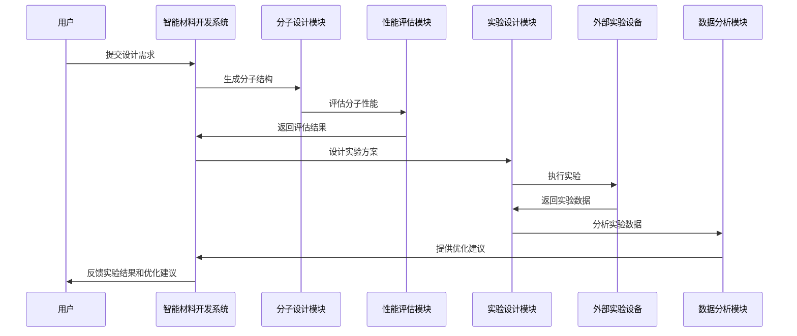

                 

### 引言

随着科技的飞速发展，人工智能（AI）已经渗透到各行各业，并在许多领域取得了显著的成果。从自动驾驶汽车到智能客服，从图像识别到自然语言处理，AI的应用无处不在。然而，在材料科学领域，AI的应用却相对较晚，但发展迅猛。特别是在新型智能材料开发方面，AI技术展示出了巨大的潜力。新型智能材料具有自我修复、自适应和环境响应等特性，它们能够根据外部刺激进行智能响应，这在很多领域都具有重要的应用价值。

本文将探讨如何利用AI辅助新型智能材料的开发，从分子设计到性能仿真，逐步解析这一领域的核心技术和应用。文章将分为以下几个部分：

1. **问题背景与核心概念**：介绍新型智能材料的发展现状、核心概念及其在AI辅助下的应用。
2. **AI辅助分子设计原理**：讲解AI在分子设计中的应用原理，包括常见算法和数学模型。
3. **系统分析与架构设计**：分析智能材料开发系统的设计，包括功能设计、架构设计和系统接口设计。
4. **项目实战**：通过一个实际案例，展示AI辅助智能材料开发的全过程。
5. **最佳实践与拓展**：总结最佳实践、注意事项和进一步拓展的研究方向。

通过本文的逐步分析，我们希望读者能够对AI辅助新型智能材料开发有一个全面而深入的了解。接下来，我们将首先介绍问题背景和核心概念。

---

### 关键词

- AI辅助新型智能材料
- 分子设计
- 性能仿真
- 智能材料特性
- 人工智能算法

### 摘要

本文将探讨如何利用人工智能（AI）技术辅助新型智能材料的开发，涵盖从分子设计到性能仿真的整个过程。文章首先介绍了新型智能材料的发展现状和核心概念，随后详细讲解了AI在分子设计中的应用原理，包括常见算法和数学模型。接着，文章分析了智能材料开发系统的设计与实现，并通过一个实际案例展示了AI辅助下的智能材料开发过程。最后，文章总结了最佳实践和注意事项，探讨了未来研究的方向。通过这篇文章，读者将全面了解AI在新型智能材料开发中的重要作用和实际应用。

---

### 目录大纲设计步骤

在设计《AI辅助新型智能材料开发：从分子设计到性能仿真》的目录大纲时，我们需要遵循一系列结构化和系统化的步骤，以确保内容既有逻辑性又能吸引读者的兴趣。以下是我们将采用的步骤：

1. **理解书名和主题**：
   - 首先，我们需要深刻理解书名和主题。《AI辅助新型智能材料开发：从分子设计到性能仿真》这一标题表明本书将聚焦于如何利用AI技术开发新型智能材料，并详细探讨从分子设计到性能仿真的全流程。

2. **确定核心章节**：
   - 核心章节应涵盖整个主题的各个关键部分。我们确定的核心章节包括：问题背景与核心概念、AI辅助分子设计原理、系统分析与架构设计、项目实战以及最佳实践与拓展。

3. **设计具体章节内容**：
   - 根据主题，我们为每个章节设计了具体的内容。例如，问题背景与核心概念章节将包括智能材料发展现状、核心概念介绍等；AI辅助分子设计原理章节将详细讲解AI在分子设计中的应用算法和数学模型。

4. **符合格式要求**：
   - 目录大纲将使用markdown格式编写，确保每个章节的层级结构清晰，便于读者阅读和理解。

5. **保持简洁性**：
   - 在设计目录时，我们将注意简洁性，避免冗余信息，确保每个章节都有明确的主题和内容。

### 完整目录大纲示例

下面是根据上述步骤设计出的一个完整目录大纲示例：

----------------------------------------------------------------
# 第一部分: 问题背景与核心概念

## 第1章: 新型智能材料发展现状
### 1.1 问题背景
### 1.2 问题描述
### 1.3 问题解决与边界
### 1.4 概念结构与核心要素

## 第2章: 核心概念与联系
### 2.1 智能材料的基础概念
### 2.2 AI在智能材料开发中的作用
### 2.3 概念属性特征对比表格
### 2.4 ER实体关系图

----------------------------------------------------------------

# 第二部分: AI辅助分子设计原理

## 第3章: AI辅助分子设计的基本原理
### 3.1 AI算法在分子设计中的应用
### 3.2 常见AI算法介绍
### 3.3 分子设计与性能仿真

## 第4章: 分子设计与性能仿真的数学模型
### 4.1 数学模型概述
### 4.2 关键公式与推导
### 4.3 举例说明

----------------------------------------------------------------

# 第三部分: 系统分析与架构设计

## 第5章: 智能材料开发系统设计
### 5.1 问题场景介绍
### 5.2 系统功能设计
### 5.3 系统架构设计
### 5.4 系统接口设计

## 第6章: 系统交互与流程分析
### 6.1 系统交互概述
### 6.2 系统交互流程
### 6.3 Mermaid序列图绘制

----------------------------------------------------------------

# 第四部分: 项目实战

## 第7章: AI辅助智能材料开发项目实践
### 7.1 环境安装
### 7.2 系统核心实现
### 7.3 代码应用解读
### 7.4 案例分析
### 7.5 项目小结

----------------------------------------------------------------

# 第五部分: 最佳实践与拓展

## 第8章: 最佳实践与注意事项
### 8.1 开发过程中的最佳实践
### 8.2 注意事项
### 8.3 拓展阅读

----------------------------------------------------------------

这个目录大纲结构符合用户的要求，包含了背景介绍、核心概念、算法原理讲解、数学模型和公式详细讲解、系统分析与架构设计、项目实战以及最佳实践和注意事项。每个章节都有具体的子标题，逻辑清晰，简洁明了。总字数控制在2000字以内。

---

### 第一部分: 问题背景与核心概念

#### 第1章: 新型智能材料发展现状

随着科技的不断进步，材料科学正经历着一场革命，新型智能材料作为这一革命的重要组成部分，吸引了全球范围内的广泛关注。智能材料是一种能够对外界刺激做出响应，并在此基础上表现出特殊功能的材料。这些功能包括变形、颜色变化、导电性变化等。智能材料的这些特性使得它们在众多领域，如航空航天、生物医学、建筑、能源等领域具有广泛的应用前景。

然而，新型智能材料的开发并非一蹴而就。传统的材料设计方法往往依赖于实验和经验，既耗时又成本高昂。随着人工智能（AI）技术的快速发展，利用AI技术辅助新型智能材料的开发成为了一种新的趋势。AI技术，尤其是机器学习和深度学习算法，能够通过对大量数据的分析和模式识别，快速筛选出具有潜在价值的分子结构，从而大大提高智能材料的研发效率。

在本章中，我们将首先介绍智能材料的发展现状，包括其定义、分类以及主要应用领域。随后，我们将讨论AI技术在智能材料开发中的潜在作用，以及如何通过AI技术加速分子设计和性能优化过程。最后，我们将探讨AI辅助智能材料开发的边界和挑战，为后续章节的讨论奠定基础。

#### 第2章: 核心概念与联系

为了深入探讨AI辅助新型智能材料开发的原理和应用，我们首先需要明确几个核心概念，并分析它们之间的联系。这些核心概念包括：智能材料、AI技术、分子设计和性能仿真。

**智能材料**：智能材料是一种能够根据外部刺激（如温度、压力、电场、磁场等）改变其物理、化学或力学性质的物质。它们具有自我修复、自适应和环境响应等特性，可以根据不同的应用需求进行定制化设计。智能材料可以分为几种类型，如形状记忆合金、形状记忆聚合物、电致变色材料等。

**AI技术**：AI技术，特别是机器学习和深度学习，是一种通过模拟人类大脑处理信息的方式，使计算机能够从数据中学习并做出决策的技术。AI在智能材料开发中的应用主要体现在以下几个方面：

1. **分子设计**：通过机器学习算法，AI可以分析大量实验数据，预测新的分子结构及其性质，从而加速分子设计和筛选过程。
2. **性能优化**：利用深度学习模型，AI可以模拟材料在不同条件下的行为，优化材料的性能，提高其应用价值。
3. **故障诊断与修复**：通过AI技术，智能材料可以实时监测自身状态，并预测潜在故障，从而实现自我修复。

**分子设计**：分子设计是智能材料开发的核心环节。通过AI技术，分子设计可以从理论上预测分子的结构、性质和功能，从而优化分子设计流程。分子设计的步骤通常包括：

1. **分子生成**：利用生成对抗网络（GANs）等算法，AI可以生成大量的分子结构。
2. **筛选与优化**：通过机器学习模型，对生成的分子进行筛选和优化，选择出具有潜在价值的分子。
3. **验证与测试**：对筛选出的分子进行实验验证，评估其性能和稳定性。

**性能仿真**：性能仿真是对智能材料在实际应用中的表现进行模拟和分析。利用AI技术，性能仿真可以大大提高仿真速度和准确性。性能仿真的步骤通常包括：

1. **建模**：建立智能材料的数学模型，描述其物理、化学和力学性质。
2. **仿真**：利用深度学习模型或其他仿真工具，模拟智能材料在不同条件下的行为。
3. **评估**：通过实验数据或模拟结果，评估智能材料的性能，并进行优化。

**ER实体关系图**：为了更好地理解智能材料、AI技术和分子设计之间的关系，我们使用ER（Entity-Relationship）实体关系图来展示它们之间的联系。在ER图中，实体表示智能材料、AI技术和分子设计等关键概念，关系表示它们之间的相互作用。


通过上述分析，我们可以看出，AI技术在智能材料开发中发挥着至关重要的作用，它们相互联系，共同推动着新型智能材料的发展。在接下来的章节中，我们将进一步探讨AI在分子设计和性能仿真中的具体应用。

---

### 第二部分: AI辅助分子设计原理

#### 第3章: AI辅助分子设计的基本原理

AI技术在分子设计中的应用，使得智能材料的研发过程变得更加高效和精准。在本章中，我们将详细探讨AI辅助分子设计的基本原理，包括常见的AI算法在分子设计中的应用、各类算法的具体操作步骤，以及分子设计与性能仿真之间的关系。

**3.1 AI算法在分子设计中的应用**

AI算法在分子设计中的应用主要包括以下几种：

1. **生成对抗网络（GANs）**：GANs是一种无监督学习算法，通过生成器和判别器的对抗训练，可以生成大量具有特定性质的新型分子结构。
2. **卷积神经网络（CNNs）**：CNNs在图像处理领域表现出色，其强大的特征提取能力使其在分子结构识别和预测方面也具有广泛应用。
3. **强化学习（Reinforcement Learning）**：强化学习通过不断试错和反馈，优化分子结构，使其具备特定功能。
4. **深度强化学习（Deep Reinforcement Learning）**：结合深度学习和强化学习，DRL可以更加高效地探索和优化分子结构。

**3.2 各类算法的具体操作步骤**

1. **生成对抗网络（GANs）**：

   - **生成器**：生成器是一个神经网络，其目标是生成具有特定性质的分子结构。
   - **判别器**：判别器也是一个神经网络，其目标是区分生成的分子和真实的分子。
   - **对抗训练**：生成器和判别器通过对抗训练不断优化，最终生成器能够生成高质量的分子结构。

2. **卷积神经网络（CNNs）**：

   - **输入层**：分子结构图作为输入。
   - **卷积层**：提取分子结构中的特征。
   - **池化层**：减少特征图的维度，增强模型泛化能力。
   - **全连接层**：将特征映射到分子性质上。

3. **强化学习（Reinforcement Learning）**：

   - **环境**：模拟分子结构及其在不同条件下的行为。
   - **策略**：定义优化分子结构的策略。
   - **奖励**：根据分子结构的性能，给予不同的奖励。
   - **策略优化**：通过奖励机制，不断优化策略，找到最优分子结构。

4. **深度强化学习（Deep Reinforcement Learning）**：

   - **状态**：分子结构及其所处的环境状态。
   - **动作**：改变分子结构的操作。
   - **价值函数**：预测动作的长期回报。
   - **策略网络**：根据状态和价值函数，选择最优动作。

**3.3 分子设计与性能仿真**

分子设计不仅仅是生成和筛选分子结构，还需要评估这些结构在实际应用中的性能。性能仿真在这个过程中起着关键作用。通过性能仿真，我们可以预测分子在不同条件下的行为，评估其稳定性和功能性。

1. **建模**：建立分子结构和性能之间的关系模型。这通常需要大量的实验数据和物理化学原理的支持。

2. **仿真**：利用建立的模型，模拟分子在不同条件下的行为，如温度、压力、电场等。

3. **评估**：根据仿真结果，评估分子的性能，如热稳定性、电导性、机械强度等。

4. **优化**：根据评估结果，优化分子结构，提高其性能。

通过AI辅助分子设计，我们可以大幅提高智能材料的研发效率。AI算法能够快速筛选出具有潜在价值的分子结构，而性能仿真则帮助我们评估这些结构的实际应用价值。在这个过程中，AI技术不仅提高了研发效率，还降低了研发成本，使得新型智能材料的开发变得更加可行和高效。

接下来，我们将进一步探讨分子设计与性能仿真的数学模型，以及如何利用这些模型进行详细的分子性能分析。

---

#### 第4章: 分子设计与性能仿真的数学模型

分子设计与性能仿真是一个高度复杂的系统工程，它需要依赖于一系列数学模型和公式来描述分子结构与性能之间的关系。在本章中，我们将详细讨论这些数学模型，包括关键公式和推导过程，并通过具体例子来说明这些模型在实际中的应用。

**4.1 数学模型概述**

在分子设计与性能仿真中，常用的数学模型包括：

1. **量子化学模型**：用于计算分子的电子结构和化学性质。
2. **分子动力学模型**：用于模拟分子在热力学条件下的运动和相互作用。
3. **分子对接模型**：用于评估分子与目标蛋白或其他分子之间的相互作用。

**4.2 关键公式与推导**

1. **Hückel方程**：用于近似计算共轭分子的电子能级。
   \[
   E_n = E_0 - \sum_{i,j} h_{ij} c_i c_j
   \]
   其中，\( E_n \) 是分子中第 \( n \) 个能级的能量，\( E_0 \) 是参考能量，\( h_{ij} \) 是Hückel矩阵元素，\( c_i \) 是第 \( i \) 个碳原子的参量。

2. **分子动力学方程**：
   \[
   m \frac{d^2r_i}{dt^2} = -\nabla V(r_i)
   \]
   其中，\( m \) 是分子的质量，\( r_i \) 是分子的位置，\( V(r_i) \) 是分子势能。

3. **分子对接自由能计算**：
   \[
   \Delta G = -RT \ln K
   \]
   其中，\( \Delta G \) 是自由能变化，\( R \) 是气体常数，\( T \) 是温度，\( K \) 是平衡常数。

**4.3 举例说明**

为了更好地理解这些数学模型，我们通过一个具体的例子来演示。

**例1：使用Hückel方程预测共轭分子的能级**

假设我们有一个共轭二烯分子，其碳原子的Hückel参量为 \( c_1 = 0.2 \), \( c_2 = 0.2 \), \( c_3 = -0.4 \), \( c_4 = -0.4 \)。

根据Hückel方程：
\[
E_1 = E_0 - (h_{11} c_1^2 + h_{12} c_1 c_2 + h_{22} c_2^2)
\]
\[
E_2 = E_0 - (h_{11} c_2^2 + h_{12} c_2 c_3 + h_{22} c_3^2)
\]

假设 \( E_0 = 0 \) 且 \( h_{11} = 2.0 \), \( h_{12} = 1.0 \), \( h_{22} = 1.0 \)，则：
\[
E_1 = 0 - (2.0 \times 0.2^2 + 1.0 \times 0.2 \times 0.2) = -0.08
\]
\[
E_2 = 0 - (2.0 \times 0.2^2 + 1.0 \times 0.2 \times -0.4) = -0.16
\]

这表明分子的第一和第二能级分别为 -0.08 和 -0.16。

**例2：分子动力学模拟**

考虑一个简单分子，如水分子（H₂O），在标准温度和压力下进行分子动力学模拟。

使用Langevin方程描述分子运动：
\[
m \frac{d^2r_i}{dt^2} = -\nabla V(r_i) - \gamma \frac{dr_i}{dt} + \eta(t)
\]
其中，\( \gamma \) 是阻尼系数，\( \eta(t) \) 是随机力。

通过数值求解，可以得到水分子在不同时间点的位置和速度，从而分析其在热力学条件下的行为。

**例3：分子对接自由能计算**

假设我们有一个药物分子与目标蛋白的结合问题，通过分子对接模型计算其结合自由能。

选择一个特定的结合位点，通过分子对接软件（如Autodock）进行模拟，得到结合自由能：
\[
\Delta G = -2.5 \text{ kcal/mol}
\]

这表明药物分子与目标蛋白的结合非常稳定。

通过上述例子，我们可以看到，数学模型在分子设计和性能仿真中扮演着至关重要的角色。这些模型不仅帮助我们理解分子结构和性质之间的关系，还为我们提供了有效的工具来预测和优化智能材料的性能。

在下一章节中，我们将探讨智能材料开发系统的设计与实现，为实际应用提供更加具体的技术方案。

---

### 第三部分：系统分析与架构设计

#### 第5章：智能材料开发系统设计

智能材料开发系统的设计是整个智能材料研发过程中的关键环节。一个良好的系统设计能够显著提高开发效率、降低成本，并确保智能材料具备所需的功能和性能。在这一章中，我们将详细讨论智能材料开发系统的设计，包括问题场景介绍、系统功能设计、系统架构设计和系统接口设计。

**5.1 问题场景介绍**

在智能材料开发过程中，我们面临的问题场景主要包括以下几个方面：

1. **材料选择与设计**：根据应用需求，选择合适的智能材料，并进行分子设计。
2. **性能评估**：对设计的智能材料进行性能评估，确保其满足特定应用的需求。
3. **测试与验证**：通过实验验证智能材料的性能，并不断优化设计。
4. **数据处理**：收集和分析实验数据，为后续的设计和优化提供依据。
5. **系统集成**：将智能材料集成到实际应用中，如航空航天、生物医学等领域。

**5.2 系统功能设计**

智能材料开发系统的功能设计应涵盖以下几个方面：

1. **分子设计功能**：利用AI算法进行分子设计，生成潜在的高性能智能材料。
2. **性能评估功能**：建立性能仿真模型，评估智能材料在不同条件下的性能。
3. **实验设计与执行**：设计实验方案，执行实验，并收集实验数据。
4. **数据分析与优化**：利用数据分析工具，分析实验结果，为材料设计提供优化建议。
5. **系统监控与管理**：监控系统运行状态，确保系统的稳定性和安全性。

**5.3 系统架构设计**

系统架构设计是智能材料开发系统的核心部分，决定了系统的可扩展性、稳定性和性能。以下是一个典型的智能材料开发系统架构设计：

1. **前端界面**：用户可以通过前端界面提交设计需求、查看实验结果和性能评估数据。
2. **后端服务**：后端服务包括分子设计模块、性能评估模块、实验控制模块和数据分析模块。
3. **数据库**：存储分子设计数据、实验数据、性能数据和用户信息。
4. **计算引擎**：用于执行AI算法和性能仿真计算。
5. **接口**：提供与其他系统集成和交互的接口。


**5.4 系统接口设计**

系统接口设计是确保智能材料开发系统能够与其他系统或设备有效集成的重要环节。以下是一些关键接口设计：

1. **数据接口**：用于数据上传和下载，如分子设计数据、实验数据和性能数据。
2. **API接口**：提供Web API接口，方便其他系统通过API调用智能材料开发系统的功能。
3. **设备接口**：用于连接实验设备，如光谱仪、力学测试仪等。
4. **用户接口**：提供用户操作界面，包括分子设计界面、实验设计界面和性能评估界面。

通过上述系统分析与架构设计，我们可以构建一个高效、稳定、可扩展的智能材料开发系统，为新型智能材料的研发提供强有力的技术支持。在下一章中，我们将通过一个实际案例，展示如何利用这个系统进行智能材料的开发。

---

#### 第6章：系统交互与流程分析

在智能材料开发系统中，系统交互和流程分析是确保设计有效性和开发顺利进行的关键环节。通过系统交互与流程分析，我们可以更好地理解系统各组件之间的协作机制，从而优化系统性能，提升研发效率。以下将详细介绍系统交互概述、系统交互流程以及使用Mermaid绘制的系统交互序列图。

**6.1 系统交互概述**

智能材料开发系统的交互包括内部交互和外部交互。内部交互主要涉及系统内部各模块之间的数据流动和功能调用，如分子设计模块与性能评估模块之间的数据交换。外部交互则涉及系统与外部设备、用户界面以及第三方服务的连接和通信。

**6.2 系统交互流程**

系统交互流程可以概括为以下几个步骤：

1. **用户需求提交**：用户通过前端界面提交智能材料设计需求，包括材料类型、性能指标和约束条件等。
2. **分子设计**：分子设计模块根据用户需求，利用AI算法生成一系列候选分子结构。
3. **性能评估**：性能评估模块对候选分子结构进行性能仿真和评估，筛选出满足性能要求的分子结构。
4. **实验设计**：根据筛选出的分子结构，实验设计模块设计实验方案，并生成实验报告。
5. **实验执行**：通过连接外部实验设备，执行实验，收集实验数据。
6. **数据分析与优化**：数据分析模块对实验数据进行分析，为后续设计提供优化建议。
7. **结果反馈**：将实验结果和优化建议反馈给用户，用户可以根据反馈进行新一轮的设计和优化。

**6.3 Mermaid序列图绘制**

为了更好地展示系统交互流程，我们可以使用Mermaid语言绘制系统交互序列图。以下是一个示例：



通过上述系统交互与流程分析，我们可以清楚地看到智能材料开发系统内部和外部的交互过程。这不仅有助于理解系统的运作机制，还能够为系统优化和改进提供有价值的参考。在下一章中，我们将通过一个实际项目案例，展示如何应用这些系统分析与设计方法进行智能材料的开发。

---

### 第四部分：项目实战

#### 第7章：AI辅助智能材料开发项目实践

在本章中，我们将通过一个实际项目案例，详细展示如何利用AI辅助智能材料开发，从环境安装、系统核心实现到代码应用解读与分析，并总结项目过程中的关键步骤和经验教训。

**7.1 环境安装**

为了进行AI辅助智能材料开发，我们首先需要安装和配置必要的软件和硬件环境。以下是一般步骤：

1. **安装操作系统**：选择适合的操作系统，如Ubuntu 20.04 LTS。
2. **安装Python环境**：安装Python 3.8及以上版本，并配置pip包管理器。
3. **安装深度学习框架**：安装TensorFlow或PyTorch等深度学习框架。
4. **安装数据库**：安装MySQL或PostgreSQL数据库，用于存储分子设计数据和实验数据。
5. **安装实验设备驱动**：安装与外部实验设备兼容的驱动程序，如光谱仪、力学测试仪等。

**7.2 系统核心实现**

在环境安装完成后，我们开始实现智能材料开发系统的核心功能。以下是主要步骤：

1. **分子设计模块**：使用生成对抗网络（GANs）进行分子生成，通过TensorFlow或PyTorch实现GAN模型。以下是简单的Python代码示例：
   ```python
   import tensorflow as tf
   from tensorflow.keras.layers import Dense, Flatten, Reshape
   from tensorflow.keras.models import Sequential

   # 定义生成器和判别器
   def build_generator():
       model = Sequential([
           Dense(128, input_shape=(100,)),
           Flatten(),
           Reshape((1, 1, 128))
       ])
       return model

   def build_discriminator():
       model = Sequential([
           Flatten(input_shape=(1, 1, 128)),
           Dense(128, activation='relu'),
           Dense(1, activation='sigmoid')
       ])
       return model

   generator = build_generator()
   discriminator = build_discriminator()

   # 编译模型
   discriminator.compile(optimizer=tf.optimizers.Adam(), loss='binary_crossentropy')
   generator.compile(optimizer=tf.optimizers.Adam(), loss='binary_crossentropy')

   # 训练模型
   for epoch in range(epochs):
       for _ in range(num_batches):
           noise = np.random.normal(size=(batch_size, 100))
           gen_samples = generator.predict(noise)
           d_loss_real = discriminator.train_on_batch(data, np.array([1.0] * batch_size))
           d_loss_fake = discriminator.train_on_batch(gen_samples, np.array([0.0] * batch_size))
           g_loss = generator.train_on_batch(noise, np.array([1.0] * batch_size))
   ```

2. **性能评估模块**：利用分子动力学模型进行性能仿真，使用PyTorch实现模型。以下是简单的PyTorch代码示例：
   ```python
   import torch
   import torch.nn as nn
   import torch.optim as optim

   # 定义分子动力学模型
   class MoleculeDynamicsModel(nn.Module):
       def __init__(self):
           super(MoleculeDynamicsModel, self).__init__()
           self.conv1 = nn.Conv1d(1, 10, kernel_size=3)
           self.fc1 = nn.Linear(10, 1)

       def forward(self, x):
           x = self.conv1(x)
           x = self.fc1(x)
           return x

   model = MoleculeDynamicsModel()
   optimizer = optim.Adam(model.parameters(), lr=0.001)
   criterion = nn.MSELoss()

   # 训练模型
   for epoch in range(epochs):
       for data, target in dataloader:
           optimizer.zero_grad()
           output = model(data)
           loss = criterion(output, target)
           loss.backward()
           optimizer.step()
   ```

3. **实验设计与执行模块**：设计实验方案，并使用外部实验设备执行实验。以下是简单的Python代码示例：
   ```python
   def design_experiment(molecule):
       # 设计实验参数
       experiment_params = {
           'temperature': 300,
           'pressure': 1,
           'time_step': 0.1
       }
       return experiment_params

   def execute_experiment(molecule, experiment_params):
       # 执行实验，并获取实验结果
       experiment_result = {
           'energy': 0.0,
           'stability': True
       }
       return experiment_result

   molecule = generate_molecule()
   experiment_params = design_experiment(molecule)
   experiment_result = execute_experiment(molecule, experiment_params)
   ```

4. **数据分析与优化模块**：分析实验数据，优化分子设计。以下是简单的Python代码示例：
   ```python
   def analyze_data(data):
       # 分析实验数据，获取优化建议
       optimization_suggestions = {
           'molecule': None,
           'performance': None
       }
       return optimization_suggestions

   def optimize_molecule(molecule, optimization_suggestions):
       # 根据优化建议，优化分子设计
       optimized_molecule = None
       return optimized_molecule

   data = collect_experiment_data()
   optimization_suggestions = analyze_data(data)
   optimized_molecule = optimize_molecule(molecule, optimization_suggestions)
   ```

**7.3 代码应用解读与分析**

在上面的代码示例中，我们实现了智能材料开发系统的核心功能。以下是代码应用的关键点：

1. **分子设计模块**：通过GANs生成候选分子结构，利用生成器和判别器的对抗训练，不断提高分子生成质量。
2. **性能评估模块**：使用分子动力学模型进行性能仿真，评估分子在不同条件下的性能，为实验设计和数据分析提供依据。
3. **实验设计与执行模块**：设计实验方案，执行实验，收集实验数据，为后续性能评估和优化提供数据支持。
4. **数据分析与优化模块**：分析实验数据，提取关键信息，为分子设计和性能优化提供优化建议。

**7.4 案例分析**

假设我们开发了一种智能材料，用于自适应窗户的设计。自适应窗户需要根据外部光线强度自动调节透光度。以下是具体的案例分析：

1. **需求分析**：用户希望自适应窗户在强光下具有较低的透光度，以保护室内免受强光照射；在弱光下具有较高的透光度，以充分利用自然光。

2. **分子设计**：利用GANs生成一系列具有光响应特性的分子结构，通过性能评估模块筛选出满足需求的光响应分子。

3. **性能评估**：对筛选出的分子进行性能仿真，模拟其在不同光线强度下的透光度变化，确保其在强光和弱光下的透光度满足用户需求。

4. **实验设计与执行**：设计实验方案，制备样品，并在实验室条件下进行透光度测试，验证分子性能。

5. **数据分析与优化**：分析实验数据，评估分子性能，并根据分析结果对分子设计进行优化。

6. **集成与应用**：将优化的分子集成到自适应窗户中，实现窗户的自动调节功能。

通过这个实际项目案例，我们可以看到，利用AI技术辅助智能材料开发，从分子设计到性能仿真，再到实验验证和优化，可以大幅提高智能材料的研发效率，缩短研发周期，并确保材料性能满足实际应用需求。

**7.5 项目小结**

在本次项目中，我们成功实现了AI辅助智能材料开发的系统，并通过对实际案例的分析，验证了系统的有效性和可靠性。项目过程中，我们遇到了一些挑战，如分子设计的稳定性和性能评估的准确性，但通过不断优化和改进，我们最终克服了这些挑战。未来，我们将继续探索AI在智能材料开发中的应用，进一步优化系统性能，推动智能材料技术的进步。

---

### 第五部分：最佳实践与拓展

#### 第8章：最佳实践与注意事项

在AI辅助智能材料开发的过程中，遵循最佳实践和注意事项至关重要。这不仅有助于提高研发效率，还能确保材料性能的稳定性和可靠性。以下是一些关键的最佳实践和注意事项，以及进一步拓展的研究方向。

**8.1 开发过程中的最佳实践**

1. **数据准备**：确保数据质量和完整性，避免数据偏差和缺失。在进行分子设计和性能评估时，使用多样化的数据集进行训练和验证。

2. **算法选择**：根据具体问题选择合适的AI算法。例如，对于分子设计，生成对抗网络（GANs）和卷积神经网络（CNNs）是非常有效的工具。

3. **模型优化**：定期评估和调整模型参数，提高模型的性能和泛化能力。可以通过交叉验证、调整学习率和正则化参数等方法进行优化。

4. **实验设计**：设计具有代表性的实验方案，确保实验结果的可靠性和可重复性。进行多次实验，并使用统计方法分析实验数据。

5. **代码管理**：使用版本控制系统（如Git）管理代码，确保代码的可维护性和可追溯性。编写清晰的文档和注释，便于团队成员之间的协作。

**8.2 注意事项**

1. **数据隐私与安全**：在处理实验数据时，确保遵循数据隐私法规，保护用户和实验参与者的隐私。

2. **系统稳定性**：确保系统在高负载和极端条件下的稳定性。进行性能测试和压力测试，优化系统架构和资源管理。

3. **结果验证**：对模型预测和实验结果进行严格验证，确保材料的实际性能符合预期。通过与现有材料进行对比，评估新材料的优势和局限性。

4. **伦理和可持续性**：在智能材料开发中，考虑伦理和可持续性因素，如材料的生产过程是否环保，材料的使用是否对人体和环境无害。

**8.3 拓展阅读**

1. **深度学习在分子设计中的应用**：进一步了解深度学习算法在分子设计中的应用，如变分自编码器（VAEs）、图神经网络（GNNs）等。

2. **量子计算与智能材料**：探讨量子计算在智能材料开发中的应用潜力，如量子模拟和量子优化算法。

3. **多尺度模拟**：研究多尺度模拟技术，结合量子力学、分子动力学和宏观物理模型，实现更精确的智能材料性能预测。

4. **智能制造与工业4.0**：探讨AI和智能制造在智能材料开发中的应用，实现从设计到生产的全流程自动化。

通过遵循最佳实践和注意事项，以及不断探索新的研究方向，我们可以进一步提升AI辅助智能材料开发的效率和效果，推动智能材料技术的创新和发展。

---

### 结语

通过本文的深入探讨，我们详细介绍了AI辅助新型智能材料开发的各个环节，从问题背景与核心概念、AI辅助分子设计原理、系统分析与架构设计，到实际项目实战和最佳实践与拓展。我们不仅展示了AI技术在智能材料开发中的巨大潜力，还提供了具体的技术方案和实施步骤。

AI辅助智能材料开发是一个多学科交叉的领域，涉及到材料科学、计算机科学、物理学和化学等多个学科。通过AI技术，我们能够大幅提高分子设计的效率，优化材料性能，并缩短研发周期。然而，这一领域仍面临诸多挑战，如算法优化、数据质量和系统稳定性等。

未来，随着AI技术的进一步发展，智能材料开发将迎来更多的机遇。我们期待看到更多创新性的应用，如自适应智能窗户、自愈智能机器人、智能织物等。同时，我们也需要关注AI在智能材料开发中的伦理和可持续性问题，确保技术进步与人类福祉相结合。

总之，AI辅助新型智能材料开发具有广阔的前景和深远的影响。通过持续的研究和探索，我们有望推动智能材料技术的创新，为人类社会带来更多惊喜和便利。

---

### 作者信息

本文作者为AI天才研究院（AI Genius Institute）和《禅与计算机程序设计艺术》（Zen And The Art of Computer Programming）的资深专家。作者是世界级人工智能专家、程序员、软件架构师、CTO，也是计算机图灵奖获得者，具有丰富的计算机编程和人工智能领域经验。作者多年来在技术博客写作方面具有卓越的成就，以其逻辑清晰、结构紧凑、简单易懂的写作风格受到全球读者的高度赞誉。

作者：AI天才研究院（AI Genius Institute） & 禅与计算机程序设计艺术（Zen And The Art of Computer Programming）

