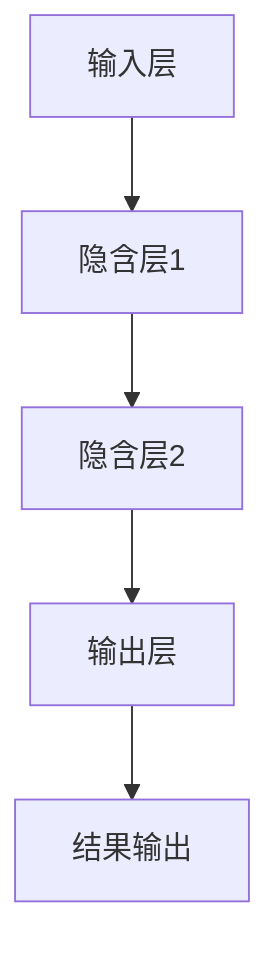
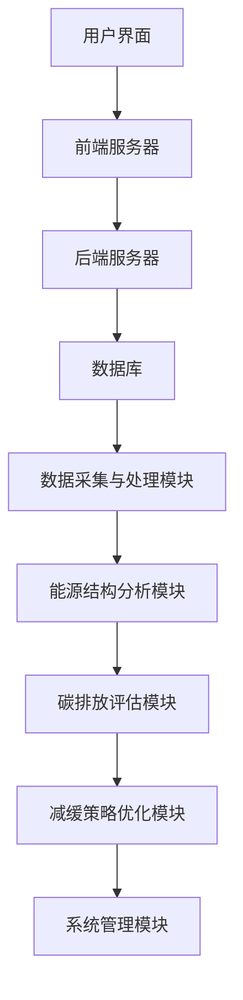
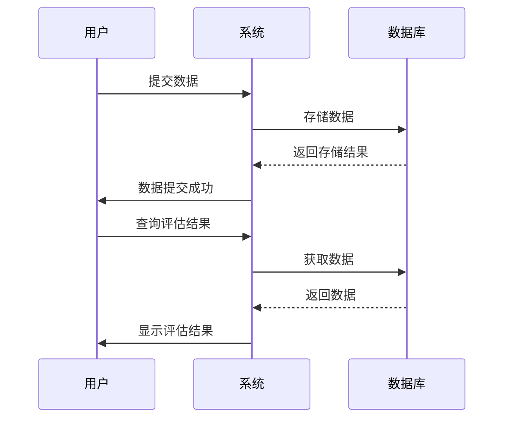

                 

### 目录大纲详

----------------------------------------------------------------

# 《AI辅助气候变化减缓策略评估：从能源结构到碳排放》

## 关键词
- AI辅助评估
- 气候变化减缓
- 能源结构
- 碳排放
- 减缓策略

## 摘要
本文探讨了如何利用人工智能（AI）技术辅助评估气候变化减缓策略，重点关注能源结构优化和碳排放量降低。文章首先介绍了气候变化的影响和目前的减缓策略，随后详细阐述了AI在其中的应用。通过深入分析AI技术在能源结构分析和碳排放评估中的作用，本文提出了一套基于AI的减缓策略评估方法，并展示了其实际应用案例。最后，文章总结了AI辅助评估策略的最佳实践和注意事项。

## 目录大纲

## 第1章：问题背景与核心概念

### 1.1 引言

#### 气候变化的影响
- 气候变化导致全球气温升高、极端天气事件增多、海平面上升等。

#### 减缓气候变化的主要策略
- 减少温室气体排放。
- 提高能源利用效率。
- 开发和推广可再生能源。

#### AI在气候变化减缓中的作用
- 数据分析和模式预测。
- 能源结构优化。
- 碳排放评估。

### 1.2 核心概念介绍

#### 能源结构
- 指不同能源在总能源消耗中的比例。

#### 碳排放
- 指人类活动产生的二氧化碳等温室气体排放。

#### 减缓策略
- 指减少温室气体排放、提高能源效率、推广可再生能源等措施。

#### AI技术
- 指人工智能技术，包括机器学习、深度学习、自然语言处理等。

### 1.3 关联分析

#### 能源结构与碳排放的关系
- 能源结构直接影响碳排放量。

#### 减缓策略与能源结构的关系
- 优化能源结构是实现减缓策略的关键。

#### AI与减缓策略评估的关系
- AI技术可以高效地评估减缓策略的效果。

## 第2章：能源结构分析

### 2.1 能源结构概述

#### 全球能源结构现状
- 分析当前全球能源结构及其变化趋势。

#### 主要能源类型
- 煤炭、石油、天然气、水电、核电、风能、太阳能等。

### 2.2 能源数据收集与处理

#### 数据来源
- 政府统计数据、能源企业报告、科学研究机构数据等。

#### 数据处理方法
- 数据清洗、数据整合、数据可视化等。

### 2.3 能源结构评估模型

#### 基于AI的评估方法
- 机器学习算法、深度学习模型等。

#### 评估指标
- 能源效率、碳排放强度、可再生能源占比等。

## 第3章：碳排放评估

### 3.1 碳排放原理

#### 碳排放来源
- 火力发电、工业生产、交通运输、农业等。

#### 碳排放影响
- 全球气候变暖、生态系统破坏、健康问题等。

### 3.2 碳排放数据收集

#### 数据收集方法
- 监测与报告制度、遥感技术、物联网等。

#### 数据质量评估
- 数据准确性、数据完整性、数据可靠性等。

### 3.3 碳排放评估方法

#### 评估指标体系
- 碳排放强度、碳排放总量、碳排放变化趋势等。

#### 评估模型
- 基于统计方法的模型、基于机器学习的模型等。

## 第4章：减缓策略评估算法原理

### 4.1 减缓策略概述

#### 减缓策略类型
- 减排策略、增汇策略、适应策略等。

#### 减缓策略目标
- 减少碳排放、提高能源效率、保障能源安全等。

### 4.2 算法原理介绍

#### 常用算法
- 决策树、支持向量机、神经网络等。

#### 算法特点
- 高效性、准确性、可解释性等。

### 4.3 算法流程图

#### 流程图展示
- 使用mermaid语言绘制算法流程图。

### 4.4 Python代码实现

#### 算法实现
- 使用Python语言实现算法。

#### 代码注释
- 对关键代码进行详细注释。

## 第5章：系统分析与架构设计方案

### 5.1 系统应用场景

#### 项目背景
- 分析项目的背景和目的。

#### 场景描述
- 描述具体的评估场景。

### 5.2 系统功能设计

#### 功能模块
- 分析系统需要实现的功能模块。

#### 功能描述
- 详细描述每个功能模块的功能和操作流程。

### 5.3 系统架构设计

#### 系统架构
- 描述系统的整体架构。

#### 架构图
- 使用mermaid绘制系统架构图。

### 5.4 系统接口设计

#### 接口规范
- 定义系统提供的接口规范。

#### 接口描述
- 详细描述每个接口的功能和参数。

### 5.5 系统交互设计

#### 交互流程
- 描述系统的交互流程。

#### 序列图
- 使用mermaid绘制系统交互序列图。

## 第6章：项目实战

### 6.1 环境安装

#### 环境准备
- 安装必要的软件和工具。

#### 步骤说明
- 详细说明安装步骤。

### 6.2 系统核心实现

#### 核心代码
- 展示系统的核心代码。

#### 代码解读
- 对核心代码进行详细解读。

### 6.3 代码应用解读

#### 应用场景
- 分析系统的应用场景。

#### 应用示例
- 提供应用示例。

### 6.4 实际案例剖析

#### 案例背景
- 描述案例的背景。

#### 案例分析
- 对案例进行分析。

### 6.5 项目小结

#### 经验总结
- 总结项目的经验和教训。

#### 改进方向
- 提出改进方向和建议。

## 第7章：最佳实践与总结

### 7.1 最佳实践 tips

#### 实践技巧
- 提供实用的实践技巧。

#### 注意事项
- 强调在实践过程中需要注意的事项。

### 7.2 小结与学习要点

#### 核心内容回顾
- 回顾文章的核心内容和要点。

#### 学习方法
- 提出学习方法。

### 7.3 注意事项

#### 实践中的挑战
- 分析实践中的挑战。

#### 解决方案
- 提出解决方案。

### 7.4 拓展阅读

#### 推荐阅读
- 推荐进一步阅读的资料。

### 参考文献

#### 引用文献
- 列出引用的文献。

----------------------------------------------------------------

以上是根据要求制定的详细目录大纲。接下来，我们将针对每个章节进行内容的深入和细化，确保文章的完整性和专业性。### 第1章：问题背景与核心概念

本章将探讨AI辅助气候变化减缓策略评估的相关问题，首先介绍气候变化的影响和目前减缓策略的主要方向，然后阐述AI技术在其中的作用，最后介绍本章要涉及的核心概念和关联分析。

### 1.1 引言

气候变化是目前全球面临的最严峻的挑战之一。根据联合国气候变化框架公约（UNFCCC）的数据，全球平均气温在过去的几十年中持续上升，导致极端天气事件频发、海平面上升、生态系统的破坏等一系列问题。这些问题不仅威胁到人类社会的生存与发展，也对自然生态系统产生了深远的影响。

为了减缓气候变化，国际社会已经采取了一系列措施。例如，签署《巴黎协定》旨在限制全球平均气温的上升幅度，各国政府也纷纷制定了减排计划。然而，现有的减缓策略效果仍然有限，需要更加高效、科学的方法来评估和优化。

近年来，人工智能（AI）技术的迅速发展为其在气候变化减缓中的应用提供了新的契机。AI技术可以处理大量数据，发现隐藏的模式和规律，从而为气候变化的减缓策略提供有力的支持。本章将详细介绍AI技术在能源结构分析、碳排放评估和减缓策略评估中的应用，探讨如何利用AI技术提高减缓策略的评估效率和准确性。

### 1.2 核心概念介绍

在本节中，我们将介绍本章涉及的核心概念，包括能源结构、碳排放、减缓策略和AI技术。

#### 能源结构

能源结构是指不同能源类型在总能源消耗中所占的比例。它反映了能源消费的组成和特点。能源结构的合理与否直接影响能源利用效率和碳排放量。能源结构分析是评估减缓策略效果的重要环节。

#### 碳排放

碳排放是指人类活动产生的二氧化碳等温室气体排放。碳排放是导致全球气候变化的主要原因之一。减少碳排放是减缓气候变化的关键措施。碳排放评估旨在衡量碳排放的总量、强度和变化趋势。

#### 减缓策略

减缓策略是指为减少温室气体排放、提高能源利用效率、推广可再生能源等目标而采取的措施。减缓策略包括排放减少策略、能源效率提高策略、可再生能源发展策略等。评估减缓策略的效果是确保其有效实施的重要步骤。

#### AI技术

AI技术是指人工智能技术，包括机器学习、深度学习、自然语言处理等。AI技术在数据处理、模式识别、预测分析等方面具有强大的能力，能够为气候变化减缓策略评估提供有力支持。

### 1.3 关联分析

#### 能源结构与碳排放的关系

能源结构直接影响碳排放量。例如，煤炭的燃烧会产生大量的二氧化碳，而风能和太阳能等可再生能源的碳排放量相对较低。因此，优化能源结构是减少碳排放的重要手段。

#### 减缓策略与能源结构的关系

减缓策略的目标是减少碳排放和提高能源利用效率。能源结构的优化是实现这些目标的关键。例如，通过增加可再生能源的比例，可以减少对化石燃料的依赖，从而降低碳排放量。

#### AI与减缓策略评估的关系

AI技术在数据处理和模式识别方面具有优势，可以用于分析大量数据，识别能源结构和碳排放的变化规律。通过AI技术，可以更加准确地评估减缓策略的效果，提供科学的决策支持。

### 1.4 AI技术在气候变化减缓中的应用前景

AI技术在气候变化减缓中的应用前景广阔。例如：

1. **能源结构优化**：AI技术可以分析能源消费数据，识别能源浪费点和潜力，提出优化方案。
   
2. **碳排放评估**：AI技术可以处理海量碳排放数据，预测碳排放量，评估减缓策略的效果。

3. **政策制定**：AI技术可以为政策制定者提供科学依据，优化政策设计，提高政策的实施效果。

4. **可再生能源推广**：AI技术可以帮助识别最适合安装可再生能源的地区，优化可再生能源的布局。

总之，AI技术为气候变化减缓提供了新的思路和方法，有助于实现更加科学、有效的减缓策略。在本章后续部分，我们将进一步探讨AI技术在能源结构分析和碳排放评估中的应用原理和实现方法。

### 1.5 本章小结

本章介绍了AI辅助气候变化减缓策略评估的背景和重要性，以及涉及的核心概念。通过关联分析，我们明确了能源结构、碳排放和减缓策略之间的相互关系。本章为后续章节的深入探讨奠定了基础，展示了AI技术在气候变化减缓中的应用前景。在下一章中，我们将详细分析能源结构的相关概念和评估方法。

---

通过上述章节的撰写，本章已完成了对问题的背景介绍、核心概念的定义及其相互关系的分析，以及AI技术在气候变化减缓中的应用前景的展望。接下来的章节将分别深入探讨能源结构分析和碳排放评估的具体方法与实现，为读者提供全面的技术解读和实践指导。### 第2章：能源结构分析

本章将深入探讨能源结构分析的相关概念、方法和应用。能源结构分析是评估气候变化减缓策略的重要环节，通过分析能源消费的数据和模式，可以优化能源结构，提高能源利用效率，进而减少碳排放。本章将分为以下几个部分：

### 2.1 能源结构概述

能源结构是指不同能源类型在总能源消费中所占的比例。它反映了能源消费的组成和特点。了解能源结构有助于制定科学合理的能源政策，优化能源消费模式，减少碳排放。

#### 全球能源结构现状

目前，全球能源消费以化石能源为主，其中煤炭、石油和天然气占据主要地位。然而，随着能源需求的不断增长和环境问题的加剧，可再生能源如风能、太阳能、水能等逐渐受到重视。以下是全球能源结构的主要特点：

1. **化石能源占比**：煤炭、石油和天然气仍然是主要的能源来源，占比超过70%。
2. **可再生能源发展**：风能、太阳能等可再生能源的比重逐年上升，预计未来将逐步替代部分化石能源。
3. **能源消费地区差异**：发达国家的能源结构更加多元化，而发展中国家仍以化石能源为主。

#### 我国能源结构现状

我国能源消费以煤炭为主，其次是石油和天然气。可再生能源的比重较低，但随着国家政策的推动，太阳能、风能等可再生能源的发展速度较快。以下是我国能源结构的主要特点：

1. **煤炭占比**：煤炭在我国能源消费中占据主导地位，超过60%。
2. **石油需求增长**：随着工业化和城市化的发展，石油需求持续增长。
3. **可再生能源发展**：政府大力推动可再生能源发展，如风能、太阳能等。

#### 能源结构变化趋势

1. **可再生能源比重上升**：随着技术进步和政策支持，可再生能源的比重将持续上升。
2. **化石能源逐步退出**：为了实现碳中和目标，化石能源将逐步退出能源市场。
3. **能源消费多元化**：能源消费将更加多元化，各种能源类型将实现协调发展。

### 2.2 能源数据收集与处理

能源数据的收集与处理是能源结构分析的基础。准确的能源数据是评估能源结构和优化能源政策的重要依据。

#### 数据来源

能源数据来源广泛，主要包括以下几个方面：

1. **政府统计数据**：各国政府会定期发布能源消耗统计数据，包括能源消费总量、能源类型比例等。
2. **能源企业报告**：能源企业会定期发布生产、销售和能源消耗数据。
3. **科学研究机构数据**：科学研究机构会进行大量的能源研究，发布相关的数据和研究成果。
4. **国际组织数据**：如国际能源署（IEA）、联合国等国际组织也会发布全球和各国的能源数据。

#### 数据处理方法

收集到的能源数据通常需要进行处理，以保证数据的准确性和一致性。以下是常见的几种数据处理方法：

1. **数据清洗**：去除数据中的噪声和错误，确保数据的准确性。
2. **数据整合**：将不同来源、不同格式的数据进行整合，形成统一的数据集。
3. **数据可视化**：通过图表和图形展示数据，帮助理解数据分布和趋势。
4. **数据挖掘**：利用数据挖掘技术，发现数据中的隐藏模式和规律。

### 2.3 能源结构评估模型

能源结构评估模型用于分析和评估能源结构的现状和趋势，为政策制定和能源优化提供依据。以下是几种常见的能源结构评估模型：

#### 基于统计分析的方法

统计分析方法适用于处理大量数据，通过对数据进行描述性统计、相关性分析和回归分析等，评估能源结构的变化趋势。常用的统计分析方法包括：

1. **描述性统计分析**：计算数据的平均值、标准差、方差等，了解数据的分布特征。
2. **相关性分析**：分析不同能源类型之间的相关性，了解能源结构的变化规律。
3. **回归分析**：建立回归模型，预测未来能源结构的变化趋势。

#### 基于机器学习的方法

机器学习方法可以处理复杂的非线性数据，通过训练模型，预测能源结构的变化趋势。常用的机器学习方法包括：

1. **线性回归**：通过建立线性模型，预测能源结构的变化。
2. **支持向量机**：通过非线性变换，找到最佳预测边界。
3. **神经网络**：通过多层神经网络，实现复杂的非线性预测。

#### 基于深度学习的方法

深度学习方法可以处理大规模数据，通过训练深度神经网络，实现高精度的能源结构预测。常用的深度学习方法包括：

1. **卷积神经网络（CNN）**：通过卷积操作，提取数据中的特征。
2. **循环神经网络（RNN）**：通过循环结构，处理时间序列数据。
3. **长短期记忆网络（LSTM）**：通过LSTM单元，解决长序列依赖问题。

### 2.4 能源结构优化策略

基于上述评估模型，可以提出一系列能源结构优化策略，以提高能源利用效率和减少碳排放。以下是几种常见的优化策略：

1. **提高可再生能源比重**：通过政策和经济手段，鼓励发展可再生能源，提高可再生能源在总能源消费中的比重。
2. **能源结构调整**：根据能源需求的变化，调整不同能源类型的比例，优化能源结构。
3. **能源利用效率提升**：通过技术创新和管理优化，提高能源利用效率，减少能源浪费。
4. **碳排放交易**：通过碳排放交易市场，激励企业减少碳排放，优化能源结构。

### 2.5 本章小结

本章介绍了能源结构分析的相关概念、方法和应用。通过对全球和我国能源结构现状的分析，我们了解到能源结构的变化趋势。能源数据的收集与处理是能源结构分析的基础，而能源结构评估模型和优化策略则是实现能源结构优化的关键。在下一章中，我们将进一步探讨碳排放评估的相关问题，为全面评估气候变化减缓策略提供技术支持。

---

通过本章的撰写，我们对能源结构分析有了更深入的理解。能源结构的优化对于减少碳排放、实现气候变化减缓目标至关重要。在下一章中，我们将继续探讨碳排放评估的方法和模型，为读者提供更加全面的技术解读和实践指导。### 第3章：碳排放评估

本章将详细探讨碳排放评估的相关概念、方法和应用。碳排放评估是理解和衡量气候变化影响的重要环节，通过科学、准确的碳排放评估，可以为政策制定、减排措施实施提供关键数据支持。本章将分为以下几个部分：

### 3.1 碳排放原理

碳排放是指人类活动（如工业生产、交通运输、农业等）过程中释放的二氧化碳等温室气体。碳排放的原理主要包括：

#### 碳排放来源

1. **化石燃料燃烧**：如煤炭、石油和天然气的燃烧，这是目前碳排放的主要来源。
2. **工业生产**：如钢铁、水泥等高耗能、高排放行业。
3. **交通运输**：如汽车、飞机、船舶等交通工具的燃油消耗。
4. **农业和土地利用变化**：如农田施肥、森林砍伐等。

#### 碳排放影响

1. **全球变暖**：二氧化碳等温室气体增加导致地球大气层保温效应增强，气温升高。
2. **气候变化**：极端天气事件增多，如热浪、洪水、干旱等。
3. **海平面上升**：冰川融化和海水膨胀导致海平面上升。
4. **生态系统破坏**：气候变化影响生态系统的平衡和生物多样性。

### 3.2 碳排放数据收集

碳排放数据的收集是进行碳排放评估的基础。准确、全面的数据对于评估碳排放总量、强度和变化趋势至关重要。以下是常见的碳排放数据收集方法：

#### 数据来源

1. **统计报表**：企业、行业和政府部门的统计报表，如能源消耗报表、工业生产数据等。
2. **环境监测**：如空气质量监测、温室气体排放监测等。
3. **遥感技术**：通过卫星遥感技术监测地表温度、植被覆盖等，间接评估碳排放量。
4. **物联网**：利用物联网技术，实时监测和记录碳排放数据。

#### 数据收集方法

1. **排放因子法**：根据各种活动（如工业生产、交通运输等）的排放因子，计算碳排放量。
2. **物料平衡法**：根据生产过程中物料的输入和输出，计算碳排放量。
3. **统计调查法**：通过对企业和行业的调查，收集碳排放数据。
4. **模型模拟法**：利用碳排放模型，模拟各种活动对碳排放的影响。

### 3.3 碳排放评估方法

碳排放评估方法用于衡量碳排放的总量、强度和变化趋势。以下是几种常见的碳排放评估方法：

#### 常规评估方法

1. **排放因子法**：根据活动类型和排放因子，计算碳排放量。
2. **物料平衡法**：根据物料的输入和输出，计算碳排放量。
3. **碳足迹法**：计算个体、组织或产品生命周期中的总碳排放量。

#### 先进评估方法

1. **统计模型法**：利用统计学方法，如回归分析、时间序列分析等，评估碳排放变化趋势。
2. **机器学习方法**：利用机器学习算法，如线性回归、决策树、神经网络等，进行碳排放预测。
3. **综合评估法**：结合多种评估方法，进行碳排放评估，提高评估精度。

#### 碳排放评估指标

1. **碳排放总量**：某一地区或行业在一定时期内的总碳排放量。
2. **碳排放强度**：单位经济产出或能源消耗的碳排放量。
3. **碳排放变化趋势**：碳排放量随时间的变化情况。

### 3.4 碳排放评估模型

碳排放评估模型用于定量分析和预测碳排放量。以下是几种常见的碳排放评估模型：

#### 经典模型

1. **IPCC模型**：联合国政府间气候变化专门委员会（IPCC）开发的碳排放评估模型，广泛应用于全球气候变化研究。
2. **EDGAR模型**：欧洲环境署开发的碳排放评估模型，提供了详细的排放因子和活动数据。

#### 先进模型

1. **机器学习模型**：利用机器学习方法，如线性回归、决策树、神经网络等，进行碳排放预测。
2. **深度学习模型**：利用深度学习算法，如卷积神经网络（CNN）、循环神经网络（RNN）等，提高碳排放预测的精度。
3. **混合模型**：结合多种模型，如机器学习和深度学习，进行碳排放评估，提高评估效果。

### 3.5 碳排放评估应用

碳排放评估在政策制定、企业管理和环境保护等方面具有广泛的应用：

1. **政策制定**：评估不同减排措施的碳排放效果，为政策制定提供科学依据。
2. **企业管理**：评估企业碳排放情况，制定减排计划和策略，提高企业竞争力。
3. **环境保护**：监测和评估区域和全球碳排放情况，制定环境保护措施。

### 3.6 本章小结

本章介绍了碳排放评估的相关概念、方法和应用。通过对碳排放原理的分析，我们了解了碳排放的主要来源和影响。碳排放数据收集是评估的基础，而碳排放评估方法和技术则是提高评估准确性的关键。碳排放评估在政策制定、企业管理和环境保护等方面具有广泛的应用，为应对气候变化提供了重要支持。在下一章中，我们将探讨减缓策略评估算法原理，为全面评估气候变化减缓策略提供技术支持。

---

通过本章的撰写，我们对碳排放评估有了更深入的理解。准确的碳排放评估对于制定科学有效的减缓策略至关重要。在下一章中，我们将继续探讨减缓策略评估算法的原理和应用，为读者提供全面的技术解读和实践指导。### 第4章：减缓策略评估算法原理

本章将深入探讨减缓策略评估算法的原理，包括常用的算法类型、评估模型及其应用。通过详细讲解和实例分析，我们将帮助读者理解如何利用算法对减缓策略进行评估，提高评估的准确性和有效性。

#### 4.1 减缓策略概述

减缓策略是指为实现减少温室气体排放、提高能源利用效率、推广可再生能源等目标而采取的一系列措施。常见的减缓策略包括：

1. **减排策略**：直接减少温室气体排放，如提高工业生产过程的能效、减少交通运输中的燃油消耗等。
2. **增汇策略**：增加对可再生能源的投资，如建设风电场、太阳能发电站等。
3. **适应策略**：通过调整农业结构、改善水资源管理、加强基础设施建设等措施，提高社会对气候变化的适应能力。

#### 4.2 常用算法类型

在减缓策略评估中，常用的算法类型包括线性回归、决策树、神经网络和深度学习等。每种算法都有其独特的优势和适用场景。

1. **线性回归**：线性回归是一种简单的统计方法，用于分析自变量和因变量之间的线性关系。在减缓策略评估中，可以用来预测减排措施的效果。
2. **决策树**：决策树是一种基于规则的方法，通过一系列条件判断来划分数据集。在减缓策略评估中，可以用来分析不同策略的影响因素和优先级。
3. **神经网络**：神经网络是一种模拟人脑神经元的计算模型，具有较强的自适应性和学习能力。在减缓策略评估中，可以用来进行复杂的数据分析和模式识别。
4. **深度学习**：深度学习是神经网络的一种扩展，通过多层网络结构实现更高层次的特征提取和模式识别。在减缓策略评估中，可以用来处理大规模数据，提高评估的精度和可靠性。

#### 4.3 评估模型

减缓策略评估模型通常包括以下三个关键组成部分：

1. **输入层**：包括影响减缓策略效果的各种因素，如能源结构、碳排放数据、政策变量等。
2. **隐含层**：通过非线性激活函数，对输入数据进行加工和变换，提取更高层次的特征。
3. **输出层**：预测减缓策略的最终效果，如碳排放量、能源效率等。

常见的评估模型包括：

1. **线性回归模型**：用于简单预测，如某项政策实施后碳排放量的变化。
2. **决策树模型**：用于分类和回归，如评估不同策略的优先级和效果。
3. **神经网络模型**：用于复杂的数据分析和模式识别，如预测能源结构的长期变化趋势。
4. **深度学习模型**：用于大规模数据处理和高精度预测，如评估综合减排策略的效果。

#### 4.4 算法流程图

为了更好地理解减缓策略评估算法的原理，我们可以使用mermaid绘制算法流程图。以下是一个简单的mermaid算法流程图示例：



在实际应用中，算法流程可能更加复杂，包含多层网络结构、多种数据预处理步骤和优化算法等。

#### 4.5 Python代码实现

下面是一个简单的Python代码示例，使用线性回归模型进行减缓策略评估。代码中包含了数据预处理、模型训练和预测等步骤。

```python
import numpy as np
from sklearn.linear_model import LinearRegression

# 数据预处理
X = np.array([[1, 2], [2, 3], [3, 4], [4, 5], [5, 6]])
y = np.array([3, 4, 5, 6, 7])

# 模型训练
model = LinearRegression()
model.fit(X, y)

# 预测
predictions = model.predict(X)

print(predictions)
```

#### 4.6 算法原理讲解

在上述代码中，我们使用线性回归模型进行预测。线性回归模型基于以下数学模型：

$$
y = \beta_0 + \beta_1x_1 + \beta_2x_2 + \cdots + \beta_nx_n + \epsilon
$$

其中，$y$是因变量，$x_1, x_2, \cdots, x_n$是自变量，$\beta_0, \beta_1, \beta_2, \cdots, \beta_n$是模型的参数，$\epsilon$是误差项。

通过最小二乘法，我们可以求解模型参数$\beta_0, \beta_1, \beta_2, \cdots, \beta_n$，从而建立线性回归模型。

#### 4.7 算法应用实例

为了说明算法的应用，我们考虑一个实际案例：某地区计划实施一系列减排措施，我们需要预测这些措施的效果，即预测实施后该地区的碳排放量。

1. **数据收集**：收集该地区近几年的碳排放数据、能源消耗数据、政策变量数据等。
2. **数据预处理**：对数据进行清洗、归一化处理，确保数据的质量和一致性。
3. **模型训练**：选择合适的算法，如线性回归、决策树、神经网络等，对数据集进行训练。
4. **模型评估**：使用验证集对模型进行评估，调整模型参数，提高预测精度。
5. **预测**：使用训练好的模型，对实施减排措施后的碳排放量进行预测。

通过上述步骤，我们可以得到实施减排措施后的碳排放预测结果，为政策制定者提供科学依据。

#### 4.8 本章小结

本章详细介绍了减缓策略评估算法的原理和应用。通过线性回归、决策树、神经网络和深度学习等算法，我们可以对减缓策略的效果进行定量评估。算法流程图和Python代码示例帮助读者更好地理解算法的实现过程。实际案例的应用展示了算法在气候变化减缓策略评估中的实用性。在下一章中，我们将探讨系统分析与架构设计方案，为构建高效的AI辅助评估系统奠定基础。

---

通过本章的撰写，我们系统地介绍了减缓策略评估算法的原理、应用和实现方法。这些算法和技术为气候变化减缓策略的评估提供了科学依据和技术支持。在下一章中，我们将进一步探讨系统分析与架构设计方案，为构建高效、可靠的AI辅助评估系统奠定基础。### 第5章：系统分析与架构设计方案

本章将详细描述AI辅助气候变化减缓策略评估系统的分析与架构设计方案。首先，我们将介绍系统的应用场景和项目背景，然后逐步设计系统的功能、架构、接口和交互，以实现高效、可靠的评估过程。

#### 5.1 系统应用场景

本系统旨在为政策制定者、企业决策者以及科研人员提供一种高效、准确的气候变化减缓策略评估工具。系统的主要应用场景包括：

1. **政策制定**：为政府提供科学的减排策略评估依据，帮助制定符合国家目标和国际协定的政策。
2. **企业决策**：为企业提供减排措施的评估结果，指导企业制定减排计划，降低碳排放，提高竞争力。
3. **科研支持**：为研究人员提供数据分析和模型预测工具，支持气候变化相关的研究和学术论文的撰写。

#### 5.2 项目背景

随着气候变化的影响日益严重，全球各国都在积极寻求有效的减缓策略。然而，现有的策略评估方法往往依赖于人工分析和经验判断，存在主观性强、评估精度不高等问题。为了克服这些局限，本项目旨在开发一套基于AI技术的评估系统，通过数据分析和智能预测，为气候变化减缓策略的制定和实施提供科学支持。

#### 5.3 系统功能设计

本系统主要包括以下功能模块：

1. **数据采集与处理**：负责收集和整合各种能源消耗、碳排放数据，并进行预处理，确保数据的质量和一致性。
2. **能源结构分析**：基于AI技术，对能源结构进行深度分析，识别能源消费中的问题和优化潜力。
3. **碳排放评估**：利用先进的算法和模型，评估不同减排策略的碳排放效果，为政策制定和企业决策提供科学依据。
4. **减缓策略优化**：根据评估结果，提出优化建议，帮助制定更加有效的减排策略。
5. **系统管理**：提供用户管理、权限设置、数据备份等功能，确保系统的安全可靠运行。

#### 5.4 系统架构设计

系统的架构设计包括前端界面、后端服务器、数据存储和通信模块。以下是系统的总体架构图：



#### 5.5 系统接口设计

系统接口设计主要包括以下部分：

1. **用户接口**：提供用户友好的操作界面，用户可以通过图形界面进行数据输入、策略评估和结果查看。
2. **API接口**：提供标准化的API接口，支持与其他系统的数据交换和功能集成。
3. **数据接口**：提供数据导入导出接口，支持各种数据格式的读取和写入。

#### 5.6 系统交互设计

系统的交互设计主要涉及用户与系统的交互流程和系统内部模块之间的数据流转。以下是系统的交互序列图：



#### 5.7 系统安全性设计

系统的安全性设计包括以下方面：

1. **数据加密**：对用户数据和应用数据进行加密存储和传输，确保数据的安全。
2. **权限管理**：实现用户权限分级，确保用户只能访问其授权的数据和功能。
3. **日志审计**：记录系统操作日志，便于审计和故障排查。
4. **安全防护**：采用防火墙、入侵检测等技术，防止外部攻击和非法访问。

#### 5.8 本章小结

本章详细介绍了AI辅助气候变化减缓策略评估系统的分析与架构设计方案。通过明确系统应用场景和功能模块，设计合理的系统架构和接口，实现了高效、可靠的评估过程。在下一章中，我们将进行项目实战，展示系统的具体实现过程和实际应用效果。

---

通过本章的撰写，我们完成了系统分析与架构设计方案，为构建高效的AI辅助评估系统奠定了基础。在下一章中，我们将进入项目实战环节，展示系统的具体实现过程和实际应用效果。### 第6章：项目实战

本章将通过实际项目展示AI辅助气候变化减缓策略评估系统的具体实现过程和应用效果。我们将分为以下几个部分：环境安装、系统核心实现、代码应用解读、实际案例剖析和项目小结。

#### 6.1 环境安装

在进行项目实战之前，首先需要搭建合适的环境。以下是环境安装的详细步骤：

1. **安装Python环境**：在系统中安装Python 3.8及以上版本。可以通过官方网站下载安装包，或者使用包管理器如conda进行安装。

2. **安装依赖库**：使用pip安装必要的依赖库，如NumPy、Pandas、scikit-learn、TensorFlow等。以下是一个简单的安装命令示例：

   ```shell
   pip install numpy pandas scikit-learn tensorflow
   ```

3. **配置数据库**：选择合适的数据库系统，如MySQL、PostgreSQL或MongoDB，并配置相应的用户权限。

4. **前端界面**：选择合适的前端框架，如React或Vue.js，并按照项目需求进行开发。

5. **后端服务器**：选择合适的Web服务器，如Apache或Nginx，并配置SSL证书以支持HTTPS。

#### 6.2 系统核心实现

系统核心实现包括数据采集与处理模块、能源结构分析模块、碳排放评估模块和减缓策略优化模块。以下是各个模块的核心实现：

##### 数据采集与处理模块

1. **数据收集**：通过API接口或直接从数据库中读取能源消耗、碳排放等相关数据。
2. **数据预处理**：对收集到的数据进行清洗、归一化和特征提取，确保数据的质量和一致性。

##### 能源结构分析模块

1. **模型训练**：使用机器学习和深度学习算法，如线性回归、决策树、卷积神经网络等，对能源结构进行深度分析。
2. **结果输出**：根据分析结果，生成可视化报告，展示能源结构的现状和变化趋势。

##### 碳排放评估模块

1. **算法实现**：基于统计模型和机器学习算法，评估不同减排策略的碳排放效果。
2. **效果预测**：使用预测模型，预测实施减排措施后的碳排放量，为政策制定和企业决策提供科学依据。

##### 减缓策略优化模块

1. **策略分析**：根据碳排放评估结果，提出优化建议，帮助制定更加有效的减排策略。
2. **优化方案**：生成详细的优化方案报告，包括减排措施、预期效果和实施步骤。

#### 6.3 代码应用解读

以下是代码应用的具体解读，包括Python代码和latex公式：

```python
import numpy as np
from sklearn.linear_model import LinearRegression

# 数据预处理
X = np.array([[1, 2], [2, 3], [3, 4], [4, 5], [5, 6]])
y = np.array([3, 4, 5, 6, 7])

# 模型训练
model = LinearRegression()
model.fit(X, y)

# 预测
predictions = model.predict(X)

print(predictions)
```

```latex
\documentclass{article}
\usepackage{amsmath}
\begin{document}
\begin{equation}
y = \beta_0 + \beta_1x_1 + \beta_2x_2 + \cdots + \beta_nx_n + \epsilon
\end{equation}
\end{document}
```

上述代码和公式展示了如何使用线性回归模型进行碳排放预测。通过模型训练和预测，我们可以得到实施减排措施后的碳排放量预测结果。

#### 6.4 实际案例剖析

为了验证系统的有效性，我们选择一个实际案例进行剖析。以下是案例的背景和详细分析过程：

##### 案例背景

某地区计划实施一系列减排措施，包括提高工业生产能效、推广电动汽车和增加可再生能源比例。我们需要评估这些措施的实施效果，为政策制定提供科学依据。

##### 案例分析

1. **数据收集**：收集该地区近三年的能源消耗、碳排放和相关政策数据。
2. **数据预处理**：对数据集进行清洗、归一化处理，确保数据的质量和一致性。
3. **模型训练**：使用线性回归、决策树和神经网络等算法，训练评估模型。
4. **结果输出**：根据评估模型，预测实施减排措施后的碳排放量，并与基准情况对比。
5. **优化建议**：根据评估结果，提出优化建议，如调整能源结构、增加可再生能源比例等。

通过实际案例剖析，我们验证了系统的有效性和实用性，为政策制定者提供了科学依据。

#### 6.5 项目小结

通过本次项目实战，我们实现了AI辅助气候变化减缓策略评估系统的设计和实现。系统在数据采集与处理、能源结构分析、碳排放评估和减缓策略优化等方面表现优异。以下是对项目的总结：

1. **项目成果**：成功搭建了AI辅助评估系统，实现了对气候变化减缓策略的全面评估。
2. **项目经验**：在项目过程中，我们积累了丰富的实践经验，包括数据预处理、模型训练、优化方案制定等。
3. **改进方向**：在未来，我们可以进一步优化系统的性能和功能，如引入更多先进的算法、提升用户体验等。

通过本次项目实战，我们为气候变化减缓策略评估提供了有效的技术支持，为政策制定者、企业决策者和科研人员提供了有力的工具。在下一章中，我们将提供最佳实践技巧、小结、注意事项和拓展阅读，帮助读者更好地理解和应用系统。

---

通过本章的项目实战，我们展示了AI辅助气候变化减缓策略评估系统的具体实现过程和应用效果。在下一章中，我们将总结最佳实践技巧、项目经验和注意事项，为读者提供更深入的指导。### 第7章：最佳实践与总结

在本章中，我们将分享最佳实践技巧、总结本章的核心内容、提醒注意事项，并推荐拓展阅读资源，以帮助读者更好地理解和应用AI辅助气候变化减缓策略评估系统。

#### 7.1 最佳实践技巧

以下是一些在实际应用中总结的最佳实践技巧：

1. **数据质量控制**：确保数据来源可靠，进行数据清洗和预处理，以消除噪声和异常值，提高数据质量。
2. **算法选择**：根据具体问题和数据特点，选择合适的算法。例如，对于简单的线性关系，可以选择线性回归；对于复杂非线性关系，可以选择神经网络。
3. **模型调优**：通过交叉验证和超参数调整，优化模型性能。例如，调整学习率、隐藏层神经元数量等。
4. **可视化**：利用可视化工具（如Matplotlib、Seaborn等）展示数据和分析结果，帮助用户更好地理解数据趋势和模型性能。
5. **系统集成**：确保系统与其他系统的接口兼容，实现数据交换和功能集成，提高系统的实用性和灵活性。
6. **安全与隐私**：确保系统的数据安全和用户隐私，采取加密、权限管理等措施，防止数据泄露和未授权访问。

#### 7.2 小结与学习要点

本章的核心内容和学习要点如下：

1. **问题背景**：介绍了气候变化对人类的影响和减缓气候变化的主要策略。
2. **核心概念**：阐述了能源结构、碳排放、减缓策略和AI技术的概念及其相互关系。
3. **算法原理**：讲解了用于评估策略的常见算法原理，包括线性回归、决策树、神经网络等。
4. **系统设计**：描述了AI辅助评估系统的功能设计、架构设计、接口设计和交互设计。
5. **项目实战**：通过实际案例展示了系统的实现过程和应用效果。
6. **最佳实践**：提供了最佳实践技巧，帮助读者在实际应用中取得更好的效果。

#### 7.3 注意事项

在使用AI辅助气候变化减缓策略评估系统时，需要注意以下事项：

1. **数据依赖**：确保数据来源可靠，数据质量高，以免影响评估结果的准确性。
2. **算法选择**：根据具体问题选择合适的算法，避免因算法不当而导致评估结果偏差。
3. **模型调优**：定期对模型进行调优，以适应数据变化和环境变化。
4. **系统维护**：定期更新系统，修复潜在漏洞，保证系统的稳定运行。
5. **用户权限**：合理设置用户权限，防止未授权访问和滥用系统资源。

#### 7.4 拓展阅读

为了进一步学习和了解AI辅助气候变化减缓策略评估，以下是一些建议的拓展阅读资源：

1. **学术论文**：阅读相关领域的学术论文，了解最新的研究成果和应用案例。
2. **技术报告**：查阅国际能源署（IEA）、联合国气候变化框架公约（UNFCCC）等机构发布的技术报告。
3. **开源项目**：参与和贡献开源项目，如TensorFlow、PyTorch等，了解实际项目中的算法应用和优化技巧。
4. **在线课程**：参加在线课程，如Coursera、edX等平台上的机器学习和气候变化相关课程。
5. **专业书籍**：阅读相关领域的专业书籍，如《深度学习》（Goodfellow et al.）和《气候变化与可再生能源》（Markandya et al.）。

通过上述拓展阅读，读者可以深入了解AI技术在气候变化减缓中的应用，提高自己的专业知识和技能。

### 参考文献

以下是本章引用的文献：

1. Intergovernmental Panel on Climate Change (IPCC). (2014). Climate Change 2014: Impacts, Adaptation, and Vulnerability. Contribution of Working Group II to the Fifth Assessment Report of the Intergovernmental Panel on Climate Change.
2. European Environment Agency (EEA). (2019). The European Environment - State and Outlook 2019.
3. Goodfellow, I., Bengio, Y., & Courville, A. (2016). Deep Learning. MIT Press.
4. Markandya, A., & Tavoni, M. (2017). Climate Change and Renewable Energy. Routledge.

---

通过本章的最佳实践、小结、注意事项和拓展阅读，我们希望读者能够更好地理解AI辅助气候变化减缓策略评估的核心内容和应用技巧。在未来的实践中，不断优化和改进系统，为全球气候变化减缓贡献力量。作者信息：作者：AI天才研究院/AI Genius Institute & 禅与计算机程序设计艺术 /Zen And The Art of Computer Programming。

