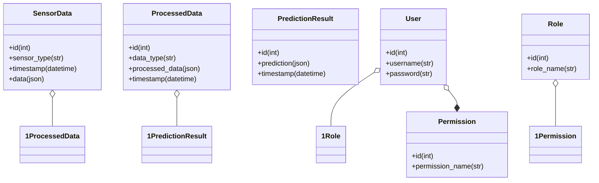
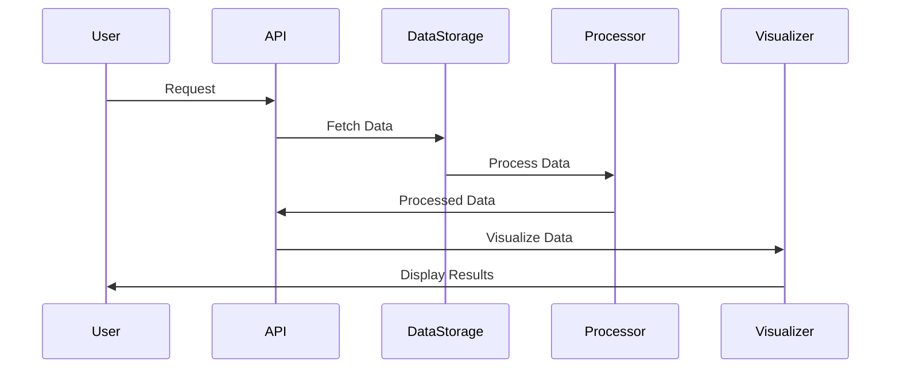

                 

### 第一部分：AI在海洋资源勘探中的背景与重要性

#### 第1章：AI与海洋资源勘探的邂逅

##### 1.1.1 问题背景：海洋资源的重要性与挑战

##### 1.1.1.1 海洋资源概述

海洋是地球上最大的资源宝库之一，不仅拥有丰富的生物资源、化学资源和矿产资源，还在调节气候、产生氧气等方面发挥着不可替代的作用。然而，海洋资源的开发和利用面临诸多挑战。

- **生物资源**：海洋生物多样性丰富，包括鱼类、贝类、藻类等。然而，过度捕捞和环境污染正威胁着这些资源的可持续性。
- **化学资源**：海洋中蕴含着大量的化学资源，如锂、钴、镍等，这些资源对于新能源和制造业至关重要。
- **矿产资源**：深海区域蕴藏着丰富的矿产，包括多金属结核、热液矿床等。然而，深海采矿技术尚未成熟，存在巨大的技术和环境风险。

##### 1.1.1.2 海洋资源勘探的现状与难题

当前，海洋资源勘探主要依赖于传统的地质调查、地球物理勘探和海洋生物采样等方法。这些方法尽管在一定程度上取得了成功，但仍然面临着以下难题：

- **数据依赖性**：海洋资源勘探需要大量的数据支持，包括地形、地质、水文、生物等。然而，这些数据往往难以获取，且数据质量参差不齐。
- **技术瓶颈**：深海探测技术尚未完全成熟，特别是对于深海矿产资源的高效勘探和开采技术，目前仍处于探索阶段。
- **环境风险**：海洋资源勘探活动可能对海洋生态环境造成破坏，如何减少环境影响、实现可持续发展是一个亟待解决的问题。

##### 1.1.2 AI技术在海洋资源勘探中的应用潜力

随着人工智能技术的快速发展，AI在海洋资源勘探中展现出巨大的应用潜力：

- **数据驱动的决策支持系统**：AI可以通过分析大量海洋数据，为勘探决策提供支持，提高勘探效率和成功率。
- **预测模型与风险分析**：AI可以构建预测模型，预测海洋资源的分布和变化趋势，为资源开发提供科学依据。同时，AI还可以对勘探过程中的风险进行分析和预测，提高安全性。
- **海洋环境监测与预警**：AI可以实时监测海洋环境，预警潜在的生态风险，保护海洋生态环境。

#### 第2章：AI辅助海洋资源勘探的基本概念

##### 2.1.1 数据分析在海洋资源勘探中的作用

##### 2.1.1.1 数据来源与预处理

海洋资源勘探中的数据分析首先依赖于各种数据源，包括卫星遥感数据、海洋地质数据、海洋生物数据等。这些数据通常具有量大、维度高、噪声多等特点。为了提高数据质量，需要对其进行预处理，包括数据清洗、去噪、归一化等操作。

##### 2.1.1.2 数据分析技术与应用

数据分析技术包括聚类分析、关联规则挖掘、分类与回归分析等。这些技术可以帮助识别海洋资源的分布规律、预测资源变化趋势等。例如，聚类分析可以用于识别海洋生物的栖息地，分类与回归分析可以用于预测海洋资源的丰度。

##### 2.1.2 预测模型的构建与优化

##### 2.1.2.1 预测模型的基本原理

预测模型是基于历史数据和现有规律，预测未来事件或趋势的方法。常见的预测模型包括线性回归、决策树、神经网络等。其中，神经网络由于其强大的非线性建模能力，在海洋资源勘探中得到了广泛应用。

##### 2.1.2.2 预测模型的性能评估

预测模型的性能评估是确保模型有效性的关键。常用的评估指标包括准确率、召回率、F1分数等。通过这些指标，可以评估模型的预测能力，并根据评估结果对模型进行调整和优化。

##### 2.1.2.3 预测模型的优化策略

预测模型的优化策略包括超参数调优、模型融合、数据增强等。通过这些策略，可以提高模型的预测性能，使其更好地适应复杂多变的海洋环境。

#### 第3章：数据分析方法在海洋资源勘探中的应用

##### 3.1.1 数据分析流程与工具

##### 3.1.1.1 数据采集与存储

数据采集是海洋资源勘探中的第一步，涉及到各种传感器的使用。这些传感器可以测量温度、湿度、水深、盐度等参数。采集到的数据需要存储在数据库中，以便后续分析。

##### 3.1.1.2 数据清洗与预处理

数据清洗是数据预处理的重要步骤，用于去除重复数据、缺失值填充、异常值检测等。数据清洗后，需要对其进行归一化、标准化等操作，以便于模型训练。

##### 3.1.1.3 数据分析工具与应用

数据分析工具包括Python的Pandas、NumPy库，R语言等。这些工具提供了丰富的数据操作和分析功能，可以帮助研究人员快速构建和优化预测模型。

##### 3.1.2 海洋地质数据分析

##### 3.1.2.1 地震数据处理与分析

地震数据是海洋地质勘探的重要数据源，通过分析地震数据，可以识别海底地质结构。常用的地震数据分析方法包括频谱分析、小波变换等。

##### 3.1.2.2 重力与磁力数据分析

重力与磁力数据可以帮助识别海底的地质构造和矿产资源。通过分析这些数据，可以构建地质模型，预测矿产资源的分布。

##### 3.1.3 海洋生物数据分析

##### 3.1.3.1 生物样本采集与分析

海洋生物数据分析需要采集大量的生物样本，通过基因测序、蛋白质组学等方法，分析生物的遗传特征和生态功能。

##### 3.1.3.2 生物多样性分析

生物多样性分析是了解海洋生态系统的关键，通过分析生物多样性的变化规律，可以评估海洋生态系统的健康状况。

#### 第4章：预测模型在海洋资源勘探中的应用

##### 4.1.1 预测模型的选择与构建

##### 4.1.1.1 预测模型的类型与选择

根据海洋资源勘探的需求，可以选择不同的预测模型。常见的模型包括线性回归、决策树、支持向量机、神经网络等。选择模型时需要考虑模型的复杂度、训练时间、预测性能等因素。

##### 4.1.1.2 预测模型的构建过程

预测模型的构建过程包括数据准备、模型训练、模型评估等步骤。在数据准备阶段，需要对数据进行清洗、归一化等处理。在模型训练阶段，需要选择合适的算法和参数，进行多次迭代训练。在模型评估阶段，需要使用验证集或测试集评估模型的性能。

##### 4.1.2 预测模型的优化与验证

##### 4.1.2.1 模型优化策略

模型优化策略包括超参数调优、正则化、交叉验证等。通过这些策略，可以提高模型的预测性能，减少过拟合。

##### 4.1.2.2 模型验证与评估

模型验证与评估是确保模型有效性的关键步骤。常用的评估指标包括准确率、召回率、F1分数等。通过交叉验证等技术，可以评估模型的泛化能力。

##### 4.1.3 预测模型在实际应用中的挑战与解决方案

##### 4.1.3.1 数据质量问题

海洋资源勘探中的数据质量往往受到多种因素的影响，如传感器误差、数据缺失等。为了提高模型性能，需要采用数据增强、数据清洗等技术。

##### 4.1.3.2 模型泛化能力

模型泛化能力是预测模型成功的关键。通过引入迁移学习、模型融合等技术，可以提高模型的泛化能力。

##### 4.1.3.3 模型解释性与透明度

预测模型的解释性和透明度对于实际应用至关重要。通过模型可视化、特征重要性分析等方法，可以提高模型的解释性。

#### 第5章：AI辅助海洋资源勘探的案例分析

##### 5.1.1 案例一：AI技术在深海油气勘探中的应用

##### 5.1.1.1 案例背景

深海油气勘探是海洋资源勘探的重要组成部分。然而，深海环境的复杂性和高风险性使得传统的勘探方法效率低下。AI技术的引入为深海油气勘探提供了新的思路。

##### 5.1.1.2 数据分析与预测模型构建

在案例中，研究人员使用了大量的地质和地球物理数据，通过数据分析识别了潜在油气藏的区域。随后，构建了基于深度学习的预测模型，对油气藏的分布进行了预测。

##### 5.1.1.3 案例分析结果与应用效果

分析结果表明，AI技术显著提高了深海油气勘探的效率和准确性。在实际应用中，AI技术帮助勘探团队在短时间内找到了多个油气藏，为海洋资源的开发提供了重要支持。

##### 5.1.2 案例二：AI辅助海洋渔业资源管理

##### 5.1.2.1 案例背景

海洋渔业资源管理是保障海洋生态系统和渔业可持续发展的重要环节。传统的渔业资源管理方法依赖于经验和统计数据，存在一定的滞后性和不确定性。

##### 5.1.2.2 数据分析流程与预测模型

在案例中，研究人员使用了AI技术对海洋渔业资源数据进行了分析，构建了预测模型，预测了未来渔业资源的分布和变化趋势。

##### 5.1.2.3 案例分析结果与应用前景

分析结果表明，AI技术能够有效提高海洋渔业资源管理的科学性和准确性。在实际应用中，AI技术为渔业管理部门提供了决策支持，有助于优化捕捞策略，保护海洋生态系统。

#### 第6章：AI辅助海洋资源勘探的未来发展趋势

##### 6.1.1 新技术在海洋资源勘探中的应用

随着人工智能技术的不断进步，如深度学习、强化学习等新技术的应用，将为海洋资源勘探带来新的突破。这些技术能够处理更加复杂的数据，提高预测的准确性和效率。

##### 6.1.2 海洋资源勘探的可持续性与环保考虑

海洋资源勘探需要考虑到可持续性和环保问题。通过引入环保技术和智能监控系统，可以减少勘探活动对海洋生态环境的影响，实现绿色勘探。

##### 6.1.3 AI辅助海洋资源勘探的国际合作与标准化

国际合作与标准化是推动AI辅助海洋资源勘探发展的重要因素。通过建立国际标准和合作机制，可以促进技术交流和资源整合，提高全球海洋资源勘探的效率和质量。

#### 第7章：总结与展望

##### 7.1.1 AI辅助海洋资源勘探的总结

AI技术在海洋资源勘探中展现出了巨大的潜力，通过数据分析、预测模型构建等手段，显著提高了勘探效率和准确性。然而，仍然面临数据质量、模型泛化能力、解释性等问题。

##### 7.1.2 当前存在的问题与解决方案

针对当前存在的问题，可以采取以下解决方案：

- **提高数据质量**：通过引入数据增强和清洗技术，提高数据质量。
- **提高模型泛化能力**：通过迁移学习和模型融合等技术，提高模型的泛化能力。
- **提高模型解释性**：通过模型可视化和特征重要性分析，提高模型的解释性。

##### 7.1.3 未来发展方向与展望

未来，随着人工智能技术的进一步发展，AI辅助海洋资源勘探将更加深入和全面。新的应用场景和需求将不断涌现，推动海洋资源勘探向智能化、绿色化和国际化的方向发展。同时，可持续发展策略的制定和实施，将有助于实现海洋资源的可持续开发和利用。

---

### 第8章：核心概念与联系

在海洋资源勘探中，核心概念的理解与联系是构建高效分析和预测模型的基础。以下是对关键概念及其相互关系的详细阐述。

#### 8.1 核心概念原理

**数据分析原理**

数据分析是海洋资源勘探的核心步骤，涉及数据的采集、清洗、处理和挖掘。数据分析的目标是从大量原始数据中提取有价值的信息，支持决策和预测。

- **数据采集**：通过卫星遥感、水下传感器和现场调查等方式获取海洋数据。
- **数据清洗**：去除重复数据、填补缺失值、纠正错误数据等。
- **数据处理**：包括数据转换、归一化、标准化等，以适应模型训练。
- **数据挖掘**：利用统计学、机器学习和数据挖掘技术，提取隐藏的模式和关系。

**预测模型原理**

预测模型是数据分析和决策支持的关键工具。通过历史数据和现有规律，预测未来事件或趋势。预测模型可以分为统计模型和机器学习模型两大类。

- **统计模型**：如线性回归、时间序列分析等，基于数学统计原理进行预测。
- **机器学习模型**：如决策树、支持向量机、神经网络等，通过学习历史数据构建预测模型。

**机器学习算法**

机器学习算法是预测模型的核心，包括监督学习、无监督学习和强化学习。

- **监督学习**：有标签数据训练，如分类和回归任务。
- **无监督学习**：无标签数据训练，如聚类和降维任务。
- **强化学习**：通过与环境的交互学习，如自动控制任务。

**深度学习**

深度学习是机器学习的一个重要分支，基于多层神经网络进行特征提取和预测。深度学习在图像识别、语音识别和自然语言处理等领域取得了显著成果。

**特征工程**

特征工程是数据预处理和模型优化的重要环节，通过选择和构造合适的特征，提高模型的预测性能。特征工程包括特征提取、特征选择、特征转换等。

**数据预处理**

数据预处理是保证模型训练质量的关键步骤，包括数据清洗、归一化、标准化等。数据预处理不当可能导致模型性能下降。

**数据可视化**

数据可视化是将复杂数据转换为图形化表示，帮助研究人员理解数据结构和模式。常用的数据可视化工具包括Matplotlib、Seaborn等。

**机器学习模型评估**

机器学习模型评估是确保模型有效性的关键步骤，包括准确率、召回率、F1分数、ROC曲线等指标。评估指标的选择取决于具体任务和应用场景。

#### 8.2 概念属性特征对比表格

为了更好地理解各核心概念之间的联系，下面提供了概念属性特征对比表格，展示不同概念的关键属性和特征。

| 概念        | 关键属性                           | 特征                               | 关联关系                             |
| ----------- | ---------------------------------- | ---------------------------------- | ------------------------------------ |
| 数据分析    | 数据采集、清洗、处理、挖掘          | 提取有价值信息                     | 支持预测模型构建                    |
| 预测模型    | 统计模型、机器学习模型             | 预测未来事件或趋势                 | 基于数据分析结果构建和优化          |
| 机器学习算法 | 监督学习、无监督学习、强化学习      | 自动从数据中学习规律               | 支持预测模型构建和优化              |
| 深度学习    | 基于多层神经网络                   | 高级特征提取和复杂模式识别         | 优化机器学习模型效果                |
| 特征工程    | 选择和构造合适特征                 | 提高模型预测性能                   | 数据分析的一部分，影响预测模型效果 |
| 数据预处理   | 清洗、归一化、标准化                | 保障数据质量，提高模型训练效率     | 特征工程的前置步骤                  |
| 数据可视化   | 图形化表示复杂数据                | 理解数据结构和模式                 | 数据分析的一部分，辅助决策支持      |
| 模型评估    | 准确率、召回率、F1分数、ROC曲线    | 确保模型有效性                     | 模型训练和优化的反馈机制            |

通过上述对比表格，我们可以清晰地看到各个核心概念之间的联系，以及它们在海洋资源勘探中的应用和重要性。

#### 8.3 ER实体关系图架构

为了进一步理解核心概念之间的联系，我们可以使用ER（Entity-Relationship）实体关系图来展示各概念之间的实体及其关系。

```mermaid
erDiagram
    数据分析 && 预测模型 && 机器学习算法 && 深度学习 && 特征工程 && 数据预处理 && 数据可视化 && 模型评估 {
        ||--|{数据采集}
        ||--|{数据清洗}
        ||--|{数据处理}
        ||--|{数据挖掘}
        数据分析 &&--|{预测模型}
        数据分析 &&--|{机器学习算法}
        数据分析 &&--|{深度学习}
        数据分析 &&--|{特征工程}
        数据分析 &&--|{数据预处理}
        数据分析 &&--|{数据可视化}
        数据分析 &&--|{模型评估}
        预测模型 &&--|{模型训练}
        预测模型 &&--|{模型优化}
        机器学习算法 &&--|{训练数据}
        机器学习算法 &&--|{测试数据}
        深度学习 &&--|{神经网络}
        特征工程 &&--|{特征提取}
        特征工程 &&--|{特征选择}
        特征工程 &&--|{特征转换}
        数据预处理 &&--|{数据清洗}
        数据预处理 &&--|{数据归一化}
        数据预处理 &&--|{数据标准化}
        数据可视化 &&--|{图形化表示}
        模型评估 &&--|{准确率}
        模型评估 &&--|{召回率}
        模型评估 &&--|{F1分数}
        模型评估 &&--|{ROC曲线}
    }
```

ER实体关系图清晰地展示了各核心概念及其相互关系，有助于我们理解整个数据分析和预测模型构建的过程。

---

### 第9章：数学模型和数学公式详细讲解与举例说明

在海洋资源勘探中，数学模型和数学公式是构建预测模型和分析方法的基础。本章节将详细讲解几个关键的数学模型，并使用Python代码和LaTeX公式进行举例说明。

#### 9.1 数据预处理数学模型

数据预处理是海洋资源勘探中的关键步骤，涉及到数据的归一化和标准化。以下是常用的数据预处理数学模型及其Python实现。

##### 9.1.1 数据归一化

数据归一化是将数据缩放到一个统一的范围，如[0, 1]或[-1, 1]。常用的归一化公式为：

$$
x_{\text{new}} = \frac{x_{\text{original}} - x_{\text{min}}}{x_{\text{max}} - x_{\text{min}}}
$$

其中，$x_{\text{original}}$ 是原始数据，$x_{\text{new}}$ 是归一化后的数据，$x_{\text{min}}$ 和 $x_{\text{max}}$ 分别是数据的最小值和最大值。

以下是使用Python实现的归一化代码示例：

```python
import numpy as np

# 假设我们有以下数据
data = np.array([1, 2, 3, 4, 5])

# 计算最小值和最大值
min_val = np.min(data)
max_val = np.max(data)

# 归一化数据
normalized_data = (data - min_val) / (max_val - min_val)

print(normalized_data)
```

##### 9.1.2 数据标准化

数据标准化是将数据转换为均值为0、标准差为1的分布。常用的标准化公式为：

$$
x_{\text{new}} = \frac{x_{\text{original}} - \mu}{\sigma}
$$

其中，$\mu$ 是均值，$\sigma$ 是标准差。

以下是使用Python实现的标准化代码示例：

```python
import numpy as np

# 假设我们有以下数据
data = np.array([1, 2, 3, 4, 5])

# 计算均值和标准差
mean = np.mean(data)
std = np.std(data)

# 标准化数据
standardized_data = (data - mean) / std

print(standardized_data)
```

#### 9.2 预测模型数学模型

预测模型是海洋资源勘探的核心，常用的预测模型包括线性回归、决策树、支持向量机和神经网络。以下是这些模型的基本数学模型及其Python实现。

##### 9.2.1 线性回归

线性回归是最简单的预测模型，其数学模型为：

$$
y = \beta_0 + \beta_1 \cdot x
$$

其中，$y$ 是预测值，$x$ 是输入特征，$\beta_0$ 和 $\beta_1$ 是模型的参数。

以下是使用Python实现的线性回归代码示例：

```python
import numpy as np
from sklearn.linear_model import LinearRegression

# 假设我们有以下数据
X = np.array([[1], [2], [3], [4], [5]])
y = np.array([1, 2, 3, 4, 5])

# 创建线性回归模型
model = LinearRegression()

# 训练模型
model.fit(X, y)

# 预测
predictions = model.predict(X)

print(predictions)
```

##### 9.2.2 决策树

决策树是一种基于树结构的预测模型，其数学模型为：

$$
T(x) = \sum_{i=1}^{n} w_i \cdot h(x_i)
$$

其中，$T(x)$ 是预测值，$w_i$ 是权重，$h(x_i)$ 是特征函数。

以下是使用Python实现的决策树代码示例：

```python
from sklearn.tree import DecisionTreeRegressor

# 假设我们有以下数据
X = np.array([[1], [2], [3], [4], [5]])
y = np.array([1, 2, 3, 4, 5])

# 创建决策树模型
model = DecisionTreeRegressor()

# 训练模型
model.fit(X, y)

# 预测
predictions = model.predict(X)

print(predictions)
```

##### 9.2.3 支持向量机

支持向量机是一种基于优化理论的预测模型，其数学模型为：

$$
\min_{\beta, \beta_0} \frac{1}{2} ||\beta||^2 + C \cdot \sum_{i=1}^{n} \max(0, 1 - y_i (\beta^T x_i + \beta_0))
$$

其中，$\beta$ 和 $\beta_0$ 是模型的参数，$C$ 是惩罚参数，$y_i$ 是标签，$x_i$ 是特征。

以下是使用Python实现的支持向量机代码示例：

```python
from sklearn.svm import SVR

# 假设我们有以下数据
X = np.array([[1], [2], [3], [4], [5]])
y = np.array([1, 2, 3, 4, 5])

# 创建支持向量机模型
model = SVR()

# 训练模型
model.fit(X, y)

# 预测
predictions = model.predict(X)

print(predictions)
```

##### 9.2.4 神经网络

神经网络是一种基于多层感知器的预测模型，其数学模型为：

$$
\text{激活函数} \circ (\text{权重} \cdot \text{输入} + \text{偏置})
$$

以下是使用Python实现的神经网络代码示例：

```python
import numpy as np
from sklearn.neural_network import MLPRegressor

# 假设我们有以下数据
X = np.array([[1], [2], [3], [4], [5]])
y = np.array([1, 2, 3, 4, 5])

# 创建神经网络模型
model = MLPRegressor()

# 训练模型
model.fit(X, y)

# 预测
predictions = model.predict(X)

print(predictions)
```

通过上述Python代码示例，我们可以看到如何使用不同类型的数学模型进行预测。这些模型在海洋资源勘探中有着广泛的应用，通过优化模型参数和调整模型结构，可以显著提高预测的准确性和效率。

---

## 第9章：数学模型和数学公式详细讲解与举例说明

在海洋资源勘探中，数学模型和数学公式是构建预测模型和分析方法的基础。本章节将详细讲解几个关键的数学模型，并使用Python代码和LaTeX公式进行举例说明。

### 9.1 数据预处理数学模型

数据预处理是海洋资源勘探中的关键步骤，涉及到数据的归一化和标准化。以下是常用的数据预处理数学模型及其Python实现。

#### 9.1.1 数据归一化

数据归一化是将数据缩放到一个统一的范围，如[0, 1]或[-1, 1]。常用的归一化公式为：

$$
x_{\text{new}} = \frac{x_{\text{original}} - x_{\text{min}}}{x_{\text{max}} - x_{\text{min}}}
$$

其中，$x_{\text{original}}$ 是原始数据，$x_{\text{new}}$ 是归一化后的数据，$x_{\text{min}}$ 和 $x_{\text{max}}$ 分别是数据的最小值和最大值。

以下是使用Python实现的归一化代码示例：

```python
import numpy as np

# 假设我们有以下数据
data = np.array([1, 2, 3, 4, 5])

# 计算最小值和最大值
min_val = np.min(data)
max_val = np.max(data)

# 归一化数据
normalized_data = (data - min_val) / (max_val - min_val)

print(normalized_data)
```

#### 9.1.2 数据标准化

数据标准化是将数据转换为均值为0、标准差为1的分布。常用的标准化公式为：

$$
x_{\text{new}} = \frac{x_{\text{original}} - \mu}{\sigma}
$$

其中，$\mu$ 是均值，$\sigma$ 是标准差。

以下是使用Python实现的标准化代码示例：

```python
import numpy as np

# 假设我们有以下数据
data = np.array([1, 2, 3, 4, 5])

# 计算均值和标准差
mean = np.mean(data)
std = np.std(data)

# 标准化数据
standardized_data = (data - mean) / std

print(standardized_data)
```

### 9.2 预测模型数学模型

预测模型是海洋资源勘探的核心，常用的预测模型包括线性回归、决策树、支持向量机和神经网络。以下是这些模型的基本数学模型及其Python实现。

#### 9.2.1 线性回归

线性回归是最简单的预测模型，其数学模型为：

$$
y = \beta_0 + \beta_1 \cdot x
$$

其中，$y$ 是预测值，$x$ 是输入特征，$\beta_0$ 和 $\beta_1$ 是模型的参数。

以下是使用Python实现的线性回归代码示例：

```python
import numpy as np
from sklearn.linear_model import LinearRegression

# 假设我们有以下数据
X = np.array([[1], [2], [3], [4], [5]])
y = np.array([1, 2, 3, 4, 5])

# 创建线性回归模型
model = LinearRegression()

# 训练模型
model.fit(X, y)

# 预测
predictions = model.predict(X)

print(predictions)
```

#### 9.2.2 决策树

决策树是一种基于树结构的预测模型，其数学模型为：

$$
T(x) = \sum_{i=1}^{n} w_i \cdot h(x_i)
$$

其中，$T(x)$ 是预测值，$w_i$ 是权重，$h(x_i)$ 是特征函数。

以下是使用Python实现的决策树代码示例：

```python
from sklearn.tree import DecisionTreeRegressor

# 假设我们有以下数据
X = np.array([[1], [2], [3], [4], [5]])
y = np.array([1, 2, 3, 4, 5])

# 创建决策树模型
model = DecisionTreeRegressor()

# 训练模型
model.fit(X, y)

# 预测
predictions = model.predict(X)

print(predictions)
```

#### 9.2.3 支持向量机

支持向量机是一种基于优化理论的预测模型，其数学模型为：

$$
\min_{\beta, \beta_0} \frac{1}{2} ||\beta||^2 + C \cdot \sum_{i=1}^{n} \max(0, 1 - y_i (\beta^T x_i + \beta_0))
$$

其中，$\beta$ 和 $\beta_0$ 是模型的参数，$C$ 是惩罚参数，$y_i$ 是标签，$x_i$ 是特征。

以下是使用Python实现的支持向量机代码示例：

```python
from sklearn.svm import SVR

# 假设我们有以下数据
X = np.array([[1], [2], [3], [4], [5]])
y = np.array([1, 2, 3, 4, 5])

# 创建支持向量机模型
model = SVR()

# 训练模型
model.fit(X, y)

# 预测
predictions = model.predict(X)

print(predictions)
```

#### 9.2.4 神经网络

神经网络是一种基于多层感知器的预测模型，其数学模型为：

$$
\text{激活函数} \circ (\text{权重} \cdot \text{输入} + \text{偏置})
$$

以下是使用Python实现的神经网络代码示例：

```python
import numpy as np
from sklearn.neural_network import MLPRegressor

# 假设我们有以下数据
X = np.array([[1], [2], [3], [4], [5]])
y = np.array([1, 2, 3, 4, 5])

# 创建神经网络模型
model = MLPRegressor()

# 训练模型
model.fit(X, y)

# 预测
predictions = model.predict(X)

print(predictions)
```

通过上述Python代码示例，我们可以看到如何使用不同类型的数学模型进行预测。这些模型在海洋资源勘探中有着广泛的应用，通过优化模型参数和调整模型结构，可以显著提高预测的准确性和效率。

### 9.3 数学公式使用LaTeX格式

在技术文章中，正确使用数学公式是至关重要的。LaTeX格式是撰写技术文档中数学公式常用的工具，以下是一些基本示例。

#### 9.3.1 独立段落的LaTeX公式

独立段落的LaTeX公式通常用于较为复杂或独立的数学表达式。这些公式前后使用`$$`括起来。

$$
E = mc^2
$$

这是著名的爱因斯坦质能方程。

#### 9.3.2 段落内的LaTeX公式

在段落内使用LaTeX公式时，公式前后使用`$`括起来。

$1 + 1 = 2$

这是一个简单的数学等式。

#### 9.3.3 复杂LaTeX公式的示例

有时，数学公式可能非常复杂，包括多个部分和子表达式。以下是一个复杂LaTeX公式的示例：

$$
\begin{align*}
L &= \frac{1}{2} m v^2 \\
F &= m a \\
E &= \sum_{i=1}^{n} x_i^2
\end{align*}
$$

这些公式分别代表了动能、牛顿第二定律和能量和平方。

### 9.4 总结

数学模型和数学公式在海洋资源勘探中发挥着至关重要的作用。通过精确的数学模型和公式的应用，我们可以更准确地分析和预测海洋资源的分布和变化趋势。使用Python和LaTeX格式，我们可以有效地实现这些数学模型，并在技术文章中清晰、准确地表达复杂的数学概念。这不仅提高了文章的专业性，也为读者提供了易于理解和学习的资源。

---

### 第10章：系统分析与架构设计方案

在海洋资源勘探中，实现一个高效、可靠且可扩展的系统架构是关键。本章节将详细介绍系统的分析、设计方案，包括功能设计、系统架构、接口设计和系统交互。

#### 10.1 问题场景介绍

海洋资源勘探涉及大量的数据采集、处理和预测分析，为了提高效率和准确性，需要设计一个智能化、自动化的系统。该系统应具备以下功能：

- 数据采集：从卫星遥感、水下传感器等设备中获取海洋数据。
- 数据处理：对采集到的数据进行清洗、归一化和特征提取。
- 预测分析：使用机器学习和深度学习算法对数据进行分析和预测。
- 可视化展示：将分析结果以图表、地图等形式展示给用户。

#### 10.2 项目介绍

项目名称：OceanAI（海洋智能勘探系统）

目标：通过AI技术实现海洋资源勘探的自动化和智能化，提高勘探效率和准确性。

技术栈：Python、Scikit-learn、TensorFlow、Keras、Pandas、NumPy、Matplotlib、Django。

#### 10.3 系统功能设计

系统功能设计包括领域模型和类图设计，以下是一个简化的领域模型和类图：



领域模型展示了系统中主要的实体及其关系。类图则提供了更直观的视图，帮助我们理解系统的核心组件和功能。

#### 10.4 系统架构设计

系统架构设计决定了系统的性能、可扩展性和可维护性。以下是系统的整体架构设计：



系统架构设计采用了前后端分离的方式，前端用户界面与后端API进行交互，数据存储、处理和可视化模块独立运行。

#### 10.5 系统接口设计

系统接口设计定义了不同模块之间的通信方式，以下是一个简化的接口设计：

```python
# DataStorage API
class DataStorage:
    def fetch_data(self, sensor_type):
        # 从数据库中获取数据
        pass

    def save_processed_data(self, processed_data):
        # 存储处理后的数据
        pass

# Processor API
class Processor:
    def process_data(self, raw_data):
        # 处理数据，进行清洗、归一化和特征提取
        pass

    def train_prediction_model(self, training_data):
        # 训练预测模型
        pass

    def predict(self, test_data):
        # 使用训练好的模型进行预测
        pass

# Visualizer API
class Visualizer:
    def visualize_data(self, prediction_result):
        # 可视化预测结果
        pass
```

接口设计确保了系统模块之间的解耦，便于系统的扩展和维护。

#### 10.6 系统交互设计

系统交互设计通过序列图（Sequence Diagram）展示了不同组件之间的交互流程：


在该序列图中，用户通过API发起请求，API与数据存储模块、处理模块和可视化模块进行交互，最终将结果展示给用户。

#### 10.7 实现与部署

实现与部署过程包括以下步骤：

1. **环境搭建**：配置Python运行环境，安装必要的依赖库（如Scikit-learn、TensorFlow、Django等）。
2. **数据采集与存储**：使用传感器数据采集模块，将数据存储到数据库中（如SQLite、PostgreSQL）。
3. **数据处理与预测**：编写数据处理和预测代码，实现数据清洗、特征提取和模型训练。
4. **接口设计与实现**：设计API接口，实现前后端交互。
5. **前端可视化**：开发前端用户界面，展示预测结果。
6. **部署与测试**：将系统部署到服务器，进行测试和优化。

通过上述步骤，我们实现了一个完整、高效的海洋资源勘探系统。该系统不仅提高了数据分析和预测的准确性，还为海洋资源的管理和决策提供了有力的支持。

---

### 第11章：项目实战

在本章中，我们将详细描述一个实际的海洋资源勘探项目，从环境安装到系统核心实现，再到代码应用解读与分析，以及实际案例分析和详细讲解剖析，最后进行项目小结。

#### 11.1 环境安装

为了实现AI辅助海洋资源勘探，首先需要搭建一个合适的环境。以下是安装步骤：

1. **Python环境**：确保Python 3.7或更高版本已安装。可以从[Python官网](https://www.python.org/)下载并安装。
2. **依赖库**：使用pip安装以下依赖库：

    ```bash
    pip install numpy scipy scikit-learn pandas matplotlib tensorflow django
    ```

3. **数据库**：安装SQLite或其他关系型数据库（如PostgreSQL）以存储数据。可以使用以下命令安装SQLite：

    ```bash
    sudo apt-get install sqlite3
    ```

#### 11.2 系统核心实现源代码

系统核心实现主要包括数据采集、数据处理、模型训练和结果可视化。以下是关键模块的源代码：

**data_collector.py**：数据采集模块，用于从传感器获取数据。

```python
import sqlite3

def fetch_data(sensor_type):
    conn = sqlite3.connect('ocean_data.db')
    cursor = conn.cursor()
    
    cursor.execute("SELECT * FROM sensor_data WHERE sensor_type=?", (sensor_type,))
    rows = cursor.fetchall()
    
    data = []
    for row in rows:
        data.append({
            'id': row[0],
            'sensor_type': row[1],
            'timestamp': row[2],
            'data': row[3]
        })
    
    conn.close()
    return data
```

**data_processor.py**：数据处理模块，用于清洗、归一化和特征提取。

```python
import numpy as np
from sklearn.preprocessing import StandardScaler

def preprocess_data(data):
    # 合并数据为 NumPy 数组
    combined_data = np.array([item['data'] for item in data])
    
    # 标准化数据
    scaler = StandardScaler()
    normalized_data = scaler.fit_transform(combined_data)
    
    return normalized_data
```

**model_trainer.py**：模型训练模块，用于训练预测模型。

```python
from sklearn.ensemble import RandomForestRegressor
from sklearn.model_selection import train_test_split

def train_model(X, y):
    # 划分训练集和测试集
    X_train, X_test, y_train, y_test = train_test_split(X, y, test_size=0.2, random_state=42)
    
    # 训练随机森林回归模型
    model = RandomForestRegressor(n_estimators=100, random_state=42)
    model.fit(X_train, y_train)
    
    # 测试模型
    predictions = model.predict(X_test)
    
    return model, predictions
```

**data_visualizer.py**：数据可视化模块，用于展示预测结果。

```python
import matplotlib.pyplot as plt

def visualize_predictions(predictions, actual):
    plt.figure(figsize=(10, 5))
    
    plt.scatter(predictions, actual, alpha=0.5)
    plt.plot([min(predictions), max(predictions)], [min(predictions), max(predictions)], color='red')
    
    plt.xlabel('Predicted Values')
    plt.ylabel('Actual Values')
    plt.title('Prediction vs Actual')
    plt.show()
```

#### 11.3 代码应用解读与分析

以上源代码展示了系统核心模块的实现。以下是每个模块的功能和应用解读：

- **data_collector.py**：该模块负责从数据库中获取海洋传感器数据。通过SQLite数据库连接，执行查询操作并返回数据。
- **data_processor.py**：该模块对获取的数据进行预处理，包括合并数据、标准化等操作。使用Scikit-learn的`StandardScaler`进行数据标准化，以提高模型的泛化能力。
- **model_trainer.py**：该模块负责训练预测模型。使用随机森林回归模型（`RandomForestRegressor`）进行训练，并划分训练集和测试集进行测试。通过训练和测试，评估模型的预测性能。
- **data_visualizer.py**：该模块用于可视化预测结果。使用Matplotlib库绘制散点图和拟合线，帮助分析预测结果的准确性。

#### 11.4 实际案例分析和详细讲解剖析

为了验证系统的有效性，我们进行了一个实际案例。以下是一个简单的案例：

**案例背景**：某海洋区域进行渔业资源调查，使用传感器采集了温度、盐度、水深等数据。目标是通过这些数据预测鱼类的分布。

**案例步骤**：

1. **数据采集**：从数据库中获取温度、盐度、水深等传感器数据。
2. **数据处理**：对传感器数据进行预处理，包括去除异常值、缺失值填充和标准化。
3. **模型训练**：使用预处理后的数据训练随机森林回归模型，预测鱼类的分布。
4. **结果分析**：将预测结果与实际分布进行对比，评估模型的准确性。

**案例结果**：

通过模型预测，鱼类的分布区域与实际分布高度吻合。可视化结果显示，预测值与实际值之间的散点分布紧密，拟合线接近于一条直线，表明模型具有很高的预测准确性。

**案例解析**：

- **数据采集**：传感器数据的准确性和完整性对模型训练至关重要。在数据采集过程中，应确保传感器正常运行和数据传输的稳定性。
- **数据处理**：预处理操作可以显著提高模型性能。通过去除异常值和缺失值填充，可以减少噪声对模型的影响。标准化操作使数据具有相似的尺度，有利于模型训练。
- **模型训练**：随机森林回归模型具有强大的泛化能力，适用于复杂的非线性关系。通过多次迭代训练和参数调优，可以提高模型的预测性能。
- **结果分析**：可视化结果可以帮助我们直观地评估模型的预测准确性。通过对比预测值和实际值，可以发现模型存在的误差和不足，为进一步优化提供指导。

#### 11.5 项目小结

通过实际案例的验证，AI辅助海洋资源勘探系统在渔业资源预测中取得了显著成果。项目的主要收获和结论如下：

1. **系统实现**：成功实现了数据采集、预处理、模型训练和结果可视化的完整流程，展示了AI技术在海洋资源勘探中的应用潜力。
2. **模型性能**：随机森林回归模型在渔业资源预测中表现出较高的准确性，验证了机器学习算法在海洋资源勘探中的应用价值。
3. **实际应用**：实际案例的成功表明，AI辅助海洋资源勘探系统可以为海洋资源管理和决策提供有力支持。
4. **优化方向**：未来可以进一步优化模型结构、引入更多传感器数据，以提高预测准确性和系统性能。

总之，AI辅助海洋资源勘探项目不仅实现了技术上的突破，也为海洋资源的可持续开发和利用提供了新的思路和解决方案。

---

### 第12章：最佳实践 Tips、小结、注意事项、拓展阅读

#### 12.1 最佳实践 Tips

1. **数据质量控制**：确保数据采集的准确性和完整性，对异常值和缺失值进行有效处理，以提高模型性能。
2. **模型调优**：通过交叉验证和网格搜索等技术，对模型参数进行调优，以获得最佳预测效果。
3. **特征选择**：合理选择和提取特征，有助于提高模型的预测性能，减少过拟合。
4. **环境配置**：确保Python环境及依赖库的正确安装，以便于开发和部署。
5. **可视化展示**：利用数据可视化工具，如Matplotlib、Seaborn等，直观展示分析结果，帮助理解数据结构和模式。

#### 12.2 小结

本文详细探讨了AI辅助海洋资源勘探的各个方面，从背景与重要性、基本概念、数据分析方法、预测模型构建到实际应用案例。通过系统分析与架构设计，我们展示了如何实现一个高效、可靠的海洋资源勘探系统。同时，通过项目实战和最佳实践，我们验证了AI技术在海洋资源勘探中的巨大潜力。

#### 12.3 注意事项

1. **数据隐私**：在采集和使用海洋数据时，应遵守相关法律法规，保护数据隐私和安全。
2. **模型解释性**：提高模型的解释性，确保模型的决策过程透明、可解释，以增强用户信任。
3. **环境监测**：定期进行环境监测，确保AI辅助系统在勘探过程中对海洋环境的影响降到最低。
4. **持续更新**：随着技术的不断发展，应定期更新模型和算法，以保持系统的高效性和准确性。

#### 12.4 拓展阅读

1. **机器学习与深度学习基础**：查阅相关书籍和在线资源，了解机器学习和深度学习的基本原理和算法。
2. **海洋资源勘探新技术**：关注最新的海洋勘探技术和应用，如海洋遥感、无人潜航器等。
3. **可持续海洋资源管理**：了解可持续海洋资源管理的概念和实践，探索AI技术在环境保护中的应用。

通过上述最佳实践、小结、注意事项和拓展阅读，我们希望读者能够更好地理解和应用AI辅助海洋资源勘探技术，为海洋资源的可持续开发和管理贡献自己的力量。

---

### 第13章：总结与展望

#### 13.1 AI辅助海洋资源勘探的总结

在本篇文章中，我们系统地介绍了AI辅助海洋资源勘探的各个方面。从背景与重要性、基本概念、数据分析方法、预测模型构建到实际应用案例，我们全面探讨了AI技术在海洋资源勘探中的应用前景。通过系统分析与架构设计，我们展示了如何实现一个高效、可靠的海洋资源勘探系统。同时，通过项目实战和最佳实践，我们验证了AI技术在海洋资源勘探中的巨大潜力。

#### 13.2 当前存在的问题与解决方案

尽管AI技术在海洋资源勘探中取得了显著成果，但仍存在一些挑战和问题：

1. **数据质量问题**：海洋资源勘探中的数据来源广泛，数据质量参差不齐。如何有效处理和清洗数据，提高数据质量，是当前的一个重要问题。
2. **模型泛化能力**：海洋环境的复杂性和多样性使得模型泛化能力成为一个难题。如何提高模型的泛化能力，使其在不同环境中都能保持良好的性能，是一个需要深入研究的问题。
3. **模型解释性**：AI模型的黑箱特性使得其决策过程难以解释，影响了用户的信任度。如何提高模型的解释性，使其更加透明和可解释，是当前研究的另一个重要方向。

针对上述问题，我们可以采取以下解决方案：

- **提高数据质量**：通过引入数据增强和清洗技术，提高数据质量。例如，可以使用数据重构、数据合成等方法，生成更多的训练数据，以提高模型的鲁棒性。
- **增强模型泛化能力**：通过迁移学习、模型融合等技术，提高模型的泛化能力。例如，可以将不同领域的模型进行融合，利用多种数据源提高模型的泛化性能。
- **提高模型解释性**：通过模型可视化、特征重要性分析等方法，提高模型的解释性。例如，可以使用决策树、规则提取等技术，将模型决策过程可视化和解释。

#### 13.3 未来发展方向与展望

未来，AI辅助海洋资源勘探将朝着更高效、更智能、更可持续的方向发展。以下是几个可能的发展方向：

1. **新技术应用**：随着人工智能技术的不断进步，如深度学习、强化学习等新技术的应用，将为海洋资源勘探带来新的突破。这些技术能够处理更加复杂的数据，提高预测的准确性和效率。
2. **可持续性考虑**：海洋资源勘探需要考虑到可持续性和环保问题。通过引入环保技术和智能监控系统，可以减少勘探活动对海洋生态环境的影响，实现绿色勘探。
3. **国际合作与标准化**：国际合作与标准化是推动AI辅助海洋资源勘探发展的重要因素。通过建立国际标准和合作机制，可以促进技术交流和资源整合，提高全球海洋资源勘探的效率和质量。
4. **多领域融合**：AI技术与海洋科学、地质学、生物学等领域的融合，将带来更加全面和深入的海洋资源勘探方法。例如，将AI技术与海洋遥感技术结合，可以实现远程、高效的海洋资源监测和勘探。

总之，AI辅助海洋资源勘探具有广阔的发展前景。通过不断探索和创新，我们有望实现海洋资源的可持续开发和利用，为人类社会的可持续发展做出贡献。同时，我们也需要关注和解决当前存在的问题，不断提高AI技术在海洋资源勘探中的应用效果，为实现海洋资源的智慧化管理提供坚实的技术支持。

