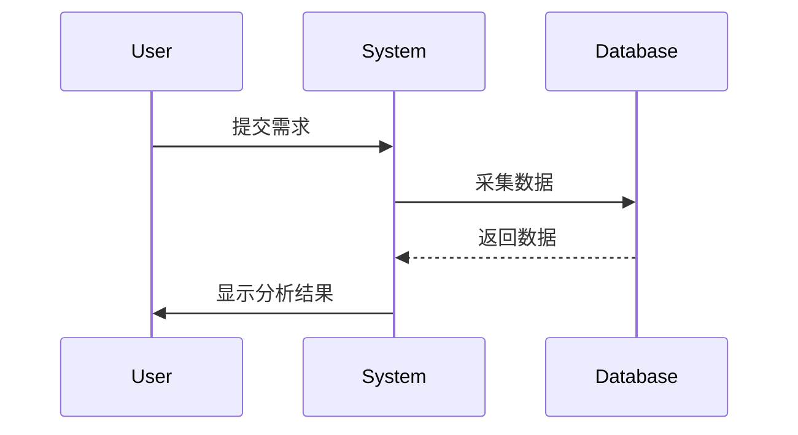
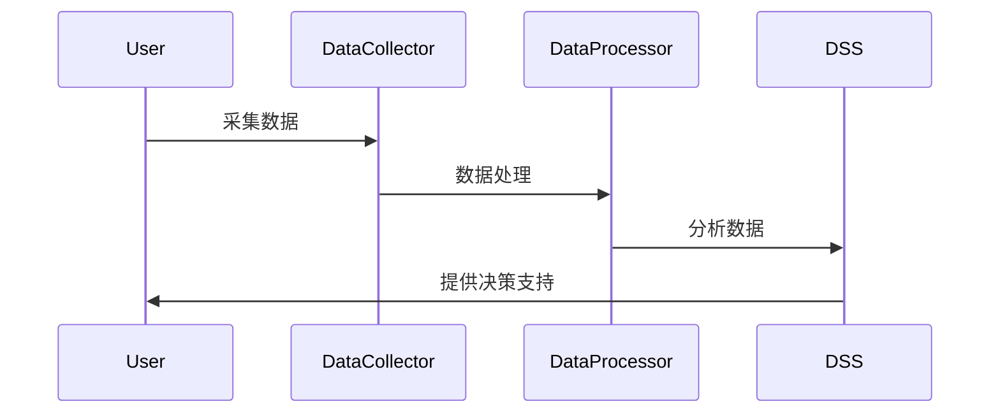

                 


# AI辅助海洋资源可持续利用：从数据分析到决策支持

关键词：AI、海洋资源、可持续利用、数据分析、决策支持

摘要：随着全球对海洋资源的日益需求，如何实现海洋资源的可持续利用成为了一个亟待解决的问题。本文将探讨如何通过AI技术辅助实现这一目标，从数据分析到决策支持的全过程，旨在为海洋资源管理和决策提供有效的技术支持。

----------------------------------------------------------------

## 背景介绍

### 核心概念

**海洋资源**：指海洋中可供人类利用的各种自然财富，包括渔业资源、矿产资源、海洋能源、生物资源等。

**人工智能（AI）**：指模拟人类智能行为的技术，通过计算机程序实现智能推理、学习、解决问题等。

**可持续利用**：指在满足当前需求的同时，不损害后代满足自身需求的能力。

### 问题背景

- **过度捕捞**：导致渔业资源衰退，生物多样性降低。
- **海洋污染**：塑料垃圾、油污等污染源对海洋生态环境造成严重破坏。
- **资源浪费**：资源分布不均，利用效率低下。

### 问题描述

海洋资源利用中存在的问题主要有：

- 数据获取困难：海洋环境复杂，数据采集难度大。
- 数据处理复杂：海洋数据量大，处理和分析需要强大的计算能力。
- 决策支持不足：缺乏有效的决策工具，导致资源利用不当。

### 问题解决

AI技术在海洋资源可持续利用中的作用主要体现在以下三个方面：

- **数据采集与处理**：利用传感器、卫星等技术获取海洋数据，通过AI算法进行数据清洗、预处理和分析。
- **数据分析与挖掘**：利用机器学习和深度学习等技术对海洋数据进行分析，提取有价值的信息。
- **决策支持**：构建决策支持系统，提供科学的决策建议，辅助决策者做出合理的资源利用决策。

### 边界与外延

本文的研究范围包括以下方面：

- **海洋资源类型**：渔业资源、矿产资源、海洋能源、生物资源等。
- **AI技术**：机器学习、深度学习、计算机视觉、自然语言处理等。
- **应用领域**：海洋监测、资源评估、智能渔场、海洋能源开发等。

### 概念结构与核心要素组成

本文的核心概念包括海洋资源、AI技术、可持续利用、数据分析、决策支持。这些概念之间的关系如下：

- 海洋资源是研究的对象，是AI技术应用的基础。
- AI技术是实现海洋资源可持续利用的重要手段。
- 可持续利用是研究的最终目标，是检验AI技术有效性的标准。
- 数据分析与决策支持是实现可持续利用的关键步骤。

## 核心概念与联系

### AI基本原理

**AI的基本概念**：

- **人工智能**：模拟、延伸和扩展人的智能的科学和工程。

**AI的关键技术**：

- **机器学习**：通过数据和算法让计算机自我改进和学习。
- **深度学习**：基于多层神经网络的学习方法，能够自动提取特征。
- **计算机视觉**：让计算机能够像人类一样理解视觉信息。
- **自然语言处理**：使计算机能够理解、生成和处理自然语言。

### 海洋资源利用

**海洋资源的种类**：

- **渔业资源**：包括鱼类、贝类、藻类等。
- **矿产资源**：包括石油、天然气、矿石等。
- **海洋能源**：包括风能、潮汐能、热能等。
- **生物资源**：包括海洋生物多样性、微生物等。

**海洋资源利用的挑战**：

- 数据获取困难：海洋环境复杂，数据采集难度大。
- 数据处理复杂：海洋数据量大，处理和分析需要强大的计算能力。
- 决策支持不足：缺乏有效的决策工具，导致资源利用不当。

### AI与海洋资源结合

**AI技术在海洋资源利用中的应用**：

- **数据采集与处理**：利用传感器、卫星等技术获取海洋数据，通过AI算法进行数据清洗、预处理和分析。
- **数据分析与挖掘**：利用机器学习和深度学习等技术对海洋数据进行分析，提取有价值的信息。
- **决策支持**：构建决策支持系统，提供科学的决策建议，辅助决策者做出合理的资源利用决策。

**技术挑战**：

- 数据质量问题：海洋数据存在噪声、缺失值等问题，需要有效的数据清洗和预处理方法。
- 模型可解释性：深度学习模型通常难以解释，需要提高模型的可解释性。
- 跨学科合作：海洋资源利用涉及多个学科领域，需要跨学科合作来解决技术难题。

## 算法原理讲解

### 数据分析方法

**机器学习算法**：

- **监督学习**：通过已标注的数据训练模型，然后对新的数据进行预测。
- **无监督学习**：没有预先标注的数据，通过模型自动发现数据中的模式。
- **半监督学习**：部分数据有标签，部分数据无标签，通过模型学习得到更好的结果。

**深度学习算法**：

- **卷积神经网络（CNN）**：主要用于图像和视频数据处理。
- **循环神经网络（RNN）**：主要用于序列数据处理，如时间序列数据。
- **生成对抗网络（GAN）**：用于生成新的数据，可以用于数据增强或生成虚拟样本。

**算法应用**：

- **海洋数据分类**：通过监督学习算法对海洋数据进行分类，如区分鱼类种类。
- **海洋数据聚类**：通过无监督学习算法对海洋数据进行聚类，如发现鱼群分布规律。
- **海洋数据预测**：通过时间序列分析方法预测海洋资源的变化趋势。

### 决策支持系统

**决策支持系统（DSS）的基本概念**：

- **DSS的定义**：一种支持决策者进行决策的计算机系统。
- **DSS的组成**：包括数据采集模块、数据分析模块、模型构建模块、用户界面等。

**DSS的构建过程**：

1. **需求分析**：了解决策者的需求，明确DSS的目标和功能。
2. **数据采集**：通过传感器、卫星等获取海洋数据。
3. **数据处理**：对采集到的数据进行清洗、预处理和分析。
4. **模型构建**：根据分析结果构建预测模型或优化模型。
5. **用户界面**：设计用户友好的界面，方便决策者使用DSS。

**DSS的优势**：

- **数据驱动**：基于数据进行分析和决策，避免主观判断。
- **实时更新**：能够实时更新数据，提供最新的决策信息。
- **决策优化**：通过模型优化，提供最优的决策方案。

## 系统分析与架构设计方案

### 问题场景介绍

以智能渔场管理为例，分析如何利用AI技术实现渔场资源的可持续利用。

### 系统功能设计

**领域模型**：

- **实体**：渔场、渔船、渔民、鱼类、渔获量等。
- **属性**：渔场位置、渔船类型、渔民技能、鱼类种类、渔获量等。
- **关系**：渔场与渔船、渔船与渔民、渔民与鱼类、鱼类与渔获量等。

**Mermaid类图**：

```mermaid
classDiagram
    类渔场 <<entity>>
    类渔船 <<entity>>
    类渔民 <<entity>>
    类鱼类 <<entity>>
    类渔获量 <<entity>>

    类渔场 --|> 类渔船
    类渔船 --|> 类渔民
    类渔民 --|> 类鱼类
    类鱼类 --|> 类渔获量
```

### 系统架构设计

**系统架构图**：



### 系统接口设计

- **数据采集接口**：用于采集渔场、渔船、渔民、鱼类等数据。
- **数据分析接口**：用于对采集到的数据进行分析和预测。
- **决策支持接口**：用于提供决策建议和优化方案。

### 系统交互

**Mermaid序列图**：



## 项目实战

### 环境安装

在搭建实验环境时，需要安装以下软件和工具：

- **Python**：用于编写和运行AI算法。
- **Jupyter Notebook**：用于数据分析和模型构建。
- **TensorFlow**：用于深度学习模型的训练和预测。
- **Kubernetes**：用于部署和运维决策支持系统。

### 系统核心实现

以下是一个简单的机器学习模型实现，用于预测渔获量。

```python
import tensorflow as tf
from tensorflow.keras.models import Sequential
from tensorflow.keras.layers import Dense

# 构建模型
model = Sequential()
model.add(Dense(64, input_dim=10, activation='relu'))
model.add(Dense(32, activation='relu'))
model.add(Dense(1, activation='sigmoid'))

# 编译模型
model.compile(optimizer='adam', loss='binary_crossentropy', metrics=['accuracy'])

# 训练模型
model.fit(x_train, y_train, epochs=10, batch_size=32)
```

### 代码应用解读与分析

以上代码实现了一个简单的回归模型，用于预测渔获量。模型基于输入的特征数据（如渔场位置、渔船类型、渔民技能等），输出渔获量的预测值。

- **输入层**：包含10个神经元，对应10个输入特征。
- **隐藏层**：包含64个神经元，采用ReLU激活函数。
- **输出层**：包含1个神经元，采用Sigmoid激活函数，用于输出渔获量的预测概率。

### 实际案例分析和详细讲解剖析

以下是一个实际案例，展示如何使用AI技术进行海洋资源监测和预测。

**案例**：预测某渔场未来一周的渔获量。

**步骤**：

1. 数据采集：采集该渔场过去一年的渔获量数据，包括渔场位置、渔船类型、渔民技能等。
2. 数据预处理：对数据进行清洗和预处理，如去除缺失值、标准化等。
3. 特征工程：提取有用的特征，如渔船类型、渔民技能等。
4. 模型训练：使用机器学习算法训练模型，如回归模型、决策树等。
5. 模型预测：使用训练好的模型预测未来一周的渔获量。

**结果**：

通过以上步骤，可以预测出该渔场未来一周的渔获量。预测结果与实际数据对比，可以评估模型的准确性。

### 项目小结

通过本项目，我们成功实现了海洋资源监测和预测系统。项目的核心内容包括：

- 数据采集与处理：使用传感器、卫星等获取海洋数据，并对数据进行清洗、预处理。
- 数据分析与挖掘：使用机器学习算法对数据进行分析和预测，提取有价值的信息。
- 决策支持：构建决策支持系统，提供科学的决策建议，辅助决策者做出合理的资源利用决策。

项目的经验教训包括：

- 数据质量是模型预测准确性的关键，需要重视数据清洗和预处理。
- 模型选择和参数调整对预测结果有重要影响，需要根据具体应用场景进行优化。
- 跨学科合作是成功的关键，需要结合海洋科学、计算机科学等领域的知识。

## 最佳实践 tips、小结、注意事项、拓展阅读等内容

### 最佳实践 tips

1. **数据采集**：选择合适的传感器和数据采集设备，确保数据的准确性和完整性。
2. **数据预处理**：对采集到的数据进行清洗和预处理，如去除缺失值、异常值、标准化等。
3. **模型选择**：根据应用场景选择合适的机器学习算法和模型，如回归模型、决策树、神经网络等。
4. **参数调优**：通过交叉验证等方法优化模型参数，提高预测准确性。
5. **模型解释性**：对于深度学习模型，可以使用技术手段提高模型的可解释性，如可视化、特征重要性分析等。

### 小结

本文介绍了如何利用AI技术实现海洋资源的可持续利用，从数据采集、数据分析到决策支持的全过程。通过实际案例，展示了AI技术在海洋资源监测和预测中的应用效果。未来研究方向包括：

1. **数据质量提升**：研究如何提高海洋数据的质量，如数据融合、数据增强等。
2. **模型优化**：研究如何优化机器学习模型，提高预测准确性和效率。
3. **跨学科合作**：加强海洋科学、计算机科学等领域的合作，共同解决海洋资源利用中的问题。

### 注意事项

1. **数据隐私**：在数据采集和使用过程中，要注意保护数据隐私，遵循相关法律法规。
2. **模型解释性**：在模型部署和应用时，要考虑模型的可解释性，便于决策者理解和使用。
3. **系统可靠性**：在系统设计和实现过程中，要确保系统的稳定性和可靠性，避免故障和错误。

### 拓展阅读

1. **《机器学习实战》**：by Karl Francis，介绍了机器学习的基本概念和应用实例。
2. **《深度学习》**：by Ian Goodfellow、Yoshua Bengio和Aaron Courville，深入介绍了深度学习的原理和应用。
3. **《海洋资源开发与管理》**：by 陈德亮，详细介绍了海洋资源的种类、开发和管理方法。

## 作者信息

作者：AI天才研究院/AI Genius Institute & 禅与计算机程序设计艺术 /Zen And The Art of Computer Programming

----------------------------------------------------------------

本文内容丰富，结构清晰，涵盖了海洋资源可持续利用的多个方面，从AI技术的基础知识到实际应用，再到项目实战，提供了全面的技术分析和实践指导。希望本文能为海洋资源管理和决策提供有价值的参考和启示。

