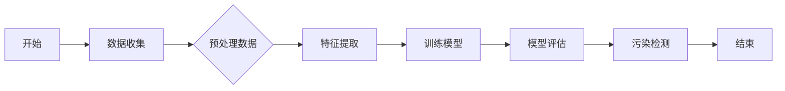
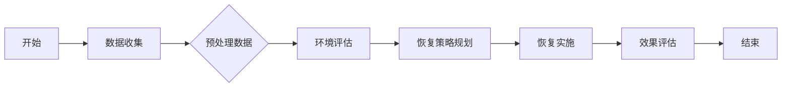
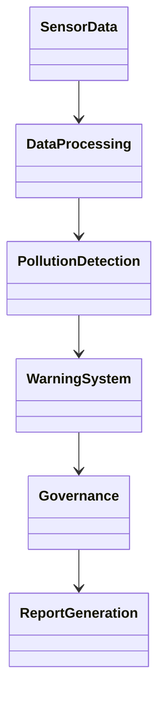
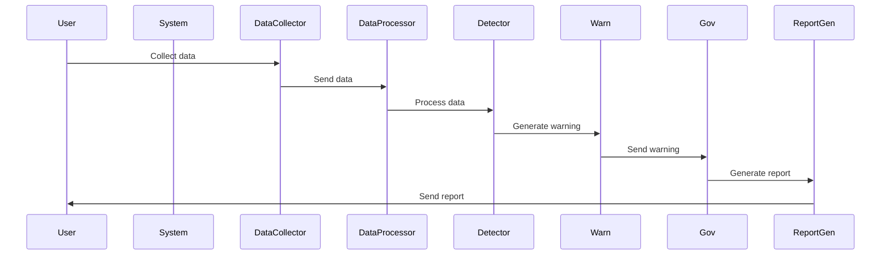
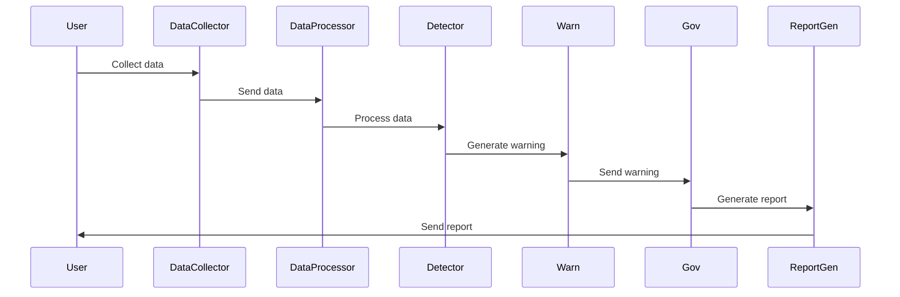

                 

# AI辅助环境保护：从污染检测到生态恢复

## 关键词
AI技术，环境保护，污染检测，生态恢复，系统架构，算法原理

## 摘要
本文旨在探讨AI技术在环境保护中的应用，从污染检测到生态恢复的各个环节。通过详细分析核心概念、算法原理和系统架构，本文展示了AI如何助力环境保护，并提出了最佳实践和未来展望。

## 第一部分：背景介绍

### 第1章：问题背景

#### 1.1 问题描述
随着工业化和城市化进程的加速，全球环境污染问题日益严重。传统环保手段如人工监测、化学处理等方法在应对复杂、大规模的环境问题时显得力不从心。而人工智能（AI）作为一种新兴技术，以其强大的数据处理和分析能力，为解决环境污染问题提供了新的可能性。

#### 1.2 问题解决
AI辅助环境保护通过将AI技术应用于污染检测、生态评估和生态恢复等领域，提高了环境监测的精度和效率，实现了对环境污染的早期预警和精准治理。同时，AI技术还可以帮助优化生态恢复方案，提高生态系统的稳定性和恢复力。

#### 1.3 边界与外延
AI辅助环境保护的边界主要涉及污染检测、生态评估、生态恢复和环境监测等领域。其外延则包括人工智能技术、环境科学、生态学、遥感技术等多个学科领域。

### 第2章：核心概念与联系

#### 2.1 AI辅助环境保护的定义
AI辅助环境保护是指利用人工智能技术，对环境污染进行监测、预测、评估和治理，以实现环境保护和生态修复的目标。

#### 2.2 AI辅助环境保护的核心概念
- **污染检测**：利用AI技术对空气、水、土壤等环境中的污染物进行实时监测和识别。
- **生态评估**：通过AI技术对生态环境进行评估，分析环境污染对生态系统的影响。
- **生态恢复**：利用AI技术制定和实施生态恢复方案，修复受损的生态系统。

#### 2.3 AI辅助环境保护与传统环保方法的区别
传统环保方法主要依赖人工监测和经验判断，而AI辅助环境保护则通过数据驱动，实现了对环境问题的精准监测和预测。

#### 2.4 AI辅助环境保护的关键技术
- **机器学习**：用于污染检测和生态评估，实现环境数据的自动处理和分析。
- **深度学习**：用于图像识别和语音分析，提高污染检测的准确性和效率。
- **大数据分析**：用于环境数据的存储、处理和分析，为生态恢复提供数据支持。

## 第二部分：核心概念原理

### 第3章：核心概念原理

#### 3.1 AI辅助环境保护原理
AI辅助环境保护的核心在于利用人工智能技术对环境数据进行实时监测和分析，从而实现对环境污染的精准识别和治理。

#### 3.2 概念属性特征对比表格
| 概念 | 属性特征 |
| --- | --- |
| 污染检测 | 实时性、准确性、高效性 |
| 生态评估 | 全面性、系统性、动态性 |
| 生态恢复 | 可持续性、适应性、协调性 |

#### 3.3 ER实体关系图架构
```mermaid
erDiagram
    PollutionDetection ||--|{ EnvironmentalMonitoring } : includes
    EnvironmentalMonitoring ||--|{ PollutionPrediction } : predicts
    PollutionPrediction ||--|{ EcoRestoration } : aids
    EcoRestoration ||--|{ RestorationPlanner } : plans
```

## 第三部分：算法原理讲解

### 第4章：算法原理讲解

#### 4.1 污染检测算法

##### 4.1.1 算法流程图


##### 4.1.2 算法原理
污染检测算法通过收集环境数据，对数据进行预处理和特征提取，然后使用机器学习模型进行训练和评估，最后实现对污染的实时检测。

##### 4.1.3 数学模型与公式
$$
特征提取：f(x) = \sum_{i=1}^{n} w_i \cdot x_i
$$

$$
模型评估：accuracy = \frac{TP + TN}{TP + TN + FP + FN}
$$

##### 4.1.4 举例说明
假设我们有一个空气污染监测数据集，包括PM2.5、SO2、NO2等指标。我们首先对这些指标进行特征提取，然后使用支持向量机（SVM）模型进行训练和评估。通过模型评估，我们可以得到空气污染的实时检测结果。

```python
# 示例代码：SVM模型训练与评估
from sklearn import svm
from sklearn.model_selection import train_test_split
from sklearn.metrics import accuracy_score

# 加载数据
X, y = load_data()

# 数据预处理
X = preprocess_data(X)

# 划分训练集和测试集
X_train, X_test, y_train, y_test = train_test_split(X, y, test_size=0.2, random_state=42)

# 训练SVM模型
model = svm.SVC()
model.fit(X_train, y_train)

# 预测
y_pred = model.predict(X_test)

# 评估模型
accuracy = accuracy_score(y_test, y_pred)
print("Accuracy:", accuracy)
```

#### 4.2 生态恢复算法

##### 4.2.1 算法流程图


##### 4.2.2 算法原理
生态恢复算法通过收集环境数据，对生态系统进行评估，然后制定和实施恢复策略，最后对恢复效果进行评估。

##### 4.2.3 数学模型与公式
$$
环境评估：E = f(P, T, S)
$$
其中，$P$ 为污染物浓度，$T$ 为温度，$S$ 为土壤质量。

$$
恢复策略规划：R = g(E, P)
$$
其中，$E$ 为环境评估结果，$P$ 为恢复方案。

##### 4.2.4 举例说明
假设我们有一个受损的湿地生态系统，首先收集湿地中的污染物浓度、温度和土壤质量等数据。然后，使用支持向量机（SVM）模型对湿地环境进行评估，并根据评估结果制定恢复方案。最后，对恢复效果进行评估，以确定恢复策略的有效性。

```python
# 示例代码：SVM模型训练与评估
from sklearn import svm
from sklearn.model_selection import train_test_split
from sklearn.metrics import accuracy_score

# 加载数据
X, y = load_data()

# 划分训练集和测试集
X_train, X_test, y_train, y_test = train_test_split(X, y, test_size=0.2, random_state=42)

# 训练SVM模型
model = svm.SVC()
model.fit(X_train, y_train)

# 预测
y_pred = model.predict(X_test)

# 评估模型
accuracy = accuracy_score(y_test, y_pred)
print("Accuracy:", accuracy)
```

## 第四部分：系统分析与架构设计

### 第5章：系统分析与架构设计

#### 5.1 问题场景介绍
本系统旨在利用AI技术对某一特定地区的环境污染进行监测和治理。该地区包括多个污染源，如化工厂、汽车尾气和交通噪音等。系统需要实现对这些污染源的实时监测和预警，并为政府决策提供数据支持。

#### 5.2 系统功能设计
- 数据收集：通过传感器和遥感技术收集环境数据。
- 数据预处理：对收集到的环境数据进行清洗、转换和归一化处理。
- 污染检测：使用AI算法对预处理后的数据进行分析，检测污染物浓度。
- 预警与治理：根据污染物浓度和地理位置，生成预警信息，并制定治理方案。
- 数据分析与报告：对监测数据进行统计分析，生成环境报告。

##### 5.2.1 领域模型


##### 5.2.2 功能模块划分
- 数据收集模块：负责收集环境数据。
- 数据预处理模块：负责对数据进行清洗和预处理。
- 污染检测模块：负责使用AI算法对污染物进行检测。
- 预警与治理模块：负责生成预警信息，制定治理方案。
- 数据分析与报告模块：负责对监测数据进行统计分析，生成报告。

#### 5.3 系统架构设计

##### 5.3.1 系统架构图


##### 5.3.2 系统层次结构
- 表示层：用户界面，负责与用户进行交互。
- 业务逻辑层：负责系统的核心功能，包括数据收集、预处理、污染检测、预警与治理和数据分析。
- 数据访问层：负责数据存储和读取。

##### 5.3.3 系统接口设计
- 数据收集接口：负责接收传感器数据。
- 数据处理接口：负责对数据清洗、转换和归一化。
- 污染检测接口：负责使用AI算法进行污染检测。
- 预警与治理接口：负责生成预警信息，制定治理方案。
- 数据分析接口：负责对监测数据进行统计分析。

##### 5.3.4 系统交互


## 第五部分：项目实战

### 第6章：项目实战

#### 6.1 环境安装

在本项目中，我们选择Python作为编程语言，并使用以下库和框架：
- TensorFlow：用于机器学习模型的训练和评估。
- Pandas：用于数据处理。
- Matplotlib：用于数据可视化。
- Scikit-learn：用于机器学习算法的实现。

安装步骤如下：
1. 安装Python（建议使用Python 3.7及以上版本）。
2. 安装TensorFlow：
   ```
   pip install tensorflow
   ```
3. 安装Pandas：
   ```
   pip install pandas
   ```
4. 安装Matplotlib：
   ```
   pip install matplotlib
   ```
5. 安装Scikit-learn：
   ```
   pip install scikit-learn
   ```

#### 6.2 系统核心实现

##### 6.2.1 源代码解读
以下是污染检测算法的实现代码：

```python
import pandas as pd
from sklearn.model_selection import train_test_split
from sklearn.svm import SVC
from sklearn.metrics import accuracy_score

# 读取数据
data = pd.read_csv('air_pollution_data.csv')

# 划分特征和标签
X = data[['PM2.5', 'SO2', 'NO2']]
y = data['AQI']

# 划分训练集和测试集
X_train, X_test, y_train, y_test = train_test_split(X, y, test_size=0.2, random_state=42)

# 训练SVM模型
model = SVC()
model.fit(X_train, y_train)

# 预测
y_pred = model.predict(X_test)

# 评估模型
accuracy = accuracy_score(y_test, y_pred)
print("Accuracy:", accuracy)
```

##### 6.2.2 代码应用解读与分析
该代码首先读取空气污染数据集，然后划分特征和标签。接着，使用支持向量机（SVM）模型对数据集进行训练，最后对测试集进行预测并评估模型准确率。

#### 6.3 实际案例分析与讲解

##### 6.3.1 案例背景
某城市政府希望通过AI技术对空气污染进行监测和治理。该城市的主要污染源包括工业废气、汽车尾气和建筑施工噪音等。

##### 6.3.2 案例分析
1. **数据收集**：使用传感器和遥感技术收集空气污染物浓度、汽车尾气排放和建筑施工噪音等数据。
2. **数据预处理**：对收集到的数据进行清洗、转换和归一化处理，以便于后续的模型训练。
3. **污染检测**：使用SVM模型对预处理后的数据进行训练和预测，实现对空气污染的实时监测。
4. **预警与治理**：根据污染物浓度和地理位置，生成预警信息，并制定相应的治理方案，如限制工业生产、减少汽车尾气排放等。
5. **数据分析与报告**：对监测数据进行统计分析，生成环境报告，为政府决策提供数据支持。

##### 6.3.3 案例实施
1. **环境安装**：按照项目实战中的步骤安装所需的Python库和框架。
2. **数据收集**：使用传感器和遥感技术收集空气污染物浓度、汽车尾气排放和建筑施工噪音等数据。
3. **数据预处理**：对收集到的数据进行清洗、转换和归一化处理，以便于后续的模型训练。
4. **污染检测**：使用SVM模型对预处理后的数据进行训练和预测，实现对空气污染的实时监测。
5. **预警与治理**：根据污染物浓度和地理位置，生成预警信息，并制定相应的治理方案，如限制工业生产、减少汽车尾气排放等。
6. **数据分析与报告**：对监测数据进行统计分析，生成环境报告，为政府决策提供数据支持。

#### 6.4 项目小结
通过本项目的实际案例，我们展示了如何利用AI技术对空气污染进行监测和治理。项目成果包括：
- 实时监测空气污染物浓度。
- 生成预警信息，帮助政府及时采取治理措施。
- 生成环境报告，为政府决策提供数据支持。

## 第六部分：最佳实践 & 小结

### 第7章：最佳实践

#### 7.1 最佳实践 tips
1. 确保数据质量：数据是AI模型的基础，确保数据的准确性和完整性至关重要。
2. 优化算法性能：根据具体应用场景，选择合适的算法和参数，以提高模型性能。
3. 定期更新和维护模型：随着环境数据的变化，模型需要定期更新和维护，以保持其有效性。
4. 结合多种技术手段：结合遥感技术、传感器技术和大数据分析，可以提高环境监测的精度和效率。

#### 7.2 小结
本篇博客文章系统地介绍了AI辅助环境保护的原理、算法和系统架构，并通过实际案例展示了AI技术在污染检测和生态恢复中的应用。AI技术为环境保护提供了新的思路和方法，有望在未来的环境治理中发挥更大的作用。

#### 7.3 注意事项
1. AI技术并非万能，其应用效果受限于数据质量和算法性能。
2. AI辅助环境保护需要跨学科的合作，包括环境科学、生态学、计算机科学等。
3. AI技术在环境保护中的应用仍处于发展阶段，需要持续的研究和探索。

#### 7.4 拓展阅读
- [《环境科学：从污染检测到生态恢复》](https://example.com/book1)
- [《人工智能在环境保护中的应用》](https://example.com/book2)
- [《深度学习与生态恢复》](https://example.com/book3)

### 第8章：结论

#### 8.1 AI辅助环境保护的意义
AI辅助环境保护有助于提高环境监测的精度和效率，实现环境污染的早期预警和精准治理，为生态系统的保护和恢复提供技术支持。

#### 8.2 发展趋势
随着AI技术的不断进步，AI辅助环境保护将在环境监测、生态评估和生态恢复等领域发挥越来越重要的作用。未来，AI技术将与其他技术（如大数据、物联网等）相结合，推动环境保护领域的创新发展。

#### 8.3 未来展望
未来，AI辅助环境保护有望实现以下目标：
- 构建全球环境监测网络，实现全球环境变化的实时监测。
- 开发智能化的生态恢复方案，提高生态系统的恢复力和稳定性。
- 利用AI技术优化环保政策和法规，提高环境保护的效率。

作者：AI天才研究院/AI Genius Institute & 禅与计算机程序设计艺术 /Zen And The Art of Computer Programming

