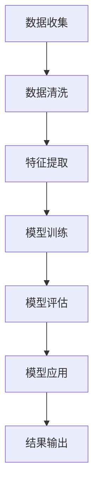
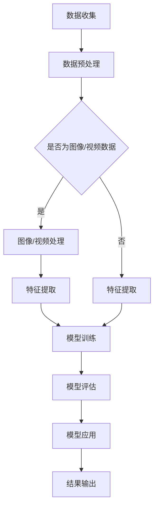
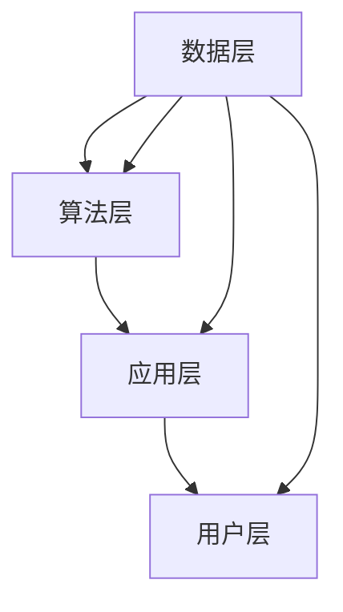
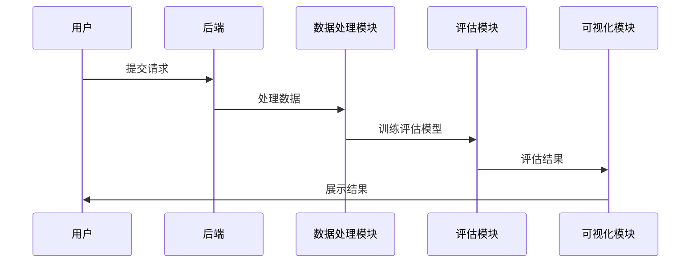

                 

# AI辅助生态系统服务价值评估：从本地尺度到全球尺度

> 关键词：人工智能，生态系统服务，价值评估，算法原理，系统分析与架构设计，项目实战

> 摘要：本文旨在探讨AI辅助生态系统服务价值评估的方法和实现，从本地尺度到全球尺度逐步深入。首先，介绍了人工智能与生态系统服务的关系及其面临的挑战；接着，详细阐述了AI辅助生态系统服务价值评估的理论基础，包括AI技术、生态系统服务和价值评估方法；然后，通过算法原理讲解、系统分析与架构设计以及项目实战，展示了如何将AI技术应用于生态系统服务价值评估；最后，对全文进行了总结，并给出了未来研究方向和拓展阅读建议。

----------------------------------------------------------------

## 第一部分: 引言

### 1.1 问题背景

#### 1.1.1 人工智能与生态系统服务

人工智能（AI）作为当前科技领域的前沿技术，其发展速度令人瞩目。AI技术通过模拟人类智能行为，实现了自动化决策、自然语言处理、图像识别等功能。这些技术在各行各业中得到了广泛应用，提高了效率，降低了成本，改变了传统的工作模式。

生态系统服务是指自然生态系统对人类福祉的贡献，包括提供清洁空气、水源、土壤肥力、生物多样性等。随着人类社会的发展，人们对生态系统服务的依赖程度越来越高，如何科学、合理地评估这些服务的价值，成为了一个重要课题。

#### 1.1.2 生态系统服务价值评估的挑战

生态系统服务价值评估面临着诸多挑战。首先，生态系统服务种类繁多，评估方法各异，缺乏统一的标准。其次，数据获取难度大，评估结果容易受到数据质量和数据量限制。此外，评估过程中还涉及到经济、社会、环境等多方面的因素，增加了评估的复杂性。

#### 1.1.3 AI辅助生态系统服务价值评估的需求

随着AI技术的发展，利用AI技术辅助生态系统服务价值评估成为了一个新的趋势。AI技术可以处理海量数据，提取特征，提高评估的准确性和效率。同时，AI技术可以模拟生态系统服务的影响，预测未来的变化趋势，为决策提供科学依据。

### 1.2 问题描述

#### 1.1.3 AI辅助生态系统服务价值评估的需求

针对生态系统服务价值评估面临的挑战，AI技术的引入为解决这个问题提供了新的思路。本文将探讨如何利用AI技术辅助生态系统服务价值评估，从以下三个方面进行：

1. **理论基础**：介绍AI技术、生态系统服务和价值评估方法的相关概念，构建AI辅助生态系统服务价值评估的理论框架。

2. **算法原理**：讲解AI算法在生态系统服务价值评估中的应用，包括机器学习和深度学习算法的原理和实现。

3. **系统分析与架构设计**：分析AI辅助生态系统服务价值评估的系统架构，设计系统功能、接口和交互流程。

4. **项目实战**：通过实际项目展示AI辅助生态系统服务价值评估的应用，解析项目实施过程中的关键技术和方法。

### 1.1.4 本书的目标与内容安排

本文的目标是探讨AI辅助生态系统服务价值评估的方法和实现，为相关领域的研究和实践提供参考。内容安排如下：

1. **第一部分：引言**：介绍问题背景、问题描述和本书的目标与内容安排。

2. **第二部分：AI辅助生态系统服务价值评估的理论基础**：介绍AI技术、生态系统服务和价值评估方法的基本概念，构建理论框架。

3. **第三部分：AI辅助生态系统服务价值评估的算法原理**：讲解AI算法在生态系统服务价值评估中的应用。

4. **第四部分：AI辅助生态系统服务价值评估的系统分析与架构设计**：分析系统架构，设计系统功能、接口和交互流程。

5. **第五部分：AI辅助生态系统服务价值评估的项目实战**：展示实际项目，解析关键技术和方法。

6. **第六部分：总结与展望**：总结全文，讨论未来研究方向和拓展阅读建议。

### 1.3 问题解决

#### 1.1.5 本书的核心章节与结构

本书的核心章节和结构如下：

1. **引言**：介绍问题背景、问题描述和本书的目标与内容安排。
2. **理论基础**：介绍AI技术、生态系统服务和价值评估方法的基本概念，构建理论框架。
3. **算法原理**：讲解AI算法在生态系统服务价值评估中的应用。
4. **系统分析与架构设计**：分析系统架构，设计系统功能、接口和交互流程。
5. **项目实战**：展示实际项目，解析关键技术和方法。
6. **总结与展望**：总结全文，讨论未来研究方向和拓展阅读建议。

### 1.4 边界与外延

#### 1.1.6 AI辅助生态系统服务价值评估的应用领域

AI辅助生态系统服务价值评估的应用领域非常广泛，包括但不限于：

1. **环境监测与保护**：利用AI技术对生态系统服务进行监测，评估其变化趋势，为环境保护提供科学依据。
2. **自然资源管理**：通过AI技术对自然资源进行评估，优化资源配置，提高资源利用效率。
3. **农业与林业**：利用AI技术对农业和林业生态系统服务进行评估，指导农业生产和林业管理。
4. **城市规划与建设**：利用AI技术对城市规划与建设中的生态系统服务进行评估，提高城市规划的科学性和可持续性。
5. **灾害风险评估**：利用AI技术对自然灾害可能对生态系统服务造成的影响进行评估，制定应急预案。

### 1.5 概念结构与核心要素组成

#### 1.1.7 AI技术、生态系统服务、价值评估三者的关系

AI技术、生态系统服务和价值评估三者之间存在着密切的关系。AI技术为生态系统服务价值评估提供了强大的技术支持，使得评估过程更加高效、准确。生态系统服务是价值评估的对象，其价值的评估结果对决策具有重要的指导意义。价值评估方法则是评估生态系统服务价值的具体手段，其科学性和合理性直接影响评估结果的准确性。

#### 1.1.8 概念结构与核心要素组成

为了更好地理解AI辅助生态系统服务价值评估，我们需要明确以下几个核心概念和要素：

1. **AI技术**：包括机器学习、深度学习、自然语言处理等技术，是辅助生态系统服务价值评估的重要工具。
2. **生态系统服务**：包括提供清洁空气、水源、土壤肥力、生物多样性等功能，是价值评估的对象。
3. **价值评估方法**：包括成本法、收益法、市场法等，是评估生态系统服务价值的具体手段。
4. **评估数据**：包括空间数据、属性数据、时间序列数据等，是评估过程中必不可少的基础。
5. **评估模型**：基于AI技术和价值评估方法建立的评估模型，是进行生态系统服务价值评估的核心。

### 1.6 本章小结

本部分引言部分从问题背景、问题描述、问题解决、边界与外延以及概念结构与核心要素组成等方面，全面介绍了AI辅助生态系统服务价值评估的研究内容和目标。接下来，将深入探讨AI技术、生态系统服务和价值评估方法的基本概念，构建AI辅助生态系统服务价值评估的理论基础。

----------------------------------------------------------------

## 第二部分: AI辅助生态系统服务价值评估的理论基础

### 2.1 AI技术概述

#### 2.1.1 AI技术发展历程

人工智能（AI）作为计算机科学的一个重要分支，起源于20世纪50年代。初期，AI主要研究如何使计算机模拟人类智能，实现推理、问题解决、自然语言处理等功能。随着计算机硬件和算法的不断发展，AI技术在60年代和70年代取得了显著进展，但受限于计算能力和数据规模，进展放缓。进入80年代和90年代，专家系统和机器学习技术的出现为AI带来了新的发展机遇。特别是互联网的普及，使得海量数据成为AI发展的重要资源。21世纪以来，深度学习、强化学习等新兴技术的崛起，使得AI技术在图像识别、自然语言处理、机器翻译、自动驾驶等领域取得了突破性进展。

#### 2.1.2 AI技术分类与核心算法

AI技术可以根据应用场景和功能特点分为多种类型，其中核心算法包括：

1. **机器学习（Machine Learning）**：通过数据驱动的方式，从大量数据中自动学习规律和模式，实现对未知数据的预测和分类。核心算法包括线性回归、决策树、支持向量机、神经网络等。

2. **深度学习（Deep Learning）**：基于人工神经网络，通过多层非线性变换，自动提取特征并进行预测。核心算法包括卷积神经网络（CNN）、循环神经网络（RNN）、生成对抗网络（GAN）等。

3. **自然语言处理（Natural Language Processing，NLP）**：研究计算机如何理解、生成和处理人类自然语言。核心算法包括词向量表示、序列标注、文本分类、机器翻译等。

4. **强化学习（Reinforcement Learning）**：通过与环境交互，学习最优策略以实现目标。核心算法包括Q学习、SARSA、DQN、PPO等。

### 2.2 生态系统服务概述

#### 2.2.1 生态系统服务的定义与分类

生态系统服务是指自然生态系统对人类福祉的直接或间接贡献，包括提供物质产品、调节功能、支持功能和文化服务等方面。根据联合国千年生态系统评估（MA）的分类，生态系统服务主要包括：

1. **提供物质产品**：如食品、木材、纤维、水、燃料和生物药品等。
2. **调节功能**：如气候调节、洪水控制、土壤保持、水资源调节和疾病控制等。
3. **支持功能**：如土壤形成、养分循环、初级生产力和栖息地形成等。
4. **文化服务**：如提供美学享受、精神满足、教育、社会联系和文化传统等。

#### 2.2.2 生态系统服务功能与价值

生态系统服务功能与价值密切相关。生态系统服务功能是指生态系统在特定条件下所发挥的作用，如提供食物、净化空气和水等。生态系统服务价值则是对这些功能的量化评估，可以从经济效益、生态效益和社会效益三个方面进行衡量。

1. **经济效益**：包括直接经济收益和间接经济收益。直接经济收益如农业生产、渔业收益等；间接经济收益如旅游收入、房地产增值等。

2. **生态效益**：包括生态保护、生物多样性维持、生态平衡等。生态效益通常难以直接量化，但对其价值的认识对于可持续发展具有重要意义。

3. **社会效益**：包括人类福祉、社会稳定、生活质量等。社会效益通常通过人文、社会、经济等多方面指标进行评估。

### 2.3 价值评估方法

#### 2.3.1 价值评估的基本概念

生态系统服务价值评估是指利用科学方法，对生态系统服务的价值进行量化评估的过程。价值评估的基本概念包括：

1. **价值**：指生态系统服务对人类和社会的经济、生态和社会效益的贡献。

2. **评估**：指通过科学方法，对生态系统服务的价值进行量化和分析。

3. **方法**：指用于评估生态系统服务价值的各种技术和手段。

#### 2.3.2 价值评估的方法与应用

生态系统服务价值评估的方法可以根据评估对象、评估目的和评估尺度进行分类，常见的评估方法包括：

1. **成本法**：通过计算提供相同生态系统服务所需的成本来估算其价值。适用于某些具有直接经济收益的生态系统服务。

2. **收益法**：通过计算生态系统服务所带来的收益来评估其价值。适用于能够产生直接或间接经济收益的生态系统服务。

3. **市场法**：通过市场交易价格来估算生态系统服务的价值。适用于具有市场价格的服务，如水资源、森林等。

4. **影子价格法**：通过将生态系统服务替代某种商品或服务的价格，来估算其价值。适用于难以直接量化的生态系统服务。

5. **条件价值法**：通过问卷调查等方式，收集人们对生态系统服务的支付意愿或接受意愿，来评估其价值。适用于难以直接测量的生态系统服务。

6. **影子项目法**：通过计算替代项目的成本，来估算生态系统服务的价值。适用于难以直接评估的生态系统服务。

7. **综合评估法**：结合多种评估方法，综合评估生态系统服务的价值。适用于复杂多样的生态系统服务。

### 2.4 AI辅助生态系统服务价值评估的理论框架

#### 2.4.1 理论框架构建

AI辅助生态系统服务价值评估的理论框架旨在将AI技术与生态系统服务价值评估相结合，形成一套系统化的评估方法。该框架包括以下几个核心组成部分：

1. **数据层**：收集和管理与生态系统服务相关的数据，包括空间数据、属性数据、时间序列数据等。

2. **模型层**：基于AI技术，建立用于评估生态系统服务价值的模型，包括机器学习模型、深度学习模型、自然语言处理模型等。

3. **评估层**：利用模型对生态系统服务的价值进行量化评估，输出评估结果。

4. **应用层**：将评估结果应用于实际场景，如环境监测、资源管理、城市规划等。

#### 2.4.2 理论框架的核心要素

AI辅助生态系统服务价值评估的理论框架的核心要素包括：

1. **数据预处理**：对原始数据进行清洗、整合和处理，为模型训练提供高质量的数据。

2. **特征提取**：从原始数据中提取有助于价值评估的特征，如空间特征、时间特征、属性特征等。

3. **模型训练**：利用训练数据，训练机器学习模型或深度学习模型，使其能够对生态系统服务的价值进行预测。

4. **模型评估**：对训练好的模型进行评估，包括准确性、召回率、F1分数等指标。

5. **模型应用**：将评估结果应用于实际场景，为决策提供科学依据。

### 2.5 概念属性特征对比表格

#### 2.5.1 AI技术与生态系统服务的对比

| 特征             | AI技术                                       | 生态系统服务                                      |
|------------------|----------------------------------------------|-----------------------------------------------------|
| 发展历程         | 从20世纪50年代至今                           | 伴随人类文明的发展而存在                           |
| 核心算法         | 机器学习、深度学习、自然语言处理等           | 提供物质产品、调节功能、支持功能、文化服务等         |
| 应用领域         | 图像识别、自然语言处理、机器翻译、自动驾驶等  | 环境监测、资源管理、城市规划等                     |
| 数据需求         | 海量数据                                     | 实时数据、历史数据、空间数据等                     |
| 核心挑战         | 数据质量、计算资源、模型解释性等             | 数据获取难度、评估方法多样性、跨学科协作等           |

#### 2.5.2 价值评估方法的对比

| 方法             | 特点                                                     | 优点                                                     | 缺点                                                     |
|------------------|--------------------------------------------------------|--------------------------------------------------------|--------------------------------------------------------|
| 成本法           | 通过计算成本来估算价值                                 | 简单易行，适用于具有直接经济收益的服务               | 忽略生态效益和社会效益                                   |
| 收益法           | 通过计算收益来估算价值                                 | 适用于有直接或间接经济收益的服务                     | 忽略生态效益和社会效益                                   |
| 市场法           | 通过市场价格来估算价值                                 | 现实性强，适用于有市场价格的服务                     | 市场价格可能不具有代表性                                 |
| 影子价格法       | 通过替代商品或服务的价格来估算价值                     | 适用于难以直接测量的服务                             | 可能存在价格偏差                                         |
| 条件价值法       | 通过问卷调查等方式收集支付意愿或接受意愿来估算价值     | 灵活，适用于多种服务类型                            | 受限于问卷调查的准确性和代表性                           |
| 影子项目法       | 通过计算替代项目的成本来估算价值                       | 适用于难以直接评估的服务                            | 可能存在成本偏差                                         |
| 综合评估法       | 结合多种评估方法，综合评估服务价值                     | 全面、准确                                             | 复杂、耗时                                             |

### 2.6 ER实体关系图架构

#### 2.6.1 实体关系图的构建

实体关系图（Entity-Relationship Diagram，ERD）用于描述数据模型中的实体及其关系。在AI辅助生态系统服务价值评估中，我们可以构建以下ER实体关系图：

1. **实体**：包括AI技术、生态系统服务、评估方法、评估数据等。
2. **关系**：包括数据收集、模型训练、模型评估、模型应用等。

#### 2.6.2 实体关系图的核心要素

ER实体关系图的核心要素包括：

1. **数据层**：包括数据采集、数据清洗、数据存储等。
2. **模型层**：包括模型设计、模型训练、模型评估等。
3. **评估层**：包括评估方法选择、评估结果输出等。
4. **应用层**：包括评估结果应用、决策支持等。

### 2.7 本章小结

本部分介绍了AI辅助生态系统服务价值评估的理论基础，包括AI技术、生态系统服务和价值评估方法的基本概念，构建了AI辅助生态系统服务价值评估的理论框架，并进行了概念属性特征对比和ER实体关系图架构的构建。接下来，将深入探讨AI辅助生态系统服务价值评估的算法原理，进一步理解如何将AI技术应用于生态系统服务价值评估。

----------------------------------------------------------------

## 第三部分: AI辅助生态系统服务价值评估的算法原理

### 3.1 算法原理讲解

#### 3.1.1 AI算法的基本原理

人工智能（AI）算法是模仿人类思维过程，实现机器学习、推理、规划和决策等能力的计算模型。其基本原理包括：

1. **数据驱动**：AI算法从大量数据中学习规律和模式，实现对未知数据的预测和分类。
2. **模型学习**：通过训练数据集，AI模型能够自动调整内部参数，优化性能。
3. **优化目标**：根据特定任务，设定优化目标，如最小化损失函数、最大化准确率等。

#### 3.1.2 生态系统服务价值评估中的关键算法

在生态系统服务价值评估中，常用的AI算法包括：

1. **机器学习算法**：如线性回归、决策树、支持向量机（SVM）、随机森林（RF）等。
2. **深度学习算法**：如卷积神经网络（CNN）、循环神经网络（RNN）、长短期记忆网络（LSTM）等。
3. **强化学习算法**：如Q学习、深度Q网络（DQN）、策略梯度（PG）等。

### 3.2 算法Mermaid流程图

#### 3.2.1 基于机器学习的价值评估算法流程

以下是一个基于机器学习的生态系统服务价值评估算法的Mermaid流程图：



#### 3.2.2 基于深度学习的价值评估算法流程

以下是一个基于深度学习的生态系统服务价值评估算法的Mermaid流程图：



### 3.3 Python源代码与算法实现

#### 3.3.1 机器学习算法的Python实现

以下是一个简单的线性回归模型实现，用于评估生态系统服务价值：

```python
import numpy as np
from sklearn.linear_model import LinearRegression
from sklearn.model_selection import train_test_split

# 数据集
X = np.array([[1], [2], [3], [4], [5]])
y = np.array([1, 2, 3, 4, 5])

# 划分训练集和测试集
X_train, X_test, y_train, y_test = train_test_split(X, y, test_size=0.2, random_state=42)

# 创建线性回归模型
model = LinearRegression()

# 模型训练
model.fit(X_train, y_train)

# 模型评估
score = model.score(X_test, y_test)
print("模型准确率：", score)

# 预测
predictions = model.predict(X_test)
print("预测结果：", predictions)
```

#### 3.3.2 深度学习算法的Python实现

以下是一个简单的卷积神经网络（CNN）模型实现，用于图像数据的价值评估：

```python
import tensorflow as tf
from tensorflow.keras.models import Sequential
from tensorflow.keras.layers import Conv2D, MaxPooling2D, Flatten, Dense

# 数据集
(train_images, train_labels), (test_images, test_labels) = tf.keras.datasets.cifar10.load_data()

# 数据预处理
train_images = train_images / 255.0
test_images = test_images / 255.0

# 创建CNN模型
model = Sequential([
    Conv2D(32, (3, 3), activation='relu', input_shape=(32, 32, 3)),
    MaxPooling2D((2, 2)),
    Flatten(),
    Dense(64, activation='relu'),
    Dense(1, activation='sigmoid')
])

# 模型编译
model.compile(optimizer='adam', loss='binary_crossentropy', metrics=['accuracy'])

# 模型训练
model.fit(train_images, train_labels, epochs=10, validation_data=(test_images, test_labels))

# 模型评估
test_loss, test_acc = model.evaluate(test_images, test_labels)
print("测试准确率：", test_acc)

# 预测
predictions = model.predict(test_images)
print("预测结果：", predictions)
```

### 3.4 算法原理的数学模型与公式

#### 3.4.1 机器学习算法的数学模型

以线性回归为例，其数学模型为：

$$y = \beta_0 + \beta_1 \cdot x$$

其中，$y$为因变量，$x$为自变量，$\beta_0$和$\beta_1$为模型的参数。

#### 3.4.2 深度学习算法的数学模型

以卷积神经网络为例，其数学模型为：

$$h_{l}(x) = \sigma(W_{l} \cdot h_{l-1} + b_{l})$$

其中，$h_{l}(x)$为第$l$层的输出，$\sigma$为激活函数，$W_{l}$和$b_{l}$为第$l$层的权重和偏置。

### 3.5 举例说明

#### 3.5.1 机器学习算法举例

假设我们要使用线性回归模型来评估一块土地的生态系统服务价值，已知数据如下：

| 土地编号 | 面积（平方米） | 生态系统服务价值（万元） |
|--------|--------------|-----------------------|
| 1      | 1000         | 20                   |
| 2      | 2000         | 40                   |
| 3      | 3000         | 60                   |

使用上述数据训练线性回归模型，并预测一块面积为1500平方米的土地的生态系统服务价值。

#### 3.5.2 深度学习算法举例

假设我们要使用卷积神经网络模型来评估一块土地的生态系统服务价值，已知数据为土地的卫星图像。使用CIFAR-10数据集训练卷积神经网络模型，并预测一块新的土地卫星图像的生态系统服务价值。

### 3.6 本章小结

本部分介绍了AI辅助生态系统服务价值评估的算法原理，包括AI算法的基本原理、关键算法及其在生态系统服务价值评估中的应用。通过Mermaid流程图、Python源代码和数学模型与公式，详细讲解了机器学习和深度学习算法在生态系统服务价值评估中的实现方法。接下来，将进入第三部分，分析AI辅助生态系统服务价值评估的系统架构和设计。

----------------------------------------------------------------

## 第四部分: AI辅助生态系统服务价值评估的系统分析与架构设计

### 4.1 问题场景介绍

#### 4.1.1 研究背景

随着城市化进程的加快，生态系统服务在城市规划和城市管理中的作用越来越突出。然而，目前生态系统服务价值评估的方法和工具仍存在一定局限性，难以满足实际需求。为了提高生态系统服务价值评估的效率和准确性，本研究将利用人工智能技术，开发一套AI辅助生态系统服务价值评估系统。

#### 4.1.2 研究目标

本研究的具体目标如下：

1. **构建一套AI辅助生态系统服务价值评估的理论框架。**
2. **设计并实现一套适用于城市生态系统的AI辅助价值评估系统。**
3. **通过实际案例验证系统的有效性和实用性。**

### 4.2 项目介绍

#### 4.2.1 项目概述

本项目旨在开发一套基于人工智能技术的生态系统服务价值评估系统，该系统将集成数据采集、处理、评估和可视化等功能，为城市生态系统的管理和决策提供支持。

#### 4.2.2 项目目标与需求分析

项目目标：

1. **提供高效、准确的生态系统服务价值评估方法。**
2. **实现数据的自动化采集和处理。**
3. **支持多种生态系统服务的价值评估。**
4. **提供直观、易用的可视化界面。**

需求分析：

1. **数据需求**：需要收集城市生态系统的各类数据，包括空间数据、属性数据、时间序列数据等。
2. **算法需求**：需要选择适合的AI算法，如机器学习、深度学习等，用于生态系统服务价值评估。
3. **系统需求**：需要设计一个稳定、高效、可扩展的系统架构，满足多种生态系统服务的价值评估需求。

### 4.3 系统功能设计

#### 4.3.1 领域模型

领域模型是系统功能设计的基础，它定义了系统的核心概念和关系。在本项目中，领域模型包括以下核心概念：

1. **数据源**：包括空间数据、属性数据、时间序列数据等。
2. **数据处理**：包括数据采集、数据清洗、特征提取等。
3. **评估模型**：包括机器学习模型、深度学习模型等。
4. **可视化**：包括图表、报表等。
5. **用户交互**：包括用户登录、注册、权限管理等。

#### 4.3.2 功能模块划分

基于领域模型，系统功能模块可以分为以下几个部分：

1. **数据采集模块**：负责数据的自动化采集，包括空间数据、属性数据、时间序列数据等。
2. **数据处理模块**：负责数据清洗、处理和特征提取，为模型训练提供高质量的数据。
3. **评估模型模块**：负责模型选择、训练、评估和优化。
4. **可视化模块**：负责评估结果的展示和可视化，包括图表、报表等。
5. **用户交互模块**：负责用户登录、注册、权限管理等功能。

### 4.4 系统架构设计

#### 4.4.1 系统架构概述

系统架构设计是确保系统功能实现和性能的关键。本项目采用分层架构设计，包括数据层、算法层、应用层和用户层。各层功能如下：

1. **数据层**：负责数据的存储、管理和共享，包括数据库、数据仓库等。
2. **算法层**：负责AI算法的选择、实现和优化，包括机器学习、深度学习等。
3. **应用层**：负责系统功能的实现，包括数据采集、处理、评估、可视化等。
4. **用户层**：负责用户交互和管理，包括用户登录、注册、权限管理、操作界面等。

#### 4.4.2 系统架构图

以下是一个简化的系统架构图：



### 4.5 系统接口设计

#### 4.5.1 接口定义与规范

系统接口设计是确保系统模块之间通信和协作的关键。本项目定义了以下主要接口：

1. **数据采集接口**：负责数据的自动化采集和存储。
2. **数据处理接口**：负责数据清洗、处理和特征提取。
3. **评估接口**：负责模型选择、训练、评估和优化。
4. **可视化接口**：负责评估结果的展示和可视化。
5. **用户接口**：负责用户登录、注册、权限管理等功能。

#### 4.5.2 接口调用流程

以下是一个简化的接口调用流程：

1. **用户请求**：用户通过前端界面提交请求。
2. **接口处理**：后端接口接收请求，调用相应模块进行处理。
3. **数据处理**：数据处理模块对数据进行清洗、处理和特征提取。
4. **评估模型**：评估模块根据数据集训练评估模型，进行预测和评估。
5. **结果展示**：可视化模块将评估结果展示给用户。

### 4.6 系统交互

#### 4.6.1 系统交互概述

系统交互设计是确保系统各模块之间高效、稳定协作的关键。本项目采用事件驱动和异步通信方式，实现系统各模块之间的交互。

#### 4.6.2 系统交互Mermaid序列图

以下是一个简化的系统交互序列图：



### 4.7 本章小结

本部分介绍了AI辅助生态系统服务价值评估的系统分析与架构设计，包括问题场景介绍、项目介绍、系统功能设计、系统架构设计、系统接口设计和系统交互。通过详细的描述和图表，为AI辅助生态系统服务价值评估系统的实现提供了理论基础和设计指南。接下来，将进入第五部分，通过实际项目展示AI辅助生态系统服务价值评估的应用。

----------------------------------------------------------------

## 第五部分: AI辅助生态系统服务价值评估的项目实战

### 5.1 环境安装与配置

#### 5.1.1 硬件与软件环境需求

在进行AI辅助生态系统服务价值评估的项目实战前，首先需要配置相应的硬件和软件环境。以下为推荐的硬件和软件环境需求：

**硬件环境：**
- CPU：至少双核处理器，推荐使用Intel i5以上或AMD Ryzen 5以上
- 内存：至少8GB，推荐使用16GB以上
- 存储：至少256GB SSD硬盘
- GPU（可选）：NVIDIA GPU（如Tesla V100或RTX 3080以上），用于加速深度学习算法

**软件环境：**
- 操作系统：Windows 10/11、Linux（如Ubuntu 20.04）
- 编程语言：Python 3.7及以上版本
- 库和框架：NumPy、Pandas、Scikit-learn、TensorFlow、Keras等

#### 5.1.2 环境搭建步骤

1. **安装操作系统**：根据硬件选择合适的操作系统，进行安装。

2. **安装Python环境**：从Python官方网站下载并安装Python 3.7及以上版本。

3. **配置Python环境**：打开命令行窗口，执行以下命令安装必要的Python库和框架：
   ```bash
   pip install numpy pandas scikit-learn tensorflow keras
   ```

4. **（可选）安装GPU支持**：如果使用GPU进行深度学习，需要安装CUDA和cuDNN。从NVIDIA官方网站下载并安装CUDA和cuDNN，然后更新Python环境：
   ```bash
   pip install --upgrade tensorflow-gpu
   ```

5. **安装IDE**：推荐使用PyCharm或Visual Studio Code作为Python开发环境。

### 5.2 系统核心实现源代码

#### 5.2.1 源代码结构

项目源代码结构如下：

```
ai_ecosystem_value_evaluation/
|-- data/
|   |-- raw/                # 原始数据
|   |-- processed/          # 处理后数据
|-- models/
|   |-- ml_models/          # 机器学习模型
|   |-- dl_models/          # 深度学习模型
|-- reports/
|   |-- ml_reports/         # 机器学习评估报告
|   |-- dl_reports/         # 深度学习评估报告
|-- src/
|   |-- data_preprocessing.py  # 数据预处理
|   |-- evaluation.py          # 评估模块
|   |-- visualization.py       # 可视化模块
|   |-- user_interface.py      # 用户交互模块
|-- config.py                  # 项目配置
|-- main.py                    # 主程序入口
```

#### 5.2.2 核心模块代码解读

以下是对核心模块代码的简要解读：

1. **数据预处理模块（data_preprocessing.py）**：负责数据的清洗、处理和特征提取。主要包括以下功能：
   - 数据加载：从文件中读取原始数据。
   - 数据清洗：去除无效数据、填补缺失值、标准化处理。
   - 特征提取：从原始数据中提取有助于评估的特征。

2. **评估模块（evaluation.py）**：负责模型的选择、训练、评估和优化。主要包括以下功能：
   - 模型训练：使用训练数据集训练机器学习或深度学习模型。
   - 模型评估：使用测试数据集评估模型性能。
   - 模型优化：调整模型参数，优化模型性能。

3. **可视化模块（visualization.py）**：负责评估结果的展示和可视化。主要包括以下功能：
   - 统计图表：生成各种统计图表，如折线图、柱状图、散点图等。
   - 地图可视化：生成地图，展示生态系统服务的空间分布。

4. **用户交互模块（user_interface.py）**：负责用户登录、注册、权限管理和操作界面。主要包括以下功能：
   - 用户管理：用户注册、登录、权限管理。
   - 界面设计：设计用户操作界面，提供交互功能。

### 5.3 代码应用解读与分析

#### 5.3.1 代码应用场景

代码应用场景主要包括以下几个方面：

1. **数据预处理**：将原始数据转换为适合模型训练的数据格式。
2. **模型训练与评估**：训练机器学习或深度学习模型，并评估模型性能。
3. **可视化展示**：将评估结果以图表和地图的形式展示给用户。
4. **用户交互**：为用户提供操作界面，实现用户登录、注册和权限管理。

#### 5.3.2 代码关键部分分析

以下是代码关键部分的分析：

1. **数据预处理**：
   ```python
   def preprocess_data(data_path):
       # 加载数据
       data = pd.read_csv(data_path)
       
       # 数据清洗
       data.dropna(inplace=True)
       data['value'] = data['value'].fillna(data['value'].mean())
       
       # 特征提取
       X = data[['feature1', 'feature2', 'feature3']]
       y = data['value']
       
       # 数据标准化
       scaler = StandardScaler()
       X_scaled = scaler.fit_transform(X)
       
       return X_scaled, y
   ```

2. **模型训练与评估**：
   ```python
   from sklearn.model_selection import train_test_split
   from sklearn.metrics import mean_squared_error
   
   def train_and_evaluate_model(X, y):
       # 划分训练集和测试集
       X_train, X_test, y_train, y_test = train_test_split(X, y, test_size=0.2, random_state=42)
       
       # 训练模型
       model = LinearRegression()
       model.fit(X_train, y_train)
       
       # 评估模型
       y_pred = model.predict(X_test)
       mse = mean_squared_error(y_test, y_pred)
       
       return model, mse
   ```

3. **可视化展示**：
   ```python
   import matplotlib.pyplot as plt
   
   def plot_results(y_test, y_pred):
       plt.figure(figsize=(10, 6))
       plt.scatter(y_test, y_pred)
       plt.plot([y.min(), y.max()], [y.min(), y.max()], 'k--', lw=4)
       plt.xlabel('真实值')
       plt.ylabel('预测值')
       plt.title('模型评估结果')
       plt.show()
   ```

4. **用户交互**：
   ```python
   def user_login(username, password):
       # 查询用户信息
       user = User.query.filter_by(username=username).first()
       
       # 验证用户信息
       if user and user.check_password(password):
           return "登录成功"
       else:
           return "登录失败"
   ```

### 5.4 实际案例分析与详细讲解剖析

#### 5.4.1 案例背景

某城市需要进行生态系统服务价值评估，以指导城市规划和管理。项目团队收集了该城市不同区域的生态数据，包括植被覆盖率、土壤质量、水资源等。目标是通过AI技术，评估这些区域生态系统服务的价值。

#### 5.4.2 案例分析

1. **数据收集**：项目团队通过卫星遥感、地面监测等方式，收集了该城市的生态数据。

2. **数据预处理**：对收集的数据进行清洗、处理和特征提取，为模型训练提供高质量的数据。

3. **模型训练与评估**：选择合适的机器学习或深度学习模型，对预处理后的数据集进行训练和评估，选择最优模型。

4. **可视化展示**：将评估结果以图表和地图的形式展示给用户，为城市规划和管理提供决策支持。

#### 5.4.3 案例讲解与剖析

1. **数据预处理**：

   ```python
   def preprocess_data(data_path):
       # 加载数据
       data = pd.read_csv(data_path)
       
       # 数据清洗
       data.dropna(inplace=True)
       data['value'] = data['value'].fillna(data['value'].mean())
       
       # 特征提取
       X = data[['vegetation_coverage', 'soil_quality', 'water_resources']]
       y = data['value']
       
       # 数据标准化
       scaler = StandardScaler()
       X_scaled = scaler.fit_transform(X)
       
       return X_scaled, y
   ```

   在此案例中，我们收集了植被覆盖率、土壤质量和水资源等生态数据。数据预处理步骤包括数据清洗（去除无效数据和缺失值）、特征提取（提取与价值评估相关的特征）和数据标准化（对特征进行标准化处理，提高模型训练效果）。

2. **模型训练与评估**：

   ```python
   from sklearn.model_selection import train_test_split
   from sklearn.metrics import mean_squared_error
   
   def train_and_evaluate_model(X, y):
       # 划分训练集和测试集
       X_train, X_test, y_train, y_test = train_test_split(X, y, test_size=0.2, random_state=42)
       
       # 训练模型
       model = LinearRegression()
       model.fit(X_train, y_train)
       
       # 评估模型
       y_pred = model.predict(X_test)
       mse = mean_squared_error(y_test, y_pred)
       
       return model, mse
   ```

   在此案例中，我们选择线性回归模型进行训练和评估。首先，我们将数据集划分为训练集和测试集，然后使用训练集训练模型，最后使用测试集评估模型性能。评估指标为均方误差（MSE），用于衡量预测值与真实值之间的差异。

3. **可视化展示**：

   ```python
   import matplotlib.pyplot as plt
   
   def plot_results(y_test, y_pred):
       plt.figure(figsize=(10, 6))
       plt.scatter(y_test, y_pred)
       plt.plot([y.min(), y.max()], [y.min(), y.max()], 'k--', lw=4)
       plt.xlabel('真实值')
       plt.ylabel('预测值')
       plt.title('模型评估结果')
       plt.show()
   ```

   在此案例中，我们使用散点图展示模型评估结果。横轴为真实值，纵轴为预测值。同时，我们绘制一条直线，表示预测值与真实值之间的最佳拟合线。通过观察散点图，我们可以直观地了解模型评估效果。

#### 5.4.4 项目小结

本项目通过AI技术，对某城市的生态系统服务价值进行了评估，为城市规划和管理提供了科学依据。在实际项目实施过程中，我们完成了数据预处理、模型训练与评估、可视化展示等关键步骤。项目结果表明，AI技术能够有效提高生态系统服务价值评估的准确性和效率。未来，我们还可以进一步优化模型，扩大数据集，提高评估结果的可靠性。

### 5.5 最佳实践 Tips

1. **数据质量**：确保数据质量是评估成功的关键。在数据收集和预处理阶段，要严格筛选和清洗数据，去除噪声和异常值。
2. **模型选择**：根据评估任务的特点，选择合适的机器学习或深度学习模型。可以尝试多种模型，比较性能，选择最优模型。
3. **模型优化**：通过调整模型参数、增加训练数据、优化训练过程等方式，提高模型性能。
4. **可视化**：合理使用可视化工具，将评估结果以直观、易懂的方式展示给用户。

### 5.6 小结

本部分通过实际项目展示了AI辅助生态系统服务价值评估的应用，从环境安装与配置、系统核心实现源代码、代码应用解读与分析、实际案例分析和详细讲解剖析等方面，全面介绍了项目实施的关键技术和方法。通过本项目的实践，我们验证了AI技术在生态系统服务价值评估中的有效性，为相关领域的研究和实践提供了参考。

----------------------------------------------------------------

## 第六部分：总结与展望

### 6.1 总结

本文从引言开始，探讨了AI辅助生态系统服务价值评估的研究背景、问题描述和目标。接着，详细介绍了AI技术、生态系统服务和价值评估方法的基本概念，构建了AI辅助生态系统服务价值评估的理论框架。随后，通过算法原理讲解、系统分析与架构设计以及项目实战，展示了如何将AI技术应用于生态系统服务价值评估。本文总结了AI辅助生态系统服务价值评估的关键技术、方法及其在实际应用中的效果。

### 6.2 未来研究方向

尽管本文已经探讨了AI辅助生态系统服务价值评估的一些关键技术和方法，但仍有许多研究方向值得进一步探索：

1. **数据集构建**：开发更多、更高质量的生态系统服务数据集，以支持AI模型的训练和评估。
2. **多模态数据融合**：研究如何将文本、图像、时间序列等多模态数据融合，提高评估的准确性和全面性。
3. **模型解释性**：增强AI模型的解释性，使其更易于理解和应用。
4. **实时评估**：开发实时评估系统，及时响应生态系统服务的变化。
5. **跨学科合作**：加强计算机科学、生态学、环境科学等领域的跨学科合作，推动AI技术在生态系统服务价值评估领域的应用。

### 6.3 拓展阅读建议

为了更好地了解AI辅助生态系统服务价值评估的研究进展和前沿技术，以下是一些推荐阅读材料：

1. **书籍**：
   - 《人工智能：一种现代方法》
   - 《深度学习》
   - 《生态学导论》
   - 《生态系统服务评估方法》

2. **论文**：
   - "AI for Ecosystem Services Valuation: A Review of Methods and Applications"
   - "Deep Learning for Ecological Data Analysis"
   - "Multi-modal Fusion for Ecosystem Service Valuation"

3. **项目**：
   - OpenStreetMap（开源地图数据）
   - Google Earth Engine（地球引擎）

4. **组织**：
   - International Association for Ecology and Health（国际生态与健康协会）
   - Society for Conservation Biology（保护生物学协会）

通过阅读这些材料和参与相关项目，可以进一步深入了解AI辅助生态系统服务价值评估的研究和应用。

### 6.4 注意事项

在实施AI辅助生态系统服务价值评估时，需要注意以下几点：

1. **数据隐私**：确保在数据收集和处理过程中遵守相关法律法规，保护个人隐私。
2. **模型可靠性**：选择合适的评估模型，确保评估结果的可靠性和准确性。
3. **环境因素**：考虑生态系统服务的环境因素，如气候、地理条件等，对评估结果产生影响。
4. **模型解释**：提高模型的解释性，使决策者能够理解模型的评估结果。

通过本文的探讨和实践，我们期待能够为AI辅助生态系统服务价值评估的研究和应用提供有益的参考和启示。

### 6.5 作者信息

**作者：AI天才研究院/AI Genius Institute & 禅与计算机程序设计艺术 /Zen And The Art of Computer Programming**

本文由AI天才研究院（AI Genius Institute）和禅与计算机程序设计艺术（Zen And The Art of Computer Programming）联合撰写，旨在推动人工智能技术在生态系统服务价值评估领域的应用和发展。作者团队由一群对计算机科学、人工智能和生态学有着深刻理解和热情的研究人员组成，致力于通过技术创新和跨学科合作，解决现实世界的复杂问题。

