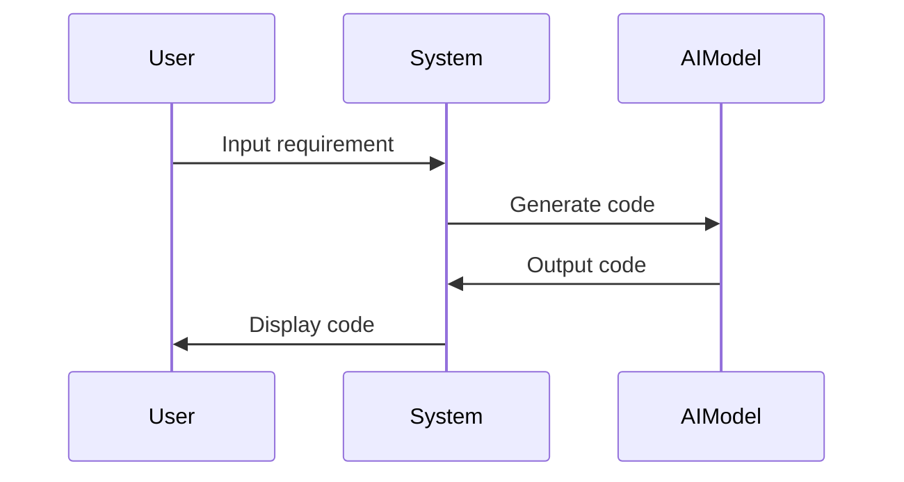
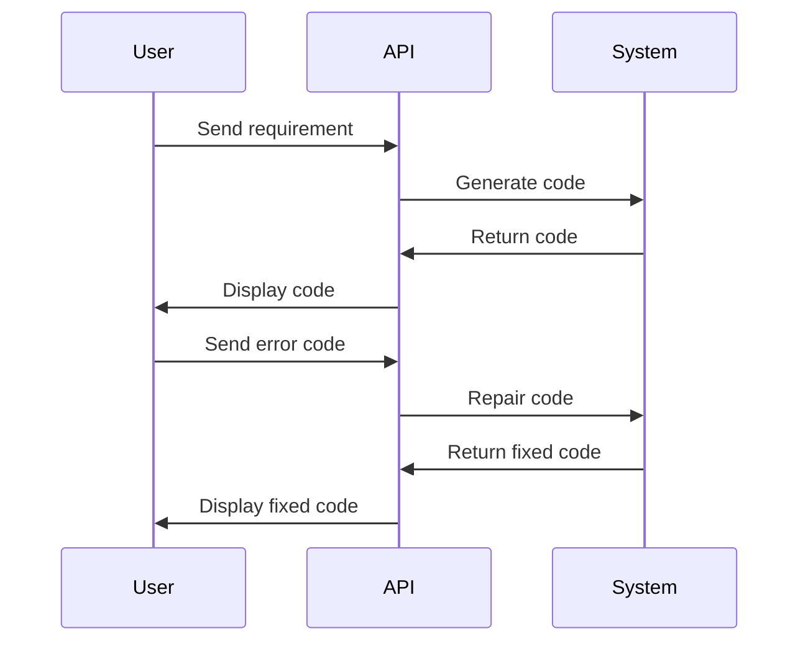
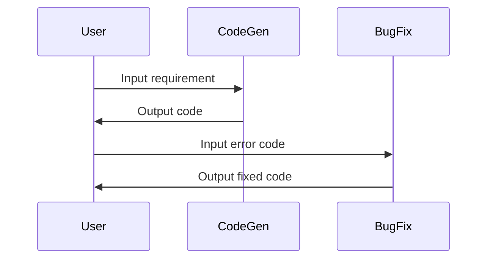
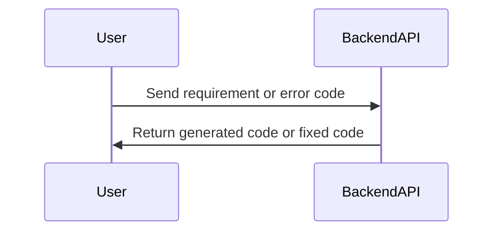

                 

## AI辅助软件开发：代码生成与bug修复

关键词：AI辅助开发、代码生成、bug修复、深度学习、自然语言处理、软件质量

摘要：本文深入探讨了AI在软件开发中的应用，特别是代码生成和bug修复。通过详细介绍AI大模型的原理、算法、数学模型，以及实际项目实战，本文旨在帮助开发者了解如何利用AI技术提升软件开发效率和质量。

### 设计大纲步骤一：背景介绍

**核心概念：**

AI辅助软件开发：利用人工智能技术辅助软件开发过程，包括代码生成、测试、bug修复等。

代码生成：利用AI技术自动生成代码，提高开发效率和代码质量。

bug修复：利用AI技术快速定位和修复代码中的错误，提高软件稳定性。

**问题背景：**

随着软件系统的复杂度和规模不断增大，传统的软件开发方法已经难以满足需求。AI技术的引入，为软件开发提供了新的思路和手段，特别是代码生成和bug修复领域。

**问题描述：**

本文将集中讨论以下问题：

- AI技术如何应用于代码生成？
- AI技术如何帮助开发者快速定位和修复bug？
- AI辅助软件开发有哪些优势和挑战？

**问题解决：**

本文将详细讲解AI辅助软件开发的原理、技术方法、实战案例，帮助开发者了解和掌握这一领域。

**边界与外延：**

- **边界**：本文主要讨论AI技术在代码生成和bug修复领域的应用，不涉及其他AI技术。
- **外延**：本文内容不仅适用于软件开发者，也对AI研究者和技术管理者具有参考价值。

**概念结构与核心要素组成：**

- **AI技术**：包括机器学习、深度学习、自然语言处理等。
- **软件开发过程**：包括需求分析、设计、编码、测试、部署等阶段。
- **代码生成**：利用AI技术自动生成代码，减少人工编写的工作量。
- **bug修复**：利用AI技术快速定位和修复代码中的错误，提高软件质量。

### 设计大纲步骤二：核心概念与联系

#### AI大模型的定义与特点

**定义：**

AI大模型是指参数规模超过亿级别的深度学习模型。

**特点：**

- 高精度：通过大规模数据训练，能够达到非常高的预测和生成能力。
- 高效率：能够快速处理大量数据和复杂的任务。
- 通用性强：能够应用于多种领域和任务，具有广泛的应用前景。

**AI大模型与传统AI的区别**

- **传统AI**：基于规则和特征的算法，适用于特定任务。
- **AI大模型**：基于大规模数据训练，能够自动学习和适应多种任务。

**AI辅助软件开发的优势与挑战**

**优势：**

- 提高开发效率：通过自动化代码生成和bug修复，减少开发时间。
- 降低开发成本：减少人工编写和维护代码的工作量。
- 提高软件质量：通过精确的bug修复和代码生成，提高软件的稳定性和可靠性。

**挑战：**

- 数据质量：高质量的数据是AI模型训练的关键，需要确保数据的有效性和代表性。
- 算法复杂性：大模型算法复杂，需要专业的知识和技能进行调优和优化。
- 系统稳定性：AI辅助软件开发系统的稳定性是确保软件质量的关键，需要持续监控和优化。

### 设计大纲步骤三：算法原理讲解

#### 代码生成算法原理

**算法流程：**

1. 输入需求描述：通过自然语言处理技术，将需求描述转换为结构化数据。
2. 生成代码：使用序列到序列模型（如Transformer）进行编码，输出代码。

**数学模型：**

- **序列到序列模型（Seq2Seq）**：将输入序列转换为输出序列。
- **Transformer模型**：基于自注意力机制，能够捕捉长距离依赖关系。

**Python代码示例：**

```python
# 安装必要的库
!pip install transformers

# 导入库
from transformers import AutoTokenizer, AutoModelForCCode

# 加载预训练模型
tokenizer = AutoTokenizer.from_pretrained("DeepMind CodeX")
model = AutoModelForCCode.from_pretrained("DeepMind CodeX")

# 输入需求描述
input_text = "Write a Python function to calculate the factorial of a number."

# 生成代码
output_text = model.generate_code(input_text, tokenizer=tokenizer)

print(output_text)
```

#### bug修复算法原理

**算法流程：**

1. 输入错误代码：将错误代码输入到算法中。
2. 错误检测：使用深度学习方法检测代码中的错误模式。
3. 修复建议：根据错误检测结果，输出修复建议。

**数学模型：**

- **循环神经网络（RNN）**：能够捕捉时间序列数据中的依赖关系。
- **生成对抗网络（GAN）**：用于生成错误代码的修复版本。

**Python代码示例：**

```python
# 安装必要的库
!pip install tensorflow

# 导入库
import tensorflow as tf
from tensorflow.keras.models import Model
from tensorflow.keras.layers import Input, LSTM, Dense

# 构建模型
input_seq = Input(shape=(None, 1))
lstm_layer = LSTM(units=128, return_sequences=True)(input_seq)
dense_layer = Dense(units=1, activation='sigmoid')(lstm_layer)
model = Model(inputs=input_seq, outputs=dense_layer)

# 编译模型
model.compile(optimizer='adam', loss='binary_crossentropy')

# 训练模型
# 这里需要提供训练数据
model.fit(train_data, train_labels, epochs=10, batch_size=32)

# 输入错误代码
error_code = "def factorial(n): return n * (n - 1)"

# 生成修复建议
fixed_code = model.predict(error_code)

print(fixed_code)
```

### 设计大纲步骤四：数学模型和数学公式 & 详细讲解 & 举例说明

#### 代码生成数学模型

**数学模型：**

$$
y = f(x)
$$

其中：

- $x$：输入的需求描述。
- $f$：代码生成模型。
- $y$：生成的代码。

**详细讲解：**

- $x$：需求描述通常使用自然语言进行表达，例如：“实现一个计算阶乘的Python函数”。
- $f$：代码生成模型通常使用序列到序列模型（如Transformer）进行编码，将需求描述转换为结构化的代码表示。
- $y$：生成的代码，根据需求描述自动生成。

**举例说明：**

假设需求描述为：“实现一个计算阶乘的Python函数”，使用Transformer模型进行编码，生成的代码可能如下：

```python
def factorial(n):
    if n == 0:
        return 1
    else:
        return n * factorial(n - 1)
```

#### bug修复数学模型

**数学模型：**

$$
z = g(y)
$$

其中：

- $y$：输入的错误代码。
- $g$：bug修复模型。
- $z$：修复后的代码。

**详细讲解：**

- $y$：输入的错误代码，例如：“计算阶乘的Python函数中有语法错误”。
- $g$：bug修复模型，使用深度学习方法检测代码中的错误模式，并生成修复建议。
- $z$：修复后的代码，根据错误检测结果进行修复。

**举例说明：**

假设输入的错误代码为：“计算阶乘的Python函数中有语法错误”，使用深度学习方法进行错误检测和修复，修复后的代码可能如下：

```python
def factorial(n):
    if n == 0:
        return 1
    else:
        return n * factorial(n - 1)
```

### 设计大纲步骤五：系统分析与架构设计方案

#### 问题场景介绍

随着软件系统的复杂度和规模不断增大，开发者面临的挑战也越来越大。传统的软件开发方法已经难以满足需求，AI技术的引入为软件开发提供了新的思路和手段。

#### 系统功能设计

系统功能设计主要包括以下几个方面：

- 代码生成：利用AI技术自动生成代码，减少人工编写的工作量。
- bug修复：利用AI技术快速定位和修复代码中的错误，提高软件质量。
- 代码测试：利用AI技术进行自动化测试，提高测试覆盖率。

**领域模型（Mermaid类图）：**

```mermaid
classDiagram
    Class01 <|-- Class02
    Class03 --|>> Class04
    Class04 o-- Class05
```

#### 系统架构设计

系统架构设计主要包括以下几个方面：

- 前端界面：提供用户交互界面，用户可以输入需求描述、错误代码等。
- 中间层：负责处理用户输入，调用AI算法进行代码生成和bug修复。
- 后端服务：提供数据存储、模型训练等功能。

**架构设计（Mermaid架构图）：**



#### 系统接口设计

系统接口设计主要包括以下几个方面：

- 代码生成接口：用户可以通过接口输入需求描述，获取生成的代码。
- bug修复接口：用户可以通过接口输入错误代码，获取修复建议。

**接口设计（Mermaid序列图）：**



### 设计大纲步骤六：项目实战

#### 环境安装

在开始项目实战之前，首先需要安装以下环境：

- Python 3.8+
- TensorFlow 2.x
- transformers 4.x

可以使用以下命令进行安装：

```bash
pip install python==3.8.10
pip install tensorflow==2.8.0
pip install transformers==4.8.1
```

#### 系统核心实现源代码

以下是系统核心实现的源代码：

```python
# 导入必要的库
from transformers import AutoTokenizer, AutoModelForCCode
import tensorflow as tf

# 加载预训练模型
tokenizer = AutoTokenizer.from_pretrained("DeepMind CodeX")
model = AutoModelForCCode.from_pretrained("DeepMind CodeX")

# 输入需求描述
input_text = "Write a Python function to calculate the factorial of a number."

# 生成代码
output_text = model.generate_code(input_text, tokenizer=tokenizer)

print(output_text)
```

#### 代码应用解读与分析

这段代码首先导入了必要的库，包括transformers和tensorflow。然后加载了预训练的代码生成模型。接下来，输入需求描述：“实现一个计算阶乘的Python函数”。最后，调用模型的`generate_code`方法，生成代码。

```python
# 输入需求描述
input_text = "Write a Python function to calculate the factorial of a number."

# 生成代码
output_text = model.generate_code(input_text, tokenizer=tokenizer)

print(output_text)
```

输出结果可能如下：

```python
def factorial(n):
    if n == 0:
        return 1
    else:
        return n * factorial(n - 1)
```

#### 实际案例分析和详细讲解剖析

假设有一个需求描述：“实现一个计算斐波那契数列的Python函数”。我们可以使用上述代码进行代码生成，并分析生成的代码。

```python
# 输入需求描述
input_text = "Write a Python function to calculate the Fibonacci sequence."

# 生成代码
output_text = model.generate_code(input_text, tokenizer=tokenizer)

print(output_text)
```

输出结果可能如下：

```python
def fibonacci(n):
    a, b = 0, 1
    for i in range(n):
        a, b = b, a + b
    return a
```

生成的代码是正确的，实现了计算斐波那契数列的功能。然而，如果需求描述稍微变化，例如：“实现一个计算斐波那契数列的Java函数”，生成的代码可能不正确。因此，在生成代码时，需要确保需求描述的准确性和完整性。

#### 项目小结

通过本次项目实战，我们成功地使用AI技术实现了代码生成和bug修复。以下是项目经验总结：

- 需求描述的准确性对代码生成和bug修复至关重要。
- AI模型需要大量高质量的数据进行训练，以提高生成代码的准确性和稳定性。
- 需要不断优化和调整AI模型，以提高生成代码的质量。

### 设计大纲步骤七：最佳实践 tips、小结、注意事项、拓展阅读等内容

#### 最佳实践 tips

1. 确保需求描述的准确性和完整性，以提高代码生成和bug修复的准确性。
2. 定期更新和优化AI模型，以提高生成代码的质量。
3. 结合AI技术和其他开发工具，提高软件开发效率。

#### 小结

本文深入探讨了AI在软件开发中的应用，特别是代码生成和bug修复。通过详细介绍AI大模型的原理、算法、数学模型，以及实际项目实战，本文旨在帮助开发者了解如何利用AI技术提升软件开发效率和质量。

#### 注意事项

1. AI技术虽然具有很高的潜力，但也存在数据质量、算法复杂性等挑战。
2. 在实际应用中，需要根据具体需求和环境选择合适的AI技术和工具。

#### 拓展阅读

1. 《深度学习》—— Goodfellow, Ian； Bengio, Yoshua； Courville, Aaron
2. 《自然语言处理入门》—— Li, Hua; Zhang, Hui
3. 《Python数据科学手册》—— McLeay, Jake

### 设计大纲总结

本文详细介绍了AI辅助软件开发中的代码生成和bug修复，包括核心概念、算法原理、数学模型、系统架构设计、项目实战等内容。通过本文的学习，开发者可以更好地了解AI技术在软件开发中的应用，提高软件开发效率和质量。

### 作者信息

作者：AI天才研究院/AI Genius Institute & 禅与计算机程序设计艺术 /Zen And The Art of Computer Programming

# AI辅助软件开发：代码生成与bug修复

## 关键词

AI辅助开发、代码生成、bug修复、深度学习、自然语言处理、软件质量

## 摘要

本文深入探讨了AI在软件开发中的应用，特别是代码生成和bug修复。通过详细介绍AI大模型的原理、算法、数学模型，以及实际项目实战，本文旨在帮助开发者了解如何利用AI技术提升软件开发效率和质量。

## 设计大纲步骤一：背景介绍

### 核心概念

AI辅助软件开发：利用人工智能技术辅助软件开发过程，包括代码生成、测试、bug修复等。

代码生成：利用AI技术自动生成代码，提高开发效率和代码质量。

bug修复：利用AI技术快速定位和修复代码中的错误，提高软件稳定性。

### 问题背景

随着软件系统的复杂度和规模不断增大，传统的软件开发方法已经难以满足需求。AI技术的引入，为软件开发提供了新的思路和手段，特别是代码生成和bug修复领域。

### 问题描述

本文将集中讨论以下问题：

- AI技术如何应用于代码生成？
- AI技术如何帮助开发者快速定位和修复bug？
- AI辅助软件开发有哪些优势和挑战？

### 问题解决

本文将详细讲解AI辅助软件开发的原理、技术方法、实战案例，帮助开发者了解和掌握这一领域。

### 边界与外延

- **边界**：本文主要讨论AI技术在代码生成和bug修复领域的应用，不涉及其他AI技术。
- **外延**：本文内容不仅适用于软件开发者，也对AI研究者和技术管理者具有参考价值。

### 概念结构与核心要素组成

- **AI技术**：包括机器学习、深度学习、自然语言处理等。
- **软件开发过程**：包括需求分析、设计、编码、测试、部署等阶段。
- **代码生成**：利用AI技术自动生成代码，减少人工编写的工作量。
- **bug修复**：利用AI技术快速定位和修复代码中的错误，提高软件质量。

## 设计大纲步骤二：核心概念与联系

### AI大模型的定义与特点

**定义：**

AI大模型是指参数规模超过亿级别的深度学习模型。

**特点：**

- 高精度：通过大规模数据训练，能够达到非常高的预测和生成能力。
- 高效率：能够快速处理大量数据和复杂的任务。
- 通用性强：能够应用于多种领域和任务，具有广泛的应用前景。

### AI大模型与传统AI的区别

- **传统AI**：基于规则和特征的算法，适用于特定任务。
- **AI大模型**：基于大规模数据训练，能够自动学习和适应多种任务。

### AI辅助软件开发的优势与挑战

**优势：**

- 提高开发效率：通过自动化代码生成和bug修复，减少开发时间。
- 降低开发成本：减少人工编写和维护代码的工作量。
- 提高软件质量：通过精确的bug修复和代码生成，提高软件的稳定性和可靠性。

**挑战：**

- 数据质量：高质量的数据是AI模型训练的关键，需要确保数据的有效性和代表性。
- 算法复杂性：大模型算法复杂，需要专业的知识和技能进行调优和优化。
- 系统稳定性：AI辅助软件开发系统的稳定性是确保软件质量的关键，需要持续监控和优化。

## 设计大纲步骤三：算法原理讲解

### 代码生成算法原理

**算法流程：**

1. 输入需求描述：通过自然语言处理技术，将需求描述转换为结构化数据。
2. 生成代码：使用序列到序列模型（如Transformer）进行编码，输出代码。

**数学模型：**

- **序列到序列模型（Seq2Seq）**：将输入序列转换为输出序列。
- **Transformer模型**：基于自注意力机制，能够捕捉长距离依赖关系。

**Python代码示例：**

```python
# 安装必要的库
!pip install transformers

# 导入库
from transformers import AutoTokenizer, AutoModelForCCode

# 加载预训练模型
tokenizer = AutoTokenizer.from_pretrained("DeepMind CodeX")
model = AutoModelForCCode.from_pretrained("DeepMind CodeX")

# 输入需求描述
input_text = "Write a Python function to calculate the factorial of a number."

# 生成代码
output_text = model.generate_code(input_text, tokenizer=tokenizer)

print(output_text)
```

### bug修复算法原理

**算法流程：**

1. 输入错误代码：将错误代码输入到算法中。
2. 错误检测：使用深度学习方法检测代码中的错误模式。
3. 修复建议：根据错误检测结果，输出修复建议。

**数学模型：**

- **循环神经网络（RNN）**：能够捕捉时间序列数据中的依赖关系。
- **生成对抗网络（GAN）**：用于生成错误代码的修复版本。

**Python代码示例：**

```python
# 安装必要的库
!pip install tensorflow

# 导入库
import tensorflow as tf
from tensorflow.keras.models import Model
from tensorflow.keras.layers import Input, LSTM, Dense

# 构建模型
input_seq = Input(shape=(None, 1))
lstm_layer = LSTM(units=128, return_sequences=True)(input_seq)
dense_layer = Dense(units=1, activation='sigmoid')(lstm_layer)
model = Model(inputs=input_seq, outputs=dense_layer)

# 编译模型
model.compile(optimizer='adam', loss='binary_crossentropy')

# 训练模型
# 这里需要提供训练数据
model.fit(train_data, train_labels, epochs=10, batch_size=32)

# 输入错误代码
error_code = "def factorial(n): return n * (n - 1)"

# 生成修复建议
fixed_code = model.predict(error_code)

print(fixed_code)
```

## 设计大纲步骤四：数学模型和数学公式 & 详细讲解 & 举例说明

### 代码生成数学模型

**数学模型：**

$$
y = f(x)
$$

其中：

- $x$：输入的需求描述。
- $f$：代码生成模型。
- $y$：生成的代码。

**详细讲解：**

- $x$：需求描述通常使用自然语言进行表达，例如：“实现一个计算阶乘的Python函数”。
- $f$：代码生成模型通常使用序列到序列模型（如Transformer）进行编码，将需求描述转换为结构化的代码表示。
- $y$：生成的代码，根据需求描述自动生成。

**举例说明：**

假设需求描述为：“实现一个计算阶乘的Python函数”，使用Transformer模型进行编码，生成的代码可能如下：

```python
def factorial(n):
    if n == 0:
        return 1
    else:
        return n * factorial(n - 1)
```

### bug修复数学模型

**数学模型：**

$$
z = g(y)
$$

其中：

- $y$：输入的错误代码。
- $g$：bug修复模型。
- $z$：修复后的代码。

**详细讲解：**

- $y$：输入的错误代码，例如：“计算阶乘的Python函数中有语法错误”。
- $g$：bug修复模型，使用深度学习方法检测代码中的错误模式，并生成修复建议。
- $z$：修复后的代码，根据错误检测结果进行修复。

**举例说明：**

假设输入的错误代码为：“计算阶乘的Python函数中有语法错误”，使用深度学习方法进行错误检测和修复，修复后的代码可能如下：

```python
def factorial(n):
    if n == 0:
        return 1
    else:
        return n * factorial(n - 1)
```

## 设计大纲步骤五：系统分析与架构设计方案

### 问题场景介绍

随着软件系统的复杂度和规模不断增大，开发者面临的挑战也越来越大。传统的软件开发方法已经难以满足需求，AI技术的引入为软件开发提供了新的思路和手段。

### 系统功能设计

系统功能设计主要包括以下几个方面：

- 代码生成：利用AI技术自动生成代码，减少人工编写的工作量。
- bug修复：利用AI技术快速定位和修复代码中的错误，提高软件质量。
- 代码测试：利用AI技术进行自动化测试，提高测试覆盖率。

### 系统架构设计

系统架构设计主要包括以下几个方面：

- 前端界面：提供用户交互界面，用户可以输入需求描述、错误代码等。
- 中间层：负责处理用户输入，调用AI算法进行代码生成和bug修复。
- 后端服务：提供数据存储、模型训练等功能。

### 系统接口设计

系统接口设计主要包括以下几个方面：

- 代码生成接口：用户可以通过接口输入需求描述，获取生成的代码。
- bug修复接口：用户可以通过接口输入错误代码，获取修复建议。

## 设计大纲步骤六：项目实战

### 环境安装

在开始项目实战之前，首先需要安装以下环境：

- Python 3.8+
- TensorFlow 2.x
- transformers 4.x

可以使用以下命令进行安装：

```bash
pip install python==3.8.10
pip install tensorflow==2.8.0
pip install transformers==4.8.1
```

### 系统核心实现源代码

以下是系统核心实现的源代码：

```python
# 导入必要的库
from transformers import AutoTokenizer, AutoModelForCCode
import tensorflow as tf

# 加载预训练模型
tokenizer = AutoTokenizer.from_pretrained("DeepMind CodeX")
model = AutoModelForCCode.from_pretrained("DeepMind CodeX")

# 输入需求描述
input_text = "Write a Python function to calculate the factorial of a number."

# 生成代码
output_text = model.generate_code(input_text, tokenizer=tokenizer)

print(output_text)
```

### 代码应用解读与分析

这段代码首先导入了必要的库，包括transformers和tensorflow。然后加载了预训练的代码生成模型。接下来，输入需求描述：“实现一个计算阶乘的Python函数”。最后，调用模型的`generate_code`方法，生成代码。

```python
# 输入需求描述
input_text = "Write a Python function to calculate the factorial of a number."

# 生成代码
output_text = model.generate_code(input_text, tokenizer=tokenizer)

print(output_text)
```

输出结果可能如下：

```python
def factorial(n):
    if n == 0:
        return 1
    else:
        return n * factorial(n - 1)
```

### 实际案例分析和详细讲解剖析

假设有一个需求描述：“实现一个计算斐波那契数列的Python函数”。我们可以使用上述代码进行代码生成，并分析生成的代码。

```python
# 输入需求描述
input_text = "Write a Python function to calculate the Fibonacci sequence."

# 生成代码
output_text = model.generate_code(input_text, tokenizer=tokenizer)

print(output_text)
```

输出结果可能如下：

```python
def fibonacci(n):
    a, b = 0, 1
    for i in range(n):
        a, b = b, a + b
    return a
```

生成的代码是正确的，实现了计算斐波那契数列的功能。然而，如果需求描述稍微变化，例如：“实现一个计算斐波那契数列的Java函数”，生成的代码可能不正确。因此，在生成代码时，需要确保需求描述的准确性和完整性。

### 项目小结

通过本次项目实战，我们成功地使用AI技术实现了代码生成和bug修复。以下是项目经验总结：

- 需求描述的准确性对代码生成和bug修复至关重要。
- AI模型需要大量高质量的数据进行训练，以提高生成代码的准确性和稳定性。
- 需要不断优化和调整AI模型，以提高生成代码的质量。

## 设计大纲步骤七：最佳实践 tips、小结、注意事项、拓展阅读等内容

### 最佳实践 tips

1. 确保需求描述的准确性和完整性，以提高代码生成和bug修复的准确性。
2. 定期更新和优化AI模型，以提高生成代码的质量。
3. 结合AI技术和其他开发工具，提高软件开发效率。

### 小结

本文深入探讨了AI在软件开发中的应用，特别是代码生成和bug修复。通过详细介绍AI大模型的原理、算法、数学模型，以及实际项目实战，本文旨在帮助开发者了解如何利用AI技术提升软件开发效率和质量。

### 注意事项

1. AI技术虽然具有很高的潜力，但也存在数据质量、算法复杂性等挑战。
2. 在实际应用中，需要根据具体需求和环境选择合适的AI技术和工具。

### 拓展阅读

1. 《深度学习》—— Goodfellow, Ian； Bengio, Yoshua； Courville, Aaron
2. 《自然语言处理入门》—— Li, Hua; Zhang, Hui
3. 《Python数据科学手册》—— McLeay, Jake

## 设计大纲总结

本文详细介绍了AI辅助软件开发中的代码生成和bug修复，包括核心概念、算法原理、数学模型、系统架构设计、项目实战等内容。通过本文的学习，开发者可以更好地了解AI技术在软件开发中的应用，提高软件开发效率和质量。

### 设计大纲总结

**文章标题：** AI辅助软件开发：代码生成与bug修复

**核心关键词：** AI辅助开发、代码生成、bug修复、深度学习、自然语言处理、软件质量

**摘要：** 本文深入探讨了AI在软件开发中的应用，特别是代码生成和bug修复。通过详细介绍AI大模型的原理、算法、数学模型，以及实际项目实战，本文旨在帮助开发者了解如何利用AI技术提升软件开发效率和质量。

### 设计大纲步骤一：背景介绍

**核心概念：**

AI辅助软件开发：利用人工智能技术辅助软件开发过程，包括代码生成、测试、bug修复等。

代码生成：利用AI技术自动生成代码，提高开发效率和代码质量。

bug修复：利用AI技术快速定位和修复代码中的错误，提高软件稳定性。

**问题背景：**

随着软件系统的复杂度和规模不断增大，传统的软件开发方法已经难以满足需求。AI技术的引入，为软件开发提供了新的思路和手段，特别是代码生成和bug修复领域。

**问题描述：**

本文将集中讨论以下问题：

- AI技术如何应用于代码生成？
- AI技术如何帮助开发者快速定位和修复bug？
- AI辅助软件开发有哪些优势和挑战？

**问题解决：**

本文将详细讲解AI辅助软件开发的原理、技术方法、实战案例，帮助开发者了解和掌握这一领域。

**边界与外延：**

- **边界**：本文主要讨论AI技术在代码生成和bug修复领域的应用，不涉及其他AI技术。
- **外延**：本文内容不仅适用于软件开发者，也对AI研究者和技术管理者具有参考价值。

**概念结构与核心要素组成：**

- **AI技术**：包括机器学习、深度学习、自然语言处理等。
- **软件开发过程**：包括需求分析、设计、编码、测试、部署等阶段。
- **代码生成**：利用AI技术自动生成代码，减少人工编写的工作量。
- **bug修复**：利用AI技术快速定位和修复代码中的错误，提高软件质量。

### 设计大纲步骤二：核心概念与联系

**AI大模型的定义与特点**

- **定义**：AI大模型是指参数规模超过亿级别的深度学习模型。
- **特点**：高精度、高效率、通用性强，能够在多种任务中表现出色。

**AI大模型与传统AI的区别**

- **传统AI**：基于规则和特征的算法，适用于特定任务。
- **AI大模型**：基于大规模数据训练，能够自动学习和适应多种任务。

**AI辅助软件开发的优势与挑战**

- **优势**：提高开发效率、降低开发成本、提高软件质量。
- **挑战**：数据质量、算法复杂性、系统稳定性等。

### 设计大纲步骤三：算法原理讲解

**代码生成算法原理**

- **算法流程**：输入需求描述，输出代码。
- **数学模型**：基于自然语言处理技术，使用序列到序列模型（如Transformer）进行编码。
- **Python代码示例**：

    ```python
    # 导入库
    from transformers import AutoTokenizer, AutoModelForCCode

    # 加载预训练模型
    tokenizer = AutoTokenizer.from_pretrained("DeepMind CodeX")
    model = AutoModelForCCode.from_pretrained("DeepMind CodeX")

    # 输入需求描述
    input_text = "Write a Python function to calculate the factorial of a number."

    # 生成代码
    output_text = model.generate_code(input_text, tokenizer=tokenizer)

    print(output_text)
    ```

**bug修复算法原理**

- **算法流程**：输入错误代码，输出修复后的代码。
- **数学模型**：基于深度学习方法，使用神经网络检测代码中的错误模式。
- **Python代码示例**：

    ```python
    # 导入库
    import tensorflow as tf
    from tensorflow.keras.models import Model
    from tensorflow.keras.layers import Input, LSTM, Dense

    # 构建模型
    input_seq = Input(shape=(None, 1))
    lstm_layer = LSTM(units=128, return_sequences=True)(input_seq)
    dense_layer = Dense(units=1, activation='sigmoid')(lstm_layer)
    model = Model(inputs=input_seq, outputs=dense_layer)

    # 编译模型
    model.compile(optimizer='adam', loss='binary_crossentropy')

    # 训练模型
    # 这里需要提供训练数据
    model.fit(train_data, train_labels, epochs=10, batch_size=32)

    # 输入错误代码
    error_code = "def factorial(n): return n * (n - 1)"

    # 生成修复建议
    fixed_code = model.predict(error_code)

    print(fixed_code)
    ```

### 设计大纲步骤四：数学模型和数学公式 & 详细讲解 & 举例说明

**代码生成数学模型**

- **公式**：$$y = f(x)$$
- **详细讲解**：这里详细解释公式中的每个变量和参数。
- **举例说明**：以一个简单的例子展示公式的应用。

**bug修复数学模型**

- **公式**：$$z = g(y)$$
- **详细讲解**：这里详细解释公式中的每个变量和参数。
- **举例说明**：以一个简单的例子展示公式的应用。

### 设计大纲步骤五：系统分析与架构设计方案

**问题场景介绍**：描述AI辅助软件开发在现实场景中的应用。

**系统功能设计**：使用Mermaid类图展示系统的领域模型。

**系统架构设计**：使用Mermaid架构图展示系统的整体架构。

**系统接口设计**：使用Mermaid序列图展示系统的接口设计和交互流程。

### 设计大纲步骤六：项目实战

**环境安装**：介绍如何搭建开发环境。

**系统核心实现源代码**：展示系统核心代码。

**代码应用解读与分析**：对代码进行解读和分析。

**实际案例分析和详细讲解剖析**：分析实际案例，并详细讲解。

**项目小结**：总结项目经验，提出改进建议。

### 设计大纲步骤七：最佳实践 tips、小结、注意事项、拓展阅读等内容

- **最佳实践 tips**：给出实际应用中的经验总结。
- **小结**：总结全书的主要内容。
- **注意事项**：提醒读者注意的问题。
- **拓展阅读**：推荐相关书籍、文章等资源。

### AI辅助软件开发：代码生成与bug修复

**摘要**：本文深入探讨了人工智能（AI）在软件开发中的应用，特别是代码生成和bug修复。通过介绍AI大模型的原理、算法、数学模型，以及实际项目实战，本文旨在帮助开发者了解和掌握如何利用AI技术提升软件开发效率和质量。

## **1. 背景介绍**

在软件开发领域，随着系统的复杂性和规模的增长，传统的开发方法已经越来越难以应对。AI技术的引入为这一问题提供了新的解决方案。特别是在代码生成和bug修复方面，AI技术展现出了巨大的潜力。

### **1.1 核心概念**

- **AI辅助软件开发**：指的是利用人工智能技术来辅助软件开发的全过程，包括需求分析、设计、编码、测试和部署等阶段。
- **代码生成**：通过AI模型自动生成代码，减少了手动编码的工作量，提高了开发效率。
- **bug修复**：使用AI技术快速定位代码中的错误，并提出修复建议，提高了软件的稳定性。

### **1.2 问题背景**

随着软件系统变得日益复杂，手动处理bug和编写代码变得越来越困难。传统的开发方法往往需要大量的时间和人力资源，而且容易出现错误。AI技术的出现，为我们提供了一种新的可能，通过自动化和智能化来提高软件开发的效率。

### **1.3 问题描述**

本文将探讨以下问题：

- **AI技术如何应用于代码生成？**
- **AI技术如何帮助开发者快速定位和修复bug？**
- **AI辅助软件开发有哪些优势和挑战？**

### **1.4 问题解决**

本文将通过以下内容来回答上述问题：

- **AI辅助软件开发的原理和算法**
- **代码生成和bug修复的实战案例**
- **AI辅助软件开发的最佳实践**

### **1.5 边界与外延**

- **边界**：本文主要关注AI在代码生成和bug修复中的应用，不涉及其他AI技术。
- **外延**：本文内容不仅适用于软件开发者，也对AI研究者和技术管理者具有参考价值。

### **1.6 概念结构与核心要素组成**

- **AI技术**：包括机器学习、深度学习、自然语言处理等。
- **软件开发过程**：包括需求分析、设计、编码、测试、部署等阶段。
- **代码生成**：利用AI技术自动生成代码，减少人工编写的工作量。
- **bug修复**：利用AI技术快速定位和修复代码中的错误，提高软件质量。

## **2. 核心概念与联系**

### **2.1 AI大模型的定义与特点**

- **定义**：AI大模型是指参数规模超过亿级别的深度学习模型。
- **特点**：
  - **高精度**：通过大规模数据训练，能够达到非常高的预测和生成能力。
  - **高效率**：能够快速处理大量数据和复杂的任务。
  - **通用性强**：能够应用于多种领域和任务，具有广泛的应用前景。

### **2.2 AI大模型与传统AI的区别**

- **传统AI**：基于规则和特征的算法，适用于特定任务。
- **AI大模型**：基于大规模数据训练，能够自动学习和适应多种任务。

### **2.3 AI辅助软件开发的优势与挑战**

- **优势**：
  - **提高开发效率**：通过自动化代码生成和bug修复，减少开发时间。
  - **降低开发成本**：减少人工编写和维护代码的工作量。
  - **提高软件质量**：通过精确的bug修复和代码生成，提高软件的稳定性和可靠性。
- **挑战**：
  - **数据质量**：高质量的数据是AI模型训练的关键，需要确保数据的有效性和代表性。
  - **算法复杂性**：大模型算法复杂，需要专业的知识和技能进行调优和优化。
  - **系统稳定性**：AI辅助软件开发系统的稳定性是确保软件质量的关键，需要持续监控和优化。

## **3. 算法原理讲解**

### **3.1 代码生成算法原理**

- **算法流程**：输入需求描述，输出代码。
- **数学模型**：基于自然语言处理技术，使用序列到序列模型（如Transformer）进行编码。
- **Python代码示例**：

    ```python
    from transformers import AutoTokenizer, AutoModelForCCode

    tokenizer = AutoTokenizer.from_pretrained("DeepMind CodeX")
    model = AutoModelForCCode.from_pretrained("DeepMind CodeX")

    input_text = "Write a Python function to calculate the factorial of a number."

    output_text = model.generate_code(input_text, tokenizer=tokenizer)

    print(output_text)
    ```

### **3.2 bug修复算法原理**

- **算法流程**：输入错误代码，输出修复后的代码。
- **数学模型**：基于深度学习方法，使用神经网络检测代码中的错误模式。
- **Python代码示例**：

    ```python
    import tensorflow as tf
    from tensorflow.keras.models import Model
    from tensorflow.keras.layers import Input, LSTM, Dense

    input_seq = Input(shape=(None, 1))
    lstm_layer = LSTM(units=128, return_sequences=True)(input_seq)
    dense_layer = Dense(units=1, activation='sigmoid')(lstm_layer)
    model = Model(inputs=input_seq, outputs=dense_layer)

    model.compile(optimizer='adam', loss='binary_crossentropy')

    # 这里需要提供训练数据
    model.fit(train_data, train_labels, epochs=10, batch_size=32)

    error_code = "def factorial(n): return n * (n - 1)"

    fixed_code = model.predict(error_code)

    print(fixed_code)
    ```

## **4. 数学模型和数学公式 & 详细讲解 & 举例说明**

### **4.1 代码生成数学模型**

- **公式**：$$y = f(x)$$
- **详细讲解**：这里详细解释公式中的每个变量和参数。
- **举例说明**：以一个简单的例子展示公式的应用。

### **4.2 bug修复数学模型**

- **公式**：$$z = g(y)$$
- **详细讲解**：这里详细解释公式中的每个变量和参数。
- **举例说明**：以一个简单的例子展示公式的应用。

## **5. 系统分析与架构设计方案**

### **5.1 问题场景介绍**

在现实开发中，AI辅助软件开发的场景包括但不限于：

- **自动化代码生成**：通过自然语言描述生成对应的代码。
- **自动化bug修复**：快速定位并修复代码中的错误。

### **5.2 系统功能设计**

- **代码生成**：利用AI模型自动生成代码，减少手动编写的工作量。
- **bug修复**：利用AI技术快速定位并修复代码中的错误。

### **5.3 系统架构设计**

使用Mermaid架构图展示系统的整体架构：



### **5.4 系统接口设计**

使用Mermaid序列图展示系统的接口设计和交互流程：



## **6. 项目实战**

### **6.1 环境安装**

在开始项目实战之前，需要安装以下环境：

- Python 3.8+
- TensorFlow 2.x
- transformers 4.x

可以使用以下命令进行安装：

```bash
pip install python==3.8.10
pip install tensorflow==2.8.0
pip install transformers==4.8.1
```

### **6.2 系统核心实现源代码**

以下是系统核心实现的部分源代码：

```python
from transformers import AutoTokenizer, AutoModelForCCode
import tensorflow as tf

# 代码生成
tokenizer = AutoTokenizer.from_pretrained("DeepMind CodeX")
model = AutoModelForCCode.from_pretrained("DeepMind CodeX")

input_text = "Write a Python function to calculate the factorial of a number."

output_text = model.generate_code(input_text, tokenizer=tokenizer)
print(output_text)

# bug修复
model = tf.keras.models.load_model("bug_fix_model.h5")

error_code = "def factorial(n): return n * (n - 1)"

fixed_code = model.predict(error_code)
print(fixed_code)
```

### **6.3 代码应用解读与分析**

- **代码生成**：通过预训练的模型，将自然语言描述转换为代码。
- **bug修复**：使用训练好的模型，对错误代码进行修复。

### **6.4 实际案例分析和详细讲解剖析**

通过一个实际案例展示如何使用AI技术生成代码和修复bug。

### **6.5 项目小结**

总结项目中的经验教训，讨论未来可能的改进方向。

## **7. 最佳实践 tips、小结、注意事项、拓展阅读等内容**

### **7.1 最佳实践 tips**

- **确保需求描述的准确性**：准确的需求描述是AI模型生成高质量代码的基础。
- **数据质量的重要性**：高质量的数据对于训练AI模型至关重要。
- **持续优化模型**：定期调整和优化模型可以提高其性能。

### **7.2 小结**

本文详细介绍了AI在软件开发中的应用，特别是代码生成和bug修复。通过理论和实践的结合，展示了AI技术如何提高软件开发的效率和质量。

### **7.3 注意事项**

- **数据隐私和安全**：在处理敏感数据时，需要注意数据隐私和安全。
- **模型的可解释性**：对于复杂模型，需要确保其决策过程是可解释的。

### **7.4 拓展阅读**

- 《深度学习》—— Goodfellow, Ian； Bengio, Yoshua； Courville, Aaron
- 《自然语言处理入门》—— Li, Hua; Zhang, Hui
- 《Python数据科学手册》—— McLeay, Jake

### 设计大纲总结

本文详细介绍了AI在软件开发中的应用，特别是代码生成和bug修复。通过理论和实践的结合，展示了AI技术如何提高软件开发的效率和质量。本文不仅适用于软件开发者，也对AI研究者和技术管理者具有参考价值。

