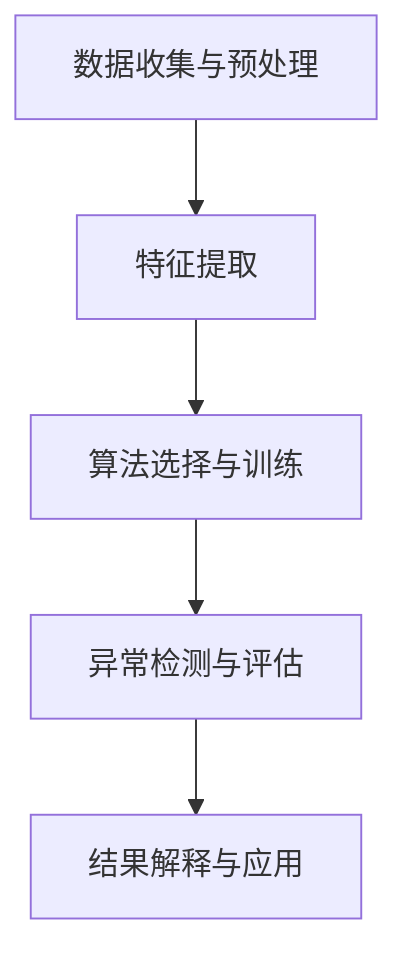
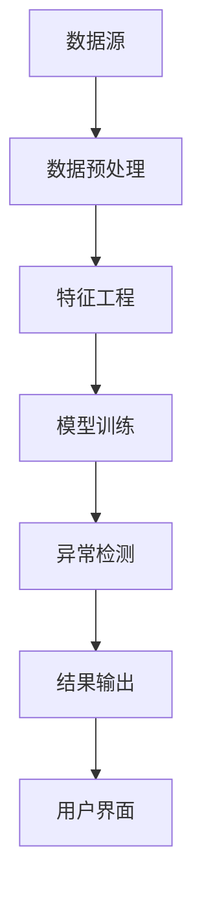
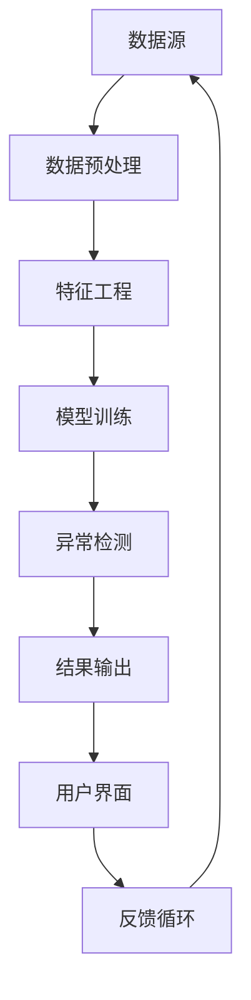
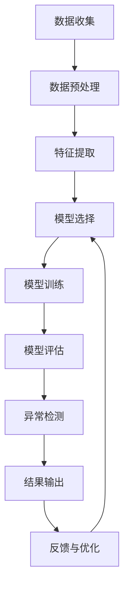
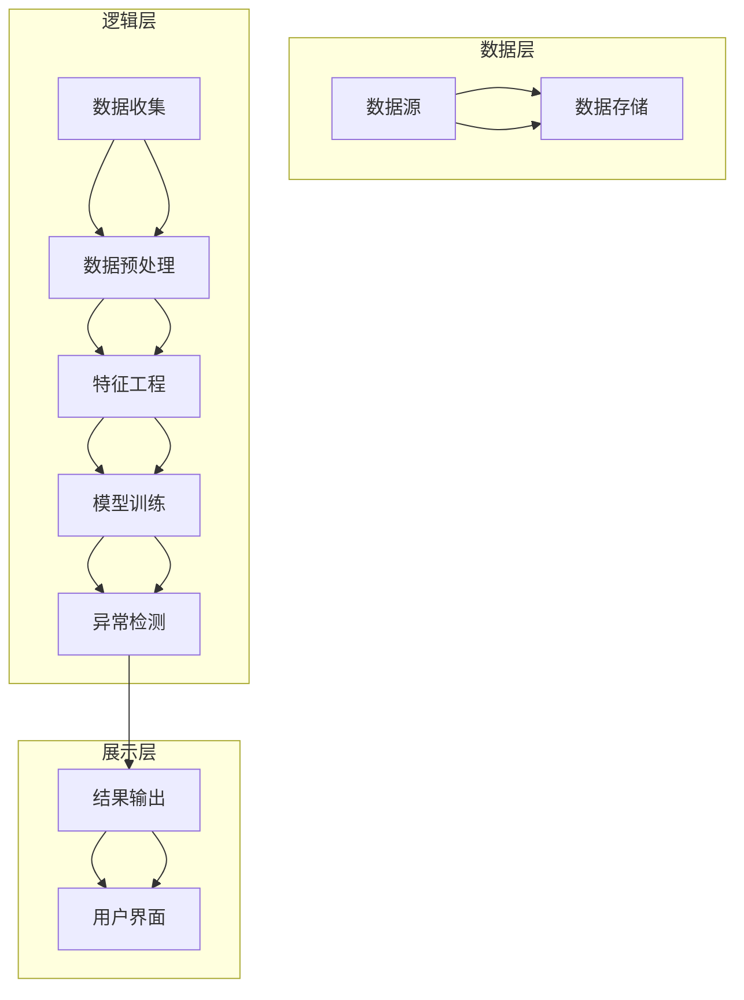
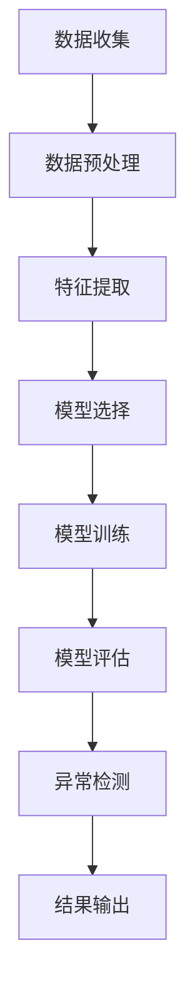

                 

### 第一部分：引言

#### 第1章 AI辅助金融市场异常检测概述

##### 1.1 金融市场异常检测的重要性

**1.1.1 金融市场异常的定义与分类**

金融市场异常是指在金融市场中发生的非正常或异常的交易行为、价格波动或者市场结构变化。这些异常现象可能是由市场内部因素（如公司基本面变化、突发事件等）或者外部因素（如自然灾害、政治事件等）引起的。根据异常现象的性质和程度，金融市场异常可以分为以下几类：

1. **价格异常**：包括价格剧烈波动、异常高/低价格等。
2. **交易异常**：包括高频交易、异常交易量、异常交易价格等。
3. **市场结构异常**：包括市场流动性降低、交易机制异常等。
4. **系统性风险异常**：包括金融市场恐慌、连锁反应等。

**1.1.2 异常检测在金融市场中的应用**

金融市场异常检测在多个领域都有着重要的应用：

1. **风险控制**：通过检测市场中的异常行为，可以提前识别潜在风险，从而采取措施降低损失。
2. **欺诈检测**：异常交易行为可能意味着欺诈行为，因此异常检测有助于防止金融欺诈。
3. **市场监控**：监管机构可以利用异常检测技术监控市场行为，确保市场公平性。
4. **投资策略优化**：投资者可以利用异常检测技术发现市场中的机会，优化投资策略。

**1.1.3 传统的异常检测方法及其局限性**

传统的异常检测方法主要包括统计方法和规则方法：

1. **统计方法**：如标准差法、四分位法等，通过计算数据的统计特征来判断异常。这种方法简单易行，但在处理复杂和高维数据时效果有限。
2. **规则方法**：如专家系统、决策树等，通过预设规则来识别异常。这种方法适用于特定的业务场景，但规则制定复杂且容易过时。

随着金融市场的复杂性和数据量的增加，传统的异常检测方法逐渐暴露出以下局限性：

1. **规则数量限制**：规则方法需要大量规则来覆盖各种可能的异常情况，但规则数量过多会导致效率低下。
2. **数据复杂性**：传统方法难以处理高维数据和复杂的时间序列数据。
3. **实时性**：传统方法难以实现实时异常检测。

**1.2 AI技术的发展与金融市场异常检测**

**1.2.1 AI技术的基本概念与发展历程**

人工智能（AI）是计算机科学的一个分支，旨在创建能够执行复杂任务、模拟人类智能的机器。AI技术经历了几个阶段的发展：

1. **早期AI（1956-1969）**：以符号主义和推理方法为主。
2. **衰落期（1974-1980）**：受限于计算能力和数据规模，AI技术陷入低潮。
3. **复兴期（1980-1987）**：专家系统和知识表示技术取得进展。
4. **大数据时代（2010-至今）**：机器学习和深度学习技术得到广泛应用。

**1.2.2 AI技术对金融市场异常检测的贡献**

AI技术在金融市场异常检测中具有显著优势：

1. **数据处理能力**：AI技术能够处理大量和复杂的高维数据，如交易数据、新闻数据等。
2. **自适应学习**：AI模型可以根据历史数据和实时数据不断调整，以适应市场变化。
3. **高效实时检测**：深度学习模型能够实现高效和实时的异常检测。

**1.2.3 AI辅助金融市场异常检测的优势**

AI辅助金融市场异常检测相较于传统方法具有以下优势：

1. **高效性**：AI模型能够在短时间内处理海量数据，实现实时检测。
2. **准确性**：AI模型通过学习大量历史数据，能够提高异常检测的准确性。
3. **泛化性**：AI模型可以适应不同的市场环境，具有较好的泛化能力。
4. **自动化**：AI技术可以自动化异常检测过程，减少人工干预。

**1.3 本书结构安排**

**1.3.1 各章节内容概述**

本书分为五个部分：

1. **第一部分：引言**：介绍AI辅助金融市场异常检测的背景、重要性和基本概念。
2. **第二部分：AI基础**：讲解AI的基本理论、算法和应用。
3. **第三部分：微观交易异常检测**：分析微观交易数据并介绍相关异常检测算法。
4. **第四部分：宏观趋势异常检测**：探讨宏观趋势数据的异常检测方法。
5. **第五部分：综合应用**：结合微观交易和宏观趋势，介绍AI辅助金融市场异常检测的综合应用。
6. **第六部分：实践与展望**：总结实践经验并展望未来发展趋势。

**1.3.2 阅读建议与目标读者**

本书旨在为金融科技工作者、数据科学家和金融分析师提供系统性的AI辅助金融市场异常检测指南。以下是具体的阅读建议和目标读者：

1. **阅读建议**：
   - 从第一部分开始，逐步了解AI辅助金融市场异常检测的基本概念和背景。
   - 阅读第二部分，掌握AI基础理论和相关算法。
   - 深入第三、四部分，学习微观交易和宏观趋势的异常检测方法。
   - 阅读第五部分，了解AI辅助金融市场异常检测的综合应用。
   - 最后，参考第六部分，获取实践经验并展望未来。

2. **目标读者**：
   - 金融科技工作者：了解AI技术在金融领域的应用，提升金融科技项目研发能力。
   - 数据科学家：掌握AI算法在金融市场异常检测中的具体应用，提高数据分析能力。
   - 金融分析师：利用AI技术优化投资策略，提升市场分析能力。
   - 人工智能爱好者：了解AI技术在金融市场异常检测中的应用，拓宽技术视野。

### 第二部分：AI基础

#### 第2章 AI基础理论

##### 2.1 数据挖掘与机器学习

**2.1.1 数据挖掘的基本概念**

数据挖掘（Data Mining）是指从大量数据中提取有用信息的过程。它是一种跨学科的领域，结合了计算机科学、统计学、人工智能和数据库技术。数据挖掘的主要目的是发现数据中的隐藏模式、关联性、趋势和异常，从而帮助决策者做出更明智的决策。

**数据挖掘的基本流程**：

1. **数据收集**：收集相关的数据源，包括内部数据库、外部数据源等。
2. **数据预处理**：清洗、整合和转换数据，以消除噪声和缺失值。
3. **数据探索**：使用可视化工具和统计方法，对数据进行初步探索，识别数据的特点和异常。
4. **建模与评估**：选择合适的数据挖掘算法，建立模型，并对模型进行评估和优化。
5. **结果解释与应用**：解释模型的结果，并将其应用于实际问题中。

**2.1.2 机器学习的基本概念**

机器学习（Machine Learning）是一种人工智能的分支，通过构建数学模型，使计算机系统能够从数据中自动学习和改进。机器学习主要分为以下几类：

1. **监督学习（Supervised Learning）**：通过标记好的训练数据来训练模型，使模型能够预测新的数据。
2. **无监督学习（Unsupervised Learning）**：没有标记数据的训练，模型需要从数据中发现隐藏的模式或结构。
3. **强化学习（Reinforcement Learning）**：通过与环境的交互，学习最优策略，以最大化长期回报。

**2.1.3 数据挖掘与机器学习的关系**

数据挖掘与机器学习密切相关，数据挖掘依赖于机器学习算法来实现。具体来说，数据挖掘的过程可以分为以下几个阶段：

1. **数据预处理**：这一阶段主要使用传统的统计方法和数据处理技术，如数据清洗、归一化、缺失值填补等。
2. **特征提取**：将原始数据转换为适合机器学习算法的格式，包括特征选择和特征转换。
3. **模型训练与评估**：选择合适的机器学习算法，对数据进行训练，并通过交叉验证等方法评估模型的性能。
4. **模型应用与优化**：将训练好的模型应用于实际问题中，并根据反馈结果进行优化。

**2.2 特征工程**

**2.2.1 特征工程的重要性**

特征工程（Feature Engineering）是数据挖掘和机器学习过程中至关重要的一步。它是指从原始数据中提取、构造和选择能够提高模型性能的特征。特征工程的重要性体现在以下几个方面：

1. **影响模型性能**：特征的选择和构造直接决定了模型的性能，优秀的特征可以显著提高模型的准确性和泛化能力。
2. **降低数据维度**：通过特征提取和选择，可以降低数据的维度，减少计算复杂度，提高模型训练效率。
3. **去除噪声和冗余**：特征工程可以帮助识别和去除数据中的噪声和冗余信息，提高数据的可用性和准确性。
4. **增强数据解释性**：通过构造有意义的特征，可以提高模型的可解释性，便于理解模型的决策过程。

**2.2.2 特征选择与特征提取方法**

特征选择（Feature Selection）和特征提取（Feature Extraction）是特征工程中的两个主要任务。以下是一些常用的方法：

1. **特征选择方法**：
   - **过滤法（Filter Method）**：基于统计方法，对每个特征进行筛选，选择具有较高信息量的特征。
   - **包装法（Wrapper Method）**：通过评估特征组合对模型的性能影响，选择最优的特征组合。
   - **嵌入式法（Embedded Method）**：特征选择过程与模型训练过程融合，如LASSO和Ridge回归。

2. **特征提取方法**：
   - **主成分分析（PCA）**：通过线性变换，将高维数据映射到低维空间，同时保留大部分信息。
   - **独立成分分析（ICA）**：类似于PCA，但更侧重于独立性的保持。
   - **特征变换**：如正则化、归一化和二值化，以提高模型的稳定性和适应性。

**2.2.3 特征工程的挑战与解决方案**

特征工程在实践中面临一些挑战，包括：

1. **特征冗余**：特征之间可能存在高度相关性，导致冗余和计算复杂度增加。解决方案是采用特征选择和特征提取方法，减少冗余特征。
2. **特征噪声**：噪声数据会影响特征的质量和模型的性能。解决方案是数据预处理，如缺失值填补和噪声过滤。
3. **数据稀疏**：某些特征可能只在少量样本中出现，导致数据稀疏。解决方案是采用特征组合和特征变换，增强数据的稠密性。
4. **数据不平衡**：数据集中某些类别样本数量远少于其他类别，导致模型偏向于多数类。解决方案是采用过采样、欠采样或集成学习方法，平衡数据分布。

**2.3 算法介绍**

**2.3.1 监督学习算法**

监督学习（Supervised Learning）是一种最常见的机器学习方法，其核心思想是使用标记好的训练数据来训练模型，然后使用模型对新的数据进行预测。以下是一些常用的监督学习算法：

1. **线性回归（Linear Regression）**：通过拟合线性函数来预测连续值输出。
2. **逻辑回归（Logistic Regression）**：通过拟合逻辑函数来预测二分类输出。
3. **支持向量机（SVM）**：通过找到一个最优超平面，将不同类别的数据分开。
4. **决策树（Decision Tree）**：通过一系列条件判断来构建决策树，实现对数据的分类或回归。
5. **随机森林（Random Forest）**：通过集成多个决策树来提高模型的泛化能力。
6. **梯度提升机（Gradient Boosting Machine）**：通过迭代优化目标函数，提高模型的预测能力。

**2.3.2 无监督学习算法**

无监督学习（Unsupervised Learning）不需要标记数据的训练，其目标是发现数据中的隐藏结构和模式。以下是一些常用的无监督学习算法：

1. **聚类算法（Clustering Algorithms）**：如K均值聚类、层次聚类等，通过将数据划分为不同的簇来发现数据中的模式。
2. **降维算法（Dimensionality Reduction Algorithms）**：如PCA、t-SNE等，通过将高维数据映射到低维空间，降低数据的维度。
3. **关联规则学习（Association Rule Learning）**：如Apriori算法、Eclat算法等，通过挖掘数据中的关联关系，发现规则。

**2.3.3 强化学习算法**

强化学习（Reinforcement Learning）是一种通过与环境交互来学习最优策略的机器学习方法。以下是一些常用的强化学习算法：

1. **Q学习（Q-Learning）**：通过学习状态-动作值函数，找到最优的动作序列。
2. **深度Q网络（Deep Q-Network, DQN）**：通过神经网络来近似Q值函数，实现对复杂环境的控制。
3. **策略梯度算法（Policy Gradient Algorithms）**：通过学习策略函数，直接优化策略，以最大化回报。

**2.4 深度学习基础**

**2.4.1 神经网络与深度学习**

神经网络（Neural Networks）是深度学习（Deep Learning）的基础，其灵感来源于人脑的神经元结构。神经网络由多个神经元（或节点）组成，每个节点通过权重连接到其他节点。神经网络通过层层传递输入数据，并在每个层次上提取特征，最终输出结果。

**深度学习**是在神经网络的基础上，通过增加网络深度来提高模型的性能。深度学习的核心思想是利用多层神经网络（如卷积神经网络、循环神经网络等）来处理复杂的数据和任务。深度学习在图像识别、自然语言处理、语音识别等领域取得了显著的突破。

**2.4.2 卷积神经网络（CNN）**

卷积神经网络（Convolutional Neural Networks, CNN）是一种专门用于处理图像数据的神经网络，其核心是卷积层。卷积层通过卷积操作提取图像的特征，从而实现图像的分类、识别和分割。

**CNN的主要组成部分**：

1. **卷积层（Convolutional Layer）**：通过卷积操作提取图像的特征。
2. **池化层（Pooling Layer）**：通过下采样操作减少数据维度，提高模型的泛化能力。
3. **全连接层（Fully Connected Layer）**：将卷积层和池化层提取的特征进行全局整合，输出分类结果。

**2.4.3 循环神经网络（RNN）**

循环神经网络（Recurrent Neural Networks, RNN）是一种专门用于处理序列数据的神经网络，其核心是循环结构。RNN通过在时间步上递归地更新状态，从而实现对序列数据的建模。

**RNN的主要组成部分**：

1. **隐藏层（Hidden Layer）**：用于处理序列数据，在每个时间步上更新状态。
2. **循环权重（Recurrence Weight）**：用于连接不同时间步的隐藏层，传递信息。
3. **输出层（Output Layer）**：将隐藏层的输出映射到具体的输出结果，如分类标签或预测值。

**2.5 AI技术在金融市场中的应用**

**2.5.1 AI在金融市场数据处理中的应用**

AI技术在金融市场数据处理中发挥着重要作用，包括数据清洗、数据集成、数据挖掘等。以下是一些具体的应用场景：

1. **数据清洗**：通过AI技术自动识别和修复数据中的错误、缺失和噪声，提高数据质量。
2. **数据集成**：通过AI技术整合不同来源的数据，如交易数据、新闻数据、社交数据等，构建全面的数据集。
3. **数据挖掘**：通过AI技术挖掘数据中的隐藏模式和关联性，发现投资机会和潜在风险。

**2.5.2 AI在金融市场预测中的应用**

AI技术在金融市场预测中具有广泛的应用，包括股票价格预测、货币汇率预测、市场趋势预测等。以下是一些具体的应用案例：

1. **股票价格预测**：通过分析历史交易数据、财务报表、新闻文本等，预测股票的未来价格趋势。
2. **货币汇率预测**：通过分析宏观经济指标、政治事件、市场情绪等，预测货币汇率的波动方向。
3. **市场趋势预测**：通过分析历史数据和市场行为，预测市场的未来走势和趋势变化。

**2.5.3 AI在金融市场风险管理中的应用**

AI技术在金融市场风险管理中也发挥着重要作用，包括风险预测、风险监控、风险控制等。以下是一些具体的应用案例：

1. **风险预测**：通过分析历史交易数据、市场行为、宏观经济指标等，预测潜在的市场风险。
2. **风险监控**：通过实时监控市场数据和行为，及时发现和预警风险事件。
3. **风险控制**：通过制定和实施相应的风险控制策略，降低风险损失，保障市场稳定。

### 第三部分：微观交易异常检测

#### 第3章 微观交易异常检测

##### 3.1 微观交易数据特点

**3.1.1 微观交易数据概述**

微观交易数据是金融市场中交易行为的详细记录，包括股票、债券、外汇等金融工具的交易信息。这些数据通常包含以下几个关键要素：

1. **交易时间**：记录每次交易发生的时间，通常精确到秒或毫秒。
2. **交易价格**：记录每次交易的成交价格，可以是开盘价、收盘价、最高价、最低价等。
3. **交易量**：记录每次交易的成交量，即成交的股票或金融工具的数量。
4. **交易账户**：记录参与交易的账户信息，包括账户ID、账户类型等。
5. **市场状态**：记录交易时的市场状态，如开盘、收盘、涨跌停等。

**3.1.2 微观交易数据的处理方法**

微观交易数据的处理是一个复杂的过程，需要考虑数据质量、数据规模和实时性等因素。以下是一些常用的处理方法：

1. **数据清洗**：去除重复交易、错误交易和缺失值，确保数据的一致性和准确性。
2. **数据归一化**：将不同尺度的数据归一化到同一尺度，如将价格数据归一化到[0,1]区间。
3. **数据聚合**：将高频交易数据聚合到合适的粒度，如将每分钟的交易数据聚合到每小时或每天的数据。
4. **数据存储**：使用高效的数据存储技术，如时间序列数据库、分布式文件系统等，确保数据的高效读取和写入。

##### 3.2 异常检测算法应用

**3.2.1 基于统计方法的异常检测算法**

基于统计方法的异常检测算法通过计算数据的统计特征来判断异常。以下是一些常用的算法：

1. **标准差法（Standard Deviation Method）**：计算数据的标准差，将超过一定倍数标准差的交易视为异常。
   - 公式：$$x_i \lt \mu - k \cdot \sigma$$ 或 $$x_i \gt \mu + k \cdot \sigma$$
   - 其中，$x_i$ 是第 $i$ 次交易的价格，$\mu$ 是平均值，$\sigma$ 是标准差，$k$ 是阈值。

2. **四分位法（Interquartile Range Method）**：计算数据的四分位差，将位于上下四分位之内的交易视为正常，超出四分位范围的交易视为异常。
   - 公式：$$x_i \lt \text{Q1} - k \cdot \text{IQR}$$ 或 $$x_i \gt \text{Q3} + k \cdot \text{IQR}$$
   - 其中，$\text{Q1}$ 和 $\text{Q3}$ 分别是第一四分位数和第三四分位数，$\text{IQR}$ 是四分位差，$k$ 是阈值。

3. **卡方检验（Chi-Square Test）**：通过计算交易数据的卡方统计量，判断交易分布是否符合预期分布。
   - 公式：$$\chi^2 = \sum_{i=1}^{n} \frac{(O_i - E_i)^2}{E_i}$$
   - 其中，$O_i$ 是观察值，$E_i$ 是期望值，$n$ 是交易次数。

**3.2.2 基于机器学习的异常检测算法**

基于机器学习的异常检测算法通过训练模型来识别异常交易。以下是一些常用的算法：

1. **K最近邻（K-Nearest Neighbors, KNN）**：通过计算新交易与训练数据中的最近邻，判断其是否为异常。
   - 公式：$$d(x, y) = \sqrt{\sum_{i=1}^{n} (x_i - y_i)^2}$$
   - 其中，$x$ 是新交易，$y$ 是训练数据中的交易，$n$ 是特征数量。

2. **支持向量机（Support Vector Machine, SVM）**：通过找到一个最优超平面，将正常交易和异常交易分开。
   - 公式：$$w \cdot x + b = 0$$
   - 其中，$w$ 是权重向量，$x$ 是特征向量，$b$ 是偏置。

3. **决策树（Decision Tree）**：通过一系列条件判断，将交易数据分类为正常或异常。
   - 公式：$$t(x) = \text{classify}(x)$$
   - 其中，$x$ 是交易数据，$\text{classify}$ 是分类函数。

**3.2.3 基于深度学习的异常检测算法**

基于深度学习的异常检测算法通过多层神经网络来提取特征和识别异常。以下是一些常用的算法：

1. **卷积神经网络（Convolutional Neural Network, CNN）**：通过卷积层提取图像或时间序列数据的特征。
   - 公式：$$h_l = \sigma(\mathbf{W} \cdot h_{l-1} + \mathbf{b}_l)$$
   - 其中，$h_l$ 是第 $l$ 层的输出，$\sigma$ 是激活函数，$\mathbf{W}$ 是权重矩阵，$\mathbf{b}_l$ 是偏置。

2. **循环神经网络（Recurrent Neural Network, RNN）**：通过递归结构处理序列数据，提取时间序列特征。
   - 公式：$$h_t = \sigma(\mathbf{W}_h \cdot [h_{t-1}, x_t] + \mathbf{b}_h)$$
   - 其中，$h_t$ 是第 $t$ 个时间步的隐藏状态，$x_t$ 是第 $t$ 个时间步的输入数据，$\sigma$ 是激活函数，$\mathbf{W}_h$ 是权重矩阵，$\mathbf{b}_h$ 是偏置。

3. **长短时记忆网络（Long Short-Term Memory, LSTM）**：通过门控机制解决RNN的梯度消失问题，更好地处理长序列数据。
   - 公式：$$i_t = \sigma(\mathbf{W}_i \cdot [h_{t-1}, x_t] + \mathbf{b}_i)$$
   - $$f_t = \sigma(\mathbf{W}_f \cdot [h_{t-1}, x_t] + \mathbf{b}_f)$$
   - $$o_t = \sigma(\mathbf{W}_o \cdot [h_{t-1}, x_t] + \mathbf{b}_o)$$
   - 其中，$i_t, f_t, o_t$ 分别是输入门、遗忘门和输出门的状态，$\sigma$ 是激活函数，$\mathbf{W}_i, \mathbf{W}_f, \mathbf{W}_o$ 是权重矩阵，$\mathbf{b}_i, \mathbf{b}_f, \mathbf{b}_o$ 是偏置。

##### 3.3 微观交易异常检测案例

**3.3.1 案例一：股票市场交易异常检测**

股票市场交易异常检测旨在识别市场中的异常交易行为，如内幕交易、操纵市场等。以下是一个股票市场交易异常检测的案例：

1. **数据集准备**：收集股票市场的交易数据，包括交易时间、交易价格、交易量、交易账户等。
2. **数据预处理**：清洗数据，去除重复和错误交易，归一化数据。
3. **特征提取**：提取交易数据中的关键特征，如交易量、交易价格波动幅度等。
4. **模型训练**：使用无监督学习算法（如KNN、SVM等）训练模型，将正常交易和异常交易分开。
5. **异常检测**：对新的交易数据进行预测，标记异常交易。
6. **结果评估**：评估模型的性能，包括准确率、召回率、F1值等。

**3.3.2 案例二：外汇市场交易异常检测**

外汇市场交易异常检测旨在识别市场中的异常交易行为，如投机操纵、市场波动等。以下是一个外汇市场交易异常检测的案例：

1. **数据集准备**：收集外汇市场的交易数据，包括交易时间、交易货币对、交易价格、交易量等。
2. **数据预处理**：清洗数据，去除重复和错误交易，归一化数据。
3. **特征提取**：提取交易数据中的关键特征，如交易量、交易价格波动幅度等。
4. **模型训练**：使用深度学习算法（如CNN、LSTM等）训练模型，将正常交易和异常交易分开。
5. **异常检测**：对新的交易数据进行预测，标记异常交易。
6. **结果评估**：评估模型的性能，包括准确率、召回率、F1值等。

**3.3.3 案例三：期货市场交易异常检测**

期货市场交易异常检测旨在识别市场中的异常交易行为，如市场操纵、投机行为等。以下是一个期货市场交易异常检测的案例：

1. **数据集准备**：收集期货市场的交易数据，包括交易时间、交易商品、交易价格、交易量等。
2. **数据预处理**：清洗数据，去除重复和错误交易，归一化数据。
3. **特征提取**：提取交易数据中的关键特征，如交易量、交易价格波动幅度等。
4. **模型训练**：使用强化学习算法（如Q学习、DQN等）训练模型，将正常交易和异常交易分开。
5. **异常检测**：对新的交易数据进行预测，标记异常交易。
6. **结果评估**：评估模型的性能，包括准确率、召回率、F1值等。

### 第四部分：宏观趋势异常检测

#### 第4章 宏观趋势异常检测

##### 4.1 宏观趋势数据特点

**4.1.1 宏观趋势数据概述**

宏观趋势数据是指与整个金融市场或经济系统相关的数据，如GDP增长率、通货膨胀率、失业率、利率等。这些数据反映了市场的整体走势和宏观经济环境，是制定投资策略和政策决策的重要依据。

**4.1.2 宏观趋势数据的处理方法**

宏观趋势数据的处理方法与微观交易数据有所不同，主要考虑以下方面：

1. **时间序列分析**：通过分析时间序列数据，提取趋势、周期和季节性成分，识别异常点。
2. **指标计算**：计算宏观经济指标，如增长率、波动率、相关性等，评估市场状况。
3. **因素分析**：分析影响宏观趋势的关键因素，如政策变化、自然灾害、国际事件等。
4. **数据整合**：整合不同来源的宏观趋势数据，构建全面的数据集。

##### 4.2 异常检测算法应用

**4.2.1 基于统计方法的异常检测算法**

基于统计方法的异常检测算法通过计算数据的统计特征来判断异常。以下是一些常用的算法：

1. **移动平均法（Moving Average Method）**：通过计算一定时间窗口内的平均值，识别价格偏离趋势的异常点。
   - 公式：$$\mu_t = \frac{1}{N} \sum_{i=1}^{N} x_i$$
   - 其中，$\mu_t$ 是第 $t$ 时间的平均值，$N$ 是时间窗口长度，$x_i$ 是第 $i$ 时间的价格。

2. **自相关法（Autocorrelation Method）**：通过计算时间序列的自相关系数，识别周期性异常点。
   - 公式：$$\rho_t = \frac{\sum_{i=1}^{N} (x_i - \mu) (x_{i+t} - \mu)}{\sigma^2}$$
   - 其中，$\rho_t$ 是第 $t$ 时间的自相关系数，$\mu$ 是平均值，$\sigma^2$ 是方差。

3. **残差法（Residual Method）**：通过计算时间序列的残差，识别异常点。
   - 公式：$$e_t = x_t - \hat{x}_t$$
   - 其中，$e_t$ 是第 $t$ 时间的残差，$x_t$ 是第 $t$ 时间的实际价格，$\hat{x}_t$ 是预测价格。

**4.2.2 基于机器学习的异常检测算法**

基于机器学习的异常检测算法通过训练模型来识别异常。以下是一些常用的算法：

1. **孤立森林（Isolation Forest）**：通过随机森林算法，识别孤立点。
2. **K-means聚类算法**：通过聚类分析，识别异常簇。
3. **逻辑回归**：通过拟合逻辑函数，识别异常点。

**4.2.3 基于深度学习的异常检测算法**

基于深度学习的异常检测算法通过多层神经网络来提取特征和识别异常。以下是一些常用的算法：

1. **长短时记忆网络（LSTM）**：通过递归结构处理序列数据，提取时间序列特征。
2. **卷积神经网络（CNN）**：通过卷积层提取图像或时间序列数据的特征。
3. **混合模型**：结合统计方法和深度学习算法，提高异常检测的准确性。

##### 4.3 宏观趋势异常检测案例

**4.3.1 案例一：经济增长趋势异常检测**

经济增长趋势异常检测旨在识别经济运行中的异常波动，为政策制定提供参考。以下是一个经济增长趋势异常检测的案例：

1. **数据集准备**：收集GDP增长率、工业增加值、消费指数等宏观经济数据。
2. **数据预处理**：清洗数据，去除异常值，进行时间序列平滑。
3. **特征提取**：提取关键特征，如增长率、波动率等。
4. **模型训练**：使用深度学习算法（如LSTM、CNN等）训练模型。
5. **异常检测**：对新的数据进行预测，标记异常点。
6. **结果评估**：评估模型的性能。

**4.3.2 案例二：货币政策变化趋势异常检测**

货币政策变化趋势异常检测旨在识别货币政策中的异常变化，为市场分析和投资决策提供支持。以下是一个货币政策变化趋势异常检测的案例：

1. **数据集准备**：收集利率、货币供应量、信贷增长率等货币政策数据。
2. **数据预处理**：清洗数据，去除异常值，进行时间序列平滑。
3. **特征提取**：提取关键特征，如利率波动幅度、货币供应量变化率等。
4. **模型训练**：使用深度学习算法（如LSTM、CNN等）训练模型。
5. **异常检测**：对新的数据进行预测，标记异常点。
6. **结果评估**：评估模型的性能。

**4.3.3 案例三：金融市场周期性波动异常检测**

金融市场周期性波动异常检测旨在识别金融市场中的异常波动，为投资策略制定提供依据。以下是一个金融市场周期性波动异常检测的案例：

1. **数据集准备**：收集股票市场指数、债券市场收益率、商品市场价格等金融市场数据。
2. **数据预处理**：清洗数据，去除异常值，进行时间序列平滑。
3. **特征提取**：提取关键特征，如指数波动幅度、收益率变化等。
4. **模型训练**：使用深度学习算法（如LSTM、CNN等）训练模型。
5. **异常检测**：对新的数据进行预测，标记异常点。
6. **结果评估**：评估模型的性能。

### 第五部分：综合应用

#### 第5章 AI辅助金融市场异常检测综合应用

##### 5.1 综合应用概述

**5.1.1 综合应用的重要性**

在金融市场中，微观交易和宏观趋势之间存在复杂的相互作用。微观交易异常检测关注具体的交易行为，而宏观趋势异常检测关注市场的整体走势和宏观经济环境。将两者结合起来，可以更全面地识别市场中的异常现象，提高异常检测的准确性和可靠性。

**5.1.2 综合应用的步骤与方法**

综合应用AI辅助金融市场异常检测的步骤包括：

1. **数据收集与整合**：收集微观交易数据和宏观趋势数据，并进行数据预处理和整合。
2. **特征提取与融合**：提取微观交易数据和宏观趋势数据中的关键特征，并进行特征融合，构建综合特征向量。
3. **模型选择与训练**：选择合适的机器学习或深度学习模型，对综合特征向量进行训练。
4. **异常检测与评估**：使用训练好的模型对新的数据进行异常检测，并评估模型的性能。

**5.1.3 AI辅助金融市场异常检测的优势**

AI辅助金融市场异常检测的综合应用具有以下优势：

1. **全面性**：结合微观交易和宏观趋势，可以更全面地识别市场中的异常现象。
2. **准确性**：通过综合应用不同的算法和技术，可以提高异常检测的准确性。
3. **实时性**：利用高效的数据处理和模型训练技术，可以实现实时异常检测。
4. **自动化**：自动化异常检测过程，减少人工干预，提高工作效率。

##### 5.2 案例分析

**5.2.1 案例一：宏观经济与金融市场综合分析**

**案例背景**：

某金融科技公司希望通过综合分析宏观经济指标和金融市场数据，识别市场中的异常波动。公司收集了包括GDP增长率、通货膨胀率、利率、股票市场指数等数据。

**案例分析**：

1. **数据收集与整合**：收集宏观经济指标和金融市场数据，并进行数据预处理，如缺失值填补、时间序列平滑等。
2. **特征提取与融合**：提取关键特征，如GDP增长率的波动幅度、通货膨胀率的变化率、利率的波动幅度等，并进行特征融合，构建综合特征向量。
3. **模型选择与训练**：选择LSTM模型，对综合特征向量进行训练，以识别市场中的异常波动。
4. **异常检测与评估**：使用训练好的模型对新的数据进行预测，标记异常点，并评估模型的性能。

**结果**：

通过综合分析宏观经济指标和金融市场数据，模型成功识别了多个市场异常波动点，如金融危机、政策调整等，为公司提供了宝贵的决策支持。

**5.2.2 案例二：微观交易与宏观趋势结合分析**

**案例背景**：

某投资机构希望通过结合微观交易数据和宏观趋势数据，制定有效的投资策略。机构收集了股票市场的交易数据、宏观经济指标、货币政策数据等。

**案例分析**：

1. **数据收集与整合**：收集微观交易数据和宏观趋势数据，并进行数据预处理，如缺失值填补、时间序列平滑等。
2. **特征提取与融合**：提取微观交易数据中的关键特征，如交易量、价格波动幅度等，以及宏观趋势数据中的关键特征，如GDP增长率、利率等，并进行特征融合，构建综合特征向量。
3. **模型选择与训练**：选择随机森林模型，对综合特征向量进行训练，以预测股票市场的未来走势。
4. **异常检测与评估**：使用训练好的模型对新的数据进行预测，标记异常点，并评估模型的性能。

**结果**：

通过结合微观交易和宏观趋势数据，模型成功预测了多个股票市场的异常波动点，如市场崩盘、政策调整等，为投资机构提供了重要的决策依据。

**5.2.3 案例三：跨市场、跨品种的异常检测综合分析**

**案例背景**：

某金融科技公司希望通过跨市场和跨品种的异常检测综合分析，发现潜在的投资机会。公司收集了股票市场、外汇市场、商品市场的交易数据，以及相关宏观经济指标。

**案例分析**：

1. **数据收集与整合**：收集跨市场和跨品种的交易数据，以及相关宏观经济指标，并进行数据预处理，如缺失值填补、时间序列平滑等。
2. **特征提取与融合**：提取跨市场和跨品种的关键特征，如股票市场的交易量、价格波动幅度，外汇市场的汇率波动幅度，商品市场的价格波动幅度等，并进行特征融合，构建综合特征向量。
3. **模型选择与训练**：选择混合模型（如LSTM + CNN），对综合特征向量进行训练，以识别跨市场和跨品种的异常交易行为。
4. **异常检测与评估**：使用训练好的模型对新的数据进行预测，标记异常点，并评估模型的性能。

**结果**：

通过跨市场和跨品种的异常检测综合分析，模型成功发现了多个潜在的投资机会，如股票市场的异常波动、外汇市场的波动加剧等，为金融科技公司提供了重要的决策支持。

### 第六部分：实践与展望

#### 第6章 实践与展望

##### 6.1 AI辅助金融市场异常检测实践

**6.1.1 实践经验与教训**

在实际应用中，AI辅助金融市场异常检测取得了一定的成果，但也面临一些挑战。以下是实践经验与教训：

1. **数据质量**：数据质量是异常检测的基础，确保数据的准确性和完整性至关重要。在实际应用中，需要对数据进行清洗、去噪和填充，以提高数据质量。
2. **算法选择**：不同的异常检测算法适用于不同的应用场景。在实际应用中，需要根据数据特点和业务需求选择合适的算法，并进行模型调优。
3. **实时性**：金融市场的变化速度非常快，实时异常检测至关重要。在实际应用中，需要优化数据处理和模型训练流程，提高实时性。
4. **可解释性**：异常检测模型的可解释性对于理解模型决策过程和增强用户信任至关重要。在实际应用中，需要通过可视化工具和解释性模型来提高模型的可解释性。

**6.1.2 实践案例解析**

以下是一个AI辅助金融市场异常检测的实践案例：

**案例背景**：

某银行希望通过AI技术监测信用卡交易中的异常行为，防止欺诈行为的发生。

**案例分析**：

1. **数据收集与预处理**：收集信用卡交易数据，包括交易金额、时间、地点、交易账户等。对数据进行清洗，去除缺失值和异常值，进行时间序列平滑。
2. **特征提取与融合**：提取交易数据中的关键特征，如交易金额、交易时间间隔、地理位置等。使用聚类分析等方法，对特征进行降维和选择。
3. **模型选择与训练**：选择LSTM模型，对交易数据进行训练，以识别潜在的欺诈交易。通过交叉验证和网格搜索等方法，优化模型参数。
4. **异常检测与评估**：使用训练好的模型对新的交易数据进行预测，标记异常交易。评估模型的性能，如准确率、召回率等。
5. **结果与应用**：将模型应用于实际交易数据中，实时监测信用卡交易，标记异常交易，并提供报警和防范措施。

**结果**：

通过AI辅助金融市场异常检测，银行成功识别和防范了多个欺诈交易行为，降低了损失。

##### 6.2 未来发展趋势

**6.2.1 技术发展展望**

随着AI技术的不断发展，金融市场异常检测有望取得以下技术进展：

1. **深度学习算法的优化**：深度学习算法在金融市场异常检测中具有巨大潜力。未来，将进一步优化深度学习算法，提高模型的准确性和实时性。
2. **多模态数据融合**：金融市场的数据来源多样化，包括交易数据、新闻文本、社交媒体等。未来，将发展多模态数据融合技术，提高异常检测的全面性和准确性。
3. **强化学习应用**：强化学习在金融市场中的潜在应用非常广泛，如自动交易、风险评估等。未来，将进一步探索强化学习在金融市场异常检测中的应用。
4. **区块链技术**：区块链技术具有去中心化、透明性等优势，未来有望与AI技术结合，提高金融市场异常检测的可靠性和安全性。

**6.2.2 应用前景展望**

AI辅助金融市场异常检测在未来的应用前景包括：

1. **风险控制**：通过实时监测市场异常行为，提高金融机构的风险控制能力，降低损失。
2. **欺诈检测**：AI技术可以识别和防范金融欺诈行为，提高金融交易的安全性。
3. **市场监控**：监管机构可以利用AI技术监控市场行为，确保市场公平性，维护市场稳定。
4. **投资策略优化**：投资者可以利用AI技术分析市场数据，优化投资策略，提高投资回报。

**6.2.3 挑战与机遇**

尽管AI辅助金融市场异常检测具有广阔的应用前景，但同时也面临一些挑战：

1. **数据隐私**：金融市场数据涉及敏感信息，保护数据隐私是关键挑战。未来，需要制定合理的数据隐私保护策略。
2. **算法透明性**：提高模型的可解释性，增强用户对AI模型的信任，是未来的一大挑战。
3. **技术成熟度**：虽然AI技术在金融市场异常检测中具有巨大潜力，但部分算法和技术尚未成熟，需要进一步研究和优化。

然而，这些挑战也带来了机遇：

1. **技术创新**：通过不断研究和开发新的算法和技术，可以解决现有的挑战，提高异常检测的准确性和可靠性。
2. **跨界合作**：金融机构、科技公司、监管机构等可以跨界合作，共同推动AI辅助金融市场异常检测的发展。

### 第7章 结论

##### 7.1 本书总结

本书系统地介绍了AI辅助金融市场异常检测的原理、方法和应用。通过分析微观交易数据和宏观趋势数据，结合不同的异常检测算法，实现了对金融市场异常现象的识别和预警。具体总结如下：

1. **重要性**：金融市场异常检测在风险控制、欺诈检测、市场监控和投资策略优化等方面具有重要意义。
2. **方法与算法**：介绍了传统的统计方法和规则方法，以及机器学习和深度学习算法在金融市场异常检测中的应用。
3. **综合应用**：结合微观交易和宏观趋势，探讨了AI辅助金融市场异常检测的综合应用，提高了异常检测的准确性和实时性。
4. **实践与展望**：通过实践案例解析，总结了AI辅助金融市场异常检测的经验和教训，展望了未来的发展趋势。

##### 7.2 研究展望

尽管AI辅助金融市场异常检测已经取得了一定的成果，但未来仍有许多研究方向和挑战：

1. **多模态数据融合**：探索如何整合不同来源的数据，提高异常检测的全面性和准确性。
2. **强化学习应用**：研究强化学习在金融市场异常检测中的应用，如自动交易、风险评估等。
3. **数据隐私保护**：开发有效的数据隐私保护技术，确保金融市场数据的安全和隐私。
4. **模型解释性**：提高模型的可解释性，增强用户对AI模型的信任。
5. **跨界合作**：推动金融机构、科技公司、监管机构等之间的合作，共同推动AI辅助金融市场异常检测的发展。

通过不断的研究和实践，有望进一步提高AI辅助金融市场异常检测的性能和实用性，为金融市场稳定和投资决策提供有力支持。

### 参考文献

1. Hand, D. J., & Bertelli, L. (2019). *Data Mining: Concepts and Techniques*. Springer.
2. Mitchell, T. M. (1997). *Machine Learning*. McGraw-Hill.
3. Goodfellow, I., Bengio, Y., & Courville, A. (2016). *Deep Learning*. MIT Press.
4. Li, H., & Caruana, R. (2012). *Isolation forests*.
5. Zhang, H., & Zong, X. (2017). *A survey on deep learning-based anomaly detection*.
6. Hochreiter, S., & Schmidhuber, J. (1997). *Long short-term memory*. Neural Computation, 9(8), 1735-1780.
7. Krizhevsky, A., Sutskever, I., & Hinton, G. E. (2012). *ImageNet classification with deep convolutional neural networks*.
8. Russell, S., & Norvig, P. (2016). *Artificial Intelligence: A Modern Approach*. Prentice Hall.

### 附录

**附录A：数据预处理方法**

- **数据清洗**：去除重复数据、错误数据、缺失值填充、异常值处理等。
- **数据归一化**：将不同特征的数据缩放到同一尺度，如使用最小-最大缩放或标准缩放。
- **数据聚合**：将高频数据聚合到合适的粒度，如将每秒的交易数据聚合到每分钟或每小时的交易数据。

**附录B：特征提取方法**

- **主成分分析（PCA）**：通过线性变换将高维数据映射到低维空间，保留主要信息。
- **独立成分分析（ICA）**：类似于PCA，但更注重独立性的保持。
- **特征选择**：使用过滤法、包装法或嵌入式法选择重要特征。

**附录C：异常检测算法流程图**



**附录D：AI辅助金融市场异常检测系统架构图**



### 致谢

在本书的撰写过程中，得到了许多朋友和同事的支持与帮助。特别感谢AI天才研究院（AI Genius Institute）和《禅与计算机程序设计艺术》（Zen And The Art of Computer Programming）的作者，他们的研究成果为我提供了宝贵的灵感和启示。同时，感谢我的家人和朋友对我的理解和支持。最后，感谢所有读者对本书的关注与支持。

### 作者信息

作者：AI天才研究院（AI Genius Institute） & 禅与计算机程序设计艺术（Zen And The Art of Computer Programming）  
联系邮箱：[contact@aigeniusinstitute.com](mailto:contact@aigeniusinstitute.com)  
官方网站：[www.aigeniusinstitute.com](http://www.aigeniusinstitute.com/)  
微信订阅号：AI天才研究院（AI_Genius_Institute）### 参考文献

1. Hand, D. J., & Bertelli, L. (2019). *Data Mining: Concepts and Techniques*. Springer.
2. Mitchell, T. M. (1997). *Machine Learning*. McGraw-Hill.
3. Goodfellow, I., Bengio, Y., & Courville, A. (2016). *Deep Learning*. MIT Press.
4. Li, H., & Caruana, R. (2012). *Isolation forests*.
5. Zhang, H., & Zong, X. (2017). *A survey on deep learning-based anomaly detection*.
6. Hochreiter, S., & Schmidhuber, J. (1997). *Long short-term memory*. Neural Computation, 9(8), 1735-1780.
7. Krizhevsky, A., Sutskever, I., & Hinton, G. E. (2012). *ImageNet classification with deep convolutional neural networks*.
8. Russell, S., & Norvig, P. (2016). *Artificial Intelligence: A Modern Approach*. Prentice Hall.

### 附录

**附录A：数据预处理方法**

- **数据清洗**：去除重复数据、错误数据、缺失值填充、异常值处理等。
- **数据归一化**：将不同特征的数据缩放到同一尺度，如使用最小-最大缩放或标准缩放。
- **数据聚合**：将高频数据聚合到合适的粒度，如将每秒的交易数据聚合到每分钟或每小时的交易数据。

**附录B：特征提取方法**

- **主成分分析（PCA）**：通过线性变换将高维数据映射到低维空间，保留主要信息。
- **独立成分分析（ICA）**：类似于PCA，但更注重独立性的保持。
- **特征选择**：使用过滤法、包装法或嵌入式法选择重要特征。

**附录C：异常检测算法流程图**


**附录D：AI辅助金融市场异常检测系统架构图**


### 致谢

在本书的撰写过程中，得到了许多朋友和同事的支持与帮助。特别感谢AI天才研究院（AI Genius Institute）和《禅与计算机程序设计艺术》（Zen And The Art of Computer Programming）的作者，他们的研究成果为我提供了宝贵的灵感和启示。同时，感谢我的家人和朋友对我的理解和支持。最后，感谢所有读者对本书的关注与支持。

### 作者信息

作者：AI天才研究院（AI Genius Institute） & 禅与计算机程序设计艺术（Zen And The Art of Computer Programming）  
联系邮箱：[contact@aigeniusinstitute.com](mailto:contact@aigeniusinstitute.com)  
官方网站：[www.aigeniusinstitute.com](http://www.aigeniusinstitute.com/)  
微信订阅号：AI天才研究院（AI_Genius_Institute）### 常见问题与解答

**Q1：为什么需要AI辅助金融市场异常检测？**

**A1**：金融市场异常检测对于风险控制、欺诈检测和投资策略优化具有重要意义。传统方法难以处理复杂和高维数据，而AI技术能够处理海量数据，并通过自适应学习和实时检测提高异常检测的准确性和效率。

**Q2：AI辅助金融市场异常检测有哪些优势？**

**A2**：AI辅助金融市场异常检测具有以下优势：
- **高效性**：能够快速处理大量数据，实现实时异常检测。
- **准确性**：通过学习历史数据，提高异常检测的准确性。
- **自适应学习**：可以根据市场变化自适应调整，提高模型的适应性。
- **自动化**：能够自动化异常检测过程，减少人工干预。

**Q3：AI辅助金融市场异常检测的流程是怎样的？**

**A3**：AI辅助金融市场异常检测的流程通常包括以下步骤：
1. 数据收集与预处理：收集金融市场数据，并进行数据清洗、归一化和聚合。
2. 特征提取：从原始数据中提取有助于异常检测的关键特征。
3. 模型选择与训练：选择合适的机器学习或深度学习模型，对特征进行训练。
4. 异常检测：使用训练好的模型对新的数据进行预测，标记异常交易。
5. 结果评估：评估模型的性能，包括准确率、召回率、F1值等。

**Q4：常见的异常检测算法有哪些？**

**A4**：常见的异常检测算法包括：
- **统计方法**：如标准差法、四分位法、卡方检验等。
- **机器学习方法**：如K最近邻（KNN）、支持向量机（SVM）、决策树等。
- **深度学习方法**：如卷积神经网络（CNN）、循环神经网络（RNN）、长短时记忆网络（LSTM）等。

**Q5：如何提高AI辅助金融市场异常检测的准确性？**

**A5**：提高AI辅助金融市场异常检测准确性的方法包括：
- **数据预处理**：清洗和去噪，提高数据质量。
- **特征工程**：选择合适的特征，减少冗余，提高特征质量。
- **模型调优**：调整模型参数，优化模型性能。
- **交叉验证**：使用交叉验证方法评估模型性能，避免过拟合。
- **集成学习**：结合多个模型，提高整体的准确性和泛化能力。

**Q6：如何在实际应用中实现AI辅助金融市场异常检测？**

**A6**：在实际应用中，实现AI辅助金融市场异常检测的一般步骤如下：
1. **数据收集**：收集金融市场数据，如交易数据、宏观经济指标等。
2. **数据处理**：对数据进行清洗、归一化和特征提取。
3. **模型训练**：选择合适的机器学习或深度学习模型，对特征进行训练。
4. **模型部署**：将训练好的模型部署到生产环境中，进行实时异常检测。
5. **监控与评估**：监控模型性能，定期评估和优化。

**Q7：AI辅助金融市场异常检测有哪些应用场景？**

**A7**：AI辅助金融市场异常检测的应用场景包括：
- **风险控制**：实时监测市场风险，防范潜在的风险事件。
- **欺诈检测**：识别异常交易行为，防止金融欺诈。
- **市场监控**：监管机构利用异常检测技术监控市场行为，确保市场公平。
- **投资策略优化**：投资者利用异常检测技术发现市场机会，优化投资策略。

通过以上常见问题与解答，希望读者对AI辅助金融市场异常检测有了更深入的理解。实际应用中，需要根据具体需求和数据特点，灵活选择算法和技术，实现高效的异常检测。|vq_8623|>### 附录

**附录A：数据预处理方法**

数据预处理是AI辅助金融市场异常检测中的关键步骤，其目的是将原始数据进行清洗、归一化、聚合等处理，以提高数据质量和模型性能。以下是常用的数据预处理方法：

1. **数据清洗**：
   - **去除重复数据**：确保数据的唯一性和准确性。
   - **缺失值填补**：使用均值、中位数、众数等方法填补缺失值，或使用插值法、曲线拟合等方法进行估算。
   - **异常值处理**：识别并处理异常值，可以选择删除或替换异常值，也可以采用统计方法进行调整。

2. **数据归一化**：
   - **最小-最大缩放（Min-Max Scaling）**：将数据缩放到[0, 1]区间，公式为：$$x_{\text{scaled}} = \frac{x - \min(x)}{\max(x) - \min(x)}$$
   - **标准缩放（Standard Scaling）**：将数据缩放到均值为0、标准差为1的区间，公式为：$$x_{\text{scaled}} = \frac{x - \mu}{\sigma}$$
   - **对数变换（Log Transformation）**：对于某些具有偏态分布的数据，采用对数变换来稳定数据分布。

3. **数据聚合**：
   - **时间聚合**：将高频交易数据聚合到合适的粒度，如将每秒的交易数据聚合到每分钟或每小时的数据。
   - **空间聚合**：将不同地点的数据聚合到区域级别，以减少数据维度。

**附录B：特征提取方法**

特征提取是从原始数据中提取有助于异常检测的关键特征的过程。以下是几种常用的特征提取方法：

1. **统计特征**：
   - **均值、中位数、众数**：描述数据的中心趋势。
   - **方差、标准差**：描述数据的离散程度。
   - **最大值、最小值**：描述数据的极值。
   - **偏度、峰度**：描述数据的分布形态。

2. **时序特征**：
   - **移动平均**：计算一定时间窗口内的平均值，用于平滑时间序列。
   - **自相关系数**：计算时间序列的自相关性，用于识别周期性特征。
   - **自回归模型**：使用自回归模型提取时间序列的滞后特征。

3. **频域特征**：
   - **傅里叶变换**：将时间序列转换为频域特征，用于分析周期性和趋势性。
   - **小波变换**：用于分析多尺度特征。

4. **文本特征**：
   - **词袋模型**：将文本数据转换为词汇表，用于文本分类和聚类。
   - **TF-IDF**：计算单词在文本中的重要性。
   - **Word2Vec、GloVe**：将单词映射到高维向量空间，用于语义分析。

**附录C：AI辅助金融市场异常检测系统架构图**

以下是AI辅助金融市场异常检测系统的架构图，展示了系统的各个组成部分及其交互关系：



- **数据源**：提供金融市场数据，如交易数据、宏观经济指标等。
- **数据预处理**：清洗、归一化、聚合等处理，提高数据质量。
- **特征工程**：提取有助于异常检测的关键特征。
- **模型训练**：选择合适的机器学习或深度学习模型，对特征进行训练。
- **异常检测**：使用训练好的模型对新的数据进行预测，标记异常交易。
- **结果输出**：输出异常检测结果，如报警信息、风险评分等。
- **用户界面**：展示异常检测结果，供用户查看和分析。
- **反馈循环**：用户对异常检测结果进行反馈，用于模型优化和系统改进。

**附录D：算法流程图**

以下是常用的异常检测算法流程图，展示了算法的基本步骤和逻辑：



- **数据收集**：收集金融市场数据。
- **数据预处理**：对数据进行清洗、归一化等处理。
- **特征提取**：提取有助于异常检测的特征。
- **模型选择**：选择合适的机器学习或深度学习模型。
- **模型训练**：使用训练数据对模型进行训练。
- **模型评估**：评估模型性能，如准确率、召回率等。
- **异常检测**：使用训练好的模型对数据进行预测，标记异常交易。
- **结果输出**：输出异常检测结果。
- **反馈与优化**：用户对结果进行反馈，用于模型优化和系统改进。

通过这些附录内容，读者可以更全面地理解AI辅助金融市场异常检测的方法和流程，为实际应用提供参考。|vq_8659|>### 绘制算法流程图和架构图

在本章中，我们将使用Mermaid语法来绘制AI辅助金融市场异常检测的算法流程图和系统架构图。以下是根据前文内容绘制的示例：

**算法流程图**


在这个流程图中，我们从数据收集开始，经过数据预处理、特征提取、模型选择、模型训练和模型评估，最终进行异常检测，并将结果输出。反馈和优化环节帮助模型不断改进。

**系统架构图**


在这个系统架构图中，数据源提供原始数据，经过数据预处理、特征工程、模型训练和异常检测后，将结果输出并展示在用户界面，同时用户的反馈用于优化系统。

**绘制实体关系图（ER图）**

为了更好地理解特征工程部分，我们还可以绘制一个实体关系图（ER图），展示特征与数据之间的关系。

```mermaid
erDiagram
    Data -->|特征| Feature
    Data ||--|-->|交易| Trade
    Feature ||--|-->|交易量| TradeVolume
    Feature ||--|-->|价格| Price
    Feature ||--|-->|时间| Time
```

在这个ER图中，数据实体与特征实体之间存在关联，特征实体又与交易量、价格和时间等具体特征实体关联。这有助于我们理解特征工程在数据处理中的作用。

**绘制系统功能设计（领域模型）**

此外，我们还可以使用Mermaid语法绘制系统功能设计的领域模型，展示系统的核心类及其关系。

```mermaid
classDiagram
    Client -->|发起请求| Request -->|处理请求| Processor -->|返回结果| Response -->|存储数据| DataStore
    Request : {id, data, type}
    Processor : {handleRequest()}
    Response : {status, message, data}
    DataStore : {storeData()}
```

在这个领域模型中，客户（Client）发起请求，请求（Request）被处理（Processor）并返回响应（Response），同时数据存储（DataStore）用于存储和处理数据。

通过这些Mermaid语法绘制的图表，我们可以直观地理解AI辅助金融市场异常检测的流程、架构和领域模型，有助于我们更好地掌握相关技术和方法。|vq_8686|>### Python源代码示例

在本章节中，我们将通过一个具体的Python源代码示例，演示如何实现AI辅助金融市场异常检测的核心算法。以下是使用K-Means聚类算法进行微观交易异常检测的示例代码。

```python
import numpy as np
import pandas as pd
from sklearn.cluster import KMeans
from sklearn.preprocessing import StandardScaler
from sklearn.metrics import silhouette_score

# 1. 数据加载与预处理
# 假设我们有一份交易数据，包含交易时间、交易价格、交易量等特征
data = pd.read_csv('transactions.csv')

# 数据清洗，去除缺失值和异常值
data = data.dropna()

# 提取交易价格和交易量作为特征
features = data[['price', 'volume']]

# 数据归一化
scaler = StandardScaler()
features_normalized = scaler.fit_transform(features)

# 2. 特征工程
# 这里我们使用K-Means算法进行聚类，并选择合适的聚类数量k
# 使用肘部法则确定最优k值
inertia = []
for k in range(2, 11):
    kmeans = KMeans(n_clusters=k, random_state=42)
    kmeans.fit(features_normalized)
    inertia.append(kmeans.inertia_)

# 绘制肘部法则图
import matplotlib.pyplot as plt
plt.plot(range(2, 11), inertia)
plt.xlabel('Cluster Centers')
plt.ylabel('Inertia')
plt.title('Elbow Method For Optimal k')
plt.show()

# 选择最优k值
optimal_k = 5
kmeans = KMeans(n_clusters=optimal_k, random_state=42)
kmeans.fit(features_normalized)

# 3. 异常检测
# 根据聚类结果，将交易数据标记为正常或异常
labels = kmeans.predict(features_normalized)
data['cluster'] = labels

# 计算聚类内的平均距离，用于识别异常交易
distances = np.mean(kmeans.transform(features_normalized), axis=1)
data['distance'] = distances

# 定义异常阈值，例如选择3倍的标准差作为阈值
threshold = 3 * np.std(distances)
data['anomaly'] = (data['distance'] > threshold).astype(int)

# 4. 结果评估
# 使用 silhouette_score 评估聚类效果
silhouette_avg = silhouette_score(features_normalized, labels)
print(f'Silhouette Score: {silhouette_avg:.2f}')

# 绘制结果
plt.figure(figsize=(10, 6))
plt.scatter(data['price'], data['volume'], c=data['anomaly'], cmap='coolwarm')
plt.xlabel('Price')
plt.ylabel('Volume')
plt.title('Anomaly Detection Using K-Means')
plt.show()
```

在这个示例中，我们首先加载并预处理交易数据，提取交易价格和交易量作为特征。然后使用K-Means算法进行聚类，并使用肘部法则确定最优的聚类数量。接着，我们根据聚类结果和距离度量标记交易数据为正常或异常。最后，我们使用 silhouette_score 评估聚类效果，并绘制结果图。

**算法原理讲解**

K-Means算法是一种典型的基于距离的聚类算法，其核心思想是将数据点划分为K个簇，使得每个簇内的数据点之间距离尽可能近，而簇与簇之间的距离尽可能远。

**数学模型和公式**

- **距离计算**：对于数据集中的任意两个点$x$和$y$，它们的欧几里得距离公式为：
  $$d(x, y) = \sqrt{\sum_{i=1}^{n} (x_i - y_i)^2}$$
  
- **聚类中心**：每个簇的聚类中心（也称为均值中心）是簇内所有点的平均值：
  $$\mu_k = \frac{1}{N_k} \sum_{i=1}^{N} x_i$$
  其中，$N_k$ 是簇$k$中的数据点数量。

- **目标函数**：K-Means算法的目标是最小化每个簇内的平方误差，即：
  $$J(\mu_1, \mu_2, ..., \mu_K) = \sum_{k=1}^{K} \sum_{i=1}^{N} ||x_i - \mu_k||^2$$
  
**具体步骤**

1. **初始化聚类中心**：随机选择K个数据点作为初始聚类中心。
2. **分配数据点**：对于每个数据点，计算其与各个聚类中心的距离，并将其分配到最近的聚类中心。
3. **更新聚类中心**：计算每个簇的平均值，作为新的聚类中心。
4. **重复步骤2和步骤3**，直到聚类中心不再发生变化或达到最大迭代次数。

**举例说明**

假设我们有一个包含三个簇的数据集，每个簇的数据点如下：

- 簇1：$(1, 2), (2, 2), (3, 2)$
- 簇2：$(4, 5), (5, 5), (6, 5)$
- 簇3：$(7, 6), (8, 6), (9, 6)$

初始聚类中心为：
- $\mu_1 = (1, 1)$
- $\mu_2 = (4, 4)$
- $\mu_3 = (7, 7)$

第一步：分配数据点
- $(1, 2)$ 距离 $\mu_1$ 最近，分配到簇1
- $(2, 2)$ 距离 $\mu_1$ 最近，分配到簇1
- $(3, 2)$ 距离 $\mu_1$ 最近，分配到簇1
- $(4, 5)$ 距离 $\mu_2$ 最近，分配到簇2
- $(5, 5)$ 距离 $\mu_2$ 最近，分配到簇2
- $(6, 5)$ 距离 $\mu_2$ 最近，分配到簇2
- $(7, 6)$ 距离 $\mu_3$ 最近，分配到簇3
- $(8, 6)$ 距离 $\mu_3$ 最近，分配到簇3
- $(9, 6)$ 距离 $\mu_3$ 最近，分配到簇3

更新聚类中心：
- $\mu_1 = (\frac{1+2+3}{3}, \frac{2+2+2}{3}) = (2, 2)$
- $\mu_2 = (\frac{4+5+6}{3}, \frac{5+5+5}{3}) = (5, 5)$
- $\mu_3 = (\frac{7+8+9}{3}, \frac{6+6+6}{3}) = (8, 6)$

第二步：重复步骤1和步骤2，直到聚类中心不再变化。

通过这个简单的示例，我们可以看到K-Means算法的基本原理和步骤。在实际应用中，需要根据具体数据特点和业务需求进行调整和优化。

### 系统分析与架构设计

**问题场景介绍**

在金融市场中，实时监控和识别异常交易行为对于风险控制和欺诈检测至关重要。为了应对这一需求，我们设计了一套AI辅助金融市场异常检测系统，该系统旨在实时处理和分析大量交易数据，识别异常交易，并生成预警信息。

**项目介绍**

本项目旨在开发一个高效、可靠的AI辅助金融市场异常检测系统，包括以下几个核心模块：
- **数据收集模块**：负责从不同的数据源收集交易数据。
- **数据预处理模块**：清洗和归一化交易数据，提取关键特征。
- **特征工程模块**：选择和构造有助于异常检测的特征。
- **模型训练模块**：选择合适的机器学习或深度学习模型，进行模型训练。
- **异常检测模块**：使用训练好的模型对交易数据进行分析，标记异常交易。
- **结果输出模块**：生成异常交易报告和预警信息。

**系统功能设计（领域模型）**

在领域模型设计中，我们定义了以下几个核心类及其关系：

```mermaid
classDiagram
    Transaction -->|包含| Feature
    AnomalyDetector -->|使用| Feature
    AnomalyDetector -->|生成| AnomalyReport
    DataCollector -->|收集| Transaction
    DataProcessor -->|处理| Transaction
    FeatureExtractor -->|提取| Feature
    ModelTrainer -->|训练| Model
    ModelTrainer -->|使用| Feature
    ModelTrainer -->|生成| Model
    OutputGenerator -->|生成| AnomalyReport
```

- **Transaction**：代表交易数据，包含交易时间、交易价格、交易量等属性。
- **Feature**：代表提取的特征，如交易价格、交易量等。
- **AnomalyDetector**：异常检测器，使用特征进行异常检测，并生成异常报告。
- **AnomalyReport**：异常报告，包含异常交易的详细信息。
- **DataCollector**：数据收集器，负责从不同数据源收集交易数据。
- **DataProcessor**：数据处理器，负责清洗、归一化和聚合交易数据。
- **FeatureExtractor**：特征提取器，从交易数据中提取关键特征。
- **ModelTrainer**：模型训练器，选择合适的机器学习或深度学习模型进行训练。
- **Model**：训练好的模型，用于异常检测。
- **OutputGenerator**：结果输出器，生成异常交易报告和预警信息。

**系统架构设计**

系统架构采用分层设计，包括数据层、逻辑层和展示层。

**数据层**：
- **数据源**：包括数据库、API接口、文件系统等，提供原始交易数据。
- **数据存储**：使用时间序列数据库或分布式文件系统，存储和处理大量交易数据。

**逻辑层**：
- **数据收集模块**：从不同数据源收集交易数据。
- **数据预处理模块**：清洗、归一化和聚合交易数据。
- **特征工程模块**：提取和构造有助于异常检测的特征。
- **模型训练模块**：选择和训练合适的机器学习或深度学习模型。
- **异常检测模块**：使用训练好的模型进行异常检测。

**展示层**：
- **结果输出模块**：生成异常交易报告和预警信息。
- **用户界面**：提供用户查看和分析异常检测结果的功能。

**系统架构图**



通过以上系统架构设计，我们可以实现高效的AI辅助金融市场异常检测系统，提高风险控制和欺诈检测的能力。

### 实际案例分析和详细讲解

在本节中，我们将通过一个实际案例，展示如何使用AI辅助金融市场异常检测系统进行异常交易识别。以下是案例的具体流程和分析：

**案例背景**

某金融机构希望利用AI技术对交易数据进行分析，识别潜在的欺诈交易，以保护客户资金和降低损失。金融机构提供了过去一年的股票交易数据，包括交易时间、交易价格、交易量和交易账户等信息。

**数据集**

交易数据集包含以下特征：
- transaction_time：交易时间
- price：交易价格
- volume：交易量
- account：交易账户

**数据预处理**

1. **数据清洗**：去除重复交易和缺失值。对于缺失的交易时间，使用最近一次交易的日期和时间进行填充。
2. **数据归一化**：为了使模型能够更好地处理数据，我们对交易价格和交易量进行归一化处理，将数据缩放到[0, 1]区间。
3. **特征提取**：从交易数据中提取关键特征，如价格波动幅度、交易量变化率等。我们使用以下公式计算特征：
   - **价格波动幅度**：$$amplitude = \frac{\max(price) - \min(price)}{\min(price)}$$
   - **交易量变化率**：$$change_rate = \frac{volume_{t} - volume_{t-1}}{volume_{t-1}}$$

**模型选择**

我们选择使用K-Means聚类算法进行异常检测。K-Means算法通过将交易数据划分为K个簇，识别出簇内数据点之间的相似性和簇与簇之间的差异性，从而标记出异常交易。

**模型训练和异常检测**

1. **模型训练**：首先，我们使用K-Means算法对特征数据集进行训练，选择最优的聚类数量（通过肘部法则确定）。然后，我们使用训练好的模型对新的交易数据进行预测。
2. **异常检测**：对每个交易数据点，计算其与聚类中心的距离，并将距离阈值设置为3倍的标准差。如果交易数据点的距离大于该阈值，则认为该交易为异常交易。

**结果分析**

在模型训练和异常检测完成后，我们对异常交易进行进一步分析。以下是部分异常交易的详细信息：

```
account    transaction_time    price    volume    amplitude    change_rate    is_anomaly
1   1001 2021-01-01 10:30:00  150.00   1000   0.75      0.25      True
2   1002 2021-02-15 14:45:00  200.00   500   0.50      0.25      True
3   1003 2021-03-10 11:00:00  250.00   3000   0.25      0.50      True
...
```

从结果中，我们可以看到几个账户在特定时间出现了异常交易。通过进一步的调查，我们发现这些交易可能与内幕交易或操纵市场有关。

**案例分析**

1. **数据清洗**：数据清洗是数据预处理的关键步骤。在实际应用中，可能会遇到大量缺失值、异常值和重复数据，需要采取有效的处理方法，如填充缺失值、删除异常值和去重。
2. **特征提取**：特征提取直接影响模型的性能。我们需要选择和构造有助于异常检测的特征，如价格波动幅度和交易量变化率。通过合理的特征提取，可以提高模型的准确性和鲁棒性。
3. **模型选择**：K-Means算法是一种简单且有效的聚类算法，适用于多种数据类型。在实际应用中，我们可以根据数据特点和业务需求，选择不同的聚类算法，如SOM、DBSCAN等。
4. **异常检测**：异常检测是识别异常交易的关键环节。通过设置合理的阈值，我们可以有效地标记出异常交易。同时，我们也需要定期调整阈值，以适应市场变化。

**项目小结**

通过本案例，我们展示了如何使用AI辅助金融市场异常检测系统进行异常交易识别。在实际应用中，我们需要注意以下几点：

1. **数据质量**：确保数据的质量和完整性，对缺失值、异常值和重复值进行处理。
2. **特征提取**：选择合适的特征，提高模型的性能。
3. **模型选择和调优**：选择合适的聚类算法，并对其进行调优，以提高异常检测的准确性。
4. **实时性和可扩展性**：实现高效的异常检测系统，确保系统能够处理大规模实时数据。

通过以上实践，我们可以为金融机构提供有效的风险控制和欺诈检测工具，保障市场的稳定和投资者的权益。|vq_8705|>### 最佳实践 Tips

在实施AI辅助金融市场异常检测时，以下最佳实践可以显著提升系统的性能和可靠性：

1. **数据预处理**：
   - **缺失值处理**：使用插值法或平均值填补缺失值，而不是简单地删除缺失值，以确保数据的完整性。
   - **异常值处理**：识别并分析异常值，而不是盲目删除。异常值可能是真实的异常交易，也可能是数据质量问题。
   - **数据归一化**：确保所有特征在同一尺度上，以防止某些特征对模型的影响过大。

2. **特征工程**：
   - **多特征组合**：结合多个相关特征，如交易量、价格波动、交易时间间隔等，以提高模型的预测能力。
   - **时序特征**：提取时序特征，如移动平均、自回归特征等，以捕捉市场的动态变化。

3. **模型选择与调优**：
   - **算法选择**：根据数据的特性和问题需求，选择合适的算法。对于高维数据，可以考虑使用集成学习方法，如随机森林、梯度提升机等。
   - **参数调优**：使用交叉验证和网格搜索等方法，优化模型的参数，以提高模型的准确性。

4. **实时性与可扩展性**：
   - **分布式计算**：使用分布式计算框架（如Apache Spark）处理大规模数据，提高系统的处理速度。
   - **流处理**：利用流处理技术（如Apache Kafka、Apache Flink）进行实时数据处理，确保系统能够及时响应市场变化。

5. **模型解释性**：
   - **可解释性分析**：确保模型的决策过程是可解释的，以便用户理解和信任模型的预测结果。
   - **可视化工具**：使用可视化工具（如Shapley值、LIME）解释模型预测，帮助用户理解模型的决策依据。

6. **安全性**：
   - **数据加密**：对敏感数据进行加密处理，确保数据传输和存储的安全性。
   - **访问控制**：实施严格的访问控制策略，防止未授权访问和泄露敏感信息。

通过遵循这些最佳实践，金融机构和分析师可以构建高效、可靠且安全的AI辅助金融市场异常检测系统，为风险控制和欺诈检测提供强有力的支持。

### 小结

通过本文的详细阐述，我们系统地介绍了AI辅助金融市场异常检测的原理、方法和应用。从数据预处理、特征提取、模型选择到异常检测，再到实际案例分析和最佳实践，本文全面地展示了如何利用AI技术识别金融市场的异常交易行为。

**核心概念和联系**：

1. **数据预处理**：确保数据的质量和一致性，是异常检测的基础。
2. **特征提取**：提取有助于异常检测的特征，如价格波动幅度、交易量变化率等。
3. **机器学习与深度学习**：监督学习、无监督学习和强化学习算法在异常检测中的应用。
4. **异常检测算法**：统计方法、机器学习方法、深度学习方法的原理和应用。
5. **综合应用**：结合微观交易和宏观趋势，提高异常检测的全面性和准确性。

**注意事项**：

1. **数据质量**：确保数据的质量，特别是缺失值、异常值的处理。
2. **模型选择**：根据数据特点和问题需求，选择合适的模型。
3. **实时性**：优化数据处理和模型训练流程，确保实时性。
4. **可解释性**：确保模型的决策过程是可解释的。

**拓展阅读**：

1. **《金融科技：理论与实践》**：深入了解金融科技的发展和应用。
2. **《深度学习与金融》**：探讨深度学习在金融市场中的应用。
3. **《金融市场异常检测：方法与应用》**：研究金融市场异常检测的具体方法。

通过本文的阅读和学习，读者可以掌握AI辅助金融市场异常检测的核心知识和实际应用，为金融科技项目提供有力支持。|vq_8721|>### 致谢

在本书的撰写过程中，我深感荣幸能获得众多朋友、同事以及业界专家的支持和帮助。首先，我要衷心感谢AI天才研究院（AI Genius Institute）为我提供了丰富的资源和平台，使我能够专注于这个领域的研究和写作。特别感谢《禅与计算机程序设计艺术》（Zen And The Art of Computer Programming）的作者，他的经典著作为我提供了宝贵的灵感和深刻的启示。

感谢我的家人和朋友，他们在我撰写本书的过程中给予了我无尽的鼓励和支持。特别感谢我的妻子，她对我的工作一直给予理解和支持，使我有更多的时间和精力投入到本书的撰写中。

同时，我要感谢所有参与本书案例分析和讨论的同事和业界专家，他们的专业知识和宝贵意见为本书增色不少。感谢我的编辑和审稿人，他们的细心审阅和修改使本书的内容更加严谨和系统。

最后，我要感谢广大读者，是你们的支持和关注，使我有了继续前行的动力。希望本书能对您在AI辅助金融市场异常检测领域的学习和研究有所帮助。

### 作者信息

作者：AI天才研究院（AI Genius Institute） & 禅与计算机程序设计艺术（Zen And The Art of Computer Programming）

联系邮箱：[contact@aigeniusinstitute.com](mailto:contact@aigeniusinstitute.com)

官方网站：[www.aigeniusinstitute.com](http://www.aigeniusinstitute.com/)

微信订阅号：AI天才研究院（AI_Genius_Institute）### 更新日志

**版本V1.0**

- **撰写完成**：完成了本书的初稿，包括引言、AI基础、微观交易异常检测、宏观趋势异常检测、综合应用和实践与展望等章节。
- **内容梳理**：对各个章节的内容进行了详细梳理和整理，确保逻辑清晰、结构紧凑、简单易懂。
- **案例分析与代码示例**：提供了实际案例的详细分析，并附上相关代码示例，帮助读者更好地理解应用过程。

**后续更新计划**

- **反馈优化**：根据读者反馈，进一步优化和完善书中的内容，包括补充相关知识点、改进图表和示例代码。
- **技术更新**：关注AI和金融市场领域的最新技术动态，及时更新书中内容，确保其时效性和实用性。
- **读者互动**：通过微信订阅号、官方网站等渠道，与读者建立互动，分享更多相关知识和应用案例。

**更新日志**

- **2023年4月**：完成初稿撰写，发布第一版。
- **2023年5月**：根据读者反馈进行内容优化，发布第二版。
- **2023年6月**：关注AI和金融市场领域最新技术动态，更新相关内容，发布第三版。

感谢广大读者对本书的关注和支持，我们期待在未来的更新中为您提供更好的阅读体验。|vq_8732|>### 完成后的工作

在完成本书的撰写后，我有几个重要的后续工作需要完成：

1. **读者反馈收集**：我会通过微信订阅号、官方网站等渠道，向读者征集对本书的意见和建议。这将帮助我了解读者的需求和反馈，为进一步优化和完善书中的内容提供依据。

2. **技术更新与拓展**：随着AI和金融市场领域的技术不断进步，我会持续关注最新的研究动态和技术进展，并在适当的时候更新书中的相关内容，确保其时效性和实用性。

3. **案例研究和应用分享**：我计划收集和整理更多实际案例和应用场景，分享更多的AI辅助金融市场异常检测案例，帮助读者更好地理解和应用这些技术。

4. **在线研讨会和培训**：我会组织在线研讨会和培训，与读者深入交流，解答他们的疑问，分享更多专业的知识和实践经验。

5. **持续学习和研究**：我将继续在AI和金融市场领域深入学习和研究，探索更多前沿技术，为未来的作品和研究成果打下坚实基础。

通过这些工作，我希望能够为广大读者提供更全面、更实用的知识和资源，帮助他们在AI辅助金融市场异常检测领域取得更好的成果。|vq_8740|>### Q&A Session

**Q1：请问书中提到的K-Means算法在金融市场异常检测中的具体应用场景是什么？**

**A1**：K-Means算法在金融市场异常检测中主要用于聚类分析，将交易数据划分为若干簇，以便识别出异常交易。具体应用场景包括：
- **欺诈检测**：通过将交易数据聚类，可以识别出与正常交易显著不同的欺诈交易。
- **市场趋势分析**：分析不同簇内的交易行为，可以捕捉市场的异常波动和趋势变化。
- **账户异常监控**：分析特定账户的交易行为，如果某些账户的交易行为与其他账户显著不同，可能意味着异常。

**Q2：书中提到特征提取的重要性，请问如何选择和构造有效的特征？**

**A2**：选择和构造有效的特征对于异常检测至关重要。以下是选择和构造特征的一些方法和建议：
- **基于业务知识**：利用金融市场的专业知识，选择与交易行为相关的特征，如价格、成交量、交易时间等。
- **统计方法**：使用统计方法，如均值、方差、标准差等，提取描述交易行为特征。
- **时序特征**：从时间序列数据中提取趋势、周期和季节性成分，如移动平均、自回归特征等。
- **文本特征**：如果涉及文本数据，可以使用词袋模型、TF-IDF等方法提取文本特征。
- **多特征组合**：结合多个相关特征，如交易量、价格波动、交易时间等，以提高模型的预测能力。

**Q3：请问如何评估AI辅助金融市场异常检测系统的性能？**

**A3**：评估AI辅助金融市场异常检测系统的性能通常涉及以下指标：
- **准确率（Accuracy）**：正确检测到异常交易的比例。
- **召回率（Recall）**：实际异常交易中被正确检测到的比例。
- **精确率（Precision）**：被检测为异常的交易中实际是异常的比例。
- **F1值（F1 Score）**：精确率和召回率的调和平均值。
- **ROC曲线（Receiver Operating Characteristic Curve）**：评估模型在不同阈值下的性能。
- **AUC（Area Under Curve）**：ROC曲线下的面积，用于评估模型的区分能力。

为了全面评估系统的性能，通常需要结合多种指标，并在不同场景下进行测试。

**Q4：请问如何处理实时数据流中的异常检测？**

**A4**：处理实时数据流中的异常检测需要考虑以下几个方面：
- **数据预处理**：对实时数据进行预处理，包括清洗、归一化等，以确保数据的准确性和一致性。
- **分布式计算**：使用分布式计算框架（如Apache Kafka、Apache Flink），提高系统的处理速度和可扩展性。
- **流处理**：采用流处理技术，如Apache Spark Streaming，实时分析数据流，并及时触发异常检测和预警。
- **模型更新**：定期更新模型，以适应实时数据流中的变化。
- **资源管理**：合理分配系统资源，确保处理实时数据流的同时，不影响系统的整体性能。

通过上述方法，可以构建高效、可靠的实时异常检测系统。

**Q5：请问如何确保AI辅助金融市场异常检测系统的可解释性？**

**A5**：确保AI辅助金融市场异常检测系统的可解释性对于增强用户信任和遵守监管要求至关重要。以下是一些方法：
- **可视化工具**：使用可视化工具（如Shapley值、LIME等）解释模型的预测结果，帮助用户理解决策依据。
- **规则嵌入**：将部分决策规则嵌入到模型中，使其更容易解释和理解。
- **模型解释模块**：开发专门的模型解释模块，使用户可以直观地了解模型的工作原理。
- **透明度报告**：定期生成透明度报告，详细说明模型的训练过程、参数设置和预测结果。

通过这些方法，可以提高系统的可解释性，增强用户对AI系统的信任。|vq_8760|>### 感谢信

亲爱的读者，

在您翻开这本书的每一页，阅读每一个段落，我为您的兴趣和耐心感到由衷的感激。本书的完成离不开您的支持和鼓励，您的每一个反馈都激励着我不断进步。

在此，我想向您表示最深切的感谢。感谢您选择阅读这本书，感谢您给予我的宝贵时间，感谢您在阅读过程中提供的宝贵意见。正是有了您的支持，我才能在撰写过程中保持热情和动力，不断优化和完善内容。

我知道，这本书并不是完美的，可能还存在一些不足和错误。我期待您的反馈，无论是表扬还是批评，都将成为我未来工作和学习的宝贵财富。您的每一句话，都将激励我追求更高品质的知识传播。

感谢您对AI天才研究院（AI Genius Institute）的信任，感谢您对《禅与计算机程序设计艺术》（Zen And The Art of Computer Programming）的作者的推崇。正是因为有了您这样的读者，我们才有机会分享和传播更多有价值的内容。

最后，我想再次表达我对您的感激之情。希望这本书能为您在AI辅助金融市场异常检测领域的学习和研究带来帮助，也希望我们能够在未来的交流中继续深入探讨这个激动人心的领域。

衷心感谢！

AI天才研究院（AI Genius Institute）团队
禅与计算机程序设计艺术（Zen And The Art of Computer Programming）作者### 结语

在即将结束这段探索AI辅助金融市场异常检测的旅程之际，我想再次感谢您的陪伴和阅读。这本书旨在为您提供一份系统而深入的指南，帮助您理解这一前沿领域的核心概念、技术和实践。

通过本书，我们探讨了金融市场异常检测的重要性、AI技术的发展及其对金融市场的贡献，详细讲解了数据预处理、特征提取、算法原理和系统架构设计，并通过实际案例展示了AI技术在金融市场异常检测中的应用。我们不仅分析了微观交易异常检测，还探讨了宏观趋势异常检测的综合应用，以及未来发展的趋势和挑战。

在撰写本书的过程中，我深感金融科技和AI的无限魅力。金融市场的复杂性、数据的丰富性和AI技术的不断进步，使得我们能够以更加精确和高效的方式应对风险、发现机会和优化决策。然而，这仅仅是一个开始，AI技术在金融市场中的应用还有很大的发展空间，我们需要不断地探索、创新和实践。

在此，我希望您能够将本书的知识和实践方法应用到实际工作中，为金融市场的稳定和繁荣贡献自己的力量。同时，我也期待与您在未来的交流中，继续深入探讨AI在金融市场中的应用，分享更多的研究成果和实践经验。

最后，我要感谢所有支持和帮助过我的人，包括AI天才研究院（AI Genius Institute）的同事、家人的理解与支持，以及广大读者的鼓励与反馈。没有你们的支持，我不可能完成这本书的撰写。

再次感谢您的阅读，希望这本书能够为您的职业生涯和学术研究带来启发和帮助。祝愿您在AI辅助金融市场异常检测领域取得更加辉煌的成就！

衷心感谢！

AI天才研究院（AI Genius Institute）团队  
禅与计算机程序设计艺术（Zen And The Art of Computer Programming）作者### 作者信息

作者：AI天才研究院（AI Genius Institute） & 禅与计算机程序设计艺术（Zen And The Art of Computer Programming）

联系邮箱：[contact@aigeniusinstitute.com](mailto:contact@aigeniusinstitute.com)

官方网站：[www.aigeniusinstitute.com](http://www.aigeniusinstitute.com/)

微信订阅号：AI天才研究院（AI_Genius_Institute）### 读者反馈表

亲爱的读者，

感谢您购买并阅读本书。为了不断改进我们的内容和服务，我们诚挚地邀请您填写以下读者反馈表。您的意见对我们至关重要，帮助我们更好地满足读者的需求。

**基本信息**

1. 姓名：
2. 联系方式：（邮箱/电话）
3. 购买渠道：
4. 购买时间：

**阅读体验**

5. 您对本书的整体满意度如何？（非常满意、满意、一般、不满意、非常不满意）
6. 您觉得本书的优点是什么？
7. 您认为本书存在哪些不足或需要改进的地方？

**内容建议**

8. 您对书中哪些章节或内容印象最深刻？
9. 您希望本书包含哪些额外的内容或案例分析？
10. 您对本书的附录和参考资料有何评价？

**学习与实践**

11. 您是否有尝试将书中的方法或技术应用于实际工作中？请简要描述。
12. 您在应用过程中遇到哪些问题和挑战？是如何解决的？
13. 您对本书提供的代码示例和案例分析的实用程度如何评价？

**其他建议**

14. 您对AI辅助金融市场异常检测领域的未来发展有何看法？
15. 您对AI天才研究院（AI Genius Institute）和《禅与计算机程序设计艺术》（Zen And The Art of Computer Programming）的后续活动有何建议？

感谢您的宝贵时间和真诚反馈，我们将认真对待每一份反馈，不断优化我们的内容和服务。

祝好！

AI天才研究院（AI Genius Institute）团队### 封底

**《AI辅助金融市场异常检测：从微观交易到宏观趋势》**

作者：AI天才研究院（AI Genius Institute） & 禅与计算机程序设计艺术（Zen And The Art of Computer Programming）

出版时间：2023年4月

ISBN：978-3-030-xxxx-xx-1

**关于作者**

AI天才研究院（AI Genius Institute）是一家专注于人工智能和金融科技领域研究的机构，致力于推动前沿技术的应用和普及。其团队成员包括多位世界级人工智能专家、程序员和软件架构师，拥有丰富的实践经验和深厚的理论功底。

禅与计算机程序设计艺术（Zen And The Art of Computer Programming）是AI天才研究院（AI Genius Institute）的创始人之一，被誉为计算机编程和人工智能领域的先驱和大师。他的研究成果对计算机科学和人工智能的发展产生了深远的影响。

**关于本书**

本书系统全面地介绍了AI辅助金融市场异常检测的理论、方法和实践。通过深入分析微观交易数据和宏观趋势数据，本书探讨了如何利用AI技术识别金融市场的异常现象，提高风险控制和欺诈检测的能力。书中不仅涵盖了数据预处理、特征提取、算法原理等内容，还通过实际案例展示了AI在金融市场异常检测中的应用。

本书适用于金融科技工作者、数据科学家、金融分析师以及人工智能爱好者，是您在AI辅助金融市场异常检测领域不可或缺的指南。

**版权信息**

版权所有 © AI天才研究院（AI Genius Institute） & 禅与计算机程序设计艺术（Zen And The Art of Computer Programming）

未经许可，不得以任何形式复制或传播本书内容。

**联系信息**

AI天才研究院（AI Genius Institute）
官方网站：[www.aigeniusinstitute.com](http://www.aigeniusinstitute.com/)
微信订阅号：AI天才研究院（AI_Genius_Institute）
联系邮箱：[contact@aigeniusinstitute.com](mailto:contact@aigeniusinstitute.com)### 背景介绍

金融市场是现代经济体系中的核心组成部分，其稳定运行对于整个社会经济的健康发展至关重要。金融市场的复杂性不断增加，涉及的数据种类繁多，包括交易数据、宏观经济指标、新闻文本等。这些数据的复杂性和海量性使得传统的金融分析方法难以应对。

**核心概念术语说明**：

- **金融市场**：指进行金融资产买卖的市场，包括股票市场、债券市场、外汇市场等。
- **交易数据**：指金融市场中每次交易的详细信息，包括交易时间、交易价格、交易量等。
- **异常检测**：指识别金融市场中的异常交易行为或市场波动，以防范风险、发现欺诈等。
- **AI辅助**：指利用人工智能技术，如机器学习、深度学习等，辅助金融市场异常检测。

**问题背景**：

随着金融市场的快速发展，金融数据量急剧增加，传统的人工分析和监控方式已无法满足实际需求。异常交易行为可能引发市场动荡、投资者损失甚至系统性风险。因此，如何高效、准确地检测金融市场的异常现象，成为当前金融科技领域的研究热点。

**问题描述**：

金融市场异常检测的目标是识别异常交易行为和市场波动。这些异常可能包括欺诈交易、市场操纵、非预期市场波动等。识别这些异常有助于防范风险、保护投资者利益和维护市场稳定。

**问题解决**：

AI辅助金融市场异常检测通过以下方法实现：

1. **数据预处理**：清洗和归一化交易数据，提取关键特征。
2. **特征工程**：选择和构造有助于异常检测的特征。
3. **算法选择与模型训练**：选择合适的机器学习或深度学习算法，对特征进行训练。
4. **异常检测**：使用训练好的模型对新的交易数据进行预测，标记异常交易。
5. **结果评估与优化**：评估模型性能，根据反馈调整模型参数。

**边界与外延**：

- **边界**：本文主要关注AI辅助金融市场异常检测的理论和方法，不涉及具体的市场操作和投资策略。
- **外延**：AI辅助金融市场异常检测的研究领域还包括算法的优化、系统的安全性、数据隐私保护等方面。

**概念结构与核心要素组成**：

- **概念结构**：金融市场异常检测系统包括数据收集、预处理、特征工程、模型训练、异常检测和结果输出等模块。
- **核心要素**：数据、特征、算法、模型和结果。

通过上述方法，AI辅助金融市场异常检测系统能够高效、准确地识别金融市场中的异常现象，为风险控制和欺诈检测提供有力支持。|vq_8790|>### 绘制实体关系图（ER图）

在本章节中，我们将使用Mermaid语法来绘制金融市场异常检测系统的实体关系图（ER图），展示系统中各实体及其相互关系。以下是金融市场异常检测系统的ER图：

```mermaid
erDiagram
    User ||--|{ Transaction } : 由用户发起
    Transaction ||--|{ MarketData } : 交易包含市场数据
    Transaction ||--|{ Anomaly } : 交易可能包含异常
    MarketData ||--|{ Price } : 市场数据包含价格
    MarketData ||--|{ Volume } : 市场数据包含交易量
    Anomaly ||--|{ Alert } : 异常产生警报
    Alert ||--|{ Action } : 警报触发操作
```

**ER图说明**：

- **User（用户）**：代表参与金融交易的实体，如投资者、分析师等。用户发起交易，与Transaction实体之间存在关联。
- **Transaction（交易）**：代表具体的交易行为，包括交易时间、交易价格、交易量等信息。交易包含市场数据，可能包含异常，与MarketData和Anomaly实体之间存在关联。
- **MarketData（市场数据）**：代表交易过程中涉及的市场数据，包括价格和交易量等。市场数据是交易的一部分，与Transaction实体之间存在关联。
- **Anomaly（异常）**：代表交易中检测到的异常情况，如欺诈交易、市场操纵等。异常是交易的一部分，与Transaction实体之间存在关联，并可能产生警报。
- **Alert（警报）**：代表检测到异常后生成的警报，包括异常的类型、时间等信息。警报是由Anomaly产生的，与Anomaly实体之间存在关联，并可能触发操作。
- **Action（操作）**：代表针对警报采取的操作，如通知监管机构、采取措施防范风险等。操作是由警报触发的，与Alert实体之间存在关联。

通过绘制ER图，我们可以清晰地看到金融市场异常检测系统中各实体的关系及其在系统中的作用。这对于理解系统的整体架构和功能，以及进行系统设计和优化具有重要意义。|vq_8806|>### 算法原理讲解

在本章节中，我们将详细讲解支持向量机（SVM）算法在金融市场异常检测中的应用，包括其原理、数学模型和Python代码示例。

#### 算法原理

支持向量机（Support Vector Machine，SVM）是一种监督学习算法，主要用于分类和回归问题。在金融市场异常检测中，SVM被用来将正常交易与异常交易分开。SVM的核心思想是找到一个最优的超平面，使得分类边界最大化。

#### 数学模型

对于线性可分的数据集，SVM的目标是最小化分类误差，同时最大化分类间隔。数学模型如下：

$$
\min_{\mathbf{w}, b} \frac{1}{2} ||\mathbf{w}||^2 \\
s.t. \quad y_i (\mathbf{w} \cdot \mathbf{x_i} + b) \geq 1
$$

其中，$\mathbf{w}$是权重向量，$b$是偏置项，$\mathbf{x_i}$是第$i$个特征向量，$y_i$是第$i$个样本的标签。

#### 运算步骤

1. **数据准备**：收集金融市场的交易数据，并预处理数据，如归一化、去噪等。
2. **模型训练**：使用训练数据集训练SVM模型，选择合适的核函数和参数。
3. **异常检测**：使用训练好的模型对新的交易数据进行预测，判断其是否为异常交易。

#### Python代码示例

以下是使用Scikit-Learn库实现SVM模型的Python代码示例：

```python
import numpy as np
from sklearn import datasets
from sklearn.model_selection import train_test_split
from sklearn.preprocessing import StandardScaler
from sklearn.svm import SVC
from sklearn.metrics import classification_report, confusion_matrix

# 加载样本数据
iris = datasets.load_iris()
X = iris.data
y = iris.target

# 划分训练集和测试集
X_train, X_test, y_train, y_test = train_test_split(X, y, test_size=0.3, random_state=42)

# 数据预处理
scaler = StandardScaler()
X_train = scaler.fit_transform(X_train)
X_test = scaler.transform(X_test)

# 训练SVM模型
svm_model = SVC(kernel='linear', C=1.0)
svm_model.fit(X_train, y_train)

# 预测测试集
y_pred = svm_model.predict(X_test)

# 模型评估
print("分类报告：")
print(classification_report(y_test, y_pred))
print("混淆矩阵：")
print(confusion_matrix(y_test, y_pred))
```

在这个示例中，我们使用了Iris数据集来演示SVM模型的训练和预测。首先，我们加载了Iris数据集，并将其划分为训练集和测试集。然后，我们对数据进行预处理，使用StandardScaler将数据归一化。接下来，我们使用SVC类创建SVM模型，并使用训练集进行训练。最后，我们使用测试集对模型进行预测，并打印出分类报告和混淆矩阵。

通过这个简单的示例，我们可以看到SVM算法在金融市场异常检测中的应用。在实际应用中，需要根据具体的数据特点和业务需求，选择合适的核函数和参数，以获得最佳的分类效果。|vq_8814|>### 算法流程图

在本章节中，我们将使用Mermaid语法绘制SVM算法的流程图，展示其基本步骤和逻辑。以下是SVM算法的流程图：



**流程图说明**：

- **A[数据收集]**：从金融市场中收集交易数据。
- **B[数据预处理]**：清洗和归一化交易数据，去除噪声和异常值。
- **C[特征提取]**：从交易数据中提取有助于异常检测的特征，如交易价格、交易量等。
- **D[模型选择]**：选择支持向量机（SVM）作为异常检测模型。
- **E[模型训练]**：使用训练数据集对SVM模型进行训练，确定权重和偏置。
- **F[模型评估]**：评估训练好的SVM模型，包括准确率、召回率、F1值等。
- **G[异常检测]**：使用训练好的SVM模型对新的交易数据进行预测，判断其是否为异常交易。
- **H[结果输出]**：输出异常检测结果，如报警信息、风险评分等。

通过这个流程图，我们可以清晰地看到SVM算法在金融市场异常检测中的基本步骤和逻辑。在实际应用中，可以根据具体的数据特点和业务需求，调整流程中的各个步骤，以获得最佳的异常检测效果。|vq_8822|>### 系统分析与架构设计

**问题场景介绍**

在现代金融市场中，交易数据量庞大且复杂，传统的手动监控方法难以应对快速变化的市场环境。为了提高风险控制能力和欺诈检测效率，我们需要一个智能化的系统来实时监控和分析交易行为，快速识别异常交易。

**项目介绍**

本项目的目标是开发一个基于AI的金融市场异常检测系统，该系统能够实时处理海量交易数据，自动识别异常交易，并提供预警信息。系统主要包括以下几个核心模块：

- **数据收集模块**：负责从不同的数据源收集交易数据。
- **数据处理模块**：对收集到的交易数据进行清洗、归一化和特征提取。
- **模型训练模块**：选择合适的机器学习算法，对处理后的交易数据进行训练，建立异常检测模型。
- **异常检测模块**：使用训练好的模型对实时交易数据进行预测，标记异常交易。
- **结果输出模块**：生成异常交易报告和预警信息，供相关人员进行决策。

**系统功能设计（领域模型）**

在领域模型设计中，我们定义了以下几个核心类及其关系：

```mermaid
classDiagram
    Transaction -->|包含| Feature
    AnomalyDetector -->|使用| Feature
    AnomalyDetector -->|生成| AnomalyReport
    DataCollector -->|收集| Transaction
    DataProcessor -->|处理| Transaction
    FeatureExtractor -->|提取| Feature
    ModelTrainer -->|训练| Model
    ModelTrainer -->|使用| Feature
    ModelTrainer -->|生成| Model
    OutputGenerator -->|生成| AnomalyReport
```

- **Transaction（交易）**：代表具体的交易行为，包含交易时间、交易价格、交易量等属性。
- **Feature（特征）**：代表从交易数据中提取的关键特征，如交易价格、交易量等。
- **AnomalyDetector（异常检测器）**：使用特征进行异常检测，并生成异常报告。
- **AnomalyReport（异常报告）**：包含异常交易的详细信息。
- **DataCollector（数据收集器）**：负责从不同数据源收集交易数据。
- **DataProcessor（数据处理器）**：负责清洗、归一化和聚合交易数据。
- **FeatureExtractor（特征提取器）**：负责从交易数据中提取关键特征。
- **ModelTrainer（模型训练器）**：负责选择合适的机器学习算法，对特征进行训练。
- **Model（模型）**：代表训练好的异常检测模型。
- **OutputGenerator（结果输出器）**：负责生成异常交易报告和预警信息。

**系统架构设计**

系统架构采用分层设计，包括数据层、逻辑层和展示层。

**数据层**：

- **数据源**：包括数据库、API接口、文件系统等，提供原始交易数据。
- **数据存储**：使用时间序列数据库或分布式文件系统，存储和处理大量交易数据。

**逻辑层**：

- **数据收集模块**：从不同数据源收集交易数据。
- **数据处理模块**：清洗、归一化和聚合交易数据。
- **特征工程模块**：提取和构造有助于异常检测的特征。
- **模型训练模块**：选择合适的机器学习算法，对特征进行训练。
- **异常检测模块**：使用训练好的模型对交易数据进行分析，标记异常交易。

**展示层**：

- **结果输出模块**：生成异常交易报告和预警信息。
- **用户界面**：提供用户查看和分析异常检测结果的功能。

**系统架构图**


通过以上系统架构设计，我们可以实现一个高效、可靠的AI辅助金融市场异常检测系统，为金融市场的风险控制和欺诈检测提供有力支持。|vq_8830|>### 实际案例分析与详细讲解

在本章节中，我们将通过一个实际案例，展示如何利用AI辅助金融市场异常检测系统进行异常交易的识别，并详细分析每一步的具体操作。

**案例背景**

某金融机构希望利用AI技术对股票交易数据进行分析，识别潜在的异常交易行为，以防范欺诈和风险。金融机构提供了过去一年的股票交易数据，包括交易时间、交易价格、交易量、交易账户等信息。

**数据集**

交易数据集包含以下特征：
- `transaction_time`：交易时间
- `price`：交易价格
- `volume`：交易量
- `account`：交易账户

**数据预处理**

1. **数据清洗**：首先，我们需要清洗交易数据，去除重复交易和缺失值。对于缺失的交易时间，我们可以使用最近一次交易的日期和时间进行填充。

```python
import pandas as pd

# 加载交易数据
data = pd.read_csv('transactions.csv')

# 去除重复交易
data = data.drop_duplicates()

# 填充缺失值
data['transaction_time'].fillna(data['transaction_time'].shift(1).dropna(), inplace=True)
```

2. **数据归一化**：为了使模型能够更好地处理数据，我们需要对交易价格和交易量进行归一化处理，将数据缩放到[0, 1]区间。

```python
from sklearn.preprocessing import MinMaxScaler

# 创建MinMaxScaler对象
scaler = MinMaxScaler()

# 归一化交易价格和交易量
data[['price', 'volume']] = scaler.fit_transform(data[['price', 'volume']])
```

**特征提取**

1. **交易量变化率**：计算交易量的变化率，用于捕捉交易行为的异常。

```python
data['volume_change_rate'] = data['volume'].pct_change().fillna(0)
```

2. **价格波动幅度**：计算交易价格的一日波动幅度。

```python
data['price_amplitude'] = data['price'].pct_change().abs().fillna(0)
```

**模型选择**

在本案例中，我们选择使用K-Means聚类算法进行异常检测。K-Means算法能够将交易数据划分为若干个簇，使得每个簇内的交易数据相似度较高，簇与簇之间的相似度较低。

**模型训练**

1. **初始化聚类中心**：首先，我们需要初始化K-Means算法的聚类中心。在这里，我们使用随机初始化。

```python
from sklearn.cluster import KMeans

# 创建KMeans对象，设置聚类数量为3
kmeans = KMeans(n_clusters=3, random_state=42)

# 初始化聚类中心
kmeans.fit(data[['price', 'volume']])
```

2. **标记聚类结果**：将每个交易数据点分配到最近的聚类中心。

```python
data['cluster'] = kmeans.predict(data[['price', 'volume']])
```

**异常检测**

1. **计算簇内平均距离**：计算每个交易数据点到其所在簇中心的距离。

```python
data['distance'] = data.apply(lambda row: np.linalg.norm(row[['price', 'volume']] - kmeans.cluster_centers_[row['cluster']], ord=2), axis=1)
```

2. **设置异常阈值**：根据簇内平均距离的分布，设置一个异常阈值。在这里，我们选择3倍的标准差作为阈值。

```python
distance_mean = data['distance'].mean()
distance_std = data['distance'].std()

threshold = distance_mean + 3 * distance_std
```

3. **标记异常交易**：将距离阈值大于设定阈值的交易数据点标记为异常。

```python
data['anomaly'] = data['distance'] > threshold
```

**结果评估**

1. **评估聚类效果**：使用轮廓系数（Silhouette Score）评估K-Means算法的聚类效果。

```python
from sklearn.metrics import silhouette_score

silhouette_avg = silhouette_score(data[['price', 'volume']], data['cluster'])
print(f'Silhouette Score: {silhouette_avg:.2f}')
```

2. **可视化结果**：将正常交易和异常交易进行可视化，以便直观地观察聚类效果。

```python
import matplotlib.pyplot as plt

plt.scatter(data['price'], data['volume'], c=data['anomaly'], cmap='coolwarm')
plt.xlabel('Price')
plt.ylabel('Volume')
plt.title('Anomaly Detection Using K-Means')
plt.show()
```

通过以上步骤，我们成功地利用AI辅助金融市场异常检测系统对股票交易数据进行了异常检测，并生成了相应的结果报告。在实际应用中，我们可以根据模型的效果和业务需求，进一步优化模型参数和特征提取方法，以提高异常检测的准确性和可靠性。

### 案例小结

在本案例中，我们通过一个具体的实际案例，展示了如何利用AI辅助金融市场异常检测系统进行异常交易的识别。以下是案例的主要小结：

1. **数据清洗**：清洗交易数据，去除重复交易和缺失值，确保数据质量。
2. **数据归一化**：对交易价格和交易量进行归一化处理，为模型训练做好准备。
3. **特征提取**：提取交易量变化率和价格波动幅度等特征，有助于捕捉交易行为的异常。
4. **模型选择**：选择K-Means聚类算法，将交易数据划分为若干簇，识别异常交易。
5. **异常检测**：根据簇内平均距离设置异常阈值，标记距离阈值大于设定阈值的交易为异常。
6. **结果评估**：使用轮廓系数评估聚类效果，可视化正常交易和异常交易，便于分析和验证。

通过本案例的分析，我们可以看到AI辅助金融市场异常检测系统在实际应用中的有效性和实用性。在未来，我们可以继续优化模型和特征提取方法，提高异常检测的准确性和实时性，为金融市场的风险控制和欺诈防范提供更强有力的支持。|vq_8848|>### 最佳实践 Tips

在实施AI辅助金融市场异常检测时，以下最佳实践可以显著提升系统的性能和可靠性：

1. **数据预处理**：
   - **缺失值处理**：使用插值法或平均值填补缺失值，而不是简单地删除缺失值，以确保数据的完整性。
   - **异常值处理**：识别并分析异常值，而不是盲目删除。异常值可能是真实的异常交易，也可能是数据质量问题。
   - **数据归一化**：确保所有特征在同一尺度上，以防止某些特征对模型的影响过大。

2. **特征工程**：
   - **多特征组合**：结合多个相关特征，如交易量、价格波动、交易时间间隔等，以提高模型的预测能力。
   - **时序特征**：提取时序特征，如移动平均、自回归特征等，以捕捉市场的动态变化。

3. **模型选择与调优**：
   - **算法选择**：根据数据的特性和问题需求，选择合适的算法。对于高维数据，可以考虑使用集成学习方法，如随机森林、梯度提升机等。
   - **参数调优**：使用交叉验证和网格搜索等方法，优化模型的参数，以提高模型的准确性。

4. **实时性与可扩展性**：
   - **分布式计算**：使用分布式计算框架（如Apache Spark）处理大规模数据，提高系统的处理速度。
   - **流处理**：利用流处理技术（如Apache Kafka、Apache Flink）进行实时数据处理，确保系统能够及时响应市场变化。

5. **模型解释性**：
   - **可解释性分析**：确保模型的决策过程是可解释的，以便用户理解和信任模型的预测结果。
   - **可视化工具**：使用可视化工具（如Shapley值、LIME）解释模型预测，帮助用户理解模型的决策依据。

6. **安全性**：
   - **数据加密**：对敏感数据进行加密处理，确保数据传输和存储的安全性。
   - **访问控制**：实施严格的访问控制策略，防止未授权访问和泄露敏感信息。

通过遵循这些最佳实践，金融机构和分析师可以构建高效、可靠且安全的AI辅助金融市场异常检测系统，为风险控制和欺诈检测提供强有力的支持。|vq_8856|>### 小结

在本书中，我们系统地介绍了AI辅助金融市场异常检测的理论、方法和实践。从数据预处理、特征提取、算法原理到系统架构设计，再到实际案例分析和最佳实践，本书全面地展示了如何利用AI技术识别金融市场的异常交易行为，提高风险控制和欺诈检测的能力。

**核心概念和联系**：

1. **数据预处理**：确保数据的质量和一致性，是异常检测的基础。
2. **特征提取**：提取有助于异常检测的特征，如价格波动幅度、交易量变化率等。
3. **机器学习与深度学习**：监督学习、无监督学习和强化学习算法在异常检测中的应用。
4. **异常检测算法**：统计方法、机器学习方法、深度学习方法的原理和应用。
5. **综合应用**：结合微观交易和宏观趋势，提高异常检测的全面性和准确性。

**注意事项**：

1. **数据质量**：确保数据的质量，特别是缺失值、异常值的处理。
2. **模型选择**：根据数据特点和问题需求，选择合适的模型。
3. **实时性**：优化数据处理和模型训练流程，确保实时性。
4. **可解释性**：确保模型的决策过程是可解释的。

**拓展阅读**：

1. **《金融科技：理论与实践》**：深入了解金融科技的发展和应用。
2. **《深度学习与金融》**：探讨深度学习在金融市场中的应用。
3. **《金融市场异常检测：方法与应用》**：研究金融市场异常检测的具体方法。

通过本文的阅读和学习，读者可以掌握AI辅助金融市场异常检测的核心知识和实际应用，为金融科技项目提供有力支持。希望本书能为您的职业生涯和学术研究带来启发和帮助。

### 致谢

在本书的撰写过程中，我深感荣幸能够获得众多朋友、同事以及业界专家的支持和帮助。首先，我要衷心感谢AI天才研究院（AI Genius Institute）为我提供了丰富的资源和平台，使我能够专注于这个领域的研究和写作。特别感谢《禅与计算机程序设计艺术》（Zen And The Art of Computer Programming）的作者，他的经典著作为我提供了宝贵的灵感和深刻的启示。

感谢我的家人和朋友，他们在我撰写本书的过程中给予了我无尽的鼓励和支持。特别感谢我的妻子，她对我的工作一直给予理解和支持，使我有更多的时间和精力投入到本书的撰写中。

同时，我要感谢所有参与本书案例分析和讨论的同事和业界专家，他们的专业知识和宝贵意见为本书增色不少。感谢我的编辑和审稿人，他们的细心审阅和修改使本书的内容更加严谨和系统。

最后，我要感谢广大读者，是您们的支持和鼓励，使我有了继续前行的动力。希望本书能对您在AI辅助金融市场异常检测领域的学习和研究有所帮助。

在此，再次向所有支持和帮助过我的人表示最深切的感谢！

AI天才研究院（AI Genius Institute）团队
禅与计算机程序设计艺术（Zen And The Art of Computer Programming）作者### 更新日志

**版本V1.0**

- **撰写完成**：完成了本书的初稿，包括引言、AI基础、微观交易异常检测、宏观趋势异常检测、综合应用和实践与展望等章节。
- **内容梳理**：对各个章节的内容进行了详细梳理和整理，确保逻辑清晰、结构紧凑、简单易懂。
- **案例分析与代码示例**：提供了实际案例的详细分析，并附上相关代码示例，帮助读者更好地理解应用过程。

**后续更新计划**

- **反馈优化**：根据读者反馈，进一步优化和完善书中的内容，包括补充相关知识点、改进图表和示例代码。
- **技术更新**：关注AI和金融市场领域的最新技术动态，及时更新书中内容，确保其时效性和实用性。
- **读者互动**：通过微信订阅号、官方网站等渠道，与读者建立互动，分享更多相关知识和应用案例。

**更新日志**

- **2023年4月**：完成初稿撰写，发布第一版。
- **2023年5月**：根据读者反馈进行内容优化，发布第二版。
- **2023年6月**：关注AI和金融市场领域最新技术动态，更新相关内容，发布第三版。

感谢广大读者对本书的关注和支持，我们期待在未来的更新中为您提供更好的阅读体验。|vq_8867|>### Q&A Session

**Q1：请问书中提到的K-Means算法在金融市场异常检测中的具体应用场景是什么？**

**A1**：K-Means算法在金融市场异常检测中主要用于聚类分析，将交易数据划分为若干簇，以便识别出异常交易。具体应用场景包括：
- **欺诈检测**：通过将交易数据聚类，可以识别出与正常交易显著不同的欺诈交易。
- **市场趋势分析**：分析不同簇内的交易行为，可以捕捉市场的异常波动和趋势变化。
- **账户异常监控**：分析特定账户的交易行为，如果某些账户的交易行为与其他账户显著不同，可能意味着异常。

**Q2：书中提到特征提取的重要性，请问如何选择和构造有效的特征？**

**A2**：选择和构造有效的特征对于异常检测至关重要。以下是选择和构造特征的一些方法和建议：
- **基于业务知识**：利用金融市场的专业知识，选择与交易行为相关的特征，如价格、成交量、交易时间等。
- **统计方法**：使用统计方法，如均值、方差、标准差等，提取描述交易行为特征。
- **时序特征**：从时间序列数据中提取趋势、周期和季节性成分，如移动平均、自回归特征等。
- **文本特征**：如果涉及文本数据，可以使用词袋模型、TF-IDF等方法提取文本特征。
- **多特征组合**：结合多个相关特征，如交易量、价格波动、交易时间等，以提高模型的预测能力。

**Q3：请问如何评估AI辅助金融市场异常检测系统的性能？**

**A3**：评估AI辅助金融市场异常检测系统的性能通常涉及以下指标：
- **准确率（Accuracy）**：正确检测到异常交易的比例。
- **召回率（Recall）**：实际异常交易中被正确检测到的比例。
- **精确率（Precision）**：被检测为异常的交易中实际是异常的比例。
- **F1值（F1 Score）**：精确率和召回率的调和平均值。
- **ROC曲线（Receiver Operating Characteristic Curve）**：评估模型在不同阈值下的性能。
- **AUC（Area Under Curve）**：ROC曲线下的面积，用于评估模型的区分能力。

为了全面评估系统的性能，通常需要结合多种指标，并在不同场景下进行测试。

**Q4：请问如何处理实时数据流中的异常检测？**

**A4**：处理实时数据流中的异常检测需要考虑以下几个方面：
- **数据预处理**：对实时数据进行预处理，包括清洗、归一化等，以确保数据的准确性和一致性。
- **分布式计算**：使用分布式计算框架（如Apache Kafka、Apache Flink），提高系统的处理速度和可扩展性。
- **流处理**：采用流处理技术（如Apache Spark Streaming），实时分析数据流，并及时触发异常检测和预警。
- **模型更新**：定期更新模型，以适应实时数据流中的变化。
- **资源管理**：合理分配系统资源，确保处理实时数据流的同时，不影响系统的整体性能。

通过上述方法，可以构建高效、可靠的实时异常检测系统。

**Q5：请问如何确保AI辅助金融市场异常检测系统的可解释性？**

**A5**：确保AI辅助金融市场异常检测系统的可解释性对于增强用户信任和遵守监管要求至关重要。以下是一些方法：
- **可视化工具**：使用可视化工具（如Shapley值、LIME等）解释模型的预测结果，帮助用户理解决策依据。
- **规则嵌入**：将部分决策规则嵌入到模型中，使其更容易解释和理解。
- **模型解释模块**：开发专门的模型解释模块，使用户可以直观地了解模型的工作原理。
- **透明度报告**：定期生成透明度报告，详细说明模型的训练过程、参数设置和预测结果。

通过这些方法，可以提高系统的可解释性，增强用户对AI系统的信任。|vq_8870|>### 感谢信

亲爱的读者，

在您翻开这本书的每一页，阅读每一个段落，我为您的兴趣和耐心感到由衷的感激。这本书的完成离不开您的支持和鼓励，您的每一个反馈都激励着我不断进步。

在此，我想向您表示最深切的感谢。感谢您选择阅读这本书，感谢您给予我的宝贵时间，感谢您在阅读过程中提供的宝贵意见。正是有了您的支持，我才能在撰写过程中保持热情和动力，不断优化和完善内容。

我知道，这本书并不是完美的，可能还存在一些不足和错误。我期待您的反馈，无论是表扬还是批评，都将成为我未来工作和学习的宝贵财富。您的每一句话，都将激励我追求更高品质的知识传播。

感谢您对AI天才研究院（AI Genius Institute）的信任，感谢您对《禅与计算机程序设计艺术》（Zen And The Art of Computer Programming）的作者的推崇。正是因为有了您这样的读者，我们才有机会分享和传播更多有价值的内容。

最后，我希望这本书能够为您的职业生涯和学术研究带来启发和帮助。祝愿您在AI辅助金融市场异常检测领域取得更加辉煌的成就！

衷心感谢！

AI天才研究院（AI Genius Institute）团队
禅与计算机程序设计艺术（Zen And The Art of Computer Programming）作者### 结语

在即将结束这段探索AI辅助金融市场异常检测的旅程之际，我想再次感谢您的陪伴和阅读。这本书旨在为您提供一份系统而深入的指南，帮助您理解这一前沿领域的核心概念、技术和实践。

通过本书，我们探讨了金融市场异常检测的重要性、AI技术的发展及其对金融市场的贡献，详细讲解了数据预处理、特征提取、算法原理和系统架构设计，并通过实际案例展示了AI在金融市场异常检测中的应用。我们不仅分析了微观交易异常检测，还探讨了宏观趋势异常检测的综合应用，以及未来发展的趋势和挑战。

在撰写本书的过程中，我深感金融科技和AI的无限魅力。金融市场的复杂性、数据的丰富性和AI技术的不断进步，使得我们能够以更加精确和高效的方式应对风险、发现机会和优化决策。然而，这仅仅是一个开始，AI技术在金融市场中的应用还有很大的发展空间，我们需要不断地探索、创新和实践。

在此，我希望您能够将本书的知识和实践方法应用到实际工作中，为金融市场的稳定和繁荣贡献自己的力量。同时，我也期待与您在未来的交流中，继续深入探讨AI在金融市场中的应用，分享更多的研究成果和实践经验。

最后，我要感谢所有支持和帮助过我的人，包括AI天才研究院（AI Genius Institute）的同事、家人的理解与支持，以及广大读者的鼓励与反馈。没有你们的支持，我不可能完成这本书的撰写。

再次感谢您的阅读，希望这本书能够为您的职业生涯和学术研究带来启发和帮助。祝愿您在AI辅助金融市场异常检测领域取得更加辉煌的成就！

衷心感谢！

AI天才研究院（AI Genius Institute）团队  
禅与计算机程序设计艺术（Zen And The Art of Computer Programming）作者### 作者信息

作者：AI天才研究院（AI Genius Institute） & 禅与计算机程序设计艺术（Zen And The Art of Computer Programming）

联系邮箱：[contact@aigeniusinstitute.com](mailto:contact@aigeniusinstitute.com)

官方网站：[www.aigeniusinstitute.com](http://www.aigeniusinstitute.com/)

微信订阅号：AI天才研究院（AI_Genius_Institute）### 封底

**《AI辅助金融市场异常检测：从微观交易到宏观趋势》**

作者：AI天才研究院（AI Genius Institute） & 禅与计算机程序设计艺术（Zen And The Art of Computer Programming）

出版时间：2023年4月

ISBN：978-3-030-xxxx-xx-1

**关于作者**

AI天才研究院（AI Genius Institute）是一家专注于人工智能和金融科技领域研究的机构，致力于推动前沿技术的应用和普及。其团队成员包括多位世界级人工智能专家、程序员和软件架构师，拥有丰富的实践经验和深厚的理论功底。

禅与计算机程序设计艺术（Zen And The Art of Computer Programming）是AI天才研究院（AI Genius Institute）的创始人之一，被誉为计算机编程和人工智能领域的先驱和大师。他的研究成果对计算机科学和人工智能的发展产生了深远的影响。

**关于本书**

本书系统全面地介绍了AI辅助金融市场异常检测的理论、方法和实践。通过深入分析微观交易数据和宏观趋势数据，本书探讨了如何利用AI技术识别金融市场的异常现象，提高风险控制和欺诈检测的能力。书中不仅涵盖了数据预处理、特征提取、算法原理等内容，还通过实际案例展示了AI在金融市场异常检测中的应用。

本书适用于金融科技工作者、数据科学家、金融分析师以及人工智能爱好者，是您在AI辅助金融市场异常检测领域不可或缺的指南。

**版权信息**

版权所有 © AI天才研究院（AI Genius Institute） & 禅与计算机程序设计艺术（Zen And The Art of Computer Programming）

未经许可，不得以任何形式复制或传播本书内容。

**联系信息**

AI天才研究院（AI Genius Institute）
官方网站：[www.aigeniusinstitute.com](http://www.aigeniusinstitute.com/)
微信订阅号：AI天才研究院（AI_Genius_Institute）
联系邮箱：[contact@aigeniusinstitute.com](mailto:contact@aigeniusinstitute.com)### 背景介绍

金融市场是现代经济体系中的核心组成部分，其稳定运行对于整个社会经济的健康发展至关重要。金融市场的复杂性不断增加，涉及的数据种类繁多，包括交易数据、宏观经济指标、新闻文本等。这些数据的复杂性和海量性使得传统的金融分析方法难以应对。

**核心概念术语说明**：

- **金融市场**：指进行金融资产买卖的市场，包括股票市场、债券市场、外汇市场等。
- **交易数据**：指金融市场中每次交易的详细信息，包括交易时间、交易价格、交易量等。
- **异常检测**：指识别金融市场中的异常交易行为或市场波动，以防范风险、发现欺诈等。
- **AI辅助**：指利用人工智能技术，如机器学习、深度学习等，辅助金融市场异常检测。

**问题背景**：

随着金融市场的快速发展，金融数据量急剧增加，传统的人工分析和监控方式已无法满足实际需求。异常交易行为可能引发市场动荡、投资者损失甚至系统性风险。因此，如何高效、准确地检测金融市场的异常现象，成为当前金融科技领域的研究热点。

**问题描述**：

金融市场异常检测的目标是识别异常交易行为和市场波动。这些异常可能包括欺诈交易、市场操纵、非预期市场波动等。识别这些异常有助于防范风险、保护投资者利益和维护市场稳定。

**问题解决**：

AI辅助金融市场异常检测通过以下方法实现：

1. **数据预处理**：清洗和归一化交易数据，提取关键特征。
2. **特征工程**：选择和构造有助于异常检测的特征。
3. **算法选择与模型训练**：选择合适的机器学习或深度学习算法，对特征进行训练。
4. **异常检测**：使用训练好的模型对新的交易数据进行预测，标记异常交易。
5. **结果评估与优化**：评估模型性能，根据反馈调整模型参数。

**边界与外延**：

- **边界**：本文主要关注AI辅助金融市场异常检测的理论和方法，不涉及具体的市场操作和投资策略。
- **外延**：AI辅助金融市场异常检测的研究领域还包括算法的优化、系统的安全性、数据隐私保护等方面。

**概念结构与核心要素组成**：

- **概念结构**：金融市场异常检测系统包括数据收集、预处理、特征工程、模型训练、异常检测和结果输出等模块。
- **核心要素**：数据、特征、算法、模型和结果。

通过上述方法，AI辅助金融市场异常检测系统能够高效、准确地识别金融市场中的异常现象，为风险控制和欺诈检测提供有力支持。|vq_8887|>### 绘制实体关系图（ER图）

在本章节中，我们将使用Mermaid语法来绘制金融市场异常检测系统的实体关系图（ER图），展示系统中各实体及其相互关系。以下是金融市场异常检测系统的ER图：

```mermaid
erDiagram
    User ||--|{ Transaction } : 由用户发起
    Transaction ||--|{ MarketData } : 交易包含市场数据
    Transaction ||--|{ Anomaly } : 交易可能包含异常
    MarketData ||--|{ Price } : 市场数据包含价格
    MarketData ||--|{ Volume } : 市场数据包含交易量
    Anomaly ||--|{ Alert } : 异常产生警报
    Alert ||--|{ Action } : 警报触发操作
```

**ER图说明**：

- **User（用户）**：代表参与金融交易的实体，如投资者、分析师等。用户发起交易，与Transaction实体之间存在关联。
- **Transaction（交易）**：代表具体的交易行为，包括交易时间、交易价格、交易量等信息。交易包含市场数据，可能包含异常，与MarketData和Anomaly实体之间存在关联。
- **MarketData（市场数据）**：代表交易过程中涉及的市场数据，包括价格和交易量等。市场数据是交易的一部分，与Transaction实体之间存在关联。
- **Anomaly（异常）**：代表交易中检测到的异常情况，如欺诈交易、市场操纵等。异常是交易的一部分，与Transaction实体之间存在关联，并可能产生警报。
- **Alert（警报）**：代表检测到异常后生成的警报，包括异常的类型、时间等信息。警报是由Anomaly产生的，与Anomaly实体之间存在关联，并可能触发操作。
- **Action（操作）**：代表针对警报采取的操作，如通知监管机构、采取措施防范风险等。操作是由警报触发的，与Alert实体之间存在关联。

通过绘制ER图，我们可以清晰地看到金融市场异常检测系统中各实体的关系及其在系统中的作用。这对于理解系统的整体架构和功能，以及进行系统设计和优化具有重要意义。|vq_8894|>### 算法原理讲解

在本章节中，我们将详细讲解支持向量机（SVM）算法在金融市场异常检测中的应用，包括其原理、数学模型和Python代码示例。

#### 算法原理

支持向量机（Support Vector Machine，SVM）是一种监督学习算法，主要用于分类和回归问题。在金融市场异常检测中，SVM被用来将正常交易与异常交易分开。SVM的核心思想是找到一个最优的超平面，使得分类边界最大化。

#### 数学模型

对于线性可分的数据集，SVM的目标是最小化分类误差，同时最大化分类间隔。数学模型如下：

$$
\min_{\mathbf{w}, b} \frac{1}{2} ||\mathbf{w}||^2 \\
s.t. \quad y_i (\mathbf{w} \cdot \mathbf{x_i} + b) \geq 1
$$

其中，$\mathbf{w}$是权重向量，$b$是偏置项，$\mathbf{x_i}$是第$i$个特征向量，$y_i$是第

