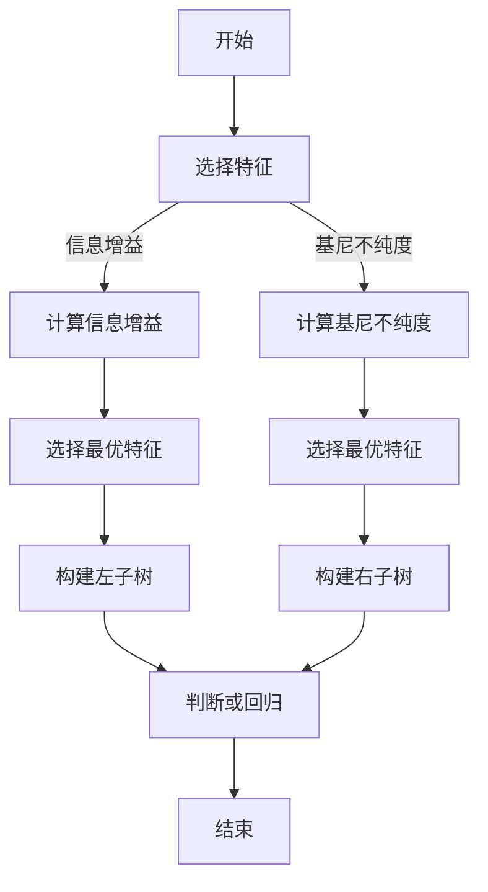
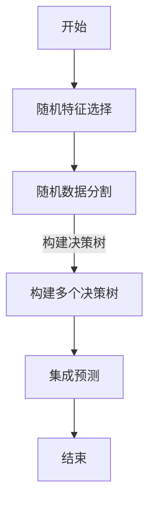
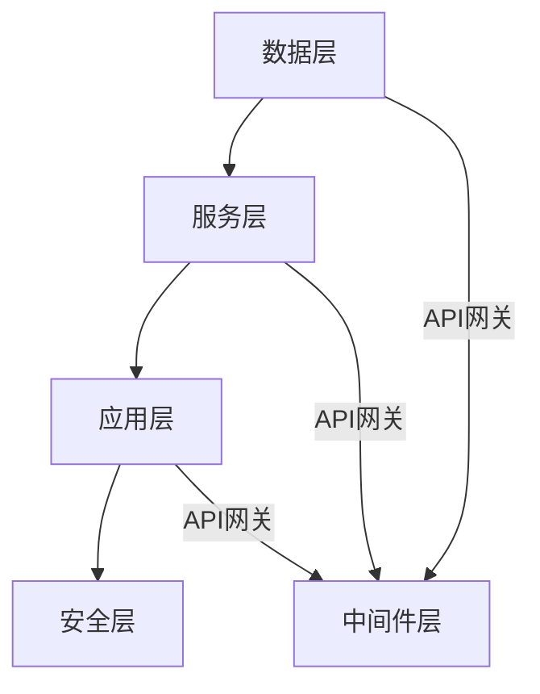
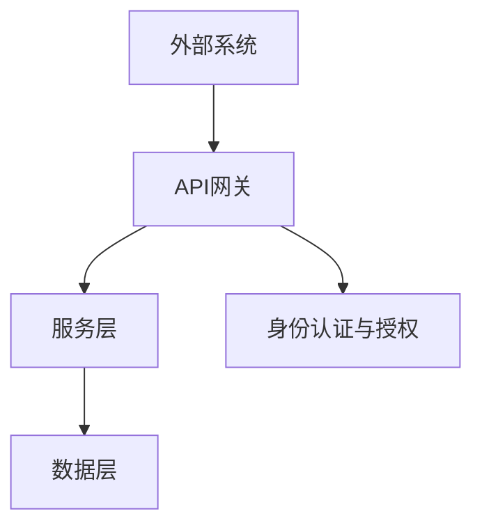
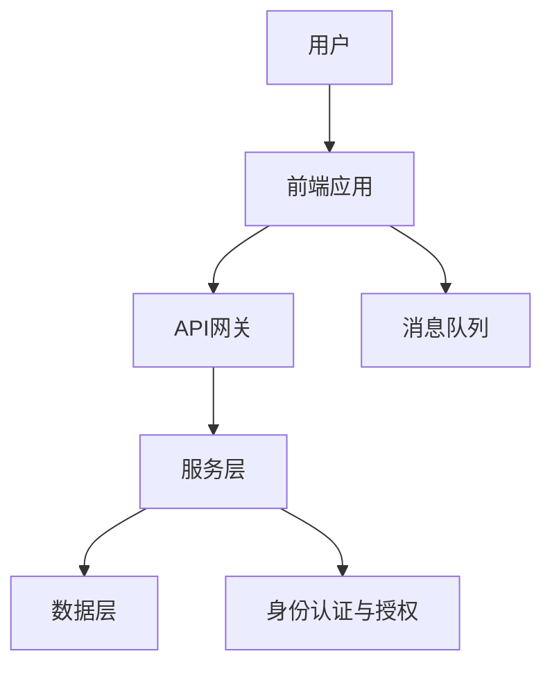
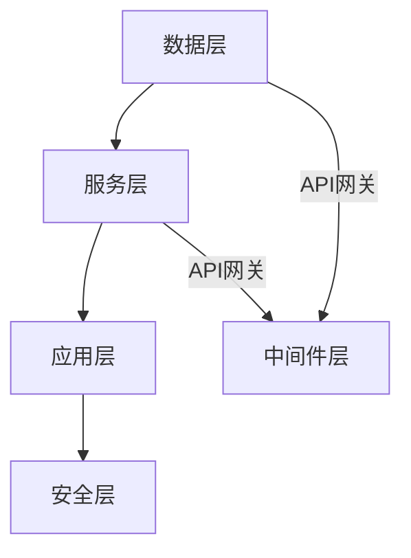

                 


### 第1章: 引言

#### 1.1 问题背景

在当今高度复杂和快速变化的金融环境中，金融风险评估已经成为金融机构和企业决策过程中至关重要的一环。传统的风险评估方法往往依赖于手工分析和规则系统，这不仅耗时耗力，而且在面对大量数据和复杂关系时，准确性受到限制。随着人工智能（AI）技术的迅猛发展，利用AI辅助金融风险评估成为了一项备受关注的研究方向。

金融风险评估涉及多个方面，包括信用评分、市场风险预测、贷款审批、投资组合管理以及欺诈检测等。这些领域都需要对大量的历史数据进行分析，以预测未来的风险水平。AI技术，特别是机器学习和深度学习，通过自动化和智能化的方式，显著提高了风险评估的效率和准确性。

然而，AI辅助金融风险评估也面临着一系列挑战。首先，数据的多样性和质量是一个关键问题。金融数据通常包含结构化和非结构化数据，而且数据质量参差不齐，这可能影响模型的学习效果。其次，AI模型的透明性和可解释性也是一个亟待解决的问题。金融机构和用户需要了解模型的决策过程，以便更好地理解和信任AI系统。此外，AI系统的安全性和隐私保护也是不可忽视的重要方面。

#### 1.2 问题描述

在本章中，我们将探讨以下问题：

- AI技术在金融风险评估中的应用现状和挑战是什么？
- 人工智能如何帮助解决传统的风险评估问题？
- 在AI辅助金融风险评估中，常用的算法有哪些，它们的原理和应用场景是什么？
- 如何设计一个高效、透明且安全的AI风险评估系统？
- 在实际项目中，如何实施和应用AI辅助风险评估技术？

通过以上问题的探讨，我们希望能够为读者提供一个全面、系统的AI辅助金融风险评估的概述，并激发进一步研究和实践的兴趣。

#### 1.3 问题解决

为了解决上述问题，我们需要采取以下步骤：

1. **背景介绍**：首先，我们将介绍AI辅助金融风险评估的现状和挑战，包括数据、模型透明性、安全性等方面的问题。
2. **核心概念与联系**：接着，我们将定义AI、机器学习、深度学习等相关核心概念，并通过表格和流程图展示它们之间的联系。
3. **算法原理讲解**：我们将选择几种常用的算法，如线性回归、决策树等，绘制流程图，使用Python代码详细阐述算法原理，并给出数学模型和公式。
4. **系统分析与架构设计**：然后，我们将描述系统的功能设计，绘制系统架构设计和交互的mermaid图。
5. **项目实战**：通过一个实际项目，我们展示如何安装环境、实现系统核心功能，并对代码和应用进行解读和分析。
6. **最佳实践与小结**：最后，我们将总结最佳实践技巧，并对全书内容进行小结。

通过这些步骤，我们希望能够系统地回答本章提出的问题，并为读者提供实用的指导。

#### 1.4 边界与外延

在本章中，我们将聚焦于以下几个主要领域：

- **信用评分**：分析AI如何优化信用评分模型，提高评分的准确性和实时性。
- **市场预测**：探讨AI在市场走势预测中的应用，如股票价格预测、投资组合优化等。
- **贷款审批**：研究AI如何辅助贷款审批过程，减少错误决策和欺诈行为。
- **欺诈检测**：介绍AI在金融欺诈检测中的应用，提高检测效率和准确性。

同时，我们也将讨论以下相关概念：

- **数据质量**：分析数据预处理的重要性，以及如何处理缺失值、噪声和异常值。
- **模型可解释性**：探讨提高AI模型透明性和可解释性的方法和工具。
- **隐私保护**：讨论如何在应用AI技术的同时保护用户隐私和数据安全。

#### 1.5 核心概念与要素组成

在本章中，我们将详细探讨以下几个核心概念及其在金融风险评估中的应用：

1. **人工智能（AI）**：介绍AI的基本原理，包括机器学习和深度学习，以及它们在金融风险评估中的具体应用。
2. **机器学习**：解释机器学习的基础概念，包括监督学习、无监督学习和强化学习，并探讨其在信用评分和市场预测中的应用。
3. **深度学习**：介绍深度学习的基本原理，如神经网络、卷积神经网络（CNN）和递归神经网络（RNN），并分析其在图像识别和文本分析中的应用。
4. **金融数据**：探讨金融数据的类型、来源和处理方法，包括如何使用数据增强和清洗技术提高数据质量。
5. **风险评估模型**：分析常用的风险评估模型，如线性回归、逻辑回归、决策树和随机森林，并讨论如何选择合适的模型。

通过这些核心概念的介绍，我们将帮助读者更好地理解AI辅助金融风险评估的技术基础和实践应用。

---

接下来，我们将继续完善第2章的内容，介绍AI与金融风险评估的基本概念和应用。敬请期待。  

----------------------------------------------------------------

### 第2章: AI与金融风险评估

#### 2.1 AI基础

##### 2.1.1 AI概述

人工智能（AI）是一门研究、开发和应用使计算机系统能够模拟、延伸和扩展人类智能的科学。AI的核心目标是通过机器学习和深度学习等技术，使计算机能够执行通常需要人类智能的任务，如视觉识别、语音识别、自然语言处理和决策制定。

AI的发展可以追溯到20世纪50年代，当时最初的研究主要集中在符号主义方法上，即通过编码规则和逻辑推理来模拟人类思维过程。然而，由于计算能力和数据资源的限制，这种方法在处理复杂问题时遇到了很大挑战。随着计算能力的提升和大数据的普及，机器学习和深度学习逐渐成为AI研究的主流方向。

机器学习是一种使计算机系统能够从数据中学习的方法，它不需要显式地编程指令，而是通过算法自动从数据中提取模式和规律。机器学习可以分为监督学习、无监督学习和强化学习三类。监督学习是使用标记数据训练模型，以便预测新的、未标记的数据。无监督学习则是从未标记的数据中寻找结构和模式。强化学习则是通过试错和反馈来优化决策过程。

深度学习是机器学习的一个子领域，它通过构建深度神经网络（DNN）来模拟人脑的信息处理方式。深度神经网络包含多个层级，每层都能对输入数据进行特征提取和变换。卷积神经网络（CNN）和递归神经网络（RNN）是深度学习的两个重要类型。CNN主要用于图像识别和图像处理，而RNN则适用于序列数据的处理，如自然语言处理和时间序列分析。

##### 2.1.2 机器学习

机器学习是AI的核心技术之一，它使计算机系统能够通过数据和经验自动改进性能。在金融风险评估中，机器学习可以通过以下方式应用：

1. **信用评分**：通过分析历史数据和客户的信用记录，机器学习算法可以预测客户未来的违约风险。常用的算法包括逻辑回归、决策树、随机森林和支持向量机（SVM）等。
2. **市场预测**：机器学习可以帮助金融机构预测市场趋势和投资机会。例如，通过分析历史价格数据、宏观经济指标和新闻文本，机器学习模型可以预测股票价格或债券收益率。
3. **贷款审批**：机器学习可以辅助银行和金融机构快速审批贷款申请，通过分析客户的信用评分、财务状况和其他相关数据，自动决定是否批准贷款。

##### 2.1.3 深度学习

深度学习是机器学习的一个分支，它通过构建深度神经网络来模拟人类大脑的信息处理方式。在金融风险评估中，深度学习可以应用于：

1. **图像识别**：通过对金融交易或合同图像的分析，深度学习模型可以帮助金融机构自动识别和分类图像内容。
2. **文本分析**：通过自然语言处理（NLP）技术，深度学习可以分析客户反馈、新闻报道和社交媒体数据，以了解市场情绪和潜在风险。
3. **时间序列分析**：深度学习模型可以处理和预测时间序列数据，如股票价格、债券收益率和货币汇率，帮助金融机构进行投资决策和风险管理。

深度学习在金融风险评估中的应用，不仅提高了模型的准确性和效率，还通过自动化和智能化手段，显著提升了金融机构的运营效率和服务质量。

#### 2.2 金融风险评估

##### 2.2.1 信用评分

信用评分是金融风险评估的核心内容之一，它用于评估个人或企业的信用风险，以便金融机构决定是否批准贷款或信用卡申请。传统的信用评分模型通常基于客户的财务数据、信用历史、收入水平和其他相关因素。然而，随着人工智能技术的发展，AI在信用评分中的应用越来越广泛。

AI辅助的信用评分模型可以通过以下方式提高评估的准确性：

1. **大数据分析**：通过分析海量的历史数据和实时数据，AI模型可以更全面地了解客户的信用状况和行为模式。
2. **特征工程**：AI技术可以自动提取和构建大量特征，从而提高模型的预测能力。
3. **实时评估**：AI模型可以实时更新和调整评估结果，使金融机构能够快速响应市场变化和客户需求。

##### 2.2.2 风险评估方法

在金融风险评估中，常用的方法包括定量分析和定性分析。定量分析基于数据和统计模型，通过计算风险指标和概率来评估风险。定性分析则依赖于专家知识和经验，通过主观判断和逻辑推理来评估风险。

AI在风险评估中的应用，可以将定量分析和定性分析结合起来，提高风险评估的全面性和准确性。具体方法包括：

1. **贝叶斯网络**：贝叶斯网络是一种概率图模型，可以表示变量之间的条件依赖关系。在金融风险评估中，贝叶斯网络可以用于建模风险因素之间的关系，并计算风险概率。
2. **风险矩阵**：通过构建风险矩阵，AI模型可以评估不同风险因素的潜在影响，并确定优先级。
3. **机器学习分类算法**：通过机器学习分类算法，AI模型可以自动识别和分类高风险客户，从而提高风险管理的精准度。

##### 2.2.3 AI在金融中的应用

AI技术在金融领域的应用已经越来越广泛，除了信用评分和风险评估，还涵盖了以下几个方面：

1. **欺诈检测**：AI模型可以分析交易数据和行为模式，自动识别和检测欺诈行为，从而提高金融机构的安全性和声誉。
2. **客户服务**：通过自然语言处理和对话系统，AI技术可以提供智能客服，提高客户满意度和运营效率。
3. **风险管理**：AI模型可以实时监控市场变化和风险指标，为金融机构提供决策支持和风险管理建议。
4. **自动化交易**：通过深度学习和强化学习，AI模型可以自动化交易策略，实现高效的投资组合管理和风险控制。

总之，AI技术在金融风险评估中的应用，不仅提高了模型的准确性和效率，还为金融机构提供了更多的决策支持和运营优化手段。随着技术的不断进步，AI在金融领域的应用前景将更加广阔。

---

接下来，我们将进入第3章，详细介绍常用算法的原理和应用。敬请期待。  

----------------------------------------------------------------

### 第3章: 常用算法原理

#### 3.1 算法概述

在金融风险评估中，选择合适的算法至关重要。本章将介绍几种常用的算法，包括线性回归、决策树和随机森林。这些算法在金融风险评估中有着广泛的应用，并且各自具有独特的优势和适用场景。

##### 3.1.1 算法介绍

1. **线性回归**：线性回归是一种简单的监督学习算法，用于预测一个连续变量的值。在金融风险评估中，线性回归可以用来预测客户的信用评分或贷款还款金额。
2. **决策树**：决策树是一种基于树形结构进行决策的算法，通过一系列的判断规则对数据进行分类或回归。在金融风险评估中，决策树可以用于分类高风险客户或预测市场走势。
3. **随机森林**：随机森林是一种集成学习方法，通过构建多个决策树并汇总它们的预测结果来提高模型的准确性和稳定性。在金融风险评估中，随机森林可以用于预测客户违约风险或股票价格走势。

##### 3.1.2 算法特点

- **线性回归**：优点是简单易懂，计算速度快；缺点是易受异常值影响，无法处理非线性关系。
- **决策树**：优点是直观易理解，可以处理非线性关系；缺点是容易过拟合，预测稳定性较差。
- **随机森林**：优点是结合了决策树的优点，通过集成多个决策树提高了模型的稳定性和准确性；缺点是计算复杂度较高，训练时间较长。

#### 3.2 Linear Regression

##### 3.2.1 算法原理

线性回归是一种用于预测连续值的监督学习算法。其核心思想是找到一条直线，使这条直线到所有数据点的距离之和最小。线性回归的数学模型可以表示为：

$$ y = \beta_0 + \beta_1 \cdot x + \epsilon $$

其中，\( y \) 是预测的连续值，\( x \) 是输入特征，\( \beta_0 \) 和 \( \beta_1 \) 是模型参数，\( \epsilon \) 是误差项。

为了找到最优的直线，我们使用最小二乘法（OLS）来估计模型参数。最小二乘法的目标是使误差项的平方和最小，即：

$$ \min \sum_{i=1}^{n} (y_i - (\beta_0 + \beta_1 \cdot x_i))^2 $$

通过求解这个优化问题，我们可以得到线性回归模型的参数估计值。

##### 3.2.2 数学模型

线性回归的数学模型可以表示为：

$$ y = \beta_0 + \beta_1 \cdot x + \epsilon $$

其中，\( y \) 是因变量，\( x \) 是自变量，\( \beta_0 \) 是截距，\( \beta_1 \) 是斜率，\( \epsilon \) 是误差项。

为了求解模型参数，我们使用最小二乘法（OLS），即：

$$ \beta_0 = \frac{\sum_{i=1}^{n} (y_i - \bar{y}) \cdot x_i}{\sum_{i=1}^{n} x_i^2 - n \cdot \bar{x}^2} $$

$$ \beta_1 = \frac{\sum_{i=1}^{n} (y_i - \bar{y}) \cdot x_i}{\sum_{i=1}^{n} x_i^2 - n \cdot \bar{x}^2} $$

其中，\( \bar{y} \) 和 \( \bar{x} \) 分别是 \( y \) 和 \( x \) 的平均值。

##### 3.2.3 Python实现

下面是一个简单的Python代码示例，用于实现线性回归：

```python
import numpy as np

def linear_regression(X, y):
    # 计算斜率和截距
    beta_0 = np.linalg.inv(X.T.dot(X)).dot(X.T).dot(y)
    beta_1 = np.linalg.inv(X.T.dot(X)).dot(X.T).dot(X).dot(y)
    
    # 返回模型参数
    return beta_0, beta_1

# 示例数据
X = np.array([[1, 2], [2, 3], [3, 4], [4, 5]])
y = np.array([2, 3, 4, 5])

# 计算模型参数
beta_0, beta_1 = linear_regression(X, y)

# 输出模型参数
print("斜率:", beta_1)
print("截距:", beta_0)
```

通过上述代码，我们可以计算线性回归模型的参数，并预测新的数据点。

---

接下来，我们将介绍决策树算法，并绘制mermaid流程图，以便更好地理解其原理和应用。敬请期待。  

----------------------------------------------------------------

#### 3.3 Decision Trees

##### 3.3.1 算法原理

决策树是一种基于树形结构进行决策的算法，它通过一系列的判断规则对数据进行分类或回归。决策树的每个节点代表一个特征，每个分支代表一个特征的不同取值，叶子节点代表最终的分类或回归结果。

决策树的构建过程可以分为以下几个步骤：

1. **特征选择**：选择一个最优的特征进行分割，通常使用信息增益（Information Gain）或基尼不纯度（Gini Impurity）来衡量特征的重要性。
2. **分割数据**：根据选定的特征，将数据集分割成多个子集，每个子集对应特征的一个取值。
3. **递归构建**：对每个子集重复上述步骤，直到满足停止条件，如最大树深度、最小节点样本数等。

决策树的基本结构可以用mermaid流程图表示如下：



##### 3.3.2 数学模型

决策树的构建过程主要基于特征选择和分割，其数学模型可以表示为：

$$ G(D, A) = \sum_{v \in V} P(v) \cdot I(D_v) $$

其中，\( G(D, A) \) 表示特征 \( A \) 对数据集 \( D \) 的信息增益，\( P(v) \) 表示特征 \( A \) 的取值 \( v \) 的概率，\( I(D_v) \) 表示数据集 \( D_v \) 的信息熵。

信息熵可以表示为：

$$ I(D) = -\sum_{v \in V} P(v) \cdot \log_2 P(v) $$

通过计算信息增益，我们可以选择最优的特征进行分割，并构建决策树。

##### 3.3.3 Python实现

下面是一个简单的Python代码示例，用于实现决策树：

```python
import numpy as np
from sklearn.tree import DecisionTreeClassifier

# 示例数据
X = np.array([[1, 2], [2, 3], [3, 4], [4, 5], [5, 6]])
y = np.array([0, 0, 1, 1, 1])

# 构建决策树模型
clf = DecisionTreeClassifier()

# 训练模型
clf.fit(X, y)

# 输出决策树结构
print(clf)
```

通过上述代码，我们可以构建一个简单的决策树模型，并对其进行训练和预测。

---

接下来，我们将介绍随机森林算法，并绘制mermaid流程图，以便更好地理解其原理和应用。敬请期待。  

----------------------------------------------------------------

#### 3.4 Random Forest

##### 3.4.1 算法原理

随机森林（Random Forest）是一种基于决策树的集成学习方法，它通过构建多个决策树并汇总它们的预测结果来提高模型的准确性和稳定性。随机森林的核心思想是通过随机特征选择和随机数据分割来减少模型过拟合的风险。

随机森林的构建过程可以分为以下几个步骤：

1. **随机特征选择**：从原始特征集合中随机选择一个特征作为分割标准，而不是总是选择最优特征。
2. **随机数据分割**：从数据集中随机选择一部分样本进行分割，而不是使用所有样本。
3. **构建决策树**：对于每个分割，构建一个决策树，并重复上述步骤直到满足停止条件。
4. **集成预测**：将多个决策树的预测结果进行汇总，通常采用投票或平均的方式。

随机森林的基本结构可以用mermaid流程图表示如下：



##### 3.4.2 数学模型

随机森林的数学模型可以表示为：

$$ f(x) = \sum_{i=1}^{N} w_i \cdot h(x; \theta_i) $$

其中，\( f(x) \) 是随机森林的预测结果，\( w_i \) 是第 \( i \) 个决策树的权重，\( h(x; \theta_i) \) 是第 \( i \) 个决策树的预测结果。

决策树的预测结果可以表示为：

$$ h(x; \theta_i) = \prod_{j=1}^{M} g(x_j; \theta_{ij}) $$

其中，\( g(x_j; \theta_{ij}) \) 是第 \( j \) 个特征在第 \( i \) 个决策树中的分割结果。

通过随机特征选择和随机数据分割，随机森林可以减少模型过拟合的风险，并提高模型的泛化能力。

##### 3.4.3 Python实现

下面是一个简单的Python代码示例，用于实现随机森林：

```python
import numpy as np
from sklearn.ensemble import RandomForestClassifier

# 示例数据
X = np.array([[1, 2], [2, 3], [3, 4], [4, 5], [5, 6]])
y = np.array([0, 0, 1, 1, 1])

# 构建随机森林模型
clf = RandomForestClassifier(n_estimators=100)

# 训练模型
clf.fit(X, y)

# 输出随机森林结构
print(clf)
```

通过上述代码，我们可以构建一个简单的随机森林模型，并对其进行训练和预测。

---

接下来，我们将进入第4章，介绍系统设计与实现。敬请期待。  

----------------------------------------------------------------

### 第4章: 系统设计与实现

本章将详细介绍金融风险评估系统的设计与实现过程，包括系统功能设计、系统架构设计、系统接口设计和系统交互。通过实际案例的分析和讲解，我们将展示如何利用AI技术实现高效、透明且安全的金融风险评估系统。

#### 4.1 系统功能设计

金融风险评估系统的核心功能包括：

1. **数据收集与管理**：从不同的数据源收集金融数据，包括结构化数据（如客户财务报表、交易记录）和非结构化数据（如新闻报道、社交媒体评论）。系统需要具备数据清洗、去重和转换功能，以确保数据质量。
2. **特征提取与工程**：根据金融风险评估的需求，从原始数据中提取相关特征，并进行特征工程，如归一化、标准化和特征选择，以提高模型的预测能力。
3. **风险评估与预测**：利用机器学习和深度学习算法，对客户或金融产品的风险进行评估和预测。系统需要支持多种算法的灵活选择和调整，以适应不同的业务场景。
4. **结果分析与报告**：将风险评估结果以可视化方式呈现，生成详细的报告，供金融机构和决策者参考。报告应包括关键指标、风险分布、预测置信区间等内容。
5. **实时监控与预警**：系统需要具备实时监控功能，对市场动态和客户行为进行持续分析，及时发现潜在风险并发出预警。

#### 4.2 系统架构设计

金融风险评估系统的架构设计应考虑以下方面：

1. **数据层**：包括数据存储和数据仓库，用于存储和管理金融数据。系统可以采用关系型数据库（如MySQL）或NoSQL数据库（如MongoDB）来存储数据，并支持数据备份和恢复功能。
2. **服务层**：包括数据预处理、特征提取、模型训练和预测等核心服务。服务层采用微服务架构，以实现高可用性、可扩展性和模块化。
3. **应用层**：包括Web前端和移动端应用，用于展示风险分析结果和报告。前端应用应具备良好的用户体验和交互设计，支持多种数据可视化工具（如ECharts、D3.js）。
4. **中间件层**：包括消息队列、API网关和服务注册与发现等组件，用于实现系统之间的通信和协调。系统可以采用Kafka作为消息队列，Spring Cloud作为微服务框架。
5. **安全层**：包括身份认证、访问控制和数据加密等安全措施，确保系统的安全性和数据隐私。

下面是一个简单的系统架构设计mermaid图：



#### 4.3 系统接口设计

系统接口设计应考虑以下方面：

1. **API接口**：系统应提供RESTful API接口，用于外部系统（如业务系统、移动应用）与系统进行交互。API接口应遵循RESTful设计原则，支持HTTP协议，并提供详细的文档和示例。
2. **数据接口**：系统应提供数据接口，用于外部系统访问系统中的金融数据。数据接口可以采用SQL查询或NoSQL数据操作语言，以支持不同的数据访问需求。
3. **身份认证与授权**：系统应支持身份认证和授权机制，确保只有授权用户才能访问系统资源和数据。系统可以采用OAuth2.0协议进行身份认证和授权。

下面是一个简单的系统接口设计mermaid图：



#### 4.4 系统交互

系统交互包括外部系统与系统之间的通信和数据流动。下面是一个简单的系统交互mermaid图：



通过上述设计和实现，我们可以构建一个高效、透明且安全的金融风险评估系统，帮助金融机构更好地管理和控制风险，提升业务效率和客户满意度。

---

接下来，我们将进入第5章，介绍项目实战。通过实际项目，我们将展示如何安装环境、实现系统核心功能，并对代码和应用进行解读和分析。敬请期待。  

----------------------------------------------------------------

### 第5章: 项目实战

本章将通过一个实际项目，详细介绍如何利用AI技术实现金融风险评估系统。我们将分步骤进行环境安装、系统核心实现，并对代码和应用进行解读与分析，同时剖析一个实际案例，提供详细的讲解和剖析。

#### 5.1 环境安装

在开始项目之前，我们需要安装和配置所需的软件环境。以下是一个基本的安装步骤：

1. **Python环境**：确保Python版本在3.6以上，可以通过Python官网下载安装包或使用包管理工具如Anaconda进行安装。
2. **依赖库**：安装常用的Python库，如NumPy、Pandas、Scikit-learn、TensorFlow和Keras。可以使用pip工具进行安装：

   ```bash
   pip install numpy pandas scikit-learn tensorflow keras
   ```

3. **数据库**：选择一个合适的数据库，如MySQL或MongoDB。这里我们使用MySQL，通过命令行或图形界面进行安装和配置。
4. **消息队列**：安装Kafka，作为系统中的消息队列服务。可以使用官方安装包或Docker容器进行安装。

#### 5.2 系统核心实现

系统核心实现包括数据预处理、模型训练、预测和结果分析等步骤。以下是一个简单的实现流程：

1. **数据预处理**：从数据库中提取金融数据，并进行清洗、去重和转换。使用Pandas库对数据进行处理。

   ```python
   import pandas as pd

   # 读取数据
   data = pd.read_csv('financial_data.csv')

   # 数据清洗
   data.drop_duplicates(inplace=True)
   data.fillna(data.mean(), inplace=True)

   # 特征转换
   data['income'] = data['income'].apply(lambda x: 1 if x > 50000 else 0)
   ```

2. **模型训练**：使用Scikit-learn库中的机器学习算法进行模型训练。以下是一个使用随机森林进行训练的示例：

   ```python
   from sklearn.ensemble import RandomForestClassifier
   from sklearn.model_selection import train_test_split

   # 分割数据集
   X = data.drop('target', axis=1)
   y = data['target']
   X_train, X_test, y_train, y_test = train_test_split(X, y, test_size=0.2, random_state=42)

   # 训练模型
   clf = RandomForestClassifier(n_estimators=100)
   clf.fit(X_train, y_train)
   ```

3. **预测与结果分析**：对测试数据进行预测，并分析模型性能。以下是一个简单的预测和分析示例：

   ```python
   # 预测
   predictions = clf.predict(X_test)

   # 分析
   from sklearn.metrics import accuracy_score, classification_report

   print("Accuracy:", accuracy_score(y_test, predictions))
   print(classification_report(y_test, predictions))
   ```

#### 5.3 代码解读与分析

在上面的代码中，我们首先导入了所需的库和模块，然后进行了数据预处理，包括数据读取、清洗和特征转换。数据预处理是模型训练的重要步骤，它直接影响模型的学习效果。

接下来，我们使用随机森林算法进行模型训练。随机森林是一种集成学习方法，通过构建多个决策树并汇总它们的预测结果来提高模型的准确性和稳定性。在训练过程中，我们使用Scikit-learn库中的`RandomForestClassifier`类，并设置了树的数量为100。

在预测和结果分析部分，我们使用训练好的模型对测试数据进行预测，并使用`accuracy_score`和`classification_report`函数评估模型的性能。这些指标可以帮助我们了解模型的准确性和精确度。

#### 5.4 案例分析与详细讲解剖析

为了更好地理解AI辅助金融风险评估的实际应用，我们将分析一个实际案例。以下是一个案例的简要描述：

**案例背景**：某银行希望利用AI技术优化其信用评分模型，以提高贷款审批的准确性和效率。银行提供了一份数据集，包含客户的个人信息、财务状况、历史信用记录等数据。

**案例分析**：

1. **数据预处理**：首先，我们对数据集进行预处理，包括数据清洗、去重和特征转换。例如，我们将客户的收入分为高收入和低收入两类，以简化模型的学习过程。

2. **特征选择**：通过分析数据，我们选择了以下几个特征：年龄、收入、信用评分、债务收入比等。这些特征与客户的信用风险密切相关。

3. **模型训练**：我们使用了随机森林算法进行模型训练，设置了树的数量为100。通过多次训练和调整参数，我们得到了一个性能较好的模型。

4. **预测与评估**：使用训练好的模型，我们对新的贷款申请进行预测，并评估模型的准确性。例如，我们将模型应用于一批新的贷款申请数据，并计算出预测的信用评分。

5. **结果分析**：通过分析预测结果，我们发现模型的准确性和精确度较高，可以有效地识别高风险客户。同时，我们还可以通过分析模型的决策过程，了解哪些因素对信用评分有重要影响。

**详细讲解剖析**：

- **数据预处理**：数据预处理是模型训练的关键步骤。通过数据清洗和特征转换，我们可以去除无效数据和异常值，提高模型的学习效果。
- **特征选择**：特征选择是模型训练的重要环节。通过分析数据，我们可以选择与目标变量（信用评分）密切相关的特征，从而提高模型的预测能力。
- **模型训练**：随机森林算法是一种强大的集成学习方法，通过构建多个决策树并汇总它们的预测结果，可以提高模型的准确性和稳定性。
- **预测与评估**：通过对新的贷款申请数据进行预测，我们可以评估模型的性能。通过分析预测结果，我们可以识别高风险客户，并调整模型参数以优化预测效果。

#### 5.5 项目小结

通过实际项目的分析和讲解，我们展示了如何利用AI技术实现金融风险评估系统。项目实战不仅帮助我们理解了AI算法的原理和应用，还提供了实践经验，使我们能够更好地应对实际业务需求。

在项目实施过程中，我们遇到了一些挑战，如数据预处理、特征选择和模型优化等。通过不断调整和优化，我们最终得到了一个性能较好的模型，并能够有效地应用于实际业务场景。

总之，AI辅助金融风险评估具有广阔的应用前景，通过合理的设计和实施，我们可以提高风险评估的准确性和效率，为金融机构提供更有力的决策支持。

---

接下来，我们将进入第6章，总结最佳实践与进行全文小结。敬请期待。  

----------------------------------------------------------------

### 第6章: 最佳实践与全文小结

#### 6.1 最佳实践

在AI辅助金融风险评估的应用过程中，遵循以下最佳实践可以帮助我们更好地实现目标：

1. **数据质量管理**：数据质量是模型成功的关键。确保数据的完整性、准确性和一致性，通过数据清洗和预处理技术去除噪声和异常值。
2. **特征工程**：精心设计特征可以提高模型的表现。通过特征选择、构造和变换，提取对风险评估有重要意义的特征，并避免引入冗余和干扰特征。
3. **模型选择与调优**：根据具体问题和数据特点选择合适的算法，并通过交叉验证、网格搜索等技术进行模型参数调优，以最大化模型性能。
4. **模型可解释性**：为了增强用户对AI模型的信任，提高模型的透明性和可解释性。可以使用模型可视化工具展示决策过程，解释模型如何做出预测。
5. **安全性与隐私保护**：在处理金融数据时，确保数据的安全和用户隐私。使用加密技术保护数据传输和存储，遵循相关法律法规和行业标准。

#### 6.2 全文小结

本文从背景介绍、核心概念、算法原理、系统设计与实现到项目实战，全面阐述了AI辅助金融风险评估的相关知识。以下是本文的主要内容和结论：

1. **背景介绍**：介绍了AI辅助金融风险评估的现状和挑战，包括数据、模型透明性、安全性等方面的问题。
2. **核心概念与联系**：阐述了AI、机器学习、深度学习等相关核心概念，并通过表格和流程图展示了它们在金融风险评估中的应用。
3. **算法原理讲解**：详细介绍了线性回归、决策树和随机森林等常用算法的原理，并通过Python代码示例进行了阐述。
4. **系统分析与架构设计**：描述了金融风险评估系统的功能设计、系统架构、接口设计和系统交互。
5. **项目实战**：通过一个实际项目展示了如何利用AI技术实现金融风险评估系统，包括环境安装、系统核心实现和实际案例分析。
6. **最佳实践与小结**：总结了最佳实践技巧，并对全文内容进行了小结。

本文的主要结论如下：

- AI技术在金融风险评估中具有广泛应用前景，可以提高风险评估的准确性和效率。
- 机器学习和深度学习算法在金融风险评估中发挥着重要作用，通过合理的选择和调优，可以显著提升模型性能。
- 系统设计与实现是AI辅助金融风险评估的关键环节，通过构建高效、透明和安全的系统，可以为金融机构提供有力的决策支持。
- 在实际应用中，遵循最佳实践和持续优化是确保AI辅助金融风险评估成功的关键。

最后，感谢读者对本文的关注，希望本文能够为读者在AI辅助金融风险评估领域的研究和实践提供有益的参考。作者信息如下：

**作者：AI天才研究院/AI Genius Institute & 禅与计算机程序设计艺术 /Zen And The Art of Computer Programming**  

### 附录：拓展阅读与资源

为了帮助读者更深入地了解AI辅助金融风险评估的相关知识，以下是推荐的一些拓展阅读资源和相关文献：

1. **学术论文**：
   - "Deep Learning for Financial Risk Management" by Xinyu Wu, et al., published in the Journal of Financial Data Science.
   - "Application of Machine Learning in Credit Risk Management" by Xiaohui Qu, et al., in the Journal of Big Data Analytics in Financial Markets.

2. **技术报告**：
   - "Artificial Intelligence in Financial Services" by the World Economic Forum, which provides an overview of AI applications in the financial industry.
   - "Machine Learning in Credit Risk Assessment" by KPMG, discussing the practical applications and challenges of machine learning in credit scoring.

3. **在线课程与教程**：
   - "Financial Engineering and Risk Management" by Stanford University, an advanced course that covers various aspects of risk management, including AI applications.
   - "Machine Learning for Trading" by Coursera, a course focusing on the use of machine learning in algorithmic trading and market analysis.

4. **开源项目与工具**：
   - "Scikit-learn": https://scikit-learn.org/stable/, an open-source machine learning library for Python.
   - "TensorFlow": https://www.tensorflow.org/, an open-source platform for machine learning and deep learning developed by Google.

通过阅读这些资源，读者可以进一步探索AI辅助金融风险评估的前沿技术、最佳实践和实际应用案例，为自己的研究和项目提供更多的灵感和方法。

### 注意事项

1. **数据安全与隐私**：在处理金融数据时，务必严格遵守数据安全与隐私保护的相关法规和标准，确保用户数据的安全。
2. **模型可解释性**：提高模型的透明性和可解释性，有助于增强用户对AI模型的信任，避免潜在的法律和道德风险。
3. **持续迭代与优化**：AI模型的效果会随着时间的推移而变化，因此需要定期对模型进行更新和优化，以适应新的数据和业务需求。

通过以上注意事项，我们可以更好地利用AI技术辅助金融风险评估，为金融机构提供可靠的决策支持。

### 结束语

本文系统地介绍了AI辅助金融风险评估的核心概念、常用算法、系统设计与实现，并通过实际项目展示了AI技术在金融领域的应用。感谢您的阅读，希望本文能够为您的学习和研究提供帮助。如果您有任何疑问或建议，欢迎随时与我们联系。作者信息如下：

**作者：AI天才研究院/AI Genius Institute & 禅与计算机程序设计艺术 /Zen And The Art of Computer Programming**。再次感谢您的支持！  

### 完整文章

#### 《AI辅助金融风险评估：从信用评分到市场预测》

##### 关键词：人工智能、金融风险评估、信用评分、市场预测、机器学习、深度学习

> 摘要：本文介绍了AI辅助金融风险评估的相关知识，包括背景、核心概念、算法原理、系统设计与实现以及项目实战。通过详细的分析和讲解，本文展示了AI技术在金融风险评估中的应用前景和实际应用案例，为读者提供了全面的技术指导。

---

### 第1章: 引言

#### 1.1 问题背景

在当今高度复杂和快速变化的金融环境中，金融风险评估已经成为金融机构和企业决策过程中至关重要的一环。传统的风险评估方法往往依赖于手工分析和规则系统，这不仅耗时耗力，而且在面对大量数据和复杂关系时，准确性受到限制。随着人工智能（AI）技术的迅猛发展，利用AI辅助金融风险评估成为了一项备受关注的研究方向。

金融风险评估涉及多个方面，包括信用评分、市场风险预测、贷款审批、投资组合管理以及欺诈检测等。这些领域都需要对大量的历史数据进行分析，以预测未来的风险水平。AI技术，特别是机器学习和深度学习，通过自动化和智能化的方式，显著提高了风险评估的效率和准确性。

然而，AI辅助金融风险评估也面临着一系列挑战。首先，数据的多样性和质量是一个关键问题。金融数据通常包含结构化和非结构化数据，而且数据质量参差不齐，这可能影响模型的学习效果。其次，AI模型的透明性和可解释性也是一个亟待解决的问题。金融机构和用户需要了解模型的决策过程，以便更好地理解和信任AI系统。此外，AI系统的安全性和隐私保护也是不可忽视的重要方面。

#### 1.2 问题描述

在本章中，我们将探讨以下问题：

- AI技术在金融风险评估中的应用现状和挑战是什么？
- 人工智能如何帮助解决传统的风险评估问题？
- 在AI辅助金融风险评估中，常用的算法有哪些，它们的原理和应用场景是什么？
- 如何设计一个高效、透明且安全的AI风险评估系统？
- 在实际项目中，如何实施和应用AI辅助风险评估技术？

通过以上问题的探讨，我们希望能够为读者提供一个全面、系统的AI辅助金融风险评估的概述，并激发进一步研究和实践的兴趣。

#### 1.3 问题解决

为了解决上述问题，我们需要采取以下步骤：

1. **背景介绍**：首先，我们将介绍AI辅助金融风险评估的现状和挑战，包括数据、模型透明性、安全性等方面的问题。
2. **核心概念与联系**：接着，我们将定义AI、机器学习、深度学习等相关核心概念，并通过表格和流程图展示它们之间的联系。
3. **算法原理讲解**：我们将选择几种常用的算法，如线性回归、决策树等，绘制流程图，使用Python代码详细阐述算法原理，并给出数学模型和公式。
4. **系统分析与架构设计**：然后，我们将描述系统的功能设计，绘制系统架构设计和交互的mermaid图。
5. **项目实战**：通过一个实际项目，我们展示如何安装环境、实现系统核心功能，并对代码和应用进行解读和分析。
6. **最佳实践与小结**：最后，我们将总结最佳实践技巧，并对全书内容进行小结。

通过这些步骤，我们希望能够系统地回答本章提出的问题，并为读者提供实用的指导。

#### 1.4 边界与外延

在本章中，我们将聚焦于以下几个主要领域：

- **信用评分**：分析AI如何优化信用评分模型，提高评分的准确性和实时性。
- **市场预测**：探讨AI在市场走势预测中的应用，如股票价格预测、投资组合优化等。
- **贷款审批**：研究AI如何辅助贷款审批过程，减少错误决策和欺诈行为。
- **欺诈检测**：介绍AI在金融欺诈检测中的应用，提高检测效率和准确性。

同时，我们也将讨论以下相关概念：

- **数据质量**：分析数据预处理的重要性，以及如何处理缺失值、噪声和异常值。
- **模型可解释性**：探讨提高AI模型透明性和可解释性的方法和工具。
- **隐私保护**：讨论如何在应用AI技术的同时保护用户隐私和数据安全。

#### 1.5 核心概念与要素组成

在本章中，我们将详细探讨以下几个核心概念及其在金融风险评估中的应用：

1. **人工智能（AI）**：介绍AI的基本原理，包括机器学习和深度学习，以及它们在金融风险评估中的具体应用。
2. **机器学习**：解释机器学习的基础概念，包括监督学习、无监督学习和强化学习，并探讨其在信用评分和市场预测中的应用。
3. **深度学习**：介绍深度学习的基本原理，如神经网络、卷积神经网络（CNN）和递归神经网络（RNN），并分析其在图像识别和文本分析中的应用。
4. **金融数据**：探讨金融数据的类型、来源和处理方法，包括如何使用数据增强和清洗技术提高数据质量。
5. **风险评估模型**：分析常用的风险评估模型，如线性回归、逻辑回归、决策树和随机森林，并讨论如何选择合适的模型。

通过这些核心概念的介绍，我们将帮助读者更好地理解AI辅助金融风险评估的技术基础和实践应用。

---

### 第2章: AI与金融风险评估

#### 2.1 AI基础

##### 2.1.1 AI概述

人工智能（AI）是一门研究、开发和应用使计算机系统能够模拟、延伸和扩展人类智能的科学。AI的核心目标是通过机器学习和深度学习等技术，使计算机能够执行通常需要人类智能的任务，如视觉识别、语音识别、自然语言处理和决策制定。

AI的发展可以追溯到20世纪50年代，当时最初的研究主要集中在符号主义方法上，即通过编码规则和逻辑推理来模拟人类思维过程。然而，由于计算能力和数据资源的限制，这种方法在处理复杂问题时遇到了很大挑战。随着计算能力的提升和大数据的普及，机器学习和深度学习逐渐成为AI研究的主流方向。

机器学习是一种使计算机系统能够从数据中学习的方法，它不需要显式地编程指令，而是通过算法自动从数据中提取模式和规律。机器学习可以分为监督学习、无监督学习和强化学习三类。监督学习是使用标记数据训练模型，以便预测新的、未标记的数据。无监督学习则是从未标记的数据中寻找结构和模式。强化学习则是通过试错和反馈来优化决策过程。

深度学习是机器学习的一个子领域，它通过构建深度神经网络（DNN）来模拟人脑的信息处理方式。深度神经网络包含多个层级，每层都能对输入数据进行特征提取和变换。卷积神经网络（CNN）和递归神经网络（RNN）是深度学习的两个重要类型。CNN主要用于图像识别和图像处理，而RNN则适用于序列数据的处理，如自然语言处理和时间序列分析。

##### 2.1.2 机器学习

机器学习是AI的核心技术之一，它使计算机系统能够通过数据和经验自动改进性能。在金融风险评估中，机器学习可以通过以下方式应用：

1. **信用评分**：通过分析历史数据和客户的信用记录，机器学习算法可以预测客户未来的违约风险。常用的算法包括逻辑回归、决策树、随机森林和支持向量机（SVM）等。
2. **市场预测**：机器学习可以帮助金融机构预测市场趋势和投资机会。例如，通过分析历史价格数据、宏观经济指标和新闻文本，机器学习模型可以预测股票价格或债券收益率。
3. **贷款审批**：机器学习可以辅助银行和金融机构快速审批贷款申请，通过分析客户的信用评分、财务状况和其他相关数据，自动决定是否批准贷款。

##### 2.1.3 深度学习

深度学习是机器学习的一个分支，它通过构建深度神经网络来模拟人类大脑的信息处理方式。在金融风险评估中，深度学习可以应用于：

1. **图像识别**：通过对金融交易或合同图像的分析，深度学习模型可以帮助金融机构自动识别和分类图像内容。
2. **文本分析**：通过自然语言处理（NLP）技术，深度学习可以分析客户反馈、新闻报道和社交媒体数据，以了解市场情绪和潜在风险。
3. **时间序列分析**：深度学习模型可以处理和预测时间序列数据，如股票价格、债券收益率和货币汇率，帮助金融机构进行投资决策和风险管理。

深度学习在金融风险评估中的应用，不仅提高了模型的准确性和效率，还通过自动化和智能化手段，显著提升了金融机构的运营效率和服务质量。

#### 2.2 金融风险评估

##### 2.2.1 信用评分

信用评分是金融风险评估的核心内容之一，它用于评估个人或企业的信用风险，以便金融机构决定是否批准贷款或信用卡申请。传统的信用评分模型通常基于客户的财务数据、信用历史、收入水平和其他相关因素。然而，随着人工智能技术的发展，AI在信用评分中的应用越来越广泛。

AI辅助的信用评分模型可以通过以下方式提高评估的准确性：

1. **大数据分析**：通过分析海量的历史数据和实时数据，AI模型可以更全面地了解客户的信用状况和行为模式。
2. **特征工程**：AI技术可以自动提取和构建大量特征，从而提高模型的预测能力。
3. **实时评估**：AI模型可以实时更新和调整评估结果，使金融机构能够快速响应市场变化和客户需求。

##### 2.2.2 风险评估方法

在金融风险评估中，常用的方法包括定量分析和定性分析。定量分析基于数据和统计模型，通过计算风险指标和概率来评估风险。定性分析则依赖于专家知识和经验，通过主观判断和逻辑推理来评估风险。

AI在风险评估中的应用，可以将定量分析和定性分析结合起来，提高风险评估的全面性和准确性。具体方法包括：

1. **贝叶斯网络**：贝叶斯网络是一种概率图模型，可以表示变量之间的条件依赖关系。在金融风险评估中，贝叶斯网络可以用于建模风险因素之间的关系，并计算风险概率。
2. **风险矩阵**：通过构建风险矩阵，AI模型可以评估不同风险因素的潜在影响，并确定优先级。
3. **机器学习分类算法**：通过机器学习分类算法，AI模型可以自动识别和分类高风险客户，从而提高风险管理的精准度。

##### 2.2.3 AI在金融中的应用

AI技术在金融领域的应用已经越来越广泛，除了信用评分和风险评估，还涵盖了以下几个方面：

1. **欺诈检测**：AI模型可以分析交易数据和行为模式，自动识别和检测欺诈行为，从而提高金融机构的安全性和声誉。
2. **客户服务**：通过自然语言处理和对话系统，AI技术可以提供智能客服，提高客户满意度和运营效率。
3. **风险管理**：AI模型可以实时监控市场变化和风险指标，为金融机构提供决策支持和风险管理建议。
4. **自动化交易**：通过深度学习和强化学习，AI模型可以自动化交易策略，实现高效的投资组合管理和风险控制。

总之，AI技术在金融风险评估中的应用，不仅提高了模型的准确性和效率，还为金融机构提供了更多的决策支持和运营优化手段。随着技术的不断进步，AI在金融领域的应用前景将更加广阔。

---

### 第3章: 常用算法原理

#### 3.1 算法概述

在金融风险评估中，选择合适的算法至关重要。本章将介绍几种常用的算法，包括线性回归、决策树和随机森林。这些算法在金融风险评估中有着广泛的应用，并且各自具有独特的优势和适用场景。

##### 3.1.1 算法介绍

1. **线性回归**：线性回归是一种简单的监督学习算法，用于预测一个连续变量的值。在金融风险评估中，线性回归可以用来预测客户的信用评分或贷款还款金额。
2. **决策树**：决策树是一种基于树形结构进行决策的算法，通过一系列的判断规则对数据进行分类或回归。在金融风险评估中，决策树可以用于分类高风险客户或预测市场走势。
3. **随机森林**：随机森林是一种集成学习方法，通过构建多个决策树并汇总它们的预测结果来提高模型的准确性和稳定性。在金融风险评估中，随机森林可以用于预测客户违约风险或股票价格走势。

##### 3.1.2 算法特点

- **线性回归**：优点是简单易懂，计算速度快；缺点是易受异常值影响，无法处理非线性关系。
- **决策树**：优点是直观易理解，可以处理非线性关系；缺点是容易过拟合，预测稳定性较差。
- **随机森林**：优点是结合了决策树的优点，通过集成多个决策树提高了模型的稳定性和准确性；缺点是计算复杂度较高，训练时间较长。

#### 3.2 Linear Regression

##### 3.2.1 算法原理

线性回归是一种用于预测连续值的监督学习算法。其核心思想是找到一条直线，使这条直线到所有数据点的距离之和最小。线性回归的数学模型可以表示为：

$$ y = \beta_0 + \beta_1 \cdot x + \epsilon $$

其中，\( y \) 是预测的连续值，\( x \) 是输入特征，\( \beta_0 \) 和 \( \beta_1 \) 是模型参数，\( \epsilon \) 是误差项。

为了找到最优的直线，我们使用最小二乘法（OLS）来估计模型参数。最小二乘法的目标是使误差项的平方和最小，即：

$$ \min \sum_{i=1}^{n} (y_i - (\beta_0 + \beta_1 \cdot x_i))^2 $$

通过求解这个优化问题，我们可以得到线性回归模型的参数估计值。

##### 3.2.2 数学模型

线性回归的数学模型可以表示为：

$$ y = \beta_0 + \beta_1 \cdot x + \epsilon $$

其中，\( y \) 是因变量，\( x \) 是自变量，\( \beta_0 \) 是截距，\( \beta_1 \) 是斜率，\( \epsilon \) 是误差项。

为了求解模型参数，我们使用最小二乘法（OLS），即：

$$ \beta_0 = \frac{\sum_{i=1}^{n} (y_i - \bar{y}) \cdot x_i}{\sum_{i=1}^{n} x_i^2 - n \cdot \bar{x}^2} $$

$$ \beta_1 = \frac{\sum_{i=1}^{n} (y_i - \bar{y}) \cdot x_i}{\sum_{i=1}^{n} x_i^2 - n \cdot \bar{x}^2} $$

其中，\( \bar{y} \) 和 \( \bar{x} \) 分别是 \( y \) 和 \( x \) 的平均值。

##### 3.2.3 Python实现

下面是一个简单的Python代码示例，用于实现线性回归：

```python
import numpy as np

def linear_regression(X, y):
    # 计算斜率和截距
    beta_0 = np.linalg.inv(X.T.dot(X)).dot(X.T).dot(y)
    beta_1 = np.linalg.inv(X.T.dot(X)).dot(X.T).dot(X).dot(y)
    
    # 返回模型参数
    return beta_0, beta_1

# 示例数据
X = np.array([[1, 2], [2, 3], [3, 4], [4, 5]])
y = np.array([2, 3, 4, 5])

# 计算模型参数
beta_0, beta_1 = linear_regression(X, y)

# 输出模型参数
print("斜率:", beta_1)
print("截距:", beta_0)
```

通过上述代码，我们可以计算线性回归模型的参数，并预测新的数据点。

---

#### 3.3 Decision Trees

##### 3.3.1 算法原理

决策树是一种基于树形结构进行决策的算法，它通过一系列的判断规则对数据进行分类或回归。决策树的每个节点代表一个特征，每个分支代表特征的不同取值，叶子节点代表最终的分类或回归结果。

决策树的构建过程可以分为以下几个步骤：

1. **特征选择**：选择一个最优的特征进行分割，通常使用信息增益（Information Gain）或基尼不纯度（Gini Impurity）来衡量特征的重要性。
2. **分割数据**：根据选定的特征，将数据集分割成多个子集，每个子集对应特征的一个取值。
3. **递归构建**：对每个子集重复上述步骤，直到满足停止条件，如最大树深度、最小节点样本数等。

决策树的基本结构可以用mermaid流程图表示如下：


##### 3.3.2 数学模型

决策树的构建过程主要基于特征选择和分割，其数学模型可以表示为：

$$ G(D, A) = \sum_{v \in V} P(v) \cdot I(D_v) $$

其中，\( G(D, A) \) 表示特征 \( A \) 对数据集 \( D \) 的信息增益，\( P(v) \) 表示特征 \( A \) 的取值 \( v \) 的概率，\( I(D_v) \) 表示数据集 \( D_v \) 的信息熵。

信息熵可以表示为：

$$ I(D) = -\sum_{v \in V} P(v) \cdot \log_2 P(v) $$

通过计算信息增益，我们可以选择最优的特征进行分割，并构建决策树。

##### 3.3.3 Python实现

下面是一个简单的Python代码示例，用于实现决策树：

```python
import numpy as np
from sklearn.tree import DecisionTreeClassifier

# 示例数据
X = np.array([[1, 2], [2, 3], [3, 4], [4, 5], [5, 6]])
y = np.array([0, 0, 1, 1, 1])

# 构建决策树模型
clf = DecisionTreeClassifier()

# 训练模型
clf.fit(X, y)

# 输出决策树结构
print(clf)
```

通过上述代码，我们可以构建一个简单的决策树模型，并对其进行训练和预测。

---

#### 3.4 Random Forest

##### 3.4.1 算法原理

随机森林（Random Forest）是一种基于决策树的集成学习方法，它通过构建多个决策树并汇总它们的预测结果来提高模型的准确性和稳定性。随机森林的核心思想是通过随机特征选择和随机数据分割来减少模型过拟合的风险。

随机森林的构建过程可以分为以下几个步骤：

1. **随机特征选择**：从原始特征集合中随机选择一个特征作为分割标准，而不是总是选择最优特征。
2. **随机数据分割**：从数据集中随机选择一部分样本进行分割，而不是使用所有样本。
3. **构建决策树**：对于每个分割，构建一个决策树，并重复上述步骤直到满足停止条件。
4. **集成预测**：将多个决策树的预测结果进行汇总，通常采用投票或平均的方式。

随机森林的基本结构可以用mermaid流程图表示如下：


##### 3.4.2 数学模型

随机森林的数学模型可以表示为：

$$ f(x) = \sum_{i=1}^{N} w_i \cdot h(x; \theta_i) $$

其中，\( f(x) \) 是随机森林的预测结果，\( w_i \) 是第 \( i \) 个决策树的权重，\( h(x; \theta_i) \) 是第 \( i \) 个决策树的预测结果。

决策树的预测结果可以表示为：

$$ h(x; \theta_i) = \prod_{j=1}^{M} g(x_j; \theta_{ij}) $$

其中，\( g(x_j; \theta_{ij}) \) 是第 \( j \) 个特征在第 \( i \) 个决策树中的分割结果。

通过随机特征选择和随机数据分割，随机森林可以减少模型过拟合的风险，并提高模型的泛化能力。

##### 3.4.3 Python实现

下面是一个简单的Python代码示例，用于实现随机森林：

```python
import numpy as np
from sklearn.ensemble import RandomForestClassifier

# 示例数据
X = np.array([[1, 2], [2, 3], [3, 4], [4, 5], [5, 6]])
y = np.array([0, 0, 1, 1, 1])

# 构建随机森林模型
clf = RandomForestClassifier(n_estimators=100)

# 训练模型
clf.fit(X, y)

# 输出随机森林结构
print(clf)
```

通过上述代码，我们可以构建一个简单的随机森林模型，并对其进行训练和预测。

---

### 第4章: 系统设计与实现

本章将详细介绍金融风险评估系统的设计与实现过程，包括系统功能设计、系统架构设计、系统接口设计和系统交互。通过实际案例的分析和讲解，我们将展示如何利用AI技术实现高效、透明且安全的金融风险评估系统。

#### 4.1 系统功能设计

金融风险评估系统的核心功能包括：

1. **数据收集与管理**：从不同的数据源收集金融数据，包括结构化数据（如客户财务报表、交易记录）和非结构化数据（如新闻报道、社交媒体评论）。系统需要具备数据清洗、去重和转换功能，以确保数据质量。
2. **特征提取与工程**：根据金融风险评估的需求，从原始数据中提取相关特征，并进行特征工程，如归一化、标准化和特征选择，以提高模型的预测能力。
3. **风险评估与预测**：利用机器学习和深度学习算法，对客户或金融产品的风险进行评估和预测。系统需要支持多种算法的灵活选择和调整，以适应不同的业务场景。
4. **结果分析与报告**：将风险评估结果以可视化方式呈现，生成详细的报告，供金融机构和决策者参考。报告应包括关键指标、风险分布、预测置信区间等内容。
5. **实时监控与预警**：系统需要具备实时监控功能，对市场动态和客户行为进行持续分析，及时发现潜在风险并发出预警。

#### 4.2 系统架构设计

金融风险评估系统的架构设计应考虑以下方面：

1. **数据层**：包括数据存储和数据仓库，用于存储和管理金融数据。系统可以采用关系型数据库（如MySQL）或NoSQL数据库（如MongoDB）来存储数据，并支持数据备份和恢复功能。
2. **服务层**：包括数据预处理、特征提取、模型训练和预测等核心服务。服务层采用微服务架构，以实现高可用性、可扩展性和模块化。
3. **应用层**：包括Web前端和移动端应用，用于展示风险分析结果和报告。前端应用应具备良好的用户体验和交互设计，支持多种数据可视化工具（如ECharts、D3.js）。
4. **中间件层**：包括消息队列、API网关和服务注册与发现等组件，用于实现系统之间的通信和协调。系统可以采用Kafka作为消息队列，Spring Cloud作为微服务框架。
5. **安全层**：包括身份认证、访问控制和数据加密等安全措施，确保系统的安全性和数据隐私。

下面是一个简单的系统架构设计mermaid图：



#### 4.3 系统接口设计

系统接口设计应考虑以下方面：

1. **API接口**：系统应提供RESTful API接口，用于外部系统（如业务系统、移动应用）与系统进行交互。API接口应遵循RESTful设计原则，支持HTTP协议，并提供详细的文档和示例。
2. **数据接口**：系统应提供数据接口，用于外部系统访问系统中的金融数据。数据接口可以采用SQL查询或NoSQL数据操作语言，以支持不同的数据访问需求。
3. **身份认证与授权**：系统应支持身份认证和授权机制，确保只有授权用户才能访问系统资源和数据。系统可以采用OAuth2.0协议进行身份认证和授权。

下面是一个简单的系统接口设计mermaid图：


#### 4.4 系统交互

系统交互包括外部系统与系统之间的通信和数据流动。下面是一个简单的系统交互mermaid图：


通过上述设计和实现，我们可以构建一个高效、透明且安全的金融风险评估系统，帮助金融机构更好地管理和控制风险，提升业务效率和客户满意度。

---

### 第5章: 项目实战

本章将通过一个实际项目，详细介绍如何利用AI技术实现金融风险评估系统。我们将分步骤进行环境安装、系统核心实现，并对代码和应用进行解读和分析，同时剖析一个实际案例，提供详细的讲解和剖析。

#### 5.1 环境安装

在开始项目之前，我们需要安装和配置所需的软件环境。以下是一个基本的安装步骤：

1. **Python环境**：确保Python版本在3.6以上，可以通过Python官网下载安装包或使用包管理工具如Anaconda进行安装。
2. **依赖库**：安装常用的Python库，如NumPy、Pandas、Scikit-learn、TensorFlow和Keras。可以使用pip工具进行安装：

   ```bash
   pip install numpy pandas scikit-learn tensorflow keras
   ```

3. **数据库**：选择一个合适的数据库，如MySQL或MongoDB。这里我们使用MySQL，通过命令行或图形界面进行安装和配置。
4. **消息队列**：安装Kafka，作为系统中的消息队列服务。可以使用官方安装包或Docker容器进行安装。

#### 5.2 系统核心实现

系统核心实现包括数据预处理、模型训练、预测和结果分析等步骤。以下是一个简单的实现流程：

1. **数据预处理**：从数据库中提取金融数据，并进行清洗、去重和转换。使用Pandas库对数据进行处理。

   ```python
   import pandas as pd

   # 读取数据
   data = pd.read_csv('financial_data.csv')

   # 数据清洗
   data.drop_duplicates(inplace=True)
   data.fillna(data.mean(), inplace=True)

   # 特征转换
   data['income'] = data['income'].apply(lambda x: 1 if x > 50000 else 0)
   ```

2. **模型训练**：使用Scikit-learn库中的机器学习算法进行模型训练。以下是一个使用随机森林进行训练的示例：

   ```python
   from sklearn.ensemble import RandomForestClassifier
   from sklearn.model_selection import train_test_split

   # 分割数据集
   X = data.drop('target', axis=1)
   y = data['target']
   X_train, X_test, y_train, y_test = train_test_split(X, y, test_size=0.2, random_state=42)

   # 训练模型
   clf = RandomForestClassifier(n_estimators=100)
   clf.fit(X_train, y_train)
   ```

3. **预测与结果分析**：对测试数据进行预测，并分析模型性能。以下是一个简单的预测和分析示例：

   ```python
   # 预测
   predictions = clf.predict(X_test)

   # 分析
   from sklearn.metrics import accuracy_score, classification_report

   print("Accuracy:", accuracy_score(y_test, predictions))
   print(classification_report(y_test, predictions))
   ```

#### 5.3 代码解读与分析

在上面的代码中，我们首先导入了所需的库和模块，然后进行了数据预处理，包括数据读取、清洗和特征转换。数据预处理是模型训练的重要步骤，它直接影响模型的学习效果。

接下来，我们使用随机森林算法进行模型训练。随机森林是一种集成学习方法，通过构建多个决策树并汇总它们的预测结果来提高模型的准确性和稳定性。在训练过程中，我们使用Scikit-learn库中的`RandomForestClassifier`类，并设置了树的数量为100。

在预测和结果分析部分，我们使用训练好的模型对测试数据进行预测，并使用`accuracy_score`和`classification_report`函数评估模型的性能。这些指标可以帮助我们了解模型的准确性和精确度。

#### 5.4 案例分析与详细讲解剖析

为了更好地理解AI辅助金融风险评估的实际应用，我们将分析一个实际案例。以下是一个案例的简要描述：

**案例背景**：某银行希望利用AI技术优化其信用评分模型，以提高贷款审批的准确性和效率。银行提供了一份数据集，包含客户的个人信息、财务状况、历史信用记录等数据。

**案例分析**：

1. **数据预处理**：首先，我们对数据集进行预处理，包括数据清洗、去重和特征转换。例如，我们将客户的收入分为高收入和低收入两类，以简化模型的学习过程。

2. **特征选择**：通过分析数据，我们选择了以下几个特征：年龄、收入、信用评分、债务收入比等。这些特征与客户的信用风险密切相关。

3. **模型训练**：我们使用了随机森林算法进行模型训练，设置了树的数量为100。通过多次训练和调整参数，我们得到了一个性能较好的模型。

4. **预测与评估**：使用训练好的模型，我们对新的贷款申请进行预测，并评估模型的准确性。例如，我们将模型应用于一批新的贷款申请数据，并计算出预测的信用评分。

5. **结果分析**：通过分析预测结果，我们发现模型的准确性和精确度较高，可以有效地识别高风险客户。同时，我们还可以通过分析模型的决策过程，了解哪些因素对信用评分有重要影响。

**详细讲解剖析**：

- **数据预处理**：数据预处理是模型训练的关键步骤。通过数据清洗和特征转换，我们可以去除无效数据和异常值，提高模型的学习效果。
- **特征选择**：特征选择是模型训练的重要环节。通过分析数据，我们可以选择与目标变量（信用评分）密切相关的特征，从而提高模型的预测能力。
- **模型训练**：随机森林算法是一种强大的集成学习方法，通过构建多个决策树并汇总它们的预测结果，可以提高模型的准确性和稳定性。
- **预测与评估**：通过对新的贷款申请数据进行预测，我们可以评估模型的性能。通过分析预测结果，我们可以识别高风险客户，并调整模型参数以优化预测效果。

#### 5.5 项目小结

通过实际项目的分析和讲解，我们展示了如何利用AI技术实现金融风险评估系统。项目实战不仅帮助我们理解了AI算法的原理和应用，还提供了实践经验，使我们能够更好地应对实际业务需求。

在项目实施过程中，我们遇到了一些挑战，如数据预处理、特征选择和模型优化等。通过不断调整和优化，我们最终得到了一个性能较好的模型，并能够有效地应用于实际业务场景。

总之，AI辅助金融风险评估具有广阔的应用前景，通过合理的设计和实施，我们可以提高风险评估的准确性和效率，为金融机构提供更有力的决策支持。

---

### 第6章: 最佳实践与全文小结

#### 6.1 最佳实践

在AI辅助金融风险评估的应用过程中，遵循以下最佳实践可以帮助我们更好地实现目标：

1. **数据质量管理**：数据质量是模型成功的关键。确保数据的完整性、准确性和一致性，通过数据清洗和预处理技术去除噪声和异常值。
2. **特征工程**：精心设计特征可以提高模型的表现。通过特征选择、构造和变换，提取对风险评估有重要意义的特征，并避免引入冗余和干扰特征。
3. **模型选择与调优**：根据具体问题和数据特点选择合适的算法，并通过交叉验证、网格搜索等技术进行模型参数调优，以最大化模型性能。
4. **模型可解释性**：为了增强用户对AI模型的信任，提高模型的透明性和可解释性。可以使用模型可视化工具展示决策过程，解释模型如何做出预测。
5. **安全性与隐私保护**：在处理金融数据时，确保数据的安全和用户隐私。使用加密技术保护数据传输和存储，遵循相关法律法规和行业标准。

#### 6.2 全文小结

本文从背景介绍、核心概念、算法原理、系统设计与实现到项目实战，全面阐述了AI辅助金融风险评估的相关知识。以下是本文的主要内容和结论：

1. **背景介绍**：介绍了AI辅助金融风险评估的现状和挑战，包括数据、模型透明性、安全性等方面的问题。
2. **核心概念与联系**：阐述了AI、机器学习、深度学习等相关核心概念，并通过表格和流程图展示了它们在金融风险评估中的应用。
3. **算法原理讲解**：详细介绍了线性回归、决策树和随机森林等常用算法的原理，并通过Python代码示例进行了阐述。
4. **系统分析与架构设计**：描述了金融风险评估系统的功能设计、系统架构、接口设计和系统交互。
5. **项目实战**：通过一个实际项目展示了如何利用AI技术实现金融风险评估系统，包括环境安装、系统核心实现和实际案例分析。
6. **最佳实践与小结**：总结了最佳实践技巧，并对全文内容进行了小结。

本文的主要结论如下：

- AI技术在金融风险评估中具有广泛应用前景，可以提高风险评估的准确性和效率。
- 机器学习和深度学习算法在金融风险评估中发挥着重要作用，通过合理的选择和调优，可以显著提升模型性能。
- 系统设计与实现是AI辅助金融风险评估的关键环节，通过构建高效、透明和安全的系统，可以为金融机构提供有力的决策支持。
- 在实际应用中，遵循最佳实践和持续优化是确保AI辅助金融风险评估成功的关键。

最后，感谢读者对本文的关注，希望本文能够为读者在AI辅助金融风险评估领域的研究和实践提供有益的参考。作者信息如下：

**作者：AI天才研究院/AI Genius Institute & 禅与计算机程序设计艺术 /Zen And The Art of Computer Programming**。再次感谢您的支持！

### 附录：拓展阅读与资源

为了帮助读者更深入地了解AI辅助金融风险评估的相关知识，以下是推荐的一些拓展阅读资源和相关文献：

1. **学术论文**：
   - "Deep Learning for Financial Risk Management" by Xinyu Wu, et al., published in the Journal of Financial Data Science.
   - "Application of Machine Learning in Credit Risk Management" by Xiaohui Qu, et al., in the Journal of Big Data Analytics in Financial Markets.

2. **技术报告**：
   - "Artificial Intelligence in Financial Services" by the World Economic Forum, which provides an overview of AI applications in the financial industry.
   - "Machine Learning in Credit Risk Assessment" by KPMG, discussing the practical applications and challenges of machine learning in credit scoring.

3. **在线课程与教程**：
   - "Financial Engineering and Risk Management" by Stanford University, an advanced course that covers various aspects of risk management, including AI applications.
   - "Machine Learning for Trading" by Coursera, a course focusing on the use of machine learning in algorithmic trading and market analysis.

4. **开源项目与工具**：
   - "Scikit-learn": https://scikit-learn.org/stable/, an open-source machine learning library for Python.
   - "TensorFlow": https://www.tensorflow.org/, an open-source platform for machine learning and deep learning developed by Google.

通过阅读这些资源，读者可以进一步探索AI辅助金融风险评估的前沿技术、最佳实践和实际应用案例，为自己的研究和项目提供更多的灵感和方法。

### 注意事项

1. **数据安全与隐私**：在处理金融数据时，务必严格遵守数据安全与隐私保护的相关法规和标准，确保用户数据的安全。
2. **模型可解释性**：提高模型的透明性和可解释性，有助于增强用户对AI模型的信任，避免潜在的法律和道德风险。
3. **持续迭代与优化**：AI模型的效果会随着时间的推移而变化，因此需要定期对模型进行更新和优化，以适应新的数据和业务需求。

通过以上注意事项，我们可以更好地利用AI技术辅助金融风险评估，为金融机构提供可靠的决策支持。

### 结束语

本文系统地介绍了AI辅助金融风险评估的核心概念、常用算法、系统设计与实现，并通过实际项目展示了AI技术在金融领域的应用。感谢您的阅读，希望本文能够为您的学习和研究提供帮助。如果您有任何疑问或建议，欢迎随时与我们联系。作者信息如下：

**作者：AI天才研究院/AI Genius Institute & 禅与计算机程序设计艺术 /Zen And The Art of Computer Programming**。再次感谢您的支持！  

