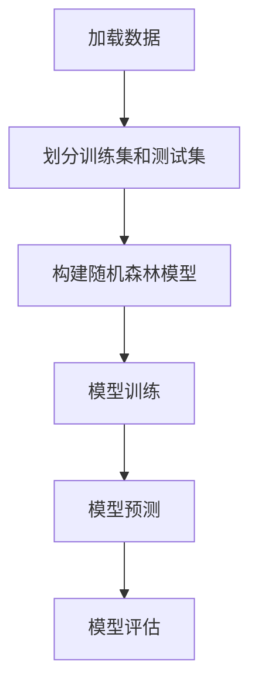

                 

### 文章标题

# AI辅助金融风险预警：从微观个体到宏观市场

> 关键词：AI、金融风险预警、微观个体、宏观市场、机器学习、风险评估

> 摘要：本文旨在探讨AI技术在金融风险预警中的应用，从微观个体到宏观市场的多层次视角进行分析。通过详细阐述AI在金融风险预警中的核心概念、算法原理、系统设计以及最佳实践，为行业从业者提供有价值的参考。本文不仅涵盖了个体层面的信用评分和投资风险预警，还探讨了宏观市场层面的股票市场风险预警和金融市场风险联动效应分析，最终提出了未来发展的趋势和挑战。

### 第1章：AI辅助金融风险预警概述

#### 1.1 问题背景

**金融风险的定义与类型**：

金融风险是指在金融市场活动过程中，由于各种不确定性因素导致金融市场参与者面临损失的可能性。金融风险主要分为以下几类：

- **市场风险**：由于市场价格波动导致的损失风险。
- **信用风险**：由于债务人违约导致的损失风险。
- **流动性风险**：由于资金流动受阻导致的损失风险。
- **操作风险**：由于内部操作失误或系统故障导致的损失风险。

**金融风险预警的重要性**：

金融风险预警是指在金融市场中，通过对风险信号的监测和分析，提前发现和预测潜在风险，以便及时采取应对措施，降低损失。金融风险预警的重要性体现在以下几个方面：

- **预防损失**：通过预警机制，可以及时发现和预测潜在风险，避免或减少损失。
- **提高决策效率**：预警系统可以提供实时的风险信息，帮助决策者迅速做出合理的决策。
- **维护市场稳定**：有效的风险预警可以及时发现市场异常，维护金融市场的稳定运行。

**传统金融风险预警的局限性**：

传统的金融风险预警方法主要依赖于人工分析，存在以下局限性：

- **时效性低**：人工分析需要较长时间，无法实现实时预警。
- **准确性差**：人工分析容易受到主观因素的影响，准确性难以保证。
- **处理能力有限**：人工分析能力有限，难以应对大规模数据的分析。

**AI在金融风险管理中的应用潜力**：

AI技术的发展为金融风险管理带来了新的机遇。AI技术在金融风险预警中的应用潜力主要体现在以下几个方面：

- **实时性**：AI技术可以实时分析大量数据，实现快速预警。
- **准确性**：AI技术通过机器学习算法，可以提高预警的准确性。
- **自动化**：AI技术可以实现风险预警的自动化，降低人工成本。
- **多维度分析**：AI技术可以从多个维度对金融风险进行分析，提供更全面的预警信息。

#### 1.2 核心概念

**AI辅助风险预警的基本原理**：

AI辅助风险预警是指利用机器学习、深度学习等AI技术，对金融数据进行挖掘和分析，预测潜在的风险事件。其基本原理包括：

- **数据收集**：收集与金融风险相关的数据，包括历史数据、实时数据等。
- **特征提取**：对数据进行预处理，提取与风险相关的特征。
- **模型训练**：利用机器学习算法，对特征数据进行训练，构建风险预测模型。
- **风险预测**：将实时数据输入模型，预测潜在的风险事件。
- **预警决策**：根据预测结果，制定相应的预警策略，通知相关人员。

**微观个体与宏观市场的联系**：

在金融风险预警中，微观个体和宏观市场之间存在密切的联系。微观个体层面的风险因素往往会影响宏观市场的稳定性。例如，个人信用风险可能导致债务违约，进而影响整个金融市场的稳定性。因此，AI辅助金融风险预警需要同时考虑微观个体和宏观市场的风险因素。

**风险评估与预警机制**：

风险评估是指对潜在风险进行定量或定性的分析，评估其可能造成的损失。预警机制是指通过监测和分析风险信号，提前发现和预测潜在风险，并采取相应的措施。

在AI辅助金融风险预警中，风险评估与预警机制的核心内容如下：

- **风险评估**：利用机器学习算法，对金融数据进行分析，识别潜在的风险因素。
- **预警指标**：根据风险评估结果，设定预警指标，用于判断是否发出预警信号。
- **预警策略**：根据预警指标，制定相应的预警策略，包括预警阈值、预警通知等。

#### 1.3 研究边界与外延

**数据来源与处理方法**：

数据来源是AI辅助金融风险预警的基础。金融数据来源包括内部数据和外部数据。内部数据主要包括金融机构的交易数据、客户信息等；外部数据主要包括市场行情、经济指标等。在数据收集过程中，需要考虑数据的质量、完整性、及时性等问题。

数据预处理是数据挖掘和分析的重要步骤。主要任务包括数据清洗、数据转换、数据归一化等。通过数据预处理，可以提高数据的可用性和可靠性，为后续分析提供高质量的数据。

**模型选择与算法优化**：

在AI辅助金融风险预警中，模型选择和算法优化是关键。常见的机器学习算法包括线性回归、逻辑回归、决策树、随机森林、支持向量机等。选择合适的算法需要考虑数据的特征、风险类型、预警需求等因素。

算法优化主要包括模型参数调整、特征选择、模型融合等。通过优化算法，可以提高模型的预测准确性和稳定性，降低错误率。

**风险预警的实时性与准确性**：

实时性是AI辅助金融风险预警的重要特征。风险预警系统需要能够实时监测和分析数据，及时发现潜在风险。

准确性是风险预警的核心指标。预警系统需要能够准确识别潜在风险，避免误报和漏报。

**本章小结**：

本章对AI辅助金融风险预警进行了概述，从问题背景、核心概念、研究边界与外延等方面进行了详细阐述。通过本章的学习，读者可以了解AI辅助金融风险预警的基本原理和应用方法，为后续章节的学习打下基础。

### 第2章：微观个体层面AI辅助风险预警

#### 2.1 个体风险特征分析

**数据收集与预处理**：

在微观个体层面进行AI辅助风险预警，首先需要收集与个体相关的数据。数据来源包括内部数据（如金融机构的交易记录、客户信息等）和外部数据（如信用报告、经济指标等）。收集到的数据需要进行预处理，包括数据清洗、数据转换和数据归一化等步骤。

**个体风险因素识别**：

个体风险因素是指可能导致个体出现风险的事件或条件。在金融风险预警中，常见的个体风险因素包括：

- **信用风险**：如逾期还款、信用卡欠款等。
- **投资风险**：如投资亏损、市场波动等。
- **操作风险**：如账户被盗、欺诈交易等。

通过数据分析和挖掘，可以识别出与个体风险相关的因素，为后续的风险度量化提供基础。

**风险度量化方法**：

个体风险度量化是指对个体可能出现的风险进行量化的过程。常见的风险度量化方法包括：

- **评分法**：将个体风险因素转换为分数，根据分数高低评估个体风险程度。
- **概率法**：根据历史数据和统计模型，计算个体出现特定风险的概率。
- **综合法**：结合评分法和概率法，综合评估个体风险。

通过风险度量化，可以为后续的预警策略制定提供依据。

#### 2.2 AI算法在个体风险预警中的应用

**机器学习算法简介**：

机器学习算法是AI技术的重要组成部分，用于从数据中自动学习规律和模式。常见的机器学习算法包括：

- **监督学习算法**：如线性回归、逻辑回归、支持向量机等。
- **无监督学习算法**：如聚类、关联规则挖掘等。
- **强化学习算法**：如Q学习、策略梯度等。

**模型构建与训练**：

在个体风险预警中，常用的机器学习算法包括线性回归、逻辑回归和支持向量机等。模型构建过程包括：

- **特征选择**：从原始数据中提取与风险相关的特征。
- **模型训练**：使用训练数据集，通过算法优化模型参数。
- **模型评估**：使用测试数据集，评估模型的预测准确性和稳定性。

**模型评估与优化**：

模型评估是判断模型性能的重要步骤。常用的评估指标包括准确率、召回率、F1分数等。通过模型评估，可以判断模型是否满足预警需求。

模型优化主要包括参数调整、特征选择和模型融合等。通过优化模型，可以提高模型的预测准确性和稳定性。

#### 2.3 实例分析

**个人信用评分模型**：

个人信用评分模型是AI辅助个体风险预警的重要应用。通过分析个人的信用行为数据，预测个人信用风险。

- **数据收集**：收集个人的信用报告、交易记录等数据。
- **特征提取**：提取与信用风险相关的特征，如逾期还款次数、信用额度等。
- **模型训练**：使用机器学习算法，构建信用评分模型。
- **模型评估**：使用测试数据集，评估模型的预测准确性和稳定性。

**投资风险预警模型**：

投资风险预警模型用于预测个人的投资风险。通过分析投资行为和市场数据，预测投资亏损的概率。

- **数据收集**：收集个人的投资记录、市场行情数据等。
- **特征提取**：提取与投资风险相关的特征，如投资组合、市场波动等。
- **模型训练**：使用机器学习算法，构建投资风险预警模型。
- **模型评估**：使用测试数据集，评估模型的预测准确性和稳定性。

**本章小结**：

本章详细介绍了微观个体层面AI辅助风险预警的方法和实例。通过数据收集与预处理、个体风险因素识别、风险度量化方法、机器学习算法在个体风险预警中的应用，以及实例分析，为微观个体层面的AI辅助金融风险预警提供了有力支持。

### 第3章：宏观市场层面AI辅助风险预警

#### 3.1 市场风险特征分析

**市场数据收集与预处理**：

在宏观市场层面进行AI辅助风险预警，首先需要收集与市场相关的数据。市场数据来源包括股票市场、债券市场、外汇市场等。数据收集完成后，需要进行预处理，包括数据清洗、数据转换和数据归一化等步骤，以确保数据的可靠性和一致性。

**市场风险因素识别**：

市场风险因素是指可能导致市场出现波动或危机的事件或条件。在宏观市场层面，常见的市场风险因素包括：

- **宏观经济指标**：如GDP增长率、通货膨胀率、失业率等。
- **金融市场指标**：如股票价格指数、债券收益率、汇率等。
- **政策因素**：如利率政策、财政政策、货币政策等。
- **市场情绪**：如投资者信心指数、恐慌指数等。

通过数据分析和挖掘，可以识别出与市场风险相关的因素，为后续的风险度量化提供基础。

**风险度量化方法**：

市场风险度量化是指对市场潜在风险进行量化的过程。常见的市场风险度量化方法包括：

- **VaR（Value at Risk）**：计算市场在一定置信水平下的潜在损失。
- **压力测试**：模拟不同市场情景下的风险状况，评估市场的脆弱性。
- **概率法**：根据历史数据和统计模型，计算市场出现特定风险的概率。

通过风险度量化，可以为后续的预警策略制定提供依据。

#### 3.2 AI算法在市场风险预警中的应用

**时间序列分析方法**：

时间序列分析是一种用于分析时间序列数据的方法，旨在揭示数据中的趋势、周期和随机性。在市场风险预警中，时间序列分析可以用于预测市场价格的波动和趋势。常见的时间序列分析方法包括：

- **ARIMA（AutoRegressive Integrated Moving Average）**：自回归积分滑动平均模型。
- **GARCH（Generalized Autoregressive Conditional Heteroskedasticity）**：广义自回归条件异方差模型。
- **LSTM（Long Short-Term Memory）**：长短期记忆网络。

**复杂网络分析方法**：

复杂网络分析是一种用于分析复杂系统的方法，旨在揭示系统中的相互作用和结构特征。在市场风险预警中，复杂网络分析可以用于分析市场参与者的关系和网络结构，识别市场中的关键节点和潜在风险。常见复杂网络分析方法包括：

- **网络拓扑分析**：分析网络的拓扑结构，如度分布、聚类系数等。
- **社区检测**：识别网络中的社区结构，分析社区间的相互作用。
- **网络传播模型**：模拟网络中的信息传播过程，预测市场情绪的演变。

**多元统计分析方法**：

多元统计分析是一种用于分析多个变量之间关系的统计方法。在市场风险预警中，多元统计分析可以用于识别市场风险因素之间的关系，评估风险因素对市场的影响。常见的多元统计分析方法包括：

- **主成分分析（PCA）**：降维和特征提取。
- **因子分析**：识别市场中的关键因素。
- **多元回归分析**：评估风险因素对市场的影响。

通过结合时间序列分析、复杂网络分析和多元统计分析，可以构建一个全面的市场风险预警系统，提高预警的准确性和可靠性。

#### 3.3 实例分析

**股票市场风险预警模型**：

股票市场风险预警模型用于预测股票市场的潜在风险，如市场波动、股价下跌等。通过分析股票市场的数据，可以构建一个基于机器学习的股票市场风险预警模型。

- **数据收集**：收集股票市场的历史数据，如股票价格、交易量、财务指标等。
- **特征提取**：提取与股票市场风险相关的特征，如股价波动率、交易量变化等。
- **模型训练**：使用机器学习算法，如随机森林、支持向量机等，构建股票市场风险预警模型。
- **模型评估**：使用测试数据集，评估模型的预测准确性和稳定性。

**金融市场风险联动效应分析**：

金融市场风险联动效应是指不同金融市场之间的风险相互影响和传递。通过分析金融市场的数据，可以构建一个金融市场风险联动效应分析模型，揭示不同金融市场之间的风险关系。

- **数据收集**：收集不同金融市场的数据，如股票市场、债券市场、外汇市场等。
- **特征提取**：提取与金融市场风险相关的特征，如价格变动、交易量变化等。
- **模型训练**：使用机器学习算法，如多变量时间序列模型、多元回归分析等，构建金融市场风险联动效应分析模型。
- **模型评估**：使用测试数据集，评估模型的预测准确性和稳定性。

**本章小结**：

本章详细介绍了宏观市场层面AI辅助风险预警的方法和实例。通过市场数据收集与预处理、市场风险因素识别、风险度量化方法、AI算法在市场风险预警中的应用以及实例分析，为宏观市场层面的AI辅助金融风险预警提供了有力支持。

### 第4章：AI辅助金融风险预警系统设计

#### 4.1 系统需求分析

**风险预警功能需求**：

AI辅助金融风险预警系统的核心功能是实时监测和分析金融数据，预测潜在风险，并发出预警信号。具体功能需求包括：

- **实时数据分析**：系统应具备实时获取和分析金融数据的能力，包括股票市场、债券市场、外汇市场等。
- **风险因素识别**：系统应能够自动识别与金融风险相关的因素，如宏观经济指标、市场指标、政策因素等。
- **风险预测**：系统应能够根据历史数据和实时数据，预测潜在的风险事件，如市场波动、股价下跌等。
- **预警信号发送**：系统应能够自动发送预警信号，包括邮件、短信、微信等通知方式，通知相关人员。

**数据处理与存储需求**：

系统需要处理和分析大量的金融数据，因此数据处理和存储需求较高。具体需求包括：

- **数据存储**：系统应具备高效的数据存储能力，能够存储大量的历史数据和实时数据。
- **数据预处理**：系统应具备数据预处理功能，包括数据清洗、数据转换、数据归一化等。
- **数据处理速度**：系统应具备快速的数据处理能力，能够在短时间内完成数据处理和分析任务。

**系统可靠性需求**：

系统的可靠性是金融风险预警系统的重要保障。具体需求包括：

- **稳定性**：系统应能够在各种运行环境下稳定运行，不受外部干扰。
- **安全性**：系统应具备较高的安全性，防止数据泄露和系统入侵。
- **容错性**：系统应具备容错性，能够应对系统故障和异常情况，确保数据的安全和完整性。

#### 4.2 系统架构设计

**系统总体架构**：

AI辅助金融风险预警系统的总体架构可以分为以下几个模块：

- **数据采集模块**：负责实时获取金融数据，包括股票市场、债券市场、外汇市场等。
- **数据处理模块**：负责对采集到的金融数据进行预处理，包括数据清洗、数据转换、数据归一化等。
- **风险预测模块**：负责使用机器学习算法，对预处理后的金融数据进行分析，预测潜在的风险事件。
- **预警信号发送模块**：负责根据风险预测结果，发送预警信号，包括邮件、短信、微信等通知方式。

**数据处理模块设计**：

数据处理模块是系统的重要部分，负责对金融数据进行预处理和分析。具体设计包括：

- **数据清洗**：对采集到的金融数据进行清洗，去除无效数据和异常数据，保证数据的质量。
- **数据转换**：将不同格式的金融数据进行转换，统一数据格式，便于后续分析。
- **数据归一化**：对金融数据进行归一化处理，使其在相同的尺度上进行分析。

**风险预警模块设计**：

风险预警模块是系统的核心部分，负责使用机器学习算法，对金融数据进行分析，预测潜在的风险事件。具体设计包括：

- **模型选择**：根据金融数据的特征和风险类型，选择合适的机器学习算法。
- **模型训练**：使用历史金融数据，对机器学习算法进行训练，优化模型参数。
- **模型评估**：使用测试金融数据，评估模型的预测准确性和稳定性。

**预警信号发送模块设计**：

预警信号发送模块负责根据风险预测结果，发送预警信号，包括邮件、短信、微信等通知方式。具体设计包括：

- **预警阈值设置**：根据金融数据的特征和风险类型，设置预警阈值，确定何时发出预警信号。
- **预警信号生成**：根据预警阈值，生成预警信号，包括预警内容、预警等级等。
- **预警信号发送**：根据预警信号，通过邮件、短信、微信等通知方式，发送给相关人员。

#### 4.3 系统接口设计

**用户界面设计**：

用户界面是系统与用户交互的窗口，应简洁明了，易于操作。具体设计包括：

- **主页**：展示系统的主要功能模块，提供快速访问入口。
- **数据展示**：展示实时金融数据和风险预测结果，提供图表和报表等可视化工具。
- **预警管理**：提供预警信号的查看、设置和取消等功能。

**数据接口设计**：

数据接口是系统与外部数据源的连接通道，负责数据的传输和交换。具体设计包括：

- **数据采集接口**：负责实时获取金融数据，包括股票市场、债券市场、外汇市场等。
- **数据处理接口**：负责对采集到的金融数据进行预处理，包括数据清洗、数据转换、数据归一化等。
- **数据存储接口**：负责将预处理后的金融数据存储到数据库中，提供数据的查询和读取功能。

**风险预警接口设计**：

风险预警接口是系统与风险预警模块的连接通道，负责风险的预测和预警。具体设计包括：

- **风险预测接口**：负责调用机器学习算法，对金融数据进行分析，预测潜在的风险事件。
- **预警信号生成接口**：负责根据风险预测结果，生成预警信号，包括预警内容、预警等级等。
- **预警信号发送接口**：负责将预警信号发送给相关人员，包括邮件、短信、微信等通知方式。

#### 4.4 系统交互设计

**系统流程图**：

系统流程图用于描述系统的工作流程和数据处理过程。具体设计包括：

- **数据采集**：系统从股票市场、债券市场、外汇市场等数据源中实时获取金融数据。
- **数据预处理**：系统对采集到的金融数据进行清洗、转换和归一化等预处理操作。
- **风险预测**：系统使用机器学习算法，对预处理后的金融数据进行分析，预测潜在的风险事件。
- **预警信号生成**：系统根据风险预测结果，生成预警信号，包括预警内容、预警等级等。
- **预警信号发送**：系统将预警信号发送给相关人员，包括邮件、短信、微信等通知方式。

**序列图**：

序列图用于描述系统中的对象之间的交互顺序和关系。具体设计包括：

- **用户操作**：用户通过用户界面，查看实时金融数据和风险预测结果。
- **数据采集**：系统从数据源中实时获取金融数据，并传递给数据处理模块。
- **数据处理**：数据处理模块对金融数据进行预处理，并传递给风险预测模块。
- **风险预测**：风险预测模块使用机器学习算法，对预处理后的金融数据进行分析，预测潜在的风险事件，并传递给预警信号生成模块。
- **预警信号生成**：预警信号生成模块根据风险预测结果，生成预警信号，并传递给预警信号发送模块。
- **预警信号发送**：预警信号发送模块将预警信号发送给相关人员，包括邮件、短信、微信等通知方式。

**本章小结**：

本章详细介绍了AI辅助金融风险预警系统的设计，包括系统需求分析、系统架构设计、系统接口设计和系统交互设计。通过本章的学习，读者可以了解AI辅助金融风险预警系统的设计原理和实现方法，为后续章节的学习和实践提供基础。

### 第5章：AI辅助金融风险预警的算法原理与实现

#### 5.1 算法原理

**特征工程**：

特征工程是AI辅助金融风险预警的重要步骤，旨在从原始数据中提取具有预测能力的特征，提高模型性能。具体包括：

- **特征选择**：选择与风险相关的特征，去除无关特征，降低模型复杂度。
- **特征转换**：将原始数据转换为适合模型训练的形式，如归一化、标准化、离散化等。
- **特征组合**：通过组合不同特征，构建新的特征，提高模型解释性和预测能力。

**模型选择**：

模型选择是AI辅助金融风险预警的关键，根据数据特征和风险类型选择合适的模型。常见模型包括：

- **线性回归**：适用于线性关系较强的数据。
- **逻辑回归**：适用于二分类问题，如信用评分、股票预测等。
- **决策树**：适用于分类和回归问题，具有良好的解释性。
- **随机森林**：基于决策树的集成方法，提高预测准确性和稳定性。
- **支持向量机**：适用于高维数据，具有较好的分类性能。

**模型训练与优化**：

模型训练与优化是AI辅助金融风险预警的核心步骤，包括：

- **模型训练**：使用历史数据对模型进行训练，优化模型参数。
- **模型评估**：使用测试数据集评估模型性能，包括准确率、召回率、F1分数等。
- **模型优化**：通过调整模型参数、特征选择、模型融合等方法，提高模型性能。

#### 5.2 算法实现

**Python代码实现**：

以下是一个简单的Python代码示例，用于实现信用评分模型的构建和训练。

```python
import pandas as pd
from sklearn.model_selection import train_test_split
from sklearn.ensemble import RandomForestClassifier
from sklearn.metrics import accuracy_score, recall_score, f1_score

# 加载数据
data = pd.read_csv('credit_data.csv')
X = data.drop('default', axis=1)
y = data['default']

# 划分训练集和测试集
X_train, X_test, y_train, y_test = train_test_split(X, y, test_size=0.2, random_state=42)

# 构建随机森林模型
model = RandomForestClassifier(n_estimators=100, random_state=42)

# 模型训练
model.fit(X_train, y_train)

# 模型预测
y_pred = model.predict(X_test)

# 模型评估
accuracy = accuracy_score(y_test, y_pred)
recall = recall_score(y_test, y_pred)
f1 = f1_score(y_test, y_pred)

print(f'Accuracy: {accuracy}')
print(f'Recall: {recall}')
print(f'F1 Score: {f1}')
```

**Mermaid流程图**：

以下是一个Mermaid流程图示例，用于描述信用评分模型的构建和训练过程。



#### 5.3 数学模型与公式

**特征提取与量化**：

在AI辅助金融风险预警中，特征提取和量化是关键步骤。以下是一些常用的数学模型和公式：

- **归一化**：
  $$ x_{\text{norm}} = \frac{x - \mu}{\sigma} $$
  其中，$x$ 为原始特征值，$\mu$ 为特征平均值，$\sigma$ 为特征标准差。

- **标准化**：
  $$ x_{\text{std}} = \frac{x - \mu}{\sigma} $$
  其中，$x$ 为原始特征值，$\mu$ 为特征平均值，$\sigma$ 为特征标准差。

- **离散化**：
  $$ x_{\text{discrete}} = \text{round}(x \times k) $$
  其中，$x$ 为原始特征值，$k$ 为离散化区间数。

**风险度计算**：

在AI辅助金融风险预警中，风险度计算是核心步骤。以下是一些常用的数学模型和公式：

- **逻辑回归**：
  $$ \hat{P}(y=1) = \frac{1}{1 + e^{-(\beta_0 + \sum_{i=1}^{n} \beta_i x_i)}} $$
  其中，$y$ 为目标变量，$x_i$ 为特征值，$\beta_0$ 和 $\beta_i$ 为模型参数。

- **支持向量机**：
  $$ w \cdot x + b = 0 $$
  其中，$w$ 和 $b$ 为模型参数，$x$ 为特征向量。

- **随机森林**：
  $$ \hat{y} = \text{sign}(\sum_{i=1}^{n} w_i f_i(x)) $$
  其中，$w_i$ 和 $f_i(x)$ 为模型参数和决策树函数。

#### 5.4 举例说明

**信用评分模型案例**：

以下是一个信用评分模型的案例，用于预测个人信用风险。

- **数据集**：包含1000个样本，每个样本有10个特征，分别为年龄、收入、信用历史、还款能力等。
- **目标变量**：是否逾期还款（0代表未逾期，1代表逾期）。

**步骤**：

1. 数据预处理：对数据集进行归一化和离散化处理，提高模型性能。
2. 模型选择：选择随机森林模型进行训练。
3. 模型训练：使用训练数据集，对随机森林模型进行训练。
4. 模型评估：使用测试数据集，评估模型性能，包括准确率、召回率、F1分数等。

**代码实现**：

```python
import pandas as pd
from sklearn.model_selection import train_test_split
from sklearn.ensemble import RandomForestClassifier
from sklearn.metrics import accuracy_score, recall_score, f1_score

# 加载数据
data = pd.read_csv('credit_data.csv')
X = data.drop('default', axis=1)
y = data['default']

# 划分训练集和测试集
X_train, X_test, y_train, y_test = train_test_split(X, y, test_size=0.2, random_state=42)

# 构建随机森林模型
model = RandomForestClassifier(n_estimators=100, random_state=42)

# 模型训练
model.fit(X_train, y_train)

# 模型预测
y_pred = model.predict(X_test)

# 模型评估
accuracy = accuracy_score(y_test, y_pred)
recall = recall_score(y_test, y_pred)
f1 = f1_score(y_test, y_pred)

print(f'Accuracy: {accuracy}')
print(f'Recall: {recall}')
print(f'F1 Score: {f1}')
```

**股票市场风险预警案例**：

以下是一个股票市场风险预警的案例，用于预测股票市场波动风险。

- **数据集**：包含5000个样本，每个样本有20个特征，分别为股票价格、交易量、财务指标等。
- **目标变量**：是否发生市场波动（0代表未波动，1代表波动）。

**步骤**：

1. 数据预处理：对数据集进行归一化和离散化处理，提高模型性能。
2. 模型选择：选择LSTM模型进行训练。
3. 模型训练：使用训练数据集，对LSTM模型进行训练。
4. 模型评估：使用测试数据集，评估模型性能，包括准确率、召回率、F1分数等。

**代码实现**：

```python
import pandas as pd
from sklearn.model_selection import train_test_split
from keras.models import Sequential
from keras.layers import LSTM, Dense

# 加载数据
data = pd.read_csv('stock_data.csv')
X = data.drop('target', axis=1)
y = data['target']

# 划分训练集和测试集
X_train, X_test, y_train, y_test = train_test_split(X, y, test_size=0.2, random_state=42)

# 构建LSTM模型
model = Sequential()
model.add(LSTM(units=50, return_sequences=True, input_shape=(X_train.shape[1], 1)))
model.add(LSTM(units=50))
model.add(Dense(1, activation='sigmoid'))

# 编译模型
model.compile(optimizer='adam', loss='binary_crossentropy', metrics=['accuracy'])

# 模型训练
model.fit(X_train, y_train, epochs=10, batch_size=32, validation_split=0.2)

# 模型预测
y_pred = model.predict(X_test)

# 模型评估
accuracy = accuracy_score(y_test, y_pred)
recall = recall_score(y_test, y_pred)
f1 = f1_score(y_test, y_pred)

print(f'Accuracy: {accuracy}')
print(f'Recall: {recall}')
print(f'F1 Score: {f1}')
```

**本章小结**：

本章详细介绍了AI辅助金融风险预警的算法原理与实现，包括特征工程、模型选择、模型训练与优化等步骤。通过Python代码示例和数学模型讲解，为读者提供了实际操作的指导。本章内容为AI辅助金融风险预警的深入研究和应用奠定了基础。

### 第6章：AI辅助金融风险预警最佳实践

#### 6.1 最佳实践

**数据处理与清洗技巧**：

在AI辅助金融风险预警中，数据的质量直接影响模型的效果。因此，数据处理与清洗是关键步骤。以下是一些最佳实践：

- **数据清洗**：去除重复数据、缺失数据和异常数据，保证数据的一致性和完整性。
- **数据转换**：将不同格式的数据转换为统一格式，如将文本数据转换为数值数据。
- **数据归一化**：对数据进行归一化或标准化处理，使其在相同的尺度上进行分析。
- **特征选择**：选择与风险相关的特征，去除无关特征，降低模型复杂度。

**模型选择与优化技巧**：

在AI辅助金融风险预警中，模型选择和优化是关键步骤。以下是一些最佳实践：

- **模型选择**：根据数据特征和风险类型，选择合适的模型。例如，对于线性关系较强的数据，可以选择线性回归模型；对于分类问题，可以选择逻辑回归、决策树或支持向量机等。
- **模型优化**：通过调整模型参数、特征选择和模型融合等方法，提高模型性能。例如，可以使用网格搜索、随机搜索等方法，寻找最优模型参数。
- **模型评估**：使用交叉验证、AUC、F1分数等指标，评估模型性能，确保模型满足预警需求。

**风险预警策略**：

在AI辅助金融风险预警中，预警策略的制定是关键步骤。以下是一些最佳实践：

- **预警阈值设定**：根据历史数据和模型预测结果，设定合理的预警阈值，确保预警信号既能及时发出，又能避免误报和漏报。
- **预警通知方式**：选择合适的预警通知方式，如邮件、短信、微信等，确保相关人员能够及时收到预警信息。
- **预警报告**：定期生成预警报告，分析预警事件的原因和影响，提供决策支持。

#### 6.2 注意事项

**风险预警系统的安全与隐私**：

在AI辅助金融风险预警中，系统的安全与隐私保护至关重要。以下是一些注意事项：

- **数据安全**：确保数据在传输和存储过程中的安全，使用加密技术保护数据。
- **用户隐私**：保护用户隐私，不泄露用户个人信息。
- **系统安全**：确保系统安全，防止黑客攻击和数据泄露。

**风险预警报告的解读与应用**：

在AI辅助金融风险预警中，风险预警报告的解读和应用是关键。以下是一些注意事项：

- **报告内容**：确保预警报告包含关键信息，如预警事件、原因、影响等。
- **报告格式**：使用清晰简洁的格式，便于阅读和理解。
- **报告应用**：根据预警报告，制定相应的应对措施，降低风险损失。

#### 6.3 小结

AI辅助金融风险预警的最佳实践包括数据处理与清洗技巧、模型选择与优化技巧以及风险预警策略。同时，在实施过程中，需要注意系统的安全与隐私保护以及风险预警报告的解读与应用。通过遵循这些最佳实践，可以构建一个高效、准确的AI辅助金融风险预警系统，为金融机构提供有力的风险防控支持。

#### 6.4 拓展阅读

为了深入了解AI辅助金融风险预警的最新研究和技术，以下是一些推荐阅读材料：

1. **《金融风险管理》**：该书详细介绍了金融风险管理的理论和方法，包括风险评估、预警系统设计等。
2. **《人工智能在金融中的应用》**：该书探讨了人工智能在金融领域的应用，包括信用评分、投资策略、风险预警等。
3. **《深度学习实战》**：该书介绍了深度学习在金融风险预警中的应用，包括神经网络、卷积神经网络、循环神经网络等。
4. **《Python金融数据分析》**：该书提供了使用Python进行金融数据分析和风险预警的实践教程。

通过阅读这些资料，读者可以进一步了解AI辅助金融风险预警的理论和实践，为实际应用提供有力支持。

### 第7章：未来展望与挑战

#### 7.1 未来发展趋势

**AI技术在金融风险管理中的应用前景**：

随着AI技术的不断发展和完善，其在金融风险管理中的应用前景十分广阔。以下是一些主要的发展趋势：

- **实时风险评估与预警**：AI技术可以实时分析大量金融数据，实现快速风险评估和预警。这有助于金融机构及时应对市场变化，降低风险损失。
- **个性化风险管理**：AI技术可以根据个体的行为和交易习惯，提供个性化的风险管理建议。这有助于提高风险管理的效果，降低风险发生的概率。
- **多维度风险分析**：AI技术可以从多个维度对金融风险进行分析，包括市场风险、信用风险、操作风险等。这有助于提高风险预警的全面性和准确性。
- **自动化决策支持**：AI技术可以实现自动化决策支持，减少人工干预。这有助于提高决策效率，降低管理成本。

**新算法与新模型的发展**：

随着AI技术的进步，新算法和新模型也在不断涌现。以下是一些值得关注的新算法和新模型：

- **深度强化学习**：深度强化学习可以结合深度学习和强化学习，实现更高效的决策支持。在金融风险管理中，可以用于交易策略优化、风险预测等。
- **联邦学习**：联邦学习可以在不同数据源之间共享模型，实现数据隐私保护。在金融风险管理中，可以用于构建联合风险评估模型。
- **图神经网络**：图神经网络可以处理复杂的关系网络，用于分析金融市场中的相互作用。在金融风险管理中，可以用于识别市场风险传染、评估信用风险等。

#### 7.2 挑战与对策

**数据质量与隐私保护**：

在AI辅助金融风险预警中，数据质量和隐私保护是两大挑战。以下是一些对策：

- **数据质量管理**：建立数据质量管理机制，确保数据的完整性、一致性和准确性。这包括数据清洗、数据验证和数据监控等。
- **隐私保护技术**：采用隐私保护技术，如差分隐私、联邦学习等，确保数据在共享和利用过程中的隐私保护。
- **合规性要求**：遵循相关法律法规，确保数据的使用和处理符合合规性要求。

**模型解释性与可解释性**：

AI模型的解释性是金融风险管理中的重要问题。以下是一些对策：

- **可解释性模型**：选择具有可解释性的模型，如决策树、规则模型等，提高模型的可解释性。
- **模型可解释性工具**：使用模型可解释性工具，如SHAP值、LIME等，分析模型预测结果，解释模型决策过程。
- **透明度要求**：提高模型开发和使用过程的透明度，确保金融机构和监管机构能够理解模型的决策过程。

**本章小结**：

未来，AI技术在金融风险管理中的应用前景广阔，新算法和新模型将不断涌现。然而，数据质量和隐私保护、模型解释性与可解释性等挑战仍需克服。通过采取相应的对策，可以进一步提升AI辅助金融风险预警的效能和可靠性，为金融机构提供更全面、准确的风险防控支持。

