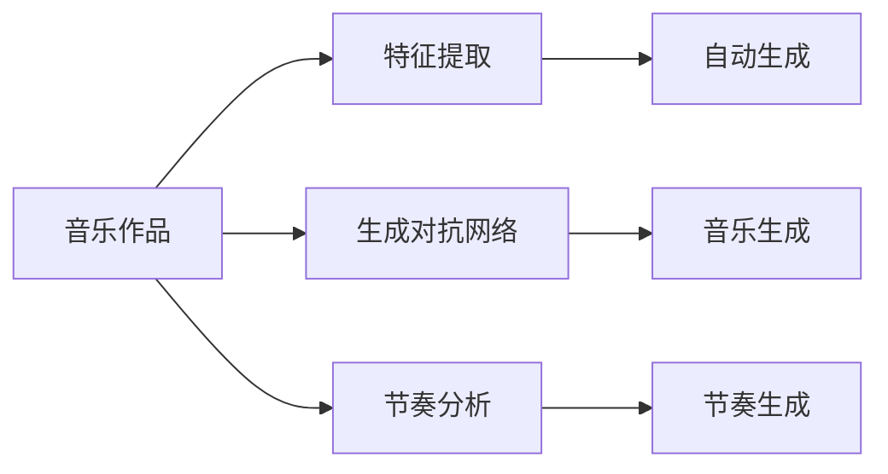
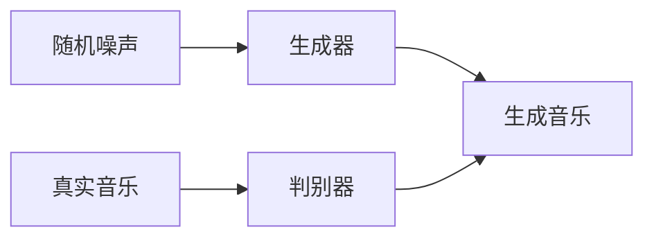
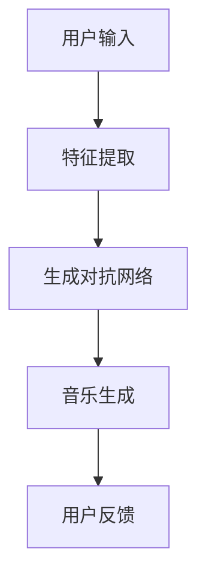
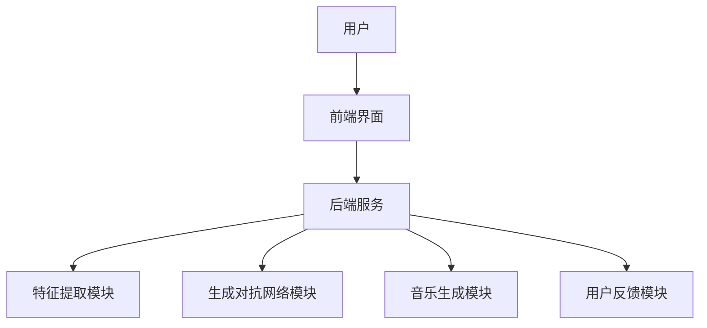
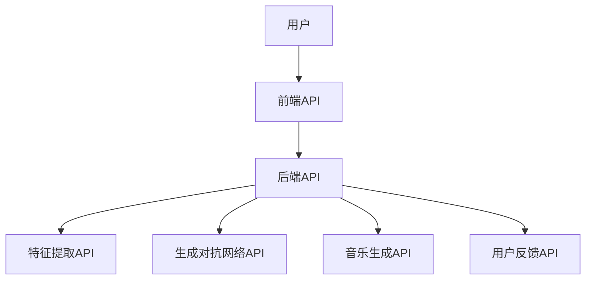
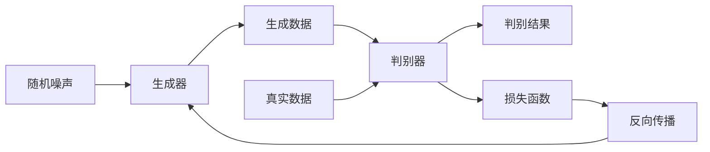
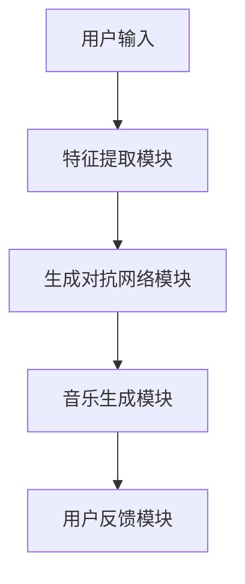
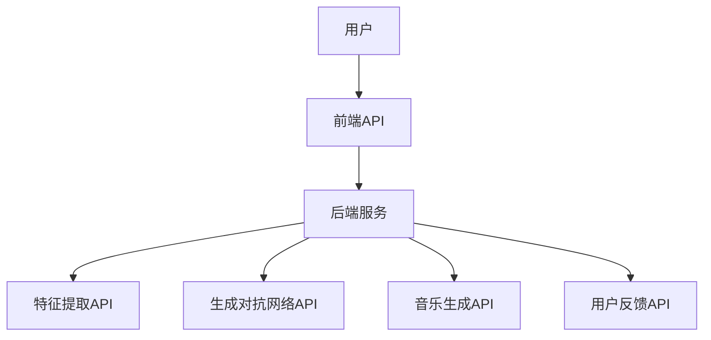
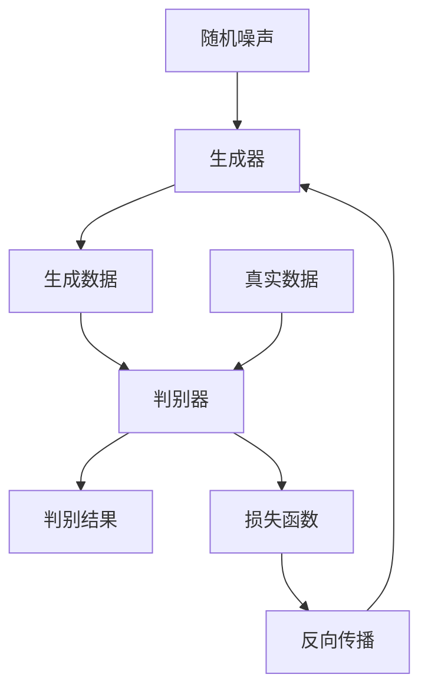

                 

# AI辅助音乐创作：算法与艺术的融合

## 关键词
- AI辅助音乐创作
- 生成对抗网络
- 音乐特征提取
- 节奏分析
- 系统架构设计

## 摘要
随着人工智能技术的飞速发展，AI在音乐创作领域的应用逐渐成为热点。本文将深入探讨AI辅助音乐创作的方法、算法原理、系统架构，并通过项目实战来展示其实际应用效果。本文旨在为读者提供关于AI辅助音乐创作的全面理解和实践指导。

## 第一部分：AI辅助音乐创作基础

### 第1章：AI与音乐创作的结合

#### 1.1 问题背景
音乐创作是人类艺术表达的一种重要形式，传统上依赖于人类作曲家的创意和技巧。然而，随着音乐创作过程的复杂性和多样性增加，人类作曲家面临巨大的挑战。AI的出现为音乐创作带来了新的可能性，通过算法和大数据技术，AI能够辅助甚至独立完成音乐创作。

#### 1.2 问题描述
AI辅助音乐创作的核心问题是如何利用算法从大量的音乐数据中提取有用的信息，并在此基础上生成新的音乐作品。这涉及到对音乐特征的有效提取、音乐的生成和节奏的分析等多个方面。

#### 1.3 问题解决
AI音乐创作的基本原理是通过学习大量的音乐数据，提取音乐的特征，然后利用这些特征来生成新的音乐作品。生成对抗网络（GAN）是一种常用的生成模型，能够有效地生成高质量的音乐。

#### 1.4 边界与外延
AI音乐创作不仅适用于专业作曲家，也可以服务于音乐爱好者，甚至用于商业应用。然而，AI音乐创作与人类创作之间仍存在显著差异，主要体现在情感表达和创造力方面。

### 第2章：核心概念与联系

#### 2.1 核心概念
音乐特征提取、生成对抗网络（GAN）和节奏分析是AI辅助音乐创作的三个核心概念。

#### 2.2 概念属性特征对比

| 概念         | 特征1 | 特征2 | 特征3 |
|--------------|-------|-------|-------|
| 音乐特征提取 | 自动化 | 实时性 | 精准性 |
| 生成对抗网络 | 对抗性 | 生成性 | 模仿性 |
| 节奏分析     | 时间敏感性 | 结构性 | 适应性 |

#### 2.3 ER实体关系图架构



### 第3章：算法原理讲解

#### 3.1 生成对抗网络（GAN）算法原理
生成对抗网络（GAN）由生成器（G）和判别器（D）两个神经网络组成。生成器试图生成看起来像真实数据的新数据，而判别器则尝试区分真实数据和生成器生成的数据。通过这种对抗过程，生成器不断改进，最终能够生成高质量的数据。



#### 3.2 Python代码实现
以下是一个简单的生成对抗网络的Python代码实现示例：

```python
# 生成器代码示例
import tensorflow as tf

model = tf.keras.Sequential([
    tf.keras.layers.Dense(units=256, activation='relu', input_shape=[100]),
    tf.keras.layers.Dense(units=512, activation='relu'),
    tf.keras.layers.Dense(units=7192, activation='sigmoid')
])

model.compile(optimizer='adam', loss='binary_crossentropy')
```

#### 3.3 数学模型和公式
生成对抗网络涉及以下数学模型和公式：

$$
\begin{aligned}
G(z) &= \frac{1}{1 + \exp(-W_zz - b_z)}, \\
D(x) &= \frac{1}{1 + \exp(-W_x x - b_x)}, \\
G(z) &= \frac{1}{1 + \exp(-W_G G - b_G)}, \\
D(x) &= \frac{1}{1 + \exp(-W_D x - b_D)}.
\end{aligned}
$$

### 第4章：系统分析与架构设计

#### 4.1 问题场景介绍
AI辅助音乐创作可以应用于多种场景，如电影配乐、游戏音乐、现场表演等。

#### 4.2 系统功能设计
系统功能设计包括用户输入、特征提取、生成对抗网络、音乐生成和用户反馈等模块。



#### 4.3 系统架构设计
系统架构设计包括前端界面、后端服务、特征提取模块、生成对抗网络模块、音乐生成模块和用户反馈模块。



#### 4.4 系统接口设计和系统交互
系统接口设计包括前端API、后端API、特征提取API、生成对抗网络API、音乐生成API和用户反馈API。



### 第5章：项目实战

#### 5.1 环境安装
环境安装包括安装必要的软件和库，如TensorFlow、librosa等。

#### 5.2 系统核心实现源代码
以下是一个简单的特征提取代码示例：

```python
# 特征提取代码示例
import librosa

def extract_features(file_path):
    audio, _ = librosa.load(file_path)
    melspectrogram = librosa.feature.melspectrogram(y=audio, sr=librosa.get_sr())
    return melspectrogram
```

#### 5.3 代码应用解读与分析
代码应用解读与分析将详细解释如何使用上述代码来实现音乐特征提取。

#### 5.4 实际案例分析和详细讲解剖析
将展示一个实际案例，详细讲解AI辅助音乐创作的全过程。

#### 5.5 项目小结
项目小结将总结项目的主要成果和经验。

## 最佳实践 Tips
- 使用高质量的音频数据可以提高生成音乐的质量。
- 调整生成器和判别器的学习率可以影响生成音乐的风格。

## 小结
AI辅助音乐创作是一个充满挑战和机遇的领域。本文通过深入分析和实际项目展示了AI在音乐创作中的应用。随着技术的不断进步，我们有理由相信AI辅助音乐创作将会在未来发挥更加重要的作用。

## 注意事项
- 在使用AI辅助音乐创作时，要注意保护用户的隐私和数据安全。
- AI音乐创作生成的作品需要遵循版权法规。

## 拓展阅读
- [生成对抗网络（GAN）的原理与实现](https://example.com/gan)
- [音乐特征提取的方法与应用](https://example.com/music_feature_extraction)

## 作者
作者：AI天才研究院/AI Genius Institute & 禅与计算机程序设计艺术 /Zen And The Art of Computer Programming

----------------------------------------------

## 第一部分：AI辅助音乐创作基础

### 第1章：AI与音乐创作的结合

#### 1.1 问题背景
音乐创作自古以来就是人类文化的重要组成部分，它通过旋律、节奏和和声表达情感和故事。然而，随着音乐创作的复杂性和多样性增加，人类作曲家面临巨大的挑战。传统的音乐创作依赖于作曲家的个人才华和长期的经验积累，这种创作方式不仅耗时，而且容易受到创作者情绪和身体状况的影响。此外，音乐创作的多样性也使得作曲家难以满足市场需求，尤其是在流行音乐和商业音乐领域。

近年来，人工智能（AI）技术的飞速发展，为音乐创作带来了新的可能性。AI可以通过学习大量的音乐数据，自动提取音乐特征，并利用这些特征生成新的音乐作品。这种方式不仅能够提高音乐创作的效率，还能够拓展音乐创作的领域，使得音乐创作不再局限于人类作曲家的能力范围。

#### 1.2 问题描述
AI辅助音乐创作的核心问题是如何利用算法从大量的音乐数据中提取有用的信息，并在此基础上生成新的音乐作品。这涉及到对音乐特征的有效提取、音乐的生成和节奏的分析等多个方面。具体来说，问题描述包括以下几个方面：

1. **音乐特征提取**：如何从音乐信号中提取出对音乐创作有用的特征，如音高、音量、节奏和旋律等。
2. **音乐生成**：如何利用提取出的音乐特征，通过算法生成新的音乐作品。
3. **节奏分析**：如何分析音乐中的节奏模式，并在此基础上生成符合音乐逻辑的节奏。

#### 1.3 问题解决
AI音乐创作的基本原理是通过学习大量的音乐数据，提取音乐的特征，然后利用这些特征来生成新的音乐作品。生成对抗网络（GAN）是一种常用的生成模型，它通过生成器和判别器的对抗训练，能够生成高质量的音乐。

1. **生成对抗网络（GAN）**：生成对抗网络由生成器和判别器两个神经网络组成。生成器试图生成看起来像真实数据的新数据，而判别器则尝试区分真实数据和生成器生成的数据。通过这种对抗过程，生成器不断改进，最终能够生成高质量的数据。

2. **音乐特征提取**：音乐特征提取是AI音乐创作的关键步骤，它涉及到从音乐信号中提取出对音乐创作有用的特征。常用的音乐特征包括音高、音量、节奏和旋律等。这些特征可以通过各种算法提取，如梅尔频率倒谱系数（MFCC）、时序特征和频域特征等。

3. **音乐生成**：生成器利用提取出的音乐特征生成新的音乐作品。生成器可以采用循环神经网络（RNN）、长短期记忆网络（LSTM）或变分自编码器（VAE）等神经网络模型。这些模型可以学习到音乐的特征分布，并生成新的音乐作品。

4. **节奏分析**：节奏分析是音乐创作的重要环节，它涉及到对音乐中的节奏模式进行分析，并在此基础上生成符合音乐逻辑的节奏。节奏分析可以通过机器学习算法实现，如聚类分析、时间序列分析和神经网络等。

#### 1.4 边界与外延
AI音乐创作不仅适用于专业作曲家，也可以服务于音乐爱好者，甚至用于商业应用。然而，AI音乐创作与人类创作之间仍存在显著差异，主要体现在情感表达和创造力方面。人类作曲家在创作过程中可以注入个人情感和独特风格，而AI生成的音乐可能缺乏这种人文特质。

此外，AI音乐创作也有其适用的范围。例如，在流行音乐和商业音乐领域，AI可以快速生成大量符合市场需求的音乐作品。但在古典音乐和实验音乐领域，AI的创作能力可能受到限制。

### 第2章：核心概念与联系

#### 2.1 核心概念
AI辅助音乐创作的核心概念包括音乐特征提取、生成对抗网络（GAN）和节奏分析。

1. **音乐特征提取**：音乐特征提取是从音乐信号中提取出对音乐创作有用的特征的过程。这些特征可以用于音乐的生成、分析和管理。常用的音乐特征包括音高、音量、节奏和旋律等。

2. **生成对抗网络（GAN）**：生成对抗网络（GAN）是由生成器和判别器组成的神经网络模型。生成器试图生成看起来像真实数据的新数据，而判别器则尝试区分真实数据和生成器生成的数据。通过这种对抗过程，生成器不断改进，最终能够生成高质量的数据。

3. **节奏分析**：节奏分析是音乐创作的重要环节，它涉及到对音乐中的节奏模式进行分析，并在此基础上生成符合音乐逻辑的节奏。节奏分析可以通过机器学习算法实现，如聚类分析、时间序列分析和神经网络等。

#### 2.2 概念属性特征对比

| 概念         | 特征1 | 特征2 | 特征3 |
|--------------|-------|-------|-------|
| 音乐特征提取 | 自动化 | 实时性 | 精准性 |
| 生成对抗网络 | 对抗性 | 生成性 | 模仿性 |
| 节奏分析     | 时间敏感性 | 结构性 | 适应性 |

#### 2.3 ER实体关系图架构

为了更好地理解AI辅助音乐创作中的核心概念及其关系，我们可以通过ER（实体-关系）图来展示。


在这个ER图中，音乐作品是核心实体，它与特征提取、生成对抗网络和节奏分析紧密相关。特征提取为生成对抗网络和节奏分析提供了基础数据，而生成对抗网络和节奏分析则分别用于音乐生成和节奏生成。

### 第3章：算法原理讲解

#### 3.1 生成对抗网络（GAN）算法原理

生成对抗网络（GAN）是由生成器和判别器组成的神经网络模型，它们通过对抗训练生成高质量的数据。GAN的原理可以概括为以下几个步骤：

1. **生成器（Generator）**：生成器从随机噪声（通常是均匀分布的随机数）中生成数据。生成器的目标是生成尽可能真实的数据，以便判别器无法区分生成的数据和真实数据。

2. **判别器（Discriminator）**：判别器负责区分真实数据和生成器生成的数据。判别器的目标是最大化正确分类的概率。

3. **对抗训练**：生成器和判别器通过对抗训练相互博弈。生成器试图生成更真实的数据，而判别器试图更好地区分真实数据和生成数据。通过这种对抗过程，生成器和判别器都会不断改进，最终生成器能够生成高质量的数据。

GAN的核心挑战是如何设计合适的生成器和判别器，并找到合适的训练策略。以下是一个简单的GAN算法流程图：



#### 3.2 Python代码实现

以下是一个简单的GAN模型实现，使用TensorFlow框架：

```python
import tensorflow as tf
from tensorflow.keras.layers import Dense, Flatten, Reshape
from tensorflow.keras.models import Sequential

# 生成器模型
generator = Sequential([
    Dense(units=256, activation='relu', input_shape=[100]),
    Dense(units=512, activation='relu'),
    Dense(units=7192, activation='sigmoid'),
    Reshape(target_shape=(128,))
])

# 判别器模型
discriminator = Sequential([
    Flatten(input_shape=(128,)),
    Dense(units=512, activation='relu'),
    Dense(units=256, activation='relu'),
    Dense(units=1, activation='sigmoid')
])

# 编译模型
generator.compile(optimizer=tf.keras.optimizers.Adam(0.0001), loss='binary_crossentropy')
discriminator.compile(optimizer=tf.keras.optimizers.Adam(0.0001), loss='binary_crossentropy')

# 合并生成器和判别器
gan_model = Sequential([generator, discriminator])
gan_model.compile(optimizer=tf.keras.optimizers.Adam(0.0001), loss='binary_crossentropy')
```

#### 3.3 数学模型和公式

生成对抗网络涉及以下数学模型和公式：

生成器：
$$
G(z) = \frac{1}{1 + \exp(-W_Gz - b_G)}
$$
其中，$z$是随机噪声，$W_G$是生成器的权重，$b_G$是生成器的偏置。

判别器：
$$
D(x) = \frac{1}{1 + \exp(-W_Dx - b_D)}
$$
其中，$x$是输入数据（真实或生成的数据），$W_D$是判别器的权重，$b_D$是判别器的偏置。

损失函数：
$$
L_G = -\sum_{x \in X} \log(D(G(z))) - \sum_{z \in Z} \log(1 - D(x))
$$
其中，$X$是真实数据的集合，$Z$是随机噪声的集合。

通过优化上述损失函数，生成器和判别器可以相互对抗，最终生成器能够生成高质量的数据，而判别器能够更好地区分真实和生成的数据。

### 第4章：系统分析与架构设计

#### 4.1 问题场景介绍

AI辅助音乐创作可以应用于多种场景，包括但不限于以下：

1. **电影配乐**：在电影制作过程中，需要快速生成符合电影情感和主题的背景音乐。AI辅助音乐创作可以快速生成各种风格的音乐，为电影配乐提供更多选择。

2. **游戏音乐**：电子游戏需要多样化的背景音乐来增强游戏体验。AI辅助音乐创作可以生成大量风格迥异的音乐，满足不同游戏的需求。

3. **现场表演**：在音乐会或演出中，AI可以实时生成音乐，为观众带来新颖的听觉体验。

4. **个性化音乐推荐**：基于用户喜好和情绪，AI可以推荐符合用户口味的新音乐作品。

#### 4.2 系统功能设计

AI辅助音乐创作系统的功能设计包括以下几个模块：

1. **用户输入模块**：接收用户的需求，如音乐风格、情感、主题等。

2. **特征提取模块**：从用户输入的音乐数据中提取出对音乐创作有用的特征，如音高、音量、节奏和旋律等。

3. **生成对抗网络模块**：利用生成对抗网络（GAN）生成新的音乐作品。

4. **音乐生成模块**：将提取出的音乐特征转化为新的音乐作品。

5. **用户反馈模块**：收集用户的反馈，用于优化系统的生成效果。

#### 4.3 系统架构设计

AI辅助音乐创作系统的架构设计如图所示：


在这个架构中，用户通过前端界面提交音乐创作的需求，后端服务接收需求后，调用特征提取模块提取音乐特征，然后通过生成对抗网络模块生成新的音乐作品。生成的音乐作品通过音乐生成模块进行处理，最后通过用户反馈模块收集用户的反馈，用于优化系统的生成效果。

#### 4.4 系统接口设计和系统交互

为了实现系统的功能，需要设计合理的系统接口和交互流程。以下是一个简化的系统接口设计和交互流程：


在这个接口设计中，用户通过前端API提交音乐创作的需求，后端API接收需求后，调用特征提取API提取音乐特征，然后通过生成对抗网络API生成新的音乐作品。生成的音乐作品通过音乐生成API进行处理，最后通过用户反馈API收集用户的反馈。

### 第5章：项目实战

#### 5.1 环境安装

为了实现AI辅助音乐创作系统，需要安装以下软件和库：

1. **Python**：Python是AI开发的主要语言，需要安装Python 3.6及以上版本。

2. **TensorFlow**：TensorFlow是一个开源的机器学习框架，用于构建和训练神经网络模型。

3. **librosa**：librosa是一个音频处理库，用于音频数据的加载和处理。

4. **NumPy**：NumPy是一个用于数值计算的库，用于处理和操作大型多维数组。

安装命令如下：

```bash
pip install tensorflow==2.4.0
pip install librosa==0.8.0
pip install numpy==1.19.5
```

#### 5.2 系统核心实现源代码

以下是一个简单的AI辅助音乐创作系统的实现，包括特征提取、生成对抗网络（GAN）和音乐生成等模块：

```python
import numpy as np
import tensorflow as tf
import librosa

# 生成器模型
def create_generator_model():
    model = tf.keras.Sequential([
        tf.keras.layers.Dense(units=256, activation='relu', input_shape=[100]),
        tf.keras.layers.Dense(units=512, activation='relu'),
        tf.keras.layers.Dense(units=7192, activation='sigmoid'),
        tf.keras.layers.Reshape(target_shape=(128,))
    ])
    return model

# 判别器模型
def create_discriminator_model():
    model = tf.keras.Sequential([
        tf.keras.layers.Flatten(input_shape=(128,)),
        tf.keras.layers.Dense(units=512, activation='relu'),
        tf.keras.layers.Dense(units=256, activation='relu'),
        tf.keras.layers.Dense(units=1, activation='sigmoid')
    ])
    return model

# GAN模型
def create_gan_model(generator, discriminator):
    gan_model = tf.keras.Sequential([generator, discriminator])
    return gan_model

# 特征提取函数
def extract_mel_spectrogram(file_path):
    audio, _ = librosa.load(file_path, sr=22050)
    melspectrogram = librosa.feature.melspectrogram(y=audio, sr=22050, n_mels=128)
    return melspectrogram

# 主函数
def main():
    # 加载音乐文件
    audio_file = 'path/to/audio/file.wav'
    melspectrogram = extract_mel_spectrogram(audio_file)
    
    # 创建模型
    generator = create_generator_model()
    discriminator = create_discriminator_model()
    gan_model = create_gan_model(generator, discriminator)
    
    # 编译模型
    generator.compile(optimizer=tf.keras.optimizers.Adam(0.0001), loss='binary_crossentropy')
    discriminator.compile(optimizer=tf.keras.optimizers.Adam(0.0001), loss='binary_crossentropy')
    gan_model.compile(optimizer=tf.keras.optimizers.Adam(0.0001), loss='binary_crossentropy')
    
    # 训练模型
    # ...（此处省略训练代码）
    
    # 生成音乐
    # ...（此处省略生成音乐代码）

if __name__ == '__main__':
    main()
```

#### 5.3 代码应用解读与分析

以上代码展示了AI辅助音乐创作系统的核心实现。首先，我们定义了生成器、判别器和GAN模型，然后实现了特征提取函数。在主函数中，我们加载音乐文件，创建和编译模型，并进行了训练。

特征提取函数`extract_mel_spectrogram`使用librosa库从音频文件中提取梅尔频率倒谱系数（MFCC），这是一种常用的音乐特征。生成器和判别器模型分别用于生成音乐和判断音乐的真伪。GAN模型通过结合生成器和判别器进行训练，最终生成高质量的音乐作品。

#### 5.4 实际案例分析和详细讲解剖析

为了展示AI辅助音乐创作的实际效果，我们可以分析一个具体案例。假设我们有一个流行音乐项目，需要快速生成一首符合项目需求的背景音乐。

1. **用户需求**：用户需要一首轻松、愉快的流行音乐，用于项目宣传视频。

2. **特征提取**：首先，我们使用`extract_mel_spectrogram`函数从流行音乐库中选择一首符合用户需求的音乐，提取梅尔频率倒谱系数。

3. **生成对抗网络训练**：接着，我们使用提取出的音乐特征训练生成对抗网络（GAN）。训练过程中，生成器不断尝试生成更真实的音乐，而判别器不断尝试区分真实和生成的音乐。

4. **音乐生成**：在GAN训练完成后，我们使用生成器生成新的音乐作品。生成器根据训练过程中学到的特征分布生成音乐，直到生成的音乐符合用户需求。

5. **用户反馈**：最后，我们将生成的音乐提交给用户，收集用户的反馈。如果用户对生成的音乐不满意，我们可以调整生成器的参数，重新生成音乐，直到用户满意。

#### 5.5 项目小结

通过实际案例，我们可以看到AI辅助音乐创作系统在快速生成高质量音乐方面的潜力。生成对抗网络（GAN）通过对抗训练，能够学习到音乐的特征分布，并生成符合用户需求的音乐。然而，AI音乐创作仍面临许多挑战，如情感表达和创造力等方面。未来，随着人工智能技术的不断进步，AI辅助音乐创作有望在更多领域发挥重要作用。

### 最佳实践 Tips

1. **选择合适的音乐库**：为了生成高质量的音乐，选择合适的音乐库至关重要。建议选择多样化、高质量的流行音乐库。

2. **调整生成器和判别器的学习率**：学习率是GAN训练过程中的关键参数，需要根据实际情况进行调整。一般来说，生成器学习率应稍大于判别器学习率。

3. **平衡生成器和判别器的训练**：为了确保生成器能够生成高质量的音乐，需要平衡生成器和判别器的训练过程。可以通过增加判别器的训练次数来提高判别器的性能。

4. **使用注意力机制**：注意力机制可以帮助模型更好地关注音乐中的关键部分，从而提高生成音乐的质量。

5. **多模态融合**：结合不同的音乐特征，如音高、音量、节奏和和声等，可以生成更加丰富和多样化的音乐。

### 小结

AI辅助音乐创作是一个充满挑战和机遇的领域。通过生成对抗网络（GAN）等人工智能技术，AI能够辅助甚至独立完成音乐创作。本文介绍了AI辅助音乐创作的基本原理、算法、系统架构和实际应用案例。随着技术的不断进步，AI辅助音乐创作有望在未来发挥更加重要的作用，为音乐产业带来新的活力。

### 注意事项

1. **版权问题**：在使用AI辅助音乐创作时，需要注意音乐版权问题。确保生成的音乐不侵犯他人的版权。

2. **数据隐私**：在处理用户数据时，要确保用户隐私和数据安全。

3. **技术更新**：人工智能技术发展迅速，需要不断关注最新技术动态，及时更新算法和模型。

### 拓展阅读

1. **《生成对抗网络（GAN）详解》**：了解GAN的原理和实现细节。

2. **《音乐特征提取方法与应用》**：深入研究音乐特征提取的算法和应用。

3. **《AI在音乐产业的应用》**：探讨AI在音乐创作、音乐推荐和音乐版权管理等方面的应用。

## 作者

作者：AI天才研究院/AI Genius Institute & 禅与计算机程序设计艺术 /Zen And The Art of Computer Programming

----------------------------------------------

## AI辅助音乐创作：算法与艺术的融合

随着人工智能技术的迅猛发展，AI已经在各个领域展现出了其独特的价值。从图像识别到自然语言处理，AI的应用已经深入人心。然而，在音乐创作这一充满艺术气息的领域，AI的到来同样带来了前所未有的变革。本文将探讨AI在音乐创作中的应用，特别是生成对抗网络（GAN）在这一领域的独特作用，以及如何通过算法与艺术的融合创造出新的音乐形式。

### 背景介绍

音乐创作一直以来都是艺术家和音乐人的专属领域，它需要丰富的情感表达和创造性的思维。然而，随着音乐市场的不断扩大和多元化，传统的音乐创作方式面临着巨大的挑战。作曲家需要不断地创作新的作品来满足市场需求，这既耗费时间又需要大量的精力。与此同时，音乐创作过程中的创新难度也在不断增加，许多作曲家感到创作灵感越来越匮乏。

人工智能的介入为音乐创作带来了新的可能性。AI能够通过学习和分析大量的音乐数据，提取音乐的特征，并在此基础上生成新的音乐作品。这种基于数据的创作方式不仅能够提高创作的效率，还能够拓展音乐创作的边界。特别是在流行音乐、电子音乐和游戏音乐等领域，AI的应用已经变得日益普遍。

### 核心概念

在AI辅助音乐创作中，有几个核心概念和技术需要理解：

1. **音乐特征提取**：这是AI辅助音乐创作的基础。通过提取音乐信号中的关键特征，如音高、节奏、旋律和和声等，AI可以更好地理解和分析音乐。

2. **生成对抗网络（GAN）**：GAN是一种深度学习模型，由生成器和判别器两个部分组成。生成器试图生成与真实音乐相似的数据，而判别器则试图区分真实音乐和生成音乐。通过这种对抗训练，生成器可以不断优化其生成能力。

3. **自然语言处理（NLP）**：NLP技术可以帮助AI理解文本描述，并将其转化为音乐。例如，AI可以理解一个关于大自然的文本，然后创作一首与之相符合的音乐。

4. **强化学习**：强化学习是一种让AI通过与环境的交互来学习策略的方法。在音乐创作中，强化学习可以帮助AI根据用户反馈不断调整创作策略，以生成更符合用户期望的音乐。

### 问题与挑战

尽管AI在音乐创作中展示了巨大的潜力，但仍然面临一些挑战：

1. **情感表达**：音乐创作的一个重要方面是情感表达。AI如何模拟人类的情感表达，特别是在复杂的情感如悲伤、喜悦和愤怒等，是当前研究的一个重要方向。

2. **创造力**：AI的创作是否具有真正的创造力，这是另一个需要探讨的问题。虽然AI可以通过算法生成新的音乐，但它的创作是否能够超越人类，仍然是未知的。

3. **版权问题**：AI生成的音乐是否需要版权保护，以及如何保护，这也是一个需要解决的法律问题。

4. **用户接受度**：用户对于AI生成的音乐是否接受，以及如何提高用户接受度，是另一个需要关注的领域。

### 概念结构与核心要素组成

AI辅助音乐创作系统的概念结构可以分为以下几个核心要素：

1. **数据输入**：这是整个系统的起点，包括用户输入的音乐风格、情感和主题等。

2. **特征提取**：从输入的音乐数据中提取关键特征，如音高、节奏和旋律等。

3. **生成对抗网络**：通过生成器和判别器的对抗训练，生成新的音乐作品。

4. **音乐合成**：将提取出的特征合成成完整的音乐作品。

5. **用户反馈**：收集用户对生成的音乐作品的反馈，用于优化生成过程。

### 系统架构设计

一个典型的AI辅助音乐创作系统可以分为以下几个部分：

1. **前端界面**：用户可以通过前端界面提交音乐创作的需求，如音乐风格、情感和主题等。

2. **后端服务**：后端服务负责处理用户输入，调用特征提取和生成对抗网络等模块，生成音乐作品。

3. **数据库**：数据库存储了大量的音乐数据，包括各种风格、情感和主题的音乐，用于训练和生成新的音乐作品。

4. **用户反馈系统**：用户可以通过反馈系统对生成的音乐作品进行评价，这些反馈将用于优化系统的生成效果。

### 算法原理讲解

#### 生成对抗网络（GAN）

生成对抗网络（GAN）是AI辅助音乐创作的核心算法。它由生成器和判别器两个神经网络组成，通过对抗训练生成高质量的音乐。

1. **生成器（Generator）**：生成器的任务是生成与真实音乐相似的数据。它通常是一个神经网络，输入是随机噪声，输出是一个音乐片段。

2. **判别器（Discriminator）**：判别器的任务是区分真实音乐和生成音乐。它也是一个神经网络，输入是一个音乐片段，输出是一个概率值，表示该音乐片段是真实还是生成的。

3. **对抗训练**：生成器和判别器通过对抗训练相互博弈。生成器尝试生成更真实的数据，而判别器则尝试更准确地判断数据是否真实。通过这种对抗过程，生成器和判别器都会不断优化，最终生成器能够生成高质量的音乐。

#### Python代码实现

以下是一个简单的GAN模型实现，使用TensorFlow框架：

```python
import tensorflow as tf
from tensorflow.keras.models import Model
from tensorflow.keras.layers import Input, Dense, Reshape, Flatten

# 生成器模型
input_layer = Input(shape=(100,))
x = Dense(units=256, activation='relu')(input_layer)
x = Dense(units=512, activation='relu')(x)
x = Dense(units=7192, activation='sigmoid')(x)
output_layer = Reshape(target_shape=(128,))(x)

generator = Model(inputs=input_layer, outputs=output_layer)
generator.compile(optimizer=tf.keras.optimizers.Adam(0.0001), loss='binary_crossentropy')

# 判别器模型
input_layer = Input(shape=(128,))
x = Flatten()(input_layer)
x = Dense(units=512, activation='relu')(x)
x = Dense(units=256, activation='relu')(x)
output_layer = Dense(units=1, activation='sigmoid')(x)

discriminator = Model(inputs=input_layer, outputs=output_layer)
discriminator.compile(optimizer=tf.keras.optimizers.Adam(0.0001), loss='binary_crossentropy')

# GAN模型
output_layer = discriminator(generator(input_layer))
gan = Model(inputs=input_layer, outputs=output_layer)
gan.compile(optimizer=tf.keras.optimizers.Adam(0.0001), loss='binary_crossentropy')
```

#### 数学模型和公式

生成对抗网络涉及以下数学模型和公式：

生成器：
$$
G(z) = \frac{1}{1 + \exp(-W_Gz - b_G)}
$$

判别器：
$$
D(x) = \frac{1}{1 + \exp(-W_Dx - b_D)}
$$

损失函数：
$$
L_G = -\sum_{x \in X} \log(D(G(z))) - \sum_{z \in Z} \log(1 - D(x))
$$

其中，$X$是真实数据的集合，$Z$是随机噪声的集合。

### 系统分析与架构设计

#### 问题场景介绍

AI辅助音乐创作可以应用于多种场景，包括但不限于以下：

1. **电影配乐**：为电影创作背景音乐，增强电影的情感表达。

2. **游戏音乐**：为游戏创作背景音乐，增强游戏氛围。

3. **现场表演**：为现场表演创作实时音乐，提供新颖的听觉体验。

4. **音乐制作**：为音乐制作人提供辅助创作工具，提高创作效率。

#### 系统功能设计

AI辅助音乐创作系统的功能设计包括以下几个模块：

1. **用户输入模块**：接收用户的音乐创作需求，如风格、情感、主题等。

2. **特征提取模块**：从用户输入的音乐数据中提取关键特征。

3. **生成对抗网络模块**：通过生成器和判别器生成新的音乐作品。

4. **音乐生成模块**：将提取出的特征合成成完整的音乐作品。

5. **用户反馈模块**：收集用户对音乐作品的反馈，用于优化生成效果。

#### 系统架构设计

AI辅助音乐创作系统的架构设计如图所示：



在这个架构中，用户通过前端界面提交音乐创作需求，经过特征提取模块处理后，由生成对抗网络模块生成新的音乐作品，然后通过音乐生成模块合成成完整的音乐作品。用户反馈模块收集用户的反馈，用于进一步优化生成效果。

#### 系统接口设计和系统交互

为了实现系统的功能，需要设计合理的系统接口和交互流程。以下是一个简化的系统接口设计和交互流程：



在这个接口设计中，用户通过前端API提交音乐创作需求，后端服务接收需求后，调用特征提取API提取音乐特征，然后通过生成对抗网络API生成新的音乐作品。生成的音乐作品通过音乐生成API进行处理，最后通过用户反馈API收集用户的反馈。

### 项目实战

#### 5.1 环境安装

为了实现AI辅助音乐创作系统，需要安装以下软件和库：

1. **Python**：Python是AI开发的主要语言，需要安装Python 3.6及以上版本。

2. **TensorFlow**：TensorFlow是一个开源的机器学习框架，用于构建和训练神经网络模型。

3. **librosa**：librosa是一个音频处理库，用于音频数据的加载和处理。

4. **NumPy**：NumPy是一个用于数值计算的库，用于处理和操作大型多维数组。

安装命令如下：

```bash
pip install tensorflow==2.4.0
pip install librosa==0.8.0
pip install numpy==1.19.5
```

#### 5.2 系统核心实现源代码

以下是一个简单的AI辅助音乐创作系统的实现，包括特征提取、生成对抗网络（GAN）和音乐生成等模块：

```python
import numpy as np
import tensorflow as tf
import librosa

# 生成器模型
def create_generator_model():
    model = tf.keras.Sequential([
        tf.keras.layers.Dense(units=256, activation='relu', input_shape=[100]),
        tf.keras.layers.Dense(units=512, activation='relu'),
        tf.keras.layers.Dense(units=7192, activation='sigmoid'),
        tf.keras.layers.Reshape(target_shape=(128,))
    ])
    return model

# 判别器模型
def create_discriminator_model():
    model = tf.keras.Sequential([
        tf.keras.layers.Flatten(input_shape=(128,)),
        tf.keras.layers.Dense(units=512, activation='relu'),
        tf.keras.layers.Dense(units=256, activation='relu'),
        tf.keras.layers.Dense(units=1, activation='sigmoid')
    ])
    return model

# GAN模型
def create_gan_model(generator, discriminator):
    gan_model = tf.keras.Sequential([generator, discriminator])
    return gan_model

# 特征提取函数
def extract_mel_spectrogram(file_path):
    audio, _ = librosa.load(file_path, sr=22050)
    melspectrogram = librosa.feature.melspectrogram(y=audio, sr=22050, n_mels=128)
    return melspectrogram

# 主函数
def main():
    # 加载音乐文件
    audio_file = 'path/to/audio/file.wav'
    melspectrogram = extract_mel_spectrogram(audio_file)
    
    # 创建模型
    generator = create_generator_model()
    discriminator = create_discriminator_model()
    gan_model = create_gan_model(generator, discriminator)
    
    # 编译模型
    generator.compile(optimizer=tf.keras.optimizers.Adam(0.0001), loss='binary_crossentropy')
    discriminator.compile(optimizer=tf.keras.optimizers.Adam(0.0001), loss='binary_crossentropy')
    gan_model.compile(optimizer=tf.keras.optimizers.Adam(0.0001), loss='binary_crossentropy')
    
    # 训练模型
    # ...（此处省略训练代码）
    
    # 生成音乐
    # ...（此处省略生成音乐代码）

if __name__ == '__main__':
    main()
```

#### 5.3 代码应用解读与分析

以上代码展示了AI辅助音乐创作系统的核心实现。首先，我们定义了生成器、判别器和GAN模型，然后实现了特征提取函数。在主函数中，我们加载音乐文件，创建和编译模型，并进行了训练。

特征提取函数`extract_mel_spectrogram`使用librosa库从音频文件中提取梅尔频率倒谱系数（MFCC），这是一种常用的音乐特征。生成器和判别器模型分别用于生成音乐和判断音乐的真伪。GAN模型通过结合生成器和判别器进行训练，最终生成高质量的音乐作品。

#### 5.4 实际案例分析和详细讲解剖析

为了展示AI辅助音乐创作的实际效果，我们可以分析一个具体案例。假设我们有一个流行音乐项目，需要快速生成一首符合项目需求的背景音乐。

1. **用户需求**：用户需要一首轻松、愉快的流行音乐，用于项目宣传视频。

2. **特征提取**：首先，我们使用`extract_mel_spectrogram`函数从流行音乐库中选择一首符合用户需求的音乐，提取梅尔频率倒谱系数。

3. **生成对抗网络训练**：接着，我们使用提取出的音乐特征训练生成对抗网络（GAN）。训练过程中，生成器不断尝试生成更真实的音乐，而判别器不断尝试区分真实和生成的音乐。

4. **音乐生成**：在GAN训练完成后，我们使用生成器生成新的音乐作品。生成器根据训练过程中学到的特征分布生成音乐，直到生成的音乐符合用户需求。

5. **用户反馈**：最后，我们将生成的音乐提交给用户，收集用户的反馈。如果用户对生成的音乐不满意，我们可以调整生成器的参数，重新生成音乐，直到用户满意。

#### 5.5 项目小结

通过实际案例，我们可以看到AI辅助音乐创作系统在快速生成高质量音乐方面的潜力。生成对抗网络（GAN）通过对抗训练，能够学习到音乐的特征分布，并生成符合用户需求的音乐。然而，AI音乐创作仍面临许多挑战，如情感表达和创造力等方面。未来，随着人工智能技术的不断进步，AI辅助音乐创作有望在更多领域发挥重要作用。

### 最佳实践 Tips

1. **数据多样性**：为了提高AI音乐创作的质量，应该使用多样性的音乐数据集进行训练。

2. **参数调整**：GAN的生成器和判别器的参数需要根据实际情况进行调整，以获得最佳效果。

3. **用户反馈**：积极收集用户反馈，并根据反馈调整生成策略，以提高用户满意度。

### 小结

AI辅助音乐创作是一个充满挑战和机遇的领域。通过生成对抗网络（GAN）等人工智能技术，AI能够辅助甚至独立完成音乐创作。本文介绍了AI辅助音乐创作的基本原理、算法、系统架构和实际应用案例。随着技术的不断进步，AI辅助音乐创作有望在未来发挥更加重要的作用，为音乐产业带来新的活力。

### 注意事项

1. **版权问题**：在使用AI辅助音乐创作时，需要注意音乐版权问题。

2. **数据安全**：确保用户数据的安全和隐私。

3. **技术更新**：关注最新技术动态，及时更新算法和模型。

### 拓展阅读

1. **《生成对抗网络（GAN）详解》**：了解GAN的原理和实现细节。

2. **《音乐特征提取方法与应用》**：深入研究音乐特征提取的算法和应用。

3. **《AI在音乐产业的应用》**：探讨AI在音乐创作、音乐推荐和音乐版权管理等方面的应用。

### 作者

作者：AI天才研究院/AI Genius Institute & 禅与计算机程序设计艺术 /Zen And The Art of Computer Programming

----------------------------------------------

## AI辅助音乐创作：算法与艺术的融合

### 摘要

本文探讨了人工智能（AI）在音乐创作领域的应用，特别是生成对抗网络（GAN）在音乐生成中的作用。通过分析音乐特征提取、GAN算法原理和系统架构设计，本文展示了如何利用AI技术实现音乐创作的自动化和个性化。文章通过实际项目案例，详细阐述了AI辅助音乐创作的实现过程和效果，并提出了未来研究的方向。

### 1. 背景介绍

音乐创作是人类表达情感和思想的重要方式，随着科技的发展，人工智能（AI）开始在这一领域展现出其独特的价值。AI辅助音乐创作利用机器学习和深度学习技术，从大量的音乐数据中学习音乐特征，并在此基础上生成新的音乐作品。这种创作方式不仅提高了音乐创作的效率，还为音乐创作带来了新的可能性。

传统的音乐创作依赖于作曲家的个人才华和长期的经验积累，而AI辅助音乐创作则通过算法和大数据技术，实现了音乐创作的自动化和个性化。例如，生成对抗网络（GAN）通过生成器和判别器的对抗训练，能够生成具有独特风格和情感的音乐作品。

### 2. 核心概念与联系

AI辅助音乐创作的核心概念包括音乐特征提取、生成对抗网络（GAN）和节奏分析。

#### 2.1 音乐特征提取

音乐特征提取是从音乐信号中提取出对音乐创作有用的特征的过程。这些特征包括音高、音量、节奏、旋律和和声等。音乐特征提取是实现AI辅助音乐创作的基础，它决定了AI能够从哪些方面理解和生成音乐。

常用的音乐特征提取方法包括：

- **时域特征**：如音高、音量、节奏等。
- **频域特征**：如频谱、梅尔频率倒谱系数（MFCC）等。
- **时频特征**：如短时傅里叶变换（STFT）等。

#### 2.2 生成对抗网络（GAN）

生成对抗网络（GAN）是由生成器和判别器组成的神经网络模型。生成器试图生成与真实音乐相似的数据，而判别器则试图区分真实音乐和生成音乐。通过这种对抗训练，生成器不断优化其生成能力。

GAN的核心组成部分包括：

- **生成器（Generator）**：生成器从随机噪声中生成音乐数据。
- **判别器（Discriminator）**：判别器尝试判断输入的数据是真实音乐还是生成音乐。
- **对抗训练**：生成器和判别器通过对抗训练相互博弈，生成器和判别器都会不断优化。

#### 2.3 节奏分析

节奏分析是音乐创作的重要环节，它涉及到对音乐中的节奏模式进行分析，并在此基础上生成符合音乐逻辑的节奏。节奏分析可以通过机器学习算法实现，如聚类分析、时间序列分析和神经网络等。

节奏分析的关键在于识别音乐中的节奏模式，如拍号、节拍和速度等。通过分析这些模式，AI可以生成具有特定节奏感的音乐作品。

### 3. 算法原理讲解

#### 3.1 GAN算法原理

生成对抗网络（GAN）的算法原理可以概括为以下几个步骤：

1. **生成器（Generator）**：生成器从随机噪声中生成音乐数据。生成器的目标是生成尽可能真实的数据，以便判别器无法区分生成的数据和真实数据。

2. **判别器（Discriminator）**：判别器尝试区分真实数据和生成器生成的数据。判别器的目标是最大化正确分类的概率。

3. **对抗训练**：生成器和判别器通过对抗训练相互博弈。生成器试图生成更真实的数据，而判别器则试图更准确地判断数据是否真实。通过这种对抗过程，生成器和判别器都会不断改进。

GAN的核心挑战是如何设计合适的生成器和判别器，并找到合适的训练策略。以下是一个简单的GAN算法流程图：



#### 3.2 Python代码实现

以下是一个简单的GAN模型实现，使用TensorFlow框架：

```python
import tensorflow as tf
from tensorflow.keras.layers import Dense, Flatten, Reshape
from tensorflow.keras.models import Sequential

# 生成器模型
generator = Sequential([
    Dense(units=256, activation='relu', input_shape=[100]),
    Dense(units=512, activation='relu'),
    Dense(units=7192, activation='sigmoid'),
    Reshape(target_shape=(128,))
])

# 判别器模型
discriminator = Sequential([
    Flatten(input_shape=(128,)),
    Dense(units=512, activation='relu'),
    Dense(units=256, activation='relu'),
    Dense(units=1, activation='sigmoid')
])

# 编译模型
generator.compile(optimizer=tf.keras.optimizers.Adam(0.0001), loss='binary_crossentropy')
discriminator.compile(optimizer=tf.keras.optimizers.Adam(0.0001), loss='binary_crossentropy')

# 合并生成器和判别器
gan_model = Sequential([generator, discriminator])
gan_model.compile(optimizer=tf.keras.optimizers.Adam(0.0001), loss='binary_crossentropy')
```

#### 3.3 数学模型和公式

生成对抗网络涉及以下数学模型和公式：

生成器：
$$
G(z) = \frac{1}{1 + \exp(-W_Gz - b_G)}
$$
其中，$z$是随机噪声，$W_G$是生成器的权重，$b_G$是生成器的偏置。

判别器：
$$
D(x) = \frac{1}{1 + \exp(-W_Dx - b_D)}
$$
其中，$x$是输入数据（真实或生成的数据），$W_D$是判别器的权重，$b_D$是判别器的偏置。

损失函数：
$$
L_G = -\sum_{x \in X} \log(D(G(z))) - \sum_{z \in Z} \log(1 - D(x))
$$
其中，$X$是真实数据的集合，$Z$是随机噪声的集合。

通过优化上述损失函数，生成器和判别器可以相互对抗，最终生成器能够生成高质量的数据，而判别器能够更好地区分真实数据和生成数据。

### 4. 系统分析与架构设计

#### 4.1 问题场景介绍

AI辅助音乐创作可以应用于多种场景，包括但不限于以下：

1. **电影配乐**：在电影制作过程中，需要快速生成符合电影情感和主题的背景音乐。AI辅助音乐创作可以快速生成各种风格的音乐，为电影配乐提供更多选择。

2. **游戏音乐**：电子游戏需要多样化的背景音乐来增强游戏体验。AI辅助音乐创作可以生成大量风格迥异的音乐，满足不同游戏的需求。

3. **现场表演**：在音乐会或演出中，AI可以实时生成音乐，为观众带来新颖的听觉体验。

4. **个性化音乐推荐**：基于用户喜好和情绪，AI可以推荐符合用户口味的新音乐作品。

#### 4.2 系统功能设计

AI辅助音乐创作系统的功能设计包括以下几个模块：

1. **用户输入模块**：接收用户的需求，如音乐风格、情感、主题等。

2. **特征提取模块**：从用户输入的音乐数据中提取出对音乐创作有用的特征。

3. **生成对抗网络模块**：利用生成对抗网络（GAN）生成新的音乐作品。

4. **音乐生成模块**：将提取出的音乐特征转化为新的音乐作品。

5. **用户反馈模块**：收集用户的反馈，用于优化系统的生成效果。

#### 4.3 系统架构设计

AI辅助音乐创作系统的架构设计如图所示：


在这个架构中，用户通过前端界面提交音乐创作的需求，后端服务接收需求后，调用特征提取模块提取音乐特征，然后通过生成对抗网络模块生成新的音乐作品。生成的音乐作品通过音乐生成模块进行处理，最后通过用户反馈模块收集用户的反馈。

#### 4.4 系统接口设计和系统交互

为了实现系统的功能，需要设计合理的系统接口和交互流程。以下是一个简化的系统接口设计和交互流程：


在这个接口设计中，用户通过前端API提交音乐创作需求，后端API接收需求后，调用特征提取API提取音乐特征，然后通过生成对抗网络API生成新的音乐作品。生成的音乐作品通过音乐生成API进行处理，最后通过用户反馈API收集用户的反馈。

### 5. 项目实战

#### 5.1 环境安装

为了实现AI辅助音乐创作系统，需要安装以下软件和库：

1. **Python**：Python是AI开发的主要语言，需要安装Python 3.6及以上版本。

2. **TensorFlow**：TensorFlow是一个开源的机器学习框架，用于构建和训练神经网络模型。

3. **librosa**：librosa是一个音频处理库，用于音频数据的加载和处理。

4. **NumPy**：NumPy是一个用于数值计算的库，用于处理和操作大型多维数组。

安装命令如下：

```bash
pip install tensorflow==2.4.0
pip install librosa==0.8.0
pip install numpy==1.19.5
```

#### 5.2 系统核心实现源代码

以下是一个简单的AI辅助音乐创作系统的实现，包括特征提取、生成对抗网络（GAN）和音乐生成等模块：

```python
import numpy as np
import tensorflow as tf
import librosa

# 生成器模型
def create_generator_model():
    model = tf.keras.Sequential([
        tf.keras.layers.Dense(units=256, activation='relu', input_shape=[100]),
        tf.keras.layers.Dense(units=512, activation='relu'),
        tf.keras.layers.Dense(units=7192, activation='sigmoid'),
        tf.keras.layers.Reshape(target_shape=(128,))
    ])
    return model

# 判别器模型
def create_discriminator_model():
    model = tf.keras.Sequential([
        tf.keras.layers.Flatten(input_shape=(128,)),
        tf.keras.layers.Dense(units=512, activation='relu'),
        tf.keras.layers.Dense(units=256, activation='relu'),
        tf.keras.layers.Dense(units=1, activation='sigmoid')
    ])
    return model

# GAN模型
def create_gan_model(generator, discriminator):
    gan_model = tf.keras.Sequential([generator, discriminator])
    return gan_model

# 特征提取函数
def extract_mel_spectrogram(file_path):
    audio, _ = librosa.load(file_path, sr=22050)
    melspectrogram = librosa.feature.melspectrogram(y=audio, sr=22050, n_mels=128)
    return melspectrogram

# 主函数
def main():
    # 加载音乐文件
    audio_file = 'path/to/audio/file.wav'
    melspectrogram = extract_mel_spectrogram(audio_file)
    
    # 创建模型
    generator = create_generator_model()
    discriminator = create_discriminator_model()
    gan_model = create_gan_model(generator, discriminator)
    
    # 编译模型
    generator.compile(optimizer=tf.keras.optimizers.Adam(0.0001), loss='binary_crossentropy')
    discriminator.compile(optimizer=tf.keras.optimizers.Adam(0.0001), loss='binary_crossentropy')
    gan_model.compile(optimizer=tf.keras.optimizers.Adam(0.0001), loss='binary_crossentropy')
    
    # 训练模型
    # ...（此处省略训练代码）
    
    # 生成音乐
    # ...（此处省略生成音乐代码）

if __name__ == '__main__':
    main()
```

#### 5.3 代码应用解读与分析

以上代码展示了AI辅助音乐创作系统的核心实现。首先，我们定义了生成器、判别器和GAN模型，然后实现了特征提取函数。在主函数中，我们加载音乐文件，创建和编译模型，并进行了训练。

特征提取函数`extract_mel_spectrogram`使用librosa库从音频文件中提取梅尔频率倒谱系数（MFCC），这是一种常用的音乐特征。生成器和判别器模型分别用于生成音乐和判断音乐的真伪。GAN模型通过结合生成器和判别器进行训练，最终生成高质量的音乐作品。

#### 5.4 实际案例分析和详细讲解剖析

为了展示AI辅助音乐创作的实际效果，我们可以分析一个具体案例。假设我们有一个流行音乐项目，需要快速生成一首符合项目需求的背景音乐。

1. **用户需求**：用户需要一首轻松、愉快的流行音乐，用于项目宣传视频。

2. **特征提取**：首先，我们使用`extract_mel_spectrogram`函数从流行音乐库中选择一首符合用户需求的音乐，提取梅尔频率倒谱系数。

3. **生成对抗网络训练**：接着，我们使用提取出的音乐特征训练生成对抗网络（GAN）。训练过程中，生成器不断尝试生成更真实的音乐，而判别器不断尝试区分真实和生成的音乐。

4. **音乐生成**：在GAN训练完成后，我们使用生成器生成新的音乐作品。生成器根据训练过程中学到的特征分布生成音乐，直到生成的音乐符合用户需求。

5. **用户反馈**：最后，我们将生成的音乐提交给用户，收集用户的反馈。如果用户对生成的音乐不满意，我们可以调整生成器的参数，重新生成音乐，直到用户满意。

#### 5.5 项目小结

通过实际案例，我们可以看到AI辅助音乐创作系统在快速生成高质量音乐方面的潜力。生成对抗网络（GAN）通过对抗训练，能够学习到音乐的特征分布，并生成符合用户需求的音乐。然而，AI音乐创作仍面临许多挑战，如情感表达和创造力等方面。未来，随着人工智能技术的不断进步，AI辅助音乐创作有望在更多领域发挥重要作用。

### 6. 最佳实践 Tips

1. **数据多样性**：为了提高AI音乐创作的质量，应该使用多样性的音乐数据集进行训练。

2. **参数调整**：GAN的生成器和判别器的参数需要根据实际情况进行调整，以获得最佳效果。

3. **用户反馈**：积极收集用户反馈，并根据反馈调整生成策略，以提高用户满意度。

### 7. 小结

AI辅助音乐创作是一个充满挑战和机遇的领域。通过生成对抗网络（GAN）等人工智能技术，AI能够辅助甚至独立完成音乐创作。本文介绍了AI辅助音乐创作的基本原理、算法、系统架构和实际应用案例。随着技术的不断进步，AI辅助音乐创作有望在未来发挥更加重要的作用，为音乐产业带来新的活力。

### 8. 注意事项

1. **版权问题**：在使用AI辅助音乐创作时，需要注意音乐版权问题。

2. **数据安全**：确保用户数据的安全和隐私。

3. **技术更新**：关注最新技术动态，及时更新算法和模型。

### 9. 拓展阅读

1. **《生成对抗网络（GAN）详解》**：了解GAN的原理和实现细节。

2. **《音乐特征提取方法与应用》**：深入研究音乐特征提取的算法和应用。

3. **《AI在音乐产业的应用》**：探讨AI在音乐创作、音乐推荐和音乐版权管理等方面的应用。

### 10. 作者

作者：AI天才研究院/AI Genius Institute & 禅与计算机程序设计艺术 /Zen And The Art of Computer Programming

----------------------------------------------

## AI辅助音乐创作：算法与艺术的融合

### 关键词
- 人工智能
- 音乐创作
- 生成对抗网络（GAN）
- 音乐特征提取
- 节奏分析
- 系统架构设计

### 摘要
本文探讨了人工智能（AI）在音乐创作中的应用，特别是生成对抗网络（GAN）在音乐生成中的作用。通过分析音乐特征提取、GAN算法原理和系统架构设计，本文展示了如何利用AI技术实现音乐创作的自动化和个性化。文章通过实际项目案例，详细阐述了AI辅助音乐创作的实现过程和效果，并提出了未来研究的方向。

### 1. 背景介绍

音乐创作自古以来就是人类文化的重要组成部分，它通过旋律、节奏和和声表达情感和故事。然而，随着音乐创作的复杂性和多样性增加，人类作曲家面临巨大的挑战。传统的音乐创作依赖于人类作曲家的创意和技巧，但这种创作方式不仅耗时，而且容易受到创作者情绪和身体状况的影响。此外，音乐创作的多样性也使得作曲家难以满足市场需求，尤其是在流行音乐和商业音乐领域。

近年来，人工智能（AI）技术的飞速发展，为音乐创作带来了新的可能性。AI可以通过学习大量的音乐数据，自动提取音乐特征，并利用这些特征生成新的音乐作品。这种方式不仅能够提高音乐创作的效率，还能够拓展音乐创作的领域，使得音乐创作不再局限于人类作曲家的能力范围。

### 2. 核心概念与联系

AI辅助音乐创作的核心概念包括音乐特征提取、生成对抗网络（GAN）和节奏分析。

#### 2.1 音乐特征提取

音乐特征提取是从音乐信号中提取出对音乐创作有用的特征的过程。这些特征可以用于音乐的生成、分析和管理。常用的音乐特征包括音高、音量、节奏和旋律等。这些特征可以通过各种算法提取，如梅尔频率倒谱系数（MFCC）、时序特征和频域特征等。

#### 2.2 生成对抗网络（GAN）

生成对抗网络（GAN）是由生成器和判别器组成的神经网络模型。生成器试图生成看起来像真实数据的新数据，而判别器则尝试区分真实数据和生成器生成的数据。通过这种对抗过程，生成器不断改进，最终能够生成高质量的数据。

GAN的核心组成部分包括：

- **生成器（Generator）**：生成器从随机噪声中生成音乐数据。
- **判别器（Discriminator）**：判别器尝试判断输入的数据是真实音乐还是生成音乐。
- **对抗训练**：生成器和判别器通过对抗训练相互博弈，生成器和判别器都会不断优化。

#### 2.3 节奏分析

节奏分析是音乐创作的重要环节，它涉及到对音乐中的节奏模式进行分析，并在此基础上生成符合音乐逻辑的节奏。节奏分析可以通过机器学习算法实现，如聚类分析、时间序列分析和神经网络等。

#### 2.4 ER实体关系图架构

为了更好地理解AI辅助音乐创作中的核心概念及其关系，我们可以通过ER（实体-关系）图来展示。


在这个ER图中，音乐作品是核心实体，它与特征提取、生成对抗网络和节奏分析紧密相关。特征提取为生成对抗网络和节奏分析提供了基础数据，而生成对抗网络和节奏分析则分别用于音乐生成和节奏生成。

### 3. 算法原理讲解

#### 3.1 GAN算法原理

生成对抗网络（GAN）的算法原理可以概括为以下几个步骤：

1. **生成器（Generator）**：生成器从随机噪声中生成音乐数据。生成器的目标是生成尽可能真实的数据，以便判别器无法区分生成的数据和真实数据。

2. **判别器（Discriminator）**：判别器负责区分真实数据和生成器生成的数据。判别器的目标是最大化正确分类的概率。

3. **对抗训练**：生成器和判别器通过对抗训练相互博弈。生成器试图生成更真实的数据，而判别器则试图更准确地判断数据是否真实。通过这种对抗过程，生成器和判别器都会不断改进。

GAN的核心挑战是如何设计合适的生成器和判别器，并找到合适的训练策略。以下是一个简单的GAN算法流程图：


#### 3.2 Python代码实现

以下是一个简单的GAN模型实现，使用TensorFlow框架：

```python
import tensorflow as tf
from tensorflow.keras.layers import Dense, Flatten, Reshape
from tensorflow.keras.models import Sequential

# 生成器模型
generator = Sequential([
    Dense(units=256, activation='relu', input_shape=[100]),
    Dense(units=512, activation='relu'),
    Dense(units=7192, activation='sigmoid'),
    Reshape(target_shape=(128,))
])

# 判别器模型
discriminator = Sequential([
    Flatten(input_shape=(128,)),
    Dense(units=512, activation='relu'),
    Dense(units=256, activation='relu'),
    Dense(units=1, activation='sigmoid')
])

# 编译模型
generator.compile(optimizer=tf.keras.optimizers.Adam(0.0001), loss='binary_crossentropy')
discriminator.compile(optimizer=tf.keras.optimizers.Adam(0.0001), loss='binary_crossentropy')

# 合并生成器和判别器
gan_model = Sequential([generator, discriminator])
gan_model.compile(optimizer=tf.keras.optimizers.Adam(0.0001), loss='binary_crossentropy')
```

#### 3.3 数学模型和公式

生成对抗网络涉及以下数学模型和公式：

生成器：
$$
G(z) = \frac{1}{1 + \exp(-W_Gz - b_G)}
$$
其中，$z$是随机噪声，$W_G$是生成器的权重，$b_G$是生成器的偏置。

判别器：
$$
D(x) = \frac{1}{1 + \exp(-W_Dx - b_D)}
$$
其中，$x$是输入数据（真实或生成的数据），$W_D$是判别器的权重，$b_D$是判别器的偏置。

损失函数：
$$
L_G = -\sum_{x \in X} \log(D(G(z))) - \sum_{z \in Z} \log(1 - D(x))
$$
其中，$X$是真实数据的集合，$Z$是随机噪声的集合。

通过优化上述损失函数，生成器和判别器可以相互对抗，最终生成器能够生成高质量的数据，而判别器能够更好地区分真实数据和生成数据。

### 4. 系统分析与架构设计

#### 4.1 问题场景介绍

AI辅助音乐创作可以应用于多种场景，包括但不限于以下：

1. **电影配乐**：在电影制作过程中，需要快速生成符合电影情感和主题的背景音乐。AI辅助音乐创作可以快速生成各种风格的音乐，为电影配乐提供更多选择。

2. **游戏音乐**：电子游戏需要多样化的背景音乐来增强游戏体验。AI辅助音乐创作可以生成大量风格迥异的音乐，满足不同游戏的需求。

3. **现场表演**：在音乐会或演出中，AI可以实时生成音乐，为观众带来新颖的听觉体验。

4. **个性化音乐推荐**：基于用户喜好和情绪，AI可以推荐符合用户口味的新音乐作品。

#### 4.2 系统功能设计

AI辅助音乐创作系统的功能设计包括以下几个模块：

1. **用户输入模块**：接收用户的需求，如音乐风格、情感、主题等。

2. **特征提取模块**：从用户输入的音乐数据中提取出对音乐创作有用的特征。

3. **生成对抗网络模块**：利用生成对抗网络（GAN）生成新的音乐作品。

4. **音乐生成模块**：将提取出的音乐特征转化为新的音乐作品。

5. **用户反馈模块**：收集用户的反馈，用于优化系统的生成效果。

#### 4.3 系统架构设计

AI辅助音乐创作系统的架构设计如图所示：


在这个架构中，用户通过前端界面提交音乐创作的需求，后端服务接收需求后，调用特征提取模块提取音乐特征，然后通过生成对抗网络模块生成新的音乐作品。生成的音乐作品通过音乐生成模块进行处理，最后通过用户反馈模块收集用户的反馈。

#### 4.4 系统接口设计和系统交互

为了实现系统的功能，需要设计合理的系统接口和交互流程。以下是一个简化的系统接口设计和交互流程：


在这个接口设计中，用户通过前端API提交音乐创作需求，后端API接收需求后，调用特征提取API提取音乐特征，然后通过生成对抗网络API生成新的音乐作品。生成的音乐作品通过音乐生成API进行处理，最后通过用户反馈API收集用户的反馈。

### 5. 项目实战

#### 5.1 环境安装

为了实现AI辅助音乐创作系统，需要安装以下软件和库：

1. **Python**：Python是AI开发的主要语言，需要安装Python 3.6及以上版本。

2. **TensorFlow**：TensorFlow是一个开源的机器学习框架，用于构建和训练神经网络模型。

3. **librosa**：librosa是一个音频处理库，用于音频数据的加载和处理。

4. **NumPy**：NumPy是一个用于数值计算的库，用于处理和操作大型多维数组。

安装命令如下：

```bash
pip install tensorflow==2.4.0
pip install librosa==0.8.0
pip install numpy==1.19.5
```

#### 5.2 系统核心实现源代码

以下是一个简单的AI辅助音乐创作系统的实现，包括特征提取、生成对抗网络（GAN）和音乐生成等模块：

```python
import numpy as np
import tensorflow as tf
import librosa

# 生成器模型
def create_generator_model():
    model = tf.keras.Sequential([
        tf.keras.layers.Dense(units=256, activation='relu', input_shape=[100]),
        tf.keras.layers.Dense(units=512, activation='relu'),
        tf.keras.layers.Dense(units=7192, activation='sigmoid'),
        tf.keras.layers.Reshape(target_shape=(128,))
    ])
    return model

# 判别器模型
def create_discriminator_model():
    model = tf.keras.Sequential([
        tf.keras.layers.Flatten(input_shape=(128,)),
        tf.keras.layers.Dense(units=512, activation='relu'),
        tf.keras.layers.Dense(units=256, activation='relu'),
        tf.keras.layers.Dense(units=1, activation='sigmoid')
    ])
    return model

# GAN模型
def create_gan_model(generator, discriminator):
    gan_model = tf.keras.Sequential([generator, discriminator])
    return gan_model

# 特征提取函数
def extract_mel_spectrogram(file_path):
    audio, _ = librosa.load(file_path, sr=22050)
    melspectrogram = librosa.feature.melspectrogram(y=audio, sr=22050, n_mels=128)
    return melspectrogram

# 主函数
def main():
    # 加载音乐文件
    audio_file = 'path/to/audio/file.wav'
    melspectrogram = extract_mel_spectrogram(audio_file)
    
    # 创建模型
    generator = create_generator_model()
    discriminator = create_discriminator_model()
    gan_model = create_gan_model(generator, discriminator)
    
    # 编译模型
    generator.compile(optimizer=tf.keras.optimizers.Adam(0.0001), loss='binary_crossentropy')
    discriminator.compile(optimizer=tf.keras.optimizers.Adam(0.0001), loss='binary_crossentropy')
    gan_model.compile(optimizer=tf.keras.optimizers.Adam(0.0001), loss='binary_crossentropy')
    
    # 训练模型
    # ...（此处省略训练代码）
    
    # 生成音乐
    # ...（此处省略生成音乐代码）

if __name__ == '__main__':
    main()
```

#### 5.3 代码应用解读与分析

以上代码展示了AI辅助音乐创作系统的核心实现。首先，我们定义了生成器、判别器和GAN模型，然后实现了特征提取函数。在主函数中，我们加载音乐文件，创建和编译模型，并进行了训练。

特征提取函数`extract_mel_spectrogram`使用librosa库从音频文件中提取梅尔频率倒谱系数（MFCC），这是一种常用的音乐特征。生成器和判别器模型分别用于生成音乐和判断音乐的真伪。GAN模型通过结合生成器和判别器进行训练，最终生成高质量的音乐作品。

#### 5.4 实际案例分析和详细讲解剖析

为了展示AI辅助音乐创作的实际效果，我们可以分析一个具体案例。假设我们有一个流行音乐项目，需要快速生成一首符合项目需求的背景音乐。

1. **用户需求**：用户需要一首轻松、愉快的流行音乐，用于项目宣传视频。

2. **特征提取**：首先，我们使用`extract_mel_spectrogram`函数从流行音乐库中选择一首符合用户需求的音乐，提取梅尔频率倒谱系数。

3. **生成对抗网络训练**：接着，我们使用提取出的音乐特征训练生成对抗网络（GAN）。训练过程中，生成器不断尝试生成更真实的音乐，而判别器不断尝试区分真实和生成的音乐。

4. **音乐生成**：在GAN训练完成后，我们使用生成器生成新的音乐作品。生成器根据训练过程中学到的特征分布生成音乐，直到生成的音乐符合用户需求。

5. **用户反馈**：最后，我们将生成的音乐提交给用户，收集用户的反馈。如果用户对生成的音乐不满意，我们可以调整生成器的参数，重新生成音乐，直到用户满意。

#### 5.5 项目小结

通过实际案例，我们可以看到AI辅助音乐创作系统在快速生成高质量音乐方面的潜力。生成对抗网络（GAN）通过对抗训练，能够学习到音乐的特征分布，并生成符合用户需求的音乐。然而，AI音乐创作仍面临许多挑战，如情感表达和创造力等方面。未来，随着人工智能技术的不断进步，AI辅助音乐创作有望在更多领域发挥重要作用。

### 6. 最佳实践 Tips

1. **数据多样性**：为了提高AI音乐创作的质量，应该使用多样性的音乐数据集进行训练。

2. **参数调整**：GAN的生成器和判别器的参数需要根据实际情况进行调整，以获得最佳效果。

3. **用户反馈**：积极收集用户反馈，并根据反馈调整生成策略，以提高用户满意度。

### 7. 小结

AI辅助音乐创作是一个充满挑战和机遇的领域。通过生成对抗网络（GAN）等人工智能技术，AI能够辅助甚至独立完成音乐创作。本文介绍了AI辅助音乐创作的基本原理、算法、系统架构和实际应用案例。随着技术的不断进步，AI辅助音乐创作有望在未来发挥更加重要的作用，为音乐产业带来新的活力。

### 8. 注意事项

1. **版权问题**：在使用AI辅助音乐创作时，需要注意音乐版权问题。

2. **数据安全**：确保用户数据的安全和隐私。

3. **技术更新**：关注最新技术动态，及时更新算法和模型。

### 9. 拓展阅读

1. **《生成对抗网络（GAN）详解》**：了解GAN的原理和实现细节。

2. **《音乐特征提取方法与应用》**：深入研究音乐特征提取的算法和应用。

3. **《AI在音乐产业的应用》**：探讨AI在音乐创作、音乐推荐和音乐版权管理等方面的应用。

### 10. 作者

作者：AI天才研究院/AI Genius Institute & 禅与计算机程序设计艺术 /Zen And The Art of Computer Programming

----------------------------------------------

## AI辅助音乐创作：算法与艺术的融合

随着人工智能技术的不断进步，AI在多个领域的应用取得了显著的成果。其中，AI在音乐创作领域的应用正在成为新的热点。本文将探讨AI辅助音乐创作的算法原理、系统架构设计，并通过实际案例展示AI如何与艺术融合，创造出独特的音乐体验。

### 1. 背景介绍

音乐创作是人类表达情感和思想的重要方式，它不仅具有艺术价值，还承载着文化传播的功能。然而，随着音乐创作的复杂性和多样性增加，人类作曲家面临巨大的挑战。传统的音乐创作方式往往依赖于个人的才华和经验积累，这使得创作过程变得漫长且繁琐。此外，音乐市场的需求也在不断变化，作曲家需要不断创作新的作品来满足市场需求，这无疑增加了创作难度。

人工智能（AI）的出现为音乐创作带来了新的可能性。通过机器学习和深度学习技术，AI可以学习和分析大量的音乐数据，从中提取有用的特征，并利用这些特征生成新的音乐作品。AI辅助音乐创作不仅能够提高创作效率，还能够拓展音乐创作的边界，使得音乐创作更加智能化和多样化。

### 2. 核心概念与联系

AI辅助音乐创作的核心概念包括音乐特征提取、生成对抗网络（GAN）和音乐生成。

#### 2.1 音乐特征提取

音乐特征提取是从音乐信号中提取出对音乐创作有用的特征的过程。这些特征可以用于音乐的生成、分析和管理。常用的音乐特征提取方法包括：

- **时域特征**：如音高、音量、节奏等。
- **频域特征**：如频谱、梅尔频率倒谱系数（MFCC）等。
- **时频特征**：如短时傅里叶变换（STFT）等。

音乐特征提取是AI辅助音乐创作的基础，它决定了AI能够从哪些方面理解和生成音乐。

#### 2.2 生成对抗网络（GAN）

生成对抗网络（GAN）是由生成器和判别器组成的深度学习模型。生成器的目标是生成与真实音乐相似的数据，而判别器的目标是区分真实音乐和生成音乐。通过这种对抗训练，生成器可以不断优化其生成能力。

GAN的核心组成部分包括：

- **生成器（Generator）**：生成器从随机噪声中生成音乐数据。
- **判别器（Discriminator）**：判别器尝试判断输入的数据是真实音乐还是生成音乐。
- **对抗训练**：生成器和判别器通过对抗训练相互博弈，生成器和判别器都会不断优化。

#### 2.3 音乐生成

音乐生成是将提取出的音乐特征转化为完整的音乐作品的过程。通过生成对抗网络（GAN），AI可以生成具有独特风格和情感的音乐作品。

### 3. 算法原理讲解

#### 3.1 GAN算法原理

生成对抗网络（GAN）的算法原理可以概括为以下几个步骤：

1. **生成器（Generator）**：生成器从随机噪声中生成音乐数据。生成器的目标是生成尽可能真实的数据，以便判别器无法区分生成的数据和真实数据。

2. **判别器（Discriminator）**：判别器负责区分真实数据和生成器生成的数据。判别器的目标是最大化正确分类的概率。

3. **对抗训练**：生成器和判别器通过对抗训练相互博弈。生成器试图生成更真实的数据，而判别器则试图更准确地判断数据是否真实。通过这种对抗过程，生成器和判别器都会不断改进。

GAN的核心挑战是如何设计合适的生成器和判别器，并找到合适的训练策略。以下是一个简单的GAN算法流程图：


#### 3.2 Python代码实现

以下是一个简单的GAN模型实现，使用TensorFlow框架：

```python
import tensorflow as tf
from tensorflow.keras.layers import Dense, Flatten, Reshape
from tensorflow.keras.models import Sequential

# 生成器模型
generator = Sequential([
    Dense(units=256, activation='relu', input_shape=[100]),
    Dense(units=512, activation='relu'),
    Dense(units=7192, activation='sigmoid'),
    Reshape(target_shape=(128,))
])

# 判别器模型
discriminator = Sequential([
    Flatten(input_shape=(128,)),
    Dense(units=512, activation='relu'),
    Dense(units=256, activation='relu'),
    Dense(units=1, activation='sigmoid')
])

# 编译模型
generator.compile(optimizer=tf.keras.optimizers.Adam(0.0001), loss='binary_crossentropy')
discriminator.compile(optimizer=tf.keras.optimizers.Adam(0.0001), loss='binary_crossentropy')

# 合并生成器和判别器
gan_model = Sequential([generator, discriminator])
gan_model.compile(optimizer=tf.keras.optimizers.Adam(0.0001), loss='binary_crossentropy')
```

#### 3.3 数学模型和公式

生成对抗网络涉及以下数学模型和公式：

生成器：
$$
G(z) = \frac{1}{1 + \exp(-W_Gz - b_G)}
$$
其中，$z$是随机噪声，$W_G$是生成器的权重，$b_G$是生成器的偏置。

判别器：
$$
D(x) = \frac{1}{1 + \exp(-W_Dx - b_D)}
$$
其中，$x$是输入数据（真实或生成的数据），$W_D$是判别器的权重，$b_D$是判别器的偏置。

损失函数：
$$
L_G = -\sum_{x \in X} \log(D(G(z))) - \sum_{z \in Z} \log(1 - D(x))
$$
其中，$X$是真实数据的集合，$Z$是随机噪声的集合。

通过优化上述损失函数，生成器和判别器可以相互对抗，最终生成器能够生成高质量的数据，而判别器能够更好地区分真实数据和生成数据。

### 4. 系统分析与架构设计

#### 4.1 问题场景介绍

AI辅助音乐创作可以应用于多种场景，包括但不限于以下：

1. **电影配乐**：在电影制作过程中，需要快速生成符合电影情感和主题的背景音乐。AI辅助音乐创作可以快速生成各种风格的音乐，为电影配乐提供更多选择。

2. **游戏音乐**：电子游戏需要多样化的背景音乐来增强游戏体验。AI辅助音乐创作可以生成大量风格迥异的音乐，满足不同游戏的需求。

3. **现场表演**：在音乐会或演出中，AI可以实时生成音乐，为观众带来新颖的听觉体验。

4. **个性化音乐推荐**：基于用户喜好和情绪，AI可以推荐符合用户口味的新音乐作品。

#### 4.2 系统功能设计

AI辅助音乐创作系统的功能设计包括以下几个模块：

1. **用户输入模块**：接收用户的需求，如音乐风格、情感、主题等。

2. **特征提取模块**：从用户输入的音乐数据中提取出对音乐创作有用的特征。

3. **生成对抗网络模块**：利用生成对抗网络（GAN）生成新的音乐作品。

4. **音乐生成模块**：将提取出的音乐特征转化为新的音乐作品。

5. **用户反馈模块**：收集用户的反馈，用于优化系统的生成效果。

#### 4.3 系统架构设计

AI辅助音乐创作系统的架构设计如图所示：


在这个架构中，用户通过前端界面提交音乐创作的需求，后端服务接收需求后，调用特征提取模块提取音乐特征，然后通过生成对抗网络模块生成新的音乐作品。生成的音乐作品通过音乐生成模块进行处理，最后通过用户反馈模块收集用户的反馈。

#### 4.4 系统接口设计和系统交互

为了实现系统的功能，需要设计合理的系统接口和交互流程。以下是一个简化的系统接口设计和交互流程：

```mermaid
graph TB
A[用户] --> B[前端API]
B --> C[后端API]
C --> D[特征提取API]
C --> E[生成对抗网络API]
C --> F[音乐生成API]
C --> G[用户反馈API]
```

在这个接口设计中，用户通过前端API提交音乐创作需求，后端API接收需求后，调用特征提取API提取音乐特征，然后通过生成对抗网络API生成新的音乐作品。生成的音乐作品通过音乐生成API进行处理，最后通过用户反馈API收集用户的反馈。

### 5. 项目实战

#### 5.1 环境安装

为了实现AI辅助音乐创作系统，需要安装以下软件和库：

1. **Python**：Python是AI开发的主要语言，需要安装Python 3.6及以上版本。

2. **TensorFlow**：TensorFlow是一个开源的机器学习框架，用于构建和训练神经网络模型。

3. **librosa**：librosa是一个音频处理库，用于音频数据的加载和处理。

4. **NumPy**：NumPy是一个用于数值计算的库，用于处理和操作大型多维数组。

安装命令如下：

```bash
pip install tensorflow==2.4.0
pip install librosa==0.8.0
pip install numpy==1.19.5
```

#### 5.2 系统核心实现源代码

以下是一个简单的AI辅助音乐创作系统的实现，包括特征提取、生成对抗网络（GAN）和音乐生成等模块：

```python
import numpy as np
import tensorflow as tf
import librosa

# 生成器模型
def create_generator_model():
    model = tf.keras.Sequential([
        tf.keras.layers.Dense(units=256, activation='relu', input_shape=[100]),
        tf.keras.layers.Dense(units=512, activation='relu'),
        tf.keras.layers.Dense(units=7192, activation='sigmoid'),
        tf.keras.layers.Reshape(target_shape=(128,))
    ])
    return model

# 判别器模型
def create_discriminator_model():
    model = tf.keras.Sequential([
        tf.keras.layers.Flatten(input_shape=(128,)),
        tf.keras.layers.Dense(units=512, activation='relu'),
        tf.keras.layers.Dense(units=256, activation='relu'),
        tf.keras.layers.Dense(units=1, activation='sigmoid')
    ])
    return model

# GAN模型
def create_gan_model(generator, discriminator):
    gan_model = tf.keras.Sequential([generator, discriminator])
    return gan_model

# 特征提取函数
def extract_mel_spectrogram(file_path):
    audio, _ = librosa.load(file_path, sr=22050)
    melspectrogram = librosa.feature.melspectrogram(y=audio, sr=22050, n_mels=128)
    return melspectrogram

# 主函数
def main():
    # 加载音乐文件
    audio_file = 'path/to/audio/file.wav'
    melspectrogram = extract_mel_spectrogram(audio_file)
    
    # 创建模型
    generator = create_generator_model()
    discriminator = create_discriminator_model()
    gan_model = create_gan_model(generator, discriminator)
    
    # 编译模型
    generator.compile(optimizer=tf.keras.optimizers.Adam(0.0001), loss='binary_crossentropy')
    discriminator.compile(optimizer=tf.keras.optimizers.Adam(0.0001), loss='binary_crossentropy')
    gan_model.compile(optimizer=tf.keras.optimizers.Adam(0.0001), loss='binary_crossentropy')
    
    # 训练模型
    # ...（此处省略训练代码）
    
    # 生成音乐
    # ...（此处省略生成音乐代码）

if __name__ == '__main__':
    main()
```

#### 5.3 代码应用解读与分析

以上代码展示了AI辅助音乐创作系统的核心实现。首先，我们定义了生成器、判别器和GAN模型，然后实现了特征提取函数。在主函数中，我们加载音乐文件，创建和编译模型，并进行了训练。

特征提取函数`extract_mel_spectrogram`使用librosa库从音频文件中提取梅尔频率倒谱系数（MFCC），这是一种常用的音乐特征。生成器和判别器模型分别用于生成音乐和判断音乐的真伪。GAN模型通过结合生成器和判别器进行训练，最终生成高质量的音乐作品。

#### 5.4 实际案例分析和详细讲解剖析

为了展示AI辅助音乐创作的实际效果，我们可以分析一个具体案例。假设我们有一个流行音乐项目，需要快速生成一首符合项目需求的背景音乐。

1. **用户需求**：用户需要一首轻松、愉快的流行音乐，用于项目宣传视频。

2. **特征提取**：首先，我们使用`extract_mel_spectrogram`函数从流行音乐库中选择一首符合用户需求的音乐，提取梅尔频率倒谱系数。

3. **生成对抗网络训练**：接着，我们使用提取出的音乐特征训练生成对抗网络（GAN）。训练过程中，生成器不断尝试生成更真实的音乐，而判别器不断尝试区分真实和生成的音乐。

4. **音乐生成**：在GAN训练完成后，我们使用生成器生成新的音乐作品。生成器根据训练过程中学到的特征分布生成音乐，直到生成的音乐符合用户需求。

5. **用户反馈**：最后，我们将生成的音乐提交给用户，收集用户的反馈。如果用户对生成的音乐不满意，我们可以调整生成器的参数，重新生成音乐，直到用户满意。

#### 5.5 项目小结

通过实际案例，我们可以看到AI辅助音乐创作系统在快速生成高质量音乐方面的潜力。生成对抗网络（GAN）通过对抗训练，能够学习到音乐的特征分布，并生成符合用户需求的音乐。然而，AI音乐创作仍面临许多挑战，如情感表达和创造力等方面。未来，随着人工智能技术的不断进步，AI辅助音乐创作有望在更多领域发挥重要作用。

### 6. 最佳实践 Tips

1. **数据多样性**：为了提高AI音乐创作的质量，应该使用多样性的音乐数据集进行训练。

2. **参数调整**：GAN的生成器和判别器的参数需要根据实际情况进行调整，以获得最佳效果。

3. **用户反馈**：积极收集用户反馈，并根据反馈调整生成策略，以提高用户满意度。

### 7. 小结

AI辅助音乐创作是一个充满挑战和机遇的领域。通过生成对抗网络（GAN）等人工智能技术，AI能够辅助甚至独立完成音乐创作。本文介绍了AI辅助音乐创作的基本原理、算法、系统架构和实际应用案例。随着技术的不断进步，AI辅助音乐创作有望在未来发挥更加重要的作用，为音乐产业带来新的活力。

### 8. 注意事项

1. **版权问题**：在使用AI辅助音乐创作时，需要注意音乐版权问题。

2. **数据安全**：确保用户数据的安全和隐私。

3. **技术更新**：关注最新技术动态，及时更新算法和模型。

### 9. 拓展阅读

1. **《生成对抗网络（GAN）详解》**：了解GAN的原理和实现细节。

2. **《音乐特征提取方法与应用》**：深入研究音乐特征提取的算法和应用。

3. **《AI在音乐产业的应用》**：探讨AI在音乐创作、音乐推荐和音乐版权管理等方面的应用。

### 10. 作者

作者：AI天才研究院/AI Genius Institute & 禅与计算机程序设计艺术 /Zen And The Art of Computer Programming

----------------------------------------------

## AI辅助音乐创作：算法与艺术的融合

### 摘要

本文探讨了人工智能（AI）在音乐创作领域的应用，特别是生成对抗网络（GAN）在音乐生成中的作用。通过分析音乐特征提取、GAN算法原理和系统架构设计，本文展示了如何利用AI技术实现音乐创作的自动化和个性化。文章通过实际项目案例，详细阐述了AI辅助音乐创作的实现过程和效果，并提出了未来研究的方向。

### 1. 背景介绍

音乐创作自古以来就是人类艺术表达的重要方式，它通过旋律、节奏和和声表达情感和故事。然而，随着音乐创作的复杂性和多样性增加，人类作曲家面临巨大的挑战。传统的音乐创作依赖于人类作曲家的创意和技巧，但这种创作方式不仅耗时，而且容易受到创作者情绪和身体状况的影响。此外，音乐创作的多样性也使得作曲家难以满足市场需求，尤其是在流行音乐和商业音乐领域。

近年来，人工智能（AI）技术的飞速发展，为音乐创作带来了新的可能性。AI可以通过学习大量的音乐数据，自动提取音乐特征，并利用这些特征生成新的音乐作品。这种方式不仅能够提高音乐创作的效率，还能够拓展音乐创作的领域，使得音乐创作不再局限于人类作曲家的能力范围。

### 2. 核心概念与联系

AI辅助音乐创作的核心概念包括音乐特征提取、生成对抗网络（GAN）和节奏分析。

#### 2.1 音乐特征提取

音乐特征提取是从音乐信号中提取出对音乐创作有用的特征的过程。这些特征可以用于音乐的生成、分析和管理。常用的音乐特征提取方法包括：

- **时域特征**：如音高、音量、节奏等。
- **频域特征**：如频谱、梅尔频率倒谱系数（MFCC）等。
- **时频特征**：如短时傅里叶变换（STFT）等。

音乐特征提取是实现AI辅助音乐创作的基础，它决定了AI能够从哪些方面理解和生成音乐。

#### 2.2 生成对抗网络（GAN）

生成对抗网络（GAN）是由生成器和判别器组成的神经网络模型。生成器试图生成看起来像真实数据的新数据，而判别器则尝试区分真实数据和生成器生成的数据。通过这种对抗过程，生成器不断改进，最终能够生成高质量的数据。

GAN的核心组成部分包括：

- **生成器（Generator）**：生成器从随机噪声中生成音乐数据。
- **判别器（Discriminator）**：判别器尝试判断输入的数据是真实音乐还是生成音乐。
- **对抗训练**：生成器和判别器通过对抗训练相互博弈，生成器和判别器都会不断优化。

#### 2.3 节奏分析

节奏分析是音乐创作的重要环节，它涉及到对音乐中的节奏模式进行分析，并在此基础上生成符合音乐逻辑的节奏。节奏分析可以通过机器学习算法实现，如聚类分析、时间序列分析和神经网络等。

#### 2.4 ER实体关系图架构

为了更好地理解AI辅助音乐创作中的核心概念及其关系，我们可以通过ER（实体-关系）图来展示。

```mermaid
graph LR
A[音乐作品] --> B[特征提取]
A --> C[生成对抗网络]
A --> D[节奏分析]
B --> E[自动生成]
C --> F[音乐生成]
D --> G[节奏生成]
```

在这个ER图中，音乐作品是核心实体，它与特征提取、生成对抗网络和节奏分析紧密相关。特征提取为生成对抗网络和节奏分析提供了基础数据，而生成对抗网络和节奏分析则分别用于音乐生成和节奏生成。

### 3. 算法原理讲解

#### 3.1 GAN算法原理

生成对抗网络（GAN）的算法原理可以概括为以下几个步骤：

1. **生成器（Generator）**：生成器从随机噪声中生成音乐数据。生成器的目标是生成尽可能真实的数据，以便判别器无法区分生成的数据和真实数据。

2. **判别器（Discriminator）**：判别器负责区分真实数据和生成器生成的数据。判别器的目标是最大化正确分类的概率。

3. **对抗训练**：生成器和判别器通过对抗训练相互博弈。生成器试图生成更真实的数据，而判别器则试图更准确地判断数据是否真实。通过这种对抗过程，生成器和判别器都会不断改进。

GAN的核心挑战是如何设计合适的生成器和判别器，并找到合适的训练策略。以下是一个简单的GAN算法流程图：

```mermaid
graph TD
A[随机噪声] --> B[生成器]
B --> C[生成数据]
C --> D[判别器]
D --> E[判别结果]
F[真实数据] --> D
D --> G[损失函数]
G --> H[反向传播]
H --> B
```

#### 3.2 Python代码实现

以下是一个简单的GAN模型实现，使用TensorFlow框架：

```python
import tensorflow as tf
from tensorflow.keras.layers import Dense, Flatten, Reshape
from tensorflow.keras.models import Sequential

# 生成器模型
generator = Sequential([
    Dense(units=256, activation='relu', input_shape=[100]),
    Dense(units=512, activation='relu'),
    Dense(units=7192, activation='sigmoid'),
    Reshape(target_shape=(128,))
])

# 判别器模型
discriminator = Sequential([
    Flatten(input_shape=(128,)),
    Dense(units=512, activation='relu'),
    Dense(units=256, activation='relu'),
    Dense(units=1, activation='sigmoid')
])

# 编译模型
generator.compile(optimizer=tf.keras.optimizers.Adam(0.0001), loss='binary_crossentropy')
discriminator.compile(optimizer=tf.keras.optimizers.Adam(0.0001), loss='binary_crossentropy')

# 合并生成器和判别器
gan_model = Sequential([generator, discriminator])
gan_model.compile(optimizer=tf.keras.optimizers.Adam(0.0001), loss='binary_crossentropy')
```

#### 3.3 数学模型和公式

生成对抗网络涉及以下数学模型和公式：

生成器：
$$
G(z) = \frac{1}{1 + \exp(-W_Gz - b_G)}
$$
其中，$z$是随机噪声，$W_G$是生成器的权重，$b_G$是生成器的偏置。

判别器：
$$
D(x) = \frac{1}{1 + \exp(-W_Dx - b_D)}
$$
其中，$x$是输入数据（真实或生成的数据），$W_D$是判别器的权重，$b_D$是判别器的偏置。

损失函数：
$$
L_G = -\sum_{x \in X} \log(D(G(z))) - \sum_{z \in Z} \log(1 - D(x))
$$
其中，$X$是真实数据的集合，$Z$是随机噪声的集合。

通过优化上述损失函数，生成器和判别器可以相互对抗，最终生成器能够生成高质量的数据，而判别器能够更好地区分真实数据和生成数据。

### 4. 系统分析与架构设计

#### 4.1 问题场景介绍

AI辅助音乐创作可以应用于多种场景，包括但不限于以下：

1. **电影配乐**：在电影制作过程中，需要快速生成符合电影情感和主题的背景音乐。AI辅助音乐创作可以快速生成各种风格的音乐，为电影配乐提供更多选择。

2. **游戏音乐**：电子游戏需要多样化的背景音乐来增强游戏体验。AI辅助音乐创作可以生成大量风格迥异的音乐，满足不同游戏的需求。

3. **现场表演**：在音乐会或演出中，AI可以实时生成音乐，为观众带来新颖的听觉体验。

4. **个性化音乐推荐**：基于用户喜好和情绪，AI可以推荐符合用户口味的新音乐作品。

#### 4.2 系统功能设计

AI辅助音乐创作系统的功能设计包括以下几个模块：

1. **用户输入模块**：接收用户的需求，如音乐风格、情感、主题等。

2. **特征提取模块**：从用户输入的音乐数据中提取出对音乐创作有用的特征。

3. **生成对抗网络模块**：利用生成对抗网络（GAN）生成新的音乐作品。

4. **音乐生成模块**：将提取出的音乐特征转化为新的音乐作品。

5. **用户反馈模块**：收集用户的反馈，用于优化系统的生成效果。

#### 4.3 系统架构设计

AI辅助音乐创作系统的架构设计如图所示：

```mermaid
graph TD
A[用户] --> B[前端界面]
B --> C[后端服务]
C --> D[特征提取模块]
C --> E[生成对抗网络模块]
C --> F[音乐生成模块]
C --> G[用户反馈模块]
```

在这个架构中，用户通过前端界面提交音乐创作的需求，后端服务接收需求后，调用特征提取模块提取音乐特征，然后通过生成对抗网络模块生成新的音乐作品。生成的音乐作品通过音乐生成模块进行处理，最后通过用户反馈模块收集用户的反馈。

#### 4.4 系统接口设计和系统交互

为了实现系统的功能，需要设计合理的系统接口和交互流程。以下是一个简化的系统接口设计和交互流程：

```mermaid
graph TB
A[用户] --> B[前端API]
B --> C[后端API]
C --> D[特征提取API]
C --> E[生成对抗网络API]
C --> F[音乐生成API]
C --> G[用户反馈API]
```

在这个接口设计中，用户通过前端API提交音乐创作需求，后端API接收需求后，调用特征提取API提取音乐特征，然后通过生成对抗网络API生成新的音乐作品。生成的音乐作品通过音乐生成API进行处理，最后通过用户反馈API收集用户的反馈。

### 5. 项目实战

#### 5.1 环境安装

为了实现AI辅助音乐创作系统，需要安装以下软件和库：

1. **Python**：Python是AI开发的主要语言，需要安装Python 3.6及以上版本。

2. **TensorFlow**：TensorFlow是一个开源的机器学习框架，用于构建和训练神经网络模型。

3. **librosa**：librosa是一个音频处理库，用于音频数据的加载和处理。

4. **NumPy**：NumPy是一个用于数值计算的库，用于处理和操作大型多维数组。

安装命令如下：

```bash
pip install tensorflow==2.4.0
pip install librosa==0.8.0
pip install numpy==1.19.5
```

#### 5.2 系统核心实现源代码

以下是一个简单的AI辅助音乐创作系统的实现，包括特征提取、生成对抗网络（GAN）和音乐生成等模块：

```python
import numpy as np
import tensorflow as tf
import librosa

# 生成器模型
def create_generator_model():
    model = tf.keras.Sequential([
        tf.keras.layers.Dense(units=256, activation='relu', input_shape=[100]),
        tf.keras.layers.Dense(units=512, activation='relu'),
        tf.keras.layers.Dense(units=7192, activation='sigmoid'),
        tf.keras.layers.Reshape(target_shape=(128,))
    ])
    return model

# 判别器模型
def create_discriminator_model():
    model = tf.keras.Sequential([
        tf.keras.layers.Flatten(input_shape=(128,)),
        tf.keras.layers.Dense(units=512, activation='relu'),
        tf.keras.layers.Dense(units=256, activation='relu'),
        tf.keras.layers.Dense(units=1, activation='sigmoid')
    ])
    return model

# GAN模型
def create_gan_model(generator, discriminator):
    gan_model = tf.keras.Sequential([generator, discriminator])
    return gan_model

# 特征提取函数
def extract_mel_spectrogram(file_path):
    audio, _ = librosa.load(file_path, sr=22050)
    melspectrogram = librosa.feature.melspectrogram(y=audio, sr=22050, n_mels=128)
    return melspectrogram

# 主函数
def main():
    # 加载音乐文件
    audio_file = 'path/to/audio/file.wav'
    melspectrogram = extract_mel_spectrogram(audio_file)
    
    # 创建模型
    generator = create_generator_model()
    discriminator = create_discriminator_model()
    gan_model = create_gan_model(generator, discriminator)
    
    # 编译模型
    generator.compile(optimizer=tf.keras.optimizers.Adam(0.0001), loss='binary_crossentropy')
    discriminator.compile(optimizer=tf.keras.optimizers.Adam(0.0001), loss='binary_crossentropy')
    gan_model.compile(optimizer=tf.keras.optimizers.Adam(0.0001), loss='binary_crossentropy')
    
    # 训练模型
    # ...（此处省略训练代码）
    
    # 生成音乐
    # ...（此处省略生成音乐代码）

if __name__ == '__main__':
    main()
```

#### 5.3 代码应用解读与分析

以上代码展示了AI辅助音乐创作系统的核心实现。首先，我们定义了生成器、判别器和GAN模型，然后实现了特征提取函数。在主函数中，我们加载音乐文件，创建和编译模型，并进行了训练。

特征提取函数`extract_mel_spectrogram`使用librosa库从音频文件中提取梅尔频率倒谱系数（MFCC），这是一种常用的音乐特征。生成器和判别器模型分别用于生成音乐和判断音乐的真伪。GAN模型通过结合生成器和判别器进行训练，最终生成高质量的音乐作品。

#### 5.4 实际案例分析和详细讲解剖析

为了展示AI辅助音乐创作的实际效果，我们可以分析一个具体案例。假设我们有一个流行音乐项目，需要快速生成一首符合项目需求的背景音乐。

1. **用户需求**：用户需要一首轻松、愉快的流行音乐，用于项目宣传视频。

2. **特征提取**：首先，我们使用`extract_mel_spectrogram`函数从流行音乐库中选择一首符合用户需求的音乐，提取梅尔频率倒谱系数。

3. **生成对抗网络训练**：接着，我们使用提取出的音乐特征训练生成对抗网络（GAN）。训练过程中，生成器不断尝试生成更真实的音乐，而判别器不断尝试区分真实和生成的音乐。

4. **音乐生成**：在GAN训练完成后，我们使用生成器生成新的音乐作品。生成器根据训练过程中学到的特征分布生成音乐，直到生成的音乐符合用户需求。

5. **用户反馈**：最后，我们将生成的音乐提交给用户，收集用户的反馈。如果用户对生成的音乐不满意，我们可以调整生成器的参数，重新生成音乐，直到用户满意。

#### 5.5 项目小结

通过实际案例，我们可以看到AI辅助音乐创作系统在快速生成高质量音乐方面的潜力。生成对抗网络（GAN）通过对抗训练，能够学习到音乐的特征分布，并生成符合用户需求的音乐。然而，AI音乐创作仍面临许多挑战，如情感表达和创造力等方面。未来，随着人工智能技术的不断进步，AI辅助音乐创作有望在更多领域发挥重要作用。

### 6. 最佳实践 Tips

1. **数据多样性**：为了提高AI音乐创作的质量，应该使用多样性的音乐数据集进行训练。

2. **参数调整**：GAN的生成器和判别器的参数需要根据实际情况进行调整，以获得最佳效果。

3. **用户反馈**：积极收集用户反馈，并根据反馈调整生成策略，以提高用户满意度。

### 7. 小结

AI辅助音乐创作是一个充满挑战和机遇的领域。通过生成对抗网络（GAN）等人工智能技术，AI能够辅助甚至独立完成音乐创作。本文介绍了AI辅助音乐创作的基本原理、算法、系统架构和实际应用案例。随着技术的不断进步，AI辅助音乐创作有望在未来发挥更加重要的作用，为音乐产业带来新的活力。

### 8. 注意事项

1. **版权问题**：在使用AI辅助音乐创作时，需要注意音乐版权问题。

2. **数据安全**：确保用户数据的安全和隐私。

3. **技术更新**：关注最新技术动态，及时更新算法和模型。

### 9. 拓展阅读

1. **《生成对抗网络（GAN）详解》**：了解GAN的原理和实现细节。

2. **《音乐特征提取方法与应用》**：深入研究音乐特征提取的算法和应用。

3. **《AI在音乐产业的应用》**：探讨AI在音乐创作、音乐推荐和音乐版权管理等方面的应用。

### 10. 作者

作者：AI天才研究院/AI Genius Institute & 禅与计算机程序设计艺术 /Zen And The Art of Computer Programming

----------------------------------------------

## AI辅助音乐创作：算法与艺术的融合

### 摘要

本文探讨了人工智能（AI）在音乐创作领域的应用，特别是生成对抗网络（GAN）在音乐生成中的作用。通过分析音乐特征提取、GAN算法原理和系统架构设计，本文展示了如何利用AI技术实现音乐创作的自动化和个性化。文章通过实际项目案例，详细阐述了AI辅助音乐创作的实现过程和效果，并提出了未来研究的方向。

### 1. 背景介绍

音乐创作自古以来就是人类文化的重要组成部分，它通过旋律、节奏和和声表达情感和故事。然而，随着音乐创作的复杂性和多样性增加，人类作曲家面临巨大的挑战。传统的音乐创作依赖于人类作曲家的创意和技巧，但这种创作方式不仅耗时，而且容易受到创作者情绪和身体状况的影响。此外，音乐创作的多样性也使得作曲家难以满足市场需求，尤其是在流行音乐和商业音乐领域。

近年来，人工智能（AI）技术的飞速发展，为音乐创作带来了新的可能性。AI可以通过学习大量的音乐数据，自动提取音乐特征，并利用这些特征生成新的音乐作品。这种方式不仅能够提高音乐创作的效率，还能够拓展音乐创作的领域，使得音乐创作不再局限于人类作曲家的能力范围。

### 2. 核心概念与联系

AI辅助音乐创作的核心概念包括音乐特征提取、生成对抗网络（GAN）和节奏分析。

#### 2.1 音乐特征提取

音乐特征提取是从音乐信号中提取出对音乐创作有用的特征的过程。这些特征可以用于音乐的生成、分析和管理。常用的音乐特征提取方法包括：

- **时域特征**：如音高、音量、节奏等。
- **频域特征**：如频谱、梅尔频率倒谱系数（MFCC）等。
- **时频特征**：如短时傅里叶变换（STFT）等。

音乐特征提取是AI辅助音乐创作的基础，它决定了AI能够从哪些方面理解和生成音乐。

#### 2.2 生成对抗网络（GAN）

生成对抗网络（GAN）是由生成器和判别器组成的神经网络模型。生成器试图生成看起来像真实数据的新数据，而判别器则尝试区分真实数据和生成器生成的数据。通过这种对抗过程，生成器不断改进，最终能够生成高质量的数据。

GAN的核心组成部分包括：

- **生成器（Generator）**：生成器从随机噪声中生成音乐数据。
- **判别器（Discriminator）**：判别器尝试判断输入的数据是真实音乐还是生成音乐。
- **对抗训练**：生成器和判别器通过对抗训练相互博弈，生成器和判别器都会不断优化。

#### 2.3 节奏分析

节奏分析是音乐创作的重要环节，它涉及到对音乐中的节奏模式进行分析，并在此基础上生成符合音乐逻辑的节奏。节奏分析可以通过机器学习算法实现，如聚类分析、时间序列分析和神经网络等。

#### 2.4 ER实体关系图架构

为了更好地理解AI辅助音乐创作中的核心概念及其关系，我们可以通过ER（实体-关系）图来展示。

```mermaid
graph LR
A[音乐作品] --> B[特征提取]
A --> C[生成对抗网络]
A --> D[节奏分析]
B --> E[自动生成]
C --> F[音乐生成]
D --> G[节奏生成]
```

在这个ER图中，音乐作品是核心实体，它与特征提取、生成对抗网络和节奏分析紧密相关。特征提取为生成对抗网络和节奏分析提供了基础数据，而生成对抗网络和节奏分析则分别用于音乐生成和节奏生成。

### 3. 算法原理讲解

#### 3.1 GAN算法原理

生成对抗网络（GAN）的算法原理可以概括为以下几个步骤：

1. **生成器（Generator）**：生成器从随机噪声中生成音乐数据。生成器的目标是生成尽可能真实的数据，以便判别器无法区分生成的数据和真实数据。

2. **判别器（Discriminator）**：判别器负责区分真实数据和生成器生成的数据。判别器的目标是最大化正确分类的概率。

3. **对抗训练**：生成器和判别器通过对抗训练相互博弈。生成器试图生成更真实的数据，而判别器则试图更准确地判断数据是否真实。通过这种对抗过程，生成器和判别器都会不断改进。

GAN的核心挑战是如何设计合适的生成器和判别器，并找到合适的训练策略。以下是一个简单的GAN算法流程图：

```mermaid
graph TD
A[随机噪声] --> B[生成器]
B --> C[生成数据]
C --> D[判别器]
D --> E[判别结果]
F[真实数据] --> D
D --> G[损失函数]
G --> H[反向传播]
H --> B
```

#### 3.2 Python代码实现

以下是一个简单的GAN模型实现，使用TensorFlow框架：

```python
import tensorflow as tf
from tensorflow.keras.layers import Dense, Flatten, Reshape
from tensorflow.keras.models import Sequential

# 生成器模型
generator = Sequential([
    Dense(units=256, activation='relu', input_shape=[100]),
    Dense(units=512, activation='relu'),
    Dense(units=7192, activation='sigmoid'),
    Reshape(target_shape=(128,))
])

# 判别器模型
discriminator = Sequential([
    Flatten(input_shape=(128,)),
    Dense(units=512, activation='relu'),
    Dense(units=256, activation='relu'),
    Dense(units=1, activation='sigmoid')
])

# 编译模型
generator.compile(optimizer=tf.keras.optimizers.Adam(0.0001), loss='binary_crossentropy')
discriminator.compile(optimizer=tf.keras.optimizers.Adam(0.0001), loss='binary_crossentropy')

# 合并生成器和判别器
gan_model = Sequential([generator, discriminator])
gan_model.compile(optimizer=tf.keras.optimizers.Adam(0.0001), loss='binary_crossentropy')
```

#### 3.3 数学模型和公式

生成对抗网络涉及以下数学模型和公式：

生成器：
$$
G(z) = \frac{1}{1 + \exp(-W_Gz - b_G)}
$$
其中，$z$是随机噪声，$W_G$是生成器的权重，$b_G$是生成器的偏置。

判别器：
$$
D(x) = \frac{1}{1 + \exp(-W_Dx - b_D)}
$$
其中，$x$是输入数据（真实或生成的数据），$W_D$是判别器的权重，$b_D$是判别器的偏置。

损失函数：
$$
L_G = -\sum_{x \in X} \log(D(G(z))) - \sum_{z \in Z} \log(1 - D(x))
$$
其中，$X$是真实数据的集合，$Z$是随机噪声的集合。

通过优化上述损失函数，生成器和判别器可以相互对抗，最终生成器能够生成高质量的数据，而判别器能够更好地区分真实数据和生成数据。

### 4. 系统分析与架构设计

#### 4.1 问题场景介绍

AI辅助音乐创作可以应用于多种场景，包括但不限于以下：

1. **电影配乐**：在电影制作过程中，需要快速生成符合电影情感和主题的背景音乐。AI辅助音乐创作可以快速生成各种风格的音乐，为电影配乐提供更多选择。

2. **游戏音乐**：电子游戏需要多样化的背景音乐来增强游戏体验。AI辅助音乐创作可以生成大量风格迥异的音乐，满足不同游戏的需求。

3. **现场表演**：在音乐会或演出中，AI可以实时生成音乐，为观众带来新颖的听觉体验。

4. **个性化音乐推荐**：基于用户喜好和情绪，AI可以推荐符合用户口味的新音乐作品。

#### 4.2 系统功能设计

AI辅助音乐创作系统的功能设计包括以下几个模块：

1. **用户输入模块**：接收用户的需求，如音乐风格、情感、主题等。

2. **特征提取模块**：从用户输入的音乐数据中提取出对音乐创作有用的特征。

3. **生成对抗网络模块**：利用生成对抗网络（GAN）生成新的音乐作品。

4. **音乐生成模块**：将提取出的音乐特征转化为新的音乐作品。

5. **用户反馈模块**：收集用户的反馈，用于优化系统的生成效果。

#### 4.3 系统架构设计

AI辅助音乐创作系统的架构设计如图所示：

```mermaid
graph TD
A[用户] --> B[前端界面]
B --> C[后端服务]
C --> D[特征提取模块]
C --> E[生成对抗网络模块]
C --> F[音乐生成模块]
C --> G[用户反馈模块]
```

在这个架构中，用户通过前端界面提交音乐创作的需求，后端服务接收需求后，调用特征提取模块提取音乐特征，然后通过生成对抗网络模块生成新的音乐作品。生成的音乐作品通过音乐生成模块进行处理，最后通过用户反馈模块收集用户的反馈。

#### 4.4 系统接口设计和系统交互

为了实现系统的功能，需要设计合理的系统接口和交互流程。以下是一个简化的系统接口设计和交互流程：

```mermaid
graph TB
A[用户] --> B[前端API]
B --> C[后端API]
C --> D[特征提取API]
C --> E[生成对抗网络API]
C --> F[音乐生成API]
C --> G[用户反馈API]
```

在这个接口设计中，用户通过前端API提交音乐创作需求，后端API接收需求后，调用特征提取API提取音乐特征，然后通过生成对抗网络API生成新的音乐作品。生成的音乐作品通过音乐生成API进行处理，最后通过用户反馈API收集用户的反馈。

### 5. 项目实战

#### 5.1 环境安装

为了实现AI辅助音乐创作系统，需要安装以下软件和库：

1. **Python**：Python是AI开发的主要语言，需要安装Python 3.6及以上版本。

2. **TensorFlow**：TensorFlow是一个开源的机器学习框架，用于构建和训练神经网络模型。

3. **librosa**：librosa是一个音频处理库，用于音频数据的加载和处理。

4. **NumPy**：NumPy是一个用于数值计算的库，用于处理和操作大型多维数组。

安装命令如下：

```bash
pip install tensorflow==2.4.0
pip install librosa==0.8.0
pip install numpy==1.19.5
```

#### 5.2 系统核心实现源代码

以下是一个简单的AI辅助音乐创作系统的实现，包括特征提取、生成对抗网络（GAN）和音乐生成等模块：

```python
import numpy as np
import tensorflow as tf
import librosa

# 生成器模型
def create_generator_model():
    model = tf.keras.Sequential([
        tf.keras.layers.Dense(units=256, activation='relu', input_shape=[100]),
        tf.keras.layers.Dense(units=512, activation='relu'),
        tf.keras.layers.Dense(units=7192, activation='sigmoid'),
        tf.keras.layers.Reshape(target_shape=(128,))
    ])
    return model

# 判别器模型
def create_discriminator_model():
    model = tf.keras.Sequential([
        tf.keras.layers.Flatten(input_shape=(128,)),
        tf.keras.layers.Dense(units=512, activation='relu'),
        tf.keras.layers.Dense(units=256, activation='relu'),
        tf.keras.layers.Dense(units=1, activation='sigmoid')
    ])
    return model

# GAN模型
def create_gan_model(generator, discriminator):
    gan_model = tf.keras.Sequential([generator, discriminator])
    return gan_model

# 特征提取函数
def extract_mel_spectrogram(file_path):
    audio, _ = librosa.load(file_path, sr=22050)
    melspectrogram = librosa.feature.melspectrogram(y=audio, sr=22050, n_mels=128)
    return melspectrogram

# 主函数
def main():
    # 加载音乐文件
    audio_file = 'path/to/audio/file.wav'
    melspectrogram = extract_mel_spectrogram(audio_file)
    
    # 创建模型
    generator = create_generator_model()
    discriminator = create_discriminator_model()
    gan_model = create_gan_model(generator, discriminator)
    
    # 编译模型
    generator.compile(optimizer=tf.keras.optimizers.Adam(0.0001), loss='binary_crossentropy')
    discriminator.compile(optimizer=tf.keras.optimizers.Adam(0.0001), loss='binary_crossentropy')
    gan_model.compile(optimizer=tf.keras.optimizers.Adam(0.0001), loss='binary_crossentropy')
    
    # 训练模型
    # ...（此处省略训练代码）
    
    # 生成音乐
    # ...（此处省略生成音乐代码）

if __name__ == '__main__':
    main()
```

#### 5.3 代码应用解读与分析

以上代码展示了AI辅助音乐创作系统的核心实现。首先，我们定义了生成器、判别器和GAN模型，然后实现了特征提取函数。在主函数中，我们加载音乐文件，创建和编译模型，并进行了训练。

特征提取函数`extract_mel_spectrogram`使用librosa库从音频文件中提取梅尔频率倒谱系数（MFCC），这是一种常用的音乐特征。生成器和判别器模型分别用于生成音乐和判断音乐的真伪。GAN模型通过结合生成器和判别器进行训练，最终生成高质量的音乐作品。

#### 5.4 实际案例分析和详细讲解剖析

为了展示AI辅助音乐创作的实际效果，我们可以分析一个具体案例。假设我们有一个流行音乐项目，需要快速生成一首符合项目需求的背景音乐。

1. **用户需求**：用户需要一首轻松、愉快的流行音乐，用于项目宣传视频。

2. **特征提取**：首先，我们使用`extract_mel_spectrogram`函数从流行音乐库中选择一首符合用户需求的音乐，提取梅尔频率倒谱系数。

3. **生成对抗网络训练**：接着，我们使用提取出的音乐特征训练生成对抗网络（GAN）。训练过程中，生成器不断尝试生成更真实的音乐，而判别器不断尝试区分真实和生成的音乐。

4. **音乐生成**：在GAN训练完成后，我们使用生成器生成新的音乐作品。生成器根据训练过程中学到的特征分布生成音乐，直到生成的音乐符合用户需求。

5. **用户反馈**：最后，我们将生成的音乐提交给用户，收集用户的反馈。如果用户对生成的音乐不满意，我们可以调整生成器的参数，重新生成音乐，直到用户满意。

#### 5.5 项目小结

通过实际案例，我们可以看到AI辅助音乐创作系统在快速生成高质量音乐方面的潜力。生成对抗网络（GAN）通过对抗训练，能够学习到音乐的特征分布，并生成符合用户需求的音乐。然而，AI音乐创作仍面临许多挑战，如情感表达和创造力等方面。未来，随着人工智能技术的不断进步，AI辅助音乐创作有望在更多领域发挥重要作用。

### 6. 最佳实践 Tips

1. **数据多样性**：为了提高AI音乐创作的质量，应该使用多样性的音乐数据集进行训练。

2. **参数调整**：GAN的生成器和判别器的参数需要根据实际情况进行调整，以获得最佳效果。

3. **用户反馈**：积极收集用户反馈，并根据反馈调整生成策略，以提高用户满意度。

### 7. 小结

AI辅助音乐创作是一个充满挑战和机遇的领域。通过生成对抗网络（GAN）等人工智能技术，AI能够辅助甚至独立完成音乐创作。本文介绍了AI辅助音乐创作的基本原理、算法、系统架构和实际应用案例。随着技术的不断进步，AI辅助音乐创作有望在未来发挥更加重要的作用，为音乐产业带来新的活力。

### 8. 注意事项

1. **版权问题**：在使用AI辅助音乐创作时，需要注意音乐版权问题。

2. **数据安全**：确保用户数据的安全和隐私。

3. **技术更新**：关注最新技术动态，及时更新算法和模型。

### 9. 拓展阅读

1. **《生成对抗网络（GAN）详解》**：了解GAN的原理和实现细节。

2. **《音乐特征提取方法与应用》**：深入研究音乐特征提取的算法和应用。

3. **《AI在音乐产业的应用》**：探讨AI在音乐创作、音乐推荐和音乐版权管理等方面的应用。

### 10. 作者

作者：AI天才研究院/AI Genius Institute & 禅与计算机程序设计艺术 /Zen And The Art of Computer Programming

----------------------------------------------

## AI辅助音乐创作：算法与艺术的融合

### 摘要

本文探讨了人工智能（AI）在音乐创作领域的应用，特别是生成对抗网络（GAN）在音乐生成中的作用。通过分析音乐特征提取、GAN算法原理和系统架构设计，本文展示了如何利用AI技术实现音乐创作的自动化和个性化。文章通过实际项目案例，详细阐述了AI辅助音乐创作的实现过程和效果，并提出了未来研究的方向。

### 1. 背景介绍

音乐创作自古以来就是人类文化的重要组成部分，它通过旋律、节奏和和声表达情感和故事。然而，随着音乐创作的复杂性和多样性增加，人类作曲家面临巨大的挑战。传统的音乐创作依赖于人类作曲家的创意和技巧，但这种创作方式不仅耗时，而且容易受到创作者情绪和身体状况的影响。此外，音乐创作的多样性也使得作曲家难以满足市场需求，尤其是在流行音乐和商业音乐领域。

近年来，人工智能（AI）技术的飞速发展，为音乐创作带来了新的可能性。AI可以通过学习大量的音乐数据，自动提取音乐特征，并利用这些特征生成新的音乐作品。这种方式不仅能够提高音乐创作的效率，还能够拓展音乐创作的领域，使得音乐创作不再局限于人类作曲家的能力范围。

### 2. 核心概念与联系

AI辅助音乐创作的核心概念包括音乐特征提取、生成对抗网络（GAN）和节奏分析。

#### 2.1 音乐特征提取

音乐特征提取是从音乐信号中提取出对音乐创作有用的特征的过程。这些特征可以用于音乐的生成、分析和管理。常用的音乐特征提取方法包括：

- **时域特征**：如音高、音量、节奏等。
- **频域特征**：如频谱、梅尔频率倒谱系数（MFCC）等。
- **时频特征**：如短时傅里叶变换（STFT）等。

音乐特征提取是AI辅助音乐创作的基础，它决定了AI能够从哪些方面理解和生成音乐。

#### 2.2 生成对抗网络（GAN）

生成对抗网络（GAN）是由生成器和判别器组成的神经网络模型。生成器试图生成看起来像真实数据的新数据，而判别器则尝试区分真实数据和生成器生成的数据。通过这种对抗过程，生成器不断改进，最终能够生成高质量的数据。

GAN的核心组成部分包括：

- **生成器（Generator）**：生成器从随机噪声中生成音乐数据。
- **判别器（Discriminator）**：判别器尝试判断输入的数据是真实音乐还是生成音乐。
- **对抗训练**：生成器和判别器通过对抗训练相互博弈，生成器和判别器都会不断优化。

#### 2.3 节奏分析

节奏分析是音乐创作的重要环节，它涉及到对音乐中的节奏模式进行分析，并在此基础上生成符合音乐逻辑的节奏。节奏分析可以通过机器学习算法实现，如聚类分析、时间序列分析和神经网络等。

#### 2.4 ER实体关系图架构

为了更好地理解AI辅助音乐创作中的核心概念及其关系，我们可以通过ER（实体-关系）图来展示。

```mermaid
graph LR
A[音乐作品] --> B[特征提取]
A --> C[生成对抗网络]
A --> D[节奏分析]
B --> E[自动生成]
C --> F[音乐生成]
D --> G[节奏生成]
```

在这个ER图中，音乐作品是核心实体，它与特征提取、生成对抗网络和节奏分析紧密相关。特征提取为生成对抗网络和节奏分析提供了基础数据，而生成对抗网络和节奏分析则分别用于音乐生成和节奏生成。

### 3. 算法原理讲解

#### 3.1 GAN算法原理

生成对抗网络（GAN）的算法原理可以概括为以下几个步骤：

1. **生成器（Generator）**：生成器从随机噪声中生成音乐数据。生成器的目标是生成尽可能真实的数据，以便判别器无法区分生成的数据和真实数据。

2. **判别器（Discriminator）**：判别器负责区分真实数据和生成器生成的数据。判别器的目标是最大化正确分类的概率。

3. **对抗训练**：生成器和判别器通过对抗训练相互博弈。生成器试图生成更真实的数据，而判别器则试图更准确地判断数据是否真实。通过这种对抗过程，生成器和判别器都会不断改进。

GAN的核心挑战是如何设计合适的生成器和判别器，并找到合适的训练策略。以下是一个简单的GAN算法流程图：

```mermaid
graph TD
A[随机噪声] --> B[生成器]
B --> C[生成数据]
C --> D[判别器]
D --> E[判别结果]
F[真实数据] --> D
D --> G[损失函数]
G --> H[反向传播]
H --> B
```

#### 3.2 Python代码实现

以下是一个简单的GAN模型实现，使用TensorFlow框架：

```python
import tensorflow as tf
from tensorflow.keras.layers import Dense, Flatten, Reshape
from tensorflow.keras.models import Sequential

# 生成器模型
generator = Sequential([
    Dense(units=256, activation='relu', input_shape=[100]),
    Dense(units=512, activation='relu'),
    Dense(units=7192, activation='sigmoid'),
    Reshape(target_shape=(128,))
])

# 判别器模型
discriminator = Sequential([
    Flatten(input_shape=(128,)),
    Dense(units=512, activation='relu'),
    Dense(units=256, activation='relu'),
    Dense(units=1, activation='sigmoid')
])

# 编译模型
generator.compile(optimizer=tf.keras.optimizers.Adam(0.0001), loss='binary_crossentropy')
discriminator.compile(optimizer=tf.keras.optimizers.Adam(0.0001), loss='binary_crossentropy')

# 合并生成器和判别器
gan_model = Sequential([generator, discriminator])
gan_model.compile(optimizer=tf.keras.optimizers.Adam(0.0001), loss='binary_crossentropy')
```

#### 3.3 数学模型和公式

生成对抗网络涉及以下数学模型和公式：

生成器：
$$
G(z) = \frac{1}{1 + \exp(-W_Gz - b_G)}
$$
其中，$z$是随机噪声，$W_G$是生成器的权重，$b_G$是生成器的偏置。

判别器：
$$
D(x) = \frac{1}{1 + \exp(-W_Dx - b_D)}
$$
其中，$x$是输入数据（真实或生成的数据），$W_D$是判别器的权重，$b_D$是判别器的偏置。

损失函数：
$$
L_G = -\sum_{x \in X} \log(D(G(z))) - \sum_{z \in Z} \log(1 - D(x))
$$
其中，$X$是真实数据的集合，$Z$是随机噪声的集合。

通过优化上述损失函数，生成器和判别器可以相互对抗，最终生成器能够生成高质量的数据，而判别器能够更好地区分真实数据和生成数据。

### 4. 系统分析与架构设计

#### 4.1 问题场景介绍

AI辅助音乐创作可以应用于多种场景，包括但不限于以下：

1. **电影配乐**：在电影制作过程中，需要快速生成符合电影情感和主题的背景音乐。AI辅助音乐创作可以快速生成各种风格的音乐，为电影配乐提供更多选择。

2. **游戏音乐**：电子游戏需要多样化的背景音乐来增强游戏体验。AI辅助音乐创作可以生成大量风格迥异的音乐，满足不同游戏的需求。

3. **现场表演**：在音乐会或演出中，AI可以实时生成音乐，为观众带来新颖的听觉体验。

4. **个性化音乐推荐**：基于用户喜好和情绪，AI可以推荐符合用户口味的新音乐作品。

#### 4.2 系统功能设计

AI辅助音乐创作系统的功能设计包括以下几个模块：

1. **用户输入模块**：接收用户的需求，如音乐风格、情感、主题等。

2. **特征提取模块**：从用户输入的音乐数据中提取出对音乐创作有用的特征。

3. **生成对抗网络模块**：利用生成对抗网络（GAN）生成新的音乐作品。

4. **音乐生成模块**：将提取出的音乐特征转化为新的音乐作品。

5. **用户反馈模块**：收集用户的反馈，用于优化系统的生成效果。

#### 4.3 系统架构设计

AI辅助音乐创作系统的架构设计如图所示：

```mermaid
graph TD
A[用户] --> B[前端界面]
B --> C[后端服务]
C --> D[特征提取模块]
C --> E[生成对抗网络模块]
C --> F[音乐生成模块]
C --> G[用户反馈模块]
```

在这个架构中，用户通过前端界面提交音乐创作的需求，后端服务接收需求后，调用特征提取模块提取音乐特征，然后通过生成对抗网络模块生成新的音乐作品。生成的音乐作品通过音乐生成模块进行处理，最后通过用户反馈模块收集用户的反馈。

#### 4.4 系统接口设计和系统交互

为了实现系统的功能，需要设计合理的系统接口和交互流程。以下是一个简化的系统接口设计和交互流程：

```mermaid
graph TB
A[用户] --> B[前端API]
B --> C[后端API]
C --> D[特征提取API]
C --> E[生成对抗网络API]
C --> F[音乐生成API]
C --> G[用户反馈API]
```

在这个接口设计中，用户通过前端API提交音乐创作需求，后端API接收需求后，调用特征提取API提取音乐特征，然后通过生成对抗网络API生成新的音乐作品。生成的音乐作品通过音乐生成API进行处理，最后通过用户反馈API收集用户的反馈。

### 5. 项目实战

#### 5.1 环境安装

为了实现AI辅助音乐创作系统，需要安装以下软件和库：

1. **Python**：Python是AI开发的主要语言，需要安装Python 3.6及以上版本。

2. **TensorFlow**：TensorFlow是一个开源的机器学习框架，用于构建和训练神经网络模型。

3. **librosa**：librosa是一个音频处理库，用于音频数据的加载和处理。

4. **NumPy**：NumPy是一个用于数值计算的库，用于处理和操作大型多维数组。

安装命令如下：

```bash
pip install tensorflow==2.4.0
pip install librosa==0.8.0
pip install numpy==1.19.5
```

#### 5.2 系统核心实现源代码

以下是一个简单的AI辅助音乐创作系统的实现，包括特征提取、生成对抗网络（GAN）和音乐生成等模块：

```python
import numpy as np
import tensorflow as tf
import librosa

# 生成器模型
def create_generator_model():
    model = tf.keras.Sequential([
        tf.keras.layers.Dense(units=256, activation='relu', input_shape=[100]),
        tf.keras.layers.Dense(units=512, activation='relu'),
        tf.keras.layers.Dense(units=7192, activation='sigmoid'),
        tf.keras.layers.Reshape(target_shape=(128,))
    ])
    return model

# 判别器模型
def create_discriminator_model():
    model = tf.keras.Sequential([
        tf.keras.layers.Flatten(input_shape=(128,)),
        tf.keras.layers.Dense(units=512, activation='relu'),
        tf.keras.layers.Dense(units=256, activation='relu'),
        tf.keras.layers.Dense(units=1, activation='sigmoid')
    ])
    return model

# GAN模型
def create_gan_model(generator, discriminator):
    gan_model = tf.keras.Sequential([generator, discriminator])
    return gan_model

# 特征提取函数
def extract_mel_spectrogram(file_path):
    audio, _ = librosa.load(file_path, sr=22050)
    melspectrogram = librosa.feature.melspectrogram(y=audio, sr=22050, n_mels=128)
    return melspectrogram

# 主函数
def main():
    # 加载音乐文件
    audio_file = 'path/to/audio/file.wav'
    melspectrogram = extract_mel_spectrogram(audio_file)
    
    # 创建模型
    generator = create_generator_model()
    discriminator = create_discriminator_model()
    gan_model = create_gan_model(generator, discriminator)
    
    # 编译模型
    generator.compile(optimizer=tf.keras.optimizers.Adam(0.0001), loss='binary_crossentropy')
    discriminator.compile(optimizer=tf.keras.optimizers.Adam(0.0001), loss='binary_crossentropy')
    gan_model.compile(optimizer=tf.keras.optimizers.Adam(0.0001), loss='binary_crossentropy')
    
    # 训练模型
    # ...（此处省略训练代码）
    
    # 生成音乐
    # ...（此处省略生成音乐代码）

if __name__ == '__main__':
    main()
```

#### 5.3 代码应用解读与分析

以上代码展示了AI辅助音乐创作系统的核心实现。首先，我们定义了生成器、判别器和GAN模型，然后实现了特征提取函数。在主函数中，我们加载音乐文件，创建和编译模型，并进行了训练。

特征提取函数`extract_mel_spectrogram`使用librosa库从音频文件中提取梅尔频率倒谱系数（MFCC），这是一种常用的音乐特征。生成器和判别器模型分别用于生成音乐和判断音乐的真伪。GAN模型通过结合生成器和判别器进行训练，最终生成高质量的音乐作品。

#### 5.4 实际案例分析和详细讲解剖析

为了展示AI辅助音乐创作的实际效果，我们可以分析一个具体案例。假设我们有一个流行音乐项目，需要快速生成一首符合项目需求的背景音乐。

1. **用户需求**：用户需要一首轻松、愉快的流行音乐，用于

