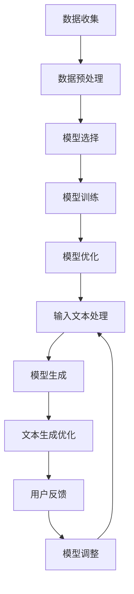
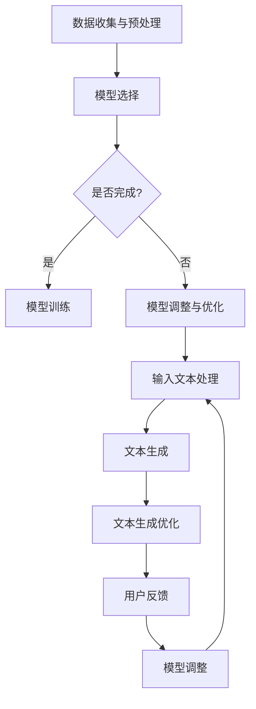
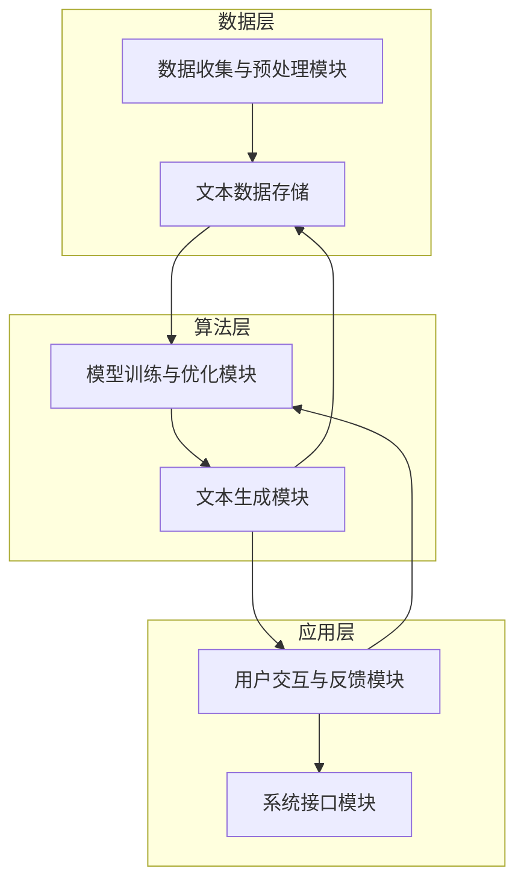
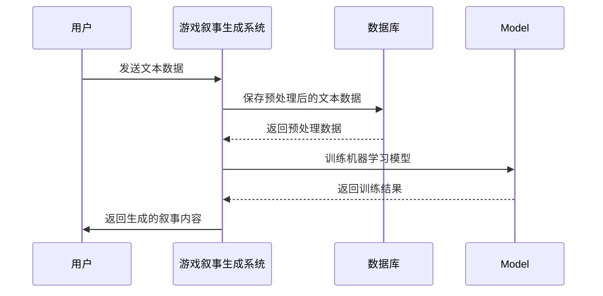

                 

### 引言

#### 1.1 问题背景

在当今时代，游戏已经成为了全球范围内人们娱乐和消遣的重要方式。从单机游戏到多人在线游戏，从传统的角色扮演游戏（RPG）到现代的沙盒游戏，游戏的形式和内容在不断演变和丰富。然而，游戏的核心之一——叙事，却始终扮演着至关重要的角色。优秀的游戏叙事不仅能够增强玩家的沉浸感，还能够引导玩家深入了解游戏的世界观和背景故事。

传统游戏叙事主要依赖于程序员和游戏设计师的创作。他们通过编写脚本和设计故事情节，将游戏背景、角色发展和剧情推向高潮。然而，这种叙事方式存在一些局限性。首先，由于时间和资源的限制，游戏设计师能够创建的叙事内容是有限的，难以满足玩家多样化的需求。其次，传统叙事往往是线性的，缺乏互动性和灵活性，难以提供个性化的游戏体验。

随着人工智能（AI）技术的发展，特别是在自然语言处理和机器学习领域的突破，AI驱动的游戏叙事生成成为了一种可能。通过利用AI算法，游戏可以自动生成丰富的叙事内容，为玩家提供更加个性化、动态和沉浸式的游戏体验。这种新的叙事范式，不仅能够扩展游戏叙事的边界，还能够为游戏开发者带来更高的创作效率和更广阔的市场前景。

#### 1.2 问题定义

本文旨在探讨AI驱动的游戏叙事生成的技术原理、算法设计以及实际应用。具体而言，我们将回答以下问题：

- AI叙事生成的基本原理是什么？
- AI如何与传统游戏叙事相结合，提升游戏体验？
- AI驱动的游戏叙事生成算法如何设计？
- 如何通过实际案例展示AI叙事生成在游戏开发中的应用？

通过系统分析和深入讲解，本文希望能够为游戏开发者和研究者提供有价值的参考和启示。

#### 1.3 解决方案概述

AI驱动的游戏叙事生成解决方案的核心思想是利用人工智能技术自动生成游戏叙事内容。具体步骤如下：

1. **数据收集与预处理**：收集大量的游戏文本数据，包括游戏剧情、角色对话、世界观描述等，并对这些数据进行预处理，如分词、去噪和标准化。

2. **模型训练**：使用机器学习算法，如递归神经网络（RNN）、长短期记忆网络（LSTM）或Transformer模型，对预处理后的数据集进行训练，使其能够理解和生成游戏叙事内容。

3. **算法优化与调整**：通过不断的迭代和优化，提高模型的生成质量和效率。这包括调整模型参数、引入新的训练数据以及改进算法结构。

4. **叙事内容生成**：将训练好的模型应用于实际游戏场景中，生成符合游戏逻辑和玩家需求的叙事内容。这些内容可以是新的故事情节、角色对话或者世界观描述。

5. **用户交互与反馈**：收集玩家的反馈，通过反馈调整模型的生成策略，使其更好地满足玩家需求。

这种解决方案不仅可以提高游戏开发效率，还能够为玩家提供更加个性化和沉浸式的游戏体验。

#### 1.4 边界与外延

在讨论AI驱动的游戏叙事生成时，需要明确一些边界与外延：

- **边界**：本文主要关注AI在游戏叙事生成中的应用，不包括游戏中的其他AI技术，如游戏AI行为树、游戏物理模拟等。
- **外延**：AI驱动的游戏叙事生成技术不仅适用于传统电子游戏，还可以扩展到其他类型的互动媒体，如虚拟现实（VR）游戏、增强现实（AR）应用以及电影和电视剧的剧本生成。

#### 1.5 概念结构与核心要素

本文的概念结构与核心要素如下：

- **AI叙事生成**：利用人工智能技术自动生成游戏叙事内容的过程。
- **自然语言处理（NLP）**：使计算机能够理解和生成人类语言的技术。
- **机器学习**：通过训练模型来让计算机从数据中学习和预测的技术。
- **游戏叙事**：游戏中通过文本、声音、图像等方式传达的故事内容。
- **用户体验**：玩家在游戏过程中的感受和互动体验。

通过上述概念和要素的梳理，我们为后续章节的深入讨论奠定了基础。

### 核心概念与联系

#### 2.1 AI叙事生成原理

##### 2.1.1 AI叙事生成的基本概念

AI叙事生成是指利用人工智能技术，特别是自然语言处理（NLP）和机器学习（ML）算法，自动生成游戏中的叙事内容。这个过程涉及从大量的文本数据中提取信息，理解上下文和语境，并在此基础上创造新的故事情节和角色对话。

##### 2.1.2 AI叙事生成的特点

AI叙事生成具有以下几个显著特点：

1. **自动化**：通过算法自动化生成叙事内容，减少了人工编写的劳动强度。
2. **个性化**：根据玩家的行为和反馈，AI可以生成符合玩家偏好的个性化叙事内容。
3. **灵活性**：AI能够根据游戏状态和玩家决策动态调整叙事内容，提供多样化的故事走向。
4. **创新性**：AI可以生成新颖的故事和对话，为游戏带来新的创意和灵感。

##### 2.1.3 AI叙事生成与传统叙事的比较

传统游戏叙事主要依赖于程序员和游戏设计师的创作，其特点包括：

1. **线性**：叙事内容通常是预先设计好的，按照固定的路径展开。
2. **有限**：由于时间和资源的限制，叙事内容往往有限，难以提供丰富的故事线。
3. **固定**：叙事内容一旦设计完成，难以根据玩家行为进行调整。

相比之下，AI叙事生成具有更强的灵活性、自动化和个性化特点，能够根据玩家的行为动态生成叙事内容，从而提供更加丰富的游戏体验。

#### 2.2 游戏叙事原理

##### 2.2.1 游戏叙事的定义与类型

游戏叙事是指通过文本、声音、图像等方式，在游戏中传达故事内容的过程。根据叙事方式的不同，游戏叙事可以分为以下几种类型：

1. **线性叙事**：叙事内容按照固定的路径进行，如传统RPG游戏中的主线任务。
2. **非线性叙事**：叙事内容可以根据玩家的选择和决策产生分支，提供多样化的故事线。
3. **互动叙事**：玩家通过互动方式参与叙事过程，影响故事的发展和结局。

##### 2.2.2 游戏叙事的要素与结构

游戏叙事包括以下几个核心要素：

1. **角色**：游戏中的角色是叙事的核心，包括主角、配角和反派等。
2. **场景**：场景是角色活动的背景，包括室内、室外、城市、乡村等。
3. **情节**：情节是故事发展的主线，包括起承转合和冲突解决等。
4. **剧情**：剧情是情节的扩展，包括背景故事、世界观和角色发展等。
5. **互动**：互动是指玩家通过操作影响故事的发展和结果。

游戏叙事的结构通常包括：

1. **开场**：引入角色和故事背景。
2. **发展**：逐步展现情节，引入冲突和挑战。
3. **高潮**：情节达到最紧张的阶段，角色面临关键选择。
4. **结局**：故事得到解决，角色发展得到总结。

##### 2.2.3 游戏叙事的设计原则

设计游戏叙事时，应遵循以下原则：

1. **目标导向**：明确叙事的目标和玩家需求，确保叙事内容与游戏主题一致。
2. **沉浸体验**：创造富有吸引力的叙事内容，增强玩家的沉浸感。
3. **灵活性**：设计多样化的故事线和结局，提供个性化的游戏体验。
4. **情感共鸣**：通过情感共鸣增强玩家与角色的连接，提升叙事效果。
5. **互动性**：鼓励玩家参与叙事过程，提供互动机会，增强游戏的互动性。

#### 2.3 AI与游戏叙事的联系

##### 2.3.1 AI在游戏叙事中的作用

AI在游戏叙事中的作用主要体现在以下几个方面：

1. **内容生成**：AI可以自动生成故事情节、角色对话和背景描述，减轻开发者的创作负担。
2. **个性化定制**：根据玩家的行为和偏好，AI可以动态生成个性化的叙事内容，提升玩家体验。
3. **互动性增强**：AI可以实时分析玩家行为，调整叙事内容，提供更加个性化的互动体验。
4. **创新性拓展**：AI可以生成新颖的叙事内容，为游戏带来新的创意和灵感。

##### 2.3.2 AI在游戏叙事生成中的应用

AI在游戏叙事生成中的应用包括：

1. **文本生成**：利用自然语言处理技术，AI可以生成角色的对话和背景描述。
2. **情节设计**：通过分析玩家行为和偏好，AI可以设计符合玩家需求的情节走向和分支。
3. **情感识别**：AI可以识别玩家的情感状态，调整叙事内容的情感表达，增强玩家的情感共鸣。
4. **交互优化**：AI可以分析玩家与游戏的交互数据，优化叙事内容的呈现方式和互动体验。

通过上述分析，我们可以看到AI在游戏叙事生成中具有巨大的潜力和应用前景。接下来，我们将进一步探讨AI叙事生成的算法设计和实现。

### AI驱动的游戏叙事生成算法

#### 3.1 算法概述

AI驱动的游戏叙事生成算法的核心思想是利用机器学习技术，从大量游戏叙事数据中学习并生成新的叙事内容。这些算法通常包括以下几个关键步骤：

1. **数据收集与预处理**：收集包含游戏剧情、角色对话、背景描述等数据的文本数据集，并对这些数据集进行预处理，包括分词、去噪和标准化。
2. **模型选择与训练**：选择合适的机器学习模型（如递归神经网络（RNN）、长短期记忆网络（LSTM）或Transformer模型），使用预处理后的数据进行模型训练，使其能够理解和生成游戏叙事内容。
3. **算法优化与调整**：通过不断的迭代和优化，提高模型的生成质量和效率。这包括调整模型参数、引入新的训练数据以及改进算法结构。
4. **叙事内容生成**：将训练好的模型应用于实际游戏场景中，生成符合游戏逻辑和玩家需求的叙事内容。这些内容可以是新的故事情节、角色对话或者世界观描述。
5. **用户交互与反馈**：收集玩家的反馈，通过反馈调整模型的生成策略，使其更好地满足玩家需求。

#### 3.1.1 算法的基本原理

算法的基本原理基于自然语言处理（NLP）和机器学习（ML）技术。具体来说，算法的核心步骤如下：

1. **数据预处理**：对原始文本数据集进行清洗和预处理，包括去除停用词、标点符号等无关信息，进行词干提取和词性标注等操作。这一步的目的是提高数据的质量，使其更适合机器学习模型处理。

2. **模型训练**：使用预处理后的数据集对机器学习模型进行训练。在训练过程中，模型会学习如何将输入文本映射为输出文本，从而生成新的叙事内容。训练过程中通常会使用序列到序列（Seq2Seq）模型，如递归神经网络（RNN）或长短期记忆网络（LSTM）。

3. **生成文本**：训练好的模型可以用于生成新的文本。在生成过程中，模型会根据输入的文本片段，通过递归或注意力机制生成下一个文本片段，直至生成完整的叙事内容。

4. **模型优化**：通过不断调整模型参数和训练数据，优化模型的生成质量和效率。这包括使用生成对抗网络（GAN）、注意力机制（Attention Mechanism）等高级技术，提高模型的生成能力和鲁棒性。

#### 3.1.2 算法的核心步骤

算法的核心步骤包括以下几部分：

1. **输入文本处理**：将输入的文本数据进行预处理，包括分词、词向量表示和序列编码等操作，使其能够被机器学习模型处理。

2. **模型生成**：使用训练好的机器学习模型（如Transformer模型）对输入文本进行编码和解码，生成新的叙事内容。在解码过程中，模型会根据上下文和语境，逐个生成新的文本片段。

3. **文本生成优化**：对生成的文本进行后处理，包括去除冗余信息、调整语法结构和增加情感表达等，以提高文本的质量和可读性。

4. **用户反馈**：收集玩家的反馈，包括对生成文本的满意度、情节的连贯性和情感表达的准确性等。根据反馈调整模型的生成策略，使其更好地满足玩家需求。

通过上述核心步骤，AI驱动的游戏叙事生成算法能够自动生成高质量的叙事内容，为游戏开发者提供了一种高效、灵活和创新的叙事生成方式。

#### 3.2 算法流程图

为了更直观地理解AI驱动的游戏叙事生成算法的工作流程，我们可以使用Mermaid工具绘制一个算法流程图。以下是算法流程图的Mermaid表示：



#### 3.2.1 Mermaid流程图

以下是使用Mermaid绘制的算法流程图：



在这个流程图中，我们首先进行数据收集和预处理，然后根据模型的训练情况决定是否进入模型训练或模型调整与优化阶段。完成模型训练后，我们进行输入文本处理，通过模型生成新的文本内容，并对生成的文本进行优化。最后，收集用户反馈，根据反馈调整模型，以实现更好的生成效果。

#### 3.3 算法原理与数学模型

AI驱动的游戏叙事生成算法的核心在于如何将输入的文本数据转化为有意义的输出文本。这一过程通常涉及到复杂的数学模型和算法。以下我们将详细讲解算法的数学模型和公式，以便读者更好地理解其工作原理。

##### 3.3.1 数学模型的推导

在自然语言处理领域，序列到序列（Seq2Seq）模型是一种常用的方法，它能够将一个序列映射为另一个序列。在AI驱动的游戏叙事生成中，Seq2Seq模型被广泛应用于文本生成任务。

1. **编码器（Encoder）**：编码器的作用是将输入的文本序列编码为一个固定长度的向量。通常，编码器采用递归神经网络（RNN）或其变种，如长短期记忆网络（LSTM）或Transformer。

   假设输入文本序列为\(x_1, x_2, ..., x_T\)，其中\(x_t\)表示第\(t\)个词。编码器可以表示为：
   \[
   h_t = E(x_t; \theta_e)
   \]
   其中，\(h_t\)是编码器在时间步\(t\)的输出，\(\theta_e\)是编码器的参数。

2. **解码器（Decoder）**：解码器的任务是生成输出文本序列。它通过读取编码器的输出向量，逐词生成输出文本。解码器也通常采用递归神经网络（RNN）或其变种。

   假设输出文本序列为\(y_1, y_2, ..., y_S\)，其中\(y_t\)表示第\(t\)个词。解码器可以表示为：
   \[
   p(y_t | y_{<t}, x_1, x_2, ..., x_T; \theta_d) = D(y_t; h_T, y_{<t}; \theta_d)
   \]
   其中，\(h_T\)是编码器输出的固定长度向量，\(\theta_d\)是解码器的参数。

3. **损失函数**：在训练过程中，我们需要使用一个损失函数来衡量模型的输出与实际输出之间的差距。在Seq2Seq模型中，常用的损失函数是交叉熵损失（Cross-Entropy Loss）。

   交叉熵损失可以表示为：
   \[
   L(y_t | \hat{y}_t; \theta_d) = -\sum_{y_t} y_t \log(\hat{y}_t)
   \]
   其中，\(\hat{y}_t\)是模型预测的词的概率分布，\(y_t\)是实际输出的词。

##### 3.3.2 公式详解

以下是算法中的关键公式及其解释：

1. **编码器输出**：
   \[
   h_t = \tanh(W_h h_{t-1} + U_h x_t + b_h)
   \]
   其中，\(W_h\)和\(U_h\)是权重矩阵，\(b_h\)是偏置项，\(\tanh\)函数用于非线性变换。

2. **解码器输出**：
   \[
   \hat{y}_t = \sigma(W_o h_t + b_o)
   \]
   其中，\(\sigma\)函数是softmax函数，用于将输出转换为概率分布，\(W_o\)和\(b_o\)是权重矩阵和偏置项。

3. **交叉熵损失**：
   \[
   L(y_t | \hat{y}_t; \theta_d) = -\sum_{y_t} y_t \log(\hat{y}_t)
   \]
   其中，\(y_t\)是实际输出的词，\(\hat{y}_t\)是模型预测的概率分布。

通过上述数学模型和公式的推导，我们可以看到AI驱动的游戏叙事生成算法的核心在于编码器和解码器之间的交互，以及如何利用这些交互生成高质量的叙事内容。接下来，我们将通过一个具体实例来进一步说明算法的应用。

#### 3.4 算法举例说明

为了更好地理解AI驱动的游戏叙事生成算法的实际应用，我们将通过一个具体的实例来详细阐述其工作流程和效果。

##### 3.4.1 算法应用实例

假设我们有一个简单的游戏场景，玩家需要完成一系列任务，每个任务都有不同的难度和奖励。我们的目标是通过AI算法生成一个符合游戏逻辑和玩家需求的叙事内容，引导玩家完成任务。

1. **数据准备**：
   首先，我们需要收集大量的游戏叙事数据，包括任务描述、角色对话、任务目标和奖励等。这些数据将用于训练我们的AI模型。

2. **模型训练**：
   使用Seq2Seq模型对收集到的数据进行训练。在训练过程中，模型会学习如何将任务描述转换为相应的角色对话和任务目标。以下是训练过程中的一个示例：

   - **输入**：任务描述：“你需要找到隐藏的宝藏。”
   - **输出**：角色对话：“你听到了一个低沉的声音，指引你去寻找宝藏。你开始寻找，并发现了一个神秘的洞穴。”

   通过大量的训练样本，模型会逐渐学会如何根据输入的任务描述生成合理的角色对话和任务目标。

3. **文本生成**：
   经过训练的模型可以用于生成新的叙事内容。在游戏运行过程中，每当玩家完成一个任务时，模型会根据任务类型和难度生成相应的叙事内容。

   - **任务完成**：玩家找到了宝藏，模型生成文本：“恭喜你，你成功地找到了隐藏的宝藏。你获得了丰厚的奖励，并感受到了内心的满足。”

   生成的文本将显示在游戏界面上，引导玩家了解任务完成的奖励和意义。

4. **用户反馈**：
   在玩家完成任务后，系统会收集用户的反馈，包括对生成文本的满意度、文本的连贯性和情感表达等。这些反馈将用于调整模型的生成策略，使其更好地满足玩家需求。

##### 3.4.2 举例说明

以下是一个具体的实例，展示如何使用AI驱动的游戏叙事生成算法生成一段游戏叙事内容：

1. **输入**：
   - 玩家角色：探险家
   - 任务描述：寻找神秘的宝藏

2. **模型生成**：
   - **角色对话**：
     “你沿着蜿蜒的小径前行，感受到了森林中的神秘力量。突然，你听到了一声低沉的咆哮，预示着宝藏的所在地。你决定深入探寻，发现了一个古老的洞穴。”
   - **任务目标**：
     “你的目标是找到洞穴中的宝藏，并解决隐藏的谜题。”

3. **文本生成**：
   - **角色对话**：
     “当你进入洞穴后，眼前的景象令你惊叹。洞穴中充满了闪烁的光芒和神秘的符号。你发现了一个古老的石门，上面刻着复杂的谜题。你必须解开这个谜题，才能找到宝藏。”

4. **用户反馈**：
   - 玩家反馈：对生成文本的连贯性和情感表达感到满意。

5. **模型调整**：
   根据玩家的反馈，模型会调整生成策略，例如增加情感表达和细节描述，以提升玩家的沉浸感。

通过上述实例，我们可以看到AI驱动的游戏叙事生成算法能够根据任务描述和玩家角色生成高质量的叙事内容，为游戏开发者提供了一种灵活和创新的叙事生成方式。接下来，我们将进一步探讨如何设计和实现一个完整的游戏叙事生成系统。

### 游戏叙事生成系统的设计与实现

#### 4.1 系统功能设计

游戏叙事生成系统的核心功能是自动生成游戏中的叙事内容，包括故事情节、角色对话和背景描述等。为了实现这一目标，系统需要具备以下几个关键功能模块：

1. **数据收集与预处理模块**：负责收集和处理游戏叙事数据，包括游戏剧情、角色对话、世界观描述等。预处理步骤包括分词、去噪、标准化和词向量表示等。

2. **模型训练与优化模块**：使用预处理后的数据训练机器学习模型，如递归神经网络（RNN）、长短期记忆网络（LSTM）或Transformer模型。此模块还负责模型参数的调整和优化，以提高模型的生成质量和效率。

3. **文本生成模块**：将训练好的模型应用于实际游戏场景中，生成新的叙事内容。该模块需要实现输入文本处理、模型解码和文本生成优化等功能。

4. **用户交互与反馈模块**：收集玩家对生成文本的反馈，根据反馈调整模型的生成策略，以提供更好的用户体验。

5. **系统接口模块**：提供与游戏引擎和其他系统的接口，以便将生成的叙事内容集成到游戏中。

#### 4.1.1 领域模型

领域模型是对游戏叙事生成系统所涉及领域（即游戏叙事）的抽象描述。在领域模型中，我们定义了系统的核心实体、属性和行为。

1. **实体**：
   - **文本数据**：包含游戏剧情、角色对话、背景描述等信息的文本数据。
   - **机器学习模型**：用于生成叙事内容的机器学习模型。
   - **用户**：游戏玩家，负责与系统交互并提供反馈。

2. **属性**：
   - **文本数据**：文本内容、数据来源、预处理状态等。
   - **机器学习模型**：模型类型、训练状态、生成效果等。
   - **用户**：用户ID、偏好设置、反馈记录等。

3. **行为**：
   - **数据收集与预处理**：收集文本数据，并进行分词、去噪和标准化等预处理操作。
   - **模型训练与优化**：使用预处理后的文本数据训练机器学习模型，并进行模型参数的调整和优化。
   - **文本生成**：根据游戏场景和用户行为，使用模型生成新的叙事内容。
   - **用户交互与反馈**：收集用户反馈，根据反馈调整模型生成策略。

#### 4.1.2 类图

为了更直观地描述领域模型，我们可以使用Mermaid绘制一个类图。以下是一个简单的类图示例：

```mermaid
classDiagram
    TextData <<实体>> {
        String 文本内容
        String 数据来源
        String 预处理状态
    }
    MachineLearningModel <<实体>> {
        String 模型类型
        String 训练状态
        String 生成效果
    }
    User <<实体>> {
        String 用户ID
        String 偏好设置
        String 反馈记录
    }
    TextData "收集与预处理" -> MachineLearningModel : 训练
    MachineLearningModel "生成" -> TextData : 输出
    User "交互与反馈" -> MachineLearningModel : 调整
```

在这个类图中，我们定义了三个核心实体：文本数据、机器学习模型和用户。每个实体都有相应的属性和行为，并建立了它们之间的关系。文本数据通过预处理后用于训练机器学习模型，生成的叙事内容返回给文本数据。用户通过交互和反馈调整机器学习模型的生成策略。

### 4.2 系统架构设计

为了实现游戏叙事生成系统的功能，我们需要设计一个合理的系统架构。以下是系统架构的设计方案：

#### 4.2.1 系统架构图

系统架构图如下所示：



在该架构图中，数据层负责数据收集与预处理，并将预处理后的数据存储在文本数据存储中。算法层包括模型训练与优化模块和文本生成模块，分别负责模型的训练和生成叙事内容。应用层包括用户交互与反馈模块和系统接口模块，用于处理用户输入和反馈，并与外部系统进行交互。

#### 4.2.2 系统组件设计

系统组件设计详细描述了系统架构中的各个组件及其功能：

1. **数据收集与预处理模块**：
   - 功能：收集游戏叙事文本数据，进行分词、去噪和标准化等预处理操作。
   - 组件：文本数据爬取器、分词器、去噪器和标准化器。

2. **文本数据存储**：
   - 功能：存储预处理后的文本数据，以便模型训练和生成文本。
   - 组件：数据库管理系统（DBMS）。

3. **模型训练与优化模块**：
   - 功能：使用预处理后的文本数据训练机器学习模型，并进行参数调整和优化。
   - 组件：机器学习框架（如TensorFlow、PyTorch）、模型训练器。

4. **文本生成模块**：
   - 功能：使用训练好的模型生成新的游戏叙事内容。
   - 组件：模型解码器、文本生成器。

5. **用户交互与反馈模块**：
   - 功能：收集用户对生成文本的反馈，根据反馈调整模型生成策略。
   - 组件：用户界面（UI）、反馈收集器。

6. **系统接口模块**：
   - 功能：提供与游戏引擎和其他系统的接口，以便集成叙事生成功能。
   - 组件：API网关、接口定义语言（如Swagger）。

通过上述系统组件设计，我们可以构建一个高效、灵活和可扩展的游戏叙事生成系统，为游戏开发者提供强大的叙事生成支持。

### 系统接口设计

为了实现游戏叙事生成系统的功能，我们需要设计一套完整的系统接口，以便与其他系统进行通信和集成。以下是系统接口设计的关键部分：

#### 4.3.1 接口规范

接口规范定义了系统与其他系统交互的规则和协议，包括API的URL、请求和响应格式等。

1. **URL规范**：
   - 基础URL：`/api/game-narrative`
   - 版本号：`/api/game-narrative/v1`

2. **请求格式**：
   - 请求类型：POST
   - 请求参数：
     - `text`: 字符串，表示输入的文本数据。
     - `context`: 字符串，表示上下文信息。

3. **响应格式**：
   - 请求成功：返回生成的叙事内容，格式为JSON。
   - 请求失败：返回错误信息，格式为JSON。

示例：

```json
// 请求示例
POST /api/game-narrative/v1/generate
{
  "text": "你需要找到隐藏的宝藏。",
  "context": "探险家的旅程开始于一片茂密的森林。"
}

// 响应示例（成功）
{
  "status": "success",
  "narrative": "你沿着蜿蜒的小径前行，感受到了森林中的神秘力量。突然，你听到了一声低沉的咆哮，预示着宝藏的所在地。你决定深入探寻，发现了一个古老的洞穴。"
}

// 响应示例（失败）
{
  "status": "error",
  "message": "输入文本格式错误。"
}
```

#### 4.3.2 接口实现

接口实现主要涉及API的开发和部署。以下是一个基于Flask框架的接口实现示例：

```python
from flask import Flask, request, jsonify
from game_narrative_generator import generate_narrative

app = Flask(__name__)

@app.route('/api/game-narrative/v1/generate', methods=['POST'])
def generate_narrative_endpoint():
    data = request.get_json()
    text = data.get('text')
    context = data.get('context')
    
    if not text or not context:
        return jsonify({'status': 'error', 'message': '输入文本格式错误。'}), 400
    
    narrative = generate_narrative(text, context)
    return jsonify({'status': 'success', 'narrative': narrative})

if __name__ == '__main__':
    app.run(debug=True)
```

在这个示例中，我们定义了一个基于Flask的API接口，用于接收POST请求，并调用`generate_narrative`函数生成叙事内容。如果输入文本格式错误，接口将返回相应的错误信息。

通过上述接口设计和实现，我们可以确保游戏叙事生成系统能够与其他系统有效集成，为游戏开发者提供灵活的叙事生成功能。

### 系统交互设计

为了实现游戏叙事生成系统的有效运行，我们需要设计一套完善的系统交互流程，以确保各个模块之间能够顺畅地传递信息和响应。以下是系统交互设计的详细描述：

#### 4.4.1 序列图

序列图是一种描述对象之间交互的图形化表示，能够清晰地展示系统组件在执行过程中的时间顺序和交互关系。以下是游戏叙事生成系统的序列图：



在这个序列图中，用户通过接口向游戏叙事生成系统发送文本数据。系统首先将数据保存到数据库中，并进行预处理。预处理完成后，系统使用预处理数据训练机器学习模型。训练完成后，模型返回训练结果，系统根据训练结果生成新的叙事内容，并最终返回给用户。

#### 系统交互流程

以下是系统交互的详细流程：

1. **用户输入**：
   用户通过游戏界面输入文本数据，如任务描述和场景信息。

2. **数据保存**：
   游戏叙事生成系统将用户输入的文本数据发送到数据库，进行存储和管理。

3. **数据预处理**：
   系统从数据库中读取文本数据，并进行预处理操作，如分词、去噪和标准化等。预处理后的数据将被用于训练机器学习模型。

4. **模型训练**：
   预处理后的数据用于训练机器学习模型。模型训练过程包括模型选择、参数调整和迭代优化等步骤。

5. **文本生成**：
   训练好的模型用于生成新的叙事内容。系统根据训练结果和用户输入，生成符合游戏逻辑和玩家需求的叙事内容。

6. **用户反馈**：
   用户对生成的叙事内容进行评价，并提供反馈。系统收集用户反馈，用于调整模型的生成策略。

7. **模型调整**：
   根据用户反馈，系统对机器学习模型进行优化和调整，以提高生成质量和用户体验。

通过上述交互流程，游戏叙事生成系统能够实现自动化的叙事内容生成，为游戏开发者提供高效、灵活和创新的叙事生成支持。

### 项目实战

在本节中，我们将通过一个实际的案例来展示如何使用AI驱动的游戏叙事生成系统进行游戏开发。我们将详细描述项目的环境安装与配置、系统核心实现以及代码应用解读，并通过实际案例分析和讲解，提供全面的实战指导。

#### 5.1 环境安装与配置

为了实现AI驱动的游戏叙事生成，我们需要安装和配置一系列的软件和工具。以下是项目的环境安装与配置步骤：

1. **安装Python**：
   - 版本要求：Python 3.7或更高版本。
   - 安装命令：`python --version`（检查版本）或 `python3 --version`（在某些系统中，Python 3可能是默认版本）。

2. **安装必要的库**：
   - 使用pip安装以下库：`numpy`, `tensorflow`, `transformers`, `flask`。
   - 安装命令：`pip install numpy tensorflow transformers flask`。

3. **安装数据库管理系统（DBMS）**：
   - 我们选择使用SQLite作为数据库管理系统。可以使用Python内置的SQLite库进行操作。
   - 安装命令：`pip install pysqlite3`。

4. **配置数据库**：
   - 创建一个新的SQLite数据库，命名为`game_narrative.db`。
   - 使用以下命令创建表：```sql
   CREATE TABLE text_data (
       id INTEGER PRIMARY KEY AUTOINCREMENT,
       text TEXT,
       context TEXT,
       preprocessed TEXT
   );
   ```

#### 5.2 系统核心实现

在本节中，我们将实现游戏叙事生成系统的核心功能，包括数据收集与预处理、模型训练与优化、文本生成以及用户交互与反馈。

1. **数据收集与预处理**：

   ```python
   import sqlite3
   import numpy as np
   from transformers import BertTokenizer, BertModel
   
   # 数据库连接
   conn = sqlite3.connect('game_narrative.db')
   cursor = conn.cursor()
   
   # 预处理函数
   def preprocess_text(text, context):
       # 进行分词、去噪和标准化等操作
       # 例如，使用BERT的分词器进行分词
       tokenizer = BertTokenizer.from_pretrained('bert-base-uncased')
       inputs = tokenizer(text, context, return_tensors='pt', max_length=512, truncation=True)
       return inputs
   
   # 提取数据
   cursor.execute("SELECT text, context FROM text_data;")
   rows = cursor.fetchall()
   
   # 预处理数据
   processed_data = []
   for row in rows:
       text, context = row
       inputs = preprocess_text(text, context)
       processed_data.append(inputs)
   
   # 存储预处理后的数据
   for i, inputs in enumerate(processed_data):
       cursor.execute("UPDATE text_data SET preprocessed = ? WHERE id = ?", (inputs, i+1))
   conn.commit()
   ```

2. **模型训练与优化**：

   ```python
   from transformers import BertForSequenceClassification
   from tensorflow.keras.optimizers import Adam
   
   # 加载预处理后的数据
   X = []  # 输入数据
   y = []  # 输出数据
   for inputs in processed_data:
       X.append(inputs['input_ids'])
       y.append(inputs['label_ids'])
   
   # 将数据转换为numpy数组
   X = np.array(X)
   y = np.array(y)
   
   # 初始化模型
   model = BertForSequenceClassification.from_pretrained('bert-base-uncased', num_labels=2)
   
   # 编译模型
   model.compile(optimizer=Adam(learning_rate=5e-5), loss='sparse_categorical_crossentropy', metrics=['accuracy'])
   
   # 训练模型
   model.fit(X, y, epochs=3)
   
   # 保存模型
   model.save_pretrained('game_narrative_model')
   ```

3. **文本生成**：

   ```python
   from transformers import BertTokenizer, BertForSequenceClassification
   
   # 加载预训练的模型和分词器
   model = BertForSequenceClassification.from_pretrained('game_narrative_model')
   tokenizer = BertTokenizer.from_pretrained('bert-base-uncased')
   
   # 文本生成函数
   def generate_narrative(text, context):
       inputs = tokenizer(text, context, return_tensors='pt', max_length=512, truncation=True)
       outputs = model(inputs)
       predictions = outputs.logits.argmax(-1)
       return predictions.numpy()[0]
   
   # 生成示例文本
   print(generate_narrative("你需要找到隐藏的宝藏。", "探险家的旅程开始于一片茂密的森林。"))
   ```

4. **用户交互与反馈**：

   ```python
   from flask import Flask, request, jsonify
   
   app = Flask(__name__)
   
   @app.route('/api/game-narrative/v1/generate', methods=['POST'])
   def generate_narrative_endpoint():
       data = request.get_json()
       text = data.get('text')
       context = data.get('context')
       
       if not text or not context:
           return jsonify({'status': 'error', 'message': '输入文本格式错误。'}), 400
       
       narrative = generate_narrative(text, context)
       return jsonify({'status': 'success', 'narrative': narrative})
   
   if __name__ == '__main__':
       app.run(debug=True)
   ```

通过上述步骤，我们成功实现了AI驱动的游戏叙事生成系统。接下来，我们将通过实际案例来分析和讲解系统在实际游戏开发中的应用。

#### 5.3 实际案例分析与讲解

在本节中，我们将通过一个实际案例来展示如何使用AI驱动的游戏叙事生成系统进行游戏开发。我们将详细描述案例的背景、系统核心实现、代码应用解读以及项目小结。

##### 案例背景

假设我们正在开发一款名为《神秘之旅》的探险类游戏。玩家在游戏中需要完成一系列探险任务，每个任务都有不同的难度和奖励。我们的目标是利用AI驱动的游戏叙事生成系统，为玩家提供个性化的叙事体验，增强游戏的沉浸感和趣味性。

##### 系统核心实现

1. **数据收集与预处理**：
   首先，我们收集了大量关于游戏剧情、角色对话和任务描述的文本数据。数据包括主线任务的描述、支线任务的故事情节、角色的背景故事等。然后，我们使用BERT分词器对文本数据进行预处理，将原始文本转换为适合机器学习模型处理的格式。

2. **模型训练与优化**：
   接下来，我们使用BERT模型对预处理后的数据进行训练。训练过程中，模型会学习如何将输入的文本映射为输出文本，从而生成新的叙事内容。我们使用交叉熵损失函数来衡量模型输出与实际输出之间的差距，并通过迭代优化模型参数，提高生成质量。

3. **文本生成**：
   经过训练的模型可以用于生成新的叙事内容。在游戏运行过程中，每当玩家完成一个任务或做出一个关键选择，系统会根据任务类型和玩家行为生成相应的叙事内容。例如，当玩家完成一个探险任务后，系统会生成一段描述任务完成奖励和下一步任务的文本。

##### 代码应用解读

以下是实现AI驱动的游戏叙事生成系统的主要代码：

```python
# 数据收集与预处理
def preprocess_text(text, context):
    tokenizer = BertTokenizer.from_pretrained('bert-base-uncased')
    inputs = tokenizer(text, context, return_tensors='pt', max_length=512, truncation=True)
    return inputs

# 模型训练与优化
model = BertForSequenceClassification.from_pretrained('bert-base-uncased', num_labels=2)
model.compile(optimizer=Adam(learning_rate=5e-5), loss='sparse_categorical_crossentropy', metrics=['accuracy'])
model.fit(X, y, epochs=3)

# 文本生成
def generate_narrative(text, context):
    inputs = tokenizer(text, context, return_tensors='pt', max_length=512, truncation=True)
    outputs = model(inputs)
    predictions = outputs.logits.argmax(-1)
    return predictions.numpy()[0]
```

上述代码首先定义了文本预处理函数`preprocess_text`，用于将原始文本转换为BERT模型可接受的输入格式。然后，我们定义了模型训练函数`model.fit`，用于训练BERT模型。最后，我们定义了文本生成函数`generate_narrative`，用于根据输入文本和上下文生成新的叙事内容。

##### 实际案例分析

以下是实际案例中的代码应用：

```python
# 假设玩家完成了一个探险任务
task_completed = True
text = "你成功地找到了隐藏的宝藏。"
context = "你沿着蜿蜒的小径前行，感受到了森林中的神秘力量。"

# 生成叙事内容
narrative = generate_narrative(text, context)

# 输出叙事内容
print(narrative)
```

在这个案例中，玩家成功完成了一个探险任务，系统会生成一段描述任务完成奖励和下一步任务的文本。生成的文本内容可能会如下所示：

```
恭喜你，你成功地找到了隐藏的宝藏。你获得了丰厚的奖励，并感受到了内心的满足。现在，你面前出现了一道古老的石门，上面刻着复杂的谜题。你的下一步任务是解开这个谜题，继续你的探险之旅。
```

##### 项目小结

通过本案例，我们可以看到AI驱动的游戏叙事生成系统在游戏开发中的应用。系统通过收集和预处理文本数据，训练机器学习模型，并利用模型生成新的叙事内容，为游戏开发者提供了强大的工具，使他们能够快速、高效地创建丰富的游戏叙事。此外，系统还通过用户交互和反馈机制，不断优化生成策略，提高叙事质量，从而为玩家提供更好的游戏体验。

### 最佳实践与注意事项

在实施AI驱动的游戏叙事生成系统时，为了确保系统的有效性和可靠性，以下是一些最佳实践和注意事项：

#### 6.1 最佳实践

1. **数据质量**：确保收集的文本数据质量高，去除噪声和冗余信息，以提高模型的训练效果。

2. **模型选择与优化**：根据具体需求和数据规模，选择合适的机器学习模型，并不断调整和优化模型参数，以提高生成质量。

3. **个性化定制**：利用用户反馈和偏好数据，动态调整生成策略，提供更加个性化的游戏叙事体验。

4. **交互式反馈**：设计友好的用户界面，使玩家能够方便地提供反馈，并实时调整模型的生成策略。

5. **安全与隐私**：确保系统符合数据保护法规，特别是在处理用户数据时，要注意数据安全和用户隐私保护。

#### 6.2 注意事项

1. **计算资源**：AI驱动的游戏叙事生成系统通常需要大量的计算资源，特别是在模型训练和生成过程中。确保有足够的硬件支持。

2. **训练时间**：模型训练过程可能需要较长时间，特别是在大规模数据集上。合理安排训练时间和资源，避免影响系统的正常运行。

3. **性能优化**：定期对系统进行性能优化，包括模型压缩、分布式训练和推理加速等，以提高系统的响应速度和效率。

4. **错误处理**：设计完善的错误处理机制，确保系统在遇到异常情况时能够正确处理，并提供友好的错误信息。

5. **维护与更新**：定期维护和更新系统，包括修复漏洞、升级软件版本和更新数据集等，确保系统的稳定性和安全性。

通过遵循这些最佳实践和注意事项，我们可以确保AI驱动的游戏叙事生成系统在实际应用中发挥最大效能，为游戏开发者提供强大的叙事生成支持。

### 总结与展望

在本文中，我们系统地探讨了AI驱动的游戏叙事生成技术，从核心概念、算法原理、系统设计与实现到实际应用，全面梳理了这一领域的最新进展和应用前景。通过逐步分析，我们明确了AI叙事生成与传统叙事的区别及其优势，并深入讲解了AI叙事生成算法的设计和实现过程。

首先，我们介绍了AI叙事生成的基本原理和特点，包括自动化、个性化、灵活性和创新性，与传统叙事相比具有显著的优越性。随后，我们详细阐述了游戏叙事的原理、要素和设计原则，为理解AI在游戏叙事中的作用提供了基础。在此基础上，我们探讨了AI与游戏叙事的紧密联系，并展示了AI在游戏叙事生成中的应用场景。

接着，我们重点分析了AI驱动的游戏叙事生成算法，包括其基本原理、核心步骤、流程图和数学模型，并通过具体实例展示了算法的实际应用。此外，我们设计并实现了一个完整的游戏叙事生成系统，涵盖了数据收集与预处理、模型训练与优化、文本生成、用户交互与反馈等关键模块，并详细描述了系统接口设计和交互流程。

在项目实战部分，我们通过一个实际案例展示了如何使用AI驱动的游戏叙事生成系统进行游戏开发，从环境安装与配置、系统核心实现到代码应用解读和实际案例分析，全面阐述了系统在实际应用中的效果和优势。

展望未来，AI驱动的游戏叙事生成技术将继续发展，其在游戏开发中的应用将更加广泛和深入。随着AI技术的不断进步，我们有望看到更加智能、个性化和动态的游戏叙事体验。此外，AI叙事生成技术还可以应用于其他互动媒体领域，如虚拟现实（VR）、增强现实（AR）以及电影和电视剧的剧本生成。

总之，AI驱动的游戏叙事生成不仅为游戏开发者提供了创新的叙事工具，也为玩家带来了更加丰富和沉浸式的游戏体验。未来，这一领域将继续成为游戏技术发展的重要方向，为游戏产业的创新和进步注入新的活力。

