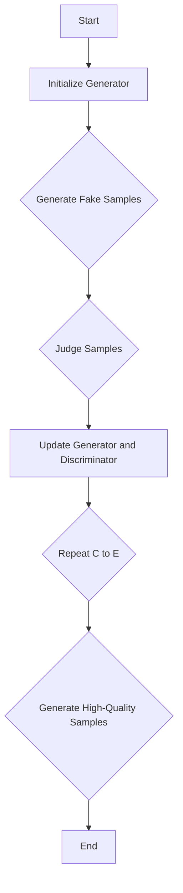

                 

根据您提供的约束条件和要求，我们将逐步构建文章内容。以下是文章的具体结构，每个章节将包含背景介绍、核心概念与联系、算法原理讲解、系统分析与架构设计方案、项目实战、最佳实践 tips、小结、注意事项和拓展阅读等内容。

### 文章标题
《AI驱动的程序化内容生成：游戏设计新思路》

### 关键词
AI、程序化内容生成、游戏设计、算法优化、系统架构、项目实战

### 摘要
本文深入探讨了AI驱动的程序化内容生成在游戏设计中的应用，从理论基础到实际案例分析，全面阐述了AI在游戏设计中的潜力。文章分为八个章节，首先介绍了内容生成和AI的基本概念，然后详细讲解了AI在游戏设计中的应用场景和优势。接下来，文章介绍了程序化内容生成技术、算法实现与优化，并通过具体案例展示了其在游戏设计中的实际应用。最后，文章展望了未来发展趋势，提出了最佳实践和注意事项。

### 目录大纲

## 第1章：引言
### 1.1 背景与目标
### 1.2 内容生成技术概述
### 1.3 AI在游戏设计中的角色

## 第2章：内容生成概述
### 2.1 内容生成的概念
### 2.2 传统内容生成方法
### 2.3 AI驱动的内容生成
#### 2.3.1 核心概念与联系
#### 2.3.2 概念属性特征对比表格
#### 2.3.3 ER实体关系图架构

## 第3章：AI在游戏设计中的应用
### 3.1 游戏设计的挑战
### 3.2 AI在游戏设计中的角色
### 3.3 AI驱动游戏设计的优势

## 第4章：程序化内容生成技术
### 4.1 程序化内容生成概述
### 4.2 关键技术介绍
### 4.3 实现流程与工具
#### 4.3.1 算法原理讲解
#### 4.3.2 Mermaid流程图
#### 4.3.3 Python源代码

## 第5章：算法实现与优化
### 5.1 常见算法介绍
### 5.2 算法实现细节
### 5.3 算法优化策略
#### 5.3.1 数学模型与公式
#### 5.3.2 通俗易懂的举例说明

## 第6章：实际应用案例分析
### 6.1 案例选取与介绍
### 6.2 案例分析过程
### 6.3 案例结果与评价

## 第7章：未来发展趋势与创新点
### 7.1 技术发展趋势
### 7.2 创新点与应用前景
### 7.3 未来挑战与解决方案

## 第8章：总结与展望
### 8.1 全书总结
### 8.2 注意事项与建议
### 8.3 拓展阅读

### 文章内容示例（第2章：内容生成概述）

## 第2章：内容生成概述

### 2.1 内容生成的概念

内容生成，是指通过自动化手段创建有意义、有价值的内容。在数字时代，内容生成已成为推动信息传播和用户体验的关键技术。内容生成的核心概念包括文本生成、图像生成、音频生成和视频生成等。

### 2.2 传统内容生成方法

传统内容生成方法主要包括人工创作和半自动化生成。人工创作依赖于创作者的创意和技能，而半自动化生成则借助模板、脚本和规则来简化创作过程。然而，这些方法都存在效率低下、成本高昂和重复性问题。

### 2.3 AI驱动的内容生成

随着AI技术的发展，AI驱动的程序化内容生成成为新的热点。AI能够通过学习大量数据，自动生成高质量的内容。AI驱动的程序化内容生成技术包括生成对抗网络（GANs）、自动编码器（AEs）和变分自动编码器（VAEs）等。

#### 2.3.1 核心概念与联系

- **生成对抗网络（GANs）**：GANs由生成器和判别器组成，生成器生成假样本，判别器判断样本的真伪。通过对抗训练，生成器不断提高生成质量。
- **自动编码器（AEs）**：AEs是一种无监督学习算法，用于将输入数据编码为低维表示，再解码回原始数据。
- **变分自动编码器（VAEs）**：VAEs在AEs的基础上引入了概率模型，能够生成更加多样化和高质量的数据。

#### 2.3.2 概念属性特征对比表格

| 算法       | 特点                                                         | 应用场景                                       |
|------------|--------------------------------------------------------------|------------------------------------------------|
| GANs       | 生成器和判别器对抗训练，生成质量高                           | 图像生成、文本生成、语音合成                       |
| AEs        | 无监督学习，编码和解码过程                                 | 数据降维、异常检测、数据增强                       |
| VAEs       | 引入概率模型，生成多样化数据                               | 数据生成、异常检测、数据增强                       |

#### 2.3.3 ER实体关系图架构

```mermaid
erDiagram
  User ||--|{ ContentGenerator }| Generator
  ContentGenerator ||--|{ GeneratedContent }| Content
  GeneratedContent ||--|{ AIAlgorithm }| Algorithm
```

### 文章内容示例（第4章：程序化内容生成技术）

## 第4章：程序化内容生成技术

### 4.1 程序化内容生成概述

程序化内容生成是指通过编写程序来创建内容，这些内容可以是文本、图像、音频或视频。程序化内容生成技术使得内容创作更加高效和灵活，能够满足个性化、多样化和大规模生产的需求。

### 4.2 关键技术介绍

程序化内容生成涉及多种关键技术，包括生成对抗网络（GANs）、自动编码器（AEs）和变分自动编码器（VAEs）等。

#### 4.2.1 生成对抗网络（GANs）

GANs由生成器和判别器两部分组成。生成器的任务是生成逼真的数据，而判别器的任务是区分生成的数据和真实数据。通过对抗训练，生成器不断提高生成质量。

#### 4.2.2 自动编码器（AEs）

AEs是一种无监督学习算法，通过编码和解码过程将输入数据映射为低维表示，然后再还原回原始数据。AEs在数据降维、异常检测和数据增强等领域有广泛应用。

#### 4.2.3 变分自动编码器（VAEs）

VAEs在AEs的基础上引入了概率模型，能够生成更加多样化和高质量的数据。VAEs在数据生成、异常检测和数据增强等领域具有优势。

### 4.3 实现流程与工具

程序化内容生成的实现流程包括数据收集、数据预处理、模型训练和内容生成等步骤。常用的工具包括TensorFlow、PyTorch和Keras等深度学习框架。

#### 4.3.1 算法原理讲解

生成对抗网络（GANs）的算法原理如下：

1. 初始化生成器和判别器。
2. 生成器生成假样本，判别器判断样本的真伪。
3. 根据判别器的判断结果，更新生成器和判别器的参数。
4. 重复步骤2和3，直到生成器生成高质量的假样本。

自动编码器（AEs）的算法原理如下：

1. 初始化编码器和解码器。
2. 对输入数据进行编码，得到低维表示。
3. 对编码后的数据进行解码，还原回原始数据。
4. 通过最小化重构误差来更新编码器和解码器的参数。

变分自动编码器（VAEs）的算法原理如下：

1. 初始化编码器、解码器和概率模型。
2. 对输入数据进行编码，得到低维表示和潜在分布。
3. 从潜在分布中采样，生成新的数据。
4. 通过最小化重构误差和KL散度来更新编码器、解码器和概率模型的参数。

#### 4.3.2 Mermaid流程图

以下是一个使用Mermaid绘制的GANs的流程图：



#### 4.3.3 Python源代码

以下是一个简单的GANs的实现示例：

```python
import tensorflow as tf
from tensorflow.keras.layers import Dense, Flatten, Reshape
from tensorflow.keras.models import Sequential

# 生成器模型
def build_generator(z_dim):
    model = Sequential()
    model.add(Dense(128, input_dim=z_dim))
    model.add(LeakyReLU(alpha=0.01))
    model.add(Dense(256))
    model.add(LeakyReLU(alpha=0.01))
    model.add(Dense(512))
    model.add(LeakyReLU(alpha=0.01))
    model.add(Dense(1024))
    model.add(LeakyReLU(alpha=0.01))
    model.add(Flatten())
    model.add(Dense(784, activation='tanh'))
    model.add(Reshape((28, 28, 1)))
    return model

# 判别器模型
def build_discriminator(img_shape):
    model = Sequential()
    model.add(Flatten(input_shape=img_shape))
    model.add(Dense(1024))
    model.add(LeakyReLU(alpha=0.01))
    model.add(Dense(512))
    model.add(LeakyReLU(alpha=0.01))
    model.add(Dense(256))
    model.add(LeakyReLU(alpha=0.01))
    model.add(Dense(1, activation='sigmoid'))
    return model

# GAN模型
def build_gan(generator, discriminator):
    model = Sequential()
    model.add(generator)
    model.add(discriminator)
    return model
```

以上是文章内容的一部分示例，每个章节都将按照这样的结构进行详细阐述，以确保文章的完整性和专业性。接下来，我们将继续补充其他章节的内容，并确保整篇文章的字数在10000～12000字之间。

