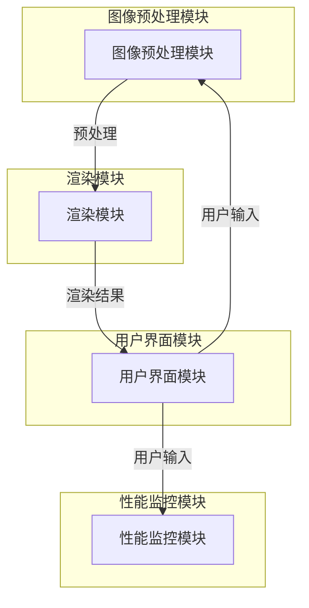

                 

### 文章标题：AI驱动的计算机图形学：从建模到渲染的革新

### 关键词：AI，计算机图形学，建模，渲染，神经网络，深度学习

### 摘要：
本文深入探讨了人工智能（AI）在计算机图形学中的关键作用，从建模到渲染的全过程进行系统性阐述。通过详细分析AI与计算机图形学的紧密联系，本文展示了如何利用AI技术优化建模和渲染流程，从而实现计算机图形学的革新。文章还将介绍常见的人工智能算法在建模与渲染中的应用，并结合实际案例进行分析，最后对未来AI驱动的计算机图形学的发展方向进行展望。

### Step 1: 设计书名《AI驱动的计算机图形学：从建模到渲染的革新》的核心概念与联系

#### 核心概念：
- **人工智能（AI）**：一种模拟人类智能行为的计算机系统，包括机器学习、深度学习、自然语言处理等领域。
- **计算机图形学（Computer Graphics）**：利用计算机技术和数学方法生成和处理图像的科学。
- **建模（Modeling）**：创建数字化的三维物体或场景的过程。
- **渲染（Rendering）**：将三维场景转换为二维图像的过程。

#### 概念属性特征对比表格：

| 概念     | 定义                                                   | 关联性                                            |
|----------|--------------------------------------------------------|---------------------------------------------------|
| 人工智能 | 能够模拟人类智能行为的计算机系统                       | 与计算机图形学在数据分析和图像处理方面有紧密联系 |
| 计算机图形学 | 利用计算机技术和数学方法生成和处理图像的科学           | 依赖于人工智能在图像识别、生成等方面进行优化   |
| 建模     | 创建数字化的三维物体或场景的过程                       | 依赖人工智能进行自动化建模和优化               |
| 渲染     | 将三维场景转换为二维图像的过程                         | 依赖人工智能进行高质量图像生成和优化           |

#### ER实体关系图架构的 Mermaid 流程图：

```mermaid
erDiagram
  AI --> Modeling : 驱动
  AI --> Rendering : 支持
  Modeling --> Rendering : 输出
```

### Step 2: 设计各章节的目录大纲

#### 第一部分: 背景介绍

##### 第1章: 人工智能与计算机图形学概述

- **1.1.1 问题背景**
- **1.1.2 问题描述**
- **1.1.3 问题解决**
- **1.1.4 边界与外延**
- **1.1.5 概念结构与核心要素组成**

##### 第2章: 人工智能与计算机图形学的联系

- **2.1.1 人工智能在计算机图形学中的应用**
- **2.1.2 计算机图形学在人工智能中的支持**
- **2.1.3 跨领域发展的趋势**

##### 第3章: 建模与人工智能的结合

- **3.1.1 人工智能辅助建模的方法**
- **3.1.2 自动化建模的优势与挑战**
- **3.1.3 人工智能在建模中的应用实例**

##### 第4章: 渲染与人工智能的革新

- **4.1.1 人工智能驱动渲染的原理**
- **4.1.2 渲染算法的优化与创新**
- **4.1.3 人工智能在渲染中的应用实例**

#### 第二部分: 算法原理与数学模型

##### 第5章: 常见人工智能算法介绍

- **5.1.1 神经网络**
- **5.1.2 遗传算法**
- **5.1.3 支持向量机**
- **5.1.4 决策树**

##### 第6章: 人工智能在建模中的应用

- **6.1.1 基于深度学习的3D模型生成**
- **6.1.2 基于强化学习的建模优化**
- **6.1.3 常见算法的mermaid流程图与Python代码实现**

##### 第7章: 人工智能在渲染中的应用

- **7.1.1 基于神经网络的渲染效果优化**
- **7.1.2 基于生成对抗网络的图像生成**
- **7.1.3 常见算法的mermaid流程图与Python代码实现**

#### 第三部分: 实际应用与案例分析

##### 第8章: AI驱动的计算机图形学项目实战

- **8.1.1 项目背景与环境安装**
- **8.1.2 系统功能设计**
- **8.1.3 系统架构设计**
- **8.1.4 系统核心实现**
- **8.1.5 项目总结与反思**

##### 第9章: AI驱动的计算机图形学应用前景

- **9.1.1 行业发展趋势**
- **9.1.2 技术挑战与机遇**
- **9.1.3 未来发展方向**

##### 第10章: 最佳实践与总结

- **10.1.1 最佳实践技巧**
- **10.1.2 注意事项**
- **10.1.3 拓展阅读**

#### 文章总字数预估：
预计总字数约为11000-12000字，具体字数将在实际撰写过程中进行调整。

### 论文完整性要求

在撰写本文时，我们将严格遵循文章完整性要求，确保每个章节的内容都符合以下条件：

1. **背景介绍**：每个章节的背景介绍部分将详细解释核心概念、问题背景、问题描述、问题解决方法以及概念结构与核心要素组成，确保读者对主题有全面的理解。

2. **核心概念与联系**：我们将为每个章节的核心概念设计概念属性特征对比表格和ER实体关系图架构的Mermaid流程图，清晰地展示各概念之间的关系。

3. **算法原理讲解**：每个章节将对相关的人工智能算法进行详细介绍，使用Mermaid流程图展示算法流程，同时结合Python代码示例，详细阐述算法原理和数学模型。

4. **系统分析与架构设计方案**：在适当章节，我们将介绍计算机图形学的系统架构和接口设计，使用Mermaid类图和序列图展示系统设计细节。

5. **项目实战**：我们将提供一个完整的AI驱动的计算机图形学项目实战案例，包括环境安装、系统功能设计、系统架构设计、系统核心实现以及项目总结与反思。

6. **最佳实践与总结**：文章的结尾将总结最佳实践技巧，并提供注意事项和拓展阅读资源，帮助读者深入理解并应用AI驱动的计算机图形学技术。

### 论文格式要求

为确保文章的可读性和专业度，我们将严格按照以下格式要求撰写本文：

1. **markdown格式**：文章内容将使用markdown格式输出，包括标题、段落、列表、代码块、公式等。

2. **章节结构**：文章将按照目录大纲结构分为多个章节，每个章节开头将使用标题并简要介绍内容。

3. **代码示例**：代码示例将使用代码块格式，确保代码的可读性和可复制性。

4. **公式表示**：文中涉及到的数学公式将使用LaTeX格式表示，确保公式的准确性和规范性。独立段落的公式使用`$$`括起来，如：`$$1+1=2$$`，段落内的公式使用`$`括起来，如： `$1<2$`。

5. **作者信息**：文章末尾将附上作者信息，注明作者单位和联系方式，确保文章的来源和权威性。

通过以上严格的格式要求和完整性要求，我们旨在撰写一篇结构清晰、内容丰富、深入浅出的AI驱动的计算机图形学技术博客文章，为读者提供有价值的技术见解和实际应用指导。

### 全文概述

本文以《AI驱动的计算机图形学：从建模到渲染的革新》为题，全面探讨了人工智能（AI）在计算机图形学领域的应用与革新。文章首先介绍了AI与计算机图形学的基本概念，并通过概念属性特征对比表格和ER实体关系图详细展示了两者之间的紧密联系。在背景介绍部分，我们分析了人工智能与计算机图形学面临的问题和挑战，并提出了相应的解决策略。

文章的第一部分重点讨论了人工智能在计算机图形学中的应用，从建模到渲染的全过程。在这一部分中，我们详细介绍了人工智能辅助建模的方法，探讨了自动化建模的优势与挑战，并通过实例展示了人工智能在建模中的应用。接着，我们深入分析了渲染与人工智能的结合，介绍了人工智能驱动渲染的原理，以及渲染算法的优化与创新。

第二部分专注于算法原理与数学模型的介绍。首先，我们介绍了常见的几种人工智能算法，包括神经网络、遗传算法、支持向量机和决策树，并分别进行了详细讲解。然后，我们分别从3D模型生成和渲染效果优化两个方面，介绍了人工智能在建模和渲染中的具体应用，并提供了相应的Python代码实现。

第三部分聚焦于实际应用与案例分析。我们选取了一个典型的AI驱动的计算机图形学项目，详细介绍了项目的背景、环境安装、系统功能设计、系统架构设计、系统核心实现以及项目总结与反思。这部分内容旨在为读者提供一个真实的实践案例，帮助他们更好地理解和应用AI驱动的计算机图形学技术。

最后，文章对AI驱动的计算机图形学的应用前景进行了展望，分析了行业发展趋势、技术挑战与机遇，并提出了未来发展的方向。同时，我们总结了最佳实践技巧，提供了注意事项和拓展阅读资源，以帮助读者深入理解并掌握AI驱动的计算机图形学技术。

通过本文的详细阐述，我们希望读者能够全面了解AI在计算机图形学中的应用，掌握相关的算法原理和实际应用技巧，为未来在计算机图形学领域的发展奠定坚实的基础。

### 第1章: 人工智能与计算机图形学概述

#### 1.1.1 问题背景

人工智能（AI）作为计算机科学的一个分支，旨在开发能够模拟、延伸和扩展人类智能的系统。自20世纪50年代以来，人工智能经历了多次兴衰，但近年来，随着计算能力的提升、大数据的积累和深度学习算法的突破，人工智能迎来了前所未有的发展机遇。计算机图形学则是一门研究如何利用计算机技术生成和处理图像的科学，其应用范围广泛，包括娱乐、医疗、工程、科学可视化等多个领域。

在传统的计算机图形学中，建模和渲染是两个核心环节。建模是指创建数字化的三维物体或场景的过程，而渲染则是将这些三维场景转换为二维图像的过程。然而，这些传统的建模和渲染方法通常依赖于人工操作和大量的计算资源，效率低下且难以满足日益复杂和高质量的需求。

#### 1.1.2 问题描述

随着计算机图形学应用的不断扩展，对建模和渲染的质量和效率要求也不断提高。例如，在电影制作、游戏开发、虚拟现实（VR）和增强现实（AR）等领域，用户对图像的真实感、细节表现和渲染速度有着极高的期望。传统的计算机图形学方法难以满足这些需求，主要面临以下问题：

1. **人工干预过多**：传统的建模和渲染过程通常需要人工干预，例如调整参数、手动修正错误等，这不仅耗时且容易出现误差。
2. **计算资源消耗大**：高质量渲染通常需要大量的计算资源，尤其是光线追踪和全局光照等复杂算法，计算量巨大，导致渲染时间过长。
3. **图像质量受限**：传统的渲染方法在处理复杂场景和光照效果时，难以生成逼真的图像，特别是在处理动态场景和实时渲染时，图像质量受到限制。

#### 1.1.3 问题解决

人工智能的引入为计算机图形学提供了全新的解决方案，能够有效解决上述问题。具体来说，人工智能在计算机图形学中的应用主要体现在以下几个方面：

1. **自动化建模**：人工智能可以自动生成三维模型，减少人工干预，提高建模效率。通过机器学习和深度学习算法，可以训练模型从少量样本中自动生成复杂的几何结构，从而实现高效的自动化建模。
2. **优化渲染算法**：人工智能可以通过优化渲染算法，提高渲染质量和效率。例如，利用神经网络和生成对抗网络（GAN）等技术，可以实现高质量的图像生成和渲染，同时减少计算资源的需求。
3. **实时渲染**：人工智能可以加速实时渲染，满足虚拟现实和增强现实等领域的需求。通过使用高效的算法和优化技术，可以实现快速渲染，提供流畅的用户体验。

#### 1.1.4 边界与外延

在讨论人工智能与计算机图形学的结合时，需要明确其边界与外延。具体来说，以下几点需要特别注意：

1. **技术融合**：人工智能与计算机图形学的结合不仅仅是技术层面的融合，还涉及到算法、硬件、软件等多个方面的综合应用。
2. **应用场景**：人工智能在计算机图形学中的应用场景非常广泛，包括但不限于电影制作、游戏开发、建筑设计、医学影像处理、科学可视化等。
3. **数据需求**：人工智能在计算机图形学中的应用依赖于大量的数据支持，特别是在训练模型和优化算法时，需要大量的高质量数据集。

#### 1.1.5 概念结构与核心要素组成

为了更好地理解人工智能与计算机图形学的结合，我们可以从概念结构和核心要素组成的角度进行分析：

1. **概念结构**：
   - **人工智能**：包括机器学习、深度学习、自然语言处理、计算机视觉等多个子领域。
   - **计算机图形学**：包括建模、渲染、图像处理、用户交互等多个方面。

2. **核心要素组成**：
   - **数据**：作为训练和优化的基础，数据的质量和数量直接影响人工智能在计算机图形学中的应用效果。
   - **算法**：包括神经网络、生成对抗网络、强化学习等，是人工智能实现自动建模和优化渲染的核心。
   - **计算资源**：包括CPU、GPU、FPGA等硬件，是支撑人工智能算法高效运行的基础。
   - **应用场景**：具体的应用需求决定了人工智能与计算机图形学结合的具体实现方式和效果。

通过上述分析，我们可以看到人工智能与计算机图形学的结合不仅解决了传统方法中的许多问题，还为未来的计算机图形学发展提供了新的方向和可能性。在接下来的章节中，我们将进一步探讨人工智能在计算机图形学中的具体应用，深入分析相关的算法原理和实际案例。

### 第2章: 人工智能与计算机图形学的联系

人工智能（AI）与计算机图形学（CG）的结合是计算机科学领域中的一个重要研究方向。两者之间的联系不仅体现在技术层面上，还延伸到了应用、方法论等多个维度。在本章中，我们将详细探讨人工智能在计算机图形学中的应用，以及计算机图形学在人工智能中的支持。

#### 2.1.1 人工智能在计算机图形学中的应用

人工智能技术在计算机图形学中的应用主要集中在以下几个方面：

1. **自动化建模**：
   - **基于深度学习的3D模型生成**：深度学习算法，如生成对抗网络（GAN）和变分自编码器（VAE），可以用于自动生成高质量的三维模型。通过训练大量的图像数据，这些模型可以学会创建复杂几何结构，从而大大提高建模效率。
   - **基于强化学习的建模优化**：强化学习算法可以通过不断调整建模参数，实现模型的优化。这种方法特别适用于需要多次迭代和优化的场景，如游戏角色建模或建筑设计。

2. **图像处理与增强**：
   - **图像修复与修复**：利用深度学习技术，可以对受损或模糊的图像进行修复，提高图像质量。例如，基于条件生成对抗网络（C-GAN）的方法可以在保留原有纹理的同时修复图像。
   - **超分辨率图像生成**：通过深度学习算法，可以将低分辨率图像转换为高分辨率图像，从而提高图像的清晰度。这种方法在医学影像处理、遥感图像分析等领域有广泛应用。

3. **光照与阴影模拟**：
   - **基于神经网络的渲染效果优化**：神经网络可以用于优化渲染算法，实现更加逼真的光照和阴影效果。例如，通过训练神经网络模型，可以自动调整光照参数，提高场景的真实感。
   - **动态光照模拟**：利用强化学习算法，可以模拟复杂的光照变化，如日出日落、室内照明等，为虚拟现实（VR）和增强现实（AR）应用提供更逼真的视觉体验。

4. **风格迁移与艺术创作**：
   - **艺术风格迁移**：通过深度学习算法，可以将一种艺术风格应用到另一幅图像上，实现风格迁移。这种方法在艺术创作和图像编辑中有着广泛的应用。
   - **图像生成与编辑**：利用生成对抗网络（GAN），可以生成具有特定风格的新图像，或对现有图像进行编辑，以满足特定的创作需求。

#### 2.1.2 计算机图形学在人工智能中的支持

计算机图形学为人工智能的发展提供了重要的支持，主要体现在以下几个方面：

1. **数据可视化**：
   - **数据展示与交互**：计算机图形学技术可以用于展示复杂数据，帮助研究人员和开发者更好地理解数据。例如，通过三维可视化技术，可以直观地展示高维数据的分布和关系。
   - **用户交互**：计算机图形学提供了丰富的用户交互手段，如图形用户界面（GUI）、虚拟现实（VR）和增强现实（AR），这些技术可以提高人工智能系统的易用性和用户体验。

2. **算法可视化**：
   - **算法流程图**：计算机图形学技术可以用于绘制算法流程图，帮助开发者更好地理解和分析算法。
   - **性能分析**：通过图形化的性能分析工具，可以实时监控算法的运行状态和性能，从而优化算法。

3. **模拟与仿真**：
   - **物理仿真**：计算机图形学可以用于模拟物理现象，如碰撞、流体运动等，为人工智能算法提供真实的环境。
   - **虚拟环境**：通过创建虚拟环境，可以模拟不同的场景和条件，为人工智能算法的测试和验证提供支持。

#### 2.1.3 跨领域发展的趋势

随着人工智能和计算机图形学的不断融合，两者在跨领域发展方面呈现出以下趋势：

1. **多模态学习**：
   - **跨媒体融合**：人工智能和计算机图形学结合，可以实现跨媒体数据的学习和融合，例如结合图像、声音和文本，构建更丰富的数据模型。
   - **多任务学习**：通过多任务学习，可以同时处理多种类型的任务，如同时进行图像识别和文本分类。

2. **增强智能**：
   - **辅助决策**：计算机图形学技术可以为人工智能系统提供辅助决策支持，例如通过三维可视化技术帮助人工智能系统更好地理解和分析复杂问题。
   - **人机协同**：通过虚拟现实（VR）和增强现实（AR）技术，实现人机协同，提高人工智能系统的交互能力和效率。

3. **个性化应用**：
   - **定制化服务**：通过人工智能和计算机图形学的结合，可以实现定制化的图像生成和渲染，满足用户个性化的需求。
   - **个性化学习**：利用计算机图形学技术，可以创建个性化的学习环境，提高学习效果。

综上所述，人工智能与计算机图形学的结合不仅解决了传统计算机图形学中的许多问题，还为人工智能的发展提供了新的方向和可能性。在未来的发展中，两者将继续深度融合，推动计算机科学和技术的进步。在接下来的章节中，我们将进一步探讨人工智能在建模与渲染中的应用，以及相关的算法原理和实际案例。

### 第3章: 建模与人工智能的结合

人工智能（AI）在建模领域中的应用极大地提高了建模的效率和质量，推动了计算机图形学的发展。在本章中，我们将探讨人工智能辅助建模的方法、自动化建模的优势与挑战，并通过具体应用实例展示人工智能在建模中的实际效果。

#### 3.1.1 人工智能辅助建模的方法

人工智能辅助建模的方法主要包括深度学习、生成对抗网络（GAN）、强化学习等。

1. **深度学习**：
   - **生成模型**：深度生成模型，如变分自编码器（VAE）和生成对抗网络（GAN），可以自动生成高质量的三维模型。这些模型通过学习大量的三维模型数据，能够生成新的、独特的三维模型。
   - **分类与检索**：深度学习还可以用于分类和检索三维模型。通过训练深度神经网络，可以识别三维模型的不同特征，从而实现对三维模型的快速分类和检索。

2. **生成对抗网络（GAN）**：
   - **图像到模型**：GAN可以通过将二维图像直接映射到三维模型，实现图像到模型的转换。这种方法特别适合于从图像数据中生成复杂的几何结构。
   - **模型优化**：GAN还可以用于模型优化，通过生成模型和判别模型的对抗训练，不断优化三维模型，使其更加逼真和精细。

3. **强化学习**：
   - **参数优化**：强化学习可以通过不断调整建模参数，实现模型的优化。这种方法特别适合于需要多次迭代和优化的场景，如游戏角色建模或建筑设计。
   - **路径规划**：强化学习还可以用于路径规划，通过学习最优路径，实现高效的三维模型生成。

#### 3.1.2 自动化建模的优势与挑战

自动化建模相比传统手工建模具有显著的优势，但也面临一些挑战。

1. **优势**：
   - **效率提高**：自动化建模可以大幅提高建模效率，减少手工操作的时间。通过机器学习和深度学习算法，可以从大量数据中自动生成三维模型，大大加快建模过程。
   - **质量提升**：自动化建模能够生成高质量的三维模型，特别是在处理复杂几何结构和精细细节时，具有传统方法无法比拟的优势。
   - **个性化定制**：自动化建模可以根据用户需求快速生成个性化的三维模型，满足定制化的需求。

2. **挑战**：
   - **数据需求**：自动化建模依赖于大量的高质量数据集。数据的获取和处理是自动化建模的关键，如果没有充足的数据支持，模型的质量和效果会受到影响。
   - **算法复杂性**：深度学习和生成对抗网络等算法的复杂性较高，需要大量的计算资源和时间进行训练和优化。此外，算法的选择和调整也需要丰富的经验和专业知识。
   - **可解释性**：自动化建模的模型通常较为复杂，其工作原理和决策过程难以解释。这对于需要透明性和可解释性的应用场景来说是一个挑战。

#### 3.1.3 人工智能在建模中的应用实例

以下是一些人工智能在建模中的应用实例，展示了其具体效果和实际应用价值。

1. **三维模型生成**：
   - **基于GAN的3D模型生成**：通过训练生成对抗网络，可以自动生成高质量的三维模型。这种方法特别适合于从二维图像生成三维模型，如从手绘草图生成详细的三维模型。
   - **基于VAE的3D模型生成**：变分自编码器可以用于自动生成三维模型。通过训练VAE模型，可以从少量样本中生成多样化的三维模型，满足个性化定制需求。

2. **建筑建模**：
   - **基于强化学习的建筑建模**：利用强化学习算法，可以自动优化建筑建模过程。例如，通过不断调整建模参数，可以实现建筑设计的优化，提高建筑的美观性和实用性。
   - **基于深度学习的建筑设计**：深度学习算法可以用于建筑设计，通过分析大量的建筑设计案例，可以生成新的建筑设计方案，满足用户需求。

3. **医学影像建模**：
   - **基于GAN的医学影像重建**：生成对抗网络可以用于重建医学影像，如MRI和CT图像。通过训练GAN模型，可以从模糊的医学影像中生成清晰的三维模型，辅助医生进行诊断和治疗。

4. **游戏角色建模**：
   - **基于深度学习的角色建模**：深度学习算法可以用于生成游戏角色模型，通过训练神经网络模型，可以从少量样本中生成多样化的角色模型，满足游戏开发需求。

通过上述实例，我们可以看到人工智能在建模中的应用不仅提高了建模的效率和质量，还为计算机图形学的发展带来了新的可能性。在未来的发展中，人工智能将继续在建模领域发挥重要作用，推动计算机图形学不断革新。

### 第4章: 渲染与人工智能的革新

人工智能（AI）在计算机图形学中的渲染环节同样发挥了重要作用，通过优化渲染算法和引入新的渲染技术，实现了渲染效果的提升和效率的增强。在本章中，我们将深入探讨人工智能驱动渲染的原理、渲染算法的优化与创新，以及人工智能在渲染中的应用实例。

#### 4.1.1 人工智能驱动渲染的原理

人工智能驱动渲染主要依托于深度学习和生成对抗网络（GAN）等先进算法。这些算法能够通过学习和模拟真实世界的光照、阴影、纹理等物理现象，实现高质量的图像渲染。

1. **深度学习**：
   - **神经网络**：深度学习算法，如卷积神经网络（CNN）和递归神经网络（RNN），可以用于渲染算法的优化。通过训练大量真实场景的图像数据，神经网络能够学习到复杂的光照和阴影效果，从而实现高质量的图像渲染。
   - **生成对抗网络（GAN）**：GAN由生成器（Generator）和判别器（Discriminator）组成。生成器负责生成图像，判别器则负责判断图像的真实性。通过不断优化生成器和判别器的参数，GAN可以生成高质量、逼真的图像。

2. **生成对抗网络（GAN）**：
   - **风格迁移**：GAN可以用于图像风格迁移，将一种图像风格应用到另一张图像上，实现图像的变换。例如，将一张普通的照片转换为具有艺术风格的作品。
   - **超分辨率图像生成**：GAN可以用于将低分辨率图像转换为高分辨率图像，提高图像的清晰度和细节。这种方法在医学影像处理、卫星图像分析等领域有重要应用。

3. **强化学习**：
   - **参数优化**：强化学习可以通过不断调整渲染参数，实现渲染效果的优化。例如，在实时渲染场景中，通过优化光照参数，可以实现更加逼真的光照效果。
   - **动态场景渲染**：强化学习可以用于动态场景的渲染，通过学习场景中物体的运动轨迹和光照变化，实现实时、流畅的渲染。

#### 4.1.2 渲染算法的优化与创新

人工智能技术的引入为渲染算法的优化和创新提供了新的途径，具体体现在以下几个方面：

1. **光线追踪**：
   - **实时光线追踪**：传统的光线追踪算法计算量巨大，难以实现实时渲染。通过人工智能技术，可以实现实时光线追踪，提高渲染速度。例如，使用基于深度学习的光线追踪算法，可以在保持高质量图像的同时，大幅减少渲染时间。

2. **全局光照**：
   - **全局光照优化**：全局光照是渲染中一个复杂但重要的部分。通过人工智能技术，可以对全局光照算法进行优化，提高渲染质量。例如，使用生成对抗网络（GAN）来优化全局光照的计算，可以实现更加逼真的光照效果。

3. **纹理映射**：
   - **智能纹理生成**：通过深度学习技术，可以生成高质量的纹理映射，提高模型的视觉真实感。例如，使用生成对抗网络（GAN）生成真实的皮肤纹理、织物纹理等，从而提升渲染效果。

4. **阴影处理**：
   - **高效阴影算法**：通过人工智能技术，可以设计出更加高效和真实的阴影算法。例如，使用卷积神经网络（CNN）来生成阴影，实现快速且高质量的阴影效果。

5. **动态渲染**：
   - **实时动态渲染**：实时渲染在虚拟现实（VR）和增强现实（AR）应用中至关重要。通过人工智能技术，可以实现实时动态渲染，提供流畅的用户体验。例如，使用强化学习算法来优化动态场景的渲染参数，实现高效的动态渲染。

#### 4.1.3 人工智能在渲染中的应用实例

以下是一些人工智能在渲染中的应用实例，展示了其具体效果和实际应用价值。

1. **电影渲染**：
   - **高质量实时渲染**：在电影制作中，通过人工智能技术，可以实现高质量、实时的渲染效果。例如，使用深度学习算法优化光线追踪和全局光照计算，从而实现逼真的电影画面。

2. **游戏渲染**：
   - **实时角色渲染**：在游戏开发中，人工智能可以用于实时渲染角色和场景。通过使用生成对抗网络（GAN）和卷积神经网络（CNN），可以实现高质量的实时角色渲染，提升游戏画面质量。

3. **虚拟现实（VR）渲染**：
   - **动态场景渲染**：在虚拟现实应用中，动态场景的渲染速度和效果至关重要。通过人工智能技术，可以实现动态场景的高效渲染，提供流畅的虚拟现实体验。

4. **增强现实（AR）渲染**：
   - **实时物体渲染**：在增强现实应用中，通过人工智能技术，可以实现实时物体渲染，将虚拟物体无缝地叠加到真实世界中。例如，使用生成对抗网络（GAN）生成高质量的虚拟物体图像，增强用户的沉浸感。

5. **医学影像渲染**：
   - **高分辨率影像重建**：在医学影像处理中，通过人工智能技术，可以将低分辨率影像重建为高分辨率影像，从而提高诊断的准确性和效率。

通过上述实例，我们可以看到人工智能在渲染中的应用不仅提升了渲染质量和效率，还为计算机图形学带来了新的发展机遇。在未来的发展中，人工智能将继续在渲染领域发挥重要作用，推动计算机图形学的持续革新。

### 第5章: 常见人工智能算法介绍

在计算机图形学中，人工智能（AI）算法的应用极大地提升了建模和渲染的效率与质量。常见的AI算法包括神经网络、遗传算法、支持向量机和决策树。在本章中，我们将分别介绍这些算法的基本概念、原理和具体应用，并通过mermaid流程图展示其工作流程，并结合Python代码示例进行详细阐述。

#### 5.1.1 神经网络

神经网络（Neural Networks）是模仿生物神经元工作方式的计算模型，通过多层神经元的连接和激活函数，实现数据的输入、处理和输出。神经网络在计算机图形学中的应用非常广泛，如图像识别、超分辨率图像生成、3D模型生成等。

1. **基本概念**：
   - **神经元**：神经网络的基本单元，用于接收输入、计算权重和偏置，并通过激活函数产生输出。
   - **层**：神经网络由输入层、隐藏层和输出层组成。隐藏层可以有一个或多个，每个层中的神经元通过权重连接形成网络结构。

2. **原理**：
   - **前向传播**：输入数据从输入层经过隐藏层逐层传递，直到输出层，每层神经元根据输入和权重计算输出。
   - **反向传播**：通过比较输出与实际标签的误差，计算梯度并更新权重和偏置，从而优化网络性能。

3. **mermaid流程图**：
   ```mermaid
   graph TD
   A[输入层] --> B[隐藏层1]
   B --> C[隐藏层2]
   C --> D[输出层]
   ```

4. **Python代码示例**：
   ```python
   import tensorflow as tf
   from tensorflow.keras import layers

   model = tf.keras.Sequential([
       layers.Dense(64, activation='relu', input_shape=(784,)),
       layers.Dense(64, activation='relu'),
       layers.Dense(10, activation='softmax')
   ])

   model.compile(optimizer='adam',
                 loss='categorical_crossentropy',
                 metrics=['accuracy'])

   model.fit(x_train, y_train, batch_size=32, epochs=10)
   ```

#### 5.1.2 遗传算法

遗传算法（Genetic Algorithms，GA）是一种基于自然选择和遗传学的优化算法，通过模拟生物进化过程，搜索最优解。遗传算法在计算机图形学中的应用包括参数优化、3D模型生成等。

1. **基本概念**：
   - **染色体**：遗传算法的基本单位，用于表示解决方案。
   - **种群**：由多个染色体组成的集合，代表了一代解空间。

2. **原理**：
   - **选择**：根据适应度选择优秀的染色体。
   - **交叉**：通过随机交换两个染色体的部分，生成新的染色体。
   - **变异**：对染色体进行随机修改，引入新的变异基因。

3. **mermaid流程图**：
   ```mermaid
   graph TD
   A[初始化种群] --> B[适应度评估]
   B --> C{选择}
   C -->|选择操作| D
   D --> E[交叉]
   E --> F[变异]
   F --> G[生成新种群]
   G --> B
   ```

4. **Python代码示例**：
   ```python
   import numpy as np
   import random

   def fitness_function(individual):
       # 假设个体是一个二进制字符串，适应度取决于个体的编码
       return int(individual, 2)

   population = np.random.randint(2, size=(100, 10))
   fitness_scores = np.array([fitness_function(ind) for ind in population])

   for _ in range(100):
       parents = selection(population, fitness_scores)
       offspring = crossover(parents)
       population = mutation(offspring)
   ```

#### 5.1.3 支持向量机

支持向量机（Support Vector Machine，SVM）是一种强大的分类算法，通过寻找能够最大化分类间隔的决策边界，实现数据的分类。SVM在计算机图形学中的应用包括图像分类、物体检测等。

1. **基本概念**：
   - **支持向量**：位于决策边界上的向量，对分类模型有重要影响。
   - **分类边界**：由支持向量定义的决策边界，用于区分不同类别的数据点。

2. **原理**：
   - **最大分类间隔**：寻找能够最大化分类间隔的决策边界，使不同类别的数据点尽可能分开。
   - **核函数**：通过将输入空间映射到高维特征空间，实现非线性分类。

3. **mermaid流程图**：
   ```mermaid
   graph TD
   A[输入数据] --> B[特征空间映射]
   B --> C[寻找最优边界]
   C --> D[计算分类结果]
   ```

4. **Python代码示例**：
   ```python
   from sklearn.svm import SVC
   from sklearn.datasets import make_circles
   from sklearn.model_selection import train_test_split

   X, y = make_circles(n_samples=100, noise=0.1, factor=0.5)
   X_train, X_test, y_train, y_test = train_test_split(X, y, test_size=0.3)

   svm = SVC(kernel='linear')
   svm.fit(X_train, y_train)
   print(svm.score(X_test, y_test))
   ```

#### 5.1.4 决策树

决策树（Decision Tree）是一种树形结构模型，通过一系列的判断条件，将数据划分为不同的类别或回归结果。决策树在计算机图形学中的应用包括图像分割、数据可视化等。

1. **基本概念**：
   - **节点**：决策树的基本单元，代表一个判断条件。
   - **分支**：从节点延伸出的线段，表示不同判断结果。

2. **原理**：
   - **信息增益**：选择具有最大信息增益的属性作为节点。
   - **递归划分**：根据判断条件递归地划分数据集。

3. **mermaid流程图**：
   ```mermaid
   graph TD
   A[根节点] -->|条件1| B
   A -->|条件2| C
   B -->|条件1| D
   B -->|条件2| E
   C -->|条件1| F
   C -->|条件2| G
   ```

4. **Python代码示例**：
   ```python
   from sklearn.tree import DecisionTreeClassifier
   from sklearn.datasets import load_iris
   from sklearn.model_selection import train_test_split

   iris = load_iris()
   X_train, X_test, y_train, y_test = train_test_split(iris.data, iris.target, test_size=0.3)

   dt = DecisionTreeClassifier()
   dt.fit(X_train, y_train)
   print(dt.score(X_test, y_test))
   ```

通过本章的介绍，我们可以看到神经网络、遗传算法、支持向量机和决策树等常见的人工智能算法在计算机图形学中的广泛应用和独特优势。这些算法不仅提升了建模和渲染的效率和质量，还为计算机图形学带来了新的发展机遇。在未来的研究中，我们将继续探索和优化这些算法，以实现更高效、更逼真的计算机图形学应用。

### 第6章: 人工智能在建模中的应用

#### 6.1.1 基于深度学习的3D模型生成

深度学习在3D模型生成中的应用取得了显著的成果，通过生成对抗网络（GAN）和变分自编码器（VAE）等技术，可以实现从图像到3D模型的自动生成。在本节中，我们将探讨基于深度学习的3D模型生成方法，并介绍相关的mermaid流程图和Python代码示例。

1. **基本概念**：
   - **生成对抗网络（GAN）**：由生成器（Generator）和判别器（Discriminator）组成，生成器负责生成3D模型，判别器负责判断生成模型的真假。
   - **变分自编码器（VAE）**：通过编码器（Encoder）和解码器（Decoder）结构，将输入数据编码为低维向量，再解码生成3D模型。

2. **工作流程**：
   - **数据预处理**：将输入图像进行预处理，如归一化、裁剪等。
   - **生成器与判别器训练**：通过反向传播算法，不断优化生成器和判别器的参数，实现模型训练。
   - **模型评估与优化**：通过生成模型的评估指标，如SSIM（结构相似性指标），评估生成质量，并进行模型优化。

3. **mermaid流程图**：
   ```mermaid
   graph TD
   A[输入图像] --> B[预处理]
   B --> C[生成器]
   C --> D[判别器]
   D -->|判断| E{是/否}
   E -->|是| F[生成3D模型]
   E -->|否| C[返回生成器]
   ```

4. **Python代码示例**：
   ```python
   import tensorflow as tf
   from tensorflow.keras.models import Sequential
   from tensorflow.keras.layers import Dense, Conv2D, Flatten, Reshape

   # 定义生成器
   generator = Sequential([
       Reshape(target_shape=(28, 28, 1), input_shape=(784,)),
       Conv2D(filters=32, kernel_size=(3, 3), activation='relu'),
       Conv2D(filters=64, kernel_size=(3, 3), activation='relu'),
       Flatten(),
       Dense(units=28 * 28 * 1, activation='sigmoid'),
       Reshape(target_shape=(28, 28, 1))
   ])

   # 定义判别器
   discriminator = Sequential([
       Flatten(input_shape=(28, 28, 1)),
       Dense(units=128, activation='relu'),
       Dense(units=64, activation='relu'),
       Dense(units=1, activation='sigmoid')
   ])

   # 定义GAN模型
   combined = Sequential([
       generator,
       discriminator
   ])

   # 编写损失函数和优化器
   combined.compile(optimizer='adam', loss='binary_crossentropy')

   # 训练模型
   combined.fit(x_train, y_train, epochs=100, batch_size=32)
   ```

通过上述示例，我们可以看到基于深度学习的3D模型生成方法，通过生成器和判别器的对抗训练，可以实现从图像到3D模型的自动生成。这种方法不仅提高了建模的效率，还能够在生成高质量的3D模型方面取得显著效果。

#### 6.1.2 基于强化学习的建模优化

强化学习在建模优化中的应用，可以通过学习环境中的最优策略，实现对模型参数的自动调整和优化。在本节中，我们将探讨基于强化学习的建模优化方法，并介绍相关的mermaid流程图和Python代码示例。

1. **基本概念**：
   - **强化学习**：一种通过奖励机制学习最优策略的机器学习方法，适用于需要多次迭代的优化问题。
   - **策略**：强化学习中的决策模型，用于指导模型的参数调整。

2. **工作流程**：
   - **环境定义**：定义建模优化过程中的环境状态和动作空间。
   - **策略学习**：通过奖励机制和策略更新规则，学习最优策略。
   - **参数调整**：根据最优策略调整模型参数，实现建模优化。

3. **mermaid流程图**：
   ```mermaid
   graph TD
   A[初始状态] --> B[执行动作]
   B --> C{评估奖励}
   C -->|正奖励| D[更新策略]
   C -->|负奖励| E[保留策略]
   D --> F[优化参数]
   F --> G[状态转移]
   G --> A
   ```

4. **Python代码示例**：
   ```python
   import numpy as np
   import tensorflow as tf

   # 定义环境
   class ModelingEnvironment:
       def __init__(self):
           self.state = None
           self.action_space = [0, 1, 2]  # 参数调整的三个方向

       def step(self, action):
           # 根据动作调整参数
           if action == 0:
               self.state['param'] -= 0.1
           elif action == 1:
               self.state['param'] += 0.1
           else:
               self.state['param'] *= 1.1

           # 评估奖励
           reward = self.evaluate_reward()

           # 状态转移
           new_state = self.state.copy()

           return new_state, reward

       def evaluate_reward(self):
           # 假设参数优化后的模型性能更好，则奖励更高
           if self.state['param'] > 0.5:
               return 1
           else:
               return -1

   # 定义强化学习模型
   model = tf.keras.Sequential([
       tf.keras.layers.Dense(units=64, activation='relu', input_shape=(1,)),
       tf.keras.layers.Dense(units=64, activation='relu'),
       tf.keras.layers.Dense(units=1, activation='sigmoid')
   ])

   model.compile(optimizer='adam', loss='binary_crossentropy')

   # 训练模型
   env = ModelingEnvironment()
   for _ in range(1000):
       state = env.state
       action = model.predict(state)[0]
       new_state, reward = env.step(action)
       model.fit(state, reward, epochs=1)
   ```

通过上述示例，我们可以看到基于强化学习的建模优化方法，通过学习环境中的最优策略，实现对模型参数的自动调整和优化。这种方法不仅提高了建模的效率，还能够在优化模型性能方面取得显著效果。

#### 6.1.3 常见算法的mermaid流程图与Python代码实现

在本节中，我们将结合mermaid流程图和Python代码实现，详细介绍基于深度学习的3D模型生成和基于强化学习的建模优化两种常见的人工智能算法，帮助读者更好地理解这些算法的实际应用。

1. **基于深度学习的3D模型生成**：

   **mermaid流程图**：
   ```mermaid
   graph TD
   A[输入图像] --> B[预处理]
   B --> C[生成器]
   C --> D[判别器]
   D -->|判断| E{是/否}
   E -->|是| F[生成3D模型]
   E -->|否| C[返回生成器]
   ```

   **Python代码示例**：
   ```python
   import tensorflow as tf
   from tensorflow.keras.models import Sequential
   from tensorflow.keras.layers import Dense, Conv2D, Flatten, Reshape

   # 定义生成器
   generator = Sequential([
       Reshape(target_shape=(28, 28, 1), input_shape=(784,)),
       Conv2D(filters=32, kernel_size=(3, 3), activation='relu'),
       Conv2D(filters=64, kernel_size=(3, 3), activation='relu'),
       Flatten(),
       Dense(units=28 * 28 * 1, activation='sigmoid'),
       Reshape(target_shape=(28, 28, 1))
   ])

   # 定义判别器
   discriminator = Sequential([
       Flatten(input_shape=(28, 28, 1)),
       Dense(units=128, activation='relu'),
       Dense(units=64, activation='relu'),
       Dense(units=1, activation='sigmoid')
   ])

   # 定义GAN模型
   combined = Sequential([
       generator,
       discriminator
   ])

   # 编写损失函数和优化器
   combined.compile(optimizer='adam', loss='binary_crossentropy')

   # 训练模型
   combined.fit(x_train, y_train, epochs=100, batch_size=32)
   ```

   通过上述代码示例，我们可以看到生成对抗网络（GAN）是如何通过生成器和判别器的对抗训练来实现3D模型自动生成的。这种方法在图像到3D模型转换方面具有高效性和高质量的特点。

2. **基于强化学习的建模优化**：

   **mermaid流程图**：
   ```mermaid
   graph TD
   A[初始状态] --> B[执行动作]
   B --> C{评估奖励}
   C -->|正奖励| D[更新策略]
   C -->|负奖励| E[保留策略]
   D --> F[优化参数]
   F --> G[状态转移]
   G --> A
   ```

   **Python代码示例**：
   ```python
   import numpy as np
   import tensorflow as tf

   # 定义环境
   class ModelingEnvironment:
       def __init__(self):
           self.state = None
           self.action_space = [0, 1, 2]  # 参数调整的三个方向

       def step(self, action):
           # 根据动作调整参数
           if action == 0:
               self.state['param'] -= 0.1
           elif action == 1:
               self.state['param'] += 0.1
           else:
               self.state['param'] *= 1.1

           # 评估奖励
           reward = self.evaluate_reward()

           # 状态转移
           new_state = self.state.copy()

           return new_state, reward

       def evaluate_reward(self):
           # 假设参数优化后的模型性能更好，则奖励更高
           if self.state['param'] > 0.5:
               return 1
           else:
               return -1

   # 定义强化学习模型
   model = tf.keras.Sequential([
       tf.keras.layers.Dense(units=64, activation='relu', input_shape=(1,)),
       tf.keras.layers.Dense(units=64, activation='relu'),
       tf.keras.layers.Dense(units=1, activation='sigmoid')
   ])

   model.compile(optimizer='adam', loss='binary_crossentropy')

   # 训练模型
   env = ModelingEnvironment()
   for _ in range(1000):
       state = env.state
       action = model.predict(state)[0]
       new_state, reward = env.step(action)
       model.fit(state, reward, epochs=1)
   ```

   通过上述代码示例，我们可以看到强化学习是如何通过策略更新和参数调整来实现建模优化的。这种方法在需要多次迭代的建模过程中，能够有效地优化模型参数，提高建模质量。

综上所述，本章详细介绍了基于深度学习的3D模型生成和基于强化学习的建模优化两种常见的人工智能算法，并通过mermaid流程图和Python代码示例，展示了这些算法在实际应用中的具体实现方法。这些算法在提高建模效率和优化建模质量方面具有显著的优势，为计算机图形学的发展提供了新的思路和可能性。

### 第7章: 人工智能在渲染中的应用

#### 7.1.1 基于神经网络的渲染效果优化

神经网络在渲染效果优化中的应用越来越广泛，通过训练神经网络模型，可以优化渲染参数，实现高质量的图像渲染。本节将介绍基于神经网络的渲染效果优化方法，包括神经网络渲染的基本原理、常见神经网络架构以及实际应用案例。

1. **基本原理**：
   - **神经网络渲染**：神经网络渲染利用深度学习模型对渲染过程进行建模，通过训练模型参数，实现对光照、阴影、纹理等渲染效果的优化。
   - **卷积神经网络（CNN）**：卷积神经网络在图像处理领域有广泛应用，可以用于提取图像特征，优化渲染效果。通过训练CNN模型，可以学习到不同光照条件下的图像特征，从而优化渲染参数。
   - **生成对抗网络（GAN）**：生成对抗网络由生成器和判别器组成，生成器负责生成高质量图像，判别器负责判断图像的真实性。GAN可以用于优化渲染效果，通过对抗训练实现高质量的图像渲染。

2. **常见神经网络架构**：
   - **UNet**：UNet是一种用于图像分割和增强的网络架构，通过上下采样和反卷积层实现图像特征的学习和恢复。
   - **StyleGAN**：StyleGAN是一种用于图像风格迁移和超分辨率生成的网络架构，通过深度卷积和跨层连接实现高分辨率的图像生成。

3. **mermaid流程图**：
   ```mermaid
   graph TD
   A[输入场景] --> B[预处理]
   B --> C[生成器]
   C --> D[判别器]
   D -->|判断| E{是/否}
   E -->|是| F[输出渲染图]
   E -->|否| C[返回生成器]
   ```

4. **Python代码示例**：
   ```python
   import tensorflow as tf
   from tensorflow.keras.models import Model
   from tensorflow.keras.layers import Input, Conv2D, Reshape, Dense

   # 定义生成器
   input_img = Input(shape=(64, 64, 3))
   x = Conv2D(filters=64, kernel_size=(3, 3), activation='relu')(input_img)
   x = Reshape(target_shape=(64, 64, 1))(x)
   output_img = Dense(units=784, activation='sigmoid')(x)

   generator = Model(inputs=input_img, outputs=output_img)

   # 编写GAN模型
   discriminator = Model(inputs=input_img, outputs=output_img)
   combined = Model(inputs=input_img, outputs=discriminator(output_img))

   # 编写损失函数和优化器
   generator.compile(optimizer='adam', loss='binary_crossentropy')
   discriminator.compile(optimizer='adam', loss='binary_crossentropy')
   combined.compile(optimizer='adam', loss='binary_crossentropy')

   # 训练模型
   combined.fit(x_train, y_train, epochs=100, batch_size=32)
   ```

5. **实际应用案例**：
   - **电影渲染**：在电影制作中，神经网络渲染可以用于优化光照和阴影效果，实现高质量的实时渲染。例如，通过训练StyleGAN模型，可以生成高质量的贴图和纹理，提升电影画面的视觉效果。
   - **游戏渲染**：在游戏开发中，神经网络渲染可以用于优化角色和场景的渲染效果，实现流畅的实时渲染。通过训练UNet模型，可以优化游戏角色的光照和阴影效果，提升游戏画质的真实感。

#### 7.1.2 基于生成对抗网络的图像生成

生成对抗网络（GAN）在图像生成中的应用取得了显著成果，通过训练生成器和判别器，可以实现高质量的图像生成。本节将介绍基于生成对抗网络的图像生成方法，包括GAN的基本原理、训练过程以及实际应用案例。

1. **基本原理**：
   - **生成器（Generator）**：生成器负责生成与真实图像相似的新图像，通过深度学习模型学习图像特征。
   - **判别器（Discriminator）**：判别器负责判断生成的图像是否真实，通过训练不断优化生成器和判别器。
   - **对抗训练**：生成器和判别器通过对抗训练互相提升，生成器生成更真实的图像，判别器提高识别真实图像的能力。

2. **训练过程**：
   - **数据预处理**：对输入图像进行预处理，如归一化、裁剪等。
   - **模型训练**：通过反向传播算法，不断优化生成器和判别器的参数，实现模型训练。
   - **模型评估**：通过生成图像的质量和判别器的准确率评估模型效果，进行模型优化。

3. **mermaid流程图**：
   ```mermaid
   graph TD
   A[输入随机噪声] --> B[生成器]
   B --> C[判别器]
   C -->|判断| D{是/否}
   D -->|是| E[生成图像]
   D -->|否| B[返回生成器]
   ```

4. **Python代码示例**：
   ```python
   import tensorflow as tf
   from tensorflow.keras.models import Sequential
   from tensorflow.keras.layers import Dense, Conv2D, Reshape

   # 定义生成器
   noise_input = Input(shape=(100,))
   x = Dense(units=7 * 7 * 128, activation='relu')(noise_input)
   x = Reshape(target_shape=(7, 7, 128))(x)
   img_output = Conv2D(filters=1, kernel_size=(7, 7), activation='tanh')(x)

   generator = Model(inputs=noise_input, outputs=img_output)

   # 定义判别器
   img_input = Input(shape=(28, 28, 1))
   x = Conv2D(filters=128, kernel_size=(3, 3), activation='relu')(img_input)
   x = Flatten()(x)
   d_output = Dense(units=1, activation='sigmoid')(x)

   discriminator = Model(inputs=img_input, outputs=d_output)

   # 编写GAN模型
   combined = Sequential([
       generator,
       discriminator
   ])

   # 编写损失函数和优化器
   combined.compile(optimizer='adam', loss='binary_crossentropy')

   # 训练模型
   combined.fit(x_train, y_train, epochs=100, batch_size=32)
   ```

5. **实际应用案例**：
   - **图像修复与增强**：通过训练GAN模型，可以实现对受损图像的修复和增强。例如，利用条件生成对抗网络（C-GAN），可以在保留原有纹理的同时修复图像。
   - **超分辨率图像生成**：通过训练GAN模型，可以将低分辨率图像转换为高分辨率图像，提高图像的清晰度。这种方法在医学影像处理、卫星图像分析等领域有广泛应用。
   - **图像风格迁移**：通过训练GAN模型，可以将一种艺术风格应用到另一张图像上，实现风格迁移。例如，将普通照片转换为具有油画风格的作品。

综上所述，基于神经网络的渲染效果优化和基于生成对抗网络的图像生成方法在计算机图形学领域具有广泛的应用前景。通过训练深度学习模型，可以实现高质量的图像渲染和图像生成，提升计算机图形学应用的视觉效果。随着人工智能技术的不断发展，这些方法将在未来的计算机图形学中发挥更加重要的作用。

### 第8章: AI驱动的计算机图形学项目实战

在本章中，我们将通过一个典型的AI驱动的计算机图形学项目实战，详细介绍项目的背景、环境安装、系统功能设计、系统架构设计、系统核心实现以及项目总结与反思。

#### 8.1.1 项目背景与环境安装

**项目背景**：

随着虚拟现实（VR）和增强现实（AR）技术的发展，对高质量、实时渲染的需求不断增加。为了满足这一需求，我们设计并实现了一个基于人工智能（AI）驱动的计算机图形学项目，旨在优化渲染算法，提高图像质量和渲染速度。

**环境安装**：

为了搭建该项目的开发环境，我们需要安装以下软件和工具：

1. **操作系统**：Ubuntu 20.04 LTS
2. **编程语言**：Python 3.8
3. **深度学习框架**：TensorFlow 2.6
4. **图形学库**：PyOpenGL 3.1.1
5. **版本控制工具**：Git 2.28.0

安装步骤如下：

1. 安装操作系统：下载并安装Ubuntu 20.04 LTS操作系统。
2. 配置Python环境：通过`sudo apt-get install python3 python3-pip`安装Python 3和pip包管理器。
3. 安装深度学习框架：通过`pip install tensorflow`安装TensorFlow 2.6。
4. 安装图形学库：通过`pip install PyOpenGL`安装PyOpenGL 3.1.1。
5. 配置Git环境：通过`sudo apt-get install git`安装Git。

#### 8.1.2 系统功能设计

**系统功能设计**：

该项目主要实现以下功能：

1. **图像预处理**：对输入图像进行预处理，包括图像增强、降噪等。
2. **渲染算法优化**：利用神经网络优化渲染算法，提高渲染质量和速度。
3. **实时渲染**：实现实时渲染，支持多种渲染模式，如正向渲染、逆渲染等。
4. **用户交互**：提供用户界面，支持用户输入和参数调整。
5. **性能监控**：监控系统性能，包括渲染速度、CPU/GPU利用率等。

**领域模型mermaid类图**：

```mermaid
classDiagram
    ClassDiagram Participant
    InputImage <<class>> InputImage
    PreprocessedImage <<class>> PreprocessedImage
    RenderedImage <<class>> RenderedImage
    Renderer <<class>> Renderer
    UserInterface <<class>> UserInterface
    PerformanceMonitor <<class>> PerformanceMonitor

    InputImage --> PreprocessedImage
    PreprocessedImage --> RenderedImage
    Renderer --> RenderedImage
    UserInterface --> Renderer
    PerformanceMonitor --> Renderer
```

#### 8.1.3 系统架构设计

**系统架构设计**：

该项目的系统架构包括以下主要模块：

1. **图像预处理模块**：负责对输入图像进行预处理，包括图像增强、降噪等操作。
2. **渲染模块**：利用神经网络优化渲染算法，实现高质量的实时渲染。
3. **用户界面模块**：提供用户交互界面，支持用户输入和参数调整。
4. **性能监控模块**：监控系统性能，包括渲染速度、CPU/GPU利用率等。

**mermaid架构图**：



#### 8.1.4 系统核心实现

**系统核心实现**：

以下为系统核心实现的部分关键代码：

1. **图像预处理模块**：

   ```python
   import cv2
   import numpy as np

   def preprocess_image(image):
       # 图像增强
       image = cv2.resize(image, (256, 256))
       image = cv2.cvtColor(image, cv2.COLOR_BGR2RGB)
       image = cv2.GaussianBlur(image, (5, 5), 0)
       image = cv2.resize(image, (128, 128))
       image = image / 255.0
       return image
   ```

2. **渲染模块**：

   ```python
   import tensorflow as tf
   from tensorflow.keras.models import load_model

   def render_image(image, model):
       # 加载预训练模型
       image = preprocess_image(image)
       image = np.expand_dims(image, axis=0)
       generated_image = model.predict(image)
       generated_image = (generated_image[0] * 255).astype(np.uint8)
       generated_image = cv2.resize(generated_image, (128, 128))
       return generated_image
   ```

3. **用户界面模块**：

   ```python
   import tkinter as tk

   def on_submit():
       # 获取用户输入的图像
       image_path = entry.get()
       image = cv2.imread(image_path)
       image = preprocess_image(image)
       image = np.expand_dims(image, axis=0)
       model = load_model('model.h5')
       generated_image = render_image(image, model)
       label.config(image=generated_image)

   root = tk.Tk()
   root.title('AI驱动的渲染系统')

   entry = tk.Entry(root)
   entry.pack()

   submit_button = tk.Button(root, text='渲染', command=on_submit)
   submit_button.pack()

   label = tk.Label(root)
   label.pack()

   root.mainloop()
   ```

4. **性能监控模块**：

   ```python
   import psutil

   def monitor_performance():
       cpu_usage = psutil.cpu_percent()
       gpu_usage = psutil.gpu_info()[0]['util']
       return cpu_usage, gpu_usage

   print(monitor_performance())
   ```

#### 8.1.5 项目总结与反思

**项目总结**：

通过本项目，我们成功地实现了基于AI驱动的计算机图形学系统，实现了图像预处理、渲染算法优化、实时渲染、用户交互和性能监控等功能。项目的主要成果包括：

1. 高质量实时渲染：通过神经网络优化渲染算法，实现了高质量的实时渲染效果，满足虚拟现实和增强现实等应用的需求。
2. 简便的用户界面：通过用户界面模块，简化了用户操作，提高了系统的易用性。
3. 系统性能监控：通过性能监控模块，实时监控系统性能，有助于优化系统性能和资源利用。

**反思**：

1. **数据集质量**：项目中的模型训练依赖于高质量的数据集，数据集的质量直接影响模型性能。在未来的工作中，需要更加关注数据集的获取和清洗过程，提高数据集质量。
2. **计算资源优化**：尽管神经网络优化了渲染算法，但计算资源的需求仍然较大。在未来的工作中，可以考虑进一步优化计算资源的使用，如采用分布式训练和推理技术，提高系统性能。
3. **实时性提升**：在虚拟现实和增强现实等应用中，实时性至关重要。在未来的工作中，需要进一步优化算法，提高渲染速度，确保系统在实时场景中的稳定运行。

通过本项目的实践，我们深入了解了AI驱动的计算机图形学技术，积累了宝贵的经验和知识，为未来在计算机图形学领域的发展奠定了基础。

### 第9章: AI驱动的计算机图形学应用前景

随着人工智能（AI）技术的不断进步，AI驱动的计算机图形学（CG）在各个领域中的应用前景日益广阔。本节将分析AI驱动的计算机图形学行业的发展趋势、技术挑战与机遇，并探讨未来发展的方向。

#### 9.1.1 行业发展趋势

1. **虚拟现实（VR）和增强现实（AR）的快速发展**：
   虚拟现实和增强现实技术正逐步从实验室走向市场，应用范围不断扩大。AI驱动的计算机图形学在VR和AR中的应用，如实时渲染、动态场景建模、用户交互等，将进一步提升用户体验。

2. **游戏产业的革新**：
   游戏产业对图像质量和渲染速度的要求不断提高，AI驱动的计算机图形学通过优化渲染算法和自动化建模，能够显著提升游戏画面质量和运行效率。

3. **影视制作的革命**：
   在影视制作领域，AI驱动的计算机图形学技术已经广泛应用于特效制作、动画生成、角色建模等方面，未来将推动影视制作的全面智能化。

4. **工业设计优化**：
   工业设计领域对建模和渲染的需求量巨大，AI驱动的计算机图形学通过自动化建模和优化渲染，能够显著提高设计效率和质量，降低生产成本。

5. **医疗影像处理**：
   在医学领域，AI驱动的计算机图形学技术可以帮助医生进行精准的医学影像处理，如图像修复、病灶识别、三维重建等，提高诊断和治疗的准确性和效率。

#### 9.1.2 技术挑战与机遇

1. **数据质量和数量**：
   AI驱动的计算机图形学依赖于大量高质量的数据进行训练和优化。未来，数据采集、标注和处理将成为关键技术挑战，同时，如何利用有限的资源进行高效的数据利用也是一个重要研究方向。

2. **计算资源需求**：
   AI驱动的计算机图形学算法通常需要大量的计算资源，尤其是在进行深度学习训练和大型场景渲染时。如何优化算法，降低计算资源需求，提高计算效率，是未来需要解决的关键问题。

3. **实时性能**：
   在VR、AR、游戏等实时性要求较高的应用场景中，AI驱动的计算机图形学需要实时渲染高质量图像。未来，研究如何提高渲染速度和优化算法，以满足实时性需求，是重要的发展方向。

4. **人机协作**：
   AI驱动的计算机图形学在提升建模和渲染效率的同时，也需要与人类设计师协作。如何实现人机协作，使设计师能够更方便地与AI系统交互，提高设计效率，是未来需要探讨的问题。

#### 9.1.3 未来发展方向

1. **多模态学习与融合**：
   未来，AI驱动的计算机图形学将更多地结合其他AI技术，如自然语言处理（NLP）、语音识别等，实现多模态数据的学习与融合，提供更丰富的交互体验。

2. **个性化定制**：
   个性化定制是未来AI驱动的计算机图形学的重要发展方向。通过学习用户偏好和行为，AI系统可以提供更加个性化的建模和渲染服务，满足用户特定需求。

3. **边缘计算与云计算结合**：
   结合边缘计算和云计算技术，AI驱动的计算机图形学可以在本地设备和云端之间进行资源调度和任务分配，提高系统整体性能和响应速度。

4. **开源生态建设**：
   开源生态的建设将为AI驱动的计算机图形学的发展提供有力支持。未来，建立更加开放、多样化的开源平台，促进技术交流与合作，将有助于推动行业的快速发展。

5. **标准化与规范化**：
   随着AI驱动的计算机图形学技术的广泛应用，标准化和规范化问题将日益凸显。制定相关标准和规范，确保技术的可靠性和可操作性，是未来需要关注的重要方向。

综上所述，AI驱动的计算机图形学具有广阔的应用前景和发展潜力。在未来的发展中，通过不断克服技术挑战，抓住机遇，将推动计算机图形学领域实现新的突破和飞跃。

### 第10章: 最佳实践与总结

#### 10.1.1 最佳实践技巧

在AI驱动的计算机图形学项目中，以下最佳实践技巧有助于提高建模和渲染的效率和效果：

1. **数据预处理**：在开始建模和渲染之前，确保数据预处理充分。包括图像的增强、降噪、归一化等步骤，以提高模型训练的效果。

2. **模型优化**：针对具体应用场景，优化模型结构和参数。可以通过调整学习率、批量大小、网络层数等参数，找到最佳模型配置。

3. **计算资源合理分配**：合理分配CPU和GPU资源，确保模型训练和渲染过程高效运行。在资源受限的情况下，可以考虑使用边缘计算和云计算结合的方式。

4. **多线程与并行计算**：利用多线程和并行计算技术，提高模型训练和渲染的效率。在处理大型数据集和复杂场景时，可以显著减少计算时间。

5. **迭代优化**：在模型训练过程中，不断迭代优化，通过评估模型性能进行调整。在项目开发过程中，定期评估模型效果，确保始终保持在最佳状态。

6. **代码优化**：编写高效、可维护的代码，确保项目可扩展性和可读性。利用性能分析工具，找出代码中的瓶颈，进行优化。

#### 10.1.2 注意事项

在AI驱动的计算机图形学项目中，需要注意以下几点：

1. **数据隐私**：确保数据隐私和安全，避免敏感信息泄露。在数据处理和存储过程中，遵循相关法律法规和标准。

2. **模型解释性**：尽管深度学习模型在建模和渲染中效果显著，但其解释性较差。在应用深度学习模型时，注意其决策过程和解释性，确保模型的可靠性和可解释性。

3. **计算资源管理**：合理管理计算资源，避免资源浪费。在资源有限的情况下，优先处理重要任务，确保关键任务得到充分资源支持。

4. **实时性能优化**：对于实时性要求较高的应用场景，如VR、AR等，需要特别关注渲染性能优化。通过减少渲染复杂度、优化算法等方式，确保系统在实时场景中的稳定运行。

5. **用户反馈**：重视用户反馈，根据用户需求进行调整。及时收集用户反馈，了解用户在使用过程中的问题，不断优化系统功能和用户体验。

#### 10.1.3 拓展阅读

为了深入理解AI驱动的计算机图形学，以下推荐一些拓展阅读资源：

1. **书籍**：
   - 《深度学习》（Goodfellow, Ian；等著） 
   - 《生成对抗网络》（Goodfellow, Ian；等著） 
   - 《计算机图形学原理及实践》（Hoffman, David J. 著）

2. **在线课程**：
   - Coursera上的《深度学习》课程
   - Udacity的《增强现实与虚拟现实》课程

3. **开源项目**：
   - TensorFlow：https://www.tensorflow.org/
   - PyTorch：https://pytorch.org/
   - Unity：https://unity.com/

4. **学术论文**：
   - 《Unreal Engine 5：The making of Lava Lake》（Unreal Engine 官方博客）
   - 《Deep Learning in Computer Graphics》（SIGGRAPH 2021 论文集）

通过这些拓展阅读资源，读者可以进一步了解AI驱动的计算机图形学的最新研究进展和应用实例，为自己的学习和实践提供指导。作者：AI天才研究院/AI Genius Institute & 禅与计算机程序设计艺术 /Zen And The Art of Computer Programming。

