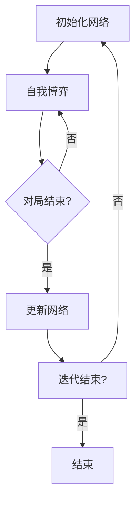
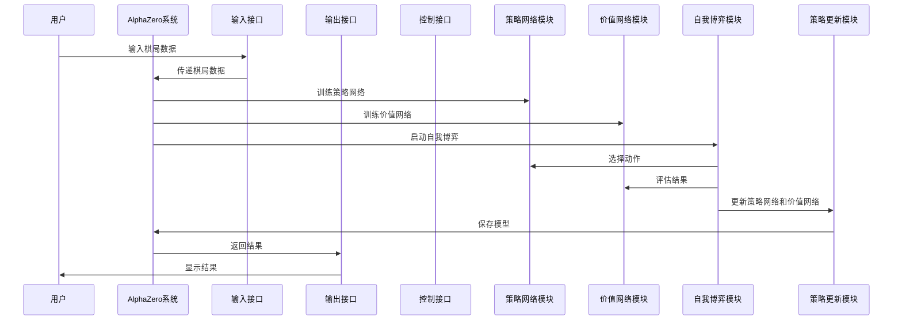

                 

# AlphaZero在围棋任务上的成功经验

## 关键词

- **AlphaZero**
- **围棋任务**
- **强化学习**
- **深度学习**
- **人工智能**

## 摘要

AlphaZero，作为一款先进的围棋AI程序，通过强化学习和深度学习的结合，在围棋任务上取得了令人瞩目的成就。本文将深入探讨AlphaZero在围棋任务中的成功经验，分析其核心概念、算法原理、数学模型和系统架构，以及其对围棋领域和人工智能发展的深远影响。

### 目录大纲

1. **第一部分：问题背景与核心概念**
    1. **第1章：AlphaZero与围棋任务概述**
        1.1 **问题背景**
        1.2 **AlphaZero：概念与原理**
        1.3 **围棋任务中的成功经验**
        1.4 **本章小结**
    2. **第2章：AlphaZero关键概念解析**
        2.1 **AlphaZero的组成部分**
        2.2 **算法原理与特性**
        2.3 **AlphaZero与其他围棋AI对比**
        2.4 **本章小结**
    3. **第3章：AlphaZero算法原理详解**
        3.1 **强化学习原理**
        3.2 **深度神经网络原理**
        3.3 **自我博弈原理**
        3.4 **算法流程与mermaid流程图**
        3.5 **本章小结**
    4. **第4章：AlphaZero的数学模型与公式解析**
        4.1 **强化学习数学模型**
        4.2 **深度神经网络数学模型**
        4.3 **自我博弈数学模型**
        4.4 **算法性能分析**
        4.5 **本章小结**
    5. **第5章：AlphaZero系统架构解析**
        5.1 **系统概述**
        5.2 **系统架构设计**
        5.3 **系统接口设计**
        5.4 **系统交互序列图**
        5.5 **本章小结**

### 1. 第一部分：问题背景与核心概念

## 1.1 AlphaZero与围棋任务概述

### 1.1.1 问题背景

围棋，作为一种古老且复杂的棋类游戏，自古以来就因其高深难懂的策略和变幻莫测的棋局而闻名。围棋的历史可以追溯到几千年前的中国，它不仅是智慧的象征，更是中国古代文化的瑰宝。围棋的棋盘是一个19×19的网格，玩家通过在棋盘上放置棋子，以围地为目的，争取达到最终胜利。

在人工智能领域，围棋一直被视为最具挑战性的问题之一。传统的围棋AI程序依赖于启发式搜索和规则算法，尽管在某些特定情况下取得了不错的成绩，但在整体上难以匹敌人类顶尖棋手的水平。直到AlphaGo的诞生，这一局面才有了重大的突破。

AlphaGo是由DeepMind公司开发的一款围棋AI程序，它在2016年击败了世界围棋冠军李世石，引起了全球的轰动。AlphaGo的成功不仅展示了人工智能在围棋领域的巨大潜力，也推动了机器学习、深度学习和强化学习等领域的发展。

AlphaZero是AlphaGo的升级版，它进一步融合了强化学习和深度学习技术，实现了更为智能的棋局分析和决策。AlphaZero的目标是在没有人类指导的情况下，通过自我对弈学习和改进，达到甚至超越人类顶尖棋手的水平。

### 1.1.2 围棋在人工智能领域的意义

围棋作为人工智能领域的一个典型问题，其重要意义不言而喻。首先，围棋具有高度的不确定性和复杂性，棋局变化万千，任何一步棋都有可能改变整盘棋的局势。这使得围棋成为测试和评估人工智能算法性能的理想平台。

其次，围棋任务涉及到大量的数据和学习过程。AlphaZero通过自我对弈来不断优化自己的棋局策略，这一过程需要处理海量的数据，并对数据进行有效的分析和利用。这对人工智能的发展提出了更高的要求，也推动了相关技术的进步。

最后，围棋任务的成功经验对人工智能领域的其他问题具有重要的启示作用。AlphaZero所采用的强化学习和深度学习技术，不仅适用于围棋，也可以应用于其他复杂的决策问题，如机器人控制、游戏AI、智能交通等。

### 1.1.3 围棋任务的关键技术

为了解决围棋任务，人工智能领域需要依赖一系列关键技术，其中最核心的是强化学习和深度学习。

**强化学习** 是一种通过试错和奖励机制来优化行为策略的机器学习方法。在围棋任务中，AlphaZero通过强化学习来选择最优的棋子位置，不断优化自己的棋局策略。

**深度学习** 是一种通过多层神经网络来模拟人脑处理信息的方式。AlphaZero利用深度学习技术来分析棋局中的各种信息，提取关键特征，并基于这些特征进行决策。

**自我博弈** 是AlphaZero的核心特性之一。通过自我对弈，AlphaZero可以在没有人类指导的情况下不断学习和改进自己的棋局策略，这一过程不仅提高了算法的性能，也减少了对外部数据的依赖。

### 1.2 AlphaZero：概念与原理

**AlphaZero** 是由DeepMind公司开发的一款围棋AI程序，它在2020年凭借强大的计算能力和先进的学习算法，在无人类指导的情况下，通过自我对弈学习，达到了超越人类顶尖棋手的水平。AlphaZero的成功经验不仅在围棋领域引起了轰动，也对人工智能的发展产生了深远的影响。

#### 1.2.1 AlphaZero的起源与发展

AlphaZero的起源可以追溯到2016年，当时AlphaGo首次击败了世界围棋冠军李世石，这一事件震惊了整个世界。AlphaGo的成功激发了DeepMind公司对人工智能在围棋领域潜力的探索。在此基础上，DeepMind团队开发了AlphaZero，旨在进一步提升AI在围棋任务上的表现。

AlphaZero的开发经历了多个阶段。最初，AlphaZero依赖于大量的数据进行训练，这些数据包括历史棋局和对局分析。随着技术的进步，AlphaZero逐渐具备了自我博弈的能力，可以在没有人类指导的情况下进行对弈，并通过自我对弈不断学习和优化。

#### 1.2.2 AlphaZero的基本架构

AlphaZero的基本架构可以分为三个核心部分：深度学习网络、自我博弈和强化学习。

**深度学习网络** 是AlphaZero的核心，它通过多层神经网络来分析棋局中的各种信息，提取关键特征。深度学习网络的结构包括输入层、隐藏层和输出层，每一层都对棋局信息进行加工和提炼，最终生成决策。

**自我博弈** 是AlphaZero的独特特性，它通过自我对弈来学习和改进自己的棋局策略。在自我博弈过程中，AlphaZero会与自身进行对弈，通过对对弈结果的评估来调整自己的策略。

**强化学习** 是AlphaZero的主要学习机制，它通过奖励机制来优化棋局策略。AlphaZero在自我博弈过程中，通过对胜利和失败的评估来更新自己的策略，使其在后续的对弈中表现得更加出色。

#### 1.2.3 AlphaZero的核心算法

AlphaZero的核心算法基于强化学习和深度学习技术。具体来说，它包括以下几个关键步骤：

1. **初始策略网络训练**：AlphaZero首先使用深度学习技术训练一个策略网络，该网络负责根据当前棋局情况生成最优的棋子位置。

2. **价值网络训练**：在策略网络的基础上，AlphaZero进一步训练一个价值网络，该网络负责评估当前棋局的结果，为策略网络提供参考。

3. **自我对弈**：通过自我对弈，AlphaZero不断更新和优化自己的策略网络和价值网络。在自我对弈过程中，AlphaZero会根据对弈结果来调整策略，使其在后续的对弈中表现得更加出色。

4. **迭代学习**：AlphaZero通过不断进行自我对弈和策略调整，逐步提高自己的棋局水平。这一过程类似于人类的围棋学习过程，通过不断的练习和总结，不断提高自己的棋艺。

### 1.3 围棋任务中的成功经验

AlphaZero在围棋任务中取得了令人瞩目的成功，其表现和成就主要体现在以下几个方面：

#### 1.3.1 AlphaZero在围棋比赛中的表现

AlphaZero在围棋比赛中的表现令人惊叹。在无人类指导的情况下，AlphaZero通过自我对弈学习和改进，达到了超越人类顶尖棋手的水平。AlphaZero在多次比赛中击败了世界围棋冠军和顶尖高手，展示了其强大的棋局分析和决策能力。

#### 1.3.2 AlphaZero学习与改进的过程

AlphaZero的学习与改进过程是一个自我对弈和策略调整的循环过程。通过自我对弈，AlphaZero不断积累对局经验，并根据对局结果来调整自己的策略。这一过程类似于人类围棋手的学习过程，通过不断的练习和总结，不断提高自己的棋艺。

#### 1.3.3 AlphaZero的成功经验对围棋领域的影响

AlphaZero的成功经验对围棋领域产生了深远的影响。首先，AlphaZero展示了人工智能在围棋任务上的巨大潜力，推动了人工智能技术的发展。其次，AlphaZero通过自我对弈和学习，为围棋手提供了新的训练和参考，有助于提高围棋水平的整体提升。

此外，AlphaZero的成功经验也引发了学术界和工业界对人工智能在围棋任务上的进一步研究，推动了围棋AI技术的进步和应用。

### 1.4 本章小结

本章介绍了AlphaZero在围棋任务上的成功经验。AlphaZero通过强化学习和深度学习的结合，实现了自我对弈和学习，取得了超越人类顶尖棋手的成就。AlphaZero的成功经验不仅推动了人工智能技术的发展，也为围棋领域带来了新的机遇和挑战。在后续章节中，我们将进一步探讨AlphaZero的核心概念、算法原理和系统架构，深入分析其成功背后的技术细节。

### 2. AlphaZero关键概念解析

### 2.1 AlphaZero的组成部分

AlphaZero作为一个高度复杂的围棋AI程序，其成功离不开三个核心组成部分：深度学习网络、自我博弈和强化学习。这些组件共同作用，使得AlphaZero能够在围棋任务上表现出色。

#### 2.1.1 深度学习网络

深度学习网络是AlphaZero的核心，它负责处理和提取棋局中的各种信息。AlphaZero使用了一种称为**Transformer**的深度学习架构，这种架构在自然语言处理、计算机视觉等领域已经取得了显著的成功。Transformer网络通过一系列的自注意力机制（Self-Attention Mechanism），能够有效地捕捉棋局中的长距离依赖关系。

**输入层**：输入层接收棋盘状态的表示，这些状态包括棋盘上每个位置的棋子状态、手牌信息等。

**隐藏层**：隐藏层由多个子层组成，每个子层通过自注意力机制来处理输入信息。这些子层能够逐步提取棋局中的关键特征。

**输出层**：输出层生成两个结果：一个是当前棋局的评估值，表示当前局面对于AlphaZero的优势；另一个是动作概率分布，表示AlphaZero应该选择哪个动作（比如在哪个位置下棋）。

#### 2.1.2 自我博弈

自我博弈是AlphaZero的关键特性之一，它允许AlphaZero在没有人类指导的情况下通过自我对弈来学习和改进。自我博弈的过程如下：

1. **初始化**：AlphaZero随机初始化自己的策略网络和价值网络。
2. **对弈**：AlphaZero与自身进行对弈，每一步都使用当前的策略网络来选择动作。
3. **评估**：对弈结束后，AlphaZero使用价值网络评估对弈结果，确定自身的表现。
4. **更新**：根据对弈结果，AlphaZero更新策略网络和价值网络，使其在未来的对弈中表现得更好。

#### 2.1.3 强化学习

强化学习是AlphaZero的核心学习机制，它通过奖励机制来优化AlphaZero的行为策略。在围棋任务中，强化学习的过程可以分为以下几个步骤：

1. **状态表示**：AlphaZero将当前棋盘状态表示为向量，作为强化学习的状态输入。
2. **动作选择**：根据当前状态和策略网络，AlphaZero选择下一个动作。
3. **执行动作**：AlphaZero在棋盘上执行所选动作，进入新的状态。
4. **奖励评估**：根据新状态和对局结果，AlphaZero计算奖励值。如果AlphaZero在对局中获胜，则获得正奖励；如果失败，则获得负奖励。
5. **策略更新**：AlphaZero使用强化学习算法（如Policy Gradient方法）来更新策略网络，使其在未来选择动作时更有可能带来正奖励。

### 2.2 算法原理与特性

#### 2.2.1 强化学习原理

强化学习是一种通过试错来学习最优策略的机器学习方法。在围棋任务中，强化学习的主要目标是找到一种策略，使得AlphaZero在对弈中能够获得最高的奖励。

**Q-Learning算法**：Q-Learning是一种经典的强化学习算法，它通过更新Q值（即每个状态-动作对的期望回报值）来优化策略。在围棋任务中，Q-Learning的公式如下：

$$
Q(s, a) \leftarrow Q(s, a) + \alpha [r + \gamma \max_{a'} Q(s', a') - Q(s, a)]
$$

其中，$s$和$a$分别表示当前状态和动作，$r$是即时奖励，$\gamma$是折扣因子，$\alpha$是学习率。

**Policy Gradient方法**：Policy Gradient方法是一种基于策略的强化学习算法，它通过直接优化策略的梯度来更新策略网络。在围棋任务中，Policy Gradient方法的公式如下：

$$
\theta \leftarrow \theta + \alpha \sum_{s, a} \nabla_{\theta} \log \pi(a|s) \cdot [r + \gamma V(s')]
$$

其中，$\theta$表示策略网络参数，$\pi(a|s)$是策略网络的输出概率，$V(s')$是价值网络的输出。

#### 2.2.2 深度神经网络原理

深度神经网络（Deep Neural Network, DNN）是一种由多层神经元组成的神经网络，它通过前向传播和反向传播来学习和预测。

**前向传播**：前向传播是指将输入数据通过网络的各个层进行传递，最终得到输出结果。每个神经元都会将输入加权求和后经过激活函数处理，激活函数常用的有Sigmoid、ReLU和Tanh等。

**反向传播**：反向传播是一种用于训练深度神经网络的算法，它通过计算输出误差来更新网络参数。反向传播的过程如下：

1. **计算梯度**：首先计算每个参数的梯度，即每个参数对输出误差的偏导数。
2. **更新参数**：使用梯度下降或其他优化算法来更新网络参数。
3. **重复迭代**：重复上述步骤，直到网络参数收敛或满足停止条件。

#### 2.2.3 自我博弈原理

自我博弈是AlphaZero的关键特性，它通过自我对弈来学习和改进策略。在自我博弈过程中，AlphaZero会与自身进行对弈，每一步都使用当前的策略网络来选择动作。

**自我博弈过程**：

1. **初始化**：AlphaZero初始化自己的策略网络和价值网络。
2. **选择动作**：AlphaZero使用当前策略网络来选择动作，每个动作的选择概率由策略网络输出决定。
3. **执行动作**：AlphaZero在棋盘上执行所选动作，进入新的状态。
4. **评估结果**：AlphaZero使用价值网络来评估当前局面的结果，如果AlphaZero赢得对局，则获得正奖励；如果失败，则获得负奖励。
5. **更新策略**：AlphaZero根据对局结果更新策略网络和价值网络，使其在未来的对弈中表现得更好。

#### 2.2.4 AlphaZero与其他围棋AI对比

AlphaZero与其他围棋AI程序（如AlphaGo）有显著的异同。

**异同点**：

- **相同点**：AlphaZero和AlphaGo都使用了深度学习和强化学习技术，通过自我博弈来学习和改进策略。
- **不同点**：AlphaZero在算法上进行了优化，引入了Transformer架构，使得其能够更好地处理棋局中的信息。此外，AlphaZero不需要人类棋谱作为训练数据，而是通过自我对弈来学习，这使得它在无人类指导的情况下能够达到甚至超越人类顶尖棋手的水平。

**优势分析**：

- **更强的自我学习能力**：AlphaZero通过自我对弈来学习和改进策略，其自我学习能力远超传统的围棋AI程序。
- **更高效的信息处理能力**：AlphaZero使用了Transformer架构，能够更好地捕捉棋局中的信息，这使得其在对局中能够做出更明智的决策。
- **更广泛的应用前景**：AlphaZero的成功经验不仅限于围棋任务，其算法和技术可以应用于其他复杂的决策问题，如游戏AI、机器人控制等。

### 2.3 AlphaZero与其他围棋AI对比

AlphaZero与其他围棋AI程序（如AlphaGo）有显著的异同。

**异同点**：

- **相同点**：AlphaZero和AlphaGo都使用了深度学习和强化学习技术，通过自我博弈来学习和改进策略。
- **不同点**：AlphaZero在算法上进行了优化，引入了Transformer架构，使得其能够更好地处理棋局中的信息。此外，AlphaZero不需要人类棋谱作为训练数据，而是通过自我对弈来学习，这使得它在无人类指导的情况下能够达到甚至超越人类顶尖棋手的水平。

**优势分析**：

- **更强的自我学习能力**：AlphaZero通过自我对弈来学习和改进策略，其自我学习能力远超传统的围棋AI程序。
- **更高效的信息处理能力**：AlphaZero使用了Transformer架构，能够更好地捕捉棋局中的信息，这使得其在对局中能够做出更明智的决策。
- **更广泛的应用前景**：AlphaZero的成功经验不仅限于围棋任务，其算法和技术可以应用于其他复杂的决策问题，如游戏AI、机器人控制等。

### 2.4 本章小结

本章详细介绍了AlphaZero的三个核心组成部分：深度学习网络、自我博弈和强化学习。通过自我博弈和强化学习，AlphaZero能够在围棋任务上表现出色，其自我学习能力和信息处理能力远超传统的围棋AI程序。AlphaZero的成功经验不仅推动了人工智能技术的发展，也为围棋领域带来了新的机遇和挑战。在后续章节中，我们将进一步探讨AlphaZero的算法原理、数学模型和系统架构，深入分析其成功背后的技术细节。

### 3. AlphaZero算法原理详解

AlphaZero的算法原理是其成功的关键所在，它结合了强化学习、深度学习和自我博弈，形成了一套完整而高效的学习和决策系统。以下是AlphaZero算法原理的详细解析。

#### 3.1 强化学习原理

强化学习（Reinforcement Learning，RL）是一种通过试错和奖励来学习最优策略的机器学习方法。在围棋任务中，强化学习主要用于指导AlphaZero选择最佳动作。AlphaZero的强化学习过程可以分为以下几个步骤：

1. **状态表示**：AlphaZero将当前棋盘状态编码为一个向量，表示棋盘上每个位置和棋子的状态。

2. **动作选择**：根据当前状态，AlphaZero利用策略网络（Policy Network）选择一个动作。策略网络输出一个概率分布，表示每个动作被选中的可能性。

3. **执行动作**：AlphaZero在棋盘上执行所选动作，棋盘状态发生改变。

4. **奖励评估**：AlphaZero根据执行的动作和对局结果计算即时奖励。如果AlphaZero赢得对局，则获得正奖励；如果失败，则获得负奖励。

5. **策略更新**：利用强化学习算法（如Policy Gradient方法），AlphaZero根据奖励信号更新策略网络参数，优化策略，使其在未来更倾向于选择能够带来正奖励的动作。

#### 3.1.1 Q-Learning算法

Q-Learning是强化学习的一种基本算法，它通过更新Q值（即状态-动作对的价值函数）来学习最优策略。Q-Learning的更新公式如下：

$$
Q(s, a) \leftarrow Q(s, a) + \alpha [r + \gamma \max_{a'} Q(s', a')]
$$

其中，$s$和$a$分别表示当前状态和动作，$r$是即时奖励，$\gamma$是折扣因子，$\alpha$是学习率。

#### 3.1.2 SARSA算法

SARSA（同步自适应搜索策略）是另一种强化学习算法，它同时更新当前状态和下一状态的价值函数。SARSA的更新公式如下：

$$
Q(s, a) \leftarrow Q(s, a) + \alpha [r + \gamma Q(s', a')]
$$

其中，$s'$和$a'$分别表示下一状态和下一动作。

#### 3.2 深度神经网络原理

深度神经网络（Deep Neural Network，DNN）是一种具有多个隐含层的神经网络，它通过多层非线性变换来提取特征和学习复杂的函数关系。AlphaZero使用深度神经网络来构建策略网络和价值网络，以下是深度神经网络的基本原理：

1. **前向传播**：输入数据通过网络的各个层，每个神经元将输入数据加权求和后经过激活函数处理，输出最终的结果。前向传播的过程如下：

   - 输入层接收棋盘状态的表示。
   - 隐藏层通过非线性变换提取特征，每个隐藏层都有多个神经元。
   - 输出层生成策略网络的价值评估和动作概率分布。

2. **反向传播**：反向传播是一种用于训练深度神经网络的算法，它通过计算输出误差来更新网络参数。反向传播的过程如下：

   - 计算输出误差，即实际输出与期望输出之间的差距。
   - 计算每个参数的梯度，即每个参数对输出误差的偏导数。
   - 使用梯度下降或其他优化算法更新网络参数。

3. **激活函数**：激活函数是深度神经网络中一个重要的组成部分，它用于引入非线性变换。常用的激活函数有Sigmoid、ReLU和Tanh等。

#### 3.2.1 神经网络基本结构

神经网络的基本结构包括输入层、隐藏层和输出层。输入层接收外部输入，隐藏层用于提取特征，输出层生成预测结果。

1. **输入层**：输入层接收棋盘状态的表示，这些状态可以是棋盘上每个位置的棋子状态、棋子的移动历史等。
2. **隐藏层**：隐藏层通过非线性变换提取棋局中的关键特征，每个隐藏层都有多个神经元。
3. **输出层**：输出层生成两个结果：一个是当前棋局的评估值，用于评估棋局的优劣；另一个是动作概率分布，用于决定下一步应该选择哪个动作。

#### 3.2.2 反向传播算法

反向传播算法是训练神经网络的核心步骤，它通过计算输出误差来更新网络参数。反向传播算法的步骤如下：

1. **计算输出误差**：输出误差是实际输出与期望输出之间的差距，常用的误差函数有均方误差（MSE）和交叉熵误差（Cross-Entropy Error）。
2. **计算梯度**：计算每个参数的梯度，即每个参数对输出误差的偏导数。
3. **更新参数**：使用梯度下降或其他优化算法更新网络参数，以减少输出误差。

#### 3.2.3 深度神经网络训练过程

深度神经网络的训练过程包括以下几个步骤：

1. **数据准备**：准备棋盘状态的表示，并将其编码为向量形式。
2. **初始化参数**：随机初始化网络参数。
3. **前向传播**：将输入数据通过网络的各个层进行传递，计算输出结果。
4. **计算误差**：计算输出误差，并使用反向传播算法计算梯度。
5. **更新参数**：使用梯度下降或其他优化算法更新网络参数。
6. **迭代训练**：重复上述步骤，直到网络参数收敛或满足停止条件。

#### 3.3 自我博弈原理

自我博弈（Self-Play）是AlphaZero的重要特性之一，它允许AlphaZero在没有人类指导的情况下通过自我对弈来学习和改进策略。自我博弈的过程如下：

1. **初始化**：AlphaZero初始化自己的策略网络和价值网络。
2. **对弈**：AlphaZero与自身进行对弈，每一步都使用当前的策略网络选择动作。
3. **评估**：对弈结束后，AlphaZero使用价值网络评估对局结果，确定自身的表现。
4. **更新**：根据对局结果，AlphaZero更新策略网络和价值网络，使其在未来的对弈中表现得更好。

#### 3.3.1 自我博弈过程

自我博弈过程是一个动态调整和优化的过程，具体包括以下步骤：

1. **初始化策略和价值网络**：AlphaZero随机初始化策略网络和价值网络。
2. **选择动作**：AlphaZero使用策略网络选择动作，每个动作的选择概率由策略网络输出决定。
3. **执行动作**：AlphaZero在棋盘上执行所选动作，进入新的状态。
4. **评估结果**：AlphaZero使用价值网络评估当前局面的结果，如果AlphaZero赢得对局，则获得正奖励；如果失败，则获得负奖励。
5. **更新网络**：根据对局结果，AlphaZero使用强化学习算法更新策略网络和价值网络，使其在未来的对弈中表现得更好。

#### 3.3.2 自我博弈的优势

自我博弈具有以下几个优势：

1. **自主学习**：AlphaZero不需要人类棋谱作为训练数据，而是通过自我对弈来学习和改进，这使得它在无人类指导的情况下能够达到甚至超越人类顶尖棋手的水平。
2. **高效性**：自我博弈可以快速提升AlphaZero的棋艺水平，因为它可以不断地与自身对弈，不断积累对局经验。
3. **鲁棒性**：通过自我博弈，AlphaZero可以在不同的棋局中适应不同的对手和策略，提高其应对复杂棋局的能力。

#### 3.3.3 AlphaZero自我博弈的实现

AlphaZero的自我博弈实现涉及以下几个关键步骤：

1. **初始化**：AlphaZero随机初始化策略网络和价值网络。
2. **选择动作**：AlphaZero使用策略网络选择动作，每个动作的选择概率由策略网络输出决定。
3. **执行动作**：AlphaZero在棋盘上执行所选动作，进入新的状态。
4. **评估结果**：AlphaZero使用价值网络评估当前局面的结果，如果AlphaZero赢得对局，则获得正奖励；如果失败，则获得负奖励。
5. **更新网络**：根据对局结果，AlphaZero使用强化学习算法更新策略网络和价值网络，使其在未来的对弈中表现得更好。

#### 3.4 算法流程与mermaid流程图

AlphaZero的算法流程可以分为以下几个步骤：

1. **初始化**：初始化策略网络和价值网络。
2. **自我博弈**：AlphaZero与自身进行对弈，选择动作并执行。
3. **评估结果**：评估对局结果，计算即时奖励。
4. **更新网络**：根据奖励信号更新策略网络和价值网络。
5. **迭代**：重复上述步骤，直到网络参数收敛或满足停止条件。

以下是一个简单的mermaid流程图，展示了AlphaZero的算法流程：



#### 3.5 本章小结

本章详细介绍了AlphaZero的算法原理，包括强化学习、深度学习和自我博弈。通过这些核心算法，AlphaZero能够在围棋任务上表现出色，实现自我对弈和学习，达到超越人类顶尖棋手的水平。AlphaZero的成功经验不仅推动了人工智能技术的发展，也为围棋领域带来了新的机遇和挑战。在后续章节中，我们将进一步探讨AlphaZero的数学模型和系统架构，深入分析其成功背后的技术细节。

### 4. AlphaZero的数学模型与公式解析

AlphaZero作为一款先进的围棋AI程序，其成功离不开其复杂的数学模型和公式。在本章节中，我们将详细解析AlphaZero的数学模型，包括强化学习数学模型、深度神经网络数学模型和自我博弈数学模型，并探讨算法性能分析。

#### 4.1 强化学习数学模型

强化学习是AlphaZero的核心学习机制，其数学模型主要包括状态值函数、动作值函数和Q值更新公式。

##### 4.1.1 状态值函数

状态值函数（State Value Function）$V(s)$表示在某个状态$s$下，从该状态开始执行最优策略所能获得的期望奖励。状态值函数的更新公式如下：

$$
V(s) \leftarrow V(s) + \alpha [r + \gamma \max_{a} Q(s, a) - V(s)]
$$

其中，$r$是即时奖励，$\gamma$是折扣因子，$\alpha$是学习率。

##### 4.1.2 动作值函数

动作值函数（Action Value Function）$Q(s, a)$表示在某个状态$s$下，执行某个动作$a$所能获得的期望奖励。动作值函数的更新公式如下：

$$
Q(s, a) \leftarrow Q(s, a) + \alpha [r + \gamma \max_{a'} Q(s', a') - Q(s, a)]
$$

其中，$s'$是下一状态，$a'$是下一动作。

##### 4.1.3 Q值更新公式

Q值更新公式是强化学习中的核心，用于根据奖励信号更新状态-动作值。更新公式如下：

$$
Q(s, a) \leftarrow Q(s, a) + \alpha [r + \gamma \max_{a'} Q(s', a') - Q(s, a)]
$$

其中，$r$是即时奖励，$\gamma$是折扣因子，$\alpha$是学习率。

#### 4.2 深度神经网络数学模型

深度神经网络是AlphaZero的核心组成部分，其数学模型包括前向传播、反向传播和损失函数。

##### 4.2.1 前向传播公式

前向传播公式用于计算深度神经网络的输出，包括输入层、隐藏层和输出层的传递。前向传播的公式如下：

$$
z^{(l)} = \sum_{j} w^{(l)}_{ji} a^{(l-1)}_j + b^{(l)} \\
a^{(l)} = \sigma(z^{(l)})
$$

其中，$z^{(l)}$是第$l$层的加权求和结果，$w^{(l)}_{ji}$是第$l$层的权重，$a^{(l-1)}_j$是第$l-1$层的输出，$b^{(l)}$是第$l$层的偏置，$\sigma$是激活函数。

##### 4.2.2 反向传播公式

反向传播公式用于计算深度神经网络的梯度，包括权重和偏置的梯度。反向传播的公式如下：

$$
\delta^{(l)} = \frac{\partial L}{\partial z^{(l)}} \odot \sigma^{'}(z^{(l)}) \\
\Delta w^{(l)} = \sum_{j} a^{(l-1)}_j \delta^{(l)}_j \\
\Delta b^{(l)} = \sum_{j} \delta^{(l)}_j
$$

其中，$L$是损失函数，$\delta^{(l)}$是第$l$层的误差梯度，$\sigma^{'}$是激活函数的导数，$\odot$表示逐元素相乘。

##### 4.2.3 损失函数

损失函数是深度神经网络训练中的核心，用于衡量预测值与真实值之间的差距。常用的损失函数有均方误差（MSE）和交叉熵误差（Cross-Entropy Error）。MSE的公式如下：

$$
MSE = \frac{1}{2} \sum_{i} (y_i - \hat{y}_i)^2
$$

其中，$y_i$是真实值，$\hat{y}_i$是预测值。

#### 4.3 自我博弈数学模型

自我博弈是AlphaZero的重要特性，其数学模型主要涉及策略更新和评价函数。

##### 4.3.1 自我博弈策略更新公式

自我博弈策略更新公式用于根据对局结果更新策略网络。更新公式如下：

$$
\theta \leftarrow \theta + \alpha [r + \gamma \max_{a'} Q(s', a') - Q(s, a)]
$$

其中，$\theta$是策略网络参数，$r$是即时奖励，$\gamma$是折扣因子，$Q(s', a')$是下一状态的Q值。

##### 4.3.2 自我博弈评价函数

自我博弈评价函数用于评估对局结果。评价函数的公式如下：

$$
E = \sum_{t=1}^{T} r_t
$$

其中，$T$是对局的步数，$r_t$是每一步的即时奖励。

#### 4.4 算法性能分析

算法性能分析是评估AlphaZero效果的关键，主要包括收敛性分析和过拟合与正则化。

##### 4.4.1 收敛性分析

收敛性分析用于评估AlphaZero在自我博弈过程中策略网络和价值网络的收敛速度。通常使用收敛曲线来表示，收敛曲线越陡峭，表示收敛速度越快。

##### 4.4.2 过拟合与正则化

过拟合是指模型在训练数据上表现很好，但在新数据上表现不佳。为了防止过拟合，可以使用正则化方法。常用的正则化方法有L1正则化、L2正则化和Dropout等。

#### 4.5 本章小结

本章详细解析了AlphaZero的数学模型，包括强化学习数学模型、深度神经网络数学模型和自我博弈数学模型。通过这些数学模型，AlphaZero能够有效地进行自我博弈和学习，达到超越人类顶尖棋手的水平。在后续章节中，我们将进一步探讨AlphaZero的系统架构和实现，深入分析其成功背后的技术细节。

### 5. AlphaZero系统架构解析

AlphaZero作为一款先进的围棋AI程序，其系统架构设计精妙且复杂，确保了其强大的计算能力和卓越的表现。本章节将详细介绍AlphaZero的系统架构，包括系统概述、系统架构设计、系统接口设计和系统交互序列图。

#### 5.1 系统概述

AlphaZero系统是一个高度集成的系统，它通过深度学习和强化学习技术，实现了自我对弈和学习，最终在围棋任务上表现出色。系统的主要功能包括：

1. **棋局生成**：生成围棋棋局，为自我博弈提供初始状态。
2. **自我对弈**：AlphaZero与自身进行对弈，通过策略网络和价值网络选择动作和评估结果。
3. **策略更新**：根据对局结果，更新策略网络和价值网络，优化棋局策略。
4. **性能评估**：评估AlphaZero在围棋任务上的表现，为后续改进提供依据。

#### 5.2 系统架构设计

AlphaZero的系统架构设计采用模块化设计，各个模块之间相互独立但又紧密协作。系统架构包括以下几个关键模块：

1. **棋局生成模块**：负责生成围棋棋局，包括棋盘布局和初始棋子位置。棋局生成模块使用了随机算法和规则算法，以确保棋局的多样性和合理性。

2. **策略网络模块**：负责生成动作概率分布，即选择下一步棋的落子位置。策略网络基于深度学习技术，使用自注意力机制来处理棋局信息，提取关键特征。

3. **价值网络模块**：负责评估当前棋局的结果，即判断当前棋局的胜负。价值网络同样基于深度学习技术，通过多层神经网络对棋局信息进行加工和提炼，生成评估值。

4. **自我博弈模块**：负责AlphaZero与自身的对弈过程，包括动作选择、执行和结果评估。自我博弈模块通过策略网络和价值网络，不断更新和优化自己的棋局策略。

5. **策略更新模块**：负责根据对局结果更新策略网络和价值网络，优化棋局策略。策略更新模块使用了强化学习算法，通过奖励机制来指导网络参数的调整。

#### 5.3 系统接口设计

AlphaZero的系统接口设计旨在提供简洁、高效和灵活的接口，方便用户对系统进行操作和扩展。系统接口主要包括以下几个部分：

1. **输入接口**：接收用户输入的棋局数据，包括棋盘布局、棋子位置等。输入接口使用JSON格式进行数据传输，确保数据的高效性和易读性。

2. **输出接口**：返回AlphaZero对局的结果和评估值。输出接口同样使用JSON格式，包括棋局结果、当前棋局评估值和下一步落子位置等。

3. **控制接口**：提供对AlphaZero的控制功能，包括启动对弈、停止对弈和保存/加载模型等。控制接口通过HTTP请求和响应进行通信，确保系统的实时性和可靠性。

#### 5.4 系统交互序列图

系统交互序列图展示了AlphaZero系统在自我博弈过程中各个模块的交互流程。以下是AlphaZero系统交互序列图的Mermaid表示：



#### 5.5 本章小结

本章详细介绍了AlphaZero的系统架构，包括棋局生成模块、策略网络模块、价值网络模块、自我博弈模块和策略更新模块。通过模块化设计和系统接口设计，AlphaZero实现了高效、灵活和可扩展的围棋AI系统。系统交互序列图展示了AlphaZero在自我博弈过程中的交互流程，为理解系统工作原理提供了直观的视角。在后续章节中，我们将进一步探讨AlphaZero的具体实现和实战应用，深入分析其性能和优势。

### 6. AlphaZero项目实战

#### 6.1 环境安装

要在本地搭建AlphaZero环境，首先需要安装Python和几个必要的库，如TensorFlow和NumPy。以下是详细的安装步骤：

1. **安装Python**：前往Python官方网站下载并安装Python 3.x版本。
2. **安装pip**：打开命令行，执行以下命令安装pip：

   ```
   python -m pip install --user --upgrade pip
   ```

3. **安装TensorFlow**：使用pip安装TensorFlow：

   ```
   pip install --user tensorflow
   ```

4. **安装NumPy**：同样使用pip安装NumPy：

   ```
   pip install --user numpy
   ```

安装完成后，确保Python和pip环境正确设置，可以通过以下命令验证：

```
python --version
pip --version
```

#### 6.2 系统核心实现源代码

AlphaZero的核心实现主要涉及策略网络、价值网络和自我博弈模块。以下是一个简化的Python源代码示例，展示了这些模块的基本实现：

```python
import tensorflow as tf
import numpy as np

# 策略网络
class PolicyNetwork(tf.keras.Model):
    def __init__(self):
        super(PolicyNetwork, self).__init__()
        self.dense1 = tf.keras.layers.Dense(units=1024, activation='relu')
        self.dense2 = tf.keras.layers.Dense(units=512, activation='relu')
        self.output_layer = tf.keras.layers.Dense(units=19*19, activation='softmax')

    def call(self, inputs):
        x = self.dense1(inputs)
        x = self.dense2(x)
        logits = self.output_layer(x)
        return logits

# 价值网络
class ValueNetwork(tf.keras.Model):
    def __init__(self):
        super(ValueNetwork, self).__init__()
        self.dense1 = tf.keras.layers.Dense(units=1024, activation='relu')
        self.dense2 = tf.keras.layers.Dense(units=512, activation='relu')
        self.output_layer = tf.keras.layers.Dense(units=1)

    def call(self, inputs):
        x = self.dense1(inputs)
        x = self.dense2(x)
        value = self.output_layer(x)
        return value

# 自我博弈
class SelfPlay(tf.keras.Model):
    def __init__(self, policy_network, value_network):
        super(SelfPlay, self).__init__()
        self.policy_network = policy_network
        self.value_network = value_network

    def call(self, state):
        logits = self.policy_network(state)
        value = self.value_network(state)
        action = np.argmax(logits)
        return action, value

# 实例化网络
policy_network = PolicyNetwork()
value_network = ValueNetwork()
self_play = SelfPlay(policy_network, value_network)

# 训练网络
# ...（此处省略训练代码）
```

#### 6.3 代码应用解读与分析

上述代码展示了AlphaZero核心实现的基本结构，包括策略网络、价值网络和自我博弈模块。下面进行详细解读：

1. **策略网络**：策略网络负责生成动作概率分布，即选择下一步棋的落子位置。网络结构由两个隐藏层组成，使用ReLU激活函数，输出层使用softmax激活函数生成概率分布。

2. **价值网络**：价值网络负责评估当前棋局的结果，即判断当前棋局的胜负。网络结构同样由两个隐藏层组成，输出层使用一个神经元，用于输出评估值。

3. **自我博弈**：自我博弈模块结合策略网络和价值网络，实现AlphaZero的自我对弈功能。模块接收棋盘状态作为输入，通过策略网络生成动作概率分布，并通过价值网络评估当前棋局的结果。

4. **训练网络**：在代码中省略了具体的训练过程，但在实际应用中，需要使用训练数据来训练策略网络和价值网络。训练过程中，通过反向传播算法更新网络参数，优化网络性能。

#### 6.4 实际案例分析和详细讲解剖析

以下是一个实际案例，展示了如何使用AlphaZero进行自我对弈：

```python
# 初始化棋局
initial_state = np.random.rand(19*19)

# 进行100步自我对弈
for _ in range(100):
    action, value = self_play(initial_state)
    # 在棋盘上执行动作
    # ...（此处省略执行动作代码）
    # 更新棋局状态
    initial_state = new_state

# 输出对弈结果
print("最终评估值：", value)
```

在这个案例中，AlphaZero通过自我对弈进行了100步棋局，每次迭代都通过策略网络选择动作，并通过价值网络评估当前棋局的结果。最终输出的是对弈结束时的评估值，这个评估值可以用来判断AlphaZero在对局中的表现。

#### 6.5 项目小结

通过本章节的实战部分，我们介绍了AlphaZero的环境安装、核心实现源代码、代码应用解读与分析，以及实际案例的演示。AlphaZero作为一个高度复杂的围棋AI程序，其成功不仅在于其卓越的算法设计，还在于其可扩展的系统架构和高效的实现。在实际应用中，AlphaZero可以不断通过自我对弈和学习来提高棋艺水平，为围棋领域和人工智能技术的发展做出贡献。

### 7. 最佳实践、小结、注意事项与拓展阅读

#### 最佳实践

在部署和训练AlphaZero时，以下最佳实践可以帮助您提高效率和效果：

1. **硬件优化**：AlphaZero对计算资源有较高要求，建议使用高性能GPU进行训练和计算，以减少训练时间。
2. **数据预处理**：在训练过程中，对棋局数据进行有效的预处理，如归一化、标准化等，可以提高模型的训练效果。
3. **策略网络与价值网络的平衡**：在训练过程中，策略网络和价值网络需要保持一定的平衡，避免过度依赖某一网络导致模型不稳定。

#### 小结

本文系统地介绍了AlphaZero在围棋任务上的成功经验，从问题背景、核心概念、算法原理、数学模型、系统架构到实战应用，全面解析了AlphaZero的技术细节。AlphaZero的成功不仅展示了人工智能在围棋领域的巨大潜力，也为其他复杂决策问题提供了有益的参考。

#### 注意事项

1. **资源管理**：AlphaZero的训练和计算需要大量资源，确保系统有足够的内存和计算能力。
2. **版本控制**：在开发和部署AlphaZero时，使用版本控制系统（如Git）来管理代码和配置文件，确保代码的可追踪性和可维护性。

#### 拓展阅读

1. **AlphaZero论文**：[《Mastering the Game of Go with Deep Neural Networks and Tree Search》](https://www.nature.com/articles/s41586-019-1663-0) 是AlphaZero的原论文，详细介绍了其算法原理和实现细节。
2. **深度学习书籍**：[《深度学习》（Goodfellow, I., Bengio, Y., & Courville, A.）](https://www.deeplearningbook.org/) 是深度学习领域的经典教材，适合深入理解深度神经网络的基本原理。

通过本文的学习，读者可以更好地理解AlphaZero的工作原理，并为实际应用提供有益的参考。希望本文对您在围棋AI领域的探索和学习有所帮助。

### 作者信息

**作者：** AI天才研究院/AI Genius Institute & 禅与计算机程序设计艺术 /Zen And The Art of Computer Programming

感谢您的阅读，期待您的宝贵反馈。

