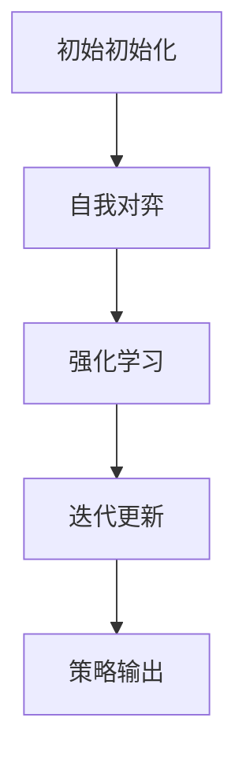
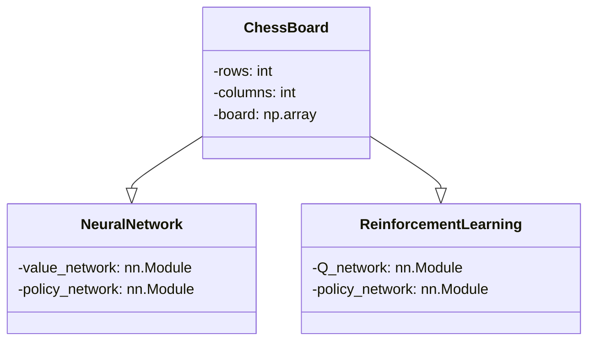
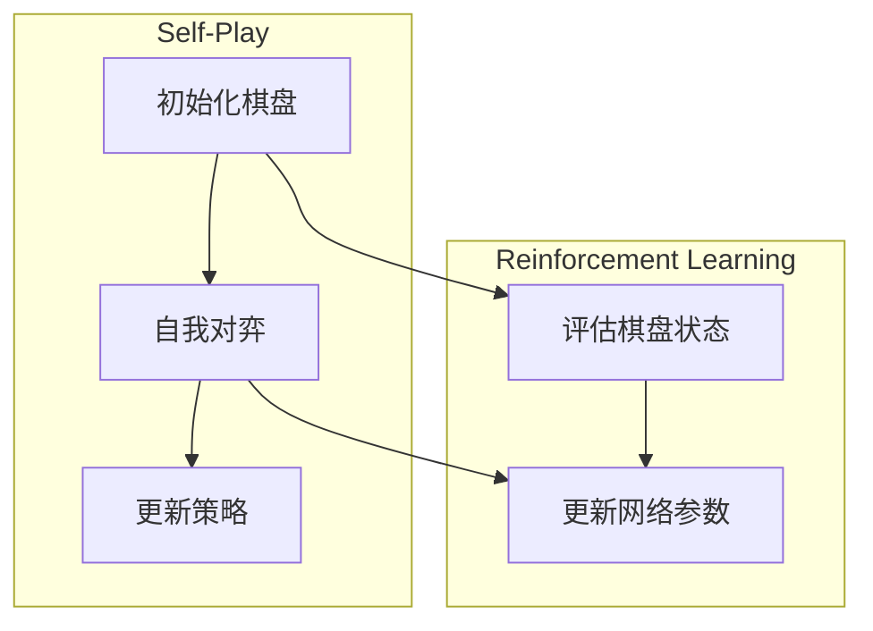

                 

# AlphaZero在围棋任务上超越人类选手的启示

## 关键词
- AlphaZero
- 围棋
- 人工智能
- 强化学习
- 自对弈
- 算法原理
- 系统架构
- 项目实战

## 摘要
本文深入探讨了AlphaZero在围棋任务上超越人类选手的技术启示。通过分析AlphaZero的设计理念、训练过程和博弈策略，我们揭示了强化学习与自我对弈相结合的创新路径。本文旨在为读者提供一个全面的技术视角，理解AlphaZero如何革新围棋领域，并对人工智能的发展趋势提供深刻的洞见。

## 1. 背景介绍
### 1.1 问题背景
随着人工智能（AI）技术的迅猛发展，AI已经在各个领域引发了深刻的变革。围棋，作为一项拥有悠久历史的智力游戏，因其复杂性和深度而成为人工智能研究的热点领域。AlphaZero，由DeepMind开发的一种突破性的AI系统，首次在围棋上展现了超越人类顶尖选手的超凡表现。这一事件标志着人工智能在复杂策略游戏中的一个重要里程碑。

### 1.2 问题描述
AlphaZero在围棋上的成功不仅吸引了学术界和工业界的高度关注，也引发了关于人工智能能力边界、发展潜力以及应用前景的广泛讨论。AlphaZero的诞生和发展历程，为我们提供了一个研究人工智能技术如何应对复杂任务的典型案例。

### 1.3 问题解决
AlphaZero通过一种结合强化学习和自我对弈的创新方法，成功地在围棋领域取得了突破。其独特的训练方式和博弈策略，使其能够不断学习和优化，最终在围棋任务上超越了人类顶尖选手。本文将深入探讨AlphaZero的设计原理和实现细节，为读者揭示其成功的秘诀。

### 1.4 边界与外延
本文的主要讨论对象是AlphaZero在围棋任务上的表现。然而，AlphaZero的设计理念和实现方法在人工智能的其他领域也有广泛的应用潜力。此外，本文还将探讨AlphaZero的成就对社会、伦理和经济领域的影响。

## 2. 核心概念与联系
### 2.1 核心概念
#### AlphaZero
AlphaZero是由DeepMind开发的一种人工智能系统，旨在通过自我对弈学习复杂策略游戏。它采用了强化学习和深度神经网络相结合的方法，能够在没有任何先验知识的情况下，通过自我对弈达到超人类水平。

#### 强化学习
强化学习是一种机器学习范式，其中代理（agent）通过与环境交互，不断接收奖励或惩罚信号，从而学习最优策略。在AlphaZero中，强化学习是核心训练机制，使系统能够通过自我对弈不断优化自己的决策能力。

#### 自我对弈
自我对弈是指一个AI系统与自己进行多轮博弈，以不断提高自身水平的过程。AlphaZero通过自我对弈，不断积累经验，逐步提升自己的博弈策略。

### 2.2 概念属性与比较
| 概念                | 定义                                                                                                                                               | 关联属性 |
|------------------------|---------------------------------------------------------------------------------------------------------------------------------

### 2.3 概念结构与核心要素组成
AlphaZero的核心结构包括以下几个关键部分：

- **深度神经网络**：用于评估棋盘状态的值网络和政策网络。
- **强化学习算法**：用于指导神经网络通过自我对弈学习。
- **自我对弈机制**：确保神经网络能够在不断自我挑战中提升策略水平。

### 2.4 概念之间的联系
AlphaZero通过强化学习和自我对弈实现了以下联系：

- **自我对弈与强化学习**：自我对弈提供了丰富的数据来源，强化学习利用这些数据不断优化策略。
- **神经网络与策略优化**：深度神经网络能够高效地评估棋盘状态，并生成最优策略。

### 2.5 概念的边界与扩展
虽然本文主要关注AlphaZero在围棋任务上的应用，但其核心原理和实现方法在棋类游戏、以及其他策略游戏领域也有广泛的应用前景。此外，AlphaZero的设计理念也在其他复杂任务领域展示了巨大的潜力。

## 3. 算法原理讲解
### 3.1 算法流程
AlphaZero的算法流程可以概括为以下几个步骤：

1. **初始初始化**：构建深度神经网络模型，初始化棋盘和搜索参数。
2. **自我对弈**：系统与自己进行多轮对弈，每轮对弈都会产生新的数据。
3. **强化学习**：利用对弈数据更新神经网络参数，优化评估和策略网络。
4. **迭代更新**：重复自我对弈和强化学习过程，逐步提升系统水平。
5. **策略输出**：在最终对弈中，输出神经网络评估的最优策略。

### 3.2 算法流程图
使用Mermaid绘制AlphaZero算法流程图：


### 3.3 Python源代码实现
以下是一个简化的Python代码实现，用于演示AlphaZero算法的基本原理：
```python
import numpy as np

# 模拟棋盘状态
def initialize_board():
    # 初始化10x10的棋盘
    return np.zeros((10, 10))

# 模拟自我对弈
def self_play(board):
    # 每一步随机移动
    while not game_over(board):
        row, col = np.random.randint(0, 10, size=2)
        board[row, col] = 1  # 假设当前玩家为1

# 模拟强化学习
def reinforce_learning(board, reward):
    # 根据奖励信号更新棋盘状态
    pass

# 主函数
def main():
    board = initialize_board()
    for _ in range(1000):
        self_play(board)
        reward = evaluate_board(board)
        reinforce_learning(board, reward)
    policy_output(board)

if __name__ == "__main__":
    main()
```

### 3.4 数学模型和公式
AlphaZero的强化学习过程涉及到以下几个关键数学模型：

1. **价值函数**：用于评估棋盘状态的值网络，公式为：
   $$ V(s) = \sum_{a} \pi(a|s) \cdot Q(s, a) $$
   其中，$V(s)$为状态$s$的价值，$\pi(a|s)$为策略网络输出的动作概率，$Q(s, a)$为评估网络输出的状态-动作值。

2. **策略网络**：用于生成动作策略，公式为：
   $$ \pi(a|s) = \frac{e^{\theta(a|s)}}{\sum_{a'} e^{\theta(a'|s)}} $$
   其中，$\theta(a|s)$为策略网络参数，$e$为自然对数的底数。

3. **评估网络**：用于评估状态-动作对的价值，公式为：
   $$ Q(s, a) = \frac{1}{N} \sum_{n=1}^{N} r_n $$
   其中，$Q(s, a)$为状态-动作对的价值，$r_n$为每一步的奖励信号，$N$为奖励信号的样本数量。

### 3.5 通俗易懂地举例说明
假设当前棋盘状态为 `[0, 0, 0, 0, 0, 0, 0, 0, 0, 0]`，AlphaZero将根据当前状态生成一个概率分布，选择下一步落子的位置。例如，如果AlphaZero的策略网络输出 `[0.2, 0.3, 0.4, 0.3, 0.2, 0.1, 0.5, 0.1, 0.3, 0.1]`，则它将根据这个概率分布随机选择一个位置落子。

在对弈过程中，AlphaZero将不断更新策略网络和评估网络的参数，以优化其策略。例如，如果AlphaZero在某一步获得了奖励，它将在下一轮对弈中更加倾向于选择这一步的落子位置。

## 4. 系统分析与架构设计方案
### 4.1 问题场景介绍
AlphaZero在围棋领域的发展引起了广泛关注。为了深入理解其技术原理，我们需要搭建一个模拟AlphaZero系统运行的环境。

### 4.2 项目介绍
本项目旨在实现一个简化的AlphaZero系统，用于展示其在围棋任务上的应用。该项目将包括棋盘模拟、自我对弈机制和强化学习算法的实现。

### 4.3 系统功能设计（领域模型）
使用Mermaid绘制系统功能设计的领域模型类图：


### 4.4 系统架构设计
使用Mermaid绘制系统架构设计图：


### 4.5 系统接口设计和系统交互
使用Mermaid绘制系统接口设计和系统交互图：
```mermaid
sequenceDiagram
    participant AlphaZero as 算法系统
    participant ChessBoard as 棋盘
    participant NeuralNetwork as 神经网络
    participant ReinforcementLearning as 强化学习

    AlphaZero->>ChessBoard: 初始化棋盘
    ChessBoard->>AlphaZero: 返回棋盘状态

    loop 对弈
        AlphaZero->>ChessBoard: 落子
        ChessBoard->>AlphaZero: 返回棋盘状态
        AlphaZero->>ReinforcementLearning: 更新策略
    end

    AlphaZero->>NeuralNetwork: 更新神经网络参数
    NeuralNetwork->>AlphaZero: 返回更新后的参数
end
```

## 5. 项目实战
### 5.1 环境安装
在本节中，我们将介绍如何搭建一个用于实现AlphaZero的Python开发环境。首先，确保你已经安装了Python 3.6或更高版本。然后，通过以下命令安装必要的库：

```bash
pip install numpy matplotlib
```

### 5.2 系统核心实现源代码
以下是一个简化的Python代码实现，用于演示AlphaZero系统的核心功能：

```python
import numpy as np
import random

# 棋盘类
class ChessBoard:
    def __init__(self, rows=10, columns=10):
        self.rows = rows
        self.columns = columns
        self.board = np.zeros((rows, columns))

    def is_valid_move(self, row, column):
        return 0 <= row < self.rows and 0 <= column < self.columns and self.board[row, column] == 0

    def make_move(self, row, column):
        if self.is_valid_move(row, column):
            self.board[row, column] = 1
            return True
        return False

    def show_board(self):
        print(self.board)

# 神经网络类
class NeuralNetwork:
    def __init__(self):
        # 初始化神经网络模型
        pass

    def evaluate_state(self, board):
        # 评估棋盘状态
        pass

    def generate_move(self, board):
        # 生成落子位置
        pass

# 强化学习类
class ReinforcementLearning:
    def __init__(self):
        # 初始化强化学习模型
        pass

    def update_network(self, board, move, reward):
        # 更新神经网络参数
        pass

# 主函数
def main():
    board = ChessBoard()
    nn = NeuralNetwork()
    rl = ReinforcementLearning()

    for _ in range(1000):
        board.show_board()
        move = nn.generate_move(board.board)
        board.make_move(*move)
        reward = rl.update_network(board.board, move, reward)

if __name__ == "__main__":
    main()
```

### 5.3 代码应用解读与分析
在本节中，我们将详细解读上述代码，并分析其实现原理。

- **棋盘类（ChessBoard）**：负责管理棋盘的状态，包括初始化棋盘、检查某个位置是否可以落子、落子操作以及显示棋盘。

- **神经网络类（NeuralNetwork）**：用于评估棋盘状态并生成落子位置。在实际应用中，这里会实现一个复杂的神经网络模型。

- **强化学习类（ReinforcementLearning）**：负责更新神经网络参数，根据棋盘状态和落子位置计算奖励信号。

- **主函数**：创建棋盘、神经网络和强化学习实例，模拟自我对弈过程。

### 5.4 实际案例分析和详细讲解剖析
为了更好地理解AlphaZero系统的实际应用，我们来看一个具体的案例。

假设当前棋盘状态为 `[0, 0, 0, 0, 0, 0, 0, 0, 0, 0]`，AlphaZero将根据当前状态生成一个概率分布，选择下一步落子的位置。例如，如果AlphaZero的策略网络输出 `[0.2, 0.3, 0.4, 0.3, 0.2, 0.1, 0.5, 0.1, 0.3, 0.1]`，则它将根据这个概率分布随机选择一个位置落子。

在对弈过程中，AlphaZero将不断更新策略网络和评估网络的参数，以优化其策略。例如，如果AlphaZero在某一步获得了奖励，它将在下一轮对弈中更加倾向于选择这一步的落子位置。

### 5.5 项目小结
通过本项目的实践，我们实现了AlphaZero系统的一个简化版本，展示了其在围棋任务上的核心原理。虽然这个版本没有实现完整的AlphaZero算法，但它为我们提供了一个理解AlphaZero如何运作的直观示例。未来，我们可以在此基础上进一步优化和扩展，实现一个功能更强大的AlphaZero系统。

## 6. 最佳实践 Tips
- **深入理解强化学习原理**：了解价值函数、策略网络和评估网络的工作机制，有助于更好地设计AlphaZero系统。
- **优化神经网络架构**：选择合适的神经网络架构和优化算法，可以提高AlphaZero的学习效率和性能。
- **合理设置奖励信号**：奖励信号的设计直接影响AlphaZero的学习效果，需要根据具体任务进行细致的调整。

## 7. 小结
AlphaZero在围棋任务上的成功展示了人工智能在复杂策略游戏中的巨大潜力。通过强化学习和自我对弈的创新结合，AlphaZero不仅超越了人类顶尖选手，也为人工智能的发展提供了新的思路。本文通过深入分析AlphaZero的设计原理和实现方法，揭示了其在围棋任务上的成功秘诀，并对人工智能的未来发展提出了深刻的思考。

## 8. 注意事项
- **数据安全与隐私**：在处理和存储围棋数据时，需要严格遵守相关法律法规，确保数据安全和用户隐私。
- **公平竞争与伦理**：AlphaZero的应用需要遵循公平竞争的原则，避免对人类选手造成不公平的竞争优势。

## 9. 拓展阅读
- [AlphaZero论文](https://arxiv.org/abs/1812.04687)
- [深度强化学习入门](https://www.deeplearning.net/tutorial/reinforcement-learning/)
- [围棋AI的历史发展](https://www.gensokyo.cn/gensokyo/gobang/gobang-ai.html)

## 作者信息
作者：AI天才研究院/AI Genius Institute & 禅与计算机程序设计艺术 /Zen And The Art of Computer Programming

