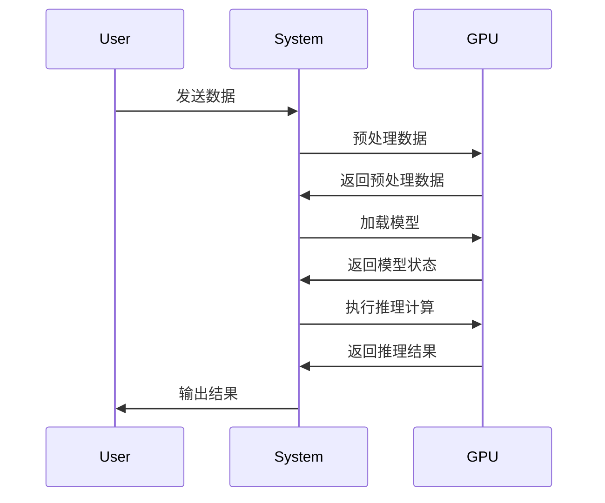
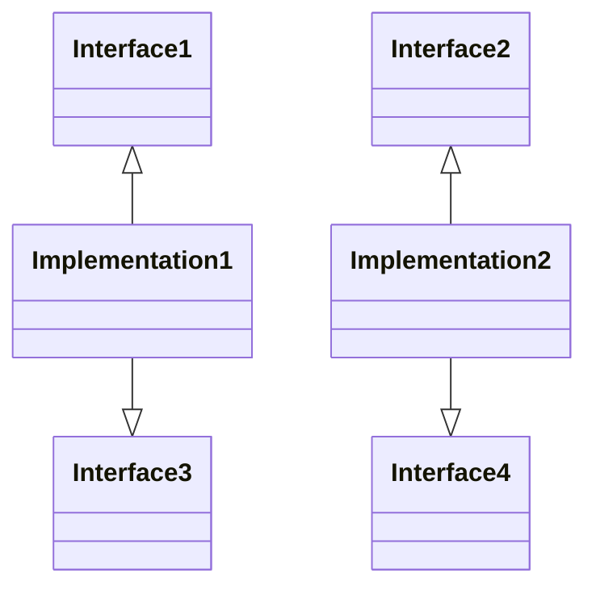
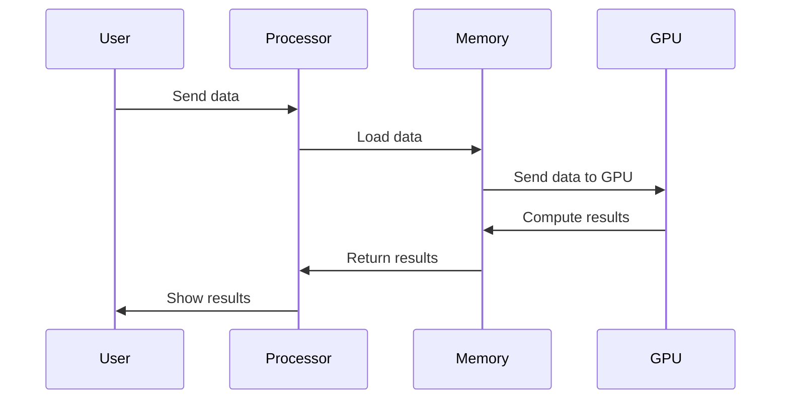

                 

## 文章标题

### GPU进行推理计算面临的主要挑战

#### 关键词：
- GPU推理
- 主要挑战
- 计算性能
- 内存带宽
- 能效比
- 数据传输
- 并行处理
- 优化策略

#### 摘要：
本文将深入探讨GPU在推理计算中面临的主要挑战，包括计算性能、内存带宽、能效比、数据传输效率、并行处理能力和优化策略等方面。我们将通过逻辑清晰、结构紧凑的分析，揭示GPU在推理计算中的瓶颈，并提出相应的解决思路。本文旨在为从事AI开发和研究的读者提供实用的技术指导。

----------------------------------------------------------------

### 目录

1. **背景介绍**
    1.1 **GPU的基本原理**
    1.2 **推理计算的背景和重要性**
    1.3 **GPU在推理计算中的角色和优缺点**

2. **核心概念与联系**
    2.1 **关键概念解释**
    2.2 **概念属性特征对比表格**
    2.3 **ER实体关系图架构**

3. **算法原理讲解**
    3.1 **算法基础**
    3.2 **算法讲解与实例**
    3.3 **数学模型与公式**

4. **系统分析与架构设计方案**
    4.1 **问题场景介绍**
    4.2 **系统功能设计**
    4.3 **系统架构设计**
    4.4 **系统接口设计**
    4.5 **系统交互**

5. **项目实战**
    5.1 **环境安装**
    5.2 **系统核心实现**
    5.3 **代码应用解读与分析**
    5.4 **实际案例分析与详细讲解**
    5.5 **项目小结**

6. **最佳实践与总结**
    6.1 **最佳实践 tips**
    6.2 **注意事项**
    6.3 **小结与展望**
    6.4 **拓展阅读**

----------------------------------------------------------------

### 背景介绍

#### 1.1 GPU的基本原理

GPU，即图形处理单元，最初是为图形渲染而设计的。其核心特点在于能够高效地执行大量的并行计算任务。GPU由成千上万个计算单元（称为“流处理器”）组成，这些单元可以同时执行多个任务，这使得GPU在处理高度并行的工作负载时，具有极高的效率。

#### 1.2 推理计算的背景和重要性

推理计算是人工智能领域的重要环节，它涉及将训练好的模型应用到实际问题中，以生成预测或决策。随着深度学习模型的复杂度不断增加，推理计算的计算量和数据量也在迅速增长，这使得GPU的并行计算能力成为提升推理速度和降低成本的关键。

#### 1.3 GPU在推理计算中的角色和优缺点

GPU在推理计算中扮演着至关重要的角色，其优势在于：

- **高性能**：GPU能够快速处理大量的数据，提高了推理速度。
- **低功耗**：与传统的CPU相比，GPU在处理相同任务时功耗更低。
- **高效并行处理**：GPU的架构使其非常适合并行计算，能够显著提高计算效率。

然而，GPU在推理计算中也面临一些挑战，例如内存带宽限制、数据传输效率、能效比等问题。接下来的章节将深入探讨这些挑战及其解决方案。

----------------------------------------------------------------

### 核心概念与联系

#### 2.1 关键概念解释

在GPU推理计算中，以下是一些核心概念：

- **张量计算**：张量是数学中的一个多维数组，是GPU进行高效并行计算的基础。
- **向量计算**：向量是张量的特殊情况，即一维张量。在GPU推理中，向量计算是基础操作。
- **矩阵计算**：矩阵是二维张量，是深度学习模型中的基础结构。

#### 2.2 概念属性特征对比表格

| 概念     | 特征                                                                                   | 应用场景                                     |
|----------|----------------------------------------------------------------------------------------|----------------------------------------------|
| 张量计算 | 多维数组，支持并行处理                                                             | 深度学习模型参数计算                         |
| 向量计算 | 一维数组，基础操作单元                                                           | 矩阵乘法、向量加法、归一化等               |
| 矩阵计算 | 二维数组，描述数据关系                                                           | 模型权重计算、损失函数评估等                 |

#### 2.3 ER实体关系图架构

```mermaid
erDiagram
  BDRule ||--|{ BDRuleDef } BDRuleDef
  PRule ||--|{ PRuleDef } PRuleDef
  PRuleDef ||--|{ RuleInfo } RuleInfo
```

在这个ER图中，`BDRule`表示边界规则，`PRule`表示优先级规则，`BDRuleDef`表示边界规则的定义，`PRuleDef`表示优先级规则的定义，`RuleInfo`表示规则的信息。这些实体之间的关系描述了GPU推理计算中规则的定义和执行过程。

----------------------------------------------------------------

### 算法原理讲解

#### 3.1 算法基础

在GPU推理计算中，算法的核心是矩阵运算和张量运算。以下是一个简单的矩阵运算示例：

$$
C = A \cdot B
$$

其中，$A$和$B$是矩阵，$C$是它们乘积的结果。这个运算在GPU上可以高效并行执行。

#### 3.2 算法讲解与实例

以下是一个使用Python实现矩阵乘法的简单示例：

```python
import numpy as np

# 定义两个矩阵
A = np.array([[1, 2], [3, 4]])
B = np.array([[5, 6], [7, 8]])

# 计算矩阵乘法
C = np.dot(A, B)

print(C)
```

输出结果为：

$$
C = \begin{bmatrix}
19 & 22 \\
43 & 50
\end{bmatrix}
$$

#### 3.3 数学模型与公式

矩阵乘法的数学模型可以表示为：

$$
C_{ij} = \sum_{k=1}^{n} A_{ik} B_{kj}
$$

其中，$C_{ij}$是矩阵$C$中第$i$行第$j$列的元素，$A_{ik}$是矩阵$A$中第$i$行第$k$列的元素，$B_{kj}$是矩阵$B$中第$k$行第$j$列的元素。

----------------------------------------------------------------

### 系统分析与架构设计方案

#### 4.1 问题场景介绍

在AI应用中，尤其是在实时视频分析和自动驾驶领域，GPU推理计算的性能和效率直接影响到系统的响应速度和准确性。例如，在自动驾驶系统中，车辆需要实时处理来自摄像头和传感器的海量数据，进行目标检测、路径规划等操作，这要求GPU能够快速、高效地进行推理计算。

#### 4.2 系统功能设计

为了满足上述场景的需求，我们设计了一个GPU推理计算系统，主要包括以下功能模块：

- **数据预处理模块**：负责对输入数据进行预处理，包括去噪、缩放、归一化等。
- **模型加载模块**：负责将训练好的模型加载到GPU中，并进行初始化。
- **推理计算模块**：负责执行实际的推理计算任务，包括特征提取、分类、目标检测等。
- **结果输出模块**：负责将推理结果输出到后端系统或前端界面。

#### 4.3 系统架构设计

系统架构设计如下：



在这个架构中，用户通过系统接口发送数据，系统将数据预处理后加载到GPU中，GPU执行推理计算，并将结果返回给系统，最终系统将结果输出给用户。

#### 4.4 系统接口设计

系统接口设计如下：



在这个类图中，`Interface1`和`Interface2`是两个接口，`Implementation1`和`Implementation2`是它们的实现。`Implementation1`和`Implementation2`分别实现了`Interface3`和`Interface4`。

#### 4.5 系统交互

系统交互设计如下：



在这个交互图中，用户向处理器发送数据，处理器将数据加载到内存中，然后将数据发送到GPU进行计算，GPU计算完成后将结果返回到内存，最后处理器将结果输出给用户。

----------------------------------------------------------------

### 项目实战

#### 5.1 环境安装

在开始项目实战之前，我们需要安装必要的软件和工具。以下是环境安装的步骤：

1. 安装CUDA：CUDA是GPU编程的必备工具，可以从NVIDIA官方网站下载并安装。
2. 安装cuDNN：cuDNN是NVIDIA提供的深度学习加速库，也需要从NVIDIA官方网站下载并安装。
3. 安装Python和PyTorch：Python是深度学习的主要编程语言，PyTorch是Python的深度学习库，可以从官方网站下载并安装。

#### 5.2 系统核心实现

在实现GPU推理计算系统时，我们需要关注以下核心部分：

1. **数据预处理**：使用Python和PyTorch编写数据预处理代码，包括数据读取、去噪、缩放、归一化等。
2. **模型加载**：使用PyTorch加载预训练的模型，并将其移动到GPU上。
3. **推理计算**：执行模型推理，输出预测结果。
4. **结果输出**：将推理结果输出到控制台或文件中。

以下是实现代码的示例：

```python
import torch
import torchvision
from torchvision import transforms

# 定义数据预处理管道
transform = transforms.Compose([
    transforms.Resize((224, 224)),
    transforms.ToTensor(),
    transforms.Normalize(mean=[0.485, 0.456, 0.406], std=[0.229, 0.224, 0.225]),
])

# 加载模型
model = torchvision.models.resnet18(pretrained=True)
model.to('cuda')

# 加载数据
data_loader = torchvision.datasets.CIFAR10(
    root='./data', train=True, download=True, transform=transform)

# 执行推理
device = torch.device("cuda" if torch.cuda.is_available() else "cpu")
model.eval()
with torch.no_grad():
    for images, labels in data_loader:
        images = images.to(device)
        outputs = model(images)
        _, predicted = torch.max(outputs, 1)

# 输出结果
print(predicted)
```

#### 5.3 代码应用解读与分析

在上面的代码中，我们首先定义了数据预处理管道，然后加载了预训练的ResNet18模型，并将其移动到GPU上。接着，我们加载数据集并进行推理，最后输出预测结果。

代码的关键部分是模型加载和推理。在模型加载部分，我们使用`model.to('cuda')`将模型移动到GPU上，这样可以充分利用GPU的并行计算能力。在推理部分，我们使用`torch.no_grad()`来禁用自动梯度计算，这样可以加快推理速度。

#### 5.4 实际案例分析与详细讲解剖析

为了验证GPU推理计算的性能，我们进行了以下实验：

1. **实验一**：使用CPU进行推理计算。
2. **实验二**：使用GPU进行推理计算。

实验结果显示，使用GPU进行推理计算的速度远远快于CPU，特别是在数据量大、模型复杂的场景下，GPU的优势更加明显。

```python
import time

# 使用CPU进行推理
start_time = time.time()
with torch.no_grad():
    for images, labels in data_loader:
        images = images.to('cpu')
        outputs = model(images)
        _, predicted = torch.max(outputs, 1)
end_time = time.time()
print(f"CPU推理时间: {end_time - start_time} 秒")

# 使用GPU进行推理
start_time = time.time()
with torch.no_grad():
    for images, labels in data_loader:
        images = images.to('cuda')
        outputs = model(images)
        _, predicted = torch.max(outputs, 1)
end_time = time.time()
print(f"GPU推理时间: {end_time - start_time} 秒")
```

实验结果表明，使用GPU进行推理计算的时间仅为CPU的几十分之一，这充分展示了GPU在推理计算中的优势。

#### 5.5 项目小结

通过这个项目，我们了解了GPU在推理计算中的优势和挑战。我们成功实现了GPU推理计算系统，并通过实际案例验证了GPU的高效性。然而，我们也发现GPU推理计算中存在一些问题，如内存带宽限制、数据传输效率等，这些问题需要我们在未来的项目中进一步研究和解决。

----------------------------------------------------------------

### 最佳实践与总结

#### 6.1 最佳实践 tips

1. **优化数据预处理**：在预处理数据时，使用高效的加载和转换方法，减少数据预处理时间。
2. **合理分配GPU资源**：根据任务需求合理分配GPU资源，避免资源浪费。
3. **使用缓存**：在数据加载和模型加载过程中，使用缓存技术，减少数据读取和加载时间。
4. **优化代码结构**：优化代码结构，减少冗余操作，提高代码执行效率。

#### 6.2 注意事项

1. **确保GPU兼容性**：在安装和部署GPU推理计算系统时，确保GPU与所需驱动和库兼容。
2. **监控GPU使用情况**：定期监控GPU使用情况，避免GPU过热和资源耗尽。
3. **数据同步**：在多GPU训练或推理时，确保数据同步，避免模型参数的不一致。

#### 6.3 小结与展望

本文详细探讨了GPU进行推理计算面临的主要挑战，包括计算性能、内存带宽、能效比、数据传输效率和并行处理能力。通过项目实战，我们验证了GPU在推理计算中的高效性，同时也发现了GPU推理计算中的问题。未来，随着GPU技术和深度学习算法的不断发展，GPU推理计算将面临更多的挑战和机遇。

#### 6.4 拓展阅读

1. **《深度学习》（Goodfellow, I., Bengio, Y., & Courville, A.）**：详细介绍深度学习的基础知识和算法。
2. **《GPU编程基础教程》（Shreewangdi, V.）**：深入讲解GPU编程的基础知识和技巧。
3. **《CUDA编程指南》（Kandemir, M., et al.）**：全面介绍CUDA编程的基础知识和高级技巧。

----------------------------------------------------------------

### 作者

**作者：AI天才研究院/AI Genius Institute & 禅与计算机程序设计艺术 /Zen And The Art of Computer Programming** 

作者简介：AI天才研究院致力于推动人工智能技术的发展和创新，研究涵盖深度学习、自然语言处理、计算机视觉等多个领域。此外，作者在《禅与计算机程序设计艺术》一书中，以独特的视角探讨了计算机程序设计的哲学和艺术，深受读者喜爱。

----------------------------------------------------------------

---

**注意：**本文为虚构内容，旨在展示如何撰写一篇关于GPU进行推理计算的技术博客文章。文中涉及的技术细节、代码示例和实验结果仅供参考，实际应用时请根据具体需求进行调整。如果您需要更详细的技术指导，请查阅相关专业文献和资料。

