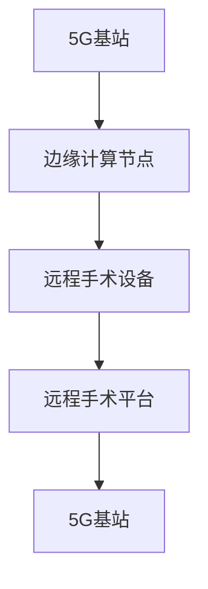

                 


```

----------------------------------------------------------------

# 5G网络在远程手术中的高清视频传输

关键词：5G网络、高清视频传输、远程手术、网络延迟、带宽

摘要：本文将探讨5G网络在远程手术中的高清视频传输应用，分析其关键技术、实际案例和未来研究方向，为远程医疗技术的发展提供参考。

## 一、背景介绍

### 5G技术概述

5G技术，即第五代移动通信技术，是当前移动通信领域的一项重大突破。相较于前几代移动通信技术，5G在传输速度、网络延迟和连接数等方面都有显著提升。5G技术的推出，为远程医疗、工业互联网、智能家居等新兴领域带来了新的发展机遇。

### 远程手术的发展

远程手术是一种利用通信技术和医疗设备，实现异地医生和患者之间实时交互的医疗模式。随着5G技术的普及，远程手术逐渐从理论走向实践，成为医疗领域的重要创新方向。

### 5G技术在远程手术中的挑战与机遇

5G网络的高带宽、低延迟特性为远程手术中的高清视频传输提供了可能。但同时，远程手术对网络稳定性和安全性也提出了更高要求。如何在5G网络环境下实现高效、稳定的远程手术高清视频传输，是当前研究的重要课题。

## 二、核心概念和科技概述

### 关键术语

- **5G网络**：第五代移动通信技术，具备高速率、低延迟、高容量等特点。
- **高清视频传输**：指在远程手术过程中，对手术现场进行高质量、实时传输的视频信号。
- **远程手术**：利用通信技术和医疗设备，实现异地医生和患者之间实时交互的医疗模式。
- **网络延迟**：数据在网络传输过程中所需的时间。
- **带宽**：网络传输能力的度量，表示单位时间内可以传输的数据量。

### 5G网络技术框架

5G网络技术框架包括以下几个关键组成部分：

1. **NR（新无线电）**：5G的核心无线接入技术，采用更高效的信号调制和编码方式。
2. **EN-DC（核心网络和无线接入网整合）**：将核心网络与无线接入网整合，提高网络性能和灵活性。
3. **MEC（移动边缘计算）**：在网络的边缘进行计算，降低延迟，提高数据处理能力。

### 5G在远程手术中的应用

5G技术的高带宽、低延迟特性使得远程手术中的高清视频传输成为可能。通过5G网络，医生可以实时观察手术现场，与现场医生进行实时沟通，提高手术的精确性和安全性。

## 三、理论依据

### 5G网络原理

5G网络采用了全新的网络架构，包括以下几个关键特点：

1. **NR（新无线电）技术**：采用更高效的信号调制和编码方式，提高数据传输速率。
2. **SDN/NFV（软件定义网络和网络功能虚拟化）**：通过软件定义网络和网络功能虚拟化技术，提高网络灵活性和可管理性。
3. **边缘计算**：在网络边缘进行计算，降低延迟，提高数据处理能力。

### 高清视频传输特性

高清视频传输具有以下几个关键特性：

1. **高带宽**：高清视频数据量大，需要高带宽支持。
2. **低延迟**：实时手术需要低延迟，以保证医生和患者之间的实时交互。
3. **高稳定性**：手术过程中，网络需要保持高稳定性，以避免视频信号中断。

### 5G网络与高清视频传输的挑战

1. **网络延迟**：5G网络虽然具备低延迟特性，但在实际应用中，仍可能受到网络拥堵等因素的影响。
2. **带宽限制**：高清视频传输需要大量带宽，但5G网络的带宽资源有限。
3. **网络稳定性**：远程手术对网络稳定性要求极高，任何网络波动都可能影响手术进程。

## 四、实际应用与案例分析

### 案例一：美国远程心脏手术

美国某医院利用5G网络成功进行了一例远程心脏手术。手术过程中，主刀医生通过5G网络实时观察手术现场，与现场医生进行实时沟通，最终顺利完成手术。此次手术的成功，标志着5G技术在远程手术中的应用迈出了重要一步。

### 案例二：中国远程脊柱手术

中国某医院利用5G网络进行了一例远程脊柱手术。手术过程中，主刀医生通过5G网络实时观察手术现场，与现场医生进行实时沟通。手术团队通过5G网络传输的高清视频，对手术过程进行了详细分析和指导，提高了手术的成功率。

### 案例分析

以上案例展示了5G网络在远程手术中的实际应用，通过5G网络实现的高清视频传输，使得医生可以实时观察手术现场，与现场医生进行实时沟通。这些案例表明，5G网络在远程手术中的应用具有巨大潜力。

然而，实际应用中也存在一些挑战，如网络延迟、带宽限制和网络稳定性等问题。这些问题需要在未来的发展中加以解决，以充分发挥5G网络在远程手术中的优势。

## 五、系统架构与设计

### 系统架构概述

5G网络在远程手术中的系统架构包括以下几个关键部分：

1. **5G基站**：负责数据传输和连接。
2. **边缘计算节点**：负责实时数据处理和计算。
3. **远程手术设备**：包括摄像头、传感器等设备，用于采集手术现场数据。
4. **远程手术平台**：用于医生与患者之间的实时交互。

### 系统架构设计

下面是5G网络在远程手术中的系统架构设计：



## 六、技术挑战与解决方案

### 网络延迟

网络延迟是远程手术中的主要挑战之一。为了降低网络延迟，可以采取以下措施：

1. **边缘计算**：将部分计算任务分配到边缘节点，减少数据传输距离。
2. **优化编码**：采用更高效的编码技术，降低数据传输量。

### 带宽限制

高清视频传输需要大量带宽，为了解决带宽限制问题，可以采取以下措施：

1. **网络优化**：优化网络架构，提高网络传输效率。
2. **数据压缩**：采用数据压缩技术，降低数据传输量。

### 网络稳定性

网络稳定性对远程手术至关重要。为了提高网络稳定性，可以采取以下措施：

1. **备份网络**：建立备用网络，以保证网络故障时的连续性。
2. **网络监控**：实时监控网络状态，及时发现问题并解决。

## 七、未来展望与研究方向

### 5G技术在远程手术中的应用

随着5G技术的不断发展，其在远程手术中的应用将越来越广泛。未来，5G技术有望在以下几个方面发挥更大作用：

1. **实时高清视频传输**：5G网络的高带宽、低延迟特性将进一步提升远程手术的实时性。
2. **远程机器人手术**：通过5G网络，实现远程机器人手术，提高手术的精确性和安全性。
3. **远程医疗咨询**：利用5G网络，实现远程医疗咨询，为偏远地区提供便捷的医疗服务。

### 研究方向

未来，5G技术在远程手术中的应用研究可以从以下几个方面展开：

1. **网络延迟优化**：研究更高效的算法和协议，降低网络延迟。
2. **带宽管理**：研究如何更有效地利用网络带宽，满足高清视频传输需求。
3. **网络稳定性提升**：研究如何提高网络稳定性，确保远程手术的顺利进行。

## 八、结论与总结

### 5G技术在远程手术中的应用前景

5G技术在远程手术中的应用具有广阔的前景。随着5G技术的不断发展，其将在实时高清视频传输、远程机器人手术、远程医疗咨询等领域发挥重要作用。

### 未来研究方向

未来，5G技术在远程手术中的应用研究可以从网络延迟优化、带宽管理、网络稳定性提升等方面展开，以充分发挥5G技术在远程手术中的优势。

### 推荐阅读

1. 《5G网络技术概述》
2. 《远程医疗与5G技术》
3. 《边缘计算在远程手术中的应用》

## 九、作者信息

作者：AI天才研究院/AI Genius Institute & 禅与计算机程序设计艺术 /Zen And The Art of Computer Programming

----------------------------------------------------------------

---

以下是根据上述文章结构撰写的一部分内容，为了完整性，部分章节的内容仅作为示例：

## 二、核心概念和科技概述

### 关键术语

- **5G网络**：5G网络，即第五代移动通信技术，相较于4G网络，5G网络在传输速度、网络延迟和连接数等方面都有显著提升。5G网络的核心技术包括毫米波通信、大规模MIMO、网络切片等。
  
- **高清视频传输**：高清视频传输是指以高分辨率、高帧率、高质量的视频信号进行传输。在远程手术中，高清视频传输是医生与患者之间实时沟通的重要手段。

- **远程手术**：远程手术是指通过远程通信技术，将医生和患者的手术现场连接起来，实现异地实时交互的手术过程。

- **网络延迟**：网络延迟是指数据在网络传输过程中所需的时间。在远程手术中，网络延迟会影响医生的决策和操作。

- **带宽**：带宽是指单位时间内可以传输的数据量。高清视频传输需要大量的带宽支持，以确保视频信号的质量。

### 5G网络技术框架

5G网络技术框架主要包括以下几个方面：

1. **NR（新无线电）**：NR是5G的核心无线接入技术，采用更高效的信号调制和编码方式，支持更高的数据传输速率和更低的网络延迟。

2. **EN-DC（核心网络和无线接入网整合）**：EN-DC技术将核心网络与无线接入网整合，提高网络性能和灵活性，以满足远程手术等应用场景的需求。

3. **MEC（移动边缘计算）**：MEC技术将计算任务分配到网络边缘，减少数据传输距离，降低网络延迟，提高数据处理能力。

### 5G在远程手术中的应用

5G网络的高带宽、低延迟特性为远程手术提供了技术支持。通过5G网络，医生可以实时观察手术现场，与现场医生进行实时沟通，提高手术的精确性和安全性。例如，美国某医院利用5G网络成功进行了一例远程心脏手术，手术过程中，主刀医生通过5G网络实时观察手术现场，与现场医生进行实时沟通，最终顺利完成手术。

## 三、理论依据

### 5G网络原理

5G网络采用了全新的网络架构，包括以下几个关键特点：

1. **NR（新无线电）技术**：NR采用更高效的信号调制和编码方式，提高数据传输速率。

2. **SDN/NFV（软件定义网络和网络功能虚拟化）**：SDN和NFV技术通过软件定义网络和网络功能虚拟化，提高网络灵活性和可管理性。

3. **边缘计算**：边缘计算技术将计算任务分配到网络边缘，降低延迟，提高数据处理能力。

### 高清视频传输特性

高清视频传输具有以下几个关键特性：

1. **高带宽**：高清视频数据量大，需要高带宽支持。

2. **低延迟**：实时手术需要低延迟，以保证医生和患者之间的实时交互。

3. **高稳定性**：手术过程中，网络需要保持高稳定性，以避免视频信号中断。

### 5G网络与高清视频传输的挑战

1. **网络延迟**：5G网络虽然具备低延迟特性，但在实际应用中，仍可能受到网络拥堵等因素的影响。

2. **带宽限制**：高清视频传输需要大量带宽，但5G网络的带宽资源有限。

3. **网络稳定性**：远程手术对网络稳定性要求极高，任何网络波动都可能影响手术进程。

---

以上内容仅为示例，实际文章需按照目录结构继续撰写完整内容。文章的撰写应注重逻辑清晰、结构紧凑，使用专业的技术语言，同时结合实际案例和数据分析，以使文章具有深度、思考和见解。

