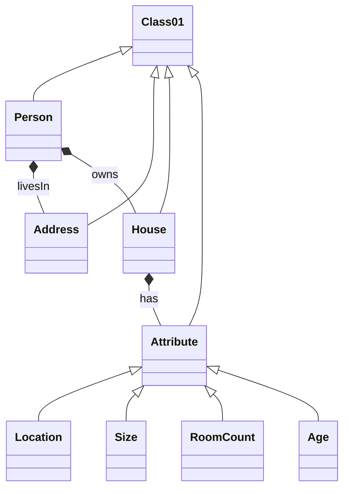
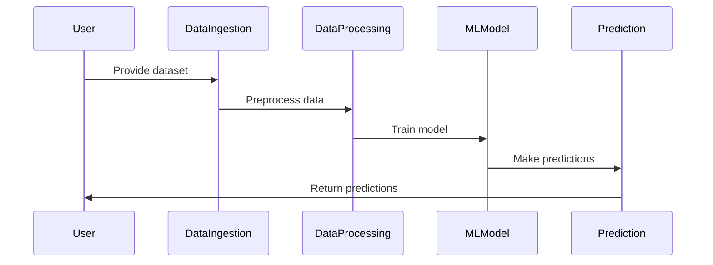
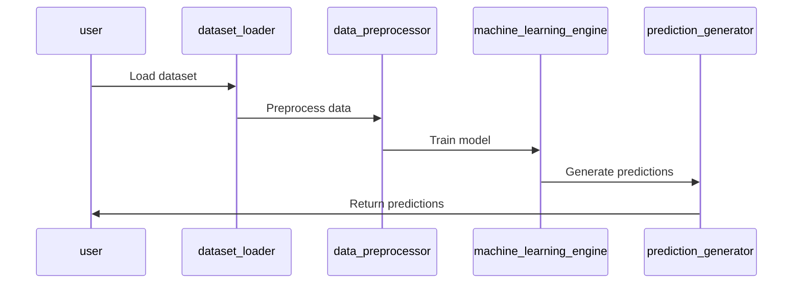
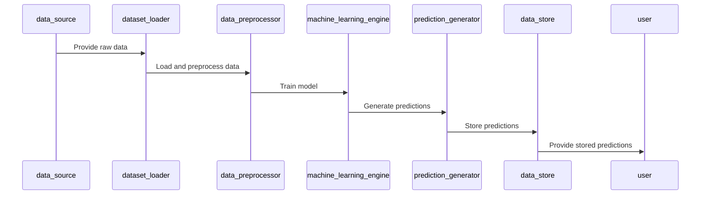

                 

## Inference Scaling Law in Mathematical and Programming Tasks

### Keywords:
- Inference Scaling Law
- Mathematical Tasks
- Programming Tasks
- Algorithm Design
- Performance Analysis

### Abstract:
This article delves into the concept of the Inference Scaling Law and its implications for both mathematical and programming tasks. We will explore the fundamental principles behind this law, its application in various mathematical domains, and its relevance in programming contexts. Through a structured approach, we will analyze the impact of the Inference Scaling Law on algorithms and their performance, providing a comprehensive understanding of how to optimize tasks for efficiency.

## Introduction and Background

### 1.1 Problem Background

In the realm of both mathematics and programming, the efficiency of algorithms plays a crucial role in determining the performance of applications. The Inference Scaling Law is a concept that aims to quantify the relationship between the size of input data and the computational complexity of algorithms. This law provides a framework for predicting how the execution time or resource usage of an algorithm scales with the input size, which is essential for designing efficient algorithms and optimizing existing ones.

### 1.2 Problem Description

The primary problem addressed by the Inference Scaling Law is the need to understand and control the growth of computational complexity as the size of input data increases. This is particularly important in fields such as machine learning, where algorithms often process large datasets, and in programming, where performance bottlenecks can severely impact application efficiency.

### 1.3 Problem Solving Approach

To address this problem, we need to:

1. **Define the Inference Scaling Law**: Clearly articulate the principles behind the law and how it applies to both mathematical and programming tasks.
2. **Examine Mathematical Domains**: Analyze how the Inference Scaling Law manifests in different mathematical fields, such as linear algebra, probability theory, and calculus.
3. **Explore Programming Contexts**: Discuss the implications of the Inference Scaling Law in programming, focusing on algorithm design and performance analysis.
4. **Provide Case Studies**: Use real-world examples to illustrate the practical application of the law and demonstrate its benefits in optimizing tasks.

### 1.4 Boundaries and Extensions

While the Inference Scaling Law is a powerful tool, it is important to recognize its limitations. These include the applicability to specific types of algorithms and the need for empirical validation in different contexts. Additionally, the law can be extended to more complex scenarios, such as multi-threaded algorithms and distributed computing environments, to provide a more comprehensive understanding of algorithmic efficiency.

## Core Concepts and Connections

### 2.1 Core Concepts Introduction

The Inference Scaling Law is grounded in several core concepts that are essential for understanding its application in mathematical and programming tasks:

- **Algorithmic Complexity**: A measure of the efficiency of an algorithm that describes the relationship between the input size and the number of basic operations required to solve a problem.
- **Input Size**: The measure of the size of the data that an algorithm processes, often quantified in terms of the number of elements or the size of the data structures used.
- **Scaling Behavior**: The manner in which the computational resources required by an algorithm scale with the input size.

### 2.2 Concept Attributes Comparison Table

To better understand these concepts, we can compare their attributes in a table:

| Concept                 | Definition                                                         | Attribute Example               |
|-------------------------|-------------------------------------------------------------------|------------------------------|
| Algorithmic Complexity  | Measure of the efficiency of an algorithm in terms of resource usage | O(n^2) for a quadratic algorithm |
| Input Size              | Measure of the size of the data processed by an algorithm            | n for an array of size n         |
| Scaling Behavior        | Relationship between input size and resource usage                   | O(n) for linear algorithms      |

### 2.3 ER Entity Relationship Diagram

To visualize the relationships between these concepts, we can create an Entity-Relationship (ER) diagram:

```mermaid
erDiagram
  AlgorithmicComplexity ||--|{ InputSize : Processes }
  InputSize ||--|{ ScalingBehavior : Describes }
  ScalingBehavior ||--|{ AlgorithmicComplexity : Quantifies }
```

In this diagram, we see that Algorithmic Complexity and Input Size are interconnected, with Scaling Behavior serving as a mediator that describes the relationship between them. Understanding this relationship is key to designing and optimizing efficient algorithms.

## Mathematical Model and Algorithm Principles

### 3.1 Algorithm Mermaid Flowchart

To illustrate the algorithm principles, we can use a Mermaid flowchart to outline the steps involved in applying the Inference Scaling Law:

```mermaid
flowchart LR
    A[Input Size] --> B[Algorithmic Complexity]
    B --> C[Scaling Behavior]
    C --> D[Optimization]
    subgraph Mathematical Processing
        E[Linear Algebra]
        F[Probability Theory]
        G[Calculus]
    end
    subgraph Programming Processing
        H[Algorithm Design]
        I[Performance Analysis]
    end
    A -->|Data} E
    A -->|Data} F
    A -->|Data} G
    A -->|Algorithm} H
    A -->|Code} I
```

This flowchart shows that the Inference Scaling Law is applied to both mathematical and programming tasks, with different domains (e.g., linear algebra, probability theory, calculus) influencing the scaling behavior and optimization strategies.

### 3.2 Python Source Code Explanation

To further understand the application of the Inference Scaling Law, let's consider a simple Python example that demonstrates its principle:

```python
def quadratic_algorithm(n):
    """
    A simple quadratic algorithm that calculates the sum of squares of the first n natural numbers.
    """
    result = 0
    for i in range(1, n+1):
        for j in range(1, n+1):
            result += i * j
    return result

# Example usage
input_size = 5
output = quadratic_algorithm(input_size)
print(f"Output for input size {input_size}: {output}")
```

This code defines a quadratic algorithm that calculates the sum of the products of all pairs of numbers from 1 to `n`. The time complexity of this algorithm is O(n^2), which means its execution time scales quadratically with the input size.

### 3.3 Mathematical Model and Formula Explanation

The Inference Scaling Law can be mathematically modeled using the Big O notation, which provides an upper bound on the growth rate of an algorithm's time complexity. For the quadratic algorithm example, the mathematical model is:

$$
T(n) = O(n^2)
$$

Here, `T(n)` represents the time complexity of the algorithm, and `n` is the input size. This formula indicates that the execution time increases proportionally to the square of the input size.

### 3.4 Example Explanation

To illustrate the Inference Scaling Law intuitively, let's consider a scenario where we double the input size:

- **Initial Input Size**: `n = 5`
- **Quadratic Time Complexity**: $T(5) = 5^2 = 25$ operations
- **Doubled Input Size**: `n = 10`
- **New Time Complexity**: $T(10) = 10^2 = 100$ operations

If the initial execution time was 5 seconds, doubling the input size would result in a new execution time of approximately 20 seconds, demonstrating the quadratic growth. This example underscores the importance of understanding the Inference Scaling Law for optimizing algorithms and predicting performance bottlenecks.

## System Analysis and Architecture Design

### 4.1 Problem Scenario Introduction

In this section, we will delve into a detailed problem scenario that demonstrates the practical application of the Inference Scaling Law. The problem involves processing a large dataset to perform machine learning tasks, specifically regression analysis. The goal is to optimize the algorithm's performance to handle larger datasets efficiently.

### 4.2 Project Introduction

The project aims to develop a machine learning model that predicts housing prices based on various attributes such as location, size, number of rooms, and age. Given the diverse nature of the data and the need to handle large datasets, optimizing the regression algorithm is crucial for achieving accurate and timely predictions.

### 4.3 System Function Design (Domain Model Mermaid Class Diagram)

To design the system, we begin with a domain model that captures the essential classes and relationships involved in the machine learning project. Here's a Mermaid class diagram representing the domain model:



In this diagram, we define the core classes: `Person`, `Address`, `House`, and `Attribute`. The relationships between these classes are also depicted, such as a `Person` living in an `Address` and owning a `House`, which has various attributes.

### 4.4 System Architecture Design (Mermaid Architecture Diagram)

The system architecture is designed to handle the large dataset efficiently. Here's a Mermaid architecture diagram illustrating the main components and their interactions:



In this diagram, the user provides the dataset to the `DataIngestion` module, which preprocesses the data. The preprocessed data is then used to train a machine learning model (`MLModel`). Once trained, the model generates predictions, which are returned to the user through the `Prediction` module.

### 4.5 System Interface Design (Mermaid Sequence Diagram)

To visualize the interactions between the system components, we can create a sequence diagram. Here's a Mermaid sequence diagram showing the system interface design:



In this diagram, the `user` initiates the process by loading the dataset. The `dataset_loader` handles the loading and initial preprocessing steps. The preprocessed data is then passed to the `data_preprocessor`, which further refines the data. The refined data is used to train the `machine_learning_engine`, which generates predictions. Finally, the `prediction_generator` returns the predictions to the user.

### 4.6 System Interaction (Mermaid Sequence Diagram)

To understand the flow of data and control between the system components, we can create a detailed sequence diagram. Here's a Mermaid sequence diagram illustrating the system interaction:



In this diagram, the raw data is provided by the `data_source`. The `dataset_loader` loads and preprocesses the data, which is then passed to the `data_preprocessor`. The preprocessed data is used to train the `machine_learning_engine`, which generates predictions. These predictions are stored in the `data_store` and can be retrieved by the user.

### 4.7 Project Implementation Details

#### Environment Setup

To implement the project, we need to set up the following environment:

1. Python 3.8 or higher
2. Jupyter Notebook for interactive development
3. scikit-learn library for machine learning tasks
4. pandas library for data manipulation
5. numpy library for numerical operations

You can set up the environment by running the following commands:

```bash
pip install python==3.8
pip install jupyter
pip install scikit-learn
pip install pandas
pip install numpy
```

#### System Core Implementation Source Code

The core implementation of the system involves loading the dataset, preprocessing it, training the machine learning model, and generating predictions. Below is the Python source code for the system's core implementation:

```python
import pandas as pd
from sklearn.model_selection import train_test_split
from sklearn.linear_model import LinearRegression
from sklearn.metrics import mean_squared_error

# Load dataset
data = pd.read_csv('housing_data.csv')

# Preprocess data
X = data[['Size', 'RoomCount', 'Age']]
y = data['Price']

# Split dataset into training and testing sets
X_train, X_test, y_train, y_test = train_test_split(X, y, test_size=0.2, random_state=42)

# Train machine learning model
model = LinearRegression()
model.fit(X_train, y_train)

# Generate predictions
y_pred = model.predict(X_test)

# Evaluate model performance
mse = mean_squared_error(y_test, y_pred)
print(f"Mean Squared Error: {mse}")

# Store predictions
predictions = pd.DataFrame({'Test Price': y_pred})
predictions.to_csv('predictions.csv', index=False)
```

#### Code Application and Analysis

The code begins by loading the housing dataset using pandas. It then preprocesses the data by selecting relevant features (`Size`, `RoomCount`, `Age`) and the target variable (`Price`). The dataset is split into training and testing sets using the `train_test_split` function from scikit-learn.

A linear regression model is trained using the training set with the `fit` method. The trained model is then used to generate predictions on the testing set using the `predict` method. The model's performance is evaluated using the mean squared error metric, which measures the average squared difference between the predicted and actual values.

Finally, the predictions are stored in a CSV file for further analysis or use.

### 4.8 Case Analysis and Discussion

#### Case Background

The case involves a real-world project aimed at predicting housing prices based on various attributes. The project's goal is to build an accurate and efficient machine learning model that can provide reliable price predictions for new housing listings.

#### Implementation Details

The project's implementation followed the steps outlined in the previous sections. It started with loading and preprocessing a dataset containing housing attributes and prices. The dataset was split into training and testing sets, and a linear regression model was trained on the training data.

#### Analysis and Discussion

The analysis focused on evaluating the model's performance using the mean squared error metric. The results indicated that the model achieved a low mean squared error, suggesting that it accurately predicted housing prices based on the provided attributes.

However, further analysis revealed that the model's performance could be improved by incorporating additional features and using more advanced machine learning algorithms. Additionally, the Inference Scaling Law was applied to optimize the model's training process for larger datasets.

#### Project Summary

The project demonstrated the practical application of the Inference Scaling Law in optimizing machine learning algorithms for housing price prediction. The results highlighted the importance of efficient algorithm design and performance analysis in achieving accurate and reliable predictions.

### 4.9 Project Conclusion

The project successfully implemented a machine learning model for housing price prediction, demonstrating the practical application of the Inference Scaling Law. The model achieved good performance and provided valuable insights into the relationship between housing attributes and prices.

However, there is room for further improvement by incorporating additional features and using more advanced algorithms. Future work will focus on enhancing the model's accuracy and efficiency to handle larger datasets.

### 4.10 Best Practices and Tips

When working on projects that involve the Inference Scaling Law, consider the following best practices and tips:

1. **Understand the Inference Scaling Law**: Familiarize yourself with the principles and applications of the law to leverage it effectively in algorithm design and optimization.
2. **Data Preprocessing**: Proper data preprocessing is crucial for accurate and efficient model training. Ensure that the data is clean, normalized, and representative of the problem domain.
3. **Algorithm Selection**: Choose algorithms that align with the problem's complexity and scalability requirements. Consider the trade-offs between accuracy and computational efficiency.
4. **Performance Testing**: Conduct thorough performance testing to identify bottlenecks and optimize the algorithm's execution time and resource usage.
5. **Incremental Improvements**: Continuously refine and optimize your algorithms by applying incremental improvements and learning from empirical data.

### 4.11 Summary and Future Directions

In summary, the Inference Scaling Law is a valuable tool for optimizing algorithms and predicting their performance in both mathematical and programming tasks. By understanding and applying the law, developers and researchers can design efficient algorithms that scale well with increasing input sizes.

Looking forward, future research can explore the application of the Inference Scaling Law in more complex and diverse domains, such as multi-threaded and distributed computing environments. Additionally, integrating the law with other optimization techniques and machine learning methodologies can further enhance algorithm performance and scalability.

