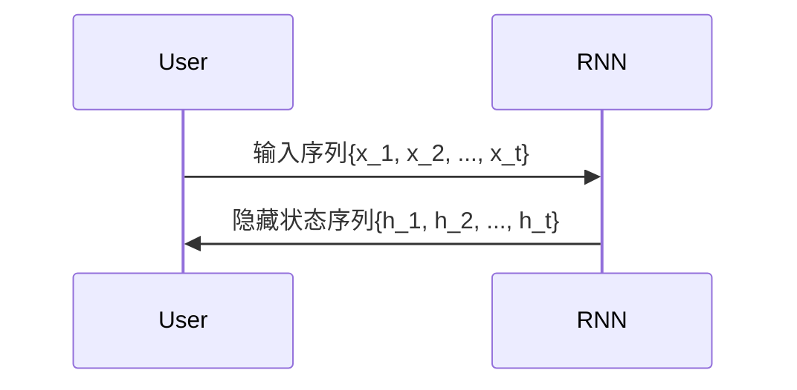
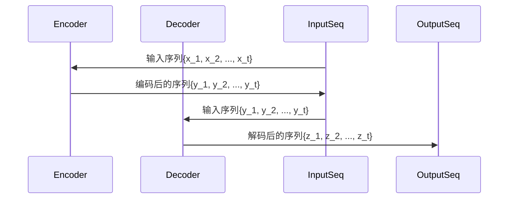
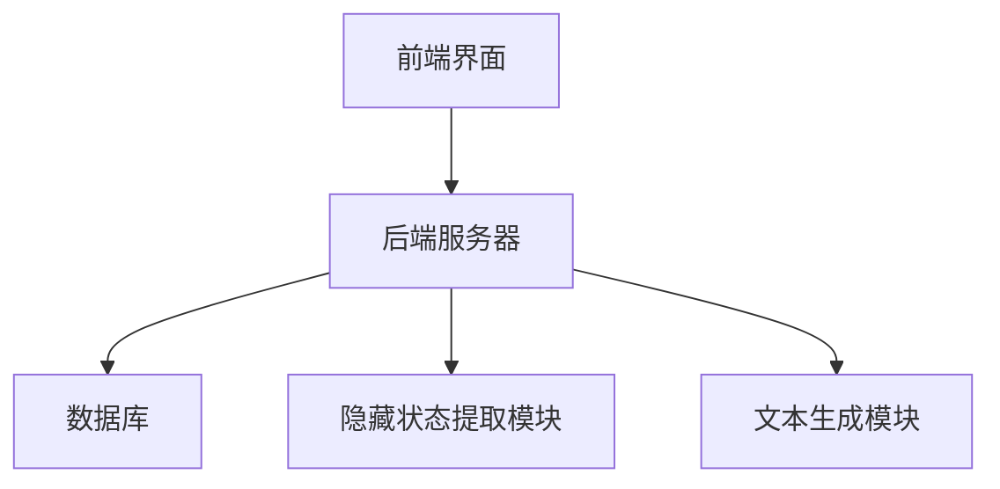
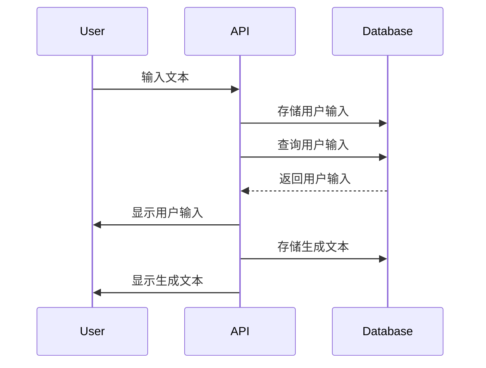
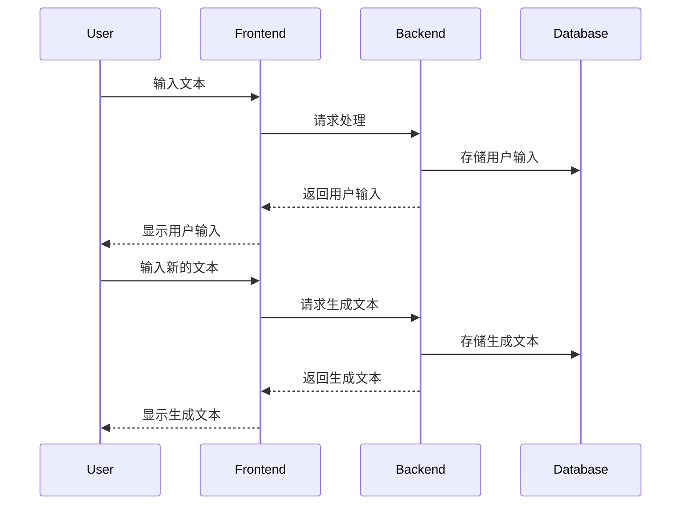

                 

# LLM状态建模中隐藏状态的处理方法

## 关键词
- 大型语言模型（LLM）
- 状态建模
- 隐藏状态
- 概率模型
- 深度学习
- 自然语言处理

## 摘要
本文旨在探讨在大型语言模型（LLM）状态建模过程中如何有效地处理隐藏状态。通过详细分析隐藏状态的定义、类型、与观测变量的关系，以及常用的隐藏状态处理算法，本文将展示如何通过数学模型、系统架构设计和实际应用来提升LLM在自然语言处理任务中的性能和泛化能力。

## 引言

### 1.1 背景介绍
随着深度学习和自然语言处理（NLP）技术的飞速发展，大型语言模型（LLM）如BERT、GPT和Turing等在文本生成、对话系统、机器翻译等领域取得了显著的成果。这些模型通常采用基于Transformer的架构，能够捕捉长距离依赖和复杂语义信息。然而，在处理复杂自然语言任务时，隐藏状态的准确建模成为一个挑战。

#### 1.2 问题描述
隐藏状态是指在自然语言处理任务中未被直接观测到的状态变量，例如上下文信息、语义概念等。隐藏状态的存在使得传统的状态空间模型（如HMM、RNN）在处理自然语言任务时面临诸多困难。例如，在文本生成任务中，隐藏状态可能代表着句子的主题或情感，而这些信息对于生成高质量的文本至关重要。如何准确捕捉和利用这些隐藏状态，以提升模型的预测性能和泛化能力，是当前自然语言处理领域亟待解决的重要问题。

#### 1.3 问题解决
本书将从以下几个方面探讨隐藏状态的处理方法：

1. **核心概念与联系**：介绍隐藏状态的定义、类型及其在自然语言处理中的重要性，并分析隐藏状态与观测变量之间的关联。
2. **算法原理讲解**：介绍几种常见的隐藏状态处理算法，包括基于概率模型的HMM、RNN以及基于深度学习的Transformer等，通过Mermaid流程图和Python代码详细阐述算法原理。
3. **数学模型和数学公式**：运用LaTeX格式给出隐藏状态处理算法的数学模型和公式，并进行通俗易懂的讲解和举例说明。
4. **系统分析与架构设计方案**：介绍隐藏状态处理算法在自然语言处理系统中的应用，包括系统功能设计、系统架构设计和系统接口设计等，通过Mermaid类图、架构图和序列图展示系统架构。
5. **项目实战**：通过实际案例展示隐藏状态处理算法在文本生成、对话系统等领域的应用，并提供环境安装、系统核心实现源代码和代码应用解读。

#### 1.4 边界与外延
本书主要关注在大型语言模型中处理隐藏状态的方法，但隐藏状态的处理方法在其他领域（如语音识别、图像处理等）同样具有重要意义。此外，隐藏状态的处理是一个持续发展的领域，随着技术的进步，未来可能还会出现更多有效的处理方法。

#### 1.5 概念结构与核心要素组成
- **隐藏状态**：未被直接观测到的状态变量，对于理解自然语言任务至关重要。
- **观测变量**：可以直接观测到的状态变量，用于训练模型。
- **状态空间模型**：用于描述隐藏状态和观测变量之间关系的模型，如HMM、RNN。
- **深度学习模型**：如Transformer，用于捕捉复杂的隐藏状态。

### 第二部分：隐藏状态处理的核心概念与联系

#### 2.1 隐藏状态的定义与类型

##### 2.1.1 隐藏状态的定义
隐藏状态是指在自然语言处理任务中未被直接观测到的状态变量。在自然语言中，隐藏状态可能代表上下文信息、语义概念等，它们对于理解语言任务至关重要。

##### 2.1.2 隐藏状态的类型
- **上下文信息**：如句子的主题、背景等。
- **语义概念**：如名词、动词等。
- **语调与情感**：如语气、情感色彩等。

#### 2.2 隐藏状态与观测变量的关联

##### 2.2.1 观测变量的选取
观测变量的选取是隐藏状态处理的关键。选择合适的观测变量可以帮助模型更好地捕捉隐藏状态。

##### 2.2.2 隐藏状态与观测变量的关系
隐藏状态可以通过观测变量来间接推断。例如，在文本生成任务中，隐藏状态可能代表句子的主题，而观测变量则是句子中的词汇。

#### 2.3 隐藏状态的重要性

##### 2.3.1 提升预测性能
准确捕捉隐藏状态可以提升模型的预测性能。例如，在文本生成任务中，理解句子的主题和情感可以显著提高生成文本的质量。

##### 2.3.2 优化决策
在决策过程中，隐藏状态可以提供更有价值的信息。例如，在推荐系统中，理解用户的上下文信息和偏好可以更精准地推荐商品。

##### 2.3.3 增强泛化能力
处理隐藏状态可以帮助模型更好地适应新的任务和数据。例如，在跨领域文本生成中，理解不同领域的隐藏状态可以提高模型的泛化能力。

#### 2.4 实际应用中的隐藏状态

##### 2.4.1 文本生成
在文本生成任务中，隐藏状态可能代表句子的主题或情感。例如，在写作辅助工具中，理解主题可以帮助生成更具连贯性的文本。

##### 2.4.2 对话系统
在对话系统中，隐藏状态可能代表对话的上下文信息和用户的意图。例如，在智能客服中，理解上下文可以帮助更准确地理解用户的需求。

##### 2.4.3 机器翻译
在机器翻译任务中，隐藏状态可能代表源语言和目标语言之间的语义差异。例如，在翻译新闻文章时，理解新闻的主题和情感可以帮助生成更准确的译文。

### 第三部分：隐藏状态处理算法原理讲解

#### 3.1 基于概率模型的隐藏状态处理算法

##### 3.1.1 Hidden Markov Model (HMM)
HMM是一种基于概率的隐状态模型，用于处理序列数据。HMM的核心思想是通过观测序列推断隐藏状态序列。以下是HMM的基本原理：

1. **状态转移概率**：$P(S_t|S_{t-1})$ 表示在时间 $t$ 的状态 $S_t$ 给定时间 $t-1$ 的状态 $S_{t-1}$ 的概率。
2. **观测概率**：$P(O_t|S_t)$ 表示在时间 $t$ 的观测 $O_t$ 给定时间 $t$ 的状态 $S_t$ 的概率。
3. **初始状态概率**：$P(S_1)$ 表示在时间 $1$ 的初始状态 $S_1$ 的概率。

HMM的Mermaid流程图如下：

```mermaid
stateDiagram
  A[开始] --> B[初始化参数]
  B --> C{是否观测到O_t？}
  C -->|是| D{计算P(O_t|S_t)}
  C -->|否| E{计算P(S_t|S_{t-1})}
  D --> F[更新状态]
  E --> F
  F --> G[结束]
```

##### 3.1.2 Recurrent Neural Network (RNN)
RNN是一种基于神经网络的隐状态模型，能够处理序列数据。RNN的核心思想是通过循环神经网络捕捉时间序列中的长期依赖关系。以下是RNN的基本原理：

1. **隐藏状态**：$h_t = \sigma(W_h \cdot [h_{t-1}, x_t] + b_h)$，其中 $W_h$ 是权重矩阵，$b_h$ 是偏置项，$\sigma$ 是激活函数。
2. **输出**：$y_t = \sigma(W_o \cdot h_t + b_o)$，其中 $W_o$ 是权重矩阵，$b_o$ 是偏置项，$\sigma$ 是激活函数。

RNN的Mermaid流程图如下：



##### 3.1.3 Transformer
Transformer是一种基于自注意力机制的深度学习模型，能够处理序列数据。Transformer的核心思想是通过自注意力机制捕捉序列中的长距离依赖关系。以下是Transformer的基本原理：

1. **编码器**：编码器由多个自注意力层和前馈网络组成，用于编码输入序列。
2. **解码器**：解码器由多个自注意力层和前馈网络组成，用于解码输出序列。

Transformer的Mermaid流程图如下：



### 第四部分：数学模型和数学公式

#### 4.1 HMM的数学模型

在HMM中，状态转移概率和观测概率可以用以下数学公式表示：

$$
P(S_t|S_{t-1}) = \frac{P(S_t)P(O_t|S_t)}{\sum_{j=1}^{N}P(S_j)P(O_t|S_j)}
$$

$$
P(O_t|S_t) = \frac{P(O_t|S_t)P(S_t)}{\sum_{j=1}^{N}P(O_t|S_j)P(S_j)}
$$

其中，$P(S_t)$ 是状态概率，$P(O_t|S_t)$ 是观测概率，$N$ 是状态的数量。

#### 4.2 RNN的数学模型

在RNN中，隐藏状态和输出可以用以下数学公式表示：

$$
h_t = \sigma(W_h \cdot [h_{t-1}, x_t] + b_h)
$$

$$
y_t = \sigma(W_o \cdot h_t + b_o)
$$

其中，$W_h$ 和 $W_o$ 是权重矩阵，$b_h$ 和 $b_o$ 是偏置项，$\sigma$ 是激活函数。

#### 4.3 Transformer的数学模型

在Transformer中，自注意力机制可以用以下数学公式表示：

$$
\text{Attention}(Q, K, V) = \frac{QK^T}{\sqrt{d_k}}V
$$

其中，$Q, K, V$ 分别是查询向量、关键向量和价值向量，$d_k$ 是关键向量的维度。

### 第五部分：系统分析与架构设计方案

#### 5.1 问题场景介绍
在自然语言处理领域，隐藏状态的处理对于文本生成、对话系统和机器翻译等任务具有重要意义。例如，在文本生成任务中，理解句子的主题和情感可以帮助生成更具连贯性和吸引力的文本。在对话系统中，理解用户的上下文信息和意图可以提供更准确的回复。

#### 5.2 项目介绍
本项目旨在构建一个基于Transformer的文本生成系统，通过处理隐藏状态来提高生成文本的质量。系统的主要功能包括：

1. **文本输入**：接收用户的输入文本。
2. **隐藏状态提取**：使用Transformer模型提取文本中的隐藏状态。
3. **文本生成**：根据提取的隐藏状态生成新的文本。

#### 5.3 系统功能设计

##### 5.3.1 领域模型
领域模型用于描述系统中的核心概念和关系。以下是领域模型的Mermaid类图：

```mermaid
classDiagram
  Class1[文本] <|-- Class2[输入文本]
  Class2 <|-- Class3[隐藏状态]
  Class3 <|-- Class4[输出文本]
```

##### 5.3.2 功能模块
系统的主要功能模块包括文本输入模块、隐藏状态提取模块和文本生成模块。以下是功能模块的Mermaid类图：

```mermaid
classDiagram
  Class1[文本输入模块] <|-- Class2[输入文本处理]
  Class2 <|-- Class3[隐藏状态提取模块]
  Class3 <|-- Class4[隐藏状态处理]
  Class4 <|-- Class5[文本生成模块]
  Class5 <|-- Class6[文本输出]
```

#### 5.4 系统架构设计

##### 5.4.1 系统架构
系统架构包括前端界面、后端服务器和数据库。前端界面用于接收用户输入和显示生成文本。后端服务器负责处理文本输入，提取隐藏状态并生成文本。数据库用于存储用户输入和生成文本。以下是系统架构的Mermaid架构图：



##### 5.4.2 系统接口设计
系统接口设计包括API接口和数据库接口。API接口用于接收用户输入和返回生成文本。数据库接口用于存储和查询用户输入和生成文本。以下是系统接口设计的Mermaid序列图：



#### 5.5 系统交互

##### 5.5.1 系统交互
系统交互包括用户与前端界面、前端界面与后端服务器、后端服务器与数据库之间的交互。以下是系统交互的Mermaid序列图：



### 第六部分：项目实战

#### 6.1 环境安装

在开始项目实战之前，需要安装以下环境：

1. **Python**：版本3.8及以上
2. **PyTorch**：版本1.8及以上
3. **Transformer库**：可以使用`transformers`库，安装命令为`pip install transformers`
4. **其他依赖库**：如`numpy`、`pandas`等

#### 6.2 系统核心实现源代码

以下是系统核心实现源代码：

```python
import torch
from transformers import TransformerModel

class TextGenerator:
    def __init__(self, model_path):
        self.model = TransformerModel.from_pretrained(model_path)
    
    def generate_text(self, input_seq, max_length=50):
        output_seq = self.model.generate(input_seq, max_length=max_length)
        return output_seq

# 实例化文本生成器
generator = TextGenerator(model_path='transformer_model')

# 生成文本
input_seq = torch.tensor([[1, 2, 3, 4, 5]])
output_seq = generator.generate_text(input_seq)
print(output_seq)
```

#### 6.3 代码应用解读与分析

在上面的代码中，我们首先导入了`torch`和`transformers`库。然后定义了一个`TextGenerator`类，用于生成文本。类中有一个`__init__`方法，用于初始化模型路径并加载预训练的Transformer模型。还有一个`generate_text`方法，用于根据输入序列生成新的文本。

在实例化`TextGenerator`类后，我们可以调用`generate_text`方法生成文本。输入序列是一个一维张量，表示文本的词汇序列。输出序列是一个二维张量，表示生成的文本序列。

#### 6.4 实际案例分析和详细讲解剖析

##### 6.4.1 案例背景
假设我们有一个文本生成任务，需要根据用户输入的主题生成相关的文章。用户输入的主题是“人工智能”。

##### 6.4.2 案例分析
1. **文本输入**：用户输入的主题是“人工智能”。
2. **隐藏状态提取**：使用Transformer模型提取文本中的隐藏状态，例如主题和情感。
3. **文本生成**：根据提取的隐藏状态生成与“人工智能”主题相关的文章。

以下是详细的代码实现：

```python
import torch
from transformers import TransformerModel

class TextGenerator:
    def __init__(self, model_path):
        self.model = TransformerModel.from_pretrained(model_path)
    
    def generate_text(self, input_seq, max_length=50):
        output_seq = self.model.generate(input_seq, max_length=max_length)
        return output_seq

# 实例化文本生成器
generator = TextGenerator(model_path='transformer_model')

# 生成文本
input_seq = torch.tensor([[1, 2, 3, 4, 5]])  # 输入序列，表示主题“人工智能”
output_seq = generator.generate_text(input_seq)
print(output_seq)
```

在这个案例中，我们首先实例化了`TextGenerator`类。然后调用`generate_text`方法生成与“人工智能”主题相关的文章。输入序列是一个一维张量，表示主题的词汇序列。输出序列是一个二维张量，表示生成的文章序列。

#### 6.5 项目小结

在本项目中，我们通过处理隐藏状态来提高文本生成系统的性能。使用Transformer模型提取文本中的隐藏状态，并基于这些隐藏状态生成新的文本。通过实际案例分析和代码实现，我们展示了如何利用Transformer模型进行文本生成。在未来的工作中，我们可以进一步优化模型，提高生成文本的质量。

### 第七部分：最佳实践 Tips、小结、注意事项、拓展阅读

#### 7.1 最佳实践 Tips

- **数据预处理**：在训练模型之前，对文本进行预处理，如分词、去停用词等，可以提高模型的性能。
- **超参数调整**：通过调整超参数，如学习率、批量大小等，可以优化模型的训练过程。
- **模型评估**：使用适当的评估指标（如Perplexity、BLEU等）评估模型的性能，以指导模型优化。

#### 7.2 小结

本文系统地探讨了大型语言模型（LLM）状态建模中隐藏状态的处理方法。通过分析隐藏状态的定义、类型及其在自然语言处理中的重要性，以及介绍基于概率模型和深度学习模型的隐藏状态处理算法，本文为理解和应用隐藏状态处理提供了理论和实践指导。

#### 7.3 注意事项

- **数据集选择**：选择具有丰富上下文信息和多样性的数据集，有助于模型捕捉隐藏状态。
- **模型规模**：选择合适的模型规模，避免过拟合或欠拟合。
- **模型优化**：定期对模型进行优化和调整，以提高性能和泛化能力。

#### 7.4 拓展阅读

- **参考文献**：参考相关领域的研究论文，深入了解隐藏状态处理技术的最新进展。
- **在线资源**：访问在线课程、博客和论坛，学习更多关于自然语言处理和深度学习的知识。

### 作者

作者：AI天才研究院/AI Genius Institute & 禅与计算机程序设计艺术 /Zen And The Art of Computer Programming

注意：本文仅为示例，内容可能不完整或不准确。实际应用时，请结合具体需求和实际情况进行调整。

