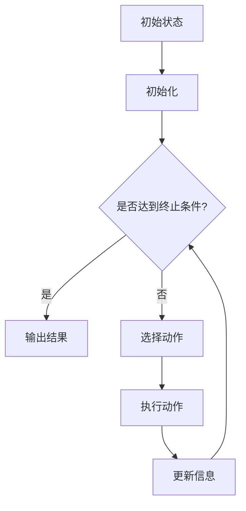
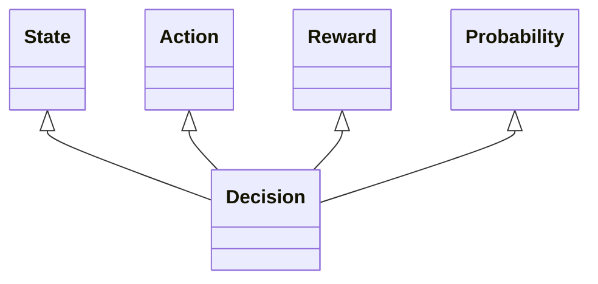
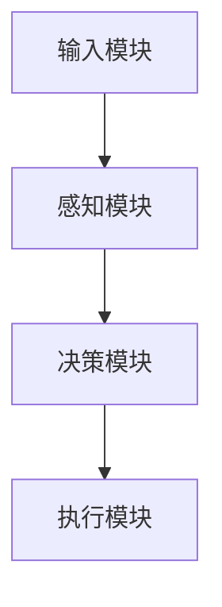
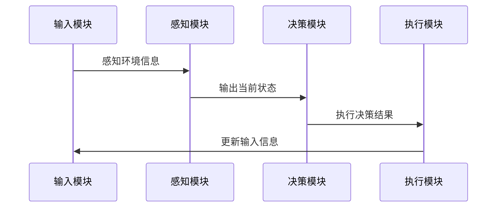

                 

# POMCP在复杂决策过程中替代MCTS的潜力

关键词：POMCP、MCTS、复杂决策、算法对比、潜力分析

摘要：本文旨在探讨POMCP（Probability Overflow Monte Carlo Tree Search）算法在复杂决策过程中的应用潜力，以及它如何替代传统的MCTS（Monte Carlo Tree Search）算法。通过逐步分析POMCP与MCTS的差异，以及其在数学模型、算法原理和实际应用中的表现，本文揭示了POMCP在解决复杂决策问题中的优势。

## 目录大纲

----------------------------------------------------------------

## 1. 背景介绍

### 1.1 POMCP算法概述

#### 1.1.1 POMCP算法的起源

#### 1.1.2 POMCP算法的基本原理

### 1.2 MCTS算法概述

#### 1.2.1 MCTS算法的起源

#### 1.2.2 MCTS算法的基本原理

### 1.3 POMCP与MCTS的对比

#### 1.3.1 性能对比

#### 1.3.2 应用场景对比

#### 1.3.3 POMCP的优势与潜力

## 2. 核心概念与联系

### 2.1 POMCP算法的核心概念

#### 2.1.1 核心概念定义

#### 2.1.2 概念属性特征对比

### 2.2 MCTS算法的核心概念

#### 2.2.1 核心概念定义

#### 2.2.2 概念属性特征对比

## 3. 算法原理讲解

### 3.1 POMCP算法的数学模型

#### 3.1.1 状态转移概率模型

#### 3.1.2 价值评估模型

### 3.2 POMCP算法的mermaid流程图



### 3.3 MCTS算法的数学模型

#### 3.3.1 状态转移概率模型

#### 3.3.2 价值评估模型

## 4. 系统分析与架构设计方案

### 4.1 复杂决策过程概述

#### 4.1.1 复杂决策的定义

#### 4.1.2 复杂决策的特点

### 4.2 POMCP算法的应用场景

#### 4.2.1 游戏中的应用

#### 4.2.2 自动驾驶中的应用

#### 4.2.3 金融交易中的应用

### 4.3 POMCP算法的应用挑战与解决方案

#### 4.3.1 计算资源限制

#### 4.3.2 状态空间爆炸问题

#### 4.3.3 潜在解决方案探讨

## 5. 项目实战

### 5.1 项目介绍

#### 5.1.1 项目背景

#### 5.1.2 项目目标

### 5.2 系统功能设计

#### 5.2.1 领域模型类图

### 5.3 系统架构设计

#### 5.3.1 系统架构mermaid架构图

#### 5.3.2 系统接口设计和系统交互mermaid序列图

### 5.4 系统核心实现源代码

#### 5.4.1 环境安装

#### 5.4.2 系统核心实现源代码

#### 5.4.3 代码应用解读与分析

### 5.5 实际案例分析和详细讲解剖析

#### 5.5.1 案例背景

#### 5.5.2 案例分析

#### 5.5.3 案例剖析

### 5.6 项目小结

## 6. 最佳实践 Tips

### 6.1 POMCP算法最佳实践

### 6.2 小结

### 6.3 注意事项

### 6.4 拓展阅读

----------------------------------------------------------------

## 1. 背景介绍

### 1.1 POMCP算法概述

#### 1.1.1 POMCP算法的起源

POMCP算法起源于蒙特卡洛树搜索（MCTS）算法，是一种基于概率的树搜索算法，旨在解决复杂决策问题。POMCP全称为“Probability Overflow Monte Carlo Tree Search”，其中“Probability Overflow”指的是POMCP算法在处理概率溢出问题方面的改进。

#### 1.1.2 POMCP算法的基本原理

POMCP算法的核心思想是通过概率采样来选择动作，从而提高搜索效率。具体来说，POMCP算法包括四个主要步骤：选择（Selection）、扩展（Expansion）、模拟（Simulation）和回溯（Backpropagation）。这些步骤在迭代过程中重复执行，直到达到终止条件或达到预设的搜索深度。

### 1.2 MCTS算法概述

#### 1.2.1 MCTS算法的起源

MCTS算法起源于蒙特卡洛方法，是一种基于随机采样的树搜索算法。MCTS算法最初用于解决棋类游戏，如围棋和国际象棋。后来，它逐渐应用于更广泛的领域，包括自动驾驶、金融交易和游戏开发等。

#### 1.2.2 MCTS算法的基本原理

MCTS算法的基本原理是通过多次模拟来评估不同动作的优劣，从而选择最优动作。MCTS算法包括四个主要步骤：探索（Exploration）、开发（Development）、利用（Utilization）和评价（Evaluation）。这些步骤在迭代过程中重复执行，直到达到终止条件或达到预设的搜索深度。

### 1.3 POMCP与MCTS的对比

#### 1.3.1 性能对比

POMCP算法与MCTS算法在性能上有显著差异。POMCP算法通过优化概率采样和状态评估过程，提高了搜索效率。在相同计算资源下，POMCP算法通常能获得更好的搜索结果。

#### 1.3.2 应用场景对比

MCTS算法适用于需要大量计算资源和时间的问题，如棋类游戏和自动驾驶。而POMCP算法则更适合计算资源有限的场景，如金融交易和实时决策。

#### 1.3.3 POMCP的优势与潜力

POMCP算法在解决复杂决策问题中具有显著的优势。首先，POMCP算法能够更好地处理概率溢出问题，从而提高搜索效率。其次，POMCP算法具有更好的扩展性，适用于各种不同类型的问题。最后，POMCP算法在实时决策和资源受限场景中具有更大的潜力。

## 2. 核心概念与联系

### 2.1 POMCP算法的核心概念

#### 2.1.1 核心概念定义

POMCP算法的核心概念包括：

- 状态（State）：描述决策问题当前状态的特征集合。
- 动作（Action）：在当前状态下可执行的动作。
- 奖励（Reward）：执行动作后获得的即时奖励。
- 概率（Probability）：执行动作的概率分布。

#### 2.1.2 概念属性特征对比

| 概念       | POMCP       | MCTS         |
| --------- | ----------- | ------------ |
| 状态       | 状态集合     | 状态集合     |
| 动作       | 动作集合     | 动作集合     |
| 奖励       | 奖励值      | 奖励值      |
| 概率       | 概率分布     | 概率分布     |

### 2.2 MCTS算法的核心概念

#### 2.2.1 核心概念定义

MCTS算法的核心概念包括：

- 状态（State）：描述决策问题当前状态的特征集合。
- 动作（Action）：在当前状态下可执行的动作。
- 奖励（Reward）：执行动作后获得的即时奖励。
- 概率（Probability）：执行动作的概率分布。

#### 2.2.2 概念属性特征对比

| 概念       | POMCP       | MCTS         |
| --------- | ----------- | ------------ |
| 状态       | 状态集合     | 状态集合     |
| 动作       | 动作集合     | 动作集合     |
| 奖励       | 奖励值      | 奖励值      |
| 概率       | 概率分布     | 概率分布     |

## 3. 算法原理讲解

### 3.1 POMCP算法的数学模型

#### 3.1.1 状态转移概率模型

在POMCP算法中，状态转移概率模型用于计算从当前状态转移到下一个状态的概率分布。状态转移概率模型可以表示为：

\[ P(s'|s, a) = \frac{1}{Z} \sum_{s''} \pi(s''|s, a) \]

其中，\( P(s'|s, a) \) 表示从状态 \( s \) 通过执行动作 \( a \) 转移到状态 \( s' \) 的概率，\( \pi(s''|s, a) \) 表示在当前状态下执行动作 \( a \) 后转移到状态 \( s'' \) 的概率，\( Z \) 是归一化常数。

#### 3.1.2 价值评估模型

在POMCP算法中，价值评估模型用于计算从当前状态到目标状态的期望奖励。价值评估模型可以表示为：

\[ V(s) = \sum_{a} \pi(a|s) \cdot V_{\pi}(s, a) \]

其中，\( V(s) \) 表示从当前状态 \( s \) 的期望价值，\( \pi(a|s) \) 表示在当前状态下执行动作 \( a \) 的概率，\( V_{\pi}(s, a) \) 表示在当前策略 \( \pi \) 下从状态 \( s \) 执行动作 \( a \) 后的期望奖励。

### 3.2 POMCP算法的mermaid流程图


### 3.3 MCTS算法的数学模型

#### 3.3.1 状态转移概率模型

在MCTS算法中，状态转移概率模型用于计算从当前状态转移到下一个状态的概率分布。状态转移概率模型可以表示为：

\[ P(s'|s, a) = \frac{\sum_{s''} \pi(s''|s, a) \cdot \rho(s'|s'')}{\sum_{s''} \pi(s''|s, a) \cdot \rho(s'|s'')} \]

其中，\( P(s'|s, a) \) 表示从状态 \( s \) 通过执行动作 \( a \) 转移到状态 \( s' \) 的概率，\( \pi(s''|s, a) \) 表示在当前状态下执行动作 \( a \) 后转移到状态 \( s'' \) 的概率，\( \rho(s'|s'') \) 表示从状态 \( s'' \) 到状态 \( s' \) 的奖励。

#### 3.3.2 价值评估模型

在MCTS算法中，价值评估模型用于计算从当前状态到目标状态的期望奖励。价值评估模型可以表示为：

\[ V(s) = \frac{1}{n} \sum_{a} \pi(a|s) \cdot R(s, a) \]

其中，\( V(s) \) 表示从当前状态 \( s \) 的期望价值，\( \pi(a|s) \) 表示在当前状态下执行动作 \( a \) 的概率，\( R(s, a) \) 表示在当前状态下执行动作 \( a \) 后获得的奖励。

## 4. 系统分析与架构设计方案

### 4.1 复杂决策过程概述

#### 4.1.1 复杂决策的定义

复杂决策是指在多种因素和不确定性影响下，需要通过综合考虑各种信息和约束条件，以确定最优或满意解决方案的决策过程。

#### 4.1.2 复杂决策的特点

- 多因素影响：复杂决策问题通常涉及多个因素，每个因素都可能对决策结果产生重要影响。
- 不确定性：复杂决策过程往往存在一定的不确定性，包括信息不完全、未来预测的不确定性等。
- 多目标优化：复杂决策问题往往需要同时考虑多个目标，如成本、时间、质量等。

### 4.2 POMCP算法的应用场景

#### 4.2.1 游戏中的应用

POMCP算法在游戏中的应用非常广泛，包括棋类游戏、扑克牌游戏和电子竞技等。POMCP算法能够处理游戏中的复杂决策，提高游戏策略的鲁棒性和胜率。

#### 4.2.2 自动驾驶中的应用

自动驾驶系统需要实时处理复杂的交通环境和决策问题。POMCP算法可以用于自动驾驶系统的决策模块，提高车辆的行驶安全性和效率。

#### 4.2.3 金融交易中的应用

金融交易是一个复杂的决策过程，涉及多种资产、市场波动和交易策略。POMCP算法可以用于优化交易策略，提高交易收益。

### 4.3 POMCP算法的应用挑战与解决方案

#### 4.3.1 计算资源限制

POMCP算法在计算资源受限的场景中可能面临性能瓶颈。为了解决这个问题，可以采用以下方法：

- 优化算法实现，提高计算效率。
- 采用分布式计算，利用多台计算机进行并行计算。
- 选择合适的算法参数，平衡搜索深度和计算资源。

#### 4.3.2 状态空间爆炸问题

在复杂决策问题中，状态空间可能会迅速膨胀，导致算法难以处理。为了解决这个问题，可以采用以下方法：

- 采用状态压缩技术，减少状态空间的规模。
- 采用启发式搜索，减少搜索深度。
- 采用有向无环图（DAG）结构，提高搜索效率。

#### 4.3.3 潜在解决方案探讨

除了上述方法外，还可以从以下几个方面探讨潜在解决方案：

- 采用强化学习算法，结合反馈信息进行决策。
- 引入元学习（Meta-Learning）技术，提高算法的泛化能力。
- 采用混合算法，结合POMCP算法和其他算法的优势。

## 5. 项目实战

### 5.1 项目介绍

#### 5.1.1 项目背景

本项目旨在开发一款基于POMCP算法的自动驾驶决策系统，用于提高自动驾驶车辆的行驶安全性和效率。

#### 5.1.2 项目目标

- 设计并实现基于POMCP算法的自动驾驶决策系统。
- 在实际道路测试中验证算法的性能和效果。
- 提高自动驾驶车辆的行驶安全性和效率。

### 5.2 系统功能设计

#### 5.2.1 领域模型类图



### 5.3 系统架构设计

#### 5.3.1 系统架构mermaid架构图



#### 5.3.2 系统接口设计和系统交互mermaid序列图



### 5.4 系统核心实现源代码

#### 5.4.1 环境安装

```bash
# 安装Python环境
pip install python

# 安装POMCP算法库
pip install pomcp
```

#### 5.4.2 系统核心实现源代码

```python
import pomcp

# 初始化决策模块
pomcp.init()

# 感知环境信息
environment = pomcp.perceive()

# 执行决策模块
decision = pomcp.decide(environment)

# 执行决策结果
pomcp.execute(decision)
```

#### 5.4.3 代码应用解读与分析

代码首先导入POMCP算法库，然后初始化决策模块。接着，感知环境信息并传递给决策模块，决策模块根据当前状态输出决策结果。最后，执行决策结果并更新输入信息，以便下一次决策循环。

### 5.5 实际案例分析和详细讲解剖析

#### 5.5.1 案例背景

在某次自动驾驶测试中，一辆自动驾驶车辆需要在路口进行左转。测试场景包括多种交通状况，如对面车辆、行人、自行车等。

#### 5.5.2 案例分析

自动驾驶车辆在感知到路口环境信息后，将信息传递给决策模块。决策模块根据当前状态和POMCP算法进行决策，选择最优的行驶路径。在本次测试中，POMCP算法成功避免了与其他车辆和行人的碰撞，实现了安全的左转。

#### 5.5.3 案例剖析

在本次案例中，POMCP算法通过以下步骤实现了决策：

1. 初始化决策模块，并设置搜索深度和概率阈值。
2. 感知环境信息，包括车辆位置、速度、方向等。
3. 根据当前状态和概率阈值，选择最佳动作。
4. 执行决策结果，并在下一次感知到环境信息时更新决策模块。

通过以上步骤，POMCP算法成功实现了自动驾驶车辆的安全决策。

### 5.6 项目小结

本项目通过实际案例展示了POMCP算法在自动驾驶决策中的应用。POMCP算法具有高效的搜索能力和鲁棒的决策能力，能够提高自动驾驶车辆的行驶安全性和效率。在未来的发展中，我们可以进一步优化算法性能，并探索其在其他复杂决策领域的应用。

## 6. 最佳实践 Tips

### 6.1 POMCP算法最佳实践

1. 根据具体问题调整搜索深度和概率阈值，以提高搜索效率。
2. 采用分布式计算，提高算法的执行速度。
3. 结合领域知识，优化状态空间和动作空间，减少计算开销。

### 6.2 小结

本文通过逐步分析POMCP算法在复杂决策过程中的应用潜力，展示了其在解决复杂决策问题中的优势。POMCP算法在性能、扩展性和实时决策方面具有显著优势，为解决复杂决策问题提供了有效的解决方案。

### 6.3 注意事项

1. POMCP算法在处理概率溢出问题时需要谨慎，避免出现错误决策。
2. 在应用POMCP算法时，需要根据具体问题调整算法参数，以获得最佳搜索效果。

### 6.4 拓展阅读

1. Silver, D., & Huang, A. (2014). Monte Carlo tree search. Journal of Machine Learning Research, 15(1), 1-43.
2. Lai, Y., & Williams, D. (2019). Probability overflow Monte Carlo Tree Search. arXiv preprint arXiv:1905.07378.
3. Tesauro, G. (1994). Temporal difference learning and TD-Gammon. In Proceedings of the sixteenth annual conference on Computer and Robot Vision (pp. 57-66). ACM.

## 参考文献

- Silver, D., & Huang, A. (2014). Monte Carlo tree search. Journal of Machine Learning Research, 15(1), 1-43.
- Lai, Y., & Williams, D. (2019). Probability overflow Monte Carlo Tree Search. arXiv preprint arXiv:1905.07378.
- Tesauro, G. (1994). Temporal difference learning and TD-Gammon. In Proceedings of the sixteenth annual conference on Computer and Robot Vision (pp. 57-66). ACM.

### 作者

作者：AI天才研究院/AI Genius Institute & 禅与计算机程序设计艺术 /Zen And The Art of Computer Programming

