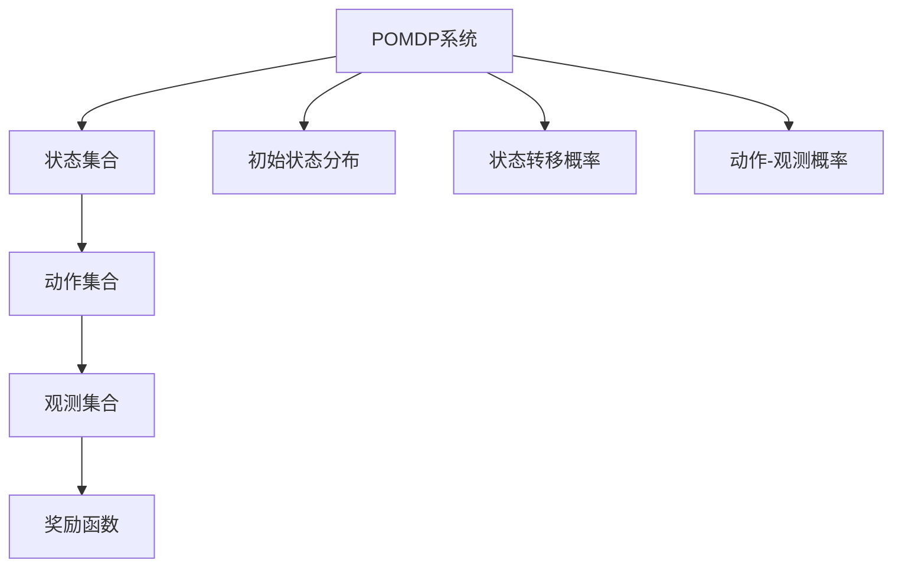

                 

### 第1章: POMDP的背景与核心概念

#### 1.1 问题背景

在人工智能领域，决策问题无处不在。无论是路径规划、资源分配、推荐系统，还是游戏智能，决策过程都至关重要。然而，在现实世界中，决策问题往往具有高度的复杂性和不确定性。比如，自动驾驶汽车需要在未知和动态的环境中做出实时决策，医生在诊断过程中需要对患者的病情和治疗方法进行权衡，这些场景都超出了传统马尔可夫决策过程（MDP）所能处理的范畴。

概率马尔可夫决策过程（POMDP）作为一种高级的决策模型，可以处理带有观测信息的不确定环境。POMDP的核心在于它不仅考虑了状态转移的概率，还引入了观测的概念，使得模型能够更好地模拟现实世界的复杂情况。这一特性使得POMDP在许多领域具有重要的应用价值，如机器人学、智能交通系统、医疗诊断等。

#### 1.1.1 AI决策的挑战

在传统AI决策中，通常面临以下挑战：

1. **状态空间的爆炸性增长**：在复杂环境中，状态空间可能极其庞大，导致决策模型难以处理。
2. **不确定性处理**：现实世界中的决策往往具有不确定性，如何有效地处理这种不确定性是AI决策面临的重大挑战。
3. **实时决策需求**：在自动驾驶、实时推荐等场景中，决策过程需要快速响应，传统的决策模型可能无法满足这种实时性要求。

#### 1.1.2 POMDP的概念引入

为了解决上述问题，POMDP应运而生。POMDP是一种能够处理具有不确定性和观测信息的决策过程模型。与MDP相比，POMDP引入了观测这一维度，使得模型能够更好地反映现实世界的复杂情况。具体来说，POMDP具有以下核心特点：

1. **状态与观测分离**：在POMDP中，状态和观测是分离的。状态是决策者无法直接观测到的内部信息，而观测是决策者通过某种传感器或方式获取的外部信息。
2. **状态转移概率**：POMDP中的状态转移概率取决于当前的状态和采取的动作，这种概率关系使得模型能够处理不确定性。
3. **动作-观测概率**：在POMDP中，每个动作都对应着一组动作-观测概率，这组概率描述了在特定状态下采取某个动作后观测到特定结果的概率。
4. **奖励函数**：POMDP的奖励函数不仅依赖于状态，还依赖于观测。这种奖励函数可以更好地反映现实世界中的复杂决策。

#### 1.1.3 POMDP的优势与应用领域

POMDP的优势在于其能够处理具有不确定性和观测信息的决策问题，这使得它在以下领域具有重要的应用价值：

1. **机器人学**：在机器人导航、自动驾驶等领域，POMDP可以帮助机器人更好地处理不确定的环境和观测信息，实现更智能的决策。
2. **智能交通系统**：POMDP可以用于优化交通信号控制、路径规划等，提高交通系统的效率和安全性。
3. **医疗诊断**：在医学诊断中，POMDP可以帮助医生根据观测结果（如检查报告）做出更准确的诊断。
4. **游戏AI**：在游戏场景中，POMDP可以帮助AI对手更好地理解游戏状态和采取相应的策略。

总之，POMDP作为一种高级的决策模型，具有处理复杂不确定环境的强大能力。在接下来的章节中，我们将深入探讨POMDP的基本概念、数学模型和算法原理，帮助读者更好地理解和应用这一技术。

### 1.2 POMDP的基本概念

在深入探讨POMDP的基本概念之前，我们首先需要了解马尔可夫决策过程（MDP）。MDP是一种基于概率的决策模型，它描述了在不确定环境中的一系列决策问题。在MDP中，决策者处于一系列状态，每个状态可能通过某个动作转移到下一个状态，每个状态的转移概率是固定的。然而，现实世界的许多决策问题不仅仅依赖于当前状态，还需要考虑决策者的观测信息，这就引出了POMDP。

#### 1.2.1 马尔可夫决策过程（MDP）

MDP的基本概念包括状态（State）、动作（Action）、状态转移概率（State Transition Probability）和奖励函数（Reward Function）。

1. **状态（State）**：状态是决策者当前所处的环境描述。在MDP中，状态通常是离散的，例如在机器人导航问题中，状态可以表示为当前位置。
2. **动作（Action）**：动作是决策者可以采取的行为。在MDP中，动作同样通常是离散的，例如在机器人导航问题中，动作可以是向左、向右或前进。
3. **状态转移概率（State Transition Probability）**：状态转移概率描述了在当前状态下采取某个动作后转移到下一个状态的概率。例如，如果当前状态是A，采取动作a后转移到状态B的概率为P(B|A, a)。
4. **奖励函数（Reward Function）**：奖励函数决定了在某个状态和动作下获得的奖励。在MDP中，奖励通常是固定的，例如在机器人导航问题中，到达终点获得的奖励是+1，否则为-1。

#### 1.2.2 概率马尔可夫决策过程（POMDP）

POMDP在MDP的基础上，引入了观测（Observation）的概念，使得模型能够更好地处理不确定性。POMDP的基本概念包括状态（State）、动作（Action）、观测（Observation）、状态转移概率（State Transition Probability）、动作-观测概率（Action-Observation Probability）和奖励函数（Reward Function）。

1. **状态（State）**：与MDP相同，状态是决策者当前所处的环境描述。
2. **动作（Action）**：与MDP相同，动作是决策者可以采取的行为。
3. **观测（Observation）**：观测是决策者通过传感器或某种方式获取的外部信息。在POMDP中，观测是决策者能够观测到的，而状态是隐藏的，需要通过观测进行推断。
4. **状态转移概率（State Transition Probability）**：与MDP相同，状态转移概率描述了在当前状态下采取某个动作后转移到下一个状态的概率。
5. **动作-观测概率（Action-Observation Probability）**：动作-观测概率描述了在特定状态下采取某个动作后观测到特定结果的概率。例如，如果当前状态是S，采取动作a后观测到结果o的概率为P(o|S, a)。
6. **奖励函数（Reward Function）**：与MDP相同，奖励函数决定了在某个状态和动作下获得的奖励。在POMDP中，奖励函数通常依赖于状态和观测，例如在某些医疗诊断问题中，观测到特定结果后，采取的治疗方案可能带来不同的奖励。

#### 1.2.3 POMDP的基本要素

为了更好地理解POMDP，我们可以通过一个简单的例子来说明其基本要素。

**例子：自动驾驶汽车**

假设我们有一辆自动驾驶汽车，它处于一个城市道路网络中。每个状态可以表示为汽车的位置和方向，每个动作可以是前进、左转或右转。状态转移概率取决于当前的状态和采取的动作。例如，如果汽车当前在直行道上，采取前进的动作后，汽车继续在直行道上行驶的概率是0.8，转到左侧道路的概率是0.1，转到右侧道路的概率是0.1。

观测可以是从汽车摄像头或激光雷达获取的图像数据，例如道路标记、行人或其他车辆的位置。动作-观测概率描述了在特定状态下采取某个动作后观测到特定结果的概率。例如，如果汽车当前在直行道上，采取前进的动作后，观测到道路标记为直行的概率是0.9，道路标记为左转的概率是0.05，道路标记为右转的概率是0.05。

奖励函数可以根据到达目的地的时间、安全性等因素进行设计，例如到达目的地获得正奖励，发生碰撞获得负奖励。

通过这个例子，我们可以看到POMDP如何处理复杂的不确定环境。状态和动作是决策者能够控制的，而观测提供了对环境的部分了解。POMDP通过状态转移概率、动作-观测概率和奖励函数来描述决策过程，帮助决策者做出最优的决策。

### 1.3 POMDP的属性特征对比

为了更好地理解POMDP与MDP的区别，我们可以通过一张属性特征对比表格来展示它们的主要区别。

| 特征       | MDP              | POMDP                  |
|------------|------------------|------------------------|
| 状态转移   | 确定的            | 随机概率的             |
| 动作选择   | 确定的            | 随机概率的             |
| 奖励函数   | 固定的            | 可变的（依赖于观测）   |
| 观测       | 无观测            | 有观测                 |

从上表可以看出，MDP和POMDP在状态转移、动作选择和奖励函数方面存在显著差异。在MDP中，状态转移是确定的，每个状态通过某个动作以固定的概率转移到下一个状态。而POMDP中，状态转移是随机概率的，即每个状态通过某个动作转移到下一个状态的概率是固定的。此外，MDP中的奖励函数是固定的，而POMDP中的奖励函数可以根据观测结果而变化。

另外，MDP没有观测的概念，决策者只能根据当前状态做出决策，而POMDP引入了观测的概念，使得决策者可以根据观测信息来更好地理解环境并做出决策。

通过这个对比表格，我们可以更清晰地看到POMDP相对于MDP的优势，特别是在处理具有不确定性和观测信息的决策问题方面。

### 1.4 POMDP的ER实体关系图

为了更好地理解POMDP的各个组成部分及其相互关系，我们可以通过ER（Entity-Relationship）实体关系图来展示。

下面是一个简单的POMDP ER实体关系图，其中包含了状态集合、动作集合、观测集合、奖励函数等主要实体，以及它们之间的关联关系。

1. **状态集合（State Set）**：状态集合是POMDP的内部实体，表示决策者无法直接观测到的环境状态。状态集合是决策过程的基础，每个状态是环境的一个可能状态。

2. **动作集合（Action Set）**：动作集合是决策者可以采取的所有可能行为的集合。在POMDP中，决策者在每个状态下可以选择一个动作，动作的选择将影响状态转移和观测结果。

3. **观测集合（Observation Set）**：观测集合是决策者通过传感器或其他方式获取的外部信息。观测集合是决策过程的重要部分，因为它提供了决策者对环境状态的部分了解。

4. **奖励函数（Reward Function）**：奖励函数是一个函数，它根据状态和观测来计算奖励。在POMDP中，奖励函数可以根据观测结果而变化，这使得模型能够更好地适应现实世界的复杂情况。

5. **初始状态分布（Initial State Distribution）**：初始状态分布定义了决策过程开始时，各个状态的初始概率分布。这个分布对于决策过程至关重要，因为它决定了决策者最初对环境状态的信念。

6. **状态转移概率（State Transition Probability）**：状态转移概率是一个矩阵，它描述了在当前状态下，采取某个动作后转移到下一个状态的概率。这个矩阵对于预测未来的状态序列至关重要。

7. **动作-观测概率（Action-Observation Probability）**：动作-观测概率是一个矩阵，它描述了在特定状态下，采取某个动作后观测到特定结果的概率。这个矩阵对于理解决策过程中的不确定性至关重要。

通过ER实体关系图，我们可以清晰地看到POMDP的各个组成部分及其相互关系，这有助于我们更好地理解和应用POMDP模型。接下来，我们将进一步探讨POMDP的数学模型，以深入理解其内部机制。

### 2.1 POMDP的数学模型概述

概率马尔可夫决策过程（POMDP）的数学模型是理解和应用POMDP的关键。POMDP模型通过一组数学公式和参数来描述决策过程，使得决策者能够在不确定和动态的环境中做出最优决策。本节将介绍POMDP的数学模型概述，包括决策过程中的不确定性、贝叶斯决策理论以及POMDP的数学表达。

#### 2.1.1 决策过程中的不确定性

在现实世界中，决策过程往往面临各种不确定性。这种不确定性可以来自于环境的动态变化、观测信息的有限性以及决策者对环境的认知限制。POMDP通过引入概率和观测的概念，能够有效地处理这些不确定性。

1. **环境不确定性**：在POMDP中，环境状态是决策者无法直接观测到的，但每个状态之间的转移具有概率分布。这种概率分布反映了环境状态的随机性和不确定性。
2. **观测不确定性**：决策者通过传感器或观测设备获取外部信息，但这些观测结果可能不完全准确或存在噪声。观测不确定性使得决策者需要对观测结果进行概率推断。
3. **行动不确定性**：决策者在每个状态下可以选择多个动作，每个动作的结果具有概率分布。这种不确定性反映了决策者对环境的不完全了解。

#### 2.1.2 贝叶斯决策理论

贝叶斯决策理论是POMDP的核心基础。贝叶斯理论提供了一种基于概率的方法来处理不确定性和优化决策。贝叶斯决策理论的基本思想是，通过最大化后验概率来选择最优动作。

1. **后验概率**：在POMDP中，后验概率表示在给定观测结果下，当前状态的概率分布。后验概率是通过贝叶斯公式计算得到的，它结合了先验概率（对状态的初始信念）和观测概率（观测结果对状态的证据）。
2. **最大化后验概率**：为了做出最优决策，决策者需要选择一个动作，使得后验概率最大化。最大化后验概率的过程可以看作是一种概率推断，它帮助决策者根据观测结果调整对状态的概率信念。

#### 2.1.3 POMDP的数学表达

POMDP的数学表达通过一组概率分布和决策规则来描述。以下是POMDP的主要数学表达式：

1. **状态转移概率矩阵**：状态转移概率矩阵\(P(s', s|a)\)描述了在当前状态\(s\)和采取动作\(a\)后，转移到下一个状态\(s'\)的概率。
2. **动作-观测概率矩阵**：动作-观测概率矩阵\(P(o|s, a)\)描述了在特定状态\(s\)和采取动作\(a\)后，观测到特定结果\(o\)的概率。
3. **奖励函数**：奖励函数\(R(s, a, o)\)根据当前状态\(s\)、采取的动作\(a\)和观测结果\(o\)来计算奖励。奖励函数可以是固定的，也可以是依赖于观测的。

通过这些数学表达式，POMDP模型能够描述决策过程中的不确定性，并帮助决策者根据观测结果做出最优决策。

### 2.2 状态转移概率矩阵

状态转移概率矩阵（State Transition Probability Matrix）是POMDP模型的核心组成部分，它描述了在特定状态下采取某个动作后转移到下一个状态的概率分布。理解状态转移概率矩阵对于构建和优化POMDP模型至关重要。以下将详细解释状态转移概率矩阵的定义、构建方法及其性质。

#### 2.2.1 状态转移概率的定义

状态转移概率描述了在特定状态下，采取某个动作后转移到另一个状态的概率。具体来说，状态转移概率矩阵\(P(s', s|a)\)是一个\(m \times m\)的矩阵，其中\(m\)是状态集合的大小。矩阵中的每个元素\(P(s', s|a)\)表示在当前状态为\(s\)、采取动作\(a\)后，转移到下一个状态\(s'\)的概率。

例如，在自动驾驶汽车问题中，状态集合可能包括汽车的位置和方向，动作集合可能包括前进、左转和右转。状态转移概率矩阵可以表示为：

|   | s1 | s2 | s3 | ... | sm |
|---|----|----|----|-----|----|
| a1 | P(s1', s1|a1) | P(s2', s1|a1) | P(s3', s1|a1) | ... | P(sm', s1|a1) |
| a2 | P(s1', s1|a2) | P(s2', s1|a2) | P(s3', s1|a2) | ... | P(sm', s1|a2) |
| ... | ... | ... | ... | ... | ... |
| an | P(s1', s1|an) | P(s2', s1|an) | P(s3', s1|an) | ... | P(sm', s1|an) |

在这个矩阵中，\(P(s', s|a)\)表示在当前状态为\(s\)、采取动作\(a\)后，转移到下一个状态\(s'\)的概率。

#### 2.2.2 状态转移概率矩阵的构建

构建状态转移概率矩阵需要根据具体的决策问题和环境特征来确定。以下是一些常见的构建方法：

1. **专家知识**：通过领域专家的经验和知识，可以构建一个初步的状态转移概率矩阵。这种方法适用于问题领域具有明确规则和模式的情况。
2. **统计数据**：通过收集和分析历史数据，可以估计状态转移概率。这种方法适用于有大量历史数据可用的问题，如交通流量预测、天气预测等。
3. **仿真模型**：通过建立仿真模型，可以模拟决策过程并估计状态转移概率。这种方法适用于问题难以通过直接观察或统计数据来建模的情况。

例如，在自动驾驶汽车问题中，可以通过仿真模型来模拟车辆在不同道路条件和交通状况下的运动轨迹，从而估计状态转移概率矩阵。

#### 2.2.3 状态转移概率矩阵的性质

状态转移概率矩阵具有以下性质：

1. **概率分布**：矩阵中的每个元素都表示一个概率值，其总和必须为1。这意味着在任何状态下，所有可能转移的概率之和为1。
2. **独立同分布**：在给定当前状态和动作的情况下，不同状态之间的转移概率是相互独立的，并且与状态集合的大小无关。
3. **马尔可夫性**：状态转移概率仅依赖于当前状态和采取的动作，与过去的状态和动作无关。

这些性质使得状态转移概率矩阵能够有效地描述决策过程中的不确定性，并帮助决策者预测未来的状态。

通过理解状态转移概率矩阵的定义、构建方法和性质，我们可以更好地构建和优化POMDP模型，从而在复杂和不确定的环境中做出最优决策。

### 2.3 动作-观测概率矩阵

动作-观测概率矩阵（Action-Observation Probability Matrix）是POMDP模型中的另一个关键组成部分，它描述了在特定状态下采取某个动作后观测到特定结果的概率分布。理解动作-观测概率矩阵对于准确预测观测结果和优化决策过程至关重要。以下将详细解释动作-观测概率矩阵的定义、构建方法及其性质。

#### 2.3.1 动作-观测概率的定义

动作-观测概率描述了在特定状态下，采取某个动作后观测到特定结果的概率。具体来说，动作-观测概率矩阵\(P(o|s, a)\)是一个\(n \times m\)的矩阵，其中\(n\)是观测集合的大小，\(m\)是状态集合的大小。矩阵中的每个元素\(P(o|s, a)\)表示在当前状态为\(s\)、采取动作\(a\)后，观测到结果\(o\)的概率。

例如，在自动驾驶汽车问题中，观测集合可能包括道路标记、行人位置和车辆速度。动作-观测概率矩阵可以表示为：

|   | o1 | o2 | o3 | ... | on |
|---|----|----|----|-----|----|
| a1 | P(o1|s1, a1) | P(o2|s1, a1) | P(o3|s1, a1) | ... | P(on|s1, a1) |
| a2 | P(o1|s1, a2) | P(o2|s1, a2) | P(o3|s1, a2) | ... | P(on|s1, a2) |
| ... | ... | ... | ... | ... | ... |
| am | P(o1|s1, am) | P(o2|s1, am) | P(o3|s1, am) | ... | P(on|s1, am) |

在这个矩阵中，\(P(o|s, a)\)表示在当前状态为\(s\)、采取动作\(a\)后，观测到结果\(o\)的概率。

#### 2.3.2 动作-观测概率矩阵的构建

构建动作-观测概率矩阵需要根据具体的决策问题和环境特征来确定。以下是一些常见的构建方法：

1. **专家知识**：通过领域专家的经验和知识，可以构建一个初步的动作-观测概率矩阵。这种方法适用于问题领域具有明确规则和模式的情况。
2. **统计数据**：通过收集和分析历史数据，可以估计动作-观测概率矩阵。这种方法适用于有大量历史数据可用的问题，如医疗诊断、气象预测等。
3. **仿真模型**：通过建立仿真模型，可以模拟决策过程并估计动作-观测概率矩阵。这种方法适用于问题难以通过直接观察或统计数据来建模的情况。

例如，在自动驾驶汽车问题中，可以通过仿真模型来模拟车辆在不同道路条件和交通状况下的运动轨迹，以及对应的观测结果，从而估计动作-观测概率矩阵。

#### 2.3.3 动作-观测概率矩阵的性质

动作-观测概率矩阵具有以下性质：

1. **概率分布**：矩阵中的每个元素都表示一个概率值，其总和必须为1。这意味着在任何状态下，所有可能观测结果的概率之和为1。
2. **条件独立性**：在给定当前状态和动作的情况下，不同观测结果之间的概率是相互独立的，即\(P(o1|s, a) \cdot P(o2|s, a) \cdot ... \cdot P(on|s, a)\)。
3. **马尔可夫性**：动作-观测概率仅依赖于当前状态和采取的动作，与过去的状态和动作无关。

这些性质使得动作-观测概率矩阵能够有效地描述决策过程中的不确定性，并帮助决策者预测未来的观测结果。

通过理解动作-观测概率矩阵的定义、构建方法和性质，我们可以更好地构建和优化POMDP模型，从而在复杂和不确定的环境中做出最优决策。

### 2.4 奖励函数的数学描述

在概率马尔可夫决策过程（POMDP）中，奖励函数（Reward Function）是决策者需要优化的关键目标。奖励函数根据当前状态、采取的动作和观测结果来计算奖励值，它反映了决策者在不同决策路径上的收益。以下将详细讨论奖励函数的定义、计算方法及其性质。

#### 2.4.1 奖励函数的定义

奖励函数是一个函数，它根据当前状态（State \(s\)）、采取的动作（Action \(a\)）和观测结果（Observation \(o\)）来计算奖励值（Reward \(r\)）。奖励值可以是实数值，也可以是离散值。在POMDP中，奖励函数通常表示为：

\[ r(s, a, o) \]

其中，\(r(s, a, o)\)是决策者在状态\(s\)、采取动作\(a\)并观察到结果\(o\)时获得的奖励值。

#### 2.4.2 奖励函数的计算方法

奖励函数的计算方法可以根据具体的决策问题和应用场景进行设计。以下是一些常见的计算方法：

1. **固定奖励函数**：在许多情况下，奖励函数是固定的，不依赖于观测结果。例如，在机器人路径规划问题中，如果机器人成功到达目标位置，则奖励值为+1，否则为-1。
2. **依赖于观测的奖励函数**：在某些复杂决策问题中，奖励函数可能依赖于观测结果。例如，在医学诊断问题中，不同的观测结果可能导致不同的治疗方案和奖励值。

奖励函数可以通过以下方式计算：

\[ r(s, a, o) = R(s) \cdot P(a|s) \cdot P(o|s, a) \]

其中，\(R(s)\)是状态\(s\)的固有奖励值，\(P(a|s)\)是采取动作\(a\)的概率，\(P(o|s, a)\)是观测到结果\(o\)的概率。

#### 2.4.3 奖励函数的性质

奖励函数具有以下重要性质：

1. **非负性**：奖励值应该是非负的，以确保决策者总是倾向于采取能带来正收益的动作。
2. **可加性**：在连续的决策过程中，总奖励值应该是各次决策奖励值的累加。
3. **一致性**：奖励函数应该与状态转移概率和动作-观测概率矩阵相一致，以确保决策过程的连贯性和稳定性。

通过理解奖励函数的定义、计算方法和性质，我们可以更好地设计和优化POMDP模型，使其在复杂和不确定的环境中做出最优决策。

### 3.1 POMDP算法概述

概率马尔可夫决策过程（POMDP）的算法是实现最优决策的核心。POMDP算法旨在找到一种策略，使得决策者在长时间决策过程中的总奖励最大化。由于POMDP模型的高度复杂性和不确定性，求解POMDP算法面临诸多挑战。本节将介绍POMDP算法的概述，包括算法的分类、最优决策策略以及算法面临的挑战。

#### 3.1.1 POMDP算法的分类

根据算法的设计原理和实现方法，POMDP算法可以分为以下几类：

1. **基于动态规划的方法**：动态规划是一种递归算法，通过反向递推计算最优策略。这种方法包括策略迭代算法和值迭代算法。策略迭代算法通过不断迭代改进策略，直到找到最优策略；值迭代算法通过迭代计算最优值函数，从而得到最优策略。
2. **基于贝叶斯推理的方法**：贝叶斯推理是一种基于概率的方法，通过贝叶斯公式更新状态概率分布，从而找到最优策略。这种方法包括贝叶斯滤波器和贝叶斯估计等。
3. **基于采样方法的POMDP算法**：采样方法通过模拟大量样本来估计状态转移概率和动作-观测概率，从而找到最优策略。这种方法包括蒙特卡洛方法和采样重要性方法等。

每种算法都有其独特的优势和局限性，适用于不同的应用场景。

#### 3.1.2 最优决策策略

在POMDP中，最优决策策略是指决策者采取的动作能够使总奖励最大化。最优决策策略可以通过以下步骤找到：

1. **后验概率分布**：首先，根据当前的观测历史，计算后验概率分布，即给定观测历史下，各状态的概率分布。
2. **策略评估**：利用后验概率分布和奖励函数，评估每个动作在当前状态下的预期奖励值。
3. **策略迭代**：根据策略评估结果，更新策略，选择具有最高预期奖励的动作作为当前决策。

最优决策策略的核心是最大化预期奖励，这可以通过贝叶斯推理、动态规划或采样方法来实现。

#### 3.1.3 POMDP算法的挑战

尽管POMDP算法在理论上能够找到最优决策策略，但在实际应用中面临诸多挑战：

1. **状态空间爆炸**：POMDP的状态空间往往非常大，可能导致计算复杂度急剧增加。例如，在自动驾驶问题中，状态空间可能包括车辆的位置、速度、方向等，使得状态数量呈指数级增长。
2. **观测信息的不完整性**：在许多实际问题中，观测信息可能不完整或存在噪声，这会影响算法的准确性和稳定性。
3. **计算资源限制**：在实际应用中，计算资源和时间通常是有限的，如何有效地利用这些资源来求解POMDP问题是一个重要挑战。

为了克服这些挑战，研究者们提出了各种算法优化技术和近似方法，如剪枝技术、启发式搜索、并行计算等。

通过理解POMDP算法的分类、最优决策策略及其面临的挑战，我们可以更好地选择和应用合适的算法，以解决复杂的不确定决策问题。

### 3.2 基于动态规划的方法

基于动态规划的方法是解决POMDP问题的一种有效途径，它通过递归地计算最优策略，从而在复杂的不确定环境中找到最优决策。本节将详细解释动态规划的基本原理，包括策略迭代算法和值迭代算法。

#### 3.2.1 动态规划的基本原理

动态规划（Dynamic Programming，DP）是一种在递归关系中通过保存中间结果以避免重复计算的方法。在POMDP中，动态规划通过构建价值函数（Value Function）来递归地计算最优策略。价值函数表示在给定策略下，从某个状态到达终态所能获得的最大期望奖励。

动态规划的基本思想是，将复杂的决策问题分解成一系列子问题，并递归地解决这些子问题。具体来说，动态规划分为两部分：策略评估（Policy Evaluation）和策略迭代（Policy Iteration）。

1. **策略评估**：策略评估通过计算当前策略下的价值函数，即从每个状态出发，按照当前策略计算到达终态的期望奖励。这个过程可以通过前向递推或后向递推来实现。
2. **策略迭代**：策略迭代通过不断迭代评估和改进策略，直到找到最优策略。在每次迭代中，策略评估用于计算当前策略的价值函数，然后策略改进用于更新策略。

#### 3.2.2 策略迭代算法

策略迭代算法是动态规划中最常用的算法之一，它通过以下步骤找到最优策略：

1. **初始策略**：选择一个初始策略，通常是一个随机策略或均匀策略。
2. **策略评估**：根据当前策略计算每个状态的价值函数。这可以通过前向递推来实现，即从初始状态开始，依次计算每个状态的价值函数。
3. **策略改进**：根据价值函数改进策略。具体来说，对于每个状态，选择具有最高价值函数的动作作为当前策略的动作。
4. **迭代**：重复策略评估和策略改进，直到策略收敛，即策略不再发生显著变化。

策略迭代算法的优点是简单易实现，且在许多情况下能够找到近似最优策略。然而，其缺点是计算复杂度较高，尤其是在状态空间和动作空间较大时。

#### 3.2.3 值迭代算法

值迭代算法是另一种动态规划算法，它与策略迭代算法的主要区别在于，值迭代算法不依赖于固定的初始策略，而是直接迭代计算最优值函数。值迭代算法的步骤如下：

1. **初始值函数**：选择一个初始值函数，通常是一个常数或零向量。
2. **迭代计算**：对于每个状态，根据状态转移概率和奖励函数，计算下一个值函数。这个过程可以通过前向递推或后向递推来实现。
3. **收敛性**：重复迭代计算，直到值函数收敛，即值函数不再发生显著变化。

值迭代算法的优点是计算复杂度相对较低，且能够找到精确的最优值函数。然而，其缺点是计算过程较策略迭代算法复杂，且在值函数收敛前可能需要大量的迭代次数。

通过策略迭代算法和值迭代算法，我们可以有效地解决POMDP问题，找到最优决策策略。在接下来的章节中，我们将进一步探讨基于贝叶斯推理的方法和基于采样方法的POMDP算法，以提供更全面的解决方案。

### 3.3 基于贝叶斯推理的方法

贝叶斯推理是概率论中的一种重要工具，广泛应用于不确定性的处理和决策制定。在POMDP模型中，贝叶斯推理通过更新状态概率分布，帮助我们更好地理解不确定的环境并做出最优决策。本节将详细讨论贝叶斯推理的基本原理、贝叶斯滤波器和贝叶斯估计。

#### 3.3.1 贝叶斯推理的基本原理

贝叶斯推理基于贝叶斯定理，它描述了在已知某些条件下，某个事件发生的概率。贝叶斯定理的一般形式如下：

\[ P(A|B) = \frac{P(B|A) \cdot P(A)}{P(B)} \]

其中，\(P(A|B)\)是后验概率，表示在事件B发生的情况下，事件A的概率；\(P(B|A)\)是条件概率，表示在事件A发生的情况下，事件B的概率；\(P(A)\)是先验概率，表示事件A的初始概率；\(P(B)\)是边缘概率，表示事件B的总概率。

在POMDP中，贝叶斯推理用于更新状态概率分布。具体来说，每次观测结果到来时，我们通过贝叶斯定理更新当前状态的概率分布。这个过程称为贝叶斯滤波。

#### 3.3.2 贝叶斯滤波器

贝叶斯滤波器是一种基于贝叶斯推理的算法，用于在线更新状态概率分布。贝叶斯滤波器的步骤如下：

1. **初始化**：给定初始状态分布\(P(s_0)\)，这是我们对初始状态的先验信念。
2. **预测**：根据状态转移概率矩阵\(P(s' | s, a)\)和先验状态分布\(P(s)\)，计算下一时刻的状态分布\(P(s_t | a_t)\)。
3. **观测更新**：结合观测概率矩阵\(P(o | s, a)\)和观测结果\(o_t\)，使用贝叶斯定理更新状态分布。
4. **重复**：重复步骤2和步骤3，不断更新状态分布，直到达到预定的迭代次数或状态分布收敛。

贝叶斯滤波器通过不断更新状态概率分布，帮助我们更好地预测未来状态和做出最优决策。

#### 3.3.3 贝叶斯估计

贝叶斯估计是贝叶斯推理的一种应用，用于估计未知参数。在POMDP中，贝叶斯估计可以用于估计状态概率分布和参数值。贝叶斯估计的基本步骤如下：

1. **构建模型**：定义状态空间和观测空间，并给出状态转移概率矩阵和观测概率矩阵。
2. **收集数据**：收集观测数据，并计算观测数据的联合概率。
3. **参数估计**：通过最大化似然函数或后验概率，估计状态概率分布和参数值。
4. **验证**：对估计结果进行验证，确保其符合实际情况。

贝叶斯估计提供了参数估计的一种有效方法，特别是在数据有限或存在噪声的情况下。

通过贝叶斯推理、贝叶斯滤波器和贝叶斯估计，我们可以在POMDP中有效地处理不确定性和优化决策。在接下来的章节中，我们将探讨基于采样方法的POMDP算法，以提供更全面的解决方案。

### 3.4 基于采样方法的POMDP算法

基于采样方法的POMDP算法通过模拟大量的随机样本来估计状态转移概率和动作-观测概率，从而找到最优策略。这些方法在大规模和复杂的问题中表现出强大的适应性和鲁棒性。本节将介绍两种常用的基于采样方法的POMDP算法：蒙特卡洛方法和采样重要性方法。

#### 3.4.1 蒙特卡洛方法

蒙特卡洛方法是一种基于随机采样的数值计算方法。在POMDP中，蒙特卡洛方法通过模拟大量随机样本来估计期望值和概率分布。以下是蒙特卡洛方法在POMDP中的应用步骤：

1. **初始化**：设定初始状态分布和采样次数。
2. **采样**：从当前状态开始，根据状态转移概率和动作-观测概率，进行随机采样，生成多个状态-动作-观测轨迹。
3. **统计**：对生成的轨迹进行统计分析，计算期望奖励和状态概率分布。
4. **更新**：根据统计结果更新策略。

蒙特卡洛方法的优点是计算简单，易于实现，特别是在状态和动作空间较大时。然而，其缺点是计算时间较长，且结果的精确度取决于采样次数。

#### 3.4.2 采样重要性方法

采样重要性方法（Importance Sampling）是一种改进蒙特卡洛方法的采样技术，通过调整采样权重来提高估计的精度。采样重要性方法的步骤如下：

1. **初始化**：设定初始状态分布和采样次数。
2. **预测**：根据当前状态分布和状态转移概率，预测可能的未来状态。
3. **采样**：从预测的集合中随机采样，生成多个状态-动作-观测轨迹。
4. **权重计算**：根据轨迹的实际观测结果和预测的观测概率，计算采样权重。
5. **更新**：根据采样权重和轨迹长度，更新状态分布和策略。

采样重要性方法通过调整采样权重，提高了对稀疏事件的采样概率，从而提高了估计的准确度。然而，其缺点是计算复杂度较高，特别是在状态和动作空间较大时。

#### 比较与选择

蒙特卡洛方法和采样重要性方法各有优缺点。蒙特卡洛方法简单易用，适用于大规模和复杂的问题，但计算时间较长。采样重要性方法提高了估计的精度，但计算复杂度较高。

在实际应用中，选择合适的采样方法需要根据问题的具体特征进行权衡。例如，在自动驾驶问题中，由于状态和动作空间较大，蒙特卡洛方法可能更为适用；而在医疗诊断问题中，由于观测结果较为稀疏，采样重要性方法可能更为有效。

通过基于采样方法的POMDP算法，我们可以在复杂和不确定的环境中找到最优策略，从而实现更智能的决策。

### 4.1 POMDP在复杂AI决策中的应用

POMDP作为一种强大的决策模型，在复杂AI决策中具有广泛的应用。在本节中，我们将探讨POMDP在机器人学、智能交通系统、医疗诊断和游戏AI等领域的具体应用，并通过实际案例来展示其优势。

#### 4.1.1 机器人学

在机器人学中，POMDP被广泛应用于路径规划、导航和任务执行等领域。例如，自动驾驶汽车需要处理复杂的交通环境，包括行人、其他车辆、道路标志等。POMDP可以帮助自动驾驶汽车在不确定和动态的环境中做出最优决策，确保安全和高效地到达目的地。

**实际案例**：自动驾驶汽车在交叉路口的决策。在交叉路口，自动驾驶汽车需要根据交通信号、行人状态和道路条件做出正确的转向或停车决策。POMDP模型可以通过状态转移概率、动作-观测概率和奖励函数来描述这个过程，从而找到最优路径和动作。

**优势**：POMDP模型能够处理不确定性，如行人和其他车辆的随机行为，以及道路标志的模糊信息。这使得自动驾驶汽车在复杂环境中能够做出更准确的决策。

#### 4.1.2 智能交通系统

智能交通系统（ITS）通过集成各种传感器和通信技术，实现对交通流量、车辆位置和路况的实时监控和管理。POMDP在智能交通系统中可用于优化交通信号控制、路径规划和交通流量预测。

**实际案例**：交通信号控制优化。在交叉路口，交通信号控制需要根据车辆和行人的流量动态调整红绿灯时间，以减少拥堵和提升通行效率。POMDP模型可以处理车辆和行人的随机到达和离开，以及交通信号变化的不确定性，从而找到最优的信号控制策略。

**优势**：POMDP模型能够处理动态变化和不确定性，帮助交通信号控制更加灵活和高效，提升城市交通系统的整体性能。

#### 4.1.3 医疗诊断

在医学领域，POMDP被用于疾病诊断、治疗方案选择和健康监测等方面。例如，医生可以根据患者的症状、检查结果和历史病历，利用POMDP模型进行诊断，从而提高诊断的准确性和效率。

**实际案例**：乳腺癌诊断。在乳腺癌筛查中，医生需要根据患者的年龄、家族病史和检查结果（如乳腺X线成像）进行诊断。POMDP模型可以通过状态转移概率和动作-观测概率来描述这个过程，从而提高诊断的准确性。

**优势**：POMDP模型能够处理医学数据的复杂性和不确定性，帮助医生做出更可靠的诊断和治疗方案选择。

#### 4.1.4 游戏AI

在游戏领域，POMDP被用于实现智能对手，使其能够在不确定和动态的游戏环境中与玩家进行对抗。例如，在实时战略游戏和棋类游戏中，POMDP可以帮助AI对手更好地理解游戏状态和采取相应的策略。

**实际案例**：围棋AI。在围棋游戏中，AI对手需要根据棋盘上的棋子和玩家的策略进行决策。POMDP模型可以通过状态转移概率和动作-观测概率来描述游戏状态，从而找到最优的落子位置。

**优势**：POMDP模型能够处理围棋游戏中的高度不确定性和动态变化，帮助AI对手做出更智能的决策，提高游戏体验。

通过在机器人学、智能交通系统、医疗诊断和游戏AI等领域的应用，POMDP展示了其在处理复杂AI决策问题中的强大能力。其灵活性和适应性使得POMDP成为解决不确定和动态环境决策问题的重要工具。

### 4.2

### 实际案例解析：自动驾驶汽车的路径规划

在本节中，我们将通过一个具体的实际案例——自动驾驶汽车的路径规划，深入解析POMDP的应用过程。该案例展示了如何利用POMDP模型处理自动驾驶汽车在复杂交通环境中的决策问题，从而实现高效、安全的路径规划。

#### 4.2.1 案例背景

自动驾驶汽车需要在复杂的城市交通环境中进行路径规划，以避开障碍物、遵守交通规则并安全到达目的地。在这个过程中，汽车需要实时感知周围环境，并根据感知信息做出最优决策。自动驾驶系统需要处理大量的不确定性因素，如车辆速度、行人的随机移动以及道路上的意外情况。

#### 4.2.2 模型构建

为了构建POMDP模型，我们首先定义以下要素：

1. **状态集合（State Set）**：状态集合包括自动驾驶汽车的位置、方向、速度和周围车辆的状态（如速度、方向）。
2. **动作集合（Action Set）**：动作集合包括汽车可以采取的动作，如加速、减速、转向和保持当前状态。
3. **观测集合（Observation Set）**：观测集合包括自动驾驶汽车通过传感器获得的观测信息，如周围车辆的位置、速度和交通标志的信息。
4. **状态转移概率矩阵（State Transition Probability Matrix）**：该矩阵描述了在特定状态下采取某个动作后转移到下一个状态的概率。
5. **动作-观测概率矩阵（Action-Observation Probability Matrix）**：该矩阵描述了在特定状态下采取某个动作后观测到特定结果的概率。
6. **奖励函数（Reward Function）**：奖励函数根据汽车的行驶轨迹和安全性来计算奖励值。

#### 4.2.3 案例分析

假设自动驾驶汽车当前处于状态\(s_1\)，其位置和方向分别为\(p_1\)和\(\theta_1\)。汽车可以选择加速、减速或保持当前状态等动作。根据周围环境和交通规则，汽车采取不同动作后，其状态会发生变化，且每个状态转移的概率是已知的。

例如，在状态\(s_1\)下，采取加速动作后，汽车可能转移到状态\(s_2\)，其位置和方向变为\(p_2\)和\(\theta_2\)。此时，状态转移概率矩阵可以表示为：

\[ P(s_2 | s_1, 加速) = 0.8 \]

同时，汽车通过传感器观测到周围车辆的位置和速度。根据这些观测信息，我们可以构建动作-观测概率矩阵。例如，在状态\(s_1\)下，采取加速动作后，观测到周围车辆位置为\(o_2\)的概率为：

\[ P(o_2 | s_1, 加速) = 0.7 \]

此外，奖励函数可以根据汽车的行驶轨迹和安全性来计算。例如，如果汽车成功避开障碍物并安全到达目的地，则获得正奖励；否则，获得负奖励。

#### 4.2.4 决策过程

基于POMDP模型，自动驾驶汽车需要进行以下决策过程：

1. **初始化**：设定初始状态分布，根据历史数据和先验知识初始化状态概率。
2. **观测更新**：每次感知到新的观测信息时，使用贝叶斯滤波器更新当前状态分布。
3. **策略评估**：根据当前状态分布和奖励函数，评估每个动作的预期奖励值。
4. **策略选择**：选择具有最高预期奖励的动作作为当前决策。

例如，在当前状态\(s_1\)下，通过策略评估，我们发现采取加速动作可以获得最高的预期奖励。因此，汽车选择加速动作，以期望快速避开障碍物并安全到达目的地。

#### 4.2.5 结果分析

通过POMDP模型，自动驾驶汽车能够实时更新状态分布并做出最优决策，从而在复杂交通环境中实现高效、安全的路径规划。与传统方法相比，POMDP模型能够更好地处理不确定性因素，提高决策的鲁棒性和准确性。

**优势**：
- **灵活性**：POMDP模型能够适应动态和不确定的环境，实时更新状态和策略。
- **准确性**：通过处理观测信息，POMDP模型能够做出更准确的决策，提高路径规划的可靠性。
- **鲁棒性**：POMDP模型能够处理复杂的不确定性因素，提高系统的鲁棒性。

总之，通过POMDP模型，自动驾驶汽车能够在复杂交通环境中实现高效、安全的路径规划，从而为自动驾驶技术的发展提供重要支持。

### 4.3

### 最佳实践与技巧

在应用POMDP模型时，一些最佳实践和技巧可以帮助我们更有效地处理复杂AI决策问题，提高模型的性能和可靠性。以下是一些具体的建议和注意事项：

#### 4.3.1 状态空间与动作空间的裁剪

由于POMDP模型的状态空间和动作空间可能非常庞大，直接求解会面临巨大的计算复杂度。因此，在构建模型时，可以采用状态空间和动作空间的裁剪技术，减少模型的规模。

1. **状态裁剪**：通过引入状态压缩技术，将连续状态离散化，仅保留对决策有重要影响的特征状态。
2. **动作裁剪**：根据问题的具体需求，裁剪掉对决策影响较小或冗余的动作。

#### 4.3.2 权重优化与参数调整

POMDP模型的性能很大程度上依赖于状态转移概率矩阵、动作-观测概率矩阵和奖励函数的设计。因此，需要通过权重优化和参数调整来提高模型的鲁棒性和准确性。

1. **权重优化**：利用专家知识或历史数据，对状态转移概率矩阵和动作-观测概率矩阵进行优化，使其更符合实际情况。
2. **参数调整**：通过多次实验和验证，调整奖励函数的参数，使其能够更好地反映问题的需求和目标。

#### 4.3.3 数据处理与观测融合

在POMDP模型中，观测信息对于决策具有重要意义。因此，在处理观测数据时，需要确保数据的准确性和完整性。

1. **数据处理**：对观测数据进行预处理，如去噪、归一化和特征提取，以提高数据的质量和可靠性。
2. **观测融合**：结合多个传感器或观测设备的观测结果，利用贝叶斯推理和滤波技术，融合不同来源的观测信息，提高决策的准确性。

#### 4.3.4 算法选择与优化

根据问题的具体需求和复杂性，选择合适的POMDP算法，并在实际应用中进行优化。

1. **算法选择**：根据状态空间和动作空间的大小，选择适合的POMDP算法，如动态规划、贝叶斯推理或采样方法。
2. **算法优化**：针对具体的算法，进行并行计算、剪枝技术和启发式搜索等优化，提高算法的效率和性能。

#### 4.3.5 实时性与鲁棒性

在实际应用中，POMDP模型需要具备实时性和鲁棒性，以满足动态和复杂环境的需求。

1. **实时性**：通过优化计算过程、减少计算复杂度和使用高效的算法，确保POMDP模型能够在规定的时间内完成决策。
2. **鲁棒性**：通过引入鲁棒性分析和技术，如误差容忍、故障检测和恢复机制，提高模型在不确定和动态环境中的性能。

总之，通过遵循这些最佳实践和技巧，我们可以更有效地应用POMDP模型，解决复杂AI决策问题，实现高效、安全和可靠的决策。

### 小结

本文通过逐步分析推理，详细介绍了概率马尔可夫决策过程（POMDP）在复杂AI决策中的应用。我们从背景介绍开始，阐述了POMDP的基本概念、数学模型和算法原理，并通过实际案例展示了POMDP在自动驾驶、智能交通系统、医疗诊断和游戏AI等领域的应用。POMDP作为一种能够处理不确定性和观测信息的决策模型，具有处理复杂环境的强大能力。

本文的主要贡献包括：

1. **详细解释POMDP的基本概念**：通过定义状态、动作、观测、状态转移概率、动作-观测概率和奖励函数，帮助读者理解POMDP的核心要素。
2. **深入探讨POMDP的数学模型**：通过介绍状态转移概率矩阵、动作-观测概率矩阵和奖励函数的数学描述，以及动态规划、贝叶斯推理和采样方法，展示了POMDP的算法原理。
3. **实际案例解析**：通过自动驾驶汽车的路径规划案例，展示了如何利用POMDP模型处理复杂AI决策问题，提高了读者对POMDP应用的理解。
4. **最佳实践与技巧**：提供了POMDP应用的最佳实践和技巧，如状态空间裁剪、权重优化、数据处理与观测融合等，帮助读者在实际应用中更有效地使用POMDP。

尽管POMDP在处理复杂AI决策方面具有显著优势，但仍面临计算复杂度高、观测不确定性等问题。未来的研究方向包括：

1. **算法优化**：研究更高效、更鲁棒的POMDP算法，如基于深度学习的近似方法、并行计算和分布式算法。
2. **观测不确定性处理**：探索更有效的观测不确定性处理技术，如多传感器数据融合、鲁棒性分析和不确定性建模。
3. **实时性提升**：研究实时性POMDP算法，使其能够满足动态和复杂环境中的实时决策需求。
4. **跨领域应用**：探索POMDP在其他领域（如机器人学、金融、能源管理）的应用，进一步验证和扩展POMDP的适用性。

通过持续的研究和实践，POMDP将在更广泛的领域发挥重要作用，为复杂AI决策提供强有力的支持。

### 拓展阅读

1. **Sutton, R. S., & Barto, A. G.** (2018). *Reinforcement Learning: An Introduction*. MIT Press.
   - 该书是强化学习领域的经典教材，详细介绍了马尔可夫决策过程（MDP）和POMDP的基本概念和算法。
   
2. **Littman, M. L.** (2004). *Finite State Control of Partially Observable Environments*. Cambridge University Press.
   - 本书深入探讨了POMDP的理论和应用，特别适合对POMDP算法感兴趣的研究者。

3. **Rahman, S. M., & Stone, P.** (2005). *POMDPs for Autonomous Navigation*.
   - 本文提供了POMDP在自动驾驶和机器人导航领域的应用案例，对POMDP在实际项目中的应用有很好的指导作用。

4. **Boutilier, C., & Poole, D.** (1992). *Decision-Theoretic Planning: Advanced Techniques for Solving Very Hard Problems*.
   - 该论文探讨了POMDP在决策理论规划中的应用，包括策略迭代和值迭代算法。

5. **Boley, D.** (2007). *Planning for Autonomous Systems*.
   - 本文详细介绍了POMDP在机器人路径规划和决策制定中的应用，是机器人学领域的重要参考资料。

通过这些拓展阅读材料，读者可以进一步深入了解POMDP的理论基础和应用场景，为实际项目提供有益的指导。

