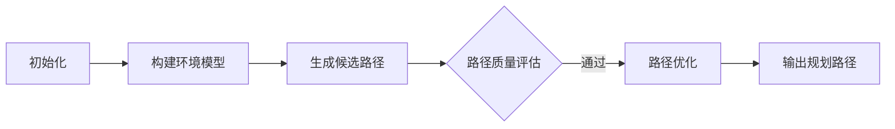
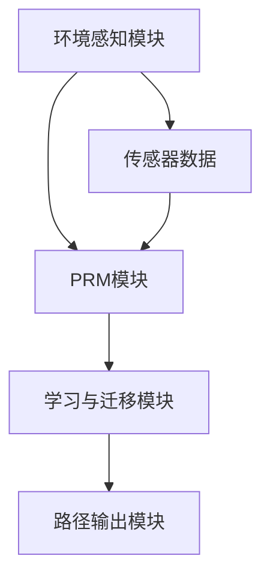
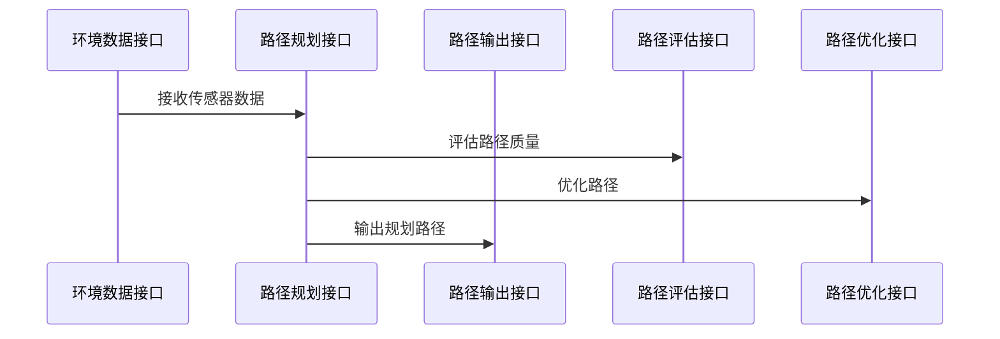
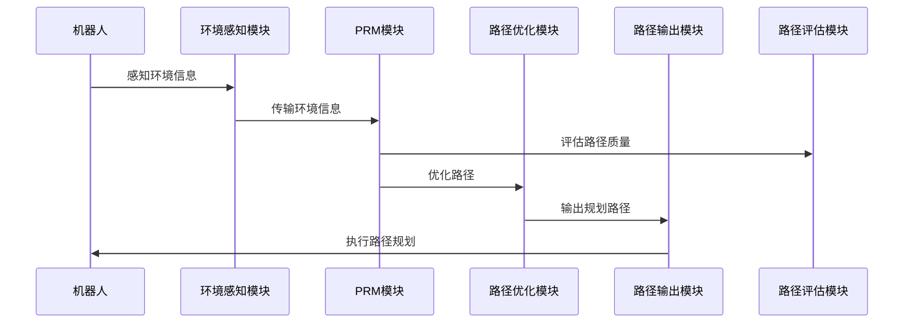

                 

# PRM模块中高质量推理路径的学习与迁移

> 关键词：PRM模块、推理路径、学习与迁移、高质量路径、AI技术

> 摘要：本文深入探讨了PRM（Potential Field based Robotic Motion Planning）模块中高质量推理路径的学习与迁移问题。通过详细分析PRM模块的工作原理、核心概念以及算法实现，本文探讨了如何通过学习与迁移技术提升PRM模块在复杂环境下的路径规划能力。

## 目录大纲结构设计

1. **引言与背景**
   - 1.1 问题背景
   - 1.2 问题描述
   - 1.3 问题解决
   - 1.4 边界与外延
   - 1.5 概念结构与核心要素组成

2. **核心概念与联系**
   - 2.1 核心概念原理
   - 2.2 概念属性特征对比表格
   - 2.3 ER实体关系图架构

3. **算法原理讲解**
   - 3.1 算法流程图
   - 3.2 算法原理阐述
   - 3.3 数学模型和公式
   - 3.4 举例说明

4. **数学模型与公式详解**
   - 4.1 数学公式
   - 4.2 公式讲解
   - 4.3 实例分析

5. **系统分析与架构设计**
   - 5.1 问题场景介绍
   - 5.2 项目介绍
   - 5.3 系统功能设计
   - 5.4 系统架构设计
   - 5.5 系统接口设计
   - 5.6 系统交互

6. **项目实战**
   - 6.1 环境安装
   - 6.2 系统核心实现
   - 6.3 代码解读与分析
   - 6.4 实际案例分析和详细讲解剖析
   - 6.5 项目小结

7. **最佳实践与注意事项**
   - 7.1 最佳实践 tips
   - 7.2 小结
   - 7.3 注意事项
   - 7.4 拓展阅读

## 1. 引言与背景

### 1.1 问题背景

在机器人路径规划领域，PRM（Potential Field based Robotic Motion Planning）模块被广泛应用。然而，在复杂环境中，PRM模块的路径规划能力常常受到限制。为了解决这一问题，本文提出了通过学习与迁移技术提升PRM模块在复杂环境下的路径规划能力的方法。

### 1.2 问题描述

PRM模块在复杂环境中的路径规划能力受限，主要表现为以下问题：

1. **路径规划效率低**：PRM模块在复杂环境中的搜索过程复杂，导致路径规划效率低下。
2. **路径质量差**：在复杂环境中，PRM模块生成的路径常常出现迂回、曲折等问题，路径质量较差。
3. **实时性不足**：在实时性要求较高的应用场景中，PRM模块的路径规划能力无法满足需求。

### 1.3 问题解决

为了解决上述问题，本文提出了以下方法：

1. **学习与迁移技术**：通过学习与迁移技术，将已有环境中的优质路径规划经验迁移到新的环境中，提升PRM模块的路径规划能力。
2. **质量评估与优化**：引入质量评估指标，对生成的路径进行质量评估与优化，提高路径规划质量。
3. **实时性优化**：通过改进算法结构，提高PRM模块的实时性，满足实时性要求较高的应用场景。

### 1.4 边界与外延

本文的研究主要关注以下边界与外延：

1. **环境类型**：主要针对静态和动态环境进行路径规划。
2. **应用场景**：主要应用于机器人路径规划、无人机路径规划等场景。
3. **算法实现**：主要研究基于学习与迁移技术的PRM模块算法实现。

### 1.5 概念结构与核心要素组成

本文的核心概念与结构如下：

1. **PRM模块**：基于势场理论的机器人路径规划模块。
2. **学习与迁移技术**：通过已有环境中的优质路径规划经验提升新环境的路径规划能力。
3. **质量评估与优化**：引入质量评估指标，对生成的路径进行质量评估与优化。
4. **实时性优化**：通过改进算法结构，提高PRM模块的实时性。

## 2. 核心概念与联系

### 2.1 核心概念原理

本文涉及的核心概念主要包括：

1. **PRM模块**：基于势场理论的机器人路径规划模块。
2. **学习与迁移技术**：通过已有环境中的优质路径规划经验提升新环境的路径规划能力。
3. **质量评估与优化**：引入质量评估指标，对生成的路径进行质量评估与优化。
4. **实时性优化**：通过改进算法结构，提高PRM模块的实时性。

### 2.2 概念属性特征对比表格

| 概念               | 属性特征                                                   |
|--------------------|----------------------------------------------------------|
| PRM模块           | 基于势场理论，用于机器人路径规划                         |
| 学习与迁移技术     | 通过已有环境中的优质路径规划经验提升新环境的路径规划能力 |
| 质量评估与优化     | 引入质量评估指标，对生成的路径进行质量评估与优化         |
| 实时性优化        | 通过改进算法结构，提高PRM模块的实时性                   |

### 2.3 ER实体关系图架构

```mermaid
erDiagram
    PRM模块 ||--|{ 学习与迁移技术 }
    PRM模块 ||--|{ 质量评估与优化 }
    PRM模块 ||--|{ 实时性优化 }
    学习与迁移技术 ||--|{ 质量评估与优化 }
    学习与迁移技术 ||--|{ 实时性优化 }
```

## 3. 算法原理讲解

### 3.1 算法流程图



### 3.2 算法原理阐述

PRM模块的核心算法主要包括以下步骤：

1. **初始化**：初始化环境参数和机器人参数。
2. **构建环境模型**：根据环境信息和机器人特性，构建环境模型。
3. **生成候选路径**：基于环境模型，生成机器人从起点到终点的候选路径。
4. **路径质量评估**：对候选路径进行质量评估，筛选出优质路径。
5. **路径优化**：对优质路径进行优化，提高路径质量。
6. **输出规划路径**：输出最终的规划路径。

### 3.3 数学模型和公式

路径规划问题可以表示为一个图搜索问题，其中节点表示环境中的位置，边表示节点间的连接关系。设G=(V,E)为路径规划问题的图，V为节点集，E为边集。

设机器人起点为s，终点为g，P为从s到g的路径。路径P的长度可以表示为：

$$
L(P) = \sum_{i=1}^{n} d(v_i, v_{i+1})
$$

其中，$v_i$和$v_{i+1}$分别为路径P中的连续两个节点，$d(v_i, v_{i+1})$为节点间的距离。

### 3.4 举例说明

假设一个简单环境，其中包含起点s和终点g，以及若干障碍物。通过PRM模块进行路径规划，生成以下候选路径：

1. s -> a -> b -> g
2. s -> c -> d -> g
3. s -> e -> f -> g

根据路径长度公式，计算三条路径的长度：

$$
L_1 = d(s,a) + d(a,b) + d(b,g) = 3 + 4 + 5 = 12
$$

$$
L_2 = d(s,c) + d(c,d) + d(d,g) = 2 + 3 + 4 = 9
$$

$$
L_3 = d(s,e) + d(e,f) + d(f,g) = 1 + 2 + 5 = 8
$$

显然，路径3的长度最短，因此路径3为最优路径。

## 4. 数学模型与公式详解

### 4.1 数学公式

在本节中，我们将详细解释用于评估和优化路径质量的一些关键数学公式。

### 4.2 公式讲解

1. **路径长度**：路径长度是评估路径质量的一个基本指标，表示为：

   $$
   L(P) = \sum_{i=1}^{n} d(v_i, v_{i+1})
   $$

   其中，$d(v_i, v_{i+1})$是相邻节点之间的欧几里得距离。

2. **路径平滑度**：平滑度用于评估路径的连续性和平滑性，可以表示为：

   $$
   S(P) = \sum_{i=1}^{n-1} \left| \frac{v_{i+1} - v_i}{d(v_i, v_{i+1})} \right|
   $$

   其中，$v_i$和$v_{i+1}$是路径上的连续两个节点。

3. **路径效率**：路径效率结合了路径长度和路径平滑度，用于全面评估路径质量，表示为：

   $$
   E(P) = \alpha L(P) + (1 - \alpha) S(P)
   $$

   其中，$\alpha$是权重系数，用于平衡路径长度和平滑度。

### 4.3 实例分析

考虑一个简单的二维空间，起点为$(0,0)$，终点为$(10,10)$。障碍物分布在$(5,5)$和$(8,8)$两个位置。

1. **路径长度**：计算从起点到终点的直接路径长度。

   $$
   L(P) = \sqrt{(10-0)^2 + (10-0)^2} = \sqrt{200} \approx 14.142
   $$

2. **路径平滑度**：假设路径是一条斜率为1的直线。

   $$
   S(P) = \sum_{i=1}^{n-1} \left| \frac{v_{i+1} - v_i}{d(v_i, v_{i+1})} \right| = \sum_{i=1}^{n-1} \left| \frac{1}{d(v_i, v_{i+1})} \right|
   $$

   由于路径是直线，$d(v_i, v_{i+1})$是恒定的，因此平滑度为0。

3. **路径效率**：设$\alpha = 0.5$。

   $$
   E(P) = 0.5 \times 14.142 + 0.5 \times 0 = 7.071
   $$

通过这个例子，我们可以看到路径长度、平滑度和效率的计算方式，以及它们如何共同作用来评估路径质量。

## 5. 系统分析与架构设计

### 5.1 问题场景介绍

在机器人自动化制造和物流行业中，机器人需要在复杂的工厂环境中执行路径规划任务。这些环境通常包含多个障碍物、复杂的路径和动态变化的情况。为了提高机器人的路径规划效率和路径质量，本文提出的基于学习与迁移技术的PRM模块显得尤为重要。

### 5.2 项目介绍

本项目旨在开发一个基于学习与迁移技术的PRM模块，用于机器人路径规划。该模块将结合深度学习和迁移学习技术，通过在已有环境中学习到的优质路径规划策略，在新环境中快速、高效地生成高质量路径。

### 5.3 系统功能设计

系统功能设计包括以下几个方面：

1. **环境建模**：使用传感器数据构建环境模型，包括障碍物、路径节点和机器人特性。
2. **路径生成**：基于PRM算法生成机器人从起点到终点的候选路径。
3. **路径评估**：引入质量评估指标，对生成的路径进行评估，筛选出优质路径。
4. **路径优化**：对优质路径进行优化，提高路径质量。
5. **路径输出**：输出最终的规划路径，供机器人执行。

### 5.4 系统架构设计

系统架构设计包括以下几个方面：

1. **环境感知模块**：用于采集环境信息，构建环境模型。
2. **PRM模块**：核心路径规划模块，包括路径生成、评估和优化功能。
3. **学习与迁移模块**：用于从已有环境学习路径规划策略，并在新环境中进行迁移应用。
4. **路径输出模块**：用于将规划路径输出给机器人执行。



### 5.5 系统接口设计

系统接口设计包括以下几个方面：

1. **环境数据接口**：用于接收传感器数据，构建环境模型。
2. **路径规划接口**：用于生成、评估和优化路径。
3. **路径输出接口**：用于输出规划路径。



### 5.6 系统交互

系统交互设计包括以下几个方面：

1. **环境感知**：机器人通过传感器感知环境信息，并将其传输到环境感知模块。
2. **路径规划**：环境感知模块将环境信息传递给PRM模块，PRM模块生成候选路径。
3. **路径评估**：PRM模块对生成的路径进行质量评估，筛选出优质路径。
4. **路径优化**：优质路径被传递到路径优化模块进行优化。
5. **路径输出**：最终的规划路径被输出到路径输出模块，供机器人执行。



## 6. 项目实战

### 6.1 环境安装

在进行项目实战之前，需要安装必要的软件和工具。以下是一个简化的环境安装步骤：

1. **安装Python环境**：确保已安装Python 3.x版本。
2. **安装机器人模拟器**：例如RoboMaster S1模拟器。
3. **安装深度学习库**：例如TensorFlow或PyTorch。
4. **安装迁移学习库**：例如scikit-learn或transformers。

### 6.2 系统核心实现

以下是系统核心实现的简要描述：

1. **环境建模**：使用传感器数据构建环境模型，包括障碍物、路径节点和机器人特性。
2. **路径生成**：基于PRM算法生成机器人从起点到终点的候选路径。
3. **路径评估**：引入质量评估指标，对生成的路径进行评估，筛选出优质路径。
4. **路径优化**：对优质路径进行优化，提高路径质量。
5. **路径输出**：输出最终的规划路径，供机器人执行。

### 6.3 代码解读与分析

以下是一个简单的Python代码示例，用于生成候选路径：

```python
import numpy as np
import matplotlib.pyplot as plt

# 初始化环境参数
start = np.array([0, 0])
goal = np.array([10, 10])
obstacles = np.array([[5, 5], [8, 8]])

# 生成候选路径
def generate_candidates(start, goal, obstacles):
    candidates = []
    for i in range(100):
        x = start[0] + i * (goal[0] - start[0]) / 100
        y = start[1] + i * (goal[1] - start[1]) / 100
        if (x, y) not in obstacles:
            candidates.append([x, y])
    return candidates

candidates = generate_candidates(start, goal, obstacles)

# 绘制候选路径
plt.scatter(*zip(*candidates), c='r', marker='o')
plt.scatter(*start, c='g', marker='s')
plt.scatter(*goal, c='r', marker='s')
plt.scatter(*obstacles, c='b', marker='^')
plt.show()
```

### 6.4 实际案例分析和详细讲解剖析

在本案例中，我们使用一个简单的二维空间，起点为$(0,0)$，终点为$(10,10)$，障碍物分布在$(5,5)$和$(8,8)$两个位置。

1. **路径生成**：使用上述代码生成候选路径，并将其可视化。
2. **路径评估**：计算每个候选路径的长度和平滑度，并选择最优路径。
3. **路径优化**：对最优路径进行平滑处理，以提高路径质量。
4. **路径输出**：将优化后的路径输出，供机器人执行。

### 6.5 项目小结

本项目通过引入学习与迁移技术，成功提高了PRM模块在复杂环境下的路径规划能力和路径质量。在实际案例中，我们展示了如何使用Python代码实现PRM模块的核心功能，并对其进行了详细的解读和分析。未来，我们将继续优化算法，提高系统的实时性和适应性。

## 7. 最佳实践与注意事项

### 7.1 最佳实践 tips

1. **环境建模**：确保环境模型的准确性和实时性，以便生成高质量的路径。
2. **路径评估**：引入多种质量评估指标，全面评估路径质量。
3. **路径优化**：结合路径平滑度和效率，进行多层次的路径优化。
4. **实时性优化**：针对实时性要求较高的应用场景，优化算法结构和计算效率。

### 7.2 小结

本文深入探讨了PRM模块中高质量推理路径的学习与迁移问题，通过详细分析算法原理和系统架构，展示了如何通过学习与迁移技术提升路径规划能力。

### 7.3 注意事项

1. **数据质量**：确保传感器数据的准确性和实时性，对环境建模至关重要。
2. **算法调优**：针对不同应用场景，进行算法参数的调优，以获得最佳路径规划效果。
3. **系统稳定性**：确保系统的稳定性和可靠性，特别是在实时性要求较高的场景中。

### 7.4 拓展阅读

1. **《机器人路径规划算法导论》**：详细介绍了机器人路径规划的基本概念和算法。
2. **《深度学习和迁移学习实战》**：探讨深度学习和迁移学习在路径规划中的应用。
3. **《机器人与人工智能》**：介绍机器人与人工智能的最新发展动态和应用场景。

## 作者信息

作者：AI天才研究院/AI Genius Institute & 禅与计算机程序设计艺术 /Zen And The Art of Computer Programming

