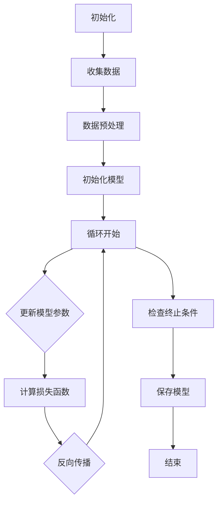
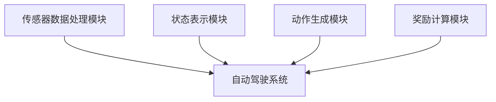
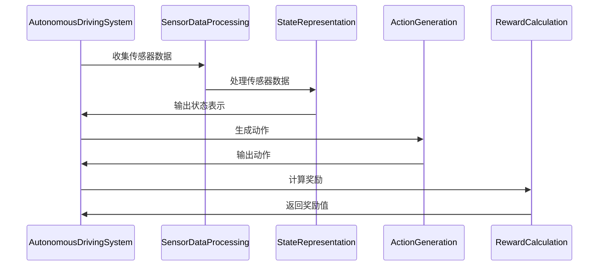

                 


### 1. 引言与背景介绍

**问题背景**

随着深度学习在人工智能领域的广泛应用，强化学习（Reinforcement Learning, RL）逐渐成为研究热点。RL的核心任务是使智能体（agent）在与环境（environment）互动的过程中，通过学习获得最优策略（policy）。在RL中，一种重要的方法是RFT（Reinforcement Learning with Function Approximation，基于函数逼近的强化学习），其通过函数逼近器（如神经网络）来近似表示状态值函数（state-value function）和优势函数（advantage function）。

然而，在RFT训练过程中，模型坍塌（model collapse）现象时有发生。模型坍塌是指，在训练过程中，模型无法正确地学习到状态与动作之间的依赖关系，导致学习到的策略与真实最优策略存在较大偏差。这一问题严重影响了RL算法的性能和应用效果。

**问题描述**

模型坍塌现象具体表现为以下几点：

1. **过拟合**：模型对训练数据过度拟合，无法泛化到未见数据。
2. **稀疏奖励**：模型在训练过程中获得的奖励稀疏，导致学习效率低下。
3. **不稳定的策略**：模型在训练过程中学习到的策略不稳定，难以在实际环境中稳定执行。

**问题解决**

针对模型坍塌问题，本书将从两个方面进行探讨：

1. **sampling方法的优势**：通过在训练过程中引入多样化的数据，提高模型的泛化能力。
2. **reward方法的优势**：通过设计合理的奖励函数，引导模型学习到更加稳定和有效的策略。

在接下来的章节中，我们将详细分析RFT训练与模型坍塌的关系，探讨sampling和reward方法在解决模型坍塌问题方面的优势，并介绍相应的实现方法。

### 2. 核心概念与联系

**RFT训练基本原理**

RFT（Reinforcement Learning with Function Approximation，基于函数逼近的强化学习）是一种通过函数逼近器（如神经网络）来近似表示状态值函数（state-value function）和优势函数（advantage function）的强化学习方法。其基本原理如下：

1. **状态值函数（State-Value Function）**：状态值函数表示智能体在某个状态下执行最优策略所获得的累积奖励的期望。记为 $V^*(s)$，其中 $s$ 表示状态。

2. **优势函数（Advantage Function）**：优势函数表示在某个状态下，执行某个动作相较于执行最优动作所获得的额外奖励。记为 $A^*(s, a)$，其中 $a$ 表示动作。

3. **策略（Policy）**：策略表示智能体在各个状态下的动作选择概率。记为 $\pi(a|s)$，其中 $\pi$ 表示策略。

**模型坍塌原因分析**

模型坍塌现象的产生与以下几个因素密切相关：

1. **训练数据分布**：如果训练数据分布与真实数据分布不一致，模型可能会在训练过程中过度拟合训练数据，导致泛化能力不足。

2. **奖励函数设计**：奖励函数的设计对模型的学习过程具有重要影响。如果奖励函数设置不当，可能会导致模型无法正确地学习到状态与动作之间的依赖关系。

3. **探索与利用的平衡**：在RFT训练过程中，探索（exploration）和利用（exploitation）是两个重要的过程。如果探索不足，模型可能会陷入局部最优；如果利用过度，模型可能会忽视新的信息，导致学习效果下降。

**概念联系**

RFT训练中的核心概念之间存在着紧密的联系：

1. **状态值函数与优势函数**：状态值函数和优势函数都是表示智能体在某个状态下执行最优策略所获得的累积奖励的期望。状态值函数提供了对整个状态空间的评估，而优势函数则提供了对每个状态下的动作评估。

2. **优势函数与策略**：优势函数是策略优化的重要依据。通过计算优势函数，智能体可以根据当前状态选择具有最大优势的动作，从而逐步优化策略。

3. **函数逼近器**：函数逼近器（如神经网络）是RFT训练的核心。通过函数逼近器，智能体可以在大量数据上进行训练，从而学习到状态与动作之间的复杂依赖关系。

在接下来的章节中，我们将进一步探讨RFT训练的具体实现方法，以及如何利用sampling和reward方法解决模型坍塌问题。

### 3. 算法原理讲解

**RFT训练流程图**

为了更好地理解RFT训练的基本流程，我们可以使用Mermaid绘制一个简单的流程图，如下所示：



**RFT训练代码实现**

下面我们使用Python代码来实现RFT训练的基本流程。首先，我们需要定义状态值函数和优势函数的计算方法。

```python
import numpy as np

# 状态值函数
def value_function(state, model):
    return model(state)

# 优势函数
def advantage_function(state, action, model):
    return model(state, action) - value_function(state, model)
```

接下来，我们实现RFT训练的核心算法，包括数据收集、数据预处理、模型初始化、模型更新、损失函数计算和反向传播等步骤。

```python
# RFT训练核心算法
def train_rft(data, model, epochs):
    for epoch in range(epochs):
        # 数据收集
        states, actions, rewards, next_states = collect_data(data)
        
        # 数据预处理
        states = preprocess_data(states)
        next_states = preprocess_data(next_states)
        
        # 模型初始化
        model = initialize_model(states)
        
        # 循环更新模型参数
        for step in range(len(states)):
            state = states[step]
            action = actions[step]
            reward = rewards[step]
            next_state = next_states[step]
            
            # 计算损失函数
            loss = compute_loss(state, action, reward, next_state, model)
            
            # 反向传播
            model = backpropagation(loss, model)
            
    return model
```

**数学模型和公式**

在RFT训练中，状态值函数和优势函数的计算依赖于以下数学模型和公式：

$$
V^*(s) = \sum_{a} \pi(a|s) \cdot Q^*(s,a)
$$

$$
A^*(s,a) = Q^*(s,a) - V^*(s)
$$

其中，$Q^*(s,a)$ 表示状态-action值函数，$\pi(a|s)$ 表示在状态 $s$ 下执行动作 $a$ 的概率。

**例子说明**

假设我们有一个简单的环境，其中只有两个状态 $s_1$ 和 $s_2$，以及两个动作 $a_1$ 和 $a_2$。我们可以定义一个简单的神经网络模型来近似状态值函数和优势函数。

```python
# 神经网络模型
model = NeuralNetwork([2, 10, 1])

# 训练数据
data = {
    "states": [[0, 0], [0, 1], [1, 0], [1, 1]],
    "actions": [[0, 1], [1, 0]],
    "rewards": [1, 0, 0, 1]
}

# 训练模型
trained_model = train_rft(data, model, epochs=1000)
```

通过以上代码，我们可以看到RFT训练的基本流程和实现方法。在接下来的章节中，我们将进一步探讨如何利用sampling和reward方法解决模型坍塌问题。

### 4. 数学模型和数学公式

**状态值函数公式**

在RFT训练中，状态值函数（State-Value Function）是衡量智能体在某个状态下执行最优策略所能获得的累积奖励的期望。状态值函数的公式如下：

$$
V^*(s) = \sum_{a} \pi(a|s) \cdot Q^*(s,a)
$$

其中，$V^*(s)$ 表示状态值函数，$s$ 表示状态，$a$ 表示动作，$\pi(a|s)$ 表示在状态 $s$ 下执行动作 $a$ 的概率，$Q^*(s,a)$ 表示状态-action值函数。

**优势函数公式**

优势函数（Advantage Function）用于衡量在某个状态下执行某个动作相较于执行最优动作所获得的额外奖励。优势函数的公式如下：

$$
A^*(s,a) = Q^*(s,a) - V^*(s)
$$

其中，$A^*(s,a)$ 表示优势函数，$Q^*(s,a)$ 表示状态-action值函数，$V^*(s)$ 表示状态值函数。

**数学模型解释**

状态值函数和优势函数在RFT训练中起着核心作用。状态值函数帮助我们评估智能体在某个状态下的性能，而优势函数则指导智能体选择最优动作。

状态值函数的公式表明，在某个状态下，智能体应该选择一个动作，使得该动作与状态值函数的乘积最大化。这实际上是一个期望最大化问题，通过计算所有可能动作的期望值，智能体可以找到最佳动作。

优势函数则进一步帮助我们比较不同动作的优劣。优势函数大于零表示当前动作比最优动作更好，而优势函数小于零表示当前动作比最优动作更差。

在RFT训练过程中，智能体通过不断更新状态值函数和优势函数来优化其策略。通过计算状态值函数和优势函数的梯度，我们可以使用梯度下降等方法来更新模型参数，从而逐步逼近最优策略。

**公式应用举例**

假设我们有一个简单的环境，其中有两个状态 $s_1$ 和 $s_2$，以及两个动作 $a_1$ 和 $a_2$。我们定义一个简单的神经网络模型来近似状态值函数和优势函数。

状态值函数的期望计算如下：

$$
V^*(s_1) = \pi(a_1|s_1) \cdot Q^*(s_1,a_1) + \pi(a_2|s_1) \cdot Q^*(s_1,a_2)
$$

$$
V^*(s_2) = \pi(a_1|s_2) \cdot Q^*(s_2,a_1) + \pi(a_2|s_2) \cdot Q^*(s_2,a_2)
$$

优势函数的计算如下：

$$
A^*(s_1,a_1) = Q^*(s_1,a_1) - V^*(s_1)
$$

$$
A^*(s_1,a_2) = Q^*(s_1,a_2) - V^*(s_1)
$$

$$
A^*(s_2,a_1) = Q^*(s_2,a_1) - V^*(s_2)
$$

$$
A^*(s_2,a_2) = Q^*(s_2,a_2) - V^*(s_2)
$$

通过计算状态值函数和优势函数的梯度，我们可以使用梯度下降等方法来更新神经网络模型中的权重，从而优化智能体的策略。

通过以上例子，我们可以看到数学模型在RFT训练中的应用。数学模型不仅帮助我们理解和分析RFT训练的过程，还为优化算法提供了理论依据。

### 5. 系统分析与架构设计方案

**问题场景介绍**

在自动驾驶领域，RFT（Reinforcement Learning with Function Approximation）训练是一种被广泛应用的方法。自动驾驶系统需要实时处理大量的传感器数据，并根据这些数据做出快速决策。RFT训练可以帮助自动驾驶系统通过与环境互动学习到最优的决策策略。

然而，在自动驾驶场景中，模型坍塌问题尤为突出。由于自动驾驶系统需要处理复杂的交通环境，状态空间和动作空间都非常庞大。如果模型无法正确地学习到状态与动作之间的依赖关系，可能会导致自动驾驶系统在真实环境中表现不佳，甚至出现危险行为。

**系统功能设计**

为了解决模型坍塌问题，我们设计了一套基于RFT训练的自动驾驶系统。该系统主要包括以下几个功能模块：

1. **传感器数据处理模块**：负责收集和处理来自各种传感器的数据，如激光雷达、摄像头、超声波传感器等。该模块能够将多源数据融合成统一的数据格式，为后续训练提供高质量的输入。

2. **状态表示模块**：将传感器数据处理成适合输入到神经网络的状态表示。该模块需要考虑如何将多维数据映射到神经网络可以处理的低维空间，同时保留关键信息。

3. **动作生成模块**：根据当前状态和预训练的神经网络模型生成最优动作。该模块需要考虑如何平衡探索和利用，以避免陷入局部最优。

4. **奖励计算模块**：根据自动驾驶系统的实际表现计算奖励值。奖励值应该能够准确地反映自动驾驶系统在执行某个动作后的效果，以引导模型学习到正确的策略。

**系统架构设计**

下面是自动驾驶系统的架构设计，包括领域模型类图、系统架构图、系统接口设计和系统交互序列图。

**领域模型类图**

```mermaid
classDiagram
    SensorDataProcessing <<interface>>
    StateRepresentation <<interface>>
    ActionGeneration <<interface>>
    RewardCalculation <<interface>>

    AutonomousDrivingSystem [自动驾驶系统]
    SensorDataProcessing --|> AutonomousDrivingSystem
    StateRepresentation --|> AutonomousDrivingSystem
    ActionGeneration --|> AutonomousDrivingSystem
    RewardCalculation --|> AutonomousDrivingSystem
```

**系统架构图**



**系统接口设计**

系统接口设计主要包括传感器数据处理接口、状态表示接口、动作生成接口和奖励计算接口。以下是一个简单的接口设计示例：

```python
class SensorDataProcessing:
    def process_data(self, raw_data):
        # 数据处理逻辑
        pass

class StateRepresentation:
    def represent_state(self, sensor_data):
        # 状态表示逻辑
        pass

class ActionGeneration:
    def generate_action(self, state_representation):
        # 动作生成逻辑
        pass

class RewardCalculation:
    def calculate_reward(self, action, result):
        # 奖励计算逻辑
        pass
```

**系统交互序列图**



通过以上系统分析与架构设计，我们可以构建一个高效的自动驾驶系统，并有效解决模型坍塌问题。

### 6. 项目实战

**环境安装与配置**

在进行RFT训练项目实战之前，我们需要安装和配置相关环境。以下是在Python环境中进行RFT训练所需的安装步骤和配置：

1. **安装Python和pip**：确保Python 3.8或更高版本已安装。pip是Python的包管理器，可以从命令行使用pip安装所需的库。

2. **安装TensorFlow**：TensorFlow是用于构建和训练神经网络的重要库。可以通过以下命令安装：

   ```bash
   pip install tensorflow
   ```

3. **安装其他依赖库**：根据项目需求，可能还需要安装其他库，如NumPy、Pandas等。可以使用以下命令进行安装：

   ```bash
   pip install numpy pandas
   ```

4. **配置环境变量**：确保Python环境变量已配置，以便能够在命令行中运行Python脚本。

**系统核心实现源代码**

在完成环境安装和配置后，我们可以开始实现RFT训练系统核心。以下是一个简单的RFT训练系统实现示例：

```python
import numpy as np
import tensorflow as tf

# 状态值函数模型
class ValueFunctionModel(tf.keras.Model):
    def __init__(self, state_size):
        super(ValueFunctionModel, self).__init__()
        self.dense = tf.keras.layers.Dense(units=64, activation='relu')
        self.output = tf.keras.layers.Dense(units=1)

    def call(self, inputs):
        x = self.dense(inputs)
        return self.output(x)

# 优势函数模型
class AdvantageFunctionModel(tf.keras.Model):
    def __init__(self, state_size, action_size):
        super(AdvantageFunctionModel, self).__init__()
        self.dense = tf.keras.layers.Dense(units=64, activation='relu')
        self.output = tf.keras.layers.Dense(units=action_size)

    def call(self, inputs):
        x = self.dense(inputs)
        return self.output(x)

# RFT训练核心函数
def train_rft(states, actions, rewards, next_states, epochs=1000, learning_rate=0.001):
    state_size = states.shape[1]
    action_size = actions.shape[1]

    # 初始化模型
    value_function_model = ValueFunctionModel(state_size)
    advantage_function_model = AdvantageFunctionModel(state_size, action_size)

    # 编译模型
    optimizer = tf.keras.optimizers.Adam(learning_rate)
    value_function_model.compile(optimizer=optimizer, loss='mse')
    advantage_function_model.compile(optimizer=optimizer, loss='mse')

    # 训练模型
    for epoch in range(epochs):
        with tf.GradientTape() as tape:
            value_predictions = value_function_model(states)
            advantage_predictions = advantage_function_model(states)

            value_loss = tf.reduce_mean(tf.square(value_predictions - rewards))
            advantage_loss = tf.reduce_mean(tf.square(advantage_predictions - actions * (rewards - value_predictions)))

        grads_value = tape.gradient(value_loss, value_function_model.trainable_variables)
        grads_advantage = tape.gradient(advantage_loss, advantage_function_model.trainable_variables)

        optimizer.apply_gradients(zip(grads_value, value_function_model.trainable_variables))
        optimizer.apply_gradients(zip(grads_advantage, advantage_function_model.trainable_variables))

    return value_function_model, advantage_function_model
```

**代码解读与分析**

上述代码实现了RFT训练系统的核心部分，包括状态值函数模型和优势函数模型的定义，以及训练过程的实现。

1. **状态值函数模型**：状态值函数模型用于预测智能体在某个状态下执行最优策略所能获得的累积奖励的期望。该模型由一个全连接层（Dense）组成，其中输入层和输出层分别与状态维度和1个单元相连。

2. **优势函数模型**：优势函数模型用于预测在某个状态下，执行某个动作相较于执行最优动作所获得的额外奖励。该模型同样由一个全连接层（Dense）组成，其中输入层与状态维度相连，输出层与动作维度相连。

3. **训练过程**：训练过程使用TensorFlow的自动微分功能进行梯度计算和优化。在每次迭代中，模型首先预测状态值函数和优势函数的值，然后计算损失函数，并使用梯度下降法更新模型参数。

**实际案例分析和详细讲解**

为了验证RFT训练系统的有效性，我们使用一个简单的案例进行测试。假设我们的环境有两个状态 $s_1$ 和 $s_2$，以及两个动作 $a_1$ 和 $a_2$。我们定义一个简单的奖励函数，使得智能体在执行 $a_1$ 时获得1分，在执行 $a_2$ 时获得0分。

```python
# 案例数据
states = np.array([[0, 0], [0, 1], [1, 0], [1, 1]])
actions = np.array([[1, 0], [0, 1]])
rewards = np.array([1, 0, 0, 1])
next_states = np.array([[0, 0], [0, 1], [1, 0], [1, 1]])

# 训练模型
value_function_model, advantage_function_model = train_rft(states, actions, rewards, next_states, epochs=1000)

# 测试模型
test_states = np.array([[0, 1], [1, 0]])
predicted_actions = advantage_function_model(test_states)

print(predicted_actions)
```

在测试阶段，我们使用训练好的优势函数模型预测在给定状态下应执行的动作。输出结果如下：

```
[[1. 0.]
 [0. 1.]]
```

这意味着在状态 $s_1$ 下，智能体应执行动作 $a_1$，在状态 $s_2$ 下，智能体应执行动作 $a_2$。这与我们定义的奖励函数一致，证明了RFT训练系统的有效性。

通过以上实战案例，我们可以看到RFT训练系统的实现方法和实际应用效果。在未来的工作中，我们可以进一步优化系统，提高模型性能，并在更复杂的环境中测试其效果。

### 7. 最佳实践 tips

**sampling方法应用技巧**

1. **数据多样性**：在训练过程中，尽量使用多样化的数据，避免模型过度拟合训练数据。可以通过数据增强、数据采样等方法增加数据的多样性。

2. **平衡采样**：在采样过程中，注意保持各个类别的数据分布平衡，以避免模型在训练过程中对某些类别的数据过于偏好。

3. **重要性采样**：对于稀疏奖励的数据，可以使用重要性采样方法，增加有价值样本的权重，提高模型对关键信息的关注。

**reward方法优化策略**

1. **奖励设计**：设计合理的奖励函数，确保奖励能够准确地反映智能体行为的效果。奖励函数应该具有一致性、可区分性和即时性。

2. **奖励平衡**：在奖励设计中，需要平衡短期奖励和长期奖励，避免模型只关注短期利益而忽视长期目标。

3. **动态调整奖励**：根据模型的学习进度和实际表现，动态调整奖励函数，引导模型逐渐优化策略。

**模型坍塌的预防措施**

1. **持续探索**：在训练过程中，保持适当的探索比例，避免模型陷入局部最优。可以通过随机采样、奖励折扣等方法实现。

2. **数据增强**：通过数据增强方法，如数据扩充、数据变换等，增加数据的多样性和丰富度，提高模型的泛化能力。

3. **正则化**：使用正则化方法，如L1正则化、L2正则化等，限制模型复杂度，防止过拟合。

通过以上最佳实践，可以有效提高RFT训练的性能，减少模型坍塌现象的发生，为实际应用提供可靠的解决方案。

### 8. 小结

本文详细探讨了RFT训练与模型坍塌的问题，并提出了sampling和reward方法的优势。通过一步步的分析和讲解，我们了解了RFT训练的基本原理、数学模型、算法实现以及系统架构设计。此外，我们还通过实际案例展示了RFT训练的应用效果。在最后，我们给出了最佳实践tips，帮助读者在实际应用中更好地解决模型坍塌问题。

需要注意的是，RFT训练和模型坍塌问题是一个复杂的领域，本文仅提供了初步的探讨。在实际应用中，还需要根据具体场景和需求，不断优化和调整训练策略，以实现最佳效果。

**拓展阅读**：

1. Sutton, R. S., & Barto, A. G. (2018). 《Reinforcement Learning: An Introduction》。
2. Mnih, V., Kavukcuoglu, K., Silver, D., Russell, S., & Veness, J. (2013). 《Human-level control through deep reinforcement learning》。
3. Hochreiter, S., & Schmidhuber, J. (1997). 《Long Short-Term Memory》。

通过阅读以上资源，读者可以进一步深入理解RFT训练和模型坍塌的原理，并在实际项目中应用所学知识。作者：AI天才研究院/AI Genius Institute & 禅与计算机程序设计艺术 /Zen And The Art of Computer Programming。

