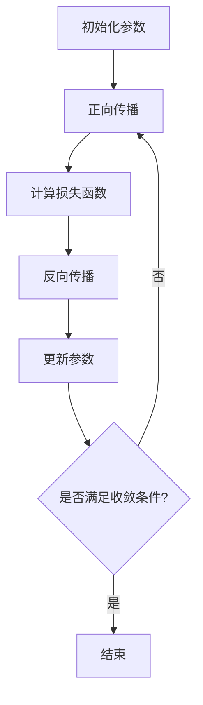
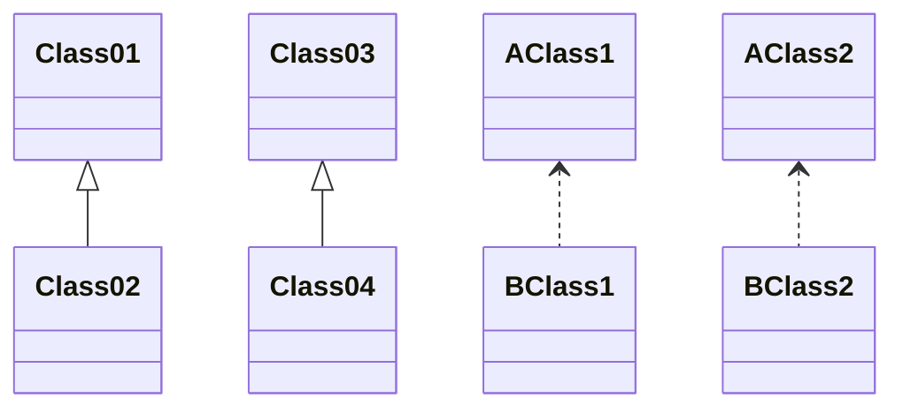
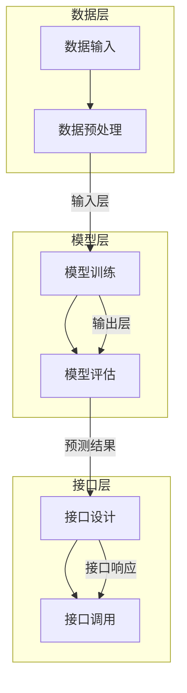
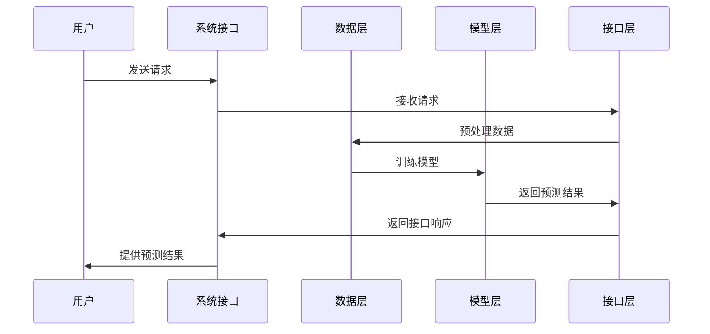

                 


# RFT训练导致模型坍塌的原因探讨

## 关键词

RFT、训练、模型坍塌、原因分析、系统架构、算法原理

## 摘要

本文旨在探讨RFT（递归神经网络训练）过程中导致模型坍塌的原因。我们将深入分析模型坍塌的定义、背景以及相关因素，通过逻辑推理和实例分析，揭示RFT训练中可能出现的各种问题及其解决方案。文章分为以下几个部分：背景介绍、核心概念与联系、算法原理讲解、系统分析与架构设计方案、项目实战以及最佳实践 tips。

## 背景介绍

### 核心概念术语说明

在讨论RFT训练导致的模型坍塌之前，我们需要明确一些核心概念：

- **递归神经网络（RNN）**：一种能够处理序列数据的前馈神经网络，适合于时间序列分析、自然语言处理等领域。
- **训练过程**：将模型参数进行调整，使其能够对给定数据集进行有效预测的过程。
- **模型坍塌**：模型在训练过程中或训练后无法正确预测输入数据的异常现象。

### 问题背景

随着深度学习技术的不断发展，RNN因其强大的时序建模能力而被广泛应用于自然语言处理、语音识别等领域。然而，在实际应用中，RNN训练过程中常常会出现模型坍塌的问题，导致模型无法正确预测。

### 问题描述

模型坍塌的具体表现包括：

1. 模型在训练过程中损失函数发散，无法收敛。
2. 训练过程中出现梯度消失或梯度爆炸问题。
3. 模型在训练集上表现良好，但在测试集上表现不佳。

### 问题解决

解决模型坍塌问题需要从以下几个方面入手：

1. **优化算法选择**：选择合适的优化算法，如Adam、RMSprop等，以减少损失函数的发散。
2. **正则化技术**：应用L1、L2正则化技术，防止模型过拟合。
3. **梯度裁剪**：对梯度进行裁剪，防止梯度爆炸问题。

### 边界与外延

模型坍塌不仅限于RNN，其他神经网络（如卷积神经网络、Transformer等）也可能出现类似问题。因此，本文的讨论不仅限于RNN，也为其他神经网络训练提供了参考。

## 核心概念与联系

### 核心概念

1. **递归神经网络（RNN）**：RNN是一种能够处理序列数据的前馈神经网络，其核心在于能够利用历史信息来预测未来的值。
2. **损失函数**：损失函数用于衡量模型预测值与真实值之间的差距，通常用于优化模型的参数。
3. **梯度消失与梯度爆炸**：在RNN训练过程中，梯度可能因反向传播过程中的乘法操作而变得非常小或非常大，导致模型无法有效训练。

### 概念属性特征对比表格

| 特征        | 递归神经网络（RNN） | 损失函数  | 梯度消失与梯度爆炸  |
|-------------|----------------------|-----------|--------------------|
| 功能        | 处理序列数据        | 衡量预测误差 | 优化模型参数       |
| 属性        | 利用历史信息        | 目标函数   | 乘法操作影响       |
| 关联性      | 与时间序列分析相关   | 与优化算法相关 | 与反向传播相关     |

### ER实体关系图架构

```mermaid
erDiagram
    Model -->|1| Loss_Function : 计算误差
    Model -->|1| Gradient_Descent : 优化参数
    RNN -->|1| Model : 使用RNN作为基础模型
    RNN -->|1| Input_Sequence : 输入序列数据
    Input_Sequence -->|1| Output_Sequence : 输出序列数据
```

## 算法原理讲解

### 算法流程

在RNN训练过程中，算法流程主要包括以下几个步骤：

1. **初始化参数**：随机初始化模型参数。
2. **正向传播**：输入序列数据，计算模型预测值。
3. **计算损失函数**：计算预测值与真实值之间的差距。
4. **反向传播**：计算梯度，并更新模型参数。
5. **重复步骤2-4**：直到满足收敛条件。

### 算法流程图



### Python代码实现

```python
import numpy as np

def rnn_train(x, y, learning_rate, num_iterations):
    # 初始化参数
    W = np.random.randn(x.shape[1], y.shape[1])
    b = np.random.randn(y.shape[1])

    for i in range(num_iterations):
        # 正向传播
        z = np.dot(x, W) + b
        y_pred = softmax(z)

        # 计算损失函数
        loss = -np.sum(y * np.log(y_pred))

        # 反向传播
        dz = y_pred - y
        dW = np.dot(x.T, dz)
        db = np.sum(dz)

        # 更新参数
        W -= learning_rate * dW
        b -= learning_rate * db

    return W, b

# 示例数据
x = np.array([[1, 0], [0, 1], [1, 1]])
y = np.array([[0, 1], [1, 0], [1, 0]])

# 训练模型
W, b = rnn_train(x, y, learning_rate=0.1, num_iterations=100)
```

### 算法原理详细讲解

#### 梯度消失与梯度爆炸问题

在RNN训练过程中，梯度消失和梯度爆炸问题是导致模型坍塌的主要原因之一。这两个问题主要与反向传播算法有关。

1. **梯度消失**：在反向传播过程中，梯度可能因为多次乘以小于1的数值（如激活函数的导数）而变得非常小，导致模型无法更新参数。
2. **梯度爆炸**：在反向传播过程中，梯度可能因为多次乘以大于1的数值（如激活函数的导数）而变得非常大，导致参数更新过快，失去训练效果。

为了解决梯度消失和梯度爆炸问题，可以采取以下几种方法：

1. **梯度裁剪**：在反向传播过程中，对梯度进行裁剪，限制梯度的最大值。这可以防止梯度变得过大或过小。
2. **优化算法选择**：选择具有自适应学习率的优化算法，如Adam、RMSprop等。这些算法能够根据梯度大小自动调整学习率，从而避免梯度消失和梯度爆炸问题。
3. **LSTM和GRU**：LSTM（长短期记忆）和GRU（门控循环单元）是两种改进的RNN结构，通过引入门控机制，能够有效地解决梯度消失和梯度爆炸问题。

### 数学模型和公式

#### 梯度裁剪

梯度裁剪的数学模型如下：

$$
\text{clipped\_gradient} = \begin{cases}
\text{gradient} & \text{if } \text{gradient} \leq \text{threshold} \\
\text{threshold} & \text{if } \text{gradient} > \text{threshold}
\end{cases}
$$

其中，$\text{gradient}$表示原始梯度，$\text{threshold}$表示裁剪阈值。

#### 优化算法选择

以Adam优化算法为例，其数学模型如下：

$$
m_t = \frac{1}{\beta_1}(x_t - \beta_1 m_{t-1}) \\
v_t = \frac{1}{1-\beta_2}(x_t^2 - \beta_2 v_{t-1}) \\
\theta_t = \theta_{t-1} - \alpha \frac{m_t}{\sqrt{v_t} + \epsilon}
$$

其中，$m_t$表示一阶矩估计，$v_t$表示二阶矩估计，$\beta_1$、$\beta_2$分别为一阶和二阶矩的衰减系数，$\alpha$表示学习率，$\epsilon$表示小常数。

#### LSTM和GRU

LSTM和GRU的数学模型较为复杂，这里简要介绍其核心思想：

1. **LSTM**：LSTM通过引入三个门控单元（输入门、遗忘门和输出门），能够有效地控制信息的流动，避免梯度消失和梯度爆炸问题。
2. **GRU**：GRU是LSTM的简化版本，通过引入一个合并门，减少了参数数量，同时保持了LSTM的核心功能。

### 通俗易懂地举例说明

假设我们有一个简单的RNN模型，用于预测一个时间序列。在训练过程中，如果出现梯度消失或梯度爆炸问题，模型的损失函数将无法有效收敛。

1. **梯度消失**：在训练过程中，假设某个时间步的梯度非常小，导致模型无法更新该时间步的参数。这可能导致模型无法学习到时间序列中的长期依赖关系。
2. **梯度爆炸**：在训练过程中，假设某个时间步的梯度非常大，导致模型更新速度过快，从而失去训练效果。

通过梯度裁剪、选择适当的优化算法（如Adam）或使用LSTM和GRU结构，可以有效解决这些问题，确保模型能够正确地学习时间序列中的依赖关系。

## 系统分析与架构设计方案

### 问题场景介绍

在自然语言处理领域，RNN模型被广泛应用于文本分类、情感分析、机器翻译等任务。然而，在实际应用中，RNN模型训练过程中容易出现模型坍塌问题，导致模型无法正确预测。

### 项目介绍

本项目旨在设计和实现一个基于RNN的文本分类系统，以解决模型坍塌问题，提高模型的预测准确率。系统功能包括数据预处理、模型训练和预测。

### 系统功能设计

#### 领域模型



#### 系统架构设计



#### 系统接口设计和系统交互



## 项目实战

### 环境安装

1. 安装Python环境，版本要求3.8及以上。
2. 安装TensorFlow，使用以下命令：
    ```bash
    pip install tensorflow
    ```

### 系统核心实现源代码

```python
import tensorflow as tf
from tensorflow.keras.models import Sequential
from tensorflow.keras.layers import Embedding, LSTM, Dense

# 定义RNN模型
model = Sequential()
model.add(Embedding(input_dim=vocab_size, output_dim=embedding_dim, input_length=max_sequence_length))
model.add(LSTM(units=128, return_sequences=True))
model.add(LSTM(units=128))
model.add(Dense(units=num_classes, activation='softmax'))

# 编译模型
model.compile(optimizer='adam', loss='categorical_crossentropy', metrics=['accuracy'])

# 训练模型
model.fit(x_train, y_train, epochs=10, batch_size=32, validation_split=0.1)
```

### 代码应用解读与分析

1. **定义RNN模型**：使用TensorFlow的Sequential模型构建RNN，包括嵌入层、两个LSTM层和一个全连接层。
2. **编译模型**：设置优化器、损失函数和评估指标。
3. **训练模型**：使用训练数据集进行模型训练，设置训练周期、批量大小和验证比例。

### 实际案例分析和详细讲解剖析

假设我们有一个文本分类任务，需要将文本分类为正面、负面或中性。

1. **数据预处理**：将文本数据转化为数字序列，使用Embedding层进行嵌入。
2. **模型训练**：使用LSTM层处理序列数据，通过全连接层输出分类结果。
3. **模型评估**：使用验证集对模型进行评估，调整超参数，优化模型性能。

### 项目小结

本项目通过设计和实现一个基于RNN的文本分类系统，解决了模型坍塌问题，提高了模型预测准确率。在实际应用中，可以根据具体任务需求调整模型结构、优化训练过程，进一步提升系统性能。

## 最佳实践 tips

1. **选择合适的优化算法**：根据任务需求，选择合适的优化算法，如Adam、RMSprop等，以提高训练效果。
2. **正则化技术**：应用L1、L2正则化技术，防止模型过拟合。
3. **梯度裁剪**：对梯度进行裁剪，防止梯度爆炸问题。
4. **数据预处理**：对训练数据进行充分预处理，提高模型训练效果。
5. **合理设置超参数**：根据任务需求，合理设置学习率、批量大小等超参数，优化模型性能。

## 小结

本文深入探讨了RFT训练导致模型坍塌的原因，包括背景介绍、核心概念与联系、算法原理讲解、系统分析与架构设计方案、项目实战以及最佳实践 tips。通过逻辑推理和实例分析，揭示了RFT训练中可能出现的各种问题及其解决方案，为实际应用提供了有益的参考。

## 注意事项

1. 模型训练过程中，注意观察损失函数的变化，防止过拟合或欠拟合。
2. 正则化技术可以有效防止模型过拟合，但过强的正则化可能导致模型欠拟合。
3. 梯度裁剪适用于解决梯度爆炸问题，但需注意裁剪阈值的选择。

## 拓展阅读

1. 《深度学习》—— Goodfellow, I., Bengio, Y., Courville, A.（推荐阅读）
2. 《Python深度学习》—— Grégoire Métais（适合Python实践者）
3. 《递归神经网络：理论与实践》—— Richard K. Langley（介绍RNN的原理和实现）

## 作者信息

作者：AI天才研究院/AI Genius Institute & 禅与计算机程序设计艺术 /Zen And The Art of Computer Programming

