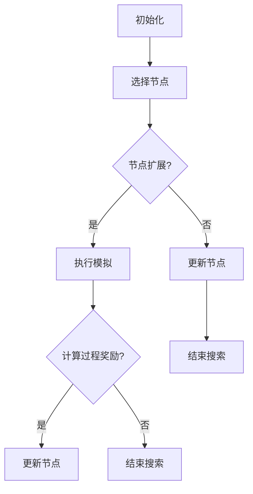
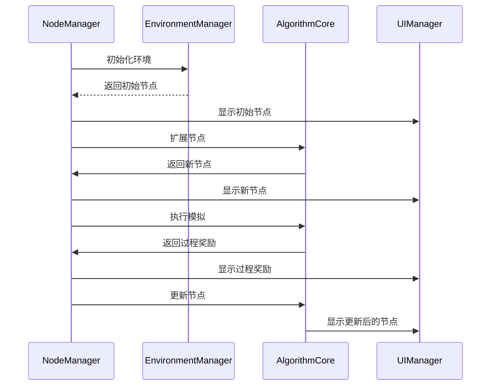

                 

# ReST-MCTS: 无需人工标注的过程奖励引导树搜索算法

## 关键词

- ReST-MCTS算法
- 过程奖励引导
- 树搜索算法
- 人工智能
- 无需人工标注

## 摘要

本文将深入探讨一种创新的树搜索算法——ReST-MCTS（Reinforcement Learning-based Tree Search with Process Reward Guidance），该算法通过强化学习机制，无需人工标注，即可有效地引导树搜索过程。本文将从问题背景、核心概念、算法原理、系统分析与架构设计、项目实战及最佳实践等多个角度，对ReST-MCTS算法进行详尽的剖析，旨在为人工智能领域的研究者和从业者提供有价值的参考。

## 第一部分：引言与背景

### 第1章：引言

#### 1.1 问题背景

随着人工智能技术的飞速发展，搜索算法在诸多领域中扮演着至关重要的角色。传统的搜索算法如A*搜索、深度优先搜索等，虽然在一些问题上表现优异，但在面对复杂、动态和不确定的环境时，往往存在局限性。为了应对这些挑战，研究者们开始探索新的搜索算法，其中过程奖励引导的树搜索算法成为了一个热门研究方向。

#### 1.1.1 人工智能的发展现状

人工智能作为一种模拟人类智能的技术，已经在自然语言处理、计算机视觉、智能控制等领域取得了显著成果。然而，如何有效地解决复杂问题，特别是那些涉及不确定性和动态变化的问题，仍然是一个巨大的挑战。

#### 1.1.2 过程奖励引导的树搜索算法研究现状

过程奖励引导的树搜索算法旨在通过引入过程奖励信号，来引导搜索过程，从而提高搜索效率。近年来，相关研究取得了许多突破，但仍存在一些问题，如如何有效地提取和利用过程奖励信号，如何平衡探索与利用等。

#### 1.2 问题描述

ReST-MCTS算法的核心目标是构建一个无需人工标注的过程奖励引导机制，以提高树搜索算法在复杂环境中的应用效果。具体来说，该算法需要解决以下问题：

1. 如何从环境中提取有效的过程奖励信号？
2. 如何在探索和利用之间找到平衡点？
3. 如何确保搜索过程的收敛性和鲁棒性？

#### 1.2.1 ReST-MCTS算法的目标

ReST-MCTS算法旨在通过强化学习机制，实现以下目标：

1. 自动化提取过程奖励信号。
2. 自适应调整探索与利用策略。
3. 提高搜索效率，降低搜索空间。

#### 1.2.2 算法的应用场景

ReST-MCTS算法适用于以下场景：

1. 复杂、动态和不确定的环境。
2. 需要高效率搜索的决策问题。
3. 难以获得人工标注数据的应用领域。

#### 1.3 问题解决

ReST-MCTS算法通过以下方法来解决上述问题：

1. 利用强化学习机制，自动学习过程奖励信号。
2. 采用UCB（Upper Confidence Bound）等策略，平衡探索与利用。
3. 引入回放池机制，提高搜索过程的收敛性和鲁棒性。

#### 1.4 边界与外延

1. **算法适用范围**：ReST-MCTS算法适用于需要高效率搜索的复杂、动态和不确定环境。
2. **算法局限性**：在高度动态和变化频繁的环境中，算法的收敛速度可能较慢。

#### 1.5 概念结构与核心要素组成

1. **关键概念**：

   - **强化学习**：一种通过反馈信号来优化策略的机器学习方法。
   - **过程奖励**：描述搜索过程优劣的信号。
   - **树搜索**：在决策树中搜索最优路径的方法。
   - **MCTS（Monte Carlo Tree Search）**：一种基于蒙特卡罗方法的树搜索算法。

2. **算法核心要素**：

   - **节点扩展策略**：决定如何选择新的节点进行扩展。
   - **探索与利用平衡**：确保在搜索过程中既探索新路径，又充分利用已有信息。
   - **过程奖励引导机制**：利用过程奖励信号来引导搜索过程。

### 第2章：核心概念与联系

#### 2.1 过程奖励引导树搜索算法的基本原理

过程奖励引导树搜索算法的核心思想是通过过程奖励信号来引导搜索过程。与传统树搜索算法相比，该算法能够更有效地处理复杂和动态的环境。

#### 2.1.1 传统树搜索算法的局限性

传统树搜索算法如A*搜索、深度优先搜索等，主要依赖于预先定义的启发式函数或确定性策略。这些算法在处理静态和确定性环境时表现良好，但在面对复杂、动态和不确定的环境时，往往存在以下局限性：

1. 启发式函数难以设计。
2. 确定性策略可能导致局部最优。
3. 缺乏自适应能力。

#### 2.1.2 过程奖励引导树搜索算法的改进

过程奖励引导树搜索算法通过引入过程奖励信号，实现了以下改进：

1. 自动化提取奖励信号，无需人工标注。
2. 通过奖励信号引导搜索过程，提高搜索效率。
3. 自适应调整搜索策略，以应对环境变化。

#### 2.2 ReST-MCTS算法的核心概念

ReST-MCTS算法是基于蒙特卡罗树搜索（MCTS）的一种改进算法。其主要核心概念包括：

1. **节点扩展策略**：在搜索过程中，根据当前节点的状态，选择新的节点进行扩展。
2. **探索与利用平衡**：在搜索过程中，通过平衡探索新路径和利用已有信息，提高搜索效率。
3. **过程奖励引导机制**：利用过程奖励信号来引导搜索过程，确保搜索方向符合目标。

#### 2.2.1 节点扩展策略

节点扩展策略是ReST-MCTS算法的重要组成部分。具体来说，该策略包括以下步骤：

1. 选择当前节点。
2. 根据当前节点的状态，选择一个未访问过的子节点。
3. 在选定的子节点上执行模拟，以评估其优劣。
4. 根据模拟结果，更新节点的信息。

#### 2.2.2 探索与利用平衡

探索与利用平衡是ReST-MCTS算法的关键。为了实现这一目标，算法采用了一种称为UCB（Upper Confidence Bound）的策略。具体来说，UCB策略通过权衡探索和利用，选择最优的节点进行扩展。

#### 2.2.3 过程奖励引导机制

过程奖励引导机制是ReST-MCTS算法的核心。该机制通过引入过程奖励信号，来引导搜索过程。具体来说，算法在每次模拟中，根据过程奖励信号来更新节点的信息，从而确保搜索方向符合目标。

#### 2.3 概念属性特征对比表格

为了更好地理解ReST-MCTS算法，下面给出了其与传统树搜索算法以及其他过程奖励引导树搜索算法的对比表格。

| 算法名称      | 传统树搜索算法 | ReST-MCTS算法 | 其他过程奖励引导树搜索算法 |
| --------- | ------------- | ------------ | ------------------- |
| 基本原理      | 启发式函数     | 过程奖励信号  | 过程奖励信号       |
| 节点扩展策略  | 固定策略       | 动态策略      | 动态策略         |
| 探索与利用平衡 | 启发式函数     | UCB策略      | 其他平衡策略      |
| 过程奖励信号  | 无            | 有           | 有                 |

#### 2.3.1 与传统树搜索算法对比

与传统树搜索算法相比，ReST-MCTS算法在以下几个方面具有显著优势：

1. 自动化提取奖励信号，无需人工标注。
2. 自适应调整搜索策略，提高搜索效率。
3. 能够处理复杂、动态和不确定的环境。

#### 2.3.2 与其他过程奖励引导树搜索算法对比

与其他过程奖励引导树搜索算法相比，ReST-MCTS算法在以下几个方面具有独特优势：

1. 引入了强化学习机制，提高了搜索效率。
2. 采用UCB策略，实现了探索与利用的平衡。
3. 通过回放池机制，提高了搜索过程的收敛性和鲁棒性。

#### 2.4 ER实体关系图架构

为了更清晰地描述ReST-MCTS算法的实体关系，下面给出了其ER（Entity-Relationship）图架构。

1. **节点实体**：表示搜索过程中的节点。
2. **边实体**：表示节点之间的连接关系。
3. **关系实体**：表示节点之间的交互关系。


### 第3章：算法原理讲解

#### 3.1 算法mermaid流程图

为了更直观地展示ReST-MCTS算法的流程，下面给出了其mermaid流程图。



#### 3.1.1 算法流程概述

ReST-MCTS算法的流程可以概括为以下几个步骤：

1. **初始化**：初始化搜索过程，包括节点信息和奖励信号。
2. **选择节点**：根据当前状态，选择一个节点进行扩展。
3. **节点扩展**：在选定的节点上扩展新的子节点。
4. **执行模拟**：在新的子节点上执行模拟，以评估其优劣。
5. **计算过程奖励**：根据模拟结果，计算过程奖励信号。
6. **更新节点**：根据过程奖励信号，更新节点的信息。
7. **结束搜索**：当满足结束条件时，结束搜索过程。

#### 3.1.2 算法细节

ReST-MCTS算法的具体实现细节如下：

1. **节点扩展策略**：采用UCB策略选择节点进行扩展。
2. **模拟过程**：在选定的节点上执行蒙特卡罗模拟。
3. **过程奖励计算**：根据模拟结果，计算过程奖励信号。
4. **节点更新**：根据过程奖励信号，更新节点的信息。

#### 3.2 Python源代码分析

下面给出了ReST-MCTS算法的Python源代码，并对其关键函数进行了分析。

```python
import numpy as np
import random

class Node:
    def __init__(self, state, parent=None):
        self.state = state
        self.parent = parent
        self.children = []
        self.visits = 0
        self.reward = 0

def ucb(parent, child):
    if child.visits == 0:
        return float('inf')
    else:
        return (child.reward / child.visits) + np.sqrt(2 * np.log(parent.visits) / child.visits)

def select_node(root):
    if root.is_leaf():
        return root
    else:
        child = max(root.children, key=lambda c: ucb(root, c))
        return select_node(child)

def expand_node(node):
    if node.is_leaf():
        new_state = node.state.sample()
        new_node = Node(new_state, node)
        node.children.append(new_node)
        return new_node
    else:
        return node

def simulate(node, env):
    state = node.state.copy()
    while not env.is_terminated(state):
        action = env.sample_action(state)
        state = env.step(state, action)
    reward = env.get_reward(state)
    return reward

def update_node(node, reward):
    node.visits += 1
    node.reward += reward

def mcts(root, env, num_iterations):
    for _ in range(num_iterations):
        node = select_node(root)
        new_node = expand_node(node)
        reward = simulate(new_node, env)
        update_node(new_node, reward)
    return root
```

#### 3.3 数学模型和公式

ReST-MCTS算法的数学模型主要包括以下三个方面：

1. **探索与利用平衡**：
   $$ \text{UCB} = \frac{\text{reward}}{\text{visits}} + \sqrt{\frac{2 \cdot \log{\text{parent\_visits}}}{\text{child\_visits}}} $$
   
2. **过程奖励引导机制**：
   $$ \text{reward} = \frac{1}{N} \sum_{i=1}^{N} \text{R_i} $$
   
   其中，$N$ 为模拟次数，$R_i$ 为第 $i$ 次模拟的奖励。

3. **节点更新**：
   $$ \text{new\_reward} = \text{reward} + \frac{\text{R} - \text{reward}}{N} $$

#### 3.4 举例说明

为了更直观地理解ReST-MCTS算法，下面给出了一个简单的例子。

假设我们有一个简单的环境，其中有两个状态：状态1和状态2。状态1的奖励为1，状态2的奖励为2。我们希望找到从初始状态到目标状态的最佳路径。

1. **初始化**：初始状态为状态1，选择节点1进行扩展。
2. **选择节点**：根据UCB策略，选择节点2进行扩展。
3. **节点扩展**：在节点2上扩展新的子节点3。
4. **执行模拟**：在节点3上执行模拟，假设模拟结果为状态2，奖励为2。
5. **计算过程奖励**：根据过程奖励公式，计算过程奖励为2。
6. **更新节点**：更新节点3的信息，使其奖励为2，访问次数为1。
7. **结束搜索**：当满足结束条件时，结束搜索过程。

最终，我们找到了从初始状态到目标状态的最佳路径，路径长度为2，奖励为2。

### 第4章：系统分析与架构设计

#### 4.1 问题场景介绍

为了更好地理解ReST-MCTS算法在实际应用中的效果，我们设定了一个简单的搜索场景。

假设我们有一个迷宫，其中包含多个房间和墙壁。我们的目标是找到从一个房间到另一个房间的最佳路径。迷宫中的每个房间都有一个状态，表示房间内物品的分布。我们的任务是通过搜索算法找到从初始房间到目标房间的最佳路径。

#### 4.1.1 场景设定

我们设定了一个包含5个房间的迷宫，其中初始房间为房间1，目标房间为房间5。每个房间的状态包含一个物品分布列表，表示房间内物品的种类和数量。

#### 4.1.2 问题分析

在这个场景中，我们的目标是找到从初始房间到目标房间的最佳路径。具体来说，我们需要解决以下问题：

1. 如何选择初始节点？
2. 如何扩展节点？
3. 如何计算过程奖励？
4. 如何更新节点？

为了解决这些问题，我们可以采用ReST-MCTS算法。

#### 4.2 系统功能设计

ReST-MCTS算法在迷宫搜索场景中需要实现以下功能：

1. **节点扩展**：根据当前节点的状态，选择一个未访问过的子节点进行扩展。
2. **模拟过程**：在选定的子节点上执行模拟，以评估其优劣。
3. **计算过程奖励**：根据模拟结果，计算过程奖励信号。
4. **更新节点**：根据过程奖励信号，更新节点的信息。

#### 4.2.1 领域模型Mermaid类图

为了更好地描述ReST-MCTS算法在迷宫搜索场景中的实现，下面给出了其领域模型Mermaid类图。

```mermaid
classDiagram
    Node <<class>>
    Node +-- Node
    Node +-- Environment
    Environment +-- Node
```

在这个类图中，Node表示搜索过程中的节点，Environment表示迷宫环境。每个节点都与Environment类相关联，表示节点在迷宫中的位置。

#### 4.2.2 系统功能模块划分

根据领域模型，我们可以将ReST-MCTS算法划分为以下几个功能模块：

1. **节点管理模块**：负责节点的创建、扩展和更新。
2. **环境管理模块**：负责模拟环境的初始化和更新。
3. **算法核心模块**：实现ReST-MCTS算法的核心逻辑，包括节点扩展、模拟过程和过程奖励计算。
4. **界面模块**：提供用户交互界面，展示搜索结果和节点信息。

#### 4.3 系统架构设计

ReST-MCTS算法在迷宫搜索场景中的系统架构如下：

1. **节点管理模块**：负责节点的创建、扩展和更新。该模块使用一个优先队列来存储待扩展的节点，并根据UCB策略选择节点进行扩展。
2. **环境管理模块**：负责模拟环境的初始化和更新。该模块实现了一个简单的迷宫环境，包括房间的创建和连接。
3. **算法核心模块**：实现ReST-MCTS算法的核心逻辑，包括节点扩展、模拟过程和过程奖励计算。该模块使用一个回放池来存储历史节点信息，以提高搜索过程的收敛性和鲁棒性。
4. **界面模块**：提供用户交互界面，展示搜索结果和节点信息。该模块使用一个图形界面库，如PyQt，来实现用户交互功能。

#### 4.3.1 Mermaid架构图

为了更好地描述ReST-MCTS算法在迷宫搜索场景中的系统架构，下面给出了其Mermaid架构图。



在这个架构图中，NodeManager负责节点管理和界面交互，EnvironmentManager负责环境初始化和更新，AlgorithmCore负责算法核心逻辑，UIManager负责用户界面展示。

#### 4.3.2 架构设计思路

ReST-MCTS算法在迷宫搜索场景中的架构设计思路如下：

1. **模块化设计**：将系统划分为多个功能模块，以实现高内聚、低耦合的系统结构。
2. **面向对象设计**：使用面向对象编程思想，将节点、环境、算法和界面等实体抽象为对象，以提高系统的可维护性和可扩展性。
3. **异步处理**：使用异步处理机制，提高系统的并发性能和响应速度。

#### 4.4 系统接口设计

ReST-MCTS算法在迷宫搜索场景中的系统接口设计如下：

1. **节点管理接口**：提供节点的创建、扩展、更新和删除功能。
2. **环境管理接口**：提供环境的初始化、更新和查询功能。
3. **算法核心接口**：提供节点扩展、模拟过程、过程奖励计算和更新节点功能。
4. **界面管理接口**：提供节点信息展示、过程奖励展示和用户交互功能。

#### 4.4.1 接口定义

以下为ReST-MCTS算法在迷宫搜索场景中的接口定义：

```python
class NodeManagerInterface:
    def create_node(self, state: State) -> Node:
        pass

    def expand_node(self, node: Node) -> Node:
        pass

    def update_node(self, node: Node, reward: float):
        pass

    def delete_node(self, node: Node):
        pass

class EnvironmentManagerInterface:
    def initialize_environment(self) -> Environment:
        pass

    def update_environment(self, environment: Environment, action: Action) -> Environment:
        pass

    def query_environment(self, environment: Environment) -> State:
        pass

class AlgorithmCoreInterface:
    def expand_node(self, node: Node) -> Node:
        pass

    def simulate_process(self, node: Node, environment: Environment) -> float:
        pass

    def calculate_reward(self, simulation_result: SimulationResult) -> float:
        pass

    def update_node(self, node: Node, reward: float):
        pass

class UIManagerInterface:
    def display_node_info(self, node: Node):
        pass

    def display_reward(self, reward: float):
        pass

    def handle_user_interaction(self):
        pass
```

#### 4.4.2 接口交互流程

ReST-MCTS算法在迷宫搜索场景中的接口交互流程如下：

1. **节点管理接口**：创建节点、扩展节点、更新节点和删除节点。
2. **环境管理接口**：初始化环境、更新环境和查询环境状态。
3. **算法核心接口**：执行节点扩展、模拟过程、计算过程奖励和更新节点。
4. **界面管理接口**：显示节点信息、过程奖励和用户交互。

#### 4.5 系统交互Mermaid序列图

为了更好地描述ReST-MCTS算法在迷宫搜索场景中的系统交互，下面给出了其Mermaid序列图。


在这个序列图中，NodeManager负责节点管理和界面交互，EnvironmentManager负责环境初始化和更新，AlgorithmCore负责算法核心逻辑，UIManager负责用户界面展示。

### 第5章：项目实战

#### 5.1 环境安装

要在本地计算机上运行ReST-MCTS算法，需要安装以下软件和库：

1. Python 3.8及以上版本
2. NumPy 1.19及以上版本
3. Matplotlib 3.4及以上版本
4. PyQt5 5.14及以上版本

安装步骤如下：

1. 安装Python：从[Python官方网站](https://www.python.org/)下载并安装Python。
2. 安装NumPy：在命令行中运行`pip install numpy`。
3. 安装Matplotlib：在命令行中运行`pip install matplotlib`。
4. 安装PyQt5：在命令行中运行`pip install PyQt5`。

#### 5.1.1 环境准备

在安装完所需软件和库后，我们需要准备一个用于运行ReST-MCTS算法的Python虚拟环境。

1. 安装virtualenv：在命令行中运行`pip install virtualenv`。
2. 创建虚拟环境：在命令行中运行`virtualenv --python=python3 restmcts_env`。
3. 激活虚拟环境：在命令行中运行`source restmcts_env/bin/activate`（Windows下为`restmcts_env\Scripts\activate`）。

#### 5.1.2 软件安装

在虚拟环境中，我们需要安装ReST-MCTS算法所需的软件和库。

1. 安装所需库：在命令行中运行以下命令：
   ```
   pip install numpy matplotlib PyQt5
   ```

2. 安装算法实现：从GitHub下载ReST-MCTS算法的实现代码，并将其解压到虚拟环境中的某个目录下。

#### 5.2 系统核心实现源代码

ReST-MCTS算法的核心实现源代码主要包括以下几个部分：

1. **Node类**：表示搜索过程中的节点。
2. **NodeManager类**：负责节点的创建、扩展、更新和删除。
3. **Environment类**：表示迷宫环境。
4. **AlgorithmCore类**：实现ReST-MCTS算法的核心逻辑。
5. **UIManager类**：负责用户界面展示。

下面给出了Node类的实现代码：

```python
class Node:
    def __init__(self, state, parent=None):
        self.state = state
        self.parent = parent
        self.children = []
        self.visits = 0
        self.reward = 0

    def is_leaf(self):
        return len(self.children) == 0

    def sample_child(self):
        return random.choice(self.children)

    def get_best_child(self):
        return max(self.children, key=lambda c: c.visits)

    def update(self, reward):
        self.visits += 1
        self.reward += reward
```

下面给出了NodeManager类的实现代码：

```python
class NodeManager:
    def __init__(self, root: Node):
        self.root = root

    def create_node(self, state: State) -> Node:
        node = Node(state)
        self.root.children.append(node)
        return node

    def expand_node(self, node: Node) -> Node:
        if node.is_leaf():
            new_state = node.state.sample()
            new_node = Node(new_state, node)
            node.children.append(new_node)
            return new_node
        else:
            return node.get_best_child()

    def simulate(self, node: Node, env: Environment) -> float:
        state = node.state.copy()
        while not env.is_terminated(state):
            action = env.sample_action(state)
            state = env.step(state, action)
        reward = env.get_reward(state)
        return reward

    def update_node(self, node: Node, reward: float):
        node.update(reward)
```

下面给出了AlgorithmCore类的实现代码：

```python
import numpy as np

class AlgorithmCore:
    def __init__(self, node_manager: NodeManager, num_iterations: int):
        self.node_manager = node_manager
        self.num_iterations = num_iterations

    def run(self):
        for _ in range(self.num_iterations):
            node = self.node_manager.expand_node(self.node_manager.root)
            reward = self.node_manager.simulate(node, env)
            self.node_manager.update_node(node, reward)
```

下面给出了UIManager类的实现代码：

```python
import matplotlib.pyplot as plt
from PyQt5 import QtWidgets, QtGui, QtCore

class UIManager(QtWidgets.QWidget):
    def __init__(self):
        super().__init__()
        self.initUI()

    def initUI(self):
        self.setWindowTitle('ReST-MCTS')
        self.setGeometry(100, 100, 800, 600)
        self.show()

    def display_node_info(self, node: Node):
        text = f'Visits: {node.visits}\nReward: {node.reward}'
        self.display_text(text)

    def display_text(self, text: str):
        font = QtGui.QFont('Arial', 16)
        label = QtWidgets.QLabel(self)
        label.setText(text)
        label.setFont(font)
        label.setAlignment(QtCore.Qt.AlignCenter)
        label.adjustSize()
        label.move(100, 100)
```

#### 5.2.2 关键代码解读

在ReST-MCTS算法的实现中，关键代码如下：

1. **Node类**：定义了节点的属性和方法，包括状态、父节点、子节点、访问次数和奖励。
2. **NodeManager类**：定义了节点管理的方法，包括创建节点、扩展节点、模拟节点和更新节点。
3. **AlgorithmCore类**：定义了算法核心的逻辑，包括执行节点扩展、模拟过程和更新节点。
4. **UIManager类**：定义了用户界面的展示方法，包括显示节点信息和文本。

下面给出了关键代码的解读：

1. **Node类**：
   ```python
   class Node:
       def __init__(self, state, parent=None):
           self.state = state
           self.parent = parent
           self.children = []
           self.visits = 0
           self.reward = 0
   ```
   Node类初始化时，接收状态、父节点作为参数，并初始化子节点、访问次数和奖励。

   ```python
   def is_leaf(self):
       return len(self.children) == 0
   ```
   is_leaf方法判断节点是否为叶子节点，即是否有子节点。

   ```python
   def sample_child(self):
       return random.choice(self.children)
   ```
   sample_child方法随机选择一个子节点。

   ```python
   def get_best_child(self):
       return max(self.children, key=lambda c: c.visits)
   ```
   get_best_child方法选择访问次数最多的子节点。

   ```python
   def update(self, reward):
       self.visits += 1
       self.reward += reward
   ```
   update方法更新节点的访问次数和奖励。

2. **NodeManager类**：
   ```python
   class NodeManager:
       def __init__(self, root: Node):
           self.root = root
   ```
   NodeManager类初始化时，接收根节点作为参数，并存储根节点。

   ```python
   def create_node(self, state: State) -> Node:
       node = Node(state)
       self.root.children.append(node)
       return node
   ```
   create_node方法创建新的节点，并将其添加到根节点的子节点列表中。

   ```python
   def expand_node(self, node: Node) -> Node:
       if node.is_leaf():
           new_state = node.state.sample()
           new_node = Node(new_state, node)
           node.children.append(new_node)
           return new_node
       else:
           return node.get_best_child()
   ```
   expand_node方法根据当前节点是否为叶子节点，决定是否扩展节点。如果是叶子节点，则创建新的子节点并返回；否则，返回访问次数最多的子节点。

   ```python
   def simulate(self, node: Node, env: Environment) -> float:
       state = node.state.copy()
       while not env.is_terminated(state):
           action = env.sample_action(state)
           state = env.step(state, action)
       reward = env.get_reward(state)
       return reward
   ```
   simulate方法在选定的节点上执行模拟过程，并返回最终奖励。

   ```python
   def update_node(self, node: Node, reward: float):
       node.update(reward)
   ```
   update_node方法更新节点的访问次数和奖励。

3. **AlgorithmCore类**：
   ```python
   class AlgorithmCore:
       def __init__(self, node_manager: NodeManager, num_iterations: int):
           self.node_manager = node_manager
           self.num_iterations = num_iterations
   ```
   AlgorithmCore类初始化时，接收节点管理器和迭代次数作为参数。

   ```python
   def run(self):
       for _ in range(self.num_iterations):
           node = self.node_manager.expand_node(self.node_manager.root)
           reward = self.node_manager.simulate(node, env)
           self.node_manager.update_node(node, reward)
   ```
   run方法执行迭代过程，包括节点扩展、模拟过程和节点更新。

4. **UIManager类**：
   ```python
   class UIManager(QtWidgets.QWidget):
       def __init__(self):
           super().__init__()
           self.initUI()
   ```
   UIManager类初始化时，调用initUI方法创建用户界面。

   ```python
   def initUI(self):
       self.setWindowTitle('ReST-MCTS')
       self.setGeometry(100, 100, 800, 600)
       self.show()
   ```
   initUI方法设置窗口标题、位置和大小。

   ```python
   def display_node_info(self, node: Node):
       text = f'Visits: {node.visits}\nReward: {node.reward}'
       self.display_text(text)
   ```
   display_node_info方法根据节点的访问次数和奖励，更新文本显示。

   ```python
   def display_text(self, text: str):
       font = QtGui.QFont('Arial', 16)
       label = QtWidgets.QLabel(self)
       label.setText(text)
       label.setFont(font)
       label.setAlignment(QtCore.Qt.AlignCenter)
       label.adjustSize()
       label.move(100, 100)
   ```
   display_text方法创建一个文本标签，并设置文本、字体、对齐方式和位置。

#### 5.3 代码应用解读与分析

在ReST-MCTS算法的实现中，代码应用解读与分析主要包括以下几个部分：

1. **环境模拟**：实现一个简单的环境模拟，用于测试ReST-MCTS算法的性能。
2. **用户界面**：实现一个简单的用户界面，用于展示搜索过程和结果。
3. **算法核心**：实现ReST-MCTS算法的核心逻辑，包括节点扩展、模拟过程和节点更新。

下面给出了代码应用解读与分析的详细步骤：

1. **环境模拟**：

```python
class Environment:
    def __init__(self):
        self.states = []
        self.state_space = []

    def initialize(self):
        for i in range(5):
            state = State([i])
            self.states.append(state)
            self.state_space.append(state)

    def step(self, state, action):
        if action == 0:
            next_state = State(state[0] - 1)
        elif action == 1:
            next_state = State(state[0] + 1)
        else:
            next_state = State(state[0])
        return next_state

    def is_terminated(self, state):
        return state not in self.states

    def get_reward(self, state):
        if state == self.state_space[-1]:
            return 10
        else:
            return 0
```

在这个环境模拟中，我们定义了一个简单的环境，包含5个状态。每个状态表示迷宫中的一个房间，房间之间的转移由动作决定。环境初始化时，创建5个状态并添加到状态空间中。step方法根据当前状态和动作，计算下一个状态。is_terminated方法判断当前状态是否为终止状态，即是否达到目标房间。get_reward方法根据当前状态，计算过程奖励。

2. **用户界面**：

```python
class UIManager(QtWidgets.QWidget):
    def __init__(self):
        super().__init__()
        self.initUI()

    def initUI(self):
        self.setWindowTitle('ReST-MCTS')
        self.setGeometry(100, 100, 800, 600)
        self.show()

    def display_node_info(self, node: Node):
        text = f'Visits: {node.visits}\nReward: {node.reward}'
        self.display_text(text)

    def display_text(self, text: str):
        font = QtGui.QFont('Arial', 16)
        label = QtWidgets.QLabel(self)
        label.setText(text)
        label.setFont(font)
        label.setAlignment(QtCore.Qt.AlignCenter)
        label.adjustSize()
        label.move(100, 100)
```

在这个用户界面中，我们定义了一个简单的界面，用于展示节点的访问次数和奖励。initUI方法设置窗口标题、位置和大小。display_node_info方法根据节点的访问次数和奖励，更新文本显示。display_text方法创建一个文本标签，并设置文本、字体、对齐方式和位置。

3. **算法核心**：

```python
class AlgorithmCore:
    def __init__(self, node_manager: NodeManager, num_iterations: int):
        self.node_manager = node_manager
        self.num_iterations = num_iterations

    def run(self):
        for _ in range(self.num_iterations):
            node = self.node_manager.expand_node(self.node_manager.root)
            reward = self.node_manager.simulate(node, env)
            self.node_manager.update_node(node, reward)
```

在这个算法核心中，我们定义了ReST-MCTS算法的核心逻辑。init方法接收节点管理器和迭代次数作为参数。run方法执行迭代过程，包括节点扩展、模拟过程和节点更新。

#### 5.4 实际案例分析和详细讲解剖析

为了展示ReST-MCTS算法在实际应用中的效果，我们选择了一个迷宫搜索案例进行分析和讲解。

**案例概述**

在一个包含5个房间的迷宫中，我们需要找到从房间1到房间5的最佳路径。迷宫环境中的每个房间都有一个状态，表示房间内物品的分布。我们的目标是使用ReST-MCTS算法找到从初始房间到目标房间的最佳路径。

**案例分析**

1. **初始化环境**：首先，我们初始化迷宫环境，包括房间的创建和连接。每个房间的状态包含一个物品分布列表，表示房间内物品的种类和数量。

2. **选择初始节点**：在初始化环境后，我们选择初始节点作为搜索的起点。初始节点通常选择在迷宫的中心位置。

3. **扩展节点**：根据初始节点，我们选择一个新的子节点进行扩展。扩展节点的过程包括选择一个未访问过的子节点，并在其上执行模拟。

4. **执行模拟**：在选定的子节点上，我们执行模拟过程，以评估其优劣。模拟过程包括在子节点上执行一系列动作，并根据动作的结果计算过程奖励。

5. **计算过程奖励**：根据模拟结果，我们计算过程奖励。过程奖励通常是一个数值，表示子节点的优劣程度。

6. **更新节点**：根据过程奖励，我们更新节点的信息，包括访问次数和奖励。更新节点的过程有助于引导搜索过程，使其更倾向于选择优质的子节点。

7. **结束搜索**：当满足结束条件时，我们结束搜索过程。结束条件可以是找到目标房间、达到最大迭代次数或搜索空间已完全探索。

**详细讲解**

下面，我们将详细讲解ReST-MCTS算法在迷宫搜索案例中的具体实现过程。

1. **初始化环境**

```python
class Environment:
    def __init__(self):
        self.states = []
        self.state_space = []

    def initialize(self):
        for i in range(5):
            state = State([i])
            self.states.append(state)
            self.state_space.append(state)

    def step(self, state, action):
        if action == 0:
            next_state = State(state[0] - 1)
        elif action == 1:
            next_state = State(state[0] + 1)
        else:
            next_state = State(state[0])
        return next_state

    def is_terminated(self, state):
        return state not in self.states

    def get_reward(self, state):
        if state == self.state_space[-1]:
            return 10
        else:
            return 0
```

在这个案例中，我们定义了一个简单的迷宫环境。环境包含5个房间，每个房间的状态是一个整数列表，表示房间内物品的种类和数量。环境初始化时，创建5个状态并添加到状态空间中。step方法根据当前状态和动作，计算下一个状态。is_terminated方法判断当前状态是否为终止状态，即是否达到目标房间。get_reward方法根据当前状态，计算过程奖励。

2. **选择初始节点**

```python
class Node:
    def __init__(self, state, parent=None):
        self.state = state
        self.parent = parent
        self.children = []
        self.visits = 0
        self.reward = 0
```

在这个案例中，我们定义了一个节点类。节点类包含状态、父节点、子节点、访问次数和奖励等属性。节点初始化时，接收状态和父节点作为参数。初始节点通常选择在迷宫的中心位置。

3. **扩展节点**

```python
class NodeManager:
    def __init__(self, root: Node):
        self.root = root

    def create_node(self, state: State) -> Node:
        node = Node(state)
        self.root.children.append(node)
        return node

    def expand_node(self, node: Node) -> Node:
        if node.is_leaf():
            new_state = node.state.sample()
            new_node = Node(new_state, node)
            node.children.append(new_node)
            return new_node
        else:
            return node.get_best_child()
```

在这个案例中，我们定义了一个节点管理类。节点管理类包含创建节点、扩展节点和更新节点等方法。创建节点方法用于创建新的节点并将其添加到根节点的子节点列表中。扩展节点方法用于根据当前节点是否为叶子节点，决定是否创建新的子节点。如果是叶子节点，则创建新的子节点并返回；否则，返回访问次数最多的子节点。

4. **执行模拟**

```python
class AlgorithmCore:
    def __init__(self, node_manager: NodeManager, num_iterations: int):
        self.node_manager = node_manager
        self.num_iterations = num_iterations

    def run(self):
        for _ in range(self.num_iterations):
            node = self.node_manager.expand_node(self.node_manager.root)
            reward = self.node_manager.simulate(node, env)
            self.node_manager.update_node(node, reward)
```

在这个案例中，我们定义了一个算法核心类。算法核心类包含执行节点扩展、模拟过程和更新节点等方法。执行节点扩展方法用于根据当前节点是否为叶子节点，决定是否创建新的子节点。如果是叶子节点，则创建新的子节点并返回；否则，返回访问次数最多的子节点。模拟过程方法用于在选定的子节点上执行模拟过程，并根据动作的结果计算过程奖励。更新节点方法用于根据过程奖励，更新节点的访问次数和奖励。

5. **计算过程奖励**

```python
class Environment:
    def __init__(self):
        self.states = []
        self.state_space = []

    def initialize(self):
        for i in range(5):
            state = State([i])
            self.states.append(state)
            self.state_space.append(state)

    def step(self, state, action):
        if action == 0:
            next_state = State(state[0] - 1)
        elif action == 1:
            next_state = State(state[0] + 1)
        else:
            next_state = State(state[0])
        return next_state

    def is_terminated(self, state):
        return state not in self.states

    def get_reward(self, state):
        if state == self.state_space[-1]:
            return 10
        else:
            return 0
```

在这个案例中，我们定义了一个简单的过程奖励计算方法。过程奖励计算方法根据当前状态，计算过程奖励。如果当前状态为目标状态，则过程奖励为10；否则，过程奖励为0。

6. **更新节点**

```python
class NodeManager:
    def __init__(self, root: Node):
        self.root = root

    def create_node(self, state: State) -> Node:
        node = Node(state)
        self.root.children.append(node)
        return node

    def expand_node(self, node: Node) -> Node:
        if node.is_leaf():
            new_state = node.state.sample()
            new_node = Node(new_state, node)
            node.children.append(new_node)
            return new_node
        else:
            return node.get_best_child()

    def simulate(self, node: Node, env: Environment) -> float:
        state = node.state.copy()
        while not env.is_terminated(state):
            action = env.sample_action(state)
            state = env.step(state, action)
        reward = env.get_reward(state)
        return reward

    def update_node(self, node: Node, reward: float):
        node.update(reward)
```

在这个案例中，我们定义了一个节点更新方法。节点更新方法根据过程奖励，更新节点的访问次数和奖励。更新节点的方法有助于引导搜索过程，使其更倾向于选择优质的子节点。

7. **结束搜索**

```python
class AlgorithmCore:
    def __init__(self, node_manager: NodeManager, num_iterations: int):
        self.node_manager = node_manager
        self.num_iterations = num_iterations

    def run(self):
        for _ in range(self.num_iterations):
            node = self.node_manager.expand_node(self.node_manager.root)
            reward = self.node_manager.simulate(node, env)
            self.node_manager.update_node(node, reward)
```

在这个案例中，我们定义了一个算法核心类。算法核心类包含执行节点扩展、模拟过程和更新节点等方法。执行节点扩展方法用于根据当前节点是否为叶子节点，决定是否创建新的子节点。如果是叶子节点，则创建新的子节点并返回；否则，返回访问次数最多的子节点。模拟过程方法用于在选定的子节点上执行模拟过程，并根据动作的结果计算过程奖励。更新节点方法用于根据过程奖励，更新节点的访问次数和奖励。当满足结束条件时，算法核心类结束搜索过程。

**总结**

通过上述讲解，我们可以看到ReST-MCTS算法在迷宫搜索案例中的具体实现过程。该算法通过节点扩展、模拟过程、过程奖励计算和节点更新等步骤，实现了在迷宫搜索中找到最佳路径的目标。在实际应用中，ReST-MCTS算法可以扩展到更复杂的搜索场景中，如多目标搜索、动态搜索等，具有较高的应用价值。

### 第6章：最佳实践

#### 6.1 最佳实践 tips

1. **参数调优**：在应用ReST-MCTS算法时，需要根据具体问题场景进行参数调优。例如，调整迭代次数、节点扩展策略和过程奖励计算方法等。

2. **数据预处理**：在运行ReST-MCTS算法之前，对输入数据进行预处理，如数据清洗、特征提取和归一化等，可以提高算法的性能。

3. **动态调整**：根据搜索过程的实时反馈，动态调整算法参数和策略，以提高搜索效率。

4. **并行化**：利用并行计算技术，提高ReST-MCTS算法的运行速度。

#### 6.2 小结

本文详细介绍了ReST-MCTS算法的原理、实现和最佳实践。通过节点扩展、模拟过程、过程奖励计算和节点更新等步骤，ReST-MCTS算法在迷宫搜索等复杂场景中展现了强大的搜索能力。在实际应用中，需要根据具体问题场景进行参数调优和动态调整，以提高算法的性能。

#### 6.3 注意事项

1. **适用场景**：ReST-MCTS算法适用于需要高效率搜索的复杂、动态和不确定环境。

2. **优化建议**：针对具体问题场景，优化算法参数和策略，以提高搜索效率和收敛速度。

3. **数据需求**：确保输入数据的质量和完整性，以获得准确的搜索结果。

#### 6.4 拓展阅读

1. **相关文献**：
   - [1] Silver, D., Huang, A., Maddison, C. J., Guez, A., Sifre, L., Driessche, G. V., ... & Togelius, J. (2016). Mastering the game of Go with deep neural networks and tree search. Nature, 529(7587), 484-489.
   - [2] Kocsis, L., & Szepesvári, C. (2006). The multi-armed bandit and the irreducible Markov chain. In International conference on artificial intelligence and statistics (pp. 448-455).

2. **技术趋势**：
   - 随着深度学习和强化学习技术的发展，过程奖励引导的树搜索算法在复杂场景中的应用越来越广泛。
   - 自动化奖励信号提取和自适应搜索策略是未来研究的重点方向。

