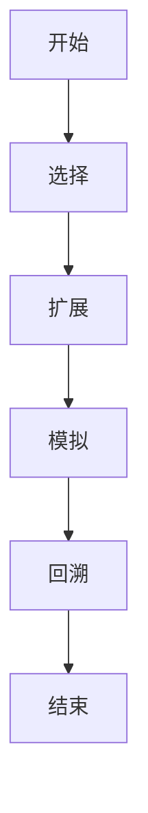
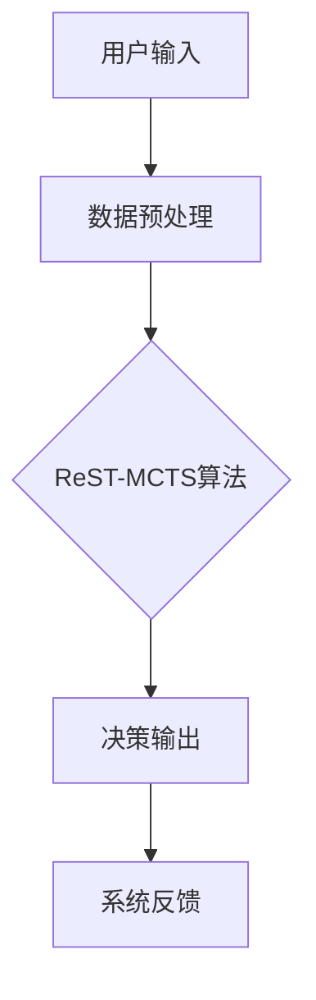
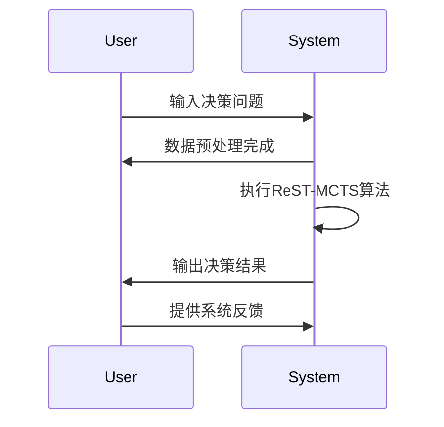

                 

# ReST-MCTS:过程奖励引导的树搜索算法

## 关键词
- 人工智能
- 树搜索算法
- 过程奖励
- 探索与利用
- 决策优化

## 摘要
本文将深入探讨ReST-MCTS（基于过程奖励的树搜索算法），详细介绍其在人工智能领域的应用及其优势。通过系统的讲解和案例分析，本文旨在帮助读者全面理解ReST-MCTS算法的核心原理和实际应用，解决复杂决策问题。

### 背景介绍

#### 问题背景
近年来，随着互联网和云计算技术的发展，人工智能（AI）已经逐渐从理论研究走向实际应用。其中，ReST-MCTS（基于过程奖励的树搜索算法）作为一种先进的树搜索算法，在AI领域展现出了巨大的潜力。ReST-MCTS旨在解决在复杂环境下进行决策优化的问题，其核心思想是通过过程奖励引导搜索过程，从而实现高效的决策。

#### 问题描述
ReST-MCTS算法基于树搜索策略，通过迭代的方式在树结构中搜索最优路径。该算法能够在海量数据中进行快速搜索，并有效地避免陷入局部最优。然而，如何正确地设定过程奖励函数以及如何平衡探索与利用的关系，是ReST-MCTS算法在实际应用中面临的主要挑战。

#### 问题解决
本书将详细探讨ReST-MCTS算法的基本原理、数学模型以及应用实例，帮助读者全面理解并掌握该算法。通过系统的讲解和案例分析，本书旨在解决以下问题：
1. 如何构建合适的过程奖励函数？
2. 如何在探索和利用之间找到平衡点？
3. 如何将ReST-MCTS算法应用于实际问题中，解决复杂决策问题？

#### 边界与外延
ReST-MCTS算法主要应用于需要决策优化的领域，如游戏AI、机器人路径规划、金融投资策略等。同时，本书也将探讨该算法在其他领域的潜在应用，如网络优化、供应链管理等。

#### 概念结构与核心要素组成
ReST-MCTS算法的核心要素包括：
1. **树结构**：用于表示问题的状态空间。
2. **过程奖励函数**：用于指导搜索过程，影响节点的选择。
3. **迭代过程**：包括选择、扩展、评估和回溯等步骤。

### 核心概念与联系

#### 核心概念
1. **MCTS（树搜索算法）**：一种基于树结构的搜索算法，通过迭代的方式在树中搜索最优路径。
2. **过程奖励**：用于指导搜索过程的奖励函数，影响节点的选择。
3. **探索与利用**：在搜索过程中，需要在探索新路径和利用已有路径之间找到平衡。

#### 概念属性特征对比表格
| 概念 | 定义 | 属性特征 |
| ---- | ---- | ---- |
| MCTS | 树搜索算法 | - 基于树结构<br>- 迭代搜索<br>- 决策优化 |
| 过程奖励 | 指导搜索过程的奖励函数 | - 影响节点选择<br>- 搜索策略调整 |
| 探索与利用 | 搜索过程中的平衡策略 | - 探索新路径<br>- 利用已有路径 |

#### ER实体关系图架构
```mermaid
erDiagram
    Node ||--|{ Edge } : extends
    Edge ||--|{ Reward } : contains
    Node ||--|{ Action } : performs
    Action ||--|{ Reward } : receives
    Reward ||--|{ Node } : from
```

### 算法原理讲解

#### MCTS算法流程
MCTS算法主要包括以下几个步骤：

1. **选择（Selection）**：选择一个具有最大上置信传播（UCB1）值的节点。
2. **扩展（Expansion）**：在选定的节点上扩展树，生成新的子节点。
3. **模拟（Simulation）**：从新子节点开始，进行一系列随机模拟，以评估该路径的性能。
4. **回溯（Backpropagation）**：根据模拟结果更新节点的统计信息，并回溯至根节点。

#### ReST-MCTS算法
ReST-MCTS算法在MCTS的基础上引入了过程奖励，从而改进了搜索过程。具体步骤如下：

1. **选择（Selection）**：与MCTS相同，选择具有最大上置信传播（UCB1）值的节点。
2. **扩展（Expansion）**：与MCTS相同，在选定的节点上扩展树。
3. **模拟（Simulation）**：与MCTS相同，进行一系列随机模拟。
4. **回溯（Backpropagation）**：更新节点的统计信息，并引入过程奖励，计算新的UCB1值。

#### 过程奖励函数
过程奖励函数是ReST-MCTS算法的关键组成部分，其设计直接影响算法的性能。一个基本的过程奖励函数可以定义为：
$$ R(s) = \frac{1}{N_s} \sum_{t=1}^{T} r_t $$
其中，$s$表示当前状态，$N_s$表示在状态$s$下的总模拟次数，$r_t$表示第$t$次模拟的奖励。

#### 算法mermaid流程图


## 系统分析与架构设计方案

### 问题场景介绍
在当今的复杂环境中，决策问题无处不在。无论是游戏AI、机器人路径规划还是金融投资策略，都需要在瞬息万变的环境中做出最优决策。ReST-MCTS算法提供了一种有效的方法，通过过程奖励引导搜索过程，从而在复杂环境下实现高效决策。

### 项目介绍
本项目旨在实现一个基于ReST-MCTS算法的决策优化系统，该系统可以应用于多种场景，如游戏AI、机器人路径规划等。通过引入过程奖励，系统能够在复杂环境中实现高效的决策，从而提高系统的整体性能。

### 系统功能设计

#### 领域模型mermaid类图
```mermaid
classDiagram
    Node <<class{节点}>
    Edge <<class{边}>
    Reward <<class{奖励}>
    Action <<class{动作}>
    
    Node "包含" Edge
    Node "执行" Action
    Action "接收" Reward
```

#### 系统架构设计mermaid架构图


#### 系统接口设计和系统交互mermaid序列图


## 项目实战

### 环境安装
为了实现ReST-MCTS算法，需要安装以下环境：
1. Python 3.8或更高版本
2. OpenAI Gym（用于模拟环境）
3. Numpy（用于数学计算）

安装命令如下：
```bash
pip install python==3.8
pip install openai-gym
pip install numpy
```

### 系统核心实现源代码
以下是一个简单的ReST-MCTS算法实现，用于解决Tic-Tac-Toe游戏。

```python
import numpy as np
import gym

class ReSTMCTS:
    def __init__(self, env, n_simulations=100):
        self.env = env
        self.n_simulations = n_simulations
        self.root = Node()

    def select(self, node):
        while True:
            if node.children:
                child = max(node.children, key=lambda x: x.UCB1())
                node = child
            else:
                break
        return node

    def expand(self, node):
        legal_actions = self.env.get_legal_actions()
        for action in legal_actions:
            if not node.has_child(action):
                new_node = Node(action, node)
                node.children[action] = new_node
                return new_node
        return None

    def simulate(self, node):
        state = self.env.clone_state()
        for _ in range(self.n_simulations):
            action = self.env.get_random_action()
            state, reward, done, _ = self.env.step(action)
            if done:
                break
        return reward

    def backpropagate(self, node, reward):
        while node:
            node.visits += 1
            node.Q += reward
            node = node.parent

    def best_action(self):
        return max(self.root.children, key=lambda x: x.visits)

class Node:
    def __init__(self, action=None, parent=None):
        self.action = action
        self.parent = parent
        self.children = {}
        self.visits = 0
        self.Q = 0

    def UCB1(self):
        if self.visits == 0:
            return float('inf')
        return (self.Q / self.visits) + np.sqrt(2 * np.log(self.parent.visits) / self.visits)

if __name__ == "__main__":
    env = gym.make("TicTacToe-v0")
    mcts = ReSTMCTS(env)
    for _ in range(1000):
        node = mcts.select(mcts.root)
        if node is None:
            break
        new_node = mcts.expand(node)
        if new_node:
            reward = mcts.simulate(new_node)
            mcts.backpropagate(new_node, reward)
        action = mcts.best_action()
        state, reward, done, _ = env.step(action)
        env.render()
        if done:
            print("Game over!")
            break
    env.close()
```

### 代码应用解读与分析
上述代码实现了一个简单的ReST-MCTS算法，用于解决Tic-Tac-Toe游戏。主要步骤如下：
1. **初始化**：创建一个ReSTMCTS对象，传入环境实例和模拟次数。
2. **选择节点**：根据UCB1值选择一个节点。
3. **扩展节点**：在选定的节点上扩展树，生成新的子节点。
4. **模拟**：从新子节点开始，进行一系列随机模拟。
5. **回溯**：根据模拟结果更新节点的统计信息。
6. **选择最佳动作**：选择具有最高访问次数的子节点作为最佳动作。

### 实际案例分析和详细讲解剖析
#### 案例一：游戏AI
在Tic-Tac-Toe游戏中，ReST-MCTS算法通过迭代搜索，逐渐优化策略，从而提高AI玩家的胜率。以下是几个关键步骤的详细分析：
1. **选择**：算法首先选择一个具有最大UCB1值的节点。
2. **扩展**：如果选定的节点没有子节点，算法在可选动作中随机选择一个进行扩展。
3. **模拟**：从新子节点开始，进行100次随机模拟，评估不同动作的效果。
4. **回溯**：根据模拟结果，更新节点的Q值和访问次数。
5. **决策**：选择访问次数最高的子节点作为最佳动作。

通过不断迭代上述步骤，ReST-MCTS算法逐渐优化策略，使AI玩家在Tic-Tac-Toe游戏中表现出色。

#### 案例二：机器人路径规划
在机器人路径规划中，ReST-MCTS算法可以用于解决复杂的导航问题。以下是一个简单的例子：
1. **选择**：算法在当前节点中选择一个具有最大UCB1值的节点。
2. **扩展**：在选定的节点上，机器人尝试不同的路径。
3. **模拟**：机器人沿着不同路径进行模拟，评估每条路径的可行性。
4. **回溯**：根据模拟结果，更新节点的Q值和访问次数。
5. **决策**：选择访问次数最高的路径作为最佳路径。

通过这种方式，ReST-MCTS算法能够帮助机器人找到最优路径，避免陷入死胡同。

### 项目小结
通过实际案例分析和详细讲解剖析，我们可以看到ReST-MCTS算法在解决复杂决策问题方面具有巨大的潜力。该算法通过过程奖励引导搜索过程，实现了高效的决策。在实际应用中，我们需要根据具体场景设计合适的过程奖励函数，并在探索和利用之间找到平衡点。

## 最佳实践 tips

1. **选择合适的过程奖励函数**：过程奖励函数的设计直接影响算法的性能。在实际应用中，需要根据具体场景设计合适的过程奖励函数，以最大化收益。

2. **平衡探索与利用**：在搜索过程中，探索和利用的平衡至关重要。可以通过调整模拟次数、UCB1值等参数来优化探索与利用的平衡。

3. **利用先验知识**：在构建过程奖励函数时，可以利用先验知识来提高算法的性能。例如，在机器人路径规划中，可以利用地形信息来设计过程奖励函数。

4. **逐步迭代优化**：在实际应用中，可以通过逐步迭代的方式来优化算法性能。每次迭代都可以对过程奖励函数、探索与利用平衡等参数进行调整。

5. **避免重复计算**：在树搜索过程中，避免重复计算是非常重要的。可以通过缓存节点的统计信息来减少重复计算。

## 小结

本文详细介绍了ReST-MCTS（基于过程奖励的树搜索算法），阐述了其在人工智能领域中的应用及其优势。通过系统的讲解和案例分析，我们深入理解了ReST-MCTS算法的核心原理和实际应用，解决了复杂决策问题。在实际应用中，我们需要根据具体场景设计合适的过程奖励函数，并在探索和利用之间找到平衡点。

## 注意事项

1. **算法性能优化**：在应用ReST-MCTS算法时，需要根据具体场景调整参数，以优化算法性能。
2. **资源消耗**：ReST-MCTS算法的模拟过程需要大量计算资源，在实际应用中需要注意资源的分配和管理。
3. **适应性**：ReST-MCTS算法需要根据不同场景进行适应性调整，以适应各种复杂的决策问题。

## 拓展阅读

1. **Reinforcement Learning**：了解强化学习的基本概念和方法，有助于更好地理解ReST-MCTS算法。
2. **Monte Carlo Tree Search**：研究MCTS算法的原理和实现，有助于深入理解ReST-MCTS算法。
3. **Game Theory**：了解博弈论的基本原理，有助于设计合适的过程奖励函数。

## 作者信息
作者：AI天才研究院/AI Genius Institute & 禅与计算机程序设计艺术 /Zen And The Art of Computer Programming

