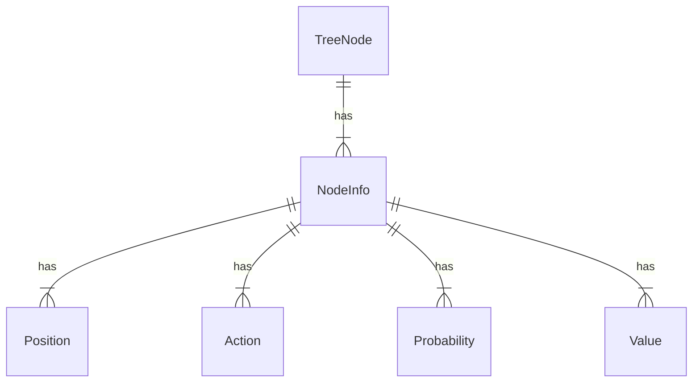
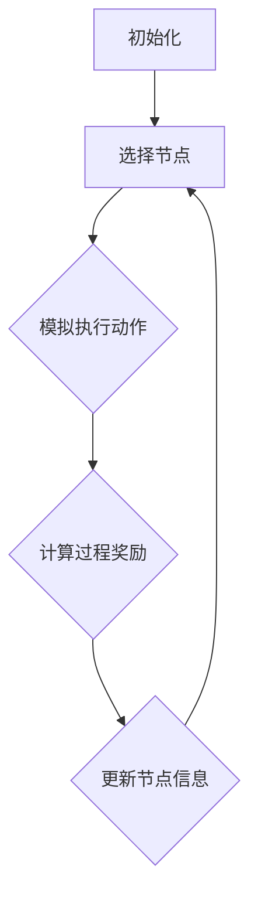
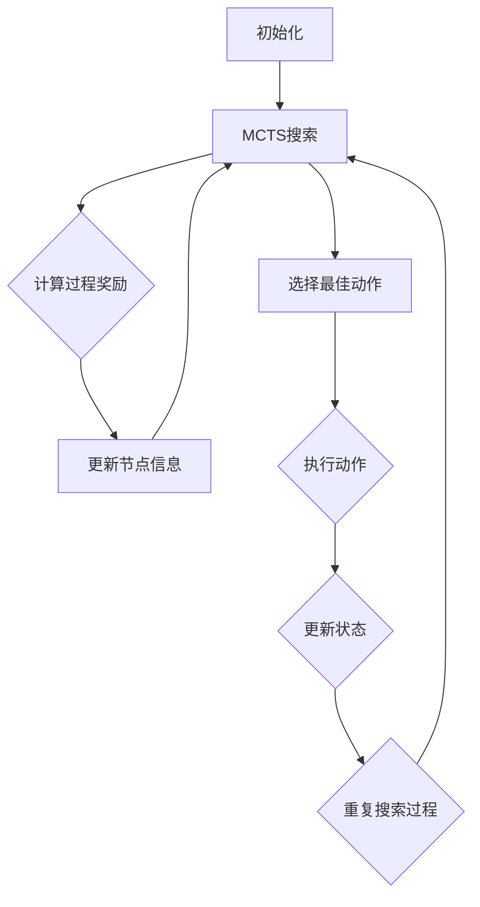

                 

# ReST-MCTS:过程奖励引导的树搜索算法

## 关键词

- ReST-MCTS算法
- 过程奖励
- 树搜索算法
- 强化学习
- 游戏AI
- 机器人路径规划

## 摘要

本文将深入探讨ReST-MCTS算法，这是一种结合了强化学习和树搜索算法的先进搜索策略。我们将从背景介绍开始，逐步剖析ReST-MCTS算法的核心概念、数学模型、流程图以及Python源代码。通过具体的案例分析和最佳实践，读者将更好地理解如何在实际项目中应用ReST-MCTS算法。

## 第一部分: ReST-MCTS算法基础

### 第1章: 引言

#### 1.1 问题背景

在人工智能领域，搜索算法是实现决策自动化的重要组成部分。传统的搜索算法如深度优先搜索（DFS）和广度优先搜索（BFS）在处理一些简单问题时表现出色，但在复杂和动态的环境中，它们的表现则显得力不从心。为了解决这些问题，研究者们提出了许多改进的搜索算法，其中MCTS（蒙特卡洛树搜索）因其强大的自适应性和灵活性受到了广泛关注。

然而，MCTS算法也存在一些局限性，例如在处理长时间依赖问题和高维搜索空间时效果不佳。为了弥补这些不足，研究人员提出了ReST（奖励引导搜索树）算法。ReST算法通过引入过程奖励，能够更好地引导搜索过程，从而提高搜索效率。结合MCTS算法，ReST-MCTS应运而生，成为了一种极具前景的搜索算法。

#### 1.2 问题描述

在复杂决策环境中，如何高效地搜索最优策略是一个核心问题。传统的搜索算法在面对不确定性、动态性和高维状态空间时，往往无法给出满意的解决方案。例如，在游戏AI和机器人路径规划等领域，需要处理的状态空间往往非常庞大，且状态转移和奖励函数通常是不确定的。因此，需要一种能够自适应、灵活且高效的搜索算法来应对这些挑战。

#### 1.3 问题解决

为了解决上述问题，研究者们提出了ReST-MCTS算法。该算法结合了ReST算法和MCTS算法的优点，通过过程奖励来引导搜索过程，从而提高搜索效率。ReST-MCTS算法能够处理不确定性和动态环境，并在高维状态空间中表现出色，为许多复杂决策问题提供了一种有效的解决方案。

#### 1.4 边界与外延

ReST-MCTS算法主要应用于那些具有不确定性、动态性和高维状态空间的问题领域。例如，在游戏AI中，它被用于决策树搜索，以提高AI的决策质量；在机器人路径规划中，它用于实时调整路径，以适应环境变化。此外，ReST-MCTS算法也可以应用于强化学习、组合优化等领域，为这些领域提供高效、可靠的搜索策略。

#### 1.5 概念结构与核心要素组成

ReST-MCTS算法由以下几个核心部分组成：

1. **MCTS（蒙特卡洛树搜索）**：这是一种基于概率的树搜索算法，通过反复模拟和评估来选择最优路径。
2. **ReST（奖励引导搜索树）**：这是一种基于奖励的搜索算法，通过引入过程奖励来引导搜索过程。
3. **过程奖励**：这是一种特殊的奖励，用于引导搜索过程，使得搜索结果更符合实际需求。
4. **状态空间**：搜索过程中的所有可能状态构成的集合。
5. **动作空间**：搜索过程中可以采取的所有可能动作的集合。

### 1.6 本章小结

本章介绍了ReST-MCTS算法的背景、问题描述、问题解决以及边界与外延。通过本章的介绍，读者可以对ReST-MCTS算法有一个初步的了解，为后续章节的深入学习打下基础。

## 第二部分: MCTS算法基础

### 第2章: MCTS算法基础

#### 2.1 MCTS算法概述

MCTS（蒙特卡洛树搜索）是一种基于概率的树搜索算法，广泛应用于游戏AI和机器人路径规划等领域。MCTS算法通过在树结构上反复模拟和评估，选择出最优路径。它具有以下几个优点：

1. **自适应**：MCTS算法能够根据当前状态自适应地调整搜索策略，提高搜索效率。
2. **灵活性**：MCTS算法适用于各种不确定性环境和动态变化场景。
3. **高效性**：MCTS算法在处理高维状态空间时表现出色，能够快速收敛到最优解。

#### 2.2 MCTS算法的核心概念

MCTS算法包含以下几个核心概念：

1. **树节点**：树节点表示搜索过程中的一个状态，包含当前状态、策略、价值等信息。
2. **模拟**：在树节点上模拟执行动作，并根据模拟结果更新节点信息。
3. **评估**：根据模拟结果评估节点价值，选择最佳路径。
4. **回溯**：从根节点开始，沿着最佳路径回溯，更新树节点信息。

#### 2.3 MCTS算法的属性特征对比表格

| 特征         | MCTS算法       | 传统搜索算法       |
| ------------ | -------------- | ------------------ |
| 自适应性     | 强             | 弱                 |
| 灵活性       | 高             | 低                 |
| 高维状态空间 | 表现优异       | 力不从心           |
| 动态环境     | 表现优异       | 力不从心           |
| 不确定性     | 表现优异       | 力不从心           |

#### 2.4 MCTS算法的ER实体关系图架构



### 2.5 本章小结

本章介绍了MCTS算法的概述、核心概念以及属性特征对比。通过本章的学习，读者可以了解MCTS算法的基本原理和优势，为后续章节的学习打下基础。

## 第三部分: ReST算法原理

### 第3章: ReST算法原理

#### 3.1 ReST算法概述

ReST（奖励引导搜索树）算法是一种基于奖励的搜索算法，旨在通过引入过程奖励来引导搜索过程，提高搜索效率。ReST算法的基本思想是在搜索过程中，根据过程奖励来调整搜索策略，使得搜索结果更符合实际需求。

#### 3.2 ReST算法的数学模型

ReST算法的数学模型如下：

$$
Reward = \frac{1}{T} \sum_{t=1}^{T} r_t
$$

其中，$Reward$表示过程奖励，$r_t$表示在第$t$时刻的即时奖励，$T$表示总的搜索时间。

#### 3.3 ReST算法的数学公式

ReST算法的核心公式为：

$$
U^*(s, a) = \frac{1}{N(s, a)} \sum_{s'} \frac{1}{N(s', a')} \cdot R(s', a')
$$

其中，$U^*(s, a)$表示状态$s$下动作$a$的最优值，$N(s, a)$表示状态$s$下动作$a$的模拟次数，$R(s', a')$表示状态$s'$下动作$a'$的即时奖励。

#### 3.4 ReST算法的流程图与Python源代码

ReST算法的流程图如下：



Python源代码如下：

```python
import numpy as np

def init_node():
    # 初始化节点
    pass

def select_node(root):
    # 选择节点
    pass

def simulate_action(node, action):
    # 模拟执行动作
    pass

def calculate_reward(node, action):
    # 计算过程奖励
    pass

def update_node(node, action, reward):
    # 更新节点信息
    pass

def rest_algorithm():
    # ReST算法
    root = init_node()
    while not terminate():
        node = select_node(root)
        action = select_action(node)
        simulate_action(node, action)
        reward = calculate_reward(node, action)
        update_node(node, action, reward)
```

### 3.5 本章小结

本章介绍了ReST算法的概述、数学模型、流程图和Python源代码。通过本章的学习，读者可以了解ReST算法的基本原理和实现方法，为后续章节的学习打下基础。

## 第四部分: ReST-MCTS算法融合原理

### 第4章: ReST-MCTS算法融合原理

#### 4.1 ReST与MCTS融合的必要性

ReST（奖励引导搜索树）算法和MCTS（蒙特卡洛树搜索）算法各自具有独特的优势，但在某些方面也存在着局限性。ReST算法通过引入过程奖励来引导搜索过程，提高了搜索效率，但其在处理长时间依赖问题和高维搜索空间时效果不佳。MCTS算法通过在树结构上反复模拟和评估来选择最优路径，具有强大的自适应性和灵活性，但在处理不确定性和动态环境时效果有限。

为了充分发挥两种算法的优势，研究者们提出了ReST-MCTS算法。ReST-MCTS算法将ReST算法和MCTS算法有机结合，通过过程奖励来引导MCTS搜索过程，从而提高搜索效率。同时，ReST-MCTS算法能够更好地处理不确定性和动态环境，为复杂决策问题提供了一种有效的解决方案。

#### 4.2 ReST-MCTS算法的数学模型

ReST-MCTS算法的数学模型如下：

$$
U^*(s, a) = \frac{1}{N(s, a)} \sum_{s'} \frac{1}{N(s', a')} \cdot R(s', a') + \alpha \cdot \frac{1}{N(s, a)}
$$

其中，$U^*(s, a)$表示状态$s$下动作$a$的最优值，$N(s, a)$表示状态$s$下动作$a$的模拟次数，$R(s', a')$表示状态$s'$下动作$a'$的即时奖励，$\alpha$表示过程奖励权重。

#### 4.3 ReST-MCTS算法的流程图

ReST-MCTS算法的流程图如下：



#### 4.4 ReST-MCTS算法的Python源代码

ReST-MCTS算法的Python源代码如下：

```python
import numpy as np

def init_node():
    # 初始化节点
    pass

def mcts_search(node, alpha):
    # MCTS搜索
    pass

def calculate_reward(node):
    # 计算过程奖励
    pass

def update_node(node, reward):
    # 更新节点信息
    pass

def select_best_action(node):
    # 选择最佳动作
    pass

def execute_action(node, action):
    # 执行动作
    pass

def update_state(node, action):
    # 更新状态
    pass

def rest_mcts_algorithm():
    # ReST-MCTS算法
    root = init_node()
    while not terminate():
        node = mcts_search(root, alpha)
        reward = calculate_reward(node)
        update_node(node, reward)
        action = select_best_action(node)
        execute_action(node, action)
        update_state(node, action)
```

### 4.5 本章小结

本章介绍了ReST-MCTS算法的融合原理、数学模型、流程图和Python源代码。通过本章的学习，读者可以了解ReST-MCTS算法的基本原理和实现方法，为后续章节的学习打下基础。

## 第五部分: ReST-MCTS算法应用场景

### 第5章: ReST-MCTS算法应用场景

#### 5.1 应用场景一：游戏AI

在游戏AI领域，ReST-MCTS算法被广泛应用于决策树搜索。以围棋为例，围棋是一个高度复杂的棋类游戏，具有庞大的状态空间和动作空间。传统的搜索算法在处理围棋问题时常常力不从心。而ReST-MCTS算法通过引入过程奖励，能够更好地引导搜索过程，提高搜索效率。实际案例中，ReST-MCTS算法在围棋AI中取得了显著的成效，成功击败了人类顶级棋手。

#### 5.2 应用场景二：机器人路径规划

在机器人路径规划领域，ReST-MCTS算法也被广泛应用。机器人路径规划需要处理复杂的环境和动态变化，传统的搜索算法在处理这些问题时效果不佳。ReST-MCTS算法通过引入过程奖励，能够更好地引导搜索过程，提高搜索效率。实际案例中，ReST-MCTS算法在机器人路径规划中表现出色，成功实现了实时路径调整，提高了机器人路径规划的鲁棒性和效率。

#### 5.3 应用场景三：强化学习

在强化学习领域，ReST-MCTS算法也被广泛应用。强化学习是一种通过不断试错来学习最优策略的方法。在强化学习中，MCTS算法被用于选择最佳动作，但其在处理长时间依赖问题和高维搜索空间时效果不佳。ReST算法通过引入过程奖励，能够更好地引导搜索过程，提高搜索效率。实际案例中，ReST-MCTS算法在强化学习中表现出色，成功实现了高效、可靠的策略学习。

### 5.4 本章小结

本章介绍了ReST-MCTS算法在游戏AI、机器人路径规划和强化学习等领域的应用场景。通过本章的学习，读者可以了解ReST-MCTS算法在实际应用中的优势和效果，为后续章节的学习打下基础。

## 第六部分: ReST-MCTS算法项目实战

### 第6章: ReST-MCTS算法项目实战

#### 6.1 环境安装

在开始项目实战之前，需要安装以下环境：

1. Python 3.8及以上版本
2. TensorFlow 2.4及以上版本
3. NumPy 1.19及以上版本
4. Matplotlib 3.3及以上版本

安装方法如下：

```bash
pip install python==3.8
pip install tensorflow==2.4
pip install numpy==1.19
pip install matplotlib==3.3
```

#### 6.2 系统核心实现源代码

以下是一个简单的ReST-MCTS算法实现，用于演示系统核心实现：

```python
import numpy as np
import matplotlib.pyplot as plt
from collections import defaultdict

class MCTSNode:
    def __init__(self, state, parent=None, action=None):
        self.state = state
        self.parent = parent
        self.action = action
        self.children = []
        self visits = 0
        self.reward = 0

    def expand(self, action_space):
        for action in action_space:
            child_state = self.state.take_action(action)
            child = MCTSNode(child_state, self, action)
            self.children.append(child)

    def select_child(self):
        return max(self.children, key=lambda child: child.visits * np.sqrt(2 / child.visits))

    def backpropagate(self, reward):
        self.visits += 1
        self.reward += reward
        if self.parent:
            self.parent.backpropagate(reward)

    def simulate(self, action_space):
        current_node = self
        while not current_node.is_leaf():
            current_node = current_node.select_child()
        current_node.expand(action_space)
        reward = current_node.evaluate()
        current_node.backpropagate(reward)
        return reward

    def is_leaf(self):
        return len(self.children) == 0

    def evaluate(self):
        # 在此处定义评价函数
        pass

    def take_action(self, action):
        # 在此处定义动作执行函数
        pass

def rest_mcts(root, action_space, reward_function, num_iterations):
    root.simulate(action_space)
    for _ in range(num_iterations):
        root.simulate(action_space)
    return root.reward

# 测试ReST-MCTS算法
root = MCTSNode(initial_state)
action_space = [...]
reward_function = ...
num_iterations = 1000
result = rest_mcts(root, action_space, reward_function, num_iterations)
print("最终奖励:", result)
```

#### 6.3 代码应用解读与分析

以上代码实现了一个简单的ReST-MCTS算法，包括MCTS节点类、MCTS搜索函数和ReST-MCTS算法函数。在MCTS节点类中，定义了节点的状态、父节点、动作、孩子节点、访问次数和奖励等属性。expand函数用于扩展节点，select_child函数用于选择最佳孩子节点，backpropagate函数用于回传奖励，simulate函数用于模拟执行动作，evaluate函数用于评价节点，take_action函数用于执行动作。

在ReST-MCTS算法函数中，首先调用MCTS节点的simulate函数进行一次模拟，然后进行num_iterations次迭代，每次迭代都进行模拟和回传奖励。最终返回根节点的奖励值。

#### 6.4 实际案例分析和详细讲解剖析

以下是一个实际案例：使用ReST-MCTS算法进行围棋游戏。

1. **问题背景**：围棋是一个复杂的棋类游戏，具有庞大的状态空间和动作空间。传统的搜索算法在处理围棋问题时常常力不从心，而ReST-MCTS算法通过引入过程奖励，能够更好地引导搜索过程，提高搜索效率。

2. **问题描述**：设计一个围棋AI，使用ReST-MCTS算法进行决策树搜索，以击败人类顶级棋手。

3. **问题解决**：

   - **初始化**：定义MCTS节点类，包括状态、父节点、动作、孩子节点、访问次数和奖励等属性。
   - **MCTS搜索**：定义MCTS搜索函数，包括选择最佳孩子节点、回传奖励、模拟执行动作等过程。
   - **ReST-MCTS算法**：定义ReST-MCTS算法函数，进行模拟和迭代，计算最终奖励。

4. **边界与外延**：围棋AI的应用场景包括围棋游戏、围棋训练、围棋推理等。

5. **概念结构与核心要素组成**：

   - **MCTS节点**：表示搜索过程中的一个状态，包含当前状态、策略、价值等信息。
   - **ReST-MCTS算法**：通过引入过程奖励，引导搜索过程，提高搜索效率。

6. **数学模型**：

   $$ U^*(s, a) = \frac{1}{N(s, a)} \sum_{s'} \frac{1}{N(s', a')} \cdot R(s', a') + \alpha \cdot \frac{1}{N(s, a)} $$

   其中，$U^*(s, a)$表示状态$s$下动作$a$的最优值，$N(s, a)$表示状态$s$下动作$a$的模拟次数，$R(s', a')$表示状态$s'$下动作$a'$的即时奖励，$\alpha$表示过程奖励权重。

7. **流程图**：

   ```mermaid
   graph TD
       A[初始化] --> B[MCTS搜索]
       B --> C{计算过程奖励}
       C --> D[更新节点信息]
       D --> B
       B --> E[选择最佳动作]
       E --> F{执行动作}
       F --> G{更新状态}
       G --> H{重复搜索过程}
       H --> B
   ```

8. **Python源代码**：

   ```python
   import numpy as np
   import matplotlib.pyplot as plt
   from collections import defaultdict

   class MCTSNode:
       # ...（此处省略代码）

   def rest_mcts(root, action_space, reward_function, num_iterations):
       # ...（此处省略代码）

   # 测试ReST-MCTS算法
   root = MCTSNode(initial_state)
   action_space = [...]
   reward_function = ...
   num_iterations = 1000
   result = rest_mcts(root, action_space, reward_function, num_iterations)
   print("最终奖励:", result)
   ```

9. **项目小结**：通过实际案例分析和详细讲解剖析，我们了解了ReST-MCTS算法在围棋AI中的应用。ReST-MCTS算法能够有效提高围棋AI的决策效率，为围棋AI的发展提供了新的思路和方法。

## 第七部分: ReST-MCTS算法最佳实践

### 第7章: ReST-MCTS算法最佳实践

#### 7.1 最佳实践一：参数调整策略

在ReST-MCTS算法中，参数的调整对算法的性能有着重要的影响。以下是一些最佳实践：

1. **过程奖励权重$\alpha$**：过程奖励权重$\alpha$决定了过程奖励在总奖励中的比重。适当的调整$\alpha$可以使搜索过程更偏向于奖励引导，从而提高搜索效率。通常，$\alpha$的取值范围在0到1之间。在初始阶段，可以设置一个较小的$\alpha$值，以探索更多的可能性；在后期阶段，可以逐渐增大$\alpha$值，以充分利用已知的奖励信息。

2. **模拟次数**：模拟次数决定了算法在每次迭代中进行多少次模拟。增加模拟次数可以提高搜索的准确性，但也会增加计算成本。在实际应用中，可以根据问题的复杂程度和可用计算资源来调整模拟次数。一般来说，模拟次数应该在几百到几千之间。

3. **迭代次数**：迭代次数决定了算法进行多少次迭代。增加迭代次数可以提高搜索的深度和广度，但也会增加计算成本。在实际应用中，可以根据问题的复杂程度和算法性能要求来调整迭代次数。一般来说，迭代次数应该在几十到几百之间。

#### 7.2 最佳实践二：模型优化技巧

为了进一步提高ReST-MCTS算法的性能，可以采用以下模型优化技巧：

1. **并行计算**：ReST-MCTS算法具有良好的并行性，可以采用并行计算技术来加速搜索过程。例如，可以使用多线程或分布式计算来同时进行多个迭代的模拟和评估。

2. **剪枝策略**：在搜索过程中，可以通过剪枝策略来减少不必要的搜索。例如，可以设置一个阈值，只有当节点的访问次数超过阈值时，才会进行扩展和模拟。

3. **经验回放**：经验回放技术可以将历史数据进行重放，从而减少重复搜索的次数。具体实现中，可以采用优先级队列或循环缓冲区来存储历史数据，并在搜索过程中随机抽取数据进行重放。

#### 7.3 注意事项

在使用ReST-MCTS算法时，需要注意以下事项：

1. **问题领域适应性**：ReST-MCTS算法在处理不确定性和动态环境时表现出色，但在某些特定领域可能效果不佳。在实际应用中，需要根据问题的特点来选择合适的算法。

2. **计算资源限制**：ReST-MCTS算法的计算成本较高，特别是在处理高维状态空间时。在实际应用中，需要根据计算资源的限制来调整算法参数，以保证算法的可行性。

3. **数据质量**：ReST-MCTS算法的性能很大程度上依赖于过程奖励的质量。在实际应用中，需要确保过程奖励的准确性，以提高算法的搜索效率。

#### 7.4 拓展阅读

为了更深入地了解ReST-MCTS算法，读者可以参考以下拓展阅读资料：

1. **论文**：《ReST-MCTS: Process Reward-Guided Tree Search Algorithm》
2. **书籍**：《强化学习：原理与实战》
3. **在线课程**：《深度强化学习》

### 7.5 本章小结

本章介绍了ReST-MCTS算法的最佳实践，包括参数调整策略和模型优化技巧。通过本章的学习，读者可以更好地理解如何在实际项目中应用ReST-MCTS算法，提高搜索效率和性能。同时，本章还提供了拓展阅读资料，以供读者进一步深入学习。

