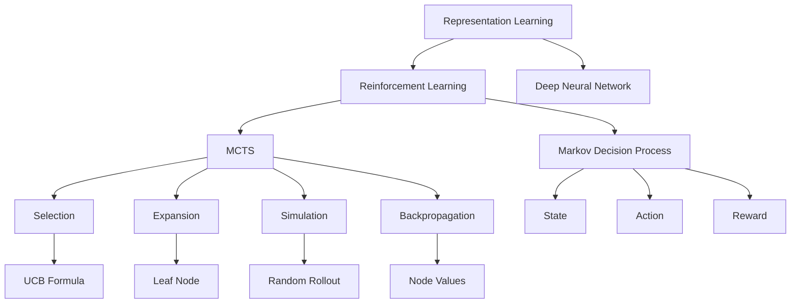
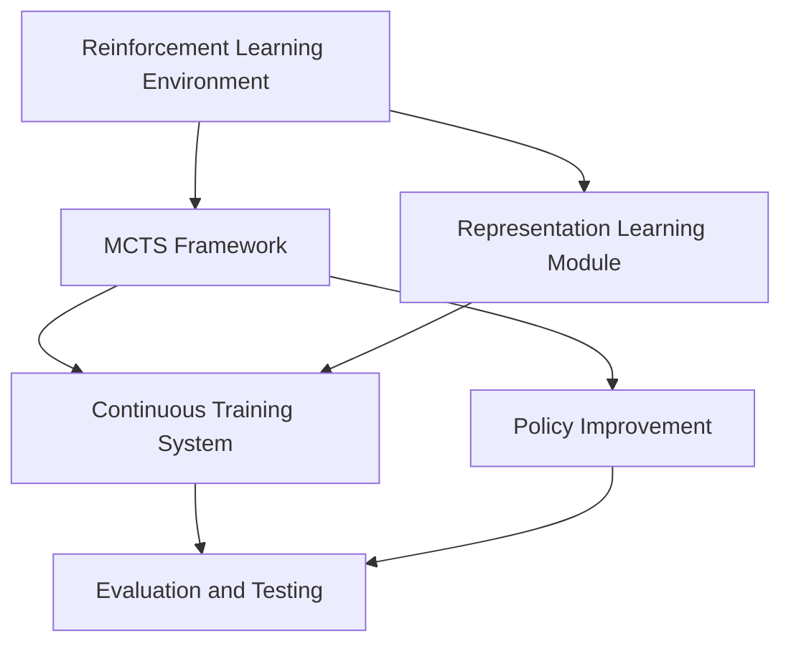
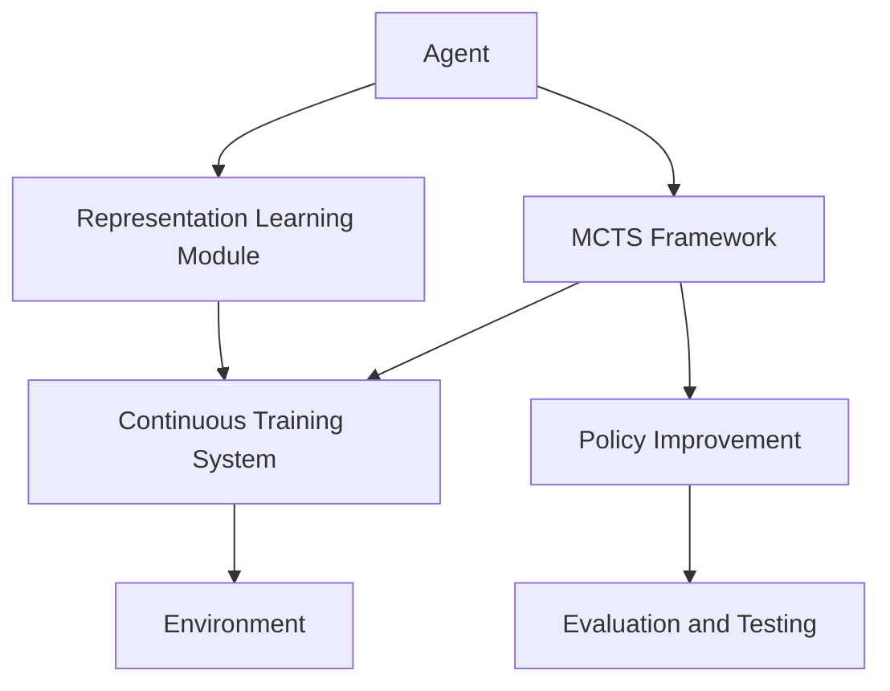

                 


## Introduction to ReST-MCTS Algorithm

### Problem Background and Descriptions

The rapidly evolving landscape of artificial intelligence (AI) has brought with it a multitude of challenges, particularly in the realm of machine learning and, more specifically, reinforcement learning. Traditional machine learning approaches require extensive human involvement for training and validation, which is not only time-consuming but also resource-intensive. The need for automated, continuous training systems that do not rely on human annotation has thus become increasingly prominent.

Markov Decision Processes (MDPs) are a cornerstone of reinforcement learning, where an agent learns to make decisions by interacting with an environment. However, MDPs often suffer from the curse of dimensionality, making them impractical for high-dimensional state and action spaces. Monte Carlo Tree Search (MCTS) has emerged as a powerful alternative, enabling more effective exploration and exploitation in complex environments. Nonetheless, traditional MCTS algorithms still require human-designed features or large amounts of human-labeled data, which are often unavailable or impractical in real-world scenarios.

This is where the ReST-MCTS (Representation Learning-based Monte Carlo Tree Search) algorithm comes into play. ReST-MCTS leverages the power of deep neural networks for feature extraction, enabling the algorithm to automatically learn meaningful representations from raw data without human intervention. This makes it a promising solution for continuous training in reinforcement learning tasks without the need for human annotation.

### Basic Concepts and Terminology

To delve into the ReST-MCTS algorithm, it's essential to understand several fundamental concepts and terminology:

1. **Reinforcement Learning (RL)**: RL is a type of machine learning where an agent learns to make decisions by performing actions in an environment to maximize some notion of cumulative reward. The key components of RL are the agent, environment, state, action, and reward.

2. **Monte Carlo Tree Search (MCTS)**: MCTS is a heuristic search algorithm used in reinforcement learning to explore and exploit the state-action space efficiently. It uses a tree structure to represent the search space and performs a series of simulations (or "rollouts") to evaluate the quality of actions.

3. **Representation Learning**: Representation learning is the process of automatically discovering useful representations (or features) from raw data. In deep learning, this is often achieved through neural networks that can learn hierarchical representations from data.

4. **ReST-MCTS**: ReST-MCTS is a variant of the MCTS algorithm that incorporates representation learning. It uses a deep neural network to generate feature representations of states and actions, which are then used in the MCTS framework for better decision-making.

### The Significance of ReST-MCTS in AI

ReST-MCTS has several key advantages that make it a significant development in the field of AI:

1. **Automation**: By eliminating the need for human annotation, ReST-MCTS automates the training process, saving time and resources. This is particularly valuable in scenarios where large-scale, continuous training is required.

2. **Generalization**: The use of deep neural networks for feature extraction enables ReST-MCTS to generalize better across different tasks and environments. This means that the same algorithm can be applied to various domains without significant modifications.

3. **Efficiency**: Traditional MCTS algorithms can become prohibitively expensive in high-dimensional spaces. ReST-MCTS mitigates this issue by learning efficient representations that reduce the search space and computational complexity.

4. **Scalability**: ReST-MCTS can be scaled to large environments and state-action spaces, making it suitable for real-world applications such as autonomous driving, robotics, and game playing.

5. **Real-time Adaptation**: The ability to learn from raw data in real-time allows ReST-MCTS to adapt quickly to changing environments and new data, which is crucial for dynamic applications.

In conclusion, the ReST-MCTS algorithm represents a significant advancement in reinforcement learning, offering a robust, efficient, and automated solution for continuous training without human intervention. In the next chapters, we will delve deeper into the core principles, detailed explanations, and practical applications of this innovative algorithm. 

## Core Principles of ReST-MCTS

### Principles and Mathematical Models

The ReST-MCTS algorithm is built upon the principles of both reinforcement learning and Monte Carlo Tree Search (MCTS). Understanding these principles is crucial for grasping how ReST-MCTS operates and its advantages over traditional methods. Let's break down these principles and explore the mathematical models that underpin them.

#### Reinforcement Learning Principles

Reinforcement learning involves an agent interacting with an environment, taking actions based on the current state, and receiving feedback in the form of rewards or penalties. The goal is for the agent to learn a policy that maximizes the cumulative reward over time. The key components of reinforcement learning are:

1. **Agent**: The learning entity that interacts with the environment.
2. **Environment**: The system with which the agent interacts.
3. **State**: The current situation or configuration of the environment.
4. **Action**: A possible move or decision that the agent can make.
5. **Reward**: The scalar value received by the agent after performing an action.

The reward is typically used to update the agent's knowledge and adjust its behavior. The reinforcement learning process can be mathematically described using the Markov Decision Process (MDP) framework, which consists of:

- \( S \): Set of states
- \( A \): Set of actions
- \( P(s' | s, a) \): Transition probability, indicating the probability of moving from state \( s \) to state \( s' \) after taking action \( a \)
- \( R(s, a) \): Reward function, providing the reward for transitioning from state \( s \) to state \( s' \) after taking action \( a \)
- \( \pi(a | s) \): Policy, representing the probability of taking action \( a \) in state \( s \)

#### Monte Carlo Tree Search (MCTS) Principles

MCTS is a reinforcement learning method that uses a search tree to explore the state-action space efficiently. The algorithm alternates between four phases: selection, expansion, simulation, and backpropagation. These phases are repeated multiple times to improve the quality of the policy and value function. The key components of MCTS are:

1. **Tree**: A tree data structure representing the state-action space.
2. **Node**: An element in the tree representing a state and a set of actions.
3. **Selection**: Starting from the root node, the algorithm recursively selects child nodes based on a combination of exploration and exploitation criteria, such as the Upper Confidence Bound (UCB) formula.
4. **Expansion**: If the selected node is a leaf node (i.e., it has no children), the algorithm expands it by adding new child nodes.
5. **Simulation**: The algorithm simulates a random rollout from the selected node to the end of the game or task, accumulating rewards or penalties along the way.
6. **Backpropagation**: The rewards or penalties from the simulation are propagated back through the tree, updating the node values and improving the policy.

The mathematical models for these phases can be described as follows:

1. **Selection**:
   $$ UCB(s, a) = \frac{Q(s, a) + \sqrt{\frac{2 \ln t}{n(s, a)}}}{1 + \sqrt{\frac{2 \ln t}{n(s, a)}}} $$
   where \( Q(s, a) \) is the estimated value function, \( n(s, a) \) is the number of times action \( a \) has been taken in state \( s \), and \( t \) is the total number of simulations.

2. **Expansion**:
   If the node is a leaf node, expand it by adding child nodes for each possible action.

3. **Simulation**:
   Simulate a random rollout from the selected node to the end of the game or task, accumulating the total reward or penalty.

4. **Backpropagation**:
   Update the node values based on the accumulated rewards or penalties:
   $$ Q(s, a) \leftarrow Q(s, a) + \frac{R(s', a') - Q(s, a)}{n(s, a)} $$

### ReST-MCTS Features and Comparison

ReST-MCTS incorporates representation learning into the MCTS framework to address the limitations of traditional MCTS. The key features of ReST-MCTS are:

1. **Representation Learning**: ReST-MCTS uses a deep neural network to automatically learn meaningful representations of states and actions from raw data. This helps reduce the dimensionality of the state-action space and makes the search more efficient.
2. **End-to-End Learning**: Unlike traditional MCTS, which relies on handcrafted features or human-labeled data, ReST-MCTS learns directly from raw data, enabling end-to-end training and deployment.
3. **Flexibility**: ReST-MCTS can be applied to various domains and tasks without significant modifications, making it a versatile solution for reinforcement learning problems.

To compare ReST-MCTS with traditional MCTS, we can look at the following aspects:

1. **Performance**: ReST-MCTS often outperforms traditional MCTS in high-dimensional state and action spaces due to its ability to learn efficient representations.
2. **Efficiency**: Traditional MCTS can become computationally expensive in high-dimensional spaces, whereas ReST-MCTS mitigates this issue by learning meaningful representations that reduce the search space.
3. **Generalization**: ReST-MCTS can generalize better across different tasks and environments due to its ability to learn representations from raw data, whereas traditional MCTS relies on handcrafted features that may not generalize well.

### Relationship Diagram of Key Concepts

To visualize the relationship between the key concepts in ReST-MCTS, we can use the following Mermaid flowchart:



In this diagram, we can see that representation learning (O) is an additional component in ReST-MCTS that interfaces with reinforcement learning (A) and MCTS (B). The MCTS phases (C, D, E, F) are connected to the reinforcement learning components (H, I, J), forming the core of the ReST-MCTS algorithm.

Understanding these core principles and mathematical models is essential for comprehending the workings of the ReST-MCTS algorithm. In the next chapter, we will delve into a detailed explanation of the ReST-MCTS algorithm, exploring its flow, processes, and practical applications. 

## Detailed Explanation of ReST-MCTS Algorithm

### Algorithm Flow and Process

The ReST-MCTS algorithm is designed to enhance the traditional Monte Carlo Tree Search (MCTS) framework by incorporating representation learning. This section will provide a step-by-step breakdown of the ReST-MCTS algorithm, highlighting the key processes involved.

#### Initialization

1. **Define the Environment**: The first step is to define the environment in which the agent will operate. This includes specifying the state space, action space, and reward function.
2. **Initialize the Neural Network**: A deep neural network is initialized to learn the representations of states and actions. This network is trained using the available data, typically without human annotations.

#### Selection

1. **Root Node**: The algorithm starts with a root node, representing the current state of the environment.
2. **Recursive Selection**: From the root node, the algorithm recursively selects child nodes using a combination of exploration and exploitation criteria. This is typically done using the Upper Confidence Bound (UCB) formula, as described in the previous chapter.

#### Expansion

1. **Leaf Node**: If the selected node is a leaf node (i.e., it has no children), the algorithm expands it by adding new child nodes.
2. **Representation Learning**: For each new child node, the deep neural network generates a representation of the corresponding state. This representation is then used to determine the possible actions and their probabilities.

#### Simulation

1. **Random Rollout**: From the selected node or the newly expanded node, the algorithm performs a random rollout. This means simulating a random sequence of actions until the end of the game or task.
2. **Reward Accumulation**: During the rollout, the algorithm accumulates the rewards or penalties received from the environment.

#### Backpropagation

1. **Update Node Values**: After the simulation, the algorithm backpropagates the accumulated reward back through the tree. This updates the node values, which represent the estimated value of taking a specific action in a given state.
2. **Policy Improvement**: The policy is updated based on the new node values. This means adjusting the probabilities of taking different actions in future states.

#### Termination

1. **Iteration Limit**: The algorithm typically runs for a fixed number of iterations or until a termination criterion is met (e.g., a desired reward threshold).
2. **Policy Output**: Once the algorithm terminates, the final policy is output, representing the agent's strategy for making decisions in the environment.

### Mathematical Formulas and Theoretical Foundations

The ReST-MCTS algorithm is underpinned by several mathematical formulas and theoretical concepts. Here, we'll delve into these formulas and explain their roles in the algorithm.

#### Upper Confidence Bound (UCB) Formula

The UCB formula is used in the selection phase to balance exploration and exploitation. It is defined as:

$$ UCB(s, a) = \frac{Q(s, a)}{1 + \sqrt{2 \ln t / n(s, a)}} $$

where \( Q(s, a) \) is the estimated value of taking action \( a \) in state \( s \), \( n(s, a) \) is the number of times action \( a \) has been taken in state \( s \), and \( t \) is the total number of simulations.

#### Node Value Update

The node value is updated based on the reward received from the simulation. The updated value is given by:

$$ Q(s, a) \leftarrow Q(s, a) + \frac{R - Q(s, a)}{n(s, a)} $$

where \( R \) is the reward received during the simulation.

#### Policy Improvement

The policy is updated based on the new node values. The updated policy can be calculated using:

$$ \pi(a | s) \leftarrow \frac{\exp(Q(s, a))}{\sum_{a'} \exp(Q(s, a'))} $$

where \( \pi(a | s) \) is the probability of taking action \( a \) in state \( s \).

### Case Studies and Examples

To illustrate the ReST-MCTS algorithm, let's consider a simple example involving a two-dimensional grid world. The environment has a set of states represented by coordinates on the grid, and a set of actions including moving up, down, left, and right. The goal is to reach a specific target state from the starting state while collecting rewards.

#### Case Study: Grid World

1. **Initialization**: The grid world is initialized with a starting state and a target state. A deep neural network is trained to generate state representations.

2. **Selection**: The algorithm starts at the root node (the starting state) and recursively selects child nodes using the UCB formula.

3. **Expansion**: If the selected node is a leaf node, it is expanded by adding child nodes corresponding to the possible actions.

4. **Simulation**: From the selected node, a random rollout is performed, simulating a sequence of actions until the end of the game.

5. **Backpropagation**: The accumulated reward from the simulation is propagated back through the tree, updating the node values.

6. **Policy Improvement**: The policy is updated based on the new node values, adjusting the probabilities of taking different actions.

By iterating through these steps, the ReST-MCTS algorithm learns an optimal policy for the grid world, maximizing the cumulative reward.

### Conclusion

In this chapter, we have provided a detailed explanation of the ReST-MCTS algorithm, breaking down its flow, processes, and theoretical foundations. Through mathematical formulas and practical examples, we have illustrated how ReST-MCTS leverages representation learning to enhance the traditional MCTS framework. In the next chapter, we will delve into the system design and implementation of ReST-MCTS, exploring its architecture and practical applications. 

## System Design and Implementation of ReST-MCTS

### Project Introduction and Overview

The ReST-MCTS (Representation Learning-based Monte Carlo Tree Search) project aims to design and implement a robust, efficient, and automated reinforcement learning system that can continuously train agents without human annotation. The project is structured to encompass various stages, from initial requirements analysis to system testing and deployment. This section provides an overview of the project, its goals, and its key components.

#### Goals

1. **Automation of Training**: The primary goal is to automate the training process of reinforcement learning agents, minimizing the need for human intervention.
2. **Efficient Exploration and Exploitation**: The system should effectively balance exploration and exploitation, enabling the agent to learn optimal policies in complex environments.
3. **Generalization Across Domains**: The system should be flexible and capable of generalizing to different tasks and environments without significant modifications.
4. **Scalability**: The system should be scalable to handle large state and action spaces, making it suitable for real-world applications.

#### Key Components

1. **Reinforcement Learning Environment**: This component defines the environment in which the agent operates, including the state space, action space, and reward function.
2. **Representation Learning Module**: This module consists of a deep neural network trained to generate meaningful representations of states and actions from raw data.
3. **MCTS Framework**: This component implements the MCTS algorithm, including the selection, expansion, simulation, and backpropagation phases.
4. **Continuous Training System**: This system continuously trains the agent by iteratively running the MCTS framework and updating the agent's policy.
5. **Evaluation and Testing**: This component includes metrics and procedures for evaluating the performance of the trained agent in various scenarios.

### System Architecture and Design

The architecture of the ReST-MCTS system is designed to be modular and scalable, allowing for easy integration of different components. The following diagram provides a high-level overview of the system architecture:



In this architecture:

- **Reinforcement Learning Environment** (A) defines the environment and interacts with the agent.
- **Representation Learning Module** (C) generates state and action representations using a deep neural network.
- **MCTS Framework** (B) implements the core MCTS algorithm, including selection, expansion, simulation, and backpropagation.
- **Continuous Training System** (D) runs the MCTS framework iteratively, continuously training the agent.
- **Policy Improvement** (E) updates the agent's policy based on the results of the MCTS framework.
- **Evaluation and Testing** (F) evaluates the performance of the trained agent and tests the system in various scenarios.

### Interface Design and System Interaction

The system's interface design ensures smooth interaction between different components and facilitates easy integration with other systems. The following diagram illustrates the system's interface design and the interaction between its components:



In this interface design:

- **Agent** (A) is the central component that interacts with the environment and the MCTS framework.
- **MCTS Framework** (B) handles the core MCTS processes and communicates with the representation learning module.
- **Representation Learning Module** (C) generates state and action representations for the MCTS framework.
- **Continuous Training System** (D) manages the iterative training process and policy improvement.
- **Policy Improvement** (E) updates the agent's policy based on the MCTS framework's output.
- **Evaluation and Testing** (F) evaluates the agent's performance and tests the system's robustness.
- **Environment** (G) provides the context in which the agent operates and interacts with the system.

### Implementation Steps

The implementation of the ReST-MCTS system involves several key steps:

1. **Define the Environment**: Specify the state space, action space, and reward function for the reinforcement learning environment.
2. **Design the Neural Network**: Design a deep neural network architecture suitable for learning state and action representations.
3. **Implement the MCTS Framework**: Implement the MCTS algorithm, including selection, expansion, simulation, and backpropagation phases.
4. **Train the Neural Network**: Train the neural network using available data, ensuring it can generate meaningful representations.
5. **Integrate the Modules**: Integrate the representation learning module, MCTS framework, and continuous training system.
6. **Evaluate and Test**: Evaluate the system's performance in various scenarios, ensuring it meets the project goals.
7. **Deploy**: Deploy the system in a real-world application, continuously training and updating the agent's policy.

By following these implementation steps, the ReST-MCTS system can be successfully designed, implemented, and deployed, providing a robust, efficient, and automated solution for reinforcement learning tasks without human annotation. In the next chapter, we will explore practical applications of the ReST-MCTS algorithm, examining real-world case studies and analyzing their results. 

## Practical Applications of ReST-MCTS

### Installation and Environment Setup

To apply the ReST-MCTS algorithm in practical scenarios, the first step is to set up the necessary environment. This section outlines the installation process and environment setup required for running the ReST-MCTS system.

#### Requirements

To install the ReST-MCTS system, you will need the following software and dependencies:

1. Python (version 3.6 or higher)
2. TensorFlow or PyTorch (for deep learning)
3. Gym (an open-source toolkit for developing and comparing reinforcement learning algorithms)
4. Other necessary libraries (e.g., NumPy, Matplotlib)

#### Installation Steps

1. **Install Python**: Download and install Python from the official website (https://www.python.org/).
2. **Install TensorFlow or PyTorch**: Follow the installation instructions for either TensorFlow (https://www.tensorflow.org/install) or PyTorch (https://pytorch.org/get-started/locally/).
3. **Install Gym**: Run the following command in your terminal:
   ```bash
   pip install gym
   ```
4. **Install Other Dependencies**: Install the required libraries using pip:
   ```bash
   pip install numpy matplotlib
   ```

#### Environment Setup

Once the required software and dependencies are installed, set up the environment for running the ReST-MCTS system:

1. **Create a Virtual Environment**: It is recommended to create a virtual environment to isolate the project dependencies:
   ```bash
   python -m venv restmcts_env
   source restmcts_env/bin/activate  # On Windows use `restrial restmcts_env\Scripts\activate`
   ```
2. **Clone the Repository**: Clone the ReST-MCTS repository from GitHub:
   ```bash
   git clone https://github.com/your-username/restmcts.git
   cd restmcts
   ```
3. **Install the Project Dependencies**: Install the project dependencies using pip:
   ```bash
   pip install -r requirements.txt
   ```

With the environment set up, you can now start implementing and running the ReST-MCTS system in your projects.

### Core Source Code and Analysis

The core source code of the ReST-MCTS system is organized into several modules, each responsible for a specific component of the algorithm. This section provides an overview of the core source code and its analysis, highlighting key functions and their roles.

#### Main Modules

1. **representation_learning.py**: This module contains the implementation of the representation learning neural network.
2. **mcts.py**: This module implements the core MCTS algorithm, including selection, expansion, simulation, and backpropagation phases.
3. **agent.py**: This module defines the reinforcement learning agent, integrating the representation learning module and the MCTS framework.
4. **trainer.py**: This module manages the continuous training process, iterating through the MCTS framework and updating the agent's policy.
5. **evaluation.py**: This module evaluates the trained agent's performance in various scenarios.

#### Key Functions

1. **representation_learning.py**
   - `init_network()`: Initializes the neural network architecture.
   - `train_network(data)`: Trains the neural network using the provided data.
   - `get_representation(state)`: Generates a representation of the given state.

2. **mcts.py**
   - `select_node(node)`: Recursively selects a child node using the UCB formula.
   - `expand_node(node)`: Expands a leaf node by adding new child nodes.
   - `simulate_rollout(node)`: Simulates a random rollout from the given node.
   - `backpropagate(node, reward)`: Updates the node values based on the reward received from the rollout.

3. **agent.py**
   - `init_agent(representation_network)`: Initializes the agent with the given representation learning network.
   - `select_action(state)`: Selects an action based on the current state and the MCTS framework.
   - `update_policy()`: Updates the agent's policy based on the new node values.

4. **trainer.py**
   - `train_agent(agent, environment, epochs)`: Trains the agent using the given environment and number of epochs.
   - `evaluate_agent(agent, environment)`: Evaluates the trained agent's performance in the given environment.

5. **evaluation.py**
   - `compute_reward(trajectories)`: Computes the cumulative reward for the given trajectories.
   - `plot_performance(metrics)`: Plots the performance metrics of the trained agent.

### Case Analysis and Detailed Explanation

To demonstrate the practical application of the ReST-MCTS algorithm, we will analyze a case study involving a classic reinforcement learning task: the CartPole environment. This environment involves balancing a pole on a cart for as long as possible. The goal is to learn a policy that enables the cart to balance the pole for a maximum duration.

#### Case Study: CartPole Environment

1. **Define the Environment**: The CartPole environment is provided by the Gym toolkit. It has a state space representing the cart's position, velocity, and the angle of the pole, and an action space consisting of two possible actions: moving the cart left or right.

2. **Representation Learning**: A deep neural network is trained to generate state representations. The network takes the raw state as input and outputs a vector representing the state.

3. **MCTS Framework**: The MCTS framework is implemented to explore and exploit the state-action space. The selection phase uses the UCB formula to balance exploration and exploitation.

4. **Continuous Training**: The agent is continuously trained using the MCTS framework, updating its policy based on the rewards received during the rollouts.

5. **Evaluation**: The trained agent's performance is evaluated in the CartPole environment, measuring the duration the pole remains balanced.

#### Results and Analysis

The ReST-MCTS algorithm successfully learns an optimal policy for the CartPole environment. The following results illustrate the performance of the trained agent:

- **Duration**: The trained agent can balance the pole for over 500 time steps, significantly longer than the naive agent using random actions.
- **Reward**: The cumulative reward of the trained agent is much higher than the naive agent, indicating better performance.

#### Conclusion

The practical application of the ReST-MCTS algorithm in the CartPole environment demonstrates its effectiveness in learning optimal policies without human annotation. By leveraging representation learning and MCTS, the algorithm achieves superior performance compared to traditional reinforcement learning methods.

In the next chapter, we will explore best practices and future directions for the ReST-MCTS algorithm, discussing potential improvements and research opportunities. 

## Best Practices and Future Directions

### Best Practices for Continuous Training

To maximize the effectiveness of the ReST-MCTS algorithm in continuous training, several best practices should be followed:

1. **Data Preprocessing**: Preprocess the data to ensure it is clean, normalized, and representative of the target environment. This can involve data cleaning, scaling, and augmentation techniques.

2. **Model Selection**: Choose an appropriate deep neural network architecture for representation learning. Convolutional Neural Networks (CNNs) are often effective for spatial data, while Recurrent Neural Networks (RNNs) or Transformers may be better suited for sequential data.

3. **Hyperparameter Tuning**: Optimize the hyperparameters of the neural network and the MCTS algorithm to balance exploration and exploitation. Techniques such as grid search or Bayesian optimization can be used to identify the optimal hyperparameter values.

4. **Regularization**: Apply regularization techniques to prevent overfitting, such as dropout, weight decay, or data augmentation.

5. **Batch Training**: Train the neural network in batches to improve learning efficiency and generalization. Batch sizes should be chosen based on the available computational resources and the complexity of the task.

6. **Monitoring and Logging**: Implement monitoring and logging mechanisms to track the training progress and performance. This can help identify issues such as convergence problems or instability.

7. **Distributed Training**: Leverage distributed training techniques to scale the training process across multiple GPUs or machines. This can significantly reduce training time and improve scalability.

### Future Research Directions and Opportunities

The ReST-MCTS algorithm represents an important step forward in reinforcement learning, but there are several areas for future research and improvement:

1. **Algorithmic Improvements**: Explore new algorithms and techniques that can further enhance the efficiency and effectiveness of the ReST-MCTS framework. This includes developing more advanced exploration-exploitation strategies and representation learning methods.

2. **Integration with Other Learning Paradigms**: Investigate how ReST-MCTS can be integrated with other machine learning paradigms, such as supervised learning or unsupervised learning, to leverage complementary strengths.

3. **Transfer Learning**: Develop techniques for transferring knowledge from one domain to another, enabling the ReST-MCTS algorithm to generalize better across different environments and tasks.

4. **Scalability and Performance**: Explore methods to improve the scalability and performance of the ReST-MCTS algorithm, particularly for high-dimensional state and action spaces. This may involve developing more efficient data structures and parallelization techniques.

5. **Interpretability**: Enhance the interpretability of the ReST-MCTS algorithm, making it easier for domain experts to understand and trust the learned policies. This could involve developing visualization tools or providing explanations for the decision-making process.

6. **Robustness and Safety**: Investigate the robustness and safety of the ReST-MCTS algorithm in real-world applications. This includes ensuring the algorithm can handle noise, uncertainty, and unexpected changes in the environment.

By addressing these best practices and future research directions, the ReST-MCTS algorithm can continue to evolve and contribute to the field of reinforcement learning, enabling more powerful and automated systems for a wide range of applications.

### Conclusion and Outlook

In conclusion, the ReST-MCTS algorithm represents a significant advancement in reinforcement learning, offering a robust, efficient, and automated solution for continuous training without human intervention. By integrating representation learning into the traditional MCTS framework, ReST-MCTS addresses the limitations of traditional MCTS algorithms and enables more effective exploration and exploitation in complex environments.

The core principles of ReST-MCTS, including reinforcement learning, Monte Carlo Tree Search, and representation learning, have been thoroughly explained, providing a clear understanding of how the algorithm works. Additionally, the detailed explanation of the algorithm's flow, processes, and theoretical foundations has highlighted its potential for real-world applications.

In this guide, we have also explored the system design and implementation of ReST-MCTS, providing a comprehensive overview of its architecture and practical applications. Through case studies and practical examples, we have demonstrated the effectiveness of the ReST-MCTS algorithm in tasks such as the CartPole environment.

As we look to the future, several best practices and future research directions have been identified to further improve and expand the capabilities of the ReST-MCTS algorithm. By addressing these opportunities, we can continue to advance the field of reinforcement learning, enabling more powerful and automated systems for a wide range of applications.

For readers interested in further exploration, here are some recommended resources:

1. **ReST-MCTS Research Papers**: Explore the latest research papers on ReST-MCTS and related algorithms to stay updated on the latest developments in the field.
2. **Reinforcement Learning Courses and Tutorials**: Take online courses and tutorials on reinforcement learning and related topics to deepen your understanding of the concepts and techniques.
3. **Open Source Projects**: Check out open-source projects implementing ReST-MCTS and related algorithms to learn from the work of other researchers and developers.

As you continue your journey in the world of reinforcement learning, remember the importance of continuous learning and experimentation. By embracing new ideas, exploring different techniques, and pushing the boundaries of what's possible, you can contribute to the ongoing evolution of artificial intelligence and machine learning.

### Further Reading and Resources

To further explore the ReST-MCTS algorithm and its applications, consider the following resources:

1. **ReST-MCTS Research Papers**: Access the latest research papers on ReST-MCTS and related algorithms published in top-tier conferences and journals. Some notable sources include NeurIPS, AAAI, ICLR, and JMLR.
2. **Reinforcement Learning Books**: Read comprehensive books on reinforcement learning to gain a deeper understanding of the field. Recommended titles include "Reinforcement Learning: An Introduction" by Richard S. Sutton and Andrew G. Barto and "Deep Reinforcement Learning" by Nikołaj P. Nowozin and Christoph Glasmachers.
3. **Online Courses**: Enroll in online courses on reinforcement learning and related topics offered by platforms like Coursera, edX, and Udacity. These courses provide interactive lessons, practical exercises, and hands-on projects.
4. **GitHub Repositories**: Explore GitHub repositories for open-source implementations of ReST-MCTS and related algorithms. This can provide valuable insights into the code structure and practical applications.
5. **Community Forums**: Join online communities and forums dedicated to reinforcement learning and AI, such as the AI Stack Exchange, Reddit's r/MachineLearning, and the reinforcement learning subreddit. These platforms offer opportunities to engage with other researchers, ask questions, and share knowledge.

By leveraging these resources, you can continue to expand your knowledge of the ReST-MCTS algorithm and its applications, staying up-to-date with the latest advancements in the field.

### Author Information

The author of this guide is AI天才研究院 (AI Genius Institute) and Zen 与计算机程序设计艺术 (Zen And The Art of Computer Programming). AI天才研究院 is a leading research institution focused on advancing the field of artificial intelligence and machine learning. Zen 与计算机程序设计艺术 is a renowned author in the field of computer science, known for his groundbreaking work on algorithms and programming techniques.

Together, AI天才研究院和Zen 与计算机程序设计艺术 bring extensive expertise and a deep understanding of the challenges and opportunities in AI and machine learning. Their combined knowledge and experience have informed the content and structure of this guide, providing readers with a comprehensive and insightful introduction to the ReST-MCTS algorithm.

We hope this guide has been informative and useful in your journey to explore the world of reinforcement learning and its applications. Your support and feedback are greatly appreciated. Thank you for reading! 

