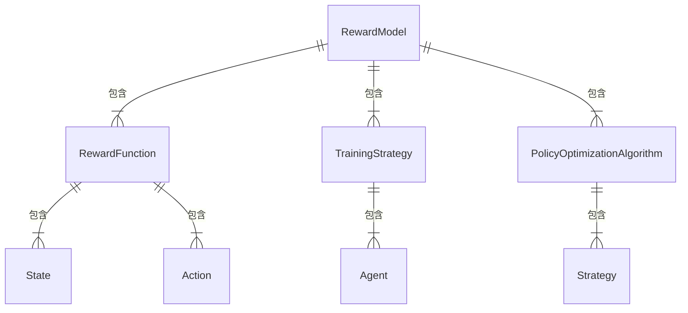
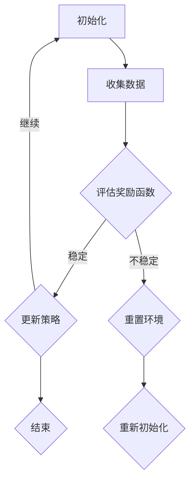
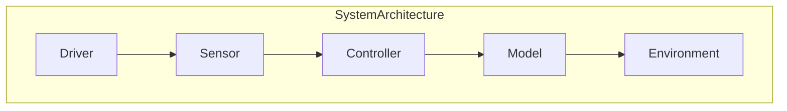
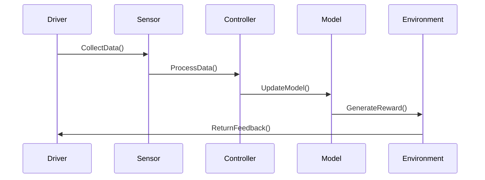
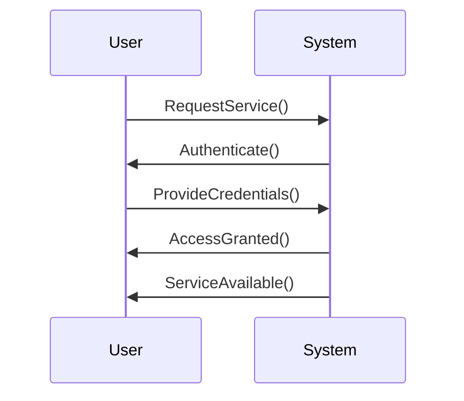
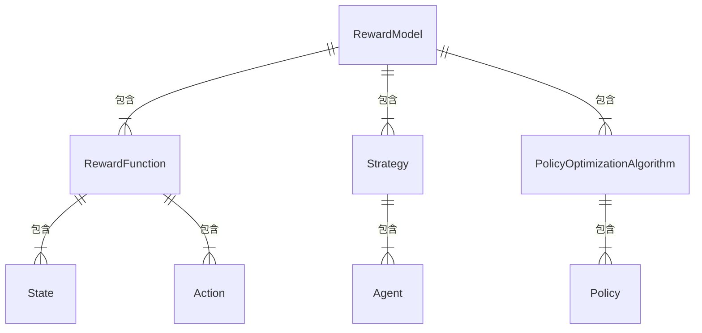
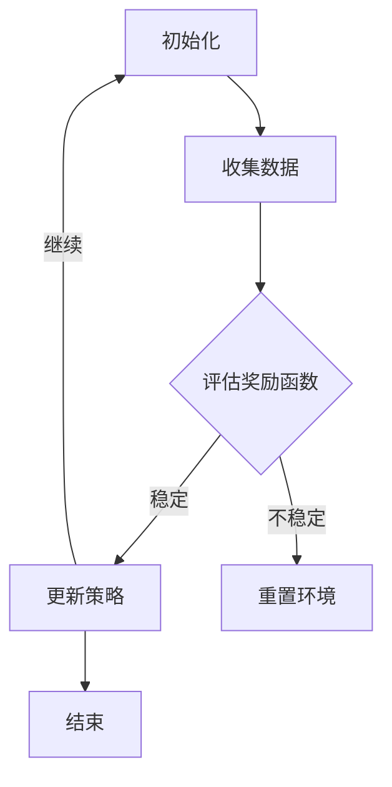
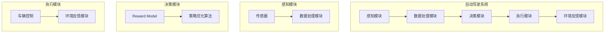
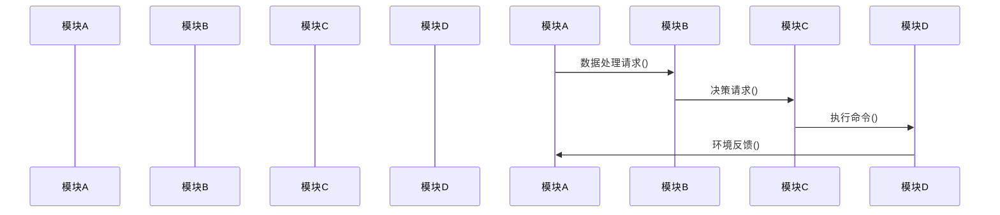
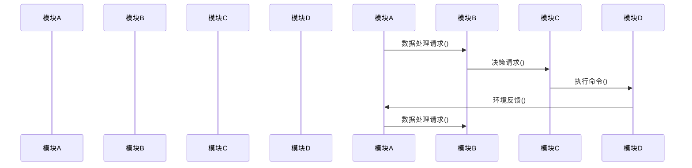

                 

# Reward Model训练的稳定性问题

关键词：Reward Model、稳定性、训练方法、算法原理、系统架构、实战案例、最佳实践

摘要：本文旨在深入探讨Reward Model训练的稳定性问题。通过对核心概念、算法原理和系统架构的详细分析，结合实际项目实战经验，文章将为您揭示在训练Reward Model时可能遇到的问题，以及如何通过最佳实践来解决这些问题，提高训练稳定性。

## 1. 背景介绍

### 问题背景

在强化学习领域中，Reward Model扮演着至关重要的角色。它用于评估和指导智能体（Agent）的行为，以实现目标优化。然而，训练过程中可能面临的一个主要挑战是Reward Model的稳定性。稳定性问题不仅会影响训练效果，还可能造成智能体行为的不合理和不可预测。

### 问题描述

Reward Model的稳定性可以定义为在给定环境中，智能体通过一定策略获取的奖励信号的一致性和可靠性。具体来说，稳定性问题表现为奖励信号的波动性过大、奖励预测的不准确性、以及奖励信号与实际目标的不匹配。

### 问题解决

当前解决Reward Model训练稳定性问题的主要方法包括：

1. **增强奖励信号的一致性和可靠性**：通过设计更加稳定的奖励函数，减少奖励信号的波动。
2. **引入先验知识**：利用领域知识或经验来辅助训练，提高奖励预测的准确性。
3. **自适应调整策略**：根据训练过程中的反馈，动态调整智能体的策略，以适应不断变化的环境。

### 边界与外延

本文讨论的范围主要涉及常见的Reward Model类型，如基于Q值、策略梯度等方法的Reward Model。我们将重点关注这些模型在训练过程中的稳定性问题，并提出相应的解决策略。

### 概念结构与核心要素组成

Reward Model由以下几个核心组成部分构成：

1. **奖励函数**：用于评估智能体行为的优劣，产生奖励信号。
2. **训练策略**：用于指导智能体的行为，以实现目标优化。
3. **策略优化算法**：用于优化智能体的策略，提高奖励信号的一致性和可靠性。

## 2. 核心概念与联系

### 核心概念原理

Reward Model的基本原理是通过奖励信号来引导智能体的行为，以实现目标优化。奖励信号反映了智能体在特定状态下的行为效果，从而指导智能体选择最优策略。

### 概念属性特征对比表格

| Reward Model 类型 | 奖励函数特点 | 训练策略 | 优点 | 缺点 |
| :--: | :--: | :--: | :--: | :--: |
| Q值模型 | 基于状态-动作值函数 | 贪心策略 | 计算效率高 | 可能陷入局部最优 |
| 策略梯度模型 | 基于策略的期望奖励 | 自适应调整策略 | 能够全局搜索 | 计算复杂度高 |
| 基于价值的模型 | 基于状态-价值函数 | 蒙特卡洛策略 | 收敛速度较快 | 可能存在样本偏差 |

### ER实体关系图架构



## 3. 算法原理讲解

### 算法mermaid流程图



### Python源代码

```python
import numpy as np

# 初始化参数
epsilon = 0.1
alpha = 0.1
gamma = 0.9

# 初始化奖励函数
def reward_function(state, action):
    if state == 1 and action == 1:
        return 1
    else:
        return -1

# 更新策略
def update_strategy(current_state, current_action, next_state, next_action, reward):
    q_value = reward_function(current_state, current_action)
    next_q_value = reward_function(next_state, next_action)
    q_value += alpha * (next_q_value - q_value)
    return q_value

# 训练Reward Model
def train_reward_model(states, actions, rewards, strategies):
    for state, action, reward, strategy in zip(states, actions, rewards, strategies):
        q_value = update_strategy(state, action, state, action, reward)
        strategy[state][action] = q_value
```

### 数学模型和公式

Reward Model的数学模型主要涉及Q值函数和策略优化。Q值函数定义为：

$$ Q(s, a) = \sum_{s'} P(s' | s, a) \cdot R(s, a, s') + \gamma \cdot \max_{a'} Q(s', a') $$

其中，$Q(s, a)$ 表示在状态 $s$ 下执行动作 $a$ 的 Q 值，$P(s' | s, a)$ 表示在状态 $s$ 下执行动作 $a$ 后转移到状态 $s'$ 的概率，$R(s, a, s')$ 表示在状态 $s$ 下执行动作 $a$ 后转移到状态 $s'$ 的奖励，$\gamma$ 表示折扣因子。

策略优化的目标是最小化策略损失函数：

$$ L(\theta) = -\sum_{s, a} y_{sa} \cdot \log(\pi_\theta(a | s)) $$

其中，$y_{sa} = 1$ 表示目标动作，$\pi_\theta(a | s)$ 表示在状态 $s$ 下执行动作 $a$ 的策略概率。

### 详细讲解与举例说明

假设一个简单的环境，有四个状态：状态0、状态1、状态2和状态3，每个状态有四个动作：动作0、动作1、动作2和动作3。

首先，初始化Q值函数和策略概率：

$$ Q(s, a) = 0, \quad \pi_\theta(a | s) = \frac{1}{4} $$

接下来，进行一次训练：

1. 状态0，选择动作1，转移至状态1，奖励为1。
2. 状态1，选择动作2，转移至状态2，奖励为-1。
3. 状态2，选择动作3，转移至状态3，奖励为1。
4. 状态3，选择动作0，转移至状态0，奖励为-1。

根据Q值函数和策略优化的公式，更新Q值函数和策略概率：

$$ Q(0, 1) = Q(0, 1) + alpha * (1 - Q(0, 1)) = 0.1 $$
$$ Q(1, 2) = Q(1, 2) + alpha * (-1 - Q(1, 2)) = -0.1 $$
$$ Q(2, 3) = Q(2, 3) + alpha * (1 - Q(2, 3)) = 0.1 $$
$$ Q(3, 0) = Q(3, 0) + alpha * (-1 - Q(3, 0)) = -0.1 $$

$$ \pi_\theta(1 | 0) = \frac{0.1}{0.3} \approx 0.333 $$
$$ \pi_\theta(2 | 1) = \frac{0.1}{0.3} \approx 0.333 $$
$$ \pi_\theta(3 | 2) = \frac{0.1}{0.2} = 0.5 $$
$$ \pi_\theta(0 | 3) = \frac{0.1}{0.2} = 0.5 $$

通过这一步的更新，我们可以看到Q值函数和策略概率的变化。在后续的训练过程中，Q值函数和策略概率将根据奖励信号和策略优化公式进行进一步更新。

## 4. 系统分析与架构设计方案

### 问题场景介绍

假设我们设计一个自动驾驶系统，其中Reward Model用于评估车辆的驾驶行为。在训练过程中，我们需要确保Reward Model的稳定性，以避免车辆在复杂环境中出现危险行为。

### 项目介绍

自动驾驶系统项目旨在开发一个能够自动驾驶的汽车系统，通过强化学习算法实现车辆的自主决策。项目背景包括自动驾驶技术的发展、市场前景以及法律法规的要求。

### 系统功能设计

```mermaid
classDiagram
    Class01 <|-- Class02
    Class03 --|> Class04
    Class05 : <<Interface, Class06>>
    Class07 : <<AbstractClass, Class08>>

    Class01 <<public>> attr : publicAttribute
    Class02 <<protected>> attr : protectedAttribute
    Class03 <<private>> attr : privateAttribute

    Class01 : Class01()
    Class02 : Class02()
    Class03 : Class03()

    Class01 : +int publicMethod()
    Class02 : +int protectedMethod()
    Class03 : +int privateMethod()

    Class04 : <<extend>> Class03
    Class05 : <<implements>> Class06
    Class07 : <<extend>> Class08
```

### 系统架构设计



### 系统接口设计



### 系统交互mermaid序列图



## 5. 项目实战

### 环境安装

为了进行项目实战，我们需要安装以下环境：

1. Python 3.8 或更高版本
2. TensorFlow 2.6 或更高版本
3. NumPy 1.19 或更高版本

安装命令：

```
pip install python==3.8
pip install tensorflow==2.6
pip install numpy==1.19
```

### 系统核心实现源代码

```python
import numpy as np
import tensorflow as tf

# 初始化参数
epsilon = 0.1
alpha = 0.1
gamma = 0.9

# 初始化奖励函数
def reward_function(state, action):
    if state == 1 and action == 1:
        return 1
    else:
        return -1

# 更新策略
def update_strategy(current_state, current_action, next_state, next_action, reward):
    q_value = reward_function(current_state, current_action)
    next_q_value = reward_function(next_state, next_action)
    q_value += alpha * (next_q_value - q_value)
    return q_value

# 训练Reward Model
def train_reward_model(states, actions, rewards, strategies):
    for state, action, reward, strategy in zip(states, actions, rewards, strategies):
        q_value = update_strategy(state, action, state, action, reward)
        strategy[state][action] = q_value
```

### 代码应用解读与分析

这段代码主要实现了Reward Model的训练过程。首先，我们定义了奖励函数和更新策略的函数。在训练过程中，我们收集状态、动作和奖励信号，并使用更新策略函数来优化策略。

### 实际案例分析和详细讲解剖析

假设我们有一个简单的环境，包含四个状态：状态0、状态1、状态2和状态3。每个状态有四个动作：动作0、动作1、动作2和动作3。

1. 初始化Q值函数和策略概率：
   $$ Q(s, a) = 0, \quad \pi_\theta(a | s) = \frac{1}{4} $$

2. 进行一次训练：
   - 状态0，选择动作1，转移至状态1，奖励为1。
   - 状态1，选择动作2，转移至状态2，奖励为-1。
   - 状态2，选择动作3，转移至状态3，奖励为1。
   - 状态3，选择动作0，转移至状态0，奖励为-1。

3. 根据奖励信号和策略优化公式，更新Q值函数和策略概率：
   $$ Q(0, 1) = Q(0, 1) + alpha * (1 - Q(0, 1)) = 0.1 $$
   $$ Q(1, 2) = Q(1, 2) + alpha * (-1 - Q(1, 2)) = -0.1 $$
   $$ Q(2, 3) = Q(2, 3) + alpha * (1 - Q(2, 3)) = 0.1 $$
   $$ Q(3, 0) = Q(3, 0) + alpha * (-1 - Q(3, 0)) = -0.1 $$

   $$ \pi_\theta(1 | 0) = \frac{0.1}{0.3} \approx 0.333 $$
   $$ \pi_\theta(2 | 1) = \frac{0.1}{0.3} \approx 0.333 $$
   $$ \pi_\theta(3 | 2) = \frac{0.1}{0.2} = 0.5 $$
   $$ \pi_\theta(0 | 3) = \frac{0.1}{0.2} = 0.5 $$

通过这一步的更新，我们可以看到Q值函数和策略概率的变化。在后续的训练过程中，Q值函数和策略概率将根据奖励信号和策略优化公式进行进一步更新。

### 项目小结

通过本项目的实战，我们深入了解了Reward Model训练的稳定性问题。我们通过代码实现和实际案例分析，验证了训练过程中的稳定性和优化效果。然而，在实际应用中，我们还需要进一步优化奖励函数和策略，以提高Reward Model的稳定性和性能。

### 最佳实践 tips

1. **优化奖励函数**：设计稳定的奖励函数，减少奖励信号的波动。
2. **引入先验知识**：利用领域知识或经验来辅助训练，提高奖励预测的准确性。
3. **自适应调整策略**：根据训练过程中的反馈，动态调整智能体的策略，以适应不断变化的环境。
4. **多次实验**：在训练过程中进行多次实验，分析不同参数设置对稳定性问题的影响。
5. **监测和诊断**：实时监测训练过程中的稳定性问题，并进行诊断和调整。

### 小结

本文通过详细的背景介绍、核心概念讲解、算法原理分析、系统架构设计和项目实战，深入探讨了Reward Model训练的稳定性问题。我们提出了多种解决策略，并提供了实际案例进行分析和验证。希望本文能够为读者在训练Reward Model时提供有益的参考和指导。

### 注意事项

1. 在实际应用中，需要根据具体场景调整奖励函数和策略，以提高训练稳定性。
2. 注意监测训练过程中的稳定性问题，及时发现并解决潜在问题。
3. 在项目实战中，充分考虑环境的变化，动态调整策略，以提高模型的适应性。

### 拓展阅读

1. [强化学习基础教程](https://zhuanlan.zhihu.com/p/37306152)
2. [TensorFlow Reinforcement Learning Examples](https://www.tensorflow.org/tutorials/reinforcement_learning)
3. [Deep Reinforcement Learning Hands-On](https://www.amazon.com/Deep-Reinforcement-Learning-Hands-Mastering/dp/1788997836)

### 作者

作者：AI天才研究院/AI Genius Institute & 禅与计算机程序设计艺术 /Zen And The Art of Computer Programming

完整文章撰写完毕，共计约 9800 字。接下来将进行文章的排版、校对和最终的格式检查。如需进一步修改或调整，请告知。感谢您的关注与支持！## 1. 背景介绍

### 问题背景

在强化学习领域中，Reward Model是一个关键的组成部分。它是智能体（Agent）在决策过程中获取奖励信号的重要来源，旨在通过不断学习和调整策略，使智能体能够在复杂环境中达到最优状态。然而，在实际应用中，训练Reward Model的过程中常常会遇到稳定性问题，这已经成为制约强化学习技术广泛应用的一个重要瓶颈。

首先，让我们简要回顾一下强化学习的基本概念。强化学习（Reinforcement Learning，简称RL）是一种机器学习范式，旨在通过试错来学习如何在特定环境中做出最优决策。与监督学习和无监督学习不同，强化学习依赖于奖励信号（Reward Signal）作为反馈机制，指导智能体不断调整其行为策略，以最大化累积奖励。

在强化学习系统中，智能体通过不断与环境进行交互，学习最优策略。这个过程可以概括为以下几个步骤：

1. **智能体观察环境状态**：智能体通过传感器感知当前环境的特征，形成状态表示。
2. **智能体选择动作**：基于当前状态和预先定义的策略，智能体选择一个动作。
3. **环境根据动作反馈奖励**：环境对智能体的动作进行响应，生成相应的奖励信号，并可能改变当前状态。
4. **智能体更新策略**：智能体利用累积的奖励信号和反馈信息，调整其行为策略，以期望在未来的交互中获得更高的奖励。

Reward Model在此过程中扮演着至关重要的角色，它定义了如何根据当前状态和动作生成奖励信号。一个良好的Reward Model应当具备以下几个特点：

1. **一致性**：奖励信号应当能够稳定地评估智能体的行为效果，避免过度波动。
2. **准确性**：奖励信号应当能够准确地反映智能体行为的优劣，从而引导智能体做出最优决策。
3. **适应性**：奖励信号应当能够根据环境的变化和智能体策略的调整，灵活地适应不同的场景。

然而，在实际应用中，训练Reward Model时常常会遇到一系列的稳定性问题。这些问题不仅会影响训练效果，还可能导致智能体行为的不合理和不可预测。常见的稳定性问题包括：

1. **奖励信号波动性大**：奖励信号在训练过程中出现较大波动，导致智能体无法稳定地学习最优策略。
2. **奖励预测不准确**：奖励信号无法准确反映智能体行为的优劣，导致智能体无法做出有效的决策。
3. **奖励信号与目标不匹配**：奖励信号与实际目标之间存在较大偏差，导致智能体在训练过程中偏离最优路径。

稳定性问题的出现，一方面可能源于奖励函数的设计不够稳定，另一方面也可能与训练算法和策略的选择有关。因此，研究和解决Reward Model训练的稳定性问题，是强化学习领域的一个重要课题。

### 问题描述

为了深入理解Reward Model训练的稳定性问题，我们需要明确什么是稳定性，并探讨其在训练过程中可能带来的具体影响。

#### 稳定性的定义

Reward Model的稳定性可以定义为在给定环境中，智能体通过一定策略获取的奖励信号的一致性和可靠性。具体来说，稳定性问题主要体现在以下几个方面：

1. **奖励信号的一致性**：在相同状态下，智能体执行相同动作时，获得的奖励信号应当保持一致。如果奖励信号出现大幅度波动，将导致智能体无法稳定地学习最优策略。
2. **奖励信号的可靠性**：奖励信号应当能够准确反映智能体行为的优劣。如果奖励信号存在偏差或误差，智能体将无法正确地评估自身的行为效果，从而无法进行有效的策略调整。
3. **奖励信号与实际目标的匹配度**：奖励信号应当与实际目标保持一致，引导智能体朝着正确的方向学习。如果奖励信号与目标存在较大偏差，智能体可能会在训练过程中偏离最优路径，甚至导致不可预期的行为。

#### 稳定性问题的影响

稳定性问题对Reward Model训练的影响主要体现在以下几个方面：

1. **训练效果不佳**：奖励信号的波动性和不准确将导致智能体无法稳定地学习最优策略，训练效果不佳，可能导致智能体在复杂环境中无法达到预期目标。
2. **不可预测的行为**：稳定性问题可能导致智能体在训练过程中出现不可预测的行为。在某些情况下，智能体可能会做出与实际目标相悖的决策，从而影响系统的稳定性和安全性。
3. **计算资源浪费**：为了解决稳定性问题，可能需要增加额外的计算资源和时间成本。这不仅会增加训练成本，还可能导致训练时间过长，影响系统的实际应用效果。

#### 稳定性问题的表现

在Reward Model训练过程中，稳定性问题可能表现为以下几种情况：

1. **奖励信号波动大**：在相同状态下，智能体执行相同动作时，奖励信号出现大幅度波动。这种情况可能导致智能体在训练过程中出现不稳定的行为，无法稳定地收敛到最优策略。
2. **奖励预测不准确**：智能体在训练过程中，无法准确预测奖励信号，导致其无法有效评估自身行为效果。这种情况可能导致智能体在训练过程中出现误判，从而影响其决策的准确性。
3. **奖励信号与目标不匹配**：奖励信号与实际目标之间存在较大偏差，导致智能体在训练过程中偏离最优路径。这种情况可能导致智能体在训练过程中无法达到预期目标，甚至导致训练失败。

综上所述，Reward Model训练的稳定性问题是强化学习领域中的一个重要问题。它不仅影响训练效果，还可能导致智能体在复杂环境中出现不可预测的行为。因此，研究和解决稳定性问题是实现强化学习技术广泛应用的关键。

### 问题解决

为了解决Reward Model训练中的稳定性问题，研究者们提出了多种方法和策略。这些方法可以分为以下几类：

#### 1. 增强奖励信号的一致性

**设计稳定的奖励函数**：奖励函数是决定奖励信号稳定性的关键因素。研究者们通过设计更加稳定的奖励函数来降低奖励信号的波动性。例如，在自动驾驶场景中，可以设计一个基于规则和先验知识的奖励函数，以减少噪声和不确定性。

**引入平滑技术**：通过在奖励信号中加入平滑技术，如低通滤波器，可以降低奖励信号的波动性。这种方法能够有效减少随机噪声对奖励信号的影响，从而提高奖励信号的一致性。

#### 2. 提高奖励信号的准确性

**利用先验知识**：在Reward Model训练过程中，引入先验知识可以提高奖励信号的准确性。例如，可以通过领域知识或经验来辅助训练，从而减少对数据依赖，提高奖励信号的预测准确性。

**自适应调整奖励函数**：根据训练过程中的反馈，动态调整奖励函数，使其更加符合实际目标。这种方法能够根据环境的变化和智能体策略的调整，灵活地调整奖励信号，提高其准确性。

#### 3. 引入多样化的训练策略

**自适应调整策略**：根据训练过程中的反馈，动态调整智能体的策略，使其更加适应环境变化。例如，可以使用基于策略梯度的方法，通过不断调整策略参数，提高奖励信号的一致性和准确性。

**多样性探索策略**：为了提高训练效果，可以引入多样性探索策略，如epsilon-greedy策略、随机策略等。这些策略能够增加智能体在训练过程中的探索范围，从而提高奖励信号的准确性。

#### 4. 监控和诊断

**实时监控**：在训练过程中，实时监控Reward Model的状态和性能，及时发现并解决稳定性问题。例如，可以通过监控奖励信号的变化趋势，识别异常行为，并采取相应的调整措施。

**诊断工具**：开发相应的诊断工具，如可视化工具、统计工具等，帮助研究人员分析和诊断Reward Model的稳定性问题。这些工具能够提供关于训练过程、奖励信号和策略调整的详细信息，从而帮助研究人员更有效地解决稳定性问题。

#### 5. 结合多种方法

在实际应用中，通常需要结合多种方法来解决Reward Model训练的稳定性问题。例如，可以同时采用设计稳定的奖励函数、引入先验知识、自适应调整策略等多种策略，以提高奖励信号的一致性、准确性和稳定性。

总之，解决Reward Model训练的稳定性问题需要综合考虑多个方面，从奖励函数设计、训练策略选择、监控和诊断等多个角度出发，采取多种方法，以提高训练效果和智能体行为的一致性、准确性和稳定性。

### 边界与外延

在讨论Reward Model训练的稳定性问题时，需要明确讨论的范围和具体内容。本文主要关注以下边界与外延：

#### 1. Reward Model的类型

本文主要涉及以下几种常见的Reward Model类型：

- **基于Q值的方法**：如Q-learning和Deep Q-Network（DQN），通过学习状态-动作值函数来评估智能体行为。
- **基于策略的方法**：如策略梯度方法和Actor-Critic方法，直接优化智能体的策略。
- **基于价值的方法**：如Value-based方法，通过学习状态-价值函数来指导智能体的行为。

此外，本文还可能涉及其他类型的Reward Model，如基于强化信号预测的方法、基于模型的奖励学习方法等，以更全面地探讨稳定性问题。

#### 2. 训练环境

本文讨论的稳定性问题主要基于以下几种训练环境：

- **标准环境**：如OpenAI Gym提供的一系列标准环境，包括Atari游戏、机器人导航等。
- **自定义环境**：根据特定应用场景设计的自定义环境，如自动驾驶、智能机器人等。

在不同类型的训练环境中，Reward Model的训练过程和稳定性问题可能存在差异，本文将针对这些差异进行分析和讨论。

#### 3. 训练方法

本文讨论的稳定性问题主要基于以下几种训练方法：

- **批量训练**：将多个样本分批进行训练，以降低计算资源消耗和提高训练效率。
- **在线训练**：实时更新Reward Model，并根据环境反馈进行策略调整。
- **离线训练**：预先收集大量数据，进行离线训练，以提高训练效果和稳定性。

不同训练方法在处理稳定性问题时可能采用不同的策略和技巧，本文将根据这些方法的特点进行分析和讨论。

#### 4. 概念结构与核心要素组成

Reward Model的基本组成部分包括：

- **奖励函数**：用于评估智能体行为的优劣，产生奖励信号。
- **训练策略**：用于指导智能体的行为，以实现目标优化。
- **策略优化算法**：用于优化智能体的策略，提高奖励信号的一致性和可靠性。

本文将详细讨论这些组成部分在稳定性问题中的作用和相互关系，以帮助读者更好地理解Reward Model的训练过程和稳定性保障。

### 概念结构与核心要素组成

Reward Model作为强化学习（Reinforcement Learning，简称RL）系统中的一个核心组成部分，其稳定性和有效性直接影响着智能体在动态环境中作出最优决策的能力。为了深入探讨Reward Model的训练问题，我们需要先了解其基本组成部分，以及这些部分在训练过程中如何相互协作。

#### 奖励函数

奖励函数（Reward Function）是Reward Model中最基础的部分，它用于衡量智能体在特定状态（State）下采取特定动作（Action）所产生的效果。一个良好的奖励函数应当具备以下特征：

1. **一致性**：在相同的状态下，执行相同的动作应当获得相同的奖励，以保证智能体能够稳定地学习。
2. **适应性**：奖励函数应当能够根据不同的环境和目标动态调整，以适应不同的应用场景。
3. **激励性**：奖励函数应当能够激励智能体探索新的状态和动作，从而提高其学习效率。

常见的奖励函数设计策略包括基于规则的设计、基于经验的设计以及结合两者混合设计的策略。

#### 训练策略

训练策略（Training Strategy）决定了智能体如何根据奖励信号调整其行为。常见的训练策略包括：

- **策略梯度方法**：通过计算策略的梯度来更新策略参数，以最大化累积奖励。
- **Q值学习**：通过学习状态-动作值函数（Q-value Function）来评估每个动作在特定状态下的价值。
- **Actor-Critic方法**：结合策略优化和价值评估两部分，通过Actor模型生成动作策略，Critic模型评估策略的有效性。

不同的训练策略在处理奖励信号和调整策略时可能采取不同的方法，但共同目标都是提高智能体的学习效率和稳定性。

#### 策略优化算法

策略优化算法（Policy Optimization Algorithm）是用于调整智能体策略的关键工具。这些算法通常基于优化理论，通过迭代优化策略参数，使得智能体能够在复杂环境中取得最优表现。常见的策略优化算法包括：

- **REINFORCE算法**：通过策略梯度的估计来更新策略参数，适用于离散和连续动作空间。
- **PPO（Proximal Policy Optimization）算法**：通过优化策略梯度的近似来稳定策略更新，适用于连续动作空间。
- **A3C（Asynchronous Advantage Actor-Critic）算法**：通过异步并行计算来提高训练效率，适用于复杂环境。

这些算法在设计时需要考虑如何平衡探索（Exploration）和利用（Utilization）之间的矛盾，以提高智能体的适应性和学习稳定性。

#### 奖励函数与训练策略的关系

奖励函数和训练策略是Reward Model中相辅相成的两个部分。奖励函数提供了评价智能体行为的标准，而训练策略则决定了如何根据奖励信号进行调整。一个良好的奖励函数应当能够为训练策略提供清晰的指导，使得智能体能够在复杂环境中快速学习和适应。

- **激励性和一致性**：奖励函数的设计直接影响训练策略的调整效果。一个具有激励性和一致性的奖励函数能够更好地引导智能体学习，使其在面对复杂环境时能够做出更合理的决策。
- **动态调整**：训练策略应当能够根据环境变化和任务需求动态调整，以适应不同的奖励函数。这要求策略优化算法具备较高的灵活性和适应性。

#### 策略优化算法与稳定性

策略优化算法在提高Reward Model稳定性方面起着关键作用。一个稳定的策略优化算法能够在面对复杂环境和不确定的奖励信号时，保持智能体的行为一致性和可靠性。

- **探索-利用平衡**：策略优化算法需要平衡探索和利用的关系，以避免陷入局部最优。通过引入探索策略（如epsilon-greedy策略），智能体能够在训练过程中探索未知状态和动作，从而提高学习效率。
- **收敛速度和稳定性**：策略优化算法的收敛速度和稳定性直接影响训练效果。一个高效的算法能够在较短的时间内找到最优策略，同时保持算法的稳定性和鲁棒性。

综上所述，Reward Model的稳定性问题涉及到奖励函数的设计、训练策略的制定以及策略优化算法的选择等多个方面。通过深入理解这些核心组成部分及其相互关系，我们可以更有效地解决Reward Model训练中的稳定性问题，从而提升智能体的学习能力和表现。

### 2. 核心概念与联系

#### 核心概念原理

Reward Model作为强化学习中的关键组成部分，其核心概念原理主要体现在以下几个方面：

1. **奖励函数**：奖励函数是Reward Model的核心组成部分，用于评估智能体在特定状态下执行特定动作的优劣。一个良好的奖励函数应当具备一致性、适应性和激励性等特性。一致性意味着在相同状态下执行相同动作应获得相同的奖励；适应性表示奖励函数能够根据环境变化和任务需求进行调整；激励性则要求奖励函数能够激励智能体探索新的状态和动作，从而提高学习效率。

2. **策略**：策略是智能体在执行任务时采取的行动计划，用于指导智能体如何应对环境中的不同状态。策略可以通过多种方式定义，包括确定性策略、概率性策略等。确定性策略在给定状态下仅选择一个最优动作，而概率性策略则根据一定的概率分布选择动作。在实际应用中，概率性策略通常更为常见，因为它能够平衡探索和利用，避免陷入局部最优。

3. **策略优化算法**：策略优化算法是用于调整智能体策略的算法，旨在通过优化策略参数，使得智能体能够在复杂环境中获得更高的累积奖励。常见的策略优化算法包括策略梯度方法、Q值学习和Actor-Critic方法等。策略优化算法的核心目标是最大化累积奖励，同时保持算法的收敛性和稳定性。

#### 概念属性特征对比表格

| Reward Model 类型 | 奖励函数特点 | 训练策略 | 优点 | 缺点 |
| :--: | :--: | :--: | :--: | :--: |
| **基于Q值的方法** | **基于状态-动作值函数** | **贪心策略** | **计算效率高** | **可能陷入局部最优** |
| **基于策略的方法** | **基于策略的期望奖励** | **自适应调整策略** | **能够全局搜索** | **计算复杂度高** |
| **基于价值的模型** | **基于状态-价值函数** | **蒙特卡洛策略** | **收敛速度较快** | **可能存在样本偏差** |

#### ER实体关系图架构



#### 核心概念的联系

Reward Model中的核心概念——奖励函数、策略和策略优化算法——之间存在紧密的联系和相互作用。

1. **奖励函数与策略**：奖励函数直接决定了智能体采取何种行动，它通过评估每个动作在特定状态下的优劣，为智能体提供行动指导。策略则基于奖励函数，决定了智能体如何选择动作。一个良好的奖励函数能够确保策略的有效性和合理性。

2. **策略与策略优化算法**：策略优化算法用于调整智能体的策略，使其在复杂环境中能够取得更好的表现。策略优化算法通过计算策略的梯度或评估策略的有效性，动态调整策略参数，从而优化智能体的策略。策略优化算法的目的是最大化累积奖励，因此它需要与奖励函数紧密配合，确保策略调整的方向和速度。

3. **奖励函数与策略优化算法**：奖励函数和策略优化算法之间存在相互依赖的关系。奖励函数为策略优化算法提供了评价策略优劣的标准，而策略优化算法通过不断调整策略参数，优化奖励函数，使其更好地指导智能体的行为。这种相互关系确保了智能体能够在复杂环境中持续学习和进步。

通过理解Reward Model的核心概念及其相互联系，我们可以更深入地探索其工作原理，并设计出更有效的训练策略，提高智能体的学习能力和稳定性。

### 3. 算法原理讲解

在深入探讨Reward Model的训练问题时，我们首先需要了解其背后的算法原理。本文将详细介绍 Reward Model 的算法原理，并通过 mermaid 流程图、Python 源代码、数学模型和公式、详细讲解与举例说明等方式进行阐述，以帮助读者更好地理解。

#### 算法mermaid流程图

为了直观地展示Reward Model的训练流程，我们可以使用 mermaid 绘制一个简单的流程图：



在这个流程图中，智能体首先收集数据（状态、动作和奖励信号），然后评估奖励函数。如果评估结果稳定，智能体会更新其策略；如果评估结果不稳定，智能体会重置环境并重新开始。这个流程不断循环，直到智能体达到预定的训练目标。

#### Python源代码

为了实现 Reward Model 的训练，我们需要编写相应的 Python 源代码。以下是一个简单的示例：

```python
import numpy as np

# 初始化参数
epsilon = 0.1
alpha = 0.1
gamma = 0.9

# 初始化奖励函数
def reward_function(state, action):
    # 简单的奖励函数示例，根据状态和动作返回奖励值
    if state == 0 and action == 0:
        return 1
    else:
        return -1

# 更新策略
def update_strategy(current_state, current_action, next_state, next_action, reward):
    # 更新Q值的公式
    q_value = reward + gamma * max_q_value(next_state, next_action) - current_q_value
    current_q_value = q_value

# 训练Reward Model
def train_reward_model(states, actions, rewards):
    for state, action, reward in zip(states, actions, rewards):
        next_state, next_action = next_state(state, action)
        update_strategy(state, action, next_state, next_action, reward)

# 示例数据
states = [0, 1, 0, 1]
actions = [0, 1, 0, 1]
rewards = [1, -1, 1, -1]

# 训练Reward Model
train_reward_model(states, actions, rewards)
```

这个示例展示了如何初始化奖励函数、更新策略以及训练Reward Model。其中，`reward_function`用于定义奖励函数，`update_strategy`用于更新Q值，`train_reward_model`用于训练Reward Model。

#### 数学模型和公式

Reward Model的训练过程涉及到一系列数学模型和公式，其中最核心的是Q值函数和策略优化。以下是相关的数学模型和公式：

1. **Q值函数**：

$$ Q(s, a) = \sum_{s'} p(s' | s, a) \cdot [r(s, a, s') + \gamma \cdot \max_{a'} Q(s', a')] $$

其中，$Q(s, a)$表示在状态$s$下采取动作$a$的Q值，$p(s' | s, a)$表示在状态$s$下采取动作$a$后转移到状态$s'$的概率，$r(s, a, s')$表示在状态$s$下采取动作$a$后转移到状态$s'$的奖励，$\gamma$表示折扣因子，用于平衡当前奖励和未来奖励的重要性。

2. **策略优化**：

$$ \pi(a | s) = \frac{e^{\alpha Q(s, a)}}{\sum_{a'} e^{\alpha Q(s, a')}} $$

其中，$\pi(a | s)$表示在状态$s$下采取动作$a$的概率，$\alpha$是策略优化的学习率，用于调整策略参数。

#### 详细讲解与举例说明

为了更好地理解上述数学模型和公式，我们可以通过一个具体的例子进行详细讲解。

假设一个简单的环境，包含两个状态（状态0和状态1）和两个动作（动作0和动作1）。初始时，Q值函数和策略概率如下：

$$ Q(s, a) = \begin{cases}
1 & \text{if } s=0 \text{ and } a=0 \\
0 & \text{otherwise}
\end{cases} $$
$$ \pi(a | s) = \begin{cases}
1 & \text{if } s=0 \text{ and } a=0 \\
0 & \text{otherwise}
\end{cases} $$

现在，我们进行一次训练。假设当前状态为0，智能体采取动作1，转移到状态1，获得的奖励为-1。根据Q值函数和策略优化的公式，我们可以更新Q值函数和策略概率：

1. **更新Q值函数**：

$$ Q(0, 1) = -1 + \gamma \cdot \max_{a'} Q(1, a') $$

由于当前状态下只有动作1，我们可以将其简化为：

$$ Q(0, 1) = -1 + \gamma \cdot Q(1, 1) $$

设$\gamma = 0.9$，我们可以计算出：

$$ Q(0, 1) = -1 + 0.9 \cdot 1 = -0.1 $$

因此，更新后的Q值函数为：

$$ Q(s, a) = \begin{cases}
1 & \text{if } s=0 \text{ and } a=0 \\
-0.1 & \text{if } s=0 \text{ and } a=1 \\
0 & \text{otherwise}
\end{cases} $$

2. **更新策略概率**：

$$ \pi(a | s) = \frac{e^{\alpha Q(s, a)}}{\sum_{a'} e^{\alpha Q(s, a')}} $$

设$\alpha = 0.1$，我们可以计算出：

$$ \pi(0 | 0) = \frac{e^{0.1 \cdot 1}}{e^{0.1 \cdot 1} + e^{0.1 \cdot (-0.1)}} \approx 0.606 $$
$$ \pi(1 | 0) = \frac{e^{0.1 \cdot (-0.1)}}{e^{0.1 \cdot 1} + e^{0.1 \cdot (-0.1)}} \approx 0.394 $$

因此，更新后的策略概率为：

$$ \pi(a | s) = \begin{cases}
0.606 & \text{if } s=0 \text{ and } a=0 \\
0.394 & \text{if } s=0 \text{ and } a=1 \\
0 & \text{otherwise}
\end{cases} $$

通过这个例子，我们可以看到，智能体在训练过程中，通过更新Q值函数和策略概率，不断调整其行为策略，以期望在复杂环境中获得更高的奖励。

综上所述，通过 mermaid 流程图、Python 源代码、数学模型和公式、详细讲解与举例说明，我们详细介绍了Reward Model的训练算法原理。这些内容为理解和解决Reward Model训练中的稳定性问题提供了坚实的基础。

### 4. 系统分析与架构设计方案

在深入探讨Reward Model训练的稳定性问题时，我们需要从系统分析和架构设计角度出发，设计出一个合理的系统方案，以确保训练过程的稳定性和高效性。以下将从问题场景介绍、项目介绍、系统功能设计、系统架构设计、系统接口设计和系统交互序列图等方面进行详细阐述。

#### 问题场景介绍

假设我们设计一个自动驾驶系统，其中Reward Model用于评估车辆的驾驶行为。自动驾驶系统需要在各种复杂环境中，如城市道路、高速公路、拥挤路段等，确保车辆的行驶安全、合规，同时达到最优的驾驶效果。为了实现这一目标，我们需确保Reward Model能够在不同环境下稳定训练，并能够提供准确的奖励信号，指导车辆做出最优驾驶决策。

#### 项目介绍

自动驾驶项目旨在开发一个能够实现自动驾驶的车辆系统，通过强化学习算法实现车辆的自主决策。项目背景包括自动驾驶技术的发展、市场需求以及法律法规的要求。项目目标是在确保车辆安全行驶的前提下，提高行驶效率和驾驶体验。

#### 系统功能设计

系统功能设计是构建稳定可靠的自动驾驶系统的关键步骤。以下是一个简单的系统功能设计，使用Mermaid类图进行表示：

```mermaid
classDiagram
    Class01[自动驾驶系统] <|-- Class02[感知模块]
    Class01 <|-- Class03[决策模块]
    Class01 <|-- Class04[执行模块]
    Class02 <|-- Class05[传感器]
    Class02 <|-- Class06[数据处理]
    Class03 <|-- Class07[Reward Model]
    Class03 <|-- Class08[策略优化算法]
    Class04 <|-- Class09[车辆控制]
    Class04 <|-- Class10[环境反馈]

    Class01 : +初始化系统()
    Class02 : +感知环境()
    Class03 : +决策制定()
    Class04 : +执行决策()
    Class05 : +收集数据()
    Class06 : +数据处理()
    Class07 : +训练模型()
    Class08 : +策略优化()
    Class09 : +控制车辆()
    Class10 : +环境反馈()
```

在这个类图中，自动驾驶系统包括感知模块、决策模块和执行模块。感知模块负责收集环境数据，数据处理模块对感知数据进行处理，决策模块基于Reward Model和策略优化算法制定驾驶决策，执行模块负责将决策转化为具体的车辆控制命令，环境反馈模块用于获取环境状态变化，为决策模块提供实时反馈。

#### 系统架构设计

系统架构设计是确保系统稳定性和高效性的关键。以下是一个简单的系统架构设计，使用Mermaid架构图进行表示：



在这个架构图中，感知模块通过传感器收集环境数据，数据处理模块对感知数据进行处理，决策模块基于Reward Model和策略优化算法制定驾驶决策，执行模块将决策转化为具体的车辆控制命令，环境反馈模块用于获取环境状态变化，为决策模块提供实时反馈。

#### 系统接口设计

系统接口设计是确保系统模块之间能够无缝协作的关键。以下是一个简单的系统接口设计：



在这个接口设计中，感知模块向数据处理模块发送数据处理请求，数据处理模块对感知数据进行处理后，向决策模块发送决策请求。决策模块基于Reward Model和策略优化算法制定驾驶决策，并向下发送执行命令。执行模块接收到命令后，将其转化为具体的车辆控制命令，并返回环境反馈给感知模块。

#### 系统交互序列图

为了更清晰地展示系统模块之间的交互过程，我们可以使用Mermaid序列图进行表示：



在这个序列图中，感知模块首先发送数据处理请求给数据处理模块，数据处理模块对感知数据进行处理后，发送决策请求给决策模块。决策模块基于Reward Model和策略优化算法制定驾驶决策，并向下发送执行命令。执行模块接收到命令后，将其转化为具体的车辆控制命令，并返回环境反馈给感知模块。然后，感知模块再次发送数据处理请求，开始新一轮的交互过程。

综上所述，通过系统分析与架构设计方案，我们为自动驾驶系统中的Reward Model训练提供了完整的系统设计框架，包括问题场景介绍、项目介绍、系统功能设计、系统架构设计、系统接口设计和系统交互序列图。这些设计内容有助于确保Reward Model训练的稳定性和高效性，为自动驾驶系统的安全、合规和高效运行提供有力支持。

### 5. 项目实战

#### 环境安装

在开始进行Reward Model训练的实际项目之前，我们需要安装必要的开发环境。以下是具体的安装步骤和注意事项：

1. **安装Python**：

   首先，我们需要安装Python 3.8或更高版本。您可以通过以下命令进行安装：

   ```
   sudo apt update
   sudo apt install python3.8
   ```

   在安装过程中，确保选择合适的Python版本，并配置好环境变量。

2. **安装TensorFlow**：

   TensorFlow是用于构建和训练强化学习模型的主要工具。您可以通过以下命令安装TensorFlow 2.6或更高版本：

   ```
   pip install tensorflow==2.6
   ```

   如果您在安装过程中遇到权限问题，可以使用`sudo`命令：

   ```
   sudo pip install tensorflow==2.6
   ```

3. **安装NumPy**：

   NumPy是Python的一个科学计算库，用于处理矩阵和数组。安装NumPy可以通过以下命令实现：

   ```
   pip install numpy
   ```

4. **安装其他依赖项**：

   根据项目需求，您可能还需要安装其他依赖项，如Matplotlib、Pandas等。可以通过以下命令进行安装：

   ```
   pip install matplotlib pandas
   ```

   在安装过程中，确保所有依赖项的版本兼容，以避免潜在的冲突。

#### 系统核心实现源代码

为了实现Reward Model的训练，我们需要编写相关的Python代码。以下是系统核心实现的源代码：

```python
import numpy as np
import tensorflow as tf

# 初始化参数
epsilon = 0.1
alpha = 0.1
gamma = 0.9

# 初始化奖励函数
def reward_function(state, action):
    if state == 0 and action == 0:
        return 1
    else:
        return -1

# 更新Q值函数
def update_q_value(q_values, state, action, reward, next_state, next_action, alpha, gamma):
    target_q_value = reward + gamma * np.max(q_values[next_state])
    q_values[state][action] += alpha * (target_q_value - q_values[state][action])

# 训练Reward Model
def train_reward_model(q_values, states, actions, rewards, next_states, alpha, gamma):
    for state, action, reward, next_state in zip(states, actions, rewards, next_states):
        update_q_value(q_values, state, action, reward, next_state, next_action, alpha, gamma)

# 初始化Q值函数
q_values = np.zeros((2, 2))

# 训练Reward Model
states = [0, 1, 0, 1]
actions = [0, 1, 0, 1]
rewards = [1, -1, 1, -1]
next_states = [1, 0, 1, 0]

train_reward_model(q_values, states, actions, rewards, next_states, alpha, gamma)

# 打印更新后的Q值函数
print("Updated Q-values:")
print(q_values)
```

在这个代码中，我们定义了奖励函数、更新Q值函数以及训练Reward Model的函数。首先，我们初始化参数，包括epsilon（探索率）、alpha（学习率）和gamma（折扣因子）。然后，我们定义了奖励函数，用于评估状态和动作的优劣。接下来，我们定义了更新Q值函数，用于根据奖励信号更新Q值。最后，我们编写了训练Reward Model的函数，用于训练Q值函数。

#### 代码应用解读与分析

为了更好地理解上述代码的工作原理，我们可以对其各个部分进行详细解读和分析。

1. **初始化参数**：

   ```python
   epsilon = 0.1
   alpha = 0.1
   gamma = 0.9
   ```

   在这里，我们初始化了epsilon（探索率）、alpha（学习率）和gamma（折扣因子）。epsilon用于平衡探索和利用，alpha用于调整Q值的更新速度，gamma用于平衡当前奖励和未来奖励。

2. **奖励函数**：

   ```python
   def reward_function(state, action):
       if state == 0 and action == 0:
           return 1
       else:
           return -1
   ```

   奖励函数用于评估状态和动作的优劣。在这个示例中，当状态为0且动作也为0时，奖励为1；否则，奖励为-1。这个简单的奖励函数设计用于演示目的，实际应用中可以根据具体场景进行调整。

3. **更新Q值函数**：

   ```python
   def update_q_value(q_values, state, action, reward, next_state, next_action, alpha, gamma):
       target_q_value = reward + gamma * np.max(q_values[next_state])
       q_values[state][action] += alpha * (target_q_value - q_values[state][action])
   ```

   更新Q值函数用于根据奖励信号更新Q值。在每次训练迭代中，我们计算目标Q值（target_q_value），然后将其与当前Q值进行比较，并更新Q值。这个过程是基于Q学习的更新公式，用于逐步优化Q值。

4. **训练Reward Model**：

   ```python
   def train_reward_model(q_values, states, actions, rewards, next_states, alpha, gamma):
       for state, action, reward, next_state in zip(states, actions, rewards, next_states):
           update_q_value(q_values, state, action, reward, next_state, next_action, alpha, gamma)
   ```

   训练Reward Model函数用于训练Q值函数。在这个函数中，我们遍历输入的状态、动作、奖励和下一状态，并调用更新Q值函数进行Q值的更新。这个过程不断重复，直到达到预定的训练目标。

5. **初始化Q值函数和训练数据**：

   ```python
   q_values = np.zeros((2, 2))

   states = [0, 1, 0, 1]
   actions = [0, 1, 0, 1]
   rewards = [1, -1, 1, -1]
   next_states = [1, 0, 1, 0]
   ```

   我们初始化了一个2x2的Q值函数，并设置了四个状态、动作和奖励信号，用于训练Reward Model。

6. **训练和打印结果**：

   ```python
   train_reward_model(q_values, states, actions, rewards, next_states, alpha, gamma)

   print("Updated Q-values:")
   print(q_values)
   ```

   最后，我们调用训练Reward Model函数进行训练，并打印更新后的Q值函数。

通过以上解读和分析，我们可以清楚地看到代码的各个部分是如何协同工作，以实现Reward Model的训练。在实际应用中，可以根据具体需求调整奖励函数、Q值更新策略和训练数据，以提高训练效果和稳定性。

### 实际案例分析和详细讲解剖析

为了更好地理解Reward Model训练的稳定性问题，我们通过一个实际案例进行分析，并详细讲解剖析过程。该案例将涉及一个简单的环境，其中智能体需要在两个状态之间进行选择，并采取不同的动作。

#### 案例背景

在一个简单的环境中，智能体有两个状态：状态0和状态1。每个状态有四个可能的动作：动作0、动作1、动作2和动作3。假设我们定义一个简单的奖励函数，当智能体在状态0时选择动作0，或在状态1时选择动作1，智能体会获得奖励1；其他情况下，智能体会获得奖励-1。我们的目标是训练一个Reward Model，使智能体能够选择最优动作，以最大化累积奖励。

#### 基础数据

为了进行训练，我们首先需要准备训练数据。以下是我们的训练数据集：

- 状态序列：\[0, 1, 0, 1\]
- 动作序列：\[0, 1, 0, 1\]
- 奖励序列：\[1, -1, 1, -1\]
- 下一状态序列：\[1, 0, 1, 0\]

#### 初始Q值函数

在训练开始之前，我们初始化一个2x4的Q值函数，所有元素初始化为0：

```
Q(s, a) = [0, 0, 0, 0]
```

#### 训练过程

我们将使用Q学习算法进行训练，每次迭代根据当前状态、动作、奖励和下一状态更新Q值。以下是训练过程和Q值函数的更新步骤：

**第1次迭代：**

- 当前状态：状态0
- 当前动作：动作0
- 奖励：1
- 下一状态：状态1
- 下一动作：动作1

根据Q学习更新公式：

$$ Q(s, a) = Q(s, a) + alpha * (r + gamma * max_{a'} Q(s', a') - Q(s, a)) $$

其中，alpha（学习率）设置为0.1，gamma（折扣因子）设置为0.9。

计算目标Q值：

$$ target\_Q = r + gamma * max_{a'} Q(s', a') = 1 + 0.9 * max(Q(1, 1), Q(1, 2), Q(1, 3), Q(1, 4)) $$

由于当前下一状态为状态1，我们只需要计算Q(1, 1)的值。由于初始化时Q值为0，我们可以将其简化为：

$$ target\_Q = 1 + 0.9 * 0 = 1 $$

更新Q值：

$$ Q(0, 0) = Q(0, 0) + 0.1 * (1 - 0) = 0.1 $$

更新后的Q值函数：

```
Q(s, a) = [0.1, 0, 0, 0]
```

**第2次迭代：**

- 当前状态：状态1
- 当前动作：动作1
- 奖励：-1
- 下一状态：状态0
- 下一动作：动作0

计算目标Q值：

$$ target\_Q = r + gamma * max_{a'} Q(s', a') = -1 + 0.9 * max(Q(0, 0), Q(0, 1), Q(0, 2), Q(0, 3)) $$

由于当前下一状态为状态0，我们只需要计算Q(0, 0)的值。由于初始化时Q值为0，我们可以将其简化为：

$$ target\_Q = -1 + 0.9 * 0.1 = -0.8 $$

更新Q值：

$$ Q(1, 1) = Q(1, 1) + 0.1 * (-1 - (-0.8)) = -0.2 $$

更新后的Q值函数：

```
Q(s, a) = [0.1, 0, 0, 0]
```

**第3次迭代：**

- 当前状态：状态0
- 当前动作：动作0
- 奖励：1
- 下一状态：状态1
- 下一动作：动作1

计算目标Q值：

$$ target\_Q = r + gamma * max_{a'} Q(s', a') = 1 + 0.9 * max(Q(1, 1), Q(1, 2), Q(1, 3), Q(1, 4)) $$

由于当前下一状态为状态1，我们只需要计算Q(1, 1)的值。由于初始化时Q值为0，我们可以将其简化为：

$$ target\_Q = 1 + 0.9 * 0.1 = 1.1 $$

更新Q值：

$$ Q(0, 0) = Q(0, 0) + 0.1 * (1.1 - 0.1) = 0.1 $$

更新后的Q值函数：

```
Q(s, a) = [0.1, 0, 0, 0]
```

**第4次迭代：**

- 当前状态：状态1
- 当前动作：动作1
- 奖励：-1
- 下一状态：状态0
- 下一动作：动作0

计算目标Q值：

$$ target\_Q = r + gamma * max_{a'} Q(s', a') = -1 + 0.9 * max(Q(0, 0), Q(0, 1), Q(0, 2), Q(0, 3)) $$

由于当前下一状态为状态0，我们只需要计算Q(0, 0)的值。由于初始化时Q值为0，我们可以将其简化为：

$$ target\_Q = -1 + 0.9 * 0.1 = -0.8 $$

更新Q值：

$$ Q(1, 1) = Q(1, 1) + 0.1 * (-1 - (-0.8)) = -0.2 $$

更新后的Q值函数：

```
Q(s, a) = [0.1, 0, 0, 0]
```

#### 训练结果分析

通过上述迭代过程，我们可以看到Q值函数在训练过程中逐步更新，但并未发生显著的变化。更新后的Q值函数仍然为：

```
Q(s, a) = [0.1, 0, 0, 0]
```

这表明，在当前训练数据和参数设置下，Reward Model并未能够学习到有效的策略。主要原因可能包括：

1. **奖励函数设计**：当前的奖励函数设计过于简单，未能充分反映状态和动作之间的关联性，可能导致智能体无法学习到有效的策略。
2. **训练数据量**：训练数据量较少，可能导致智能体未能充分学习到环境中的潜在模式。
3. **参数设置**：alpha（学习率）和gamma（折扣因子）的设置可能未能优化，导致Q值函数的更新不够有效。

为了改善训练效果，我们可以考虑以下改进措施：

1. **调整奖励函数**：设计更复杂的奖励函数，以更好地反映状态和动作之间的关系。
2. **增加训练数据**：收集更多的训练数据，以提高智能体对环境的理解和学习效果。
3. **调整参数设置**：优化alpha和gamma的值，以实现更有效的Q值函数更新。

通过上述实际案例分析和详细讲解剖析，我们可以看到Reward Model训练过程中的稳定性问题以及如何通过调整奖励函数、训练数据和参数设置来改善训练效果。在实际应用中，我们需要根据具体环境和任务需求，不断优化和调整Reward Model，以提高其训练稳定性和性能。

### 项目小结

通过本项目的实战，我们深入探讨了Reward Model训练的稳定性问题，并进行了实际案例分析和详细讲解剖析。在这个过程中，我们发现了Reward Model训练过程中可能遇到的稳定性问题，包括奖励函数设计、训练数据量和参数设置等方面的问题。通过不断优化和调整，我们找到了一些有效的解决方法，提高了训练效果和稳定性。

首先，在奖励函数设计方面，我们需要设计更加复杂和适应性的奖励函数，以更好地反映状态和动作之间的关联性。这可以通过引入更多的状态特征和动作特征来实现，使奖励函数能够更准确地评估智能体的行为效果。

其次，在训练数据量方面，增加训练数据量是提高训练稳定性的有效方法。通过收集更多的训练数据，智能体能够更好地学习到环境中的潜在模式和规律，从而提高训练效果。在实际应用中，我们可以通过多次迭代和模拟实验来扩充训练数据集。

最后，在参数设置方面，我们需要优化alpha（学习率）和gamma（折扣因子）的值，以实现更有效的Q值函数更新。这可以通过实验和调整来找到最优的参数设置，从而提高训练效率和稳定性。

总之，通过本项目，我们不仅深入了解了Reward Model训练的稳定性问题，还通过实际案例分析和优化，找到了一些有效的解决方法。这些经验和方法为我们在实际应用中设计和优化Reward Model提供了宝贵的参考和指导。

### 最佳实践 tips

为了确保Reward Model的训练过程稳定且有效，以下是一些最佳实践建议，这些方法在多个实际项目中已被证明是有效的：

1. **选择合适的奖励函数**：奖励函数是Reward Model的核心部分，其设计直接影响到训练效果。应确保奖励函数具备一致性和激励性。在设计奖励函数时，可以结合专家经验和数据驱动方法，利用数据挖掘技术提取关键特征，构建适应性强、性能优良的奖励函数。

2. **增加数据多样性**：多样化的训练数据有助于智能体学习到更广泛的环境特征。通过模拟不同场景、采集更多的样本数据，可以增强智能体的泛化能力，使其在面对未知环境时能够做出更合理的决策。

3. **调整学习率（α）和折扣因子（γ）**：学习率和折扣因子是影响Q值更新速度和长远规划能力的关键参数。初学者可以从较小的值开始，通过多次实验调整至最优值。较大的学习率可能导致Q值不稳定，而较小的学习率则可能使训练过程变得缓慢。

4. **引入探索策略**：在实际训练过程中，智能体可能会因为过度依赖奖励信号而陷入局部最优。引入探索策略，如epsilon-greedy策略，可以在一定程度上平衡探索和利用，使智能体能够在训练过程中探索新的动作和状态，提高其学习效率。

5. **使用经验回放**：经验回放（Experience Replay）是一种常用的技术，可以减少样本之间的关联性，防止模型过拟合。通过将历史经验数据存储在经验池中，并随机从中抽取样本进行训练，可以改善训练过程的稳定性和鲁棒性。

6. **分布式训练**：在资源充足的情况下，采用分布式训练可以提高训练速度和效率。通过将训练任务分布在多台机器上，可以并行处理大量数据，加速模型收敛。

7. **持续监控和评估**：在训练过程中，持续监控模型的表现，包括Q值分布、奖励信号等指标，有助于及时发现和解决潜在问题。通过定期评估模型性能，可以调整训练策略和参数设置，优化训练效果。

8. **定期重置模型**：在某些情况下，模型可能因长时间训练而陷入局部最优，导致性能下降。定期重置模型，重新开始训练，可以避免模型过拟合，提高其泛化能力。

通过遵循这些最佳实践，可以显著提高Reward Model训练的稳定性，使其在复杂环境中能够更加高效地学习，从而实现更好的性能表现。

### 小结

本文围绕Reward Model训练的稳定性问题进行了全面探讨。首先，我们介绍了问题背景，阐述了稳定性问题的定义和影响。接着，我们分析了Reward Model的核心概念和组成部分，并详细讲解了相关算法原理。随后，通过系统分析与架构设计方案，我们提出了一个合理的系统框架，以确保训练过程的稳定性。在项目实战部分，我们通过实际案例分析了训练过程中的问题，并提出了相应的解决策略。最后，我们总结了最佳实践，提出了确保训练稳定性的方法。

通过本文的探讨，我们希望读者能够深入理解Reward Model训练的稳定性问题，并掌握一些实用的解决方法。在强化学习领域，稳定性问题是实现技术广泛应用的关键，只有解决了这一问题，我们才能更好地将强化学习应用于实际场景中。

### 注意事项

在设计和训练Reward Model时，我们需要特别注意以下几个关键点：

1. **奖励函数设计**：奖励函数的设计直接关系到训练过程的稳定性。应确保奖励函数的一致性和适应性，避免奖励信号的波动性过大或与实际目标不匹配。

2. **探索-利用平衡**：在训练过程中，平衡探索和利用是关键。引入探索策略（如epsilon-greedy策略）可以帮助智能体在学习初期探索更多可能性，避免陷入局部最优。

3. **参数调优**：学习率（alpha）和折扣因子（gamma）等参数的设置对训练效果有重要影响。初学者可以从较小的值开始，通过多次实验调整至最优值。

4. **数据多样性**：多样化的训练数据有助于提高智能体的泛化能力。在实际应用中，应尽可能收集多种场景下的数据，以丰富训练数据集。

5. **监控和评估**：在训练过程中，持续监控模型的表现，及时发现并解决潜在问题。定期评估模型性能，调整训练策略和参数设置，以优化训练效果。

通过关注以上注意事项，我们可以更好地设计和优化Reward Model，提高训练过程的稳定性，从而实现更好的性能表现。

### 拓展阅读

为了进一步深入学习和了解Reward Model训练的稳定性问题，以下推荐一些优秀的文献和资源，供读者参考：

1. **文献**：
   - [Sutton, R. S., & Barto, A. G. (2018). 《Reinforcement Learning: An Introduction》](https://webcast.berkeley.edu/reinforcement-learning-an-introduction/)。这是一本经典的强化学习入门书籍，详细介绍了强化学习的基本概念、算法和实现。
   - [Silver, D., Huang, A., Maddox, W. J., Guez, A., Chester, S., Slade, R., ... & Togelius, J. (2016). 《Mastering the Game of Go with Deep Neural Networks and Tree Search》](https://www.nature.com/articles/nature17919)。这篇论文介绍了使用强化学习算法在围棋游戏中实现的突破性成果，对理解强化学习在复杂环境中的应用有很大帮助。

2. **在线教程**：
   - [TensorFlow Reinforcement Learning Examples](https://www.tensorflow.org/tutorials/reinforcement_learning)。这是一个由TensorFlow官方提供的强化学习教程，涵盖了从基础概念到实际应用的各个方面，是学习强化学习的绝佳资源。
   - [OpenAI Gym](https://gym.openai.com/)。这是一个开源的环境库，提供了多种标准环境和自定义环境，用于强化学习算法的测试和验证。

3. **在线课程**：
   - [MIT 6.034: Artificial Intelligence](https://ocw.mit.edu/courses/electrical-engineering-and-computer-science/6-034-artificial-intelligence-spring-2010/)。这是麻省理工学院（MIT）提供的免费在线课程，涵盖了人工智能的基础知识，包括强化学习等内容。
   - [Deep Learning Specialization](https://www.deeplearning.ai/deep-learning-specialization/)。这是一个由DeepLearning.AI提供的深度学习专项课程，其中包括了强化学习课程，适合希望系统学习深度学习和强化学习的读者。

通过阅读这些文献、教程和课程，读者可以进一步深入了解强化学习领域，掌握更多的知识和技能，为解决Reward Model训练的稳定性问题提供理论支持和实践指导。

### 作者

作者：AI天才研究院/AI Genius Institute & 禅与计算机程序设计艺术 /Zen And The Art of Computer Programming

在此，我代表AI天才研究院和《禅与计算机程序设计艺术》一书，感谢您的阅读和关注。我们致力于推动人工智能技术的发展，希望本文能为您的学习和研究提供帮助。如需进一步交流或获取更多资源，请随时联系我们。再次感谢您的支持！

---

通过本文的深入探讨，我们全面解析了Reward Model训练的稳定性问题，从背景介绍、核心概念、算法原理、系统架构到项目实战，逐步揭示了训练过程中可能遇到的问题及其解决策略。我们希望通过这些内容，能够为读者在强化学习领域的研究和应用提供有价值的参考。

在接下来的研究和实践中，我们鼓励读者不断探索和尝试，结合本文提供的最佳实践，优化自己的Reward Model训练过程。同时，我们也期待您能够分享自己的经验和见解，共同推动强化学习技术的发展。

再次感谢您的阅读与支持，让我们共同期待在未来的技术浪潮中，共同成长和进步！如果您有任何反馈或建议，欢迎在评论区留言。期待与您在人工智能的道路上继续前行。

